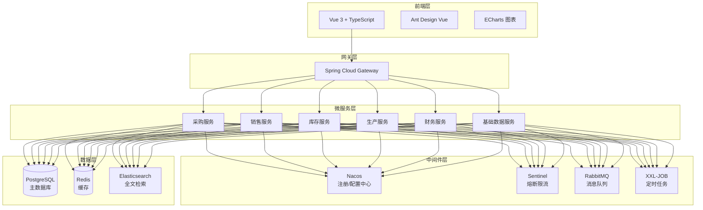

## 一、技术选型总览

| 层级            | 选型方案                       | 版本建议                                  |
| ------------- | -------------------------- | ------------------------------------- |
| **后端语言**      | Java                       | JDK 21 LTS                            |
| **后端框架**      | Spring Boot（模块化单体）              | Spring Boot 4.0.x（4.0.8）；Spring Cloud 2025.x（微服务阶段） |
| **前端框架**      | Vue 3 + TypeScript         | Vue 3.4+                              |
| **前端UI组件库**   | Ant Design Vue             | 4.x                                   |
| **数据库**       | PostgreSQL                 | PostgreSQL 16+（已确定）                   |
| **ORM框架**     | MyBatis-Plus               | 3.5.17（mybatis-plus-spring-boot4-starter + mybatis-plus-jsqlparser） |
| **缓存**        | Redis                      | 8.x                                   |
| **消息队列**      | RabbitMQ / RocketMQ（按需引入）  | 3.12+ / 5.x                           |
| **服务注册与配置中心** | Nacos（微服务阶段）               | 2.x                                   |
| **网关**        | Spring Cloud Gateway（微服务阶段） | 4.x                                   |
| **熔断限流**      | Sentinel（微服务阶段）            | 1.8+                                  |
| **定时任务**      | XXL-JOB（规模化/微服务阶段）         | 2.4+                                  |
| **日志**        | SLF4J + Logback            | -                                     |
| **代码简化**      | Lombok                     | 1.18.46（由 Boot 4.0.8 BOM 托管版本，pom 中不写死版本号；@Slf4j/@Data/@Getter/@Setter/@Builder） |
| **API文档**     | springdoc-openapi          | 3.x（Knife4j 4.x 不兼容 Boot 4）           |
| **容器化**       | Docker + Kubernetes        | K8s 1.28+                             |
| **构建工具**      | Maven                      | 3.9+                                  |
| **版本控制**      | Git                        | -                                     |

## 二、各层级选型详解

### 2.1 后端技术选型

**核心结论：Java + Spring Boot（现阶段模块化单体；Spring Cloud 为微服务阶段演进选型）**

| 对比维度  | Java (Spring) | .NET Core   | Python (Django) | Go        |
| ----- | ------------- | ----------- | --------------- | --------- |
| 企业级生态 | ⭐⭐⭐⭐⭐ 最成熟     | ⭐⭐⭐⭐ 较成熟    | ⭐⭐⭐ 一般          | ⭐⭐ 新兴     |
| 跨平台能力 | ⭐⭐⭐⭐⭐ JVM     | ⭐⭐⭐⭐ 日趋成熟   | ⭐⭐⭐⭐⭐           | ⭐⭐⭐⭐⭐     |
| 并发性能  | ⭐⭐⭐⭐ 优秀       | ⭐⭐⭐⭐ 优秀     | ⭐⭐ 一般           | ⭐⭐⭐⭐⭐ 极强  |
| 开发效率  | ⭐⭐⭐⭐ 高        | ⭐⭐⭐⭐ 高      | ⭐⭐⭐⭐⭐ 极高        | ⭐⭐⭐ 中等    |
| 人才储备  | ⭐⭐⭐⭐⭐ 最丰富     | ⭐⭐⭐⭐ 较丰富    | ⭐⭐⭐⭐ 丰富         | ⭐⭐ 较少     |
| 适用场景  | 大型复杂ERP首选     | Windows生态企业 | 轻量级、快速原型        | 高并发网关/微服务 |

**选型理由：**

1. **Java是企业级ERP的事实标准**。国内主流ERP厂商用友、金蝶的高端版本均基于Java生态构建，SAP部分核心模块也深度依赖Java技术。Java凭借其跨平台性（JVM）、强类型安全和企业级稳定性，已成为中国ERP开发的首选。
2. **Spring Boot/Cloud生态完善**。Spring Boot简化了配置和部署，Spring Cloud提供了完整的微服务解决方案（服务发现、配置管理、熔断降级等），非常适合构建分布式ERP架构。
3. **人才供给充足**。Java开发人员在国内基数最大，招聘和团队扩充成本最低。

### 2.2 前端技术选型

**核心结论：Vue 3 + TypeScript + Ant Design Vue**

| 对比维度     | Vue 3              | React          | Angular       |
| -------- | ------------------ | -------------- | ------------- |
| 学习曲线     | ⭐⭐⭐⭐⭐ 最平缓          | ⭐⭐⭐⭐ 中等        | ⭐⭐ 最陡峭        |
| 生态成熟度    | ⭐⭐⭐⭐⭐ 国内领先         | ⭐⭐⭐⭐⭐ 全球最大     | ⭐⭐⭐⭐ 完整       |
| 开发效率     | ⭐⭐⭐⭐⭐ 极高           | ⭐⭐⭐⭐ 高         | ⭐⭐⭐ 中等        |
| 组件库丰富度   | ⭐⭐⭐⭐⭐ Element/AntD | ⭐⭐⭐⭐⭐ AntD/MUI | ⭐⭐⭐⭐ NG-ZORRO |
| 国内ERP采用率 | ⭐⭐⭐⭐⭐ 最高           | ⭐⭐⭐ 较高         | ⭐⭐ 较低         |
| 大型项目维护   | ⭐⭐⭐⭐ 优秀            | ⭐⭐⭐⭐⭐ 优秀       | ⭐⭐⭐⭐⭐ 优秀      |

**选型理由：**

1. **Vue在国内ERP开发中占据主导地位**。配合Ant Design Vue等成熟的企业级组件库，可以快速搭建美观且交互丰富的管理后台。
2. **Vue 3 + TypeScript**提供了类型安全和更好的IDE支持，Pinia作为新一代状态管理库API极其简洁，适合大型项目的模块化管理。
3. **Ant Design Vue**是国内企业级后台的首选UI组件库之一，提供了大量适合ERP场景的组件（表格、表单、树形结构、弹窗等），能大幅提升开发效率。

### 2.3 数据库选型

**核心结论：PostgreSQL 16+（已确定）**

| 对比维度     | PostgreSQL        | MySQL       | Oracle     |
| -------- | ----------------- | ----------- | ---------- |
| 开源免费     | ⭐⭐⭐⭐⭐             | ⭐⭐⭐⭐⭐       | ⭐ 商业授权     |
| ACID事务   | ⭐⭐⭐⭐⭐ 极强          | ⭐⭐⭐⭐ 强      | ⭐⭐⭐⭐⭐ 极强   |
| 复杂查询能力   | ⭐⭐⭐⭐⭐ JSONB、窗口函数等 | ⭐⭐⭐⭐ 较强     | ⭐⭐⭐⭐⭐      |
| 大数据量处理   | ⭐⭐⭐⭐⭐ 优秀          | ⭐⭐⭐⭐ 良好     | ⭐⭐⭐⭐⭐ 优秀   |
| 运维成本     | ⭐⭐⭐⭐⭐ 低           | ⭐⭐⭐⭐⭐ 低     | ⭐⭐ 高       |
| 集团级ERP适用 | ⭐⭐⭐⭐⭐ 首选          | ⭐⭐⭐⭐ 中小企业主流 | ⭐⭐⭐⭐⭐ 超大集团 |

**选型理由：**

1. **PostgreSQL**在数据一致性、复杂查询方面表现卓越，适合ERP这种对数据准确性要求极高的系统。其JSONB类型支持也为灵活扩展提供了便利。
2. **MySQL 8.0**是国内中小企业自研ERP的主流选择，生态成熟、运维简单。
3. **ERP核心要求**：强事务、数据零错乱、幂等性、版本控制，必须熟练掌握事务隔离级别、乐观锁/悲观锁，杜绝超库存、重复单据等问题。

**建议**：本项目已确定采用 PostgreSQL 16+（Docker 容器部署）。MySQL 8.0 仅作为团队熟悉度优先时的备选记录，不再作为本项目方案。

### 2.4 中间件选型

| 中间件           | 选型                   | 用途                         | 引入阶段 |
| ------------- | -------------------- | -------------------------- | ---- |
| **缓存**        | Redis                | 用户会话、字典缓存、单据锁、高频查询缓存、防重复提交 | **现阶段** |
| **消息队列**      | RabbitMQ / RocketMQ  | 异步单据推送、财务凭证生成、业务消息解耦、削峰容错  | 按需引入（微服务阶段） |
| **服务注册/配置中心** | Nacos                | 服务发现、配置管理、动态参数配置（税率、流程规则等） | 微服务阶段 |
| **熔断限流**      | Sentinel             | 流量控制、熔断降级、接口限流，保障多用户并发稳定   | 微服务阶段 |
| **定时任务**      | XXL-JOB              | 月结结转、库存盘点、数据统计、逾期单据处理      | 规模化/微服务阶段（现阶段用 Spring `@Scheduled`） |
| **网关**        | Spring Cloud Gateway | 统一路由、认证鉴权、限流熔断             | 微服务阶段 |

### 2.5 架构模式

**核心结论：模块化单体（Modular Monolith），5 个 Maven 模块，后续平滑过渡到微服务**

ERP系统业务复杂，涉及采购、销售、库存、生产、财务等多个模块。**现阶段采用模块化单体**：单一 Spring Boot 应用 + 单一 JAR 部署，模块间通过 Java 方法调用（Service 接口），模块划分为 `erp-common` / `erp-system` / `erp-base` / `erp-business` / `erp-bootstrap` 共 5 个 Maven 模块。

**微服务阶段演进方向**（当某个业务模块代码量超过 5000 行或需要独立扩缩容时再拆分）：

- 采购服务
- 销售服务
- 库存服务
- 生产制造服务
- 财务服务
- 基础数据服务
- 系统管理服务（权限、日志）
- 报表服务

> **过渡路径**：`erp-business` 里的包提取为独立模块；Service 方法调用改为 Feign HTTP 调用；单一数据库按服务拆分；单一 JAR 部署改为独立部署 + Nacos 注册。

### 2.6 开发工具与环境

| 工具       | 推荐                  | 说明            |
| -------- | ------------------- | ------------- |
| IDE (后端) | IntelliJ IDEA 2024+ | 建议使用Ultimate版 |
| IDE (前端) | VS Code / WebStorm  | -             |
| 数据库工具    | Navicat / DBeaver   | -             |
| API调试    | Postman / Apifox    | -             |
| 版本控制     | Git + GitLab/Gitea  | -             |
| CI/CD    | Jenkins / GitLab CI | -             |
| 容器编排     | Kubernetes (K8s)    | 生产环境部署（微服务阶段引入） |
| 接口文档     | springdoc-openapi   | 自动生成API文档（Knife4j 4.x 不兼容 Boot 4） |

## 三、技术选型总结

> **说明**：下图为**微服务远期演进形态**。现阶段为模块化单体部署（单一 Spring Boot 应用 + 单库），网关/注册中心/MQ 等组件按上文"引入阶段"逐步引入。

**最终推荐的核心技术栈一句话总结：**

> **Java 21 + Spring Boot 4.0.x（模块化单体）+ MyBatis-Plus 3.5.17 + Vue 3 + TypeScript + Ant Design Vue + PostgreSQL 16 + Redis 8 + springdoc-openapi 3**

现阶段为模块化单体，RabbitMQ、Nacos、Sentinel、XXL-JOB、Gateway、K8s 等微服务组件按"引入阶段"在微服务拆分时引入；这套技术栈成熟稳定、生态完善、人才充足，足以支撑 ERP 全模块（销售、采购、库存、生产、财务）开发，并具备良好的扩展性以应对未来业务增长。

***

