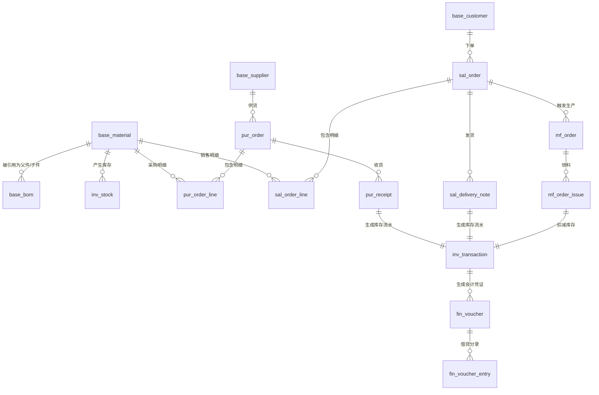

这份设计会覆盖**销售→采购→生产→库存→财务**的全链路，并重点突出ERP的核心——**库存流水（Transaction）**和**业务财务一体化**。

---

# ERP系统数据库表结构设计文档（V1.0）

| 文档属性 | 内容 |
|---------|------|
| 数据库类型 | PostgreSQL 16+ |
| 字符集 | UTF-8 |
| 命名规范 | 小写+下划线分隔，表名单数 |
| 存储引擎 | 默认（PostgreSQL无需指定） |
| 设计原则 | 严禁物理外键（应用层维护）、必备审计字段、金额全精度 |

> **设计哲学**：ERP数据库设计的核心是 **“凭证化”**——即每一笔业务（入库、出库、收款、付款）都必须生成一条不可篡改的流水记录（Transaction），库存/财务余额由流水实时或定时汇总得出，杜绝直接修改余额。

---

## 一、全局必备字段规范（所有表必须包含）

为了节省篇幅，后续表结构中将省略以下字段，但**建表时务必加上**：

```sql
-- 以下字段为每张业务表必须包含（物理字段）
id               BIGSERIAL      PRIMARY KEY           -- 自增主键（或使用雪花算法传入）
create_by        VARCHAR(50)    NOT NULL              -- 创建人（系统用户名/ID）
create_time      TIMESTAMP      NOT NULL DEFAULT NOW()-- 创建时间
update_by        VARCHAR(50)    NOT NULL              -- 修改人
update_time      TIMESTAMP      NOT NULL DEFAULT NOW()-- 修改时间（自动更新）
version          INT            NOT NULL DEFAULT 0    -- 乐观锁版本号
is_deleted       SMALLINT       NOT NULL DEFAULT 0    -- 逻辑删除 0-未删 1-已删
remark           VARCHAR(500)   DEFAULT NULL          -- 备注/说明
```

---

## 二、核心ER图（表关系总览）



---

## 三、基础数据模块（Base）

### 3.1 物料主表 (`base_material`)
> 存储所有原材料、半成品、成品的核心档案。

| 字段名 | 类型 | 约束 | 说明 |
|-------|------|------|------|
| `material_code` | VARCHAR(50) | UNIQUE NOT NULL | 物料编码（业务主键） |
| `material_name` | VARCHAR(200) | NOT NULL | 物料名称 |
| `spec` | VARCHAR(200) | | 规格型号 |
| `category_id` | BIGINT | FK | 分类ID（物料分类树） |
| `material_type` | SMALLINT | NOT NULL | 1-原材料 2-半成品 3-成品 4-辅料 |
| `source_type` | SMALLINT | NOT NULL | 1-自制 2-外购 3-外协 |
| `unit` | VARCHAR(10) | NOT NULL | 计量单位（个/套/公斤） |
| `standard_cost` | DECIMAL(20,6) | | 标准成本（财务核算用） |
| `safety_stock` | DECIMAL(20,6) | DEFAULT 0 | 安全库存量 |
| `min_order_qty` | DECIMAL(20,6) | DEFAULT 1 | 最小采购批量 |
| `abc_class` | CHAR(1) | | A/B/C类（A高价值重点管控） |
| `lead_time` | INT | | 采购/生产提前期（天） |
| `is_batch_managed` | BOOLEAN | DEFAULT FALSE | 是否启用批次管理 |
| `is_shelf_life` | BOOLEAN | DEFAULT FALSE | 是否启用保质期管理 |
| `shelf_life_days` | INT | | 保质期天数 |
| `status` | SMALLINT | DEFAULT 0 | 0-新建 1-审核 2-启用 3-停用 |

**索引建议**：`idx_material_code`（唯一）, `idx_category_id`, `idx_material_type`。

---

### 3.2 BOM主表 (`base_bom`)
> BOM（物料清单）的头信息。

| 字段名 | 类型 | 约束 | 说明 |
|-------|------|------|------|
| `bom_code` | VARCHAR(50) | UNIQUE NOT NULL | BOM编号 |
| `parent_material_id` | BIGINT | NOT NULL | 父件物料ID（成品/半成品） |
| `version` | VARCHAR(20) | NOT NULL | BOM版本号（如 V1.0） |
| `quantity` | DECIMAL(20,6) | DEFAULT 1 | 父件数量（通常为1） |
| `status` | SMALLINT | DEFAULT 0 | 0-草稿 1-审核 2-生效 |
| `effective_date` | DATE | | 生效日期 |
| `expiry_date` | DATE | | 失效日期 |

### 3.3 BOM明细表 (`base_bom_item`)
> BOM的组成明细（父子关系）。

| 字段名 | 类型 | 约束 | 说明 |
|-------|------|------|------|
| `bom_id` | BIGINT | NOT NULL | 所属BOM头 |
| `child_material_id` | BIGINT | NOT NULL | 子件物料ID |
| `child_qty` | DECIMAL(20,6) | NOT NULL | 用量（如 2 个） |
| `loss_rate` | DECIMAL(5,2) | DEFAULT 0 | 损耗率（%） |
| `scrap_rate` | DECIMAL(5,2) | DEFAULT 0 | 报废率（%） |
| `sequence` | INT | | 工序顺序（加工步骤） |
| `is_alternative` | BOOLEAN | DEFAULT FALSE | 是否为替代料 |
| `alternative_priority` | INT | | 替代优先级（1最高） |

**唯一约束**：`UNIQUE(bom_id, child_material_id)`。

---

## 四、销售模块（Sales）

### 4.1 销售订单主表 (`sal_order`)

| 字段名 | 类型 | 约束 | 说明 |
|-------|------|------|------|
| `order_code` | VARCHAR(50) | UNIQUE NOT NULL | 销售订单号（如 SO202608001） |
| `customer_id` | BIGINT | NOT NULL | 客户ID |
| `order_date` | DATE | NOT NULL | 下单日期 |
| `required_date` | DATE | NOT NULL | 客户要求交货日期 |
| `promised_date` | DATE | | 承诺交货日期 |
| `total_amount` | DECIMAL(20,6) | NOT NULL | 订单总金额（含税） |
| `currency` | VARCHAR(3) | DEFAULT 'CNY' | 币别 |
| `tax_rate` | DECIMAL(5,2) | DEFAULT 13.00 | 税率% |
| `payment_terms` | VARCHAR(50) | | 付款条件（月结30天等） |
| `order_status` | SMALLINT | DEFAULT 0 | 0-草稿 1-审核 2-部分发货 3-已发货 4-已关闭 |
| `approval_status` | SMALLINT | DEFAULT 0 | 0-待审 1-通过 2-驳回 |

### 4.2 销售订单明细表 (`sal_order_line`)

| 字段名 | 类型 | 约束 | 说明 |
|-------|------|------|------|
| `order_id` | BIGINT | NOT NULL | 关联订单主表ID |
| `line_no` | INT | NOT NULL | 行号（1,2,3...） |
| `material_id` | BIGINT | NOT NULL | 物料ID |
| `qty` | DECIMAL(20,6) | NOT NULL | 数量 |
| `unit_price` | DECIMAL(20,6) | NOT NULL | 单价（不含税） |
| `tax_amount` | DECIMAL(20,6) | | 税额 |
| `line_amount` | DECIMAL(20,6) | NOT NULL | 行总金额（含税） |
| `delivered_qty` | DECIMAL(20,6) | DEFAULT 0 | 已发货数量 |
| `invoiced_qty` | DECIMAL(20,6) | DEFAULT 0 | 已开票数量 |

---

## 五、采购模块（Purchase）

### 5.1 采购订单主表 (`pur_order`)

| 字段名 | 类型 | 约束 | 说明 |
|-------|------|------|------|
| `order_code` | VARCHAR(50) | UNIQUE NOT NULL | 采购订单号（如 PO202608001） |
| `supplier_id` | BIGINT | NOT NULL | 供应商ID |
| `order_date` | DATE | NOT NULL | 下单日期 |
| `required_date` | DATE | NOT NULL | 要求到货日期 |
| `total_amount` | DECIMAL(20,6) | NOT NULL | 订单总金额 |
| `tax_rate` | DECIMAL(5,2) | DEFAULT 13.00 | 税率 |
| `payment_terms` | VARCHAR(50) | | 付款条件 |
| `order_status` | SMALLINT | DEFAULT 0 | 0-草稿 1-审核 2-部分收货 3-已收货 4-已关闭 |
| `settlement_status` | SMALLINT | DEFAULT 0 | 0-未结算 1-部分结算 2-已结算（财务用） |

### 5.2 采购订单明细表 (`pur_order_line`)
结构同销售明细，关联 `order_id`，核心字段：`material_id`, `qty`, `unit_price`, `received_qty`, `line_amount`。

### 5.3 采购收货单 (`pur_receipt`)
> 货物到厂后的收货记录，连接质检。

| 字段名 | 类型 | 约束 | 说明 |
|-------|------|------|------|
| `receipt_code` | VARCHAR(50) | UNIQUE NOT NULL | 收货单号 |
| `pur_order_id` | BIGINT | NOT NULL | 关联采购订单 |
| `supplier_id` | BIGINT | NOT NULL | 供应商 |
| `receipt_date` | TIMESTAMP | NOT NULL | 收货时间 |
| `warehouse_id` | BIGINT | NOT NULL | 目标仓库 |
| `material_id` | BIGINT | NOT NULL | 物料 |
| `receipt_qty` | DECIMAL(20,6) | NOT NULL | 收货数量 |
| `qualified_qty` | DECIMAL(20,6) | | 合格数量 |
| `reject_qty` | DECIMAL(20,6) | | 不合格数量 |
| `batch_no` | VARCHAR(50) | | 供应商批次号 |
| `production_date` | DATE | | 生产日期（保质期用） |
| `status` | SMALLINT | DEFAULT 0 | 0-待检 1-合格入库 2-部分合格 3-退货 |

---

## 六、库存模块（Inventory）⭐⭐⭐核心⭐⭐⭐

### 6.1 即时库存表 (`inv_stock`)
> 当前时刻各物料在各仓库的存量快照。

| 字段名 | 类型 | 约束 | 说明 |
|-------|------|------|------|
| `material_id` | BIGINT | NOT NULL | 物料ID |
| `warehouse_id` | BIGINT | NOT NULL | 仓库ID |
| `location_id` | BIGINT | | 库位ID（精细化管理） |
| `batch_no` | VARCHAR(50) | | 批次号（启用批次管理时非空） |
| `qty` | DECIMAL(20,6) | NOT NULL DEFAULT 0 | 实际库存数量 |
| `frozen_qty` | DECIMAL(20,6) | DEFAULT 0 | 冻结数量（质检/预留占用） |
| `last_transaction_time` | TIMESTAMP | | 最后变动时间 |

**唯一索引**：`UNIQUE(material_id, warehouse_id, location_id, batch_no)`。

### 6.2 库存流水表 (`inv_transaction`) —— **ERP最重要的表之一**
> 记录每一次库存变动的凭证，**只插入，不修改，不删除**。

| 字段名 | 类型 | 约束 | 说明 |
|-------|------|------|------|
| `trans_code` | VARCHAR(50) | UNIQUE NOT NULL | 流水号（全局唯一） |
| `material_id` | BIGINT | NOT NULL | 物料ID |
| `warehouse_id` | BIGINT | NOT NULL | 仓库ID |
| `location_id` | BIGINT | | 库位ID |
| `batch_no` | VARCHAR(50) | | 批次号 |
| `trans_type` | SMALLINT | NOT NULL | 10-采购入库 20-生产入库 30-销售出库 40-生产领料 50-调拨入库 60-调拨出库 70-盘盈 80-盘亏 |
| `source_biz_type` | VARCHAR(30) | | 来源单据类型（如 PURCHASE_RECEIPT） |
| `source_biz_id` | BIGINT | | 来源单据主键ID（关联采购收货单/工单等） |
| `in_qty` | DECIMAL(20,6) | DEFAULT 0 | 入库数量（增） |
| `out_qty` | DECIMAL(20,6) | DEFAULT 0 | 出库数量（减） |
| `before_qty` | DECIMAL(20,6) | NOT NULL | 变动前库存 |
| `after_qty` | DECIMAL(20,6) | NOT NULL | 变动后库存 |
| `unit_cost` | DECIMAL(20,6) | | 移动加权平均成本（财务用） |
| `trans_time` | TIMESTAMP | NOT NULL | 业务发生时间 |

**重要索引**：`idx_material_warehouse`, `idx_source_biz`, `idx_trans_time`。

---

## 七、生产制造模块（Manufacturing）

### 7.1 生产工单主表 (`mf_order`)

| 字段名 | 类型 | 约束 | 说明 |
|-------|------|------|------|
| `work_order_code` | VARCHAR(50) | UNIQUE NOT NULL | 工单号（如 MO202608001） |
| `sal_order_id` | BIGINT | | 关联销售订单ID（MTO模式） |
| `material_id` | BIGINT | NOT NULL | 产成品物料ID |
| `bom_id` | BIGINT | NOT NULL | 下达时所锁定的BOM版本ID |
| `planned_qty` | DECIMAL(20,6) | NOT NULL | 计划生产数量 |
| `completed_qty` | DECIMAL(20,6) | DEFAULT 0 | 累计完工数量 |
| `scrapped_qty` | DECIMAL(20,6) | DEFAULT 0 | 报废数量 |
| `planned_start_date` | DATE | NOT NULL | 计划开工日期 |
| `planned_end_date` | DATE | NOT NULL | 计划完工日期 |
| `actual_start_date` | TIMESTAMP | | 实际开工时间 |
| `actual_end_date` | TIMESTAMP | | 实际完工时间 |
| `order_status` | SMALLINT | DEFAULT 0 | 0-计划 1-已下达 2-生产中 3-已完工 4-已关闭 |

### 7.2 生产领料单 (`mf_order_issue`)
> 工单从仓库领料出库的记录。

| 字段名 | 类型 | 约束 | 说明 |
|-------|------|------|------|
| `issue_code` | VARCHAR(50) | UNIQUE NOT NULL | 领料单号 |
| `work_order_id` | BIGINT | NOT NULL | 关联工单 |
| `material_id` | BIGINT | NOT NULL | 子件物料ID |
| `planned_qty` | DECIMAL(20,6) | NOT NULL | 定额应领数量（BOM计算） |
| `actual_qty` | DECIMAL(20,6) | NOT NULL | 实际领料数量 |
| `warehouse_id` | BIGINT | NOT NULL | 出库仓库 |
| `batch_no` | VARCHAR(50) | | 批次号 |

> **触发逻辑**：领料单审核通过时，自动生成一条 `inv_transaction`（出库类型 40），扣减库存。

---

## 八、财务模块（Finance）⭐⭐⭐核心⭐⭐⭐

### 8.1 会计科目表 (`fin_subject`)

| 字段名 | 类型 | 约束 | 说明 |
|-------|------|------|------|
| `subject_code` | VARCHAR(20) | UNIQUE NOT NULL | 科目编码（如 1002-银行存款） |
| `subject_name` | VARCHAR(100) | NOT NULL | 科目名称 |
| `parent_id` | BIGINT | | 父级科目ID（树形结构） |
| `subject_level` | SMALLINT | NOT NULL | 层级（1-4级） |
| `is_leaf` | BOOLEAN | DEFAULT TRUE | 是否为叶子科目（可记账） |
| `subject_direction` | SMALLINT | NOT NULL | 1-借方 2-贷方（科目方向） |

### 8.2 会计凭证主表 (`fin_voucher`)
> 业务单据与财务的桥梁。

| 字段名 | 类型 | 约束 | 说明 |
|-------|------|------|------|
| `voucher_code` | VARCHAR(50) | UNIQUE NOT NULL | 凭证号（如 FZ202608001） |
| `voucher_date` | DATE | NOT NULL | 记账日期 |
| `period` | VARCHAR(6) | NOT NULL | 会计期间（如 202608） |
| `source_biz_type` | VARCHAR(30) | NOT NULL | 来源业务类型（PURCHASE/SALES/ISSUE等） |
| `source_biz_id` | BIGINT | NOT NULL | 来源单据ID |
| `total_debit` | DECIMAL(20,6) | NOT NULL | 借方总额 |
| `total_credit` | DECIMAL(20,6) | NOT NULL | 贷方总额 |
| `voucher_status` | SMALLINT | DEFAULT 0 | 0-草稿 1-已过账（不可修改） |

### 8.3 会计凭证分录表 (`fin_voucher_entry`)
> 具体的借贷行，实现 **“借：原材料 贷：应付账款”**。

| 字段名 | 类型 | 约束 | 说明 |
|-------|------|------|------|
| `voucher_id` | BIGINT | NOT NULL | 关联凭证主表 |
| `line_no` | INT | NOT NULL | 行号 |
| `subject_id` | BIGINT | NOT NULL | 科目ID |
| `direction` | SMALLINT | NOT NULL | 1-借 2-贷 |
| `amount` | DECIMAL(20,6) | NOT NULL | 金额 |
| `summary` | VARCHAR(200) | | 摘要说明 |

### 8.4 应收账款/应付账款辅助表（可选，但建议有）
> 用于账龄分析和往来对账，可通过凭证实时汇总，也可单独维护。

| 表名 | 核心字段 | 说明 |
|------|---------|------|
| `fin_receivable` | `customer_id`, `voucher_id`, `amount`, `received_amount`, `due_date`, `status` | 应收立账及回款核销 |
| `fin_payable` | `supplier_id`, `voucher_id`, `amount`, `paid_amount`, `due_date`, `status` | 应付立账及付款核销 |

---

## 九、MRP运算结果表（MRP）

### 9.1 MRP计划主表 (`mf_mrp_plan`)

| 字段名 | 类型 | 约束 | 说明 |
|-------|------|------|------|
| `plan_code` | VARCHAR(50) | UNIQUE NOT NULL | 计划运行批次号 |
| `sal_order_id` | BIGINT | | 触发的销售订单（若为订单跑MRP） |
| `run_time` | TIMESTAMP | NOT NULL | 运算时间 |
| `plan_status` | SMALLINT | DEFAULT 0 | 0-新生成 1-已转采购/生产 2-已关闭 |

### 9.2 MRP计划明细 (`mf_mrp_plan_item`)

| 字段名 | 类型 | 约束 | 说明 |
|-------|------|------|------|
| `plan_id` | BIGINT | NOT NULL | 关联计划主表 |
| `material_id` | BIGINT | NOT NULL | 物料ID |
| `planned_qty` | DECIMAL(20,6) | NOT NULL | 建议数量 |
| `suggest_type` | SMALLINT | NOT NULL | 1-采购 2-生产 |
| `suggest_start_date` | DATE | | 建议开始日期 |
| `suggest_end_date` | DATE | | 建议完成日期 |
| `converted_status` | SMALLINT | DEFAULT 0 | 0-未转 1-已转采购单 2-已转工单 |

---

## 十、DDL示例（关键表建表SQL）

以最核心的 **库存流水表（inv_transaction）** 为例，展示完整的PostgreSQL建表语句：

```sql
CREATE TABLE inv_transaction (
    id                  BIGSERIAL       PRIMARY KEY,
    trans_code          VARCHAR(50)     NOT NULL UNIQUE,
    material_id         BIGINT          NOT NULL,
    warehouse_id        BIGINT          NOT NULL,
    location_id         BIGINT,
    batch_no            VARCHAR(50),
    trans_type          SMALLINT        NOT NULL,
    source_biz_type     VARCHAR(30),
    source_biz_id       BIGINT,
    in_qty              DECIMAL(20,6)   DEFAULT 0,
    out_qty             DECIMAL(20,6)   DEFAULT 0,
    before_qty          DECIMAL(20,6)   NOT NULL,
    after_qty           DECIMAL(20,6)   NOT NULL,
    unit_cost           DECIMAL(20,6),
    trans_time          TIMESTAMP       NOT NULL DEFAULT NOW(),
    
    -- 全局必备字段（这里显式写出以便复制）
    create_by           VARCHAR(50)     NOT NULL,
    create_time         TIMESTAMP       NOT NULL DEFAULT NOW(),
    update_by           VARCHAR(50)     NOT NULL,
    update_time         TIMESTAMP       NOT NULL DEFAULT NOW(),
    version             INT             NOT NULL DEFAULT 0,
    is_deleted          SMALLINT        NOT NULL DEFAULT 0,
    remark              VARCHAR(500)
);

-- 索引
CREATE INDEX idx_trans_material ON inv_transaction (material_id);
CREATE INDEX idx_trans_source ON inv_transaction (source_biz_type, source_biz_id);
CREATE INDEX idx_trans_time ON inv_transaction (trans_time);
COMMENT ON TABLE inv_transaction IS '库存流水账（只增不改，所有库存变动的审计凭证）';
```

---

## 十一、关键设计决策说明

| 决策点 | 方案 | 理由 |
|-------|------|------|
| **物理外键** | 禁止使用 `FOREIGN KEY` 约束 | ERP高并发下外键锁表严重影响性能，由应用层（Service）保证数据一致性 |
| **金额精度** | `DECIMAL(20,6)` | 6位小数满足汇率换算（如日元），前端展示四舍五入为2位 |
| **库存设计** | 流水表（Transaction） + 快照表（Stock） | 流水表用于审计追溯和冲销，快照表用于快速查询；两者需每日对账 |
| **逻辑删除** | `is_deleted` 软删除 | 业务单据（如订单）涉及财务凭证，永久物理删除会导致账务追溯链断裂 |
| **主键策略** | `BIGSERIAL`（自增）或雪花算法 | 前期可使用自增，后期分布式推荐雪花算法（由应用层生成传入） |
| **时间字段** | `TIMESTAMP` | PostgreSQL的 `TIMESTAMP` 不带时区，统一存储为UTC或应用层转换，避免时区混乱 |

---
