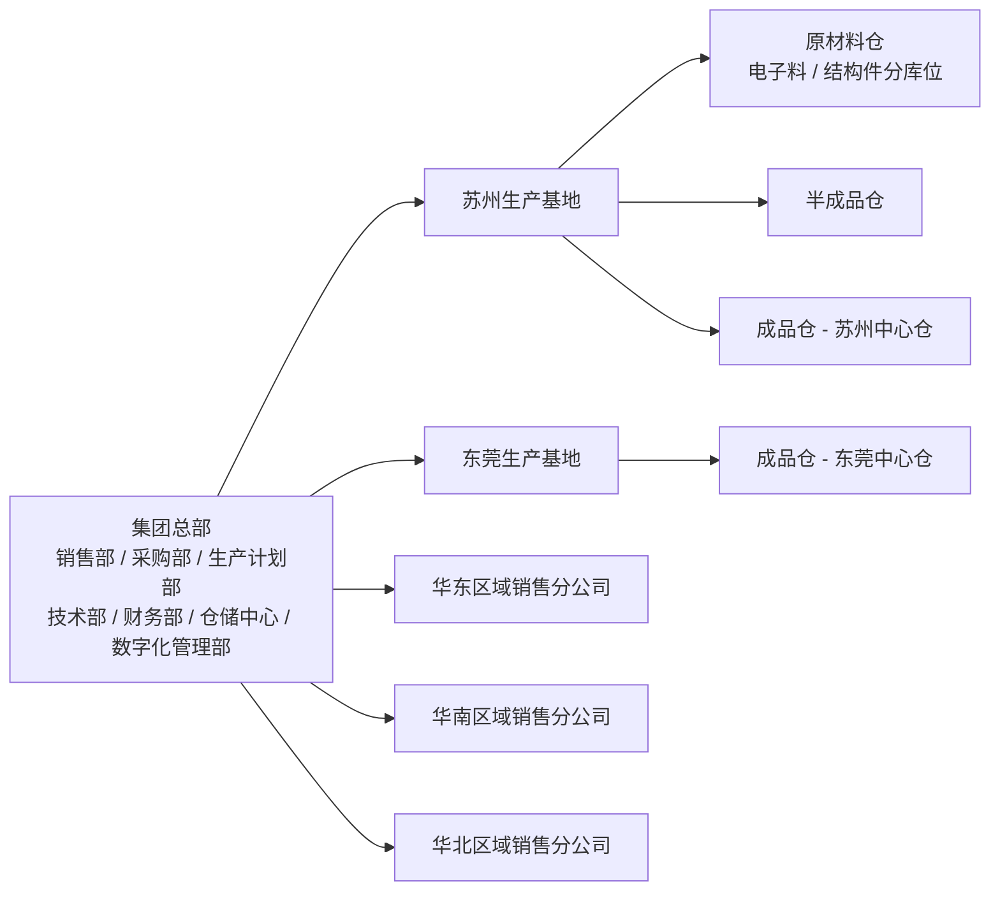
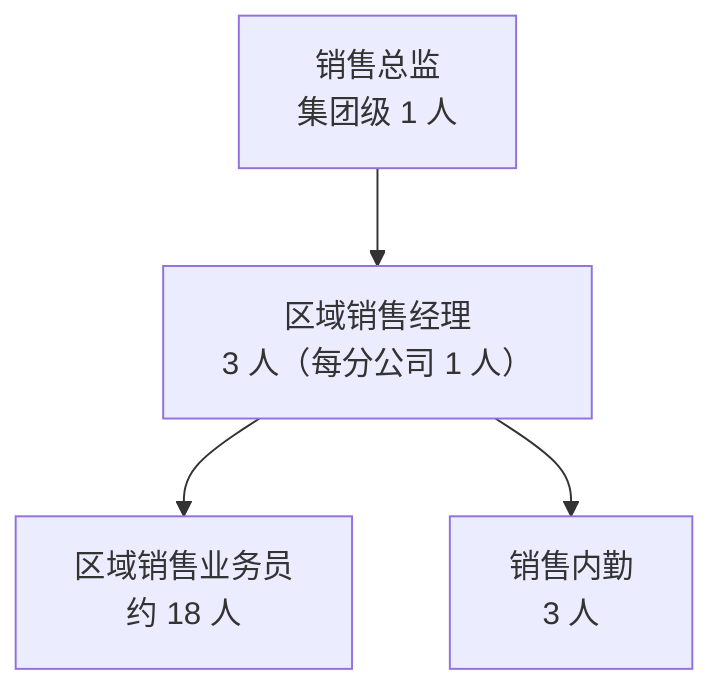
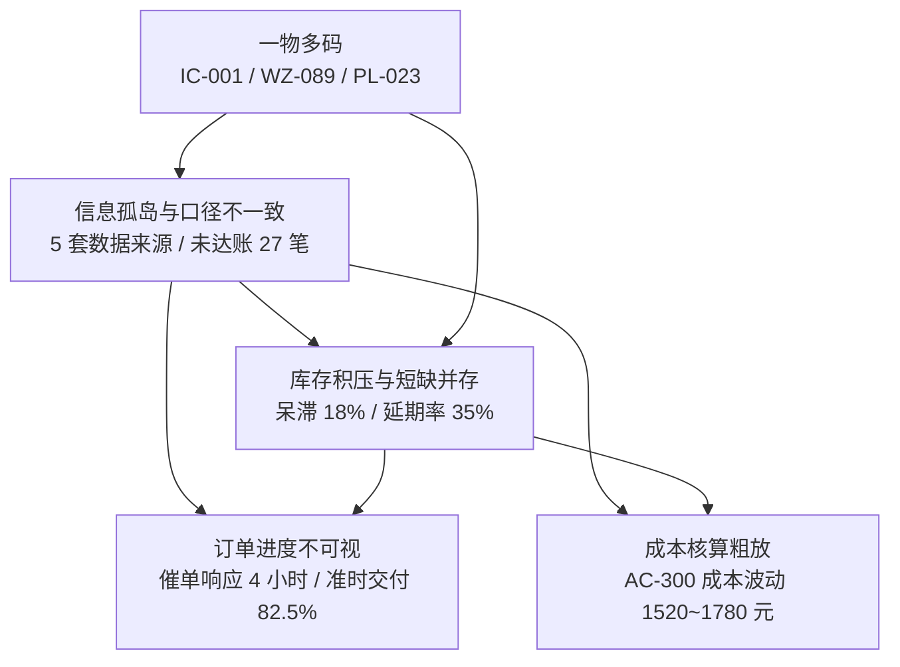
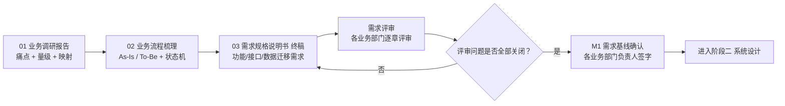

# 业务调研报告

| 文档属性 | 内容 |
|---------|------|
| 文档名称 | 业务调研报告 |
| 文档编号 | ERP-P1-01 |
| 版本 | V1.0 |
| 状态 | 已评审 |
| 编制部门 | 数字化管理部 |
| 编制日期 | 2026年9月 |
| 所属阶段 | 阶段一 需求确认（第 1-2 月） |
| 关联里程碑 | M1 需求基线确认 |
| 适用范围 | 集团总部、2 个生产基地、3 个区域销售分公司、4 个中心仓库；销售、采购、库存、生产制造、财务管理五大业务域及共享主数据 |
| 参考基线 | 《企业资源计划ERP系统需求规格说明书》V1.0、《ERP系统开发阶段计划文档》V1.0 |

---

## 一、文档定位

### 1.1 本报告在阶段一中的位置

本报告是阶段一「需求确认」的交付物之一，对应《ERP系统开发阶段计划文档》阶段一核心任务 **1.1 业务调研**。

- 输入基线：`docs/企业资源计划ERP系统需求规格说明书.md`（**只读引用**，本报告不修改该文档的任何内容）。
- 本报告的作用：在需求基线之上**补全调研证据链**——即说明"需求从哪里来、痛点在哪里发生、量级有多大、由谁确认"，使需求条目具备可追溯的业务事实支撑。
- 输出流向：本报告的痛点与量级结论 → `02-业务流程梳理-As-Is与To-Be.md` → `03-需求规格说明书-终稿.md` → 业务部门逐章评审 → 各业务部门负责人签字（M1）。
- 边界声明：本报告不新增、不删减《企业资源计划ERP系统需求规格说明书》的功能范围；所有改进诉求均映射到需求说明书已有编号体系（MD/BOM/CS/SAL/PUR/INV/MFG/FIN/RPT），映射表见第四章各节与第五章。

### 1.2 数据口径说明

本报告中的量级数据分两类，二者不冲突：

| 类别 | 来源 | 使用方式 |
|------|------|---------|
| 基线数据 | 《企业资源计划ERP系统需求规格说明书》第七章「数据迁移需求」：物料 ~8,000 条、BOM ~3,500 个、客户 ~600 家、供应商 ~300 家、未结销售订单 ~120 单、未结采购订单 ~80 单 | 直接引用，不得改动 |
| 现场采集数据 | 现场访谈、跟单观察、现有 Excel/纸质台账抽样统计、现有系统截图与导出数据分析 | 作为流程设计与性能设计的输入 |
| 改进目标数据 | 《企业资源计划ERP系统需求规格说明书》1.2 项目目标的量化指标（库存准确率 ≥99.5%、呆滞库存占比降至 8% 以下、业务财务一体化、供应链全程可视化、成本精细核算） | 引用为跨域改进目标 |
| 内部控制目标 | 除上述量化指标外，调研期间与业务部门共同确认的内部控制目标（如订单准时交付率、紧急采购占比、月结工作日数） | 作为内控目标，不改变基线需求条目 |

---

## 二、调研概况

### 2.1 调研目标

| 序号 | 目标 | 可验证的达成标准 |
|------|------|-----------------|
| G1 | 摸清五大业务域现状（组织、工具、量级、单据流转） | 五大域各输出一份访谈纪要 + 一份跟单观察记录 |
| G2 | 识别并量化现状痛点 | 输出域内痛点清单（每域 6 条，共 30 条），每条含影响与需求编号映射 |
| G3 | 识别跨域共性问题 | 输出 5 个跨域专题，每个专题含量化现状与改进目标 |
| G4 | 核对主数据与业务量级 | 输出《数据量级核对表》，7 类迁移对象量级与需求说明书第七章一致 |
| G5 | 形成需求编写的事实依据 | 全部改进诉求可映射到需求编号，映射覆盖率 100%，无超出范围的新增需求 |

### 2.2 调研方法

| 方法 | 具体做法 | 覆盖对象 | 产出物 |
|------|---------|---------|--------|
| 现场访谈（结构化） | 按岗位设计访谈提纲，1 对 1 访谈为主、小组访谈为辅，全程记录并当场确认 | 15 类岗位，累计 42 人次 | 各域访谈纪要 |
| 问卷调研 | 线上问卷，覆盖一线操作岗位，回收后统计痛点频次分布 | 发放 60 份，回收 58 份（回收率 96.7%） | 问卷统计表 |
| 跟单观察（影子跟单） | 调研人员全程跟随一名业务员/仓管员/车间调度，记录单据流转与等待时间 | 华东分公司订单受理、苏州基地仓库收发存、东莞基地车间领料报工 | 跟单观察记录 |
| 系统与截图分析 | 收集现有 Excel 模板、纸质台账扫描件、独立排产系统与财务软件截屏、导出数据抽样统计 | 销售/采购/仓库/排产/财务共 5 套数据来源 | 现有系统与数据资产清单 |
| 数据量级核对 | 对现有台账与旧系统导出数据做条数统计与字段完整率抽样 | 物料、BOM、客商、未结订单、即时库存 | 数据量级核对表 |
| 跨域专题研讨 | 组织跨部门研讨，聚焦跨域断点与口径冲突，逐条形成改进目标 | 销售、采购、仓储、生产、财务、IT 六方 | 跨域专题纪要（一）（二） |

### 2.3 调研周期

调研周期为阶段一第 1-2 月（2026 年 8 月—9 月），分四个阶段推进：

| 阶段 | 时间 | 主要工作 | 退出标准 |
|------|------|---------|---------|
| 调研准备 | 第 1 月第 1 周 | 立项交底、干系人名单确认、访谈提纲与问卷设计、现有资料收集 | 《调研计划》与访谈提纲评审通过 |
| 现场调研 | 第 1 月第 2 周—第 2 月第 1 周 | 总部与分公司访谈、两大基地跟单观察、问卷发放与回收 | 五大域访谈纪要与跟单观察记录齐备 |
| 专题研讨 | 第 2 月第 2-3 周 | 跨域专题研讨、数据量级核对、痛点—需求映射确认 | 5 个跨域专题结论形成、映射表确认 |
| 结论确认 | 第 2 月第 4 周 | 调研结论宣讲、干系人逐项确认、移交流程梳理 | 《调研结论确认单》签署 |

### 2.4 调研范围

调研范围与《企业资源计划ERP系统需求规格说明书》「适用范围」一致：

调研覆盖的基础信息：

| 维度 | 调研值（与基线一致） |
|------|--------------------|
| 组织范围 | 集团总部 + 2 个生产基地（苏州、东莞）+ 3 个区域销售分公司（华东、华南、华北） |
| 仓库范围 | 4 个中心仓库：原材料仓、半成品仓、成品仓-苏州中心仓、成品仓-东莞中心仓 |
| 人员规模 | 约 450 人 |
| 年产值 | 约 3.2 亿元 |
| 产品种类 | 约 200 余种，单产品平均由 80~150 种零部件组装而成 |
| 主数据量级 | 物料 ~8,000 条、BOM ~3,500 个（迁移基线）；客户 ~600 家、供应商 ~300 家（迁移基线） |
| 在办订单量级 | 未结销售订单 ~120 单、未结采购订单 ~80 单（迁移基线） |
| 未纳入范围 | CRM、MES、PLM、电商平台对接（与需求说明书 1.3 范围界定一致） |
| 外部集成 | OA 系统（审批流，双向）、税控开票系统（发票状态，单向入 ERP） |

---

## 三、调研干系人与访谈清单

### 3.1 干系人构成

| 序号 | 业务域 | 部门 | 岗位 | 访谈人数 | 核心关注点 | 访谈要点 |
|------|--------|------|------|---------|-----------|---------|
| 1 | 全局 | 集团管理层 | 总经理 | 1 | 经营可视化与决策效率 | 经营仪表盘指标口径（RPT-01）、订单交付与毛利可视性、月结时效 |
| 2 | 销售 | 销售部 | 销售总监 | 1 | 接单风险与价格管控 | 信用额度红线、授权价区间、订单评审节点、客户分类维度（CS-03） |
| 3 | 销售 | 区域销售分公司 | 区域销售业务员 | 6（每分公司 2 人） | 下单效率与催单响应 | 订单录入字段、分批交货计划表达方式、报价来源、交期答复依据 |
| 4 | 销售 | 财务部 | 应收会计 | 1 | 信用与回款 | 信用额度占用规则、账龄口径、催收触发条件（FIN-02） |
| 5 | 采购 | 采购部 | 采购经理 | 1 | 采购成本与合规 | 采购申请审批权限、价格审批、供应商评级（PUR-08）、紧急采购管控 |
| 6 | 采购 | 采购部 | 采购员 | 3 | 询价比价与到货跟踪 | 价格历史获取方式、采购提前期来源、到货与质检衔接（PUR-03） |
| 7 | 采购 | 采购部 | 采购申请提报人（车间/仓库兼） | 2 | 需求提报及时性 | 需求来源、批量提报习惯、MRP 建议转申请的可接受度（PUR-01） |
| 8 | 库存 | 仓储中心 | 仓库主管 | 1 | 账实一致与库容 | 盘点周期可行性（INV-06）、库位管理颗粒度、呆滞判定阈值（INV-08） |
| 9 | 库存 | 仓储中心 | 仓管员 | 4（每仓库 1 人） | 收发货效率与批次追溯 | 收发货单据字段、批次号来源、先进先出执行障碍（INV-04） |
| 10 | 库存 | 质量部 | 质检员 | 2 | 检验判定与不合格处置 | 检验项目、合格/不合格数量判定、隔离仓与退货流程（PUR-03/PUR-04） |
| 11 | 生产 | 生产计划部 | 生产计划员 | 2 | 排产与齐套性 | 排产依据、插单频次、MRP 参数期望（MFG-02）、缺料预警 |
| 12 | 生产 | 生产基地车间 | 车间主任 | 2（每基地 1 人） | 领料定额与报工 | 领料方式、超定额审批、工序划分与报工颗粒度（MFG-06） |
| 13 | 生产 | 技术部 | BOM 工程师 | 2 | BOM 维护与版本 | BOM 层级、损耗率取值（BOM-02）、版本生效规则（BOM-03）、替代料（BOM-04） |
| 14 | 财务 | 财务部 | 成本会计 | 1 | 成本归集与核算 | 材料/人工/制造费用归集口径、存货计价方法（FIN-04）、工单成本（FIN-05） |
| 15 | 财务 | 财务部 | 总账会计 | 1 | 凭证与月结 | 凭证模板、科目映射、暂估与红冲（PUR-06）、期间关闭（FIN-08） |
| 16 | 财务 | 财务部 | 财务经理 | 1 | 报表与内控 | 三大报表口径（FIN-07）、账龄分析维度、付款审批链 |
| 17 | IT | 数字化管理部 | IT 管理员 | 2 | 系统边界与数据安全 | 现有系统清单、OA/税控接口方式、权限与数据级授权（等保三级要求） |
| 18 | 全局 | 数字化转型小组 | 项目负责人 | 1 | 范围与进度 | 范围冻结、变更流程、验收标准（需求说明书第九章） |

### 3.2 访谈规则

- **一岗一提纲**：访谈提纲按岗位定制，覆盖"当前怎么做—痛点在哪—期望怎么改—量级多大"四段式。
- **当场确认**：访谈结论当场向被访谈人复述确认，形成纪要并由被访谈人确认。
- **双人记录**：每场访谈由 1 人主问、1 人记录，记录内容区分"事实描述"与"主观期望"。
- **跟单交叉验证**：访谈中陈述的流转方式须与跟单观察结果交叉验证，不一致之处二次确认。

---

## 四、五大业务域调研详情

### 4.1 销售管理域

#### 4.1.1 组织与岗位构成

| 岗位 | 人数 | 职责 | 涉及系统/工具 |
|------|------|------|--------------|
| 销售总监 | 1 | 接单审批、价格特批、区域目标管理 | Excel 汇总表 |
| 区域销售经理 | 3 | 区域订单审核、客户维护 | 本区域 Excel 台账 |
| 区域销售业务员 | 约 18 | 接单、报价、交期答复、催单跟进 | 个人 Excel 台账、个人价目表 |
| 销售内勤 | 3 | 台账汇总、对账、发货协调 | 本区域 Excel 台账、微信/电话 |

#### 4.1.2 现有系统与工具

| 工具 | 用途 | 覆盖范围 | 主要缺陷 |
|------|------|---------|---------|
| Excel 销售订单台账 | 订单登记与跟踪 | 3 个分公司各一套，模板不统一 | 无校验、无权限控制、编号规则各异 |
| Excel 价目表 | 报价依据 | 业务员个人维护 | 版本分散，历史价格不可追溯 |
| 独立排产系统（只读） | 查询生产进度 | 生产部内部使用 | 销售部无账号，仅能电话询问 |
| 现有财务软件（独立总账） | 收入登记与应收 | 财务部使用 | 与销售台账无接口，月底人工汇总 |
| 微信/电话/邮件 | 交期答复、催单、发货通知 | 全流程 | 无留痕，事后无法追溯 |

#### 4.1.3 业务量级

| 指标 | 调研值 | 说明 |
|------|-------|------|
| 年销售订单量 | 约 4,800 单（月均约 400 单） | 现场采集 |
| 年发货次数 | 约 5,600 次（分批交货占比较高） | 现场采集 |
| 客户总数 | ~600 家（迁移基线） | 与需求说明书第七章一致 |
| 客户分类维度 | 地区、行业、规模 3 类 | 对应 CS-03 |
| 未结销售订单 | ~120 单（迁移基线） | 与需求说明书第七章一致 |
| 订单平均行数 | 2.6 行/单 | 现场采集 |
| 分批交货订单占比 | 约 38% | 现场采集（如申达电气 100 台分 9/20、9/30 两批） |
| 月均退货单 | 约 12 单 | 现场采集（对应 SAL-06） |
| 典型订单 | AC-300 变频器 100 台、单价 1,850 元/台、月结 60 天 | 与需求说明书 4.2 场景一致 |

#### 4.1.4 现有单据流转方式

| 环节 | 发起 | 经过 | 结束 | 载体 |
|------|------|------|------|------|
| 接单 | 客户电话/邮件 | 业务员记入个人 Excel → 口头/邮件请示销售总监 | 业务员答复客户交期 | Excel + 邮件 |
| 报价 | 业务员 | 查个人价目表 → 超区间时请示销售总监 | 报价确认（无留痕） | Excel |
| 交期确认 | 业务员 | 电话询问生产计划员 → 计划员查排产系统 | 口头答复 | 电话 |
| 发货 | 业务员 | 邮件/微信通知仓库 → 仓管员核对成品库存 → 手工出库单 | 发货完成 | 邮件 + 纸质 |
| 对账开票 | 财务应收会计 | 月底汇总销售台账 → 与仓库、财务核对 | 开票并登记收入 | Excel |

#### 4.1.5 现状痛点

| 编号 | 痛点描述（可验证） | 影响 |
|------|------------------|------|
| SAL-P1 | 3 个分公司各用一套 Excel 台账且模板不同：华东用 `SO-华东-2026-0815`、华南用 `订单号-20260815-01`，集团无法按月自动汇总 | 集团月度销售分析需人工合并 3 个文件，耗时 2 个工作日 |
| SAL-P2 | 报价依赖业务员个人价目表：AC-300 对同一客户在 2026 年 3/6/8 月分别报出 1,900 / 1,850 / 1,780 元，无审批留痕 | 价格不可控，客户质疑报价一致性；毛利波动无解释 |
| SAL-P3 | 信用控制靠财务人工查台账：2026 年上半年发生 3 笔超信用额度发货（合计约 86 万元），其中 1 笔形成 90 天以上逾期应收 | 应收账款风险敞口扩大（仪表盘口径逾期应收 320 万元） |
| SAL-P4 | 客户催单需业务员电话询问生产车间，响应时间平均超过 4 小时，且无法给出预计完工时间 | 客户满意度下降，业务员人均每天约 1.5 小时用于催单沟通 |
| SAL-P5 | 发货信息与仓库不同步：2026 年 7 月月度对账出现未达账项 27 笔，对账耗时 3 个工作日，形成"销售说已发货、仓库说未出库、财务说没开票"的争议 | 三方口径不一致，月结延后 |
| SAL-P6 | 分批交货计划以备注文字记录（如"9/20 交 50、9/30 交 50"），无法自动拆解为发货通知，存在漏发、错发 | 分批交货订单占比 38%，漏发需人工排查 |

#### 4.1.6 改进诉求与需求映射

| 诉求编号 | 改进诉求 | 现状差距 | 关联需求编号 | 预期收益 |
|---------|---------|---------|-------------|---------|
| SR-01 | 销售订单统一在线录入，字段与编号规则标准化 | 3 套 Excel 模板、编号规则不一 | SAL-01、MD-01 | 集团口径统一，汇总自动化 |
| SR-02 | 审核时自动校验信用额度、物料有效性、授权价，超额走特批 | 人工查台账，超额度发货 3 笔 | SAL-02、CS-01 | 超额度发货归零 |
| SR-03 | 订单执行状态实时可视（已发货/已出库/已开票/已收款/生产进度） | 催单响应 >4 小时 | SAL-03、SAL-08、MFG-09 | 催单自助查询，响应分钟级 |
| SR-04 | 订单变更（数量/单价/交期）走申请审批并保留前后差异 | 变更靠口头与备注 | SAL-04 | 变更可追溯，杜绝"事后改数" |
| SR-05 | 发货通知单按分批计划自动生成，仓库拣货后自动出库 | 纸质出库、Excel 通知 | SAL-05、INV-03、INV-09 | 未达账项归零，发货-库存-财务同步 |
| SR-06 | 价格策略按客户等级/品类/数量维护，历史售价可查 | 个人价目表不可追溯 | SAL-07、CS-03、RPT-02 | 报价一致，毛利可分析 |
| SR-07 | 退货全流程（申请→质检→退货入库→退款/换货）系统化 | 退货靠电话与手工登记 | SAL-06、INV-02 | 退货闭环，月均 12 单可追溯 |

**痛点—需求映射表（销售域）**

| 痛点描述 | 影响 | 对应需求编号 | 优先级 |
|---------|------|-------------|--------|
| 3 个分公司 Excel 台账模板与编号规则不统一，集团无法自动汇总 | 月度分析人工合并 2 人日 | SAL-01、MD-01、RPT-02 | 高 |
| 报价依赖个人价目表，同客户同产品 3 个月出现 3 个价格且无留痕 | 价格失控、毛利不可解释 | SAL-07、SAL-02 | 高 |
| 信用额度靠人工核对，上半年 3 笔超额发货合计约 86 万元 | 应收账款风险敞口 | SAL-02、CS-01、FIN-02 | 高 |
| 催单响应平均超过 4 小时，无法给出预计完工时间 | 客户满意度与业务员效率双降 | SAL-03、SAL-08、MFG-09 | 高 |
| 发货-仓库-财务三方口径不一致，7 月未达账项 27 笔 | 月结延后 3 个工作日 | SAL-05、INV-09、FIN-01 | 高 |
| 分批交货计划以文字备注记录，无法自动拆解发货通知 | 漏发错发，人工排查 | SAL-01、SAL-05 | 中 |

---

### 4.2 采购管理域

#### 4.2.1 组织与岗位构成

| 岗位 | 人数 | 职责 | 涉及系统/工具 |
|------|------|------|--------------|
| 采购经理 | 1 | 采购审批、供应商准入与评级、成本管控 | Excel 汇总表、纸质审批单 |
| 采购员 | 3 | 询价议价、下单、到货跟进、退换货跟进 | 个人 Excel 台账、电话/微信 |
| 采购申请提报人（车间计划员/仓管员兼） | 2 | 临时需求提报 | 纸质申请单、口头 |
| 财务应付会计 | 1 | 三单匹配、暂估、付款申请 | 独立财务软件、Excel |

#### 4.2.2 现有系统与工具

| 工具 | 用途 | 覆盖范围 | 主要缺陷 |
|------|------|---------|---------|
| 个人 Excel 采购台账 | 订单登记与到货跟踪 | 每名采购员一套 | 互不可见，交接即断档 |
| 纸质采购申请单 | 需求提报 | 车间/仓库 | 无编号、易丢失、无审批链记录 |
| 邮件/传真/微信 | 下单与催货 | 全流程 | 无订单版本管理，变更无痕迹 |
| 纸质收货单 + 纸质检验报告 | 收货与质检 | 4 个仓库 | 合格数量靠手填，报告不入系统 |
| 独立财务软件 | 应付登记与付款 | 财务部 | 与采购台账无接口 |

#### 4.2.3 业务量级

| 指标 | 调研值 | 说明 |
|------|-------|------|
| 年采购订单量 | 约 6,000 单（月均约 500 单） | 现场采集 |
| 年收货批次 | 约 9,000 批 | 现场采集 |
| 供应商总数 | ~300 家（迁移基线） | 与需求说明书第七章一致 |
| 在供货供应商 | 约 180 家 | 现场采集 |
| 未结采购订单 | ~80 单（迁移基线） | 与需求说明书第七章一致 |
| 紧急采购（当天提当天要）占比 | 约 30% | 现场采集，是缺货与延期的主因之一 |
| 采购物料占比 | 外购件约占总物料 70% | 现场采集 |
| 典型采购批量 | IGBT 模块 200 个（85 元/个，提前期 15 天）、电解电容 400 个（2.3 元/个，提前期 7 天） | 与需求说明书 4.3 场景一致 |
| 月均不合格品批次 | 约 4 批 | 现场采集（对应 PUR-04） |

#### 4.2.4 现有单据流转方式

| 环节 | 发起 | 经过 | 结束 | 载体 |
|------|------|------|------|------|
| 需求提报 | 车间/仓库 | 口头或纸质申请 → 采购员收集并登记个人 Excel | 采购员受理 | 纸质/口头 |
| 询价 | 采购员 | 电话/微信询价 → 供应商报价单（PDF/微信） | 采购经理凭经验审批 | 微信/邮件 |
| 下单 | 采购员 | 邮件/传真发订单 → 供应商确认 | 订单生效（无系统台账） | 邮件/传真 |
| 收货质检 | 供应商送货 | 仓管员点数收货 → 纸质收货单 → 通知质检员 → 纸质检验报告 | 合格品手工登记入库；不合格品电话通知采购员退换 | 纸质 |
| 结算 | 供应商开票 | 财务人工核对订单/入库单/发票（三单匹配） | 手工登记应付账款 | 纸质 + Excel |

#### 4.2.5 现状痛点

| 编号 | 痛点描述（可验证） | 影响 |
|------|------------------|------|
| PUR-P1 | 采购申请无统一台账：车间/仓库以口头或纸质提报，紧急采购占比约 30%，采购部无法区分计划性采购与临时采购 | 采购计划性差，议价空间被压缩，价格波动传导至成本 |
| PUR-P2 | 一物多码导致对账困难：同一颗 STM32F103 芯片在采购部编号 `IC-001`、仓库编号 `WZ-089`、生产部编号 `PL-023`，采购与仓库核对需人工比对本 | 每批次核对耗时约 1.5 小时，错采与错发风险高 |
| PUR-P3 | 无采购价格历史库：同一物料向同一供应商最近三次采购价为 12.5 / 13.8 / 11.9 元，议价凭经验 | 2026 年上半年同物料最高价与最低价差达 16%，采购成本不可控 |
| PUR-P4 | 收货质检无系统记录，检验报告为纸质，合格数量靠收货人手填；不合格品退换货进度靠电话跟进 | 2026 年上半年 5 批不合格品（合计约 12 万元）超期未退，追溯困难 |
| PUR-P5 | 三单匹配人工完成：月末需 2 人 3 天核对采购订单、入库单与发票 | 上半年发现 7 笔数量/单价不符（合计差异 4.3 万元），且发现时间滞后 |
| PUR-P6 | 暂估处理不规范：2026 年 6-8 月共 46 笔货到票未到业务，其中 12 笔未做暂估 | 当月成本少计约 28 万元，月度成本失真 |

#### 4.2.6 改进诉求与需求映射

| 诉求编号 | 改进诉求 | 现状差距 | 关联需求编号 | 预期收益 |
|---------|---------|---------|-------------|---------|
| PR-01 | MRP 采购建议自动转采购申请，保留手工临时申请入口并区分来源 | 申请靠口头/纸质，来源不可区分 | PUR-01、MFG-03 | 紧急采购占比下降，计划性提升 |
| PR-02 | 采购订单在线管理，支持审核、修改、关闭、取消全生命周期 | 邮件/传真订单无台账 | PUR-02、INV-09 | 订单状态可查，变更留痕 |
| PR-03 | 收货单-质检-入库单据驱动，合格/不合格数量系统记录 | 纸质检验报告不入系统 | PUR-03、INV-02、INV-04 | 追溯链完整，合格数量不可篡改 |
| PR-04 | 退货单冲减库存与应付，进度可跟踪 | 电话跟进、结果记在个人备忘 | PUR-04、FIN-03 | 超期未退归零 |
| PR-05 | 三单匹配自动校验数量与单价，不一致时预警 | 人工核对 2 人 3 天 | PUR-05、FIN-03 | 匹配当日完成，差异即时暴露 |
| PR-06 | 货到票未到自动暂估，发票到达后红冲并生成正式凭证 | 12/46 笔未做暂估 | PUR-06、FIN-01 | 月度成本真实，暂估 100% 覆盖 |
| PR-07 | 记录供应商-物料历史价格与走势，下单时提示上次价与历史最低价 | 无价格历史，凭经验议价 | PUR-07、RPT-03 | 价格波动收窄，议价有据 |
| PR-08 | 供应商按交货准时率、质量合格率、价格水平、服务响应自动评分 | 无客观评分，凭印象评价 | PUR-08、RPT-03 | 供应商分层管理，评估客观化 |

**痛点—需求映射表（采购域）**

| 痛点描述 | 影响 | 对应需求编号 | 优先级 |
|---------|------|-------------|--------|
| 采购申请无台账，紧急采购占比约 30% | 计划性差、议价空间被压缩 | PUR-01、MFG-03 | 高 |
| 一物多码（IC-001 / WZ-089 / PL-023），对账每批耗时约 1.5 小时 | 错采错发风险，人工成本高 | MD-01、MD-02、CS-02 | 高 |
| 无采购价格历史，同物料价差达 16% | 采购成本不可控 | PUR-07、RPT-03 | 高 |
| 收货质检纸质化，5 批不合格品（约 12 万元）超期未退 | 质量追溯断裂、资金占用 | PUR-03、PUR-04、INV-04 | 高 |
| 三单匹配人工 2 人 3 天，7 笔差异合计 4.3 万元 | 差异发现滞后，付款风险 | PUR-05、FIN-03 | 高 |
| 46 笔货到票未到业务中 12 笔未暂估，成本少计约 28 万元 | 月度成本失真、审计风险 | PUR-06、FIN-01、FIN-08 | 高 |

---

### 4.3 库存管理域

#### 4.3.1 组织与岗位构成

| 岗位 | 人数 | 职责 | 涉及系统/工具 |
|------|------|------|--------------|
| 仓库主管 | 1 | 四仓统筹、盘点计划、账实考核 | Excel 汇总表 |
| 仓管员 | 12（4 仓 × 3 人） | 收发存作业、台账登记、盘点执行 | 纸质收发存台账、Excel |
| 质检员 | 2 | 来料检验、不合格判定、隔离仓管理 | 纸质检验报告 |
| 财务材料会计 | 1 | 存货数据核对与入账 | 独立财务软件、Excel |

#### 4.3.2 现有系统与工具

| 工具 | 用途 | 覆盖范围 | 主要缺陷 |
|------|------|---------|---------|
| 纸质收发存台账 | 出入库登记 | 4 个仓库各一套 | 无编号、不可检索、易涂改 |
| Excel 库存汇总表 | 月底汇总 | 每仓库一份 | 汇总滞后，跨仓不可查 |
| 纸质领料单/出库单 | 出库作业 | 车间/销售 | 无定额校验，签字即出库 |
| 包装标识 | 批次与生产日期识别 | 部分物料 | 无系统台账，超期无法预警 |
| 微信/电话 | 跨仓查料与调拨 | 4 个仓库 | 平均查询耗时约 2 小时 |

#### 4.3.3 业务量级

| 指标 | 调研值 | 说明 |
|------|-------|------|
| 仓库数 | 4 个（原材料仓、半成品仓、成品仓-苏州中心仓、成品仓-东莞中心仓） | 与需求说明书适用范围、4.4 场景一致 |
| 库位数量 | 约 260 个（原材料仓按电子料/结构件分库位） | 现场采集，对应 INV-01 |
| 管理物料数 | ~8,000 条（迁移基线），其中参与 MRP 运算的活跃物料约 5,000 种 | 迁移基线 8,000 与需求说明书第七章一致；5,000 为需求说明书第五章性能指标的 MRP 运算物料口径 |
| 日出入库流水 | 约 900 条/日 | 现场采集 |
| 批次管理物料占比 | 约 15%（IGBT、主控芯片等关键料） | 现场采集，对应 INV-04 |
| 保质期管理物料 | 电解电容（3 年）、电池等 | 与需求说明书 4.4 场景一致，对应 INV-05 |
| 即时库存迁移 | 以仓库实际盘点数为准，差异生成盘盈/盘亏单调整 | 与需求说明书第七章一致 |
| 呆滞库存占比 | 18%（超 180 天未发生出入库） | 与需求说明书 1.1 核心管理问题一致，对应 INV-08 |

#### 4.3.4 现有单据流转方式

| 环节 | 发起 | 经过 | 结束 | 载体 |
|------|------|------|------|------|
| 采购入库 | 供应商送货 | 仓管员点数 → 纸质收货单 → 质检员检验 → 合格品登记台账 | 入库完成 | 纸质 |
| 生产领料 | 车间口头/纸质申领 | 仓管员查台账 → 手工填领料单 → 发料 | 出库完成 | 纸质 |
| 完工入库 | 车间完工 | 车间通知仓库 → 仓管员点数 → 手工入库 | 入库完成 | 纸质 |
| 销售出库 | 业务员邮件/微信通知 | 仓管员核对成品 → 手工填出库单 → 发货 | 出库完成 | 纸质 |
| 盘点 | 仓库主管 | 停产全面盘点（4 仓 15 人 2 天）→ 手工盘盈/盘亏表 → 报财务调整 | 库存账调整 | 纸质 |
| 调拨 | 需求方口头申请 | 仓库主管同意 → 手工台账双向登记 | 调拨完成 | 纸质 |

#### 4.3.5 现状痛点

| 编号 | 痛点描述（可验证） | 影响 |
|------|------------------|------|
| INV-P1 | 手工记账导致账实不符：抽样核对显示账实差异率约 2.3%（目标 ≤0.5%） | 采购与销售决策基于失真数据，财务存货金额不可靠 |
| INV-P2 | 4 个仓库数据不互通：跨仓查料需电话/微信逐仓核对，平均 2 小时；出现 A 仓缺料、B 仓同料呆滞 180 天以上并存 | 重复采购与呆滞同时发生，占用资金 |
| INV-P3 | 呆滞库存占比 18%（超 180 天未发生出入库的物料），无自动识别手段 | 占用资金与仓储资源，与目标 ≤8% 相差 10 个百分点 |
| INV-P4 | 批次与保质期无台账：电解电容（保质期 3 年）无有效期记录，2026 年 4 月发现 2 批共 18,000 只超期，损失约 4.1 万元 | 质量追溯断裂，超期料流入生产风险 |
| INV-P5 | 盘点周期无法满足 ABC 分类要求：全面盘点需停产 2 天、4 仓 15 人参与，A 类物料按月盘点难以执行 | 盘点成本高、频次低，账实差异长期累积 |
| INV-P6 | 出库未执行先进先出（实际按货位就近取料），成本核算与实物流不一致；安全库存凭经验设定，无预警机制 | 成本口径失准，关键芯片缺货导致订单延期率 35% |

#### 4.3.6 改进诉求与需求映射

| 诉求编号 | 改进诉求 | 现状差距 | 关联需求编号 | 预期收益 |
|---------|---------|---------|-------------|---------|
| IR-01 | 多仓库/多库位统一管理，物料可指定默认库位 | 4 仓分散，无库位主数据 | INV-01、MD-03 | 库存定位精确到库位 |
| IR-02 | 所有出入库经单据驱动，登记批次号、生产日期、有效期 | 纸质登记、字段缺失 | INV-02、INV-03、INV-04 | 追溯链完整 |
| IR-03 | 关键物料启用批次管理，支持成品批次反查零部件供应商批次 | 批次无台账 | INV-04、PUR-03 | 质量问题可定位到批次与供应商 |
| IR-04 | 保质期物料到期前 30 天自动预警 | 无预警，已发生 4.1 万元损失 | INV-05 | 超期损失归零 |
| IR-05 | 按 ABC 分类执行周期盘点，差异审批后自动生成盘盈/盘亏并调整库存账 | 全面盘点停产 2 天 | INV-06、MD-03 | 盘点不停产，A 类按月可执行 |
| IR-06 | 低于安全库存自动预警并生成补货建议 | 凭经验设定，缺货频发 | INV-07、MFG-03 | 缺货率下降，订单延期率收敛 |
| IR-07 | 自动识别超 180 天未动销物料，输出呆滞库存报表 | 无识别手段，呆滞 18% | INV-08、RPT-04 | 呆滞占比降至 8% 以下 |
| IR-08 | 每笔出入库实时更新库存台账，可查任意时点即时库存与物料历史流水 | 月底汇总，无历史流水 | INV-09、RPT-04 | 库存准确率 ≥99.5% |
| IR-09 | 库位间与仓库间调拨单据化，调拨单审核生效 | 手工双向登记，易漏记 | INV-10、INV-09 | 跨仓调拨可追溯 |

**痛点—需求映射表（库存域）**

| 痛点描述 | 影响 | 对应需求编号 | 优先级 |
|---------|------|-------------|--------|
| 手工记账，账实差异率约 2.3%（目标 ≤0.5%） | 决策与财务数据失真 | INV-09、INV-06、RPT-04 | 高 |
| 4 仓数据不互通，跨仓查料平均 2 小时，缺料与呆滞并存 | 重复采购 + 资金占用 | INV-01、INV-10、INV-09 | 高 |
| 呆滞库存占比 18%，无自动识别 | 资金与库容浪费 | INV-08、RPT-04 | 高 |
| 批次与保质期无台账，2 批电解电容超期损失约 4.1 万元 | 质量追溯断裂，损失不可控 | INV-04、INV-05、INV-02 | 高 |
| 盘点需停产 2 天，A 类物料按月盘点无法执行 | 盘点成本高、差异累积 | INV-06、MD-03 | 中 |
| 未执行先进先出且安全库存无预警，订单延期率 35% | 成本失准、缺货损失 | INV-03、INV-07、FIN-04 | 高 |

---

### 4.4 生产制造管理域

#### 4.4.1 组织与岗位构成

| 岗位 | 人数 | 职责 | 涉及系统/工具 |
|------|------|------|--------------|
| 生产计划员 | 4（总部 2 + 基地 2） | 排产、工单下达、进度跟踪 | 独立排产系统、Excel 甘特图 |
| 车间主任 | 4（每基地 2 个车间） | 派工、领料审批、完工确认 | 纸质工票 |
| 工序操作工 | 约 150 人 | 加工、自检、填工票 | 纸质工票 |
| BOM 工程师（技术部） | 3 | BOM 编制与维护、图号版本管理 | 7 个独立 Excel 文件 |
| 外协专员 | 1 | 委外发料与外协收货、费用核对 | Excel + 电话 |
| 生产统计员 | 2 | 工票汇总录入、工时统计 | Excel |

#### 4.4.2 现有系统与工具

| 工具 | 用途 | 覆盖范围 | 主要缺陷 |
|------|------|---------|---------|
| 独立排产系统 | 排产与产能排布 | 生产计划部 | 与销售订单不联动，插单需人工调整 |
| Excel 甘特图 | 计划可视化 | 计划员个人 | 版本分散，非实时 |
| 7 个 BOM Excel 文件 | BOM 维护 | 技术部 | 无版本控制，同产品多版本并存 |
| 纸质工单 + 纸质工票 | 派工与报工 | 车间 | 月底汇总，进度滞后 3-5 天 |
| Excel 委外台账 | 外协跟踪 | 外协专员个人 | 发出与回收数量靠手工比对 |

#### 4.4.3 业务量级

| 指标 | 调研值 | 说明 |
|------|-------|------|
| 年生产工单量 | 约 2,600 个（月均约 220 个） | 现场采集 |
| BOM 总数 | ~3,500 个（迁移基线） | 与需求说明书第七章一致 |
| 产品种类 | 约 200 余种，单产品平均 80~150 种零部件 | 与需求说明书 1.1 一致 |
| BOM 层级 | 平均 3~4 层，最深 6 层；系统需支持最多 10 层嵌套 | 与需求说明书 BOM-01 一致 |
| 工单平均工序数 | 5~8 道 | 现场采集 |
| 典型工单 | AC-300 变频器 100 台（MO202608032），含主控板组件 100 套、电源模块 100 套 | 与需求说明书 4.5、第十章示例一致 |
| 委外工序 | PCB 贴片、表面处理 | 与需求说明书 MFG-10 一致 |
| 工单准时完工率 | 78%（目标 ≥95%，内控目标） | 现场采集 |
| 插单导致的计划变更 | 平均每周 4 次 | 现场采集 |
| MRP 运算规模 | 全量运算涉及约 5,000 种物料，要求 <30 分钟完成 | 与需求说明书第五章性能要求一致 |

#### 4.4.4 现有单据流转方式

| 环节 | 发起 | 经过 | 结束 | 载体 |
|------|------|------|------|------|
| 排产 | 销售订单/客户催单 | 计划员在排产系统人工录入 → Excel 甘特图排布 | 计划确认（无系统联动） | 排产系统 + Excel |
| 工单下达 | 生产计划员 | 打印纸质工单 → 车间主任签收 | 派工到工序 | 纸质 |
| BOM 提供 | 技术部 BOM 工程师 | 编制/复制 Excel → 邮件或共享盘下发 | 车间获取 BOM | Excel |
| 领料 | 车间 | 口头/纸质申领 → 仓管员手工出库 | 领料完成 | 纸质 |
| 报工 | 操作工 | 填纸质工票 → 生产统计员月底汇总录入 Excel | 工时与完工数入表 | 纸质 + Excel |
| 完工入库 | 车间 | 通知仓库 → 点数 → 手工入库 | 入库完成 | 纸质 |
| 委外 | 外协专员 | 发料（手工记录）→ 外协厂加工 → 回收点数 → 费用核对 | 委外完成 | Excel + 电话 |

#### 4.4.5 现状痛点

| 编号 | 痛点描述（可验证） | 影响 |
|------|------------------|------|
| MFG-P1 | 排产与销售订单不联动：排产系统独立运行，插单靠人工调整，2026 年上半年因插单导致的计划变更平均每周 4 次 | 计划频繁推翻，车间在制品堆积与等待并存 |
| MFG-P2 | 3,500 个 BOM 分散在 7 个 Excel 文件中，同产品存在 V1.0 / V1.1 / V2 多版本并存，车间实际使用版本与工程师最新版本不一致 | 用错 BOM 导致错料、废工，追溯无法定位版本 |
| MFG-P3 | 无 MRP 运算：采购计划靠计划员按经验提报，紧急采购占比 30%，关键芯片频繁缺货（订单延期率 35%） | 缺料停线、订单延期，齐套性无法预判 |
| MFG-P4 | 领料无定额比对：车间按需领料、无 BOM 定额校验，月均材料差异约 5%，超耗无法识别责任 | 材料成本失控，损耗无法归因 |
| MFG-P5 | 报工靠纸质工票、月底汇总录入，工序进度滞后 3-5 天可见；工单准时完工率仅 78% | 进度不可视（销售催单无法回答），人工统计量大 |
| MFG-P6 | 委外工序无台账：发出数量与回收数量靠手工核对，2026 年上半年发生 2 次外协料短少（合计 1.6 万元）无法追溯 | 外协物料失控，成本无法归集 |

#### 4.4.6 改进诉求与需求映射

| 诉求编号 | 改进诉求 | 现状差距 | 关联需求编号 | 预期收益 |
|---------|---------|---------|-------------|---------|
| MR-01 | MRP 按销售订单自动运算，净需求 = 毛需求 - 现有库存 - 在途采购/在制工单 + 安全库存 | 无 MRP，凭经验提报 | MFG-01、MFG-02、INV-07 | 齐套性可预判，紧急采购下降 |
| MR-02 | MRP 输出采购建议与生产建议，经审核转为采购订单与生产工单 | 无建议输出机制 | MFG-03、PUR-01 | 建议可追溯，计划性提升 |
| MR-03 | 工单管理含计划/已下达/生产中/已完工/已关闭状态，下达时锁定 BOM 版本 | 纸质工单，无状态与版本锁定 | MFG-04、BOM-03 | BOM 变更不影响已下达工单 |
| MR-04 | 按工单与 BOM 自动生成定额领料单，超定额领料走审批 | 按需领料、无定额 | MFG-05、INV-03、BOM-02 | 材料差异可识别、可归因 |
| MR-05 | 工序在线报工（完工数/合格数/不合格数/操作人/时间），工单进度实时可见 | 纸质工票，滞后 3-5 天 | MFG-06、MFG-09 | 进度分钟级可见，催单可自助 |
| MR-06 | 完工后生成完工入库单，成品入半成品仓/成品仓并扣减在制数量 | 手工入库 | MFG-07、INV-02 | 在制与库存口径一致 |
| MR-07 | 工单按实际领料、报工工时与制造费用自动归集成本 | 无法归集，月底分摊 | MFG-08、FIN-05 | 产品级实际成本可得 |
| MR-08 | 委外工单→发外物料→外协收货→费用结算全流程留痕 | Excel + 电话 | MFG-10、PUR-03 | 外协料可追溯 |
| MR-09 | BOM 支持多层嵌套、用量与损耗率、版本管理、替代料、审核流程与反查 | Excel 多文件、多版本 | BOM-01 ~ BOM-06 | BOM 唯一版本、闭环可控 |

**痛点—需求映射表（生产域）**

| 痛点描述 | 影响 | 对应需求编号 | 优先级 |
|---------|------|-------------|--------|
| 排产与销售订单不联动，平均每周 4 次插单变更 | 在制品堆积、交期不可承诺 | MFG-04、MFG-09、SAL-03 | 高 |
| 3,500 个 BOM 分散在 7 个 Excel，多版本并存 | 错料、废工、追溯失效 | BOM-01 ~ BOM-06、MD-01 | 高 |
| 无 MRP 运算，紧急采购 30%、关键芯片缺货、延期率 35% | 缺料停线、订单延期 | MFG-01、MFG-02、MFG-03、INV-07 | 高 |
| 领料无定额，月均材料差异约 5% | 材料成本失控 | MFG-05、BOM-02、INV-03 | 高 |
| 纸质工票月底汇总，进度滞后 3-5 天，准时完工率 78% | 进度不可视、统计失真 | MFG-06、MFG-09、RPT-05 | 高 |
| 委外无台账，2 次外协料短少约 1.6 万元无法追溯 | 物料与成本失控 | MFG-10、PUR-03、FIN-05 | 中 |

---

### 4.5 财务管理域

#### 4.5.1 组织与岗位构成

| 岗位 | 人数 | 职责 | 涉及系统/工具 |
|------|------|------|--------------|
| 财务经理 | 1 | 财务统筹、报表与内控、付款审批 | 独立财务软件、Excel |
| 总账会计 | 2 | 凭证编制与录入、期末处理、报表出具 | 独立财务软件 |
| 成本会计 | 1 | 存货核算、工单成本归集、成本分析 | 独立财务软件、Excel |
| 应收会计 | 1 | 应收登记、账龄分析、催收 | Excel 应收台账 |
| 应付会计 | 1 | 应付登记、三单匹配、暂估处理、付款 | 独立财务软件、Excel |
| 固定资产会计 | 1 | 资产卡片、折旧计提、盘点 | Excel 资产台账 |

#### 4.5.2 现有系统与工具

| 工具 | 用途 | 覆盖范围 | 主要缺陷 |
|------|------|---------|---------|
| 独立财务软件（总账） | 凭证录入、报表出具 | 财务部 | 与业务系统无接口，靠人工录入 |
| Excel 应收/应付台账 | 往来管理与账龄 | 财务部 | 需人工维护，账龄口径易偏差 |
| Excel 成本分摊表 | 成本核算 | 成本会计 | 只能按总投入/总产出分摊 |
| 纸质单据流转 | 业务凭证附件 | 全流程 | 归档检索慢，与业务单据无法双向追溯 |

#### 4.5.3 业务量级

| 指标 | 调研值 | 说明 |
|------|-------|------|
| 月均会计凭证量 | 约 3,300 条（年约 40,000 条） | 现场采集 |
| 手工录入凭证占比 | 约 70% | 现场采集 |
| 月末结账周期 | 6 个工作日 | 现场采集 |
| 应收客户 | ~600 家（迁移基线客户数） | 与需求说明书第七章一致 |
| 应付供应商 | ~300 家（迁移基线供应商数） | 与需求说明书第七章一致 |
| 逾期应收金额 | 320 万元 | 与接口文档经营仪表盘口径一致 |
| 货到票未到业务（2026年6-8月） | 46 笔，其中 12 笔未做暂估，成本少计约 28 万元 | 现场采集 |
| 跨期修改上月单据 | 月均约 8 笔 | 现场采集 |
| 结算条件 | 客户月结 60 天（如申达电气）、供应商月结 30 天（如宏微科技） | 与需求说明书场景一致 |
| 库存准确率现状 | 账实差异率约 2.3%（目标 ≥99.5% 准确率） | 现场采集，与 1.2 目标对照 |

#### 4.5.4 现有单据流转方式

| 环节 | 发起 | 经过 | 结束 | 载体 |
|------|------|------|------|------|
| 业务单据收集 | 销售/采购/仓库 | 月底提交纸质单据或 Excel 导出 | 财务整理分类 | 纸质 + Excel |
| 凭证编制 | 总账会计 | 手工编制存货出入库凭证 → 录入财务软件 | 凭证入账 | 财务软件 |
| 三单匹配与暂估 | 应付会计 | 手工核对订单/入库单/发票 → 登记应付 → 补做暂估 | 应付入账 | 纸质 + Excel |
| 成本核算 | 成本会计 | 按当月总投入/总产出分摊 → 编制成本表 | 产品成本计算 | Excel |
| 应收管理 | 应收会计 | Excel 维护账龄表 → 人工催收 → 登记回款 | 回款核销 | Excel |
| 月结与报表 | 总账会计 | 核对三方数据 → 结账 → 手工编制三大报表 | 报表出具 | 财务软件 |

#### 4.5.5 现状痛点

| 编号 | 痛点描述（可验证） | 影响 |
|------|------------------|------|
| FIN-P1 | 业务单据月底集中补录，销售/仓库/财务数据时点不一致，2026 年 7 月月末结账耗时 6 个工作日 | 管理决策滞后，月结无法提速 |
| FIN-P2 | 月均 3,300 条凭证中约 70% 为手工录入，凭证与业务单据无法双向追溯 | 审计取证成本高，差错难以定位 |
| FIN-P3 | 成本按"当月总投入/总产出"分摊，无法获得工单级材料/人工成本；AC-300 变频器实际单位成本在 1,520~1,780 元之间波动 | 产品真实毛利无法判断，报价缺乏成本依据 |
| FIN-P4 | 应收账龄靠 Excel 手工统计（1 人 2 天），逾期应收 320 万元无自动提醒 | 催收不及时，资金占用增加 |
| FIN-P5 | 暂估不规范：46 笔货到票未到业务中 12 笔未暂估，当月成本少计约 28 万元 | 月度损益失真，存在审计与税务风险 |
| FIN-P6 | 无期间关闭控制，月均约 8 笔跨期修改上月单据；存货出入库凭证无统一模板，科目映射凭经验 | 账务可被事后修改，追溯链断裂 |

#### 4.5.6 改进诉求与需求映射

| 诉求编号 | 改进诉求 | 现状差距 | 关联需求编号 | 预期收益 |
|---------|---------|---------|-------------|---------|
| FR-01 | 业务单据自动生成会计凭证，凭证与来源单据双向可追溯 | 70% 手工录入 | FIN-01、PUR-06 | 凭证自动化，追溯链完整 |
| FR-02 | 销售出库/开票自动生成应收，支持账龄分析与自动催收提醒 | Excel 手工账龄，1 人 2 天 | FIN-02、RPT-06 | 账龄实时，逾期提醒自动触发 |
| FR-03 | 采购入库/发票校验自动生成应付，支持付款计划与付款申请审批 | 手工登记应付 | FIN-03、PUR-05 | 应付实时，付款有据 |
| FR-04 | 存货核算支持移动加权平均法与月末一次加权平均法，产出产品出库成本与结存成本 | 无系统核算，成本口径粗 | FIN-04、INV-09 | 存货成本准确 |
| FR-05 | 月末将工单材料/人工/制造费用归集到完工产品，计算产品实际单位成本 | 总投入/总产出分摊 | FIN-05、MFG-08 | 产品级实际成本可得 |
| FR-06 | 固定资产卡片、折旧计提、盘点、报废全流程管理 | Excel 资产台账 | FIN-06 | 资产账实一致 |
| FR-07 | 自动出具资产负债表、利润表、现金流量表、科目余额表、明细账、总账 | 手工编制报表 | FIN-07 | 报表当日出具 |
| FR-08 | 月末结转、汇兑损益处理与期间关闭控制（关闭后不可修改） | 无期间控制，月均 8 笔跨期修改 | FIN-08 | 账务不可追溯修改 |
| FR-09 | 凭证模板与科目映射规则集中定义，暂估与红冲规则固化 | 科目映射凭经验 | FIN-01、PUR-06 | 凭证口径统一 |

**痛点—需求映射表（财务域）**

| 痛点描述 | 影响 | 对应需求编号 | 优先级 |
|---------|------|-------------|--------|
| 业务单据月底集中补录，7 月月结耗时 6 个工作日 | 决策滞后，月结无法提速 | FIN-01、FIN-08 | 高 |
| 70% 凭证手工录入，与业务单据无法双向追溯 | 审计成本高，差错难定位 | FIN-01、RPT-06 | 高 |
| 成本按总投入/总产出分摊，AC-300 单位成本波动 1,520~1,780 元 | 毛利不可判断，报价缺依据 | FIN-04、FIN-05、MFG-08 | 高 |
| 账龄手工统计 1 人 2 天，逾期应收 320 万元无提醒 | 催收不及时，资金占用 | FIN-02、RPT-06 | 高 |
| 46 笔货到票未到业务中 12 笔未暂估，成本少计约 28 万元 | 损益失真、审计与税务风险 | PUR-06、FIN-01 | 高 |
| 无期间关闭控制，月均 8 笔跨期修改上月单据 | 账务可被事后修改 | FIN-08、FIN-01 | 高 |

---

## 五、跨域痛点专题

五大业务域之外，调研识别出 5 个跨域共性问题。这些问题不属于单一部门，是本次 ERP 建设要解决的核心矛盾。

### 5.1 专题一：信息孤岛与口径不一致

| 维度 | 内容 |
|------|------|
| 量化现状 | 5 套互不联通的数据来源（销售 Excel、采购 Excel、仓库纸质台账、独立排产系统、独立财务软件）；2026 年 7 月月度对账未达账项 27 笔、耗时 3 个工作日；客户台账中"申达电气有限公司"被分别登记为"申达电气"与"申达有限公司"，年度客户排行重复统计 2 条 |
| 根因 | 无统一主数据、无共享单据流转、无统一口径定义，各环节以自身台账为"真相" |
| 改进目标 | 建立单一数据源：业务单据一次录入、全程共享；所有业务单据自动生成会计凭证，实现业务财务一体化（需求说明书 1.2 目标 1）；未达账项月均降至 0 笔，月度对账工作量降至 0.5 人日以内 |
| 关联需求 | MD-01 ~ MD-05、CS-01 ~ CS-03、SAL-05、INV-09、PUR-05、FIN-01、RPT-02 |
| 验证方式 | 上线后连续 2 个月：销售、仓库、财务三方就同一张出库单的数量与金额核对一致；月结周期由 6 个工作日降至 ≤2 个工作日 |

### 5.2 专题二：库存积压与短缺并存

| 维度 | 内容 |
|------|------|
| 量化现状 | 呆滞库存占比 18%（超 180 天未发生出入库）；订单延期率 35%；紧急采购占比 30%；账实差异率约 2.3% |
| 根因 | 无统一需求计划（无 MRP），采购凭经验；无安全库存预警；四仓数据不互通，无法全局调剂 |
| 改进目标 | 库存准确率 ≥99.5%（需求说明书 1.2 目标 3）；呆滞库存占比降至 8% 以下（需求说明书 1.2 目标 3）；订单延期率降至 10% 以下（调研期间与业务部门共同确认的内控目标）；紧急采购占比降至 10% 以下（内控目标） |
| 关联需求 | MFG-01 ~ MFG-03、INV-07、INV-08、INV-01、INV-06、INV-09、INV-10、RPT-04 |
| 验证方式 | 上线后第 1 个月起逐月统计：呆滞库存报表口径下的呆滞占比、安全库存预警清单处理率、订单延期率（以承诺交货日期 vs 实际出库日期比对） |

### 5.3 专题三：成本核算粗放

| 维度 | 内容 |
|------|------|
| 量化现状 | 成本按"当月总投入 / 总产出"分摊；AC-300 变频器实际单位成本在 1,520~1,780 元之间波动（波动幅度约 17%）；月均材料差异约 5%；工单级材料/人工成本不可得 |
| 根因 | 领料无 BOM 定额、报工无工时数据、费用无分摊动因，业务数据无法支撑工单级归集 |
| 改进目标 | 按工单归集材料成本（实际领料）、人工成本（报工工时 × 工时单价）、制造费用（按工时或产量分摊），实现产品级实际成本核算（需求说明书 1.2 目标 4）；成本核算出成本的时间由月结后 6 个工作日缩短至月结后 ≤2 个工作日 |
| 关联需求 | MFG-05、MFG-06、MFG-08、FIN-04、FIN-05、BOM-02、INV-03 |
| 验证方式 | 对同一工单，系统归集的材料成本 = 实际领料金额；AC-300 单位成本可分解为材料/人工/制造费用三段并有工单明细支撑 |

### 5.4 专题四：订单进度不可视

| 维度 | 内容 |
|------|------|
| 量化现状 | 客户催单需业务员电话询问车间，响应时间平均超过 4 小时；工序进度滞后 3-5 天可见；工单准时完工率 78%；订单准时交付率 82.5% |
| 根因 | 排产系统与销售订单不联动，报工为纸质、月底汇总，生产进度无法实时外显 |
| 改进目标 | 销售订单详情页实时展示已发货/已出库/已开票/已收款与关联生产工单进度（需求说明书 SAL-03 / SAL-08）；业务员催单响应由 4 小时降至分钟级自助查询；订单准时交付率提升至 ≥95%（内控目标） |
| 关联需求 | SAL-03、SAL-08、MFG-06、MFG-09、MFG-04、RPT-01、RPT-05 |
| 验证方式 | 抽样 20 张在制工单，业务员在销售订单页查询到的完工进度与车间实际报工记录一致（误差 0）；催单响应时间抽样统计 <1 分钟 |

### 5.5 专题五：一物多码

| 维度 | 内容 |
|------|------|
| 量化现状 | 同一颗 STM32F103 芯片在采购部编号 `IC-001`、仓库编号 `WZ-089`、生产部编号 `PL-023`；采购与仓库对账需人工比对三套编码，每批次约 1.5 小时；按抽样估算，8,000 条物料主数据中重复条目约占 6%~9%（约 480~720 条） |
| 根因 | 无统一编码规则与唯一主数据源，各部门自行建码；历史 Excel 台账无唯一性约束 |
| 改进目标 | 按需求说明书 MD-01 统一编码规则落地：一级分类（2 位）+ 二级分类（2 位）+ 流水号（6 位），如 `01-03-000128`；物料编码在 `base_material.material_code` 上唯一；迁移期完成一物多码合并（去重、统一编码、补全计划属性与财务属性） |
| 关联需求 | MD-01、MD-02、MD-03、MD-04、MD-05、CS-01、CS-02、CS-03、BOM-06 |
| 验证方式 | 迁移后物料总条数、编码唯一性校验 100% 通过；随机抽取 50 组历史"多码物料"验证合并后仅剩 1 条编码且历史引用可映射 |

### 5.6 跨域痛点关联关系

### 5.7 跨域专题改进目标汇总

| 专题 | 基线量化指标（引用需求说明书 1.2） | 现状值 | 目标值 | 验证节点 |
|------|--------------------------------|-------|-------|---------|
| 信息孤岛与口径不一致 | 业务财务一体化（目标 1） | 未达账项 27 笔/月，月结 6 个工作日 | 未达账项 0 笔/月，月结 ≤2 个工作日 | 上线后连续 2 个月月结 |
| 库存积压与短缺并存 | 库存准确率 ≥99.5%、呆滞占比 <8%（目标 3） | 准确率约 97.7%（差异率 2.3%）、呆滞 18%、延期率 35% | 准确率 ≥99.5%、呆滞 <8%、延期率 <10% | 上线后逐月统计 |
| 成本核算粗放 | 按工单归集成本、产品级实际成本（目标 4） | 总投入/总产出分摊，AC-300 成本波动 17% | 工单级归集，成本可分解三段 | 上线后第 1 次月结 |
| 订单进度不可视 | 供应链全程可视化（目标 2） | 催单响应 >4 小时，准时交付 82.5% | 自助查询分钟级，准时交付 ≥95% | UAT 场景演练 + 上线后逐月 |
| 一物多码 | 主数据唯一编码（需求说明书第二章"主数据"定义） | 三套编码，重复条目 6%~9% | 一物一码，编码唯一性 100% | 数据迁移验证（误差率 ≤0.1%） |

---

## 六、调研结论与阶段一后续工作衔接

### 6.1 调研结论

| 序号 | 结论 | 支撑证据 |
|------|------|---------|
| C1 | 五大业务域现状已完整摸清：每域输出组织岗位、现有工具、业务量级、单据流转、6 条痛点、改进诉求与需求映射 | 第四章各节 + 附录调研记录索引表（R-02 ~ R-12） |
| C2 | 共识别域内痛点 30 条（每域 6 条）与跨域专题 5 个，全部映射到需求说明书已有编号，**无超出范围的新增需求**，范围不蔓延 | 第四章各域"痛点—需求映射表" + 第五章 |
| C3 | 现状的核心矛盾集中在"主数据不统一 + 单据不共享 + 业财不同步"三处，对应需求说明书 1.1 所述四项核心管理问题 | 专题一、专题五、专题三 |
| C4 | 业务量级与迁移量级已核对：物料 ~8,000 / BOM ~3,500 / 客户 ~600 / 供应商 ~300 / 未结销售订单 ~120 / 未结采购订单 ~80，与需求说明书第七章一致；即时库存以盘点数为准 | 附录 R-14《数据量级核对表》 |
| C5 | 现状单据载体为 Excel 与纸质台账，无系统编号规则与状态机，须在阶段一完成单据与状态梳理 | `02-业务流程梳理-As-Is与To-Be.md` |
| C6 | 需在阶段二设计阶段前置固化的四项规则：BOM 版本锁定规则（BOM-03）、凭证模板与科目映射规则（FIN-01）、物料编码与去重规则（MD-01）、单据状态流转与动作接口规则（对应 API 文档 11.2） | 生产域 MR-03、财务域 FR-09、专题五、第五章专题一 |

### 6.2 与阶段一后续工作的衔接

| 衔接步骤 | 输入 | 输出 | 责任方 |
|---------|------|------|-------|
| 步骤 1 流程梳理 | 本报告的痛点与现状流转描述 | `02-业务流程梳理-As-Is与To-Be.md`（含各域 As-Is/To-Be 流程图、差异清单、单据状态机、流程清单总表） | 数字化管理部 + 各业务域关键用户 |
| 步骤 2 需求编写 | 本报告映射表 + 流程梳理结论 + 基线需求说明书 | `03-需求规格说明书-终稿.md`（功能需求、接口需求、数据迁移需求条目完整，全部需求项均有明确结论） | 数字化管理部 |
| 步骤 3 需求评审 | 需求终稿 | 需求评审问题清单（逐条关闭） | 各业务部门负责人 + IT 开发团队 + 财务审计 |
| 步骤 4 需求冻结 | 评审通过的需求终稿 | 各业务部门负责人签字（M1）；需求变更管理流程（CCB）建立 | 项目负责人 + 各业务部门负责人 |

### 6.3 风险提示

| 风险 | 影响 | 应对 |
|------|------|------|
| 历史 Excel 台账数据质量差（字段缺失、一物多码） | 影响迁移与 MRP 运算准确性 | 阶段一即固定去重与补全规则（MD-01/MD-03/MD-04），阶段六执行试迁移与二次修正 |
| 一线对"在线报工/在线领料"存在操作习惯阻力 | 影响 D7 生产模块落地 | 阶段一确认报工颗粒度（MFG-06），阶段五 UAT 以 AC-300 订单全流程演练带动习惯转变 |
| 各部门对"信用额度/安全库存/呆滞阈值"参数取值分歧 | 影响需求冻结进度 | 本报告已给出调研建议值（呆滞阈值 180 天、保质期预警 30 天、A/B/C 盘点频率），评审阶段逐项定案 |

---

## 七、附录：调研记录索引表

| 场次 | 日期 | 参与人 | 主题 | 产出物 |
|------|------|-------|------|--------|
| R-01 | 2026-08-05 | 项目负责人、数字化管理部、各业务部门负责人 | 项目启动与调研交底：目标、范围、方法、干系人确认 | 《调研计划》、访谈提纲、问卷 |
| R-02 | 2026-08-06 ~ 08-07 | 销售总监、3 名区域销售业务员、应收会计 | 销售域访谈：接单、报价、信用控制、发货与对账 | 《销售域访谈纪要》 |
| R-03 | 2026-08-10 ~ 08-11 | 华东分公司业务员、销售内勤 | 跟单观察：订单受理、交期答复、发货通知全流程 | 《销售跟单观察记录》 |
| R-04 | 2026-08-12 | 财务经理、销售总监、应收会计 | 客户信用额度与对账口径专题 | 《信用控制现状说明》 |
| R-05 | 2026-08-13 ~ 08-14 | 采购经理、3 名采购员 | 采购域访谈：申请、询价、下单、到货跟进 | 《采购域访谈纪要》 |
| R-06 | 2026-08-17 ~ 08-18 | 采购员、应付会计 | 采购价格历史与三单匹配、暂估处理现状专题 | 《采购价格与三单匹配现状》 |
| R-07 | 2026-08-19 ~ 08-20 | 仓库主管、4 名仓管员、质检员 | 库存域访谈：收发存、批次、盘点、跨仓调拨 | 《库存域访谈纪要》 |
| R-08 | 2026-08-21 | 苏州基地仓管员、质检员 | 跟单观察：原材料收货→质检→入库→领料出库 | 《仓库作业观察记录》 |
| R-09 | 2026-08-24 ~ 08-25 | 生产计划员、车间主任、BOM 工程师 | 生产域访谈：排产、BOM 维护、领料、报工 | 《生产域访谈纪要》 |
| R-10 | 2026-08-26 ~ 08-27 | 东莞基地车间主任、生产统计员 | 跟单观察：派工→领料→报工→完工入库 | 《车间作业观察记录》 |
| R-11 | 2026-08-28 | 外协专员、采购员、成本会计 | 委外工序（PCB 贴片、表面处理）现状专题 | 《委外加工现状说明》 |
| R-12 | 2026-08-31 ~ 09-01 | 财务经理、成本会计、总账会计、资产管理会计 | 财务域访谈：凭证、成本、往来、月结与报表 | 《财务域访谈纪要》 |
| R-13 | 2026-09-02 | IT 管理员、数字化管理部 | 现有系统清单、数据资产盘点、OA/税控接口现状 | 《现有系统与数据资产清单》 |
| R-14 | 2026-09-04 | IT 管理员、仓库主管、采购员、计划员 | 数据量级核对：物料/BOM/客商/未结订单/即时库存 | 《数据量级核对表》 |
| R-15 | 2026-09-08 | 销售、采购、仓储、生产、财务、IT 六方 | 跨域专题研讨（一）：信息孤岛与一物多码 | 《跨域专题纪要（一）》 |
| R-16 | 2026-09-09 | 生产计划部、财务部、仓储中心、销售部 | 跨域专题研讨（二）：库存积压、成本核算、订单可视 | 《跨域专题纪要（二）》 |
| R-17 | 2026-09-11 | 各业务部门负责人、项目负责人 | 调研结论宣讲与逐项确认 | 《调研结论确认单》 |

> 说明：上表场次编号 R-01 ~ R-17，与第四章各域结论、第五章专题一一对应，作为需求条目的事实追溯依据。

---

| 修订记录 | 日期 | 说明 |
|---------|------|------|
| V1.0 | 2026年9月 | 首次发布：阶段一业务调研报告，覆盖五大业务域调研、5 个跨域专题、痛点—需求映射与调研记录索引 |
