# 业务流程梳理：As-Is 与 To-Be

| 文档属性 | 内容 |
|---------|------|
| 文档名称 | 业务流程梳理：As-Is 与 To-Be |
| 文档编号 | ERP-P1-02 |
| 版本 | V1.0 |
| 状态 | 已评审 |
| 编制部门 | 数字化管理部 |
| 编制日期 | 2026年9月 |
| 所属阶段 | 阶段一 需求确认（第 1-2 月） |
| 关联里程碑 | M1 需求基线确认 |
| 适用范围 | 销售、采购、库存、生产制造、财务五大业务域的现状流程（As-Is）与目标流程（To-Be），以及跨域端到端主流程 |
| 参考基线 | 《企业资源计划ERP系统需求规格说明书》V1.0、《ERP系统数据库表结构设计文档》V1.0、《ERP系统开发API设计与规范文档》V1.0、《ERP系统开发阶段计划文档》V1.0 |
| 输入文档 | `01-业务调研报告.md`（同目录） |

---

## 一、文档定位

### 1.1 本报告在阶段一中的位置

本报告是阶段一「需求确认」的交付物之一，对应《ERP系统开发阶段计划文档》阶段一核心任务 **1.2 流程梳理**（输出各业务域现状流程图与目标流程图 As-Is / To-Be）。

- 输入基线：`docs/企业资源计划ERP系统需求规格说明书.md`（**只读引用**，本报告不修改该文档的任何内容）；现状流程事实来自同目录 `01-业务调研报告.md`。
- 本报告的作用：把调研得到的"零散事实"转化为"可评审的流程模型"——包括各域 As-Is/To-Be 流程图、现状问题清单、流程差异清单、单据状态机、跨域端到端主流程。
- 输出流向：本报告的流程清单与状态机 → `03-需求规格说明书-终稿.md` → 需求评审 → 各业务部门负责人签字（M1）→ 阶段二系统设计（数据库与接口设计直接引用本文档的状态取值与流程节点）。
- 数据与状态口径：所有单据状态取值**以《ERP系统数据库表结构设计文档》字段注释为准**；所有单据编号示例**以《ERP系统需求规格说明书》与《ERP系统开发API设计与规范文档》已有示例为准**。
- 边界声明：本报告不新增功能范围，所有流程节点均对应需求说明书已有编号（MD/BOM/CS/SAL/PUR/INV/MFG/FIN/RPT）。

### 1.2 使用说明

| 角色 | 使用方式 |
|------|---------|
| 业务部门负责人 | 评审 As-Is 是否与现状一致、To-Be 是否可接受；逐节确认后签字 |
| 阶段二设计人员 | 依据 To-Be 流程与状态机设计表结构、接口与前端交互 |
| SIT/UAT 测试人员 | 依据 To-Be 流程与端到端主流程编写测试用例（阶段四、阶段五） |
| 数据迁移人员 | 依据单据状态机确定未结订单迁移范围（未发货/部分发货、未收货/部分收货） |

---

## 二、流程图绘制约定

### 2.1 节点命名规范

| 规则 | 说明 | 示例 |
|------|------|------|
| 节点文本格式 | 采用"动宾结构"或"角色 + 动作"，必要时补充关键字段 | `业务员录入销售订单 SAL-01` |
| 节点文本长度 | 单个节点不超过 20 个汉字；超长内容用 ` ` 换行 | `生成收货单 status=0 待检` |
| 角色表达 | 不作为独立节点文本前缀重复出现，角色通过流程顺序与"涉及角色"列体现；需要区分系统与人工时，用 `系统` / `手工` 前缀 | `系统校验客户信用额度` |
| 决策节点 | 使用菱形 `{}`，文本采用疑问句 | `{"信用额度是否充足？"}` |
| 节点文本转义 | 文本一律用双引号包裹，禁止出现未转义的括号、斜杠、冒号等特殊字符 | `A["质检合格入库 流水 10"]` |
| 系统节点着色 | To-Be 中"由系统自动完成"的节点统一浅绿填充 | `style A fill:#e8f5e9` |
| 痛点节点着色 | As-Is 中"人工/Excel/纸质/信息断点"节点统一浅红填充 | `style A fill:#ffe0e0` |
| 起始/结束 | 每个流程图必须有明确的起始节点与结束节点（或汇合到下一步骤） | `[客户下达销售订单]` |

### 2.2 单据命名规范

**编号规则**：单据类型前缀 + `YYYYMM`（6 位）+ 3 位流水号。编号示例与基线文档保持一致。

| 单据名称 | 编号前缀 | 编号示例 | 对应表/来源 | 说明 |
|---------|---------|---------|-----------|------|
| 销售订单 | SO | SO202608001 | `sal_order.order_code` | 客户订单主单据 |
| 发货通知单 | DN | DN20260920001 | `sal_delivery_note` | 依据销售订单分批交货计划生成 |
| 销售出库单 | — | 由发货通知单生成 | `inv_transaction`（`trans_type=30`） | 出库以库存流水体现，`source_biz_type=SALES_SHIPMENT` |
| 销售退货单 | RT-S | RT-S2026090001 | 需求 SAL-06 | 退货入库 `trans_type` 按入库类型登记 |
| 采购申请 | PR | PR202608001 | 需求 PUR-01 | MRP 建议或手工临时申请 |
| 采购订单 | PO | PO202608001 | `pur_order.order_code` | 供应商订单主单据 |
| 收货单 | RE | RE202608001 | `pur_receipt.receipt_code` | 货物到厂收货记录 |
| 质检单 | QC | QC-RE202608001 | `pur_receipt.qualified_qty` / `reject_qty` / `status` | 收货单的质检环节，检验结论决定收货单状态，不单独建编号序列 |
| 采购退货单 | RT-P | RT-P202608001 | 需求 PUR-04 | 退货冲减库存与应付 |
| MRP 计划 | MRP | MRP202608001 | `mf_mrp_plan.plan_code` | 一次运算的批次号 |
| 生产工单 | MO | MO202608001 | `mf_order.work_order_code` | MTO 模式下关联销售订单 |
| 领料单 | MI | MI202608001 | `mf_order_issue.issue_code` | 按工单与 BOM 生成定额领料 |
| 报工单 | MR | MR202608001 | 需求 MFG-06 | 记录工序、完工数、合格数、不合格数、操作人、操作时间 |
| 完工入库单 | FG | FG202608001 | `inv_transaction`（`trans_type=20`） | 成品/半成品入库 |
| 盘点单 | ST | ST202608001 | 需求 INV-06 | 差异审批后生成盘盈/盘亏流水 |
| 调拨单 | TR | TR202608001 | 需求 INV-10 | 库位间/仓库间调拨，审核生效 |
| 库存流水 | T | T20260828001 | `inv_transaction.trans_code` | 只增不改，全局唯一 |
| 会计凭证 | FZ | FZ202608001 | `fin_voucher.voucher_code` | 业务单据驱动的自动凭证 |

### 2.3 泳道与角色表示

- **泳道表达**：跨角色流程用 Mermaid `subgraph` 表示泳道，泳道标题格式为 `"泳道: 角色或系统名"`。
- **角色定义**（与《需求说明书》岗位一致）：销售业务员、销售总监、销售内勤、采购员、采购经理、仓管员、仓库主管、质检员、生产计划员、车间主任、外协专员、成本会计、总账会计、应收会计、应付会计、系统。
- **系统作为泳道**：To-Be 流程中"系统"作为独立泳道，承载自动校验、自动生成流水、自动生成凭证等动作。

### 2.4 Mermaid 语法约定

| 约定项 | 规则 |
|--------|------|
| 图类型 | 流程图统一 `flowchart TD`（自上而下）或 `flowchart LR`；状态机统一 `stateDiagram-v2` |
| 节点文本 | 一律使用双引号包裹（`A["文本"]`），文本内换行用 ` ` |
| 边标签 | 使用 `-->` 后接分支标签（形如 `--> \|"是"\|`）；标签同样用双引号包裹 |
| 决策分支 | 每条分支必须有标签（如 `\|"是"\|` 或 `\|"否"\|`），分支数量不少于 2 |
| 状态机别名 | 使用 `state "状态名 状态码" as 别名` 形式，避免中文与数字混排产生解析歧义 |
| 禁止写法 | 节点文本中禁止出现未包裹的 `(` `)` `/` `:` `,` `#`；禁止中文全角括号 |
| 着色声明 | `style` 声明置于图定义末尾，不影响流程语义 |

### 2.5 绘制规范示例

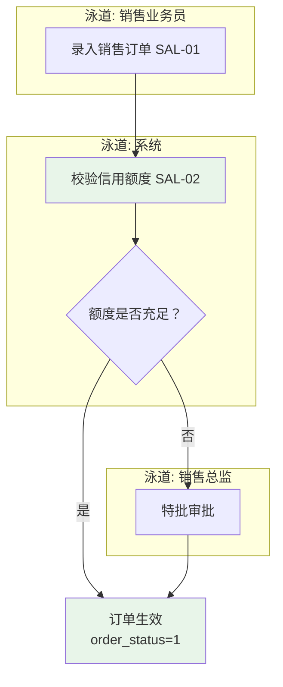

---

## 三、销售管理域流程

### 3.1 As-Is 现状流程

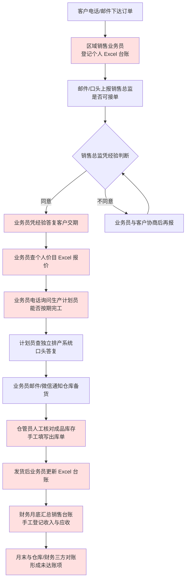

### 3.2 现状流程问题清单

| 编号 | 问题描述 | 对应痛点 |
|------|---------|---------|
| AsIs-销售-01 | 订单登记分散在 3 个分公司 Excel，模板与编号规则不统一，集团无法自动汇总 | 销售域 SAL-P1 |
| AsIs-销售-02 | 报价环节无系统价目与授权区间，报价结果无留痕、不可比对 | 销售域 SAL-P2 |
| AsIs-销售-03 | 接单环节无信用额度校验，超额度订单直接进入执行 | 销售域 SAL-P3 |
| AsIs-销售-04 | 交期答复依赖电话询问，无系统可查的生产进度，答复无依据 | 销售域 SAL-P4、跨域专题四 |
| AsIs-销售-05 | 发货靠邮件/微信通知 + 手工出库单，销售与仓库信息不同步，形成未达账项 | 销售域 SAL-P5、跨域专题一 |
| AsIs-销售-06 | 分批交货计划以备注文字记录，未拆解为结构化发货计划 | 销售域 SAL-P6 |
| AsIs-销售-07 | 退货靠电话沟通与手工登记，无质检确认与退货入库闭环 | 销售域 SR-07（退货全流程诉求，对应 SAL-06） |
| AsIs-销售-08 | 收入与应收由财务月底手工登记，业务与财务数据时点不一致 | 财务域 FIN-P1、跨域专题一 |

### 3.3 To-Be 目标流程

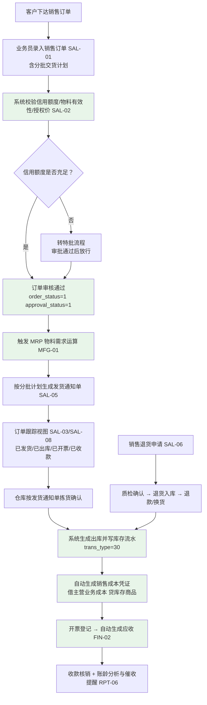

### 3.4 As-Is → To-Be 差异点清单

| 差异项 | As-Is | To-Be | 带来的改进 | 关联需求编号 |
|--------|-------|-------|-----------|-------------|
| 订单录入载体 | 3 套 Excel 台账，模板与编号各异 | 统一在线销售订单，字段与编号规则标准化（SO+YYYYMM+流水） | 集团口径统一，月度分析自动化 | SAL-01、MD-01、RPT-02 |
| 审批方式 | 邮件/口头请示，无留痕 | 提交→审核→通过/驳回，`approval_status` 记录结论 | 审批留痕、职责清晰 | SAL-02 |
| 信用控制 | 财务人工查台账，事后发现超额度 | 审核时系统校验信用额度，不足转特批 | 超额度发货归零 | SAL-02、CS-01、FIN-02 |
| 价格管理 | 业务员个人价目表 | 系统价格策略（客户等级/品类/数量）+ 历史售价查询 | 报价一致，毛利可分析 | SAL-07、CS-03 |
| 交期答复 | 电话询问车间，响应 >4 小时 | 订单跟踪页实时展示关联工单进度 | 催单分钟级自助响应 | SAL-03、SAL-08、MFG-09 |
| 发货方式 | 邮件/微信通知 + 手工出库单 | 发货通知单驱动出库，自动写库存流水 | 未达账项归零 | SAL-05、INV-09 |
| 分批交货 | 备注文字记录 | 结构化分批交货计划，逐批生成发货通知 | 杜绝漏发错发 | SAL-01、SAL-05 |
| 订单变更 | 口头/备注，无前后差异 | 变更申请审批 + 前后差异对比 | 变更可追溯 | SAL-04 |
| 退货处理 | 电话沟通 + 手工登记 | 退货申请→质检确认→退货入库→退款/换货 | 退货闭环可查 | SAL-06、INV-02 |
| 收入与应收 | 财务月底手工登记 | 出库/开票自动生成应收凭证 | 业财同步 | FIN-01、FIN-02 |

---

## 四、采购管理域流程

### 4.1 As-Is 现状流程

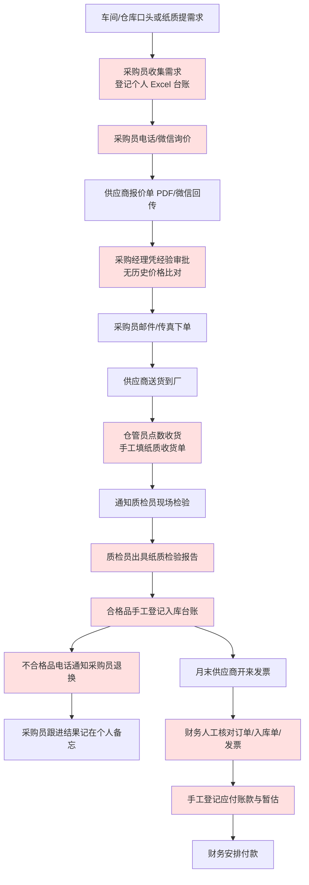

### 4.2 现状流程问题清单

| 编号 | 问题描述 | 对应痛点 |
|------|---------|---------|
| AsIs-采购-01 | 需求提报无统一入口与编号，紧急采购占比约 30%，无法区分计划性与临时性采购 | 采购域 PUR-P1 |
| AsIs-采购-02 | 需求、订单、收货台账分散在各采购员 Excel，交接即断档 | 采购域 PUR-P1 |
| AsIs-采购-03 | 询价与议价无价格历史支撑，凭经验判断价格合理性 | 采购域 PUR-P3 |
| AsIs-采购-04 | 收货与质检为纸质记录，合格数量靠人工填写，无法与采购订单自动比对 | 采购域 PUR-P4 |
| AsIs-采购-05 | 不合格品退换货进度靠电话跟进，无超期预警 | 采购域 PUR-P4 |
| AsIs-采购-06 | 三单匹配人工完成（2 人 3 天），差异发现滞后 | 采购域 PUR-P5 |
| AsIs-采购-07 | 暂估依赖人工判断，存在漏暂估，月度成本失真 | 采购域 PUR-P6、财务域 FIN-P5 |
| AsIs-采购-08 | 供应商评价凭印象，无客观指标（准时率、合格率、价格水平、服务响应） | 采购域 PR-08（供应商绩效评估诉求，对应 PUR-08） |

### 4.3 To-Be 目标流程

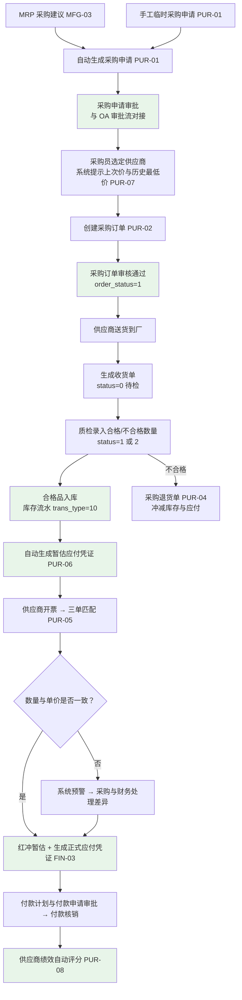

### 4.4 As-Is → To-Be 差异点清单

| 差异项 | As-Is | To-Be | 带来的改进 | 关联需求编号 |
|--------|-------|-------|-----------|-------------|
| 需求来源 | 口头/纸质申请，来源不可区分 | MRP 建议自动转申请 + 手工临时申请并存，来源可标记 | 紧急采购占比下降 | PUR-01、MFG-03 |
| 审批链 | 邮件/口头，无记录 | 申请与订单在线审批，对接 OA 审批流 | 审批可追溯、合规 | PUR-01、PUR-02（OA 接口） |
| 价格依据 | 无历史价格，凭经验议价 | 自动提示上次采购价与历史最低价，价格走势可查 | 采购成本可控 | PUR-07、RPT-03 |
| 收货与质检 | 纸质收货单 + 纸质检验报告 | 收货单驱动，合格/不合格数量系统记录，状态 0→1/2/3 | 追溯链完整、数量不可篡改 | PUR-03、INV-02、INV-04 |
| 不合格品处置 | 电话跟进，无超期跟踪 | 退货单冲减库存与应付，进度可跟踪 | 超期未退归零 | PUR-04、FIN-03 |
| 三单匹配 | 人工核对 2 人 3 天 | 系统自动匹配数量与单价，不一致预警 | 匹配当日完成 | PUR-05、FIN-03 |
| 暂估处理 | 人工判断，存在漏暂估 | 货到票未到自动暂估，发票到达后红冲 | 成本真实、暂估全覆蓋 | PUR-06、FIN-01 |
| 供应商评价 | 凭印象 | 按准时率/合格率/价格/服务自动评分 | 供应商分层管理 | PUR-08、RPT-03 |

---

## 五、库存管理域流程

### 5.1 As-Is 现状流程

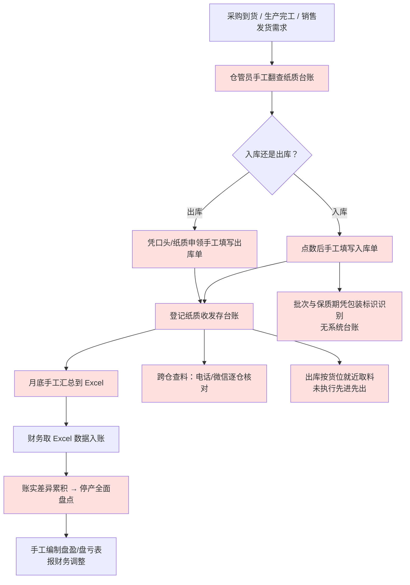

### 5.2 现状流程问题清单

| 编号 | 问题描述 | 对应痛点 |
|------|---------|---------|
| AsIs-库存-01 | 收发存全部依赖纸质台账，无编号与校验，易涂改、不可检索 | 库存域 INV-P1 |
| AsIs-库存-02 | 出库无定额与批次校验，按货位就近取料，未执行先进先出 | 库存域 INV-P6 |
| AsIs-库存-03 | 4 个仓库台账互不联通，跨仓查料靠电话/微信，平均 2 小时 | 库存域 INV-P2、跨域专题二 |
| AsIs-库存-04 | 批次与保质期无系统台账，超期物料无法预警（已发生 4.1 万元损失） | 库存域 INV-P4 |
| AsIs-库存-05 | 盘点须停产 2 天、4 仓 15 人参与，A 类物料按月盘点无法执行 | 库存域 INV-P5 |
| AsIs-库存-06 | 库存数据月底才汇总，无即时库存与历史流水，追溯需翻纸质单据 | 库存域 INV-P1、跨域专题一 |
| AsIs-库存-07 | 安全库存凭经验设定且无预警，呆滞物料无自动识别（呆滞占比 18%） | 库存域 INV-P3、INV-P6、跨域专题二 |
| AsIs-库存-08 | 跨仓/跨库位调拨靠手工双向登记，易漏记、无审批 | 库存域 INV-P2 |

### 5.3 To-Be 目标流程

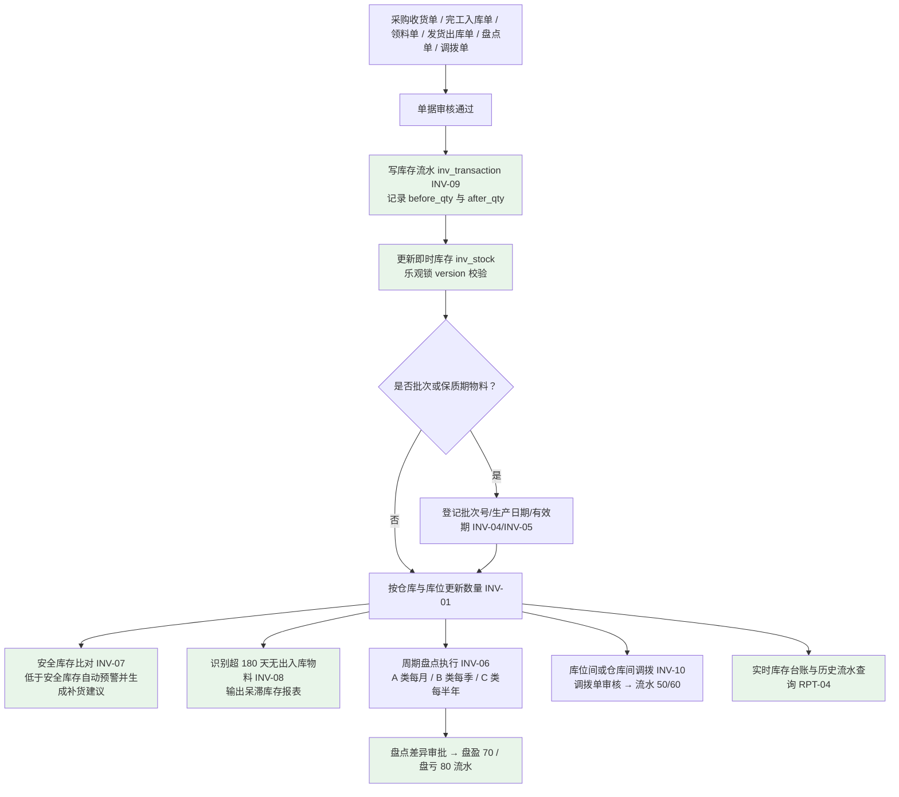

### 5.4 As-Is → To-Be 差异点清单

| 差异项 | As-Is | To-Be | 带来的改进 | 关联需求编号 |
|--------|-------|-------|-----------|-------------|
| 记账方式 | 纸质收发存台账 + 月底 Excel 汇总 | 单据驱动写 `inv_transaction` 流水，实时更新 `inv_stock` | 库存准确率 ≥99.5% | INV-09、INV-02、INV-03 |
| 仓库与库位 | 4 仓独立管理，无库位主数据 | 多仓库/多库位统一管理，物料指定默认库位 | 库位级定位，跨仓可视 | INV-01、MD-03 |
| 批次与保质期 | 凭包装标识人工识别 | 批次台账 + 有效期登记 + 到期前 30 天预警 | 超期损失归零、追溯完整 | INV-04、INV-05 |
| 出库规则 | 按货位就近取料 | 按单据与批次规则出库，支持回溯 | 成本与实物流一致 | INV-03、FIN-04 |
| 盘点 | 停产 2 天全面盘点 | 按 ABC 分类周期盘点，差异审批后自动生成盘盈/盘亏 | 盘点不停产 | INV-06、MD-03 |
| 跨仓调拨 | 手工双向登记，无审批 | 调拨单审核生效，自动生成 50/60 流水 | 调拨可追溯 | INV-10、INV-09 |
| 库存预警 | 凭经验，无预警 | 安全库存预警 + 补货建议；呆滞自动识别 | 呆滞 <8%、缺货收敛 | INV-07、INV-08、RPT-04 |
| 数据可见性 | 月底汇总，无法查历史 | 即时库存与任意时点流水可查 | 决策实时、审计可追溯 | INV-09、RPT-04 |

---

## 六、生产制造管理域流程

### 6.1 As-Is 现状流程

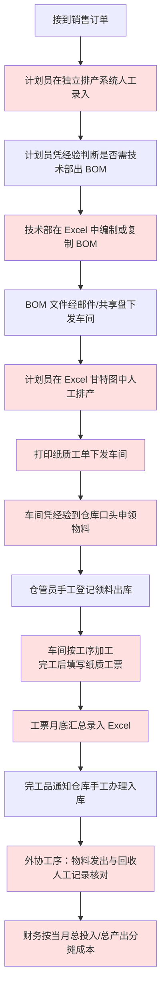

### 6.2 现状流程问题清单

| 编号 | 问题描述 | 对应痛点 |
|------|---------|---------|
| AsIs-生产-01 | 排产系统与销售订单不联动，插单靠人工调整（平均每周 4 次计划变更） | 生产域 MFG-P1 |
| AsIs-生产-02 | BOM 分散在 7 个 Excel 文件，无版本控制，多版本并存 | 生产域 MFG-P2 |
| AsIs-生产-03 | 无 MRP 运算，采购与生产计划靠经验提报，齐套性无法预判 | 生产域 MFG-P3、跨域专题二 |
| AsIs-生产-04 | 领料无 BOM 定额校验，按需领料，材料差异无法归因 | 生产域 MFG-P4 |
| AsIs-生产-05 | 报工为纸质工票、月底汇总，工序进度滞后 3-5 天可见 | 生产域 MFG-P5、跨域专题四 |
| AsIs-生产-06 | 完工入库为手工办理，在制数量与库存数量口径不一致 | 生产域 MFG-P5、库存域 INV-P1 |
| AsIs-生产-07 | 委外工序无台账，物料发出与回收数量手工核对，短少无法追溯 | 生产域 MFG-P6 |
| AsIs-生产-08 | 无工单级成本数据，财务只能按总投入/总产出分摊 | 跨域专题三 成本核算粗放、财务域 FIN-P3 |

### 6.3 To-Be 目标流程

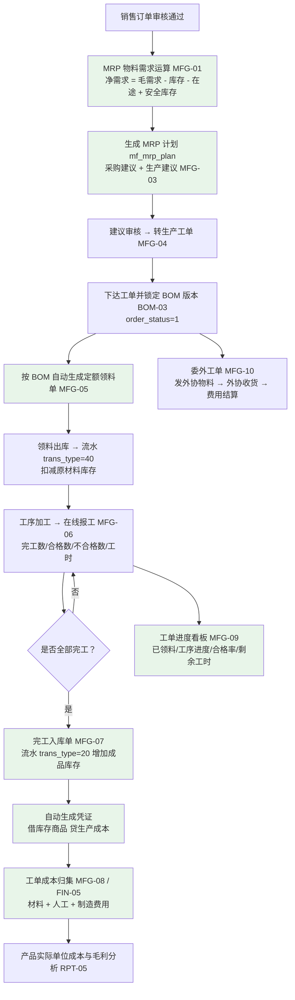

### 6.4 As-Is → To-Be 差异点清单

| 差异项 | As-Is | To-Be | 带来的改进 | 关联需求编号 |
|--------|-------|-------|-----------|-------------|
| 需求运算 | 无 MRP，凭经验提报 | MRP 按销售订单自动运算，输出采购建议与生产建议 | 齐套性可预判，紧急采购下降 | MFG-01、MFG-02、MFG-03 |
| 排产依据 | 独立排产系统 + Excel 甘特图 | 工单由 MRP 建议生成，关联销售订单与 BOM 版本 | 计划与订单联动 | MFG-04、MFG-03 |
| BOM 管理 | 7 个 Excel 文件、多版本并存 | 多层 BOM、用量与损耗率、版本管理、审核后生效、反查 | BOM 唯一版本、闭环可控 | BOM-01 ~ BOM-06 |
| BOM 版本锁定 | 无锁定，车间可能用旧版 | 工单下达时锁定 BOM 版本，后续变更不影响已下达工单 | 杜绝错料废工 | BOM-03 |
| 领料方式 | 口头申领，无定额 | 按工单与 BOM 自动生成定额领料单，超定额审批 | 材料差异可识别 | MFG-05、INV-03、BOM-02 |
| 报工方式 | 纸质工票，月底汇总 | 工序在线报工（完工/合格/不合格/工时） | 进度实时、工时可用于成本归集 | MFG-06、MFG-09 |
| 完工入库 | 手工办理入库 | 完工入库单生成流水 `trans_type=20` | 在制与库存口径一致 | MFG-07、INV-02 |
| 委外加工 | Excel + 电话 | 委外工单→发料→外协收货→费用结算全流程留痕 | 外协料可追溯 | MFG-10 |
| 成本归集 | 总投入/总产出分摊 | 按工单归集材料、人工、制造费用 | 产品级实际成本可得 | MFG-08、FIN-05 |

---

## 七、财务管理域流程

### 7.1 As-Is 现状流程

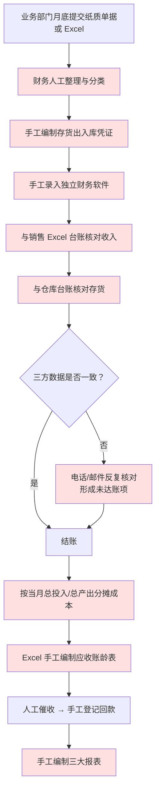

### 7.2 现状流程问题清单

| 编号 | 问题描述 | 对应痛点 |
|------|---------|---------|
| AsIs-财务-01 | 业务单据月底集中提交与补录，业务与财务数据时点不一致 | 财务域 FIN-P1、跨域专题一 |
| AsIs-财务-02 | 出入库凭证手工编制（月均约 3,300 条凭证中 70% 手工录入） | 财务域 FIN-P2 |
| AsIs-财务-03 | 凭证与业务单据无关联关系，无法双向追溯，审计取证靠翻纸质附件 | 财务域 FIN-P2 |
| AsIs-财务-04 | 三方数据不一致时靠电话/邮件反复核对，7 月出现 27 笔未达账项 | 财务域 FIN-P1、跨域专题一 |
| AsIs-财务-05 | 成本按总投入/总产出分摊，无法获得工单级与产品级实际成本 | 财务域 FIN-P3、跨域专题三 |
| AsIs-财务-06 | 应收账龄 Excel 手工统计（1 人 2 天），逾期无自动提醒 | 财务域 FIN-P4 |
| AsIs-财务-07 | 暂估依赖人工判断，46 笔货到票未到业务中 12 笔未暂估 | 财务域 FIN-P5 |
| AsIs-财务-08 | 无期间关闭控制，月均 8 笔跨期修改上月单据；报表手工编制 | 财务域 FIN-P6 |

### 7.3 To-Be 目标流程

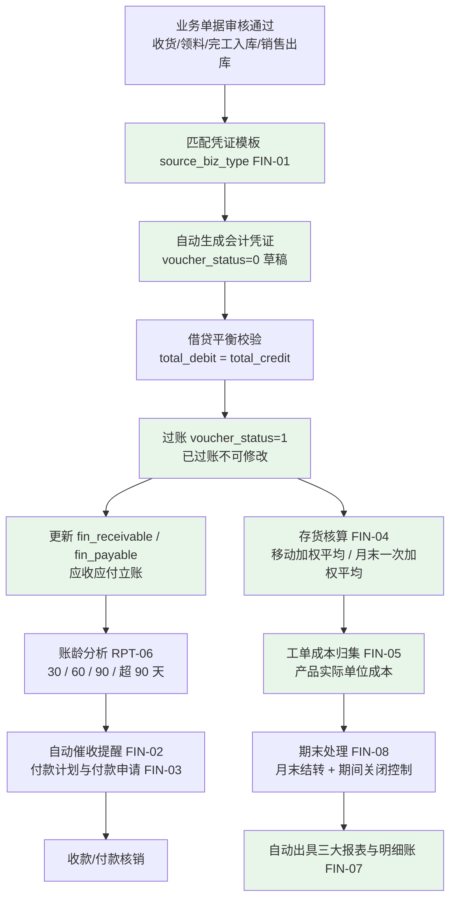

### 7.4 As-Is → To-Be 差异点清单

| 差异项 | As-Is | To-Be | 带来的改进 | 关联需求编号 |
|--------|-------|-------|-----------|-------------|
| 凭证来源 | 财务手工编制 | 业务单据审核后按模板自动生成凭证 | 凭证自动化，追溯链完整 | FIN-01 |
| 凭证状态 | 无状态概念，录入即生效 | 草稿（0）→ 已过账（1），过账后不可修改 | 账务不可篡改 | FIN-01、FIN-08 |
| 追溯关系 | 凭证与单据无关联 | 凭证记录 `source_biz_type` 与 `source_biz_id`，双向可查 | 审计取证即时 | FIN-01 |
| 应收管理 | Excel 台账，1 人 2 天做账龄 | 出库/开票自动立账，账龄与催收提醒自动 | 账龄实时、催收及时 | FIN-02、RPT-06 |
| 应付与暂估 | 人工判断，存在漏暂估 | 入库自动暂估，发票到达红冲并生成正式凭证 | 成本真实、暂估全覆盖 | PUR-06、FIN-03 |
| 成本核算 | 总投入/总产出分摊 | 存货核算 + 工单成本归集，产出产品实际单位成本 | 产品利润率可掌握 | FIN-04、FIN-05、MFG-08 |
| 月结 | 6 个工作日，无期间控制 | 期末结转 + 期间关闭，关闭后不可修改 | 月结 ≤2 个工作日 | FIN-08 |
| 报表 | 手工编制三大报表 | 自动出具资产负债表、利润表、现金流量表、科目余额表、明细账、总账 | 报表当日出具 | FIN-07、RPT-06 |
| 固定资产 | Excel 资产台账 | 资产卡片、折旧计提、盘点、报废 | 资产账实一致 | FIN-06 |

---

## 八、跨域端到端主流程

以《企业资源计划ERP系统需求规格说明书》第三章核心业务流程总览与第十章 AC-300 变频器 100 台端到端数据流示例为依据，覆盖"订单到现金"与"采购到付款"两条全链路。

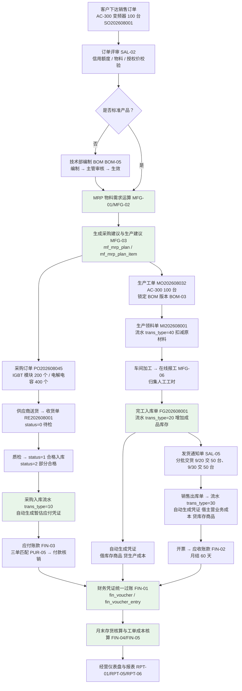

**主流程节点与单据对应关系**

| 序号 | 流程节点 | 触发方 | 产生的单据/数据 | 关联需求编号 |
|------|---------|-------|---------------|-------------|
| 1 | 客户下达销售订单 | 客户 / 销售业务员 | 销售订单 `sal_order` + `sal_order_line` | SAL-01 |
| 2 | 订单评审 | 系统 + 销售总监 | `approval_status` / `order_status` 变更 | SAL-02 |
| 3 | 非标产品编制 BOM | 技术部 | BOM 主表 + 明细（审核后生效） | BOM-05、BOM-02、BOM-03 |
| 4 | MRP 物料需求运算 | 系统 | `mf_mrp_plan` + `mf_mrp_plan_item` | MFG-01、MFG-02 |
| 5 | 生成采购建议与生产建议 | 系统 | 采购建议、生产建议 | MFG-03 |
| 6 | 下采购订单 | 采购员 | 采购订单 `pur_order` + `pur_order_line` | PUR-02 |
| 7 | 下生产工单 | 生产计划员 | 生产工单 `mf_order`（锁定 BOM 版本） | MFG-04、BOM-03 |
| 8 | 供应商送货与质检 | 仓管员 / 质检员 | 收货单 `pur_receipt`（status 0→1/2） | PUR-03、INV-04 |
| 9 | 采购入库与暂估 | 系统 | `inv_transaction`（10）+ 暂估应付凭证 | INV-02、PUR-06、FIN-01 |
| 10 | 生产领料 | 车间 / 仓管员 | 领料单 `mf_order_issue` + `inv_transaction`（40） | MFG-05、INV-03 |
| 11 | 加工与报工 | 车间 | 报工记录（完工数/合格数/不合格数/工时） | MFG-06 |
| 12 | 完工入库 | 车间 / 仓管员 | 完工入库 + `inv_transaction`（20）+ 凭证 | MFG-07、FIN-01 |
| 13 | 三单匹配与应付 | 应付会计 | 匹配结果 + 正式应付凭证 | PUR-05、FIN-03 |
| 14 | 销售发货与出库 | 仓库 / 系统 | 发货通知单 + `inv_transaction`（30）+ 成本凭证 | SAL-05、INV-03、FIN-01 |
| 15 | 开票与应收 | 应收会计 | 应收立账 `fin_receivable` | FIN-02 |
| 16 | 凭证过账与月末核算 | 总账会计 / 成本会计 | `fin_voucher`（voucher_status=1）+ 产品实际成本 | FIN-01、FIN-04、FIN-05 |
| 17 | 报表与仪表盘 | 管理层 | 经营仪表盘与各域报表 | RPT-01、RPT-05、RPT-06 |

---

## 九、单据状态流转说明

> 状态取值一律以《ERP系统数据库表结构设计文档》字段注释为准；状态变更统一通过动作接口实现（参照《ERP系统开发API设计与规范文档》11.2：提交 `submit`、审核 `approve`、驳回 `reject`、关闭 `close`、反审核 `unapprove`）。

### 9.1 销售订单（`sal_order`）

**执行状态 `order_status`：0-草稿 1-审核 2-部分发货 3-已发货 4-已关闭**

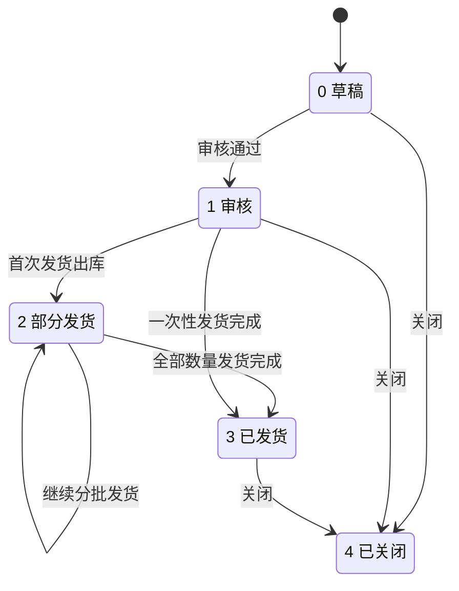

| 状态码 | 状态名 | 进入条件 | 触发动作接口 | 是否可逆 |
|-------|-------|---------|-------------|---------|
| 0 | 草稿 | 订单创建后 | `POST /orders` | 可提交、可关闭 |
| 1 | 审核 | 审核通过（`approval_status=1`） | `POST /orders/{id}/approve` | 可通过 `unapprove` 退回草稿（需特殊权限） |
| 2 | 部分发货 | 首次发货出库且 `delivered_qty < qty` | `POST /shipments` | 继续发货直至 3 |
| 3 | 已发货 | 全部明细 `delivered_qty = qty` | `POST /shipments` | 可关闭 |
| 4 | 已关闭 | 主动关闭或执行完毕归档 | `POST /orders/{id}/close` | 不可逆 |

**审批状态 `approval_status`：0-待审 1-通过 2-驳回**（与 `order_status` 分离：本字段记录审批结论，`order_status` 记录执行进度）

| 状态码 | 状态名 | 进入条件 | 说明 |
|-------|-------|---------|------|
| 0 | 待审 | 提交审核后 | 订单不可发货，可撤回修改 |
| 1 | 通过 | 审核通过 | 同时将 `order_status` 置为 1-审核 |
| 2 | 驳回 | 审核驳回 | `order_status` 保持 0-草稿，修改后可重新提交 |

### 9.2 采购订单（`pur_order`）

**执行状态 `order_status`：0-草稿 1-审核 2-部分收货 3-已收货 4-已关闭**

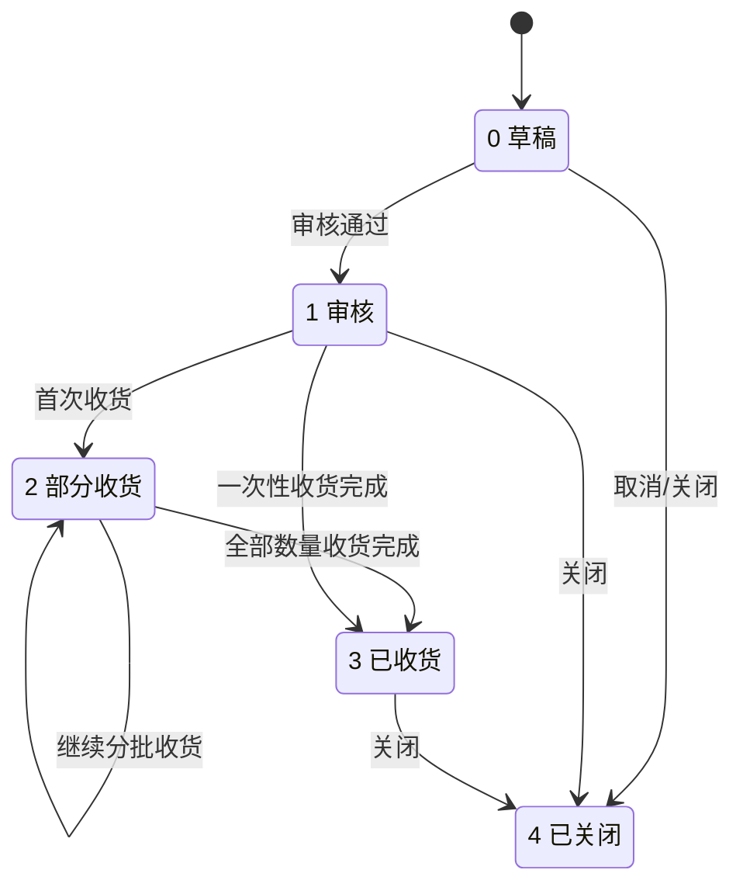

**结算状态 `settlement_status`：0-未结算 1-部分结算 2-已结算**（由三单匹配与付款核销驱动，不改变 `order_status`）

| 状态码 | 状态名 | 进入条件 | 说明 |
|-------|-------|---------|------|
| 0 | 未结算 | 订单创建后默认 | 对应未暂估或未匹配发票 |
| 1 | 部分结算 | 部分发票匹配通过或部分付款 | 需继续匹配与付款 |
| 2 | 已结算 | 全部发票匹配并付款核销完成 | 订单可关闭 |

### 9.3 生产工单（`mf_order`）

**`order_status`：0-计划 1-已下达 2-生产中 3-已完工 4-已关闭**

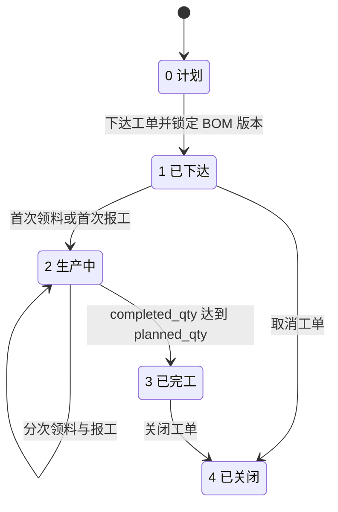

| 状态码 | 状态名 | 进入条件 | 关键字段变化 | 是否可逆 |
|-------|-------|---------|-------------|---------|
| 0 | 计划 | MRP 建议转工单后 | `bom_id` 已选定但未锁定生效 | 可下达、可删除（逻辑删除） |
| 1 | 已下达 | 计划员下达 | 锁定 `bom_id`；`planned_start_date` 生效 | 可取消 |
| 2 | 生产中 | 首次领料或首次报工 | `actual_start_date` 记录；`completed_qty` 累加 | 不可逆 |
| 3 | 已完工 | `completed_qty` 达到 `planned_qty` | `actual_end_date` 记录；生成完工入库 | 可关闭 |
| 4 | 已关闭 | 主动关闭 | 不再允许领料与报工 | 不可逆 |

### 9.4 采购收货单（`pur_receipt`）

**`status`：0-待检 1-合格入库 2-部分合格 3-退货**

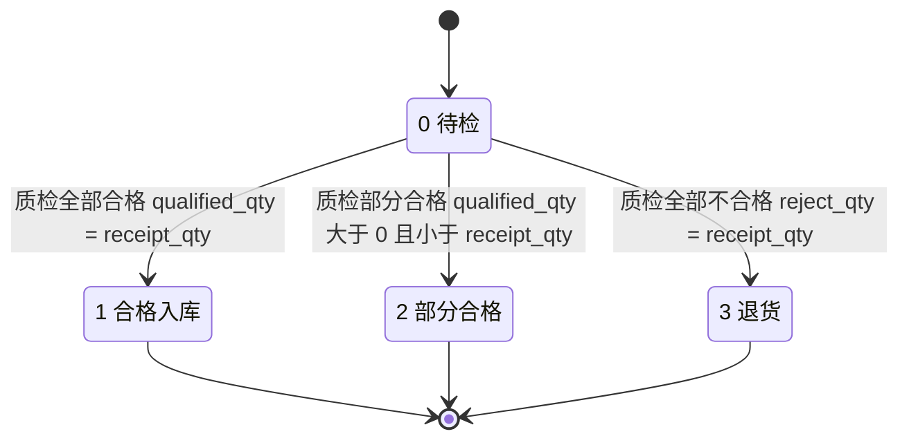

| 状态码 | 状态名 | 进入条件 | 库存影响 | 财务影响 |
|-------|-------|---------|---------|---------|
| 0 | 待检 | 收货单创建后 | 物料进入冻结数量 `frozen_qty`，不增加可用库存 | 不生成凭证 |
| 1 | 合格入库 | 全部合格 | 写 `trans_type=10` 流水，增加可用库存 | 生成暂估应付凭证 |
| 2 | 部分合格 | 部分合格 | 合格数量写 `trans_type=10`；不合格数量入退货仓/隔离仓 | 按合格数量暂估 |
| 3 | 退货 | 全部不合格 | 不增加库存，物资退回供应商 | 不生成应付；已暂估的按红冲处理 |

> 说明：`pur_receipt` 以"物料 + 收货批次"为记录粒度，一张收货单可包含多条记录；单条记录的状态按上表判定，整单状态取各明细记录的汇总结果。

### 9.5 会计凭证（`fin_voucher`）

**`voucher_status`：0-草稿 1-已过账（不可修改）**

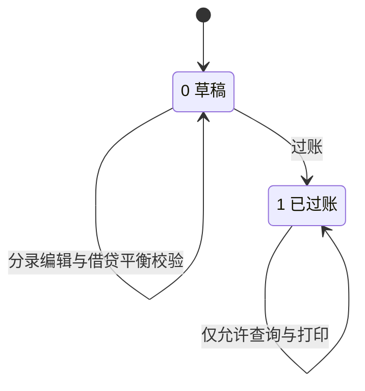

| 状态码 | 状态名 | 进入条件 | 允许操作 | 冲销方式 |
|-------|-------|---------|---------|---------|
| 0 | 草稿 | 业务单据驱动的自动生成或手工新增 | 修改分录、删除、过账 | 可直接修改或删除 |
| 1 | 已过账 | 总账会计执行过账 | 仅查询、打印、导出 | 通过生成红字凭证冲销（参照 PUR-06 红冲暂估），禁止直接修改 |

> 期间控制：会计期间关闭后（FIN-08），该期间内禁止新增、修改、过账凭证；已过账凭证的冲销须在开放期间内进行。

### 9.6 库存流水及相关单据（`inv_transaction`）

库存流水**只插入、不修改、不删除**（依据《ERP系统数据库表结构设计文档》6.2 与编码铁律"任何库存变动必须先写 `inv_transaction` 流水，再更新余额"），因此不设状态字段，改以 `trans_type` 区分业务类型并明确冲销规则。

**`trans_type` 取值与来源单据对照表**

| trans_type | 名称 | 库存方向 | 来源单据 | `source_biz_type` 示例 | 对应凭证分录 |
|-----------|------|---------|---------|----------------------|-------------|
| 10 | 采购入库 | 增（`in_qty`） | 收货单 `pur_receipt` | `PURCHASE_RECEIPT` | 借：原材料 1403 / 贷：应付账款-暂估 2202 |
| 20 | 生产入库 | 增（`in_qty`） | 完工入库单 | `MFG_COMPLETE` | 借：库存商品 / 贷：生产成本 |
| 30 | 销售出库 | 减（`out_qty`） | 销售出库单 | `SALES_SHIPMENT` | 借：主营业务成本 / 贷：库存商品 |
| 40 | 生产领料 | 减（`out_qty`） | 领料单 `mf_order_issue` | `MFG_ISSUE` | 借：生产成本 / 贷：原材料 1403 |
| 50 | 调拨入库 | 增（`in_qty`） | 调拨单 | `INV_TRANSFER` | 仓间/库位间调拨，按成本价结转，不产生损益 |
| 60 | 调拨出库 | 减（`out_qty`） | 调拨单 | `INV_TRANSFER` | 同 50，需与 50 成对生成且数量相等 |
| 70 | 盘盈 | 增（`in_qty`） | 盘点单 | `INV_STOCKTAKE` | 借：原材料/库存商品 / 贷：待处理财产损溢 |
| 80 | 盘亏 | 减（`out_qty`） | 盘点单 | `INV_STOCKTAKE` | 借：待处理财产损溢 / 贷：原材料/库存商品 |

**库存单据流转与冲销规则**

| 规则 | 内容 |
|------|------|
| 流水生成时机 | 来源单据审核通过时生成，同一单据同一物料一次业务对应一条流水 |
| 流水字段约束 | 必须记录 `before_qty` 与 `after_qty`，且 `after_qty = before_qty + in_qty - out_qty` |
| 余额更新 | 写流水后按 `UNIQUE(material_id, warehouse_id, location_id, batch_no)` 更新 `inv_stock.qty`，带乐观锁 `version` 校验 |
| 冲销方式 | 禁止修改或删除历史流水；错误通过生成方向相反、金额与数量相等的冲销流水实现（`remark` 记录原 `trans_code`） |
| 单据可逆点 | 收货单在 `status=0 待检` 时可撤销；进入 1/2/3 后需通过退货单或冲销流水处理 |
| 盘点单据可逆点 | 盘点差异经审批后才生成 70/80 流水；审批前可修改盘点数量 |
| 调拨单可逆点 | 调拨单审核后生成成对流水，撤销需生成反向调拨单 |
| 每日对账 | 流水汇总结果与 `inv_stock` 快照每日对账，差异须当日查明 |

### 9.7 状态机与需求/接口的对应关系

| 单据 | 状态字段 | 关联需求编号 | 关联接口（动作） |
|------|---------|-------------|-----------------|
| 销售订单 | `order_status`、`approval_status` | SAL-01、SAL-02、SAL-04、SAL-05 | `POST /api/sales/orders`、`/orders/{id}/approve`、`/orders/{id}/reject`、`/orders/{id}/close`、`POST /api/sales/shipments` |
| 采购订单 | `order_status`、`settlement_status` | PUR-02、PUR-05、PUR-06 | `POST /api/purchase/orders`、`/orders/{id}/approve`、`/orders/{id}/close` |
| 生产工单 | `order_status` | MFG-04、MFG-05、MFG-06、MFG-07 | `POST /api/manufacturing/work-orders`、`/work-orders/{id}/issue`、`/work-orders/{id}/report` |
| 采购收货单 | `status` | PUR-03、PUR-04、INV-02、INV-04 | `POST /api/purchase/receipts` |
| 会计凭证 | `voucher_status` | FIN-01、FIN-08 | `POST /api/finance/vouchers/generate` |
| 库存流水 | `trans_type`（无状态） | INV-02、INV-03、INV-06、INV-07、INV-09、INV-10 | `POST /api/inventory/stock-take`、`POST /api/inventory/batch-adjust` |

---

## 十、流程梳理结论

### 10.1 流程清单总表

| 编号 | 流程名称 | 所属域 | 涉及单据 | 涉及角色 | 关联需求编号 |
|------|---------|-------|---------|---------|-------------|
| P-SAL-01 | 销售订单录入与审核 | 销售 | 销售订单 | 销售业务员、销售总监、系统 | SAL-01、SAL-02、CS-01 |
| P-SAL-02 | 销售订单变更 | 销售 | 销售订单（变更单） | 销售业务员、销售总监 | SAL-04 |
| P-SAL-03 | 发货通知与销售出库 | 销售 | 发货通知单、销售出库单、库存流水 | 销售内勤、仓管员、系统 | SAL-05、INV-03、INV-09 |
| P-SAL-04 | 开票与应收账款 | 销售 | 会计凭证、应收立账 | 应收会计、系统 | SAL-03、FIN-02 |
| P-SAL-05 | 销售退货（RMA） | 销售 | 销售退货单、退货入库流水 | 销售业务员、质检员、仓管员 | SAL-06、INV-02 |
| P-SAL-06 | 销售价格管理 | 销售 | 价格策略、历史售价 | 销售总监、系统 | SAL-07、CS-03 |
| P-SAL-07 | 订单执行跟踪 | 销售 | 销售订单、生产工单 | 销售业务员、系统 | SAL-03、SAL-08、MFG-09 |
| P-PUR-01 | 采购申请 | 采购 | 采购申请 | 生产计划员、仓管员、采购经理 | PUR-01、MFG-03 |
| P-PUR-02 | 采购订单与价格管理 | 采购 | 采购订单 | 采购员、采购经理、系统 | PUR-02、PUR-07 |
| P-PUR-03 | 收货与质检 | 采购 | 收货单、质检单、库存流水 | 仓管员、质检员、系统 | PUR-03、INV-02、INV-04 |
| P-PUR-04 | 采购退货 | 采购 | 采购退货单 | 采购员、质检员、仓管员 | PUR-04、FIN-03 |
| P-PUR-05 | 三单匹配与暂估 | 采购 | 采购订单、收货单、发票、会计凭证 | 应付会计、系统 | PUR-05、PUR-06、FIN-01 |
| P-PUR-06 | 供应商绩效评估 | 采购 | 供应商评分数据 | 采购经理、系统 | PUR-08、RPT-03 |
| P-INV-01 | 采购入库 | 库存 | 收货单、库存流水 | 仓管员、质检员、系统 | INV-02、INV-04、INV-09 |
| P-INV-02 | 生产领料出库 | 库存 | 领料单、库存流水 | 车间主任、仓管员、系统 | INV-03、MFG-05 |
| P-INV-03 | 完工入库 | 库存 | 完工入库单、库存流水 | 车间主任、仓管员、系统 | INV-02、MFG-07 |
| P-INV-04 | 销售出库 | 库存 | 发货通知单、销售出库单、库存流水 | 销售内勤、仓管员、系统 | INV-03、SAL-05 |
| P-INV-05 | 库存盘点 | 库存 | 盘点单、盘盈/盘亏流水 | 仓库主管、仓管员、系统 | INV-06、MD-03 |
| P-INV-06 | 库位与仓库调拨 | 库存 | 调拨单、调拨流水 | 仓库主管、仓管员、系统 | INV-10、INV-09 |
| P-INV-07 | 批次与保质期追溯 | 库存 | 批次台账、库存流水 | 仓管员、质检员、系统 | INV-04、INV-05 |
| P-INV-08 | 安全库存与呆滞分析 | 库存 | 预警清单、呆滞报表 | 仓库主管、采购员、系统 | INV-07、INV-08、RPT-04 |
| P-MFG-01 | MRP 物料需求运算 | 生产 | MRP 计划（主表/明细） | 生产计划员、系统 | MFG-01、MFG-02、MFG-03 |
| P-MFG-02 | BOM 编制与审核 | 生产 | BOM 主表/明细 | BOM 工程师、技术主管 | BOM-01 ~ BOM-06 |
| P-MFG-03 | 工单下达与 BOM 版本锁定 | 生产 | 生产工单 | 生产计划员、系统 | MFG-04、BOM-03 |
| P-MFG-04 | 生产领料 | 生产 | 领料单、库存流水 | 车间主任、仓管员、系统 | MFG-05、INV-03、BOM-02 |
| P-MFG-05 | 工序报工 | 生产 | 报工单 | 车间主任、操作工、系统 | MFG-06、MFG-09 |
| P-MFG-06 | 完工入库 | 生产 | 完工入库单、库存流水 | 车间主任、仓管员、系统 | MFG-07、INV-02 |
| P-MFG-07 | 工单成本归集 | 生产 | 工单成本数据 | 成本会计、系统 | MFG-08、FIN-05 |
| P-MFG-08 | 委外加工 | 生产 | 委外工单、外协收货单 | 外协专员、采购员、仓管员 | MFG-10、PUR-03 |
| P-FIN-01 | 凭证自动生成与过账 | 财务 | 会计凭证、凭证分录 | 总账会计、系统 | FIN-01 |
| P-FIN-02 | 应收管理与催收 | 财务 | 应收立账、账龄表 | 应收会计、系统 | FIN-02、RPT-06 |
| P-FIN-03 | 应付管理与付款 | 财务 | 应付立账、付款申请 | 应付会计、财务经理 | FIN-03、PUR-05 |
| P-FIN-04 | 存货核算 | 财务 | 存货成本数据 | 成本会计、系统 | FIN-04、INV-09 |
| P-FIN-05 | 工单成本核算 | 财务 | 产品成本数据 | 成本会计、系统 | FIN-05、MFG-08 |
| P-FIN-06 | 固定资产管理 | 财务 | 资产卡片、折旧凭证 | 固定资产会计、系统 | FIN-06 |
| P-FIN-07 | 期末处理与报表 | 财务 | 结转凭证、三大报表 | 总账会计、财务经理 | FIN-07、FIN-08、RPT-06 |
| P-E2E-01 | 端到端主流程（订单到现金 / 采购到付款） | 跨域 | 销售订单、采购订单、生产工单、出入库单、会计凭证 | 全部业务角色 + 系统 | SAL-01 ~ SAL-08、PUR-01 ~ PUR-08、INV-01 ~ INV-10、MFG-01 ~ MFG-10、FIN-01 ~ FIN-08、RPT-01 ~ RPT-07 |

### 10.2 流程梳理结论

| 序号 | 结论 |
|------|------|
| C1 | 五大业务域各形成 1 组 As-Is 流程图、1 份现状问题清单（共 40 条，编号 AsIs-域-序号）、1 组 To-Be 流程图与 1 份差异点清单（共 44 项差异），流程清单总表共 37 条流程。 |
| C2 | As-Is 的共同特征为"人工 + Excel/纸质 + 多系统割裂"，共 7 类断点：主数据不统一、单据不共享、审批无留痕、进度不可视、批次不可溯、成本不可归集、业财不同步。 |
| C3 | To-Be 的核心机制为"单据驱动 + 流水凭证化 + 状态机可控"：任何库存变动先写 `inv_transaction` 流水再更新 `inv_stock`；任何业务单据自动生成 `fin_voucher` 凭证；任何单据状态变更通过动作接口完成。 |
| C4 | 状态取值已与《ERP系统数据库表结构设计文档》字段注释逐项对齐：销售订单 5 个执行状态 + 3 个审批状态、采购订单 5 个执行状态 + 3 个结算状态、生产工单 5 个状态、收货单 4 个状态、凭证 2 个状态、库存流水 8 类 `trans_type`。 |
| C5 | 单据编号规则统一为"前缀 + YYYYMM + 3 位流水"，编号示例与需求说明书、API 文档保持一致（SO/PO/MO/RE/FZ/T）。 |
| C6 | 跨域端到端主流程覆盖 17 个关键节点，可支撑阶段四 SIT 的"采购到付款""订单到现金"全链路用例设计，以及阶段五 UAT 的 AC-300 变频器订单场景演练。 |
| C7 | 本报告的流程清单、状态机与差异清单可直接作为阶段二数据库设计、接口设计与前端页面设计的需求侧输入；也可作为阶段六数据迁移的未结单据范围判定依据（未发货/部分发货的销售订单、未收货/部分收货的采购订单）。 |

---

| 修订记录 | 日期 | 说明 |
|---------|------|------|
| V1.0 | 2026年9月 | 首次发布：阶段一业务流程梳理（As-Is/To-Be），覆盖五大业务域流程、跨域端到端主流程、单据状态机与流程清单总表 |
