# 需求规格说明书（终稿）

| 文档属性 | 内容 |
|---------|------|
| 文档名称 | 需求规格说明书（终稿） |
| 文档编号 | ERP-P1-03 |
| 版本 | V1.0 |
| 状态 | **终稿·已冻结（待签署）** |
| 编制部门 | 数字化管理部（会同销售部、采购部、仓储中心、生产制造部、财务部、质量部） |
| 编制日期 | 2026年9月 |
| 所属阶段 | 阶段一 需求确认（第 1-2 月） |
| 关联里程碑 | M1 需求基线确认（终稿经各业务部门负责人签字） |
| 适用范围 | 集团总部、2 个生产基地（苏州、东莞）、3 个区域销售分公司（华东、华南、华北）、4 个中心仓库；销售、采购、库存、生产制造、财务管理五大业务域 + 报表与分析域 + 系统管理支撑域 |
| 需求条目总数 | 80 条（支撑域 11 条 + 基础数据 16 条 + 销售 8 条 + 采购 8 条 + 库存 11 条 + 生产制造 10 条 + 财务 9 条 + 报表与分析 7 条） |
| 上游输入 | `docs/企业资源计划ERP系统需求规格说明书.md`（V1.0，只读基线）、`01-业务调研报告.md`、`02-业务流程梳理-As-Is与To-Be.md`、`04-数据迁移需求方案.md` |
| 下游流向 | 阶段二 系统设计（唯一需求输入基线）→ 阶段三 开发（D1-D9）→ 阶段四 SIT → 阶段五 UAT → 阶段六 数据迁移与上线 → 阶段七 最终验收 |

---

## 文档定位

### 1. 与基线文档的关系

| 项 | 说明 |
|----|------|
| 基线文档 | `docs/企业资源计划ERP系统需求规格说明书.md`（V1.0，状态"待审批"），本终稿的**唯一需求源头** |
| 本终稿性质 | 对基线文档的**定稿升级**：保留基线全部 65 条需求编号（MD-01~05、BOM-01~06、CS-01~03、SAL-01~08、PUR-01~08、INV-01~10、MFG-01~10、FIN-01~08、RPT-01~07）及其业务场景，把基线中的模糊表述替换为可判定规则，补充优先级、验收要点、支撑域需求（SYS-xx）与统一裁定结论 |
| 基线文档处置 | **只读保留，不作任何修改**。本终稿与基线表述冲突之处，一律以本终稿（含附录 B 统一裁定）为准 |
| 在阶段一中的位置 | 阶段一交付物（对应《ERP系统开发阶段计划文档》阶段一核心任务 1.3 需求编写、1.4 需求评审、1.5 需求冻结） |
| 在阶段二中的作用 | 阶段二架构设计、数据库设计、接口设计、UI/UX 设计的**唯一需求输入基线**；设计文档须逐条对应本终稿需求条目，无需求无设计 |
| 变更控制 | 本终稿冻结后，任何需求变更须经变更控制委员会（CCB）评审通过并登记于本终稿的变更记录后方可执行 |

### 2. 需求编号体系与优先级判定

| 域 | 编号前缀 | 条目数 | 说明 |
|----|---------|-------|------|
| 支撑域（系统管理与平台能力） | SYS | 11 | 架构必需的平台能力，**不属于基线"7 大业务域"范畴**，阶段三 D2 交付 |
| 基础数据管理 | MD / BOM / CS | 6 / 7 / 3 | 主数据与 BOM，阶段三 D3 交付 |
| 销售管理 | SAL | 8 | 阶段三 D6 交付 |
| 采购管理 | PUR | 8 | 阶段三 D5 交付 |
| 库存管理 | INV | 11 | 阶段三 D4 交付 |
| 生产制造管理 | MFG | 10 | 阶段三 D7 交付 |
| 财务管理 | FIN | 9 | 阶段三 D8 交付 |
| 报表与分析 | RPT | 7 | 阶段三 D9 交付 |

**优先级判定原则（全篇一致适用）：**

| 优先级 | 判定口径 | 典型范围 |
|-------|---------|---------|
| P0 | 核心链路不可缺：销售、采购、库存、生产、财务主流程单据流转与自动凭证，以及主数据、系统管理支撑能力；P0 未实现则系统无法上线运行 | 销售订单/发货出库、采购订单/收货入库、库存流水与即时库存、MRP/工单/领料/报工、应收应付/凭证/成本、主数据、SYS 平台能力、期初建账 |
| P1 | 重要但可稍后：不阻断主流程闭环，缺失影响管控效率与决策质量，可随对应子阶段后置交付 | 报表与分析（RPT 全部）、价格管理、批次追溯、盘点与调拨、绩效评估、退货、批量导入 |
| P2 | 增强项：使用频次低或可通过线下流程替代，本期列为增强目标 | 委外加工、固定资产、替代料管理、附件与文件管理 |

### 3. 需求条目书写与判定规则

1. 每条需求包含：**需求编号 | 需求名称 | 优先级 | 详细说明 | 验收要点**五要素，缺一不可。
2. "详细说明"不使用"大概、尽量、尽可能、合理、适当"等不可判定表述；凡涉及阈值、比例、时限者均给出明确数值。
3. "验收要点"必须可客观判定：含明确数字阈值、明确可演示行为或明确可检查的数据库/界面状态三者之一。
4. 新增编号（相对基线）一律续号，并在**附录 A**登记类型（新增/细化/澄清/裁定）与原因。
5. 全文无开放条目：所有条目均给出本期明确结论（含"本期不实现"的明确排除结论）。

---

## 一、项目概述

### 1.1 项目背景

本案企业为**按订单生产（MTO）的离散制造型企业**，主营工业自动化控制设备的研发、生产和销售。关键经营参数如下（全篇统一口径）：

| 参数 | 取值 |
|------|------|
| 年产值 | 约 3.2 亿元 |
| 员工人数 | 约 450 人 |
| 产品种类 | 约 200 余种 |
| 单产品零部件数 | 平均 80~150 种 |
| 组织范围 | 集团总部 + 2 个生产基地（苏州、东莞）+ 3 个区域销售分公司（华东、华南、华北） |
| 仓库范围 | 4 个中心仓库：原材料仓、半成品仓、苏州成品仓、东莞成品仓 |
| 年销售订单量 | 约 4,800 单（月均约 400 单，订单平均 2.6 行/单） |
| 年采购订单量 | 约 6,000 单（月均约 500 单） |
| 年生产工单量 | 约 2,600 个（月均约 220 个） |
| 主数据量级 | 物料 ~8,000 条、BOM ~3,500 个、客户 ~600 家、供应商 ~300 家 |
| 库存物料口径 | 物料主数据约 8,000 条（总量），其中参与 MRP 全量运算的**活跃物料约 5,000 种**（二者不矛盾：前者是主数据总量，后者是参与运算量，见附录 B 裁定 3） |
| 日出入库流水 | 约 900 条/日 |

### 1.2 当前核心管理问题

| 序号 | 问题 | 量化现状 | 本终稿对应需求 |
|------|------|---------|--------------|
| 1 | **信息孤岛严重** | 5 套互不联通的数据来源（销售 Excel、采购 Excel、仓库纸质台账、独立排产系统、独立财务软件）；2026 年 7 月月度对账未达账项 27 笔，对账耗时 3 个工作日；"销售说已发货、仓库说未出库、财务说没开票" | SAL-05、INV-09、PUR-05、FIN-01、SYS-05 |
| 2 | **库存积压与短缺并存** | 呆滞库存占比 18%（超 180 天无出入库）；订单延期率 35%；紧急采购占比 30%；账实差异率约 2.3% | MFG-01、MFG-02、INV-07、INV-08、INV-09 |
| 3 | **成本核算粗放** | 成本按"当月总投入/总产出"分摊，AC-300 变频器实际单位成本在 1,520~1,780 元之间波动（波动幅度约 17%），月均材料差异约 5% | MFG-05、MFG-06、MFG-08、FIN-04、FIN-05 |
| 4 | **订单进度不可视** | 客户催单需电话询问车间，响应时间平均超过 4 小时；工序进度滞后 3-5 天可见；工单准时完工率 78% | SAL-03、SAL-08、MFG-06、MFG-09 |
| 5 | **一物多码** | 同一颗 STM32F103 芯片在采购部编号 `IC-001`、仓库编号 `WZ-089`、生产部编号 `PL-023`；重复条目约占 6%~9%（约 480~720 条） | MD-01、MD-06、CS-01、CS-02 |

### 1.3 项目目标与量化指标

| 序号 | 目标 | 量化指标 | 验证节点 |
|------|------|---------|---------|
| 1 | **业务财务一体化** | 出入库类业务单据 100% 自动生成会计凭证；凭证与来源单据双向可追溯；月结周期由 6 个工作日降至 ≤2 个工作日；未达账项 0 笔/月 | 上线后连续 2 个月月结 |
| 2 | **供应链全程可视化** | 销售订单详情页实时展示已发货/已出库/已开票/已收款与关联工单进度；催单响应 <1 分钟（自助查询）；订单准时交付率 ≥95% | UAT 场景演练 + 上线后逐月统计 |
| 3 | **库存精准管控** | 库存准确率 ≥99.5%（账实差异率 ≤0.5%）；呆滞库存占比降至 8% 以下；紧急采购占比降至 10% 以下 | 上线后逐月统计 |
| 4 | **成本精细核算** | 按工单归集材料成本（实际领料）、人工成本（报工工时×工时单价）、制造费用（按工时或产量分摊）；产品级实际单位成本可分解三段 | 上线后第 1 次月结 |

### 1.4 范围界定

**纳入本次建设范围的 7 大模块：**

| 序号 | 模块 | 本期交付内容 | 对应需求编号 |
|------|------|-------------|-------------|
| 1 | 基础数据管理 | 物料（含分类）、BOM、供应商、客户、组织架构、仓库与库位 | MD-01~06、BOM-01~07、CS-01~03 |
| 2 | 销售管理 | 销售订单→发货通知→出库→开票→应收账款 | SAL-01~08 |
| 3 | 采购管理 | 采购申请→订单→收货→质检→入库→应付账款 | PUR-01~08 |
| 4 | 库存管理 | 多仓库/库位、批次与保质期、盘点、调拨、安全库存预警、库存流水与即时库存 | INV-01~11 |
| 5 | 生产制造管理 | MRP 运算、工单管理、领料/报工/完工入库、工单成本归集 | MFG-01~10 |
| 6 | 财务管理 | 总账、应收应付、成本核算、固定资产、期末处理 | FIN-01~09 |
| 7 | 报表与分析 | 经营仪表盘、销售/采购/库存/生产/财务分析报表、报表导出 | RPT-01~07 |

**支撑域（架构必需，非基线七大业务域）：** 系统管理与平台能力 SYS-01~SYS-11（认证与 JWT、用户、角色与菜单权限、字段级数据权限、审计日志、数据字典与系统参数、单据编号规则引擎、统一响应与错误码、密码策略、附件管理、批量导入）。

**明确排除项及理由：**

| 序号 | 排除项 | 排除理由 | 边界说明 |
|------|-------|---------|---------|
| 1 | 客户关系管理（CRM） | 由独立系统管理，客户主数据以 ERP 为唯一源并经接口同步；本期不建设商机、市场活动、客户拜访等 CRM 能力 | ERP 仅维护客户主数据（CS-01）与信用/结算信息；CRM 侧客户编号与 ERP `base_customer.customer_code` 一一对应 |
| 2 | 制造执行系统（MES） | 车间设备层数据采集（设备联网、SPC、刀具管理）依赖硬件改造，投资与周期不可控 | ERP 覆盖到"工序报工"粒度（MFG-06，工序级完工数/合格数/不合格数/工时）；设备数据、设备稼动率、SPC 不纳入 |
| 3 | 产品生命周期管理（PLM） | 研发图纸与设计变更流程由研发部门独立系统承载 | ERP 仅维护 BOM 结构与版本（BOM-01~07）、图号/版本字段（MD-02）；图纸文件本体不在 ERP 管理，仅通过附件关联（SYS-10，P2） |
| 4 | 电商平台对接 | 现阶段无线上直营渠道，无对接需求 | 销售渠道统一走销售订单（SAL-01）线下录入；后续如开通电商渠道，经 CCB 评审立项 |
| 5 | 银企直连 | 阶段四 SIT 接口联调范围为 OA 与税控系统；银企直连需银行侧开通接口与数字证书，成本与周期不可控 | 本期付款执行为"付款申请审批→付款登记→银行回单人工导入"；接口数据契约在阶段二冻结，具备条件后按变更流程启用 |
| 6 | WMS（仓储管理系统） | 出入库作业由 ERP 库存模块自身承担（INV-02/INV-03），本期不引入独立 WMS | ERP 预留标准库存 API（第六章），未来启用 WMS 时按接口契约对接，无需改造库存核心逻辑 |
| 7 | 独立法人多账套 | 本期为集团单一法人经营，无多法人合并报表需求 | 本期建设**单一账套**，收入/成本/存货/费用按组织（总部、2 基地、3 分公司）与仓库维度辅助核算并出具分维度报表；新增法人主体的多账套需求经 CCB 评审立项 |
| 8 | 中英文多语言界面 | 现有岗位无外语作业需求，本期不投入多语言界面开发成本 | 本期界面语言固定为中文，**不提供语言切换入口**；架构预留国际化能力（前端 i18n 文案抽取规则、后端错误码与字典支持多语言字段），启用语言切换须经 CCB 评审（详见第五章可扩展性） |

### 1.5 关键业务场景（全篇验收用例基准）

| 场景编号 | 场景 | 关键数据（全篇一致） |
|---------|------|--------------------|
| SC-01 | 申达电气 AC-300 变频器订单 | 华东区域客户"申达电气"2026-08-15 下达订单：AC-300 变频器 **100 台**，单价 **1,850 元/台**（标准售价 1,900 元，批量折扣 50 元/台），要求交货日期 **2026-09-30**，分批交货（**2026-09-20 交 50 台、2026-09-30 交 50 台**），结算方式 **月结 60 天** |
| SC-02 | AC-300 采购建议 | IGBT 模块 **200 个**、单价 **85 元/个**、供应商"宏微科技"、采购提前期 **15 天**；电解电容 **400 个**、单价 **2.3 元/个**、供应商"艾华集团"、提前期 **7 天**、保质期 **3 年** |
| SC-03 | AC-300 BOM 结构 | 1 个主控板 + 1 个电源模块 + 1 个机箱外壳 + 1 套连接线束 + 1 个散热风扇 + 若干紧固件；主控板下挂 PCB 光板、芯片、电容电阻等子件；平均 3~4 层，最深 6 层，系统支持最多 10 层 |
| SC-04 | 生产工单 | 工单号 `MO202608032`，AC-300 变频器 100 台，含主控板组件 100 套、电源模块 100 套；工单平均 5~8 道工序；下达时锁定 BOM 版本 |
| SC-05 | 采购收货款流程 | 供应商"宏微科技"月结 30 天；货物到厂→收货单（`status=0 待检`）→质检→合格入库→暂估应付→发票到达→三单匹配→红冲暂估→正式应付→付款 |
| SC-06 | 会计凭证 | 采购入库：借 原材料 贷 应付账款-暂估；完工入库：借 库存商品 贷 生产成本；销售出库：借 主营业务成本 贷 库存商品；凭证号示例 `FZ202608001` |

---

## 二、术语与定义

| 术语 | 定义 |
|------|------|
| **ERP** | 集成企业全链路业务流程、统一主数据标准、实现业务财务数据自动打通的一体化管理系统 |
| **主数据** | 企业核心业务实体的统一基准数据，包括物料、客户、供应商、人员、组织五大类，全集团范围内唯一编码 |
| **BOM（物料清单）** | 产品所有组成零部件、原材料、辅料的层级结构与用量明细，是 MRP 运算与定额领料的核心基础数据 |
| **MRP（物料需求计划）** | 根据销售订单或主生产计划逐层展开 BOM，自动计算净需求并输出采购建议与生产建议的运算逻辑。净需求 = 毛需求 − 现有库存 − 在途采购/在制工单 + 安全库存 |
| **MTO（按订单生产）** | 企业接到客户订单后才组织生产和采购的生产模式；本企业为主要 MTO 模式 |
| **三单匹配** | 采购业务中，采购订单、收货入库单、供应商发票三者进行数量与金额的核对校验 |
| **暂估入库** | 货物已入库但发票未到时，按采购订单价格暂估入账的财务处理方式；发票到达后红冲暂估并生成正式凭证 |
| **先进先出（FIFO）** | 库存出库时按入库先后顺序优先发出先入库的批次 |
| **移动加权平均法** | 每次入库后重新计算存货单位成本（新单位成本 =（原结存金额 + 本次入库金额）/（原结存数量 + 本次入库数量））的存货计价方法 |
| **月末一次加权平均法** | 月末按全月入库总额与数量一次计算加权平均单位成本的存货计价方法 |
| **RMA（退货）** | 客户退货全流程：退货申请→质检确认→退货入库→退款/换货 |
| **ABC 分类** | 按物料价值与占用资金分级的管控方法：A 类高价值重点管控（每月盘点）、B 类每季度盘点、C 类每半年盘点 |
| **批次管理** | 对关键物料按供应批次记录数量、供应商、入库日期、质检结论，支持正向/反向追溯 |
| **序列号管理** | 对单件可识别物料按唯一序号管理的追溯方式；本期对成品启用（序列号字段落于库存流水与出入库明细） |
| **保质期管理** | 对有有效期要求的物料设置保质期天数，到期前 30 天自动预警 |
| **呆滞库存** | 超过 180 天未发生出入库业务（含领料、出库、入库、调拨）的库存物料 |
| **齐套性** | 生产工单所需的全部子件按需求量备齐的程度；MRP 用于预判缺料 |
| **定额领料** | 按工单计划数量与 BOM 标准用量（含损耗率）计算应领数量，超出部分须审批 |
| **委外加工（外协）** | 将工序（如 PCB 贴片、表面处理）委托外部厂商加工，物料发出→外协收货→费用结算的全过程管理 |
| **CCB（变更控制委员会）** | 需求基线冻结后的变更评审组织，变更须经其评审通过方可执行 |
| **需求基线** | 经各业务部门负责人签字确认并冻结的需求集合，即本终稿 |
| **SIT（系统集成测试）** | 阶段四执行的端到端全链路集成测试与性能验证 |
| **UAT（用户验收测试）** | 阶段五由业务部门核心用户按实际业务场景执行的验收测试 |
| **Feature Complete** | 功能开发全部完成（含前端全部页面），进入测试阶段的状态（里程碑 M7） |
| **D1~D9** | 阶段三（开发与单元测试）内部子阶段编号：D1 骨架、D2 系统管理、D3 基础数据、D4 库存、D5 采购、D6 销售、D7 生产、D8 财务、D9 报表与优化 |
| **M1~M10** | 项目里程碑编号，M1 为需求基线确认（本终稿签字） |
| **期间关闭** | 会计期间结账后锁定，禁止在该期间新增、修改、过账凭证（FIN-08） |
| **红冲** | 以红字凭证冲销原凭证的更正方式；已过账凭证禁止直接修改，只能红冲 |
| **逻辑删除** | 以 `is_deleted` 字段标记删除，禁止物理 `DELETE FROM`；保证账务与审计追溯链不断裂 |
| **乐观锁** | 以 `version` 字段控制并发更新，更新时校验版本号，版本不一致即失败并提示重试 |
| **幂等** | 同一请求重复提交产生相同业务结果（不重复生成单据/凭证/流水）；通过业务唯一键或幂等令牌保证 |
| **字段级数据权限** | 对数据行与字段的双重权限控制（如销售员只能查看本人负责客户的订单、金额字段按角色掩码） |
| **期初建账** | 系统切换基准日，将盘点数与科目期初余额一次性录入新系统并生成期初凭证的过程（INV-11、FIN-09） |
| **RTO** | 故障恢复时间目标（Recovery Time Objective），即故障后系统恢复可用的最长时间 |
| **RPO** | 数据恢复点目标（Recovery Point Objective），即故障可容忍的最大数据丢失时间窗口 |
| **P0 / P1 / P2** | 需求优先级：P0 核心链路不可缺、P1 重要但可稍后、P2 增强项（判定口径见"文档定位"第 2 节） |

---

## 三、核心业务流程总览

### 3.1 跨域端到端主流程

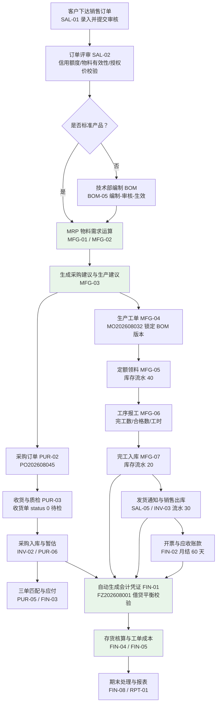

### 3.2 流程环节与模块对应表

| 序号 | 流程环节 | 触发方 | 产生单据/数据 | 承接模块 | 关联需求编号 |
|------|---------|-------|--------------|---------|-------------|
| 1 | 客户下达销售订单 | 客户 / 销售业务员 | 销售订单 `sal_order` + `sal_order_line` | 销售管理 | SAL-01 |
| 2 | 订单评审 | 系统 + 销售总监 | `order_status` / `approval_status` 变更 | 销售管理 | SAL-02、CS-01、SAL-07 |
| 3 | 非标产品编制 BOM | 技术部 | BOM 主表 + 明细（审核后生效） | 基础数据 | BOM-01~BOM-07 |
| 4 | MRP 物料需求运算 | 系统 | `mf_mrp_plan` + `mf_mrp_plan_item` | 生产制造 | MFG-01、MFG-02 |
| 5 | 生成采购建议与生产建议 | 系统 | 采购建议、生产建议 | 生产制造 | MFG-03 |
| 6 | 下采购订单 | 采购员 | 采购申请、采购订单 `pur_order` + `pur_order_line` | 采购管理 | PUR-01、PUR-02、PUR-07 |
| 7 | 下生产工单 | 生产计划员 | 生产工单 `mf_order`（锁定 BOM 版本） | 生产制造 | MFG-04、BOM-03 |
| 8 | 供应商送货与质检 | 仓管员 / 质检员 | 收货单 `pur_receipt`（`status` 0→1/2/3） | 采购管理 / 库存管理 | PUR-03、INV-04 |
| 9 | 采购入库与暂估 | 系统 | `inv_transaction`（`trans_type=10`）+ 暂估应付凭证 | 库存管理 / 财务管理 | INV-02、PUR-06、FIN-01 |
| 10 | 生产领料 | 车间 / 仓管员 | 领料单 `mf_order_issue` + `inv_transaction`（40） | 生产制造 / 库存管理 | MFG-05、INV-03 |
| 11 | 加工与报工 | 车间 / 操作工 | 报工记录（完工数/合格数/不合格数/工时） | 生产制造 | MFG-06、MFG-09 |
| 12 | 完工入库 | 车间 / 仓管员 | 完工入库 + `inv_transaction`（20）+ 凭证 | 生产制造 / 财务管理 | MFG-07、FIN-01 |
| 13 | 三单匹配与应付 | 应付会计 | 匹配结果 + 正式应付凭证 | 采购管理 / 财务管理 | PUR-05、FIN-03 |
| 14 | 销售发货与出库 | 仓库 / 系统 | 发货通知单 + `inv_transaction`（30）+ 成本凭证 | 销售管理 / 库存管理 | SAL-05、INV-03、FIN-01 |
| 15 | 开票与应收 | 应收会计 | 应收立账 `fin_receivable` | 财务管理 | FIN-02、SAL-03 |
| 16 | 凭证过账与月末核算 | 总账会计 / 成本会计 | `fin_voucher`（`voucher_status=1`）+ 产品实际成本 | 财务管理 | FIN-01、FIN-04、FIN-05 |
| 17 | 报表与仪表盘 | 管理层 / 各业务角色 | 经营仪表盘与各域报表 | 报表与分析 | RPT-01~RPT-07 |

### 3.3 支撑能力与业务域的贯穿关系

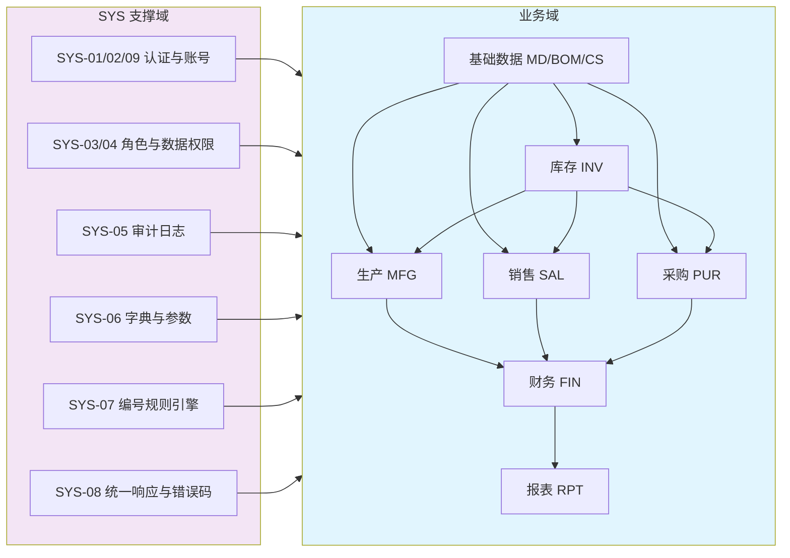

---

## 四、功能需求详细说明

本章分 **7 大业务域 + 1 个支撑域**：4.0 系统管理与平台能力（支撑域，SYS）、4.1 基础数据管理（MD/BOM/CS）、4.2 销售管理（SAL）、4.3 采购管理（PUR）、4.4 库存管理（INV）、4.5 生产制造管理（MFG）、4.6 财务管理（FIN）、4.7 报表与分析（RPT）。

> **编号口径**：4.1~4.7 各域的需求编号与《企业资源计划ERP系统需求规格说明书》完全一致（MD-01~05、BOM-01~06、CS-01~03、SAL-01~08、PUR-01~08、INV-01~10、MFG-01~10、FIN-01~08、RPT-01~07，共 65 条，编号不变），并在其上补充 15 条新增编号（SYS-01~11、MD-06、BOM-07、INV-11、FIN-09），全部登记于附录 A。

### 4.0 支撑域：系统管理与平台能力（SYS）

> **业务场景说明**：本域**不属于基线"7 大业务域"范畴**，是架构层面必需的支撑能力，对应《ERP系统开发阶段计划文档》阶段三 D2 子阶段（里程碑 M3 系统跑通：登录接口返回 token，JWT 安全体系生效）。
>
> 场景：申达电气订单由华东分公司业务员录入，业务员仅应看到本人负责客户的订单金额；销售总监可查看全部区域；仓库管理员只能看到 4 个中心仓库的库存；财务可查看全部金额；所有订单审核动作须留痕（操作人、时间、IP、变更前后值）以便审计与等保三级检查；全系统单据编号必须全局唯一且有统一规则（`SO202608001`、`PO202608045`、`MO202608032`、`FZ202608001`）。这些能力不解决"业务做什么"，但决定"业务能否安全、可控、可追溯地做"，因此单列支撑域管理。

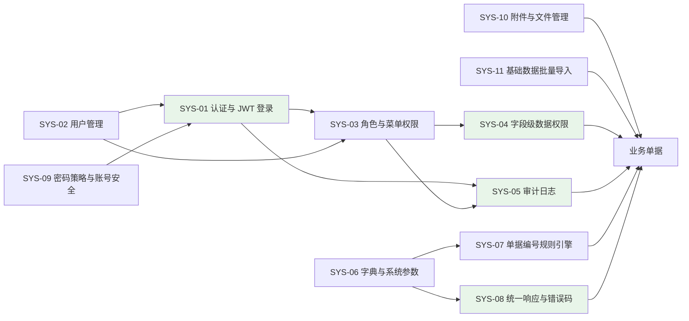

| 需求编号 | 需求名称 | 优先级 | 详细说明 | 验收要点 |
|---------|---------|-------|---------|---------|
| SYS-01 | 认证与 JWT 登录 | P0 | 统一登录入口 `POST /api/auth/login`（用户名 + 密码）。①框架：Spring Security 7 + `spring-boot-starter-oauth2-resource-server`，签发与校验使用 NimbusJwtEncoder/NimbusJwtDecoder（**禁用 jjwt**）；②access token 有效期 120 分钟、refresh token 有效期 7 天，密钥与 TTL 配置在 `application.yml` 的 `erp.jwt` 下；③token 载荷含用户 ID、用户名、角色编码集合、数据权限范围、签发时间、过期时间；④登出使 refresh token 失效；⑤登录成功、登录失败、登出、token 刷新四类事件均写登录日志（操作人、IP、时间、结果）；⑥未认证返回 HTTP 401，越权返回 HTTP 403，业务错误码落在 10001-10999 区间 | ①登录接口返回 `Result` 结构且 `data` 含 token 与过期时间；②携带 `Authorization: Bearer <token>` 可访问受保护接口，无 token 访问返回 401；③篡改 token 任一字符后访问返回 401；④连续 5 次密码错误后第 6 次登录被拒并提示账号锁定 30 分钟；⑤数据库 `sys_user.password` 为 BCrypt 密文（以 `$2a$` 开头），无明文；⑥登录日志可查询到上述四类事件记录 |
| SYS-02 | 用户管理 | P0 | 用户新增、修改、启停用、逻辑删除、重置密码、分配角色（多角色）、绑定所属组织/部门/可访问仓库；用户名全局唯一；停用用户不可登录且在线会话立即失效；用户与组织/仓库绑定关系用于数据权限计算；用户列表支持按组织、角色、状态筛选与分页 | ①新建用户并分配 2 个角色后登录，可见两角色菜单权限并集；②停用后立即无法登录，已登录会话下一次请求返回 401；③重复用户名保存返回 10001-10999 区间错误码；④列表可按组织/角色/状态组合筛选，默认 20 条/页；⑤用户删除后 `is_deleted=1` 且历史单据的操作人信息仍可显示 |
| SYS-03 | 角色与菜单权限 | P0 | 角色 CRUD 与授权：菜单树（目录/菜单/按钮三级）+ 按钮权限点（如 `sales:order:approve`）；用户-角色多对多；后端接口按权限点校验，未授权返回 403；前端菜单与按钮按权限点控制显隐；权限变更后在用户下次请求（≤5 分钟）或重新登录后生效 | ①关闭某角色"销售订单审核"权限点后，该角色用户调用审核接口返回 403，且前端审核按钮不渲染；②菜单接口返回的菜单树节点数与角色配置一致（节点数相等）；③同一用户多角色时权限取并集（验证 2 个角色的交集/并集用例）；④权限变更写入审计日志 |
| SYS-04 | 字段级数据权限 | P0 | 数据范围 6 档：全部 / 本组织及下级 / 本组织 / 本部门及下级 / 本部门 / 仅本人，另支持"自定义"（勾选组织或人员）；按业务对象配置过滤维度（销售订单按客户负责人或业务员、采购订单按采购员、工单按生产组织、库存按仓库）；列表、详情、导出三处使用同一过滤规则；金额与银行账号等敏感字段支持按角色掩码展示（如非财务角色金额按区间显示） | ①以"华东分公司业务员"账号查询销售订单列表，仅返回本人负责客户的订单（抽样 20 单核对一致，越界数据 0 条）；②以他人订单 ID 直接请求详情返回 403；③导出文件行数与列表行数一致；④非财务角色查看供应商银行账号显示为掩码（如 `6222****1234`）；⑤满足等保 2.0 三级"访问控制"测评项 |
| SYS-05 | 审计日志 | P0 | 覆盖销售订单、采购订单、生产工单、出入库单的创建、修改、审核、删除，以及凭证过账、反审核等关键动作；通过 `@AuditLog` 注解 + AOP 实现（禁止业务代码手工拼接日志）；记录操作人、操作时间、IP、操作类型、单据号、变更前后 JSON；日志只增不改不删（不提供删除接口）；在线保存 ≥180 天，超期数据归档为可查询的冷数据 | ①对同一张销售订单执行"创建→修改单价（1,850 元→1,800 元）→审核"三步，可查询到 3 条日志，每条含操作人、时间、IP、操作类型、单据号与变更前后 JSON；②按单据号精确检索返回结果 ≤3 秒；③日志无删除入口；④保存期 ≥180 天可在日志表中按时间范围验证 |
| SYS-06 | 数据字典与系统参数 | P0 | 字典类型/字典项两级维护（结算方式、物料分类、单据状态、客户维度标签等）；系统参数集中维护且修改后 ≤1 分钟生效（不重启服务），至少含：呆滞判定天数（默认 180）、保质期预警天数（默认 30）、A/B/C 类盘点频率（每月/每季/每半年）、信用控制开关（默认开启）、单价授权浮动比例（默认 ±5%）、三单匹配数量容差（默认 ±2%）与单价容差（默认 ±0.5%）、采购申请金额审批阈值（默认 5 万元）、采购价格预警阈值（默认 10%）；被引用的字典项禁止删除（逻辑删除）；参数变更写审计日志 | ①将呆滞判定天数由 180 改为 150 后重新执行呆滞识别，报表口径按 150 天输出（条数变化可核对）；②修改参数后 1 分钟内生效，无需重启服务；③删除被引用的字典项返回 10001-10999 区间错误码且数据未删除；④字典项在业务下拉框中的取值与配置一致（逐项比对 3 个字典） |
| SYS-07 | 单据编号规则引擎 | P0 | 规则 = 前缀 + YYYYMM + 3 位流水（**无连字符**），按单据类型独立流水、按月重置；覆盖 SO（销售订单）、PO（采购订单）、PR（采购申请）、RE（收货单）、DN（发货通知单）、MO（生产工单）、MI（领料单）、MR（报工单）、FG（完工入库单）、ST（盘点单）、TR（调拨单）、T（库存流水）、FZ（会计凭证）；并发下编号唯一（数据库唯一约束 + 冲突重试 ≤3 次）；编号一经生成不可修改；期初建账等特殊单据使用同一规则 | ①2026 年 8 月连续生成 3 张销售订单，编号依次为 `SO202608001`、`SO202608002`、`SO202608003`；②切换月份后首单编号为 `SO202609001`（按月重置）；③20 并发提交订单生成编号无重复（唯一约束校验 100% 通过）；④编号符合"前缀 + 6 位年月 + 3 位流水"格式且不含连字符；⑤各类单据前缀与上表一致（逐类型抽检 1 张） |
| SYS-08 | 统一响应与错误码 | P0 | 全部接口返回 `Result<T>`（字段：code、message、data、timestamp，分页数据置于 data 内）；成功 code=200；业务校验失败抛 `BusinessException`，由 `GlobalExceptionHandler` 统一转换为 Result，**严禁 try-catch 吞异常**；错误码集中定义在 `ErrorCode` 枚举：200 成功、10001-10999 通用（含系统管理与认证）、11001-11999 物料/BOM（含客户与供应商）、12001-12999 采购、13001-13999 销售、14001-14999 库存、15001-15999 生产、16001-16999 财务；错误消息面向业务人员可读（含具体单据号、物料编码或数值） | ①抽检 8 个接口（7 大业务域各 ≥1 个）响应体均为 Result 结构且含 4 个字段；②请求不存在的物料返回 code 落在 11001-11999；③请求不存在的销售订单返回 code 落在 13001-13999；④请求不存在的采购订单返回 code 落在 12001-12999；⑤OpenAPI 3 文档中的错误码清单与 ErrorCode 枚举一致（无未定义错误码） |
| SYS-09 | 密码策略与账号安全 | P0 | 密码长度 ≥8 位，且同时包含大写字母、小写字母、数字、特殊字符 4 类中的至少 3 类；密码有效期 90 天，到期强制修改；新密码不得与最近 3 次历史密码相同；管理员重置密码后用户首次登录强制修改；系统初始化幂等创建 `admin` 账号（初始密码 `Admin@123456`）并要求首次登录修改；账号锁定策略见 SYS-01 | ①使用 7 位密码或纯数字密码保存被拒并提示规则；②密码到期账号登录后仅可访问修改密码接口；③复用最近 3 次内密码被拒；④`admin` 首次登录强制跳转修改密码页面；⑤初始化逻辑重复执行 3 次后 `sys_user` 中 admin 记录仍为 1 条（幂等） |
| SYS-10 | 附件与文件管理 | P2 | 支持业务单据附件上传、预览、下载、删除（逻辑删除）；格式：PDF、JPG、PNG、XLSX、DOCX；单文件 ≤20 MB、单单据 ≤20 个附件；附件与业务单据关联（收货单质检报告、发票影像、BOM 图纸、退货照片）；下载与预览受数据权限约束（越权返回 403）；文件名与存储路径做安全处理（防路径穿越与可执行文件伪装） | ①上传 25 MB 文件被拒（错误码 10001-10999 区间）；②上传 5 MB PDF 后可在详情页预览与下载；③无权用户访问附件 URL 返回 403；④删除附件后原记录 `is_deleted=1` 且不可再下载；⑤上传含 `../` 的恶意文件名被拒且不产生目录穿越 |
| SYS-11 | 基础数据批量导入 | P1 | 提供 Excel 模板下载、数据导入、导入前校验（必填项、编码唯一性、引用存在性如分类/仓库/供应商/物料）、错误行定位回显（行号 + 错误原因）、导入结果日志（成功/失败条数、操作人、时间）；单次导入 ≤10,000 行；整批事务：任一行校验失败则整批不落库；用于阶段六期初主数据与 BOM 导入（与同目录 `04-数据迁移需求方案.md` 衔接） | ①导入 8,000 行物料模板（其中 5 行编码重复）时整批不落库，并回显 5 行错误行号与原因；②修正后重新导入 8,000 行全部成功，导入日志显示成功 8,000 / 失败 0；③导入后物料编码唯一性校验通过率 100%；④导入 10,001 行被拒并提示单批上限 |

### 4.1 基础数据管理（MD / BOM / CS）

> **业务场景说明**
>
> **场景一（一物多码）**：同一个"STM32F103 芯片"在采购部编号为 `IC-001`、仓库编号为 `WZ-089`、生产部编号为 `PL-023`，采购与仓库对账需人工比对本，每批次核对耗时约 1.5 小时；按抽样估算，8,000 条物料主数据中重复条目约占 6%~9%（约 480~720 条）。本模块统一全集团物料、客户、供应商的编码规则与属性定义，编码规则定为：**2 位一级分类 + 2 位二级分类 + 6 位流水，`-` 分隔，如 `01-03-000128`（电子料-芯片-第 128 号，共 12 字符）**。
>
> **场景二（BOM）**：企业主打产品 AC-300 变频器由 1 个主控板、1 个电源模块、1 个机箱外壳、1 套连接线束、1 个散热风扇及若干紧固件组成；主控板又由 PCB 光板、芯片、电容电阻等子件组成，形成多层 BOM。现状 3,500 个 BOM 分散在 7 个 Excel 文件中，同产品存在 V1.0 / V1.1 / V2 多版本并存，车间实际使用版本与工程师最新版本不一致，导致错料、废工且无法定位版本。
>
> **场景三（客商主数据）**：客户"申达电气"被分别登记为"申达电气"与"申达有限公司"，年度客户排行重复统计 2 条；供应商结算条件分散在采购员个人台账（如宏微科技月结 30 天）。

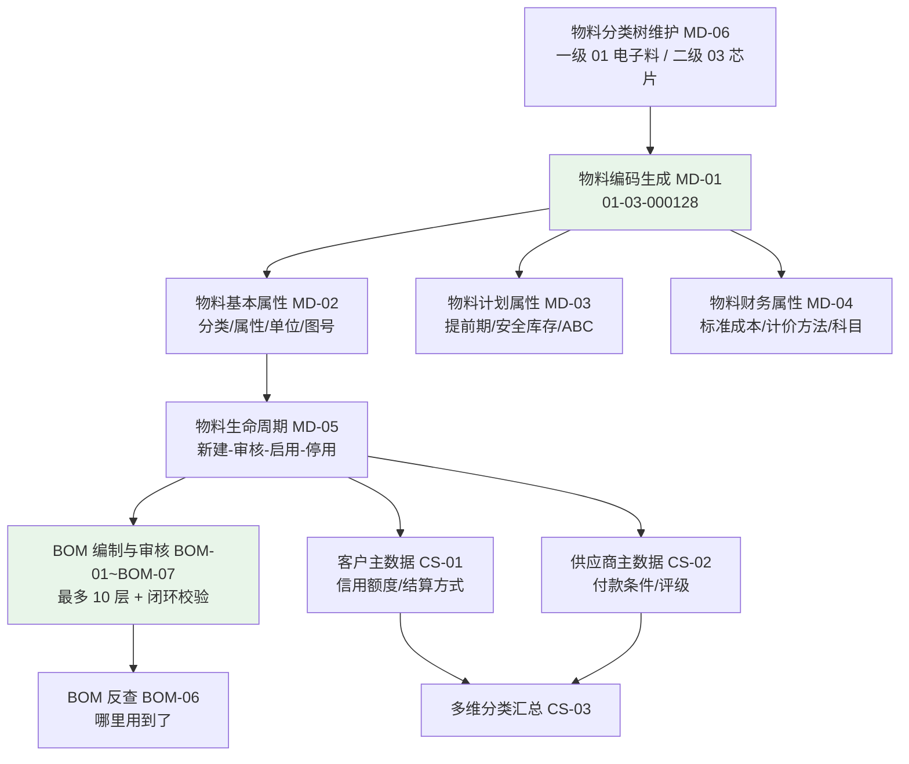

#### 4.1.1 需求表（物料主数据 MD）

| 需求编号 | 需求名称 | 优先级 | 详细说明 | 验收要点 |
|---------|---------|-------|---------|---------|
| MD-01 | 物料编码规则 | P0 | 编码 = 2 位一级分类 + 2 位二级分类 + 6 位流水，段间以 `-` 分隔，总长 12 字符，示例 `01-03-000128`；一/二级分类必须取自物料分类树（MD-06）中已启用节点；流水号在"一级分类 + 二级分类"组合内自 000001 起递增，已使用编码不复用；编码全局唯一（数据库唯一约束）；编码一经保存不可修改。**基线 API 文档中的 `MAT-IC-001` 为旧示例，本终稿起作废，不得再作为测试或文档示例** | ①在分类"01-03"下新建物料，自动生成形如 `01-03-000128` 的编码（12 字符、含 2 个连字符）；②手工录入 `MAT-IC-001` 被拒（错误码 11001-11999 区间）；③同一分类组合内不存在重复编码（唯一性校验通过率 100%）；④修改已保存物料的编码被拒 |
| MD-02 | 物料基本属性 | P0 | 必填：物料编码、物料名称、规格型号、计量单位（个/套/公斤/米等）、物料分类（原材料/半成品/成品/辅料/包装材料）、物料属性（自制/外购/外协）；选填：图号、图号版本、品牌、封装、备注；"物料名称 + 规格型号 + 计量单位 + 品牌"组合不得重复，重复时提示已存在的物料编码；支持批量维护与批量停用；物料列表支持按分类、属性、状态组合筛选 | ①保存同名同规格同单位同品牌物料被拒并提示已存在编码；②缺失任一必填字段保存返回 11001-11999 区间错误码并指明字段名；③物料详情页完整展示上述字段；④列表按 3 个条件组合筛选结果与手工统计一致 |
| MD-03 | 物料计划属性 | P0 | 采购提前期（天，≥0）、生产提前期（天，≥0）、安全库存量（≥0，DECIMAL(20,6)）、最小采购批量（≥1）、最大库存量（≥安全库存量）、ABC 分类（A/B/C）、默认供应商、默认仓库与库位；用于 MRP 运算（MFG-01）、安全库存预警（INV-07）与盘点频率（INV-06）；新增物料未维护提前期与安全库存时，MRP 按提前期 0 天、安全库存 0 参与运算，并在 MRP 结果页输出"计划参数缺失"清单 | ①IGBT 模块提前期 15 天、电解电容 7 天维护成功后，MRP 建议到货日期分别按 15/7 天倒推（抽查 3 条计算正确）；②安全库存录负数被拒；③ABC 分类为 A 的物料在盘点计划中按"每月"生成（INV-06 联动验证）；④MRP 结果页可导出"计划参数缺失"清单 |
| MD-04 | 物料财务属性 | P0 | 标准成本（DECIMAL(20,6)）、计价方法（0-移动加权平均 / 1-先进先出，默认移动加权平均）、默认科目（存货科目、成本科目、收入科目，须为会计科目表叶子科目）；标准成本用于报价参考与标准-实际成本对比，实际成本由 FIN-04/FIN-05 计算；计价方法仅在会计期间开启且该物料当月无出入库业务时允许变更，变更写审计日志（含变更前后值） | ①未选择叶子科目保存被拒（错误码 11001-11999 区间）；②AC-300 变频器标准成本可查询，并可生成"标准成本 vs 实际成本"对比表（阶段五 UAT 演示）；③当月已有出入库记录的物料变更计价方法被拒；④计价方法变更记录可在审计日志中查到变更前后值 |
| MD-05 | 物料生命周期 | P0 | 状态 4 态：0-新建、1-审核、2-启用、3-停用；仅"启用"物料可在新增业务单据（销售订单、采购订单、BOM、工单、出入库单）中被选择；停用物料不可新增业务但可继续查询历史单据、可出库清理存量；状态流转记录操作人与时间；删除仅允许"新建"状态且无任何引用（BOM/订单/库存/流水）时执行，且为逻辑删除 | ①停用物料在销售订单物料选择框搜索返回 0 条；②对已有库存的停用物料仍可创建销售出库单出清库存；③对已被 BOM 引用的物料执行删除返回 11001-11999 区间错误码；④状态变更历史可查询（含操作人、时间、原状态、新状态） |
| MD-06 | 物料分类管理 | P0 | 新增编号。两级分类树维护：一级分类编码 2 位（01~99）、二级分类编码 2 位，与物料编码前 4 位一一对应；支持新增、改名、排序、停用；停用分类下不可新建物料（已有物料不受影响）；分类编码调整或父级变更有物料关联时禁止；分类树最多 2 级 | ①新建一级"01 电子料"、二级"03 芯片"后在该分类下新建物料，编码前 4 位为 `01-03`；②停用分类后新建物料时该分类不可选；③尝试创建第 3 级分类被拒；④分类编码重复保存被拒 |

#### 4.1.2 需求表（BOM 物料清单 BOM）

| 需求编号 | 需求名称 | 优先级 | 详细说明 | 验收要点 |
|---------|---------|-------|---------|---------|
| BOM-01 | 多层BOM结构 | P0 | 支持自成品向下最多 **10 层**嵌套；父件可为成品或半成品；同一父件同一时刻仅一个"生效"版本；同一 BOM 内同一子件不可重复出现（唯一约束 BOM + 子件）；支持树形展开查看（按层展开、按需展开）与明细列表查看 | ①导入 AC-300 三层 BOM（AC-300 → 主控板组件 → PCB 光板/芯片/电容电阻）后树形展开层级与明细条数一致（层深 3）；②构造 11 层 BOM 保存被拒并提示层数超限；③同一 BOM 重复录入同一子件被拒；④展开查询响应 ≤2 秒（3 层、≤200 行明细） |
| BOM-02 | 用量与损耗率 | P0 | 每个子件定义标准用量（>0，如 1 个成品需 2 个某型号电容）与固定损耗率（0~100%，如贴片损耗按 3%）；定额领料量 = 父件计划数量 × 子件标准用量 × (1 + 损耗率)，按 6 位小数计算、除法采用 `RoundingMode.HALF_UP`；用量或损耗率变更须生成新 BOM 版本（BOM-03），不影响已下达工单 | ①工单 100 台、子件用量 2、损耗率 3% 时定额应领数 = 100×2×1.03 = 206（含小数时按 6 位小数、HALF_UP 计算）；②BOM 用量改为 3 后，已下达工单领料单定额仍为 206（版本锁定生效）；③损耗率录入 120% 或负数被拒 |
| BOM-03 | 版本管理 | P0 | 版本号格式 `V<主版本>.<次版本>`（如 V1.0、V1.1、V2.0）；每次修改生成新版本，旧版本保留为"历史"不可删除；版本状态 0-草稿、1-审核、2-生效、3-历史；同一父件同时仅一个"生效"版本；生产工单下达时锁定当时生效的 BOM 版本（`bom_id`），后续 BOM 变更不影响已下达工单；生效版本可设置生效日期与失效日期 | ①AC-300 BOM 由 V1.0 升版为 V1.1 并生效后，新建工单使用 V1.1；②已下达工单 `MO202608032` 的 `bom_id` 仍指向 V1.0，其领料定额不变（206 用例复验）；③旧版本列表状态为"历史"且明细可查；④删除历史版本被拒 |
| BOM-04 | 替代料管理 | P2 | 主料 + 1~N 个替代料；替代料定义优先级（1 最高）与替代规则（完全替代 1:1；部分替代按定义比例换算）；缺料时由生产计划员人工选择替代料（系统按优先级推荐），**本期不实现 MRP 自动替代**；替代关系记录替代原因与生效时间；使用替代料领料时库存流水记录替代料编码与实际用量 | ①为某芯片维护 2 个替代料（优先级 1、2），领料界面按优先级展示；②选择替代料领料后库存流水中物料编码为替代料编码（可查证）；③比例 1.5 的部分替代料按 100×1.5 换算用途正确；④本期 MRP 结果中不出现自动替代建议（验证无该行为） |
| BOM-05 | BOM审核流程 | P0 | 流程"编制（草稿）→ 主管审核 → 生效"；草稿或已驳回 BOM 不可用于 MRP 运算、不可生成定额领料单、不可被工单锁定；审核记录审核人、时间、结论；驳回须填写驳回原因；审核与变更均写审计日志 | ①草稿 BOM 触发 MRP 运算被拒（错误码 11001-11999 区间）；②审核通过后同一操作成功；③驳回后状态为草稿且驳回原因可查；④审核记录（审核人、时间、结论）在 BOM 详情与审计日志中均可查到 |
| BOM-06 | BOM反查 | P1 | "哪里用到了"反查：输入任一物料，查询其被哪些父件 BOM 引用，并逐层向上展开至顶层成品，展示路径（父件编码、版本、用量、损耗率）；生效/历史版本可切换；结果支持导出 | ①以 IGBT 模块反查，路径条数与构造用例一致；②以 AC-300 成品反查返回空并提示"无上级引用"；③反查结果导出 Excel 行数与界面一致；④反查响应 ≤3 秒（3,500 个 BOM 全量数据下） |
| BOM-07 | BOM 闭环与合法性校验 | P0 | 新增编号。保存与审核两个时点均执行 5 项校验并阻断失败：①父件不可作为自身子件；②层级深度 ≤10 层；③闭环检测（如 A→B→C→A），失败时提示完整闭环路径；④子件用量 >0 且损耗率 0~100%；⑤子件物料状态必须为"启用"（MD-05）；批量导入（SYS-11）同样执行 | ①构造 A→B→C→A 用例保存被拒，提示包含闭环路径"A→B→C→A"，错误码 11001-11999 区间；②构造 11 层用例被拒并提示层数；③引用停用物料的 BOM 保存被拒；④阶段三 D3 该 5 项校验均有单元测试覆盖且通过（单测报告可查） |

#### 4.1.3 需求表（客户与供应商主数据 CS）

| 需求编号 | 需求名称 | 优先级 | 详细说明 | 验收要点 |
|---------|---------|-------|---------|---------|
| CS-01 | 客户管理 | P0 | 字段：客户编码（规则 `CUS` + 4 位流水，如 CUS0001，与物料编码规则区分）、客户名称、统一社会信用代码（18 位）、联系人、联系方式、收货地址（支持多地址并指定默认）、结算方式（月结 30 天/60 天/款到发货等，销售订单默认带出）、信用额度（≥0）、信用期限（天）、启停用状态；"客户名称 + 统一社会信用代码"唯一；停用客户不可新增订单但可继续发货与收款；**信用额度占用规则：可用额度 = 信用额度 − 已审核未发货订单金额 − 未核销应收余额** | ①录入 17 位统一社会信用代码被拒；②录入重复客户名称被拒并提示已存在编码；③申达电气信用额度、期限（月结 60 天）可查询并作为 SC-01 订单默认值；④用 3 组数据验算可用额度与规则一致，超额度订单触发特批（SAL-02） |
| CS-02 | 供应商管理 | P0 | 字段：供应商编码（规则 `SUP` + 4 位流水）、供应商名称、统一社会信用代码、联系人、联系方式、供货品类（物料一级分类多选）、结算方式与付款条件（如月结 30 天）、开户行与银行账号（脱敏展示，仅财务角色可见全码）、评级（A/B/C）、准入状态（启用/停用）；"供应商名称 + 统一社会信用代码"唯一；停用供应商不可新增采购订单但可继续收货与结算 | ①供应商编码按 `SUP` + 4 位自动生成；②银行账号在非财务角色界面显示掩码（如 `6222****1234`）；③停用供应商在采购订单供应商选择框中不可见；④重复统一社会信用代码保存被拒；⑤宏微科技付款条件（月结 30 天）作为 SC-05 采购订单默认值 |
| CS-03 | 客户/供应商多维分类 | P1 | 支持按地区（华东/华南/华北等）、行业、规模、客户等级（战略/重点/普通）等维度打标签，一个对象可命中多个维度；维度与标签由数据字典（SYS-06）维护，新增维度无需改代码；报表（RPT-02、RPT-03）可按任意维度汇总且与分类主数据实时一致 | ①为申达电气打"华东 + 电气行业 + 重点客户"3 个标签后，按"华东"维度汇总销售排行包含该客户且金额与订单一致；②新增 1 个维度标签仅通过字典配置即可使用（无代码变更）；③按维度导出报表行数与筛选结果一致 |

### 4.2 销售管理（SAL）

> **业务场景说明**：华东区域客户"申达电气"于 **2026-08-15** 下达一份采购订单：订购 AC-300 变频器 **100 台**，单价 **1,850 元/台**（标准售价 1,900 元，给予批量折扣 50 元/台），要求交货日期 **2026-09-30**，分批交货（**2026-09-20 交 50 台、2026-09-30 交 50 台**），结算方式为 **月结 60 天**（对应场景 SC-01，全篇数据一致）。
>
> 现状痛点：3 个分公司各用一套 Excel 台账且模板不同（华东 `SO-华东-2026-0815`、华南 `订单号-20260815-01`），集团月度分析需人工合并 2 个工作日；报价依赖业务员个人价目表，AC-300 对同一客户在 2026 年 3/6/8 月分别报出 1,900 / 1,850 / 1,780 元且无审批留痕；信用额度靠财务人工查台账，2026 年上半年发生 3 笔超额度发货（合计约 86 万元）；客户催单需电话询问车间，响应超过 4 小时；2026 年 7 月月度对账出现未达账项 27 笔；分批交货计划以备注文字记录（"9/20 交 50、9/30 交 50"）无法自动拆解，分批交货订单占比约 38%，存在漏发、错发。本域需求即针对上述 6 项痛点设计。

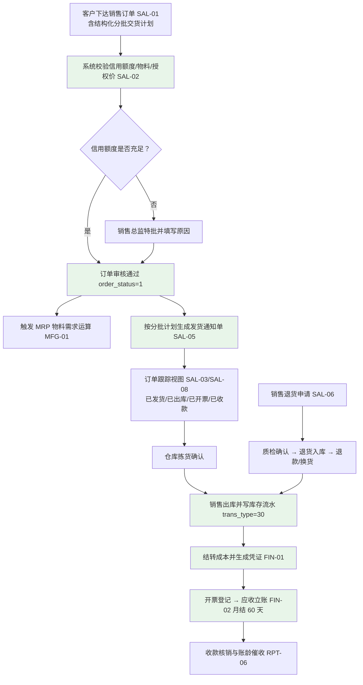

| 需求编号 | 需求名称 | 优先级 | 详细说明 | 验收要点 |
|---------|---------|-------|---------|---------|
| SAL-01 | 销售订单录入 | P0 | 录入字段：客户、订单日期、要求交货日期、承诺交货日期、物料编码（仅可选"启用"物料）、数量（>0）、单价（不含税，≥0）、含税/不含税标识、税率（默认 13%）、币别（默认 CNY）、分批交货计划、付款条件（默认取客户结算方式）、订单备注；**分批交货计划为结构化明细**（批次号、交货日期、交货数量，各批次数量合计必须等于订单数量），不接受文字备注形式；订单行号在单据内连续唯一；订单编号由 SYS-07 生成（如 `SO202608001`） | ①录入 SC-01 订单（AC-300 100 台、单价 1,850 元、2026-09-30 交货、9/20 交 50 台与 9/30 交 50 台、月结 60 天）保存成功，订单总金额 = 100 × 1,850 = 185,000 元且金额精度 6 位小数；②分批计划合计（100）与订单数量不符时保存被拒并提示差异；③数量录 0 或负数被拒；④订单号格式为 `SO202608001`；⑤含税/不含税标识切换后税额与含税金额计算正确（按 13% 验算 1 组） |
| SAL-02 | 销售订单审核 | P0 | 审核时自动校验 3 项：①客户信用额度（可用额度 = 信用额度 − 已审核未发货订单金额 − 未核销应收余额）；②物料存在且为"启用"状态；③单价在授权价区间内（授权浮动比例由 SYS-06 维护，默认 ±5%，基准为标准售价或适用价格策略价）；超额度或超价区间时转特批流程（销售总监审批，**必须填写特批原因**），特批通过后放行并留痕；审批结论记录 `approval_status`（0-待审 1-通过 2-驳回），驳回必须填写原因；审核通过后执行状态置为 `order_status=1` | ①客户可用额度不足时审核被拦截，提示含缺口金额；②未特批前订单状态保持待审，特批通过后可审核通过；③单价低于授权区间下限时触发特批（如标准售价 1,900 元、下浮 5% 下限 1,805 元，录入 1,780 元触发）；④审核与特批记录可在审计日志中查到（含操作人、时间、IP、变更前后值）；⑤物料为停用状态时审核被拒（错误码 13001-13999 区间） |
| SAL-03 | 订单执行状态跟踪 | P0 | 订单详情页实时展示：已发货数量、已出库数量、已开票数量、已收款金额、未发货余额、关联生产工单号及工单进度（状态、工序完成率、合格率、预计完工日期）、关联采购订单号（外购件）；页面刷新即为实时值（数据延迟 ≤1 分钟）；支持按客户、物料、日期区间、订单状态多条件查询订单执行清单并导出 | ①SC-01 订单发货 50 台后页面显示"已发货数量 = 50、未发货余额 = 50"；②关联工单 `MO202608032` 的完工进度与报工记录一致（抽样 20 张在制工单误差 0）；③已开票数量与应收立账金额匹配（差额 0）；④四条件组合查询结果与手工统计一致，导出行数 = 列表行数 |
| SAL-04 | 销售订单变更 | P0 | 支持数量、单价、交期的变更申请与审批；变更单记录字段级前后值（before/after JSON）并保留全部历史版本；变更审核通过前订单按原值执行，通过后按新值执行；**已发货行不允许将数量减少到低于已发货数量**；变更引起金额变化时重新校验信用额度（SAL-02）；变更全程写审计日志 | ①将 SC-01 订单 9/30 批次数量由 50 改为 30 并审核通过后，订单数量合计为 80、未发货余额按新值计算；②变更历史可查询到前后值对比（改前 50、改后 30）；③将数量改为低于已发货数量（已发 50 改为 30）被拒；④变更后信用额度重算并生效（额度不足时拦截）；⑤变更记录可在审计日志中按单据号检索到 |
| SAL-05 | 销售发货管理 | P0 | 按销售订单分批交货计划生成发货通知单（一批次对应一张，编号 DN + YYYYMM + 3 位流水）；仓库按发货通知单拣货确认后生成销售出库并写库存流水（`trans_type=30`），自动扣减成品库存；发货数量默认等于该批次计划数量，可下调但不得超过未发货余额；出库完成后回写订单执行状态（2-部分发货 / 3-已发货）与明细 `delivered_qty`；出库同时按移动加权平均结转成本并生成会计凭证（借 主营业务成本 贷 库存商品）；**同一发货通知单重复提交不产生第二条流水（幂等）** | ①2026-09-20 批次生成发货通知单，仓库确认出库后：库存流水新增 1 条 `trans_type=30` 且 `out_qty=50`、`after_qty = before_qty − 50`，订单 `order_status=2`、行 `delivered_qty=50`；②2026-09-30 批次出库后 `order_status=3`；③发货数量超过未发货余额被拒（错误码 13001-13999 区间）；④同一发货通知单重复提交两次仅产生 1 条流水；⑤对应凭证金额 = 出库数量 × 移动加权平均单位成本，借贷平衡（差额 0） |
| SAL-06 | 销售退货管理（RMA） | P1 | 全流程：退货申请（关联原销售订单与出库批次）→ 质检确认（合格数量/不合格数量）→ 退货入库（写库存流水，入库方向）→ 退款/换货处理（退款生成红字应收冲减，换货生成新发货通知单）；退货数量 ≤ 原订单已发货数量 − 已退货数量；退货单编号 RT-S + YYYYMM + 3 位流水；退货入库成本按原出库单价回冲 | ①对 SC-01 订单发起退货 5 台、质检合格 5 台后：库存增加 5 台、应收冲减 5 × 1,850 = 9,250 元；②退货数量超过可退余额被拒（错误码 13001-13999 区间）；③退款与换货两种处理路径均可走通并留痕；④退货各环节操作人与时间可在审计日志中查到 |
| SAL-07 | 销售价格管理 | P1 | 支持按客户等级、产品品类、订货数量区间设置价格策略，优先级为"客户 + 物料 > 客户等级 + 品类 > 品类 > 标准售价"，同条件多条策略按生效日期取最新；下单时自动带出适用单价，人工调整受授权区间约束（SAL-02）；历史售价可按客户 + 物料查询（含报价/成交时间、成交单价、折扣金额）；价格策略变更须审核并写审计日志 | ①为"重点客户 + 变频器品类"配置折扣后，下单 AC-300 自动带出 1,850 元（标准售价 1,900 元、折扣 50 元/台）；②查询 AC-300 对申达电气历史售价可见 2026 年 3/6/8 月三笔记录（1,900 / 1,850 / 1,780 元）；③人工调整单价超出授权区间触发特批（联动 SAL-02）；④策略变更记录可在审计日志中查到 |
| SAL-08 | 销售跟单看板 | P0 | 业务员可在销售订单页面直接查看：外购件对应采购订单执行状态（下单/到货/质检/入库/未到货余额）与自制件对应生产工单执行状态（状态、领料齐套情况、工序进度、合格率、预计完工日期）；支持"紧急、超期、未排产"过滤；提供"一键复制订单执行摘要"用于答复客户；看板数据受 SYS-04 数据权限约束（业务员仅见本人负责客户） | ①SC-01 订单页面可查看采购订单 `PO202608045`（IGBT 200 个）的已收货/未收货数量与工单 `MO202608032` 的工序进度；②"超期"过滤清单（要求交货日期早于当日）与手工统计一致；③业务员 A 查询业务员 B 客户看板数据返回 0 条（越界数据 0）；④催单场景下业务员从查询到获得进度信息的操作耗时 <1 分钟（阶段五 UAT 计时验证） |

### 4.3 采购管理（PUR）

> **业务场景说明**：MRP 运算后生成采购建议：为满足 AC-300 变频器的生产，需采购 IGBT 模块 **200 个**（供应商"宏微科技"，单价 **85 元/个**，采购提前期 **15 天**）、电解电容 **400 个**（供应商"艾华集团"，单价 **2.3 元/个**，提前期 **7 天**，保质期 3 年，对应场景 SC-02）。采购员据此下达采购订单（如 `PO202608045`），货物到达后经质检合格入库，月底供应商开来增值税专用发票（宏微科技月结 30 天），财务进行三单匹配后付款（对应场景 SC-05）。
>
> 现状痛点：紧急采购（当天提当天要）占比约 30%；无采购价格历史库（同一物料向同一供应商最近三次采购价 12.5 / 13.8 / 11.9 元，2026 年上半年同物料最高价与最低价差达 16%）；收货质检无系统记录（上半年 5 批不合格品合计约 12 万元超期未退）；三单匹配人工完成（月末 2 人 3 天，发现 7 笔数量/单价不符合计差异 4.3 万元）；暂估处理不规范（2026 年 6-8 月 46 笔货到票未到业务中 12 笔未做暂估，当月成本少计约 28 万元）。

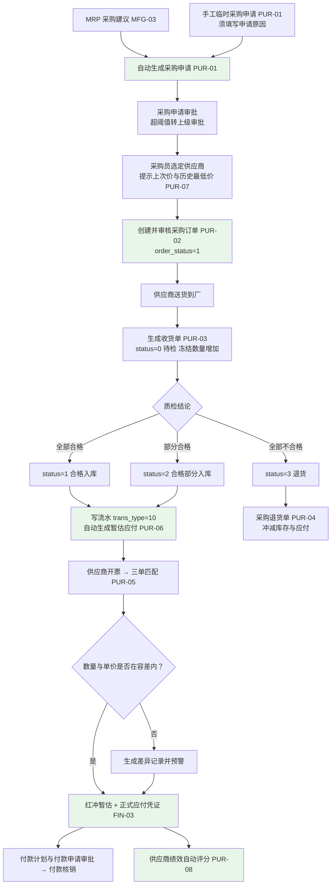

| 需求编号 | 需求名称 | 优先级 | 详细说明 | 验收要点 |
|---------|---------|-------|---------|---------|
| PUR-01 | 采购申请管理 | P0 | 两类来源并标记：①MRP 采购建议自动转采购申请（来源 `MRP`，记录建议批次号如 `MRP202608001`）；②手工临时采购申请（来源 `手工`，**必须填写申请原因**）；字段：物料、数量、需求日期、需求仓库、建议供应商、来源、申请原因；申请须审批（采购经理，金额超阈值转上一级，阈值由 SYS-06 维护，默认 5 万元）；编号 PR + YYYYMM + 3 位流水；已转单申请行不可重复转采购订单（幂等）；申请来源分布可按月统计（用于紧急采购占比管控，目标 ≤10%） | ①MRP 建议一键转申请后来源为 `MRP` 且建议行状态置为"已转申请"，重复点击不再生成申请；②手工申请未填原因保存被拒；③申请审批通过后转采购订单，重复点击"转订单"不产生第二张订单；④按来源统计的申请数量与数据一致，紧急（手工）采购占比可在报表中查询 |
| PUR-02 | 采购订单管理 | P0 | 字段：供应商、采购物料、数量、单价（不含税）、税率（默认 13%）、要求到货日期、交货方式、付款条件（默认取供应商结算方式）、收货仓库、关联采购申请号；支持创建、修改、审核、关闭、取消（`order_status` 0-草稿 1-审核 2-部分收货 3-已收货 4-已关闭）；审核通过后关键字段（供应商、物料、数量、单价）不可直接修改，须走变更单并保留前后值；编号 PO + YYYYMM + 3 位流水（如 `PO202608045`）；已收货行不可取消，仅可关闭 | ①创建 SC-02 采购订单（IGBT 200 个 × 85 元、电解电容 400 个 × 2.3 元，要求到货日期按提前期 15/7 天倒推）并审核通过，订单号符合 `PO202608045` 格式；②审核后直接修改单价被拒，走变更单成功并记录前后值；③已部分收货订单取消被拒、关闭成功且状态为 4；④订单金额 = 200 × 85 + 400 × 2.3 = 17,920 元（不含税）计算正确 |
| PUR-03 | 采购收货与质检 | P0 | 流程：货物到厂生成收货单（`status=0 待检`，数量进入 `frozen_qty` 冻结，不增加可用库存）→ 通知质检 → 质检录入 `qualified_qty` 与 `reject_qty`：全部合格 `status=1`、部分合格 `status=2`、全部不合格 `status=3`；合格数量写 `trans_type=10` 流水并增加可用库存，按合格数量生成暂估应付；不合格数量入退货仓/隔离仓并触发退货（PUR-04）；收货单以"物料 + 收货批次"为记录粒度，一张收货单可含多条记录，整单状态取明细汇总；编号 RE + YYYYMM + 3 位流水；**质检结论落在收货单（`qualified_qty`/`reject_qty`/`status`），不单独建质检单据与编号序列**；**收货数量不得超过订单未收货数量**；登记供应商批次号、生产日期、有效期；重复提交同一收货单不产生重复流水（幂等） | ①IGBT 收货 200 个、质检合格 195 个、不合格 5 个：收货单 `status=2`、库存流水 1 条 `in_qty=195`、冻结数量先增 200 后减 200、暂估应付 = 195 × 85 = 16,575 元；②不合格 5 个进入隔离仓并可发起退货；③收货 201 个（超订单未收货余额）被拒（错误码 12001-12999 区间）；④收货单详情可查看质检结论（合格/不合格数量、检验人、检验时间）；⑤系统中不存在独立质检单据编号序列 |
| PUR-04 | 采购退货 | P1 | 支持不合格品或多余物料退货：退货单关联收货单与采购订单，退货数量 ≤ 该收货单不合格数量（对已入库物料退货须经采购经理审批）；退货出库写库存流水（出库方向）冲减库存，同时冲减应付（暂估或正式应付）；编号 RT-P + YYYYMM + 3 位流水；退货进度可跟踪（发出/在途/供应商确认/退款或换料）；可查询超期 30 天未完成退货的清单（现状 5 批不合格品合计约 12 万元超期未退，目标归零） | ①对不合格 5 个 IGBT 发起退货：库存减少 5 个、应付冲减 5 × 85 = 425 元；②退货数量超过不合格数量被拒；③超期 30 天未确认退货清单可查询且条数与构造用例一致；④退货各环节状态与时间可查（审计日志） |
| PUR-05 | 三单匹配 | P0 | 系统自动对采购订单、收货入库单、供应商发票三者匹配：数量容差 ±2%、单价容差 ±0.5%（按不含税单价比较），容差由 SYS-06 维护；匹配通过生成正式应付并红冲暂估；不符时生成差异记录并预警（差异类型：数量差异 / 单价差异 / 无订单 / 无收货），差异清单推送采购员与应付会计处理；匹配结果可按供应商、物料、期间查询；支持"一单多票"与"一票多单" | ①SC-05 场景三单匹配通过后生成正式应付凭证，同时暂估余额为 0（红冲金额相等、方向相反）；②构造单价差异 1%（超 0.5% 容差）用例生成差异记录且**不生成**正式应付；③月末匹配当日内完成（阶段五 UAT 计时验证，现状为 2 人 3 天）；④差异清单可导出且行数与界面一致 |
| PUR-06 | 暂估入库 | P0 | 货物已入库但发票未到时，按采购订单单价与合格入库数量自动暂估入账（借 原材料 贷 应付账款-暂估），暂估凭证由收货单审核驱动自动生成；发票到达且三单匹配通过后自动生成红字凭证红冲暂估并生成正式应付凭证；**暂估覆盖规则：全部合格入库且未匹配发票的收货单 100% 生成暂估，不提供人工跳过入口**；暂估清单可按供应商/期间查询；上月暂估未匹配清单条数为月结检查项（与 FIN-08 联动，现状 46 笔中 12 笔未暂估、成本少计约 28 万元，目标 100% 覆盖） | ①收货单审核通过后 ≤1 分钟生成暂估凭证（借 原材料 16,575 元 贷 应付账款-暂估 16,575 元）；②发票匹配后生成红字暂估凭证与正式应付凭证，红冲金额与原暂估相等；③凭证与来源单据可双向追溯（凭证含 `source_biz_type`、`source_biz_id`，可回溯到收货单）；④月结界面可查看"上月暂估未匹配清单"条数 |
| PUR-07 | 采购价格管理 | P1 | 记录每个"供应商 + 物料"的历史采购价格（含订单号、下单日期、不含税单价）并形成价格走势；下单时自动提示该组合的上次采购价与历史最低价（含对应日期）；本次报价高于历史最高价或偏离预警阈值（默认 10%）时提示预警并要求填写价格说明；价格历史可按供应商、物料、期间查询与导出 | ①某物料向同一供应商历史三笔价格（12.5 / 13.8 / 11.9 元）可在走势中查到并按时间排序（最近一次 11.9 元）；②下单时提示上次价 11.9 元与历史最低价 11.9 元；③报价高于最近价 12%（超 10% 阈值）时预警并要求填写说明；④价格历史导出 Excel 行数与界面一致 |
| PUR-08 | 供应商绩效评估 | P1 | 按 4 维度自动评分（总分 100）：交货准时率 40 分（准时批次/总批次）、质量合格率 30 分（合格数量/收货数量）、价格水平 20 分（与同类物料平均价偏离度，越低越高分）、服务响应 10 分（异常/退货平均响应时长，由人工录入响应时长）；评分周期为自然月，自动生成评分明细与总分；评级 A ≥90、B 75~89、C <75；可查看连续多月趋势；评分结果用于下单时供应商展示排序（本期仅展示建议，不强制约束） | ①用月度数据生成的 4 个维度分值合计 = 总分，且各维度计算式可与原始单据核对一致（抽样 1 家供应商误差 0）；②评级按 A/B/C 分档正确（构造 89 分与 90 分边界用例）；③可查看连续 3 个月评分趋势；④评分结果可导出且行数与界面一致 |

### 4.4 库存管理（INV）

> **业务场景说明**：企业共有 **4 个中心仓库**——**原材料仓**（电子料、结构件分库位存放）、**半成品仓**、**苏州成品仓**、**东莞成品仓**，库位约 260 个。关键物料如 IGBT 模块需按批次号管理（用于质量追溯），电解电容需管理生产日期和保质期（**3 年**）。仓库日常业务包括：采购入库、生产领料出库、半成品/成品入库、销售出库、盘点、库位调拨。
>
> 现状痛点：手工记账导致账实差异率约 2.3%（目标 ≤0.5%）；4 个仓库数据不互通，跨仓查料平均 2 小时，出现 A 仓缺料、B 仓同料呆滞 180 天以上并存；呆滞库存占比 18%（目标 <8%）；批次与保质期无台账，2026 年 4 月发现 2 批共 18,000 只电解电容超期、损失约 4.1 万元；全面盘点需停产 2 天、4 仓 15 人参与，A 类物料按月盘点难以执行；出库按货位就近取料未执行先进先出，成本口径与实物流不一致；日出入库流水约 900 条。
>
> **库存核心原则（不可违反）**：任何库存变动必须先写 `inv_transaction` 流水，再更新 `inv_stock` 余额；余额更新带乐观锁 `version` 校验，必须处理乐观锁失败。

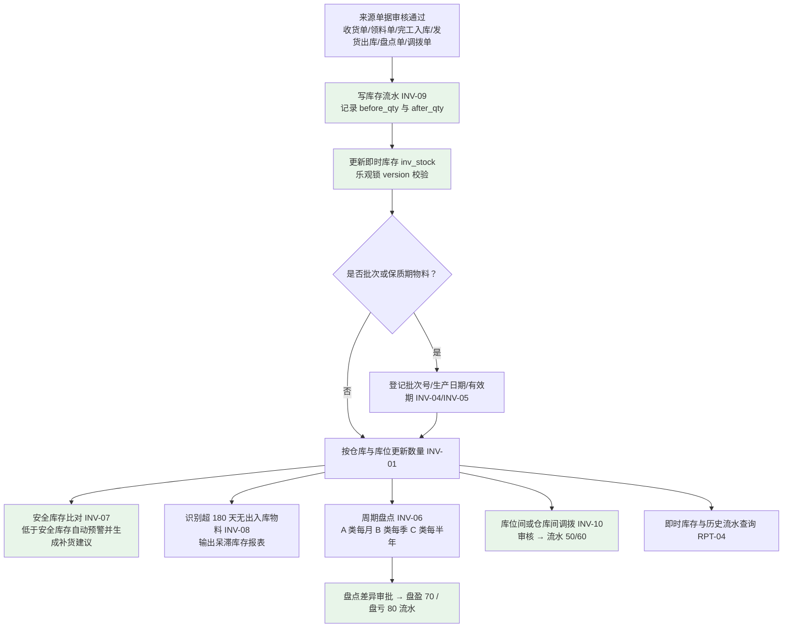

| 需求编号 | 需求名称 | 优先级 | 详细说明 | 验收要点 |
|---------|---------|-------|---------|---------|
| INV-01 | 多仓库/多库位管理 | P0 | 支持多仓库与库位（货架/货位）定义：4 个中心仓 = **原材料仓、半成品仓、苏州成品仓、东莞成品仓**，库位约 260 个；物料可指定默认仓库与默认库位；库位支持启用/停用与容量标记；库存按"物料 + 仓库 + 库位 + 批次"维度记账；仓库间与库位间移动必须通过调拨单（INV-10），不允许直接改数量 | ①4 个仓库与 ≥260 个库位可维护（列表条数核对）；②物料指定默认库位后新建领料单默认带出该库位（抽查 5 条）；③停用库位不可在新建单据中选择；④库存查询可按仓库与库位两级钻取，四个仓库汇总数与逐条明细一致（差值 0） |
| INV-02 | 入库管理 | P0 | 支持入库类型：采购入库（`trans_type=10`）、生产完工入库（20）、销售退货入库、调拨入库（50）、盘盈（70）；入库登记批次号、生产日期、有效期（批次/保质期物料必填）；入库写流水并更新余额，流水必含 `before_qty`、`after_qty`，且满足 `after_qty = before_qty + in_qty − out_qty`；流水在来源单据审核通过时生成；同一来源单据重复审核不产生重复流水（幂等） | ①4 类入库各执行 1 次，`inv_transaction` 各新增对应记录且 `after_qty` 计算正确（20 笔差值校验为 0）；②批次管理物料入库未填批次号被拒（错误码 14001-14999 区间）；③同一收货单重复审核仅产生 1 条流水；④批次号、生产日期、有效期可在批次台账中查询 |
| INV-03 | 出库管理 | P0 | 支持出库类型：生产领料出库（40）、销售出库（30）、采购退货出库、调拨出库（60）、盘亏（80）；生产领料按工单定额领料（定额 = 计划数量 × BOM 用量 × (1 + 损耗率)），超定额领料须审批；**库存不足时拦截（可用量 = `qty − frozen_qty`）**；出库支持先进先出或指定批次（依物料计价方法 MD-04）；出库后实时回写余额并记录成本单价 | ①领料 206（定额）直接通过，领料 220 触发超定额审批流并要求填写原因；②可用库存 100 时申请出库 120 被拦截并提示可用量 100（错误码 14001-14999 区间）；③出库后 `after_qty = before_qty − out_qty`（抽样 20 笔差值 0）；④超定额审批记录（审批人、原因、时间）可在审计日志中查到 |
| INV-04 | 批次与序列号追溯 | P1 | 关键物料（IGBT 模块、主控芯片等，约占总物料 15%）启用批次管理，记录每批次的供应商、入库日期、质检报告号、入库数量；成品启用序列号管理（以批次 + 序列号字段承载）；支持双向追溯：由成品批次反查所用零部件的供应商批次，由原材料批次正查流向的成品批次；批次台账可按批次号、物料、供应商、入库日期查询 | ①IGBT 模块入库 3 个批次后，批次台账可按批次查询供应商与质检结论（条数与收货单一致）；②抽取 1 个成品批次反查，列出其使用的 IGBT 批次号及供应商，路径完整且用量与 BOM 一致；③未启用批次管理的物料入库不要求批次号；④追溯查询响应 ≤3 秒 |
| INV-05 | 保质期管理 | P1 | 对有保质期要求的物料（电解电容 3 年、电池等）设置保质期天数（MD-03 扩展字段）；入库登记生产日期后自动计算有效期；**到期前 30 天自动预警**（每日定时生成预警清单）；超期物料出库默认拦截（参数可配置为"需质检确认后放行"）；预警清单可按仓库/物料筛选并导出；现状已发生 2 批共 18,000 只电解电容超期损失约 4.1 万元，目标超期损失归零 | ①生产日期 2026-01-01、保质期 3 年的电解电容有效期显示为 2029-01-01；②构造"当前日期 = 有效期 − 30 天"用例，预警清单包含该批次；③超期批次出库被拦截并提示超期天数（错误码 14001-14999 区间）；④预警清单每日刷新且导出文件行数与界面一致 |
| INV-06 | 库存盘点 | P0 | 支持周期盘点（按 ABC 分类：A 类每月、B 类每季度、C 类每半年，频率由 SYS-06 参数控制）与全面盘点；盘点单生成时冻结账面快照 `book_qty`；录入实盘数后自动计算差异（盘盈/盘亏数量与金额）；差异须审批，审批通过后自动生成盘盈（70）/盘亏（80）流水并调整库存账；盘点单编号 ST + YYYYMM + 3 位流水；盘点期间不影响收发货作业（不停产）；输出盘点准确率（1 − 差异行数/总行数） | ①生成 A 类物料月度盘点单，构造 3 行差异，审批通过后生成对应的 70/80 流水（数量、金额可核对）；②未审批前不生成任何调整流水（验证）；③盘点期间生产领料与销售出库仍可正常执行（演示 1 次）；④盘点准确率报表输出数值（目标 ≥99.5%）；⑤盘点差异调整记录可在审计日志中查到审批人 |
| INV-07 | 安全库存预警 | P0 | 可用库存低于安全库存（MD-03）时自动预警并生成补货建议（建议数量 = 安全库存 − 可用库存，再按最小采购批量向上取整、结合提前期给出建议到货日期）；预警清单每日刷新，支持按仓库、物料分类、ABC 分类筛选；补货建议可一键转采购申请（PUR-01）；预警处理可跟踪（未处理 / 已转申请 / 已忽略并填原因） | ①安全库存 100、可用库存 80 时预警清单包含该物料且建议补货量按规则 = 20（考虑最小采购批量后取整）；②一键转采购申请成功，申请来源标记为"安全库存建议"；③忽略预警必须填写原因且记录操作人；④预警清单可按 3 个条件筛选并导出 |
| INV-08 | 呆滞库存分析 | P1 | 自动识别超过 **180 天**（由 SYS-06 参数控制）未发生出入库的物料，生成呆滞库存报表（含物料、仓库、批次、数量、金额、最后变动日期、呆滞天数）；支持按金额与呆滞天数排序；按仓库、物料分类、ABC 分类筛选；支持导出与处置标记（继续持有 / 降价处理 / 报废），处置标记记录处置人与时间 | ①构造最后变动日期为 181 天前的物料，呆滞报表包含该物料且呆滞天数 = 181，180 天内的物料不出现；②呆滞占比按报表口径计算并可与目标 <8% 对比展示；③处置标记保存成功且显示处置人/时间；④按金额降序导出，行数与界面一致 |
| INV-09 | 库存流水与即时库存 | P0 | 每笔出入库业务实时写 `inv_transaction` 流水（**只增不改不删**，字段含流水号、物料、仓库、库位、批次、`trans_type`、`source_biz_type`、`source_biz_id`、`in_qty`、`out_qty`、`before_qty`、`after_qty`、`unit_cost`、业务时间）并同步更新 `inv_stock`（乐观锁 `version` 校验，冲突重试 ≤3 次并记录告警）；可查询任意时点的即时库存（仓库/库位/批次维度）与任意物料的历史流水；**库存流水与快照每日对账，差异须当日查明（日终差异 0）**；错误通过反向冲销流水更正，禁止修改或删除历史流水 | ①每笔出库后 `inv_stock` 数量 = 流水 `after_qty`（抽样 20 笔差值 0）；②按物料 + 时间范围查询位于 100 万条流水量级时响应 ≤2 秒；③当日流水汇总与 `inv_stock` 快照对账差异 0；④系统不提供修改/删除流水的接口（验证无该接口）；⑤并发更新同一库存记录时乐观锁生效：构造 20 并发用例，无数量丢失，失败请求返回明确提示 |
| INV-10 | 库位调拨 | P1 | 支持仓库内库位间调拨与仓库间调拨；调拨单含源仓库/库位、目标仓库/库位、物料、批次、数量；审核生效后自动生成成对的调拨出库（60）与调拨入库（50）流水，两流水数量相等、按成本价结转（不产生损益）；编号 TR + YYYYMM + 3 位流水；调拨单审核后不可修改，撤销须生成反向调拨单 | ①原材料仓 A 库位 → B 库位调拨 50 个，生成 60 与 50 流水各 1 条且数量均为 50，该物料仓库总库存不变（前后差值 0）；②仓库间调拨 100 个后源仓 −100、目标仓 +100；③审核后修改调拨单被拒；④反向调拨成功且流水成对生成；⑤调拨不产生会计凭证中的损益科目（验证凭证分录） |
| INV-11 | 期初库存建账 | P0 | 新增编号。系统切换基准日按 4 个中心仓实际盘点数导入期初库存；每条期初库存生成 1 条期初建账流水（库存类型 `90-期初建账`，该 `trans_type` 取值须在阶段二数据库设计中补充）并初始化 `inv_stock` 快照，使"流水 = 快照"自上线首日成立；期初金额 = 期初数量 × 期初单价（采购价或标准成本口径，单价由财务确认）；启用批次/保质期的物料必须录入批次号、生产日期、有效期；期初库存仅允许切换期由授权角色录入，**首个会计期间月结后不可修改** | ①导入 4 个仓库期初库存后，期初流水汇总数量 = `inv_stock` 快照汇总数量（差值 0）；②与盘点表逐条比对，关键数据误差率 ≤0.1%；③未启用批次管理物料无需批次号即可导入，启用批次管理物料缺失批次号被拒；④月结后修改期初被拒（错误码 14001-14999 区间） |

### 4.5 生产制造管理（MFG）

> **业务场景说明**：企业按订单生产（MTO）。接到"申达电气"AC-300 变频器 **100 台**订单后，MRP 运算得出：需要投产 AC-300 总装 **100 台**，进而需要投产主控板组件 **100 套**、电源模块 **100 套**；主控板组件又需要 PCB 光板 **100 片**、芯片若干。生产部据此下达生产工单（如 `MO202608032`），各车间按工序领料、加工、报工，完工后入库（对应场景 SC-04）。
>
> 现状痛点：排产与销售订单不联动，2026 年上半年因插单导致的计划变更平均每周 4 次；3,500 个 BOM 分散在 7 个 Excel 文件、多版本并存；无 MRP 运算，采购计划靠计划员经验提报，紧急采购占比 30%、关键芯片频繁缺货（订单延期率 35%）；领料无 BOM 定额校验，月均材料差异约 5%；报工靠纸质工票月底汇总，工序进度滞后 3-5 天可见，工单准时完工率仅 78%；委外工序无台账，上半年发生 2 次外协料短少（合计 1.6 万元）无法追溯。
>
> **本域工单状态口径（统一裁定）**：工单状态为 **6 态**——`0-计划 1-已下达 2-领料中 3-加工中 4-已完工 5-已关闭`，与基线 MFG-04 一致；《ERP系统数据库表结构设计文档》中的 5 态写法须在阶段二按要求调整。

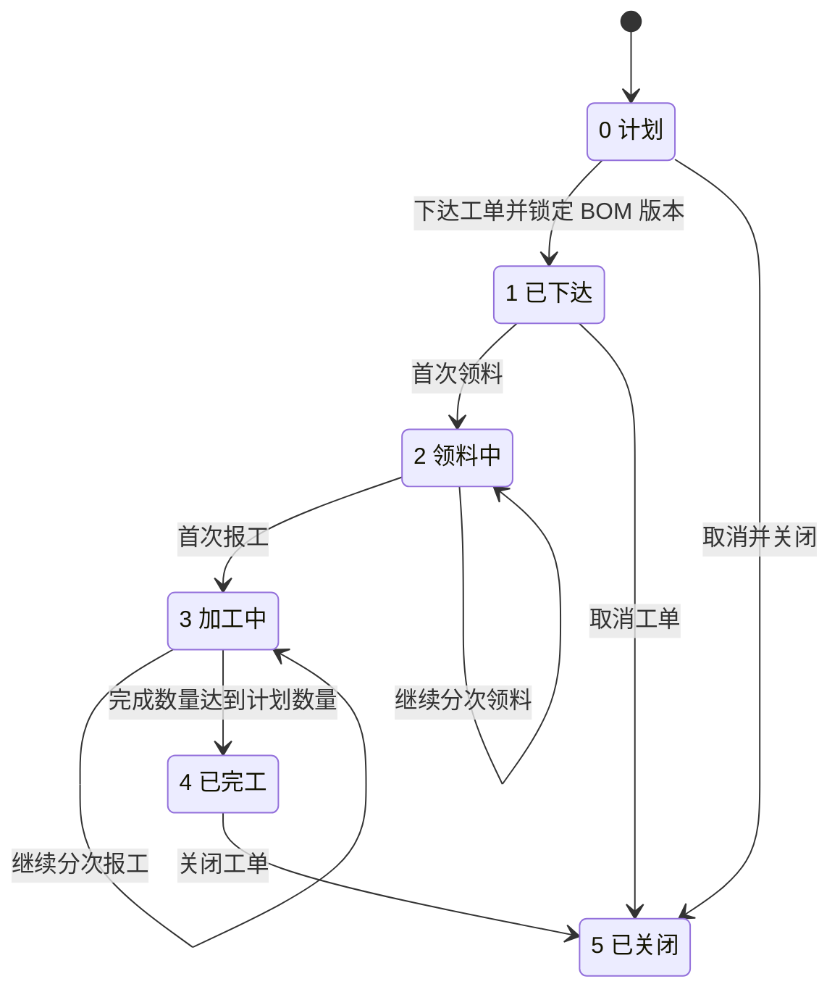

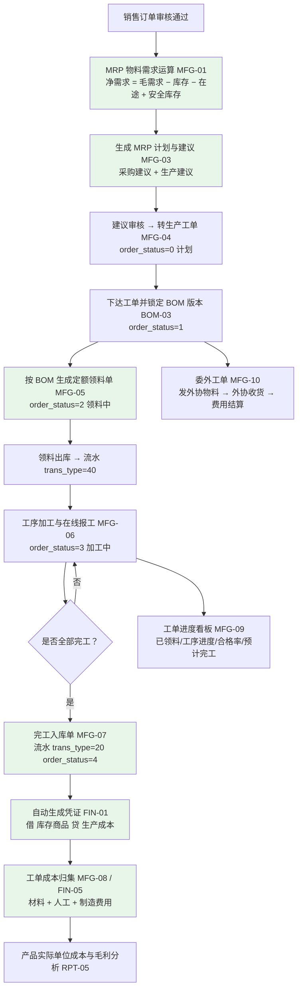

| 需求编号 | 需求名称 | 优先级 | 详细说明 | 验收要点 |
|---------|---------|-------|---------|---------|
| MFG-01 | MRP物料需求运算 | P0 | 输入：销售订单（MTO）或主生产计划；逐层展开已生效 BOM 计算毛需求；**净需求 = 毛需求 − 现有可用库存 − 在途采购（已审核未入库采购订单）− 在制工单（已下达未完工工单预计产出） + 安全库存**；按提前期（MD-03 采购/生产提前期）倒推建议开工与建议到货日期；运算范围为活跃物料约 **5,000 种**，全量运算 **<30 分钟**；结果落 `mf_mrp_plan` + `mf_mrp_plan_item`（批次号如 `MRP202608001`）；支持重复运算（全量重算）并保留历史运算批次 | ①以 SC-01（AC-300 100 台）为输入运算，输出采购建议（IGBT 200 个、电解电容 400 个等）与生产建议（AC-300 100 台、主控板组件 100 套、电源模块 100 套），数量与 BOM 展开一致（逐项差 0）；②按净需求公式验算 3 条（含"有库存""有在途""有在制"场景）结果正确；③全量 5,000 种物料运算耗时 <30 分钟（阶段四 SIT 计时）；④历史运算批次可查询（含运算时间、参数快照） |
| MFG-02 | MRP运算参数 | P0 | 可配置参数：考虑现有库存（默认是）、考虑在途采购（默认是）、考虑在制工单（默认是）、考虑安全库存（默认是）、考虑采购/生产提前期（默认是）、运算范围（全量 / 指定销售订单 / 指定物料范围）、是否考虑冻结期；参数变更记录操作人与时间；每次运算固化参数快照（便于复算与对比） | ①关闭"考虑在途采购"后重新运算，某物料建议采购量增加，增加量 = 在途量（可核对）；②运算记录中可查看本次参数快照（各开关取值）；③指定单个销售订单范围运算耗时 <2 分钟；④参数变更可在审计日志中查到变更前后值 |
| MFG-03 | MRP运算结果 | P0 | 输出采购建议（物料 → 建议采购量 → 建议到货日期 → 建议供应商）与生产建议（物料 → 建议生产量 → 建议开工日期 → 建议完工日期）；建议经人工审核后一键转采购申请（PUR-01）或转生产工单（MFG-04）；转换后建议行状态置为"已转"（0-未转 1-已转采购单 2-已转工单），**不可重复转（幂等）**；建议支持按物料/建议类型/日期筛选与导出；MRP 计划主表状态 0-新生成 1-已转 2-已关闭 | ①一键转采购申请成功且建议行状态 = 1，重复点击不产生第二张申请；②生产建议转工单后状态 = 2；③建议清单导出行数与界面一致；④建议数量与 MFG-01 验收用例一致（差 0） |
| MFG-04 | 生产工单管理 | P0 | 工单字段：工单号（MO + YYYYMM + 3 位流水，如 `MO202608032`）、产品物料、计划数量、`completed_qty`（累计完工）、`scrapped_qty`（报废）、计划开工/完工日期、实际开工/完工时间、关联销售订单号、锁定的 BOM 版本（`bom_id`）；**工单状态 6 态：0-计划、1-已下达、2-领料中、3-加工中、4-已完工、5-已关闭**；流转规则：计划 →（下达，锁定 BOM 版本）→ 已下达 →（首次领料）→ 领料中 →（首次报工）→ 加工中 →（完成数量达到计划数量）→ 已完工 →（关闭）→ 已关闭；"计划"可逻辑删除，"已下达"可取消，领料中/加工中不可逆，已关闭禁止领料与报工 | ①工单 `MO202608032` 依次执行"下达→领料→报工→完工→关闭"，界面状态依次为 1→2→3→4→5；②下达后 `bom_id` 锁定为当时生效版本（BOM-03 用例复验）；③已完工工单继续领料被拒、已关闭工单报工被拒（错误码 15001-15999 区间）；④状态流转（含操作人、时间）可在审计日志中查到；⑤数据库中 `mf_order.order_status` 支持 0~5 共 6 个取值 |
| MFG-05 | 生产领料 | P0 | 按工单与锁定的 BOM 版本自动生成定额领料单（`mf_order_issue`，编号 MI + YYYYMM + 3 位流水）；明细含定额应领数量（`planned_qty`）与实际领料数量（`actual_qty`）；领料审核通过写 `trans_type=40` 流水并扣减原材料库存；**超定额领料须审批**（车间主任 → 生产经理，按超出比例分级）；允许分次领料，累计领料不得超过"定额 × (1 + 超领上限)"（超领上限默认 10%，超出须特批）；可使用替代料（BOM-04） | ①工单 100 台、子件用量 2、损耗率 3% 时定额 = 206；领 206 直接通过，领 220 触发审批流；②分 2 次领料累计 206，生成 2 条流水且数量合计 = 206；③累计领料超过 定额 × 1.1（226.6）被拒；④领料后原材料库存按流水扣减（差值 0）；⑤超定额领料审批记录（审批人、原因）可在审计日志中查到 |
| MFG-06 | 生产报工 | P0 | 各工序完工后在线报工，记录：工单号、工序、完工数量、合格数量、不合格数量、报废数量、工时（小时，DECIMAL 6 位小数）、操作人、操作时间；支持按工序与班次分次录入；**校验：合格数量 + 不合格数量 ≤ 完工数量**；报工工时用于人工成本归集（MFG-08 / FIN-05）；报工在"工序未流转至下一步且未生成成本数据"时可撤销，撤销留痕；工单进度按报工数据实时计算（工序完成率、合格率） | ①某工序报工 100 件、合格 98、不合格 2，工单合格率显示 98%；②合格 + 不合格 > 完工时保存被拒（错误码 15001-15999 区间）；③首次报工后工单状态由 2-领料中 变为 3-加工中；④工单进度页显示的工序完成率与实际报工一致（抽样 20 张误差 0）；⑤报工数据可在工时统计报表（RPT-05）中查询 |
| MFG-07 | 生产完工入库 | P0 | 工单完工后生成完工入库单（FG + YYYYMM + 3 位流水），半成品入半成品仓、成品入苏州成品仓或东莞成品仓；生成 `trans_type=20` 流水增加成品库存，同时增加工单 `completed_qty` 并扣减在制数量；入库数量不得超过工单未完工数量；入库审核后自动生成凭证（借 库存商品 贷 生产成本）；`completed_qty` 达到 `planned_qty` 时工单状态置为 4-已完工并记录实际完工时间 | ①完工入库 50 台后库存 +50、`completed_qty=50`；②第二批入库 50 台后 `completed_qty=100=planned_qty`、工单状态 = 4 且实际完工时间已记录；③入库 110 台（超未完工数量）被拒；④对应凭证生成且借贷平衡（差额 0）；⑤在制数量与库存数量口径一致（核对差值 0） |
| MFG-08 | 工单成本归集 | P0 | 每个工单自动归集：直接材料成本（实际领料数量 × 物料移动加权平均出库单价）、直接人工成本（报工工时 × 工时单价，工时单价按车间/工序由财务维护）、制造费用（按工时或产量分摊，默认按工时，分摊率由财务维护）；归集在月末成本运算时执行（与 FIN-05 联动）；支持工单成本明细下钻（材料到物料与批次、人工到工序与报工记录）；未完工工单按月结转在制成本 | ①抽查 1 张完工工单：材料成本 = 实际领料金额合计（误差 0）；②人工成本 = 报工工时合计 × 工时单价（误差 0）；③制造费用按分摊率计算正确（误差 0）；④工单成本可下钻至材料明细与报工明细，明细条数与来源单据一致；⑤工单成本合计与 FIN-05 产出的产品成本口径一致（差额 0） |
| MFG-09 | 工单进度跟踪 | P0 | 工单详情页展示：状态、已领料情况（应领/已领/差异）、各工序完工进度（完工数/计划数/合格率）、剩余工时估算（按已完工序平均工时推算）、预计完工日期、关联销售订单与客户、异常标记（超期未完工、超领、报废超阈值）；支持按工单状态、产品、销售订单、计划完工日期筛选；数据实时（报工即更新，延迟 ≤1 分钟） | ①工单 `MO202608032` 详情页显示 5~8 道工序进度且与实际报工一致（抽样 20 张误差 0）；②超期未完工工单（计划完工日期早于当日且状态 < 4）出现在异常清单中；③按销售订单号查询关联全部工单，条数与数据一致；④进度查询响应 ≤3 秒 |
| MFG-10 | 委外加工管理 | P2 | 外协工序（PCB 贴片、表面处理）支持：委外工单 → 发外协物料（发料出库流水）→ 外协收货（收货入库流水 + 质检结论）→ 外协费用结算（加工费计入工单制造费用）全流程；委外工单记录外协厂商、工序、数量、加工单价、预计回收日期；发出数量与回收数量自动比对，短少须登记差异并经审批；**外协期间物料按"委外在途"单独统计，不计入本厂可用库存**，且本期 MRP 不考虑委外在途量 | ①委外工单发料 200 件、回收 198 件（短少 2 件）时生成差异记录并要求审批；②外协收货入库后库存增加且成本含加工费（金额可核对）；③委外期间该批物料不计入可用库存（可用量与账面核对一致）；④本期 MRP 净需求公式不引入委外在途量（验证运算结果一致性） |

### 4.6 财务管理（FIN）

> **业务场景说明**：财务部门每月需要完成 5 项工作：①根据所有出入库单据自动生成存货会计凭证；②与供应商对账并安排付款（月结 30 天，如宏微科技）；③与客户对账并催收货款（月结 60 天，如申达电气）；④月末进行成本核算，计算各产品本月实际成本；⑤出具三大财务报表。
>
> 现状痛点：月均约 3,300 条凭证中约 70% 为手工录入，凭证与业务单据无法双向追溯；月末结账耗时 6 个工作日；成本按"当月总投入/总产出"分摊，AC-300 变频器实际单位成本在 1,520~1,780 元之间波动（波动幅度约 17%）；应收账龄靠 Excel 手工统计（1 人 2 天），逾期应收 320 万元无自动提醒；2026 年 6-8 月 46 笔货到票未到业务中 12 笔未做暂估，当月成本少计约 28 万元；无期间关闭控制，月均约 8 笔跨期修改上月单据。

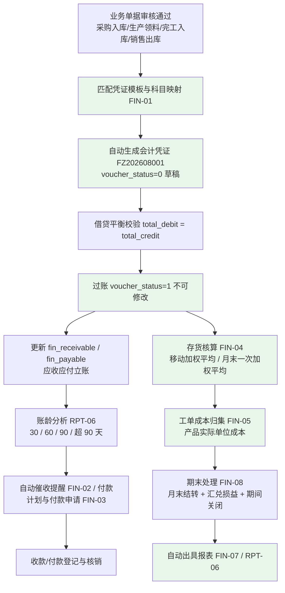

| 需求编号 | 需求名称 | 优先级 | 详细说明 | 验收要点 |
|---------|---------|-------|---------|---------|
| FIN-01 | 总账管理 | P0 | 科目体系（1~4 级、叶子科目可记账、含科目方向）、会计期间（自然月）、凭证类型（记账凭证、红字凭证、期初调账凭证）；所有业务单据审核通过后按凭证模板与科目映射规则自动生成凭证（采购入库：借 原材料 贷 应付账款-暂估；生产领料：借 生产成本 贷 原材料；完工入库：借 库存商品 贷 生产成本；销售出库：借 主营业务成本 贷 库存商品）；凭证记录 `source_biz_type` 与 `source_biz_id`，与业务单据**双向可追溯**；凭证状态 0-草稿、1-已过账（过账后不可修改，更正走红冲）；凭证编号 FZ + YYYYMM + 3 位流水（如 `FZ202608001`）；**本期为集团单一账套**（不建设多法人独立账套，见 1.4 排除项 7），支持币别字段，主币种 CNY；凭证查询支持按期间、科目、来源单据、金额多条件组合 | ①4 类业务单据（采购入库、生产领料、完工入库、销售出库）各生成 1 张凭证，借贷平衡（差额 0）且科目与模板一致；②凭证可按 `source_biz_id` 反查来源单据、单据可反查凭证（双向可追溯率 100%）；③已过账凭证直接修改被拒（错误码 16001-16999 区间），红冲成功且原凭证保留；④凭证号符合 `FZ202608001` 格式；⑤出入库类单据凭证自动生成覆盖率 100%（统计口径为"已审核出入库单据数 vs 自动生成凭证单据数"） |
| FIN-02 | 应收账款管理 | P0 | 销售出库/开票后自动生成应收凭证并立账（`fin_receivable`：客户、来源单据、金额、已收金额、到期日 `due_date`、状态）；按客户查看应收余额与账龄分析（30 天 / 60 天 / 90 天 / 超 90 天，账龄基准口径由财务确认后固化并在界面展示口径说明）；自动催收提醒（到期前 7 天与逾期后每周生成提醒清单）；收款登记与核销（支持一单多收、一收多单）；按客户导出应收对账单 | ①SC-01 订单出库后自动立账，金额与订单含税金额一致（185,000 元口径与财务确认一致）；②账龄分档金额合计 = 应收余额（差额 0），账龄口径与手工抽样 20 条一致；③到期前 7 天提醒清单包含该单据；④收款核销后应收余额减少且核销明细可查（核销金额 = 收款金额）；⑤对账单导出行数与界面一致 |
| FIN-03 | 应付账款管理 | P0 | 采购入库/发票校验后自动生成应付凭证并立账（`fin_payable`）；按供应商查看应付余额、账龄与付款计划（到期日 = 收货日 + 付款条件，如宏微科技月结 30 天）；付款申请审批流程（应付会计/采购员发起 → 财务经理审批 → 付款登记）；付款核销支持一单多付、一付多单；**暂估应付与正式应付分列展示，红冲后暂估余额归零**；按供应商导出应付对账单 | ①月结 30 天场景下应付到期日 = 收货日 + 30 天（抽查 5 条正确）；②付款申请审批通过后完成付款登记与核销，应付余额减少（差额 0）；③暂估与正式应付分列展示，暂估红冲后余额 = 0；④对账单导出行数与界面一致；⑤付款审批记录可在审计日志中查到审批人 |
| FIN-04 | 成本核算 | P0 | 存货核算支持移动加权平均法（默认）与月末一次加权平均法（按物料计价方法 MD-04 执行）；月末核算每个物料的出库成本与结存成本；出库成本单价写入 `inv_transaction.unit_cost`；金额计算全部使用 BigDecimal（6 位小数，除法 `RoundingMode.HALF_UP`）；核算结果与库存数量联动（结存数量 × 单位成本 = 结存金额，差额 0）；输出存货收发存汇总表（期初 + 入库 − 出库 = 期末） | ①AC-300 出库成本 = 出库数量 × 移动加权平均单位成本（抽查 20 笔误差 0）；②存货收发存汇总表满足"期初 + 入库 − 出库 = 期末"（数量与金额差额均为 0）；③成本结果可下钻到库存流水；④5,000 种物料月度核算耗时 ≤30 分钟（计时验证） |
| FIN-05 | 生产工单成本核算 | P0 | 月末将当月所有生产工单的材料成本、人工成本、制造费用归集到对应完工产品，计算产品实际单位成本（实际单位成本 = 完工产品总成本 / 完工数量）；部分完工工单按完工数量与在制数量分摊；产出"标准成本 vs 实际成本"对比；产品实际成本用于毛利分析与报价参考；成本核算纳入月结流程（**月结后 ≤2 个工作日完成**，现状 6 个工作日） | ①抽查 AC-300 工单：实际单位成本 =（材料 + 人工 + 制造费用）/ 完工数量（误差 0），且可分解为三段并展示各段明细；②标准成本 vs 实际成本对比表产出（差额可解释）；③成本核算在月结后 ≤2 个工作日内完成（阶段五 UAT 计时验证）；④产品成本与 FIN-04 存货金额口径一致（差额 0） |
| FIN-06 | 固定资产管理 | P2 | 固定资产卡片（资产编号、名称、类别、原值、使用部门、存放地点、启用日期、使用年限、残值率、折旧方法）；折旧计提支持年限平均法与双倍余额递减法，按月计提并自动生成折旧凭证；资产盘点（账面 vs 实物）与报废/处置（生成处置损益凭证）；资产状态（在用/闲置/报废）；资产台账与折旧明细可导出 | ①新建资产卡片并计提 1 个月折旧，折旧额按年限平均法手工验算一致（误差 0）；②折旧凭证自动生成且借贷平衡（差额 0）；③资产盘点差异生成差异清单（含差异数量与金额）；④报废后资产状态变更且生成处置凭证 |
| FIN-07 | 财务报表 | P0 | 自动生成资产负债表、利润表、现金流量表、科目余额表、明细账、总账；口径仅取**已过账**凭证（草稿凭证不计入）；支持按会计期间查询与期间对比（本月/上月/年初至今）；支持导出 Excel 与 PDF；报表与科目余额表可交叉校验 | ①月结后自动出具 6 张报表；②科目余额表借贷合计相等（差额 0）；③资产负债表满足"资产 = 负债 + 所有者权益"（差额 0）；④利润表净利润与科目余额表本年利润一致（差额 0）；⑤导出文件内容与界面一致（抽 1 张报表逐项比对） |
| FIN-08 | 期末处理 | P0 | 支持月末结转（损益类科目结转本年利润、制造费用与生产成本结转、存货与工单成本结转）、汇兑损益处理（外币科目按月末汇率重估并生成汇兑损益凭证）、**期间关闭控制**（关闭后禁止在该期间新增、修改、过账凭证；已过账凭证冲销须在开放期间进行）；月结检查清单（未过账凭证数、上月暂估未匹配清单条数、库存流水与快照对账差异、未完工工单在制余额、未结算单据数）须全部通过方可关闭期间；期间重开仅限财务经理权限并留痕 | ①执行月结后本月期间关闭，在本月新增凭证被拒（错误码 16001-16999 区间）；②月结检查清单 5 项均有结果展示（含暂估未匹配条数、对账差异数）；③月结周期 ≤2 个工作日（阶段五 UAT 计时，现状 6 个工作日）；④跨期修改上月单据被拒（现状月均 8 笔，目标 0 笔）；⑤期间重开操作可在审计日志中查到操作人与时间 |
| FIN-09 | 期初余额建账 | P0 | 新增编号。上线切换期录入会计科目期初余额（资产/负债/权益类）与存货期初（与 INV-11 联动）；**试算平衡校验：借方合计 = 贷方合计**，差额不为 0 时禁止提交；生成期初调账凭证（FZ + YYYYMM + 3 位流水，如 `FZ202610001`）；存货类科目期初金额必须与 INV-11 期初库存金额一致；期初余额仅允许在切换期（首个会计期间）录入，首个期间关闭后不可修改；数据来源为旧财务软件只读归档（见 `04-数据迁移需求方案.md` 2.2.2 不纳入迁移范围第 2 项） | ①录入期初余额试算平衡差额 = 0 方可提交；②构造不平衡用例提交被拒（错误码 16001-16999 区间）；③存货科目期初金额与 INV-11 期初库存金额不一致时被拒（差额必须为 0）；④期初调账凭证生成且可查询；⑤首个期间关闭后修改期初被拒 |

### 4.7 报表与分析（RPT）

> **业务场景说明**：总经理每天早上需要查看经营仪表盘，了解昨日的销售金额、本月累计出货、库存周转率、工单按时完工率等关键指标；销售总监需要查看各区域销售排行和产品毛利分析；采购经理需要查看采购价格走势和供应商绩效；仓库主管需要查看即时库存、呆滞库存与安全库存预警；财务经理需要查看账龄分析与产品成本分析表。现状所有报表均为手工汇总（月度分析需人工合并 3 个分公司 Excel 耗时 2 个工作日、账龄统计 1 人 2 天），本域需求即实现报表自动化与自助查询。
>
> **本域优先级说明**：报表与分析整体为 P1（重要但可稍后），对应阶段三 D9 子阶段；其中**经营仪表盘的核心指标须在阶段四 SIT 结束前交付**（《ERP系统开发阶段计划文档》D9 弹性约定）。

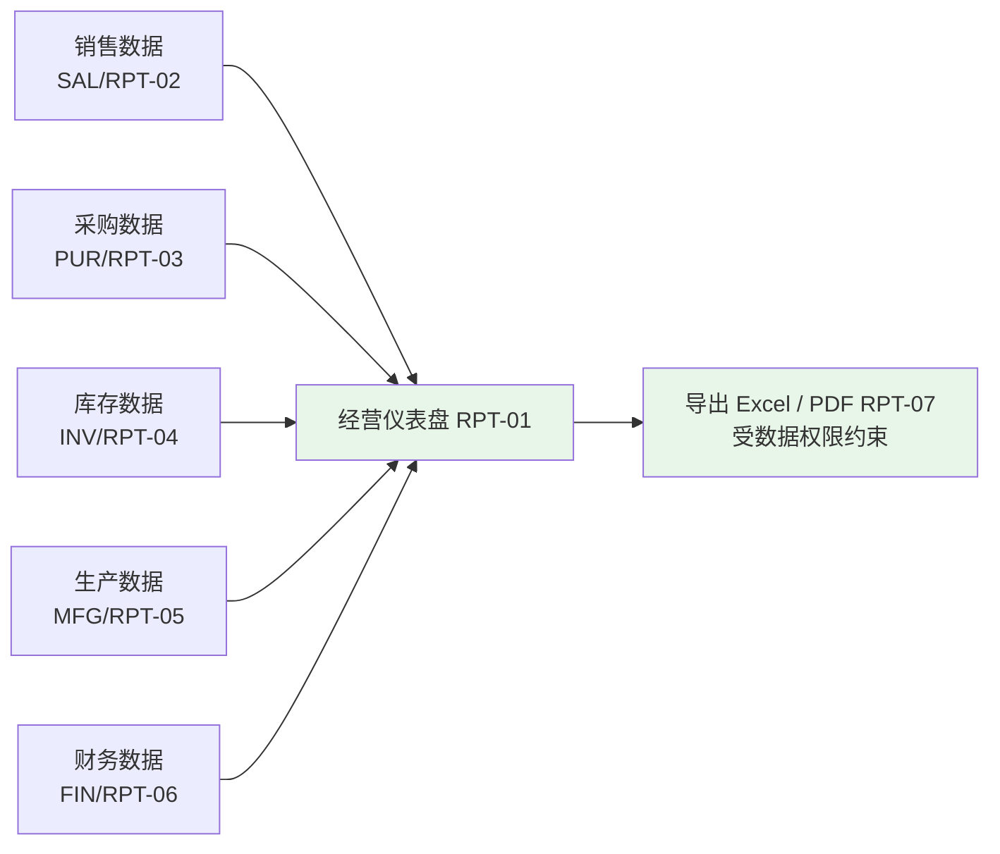

| 需求编号 | 需求名称 | 优先级 | 详细说明 | 验收要点 |
|---------|---------|-------|---------|---------|
| RPT-01 | 经营仪表盘 | P1 | 展示指标：今日/本月销售收入、毛利率、库存周转天数、工单按时完工率、应收逾期金额（现状基线 320 万元）、在途订单金额（已审核未发货销售订单金额）、呆滞库存占比、订单准时交付率；支持按组织（总部/2 基地/3 分公司）与时间维度切换；**每个指标可点击查看口径说明**（计算公式与数据来源）；实时类指标刷新延迟 ≤5 分钟，成本类指标按日刷新；仪表盘数据受 SYS-04 数据权限约束 | ①8 个指标均展示数值且口径说明可查看；②抽样 3 个指标与来源报表数值一致（误差 0）；③切换组织后数值随之变化（验证总部与华东分公司差异）；④实时指标刷新延迟 ≤5 分钟；⑤指标在阶段四 SIT 结束前可交付演示 |
| RPT-02 | 销售分析报表 | P1 | 报表：①销售订单执行状况查询（按日期/客户/产品/状态多维度筛选）；②销售排行（按客户/产品/业务员）；③订单毛利分析（收入 − 成本，成本来自 FIN-04/FIN-05）；④未交订单明细（未发货余额 >0）；⑤销售对账单（按客户导出）；支持按 CS-03 多维分类汇总；支持导出 Excel/PDF | ①5 张报表均可按多维度筛选，抽样 20 条与手工统计一致（误差 0）；②毛利分析中订单收入 − 成本 = 毛利（差额 0）；③未交订单明细合计金额 = 已审核未发货订单金额（差额 0）；④对账单可按客户导出且行数与界面一致 |
| RPT-03 | 采购分析报表 | P1 | 报表：①采购订单执行跟踪（含未到货余额与预计到货日期）；②采购价格走势分析（按供应商/物料/期间）；③供应商交货准时率与合格率统计（与 PUR-08 评分口径一致）；④采购申请来源分布（MRP / 手工，用于紧急采购占比管控）；支持导出 | ①4 张报表数据与来源单据一致（抽样 20 条误差 0）；②价格走势与采购价格历史记录一致（逐点核对）；③准时率/合格率与 PUR-08 评分明细一致（差额 0）；④紧急采购占比可按月输出并与目标 ≤10% 对比展示 |
| RPT-04 | 库存分析报表 | P1 | 报表：①即时库存查询（按仓库/库位/批次/物料多维度，响应 ≤2 秒）；②库存流水账（按物料与时间段）；③库存周转率分析（周转天数/次数）；④呆滞库存明细（与 INV-08 口径一致）；⑤安全库存预警清单（与 INV-07 一致）；⑥保质期预警清单（与 INV-05 一致）；支持导出 | ①即时库存查询合计与 `inv_stock` 汇总一致（差额 0）；②库存流水账条数与 `inv_transaction` 一致；③周转天数按公式验算正确（抽 3 个物料误差 0）；④呆滞/安全库存/保质期清单与对应功能页面数值一致（差额 0）；⑤即时库存查询响应 ≤2 秒 |
| RPT-05 | 生产分析报表 | P1 | 报表：①工单完工率统计；②工单良品率统计；③在制工单明细（含工序进度）；④工时利用率分析（实际工时 vs 可用工时）；⑤产品实际成本与毛利分析；支持按基地/车间/产品筛选与导出 | ①5 张报表与工单、报工数据一致（抽样 20 条误差 0）；②在制工单明细条数 = 状态 ∈ {1,2,3} 的工单数（差额 0）；③良品率 = 合格数量 / 完工数量（验算 3 条误差 0）；④产品实际成本与 FIN-05 产出一致（差额 0） |
| RPT-06 | 财务分析报表 | P1 | 报表：①应收账龄分析（30/60/90/超 90 天）；②应付账龄分析；③现金流量预测（基于应收到期日与应付到期日）；④产品成本分析表（与 FIN-05 一致）；支持按客户/供应商/期间筛选与导出 | ①账龄分档金额合计 = 应收/应付余额（差额 0）；②账龄与 FIN-02、FIN-03 页面数值一致；③现金流量预测可按到期日排序核对（抽 10 条误差 0）；④产品成本分析表与 FIN-05 一致（差额 0） |
| RPT-07 | 报表导出 | P1 | 所有报表支持导出 Excel 与 PDF；导出遵循当前筛选条件与数据权限（**导出内容不得越权**）；单次导出 ≤50,000 行，超出提示缩小筛选范围；导出动作写审计日志（操作人、报表名、筛选条件、行数、时间）；大数据量报表采用异步导出，完成后提供下载入口 | ①6 张代表性报表各导出 Excel 与 PDF 成功且文件可正常打开；②导出行数与界面一致；③越权用户导出行数 = 其可见行数（不越权）；④导出 50,001 行被拒并提示缩小范围；⑤导出日志可查询（含操作人、报表名、行数） |

---

## 五、非功能需求

每条均给出**具体要求**与**验证方式**，验证方式限定为阶段四 SIT、阶段五 UAT、设计评审或运维演练中可执行的检查动作。

### 5.1 性能

| 序号 | 具体要求 | 验证方式 |
|------|---------|---------|
| P-01 | 支持并发用户数 ≥**500** | 阶段四 SIT 使用压测工具模拟 500 并发用户执行登录、列表查询、单据保存操作 |
| P-02 | 关键事务响应时间 <**3 秒**（95 分位）：销售订单保存、采购订单保存、领料单保存、库存流水写入并更新余额、凭证自动生成 | SIT 压测报告输出各事务 P95 响应时间，须全部 <3 秒；单条记录明细可查 |
| P-03 | MRP 全量运算（活跃物料约 **5,000 种**、BOM 约 3,500 个）完成时间 <**30 分钟** | SIT 以全量数据执行 MRP，从点击"运算"到生成建议批次计时 <30 分钟 |
| P-04 | 报表查询响应：即时库存查询与单据列表 ≤**2 秒**；账龄分析、呆滞库存、经营仪表盘 ≤**5 秒**；多维度月度分析报表 ≤**10 秒** | UAT 现场计时，每类报表抽样 3 次取最大值 |
| P-05 | 库存流水表按 3 年运行估算约 **100 万条**（900 条/日）时，按"物料 + 时间范围"查询 ≤2 秒 | SIT 造数至 100 万条后执行查询计时 |
| P-06 | 列表分页默认 20 条/页、单页上限 200 条；单批数据导入 ≤10,000 行；单次报表导出 ≤50,000 行 | UAT 演示分页与导入导出上限行为（超限被拒并提示） |

### 5.2 可用性

| 序号 | 具体要求 | 验证方式 |
|------|---------|---------|
| A-01 | 系统 **7×24** 小时运行；计划内停机维护每季度不超过 **1 次**，单次计划停机 ≤4 小时且须提前 3 个工作日通知业务部门 | 上线后运维记录（上线前以运维方案与演练记录验证） |
| A-02 | 故障恢复时间（**RTO）≤30 分钟** | 阶段六上线切换演练与每季度 1 次故障恢复演练，计时并出报告 |
| A-03 | 数据恢复点目标（**RPO）≤5 分钟**（基于数据库 WAL 归档与时间点恢复能力） | 恢复演练中验证：恢复后丢失数据时间窗口 ≤5 分钟 |
| A-04 | 关键业务操作具备幂等保护（单据提交/审核、流水生成、凭证生成），重复提交不产生重复数据 | SIT 针对 5 类单据重复提交用例，验证重复提交后流水与凭证条数不变 |

### 5.3 安全性

| 序号 | 具体要求 | 验证方式 |
|------|---------|---------|
| S-01 | 满足**网络安全等级保护 2.0 三级**要求 | 阶段六上线前完成等保测评（第三方机构）并出具测评报告；未通过项须整改闭环 |
| S-02 | **字段级数据权限**：数据范围 6 档 + 自定义；列表、详情、导出三处口径一致；敏感字段（金额、银行账号）按角色掩码 | SIT 权限矩阵抽样 20 条用例（业务员、部门经理、销售总监、财务、仓管）逐条验证；越权访问返回 403 |
| S-03 | 操作审计日志保存 ≥**180 天**，覆盖订单/工单/出入库单的创建、修改、审核、删除及凭证过账 | 抽查审计日志表按时间范围查询，最早记录时间 ≥180 天前；随机抽 10 条业务动作核对日志完整性 |
| S-04 | 密码使用 **BCrypt** 加密存储（强度 10），数据库中不可见明文；密码策略见 SYS-09 | 数据库抽样检查 `sys_user.password` 均为 BCrypt 密文；弱密码被拒用例通过 |
| S-05 | 传输加密：对外访问强制 **HTTPS（TLS 1.2 及以上）**；HTTP 请求重定向至 HTTPS | 部署环境扫描确认仅开放 443；用 HTTP 访问被重定向（验证响应码 301/308） |
| S-06 | 敏感信息保护：银行账号、身份证/手机号等在前端与导出文件中脱敏；接口响应中的密钥类字段不可回显；禁止在日志中打印明文密码与密钥 | 代码审查（禁止 `System.out.println`、禁止打印敏感字段）+ 导出文件抽样检查 + 接口响应抽查 |
| S-07 | 接口鉴权：全部业务接口须携带有效 JWT；未认证 401、越权 403；token 有效期与刷新机制见 SYS-01 | SIT 对 8 个代表性接口做无 token / 过期 token / 篡改 token 三类用例 |

### 5.4 可扩展性

| 序号 | 具体要求 | 验证方式 |
|------|---------|---------|
| E-01 | **多组织/多工厂**：本期支持"集团总部 + 2 个生产基地 + 3 个区域销售分公司 + 4 个中心仓库"的组织与仓库维度，收入/成本/库存/费用可按组织与仓库维度出报表；新增组织或仓库通过主数据维护完成，**无需修改代码** | UAT 演示：新增 1 个组织与 1 个仓库后可直接建单并出分维度报表（无代码变更） |
| E-02 | **多币别**：本期实现币别字段与汇兑损益处理（FIN-08），主币种为 CNY；外币业务单据可录入并参与月末汇率重估 | UAT 演示：录入 1 张外币采购订单/销售订单，月末执行汇兑损益并生成凭证；金额按 6 位小数计算 |
| E-03 | **中英文国际化本期结论：本期不实现多语言界面**——界面语言固定为中文，**不提供语言切换入口**；架构预留国际化能力（前端文案抽取规则与 i18n 依赖预留、后端错误码与数据字典支持多语言字段）；启用语言切换须经 CCB 评审立项 | 阶段二设计评审确认 i18n 预留项已列入设计说明；UAT 检查系统中不存在语言切换入口；错误码与字典表存在多语言字段（表结构检查） |
| E-04 | **多法人多账套本期结论：本期为集团单一账套**（见 1.4 排除项 7）；模块化单体架构下新增业务域按模块分包，跨模块仅通过 Service 接口调用 | 阶段二架构评审确认模块依赖规则；代码审查确认无跨模块直接调用 Mapper |
| E-05 | 缓存与定时任务：Redis Key 命名遵循"业务模块:功能:唯一标识"且必须设置 TTL；先更新数据库，事务提交后再操作缓存；定时任务现阶段使用 Spring `@Scheduled`/`@Async` | 代码审查确认 Key 命名与 TTL 设置；集成测试验证缓存与数据库一致性（抽样 5 个 Key） |

### 5.5 集成性

| 序号 | 具体要求 | 验证方式 |
|------|---------|---------|
| I-01 | 对外提供标准 **RESTful API**，统一前缀 `/api`，使用 OpenAPI 3 生成接口文档，文档与代码同步更新 | 阶段四 SIT 打开接口文档核对接口清单与实现一致（抽 10 个接口实际调用） |
| I-02 | 统一响应体 `Result<T>`（code、message、data、timestamp）与集中错误码（区间见 SYS-08） | 抽检 8 个接口响应结构；错误码与 `ErrorCode` 枚举一致性检查 |
| I-03 | 对外接口（供 OA、后续 WMS 或第三方调用）须具备独立凭证与限流保护，且不直接暴露内部主键自增规则 | 阶段二接口设计文档评审；SIT 对外接口鉴权用例通过 |
| I-04 | 幂等要求：单据创建/审核、库存流水生成、凭证生成、建议转单据等接口支持幂等（重复请求返回同一结果，不重复落数据） | SIT 对 5 类接口重复请求 2 次，核对业务数据条数不变 |

### 5.6 数据备份与容灾

| 序号 | 具体要求 | 验证方式 |
|------|---------|---------|
| B-01 | **每日自动增量备份，每周全量备份，备份数据异地存储** | 检查备份任务日志连续 7 天无缺失；异地存储位置可查 |
| B-02 | 备份保留策略：日备保留 30 天、周备保留 12 周、月备保留 12 个月 | 检查备份介质保留清单与策略配置一致 |
| B-03 | 每季度执行 1 次恢复演练，恢复时间 ≤30 分钟且数据完整（满足 RTO/RPO 指标） | 恢复演练报告（含恢复起止时间、数据校验结果） |

---

## 六、接口需求

### 6.1 对接系统清单

| 序号 | 对接系统 | 集成方式 | 数据流向 | 主要数据内容 | 本期是否实现 |
|------|---------|---------|---------|-------------|-------------|
| 1 | OA 系统 | RESTful API | 双向 | 采购申请审批、销售订单审批、付款申请审批：ERP 推送待审批单据摘要，OA 回写审批结论与审批人 | **本期实现**（阶段四 SIT 完成接口联调） |
| 2 | 税控开票系统 | API | 税控 → ERP（少量回写） | 发票开具状态、发票号码、开票日期同步至 ERP 应收立账 | **本期实现**（阶段四 SIT 完成接口联调） |
| 3 | 电子发票平台 | API | 双向 | 电子发票开具、红冲、状态查询 | **本期实现**（与税控开票并行使用：纸质/电子发票通道） |
| 4 | 银企直连 | WebService / API | ERP → 银行 | 付款指令下达、银行账户余额查询 | **本期不实现**（见下方"本期不实现系统的边界与替代方案"） |
| 5 | WMS（后期） | API | 双向 | 库存出入库数据实时同步 | **本期不实现**（见下方"本期不实现系统的边界与替代方案"） |

**本期不实现系统的边界与替代方案：**

| 系统 | 本期不实现的原因 | 本期替代方案 | 后续启用条件 |
|------|----------------|-------------|-------------|
| 银企直连 | 阶段四 SIT 接口联调范围为 OA 与税控系统；银企直连需银行侧开通接口并配置数字证书，成本与周期不可控 | 付款执行为"付款申请审批 → 付款登记 → 银行回单人工导入并核销"（FIN-03），资金数据在 ERP 内闭环 | 银行接口与证书就绪后经 CCB 评审立项，按阶段二冻结的数据契约对接 |
| WMS | 出入库作业由 ERP 库存模块自身承担（INV-02/INV-03），本期不引入独立 WMS | ERP 提供标准库存 API（第六章 6.2）与库存流水查询接口，WMS 启用后作为作业执行端与 ERP 同步 | 启用独立 WMS 时按已冻结的接口契约对接，无需改造库存核心逻辑 |

### 6.2 ERP 对外提供 API 的总体要求

| 序号 | 要求项 | 具体规定 |
|------|-------|---------|
| 1 | 接口前缀与风格 | 统一前缀 `/api`，RESTful 风格；动词类场景走 POST（如 `/api/purchase/orders/{id}/approve`）；状态变更通过动作接口实现（提交 `submit`、审核 `approve`、驳回 `reject`、关闭 `close`、反审核 `unapprove`） |
| 2 | 统一响应体 | 所有接口返回 `Result<T>`（code、message、data、timestamp）；分页数据置于 `data` 内（records、total、page、size）；业务校验失败由 `GlobalExceptionHandler` 统一处理，不返回裸异常堆栈 |
| 3 | 错误码区间 | 200 成功；10001-10999 通用（含认证与系统管理）；11001-11999 物料/BOM（含客户与供应商）；12001-12999 采购；13001-13999 销售；14001-14999 库存；15001-15999 生产；16001-16999 财务；错误消息面向业务人员可读并含关键业务标识（单据号、物料编码、数值） |
| 4 | 鉴权 | 业务接口须携带 `Authorization: Bearer <JWT>`；未认证返回 401、越权返回 403；对外系统调用使用独立 API 凭证并受数据权限约束 |
| 5 | 幂等要求 | 单据创建、单据动作接口（审核/关闭）、库存流水生成、凭证生成、MRP 建议转单必须幂等：同一业务唯一键重复请求返回首次结果，不重复落数据；接口层支持幂等令牌或业务唯一键校验 |
| 6 | 数据权限 | 接口返回与导出数据均按调用人的数据范围过滤（SYS-04），不允许通过参数越权获取他人数据 |
| 7 | 文档与版本 | 使用 OpenAPI 3 生成接口文档并与代码同步更新；接口前缀统一为 `/api`，不使用版本号前缀；接口变更须保持向后兼容，不兼容变更通过新增接口路径承载并提前告知对接方 |
| 8 | 接口内容完整性 | 阶段二须覆盖全部规划接口（含各域 CRUD、动作接口、报表查询接口、接口对接接口），接口文档与《需求规格说明书》需求条目逐条对应 |

---

## 七、数据迁移需求

本章为概览级需求；**详细方案（逐字段映射、清洗规则、分批策略、验证方法与责任分工）见同目录 `04-数据迁移需求方案.md`（已评审）**，本章数字与基线《企业资源计划ERP系统需求规格说明书》第七章完全一致。

| 迁移对象 | 数据量预估 | 清洗规则 | 验证方案 |
|---------|-----------|---------|---------|
| 物料主数据 | **~8,000 条** | 一物多码合并去重（旧码如 `IC-001`/`WZ-089`/`PL-023` 合并映射为新编码 `01-03-000128` 形式）、统一编码规则（2 位一级分类 + 2 位二级分类 + 6 位流水）、补全缺失的计划属性（提前期/安全库存/ABC）与财务属性（标准成本/计价方法/科目） | 迁移后核对总条数（与 8,000 口径一致）与关键字段完整率（必填字段完整率 100%）；随机抽取 50 组历史"多码物料"验证合并后仅剩 1 条编码且历史引用可映射 |
| BOM 数据 | **~3,500 个 BOM** | 检查 BOM 闭环（防止 A 包含 B、B 又包含 A 的死循环）、层级深度 ≤10 层、校验子件用量与损耗率合理性、统一版本（同父件仅保留 1 个生效版本） | 随机抽取 50 个 BOM 与纸质/旧系统逐项比对（子件、用量、损耗率、版本一致率 100%） |
| 客户主数据 | **~600 家** | 统一编码（`CUS` + 4 位流水）、合并重复客户（如"申达电气"与"申达有限公司"合并）、校验统一社会信用代码格式（18 位） | 与销售部门逐一确认（确认单签字）；合并前后条数差异可解释 |
| 供应商主数据 | **~300 家** | 统一编码（`SUP` + 4 位流水）、合并重复供应商、校验统一社会信用代码格式、补全付款条件（如月结 30 天） | 与采购部门逐一确认（确认单签字）；在供货供应商约 180 家与主数据对应关系可查 |
| 未结销售订单 | **~120 单** | 仅迁移状态为"未发货"或"部分发货"的订单（对应目标库 `sal_order.order_status=1 或 2`）；订单号按"前缀 + YYYYMM + 3 位流水"重编；已发货数量回填 | 核对订单总金额与旧系统一致（逐单核对，误差率 ≤0.1%） |
| 未结采购订单 | **~80 单** | 仅迁移状态为"未收货"或"部分收货"的订单（对应目标库 `pur_order.order_status=1 或 2`）；订单号重编；已收货数量回填并保留暂估关系 | 核对订单总金额与旧系统一致（逐单核对，误差率 ≤0.1%） |
| 即时库存 | 当前时点库存 | **以仓库实际盘点数为准**（4 个中心仓切换基准日盘点），差异生成盘盈/盘亏单调整；导入后按 INV-11 生成期初建账流水并初始化快照 | **迁移后关键数据误差率 ≤0.1%**（库存数量、库存金额、未结订单金额三项加权）；期初流水汇总 = `inv_stock` 快照（差值 0） |

**迁移范围与口径结论：**

1. **纳入范围**：上表 7 类；其中即时库存必须与切换基准日盘点数一致，不接受账面数。
2. **不纳入范围**：历史已结订单、历史会计凭证与历史总账/明细账、历史出入库流水（原因与替代方案见 `04-数据迁移需求方案.md` 2.2.2）。
3. **误差阈值**：关键数据（库存数量/金额、未结订单金额）误差率 **≤0.1%**，且单条最大偏差 ≤1%；由业务部门签署《迁移对象验收清单》。
4. **系统支撑要求**：迁移需依托 SYS-11（批量导入，整批事务 + 错误行回显）、INV-11（期初库存建账）、FIN-09（期初余额建账）实现，三者为本终稿新增编号。

---

## 八、验收标准

### 8.1 基线验收标准（保留 5 条，编号不变）

| 序号 | 验收维度 | 验收标准 |
|------|---------|---------|
| 1 | **流程覆盖** | 所有核心业务流程（销售→生产→采购→入库→发货→财务）在 UAT 中完整测试通过 |
| 2 | **数据一致性** | 迁移后关键数据（库存数量/金额、未结订单金额）误差率 ≤0.1% |
| 3 | **性能测试** | 500 并发用户下系统无崩溃，事务成功率 ≥99.9% |
| 4 | **接口联调** | 与 OA、税控系统的接口联调通过，数据双向传输正常 |
| 5 | **用户签署** | 各业务部门负责人签署《上线确认书》 |

### 8.2 补充可量化细项

| 序号 | 补充验收项 | 判定标准（可客观验证） |
|------|-----------|----------------------|
| 6 | P0 需求实现率 | 各业务域 P0 需求实现率 **100%**（57 条 P0 全部实现并可在 UAT 中演示）；P1 实现率 ≥90% 或经 CCB 评审同意顺延 |
| 7 | 凭证自动生成覆盖率 | 出入库类业务单据（采购入库、生产领料、完工入库、销售出库）自动生成凭证覆盖率 **100%**；借贷平衡差额 0 |
| 8 | BOM 合法性校验 | BOM 闭环、10 层上限、用量与损耗率、子件状态 5 项校验拦截 **100% 生效**（构造用例全部被正确拦截） |
| 9 | 库存账实与流水一致性 | 库存流水与快照日终对账差异 **0**；库存准确率 ≥99.5%（账实差异率 ≤0.5%） |
| 10 | 三单匹配自动化 | 采购三单匹配在 **当日内** 完成（现状 2 人 3 天）；差异记录可查、可导出 |
| 11 | 暂估与月结 | 暂估覆盖率 **100%**（无人工跳过入口）；月结周期 ≤**2 个工作日**（现状 6 个工作日）；跨期修改上月单据 0 笔（现状月均 8 笔） |
| 12 | 未达账项 | 上线后连续 2 个月月度对账未达账项 **0 笔**（现状 7 月 27 笔）；月度对账工作量 ≤0.5 人日 |
| 13 | 订单进度可视 | 抽样 20 张在制工单，销售订单页查询的完工进度与车间报工记录一致（误差 0）；催单响应 <1 分钟 |
| 14 | 库存管控指标 | 呆滞库存占比 <**8%**（现状 18%）；紧急采购占比 ≤**10%**（现状 30%）；订单延期率 <**10%**（现状 35%） |
| 15 | 成本核算 | AC-300 实际单位成本可分解为材料/人工/制造费用三段，各段金额可与单据核对一致（误差 0）；成本核算在月结后 ≤2 个工作日完成 |
| 16 | 权限与审计 | 权限矩阵抽样 20 条用例 100% 符合预期（越权访问 0 例）；审计日志覆盖订单/工单/出入库单创建、修改、审核、删除，保存 ≥180 天 |
| 17 | 端到端场景 | AC-300 变频器 100 台订单（SC-01）端到端场景在 UAT 中完整演练通过：销售订单→MRP→采购/生产→入库→发货→开票→凭证→报表 |
| 18 | 文档同步 | API 文档与数据库脚本与代码同步（SIT 开始前为最新版本）；《用户操作手册》《运维手册》交付并完成培训 |

---

## 九、需求优先级与实施映射

### 9.1 优先级统计表

| 业务域 | 需求编号范围 | 条目数 | P0 | P1 | P2 |
|-------|-------------|-------|----|----|----|
| 支撑域（系统管理） | SYS-01~SYS-11 | 11 | 9 | 1 | 1 |
| 基础数据（物料） | MD-01~MD-06 | 6 | 6 | 0 | 0 |
| 基础数据（BOM） | BOM-01~BOM-07 | 7 | 5 | 1 | 1 |
| 基础数据（客商） | CS-01~CS-03 | 3 | 2 | 1 | 0 |
| 销售管理 | SAL-01~SAL-08 | 8 | 6 | 2 | 0 |
| 采购管理 | PUR-01~PUR-08 | 8 | 5 | 3 | 0 |
| 库存管理 | INV-01~INV-11 | 11 | 7 | 4 | 0 |
| 生产制造管理 | MFG-01~MFG-10 | 10 | 9 | 0 | 1 |
| 财务管理 | FIN-01~FIN-09 | 9 | 8 | 0 | 1 |
| 报表与分析 | RPT-01~RPT-07 | 7 | 0 | 7 | 0 |
| **合计** | — | **80** | **57** | **19** | **4** |

**P2 条目清单（4 条）**：BOM-04 替代料管理、MFG-10 委外加工管理、FIN-06 固定资产管理、SYS-10 附件与文件管理。
**P1 条目清单（19 条）**：SYS-11、BOM-06、CS-03、SAL-06、SAL-07、PUR-04、PUR-07、PUR-08、INV-04、INV-05、INV-08、INV-10、RPT-01~RPT-07。

### 9.2 与《ERP系统开发阶段计划文档》D1-D9 的实施映射

| 子阶段 | 起止时间 | 对应需求编号 | 里程碑 | 阶段级依赖 |
|-------|---------|-------------|-------|-----------|
| **D1 骨架搭建** | 开发期第 1 周 | SYS-08（统一响应与错误码）、SYS-05（审计日志 AOP 基础设施） | 工程骨架可编译、可启动 | 依赖 M2 设计评审通过 |
| **D2 系统管理** | 开发期第 2-3 周 | SYS-01~SYS-09（P0）、SYS-11（P1）、SYS-10（P2） | **M3 系统跑通**（登录返回 token，安全体系生效） | 依赖 D1 |
| **D3 基础数据** | 开发期第 4-5 周 | MD-01~MD-06、BOM-01~BOM-07、CS-01~CS-03 | **M4 基础数据完成**（主数据 CRUD 可用，BOM 闭环检测生效） | 依赖 D2（权限与审计） |
| **D4 库存** | 开发期第 6 周 | INV-01、INV-02、INV-03、INV-06、INV-07、INV-09（P0）；INV-04、INV-05、INV-08、INV-10（P1） | 库存增减全部经流水记录，数量可追溯 | 依赖 D3（物料/仓库/库位） |
| **D5 采购** | 开发期第 7 周 | PUR-01、PUR-02、PUR-03、PUR-05、PUR-06（P0）；PUR-04、PUR-07、PUR-08（P1） | 采购全链路单据流转可演示 | 依赖 D4（收货入库写流水） |
| **D6 销售** | 开发期第 8 周 | SAL-01、SAL-02、SAL-03、SAL-04、SAL-05、SAL-08（P0）；SAL-06、SAL-07（P1） | 销售全链路单据流转可演示 | 依赖 D4（出库写流水）、D3（客户与价格） |
| **D7 生产** | 开发期第 9-10 周 | MFG-01~MFG-09（P0）；MFG-10（P2） | **M5 核心业务链完成**（销售→库存→采购→生产全链路可演示） | 依赖 D3（BOM）、D4（领料出库）、D5/D6（建议转单） |
| **D8 财务** | 开发期第 11-12 周 | FIN-01~FIN-05、FIN-07、FIN-08（P0）；FIN-06（P2） | **M6 业财一体完成**（出入库自动生成凭证，存货核算出成本） | 依赖 D4~D7（业务单据与流水） |
| **D9 报表与优化** | 穿插开发，第 12 周收尾 | RPT-01~RPT-07（P1，含仪表盘核心指标须在 SIT 前交付） | **M7 功能开发全部完成**（Feature Complete） | 依赖 D3~D8 数据基础 |
| **阶段六（数据迁移与上线）** | 第 10 月 | INV-11（期初库存建账）、FIN-09（期初余额建账）、SYS-11（批量导入） | M9（上线切换成功） | 依赖 SYS-11 与主数据/库存/财务模块完成 |

> **映射说明**：①P0 需求一律在各域对应子阶段内完成；②P1 需求随所属子阶段交付，报表（RPT）允许按 D9 弹性约定顺延至第 8 月与 SIT 并行，但仪表盘核心指标须在 SIT 结束前交付；③P2 需求（BOM-04、MFG-10、FIN-06、SYS-10）在 D2~D9 资源允许时交付，不阻断阶段退出标准；④INV-11 与 FIN-09 属上线切换必需，功能界面在 D4/D8 完成，实际建账执行在阶段六。

---

## 十、附录

### 附录 A：相对基线的变更说明表

| 编号 | 类型 | 说明 | 原因 |
|------|------|------|------|
| SYS-01 | 新增 | 认证与 JWT 登录（含 token 有效期、登录日志、401/403 规则） | 基线未编列系统管理需求，但认证是全部业务接口的入口，架构必需（阶段三 D2 / M3） |
| SYS-02 | 新增 | 用户管理（含组织/仓库绑定、停用即失效） | 同上：数据权限计算依赖用户与组织绑定关系 |
| SYS-03 | 新增 | 角色与菜单权限（菜单树 + 按钮权限点） | 同上：基线仅提及"字段级数据权限"，缺少角色与功能权限承载 |
| SYS-04 | 新增 | 字段级数据权限（数据范围 6 档 + 自定义、列表/详情/导出口径一致、敏感字段掩码） | 基线在安全性中提出"字段级数据权限"，需细化为可实现、可验收的规则 |
| SYS-05 | 新增 | 审计日志（操作人/时间/IP/操作类型/单据号/变更前后 JSON，≥180 天，`@AuditLog` + AOP） | 基线提出审计日志要求，需细化为注解式实现与保存期限验收口径 |
| SYS-06 | 新增 | 数据字典与系统参数（含呆滞天数、保质期预警天数、容差、阈值等参数清单） | 多个业务域依赖可配置阈值（INV-05/06/08、PUR-05/07、SAL-02），需集中管理能力 |
| SYS-07 | 新增 | 单据编号规则引擎（覆盖 SO/PO/MO/RE/DN/FZ 等全部单据类型） | 基线与 API 文档单据编号示例不统一，需统一引擎与并发唯一性保障 |
| SYS-08 | 新增 | 统一响应与错误码规范（Result 结构 + 8 个错误码区间） | 基线未覆盖统一响应体与错误码，属阶段三 D1 公共组件必需 |
| SYS-09 | 新增 | 密码策略与账号安全（复杂度、90 天有效期、历史密码、admin 幂等初始化） | 等保三级与安全验收项要求，基线仅有"安全性"总述 |
| SYS-10 | 新增 | 附件与文件管理（P2，格式/大小/权限/安全处理） | 质检报告、发票影像等需单据附件承载，基线未提出 |
| SYS-11 | 新增 | 基础数据批量导入（P1，整批事务 + 错误行回显） | 阶段六迁移 8,000 条物料、3,500 个 BOM 需系统内导入能力 |
| MD-01 | 裁定 | 物料编码确定为"2 位一级分类 + 2 位二级分类 + 6 位流水（`-` 分隔，如 `01-03-000128`）"；基线 API 文档 `MAT-IC-001` 示例作废 | 基线示例与调研结论冲突，需唯一编码规则（跨域专题五 一物多码） |
| MD-02 | 澄清 | 明确物料基本属性必填/选填项与"名称 + 规格 + 单位 + 品牌"重复判定规则 | 防止一物多码在系统内复发，并在导入时提供校验依据 |
| MD-03 | 细化 | 补全计划属性定义：未维护提前期与安全库存时的运算默认值及"计划参数缺失清单" | 基线仅列字段，MRP 运算需要明确的缺省处理规则 |
| MD-04 | 细化 | 补全财务属性定义：叶子科目约束、计价方法变更条件与审计要求 | 计价方法影响存货核算结果，需明确可变更条件 |
| MD-06 | 新增 | 物料分类管理（两级分类树，与编码前 4 位一一对应） | 基线 MD-01 依赖分类编码但在物料需求中未定义分类维护能力 |
| BOM-02 | 细化 | 定额领料量公式明确（计划数量 × 用量 ×(1 + 损耗率)，6 位小数、HALF_UP） | 基线仅有"标准用量 + 损耗率"，缺少计算口径与舍入规则 |
| BOM-03 | 细化 | 版本号格式、版本状态、同父件仅 1 个生效版本、工单锁定 `bom_id`、历史版本不可删除 | 基线版本管理描述不足以判定实现正确性（生产域 MFG-P2 多版本并存痛点） |
| BOM-04 | 细化 | 明确替代料优先级、替代规则（完全/部分替代）、**本期不做 MRP 自动替代** | 基线提到"自动或手动选用"，需给出本期明确结论 |
| BOM-07 | 新增 | BOM 闭环与合法性校验（自引用、10 层上限、闭环路径提示、用量/损耗率、子件启用状态） | 基线的闭环检测仅出现在数据迁移清洗规则中，未作为功能需求（D3 核心单测对象、风险清单第 2 项） |
| CS-01 | 细化 | 客户编码规则（`CUS` + 4 位）、信用额度占用规则（信用额度 − 未发货订单金额 − 未核销应收）、多收货地址 | 基线仅列字段，信用控制（SAL-02）无可执行判定规则 |
| CS-02 | 细化 | 供应商编码规则（`SUP` + 4 位）、银行账号脱敏、停用后的业务边界 | 同上：采购下单与付款需要明确规则与安全要求 |
| SAL-01 | 细化 | 分批交货计划改为结构化明细（批次号/日期/数量，合计等于订单数量） | 现状以备注文字记录导致漏发错发（销售域 SAL-P6），需结构化承载 |
| SAL-02 | 细化 | 信用校验公式、授权价区间（默认 ±5%）、特批必须填写原因 | 基线"是否在授权范围内"无量化口径 |
| SAL-05 | 细化 | 发货通知单编号规则、数量可下调不可超未发货余额、订单状态回写、成本结转与凭证、重复提交幂等 | 基线仅描述流程，缺少可验收的规则与幂等要求 |
| PUR-03 | 裁定 | 质检结论落在收货单 `pur_receipt`（`qualified_qty`/`reject_qty`/`status`），**不单独建质检单据与编号序列** | 避免冗余单据与状态双写；收货单以"物料 + 收货批次"为记录粒度 |
| PUR-05 | 细化 | 三单匹配容差明确为数量 ±2%、单价 ±0.5%，差异类型与预警对象明确 | 基线仅"自动匹配校验"，无容差口径则无法判定通过与否 |
| PUR-06 | 细化 | 暂估 100% 覆盖（无人工跳过入口）、红冲与正式凭证联动、暂估未匹配列入月结检查项 | 现状 46 笔中 12 笔未暂估、成本少计约 28 万元，需强制覆盖规则 |
| INV-01 | 裁定 | 4 个中心仓统一命名为**原材料仓、半成品仓、苏州成品仓、东莞成品仓** | 基线与调研对"成品仓"表述不一（"成品仓（苏州中心仓、东莞中心仓）"），需统一 |
| INV-04 | 细化 | 序列号管理以"批次 + 序列号字段"承载，批次管理物料范围约为总物料 15% | 基线提及序列号但未定义实现范围与占比口径 |
| INV-09 | 细化 | 流水字段清单、乐观锁重试 ≤3 次、日终流水与快照对账差异 0、禁止改删流水 | 基线仅有原则性表述，需可验收的对账与并发要求 |
| INV-11 | 新增 | 期初库存建账（`90-期初建账` 流水、快照初始化、批次/有效期必填、月结后锁定） | 阶段六上线要求"流水 = 快照自首日成立"，基线第七章未提出系统内建账要求 |
| MFG-01 | 细化 | 净需求公式写入需求条目，运算范围限定活跃物料约 5,000 种、全量 <30 分钟 | 统一 MRP 口径（基线公式与性能指标分散在两处） |
| MFG-04 | 裁定 | 生产工单状态确定为 **6 态：0-计划 1-已下达 2-领料中 3-加工中 4-已完工 5-已关闭** | 基线 MFG-04 为 6 态，《数据库表结构设计文档》为 5 态，二者冲突需唯一裁定（阶段二据此调整） |
| MFG-08 | 细化 | 成本归集口径（实际领料金额、报工工时 × 工时单价、制造费用按工时/产量分摊）与下钻要求 | 基线仅列成本项，未定义归集口径与可核对要求 |
| FIN-01 | 裁定 | 基线"多账套、多币别"中，**本期为集团单一账套**（多法人账套列入 1.4 排除项 7）；币别字段与汇兑损益（FIN-08）本期实现 | 本期无多法人经营事实，需给出明确本期范围结论 |
| FIN-08 | 细化 | 月结检查清单 5 项、期间关闭后禁止操作、期间重开权限与留痕、汇兑损益口径 | 基线仅"期间关闭控制"，缺少可执行的月结闸门清单 |
| FIN-09 | 新增 | 期初余额建账（试算平衡、期初调账凭证、与 INV-11 存货金额一致、首期后锁定） | 上线切换必需且与 INV-11 联动，基线第七章仅描述迁移对象 |
| RPT-01 | 细化 | 仪表盘 8 项指标口径、可按组织切换、口径说明可点击查看、刷新延迟 ≤5 分钟 | 基线仅列指标名，无口径与刷新要求，无法验收 |
| 第五章 | 裁定 | **中英文国际化：本期不实现多语言界面**（界面固定中文、不提供切换入口、架构预留 i18n 能力） | 基线"支持中英文切换"须给出可执行的本期结论，本终稿明确为"本期不实现、架构预留" |
| 第五章 | 细化 | 性能、可用性、安全性、可扩展性、集成性、数据备份 6 类非功能需求逐条给出验证方式；明确 RPO ≤5 分钟 | 基线非功能需求无验证方式，阶段四 SIT 无法判定 |
| 第六章 | 裁定 | 银企直连与 WMS 本期不实现，并给出替代方案与后续启用条件 | 阶段四 SIT 联调范围为 OA 与税控，需明确本期接口边界 |
| 第六章 | 细化 | 对外接口补充统一前缀 `/api`、统一响应体、错误码区间、幂等要求、数据权限要求 | 基线接口需求仅列对接系统表，缺少对外 API 规范（阶段三 D1 公共组件依据） |

### 附录 B：统一裁定记录

| 序号 | 裁定事项 | 结论（阶段二一律遵守） | 依据 |
|------|---------|---------------------|------|
| 1 | 物料编码规则 | **2 位一级分类 + 2 位二级分类 + 6 位流水，以 `-` 分隔，如 `01-03-000128`（12 字符）**；基线 API 文档中的 `MAT-IC-001` 为旧示例，作废 | 基线 MD-01 与本终稿统一；跨域专题五"一物多码"（IC-001 / WZ-089 / PL-023 三套编码并存）；调研估算重复条目 6%~9% |
| 2 | 生产工单状态 | **6 态：`0-计划 1-已下达 2-领料中 3-加工中 4-已完工 5-已关闭`**；《ERP系统数据库表结构设计文档》中的 5 态须在阶段二调整 | 基线 MFG-04 明确 6 态（计划→已下达→领料中→加工中→已完工→已关闭），需求侧优先级高于表结构注释 |
| 3 | 物料数量口径 | **物料主数据约 8,000 条（总量），其中参与 MRP 全量运算的活跃物料约 5,000 种**；两者不矛盾 | 基线第七章迁移量 8,000 条、第五章性能指标"约 5,000 种物料"；`01-业务调研报告.md` 附录 R-14《数据量级核对表》 |
| 4 | 单据编号规则 | **前缀 + YYYYMM + 3 位流水，不带连字符**，如 `SO202608001`、`PO202608001`、`MO202608001`、`FZ202608001`；按月重置、按类型独立流水 | 基线第十章示例（`SAL-202608001`、`PO-202608045`）与数据库/API 文档示例（`SO202608001`）不一致，统一以"无连字符"为准 |
| 5 | 质检单据 | **不单独建质检表与编号序列**，质检结论落在采购收货单 `pur_receipt` 的 `qualified_qty`（合格数量）、`reject_qty`（不合格数量）、`status`（0-待检 1-合格入库 2-部分合格 3-退货） | 《ERP系统数据库表结构设计文档》5.3 `pur_receipt` 已承载质检结果字段；避免重复单据与状态双写 |
| 6 | 仓库设置 | **4 个中心仓 = 原材料仓、半成品仓、苏州成品仓、东莞成品仓**；原材料仓按电子料/结构件分库位（库位约 260 个） | 基线适用范围（4 个中心仓库）、4.4 场景（原材料仓分库位、半成品仓、成品仓-苏州/东莞中心仓）与调研一致性要求 |

### 附录 C：需求基线确认签署表

**签署说明**：签署即表示该部门确认**本部门相关需求条目（下表中"确认范围"列明的编号范围）无遗漏、无异议**，并确认本终稿中与该部门相关的业务场景、规则阈值（如呆滞 180 天、保质期预警 30 天、信用额度占用规则、三单匹配容差、超领上限 10%）与验收要点可作为后续设计、开发与验收的唯一依据；签署后如需变更，须提交变更控制委员会（CCB）评审通过。

| 部门 | 签署人（姓名） | 职务 | 签署日期 | 确认结论（同意 / 带条件同意并注明条件） | 签字栏 |
|------|--------------|------|---------|------------------------------------|-------|
| 销售部 | | 销售总监 | | | |
| 采购部 | | 采购经理 | | | |
| 仓储部 | | 仓库主管 | | | |
| 生产制造部 | | 生产副总/生产计划负责人 | | | |
| 财务部 | | 财务经理 | | | |
| 质检部 | | 质量部负责人 | | | |
| IT/数字化管理部 | | 数字化管理部负责人 | | | |

**各部门确认范围对照表：**

| 部门 | 确认范围（需求编号） | 相关非功能/接口/迁移条目 |
|------|--------------------|----------------------|
| 销售部 | SAL-01~SAL-08、CS-01、CS-03、RPT-02、RPT-01 | 第六章 接口需求（税控开票、电子发票平台）；第五章 性能（P-02、P-04） |
| 采购部 | PUR-01~PUR-08、CS-01、CS-02、CS-03、RPT-03 | 第六章 接口需求（OA 审批、税控开票）；第五章 性能（P-02） |
| 仓储部 | INV-01~INV-11、RPT-04、MD-03（默认仓库与库位部分） | 第七章 数据迁移需求（即时库存、物料、BOM）；第五章 性能（P-04、P-05） |
| 生产制造部 | MFG-01~MFG-10、BOM-01~BOM-07、RPT-05 | 第五章 性能（P-03 MRP 全量 <30 分钟）；第七章 数据迁移需求（BOM ~3,500 个） |
| 财务部 | FIN-01~FIN-09、RPT-06、RPT-01（成本类指标）、MD-04、PUR-06（暂估与匹配） | 第七章 数据迁移需求（未结订单金额、即时库存金额、误差率 ≤0.1%）；第五章 安全性（S-03） |
| 质检部 | PUR-03、PUR-04、INV-04、INV-05、SAL-06（质检确认环节） | 第五章 安全性（S-03 审计日志）；第六章 接口需求（如后续质检实验室系统对接，按变更流程立项） |
| IT/数字化管理部 | SYS-01~SYS-11、第五章 非功能需求全部条目、第六章 接口需求全部条目、第七章 数据迁移需求全部条目 | 附录 B 统一裁定记录全部 6 条；第五章 可扩展性（E-03 国际化本期结论、E-04 单账套结论） |

### 附录 D：需求编号索引（全部 80 条速查）

| 业务域 | 编号索引（编号：名称） |
|-------|---------------------|
| 支撑域 SYS（11） | SYS-01：认证与 JWT 登录；SYS-02：用户管理；SYS-03：角色与菜单权限；SYS-04：字段级数据权限；SYS-05：审计日志；SYS-06：数据字典与系统参数；SYS-07：单据编号规则引擎；SYS-08：统一响应与错误码；SYS-09：密码策略与账号安全；SYS-10：附件与文件管理；SYS-11：基础数据批量导入 |
| 基础数据 MD（6） | MD-01：物料编码规则；MD-02：物料基本属性；MD-03：物料计划属性；MD-04：物料财务属性；MD-05：物料生命周期；MD-06：物料分类管理 |
| 基础数据 BOM（7） | BOM-01：多层BOM结构；BOM-02：用量与损耗率；BOM-03：版本管理；BOM-04：替代料管理；BOM-05：BOM审核流程；BOM-06：BOM反查；BOM-07：BOM 闭环与合法性校验 |
| 基础数据 CS（3） | CS-01：客户管理；CS-02：供应商管理；CS-03：客户/供应商多维分类 |
| 销售 SAL（8） | SAL-01：销售订单录入；SAL-02：销售订单审核；SAL-03：订单执行状态跟踪；SAL-04：销售订单变更；SAL-05：销售发货管理；SAL-06：销售退货管理（RMA）；SAL-07：销售价格管理；SAL-08：销售跟单看板 |
| 采购 PUR（8） | PUR-01：采购申请管理；PUR-02：采购订单管理；PUR-03：采购收货与质检；PUR-04：采购退货；PUR-05：三单匹配；PUR-06：暂估入库；PUR-07：采购价格管理；PUR-08：供应商绩效评估 |
| 库存 INV（11） | INV-01：多仓库/多库位管理；INV-02：入库管理；INV-03：出库管理；INV-04：批次与序列号追溯；INV-05：保质期管理；INV-06：库存盘点；INV-07：安全库存预警；INV-08：呆滞库存分析；INV-09：库存流水与即时库存；INV-10：库位调拨；INV-11：期初库存建账 |
| 生产制造 MFG（10） | MFG-01：MRP物料需求运算；MFG-02：MRP运算参数；MFG-03：MRP运算结果；MFG-04：生产工单管理；MFG-05：生产领料；MFG-06：生产报工；MFG-07：生产完工入库；MFG-08：工单成本归集；MFG-09：工单进度跟踪；MFG-10：委外加工管理 |
| 财务 FIN（9） | FIN-01：总账管理；FIN-02：应收账款管理；FIN-03：应付账款管理；FIN-04：成本核算；FIN-05：生产工单成本核算；FIN-06：固定资产管理；FIN-07：财务报表；FIN-08：期末处理；FIN-09：期初余额建账 |
| 报表与分析 RPT（7） | RPT-01：经营仪表盘；RPT-02：销售分析报表；RPT-03：采购分析报表；RPT-04：库存分析报表；RPT-05：生产分析报表；RPT-06：财务分析报表；RPT-07：报表导出 |

**编号统计校验**：11 + 6 + 7 + 3 + 8 + 8 + 11 + 10 + 9 + 7 = **80 条**；其中新编号 15 条（SYS-01~SYS-11、MD-06、BOM-07、INV-11、FIN-09），基线原有编号 65 条全部保留且编号未变。

---

| 修订记录 | 日期 | 说明 |
|---------|------|------|
| V1.0 | 2026年9月 | 首次发布：阶段一《需求规格说明书》终稿（状态：终稿·已冻结（待签署）），覆盖支撑域与 7 大业务域共 80 条需求、非功能/接口/数据迁移需求、验收标准、优先级与 D1-D9 实施映射、变更说明、统一裁定、签署表与编号索引 |