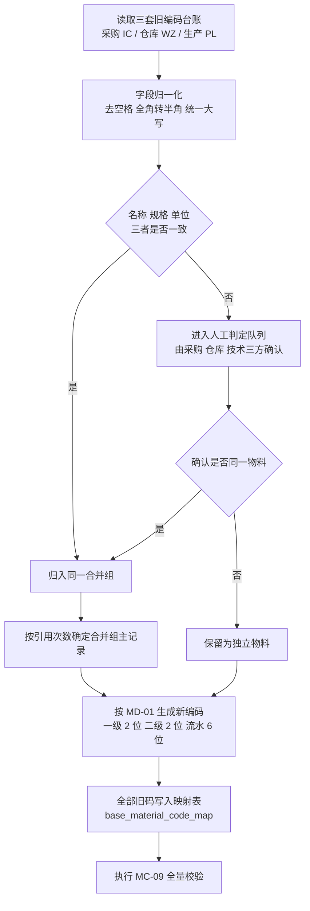
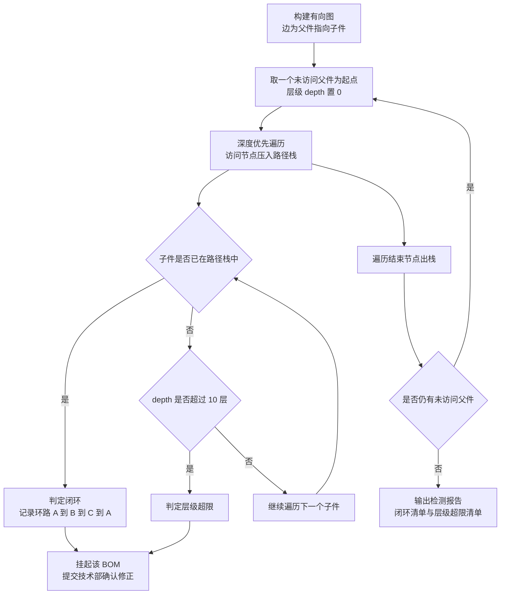
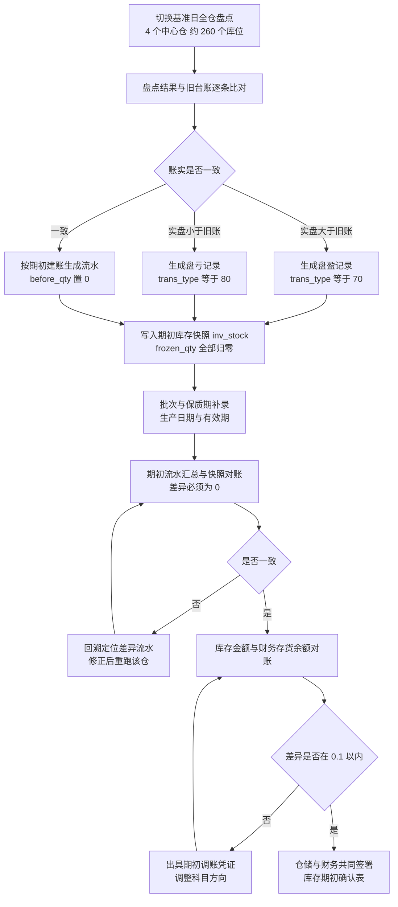
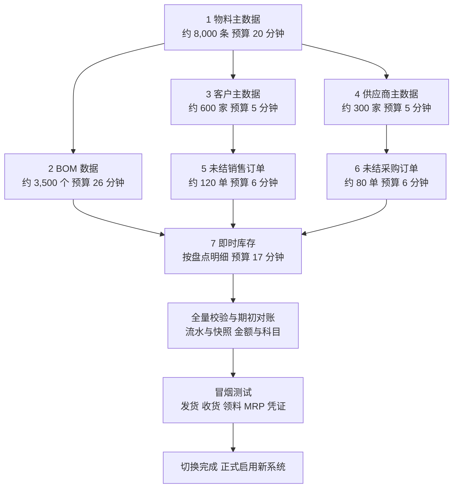

# 数据迁移需求方案

| 文档属性 | 内容 |
|---------|------|
| 文档名称 | 数据迁移需求方案 |
| 文档编号 | ERP-P1-04 |
| 版本 | V1.0 |
| 状态 | 已评审 |
| 编制部门 | 数字化管理部 |
| 编制日期 | 2026年9月 |
| 所属阶段 | 阶段一 需求确认（第 1-2 月） |
| 关联里程碑 | M1 需求基线确认 |
| 执行阶段 | 阶段六 数据迁移与上线（第 10 月） |
| 迁移对象 | 7 类：物料主数据、BOM 数据、客户主数据、供应商主数据、未结销售订单、未结采购订单、即时库存 |
| 验收阈值 | 关键数据（库存数量/金额、未结订单金额）误差率 ≤ 0.1% |
| 参考基线 | 《企业资源计划ERP系统需求规格说明书》V1.0 第七章、《ERP系统数据库表结构设计文档》V1.0、《ERP系统开发阶段计划文档》V1.0、《ERP系统开发API设计与规范文档》V1.0 |
| 输入文档 | 同目录 `01-业务调研报告.md`、`02-业务流程梳理-As-Is与To-Be.md` |

---

## 一、文档定位

本方案是阶段一「需求确认」的交付物之一，对应《ERP系统开发阶段计划文档》阶段一核心任务 **1.3 需求编写**中的「数据迁移需求」，是《企业资源计划ERP系统需求规格说明书》第七章「数据迁移需求」的独立展开与执行级细化。

| 定位要素 | 说明 |
|---------|------|
| 输入基线 | 《企业资源计划ERP系统需求规格说明书》V1.0 第七章（7 类迁移对象、数据量预估、清洗规则、验证方案），**只读引用**，本方案不修改该文档任何内容 |
| 本方案作用 | 把基线的"迁移对象 + 数据量预估 + 清洗规则 + 验证方案"四要素，细化为**可执行、可验收、可回退**的迁移需求：逐字段映射规则、逐条清洗规则、分批策略、验证方法与阈值、责任分工、异常处置流程 |
| 执行阶段 | 阶段六 数据迁移与上线（第 10 月），对应阶段六核心任务 6.1 数据清洗、6.2 数据迁移、6.3 迁移验证、6.4 上线切换 |
| 交付成果 | 阶段六交付《数据迁移验证报告》（各迁移对象核对结果与误差率结论）、《上线确认书》、上线切换方案与回退方案；本方案是上述交付物的需求侧依据 |
| 验收条件 | 阶段六 checklist：全部迁移对象完成迁移并按验证方案核对；**关键数据（库存数量/金额、未结订单金额）误差率 ≤ 0.1%**；上线切换演练成功、回退方案可用；《上线确认书》签署 |
| 上游输入 | `01-业务调研报告.md`（一物多码、手工台账、库存与财务口径不一致等现状痛点与量级）、`02-业务流程梳理-As-Is与To-Be.md`（单据状态机与未结单据范围判定依据） |
| 下游流向 | 阶段二：本方案的字段映射表与"【阶段二数据库设计需补充】"清单，作为数据库设计的补充输入；阶段六：作为迁移脚本开发、试迁移、正式迁移与验证的执行依据 |
| 边界声明 | 本方案不新增、不删减基线第七章的迁移对象与功能范围；不涉及任何代码、SQL 或配置文件，全部内容为需求与规则描述 |

### 1.1 阶段一统一裁定在本方案中的落实

| 序号 | 阶段一统一裁定 | 在本方案中的落实位置 |
|------|--------------|-------------------|
| 1 | 物料编码：2 位一级分类 + 2 位二级分类 + 6 位流水，`-` 分隔，如 `01-03-000128`；旧码（IC-001 / WZ-089 / PL-023）合并映射到新编码 | 3.1 清洗规则 MC-01、MC-02 与字段映射表 |
| 2 | 生产工单状态 6 态：0-计划 1-已下达 2-领料中 3-加工中 4-已完工 5-已关闭 | 3.5、3.6 未结订单状态映射的不迁移边界说明；附录 B 口径说明 |
| 3 | 物料主数据约 8,000 条，参与 MRP 全量运算的活跃物料约 5,000 种 | 第二章总览表、3.1 数据量预估 |
| 4 | 单据编号规则：前缀 + YYYYMM + 3 位流水，不带连字符（SO/PO/MO/FZ 等） | 3.2 BOM 编号边界说明、3.5 未结销售订单重编规则 SO-02、3.6 未结采购订单重编规则 |
| 5 | 质检不单独建表，质检结论落在 `pur_receipt`（`qualified_qty` / `reject_qty` / `status`） | 3.6 已收货数量回填与暂估处理约定、附录 B 口径说明 |
| 6 | 仓库：4 个中心仓 = 原材料仓、半成品仓、苏州成品仓、东莞成品仓 | 3.7 即时库存的仓库/库位归属规则 |

---

## 二、迁移目标与范围

### 2.1 迁移目标

| 序号 | 目标 | 可验证的达成标准 |
|------|------|-----------------|
| G1 | **期初建账可用**：让新系统在切换日具备开展全部业务的"起跑线数据"，可立即支撑采购、销售、生产、库存、财务的日常作业 | 切换后可在新系统内完成：销售订单发货出库、采购订单收货入库、MRP 运算、月末存货核算，无需回旧系统取数 |
| G2 | **主数据唯一化**：完成一物多码合并与统一编码，消除三套编码并存 | 物料编码唯一性校验通过率 100%；`base_material.material_name` + `spec` + `unit` 组合无重复；旧码 → 新码映射 100% 可查 |
| G3 | **未结业务连续**：未结销售订单、未结采购订单、即时库存三类"当前状态"数据完整承接 | 未结销售订单 ~120 单、未结采购订单 ~80 单 100% 迁移且状态与已执行数量正确；4 个中心仓即时库存与切换基准日盘点数一致 |
| G4 | **误差率达标**：迁移后关键数据误差率 ≤ 0.1%，满足需求说明书第九章验收标准第 2 项与阶段六验收条件 | 库存数量、库存金额、未结订单金额三项加权误差率 ≤ 0.1%，且单条最大偏差 ≤ 1%；由业务部门确认并签署《迁移对象验收清单》（附录 A） |

### 2.2 迁移范围界定

#### 2.2.1 纳入迁移范围（7 类）

| 序号 | 纳入对象 | 纳入理由 |
|------|---------|---------|
| 1 | 物料主数据（~8,000 条） | 全部业务对象（BOM、订单、库存、MRP）的引用基础，无物料则任何单据无法建立 |
| 2 | BOM 数据（~3,500 个 BOM） | MTO 模式下 MRP 运算、定额领料、工单成本归集的唯一依据 |
| 3 | 客户主数据（~600 家） | 未结销售订单与应收账款、信用控制的引用基础 |
| 4 | 供应商主数据（~300 家） | 未结采购订单与应付账款、三单匹配的引用基础 |
| 5 | 未结销售订单（~120 单） | 属"当前状态"数据：仍有未交付义务与应收权利，不迁移将导致漏发货、漏开票 |
| 6 | 未结采购订单（~80 单） | 属"当前状态"数据：仍有未到货义务与应付义务，不迁移将导致重复采购与漏付款 |
| 7 | 即时库存（以切换基准日盘点数为准） | 期初存货实物与金额的唯一来源，所有后续出入库流水的起算基准 |

#### 2.2.2 不纳入迁移范围

| 序号 | 不纳入对象 | 不纳入理由 | 数据去向与保障措施 |
|------|-----------|-----------|-----------------|
| 1 | 历史已结订单（已发货且已收款、已收货且已付款的订单及其明细） | 属已终结业务，新系统无需继续执行；全量迁移 4,800 + 6,000 单/年的历史订单会稀释期初数据、拖长切换窗口，且与"期初建账"原则相悖 | 旧 Excel 台账与独立财务软件数据**只读归档**，保留查询追溯；新系统上线后不提供历史已结订单查询，回溯需求由旧系统只读副本满足 |
| 2 | 历史会计凭证与历史总账/明细账 | 会计档案具有法定保管要求，其期间、科目、凭证号体系与目标库 `fin_voucher`（`period` / `voucher_code`）不同源，强行迁移会造成双套账务并行与追溯链错乱 | 旧财务软件继续保留并只读归档；新系统自切换月起重新开始凭证编号（FZ + YYYYMM + 3 位流水），期初余额以"期初调账凭证"一次性建立（见 3.7 金额差异处理原则） |
| 3 | 历史出入库流水（历史 `inv_transaction` 等价数据） | 需求说明书第七章即时库存口径明确"以仓库实际盘点数为准"；历史流水的数量基础是旧台账（账实差异率约 2.3%），迁移历史流水等于把错误数量带入新系统并污染流水审计链 | 历史流水留旧系统只读归档；**期初库存准确性由切换基准日全仓盘点保证**，并在新系统内为每条期初库存生成一条期初建账流水（见 3.7 清洗规则 IS-01），使"流水 = 快照"从第一天起成立 |
| 4 | 已报废/已处置固定资产与历史折旧记录 | 需求说明书 1.3 与第七章均未将固定资产列入迁移对象；已处置资产不再产生后续业务，历史折旧属会计档案 | 旧资产台账只读归档；新系统 `fin_receivable` / 相关资产卡片由固定资产会计在阶段六按 FIN-06 在线重建在用资产卡片（重建范围仅限在用资产，不含已处置资产） |
| 5 | 历史收发存纸质台账与纸质工票、纸质检验报告 | 属纸质原始凭证，无结构化字段且已由上述 1~4 项以归档方式覆盖；其量级（日流水约 900 条、年工单约 2,600 个）不构成迁移价值 | 纸质凭证按财务与质量体系归档要求原样保存，不录入新系统 |
| 6 | 历史生产工单与委外工单 | 基线第七章未将生产工单列为迁移对象；MTO 在制工单的执行进度、在制数量、已领料记录均无可靠结构化数据（报工进度滞后 3-5 天），迁移将产生不可信的在制数据 | 切换窗口内由生产计划部按新版 BOM 与期初库存**重新下达在制工单**（工单状态按阶段一统一裁定 6 态：0-计划 1-已下达 2-领料中 3-加工中 4-已完工 5-已关闭），历史工单留旧系统与纸质工票归档 |
| 7 | 历史质检记录、历史价格历史（采购历史价格、历史售价） | 质检结论已由需求说明书裁定落在 `pur_receipt`（不单独建表）且历史记录为纸质；历史价格不构成期初余额，新系统按 PUR-07 / SAL-07 自上线的第一笔实际业务起累积 | 纸质检验报告归档；采购员与业务员个人价目表按"参考价"整理为迁移后的初始价格策略（仅作上线首月议价参考，不写入流水，由 PUR-07 / SAL-07 功能承接） |
| 8 | 用户、角色、权限、组织架构 | 属系统运行配置而非业务数据，由阶段三 D2 系统管理模块按组织架构预置并由 IT 管理员维护 | 不迁移；上线前由 IT 管理员完成用户与角色配置并纳入切换检查清单（4.3） |

### 2.3 迁移原则

| 原则 | 具体要求 |
|------|---------|
| **期初建账原则** | 只迁移"未结"与"当前状态"数据：未结订单的执行进度、即时库存的数量与金额、主数据的当前有效属性。历史已结业务一律留旧系统只读归档，新系统不承接历史业务的继续执行 |
| **数量以盘点为准原则** | 即时库存数量一律以切换基准日全仓实际盘点数为准，旧台账数量仅作陈列对比，差异通过盘盈（`trans_type=70`）/ 盘亏（`trans_type=80`）流水在期初调整，禁止直接改写 `inv_stock.qty` |
| **金额以调账为准原则** | 库存数量以盘点为准，库存金额差异计入期初调账并出具凭证（科目方向见 3.7），调账后金额与数量口径一致 |
| **幂等可重跑原则** | 全部迁移按"对象 + 批次"为幂等单元：以业务唯一键（`material_code`、`bom_code`、`customer_code`、`order_code`、`UNIQUE(material_id, warehouse_id, location_id, batch_no)`）做存在性判定，重跑执行"存在则更新、不存在则插入"，不产生重复行；重跑前不需要清理目标表数据（与 API 文档 1.5 幂等性要求同一思路） |
| **可回退原则** | 正式迁移前必须产出自洽的新系统数据快照；回退以"停止新系统写入 + 恢复切换前快照 + 旧系统继续作业"实现，回退演练在切换演练轮次内完成（见 4.5） |
| **单一数据源原则** | 每类对象只指定一个数据主源（见第二章"源系统/载体"列），其他来源仅用于比对补全，避免同一字段多源取值产生口径冲突 |
| **可追溯原则** | 每条迁移记录写入 `remark`：原编码、原单据号、来源文件与版本、合并组编号，使任一新记录可反向定位到旧载体 |

---

## 三、迁移对象总览表

> 数据量预估一律引用《企业资源计划ERP系统需求规格说明书》第七章基线值，不做改动。优先级 P0 = 阻塞后续对象、必须首批成功；P1 = 依赖 P0 完成后方可执行。

| 序号 | 迁移对象 | 源系统/载体 | 目标表 | 数据量预估 | 优先级 | 责任人 | 迁移顺序 |
|------|---------|-----------|-------|-----------|-------|--------|---------|
| 1 | 物料主数据 | 采购部 `IC-` 编码台账、仓库 `WZ-` 编码物料清单（主源）、生产部 `PL-` 编码台账三套 Excel | `base_material`、`base_material_category`、`base_material_code_map` | ~8,000 条 | P0 | 业务：仓储中心；IT：数字化管理部；数据提供：采购部、生产制造部、技术部 | 1 |
| 2 | BOM 数据 | 技术部 7 个 BOM Excel 文件 | `base_bom`、`base_bom_item` | ~3,500 个 BOM | P0 | 业务：技术部（BOM 工程师）；IT：数字化管理部；数据提供：生产制造部（车间实际使用版本佐证） | 2 |
| 3 | 客户主数据 | 3 个区域销售分公司 Excel 客户台账、财务部应收台账 | `base_customer` | ~600 家 | P0 | 业务：销售部；IT：数字化管理部；数据提供：财务部（应收台账与信用信息） | 3 |
| 4 | 供应商主数据 | 采购员个人 Excel 采购台账、独立财务软件应付台账 | `base_supplier` | ~300 家 | P0 | 业务：采购部；IT：数字化管理部；数据提供：财务部（应付台账与付款条件） | 4 |
| 5 | 未结销售订单 | 3 个区域销售分公司 Excel 销售订单台账 | `sal_order`、`sal_order_line`、`sal_delivery_note`（分批交货计划） | ~120 单 | P1 | 业务：销售部；IT：数字化管理部；数据提供：财务部（已开票数量） | 5 |
| 6 | 未结采购订单 | 采购员个人 Excel 采购订单台账、纸质收货单汇总 | `pur_order`、`pur_order_line`、`pur_receipt`（已收货记录） | ~80 单 | P1 | 业务：采购部；IT：数字化管理部；数据提供：仓储中心（已收货数量）、质量部（质检结论） | 6 |
| 7 | 即时库存 | 4 个中心仓纸质收发存台账、各仓 Excel 库存汇总表、切换基准日全仓盘点报告（主源） | `inv_stock`、`inv_transaction`（期初建账流水）、`base_warehouse`、`base_location`、`inv_stocktake` | 以切换基准日全仓盘点明细为准（覆盖 4 个中心仓、约 260 个库位） | P0 | 业务：仓储中心；IT：数字化管理部；数据提供：财务部（存货金额与科目映射） | 7 |

**执行顺序与并行说明**

- 迁移顺序 1→7 为**依赖顺序**，不可颠倒：物料先于 BOM 与全部单据，客户/供应商先于对应订单，即时库存最后（因其基准时点最接近切换点）。
- 顺序 2（BOM）与顺序 3、4（客户/供应商）无相互依赖，在切换窗口内可**并行执行**；顺序 5（销售订单）与顺序 6（采购订单）亦无相互依赖，可并行执行。
- 顺序 7（即时库存）必须**串行且最后**执行，执行期间禁止任何业务作业与盘点记录变动。

---

## 四、迁移对象详细方案

> 本章每类对象均包含 6 个要素：①目标字段映射表 ②数据量预估与分批策略 ③清洗规则 ④验证方案 ⑤责任人 ⑥迁移失败/差异处理。
> 字段映射表中，**目标表.字段名与类型以《ERP系统数据库表结构设计文档》为准**；该文档中缺少的必要字段，在"类型"列标注**【阶段二数据库设计需补充】**，并以文字说明该字段的语义与用途，不臆造为已存在字段。

### 4.1 物料主数据

#### 4.1.1 目标字段映射表（目标表：`base_material`）

| 目标表.字段 | 类型 | 源字段/来源 | 转换规则 | 是否必填 | 校验规则 |
|-----------|------|-----------|---------|---------|---------|
| `base_material.material_code` | VARCHAR(50) | 三套旧编码（`IC-001` / `WZ-089` / `PL-023` 等） | 按 MD-01 重新编码：2 位一级分类 + 2 位二级分类 + 6 位流水，以 `-` 分隔，示例 `01-03-000128`；同一合并组只生成一个新编码 | 是 | 全局唯一；正则 `^\d{2}-\d{2}-\d{6}$`；长度 ≤50 |
| `base_material.material_name` | VARCHAR(200) | 旧台账"物料名称"列 | 归一化：去首尾空格、全角转半角、英文统一大写；合并组内取最完整表述作为标准名称 | 是 | 非空；长度 ≤200；合并组内（名称 + 规格 + 单位）不重复 |
| `base_material.spec` | VARCHAR(200) | 旧台账"规格型号"列 | 同名称归一化规则；缺失且无法从图纸/采购合同补全时置空，并在 `remark` 标记"规格缺失" | 否 | 长度 ≤200 |
| `base_material.category_id` | BIGINT | 旧台账"分类"列 + 新编码前 4 位 | 用新编码的一级/二级分类码匹配 `base_material_category` 叶子节点；无匹配时归入所属一级分类的"其他"子分类 | 是 | 必须命中 `base_material_category` 的叶子节点（`is_leaf = TRUE`） |
| `base_material.material_type` | SMALLINT | 旧台账"物料类别"列 | 归并为 4 类：1-原材料（电子料、结构件、标准件）；2-半成品（主控板组件、电源模块等可独立入库的组件）；3-成品（AC-300 变频器等可销售产品）；4-辅料（紧固件、包装材料、清洗剂等，旧台账"包装材料"归入此类） | 是 | 取值 ∈ {1, 2, 3, 4}；与 `source_type` 组合合理性校验（成品/半成品可为自制，外购件不得为成品） |
| `base_material.source_type` | SMALLINT | 旧台账"来源"列 + BOM 父件关系 | 1-自制（存在生效 BOM 且为成品/半成品）；2-外购（唯一来源为采购）；3-外协（PCB 贴片、表面处理等委外工序产出件）；冲突时以"是否存在 BOM"优先判定为自制 | 是 | 取值 ∈ {1, 2, 3} |
| `base_material.unit` | VARCHAR(10) | 旧台账"单位"列 | 单位标准化：`PCS`/`pcs`/只/支/件 → 个；`SET`/套件 → 套；`KG`/千克 → 公斤；`M`/延米 → 米；其余按标准单位集归并。包装类换算单位（如"箱 = 100 个"）统一折算为基本单位数量 | 是 | 长度 ≤10；命中标准计量单位集 {个, 套, 台, 米, 公斤, 片, 卷, 包}；安全库存与标准成本须与单位同一计量基准 |
| `base_material.standard_cost` | DECIMAL(20,6) | 旧台账"单价/标准成本"列；缺失时按来源补全 | 外购件取近 12 个月最近一次采购价；自制/半成品取 BOM 逐层展开至原材料并计入损耗率后的累计材料成本；仍缺失时取同类物料单位成本中位数。BigDecimal 计算，`RoundingMode.HALF_UP` 保留 6 位 | 否 | ≥ 0；参与库存金额误差率计算 |
| `base_material.safety_stock` | DECIMAL(20,6) | 旧台账"安全库存"列 | 缺失时按 ABC 分类 × 近 12 个月月均出库量补全：A 类 0.5 个月用量、B 类 0.3 个月用量、C 类 0.2 个月用量；无历史出库量时置 0 | 否 | ≥ 0；默认 0；上线后首个 MRP 周期按 INV-07 复核刷新 |
| `base_material.min_order_qty` | DECIMAL(20,6) | 旧台账"起订量"列 | 缺失或 < 1 时置 1（与 `min_order_qty` 默认值 1 一致）；供应商最小包装量大于 1 时取包装量 | 否 | > 0 |
| `base_material.abc_class` | CHAR(1) | 旧台账"ABC 分类"列 | 缺失时按标准成本 × 近 12 个月出库量计算金额占比、降序累计：0~70% 为 A、70~90% 为 B、90~100% 为 C | 否 | 取值 ∈ {A, B, C}，必须大写单字符 |
| `base_material.lead_time` | INT | 旧台账"提前期"列 | 外购件取近 12 个月到货记录（收货日期 − 下单日期）中位数；自制件取同族工单实际周期中位数；均缺失时外购件默认为 15 天、自制件默认为 7 天 | 否 | ≥ 0 的整数 |
| `base_material.is_batch_managed` | BOOLEAN | 旧台账"批次管理"标识 + 物料属性 | 关键料（IGBT 模块、主控芯片等，约占物料总数 15%）置 TRUE；其余置 FALSE | 否 | TRUE 时，该物料的 `inv_stock.batch_no` 必须非空 |
| `base_material.is_shelf_life` | BOOLEAN | 旧台账"保质期"标识 | 有保质期要求的物料（电解电容、电池等）置 TRUE；其余置 FALSE | 否 | TRUE 时 `shelf_life_days` 必须非空且 > 0 |
| `base_material.shelf_life_days` | INT | 旧台账"保质期"列 | 电解电容按 1095 天（3 年）；其余按台账值；`is_shelf_life = TRUE` 且台账缺失时由质量部按物料族给定 | 否 | > 0 的整数 |
| `base_material.status` | SMALLINT | 旧台账"状态"列 + 停用判定结果 | 全部迁移物料统一置 2-启用；仅当"最近 24 个月无出入库 + 无未结订单引用 + 不在任何生效 BOM 中"三者同时满足，并经仓储中心与技术部签字确认后置 3-停用 | 是 | 取值 ∈ {2, 3}；停用清单必须有业务签字记录 |
| `base_material.remark` | VARCHAR(500) | 旧编码、来源文件与版本、合并组编号 | 记录形如"原编码 IC-001 / WZ-089 / PL-023；来源：仓库物料清单 2026-08 版；合并组 M-0001" | 否 | 长度 ≤500 |
| `base_material.drawing_no`、`base_material.drawing_version` | 【阶段二数据库设计需补充】 | 旧台账"图号/版本"列（对应需求 MD-02） | 与图纸管理系统编码对齐；无图号的辅料类物料置空 | 否 | 与 `base_bom.version` 的版本追溯关系一致 |
| `base_material.max_stock` | 【阶段二数据库设计需补充】 | 旧台账"最大库存量"列（对应需求 MD-03） | 台账缺失时按安全库存 × 3 补全 | 否 | ≥ `safety_stock` |
| `base_material.cost_method` | 【阶段二数据库设计需补充】 | 旧台账"计价方法"列（对应需求 MD-04） | 统一置"移动加权平均"（与 FIN-04 主口径一致） | 是 | 取值 ∈ {移动加权平均, 先进先出} |
| `base_material.inventory_subject_id`、`cost_subject_id`、`revenue_subject_id` | 【阶段二数据库设计需补充】 | 财务科目映射规则（对应 FR-09） | 按物料类型映射默认科目：原材料 → 1403 原材料；半成品/成品 → 1405 库存商品；成本科目按来源类型映射；收入科目按产品线映射 | 是 | 必须命中 `fin_subject` 叶子科目（`is_leaf = TRUE`） |
| `base_material.production_lead_time` | 【阶段二数据库设计需补充】 | 旧台账"生产提前期"列（对应需求 MD-03） | 该字段建立前，生产提前期暂由 `lead_time` 承载；字段建立后按来源回填（自制件取工单实际周期中位数） | 否 | ≥ 0 的整数 |

**配套表说明（均标注【阶段二数据库设计需补充】）**

- `base_material_category`：物料分类树，字段建议为 `category_code`（一级 2 位 + 二级 2 位）、`category_name`、`parent_id`、`category_level`、`is_leaf`、`status`。本方案要求阶段二在设计时至少预置：01 电子料（01-01 电阻、01-02 电容、01-03 芯片、01-04 PCB 类）、02 结构件、03 标准件、04 半成品组件、05 成品、06 辅料/包装材料，并保证新编码前 4 位可唯一定位到二级分类。
- `base_material_code_map`（旧码 → 新码映射表）：字段建议为 `old_code`（VARCHAR(50)，唯一）、`old_name`、`source_dept`（采购部/仓库/生产部）、`merge_group`（合并组编号）、`new_material_id`（BIGINT）、`migrated_at`（TIMESTAMP）。该表用于迁移后查询追溯与历史台账反查，**保留期限与审计日志一致（不少于 180 天，建议永久保留）**。

#### 4.1.2 数据量预估与分批策略

| 项目 | 内容 |
|------|------|
| 迁移总量 | ~8,000 条（基线值）；按现状重复条目占 6%~9%（约 480~720 条）估算，合并后约 7,280~7,520 条，其中参与 MRP 全量运算的活跃物料约 5,000 种 |
| 批次大小 | 1,000 条/批，共约 8 批；合并组判定（跨批同组）单独作为一批全局计算，不按批拆分判定 |
| 预计批次耗时 | 每批 2 分钟（含字段归一化、合并判定、编码生成与校验）；全量约 16 分钟 |
| 失败重跑单位 | 单批；重跑按 `material_code` 与 `base_material_code_map.old_code` 做存在性判定，幂等覆盖 |

#### 4.1.3 清洗规则

| 编号 | 规则名称 | 可执行规则内容 |
|------|---------|--------------|
| MC-01 | 一物多码合并判定 | 归一化后**物料名称 + 规格型号 + 计量单位三者一致**视为同一物料，归入同一合并组。归一化细则：去首尾空格与中间重复空格、全角转半角、英文字母统一大写、去除"国产/进口/正品/新料"等无区分意义的前后缀。三者有任意一项不一致的一律不合并，转入人工判定队列 |
| MC-02 | 合并组主记录确定 | 组内以"被未结订单与生效 BOM 引用次数最多"的旧记录作为新编码的数据主源（名称、规格、单位、属性取自主源）；引用次数相同时，以所属部门为"仓库"的记录为主源（与库存盘点口径一致）；再相同时取旧编码字典序最小者。组内全部旧编码写入 `base_material_code_map`，`merge_group` 记录组号，实现"旧码 → 新码"100% 可查 |
| MC-03 | 统一重编码 | 按 MD-01 生成新编码：一级分类 2 位 + 二级分类 2 位 + 6 位流水，以 `-` 分隔（示例 `01-03-000128`）。流水在**二级分类内**独立编号，从 `000001` 起按主源旧编码字典序分配，保证同一物料重跑时得到同一编码 |
| MC-04 | 计划属性补全 | `safety_stock`、`lead_time`、`min_order_qty`、`abc_class` 按 4.1.1 映射表的默认值策略补全；补全值写入 `remark` 标记"属性由迁移按默认策略补全"，供上线后首个 MRP 周期复核 |
| MC-05 | 财务属性补全 | `standard_cost` 与 `cost_method`、默认科目（存货/成本/收入）按 4.1.1 映射表策略补全；`standard_cost` 缺失且无法用同类中位数补全的物料，置 0 并列入"待财务定价清单"，由财务部在切换前完成定价（禁止以 0 成本进入期初库存金额计算） |
| MC-06 | 单位标准化 | 按标准计量单位集 {个, 套, 台, 米, 公斤, 片, 卷, 包} 归并同义单位；同一物料在不同台账单位不一致时，以仓库单位为准，并在 `remark` 记录被归并单位与原值 |
| MC-07 | 物料类型与来源类型归类 | `material_type` ∈ {1-原材料, 2-半成品, 3-成品, 4-辅料}；`source_type` ∈ {1-自制, 2-外购, 3-外协}；归类冲突按"是否存在生效 BOM"→"是否唯一来源为采购"→"是否经委外工序产出的顺序判定 |
| MC-08 | 停用物料处理 | 与"最近 24 个月无出入库 + 无未结订单引用 + 不在任何生效 BOM 中"三者同时满足的物料置 `status = 3`（停用），生成《停用物料清单》由仓储中心与技术部签字；其余全部置 `status = 2`（启用）。停用物料仍保留主数据记录（逻辑删除原则：不物理删除） |
| MC-09 | 编码唯一性与规则校验 | 全量执行：编码正则校验、编码唯一性校验、（名称 + 规格 + 单位）组合唯一性校验、分类节点命中校验、单位集命中校验、布尔属性与关联字段一致性校验（`is_shelf_life = TRUE` → `shelf_life_days` 非空） |

**一物多码合并判定流程**

#### 4.1.4 验证方案

| 验证项 | 方法 | 样本与比例 | 通过标准 |
|-------|------|-----------|---------|
| 总量核对 | 目标表条数 vs 清洗后应有条数（8,000 − 合并减少条数） | 全量 | 条数一致性 = 100% |
| 编码唯一性 | `material_code` 唯一性校验 + 正则校验 | 全量 | 通过率 100% |
| 一物多码合并验证 | 随机抽取历史"多码物料"合并组，验证合并后仅剩 1 条编码、且组内全部旧码可通过映射表查到新编码 | 随机 50 组 | 一致率 100% |
| 关键字段完整率 | `material_code`、`material_name`、`unit`、`material_type`、`source_type`、`category_id`、`status` 非空率 | 全量 | 完整率 100% |
| 非关键字段完整率 | `spec`、`standard_cost`、`safety_stock`、`abc_class`、`lead_time`、`min_order_qty` 非空率 | 全量 | 完整率 ≥ 99.5% |
| 抽样比对 | 与旧台账逐字段比对（名称、规格、单位、标准成本、ABC 分类） | 随机 200 条（占约 2.5%） | 逐字段一致率 ≥ 98%，金额字段误差率 ≤ 0.1% |
| 业务确认 | 仓储中心、采购部、技术部按《停用物料清单》与《待财务定价清单》逐项确认 | 全量清单 | 清单 100% 签字 |

#### 4.1.5 责任人

| 角色 | 分工 |
|------|------|
| 业务责任部门 | 仓储中心（主责，物料主数据主源与停用判定）；采购部、生产制造部（旧编码来源与人工判定）；技术部（类型/来源归类与图号版本） |
| IT 责任方 | 数字化管理部（清洗规则实现、批次执行、校验报告输出） |
| 数据提供方 | 采购部（`IC-` 台账）、仓储中心（`WZ-` 物料清单）、生产制造部（`PL-` 台账）、财务部（标准成本与科目映射） |
| 确认签署 | 仓储中心负责人、采购部负责人、技术部负责人 |

#### 4.1.6 迁移失败/差异处理

| 异常分类 | 典型场景 | 处理流程 |
|---------|---------|---------|
| 格式错误 | 编码含非法字符、单位超出 VARCHAR(10)、名称超长 | 记录到差异跟踪表 → 挂起该行 → IT 按归一化规则修正后重跑该批 |
| 引用缺失 | `category_id` 无法命中分类节点；标准成本无法补全 | 挂起 → 按 MC-04/MC-05 默认策略补全 → 无策略可依时提交业务确认（仓储中心/财务部）后重跑 |
| 重复冲突 | 合并组内主源判定存在争议；同一新编码被两组占用 | 挂起 → 三方（采购/仓储/技术）现场判定 → 修正合并组与编码后重跑 |
| 逻辑冲突 | 物料同时具备"有 BOM"与"唯一来源为采购"；`is_shelf_life = TRUE` 但保质期缺失 | 挂起 → 按 MC-07 优先级判定 / 质量部给定保质期 → 重跑 |

每日差异跟踪表字段：差异编号、对象类别、异常分类、涉及旧编码/旧单号、差异描述、影响条数、处理责任人、业务确认结论、处理状态、重跑批次、关闭时间。

### 4.2 BOM 数据

#### 4.2.1 目标字段映射表（目标表：`base_bom`、`base_bom_item`）

| 目标表.字段 | 类型 | 源字段/来源 | 转换规则 | 是否必填 | 校验规则 |
|-----------|------|-----------|---------|---------|---------|
| `base_bom.bom_code` | VARCHAR(50) | 旧 BOM 文件中的产品编码/文件编号 | 确定性重编：`BM` + 父件物料新编码去连字符（10 位）+ 2 位版本序号，示例 `BM010300012801`。**说明**：BOM 属基础数据编码，单月迁移量 3,500 个超过"前缀 + YYYYMM + 3 位流水"的月流水容量（999），故 BOM 采用与父件物料绑定的确定性编码；单据编号规则（裁定 4）适用于 SO/PO/MO/FZ 等业务单据，不适用于基础数据 | 是 | 全局唯一；长度 ≤50；同一父件 + 版本组合唯一 |
| `base_bom.parent_material_id` | BIGINT | 旧 BOM 文件的父件物料编码 | 经 `base_material_code_map` 映射为 `base_material.id`；映射不到则挂起该 BOM | 是 | 必须存在于 `base_material`；且该物料 `material_type` ∈ {2, 3} |
| `base_bom.version` | VARCHAR(20) | 旧 BOM 文件的版本标识（如 V1.0 / V1.1 / V2） | 统一格式化为 `V<主版本>.<次版本>`（V2 → V2.0）；迁移后的生效版本统一改写为 `V1.0` 作为基线版本，原版本号记入 `remark` | 是 | 长度 ≤20；同一父件在有效期内仅允许一个 `status = 2`（生效）的版本 |
| `base_bom.quantity` | DECIMAL(20,6) | 旧 BOM 文件的父件基准数量 | 统一置 1（与 `quantity` 默认值 1 一致）；旧台账为"每 N 台用量"的，将用量折算为按 1 台计的 `child_qty` | 否 | > 0；默认 1 |
| `base_bom.status` | SMALLINT | 旧 BOM 文件的审核/使用状态 + 版本冲突判定结果 | 车间实际使用版本置 2-生效；其余版本置 1-审核（保留可查、不参与 MRP 与工单锁版） | 是 | 取值 ∈ {0, 1, 2}；同一父件生效版本数 = 1 |
| `base_bom.effective_date` | DATE | 旧 BOM 文件的生效日期 | 缺失时按"该产品最近一次实际领料日期"回填；仍无记录时按切换基准日回填 | 否 | ≤ `expiry_date`（若非空） |
| `base_bom.expiry_date` | DATE | 旧 BOM 文件的失效日期 | 无失效约定时置空（表示长期有效） | 否 | 非空时必须 > `effective_date` |
| `base_bom.remark` | VARCHAR(500) | 旧文件编号、原版本号、来源文件名 | 记录形如"原文件：AC-300 BOM V1.1.xlsx；原版本 V1.1；迁移基线版本 V1.0" | 否 | 长度 ≤500 |
| `base_bom_item.bom_id` | BIGINT | 所属 BOM 头 | 按 `bom_code` 关联迁移后的 `base_bom.id` | 是 | 必须存在于 `base_bom` |
| `base_bom_item.child_material_id` | BIGINT | 旧 BOM 文件的子件物料编码 | 经 `base_material_code_map` 映射为 `base_material.id` | 是 | 必须存在于 `base_material`（悬挂引用不得入库） |
| `base_bom_item.child_qty` | DECIMAL(20,6) | 旧 BOM 文件的子件用量 | 按"每 1 个父件"折算；原为区间的取上限并在 `remark` 记录原区间 | 是 | > 0；BigDecimal 保留 6 位 |
| `base_bom_item.loss_rate` | DECIMAL(5,2) | 旧 BOM 文件的损耗率 | 统一按百分比数值录入（贴片件按 3.00 等实际值）；缺失时置 0 | 否 | 0 ≤ 值 ≤ 100 |
| `base_bom_item.scrap_rate` | DECIMAL(5,2) | 旧 BOM 文件的报废率 | 有值按值录入；缺失时置 0 | 否 | 0 ≤ 值 ≤ 100 |
| `base_bom_item.sequence` | INT | 旧 BOM 文件的工序/行序 | 按原行序录入；缺失时按子件编码顺序补 | 否 | ≥ 1 |
| `base_bom_item.is_alternative` | BOOLEAN | 旧 BOM 文件的替代料标识 | 标记替代料的子件置 TRUE；主料置 FALSE | 否 | FALSE 时 `alternative_priority` 置空 |
| `base_bom_item.alternative_priority` | INT | 旧 BOM 文件的替代优先级 | 按完全替代优先、部分替代其次排列；未标注时按行序赋 1、2、3… | 否 | 同一替代组内唯一；值 ≥ 1（1 最高） |

> 说明：`base_bom_item` 的唯一约束为 `UNIQUE(bom_id, child_material_id)`，迁移后须全量校验；同一子件在同一 BOM 中重复出现（旧文件常见）已按 4.2.3 BC-04 合并处理。

#### 4.2.2 数据量预估与分批策略

| 项目 | 内容 |
|------|------|
| 迁移总量 | ~3,500 个 BOM（基线值）；明细行数按单产品平均 80~150 种子件（需求说明书 1.1）与平均 3~4 层结构（调研基线）估算，逐层展开后的明细行量级高于 BOM 头数量 |
| 批次大小 | 500 个 BOM/批（含其全部明细行），共约 7 批；闭环检测与层级校验按批内 + 跨批累积图执行，**闭环检测必须全量一次性执行**，不按批拆分 |
| 预计批次耗时 | 每批 3 分钟（含明细展开、子件映射、用量校验）；全量约 21 分钟；闭环检测全量单次约 5 分钟 |
| 失败重跑单位 | 单个 BOM（头 + 明细整体）；重跑按 `bom_code` 幂等覆盖，明细按 `UNIQUE(bom_id, child_material_id)` 覆盖 |

#### 4.2.3 清洗规则

| 编号 | 规则名称 | 可执行规则内容 |
|------|---------|--------------|
| BC-01 | 闭环检测 | 防 A 含 B、B 又含 A 的死循环。算法：以全部 BOM 的 (父件 → 子件) 边构建有向图；对每个父件节点执行**深度优先遍历 + 路径栈**：进入节点时压栈，若访问到的子件已在当前路径栈中 → 判定为闭环，记录环路（如 A → B → C → A）并挂起该 BOM；遍历出栈时弹出节点。检测同时约束**最大层级 ≤ 10 层**（对应 BOM-01），路径长度超过 10 层判定为层级超限，同样挂起 |
| BC-02 | 多级结构校验 | 校验每个父件的层级链完整：父件的直接子件若自身也有 BOM，则该子件必须在本批或前批已完成迁移（引用完整性）；子件层级 = 父件层级 + 1，根父件层级为 0 |
| BC-03 | 子件用量合理性校验 | `child_qty` 必须 > 0（用量为 0 或负数的行剔除并记录）；`loss_rate` 与 `scrap_rate` 必须落在 0~100 区间（超出区间的按 100 截断并标记）；`quantity` 必须 > 0 |
| BC-04 | 重复子件合并 | 同一 BOM 内同一子件出现多行时合并为一行：`child_qty` 累加，`loss_rate` 与 `scrap_rate` 取最大值，`sequence` 取最小行序，合并前原值记入 `remark`，确保满足 `UNIQUE(bom_id, child_material_id)` |
| BC-05 | 悬挂引用处理 | 子件编码在物料主数据中不存在（含仅存在于旧台账、已被合并或被停用）时：先经 `base_material_code_map` 尝试映射；仍无法映射的，挂起该明细行并提交技术部确认——确认属误录的删除该行，确认属漏建物料的先补建物料主数据再迁移该行。**禁止在 BOM 中保留无物料主数据的子件** |
| BC-06 | 版本冲突处理 | 同一父件存在多版本（V1.0 / V1.1 / V2 并存，调研基线 MFG-P2）时：以"车间最近一次实际领料所依据的版本"为基准版本，迁移为 `V1.0` 且 `status = 2`（生效）；其余版本迁移（保留可查、供 BOM 反查与历史追溯）但 `status = 1`（审核），不参与 MRP 运算与工单锁版。每个父件最终仅一个生效版本 |
| BC-07 | 审核状态处理 | 旧文件无审核状态概念；凡"车间实际使用过"或"技术部主管书面确认"的 A 级/生效版本，迁移后直接置 `status = 2`（生效）并回填 `effective_date`，视为已完成"编制 → 主管审核 → 生效"流程（对应 BOM-05）；仅作参考的历史版本置 `status = 1` |
| BC-08 | 替代料处理 | 标记为替代料的子件保留 `is_alternative = TRUE` 与 `alternative_priority`；同一主料下的替代料优先级不得重复，重复的按行序重排；替代料同样必须通过 BC-05 子件存在性校验 |
| BC-09 | 父子件一致性校验 | 父件 `material_type` 必须 ∈ {2, 3}（半成品、成品）；原材料与辅料不允许作为 BOM 父件（作为父件的按"补建半成品物料"处理）；子件不得等于父件（自引用视为闭环，按 BC-01 处理） |

**BOM 闭环检测算法流程**

#### 4.2.4 验证方案

| 验证项 | 方法 | 样本与比例 | 通过标准 |
|-------|------|-----------|---------|
| 总量核对 | `base_bom` 条数 vs 清洗后应有 BOM 数（3,500 − 重复合并数）；`base_bom_item` 行数 vs 清洗后应有明细行数 | 全量 | 条数一致性 = 100% |
| 闭环与层级校验 | 全量运行闭环检测，输出闭环清单与层级超限清单 | 全量 | 闭环数 = 0；最大层级 ≤ 10 |
| 结构完整性 | 每个 BOM 头至少 1 条明细；每个父件的生效版本数 = 1 | 全量 | 通过率 100% |
| 引用完整性 | 全部 `parent_material_id`、`child_material_id` 均存在于 `base_material` | 全量 | 通过率 100% |
| 抽样比对 | 随机抽取 BOM 与纸质/旧系统逐项比对（BOM 头 + 全部明细行的子件、用量、损耗率） | **随机 50 个 BOM**（基线要求） | 逐项一致率 ≥ 98%，用量字段误差率 ≤ 0.1% |
| 反查验证 | 输入任一子件，验证可反查出引用它的全部父件（对应 BOM-06） | 随机 30 个高频子件 | 反查结果与旧台账一致率 ≥ 98% |
| 业务确认 | 技术部 BOM 工程师按《版本冲突处理清单》《悬挂引用处理清单》逐项确认 | 全量清单 | 清单 100% 签字 |

#### 4.2.5 责任人

| 角色 | 分工 |
|------|------|
| 业务责任部门 | 技术部（BOM 编制与版本判定、闭环与悬挂引用确认）；生产制造部（车间实际使用版本佐证） |
| IT 责任方 | 数字化管理部（闭环检测算法实现、批次执行、校验报告输出） |
| 数据提供方 | 技术部（7 个 BOM Excel 文件）、生产制造部（领料记录佐证）、仓储中心（领料出库台账） |
| 确认签署 | 技术部负责人、生产制造部负责人 |

#### 4.2.6 迁移失败/差异处理

| 异常分类 | 典型场景 | 处理流程 |
|---------|---------|---------|
| 格式错误 | 版本号无法格式化、用量含非数值字符、损耗率超区间 | 记录差异跟踪表 → 挂起该行 → 按 BC-03 截断/归一化后重跑 |
| 引用缺失 | 子件或父件映射不到物料主数据（悬挂引用） | 挂起 → 技术部确认 → 补建物料或删除明细行 → 重跑该 BOM |
| 重复冲突 | 同一 BOM 内重复子件；同一替代组优先级重复 | 挂起 → 按 BC-04 / BC-08 自动合并与重排 → 重跑 |
| 逻辑冲突 | 检测到闭环；层级超过 10 层；原材料作为 BOM 父件；自引用 | 挂起该 BOM → 技术部现场拆解环路或调整结构 → 修正源文件后重跑并重新执行闭环检测 |

### 4.3 客户主数据

#### 4.3.1 目标字段映射表（目标表：`base_customer`）

> 《ERP系统数据库表结构设计文档》未给出 `base_customer` 表结构定义（仅在 ER 图中引用），**下列全部字段类型标注为【阶段二数据库设计需补充】**，字段语义与来源以需求编号 CS-01 / CS-03 为准。

| 目标表.字段 | 类型 | 源字段/来源 | 转换规则 | 是否必填 | 校验规则 |
|-----------|------|-----------|---------|---------|---------|
| `base_customer.customer_code` | 【阶段二数据库设计需补充】 | 3 个分公司客户台账 + 财务应收台账的客户编号 | 按 MD-01 编码体系重编：客户编码规则与物料编码同构为"2 位区域码 + 2 位客户等级/行业码 + 6 位流水" | 是 | 全局唯一；长度 ≤50；正则 `^\d{2}-\d{2}-\d{6}$` |
| `base_customer.customer_name` | 【阶段二数据库设计需补充】 | 旧台账"客户名称"列 | 归一化后作为标准名称：去空格、全角转半角、去除"（华东）""分公司"等非名称构成部分；以工商全称为准 | 是 | 非空；与统一社会信用代码组合唯一（代码为空时名称唯一） |
| `base_customer.unified_social_credit_code` | 【阶段二数据库设计需补充】 | 旧台账"税务登记号/统一社会信用代码"列 + 财务应收回款信息 | 缺失时从财务应收台账与开票记录补全；格式统一为 18 位大写 | 否 | 长度 = 18；第 18 位校验位按 GB 32100 算法校验通过；字符集为 0-9 与 A-Z 去除 I、O、S、V、Z |
| `base_customer.contact` | 【阶段二数据库设计需补充】 | 旧台账"联系人"列 | 多联系人取主联系人；其余联系人记入 `remark` | 否 | 长度 ≤50 |
| `base_customer.phone` | 【阶段二数据库设计需补充】 | 旧台账"联系电话"列 | 去除分隔符，手机号 11 位、座机含区号 | 否 | 数字与短横线组成；长度 ≤30 |
| `base_customer.delivery_address` | 【阶段二数据库设计需补充】 | 旧台账"收货地址"列 | 与注册地址不同的按收货地址录入，多地址取默认收货地址，其余记入 `remark` | 否 | 长度 ≤300 |
| `base_customer.settlement_method` | 【阶段二数据库设计需补充】 | 旧台账"结算方式"列 | 标准化到统一取值集：款到发货 / 月结 30 天 / 月结 60 天 / 月结 90 天；旧表述（如"60 天账期""货到后 60 天付款"）归并为"月结 60 天" | 是 | 取值必须命中结算方式取值集 |
| `base_customer.credit_limit` | 【阶段二数据库设计需补充】 | 旧台账"信用额度"列 + 财务应收台账 | 有值按值录入；缺失时按"近 12 个月该客户月均销售额 × 信用期限月数 × 1.2"估算，估算值须经销售部门与会签财务部确认后生效 | 否 | ≥ 0；销售部逐个确认（600 家全量） |
| `base_customer.credit_days` | 【阶段二数据库设计需补充】 | 旧台账"信用期限"列 | 由结算方式推导（月结 30/60/90 天对应 30/60/90；款到发货对应 0）；缺失时默认 60 天并由销售部确认 | 否 | ≥ 0 的整数；与 `settlement_method` 一致 |
| `base_customer.region`、`industry`、`scale` | 【阶段二数据库设计需补充】 | 旧台账"地区/行业/规模"列（对应 CS-03 多维分类） | 地区按 3 个区域销售分公司（华东、华南、华北）归一；行业与规模按统一字典取值 | 否 | 取值必须命中对应字典 |
| `base_customer.status` | 【阶段二数据库设计需补充】 | 旧台账"状态"列 | 有未结销售订单或有应收余额的客户置"启用"；其余按台账状态，停用客户保留记录并可查询 | 是 | 取值 ∈ {启用, 停用} |
| `base_customer.remark` | VARCHAR(500) | 合并组编号、原客户编号、来源文件 | 记录形如"原编号 HD-0231；来源：华东分公司客户台账 2026-08；合并组 C-0007" | 否 | 长度 ≤500 |

#### 4.3.2 数据量预估与分批策略

| 项目 | 内容 |
|------|------|
| 迁移总量 | ~600 家（基线值）；按现状重复登记（如"申达电气"与"申达有限公司"重复统计）估算，合并后约 570~590 家 |
| 批次大小 | 200 家/批，共 3 批；重复判定与信用额度估算不按批拆分，全量一次性计算 |
| 预计批次耗时 | 每批 1 分钟（含归一化、信用代码校验、结算方式归并）；全量约 3 分钟 |
| 失败重跑单位 | 单批；重跑按 `customer_code` 与 `unified_social_credit_code` 幂等覆盖 |

#### 4.3.3 清洗规则

| 编号 | 规则名称 | 可执行规则内容 |
|------|---------|--------------|
| CC-01 | 统一编码 | 按"2 位区域码 + 2 位客户等级/行业码 + 6 位流水"重编客户编码；同一合并组只生成一个编码；原编号写入 `remark` |
| CC-02 | 重复客户合并 | 判定依据：**客户名称（归一化后）+ 统一社会信用代码**。两者一致 → 合并；名称一致但信用代码不同 → 视为不同法人，不合并（记入人工判定队列）；信用代码一致但名称不同 → 合并，保留最新工商全称。案例：客户台账中"申达电气"与"申达有限公司"归一化后名称不一致，须以统一社会信用代码核对后合并为一条，消除年度销售排行重复统计 |
| CC-03 | 统一社会信用代码格式校验 | 长度必须为 18；前 17 位取自字符集 `0123456789ABCDEFGHJKLMNPQRTUWXY`（31 字符，去除 I、O、S、V、Z）；**18 位校验位算法**：以权重序列 Wi = {1, 3, 9, 27, 19, 26, 16, 17, 20, 29, 25, 13, 8, 24, 10, 30, 28} 对前 17 位逐位加权求和 S = Σ(Ci × Wi)，取余 R = S mod 31，校验位 = 字符集中第 (31 − R) 个字符（(31 − R) = 31 时取第 1 个字符 `0`）；校验位与第 18 位不一致的记为"格式错误"，退回销售部核对工商信息后修正。**不得丢弃**：校验失败但客户有未结订单或应收余额的，暂以原代码迁移并列入《待核对清单》，由销售部核对后修正 |
| CC-04 | 信用属性补全 | `credit_limit` 缺失时按"近 12 个月月均销售额 × 信用期限月数 × 1.2"估算；`credit_days` 缺失时按结算方式推导，无法推导时默认 60 天。全部估算值由销售部逐家确认（600 家全量），确认后的信用参数在切换前一次性录入 |
| CC-05 | 结算方式标准化 | 归并到统一取值集：款到发货 / 月结 30 天 / 月结 60 天 / 月结 90 天；同义表述（如"账期 60 天""货到 60 天付款"）统一为"月结 60 天"；同时校验 `credit_days` 与结算方式一致 |
| CC-06 | 名称归一化 | 去空格、全角转半角、统一"有限公司/股份有限公司"后缀写法；归一化结果仅用于比对，`customer_name` 以工商全称存储 |

#### 4.3.4 验证方案

| 验证项 | 方法 | 样本与比例 | 通过标准 |
|-------|------|-----------|---------|
| 总量核对 | `base_customer` 条数 vs 清洗后应有客户数（600 − 合并减少数） | 全量 | 条数一致性 = 100% |
| 编码唯一性 | `customer_code` 唯一性校验 | 全量 | 通过率 100% |
| 重复合并验证 | 验证已知重复客户（如"申达电气"相关记录）合并后仅剩 1 条 | 全量重复组 | 合并正确率 100% |
| 信用代码校验 | 统一社会信用代码长度、字符集与校验位校验 | 全量 | 校验通过率 ≥ 99.5%；未通过项 100% 进入《待核对清单》并完成核对 |
| 订单可承接验证 | 每条未结销售订单的客户引用均可解析到 `base_customer.id` | 全量（~120 单） | 解析成功率 100% |
| 业务确认 | **与销售部门逐一确认**（基线要求）：客户名称、信用额度、信用期限、结算方式 | 600 家全量 | 确认率 100%，确认记录留签字 |
| 财务会签 | 与财务部核对应收台账客户口径 | 有应收余额的客户全量 | 应收客户清单一致率 100% |

#### 4.3.5 责任人

| 角色 | 分工 |
|------|------|
| 业务责任部门 | 销售部（主责，客户确认与信用参数定案）；财务部（应收口径与信用信息会签） |
| IT 责任方 | 数字化管理部（编码生成、合并判定、校验位校验、报告输出） |
| 数据提供方 | 3 个区域销售分公司（客户台账）、财务部（应收台账与开票信息） |
| 确认签署 | 销售部负责人、财务部负责人 |

#### 4.3.6 迁移失败/差异处理

| 异常分类 | 典型场景 | 处理流程 |
|---------|---------|---------|
| 格式错误 | 信用代码不足 18 位、含非法字符、校验位不符；电话含非数值字符 | 记录差异跟踪表 → 挂起 → 销售部核对工商信息修正后重跑；有未结业务的客户按 CC-03 暂迁并列入《待核对清单》 |
| 引用缺失 | 客户无名称；区域/行业/规模字典无匹配值 | 挂起 → 销售部补充后重跑；字典无匹配值归入"其他" |
| 重复冲突 | 同一信用代码对应多个名称；名称相同但代码不同 | 挂起 → 人工判定队列 → 销售部与财务部判定 → 修正后重跑 |
| 逻辑冲突 | 信用额度小于该客户当前应收余额；结算方式与信用期限矛盾 | 挂起 → 销售部与财务部会签处置结论（调增额度或维持并列入超额度监控）→ 修正后重跑 |

### 4.4 供应商主数据

#### 4.4.1 目标字段映射表（目标表：`base_supplier`）

> 《ERP系统数据库表结构设计文档》未给出 `base_supplier` 表结构定义（仅在 ER 图中引用），**下列全部字段类型标注为【阶段二数据库设计需补充】**，字段语义与来源以需求编号 CS-02 为准。

| 目标表.字段 | 类型 | 源字段/来源 | 转换规则 | 是否必填 | 校验规则 |
|-----------|------|-----------|---------|---------|---------|
| `base_supplier.supplier_code` | 【阶段二数据库设计需补充】 | 采购员台账 + 财务应付台账的供应商编号 | 与客户编码同构重编："2 位供货品类码 + 2 位评级/地区码 + 6 位流水" | 是 | 全局唯一；长度 ≤50；正则 `^\d{2}-\d{2}-\d{6}$` |
| `base_supplier.supplier_name` | 【阶段二数据库设计需补充】 | 旧台账"供应商名称"列 | 与客户名称同规则归一化，以工商全称为准 | 是 | 非空；与统一社会信用代码组合唯一 |
| `base_supplier.unified_social_credit_code` | 【阶段二数据库设计需补充】 | 旧台账"税务登记号/统一社会信用代码"列 + 财务应付台账 | 缺失时从财务应付台账与发票记录补全；18 位大写 | 否 | 同客户主数据校验位算法（GB 32100） |
| `base_supplier.contact` | 【阶段二数据库设计需补充】 | 旧台账"联系人"列 | 多联系人取主联系人，其余记入 `remark` | 否 | 长度 ≤50 |
| `base_supplier.phone` | 【阶段二数据库设计需补充】 | 旧台账"联系电话"列 | 去除分隔符 | 否 | 数字与短横线组成；长度 ≤30 |
| `base_supplier.supply_category` | 【阶段二数据库设计需补充】 | 旧台账"供货内容"列 + 采购历史物料明细 | 标准化到物料一级/二级分类：按该供应商近 12 个月实际供货的物料分类汇总，取占比最高的 1~3 个分类作为供货品类（如"宏微科技 → 01-03 芯片"） | 是 | 取值必须命中 `base_material_category` 节点；每家至少 1 个品类 |
| `base_supplier.settlement_method` | 【阶段二数据库设计需补充】 | 旧台账"结算方式"列 | 标准化到：款到发货 / 月结 30 天 / 月结 60 天 / 月结 90 天 | 是 | 取值必须命中结算方式取值集 |
| `base_supplier.payment_terms` | 【阶段二数据库设计需补充】 | 旧台账"付款条件"列 + 财务应付台账 | 与结算方式一致性校验；不一致时以财务应付台账（实际执行口径）为准并记录差异 | 否 | 与 `settlement_method` 逻辑一致 |
| `base_supplier.rating` | 【阶段二数据库设计需补充】 | 旧台账"评级"列（对应 PUR-08 供应商评级） | 有值按 A/B/C 录入；缺失时按"近 12 个月交货准时率 + 质量合格率"初评：准时率与合格率均 ≥ 95% → A、两项均 ≥ 85% → B、其余 → C；初评结果由采购部确认 | 否 | 取值 ∈ {A, B, C}，大写单字符 |
| `base_supplier.status` | 【阶段二数据库设计需补充】 | 旧台账"状态"列 | 近 12 个月有实际供货或有未结采购订单的供应商置"启用"；长期无交易且无未结订单的置"停用"，保留可查 | 是 | 取值 ∈ {启用, 停用}；停用清单须采购部签字 |
| `base_supplier.remark` | VARCHAR(500) | 合并组编号、原编号、来源文件 | 记录形如"原编号 CG-0112；来源：采购员 A 台账 2026-08；合并组 S-0003" | 否 | 长度 ≤500 |

#### 4.4.2 数据量预估与分批策略

| 项目 | 内容 |
|------|------|
| 迁移总量 | ~300 家（基线值）；其中在供货供应商约 180 家（调研基线）；按重复登记估算，合并后约 285~297 家 |
| 批次大小 | 150 家/批，共 2 批；合并判定与评级初评全量一次性计算 |
| 预计批次耗时 | 每批 1 分钟（含归一化、信用代码校验、供货品类汇总）；全量约 2 分钟 |
| 失败重跑单位 | 单批；重跑按 `supplier_code` 与 `unified_social_credit_code` 幂等覆盖 |

#### 4.4.3 清洗规则

| 编号 | 规则名称 | 可执行规则内容 |
|------|---------|--------------|
| SC-01 | 统一编码 | 按"2 位供货品类码 + 2 位评级/地区码 + 6 位流水"重编；同一合并组只生成一个编码；原编号写入 `remark` |
| SC-02 | 重复供应商合并 | 判定依据：**供应商名称（归一化后）+ 统一社会信用代码**，规则与 CC-02 一致；信用代码一致但名称不同 → 合并；名称一致但代码不同 → 人工判定 |
| SC-03 | 供货品类标准化 | 依据近 12 个月实际供货物料明细，按 `base_material_category` 归并供货品类，取占比最高的 1~3 个二级分类；无采购历史的供应商按采购员台账描述归类，采购部确认 |
| SC-04 | 评级缺失处理 | 按 SC-04（评级初评规则）以交货准时率与质量合格率初评 A/B/C；无历史交易数据的供应商评级初评置 C，由采购部在切换前确认，上线后按 PUR-08 自动评分刷新 |
| SC-05 | 付款条件标准化 | 归并到统一取值集（款到发货 / 月结 30 天 / 月结 60 天 / 月结 90 天），与财务应付台账实际执行口径核对，冲突以财务口径为准并在 `remark` 记录原值；月结 30 天是主要结算条件（与需求说明书 4.6 场景一致） |
| SC-06 | 信用代码与名称归一化 | 与 CC-03、CC-06 同一算法与规则，复用同一校验函数，保证客户与供应商校验口径完全一致 |

#### 4.4.4 验证方案

| 验证项 | 方法 | 样本与比例 | 通过标准 |
|-------|------|-----------|---------|
| 总量核对 | `base_supplier` 条数 vs 清洗后应有供应商数（300 − 合并减少数） | 全量 | 条数一致性 = 100% |
| 编码唯一性 | `supplier_code` 唯一性校验 | 全量 | 通过率 100% |
| 重复合并验证 | 全量重复组复核 | 全量重复组 | 合并正确率 100% |
| 信用代码校验 | 长度、字符集与校验位校验 | 全量 | 校验通过率 ≥ 99.5%；未通过项 100% 完成核对 |
| 供货品类校验 | 供货品类必须命中分类节点；有历史采购的供应商品类与实际供货一致 | 全量 | 通过率 100% |
| 订单可承接验证 | 每条未结采购订单的供应商引用均可解析到 `base_supplier.id` | 全量（~80 单） | 解析成功率 100% |
| 业务确认 | **与采购部门逐一确认**（基线要求）：名称、供货品类、评级、付款条件 | 300 家全量 | 确认率 100%，确认记录留签字 |
| 财务会签 | 与财务部核对财务应付台账的供应商口径 | 有应付余额的供应商全量 | 应付供应商清单一致率 100% |

#### 4.4.5 责任人

| 角色 | 分工 |
|------|------|
| 业务责任部门 | 采购部（主责，供应商确认、供货品类与评级定案）；财务部（应付口径与付款条件会签） |
| IT 责任方 | 数字化管理部（编码生成、合并判定、校验位校验、报告输出） |
| 数据提供方 | 采购员（个人采购台账）、财务部（应付台账与付款记录）、质量部（质量合格率数据） |
| 确认签署 | 采购部负责人、财务部负责人 |

#### 4.4.6 迁移失败/差异处理

| 异常分类 | 典型场景 | 处理流程 |
|---------|---------|---------|
| 格式错误 | 信用代码校验位不符；电话格式非法 | 挂起 → 采购部核对工商信息修正后重跑；有未结采购业务的暂迁并列入《待核对清单》 |
| 引用缺失 | 供货品类无法匹配分类节点；名称缺失 | 挂起 → 采购部补充归类后重跑 |
| 重复冲突 | 同一信用代码多个名称；同一供应商在多名采购员台账中重复登记 | 挂起 → 人工判定队列 → 采购部与财务部判定合并 → 重跑 |
| 逻辑冲突 | 评级与准时率/合格率明显不符；付款条件与结算方式矛盾 | 挂起 → 采购部与会签财务部给出结论 → 修正后重跑 |

### 4.5 未结销售订单

#### 4.5.1 目标字段映射表（目标表：`sal_order`、`sal_order_line`）

| 目标表.字段 | 类型 | 源字段/来源 | 转换规则 | 是否必填 | 校验规则 |
|-----------|------|-----------|---------|---------|---------|
| `sal_order.order_code` | VARCHAR(50) | 旧订单号（如 `SO-华东-2026-0815`、`订单号-20260815-01`） | 重编为 `SO` + 切换月 YYYYMM + 3 位流水（不带连字符），示例 `SO202610001`；原订单号写入 `remark` | 是 | 全局唯一；符合"前缀 + YYYYMM + 3 位流水"规则；长度 ≤50 |
| `sal_order.customer_id` | BIGINT | 旧台账"客户名称/客户编号" | 经客户合并映射解析为 `base_customer.id` | 是 | 必须存在于 `base_customer`；解析失败不得入库 |
| `sal_order.order_date` | DATE | 旧台账"下单日期" | 原值迁移；缺失时按"该订单最早发货/开票日期 − 该客户信用期限"回填，仍无法确定时按切换日回填并在 `remark` 标注 | 是 | 不得晚于 `required_date` |
| `sal_order.required_date` | DATE | 旧台账"要求交货日期"（含"9/20 交 50、9/30 交 50"类文字中的日期） | 取分批计划中最晚一批日期；无分批计划时取台账要求交货日期 | 是 | ≥ `order_date`；早于切换日的按切换日回填并在 `remark` 标注逾期 |
| `sal_order.promised_date` | DATE | 旧台账"承诺交货日期" | 有值按值迁移；无值时按 `required_date` 回填 | 否 | ≥ `order_date` |
| `sal_order.total_amount` | DECIMAL(20,6) | 旧台账"订单总金额"列 | **按明细重算校验**：`total_amount = Σ line_amount`（含税）；重算值与旧台账值不一致时以重算值为准，并生成差异行列入核对清单（差异须 ≤ 0.1%） | 是 | ≥ 0；BigDecimal，`HALF_UP` 保留 6 位；与旧台账比对误差率 ≤ 0.1% |
| `sal_order.currency` | VARCHAR(3) | 旧台账"币别"列 | 统一置 `CNY`；外币订单按旧台账币别迁移并记录汇率来源（本项目客户台账均为人民币结算） | 否 | 长度 = 3；默认 `CNY` |
| `sal_order.tax_rate` | DECIMAL(5,2) | 旧台账"税率"列 | 统一置 13.00（与默认值一致）；旧台账另有税率的按值迁移并校验在 0~100 区间 | 否 | 0 ≤ 值 ≤ 100；默认 13.00 |
| `sal_order.payment_terms` | VARCHAR(50) | 旧台账"结算方式"列 | 标准化为统一结算方式取值集；如申达电气为"月结 60 天" | 否 | 取值必须命中结算方式取值集 |
| `sal_order.order_status` | SMALLINT | 旧台账"订单状态"列 | 仅迁移"未发货"与"部分发货"订单：旧"未发货"→ 1-审核；旧"部分发货"→ 2-部分发货。另将"已全部发货但尚未收款、仍需开票收款"的订单按 3-已发货 迁移（其交付与收款义务尚未终结，属未结范围）。状态取值域：0-草稿 1-审核 2-部分发货 3-已发货 4-已关闭 | 是 | 取值 ∈ {1, 2, 3}；迁移数据**不得**出现 0-草稿 |
| `sal_order.approval_status` | SMALLINT | 旧已受理订单的审核事实 | 迁移订单全部视为已受理，统一置 1-通过（迁移订单均已进入执行阶段） | 是 | 取值 = 1 |
| `sal_order.remark` | VARCHAR(500) | 原订单号、来源文件、已开票说明 | 记录形如"原订单号 SO-华东-2026-0815；来源：华东分公司台账 2026-08；已开票数量按财务开票记录回填" | 否 | 长度 ≤500 |
| `sal_order_line.line_no` | INT | 旧台账明细行序 | 按 1、2、3… 重排行号 | 是 | ≥ 1；同一订单内唯一 |
| `sal_order_line.material_id` | BIGINT | 旧台账明细"物料编码" | 经 `base_material_code_map` 映射为 `base_material.id`（一物多码场景下旧码必须先映射） | 是 | 必须存在于 `base_material` |
| `sal_order_line.qty` | DECIMAL(20,6) | 旧台账明细"数量" | 原值迁移；单位按物料标准单位折算 | 是 | > 0；BigDecimal 保留 6 位 |
| `sal_order_line.unit_price` | DECIMAL(20,6) | 旧台账明细"单价" | **不含税单价**：旧台账含税单价的按 `unit_price = 含税单价 / (1 + tax_rate / 100)` 折算，`HALF_UP` 保留 6 位（如 1,850 元/台含税 → 不含税约 1,637.168142 元） | 是 | > 0；BigDecimal 保留 6 位 |
| `sal_order_line.tax_amount` | DECIMAL(20,6) | 由数量、单价、税率计算 | `tax_amount = line_amount − qty × unit_price`，`HALF_UP` 保留 6 位 | 否 | ≥ 0 |
| `sal_order_line.line_amount` | DECIMAL(20,6) | 由数量、单价、税率计算 | **含税行金额**：`line_amount = qty × unit_price × (1 + tax_rate / 100)`，`HALF_UP` 保留 6 位；以重算值覆盖旧台账值 | 是 | ≥ 0；Σ `line_amount` = `total_amount` |
| `sal_order_line.delivered_qty` | DECIMAL(20,6) | 旧台账"已发货数量" + 仓库手工出库单 | 按仓库出库记录回填；无记录时按旧台账备注文字解析（如"已交 50"）；仍无法确定时置 0 并由销售部确认 | 否 | 0 ≤ 值 ≤ `qty`；> 0 时订单 `order_status` 必须 ∈ {2, 3} |
| `sal_order_line.invoiced_qty` | DECIMAL(20,6) | 财务开票记录 / 应收台账 | 按财务开票记录回填；无记录时置 0 | 否 | 0 ≤ 值 ≤ `qty` |
| `sal_delivery_note.*`（分批交货计划） | 【阶段二数据库设计需补充】 | 旧台账"分批交货计划"备注文字（如"9/20 交 50、9/30 交 50"） | 结构化拆解为分批交货计划明细：批次序号、计划交货日期、计划数量；字段建议为 `delivery_code`、`order_id`、`line_no`、`plan_date`、`plan_qty`、`status`、`actual_qty` | 是 | Σ 计划数量 = 订单行 `qty − delivered_qty`；计划日期必须 ≥ 切换日 |

#### 4.5.2 数据量预估与分批策略

| 项目 | 内容 |
|------|------|
| 迁移总量 | ~120 单（基线值）；按订单平均 2.6 行/单（调研基线）估算，明细行约 310~320 行；其中分批交货订单占比约 38%（约 46 单）需拆解分批计划 |
| 批次大小 | 60 单/批（含明细与分批计划），共 2 批 |
| 预计批次耗时 | 每批 2 分钟（含客户/物料映射、金额重算、分批计划拆解）；全量约 4 分钟 |
| 失败重跑单位 | 单批；重跑按 `order_code` 幂等覆盖，明细按 `line_no` 覆盖，分批计划按（订单 + 行号 + 批次序号）覆盖 |

#### 4.5.3 清洗规则

| 编号 | 规则名称 | 可执行规则内容 |
|------|---------|--------------|
| SO-01 | 筛选规则 | **仅迁移状态为"未发货"或"部分发货"的订单**（基线规则）。判定：旧台账状态为"未发货"→ 新 `order_status = 1`；"部分发货"→ 新 `order_status = 2`；已全部发货且未收款、仍需开票收款的订单按已发货数量判定为 `2` 或 `3`。已发货且已收款、已关闭的订单不迁移（属历史已结订单） |
| SO-02 | 单据号重编 | 全部迁移订单重编为 `SO` + 切换月 YYYYMM + 3 位流水（不带连字符），示例 `SO202610001`；重编规则保证同一订单重跑得到同一编号；原订单号写入 `remark` 用于追溯 |
| SO-03 | 客户/物料引用校验 | `customer_id` 与 `material_id` 必须解析成功；客户解析失败（客户未迁移或合并歧义）或物料解析失败（物料被合并但映射缺失）一律挂起，不得以空引用入库 |
| SO-04 | 金额与税额重算校验 | 以 DECIMAL(20,6) 全精度重算：`line_amount = qty × unit_price × (1 + tax_rate / 100)`；`tax_amount = line_amount − qty × unit_price`；`total_amount = Σ line_amount`；含税/不含税口径以 `unit_price` 不含税、`line_amount`/`total_amount` 含税固定（与库表注释一致），不使用浮点运算，除法一律 `HALF_UP`。重算结果与旧台账差异率 > 0.1% 的行单独列示并核对 |
| SO-05 | 已发货/已开票数量回填 | `delivered_qty` 按仓库出库记录回填，`invoiced_qty` 按财务开票记录回填；两者均以"可追溯的外部凭证"为准，不以旧台账备注为唯一依据；回填后校验 `invoiced_qty ≤ delivered_qty`（不允许先开票后发货）与 `delivered_qty ≤ qty` |
| SO-06 | 分批交货计划处理 | 将备注文字（"9/20 交 50、9/30 交 50"）结构化拆解为分批交货计划（`sal_delivery_note`）：批次序号、计划日期、计划数量；计划数量合计必须等于剩余未交数量（`qty − delivered_qty`）；已交批次不再生成计划，未交部分按原计划日期保留，早于切换日的计划日期顺延至切换日后的第一个工作日并通知客户 |
| SO-07 | 状态映射 | 旧状态 → 新状态机（0-草稿 1-审核 2-部分发货 3-已发货 4-已关闭）的映射：旧"未发货"→ 1；旧"部分发货"→ 2；旧"已发货未收款"→ 3；旧"已关闭/已作废"→ 不迁移。`approval_status` 统一置 1-通过 |

#### 4.5.4 验证方案

| 验证项 | 方法 | 样本与比例 | 通过标准 |
|-------|------|-----------|---------|
| 总量核对 | `sal_order` 条数 vs 旧台账"未发货 + 部分发货"订单数；`sal_order_line` 行数 vs 清洗后应有行数 | 全量 | 条数一致性 = 100% |
| 订单金额核对 | **核对订单总金额与旧系统一致**（基线要求）：逐单比对 `total_amount` | 全量（~120 单） | 逐单一致；加权误差率 ≤ 0.1%；单条最大偏差 ≤ 1% |
| 状态与数量正确性 | 校验 `order_status` 与 `delivered_qty` 的对应关系；校验 `delivered_qty ≤ qty`、`invoiced_qty ≤ delivered_qty` | 全量 | 逻辑一致率 100% |
| 分批计划核对 | 计划数量合计 = 剩余未交数量；计划日期 ≥ 切换日 | 全量分批订单（约 46 单） | 一致率 100% |
| 引用完整性 | 客户、物料引用全部解析成功 | 全量 | 成功率 100% |
| 业务确认 | 销售部与财务部逐单确认金额、状态、已发货/已开票数量 | 全量 | 确认率 100%，确认记录留签字 |

#### 4.5.5 责任人

| 角色 | 分工 |
|------|------|
| 业务责任部门 | 销售部（主责，订单筛选确认、分批计划拆解、客户确认）；财务部（开票数量与金额口径会签） |
| IT 责任方 | 数字化管理部（映射、重编、金额重算、分批计划结构化、报告输出） |
| 数据提供方 | 3 个区域销售分公司（销售订单台账）、仓储中心（出库记录佐证已发货数量）、财务部（开票记录） |
| 确认签署 | 销售部负责人、财务部负责人 |

#### 4.5.6 迁移失败/差异处理

| 异常分类 | 典型场景 | 处理流程 |
|---------|---------|---------|
| 格式错误 | 订单日期格式不一、金额含千分位或中文、数量含单位文字 | 挂起 → 按归一化规则解析 → 解析失败提交销售部确认后重跑 |
| 引用缺失 | 客户未在客户主数据中；物料旧码映射缺失 | 挂起 → 先补客户/物料映射 → 重跑该单 |
| 重复冲突 | 同一订单在多个分公司台账重复登记；订单号重编冲突 | 挂起 → 销售部判定保留唯一订单 → 修正后重跑 |
| 逻辑冲突 | `delivered_qty > qty`；`invoiced_qty > delivered_qty`；分批计划数量合计与剩余数量不符；单价为 0 | 挂起 → 销售部与财务部会签 → 修正数量或金额后重跑 |

### 4.6 未结采购订单

#### 4.6.1 目标字段映射表（目标表：`pur_order`、`pur_order_line`、`pur_receipt`）

| 目标表.字段 | 类型 | 源字段/来源 | 转换规则 | 是否必填 | 校验规则 |
|-----------|------|-----------|---------|---------|---------|
| `pur_order.order_code` | VARCHAR(50) | 旧采购订单号（邮件/传真号、台账编号） | 重编为 `PO` + 切换月 YYYYMM + 3 位流水（不带连字符），示例 `PO202610001`；原订单号写入 `remark` | 是 | 全局唯一；符合"前缀 + YYYYMM + 3 位流水"规则；长度 ≤50 |
| `pur_order.supplier_id` | BIGINT | 旧台账"供应商名称/编号" | 经供应商合并映射解析为 `base_supplier.id` | 是 | 必须存在于 `base_supplier` |
| `pur_order.order_date` | DATE | 旧台账"下单日期" | 原值迁移；缺失时按"最早收货日期 − 供应商提前期"回填，无法确定时按切换日回填并在 `remark` 标注 | 是 | ≤ `required_date` |
| `pur_order.required_date` | DATE | 旧台账"要求到货日期" | 原值迁移；缺失时按切换日 + 供应商 `lead_time` 回填 | 是 | ≥ `order_date` |
| `pur_order.total_amount` | DECIMAL(20,6) | 旧台账"订单总金额" | 按明细重算：`total_amount = Σ line_amount`；以重算值为准并列入差异清单 | 是 | ≥ 0；BigDecimal 保留 6 位；与旧台账比对误差率 ≤ 0.1% |
| `pur_order.tax_rate` | DECIMAL(5,2) | 旧台账"税率" | 统一置 13.00；旧台账另有税率按值迁移 | 否 | 0 ≤ 值 ≤ 100；默认 13.00 |
| `pur_order.payment_terms` | VARCHAR(50) | 旧台账"付款条件" | 标准化到统一取值集；如宏微科技为"月结 30 天" | 否 | 取值必须命中结算方式取值集 |
| `pur_order.order_status` | SMALLINT | 旧台账"订单状态" | 仅迁移"未收货"与"部分收货"订单：未收货 → 1-审核；部分收货 → 2-部分收货。状态取值域：0-草稿 1-审核 2-部分收货 3-已收货 4-已关闭 | 是 | 取值 ∈ {1, 2}；迁移数据**不得**出现 0-草稿 |
| `pur_order.settlement_status` | SMALLINT | 旧台账"已开票/已付款"信息 + 财务应付台账 | 已开票未付款 → 1-部分结算；未开票未付款 → 0-未结算；已全额付款 → 2-已结算（此类订单不属未结范围，不迁移） | 是 | 取值 ∈ {0, 1} |
| `pur_order.remark` | VARCHAR(500) | 原订单号、来源文件、暂估说明 | 记录形如"原订单号 CG-2026-0812；来源：采购员 A 台账；已收货部分按暂估规则处理" | 否 | 长度 ≤500 |
| `pur_order_line.line_no` | 【阶段二数据库设计需补充】 | 旧台账明细行序 | 按 1、2、3… 重排行号。该字段在《ERP系统数据库表结构设计文档》5.2 中以"结构同销售明细"表述，阶段二设计时须与 `sal_order_line` 显式对齐 | 是 | ≥ 1；同一订单内唯一 |
| `pur_order_line.material_id` | BIGINT | 旧台账明细"物料编码" | 经 `base_material_code_map` 映射为 `base_material.id` | 是 | 必须存在于 `base_material` |
| `pur_order_line.qty` | DECIMAL(20,6) | 旧台账明细"数量" | 原值迁移；单位按物料标准单位折算 | 是 | > 0 |
| `pur_order_line.unit_price` | DECIMAL(20,6) | 旧台账明细"单价" | 不含税单价：含税单价按 `含税单价 / (1 + tax_rate / 100)` 折算，`HALF_UP` 保留 6 位 | 是 | > 0 |
| `pur_order_line.tax_amount` | 【阶段二数据库设计需补充】 | 由数量、单价、税率计算 | `tax_amount = line_amount − qty × unit_price`。该字段在 5.2 中未显式列出，阶段二设计时须为 `pur_order_line` 明确定义，含义与 `sal_order_line.tax_amount` 一致 | 否 | ≥ 0 |
| `pur_order_line.line_amount` | DECIMAL(20,6) | 由数量、单价、税率计算 | 含税行金额：`line_amount = qty × unit_price × (1 + tax_rate / 100)`，`HALF_UP` 保留 6 位 | 是 | ≥ 0；Σ `line_amount` = `total_amount` |
| `pur_order_line.received_qty` | DECIMAL(20,6) | 旧台账"已收货数量" + 纸质收货单汇总 | 按纸质收货单与仓库入库记录回填；无凭证支撑的置 0 并由采购部确认 | 否 | 0 ≤ 值 ≤ `qty`；> 0 时 `order_status` 必须 = 2 |
| `pur_receipt.receipt_code` | VARCHAR(50) | 纸质收货单编号（多数无编号） | 按已收货记录补建收货单并重编为 `RE` + 切换月 YYYYMM + 3 位流水；原纸质单号写入 `remark` | 是 | 全局唯一；符合编号规则 |
| `pur_receipt.qualified_qty` / `reject_qty` | DECIMAL(20,6) | 纸质检验报告 | 按纸质检验报告的合格/不合格数量回填；无报告的按"全部合格"处理并在 `remark` 标注，由质量部确认 | 否 | `qualified_qty + reject_qty = receipt_qty`；均 ≥ 0 |
| `pur_receipt.status` | SMALLINT | 纸质检验结论 | 全部合格 → 1；部分合格 → 2；全部不合格 → 3；结论未出 → 0（待检，须在切换前闭环，不得带入新系统长期挂起） | 是 | 取值 ∈ {0, 1, 2, 3}；切换后不得存在 `status = 0` 的历史遗留记录 |

> 说明：质检不单独建表（阶段一统一裁定），质检结论落在 `pur_receipt` 的 `qualified_qty` / `reject_qty` / `status` 三个字段；已收货部分的迁移以"补建收货单"方式呈现，使未结采购订单的已收货数量具备单据支撑，从而满足 PUR-05 三单匹配对"入库单"的需求。

#### 4.6.2 数据量预估与分批策略

| 项目 | 内容 |
|------|------|
| 迁移总量 | ~80 单（基线值）；按平均 2~3 行/单估算，明细行约 160~240 行；已收货记录按纸质收货单汇总，量级与明细行相当 |
| 批次大小 | 40 单/批（含明细与已收货收货单），共 2 批 |
| 预计批次耗时 | 每批 2 分钟（含供应商/物料映射、收货单补建、金额重算）；全量约 4 分钟 |
| 失败重跑单位 | 单批；重跑按 `order_code` 幂等覆盖，明细按 `line_no` 覆盖，收货单按 `receipt_code` 覆盖 |

#### 4.6.3 清洗规则

| 编号 | 规则名称 | 可执行规则内容 |
|------|---------|--------------|
| PO-01 | 筛选规则 | **仅迁移状态为"未收货"或"部分收货"的订单**（基线规则）。判定：旧台账"未收货"→ 新 `order_status = 1`；"部分收货"→ 新 `order_status = 2`；已全部收货但未结算的订单按 `order_status = 3` 判定时属已收货，不再作为未结采购订单迁移（其未结算部分由暂估与应付承接）。已关闭/已取消订单不迁移 |
| PO-02 | 单据号重编 | 重编为 `PO` + 切换月 YYYYMM + 3 位流水（不带连字符），示例 `PO202610001`；原订单号写入 `remark`；补建收货单同步重编为 `RE` + 切换月 YYYYMM + 3 位流水 |
| PO-03 | 供应商/物料引用校验 | `supplier_id` 与 `material_id` 必须解析成功；失败一律挂起，不得空引用入库 |
| PO-04 | 已收货数量回填 | `received_qty` 按纸质收货单 + 仓库入库记录回填；无凭证支撑时置 0 并要求采购部现场确认；回填后校验 `received_qty ≤ qty`，且 `received_qty > 0` 的行必须存在对应的 `pur_receipt` 记录（收货单补建） |
| PO-05 | 金额重算校验 | 与 SO-04 同一算法与精度要求：`line_amount` 含税、`unit_price` 不含税、`total_amount = Σ line_amount`；BigDecimal + `HALF_UP`；重算差异率 > 0.1% 的单独列示核对 |
| PO-06 | 暂估处理约定 | 历史会计凭证不迁移，故**不为历史已收货生成历史暂估凭证**。已收货但发票未到（货到票未到）的部分，在切换后的第一个会计期间内按 PUR-06 规则重新暂估入账：按采购订单价格暂估，借方"原材料/库存商品"、贷方"应付账款-暂估"（科目 2202）；发票到达后红冲暂估并生成正式应付凭证（FIN-03）。切换前由应付会计整理《货到票未到清单》随采购订单一并移交 |
| PO-07 | 状态映射 | 旧状态 → 新状态机（0-草稿 1-审核 2-部分收货 3-已收货 4-已关闭）的映射：旧"未收货"→ 1；旧"部分收货"→ 2；旧"已关闭/已取消"→ 不迁移。`settlement_status` 按已开票与已付款情况映射为 0-未结算 或 1-部分结算 |

#### 4.6.4 验证方案

| 验证项 | 方法 | 样本与比例 | 通过标准 |
|-------|------|-----------|---------|
| 总量核对 | `pur_order` 条数 vs 旧台账"未收货 + 部分收货"订单数；`pur_order_line` 行数 vs 清洗后应有行数；`pur_receipt` 条数 vs 已收货记录数 | 全量 | 条数一致性 = 100% |
| 订单金额核对 | **核对订单总金额与旧系统一致**（基线要求）：逐单比对 `total_amount` | 全量（~80 单） | 逐单一致；加权误差率 ≤ 0.1%；单条最大偏差 ≤ 1% |
| 已收货数量正确性 | `received_qty ≤ qty`；`received_qty > 0` 的行存在对应收货单；收货单 `qualified_qty + reject_qty = receipt_qty` | 全量 | 一致率 100% |
| 引用完整性 | 供应商、物料引用全部解析成功 | 全量 | 成功率 100% |
| 暂估清单核对 | 《货到票未到清单》条数与金额与财务应付台账一致 | 全量 | 一致率 100%；清单经应付会计签字 |
| 业务确认 | 采购部与财务部逐单确认金额、状态、已收货数量 | 全量 | 确认率 100%，确认记录留签字 |

#### 4.6.5 责任人

| 角色 | 分工 |
|------|------|
| 业务责任部门 | 采购部（主责，订单筛选确认、已收货数量核对、暂估清单整理）；财务部（暂估科目与金额口径会签） |
| IT 责任方 | 数字化管理部（映射、重编、收货单补建、金额重算、报告输出） |
| 数据提供方 | 采购员（采购台账）、仓储中心（纸质收货单与入库台账）、质量部（检验报告合格/不合格数量） |
| 确认签署 | 采购部负责人、财务部负责人 |

#### 4.6.6 迁移失败/差异处理

| 异常分类 | 典型场景 | 处理流程 |
|---------|---------|---------|
| 格式错误 | 数量含包装单位文字、单价含税率备注、收货数量与单位不一致 | 挂起 → 归一化解析 → 失败项提交采购部确认后重跑 |
| 引用缺失 | 供应商未在主数据中；物料旧码映射缺失；已收货记录无对应收货单 | 挂起 → 补映射 / 补建收货单 → 重跑该单 |
| 重复冲突 | 同一订单在多本采购台账重复登记；订单号或收货单号重编冲突 | 挂起 → 采购部判定保留唯一订单 → 修正后重跑 |
| 逻辑冲突 | `received_qty > qty`；收货单检验数量合计与收货数量不符；`status = 0` 未闭环；收货单状态无法判定 | 挂起 → 采购部、质量部、仓储中心三方会签 → 修正后重跑；未闭环质检结论必须在切换前完成判定 |

### 4.7 即时库存

#### 4.7.1 目标字段映射表（目标表：`inv_stock`、`inv_transaction`）

| 目标表.字段 | 类型 | 源字段/来源 | 转换规则 | 是否必填 | 校验规则 |
|-----------|------|-----------|---------|---------|---------|
| `inv_stock.material_id` | BIGINT | 切换基准日全仓盘点报告的物料编码 | 经 `base_material_code_map` 映射为 `base_material.id`（一物多码场景必须先合并后建账） | 是 | 必须存在于 `base_material`；同一物料在同仓同库位同批次仅一条记录 |
| `inv_stock.warehouse_id` | BIGINT | 盘点报告的仓库归属 | 映射到 4 个中心仓：原材料仓、半成品仓、苏州成品仓、东莞成品仓（阶段一统一裁定）；旧台账中仓库名不一致的按"物料类型 + 库位归属"判定 | 是 | 必须存在于 `base_warehouse`；仓库数 = 4 |
| `inv_stock.location_id` | BIGINT | 盘点报告的库位归属（约 260 个库位） | 按"仓库 + 库位编码"映射到 `base_location.id`；盘点未细分库位的按该物料在 `base_material` 的默认库位归集；无默认库位时归入该仓库的"默认库位" | 否 | 必须存在于 `base_location` 且所属仓库与 `warehouse_id` 一致 |
| `inv_stock.batch_no` | VARCHAR(50) | 盘点报告的批次标识（包装标识 / 收货批次） | 启用批次管理（`is_batch_managed = TRUE`）的物料必须按批次建账：批次号取供应商批次号，缺失时按"`RE`收货单号 + 物料编码后 6 位"编码；未启用批次管理的物料置空 | 否 | `is_batch_managed = TRUE` 时非空；长度 ≤50 |
| `inv_stock.qty` | DECIMAL(20,6) | **切换基准日全仓实际盘点数**（主源） | 以盘点数为准，旧台账数量仅作陈列对比；数量必须与 `inv_transaction` 期初流水一致 | 是 | ≥ 0；与盘点报告逐条一致；误差率 ≤ 0.1% |
| `inv_stock.frozen_qty` | DECIMAL(20,6) | 旧台账"冻结/预留"标识 | **统一归零**：切换前所有质检冻结、订单预留、待处理冻结一律由业务结束（质检结论闭环、预留取消），`frozen_qty` 全部置 0 | 否 | = 0（切换后由新系统的收货待检等业务重新产生） |
| `inv_stock.last_transaction_time` | TIMESTAMP | 期初建账时间 | 置为切换基准日时刻（与期初流水的 `trans_time` 一致） | 否 | = 期初流水 `trans_time` |
| `inv_stock.production_date` | 【阶段二数据库设计需补充】 | 盘点报告的批次生产日期 | 仅有 `pur_receipt.production_date` 承载采购收货的生产日期，`inv_stock` 缺少批次生产日期字段；阶段二需为 `inv_stock` 补充该字段，用于 INV-05 保质期预警 | 否 | ≤ 当前日期 |
| `inv_stock.expiry_date` | 【阶段二数据库设计需补充】 | 生产日期 + `shelf_life_days` 推算 | 对 `is_shelf_life = TRUE` 的物料：`expiry_date = production_date + shelf_life_days`；阶段二需补充该字段以支撑"到期前 30 天预警"（INV-05） | 否 | 对保质期物料必填；> `production_date` |
| `inv_stock.unit_cost` | 【阶段二数据库设计需补充】 | 物料标准成本 / 最近采购价 | 期初结存成本单价，用于库存金额与财务存货余额对账。阶段二需为 `inv_stock`（或期初结存明细）补充该字段 | 否 | ≥ 0；BigDecimal 保留 6 位 |
| `inv_transaction.trans_code` | VARCHAR(50) | 系统生成 | 期初建账流水号：`T` + 切换月 YYYYMM + 5 位流水（期初建账单次写入量大于 999，故流水位扩展至 5 位；日常流水仍按 API 与流程文档的编号示例执行） | 是 | 全局唯一；长度 ≤50 |
| `inv_transaction.material_id` / `warehouse_id` / `location_id` / `batch_no` | BIGINT / BIGINT / BIGINT / VARCHAR(50) | 与 `inv_stock` 同源 | 与期初库存记录逐字段一致 | 是 | 与 `inv_stock` 唯一键组合一致 |
| `inv_transaction.trans_type` | SMALLINT | 由差异性质判定 | 期初建账统一使用盘盈/盘亏类型：旧账无、实盘有（含新系统期初建账本身）→ 70-盘盈；旧账有、实盘少 → 80-盘亏；账实一致时同样以 70-盘盈 生成期初建账流水（`before_qty = 0`、`after_qty = 盘点数`）。若阶段二希望把"期初建账"与"日常盘盈盘亏"在类型上区分，需在 `trans_type` 中增设 90-期初建账**【阶段二数据库设计需补充】**，并同步更新 API 文档与流程文档取值表 | 是 | 取值 ∈ {10, 20, 30, 40, 50, 60, 70, 80}（若阶段二增设 90，则含 90） |
| `inv_transaction.source_biz_type` | VARCHAR(30) | 固定值 | 置 `INV_STOCKTAKE`（与流程文档 9.6 取值表一致） | 否 | 长度 ≤30 |
| `inv_transaction.source_biz_id` | BIGINT | 切换基准日盘点单 | 关联 `inv_stocktake.id`（期初盘点单） | 否 | 必须存在于 `inv_stocktake` |
| `inv_transaction.in_qty` / `out_qty` | DECIMAL(20,6) | 由差异性质判定 | 盘盈：`in_qty = 盘点数`、`out_qty = 0`；盘亏：`in_qty = 0`、`out_qty = 旧台账数 − 盘点数` | 否 | ≥ 0；`after_qty = before_qty + in_qty − out_qty` |
| `inv_transaction.before_qty` / `after_qty` | DECIMAL(20,6) | 由期初建账计算 | 期初建账统一以 `before_qty = 0` 起始；`after_qty` = 该物料在该仓/库位/批次的盘点数；同一唯一键下多条期初流水按批次序列累加，保证最后一条的 `after_qty` = `inv_stock.qty` | 是 | `after_qty = before_qty + in_qty − out_qty`；期末 `after_qty` = `inv_stock.qty` |
| `inv_transaction.unit_cost` | DECIMAL(20,6) | 物料标准成本 / 最近采购价 | 与 `inv_stock.unit_cost` 同源同值，作为移动加权平均法的期初成本单价 | 否 | ≥ 0 |
| `inv_transaction.trans_time` | TIMESTAMP | 期初建账时间 | 置为切换基准日时刻；同一对象的期初流水 `trans_time` 一致 | 是 | ≤ 切换完成时间 |
| `base_warehouse`、`base_location`、`inv_stocktake` | 【阶段二数据库设计需补充】 | 4 个中心仓与约 260 个库位的台账；切换基准日全面盘点单 | 阶段二需补充三张表的定义：`base_warehouse`（仓库编码、名称、类型、状态）、`base_location`（库位编码、所属仓库、名称、状态、是否默认库位）、`inv_stocktake`（盘点单号、仓库、盘点基准日、状态、差异汇总） | 是 | 仓库数 = 4；库位所属仓库有效；盘点单状态已审批 |

#### 4.7.2 数据量预估与分批策略

| 项目 | 内容 |
|------|------|
| 迁移总量 | **以切换基准日全仓盘点明细为准**（基线口径），覆盖 4 个中心仓、约 260 个库位；迁移行数 = 非零库存的（物料 × 仓库 × 库位 × 批次）组合数，与盘点报告行数一一对应 |
| 批次大小 | 按仓库分批，共 4 批（原材料仓、半成品仓、苏州成品仓、东莞成品仓），单批不超过 5,000 行 |
| 预计批次耗时 | 每批 3 分钟（含映射、批次补录、期初流水生成、快照写入）；全量约 12 分钟；期初流水与快照的一致性对账全量单次约 5 分钟 |
| 失败重跑单位 | 单个仓库；重跑按 `UNIQUE(material_id, warehouse_id, location_id, batch_no)` 幂等覆盖快照，按期初建账批次删除并重建该仓的期初流水（仅限未切换前执行，正式切换后不再重跑） |

#### 4.7.3 清洗规则

| 编号 | 规则名称 | 可执行规则内容 |
|------|---------|--------------|
| IS-01 | 数量以盘点为准 + 期初建账流水 | **即时库存以仓库实际盘点数为准**（基线规则）：盘点数直接写入 `inv_stock.qty`；同时为每一条期初库存生成恰好一条期初建账流水（`trans_type` 取 70-盘盈 或 80-盘亏，`source_biz_type = INV_STOCKTAKE`），使"任何库存变动都必须先写 `inv_transaction` 流水，再更新余额"的铁律从第一天起成立。期初流水 `before_qty = 0`、`after_qty` = 盘点数；同一唯一键多条流水按批次序列累加，保证期末一致 |
| IS-02 | 差异生成盘盈/盘亏单 | 旧台账数量与盘点数不一致时，差异不通过改账面数处理，而以差异单形式生成：实盘 > 旧账 → 盘盈（70）；实盘 < 旧账 → 盘亏（80）。差异汇总为《期初盘点差异表》，按 `inv_stocktake` 期初盘点单归集，逐条注明旧账数与盘点数 |
| IS-03 | 批次号与保质期数据补录 | 对 `is_batch_managed = TRUE` 的物料（约占 15%，含 IGBT 模块、主控芯片）：按包装标识/供应商批次补录 `batch_no`；对 `is_shelf_life = TRUE` 的物料（电解电容、电池等）：按盘点标识补录生产日期并推算有效期（电解电容按 3 年），确保 INV-05 的"到期前 30 天预警"上线即生效；无法识别生产日期的批次，由质量部按入库记录归集并在 `remark` 标注 |
| IS-04 | 库位默认值 | 盘点未细分库位的物料，归入 `base_material` 指定的默认库位（对应 INV-01）；无默认库位的归入所属仓库的"默认库位"，并列入《库位待细化清单》由仓储中心在首个盘点周期内完善 |
| IS-05 | 冻结数量归零 | 切换前所有 `frozen_qty` 一律归零：收货待检的质检结论必须在切换前完成判定（`pur_receipt.status` 闭环为 1/2/3）、订单预留一律释放、待处理冻结由业务关闭。归零后如仍有未闭环冻结事项，该物料不进入期初建账，待闭环后单独补录 |
| IS-06 | 财务存货金额差异处理 | **处理原则：库存数量以盘点为准，金额差异计入期初调账，科目方向明确如下。** ① 期初存货金额 = Σ（盘点数量 × 期初 `unit_cost`），`unit_cost` 取物料标准成本或最近采购价；② 与旧财务软件存货余额的差额在切换月出具"期初调账凭证"一次性调整；③ 盘盈方向：借"原材料（1403）/ 库存商品（1405）"、贷"待处理财产损溢"；盘亏方向：借"待处理财产损溢"、贷"原材料（1403）/ 库存商品（1405）"（与流程文档 9.6 的盘盈/盘亏分录方向一致）；④ 调账金额经财务经理审批，属正常计量误差与损耗的在首个会计期间内结转损益，属资产损失的按公司审批权限处理；⑤ 调账后要求"财务期初存货余额 vs Σ（数量 × 单价）"差异率 ≤ 0.1% |
| IS-07 | 仓库与库位归一 | 4 个中心仓按裁定 6 归并为：原材料仓、半成品仓、苏州成品仓、东莞成品仓；旧台账中"苏州中心仓""成品仓（苏州）"等写法一律归一；跨仓同类物料不合并（库存按仓库维度独立建账） |

**期初库存建账与差异处理流程**

#### 4.7.4 验证方案

| 验证项 | 方法 | 样本与比例 | 通过标准 |
|-------|------|-----------|---------|
| 总量核对 | `inv_stock` 行数 vs 切换基准日盘点报告行数（按物料 × 仓库 × 库位 × 批次） | 全量 | 条数一致性 = 100% |
| 数量一致性 | `inv_stock.qty` 与盘点报告逐条比对 | **全量**（库存属关键数据） | 数量误差率 = 0；按对象汇总误差率 ≤ 0.1% |
| 流水与快照一致性 | 按期初流水汇总（Σ `in_qty` − Σ `out_qty`）与 `inv_stock.qty` 按唯一键比对 | 全量 | 差异条数 = 0 |
| 流水自洽性 | `after_qty = before_qty + in_qty − out_qty`；期末 `after_qty` = `inv_stock.qty` | 全量 | 通过率 100% |
| 冻结数量校验 | `frozen_qty` 全量为 0 | 全量 | 通过率 100% |
| 批次与保质期完整率 | `is_batch_managed = TRUE` 的记录 `batch_no` 非空率；`is_shelf_life = TRUE` 的记录生产日期/有效期非空率 | 全量 | 完整率 100% |
| 抽盘复核 | 切换后由仓储中心组织抽盘，与系统即时库存比对 | 抽盘比例 ≥ 10%（A 类物料全数） | 抽盘一致率 ≥ 99.5%（对应库存准确率目标） |
| 金额对账 | `Σ(qty × unit_cost)` vs 财务期初存货余额 | 全量 | 误差率 ≤ 0.1%；差异出具调账凭证后归零 |
| 业务确认 | 仓储中心与财务部共同签署《库存期初确认表》 | 全量 | 确认率 100% |

#### 4.7.5 责任人

| 角色 | 分工 |
|------|------|
| 业务责任部门 | 仓储中心（主责，全仓盘点、批次与保质期补录、库位细化）；财务部（期初存货金额与调账凭证） |
| IT 责任方 | 数字化管理部（期初流水与快照写入、一致性对账、报告输出） |
| 数据提供方 | 4 个中心仓仓管员（盘点报告）、质量部（批次与保质期标识）、财务部（存货余额与科目映射） |
| 确认签署 | 仓储中心负责人、财务部负责人 |

#### 4.7.6 迁移失败/差异处理

| 异常分类 | 典型场景 | 处理流程 |
|---------|---------|---------|
| 格式错误 | 库位编码不存在；批次号超长；数量含包装单位文字 | 挂起 → 归一化 / 归入默认库位 / 截断处理 → 重跑该仓 |
| 引用缺失 | 物料映射失败；仓库或库位未预置 | 挂起 → 先补物料映射或补建库位主数据 → 重跑 |
| 重复冲突 | 同一物料 × 仓库 × 库位 × 批次出现多条盘点行 | 挂起 → 仓储中心现场复核 → 合并为一条后重跑 |
| 逻辑冲突 | 数量为负；批次管理与批次号缺失并存；保质期已过仍报为可用库存；`frozen_qty` 不为 0 | 挂起 → 仓储中心与质量部判定（超期物料按 INV-05 单独标识与隔离，不计入可用库存）→ 修正后重跑 |

---

## 五、迁移实施流程与时间窗

### 5.1 阶段六迁移步骤时间表（第 10 月）

| 步骤 | 时间窗 | 主要工作 | 退出标准 |
|------|-------|---------|---------|
| S1 迁移环境准备 | 第 10 月第 1 周 | 部署与生产一致的迁移环境；建立切换前旧系统数据只读快照；预置仓库/库位/分类/科目等基础台账；准备回退脚本与快照 | 迁移环境可执行全部 7 类对象；快照与回退脚本经演练验证可用 |
| S2 第 1 轮试迁移 | 第 10 月第 2 周 | 以"前一月月末数据快照"为输入，按顺序 1→7 全量试迁移；输出差异清单 | 7 类对象全部跑通；输出《差异分析报告（第 1 轮）》 |
| S3 差异分析与规则修正 | 第 10 月第 2 周末 | 分类分析异常（格式错误/引用缺失/重复冲突/逻辑冲突）；与业务部门逐条确认；修正清洗规则与源数据 | 差异清单条目 100% 有处置结论；业务确认记录完整 |
| S4 第 2 轮试迁移 | 第 10 月第 3 周 | 按修正后规则重跑全量；验证清洗规则稳定性与耗时 | 主要差异项清零；各对象耗时满足切换窗口预算；输出《差异分析报告（第 2 轮）》 |
| S5 切换演练（第 3 轮试迁移） | 第 10 月第 4 周上半 | 全真演练：按切换窗口时序执行迁移 → 验证 → 对账 → 回退演练；记录每步实际耗时 | 迁移耗时 ≤ 预算；**回退演练成功**，回退耗时满足要求（见 5.4） |
| S6 正式迁移与上线切换 | 第 10 月第 4 周下半（周末停机窗口） | 执行正式迁移、迁移验证、期初对账、系统切换 | 关键数据误差率 ≤ 0.1%；切换完成 |
| S7 验证与确认 | 第 10 月第 4 周末至月末 | 出具《数据迁移验证报告》；业务部门签署《迁移对象验收清单》（附录 A）与《上线确认书》 | M9（上线部分）达成；《上线确认书》签署 |

**试迁移轮次要求**：至少完成 **2 轮完整试迁移**；本方案安排 **3 轮**（S2、S4 为完整试迁移，S5 为切换演练兼第 3 轮），以满足阶段六"正式迁移预留二次修正窗口"的要求（对应阶段计划文档第六章风险应对）。

### 5.2 上线切换窗口

| 项目 | 内容 |
|------|------|
| 建议停机窗口 | 48 小时（周五 18:00 至周日 18:00），其中：迁移执行预算 2 小时、验证与对账预算 4 小时、切换与冒烟测试预算 2 小时，其余为差异处置与缓冲区 |
| 停机范围 | 旧系统停止新增业务录入（只读）；车间停止领料与完工入库；仓库停止收发；销售停止发货通知；采购停止收货；财务停止凭证录入 |
| 切换准备（停机前 5 个工作日） | 完成全仓盘点（4 仓 15 人参与，按调研基线全面盘点需 2 天）；完成质检结论闭环；完成《货到票未到清单》《待核对清单》《停用物料清单》《库位待细化清单》的业务签字 |
| 基数时点 | 切换基准日 = 停机窗口起始日 00:00；全部对象以该时点的状态为准 |

**按对象的执行先后顺序（依赖顺序，1→7）**

**并行 vs 串行说明**

| 执行方式 | 对象 | 说明 |
|---------|------|------|
| 串行（必须） | 物料（1）→ BOM（2）／客户（3）／供应商（4）→ 销售订单（5）／采购订单（6）→ 即时库存（7） | 后续对象依赖前序对象的引用完整性；顺序 7 必须最后且独占执行 |
| 并行（允许） | 2 与 3、4 并行；5 与 6 并行 | 三类对象之间无相互依赖，并行可将窗口占用由约 85 分钟压缩至约 60 分钟 |
| 独占（禁止并行） | 即时库存（7）及其对账 | 期间禁止任何业务作业、禁止盘点记录变动，保证"流水 = 快照"在同一时点成立 |

### 5.3 迁移执行检查清单

**切换前（T−5 至 T−1 日）**

- [ ] 全仓盘点完成，盘点报告经仓储中心签署，覆盖 4 个中心仓与约 260 个库位
- [ ] 质检结论全部闭环，`pur_receipt.status` 不存在待检遗留
- [ ] 《货到票未到清单》《待核对清单（客户/供应商信用代码）》《停用物料清单》《待财务定价清单》《库位待细化清单》均已业务签字
- [ ] 客户 600 家、供应商 300 家已完成逐一确认并签字
- [ ] BOM 闭环检测与层级校验报告已输出，闭环数 = 0、最大层级 ≤ 10
- [ ] 未结销售订单 ~120 单、未结采购订单 ~80 单的金额核对完成，误差率 ≤ 0.1%
- [ ] 迁移环境与生产环境一致；切换前旧系统数据只读快照已建立并校验
- [ ] 回退脚本、回退快照与回退演练记录齐备；回退责任人已明确
- [ ] 仓库、库位、物料分类、会计科目等基础台账已预置完成

**切换中（T 日停机窗口）**

- [ ] 旧系统置为只读，各业务岗位停止录入并确认
- [ ] 按 1→7 顺序执行迁移，每类对象迁移后即时校验（条数、编码唯一性、引用完整性）
- [ ] 每批执行完成记录实际耗时，与预算比对（超出预算 20% 触发暂停与评估）
- [ ] 即时库存迁移后执行"期初流水汇总 vs 快照"对账，差异条数 = 0
- [ ] 执行库存金额与财务期初存货余额对账，出具期初调账凭证，误差率 ≤ 0.1%
- [ ] 执行冒烟测试：销售发货出库、采购收货入库、生产领料、MRP 单一订单运算、凭证自动生成各 1 笔
- [ ] 切换过程记录人、时间、每步结果；异常项全部进入差异跟踪表

**切换后（T+1 至 T+3 日）**

- [ ] 业务部门签署《迁移对象验收清单》（附录 A）各对象项
- [ ] 业务部门签署《上线确认书》，M9（上线部分）达成
- [ ] 出具《数据迁移验证报告》，含各对象核对结果与误差率结论
- [ ] 首日运行问题跟踪：即时库存查询、订单执行状态、库存流水查询结果与现场一致
- [ ] 差异跟踪表未关闭项明确责任人与关闭期限，纳入阶段七驻场支持跟踪

### 5.4 回退方案要求

| 项目 | 要求 |
|------|------|
| 触发条件 | 满足以下任一条件即启动回退决策（由项目负责人与各业务部门负责人共同决策）：① 关键数据误差率 > 0.1% 且无法在切换窗口内修正；② 即时库存"流水 vs 快照"对账存在差异且无法定位；③ 冒烟测试出现致命缺陷（无法开单/无法出库/凭证无法生成）；④ 切换后 24 小时内出现数据不可用或大面积业务中断 |
| 回退步骤 | ① 立即停止新系统全部写入（冻结新系统）；② 保留新系统数据快照（用于事后差异分析）；③ 恢复切换前建立的旧系统只读快照为可用状态；④ 恢复旧系统录入权限，各业务岗位按原方式作业；⑤ 通知销售、采购、仓储、生产、财务五方恢复旧流程；⑥ 定位失败原因、修正规则与源数据后重新进入试迁移流程 |
| 回退时限 | 回退决策在触发条件确认后 2 小时内作出；决策后 4 小时内恢复旧系统可用；总停机时间不超过原停机窗口（48 小时）+ 24 小时 |
| 旧系统数据保护措施 | ① 切换前对旧系统全部数据（Excel 台账、独立排产系统、独立财务软件）建立只读快照并异地备份；② 迁移过程中禁止在旧系统上执行数据清理、覆盖或删除操作；③ 只读快照保留至新系统稳定运行满 1 个完整月结周期（阶段七观察期）；④ 纸质台账与纸质单据原样归档，不因上线而销毁 |
| 回退演练要求 | 在切换演练（S5）中执行至少 1 次完整回退演练，覆盖"冻结新系统 → 恢复旧系统 → 业务恢复作业"全流程，记录实际回退耗时；**回退耗时超过 4 小时视为演练不通过**，须优化后重新演练 |
| 回退后处理 | 回退不等于终止上线：差异分析结论、修正后的清洗规则、源数据修正记录全部归档，作为下一轮试迁移的输入；回退事件纳入风险跟踪并按阶段计划的"迁移前完成清洗规则演练与试迁移，正式迁移预留二次修正窗口"要求处置 |

### 5.5 迁移后对账要求

| 对账项 | 对账方 | 对账口径 | 通过标准 |
|-------|-------|---------|---------|
| 期初流水 vs 期初快照 | 库存（`inv_transaction` vs `inv_stock`） | 按 `UNIQUE(material_id, warehouse_id, location_id, batch_no)` 汇总期初流水的 `in_qty` − `out_qty`，与 `inv_stock.qty` 比对 | 差异条数 = 0；且逐条 `after_qty = before_qty + in_qty − out_qty` |
| 财务期初余额 vs 存货金额 | 财务 vs 库存 | 财务期初存货余额与 Σ(`qty` × `unit_cost`) 比对 | 误差率 ≤ 0.1%；差异出具期初调账凭证后归零 |
| 未结订单金额 vs 财务口径 | 销售/采购 vs 财务 | 未结销售订单 `total_amount` 合计、未结采购订单 `total_amount` 合计与旧系统台账及财务应收/应付台账比对 | 误差率 ≤ 0.1%，逐单可核对 |
| 主数据引用完整性 | 基础数据 vs 业务单据 | `sal_order.customer_id`、`sal_order_line.material_id`、`pur_order.supplier_id`、`pur_order_line.material_id`、`bom_item.child_material_id`、`inv_stock.material_id` 全部可解析 | 引用成功率 100%，悬挂引用数 = 0 |
| 旧码可追溯性 | 基础数据 | 旧码 → 新码映射覆盖率（`base_material_code_map` 对旧三套编码的覆盖） | 覆盖率 100%，可依映射反查历史台账 |
| 日常对账机制衔接 | 库存 | 切换后首个工作日运行"流水汇总 vs 快照"日常对账（依据流程文档 9.6 每日对账要求） | 首个工作日对账通过，差异 0 |

---

## 六、迁移风险与应对

| 序号 | 风险 | 影响 | 概率 | 应对措施 | 责任人 |
|------|------|------|------|---------|-------|
| R1 | 清洗规则偏差（一物多码误合并、单位折算错误、金额口径错误） | 主数据错误传导至订单、库存、成本，误差率超标 | 中 | ① 合并判定仅对"名称 + 规格 + 单位"三者一致者自动执行，其余转人工判定；② 第 1 轮试迁移后逐条确认差异并修正规则，按阶段计划的"预留二次修正窗口"安排第 2、3 轮试迁移；③ 迁移后执行编码唯一性、组合唯一性与金额重算校验 | IT：数字化管理部；业务：仓储中心、技术部 |
| R2 | 数据量超预期导致时间窗不足（BOM 明细展开行数、库存组合行数高于预估） | 停机窗口内无法完成迁移，影响切换 | 中 | ① 按批次预算计时，单批耗时超预算 20% 触发暂停与评估；② 允许 BOM 与客户/供应商、销售与采购订单并行执行（5.2）；③ 在试迁移中实测耗时并据此压缩批次大小，正式迁移按实测耗时预留 1 倍缓冲 | IT：数字化管理部 |
| R3 | 业务部门确认延迟（客户 600 家、供应商 300 家逐一确认，信用参数与停用清单定案） | 试迁移与正式迁移无法按期推进 | 中高 | ① 确认表单化、模板化，附比对结果与差异原因，一次确认即可闭环；② 按对象设定确认截止时间，纳入项目例会跟踪；③ 确认结论若延后，在切换窗口内设置"业务确认专窗"由骨干现场确认 | 业务：销售部、采购部、仓储中心 |
| R4 | 隐性重复数据（同一客户/供应商在不同分公司、不同采购员台账中多形态登记，名称相似但不等） | 重复客户/供应商进入主数据，信用与应收口径失真 | 高 | ① 采用"归一化名称 + 统一社会信用代码"双因子判定，并用校验位算法筛出无效代码；② 对相似度高的名称组生成《疑似重复清单》由业务人工判定；③ 迁移后执行名称组合唯一性与信用代码唯一性校验 | IT：数字化管理部；业务：销售部、采购部 |
| R5 | BOM 闭环数据量大（3,500 个 BOM、多层嵌套，环路隐藏于跨文件引用） | 闭环导致 MRP 展开死循环，阻断生产模块上线 | 中 | ① D3 阶段即实现闭环检测并在迁移中复用同一算法（深度遍历 + 路径栈 + 层级 ≤ 10）；② 闭环检测全量一次性执行而非按批执行；③ 环路由技术部现场拆解后重跑并复检；④ 上线后新 BOM 编制继续由同一算法拦截 | IT：数字化管理部；业务：技术部 |
| R6 | 库存盘点差异超阈值（旧账实差异率约 2.3%，盘点工作量大） | 期初库存数量与金额差异超 0.1%，或盘点延期挤压切换窗口 | 高 | ① 数量一律以盘点为准，差异以盘盈/盘亏单与期初建账流水体现，不改账面数；② 金额差异出具期初调账凭证（IS-06 明确科目方向）由财务经理审批；③ 切换前 5 个工作日完成全仓盘点并留出复核时间，抽盘比例 ≥ 10%（A 类全数）；④ 若盘点差异仍超阈值，按"预留二次修正窗口"安排二次盘点，必要时推迟切换至差异达标 | 业务：仓储中心、财务部；IT：数字化管理部 |
| R7 | 历史台账字段缺失严重（计划属性、财务属性、批次与保质期大面积缺失） | 补全值偏离实际，影响 MRP 与成本准确性 | 中高 | ① 按 4.1.1 明确默认值策略，补全项一律在 `remark` 标记；② 生成《属性补全清单》由业务部门在切换前确认；③ 上线后首个 MRP 周期与首个盘点周期复核补全值并刷新（INV-07 / INV-06） | 业务：仓储中心、财务部；IT：数字化管理部 |
| R8 | 暂估与期初应付口径不一致（46 笔货到票未到、12 笔历史未暂估） | 首个会计期间成本失真、应付漏记 | 中 | ① 切换前由应付会计整理《货到票未到清单》并逐笔与采购订单核对；② 切换后首个会计期间按 PUR-06 重新暂估入账（借方原材料/库存商品、贷方应付账款-暂估 2202），发票到达后红冲；③ 暂估清单与应付台账对账一致后签字 | 业务：财务部、采购部 |
| R9 | 回退能力不足（回退脚本未演练、旧系统快照不可用） | 切换失败无法恢复业务，停机时间失控 | 低 | ① 切换演练（S5）内必须完成 1 次完整回退演练，超 4 小时视为不通过并优化重演；② 旧系统数据只读快照异地备份并保留至观察期结束；③ 正式迁移前确认回退责任人、通信机制与决策口径（5.4） | IT：数字化管理部；业务：各业务部门负责人 |
| R10 | 迁移后无人维护主数据标准（上线后重新出现一物多码、乱建客户） | 主数据再次分裂，本次迁移成果失效 | 中 | ① 编码规则由系统在新增时强制（正则 + 唯一性校验）；② 客户/供应商新增由销售部、采购部按 CS-01/CS-02 审核；③ 阶段七运维手册纳入主数据维护章节，日常巡检以编码唯一性与重复名称告警为指标 | 业务：销售部、采购部、仓储中心；IT：数字化管理部 |

---

## 七、迁移需求追溯

### 7.1 迁移对象 → 目标表 → 关联需求 → 阶段六验收 checklist

| 迁移对象 | 目标表 | 关联需求编号 | 对应阶段六验收 checklist 条目 |
|---------|-------|-------------|----------------------------|
| 物料主数据 | `base_material`、`base_material_category`、`base_material_code_map` | MD-01、MD-02、MD-03、MD-04、MD-05、CS-01（编码体系一致）、BOM-06（反查依赖） | 全部迁移对象完成迁移并按验证方案核对；《数据迁移验证报告》 |
| BOM 数据 | `base_bom`、`base_bom_item` | BOM-01、BOM-02、BOM-03、BOM-04、BOM-05、BOM-06 | 全部迁移对象完成迁移并按验证方案核对；《数据迁移验证报告》 |
| 客户主数据 | `base_customer` | CS-01、CS-02（客商同规范）、CS-03、SAL-02（信用控制）、FIN-02 | 全部迁移对象完成迁移并按验证方案核对；《数据迁移验证报告》 |
| 供应商主数据 | `base_supplier` | CS-01（客商同规范）、CS-02、CS-03、PUR-07（价格历史起点）、PUR-08、FIN-03 | 全部迁移对象完成迁移并按验证方案核对；《数据迁移验证报告》 |
| 未结销售订单 | `sal_order`、`sal_order_line`、`sal_delivery_note` | SAL-01、SAL-02、SAL-03、SAL-05、MD-01（物料引用）、FIN-02 | **关键数据（未结订单金额）误差率 ≤ 0.1%**；全部迁移对象完成迁移并按验证方案核对 |
| 未结采购订单 | `pur_order`、`pur_order_line`、`pur_receipt` | PUR-02、PUR-03、PUR-05、PUR-06、MD-01（物料引用）、FIN-03 | **关键数据（未结订单金额）误差率 ≤ 0.1%**；全部迁移对象完成迁移并按验证方案核对 |
| 即时库存 | `inv_stock`、`inv_transaction`、`base_warehouse`、`base_location`、`inv_stocktake` | INV-01、INV-02、INV-04、INV-05、INV-06、INV-09、FIN-04 | **关键数据（库存数量/金额）误差率 ≤ 0.1%**；上线切换演练成功、回退方案可用；全部迁移对象完成迁移并按验证方案核对 |
| 全部对象（总体） | 全部目标表 | 需求说明书第七章全部 7 类迁移对象；阶段六核心任务 6.1/6.2/6.3/6.4 | 《上线确认书》签署，系统正式上线；回退方案可用 |

### 7.2 阶段六核心任务与本章节的对应

| 阶段六核心任务 | 本方案对应章节 |
|--------------|--------------|
| 6.1 数据清洗（物料去重、BOM 闭环检查、客商编码统一） | 4.1.3（MC-01~MC-09）、4.2.3（BC-01~BC-09）、4.3.3（CC-01~CC-06）、4.4.3（SC-01~SC-06） |
| 6.2 数据迁移（7 类对象） | 第四章全部；第二章总览表（顺序与并行） |
| 6.3 迁移验证（总量核对、抽样比对、误差率计算） | 4.1.4~4.7.4 各对象验证方案；附录 A 验收清单；附录 B 误差率定义 |
| 6.4 上线切换（切换方案、演练与正式切换） | 5.1 时间表、5.2 切换窗口、5.3 检查清单、5.4 回退方案、5.5 对账要求 |
| 交付成果：《数据迁移验证报告》《上线确认书》、切换方案与回退方案 | 5.3（检查清单与报告输出）、5.4（回退方案）、附录 A（验收清单） |

---

## 八、附录

### 附录 A：迁移对象验收清单

> 每个对象验收通过的条件为：该对象下全部核对项勾选完成，且由对应业务责任部门与 IT 责任方共同签字确认。全部对象签署后汇总形成《数据迁移验证报告》，并随《上线确认书》一并归档。

#### A.1 物料主数据（~8,000 条 → `base_material`、`base_material_category`、`base_material_code_map`）

- [ ] 迁移条数与清洗后应有条数一致（8,000 减去合并减少条数）
- [ ] `material_code` 全部符合"2 位一级分类 + 2 位二级分类 + 6 位流水"且全局唯一
- [ ] （名称 + 规格 + 单位）组合无重复
- [ ] 全部 `category_id` 命中分类树叶子节点
- [ ] 随机 50 组"多码物料"合并验证通过，组内旧码均可通过映射表查到新编码
- [ ] 关键字段（编码、名称、单位、物料类型、来源类型、分类、状态）完整率 100%
- [ ] 非关键字段（规格、标准成本、安全库存、ABC 分类、提前期、最小采购批量）完整率 ≥ 99.5%
- [ ] 随机 200 条抽样与旧台账逐字段比对一致率 ≥ 98%
- [ ] 《停用物料清单》与《待财务定价清单》经仓储中心、技术部、财务部签字

#### A.2 BOM 数据（~3,500 个 → `base_bom`、`base_bom_item`）

- [ ] BOM 头条数与明细行数与清洗后应有数一致
- [ ] 闭环检测结果：闭环数 = 0
- [ ] 最大嵌套层级 ≤ 10 层
- [ ] 每个 BOM 头至少 1 条明细；每个父件生效版本数 = 1
- [ ] 全部父件、子件引用均存在于 `base_material`，悬挂引用数 = 0
- [ ] 同 BOM 内子件唯一（满足 `UNIQUE(bom_id, child_material_id)`）
- [ ] 随机 50 个 BOM 与纸质/旧系统逐项比对一致率 ≥ 98%
- [ ] 随机 30 个高频子件的反查结果与旧台账一致率 ≥ 98%
- [ ] 《版本冲突处理清单》与《悬挂引用处理清单》经技术部签字

#### A.3 客户主数据（~600 家 → `base_customer`）

- [ ] 迁移条数与清洗后应有客户数一致
- [ ] `customer_code` 全局唯一
- [ ] 已知重复客户（含"申达电气"相关记录）合并后仅剩 1 条
- [ ] 统一社会信用代码校验通过率 ≥ 99.5%，未通过项 100% 完成核对
- [ ] 信用额度与信用期限 600 家逐一确认并签字
- [ ] 未结销售订单的客户引用解析成功率 100%
- [ ] 与财务应收台账客户口径一致率 100%

#### A.4 供应商主数据（~300 家 → `base_supplier`）

- [ ] 迁移条数与清洗后应有供应商数一致
- [ ] `supplier_code` 全局唯一
- [ ] 重复供应商合并正确率 100%
- [ ] 统一社会信用代码校验通过率 ≥ 99.5%，未通过项 100% 完成核对
- [ ] 供货品类全部命中物料分类节点
- [ ] 评级（A/B/C）300 家逐一确认并签字
- [ ] 未结采购订单的供应商引用解析成功率 100%
- [ ] 与财务应付台账供应商口径一致率 100%

#### A.5 未结销售订单（~120 单 → `sal_order`、`sal_order_line`、`sal_delivery_note`）

- [ ] 订单条数与旧台账"未发货 + 部分发货"订单数一致
- [ ] 全部订单号符合"SO + YYYYMM + 3 位流水"且唯一，原订单号可追溯
- [ ] 逐单 `total_amount` 与旧系统一致，加权误差率 ≤ 0.1%
- [ ] 明细 `Σ line_amount` = 订单 `total_amount`（含税口径一致，DECIMAL(20,6)）
- [ ] `order_status` 映射正确，无 0-草稿；`approval_status` = 1
- [ ] `delivered_qty ≤ qty`、`invoiced_qty ≤ delivered_qty` 全部成立
- [ ] 分批交货订单（约 46 单）计划数量合计 = 剩余未交数量，计划日期 ≥ 切换日
- [ ] 销售部与财务部逐单确认并签字

#### A.6 未结采购订单（~80 单 → `pur_order`、`pur_order_line`、`pur_receipt`）

- [ ] 订单条数与旧台账"未收货 + 部分收货"订单数一致
- [ ] 全部订单号符合"PO + YYYYMM + 3 位流水"且唯一，原订单号可追溯
- [ ] 逐单 `total_amount` 与旧系统一致，加权误差率 ≤ 0.1%
- [ ] `received_qty ≤ qty`；`received_qty > 0` 的行均有对应收货单
- [ ] 收货单 `qualified_qty + reject_qty = receipt_qty`，`status` 全部闭环（无待检遗留）
- [ ] `order_status` 映射为 1 或 2，无 0-草稿
- [ ] 《货到票未到清单》与财务应付台账一致并签字
- [ ] 采购部与财务部逐单确认并签字

#### A.7 即时库存（以切换基准日盘点数为准 → `inv_stock`、`inv_transaction`）

- [ ] `inv_stock` 行数与盘点报告行数一致（按物料 × 仓库 × 库位 × 批次）
- [ ] 逐条数量与盘点数一致；库存数量误差率为 0
- [ ] 期初流水汇总与 `inv_stock.qty` 逐条一致，差异条数 = 0
- [ ] 每条流水满足 `after_qty = before_qty + in_qty − out_qty`
- [ ] `frozen_qty` 全量为 0
- [ ] 批次管理物料的 `batch_no` 完整率 100%
- [ ] 保质期物料的 `production_date` 与有效期完整率 100%
- [ ] 抽盘比例 ≥ 10%（A 类全数），抽盘一致率 ≥ 99.5%
- [ ] 库存金额与财务期初存货余额误差率 ≤ 0.1%，差异已出具期初调账凭证
- [ ] 《库存期初确认表》经仓储中心与财务部签字

#### A.8 总体验收

- [ ] 7 类对象全部完成迁移并逐项核对通过
- [ ] 关键数据（库存数量/金额、未结订单金额）误差率 ≤ 0.1%
- [ ] 主数据引用完整性 100%，悬挂引用数 = 0
- [ ] 旧码 → 新码映射覆盖率 100%
- [ ] 上线切换演练成功，回退方案可用（回退演练完成且回退耗时 ≤ 4 小时）
- [ ] 《数据迁移验证报告》出具，含各对象核对结果与误差率结论
- [ ] 《上线确认书》经各业务部门负责人签署，系统正式上线

### 附录 B：术语与口径说明

| 术语/口径 | 精确含义 |
|----------|---------|
| **未结订单** | 在切换基准日仍有未履行义务的单据。未结销售订单 = 执行状态为"未发货"或"部分发货"的订单（迁移后映射为 `order_status` ∈ {1, 2, 3}）；未结采购订单 = 执行状态为"未收货"或"部分收货"的订单（迁移后映射为 `order_status` ∈ {1, 2}）。已全部发货/收货且已完成收付款的订单不属未结 |
| **即时库存** | 特指**切换基准日**各物料在各仓库、库位、批次下的实际存量，其数量以该时点全仓实际盘点数为准，不采用旧台账数量；在新系统中由 `inv_stock` 快照承载，并由等量的期初建账流水（`inv_transaction`）支撑 |
| **误差率** | 单条误差率 = \|系统值 − 基准值\| ÷ 基准值 × 100%；对象汇总误差率 = Σ\|系统值 − 基准值\| ÷ Σ基准值 × 100%。基准值取：库存对象为盘点确认数（数量）与财务期初存货余额（金额）；订单对象为旧系统台账金额；主数据对象为旧台账字段值。**关键数据（库存数量、库存金额、未结销售/采购订单金额）阈值 ≤ 0.1%，且单条最大偏差 ≤ 1%**；非关键字段以完整率与抽样一致率衡量（完整率 ≥ 99.5%、抽样一致率 ≥ 98%、BOM 抽样一致率 ≥ 98%） |
| **一物多码** | 同一物料在采购、仓库、生产等部门分别建立不同编码（如 `IC-001` / `WZ-089` / `PL-023`）的现象；迁移中以"物料名称 + 规格型号 + 计量单位三者一致"合并为一条，并保留旧码 → 新码映射用于追溯 |
| **合并组** | 被判为同一物料的旧编码集合；每组生成一个新编码，组内以引用次数最多的记录作为数据主源 |
| **期初建账** | 只迁移"未结"与"当前状态"数据（未结订单执行进度、即时库存数量与金额、主数据当前有效属性），为每条期初库存生成期初建账流水，使新系统从第一天起满足"流水 + 快照"一致；历史已结业务留在旧系统只读归档 |
| **切换基准日** | 停机窗口起始日 00:00，全部迁移对象均以该时点状态为准 |
| **盘点基准日** | 与切换基准日同一天；全面盘点须在停机窗口前 5 个工作日内完成并要求盘点结果与切换基准日一致，不一致的部分在停机窗口内补充盘点 |
| **试迁移** | 在正式迁移前，使用切换前的数据快照执行的全流程迁移演练，用于验证清洗规则、耗时预算与验证方法；本方案至少执行 2 轮完整试迁移，共安排 3 轮（含切换演练） |
| **回退** | 正式切换失败时，冻结新系统写入、恢复切换前旧系统快照并恢复旧系统作业的处置动作；要求回退耗时 ≤ 4 小时（自决策后计） |
| **关键数据** | 库存数量、库存金额、未结销售订单金额、未结采购订单金额四类；其误差率阈值统一为 ≤ 0.1% |
| **逻辑删除** | 全部迁移数据遵循逻辑删除原则：任何对象均不做物理 `DELETE`，迁移过程中的覆盖以更新字段实现，历史与当前记录均可追溯 |
| **金额口径** | 全部金额字段采用 `DECIMAL(20,6)`，Java 侧统一 `BigDecimal`，除法与折算使用 `RoundingMode.HALF_UP`；`unit_price` 为不含税单价，`line_amount` 与 `total_amount` 为含税金额，`tax_amount = line_amount − qty × unit_price` |
| **单据编号口径** | 单据编号为"前缀 + YYYYMM（6 位）+ 3 位流水"，不带连字符（如 SO202610001、PO202610001、RE202610001）；BOM 与物料、客户、供应商等**基础数据编码**采用确定性规则（物料/客商为"2 位一级 + 2 位二级 + 6 位流水"、BOM 为"BM + 父件编码 + 版本序号"），不受月流水位数约束 |
| **质检结论落点** | 质检不单独建表，结论落在采购收货单 `pur_receipt` 的 `qualified_qty` / `reject_qty` / `status`（0-待检 1-合格入库 2-部分合格 3-退货）三个字段；已收货部分的迁移以"补建收货单"方式承载 |
| **生产工单状态口径** | 按阶段一统一裁定为 6 态：0-计划 1-已下达 2-领料中 3-加工中 4-已完工 5-已关闭。本方案不迁移历史工单；切换窗口内由生产计划部按新版 BOM 与期初库存重新下达在制工单，并按 6 态管理 |

### 附录 C：本方案标注的"阶段二数据库设计需补充"字段清单

> 下列字段/表在《ERP系统数据库表结构设计文档》中未定义或未显式列出，需在阶段二数据库设计中补充定义并同步更新设计文档与 API 文档；本方案不臆造其类型，统一标注为【阶段二数据库设计需补充】。

| 序号 | 目标表 | 需补充的对象 | 用途 | 关联需求/规则 |
|------|-------|-------------|------|-------------|
| 1 | `base_material` | `drawing_no`、`drawing_version` | 图号与图号版本管理 | MD-02；4.1.1 |
| 2 | `base_material` | `max_stock` | 最大库存量管控 | MD-03；MC-04 |
| 3 | `base_material` | `cost_method` | 计价方法（移动加权平均/先进先出） | MD-04；MC-05 |
| 4 | `base_material` | `inventory_subject_id`、`cost_subject_id`、`revenue_subject_id` | 默认存货/成本/收入科目映射 | MD-04、FR-09；MC-05 |
| 5 | `base_material` | `production_lead_time` | 生产提前期与采购提前期分列 | MD-03；MC-04 |
| 6 | 新增表 `base_material_category` | 分类树全字段（编码、名称、父级、层级、是否叶子、状态） | 物料分类与编码前 4 位的落点 | MD-01、MD-02 |
| 7 | 新增表 `base_material_code_map` | 旧码 → 新码映射（旧码、旧名称、来源部门、合并组、新物料 ID、迁移时间） | 一物多码追溯与历史台账反查 | MD-01；MC-02 |
| 8 | 新增表 `base_customer` | 客户主数据全字段（编码、名称、统一社会信用代码、联系人、电话、收货地址、结算方式、信用额度、信用期限、地区/行业/规模、状态、备注） | 客户档案与信用控制 | CS-01、CS-02、CS-03；4.3 |
| 9 | 新增表 `base_supplier` | 供应商主数据全字段（编码、名称、统一社会信用代码、联系人、电话、供货品类、结算方式、付款条件、评级、状态、备注） | 供应商档案与绩效评估 | CS-01、CS-02、CS-03、PUR-08；4.4 |
| 10 | `pur_order_line` | `line_no`、`tax_amount` 的显式定义 | 与 `sal_order_line` 结构对齐 | PUR-02；4.6.1 |
| 11 | `sal_delivery_note` | 分批交货计划字段（交货单号、订单 ID、行号、计划日期、计划数量、状态、实际数量） | 分批交货计划结构化 | SAL-01、SAL-05；SO-06 |
| 12 | `inv_stock` | `production_date`、`expiry_date` | 批次生产日期与有效期，支撑到期前 30 天预警 | INV-04、INV-05；IS-03 |
| 13 | `inv_stock` | `unit_cost` | 期初结存成本单价，支撑库存金额对账 | INV-09、FIN-04；IS-06、5.5 |
| 14 | `inv_transaction.trans_type` | 可选增设取值 90-期初建账 | 区分期初建账与日常盘盈盘亏 | INV-06、INV-09；IS-01 |
| 15 | 新增表 `base_warehouse` | 仓库主数据字段（编码、名称、类型、状态） | 4 个中心仓主数据 | INV-01；IS-07 |
| 16 | 新增表 `base_location` | 库位主数据字段（编码、所属仓库、名称、是否默认库位、状态） | 约 260 个库位的主数据 | INV-01；IS-04 |
| 17 | 新增表 `inv_stocktake` | 盘点单字段（盘点单号、仓库、盘点基准日、状态、差异汇总） | 期初盘点与差异归集 | INV-06；IS-02 |

---

| 修订记录 | 日期 | 说明 |
|---------|------|------|
| V1.0 | 2026年9月 | 首次发布：阶段一数据迁移需求方案，覆盖 7 类迁移对象的字段映射、分批策略、清洗规则、验证方案、责任分工与异常处置，以及迁移实施流程、切换窗口、回退方案、对账要求、风险应对与追溯关系 |