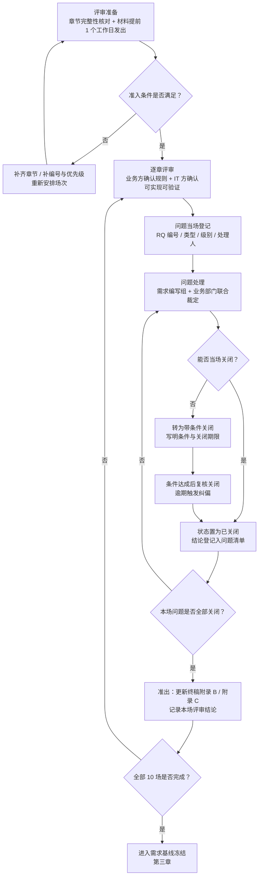
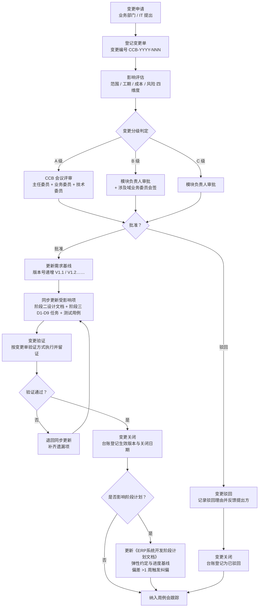

# 需求评审与变更管理

| 文档属性 | 内容 |
|---------|------|
| 文档名称 | 需求评审与变更管理 |
| 文档编号 | ERP-P1-05 |
| 版本 | V1.0 |
| 状态 | **已完成·已冻结（V1.0）** |
| 编制部门 | 数字化管理部（会同销售部、采购部、仓储中心、生产制造部、财务部、质检部） |
| 编制日期 | 2026年9月 |
| 所属阶段 | 阶段一 需求确认（第 1-2 月） |
| 关联里程碑 | **M1 需求基线确认**（本文为 M1 判定的证据载体） |
| 评审对象 | 同目录 `03-需求规格说明书-终稿.md`（V1.0，全文含附录 A~D） |
| 上游输入 | `01-业务调研报告.md`、`02-业务流程梳理-As-Is与To-Be.md`、`03-需求规格说明书-终稿.md`、`04-数据迁移需求方案.md`、《ERP系统开发阶段计划文档》第五节 |
| 下游流向 | 阶段二 系统设计（M2 设计评审）→ 阶段三 开发与单元测试（D1-D9）→ 阶段四 SIT → 阶段五 UAT → 阶段六 数据迁移与上线 |

---

## 文档定位

### 1. 本文在阶段一中的位置

本文是阶段一「需求确认」的第 5 份交付物，对应《ERP系统开发阶段计划文档》阶段一核心任务：

| 核心任务 | 任务内容 | 本文承接内容 |
|---------|---------|-------------|
| 1.4 需求评审 | 组织业务部门逐章评审，记录并关闭评审问题 | 第一章（评审组织）、第二章（47 条评审问题清单，全部关闭） |
| 1.5 需求冻结 | 形成终稿并签字，建立需求变更管理流程 | 第三章（基线冻结与签署）、第四章（CCB 变更管理流程） |

### 2. 本文与 M1 里程碑的关系

本文是 **M1「需求基线确认」的判定证据载体**：M1 的四条验收条件与判定标准逐条判定记录见**第五章**，其中的证据引用（文件名 + 章节/表格名）均可在阶段一交付物中逐一核对。

### 3. 评审对象与评审边界

| 项 | 说明 |
|----|------|
| 评审对象 | `03-需求规格说明书-终稿.md`（V1.0）：全文 80 条功能需求、第五章非功能需求、第六章接口需求、第七章数据迁移需求、第八章验收标准、附录 A 变更说明表、附录 B 统一裁定记录、附录 C 签署表、附录 D 编号索引 |
| 评审依据 | `01-业务调研报告.md`（痛点与量级事实）、`02-业务流程梳理-As-Is与To-Be.md`（流程与状态机）、《企业资源计划ERP系统需求规格说明书》（只读基线）、《ERP系统开发阶段计划文档》（阶段与里程碑） |
| 评审边界 | 本次评审**只评审需求内容的完整性、一致性、可行性、可验证性、范围与术语**，不评审设计方案与实现技术；设计层面问题转阶段二处理，但须在本文中登记并明确移交结论 |
| 配套评审 | 数据迁移需求（`04-数据迁移需求方案.md`）作为终稿第七章的展开文件一并评审（见第一章 RV-10 场次） |
| 不做修改的文件 | 评审过程**不修改** `docs/` 下任何已完成交付物的既有内容；裁定结论统一登记于终稿附录 B，与既有交付物冲突之处一律以终稿（含附录 B）为准 |

---

## 一、需求评审组织

### 1.1 评审目标与评审原则

**评审目标：**

1. 确认七大业务域 + 支撑域的需求条目**无遗漏、无歧义、可判定**，每条需求均满足"需求编号 | 需求名称 | 优先级 | 详细说明 | 验收要点"五要素；
2. 关闭全部评审问题，形成**无未处理条目**的问题清单；
3. 形成经业务与 IT 双方确认的需求基线，支撑 M1 判定与阶段二设计的单一需求输入。

**评审原则：**

| 原则 | 具体要求 |
|------|---------|
| **逐章评审** | 按终稿章节结构切分场次（4.0~4.7、第五章、第六章、第七章），每场只评审本场范围，逐条过需求条目，不做跨场次跳跃 |
| **业务与 IT 双签** | 每场评审由业务部门代表与 IT（数字化管理部）共同确认：业务方确认"业务规则与阈值正确"，IT 方确认"可实现、可验证"；任一方不确认则该条目不计入通过 |
| **问题闭环** | 每场评审提出的问题当场登记编号（RQ-xxx）、定级、指定处理人；未关闭问题不得进入下一场次终审，评审结束时未处理条目必须为 0 |
| **口径唯一** | 同一事项只允许一个结论；跨域冲突一律提交终稿附录 B 统一裁定，裁定后在全篇、全部交付物中保持一致 |
| **事实可溯** | 问题描述与处理结论必须引用具体事实来源（调研记录 R-xx、流程编号 P-xxx、需求编号、文档章节），不接受无出处的意见 |
| **不扩范围** | 评审只做"补齐、澄清、裁量"，不新增超出 1.4 节范围界定与排除项的内容；确有必要的新增一律走 CCB 流程（见第四章） |

### 1.2 评审会议安排表

评审于 2026-09-12 至 2026-09-16 集中进行，共 10 场，覆盖七大业务域、支撑域、非功能需求、接口需求与数据迁移需求。主持人统一由项目负责人担任；每场设业务主讲（需求编写组）与业务确认方（对应部门代表）。

| 场次 | 评审范围（章节/需求编号段） | 日期 | 主持人 | 评审人（业务部门代表 + IT） | 形式 |
|------|--------------------------|------|-------|--------------------------|------|
| RV-01 | 文档定位、第一章项目概述、第二章术语、第三章流程总览、附录 A 变更说明、附录 B 统一裁定、附录 D 编号索引（SYS-01~11、MD-01~06、BOM-01~07、CS-01~03、SAL-01~08、PUR-01~08、INV-01~11、MFG-01~10、FIN-01~09、RPT-01~07 的范围与优先级） | 2026-09-12 上午 | 项目负责人 | 销售总监、采购经理、仓库主管、生产计划负责人、财务经理、质量部负责人、数字化管理部负责人 | 会议 |
| RV-02 | 第 4.1 节基础数据管理（MD-01~06、BOM-01~07、CS-01~03） | 2026-09-12 下午 | 项目负责人 | 仓储中心（仓库主管 + 仓管员）、技术部（BOM 工程师）、采购部（采购经理）、生产制造部、数字化管理部 | 会议 |
| RV-03 | 第 4.2 节销售管理（SAL-01~08） | 2026-09-13 上午 | 项目负责人 | 销售部（销售总监 + 区域业务员 2 名）、财务部（应收会计）、数字化管理部 | 会议 |
| RV-04 | 第 4.3 节采购管理（PUR-01~08） | 2026-09-13 下午 | 项目负责人 | 采购部（采购经理 + 采购员 2 名）、财务部（应付会计）、质检部、仓储中心、数字化管理部 | 会议 |
| RV-05 | 第 4.4 节库存管理（INV-01~11） | 2026-09-14 上午 | 项目负责人 | 仓储中心（仓库主管 + 仓管员 2 名）、质检部（质检员）、财务部（成本会计）、销售部（内勤）、数字化管理部 | 会议 |
| RV-06 | 第 4.5 节生产制造管理（MFG-01~10、BOM 关联条款） | 2026-09-14 下午 | 项目负责人 | 生产制造部（生产计划员 2 名 + 车间主任 2 名）、技术部（BOM 工程师）、财务部（成本会计）、数字化管理部 | 会议 |
| RV-07 | 第 4.6 节财务管理（FIN-01~09） | 2026-09-15 上午 | 项目负责人 | 财务部（财务经理 + 总账会计 + 成本会计）、采购部（应付口径）、销售部（应收口径）、数字化管理部 | 会议 |
| RV-08 | 第 4.0 节系统管理与平台能力（SYS-01~11）、第 4.7 节报表与分析（RPT-01~07）、第八章验收标准 8.1/8.2 | 2026-09-15 下午 | 项目负责人 | 数字化管理部（IT 管理员 2 名）、集团管理层（总经理代表）、财务部、销售部、采购部、仓储中心、生产制造部 | 会议 |
| RV-09 | 第五章非功能需求（性能 P-01~06、可用性 A-01~04、安全性 S-01~07、可扩展性 E-01~05、集成性 I-01~04、数据备份与容灾 B-01~03）、第六章接口需求（6.1 对接系统清单、6.2 对外 API 总体要求） | 2026-09-16 上午 | 项目负责人 | 数字化管理部（IT 管理员 2 名）、集团管理层、财务部、销售部、采购部（OA 与税控接口口径） | 会议 + 书面 |
| RV-10 | 第七章数据迁移需求（7 类迁移对象）及配套 `04-数据迁移需求方案.md` 第二~七章、附录 A/B/C | 2026-09-16 下午 | 项目负责人 | 仓储中心（仓库主管）、财务部（财务经理 + 成本会计）、销售部、采购部、技术部、质检部、数字化管理部 | 会议 |

**场次覆盖核对：** 七大业务域（基础数据 RV-02、销售 RV-03、采购 RV-04、库存 RV-05、生产 RV-06、财务 RV-07、报表 RV-08）+ 支撑域（RV-08）+ 非功能需求（RV-09）+ 接口需求（RV-09）+ 数据迁移需求（RV-10）+ 总体与范围界定（RV-01），合计 10 场，覆盖终稿全文无缺项。

### 1.3 评审准入与准出条件

**评审准入条件（每场评审开始前由评审秘书核对，未满足不得开场）：**

| 序号 | 准入条件 | 核对物 |
|------|---------|-------|
| 1 | 文档章节完整无缺项：本场范围的章节标题、需求表、流程图、验收要点齐备，且与附录 D 编号索引一一对应 | 终稿本场章节 + 附录 D |
| 2 | 需求条目均有编号与优先级：本场范围内不存在无编号条目，不存在无 P0/P1/P2 标注的条目 | 终稿本场需求表 |
| 3 | 每条需求五要素齐备：需求编号、需求名称、优先级、详细说明、验收要点 | 终稿本场需求表 |
| 4 | 上游事实可追溯：本场涉及的业务规则均有调研记录（R-xx）或流程编号（P-xxx）支撑 | `01-业务调研报告.md` 附录、《02-业务流程梳理》10.1 |
| 5 | 评审材料提前 1 个工作日发出，评审人已预读 | 评审通知与回执 |

**评审准出条件（每场评审结束时由主持人宣布，未满足不得进入下一场次终审）：**

| 序号 | 准出条件 | 判定方式 |
|------|---------|---------|
| 1 | 本场全部需求条目逐条过审，逐条记录"通过 / 修改后通过 / 不通过"结论 | 评审记录表（本场） |
| 2 | 本场提出的问题全部登记为 RQ-xxx（含类型、级别、提出人、处理人） | 本文第二章问题清单 |
| 3 | 问题状态为**已关闭**或**带条件关闭**；带条件关闭必须写明条件与关闭期限 | 本文第二章问题清单 |
| 4 | 存在"未处理"状态条目时，本场准出不通过，须再次召开专场评审 | 本文第二章统计表（未处理条目 = 0） |
| 5 | 本场形成的裁定结论已登记于终稿附录 B 并在全篇一致 | 终稿附录 B |

### 1.4 评审与问题闭环流程

---

## 二、需求评审问题清单

### 2.1 问题清单（共 47 条）

> **编号规则**：RQ-001 起顺序编号，与评审场次对应。
> **问题类型**：完整性 / 一致性 / 可行性 / 可验证性 / 范围争议 / 术语歧义。
> **级别**：致命（阻断设计或导致返工）/ 严重（影响功能正确性或验收判定）/ 一般（影响可读性与执行效率）/ 建议（优化项）。
> **状态**：已关闭 / 带条件关闭（带条件关闭必须写明条件与关闭期限）。
> **依据文件简称**：01 = `01-业务调研报告.md`，02 = `02-业务流程梳理-As-Is与To-Be.md`，03 = `03-需求规格说明书-终稿.md`，04 = `04-数据迁移需求方案.md`。

| 问题编号 | 来源（场次/需求编号） | 问题类型 | 问题描述 | 级别 | 提出人/部门 | 处理人 | 处理结论 | 状态 |
|---------|-------------------|---------|---------|------|-----------|-------|---------|------|
| RQ-001 | RV-01 / 1.4 排除项 8、第五章 E-03 | 范围争议 | 基线要求"支持中英文切换"，终稿 E-03 明确本期不实现多语言界面，须确认是否与基线冲突、是否影响验收 | 严重 | 集团管理层 / 数字化管理部 | 需求编写组 | **已关闭**：本期不实现多语言界面，界面语言固定中文、不提供语言切换入口；架构预留国际化能力（前端文案抽取规则与 i18n 依赖预留、后端错误码与数据字典支持多语言字段）；启用语言切换须经 CCB 评审立项。依据 03 第 1.4 节排除项 8、第五章 E-03 与附录 A"第五章 裁定"行 | 已关闭 |
| RQ-002 | RV-01 / 附录 B-2；02 第 9.3 节；《ERP系统数据库表结构设计文档》`mf_order` | 一致性 | 生产工单状态取值三处不一致：03 附录 B 裁定 6 态，02 第 9.3 节与数据库文档为 5 态（0-计划 1-已下达 2-生产中 3-已完工 4-已关闭） | 致命 | 生产制造部 / 数字化管理部 | 需求编写组 + 生产计划部 | **已关闭**：统一以 6 态为准——0-计划、1-已下达、2-领料中、3-加工中、4-已完工、5-已关闭（新增"领料中"，原"生产中"拆分为"领料中/加工中"）；阶段二数据库设计据此修正 `mf_order.order_status` 取值与注释；02 第 9.3 节状态机由 03 附录 B 裁定 2 覆盖，后续以 6 态执行 | 已关闭 |
| RQ-003 | RV-01 / 附录 B-4、SYS-07 | 一致性 | 单据编号规则不统一：基线示例 `SAL-202608001` 带连字符，数据库与 API 文档示例 `SO202608001` 不带连字符，影响编码实现与迁移重编规则 | 严重 | 数字化管理部 | 需求编写组 | **已关闭**：统一为"前缀 + YYYYMM（6 位）+ 3 位流水"、**不带连字符**（如 `SO202608001`、`PO202608001`、`MO202608001`、`FZ202608001`）；按月重置、按单据类型独立流水；03 第二章、第七章与 04 附录 B"单据编号口径"一致 | 已关闭 |
| RQ-004 | RV-01 / 1.1 项目背景；附录 B-3 | 术语歧义 | "物料主数据约 8,000 条"与"活跃物料约 5,000 种"两个数字并列出现，是否矛盾、MRP 运算范围以何为准 | 一般 | 生产制造部 | 需求编写组 | **已关闭**：8,000 条为主数据总量（迁移与编码口径），5,000 种为参与 MRP 全量运算的活跃物料量，二者不矛盾；口径写入 03 第 1.1 节表格与附录 B 裁定 3，MFG-01 与 P-03 均按 5,000 种引用 | 已关闭 |
| RQ-005 | RV-01 / 附录 B-5、PUR-03 | 一致性 | 质检是否单独建表与编号序列：调研现状有纸质检验报告，需求侧裁定结论是否会造成质检结论无处承载 | 严重 | 质检部 | 需求编写组 | **已关闭**：不单独建质检表与编号序列，质检结论落在采购收货单 `pur_receipt` 的 `qualified_qty`（合格数量）、`reject_qty`（不合格数量）、`status`（0-待检 1-合格入库 2-部分合格 3-退货）；03 附录 B 裁定 5、PUR-03 与 02 第 9.4 节结论一致 | 已关闭 |
| RQ-006 | RV-01 / 附录 B-6；01 第 2.4 节 | 术语歧义 | 4 个中心仓命名不统一：01 第 2.4 节为"成品仓-苏州中心仓/成品仓-东莞中心仓"，03 附录 B 裁定为"苏州成品仓/东莞成品仓" | 一般 | 仓储中心 | 需求编写组 + 仓储中心 | **已关闭**：统一命名为**原材料仓、半成品仓、苏州成品仓、东莞成品仓**（03 附录 B 裁定 6、INV-01）；04 第 3.7 节仓库归属规则沿用统一名称；01 命名作为调研表述保留，业务执行一律以统一命名为准 | 已关闭 |
| RQ-007 | RV-01 / 1.4 排除项 5、6；第六章 6.1 | 范围争议 | 银企直连与 WMS 是否本期实现；如不实现，付款执行与库存作业的替代方案是否闭环 | 严重 | 财务部 / 数字化管理部 | 需求编写组 | **已关闭**：本期均不实现。银企直连替代方案为"付款申请审批 → 付款登记 → 银行回单人工导入并核销"（FIN-03）；WMS 替代方案为 ERP 库存模块自身承担出入库作业（INV-02/INV-03）并预留标准库存 API（第六章 6.2）；后续启用条件与数据契约冻结节点见 03 第六章 6.1 与 04 附录 B | 已关闭 |
| RQ-008 | RV-01 / 1.4 排除项 7；FIN-01、FIN-08 | 范围争议 | 基线要求"多账套、多币别"，终稿裁定本期单一账套，是否造成财务功能缺项 | 严重 | 财务部 | 需求编写组 | **已关闭**：本期为集团**单一账套**，收入/成本/存货/费用按组织（总部、2 基地、3 分公司）与仓库维度辅助核算并出分维度报表；多法人账套列入排除项，新增法人主体须经 CCB 立项；**币别字段与汇兑损益处理本期实现**（FIN-08、第五章 E-02） | 已关闭 |
| RQ-009 | RV-01 / 1.1 项目背景；《ERP系统开发阶段计划文档》阶段一核心任务 1.1 | 范围争议 | 阶段计划 1.1 要求"覆盖销售、采购、库存、生产、财务五大业务域"，而交付成果标准要求"功能模块覆盖七大域"，口径差异是否属范围缺失 | 严重 | 项目负责人 / 数字化管理部 | 需求编写组 | **已关闭**：五大域为**现场调研**范围（01 第四章），七大域 + 支撑域为**需求交付**范围（03 第四章 4.0~4.7，80 条）。基础数据域（MD/BOM/CS）依据 01 第五章专题五与各域主数据痛点派生，报表与分析域（RPT）依据各域报表诉求与 RPT-01~RPT-07 派生；七大域全部有成文需求条目，差异属表述口径而非范围缺失 | 已关闭 |
| RQ-010 | RV-02 / MD-01；04 第 4.1.3 节清洗规则 | 可行性 | 一物多码按"物料名称 + 规格型号 + 计量单位"三要素一致自动合并，重复条目约 480~720 条，存在误合并导致错误主数据的风险 | 致命 | 仓储中心 / 采购部 | 需求编写组 + 数字化管理部 | **已关闭**：自动合并仅对三要素完全一致者执行，其余全部转**人工判定**（生成疑似重复清单由仓储中心、采购部、技术部联合确认）；保留旧码 → 新码映射表 `base_material_code_map` 支撑历史台账反查；迁移后执行编码唯一性与"名称 + 规格 + 单位"组合唯一性双校验 | 已关闭 |
| RQ-011 | RV-02 / MD-02；04 第 4.1.3 节、附录 B | 一致性 | 物料重复判定口径不一致：03 MD-02 为四要素（名称 + 规格 + 单位 + **品牌**），04 附录 B 合并判定为三要素，是否造成迁移后重复数据复发 | 一般 | 仓储中心 | 需求编写组 | **已关闭**：系统内新增/修改物料按**四要素**强校验（MD-02），品牌为空时按空值参与比较；迁移合并按**三要素**初筛并全部人工复核，两者用途不同（分别是"录入拦截"与"历史去重"），不构成冲突；04 附录 B"一物多码"条目补注该差异说明 | 已关闭 |
| RQ-012 | RV-02 / BOM-01、BOM-07 | 可行性 | 10 层层级上限与闭环检测同时命中时的判定顺序与错误提示口径不明，可能导致提示信息互相覆盖 | 一般 | 技术部 | 需求编写组 | **已关闭**：保存与审核两个时点均**先执行自引用与闭环校验，再校验层级深度**；闭环失败时提示完整闭环路径（如 `A→B→C→A`），层级超限时单独提示层数，两类错误不叠加输出；两者错误码均落在 11001-11999 区间 | 已关闭 |
| RQ-013 | RV-02 / BOM-03；04 附录 B | 一致性 | BOM 编号与版本号口径：04 文档定义 `bom_code` 为"BM + 父件编码 + 版本序号"，03 BOM-03 版本号为 `V<主版本>.<次版本>` 形式 | 一般 | 技术部 | 需求编写组 | **已关闭**：`bom_code`（BM 规则，确定性编码）与 `version`（`V1.0`、`V1.1`、`V2.0`）**分列承载**，互不替代；04 附录 B 表述同步修正为两者并列，阶段二数据库设计按此定义字段 | 已关闭 |
| RQ-014 | RV-02 / MD-04；FIN-04；第二章术语表 | 一致性 | 存货计价方法取值冲突：MD-04 定义为 0-移动加权平均 / 1-先进先出，FIN-04 表述为移动加权平均法 / 月末一次加权平均法 | 严重 | 财务部 / 技术部 | 需求编写组 + 财务部 | **已关闭**：统一为 **0-移动加权平均（默认）、1-月末一次加权平均**；**先进先出（FIFO）仅作为出库批次选择策略**（INV-03），不作为存货计价方法；FIN-04 与第二章术语表按此修正，阶段二数据库设计据此定义 `base_material.cost_method` 取值 | 已关闭 |
| RQ-015 | RV-02 / BOM-04 | 范围争议 | 替代料是否由 MRP 自动替换，基线"自动或手动选用"表述在本期需给出明确结论 | 一般 | 生产制造部 | 需求编写组 | **已关闭**：**本期不实现 MRP 自动替代**；缺料时由生产计划员按替代料优先级人工选择（系统按优先级推荐），使用替代料领料时库存流水记录替代料编码与实际用量；BOM-04 与 MFG-01 结论一致 | 已关闭 |
| RQ-016 | RV-03 / SAL-02 | 可验证性 | 授权价区间基准不明确（以标准售价为基准还是以价格策略价为基准），导致超价特批判定不可客观验证 | 严重 | 销售部 | 需求编写组 + 销售部 | **已关闭**：基准优先取 SAL-07 命中的**适用价格策略价**，无适用策略时取物料**标准售价**；两者均缺时以该客户 + 物料最近一次成交价为基准并在审核界面提示；基准来源与取值写入审核记录与审计日志 | 已关闭 |
| RQ-017 | RV-03 / SAL-06；PUR-04；SYS-07 | 完整性 | 退货单编号（销售退货 `RT-S`、采购退货 `RT-P`）未列入 SYS-07 编号规则引擎覆盖清单，存在编号无规则可依 | 严重 | 销售部 / 采购部 | 需求编写组 | **已关闭**：SYS-07 覆盖清单**补充销售退货单（RTS）与采购退货单（RTP）**，同样遵循"前缀 + YYYYMM + 3 位流水"、按月重置、并发唯一（唯一约束 + 冲突重试 ≤3 次）；03 SYS-07 与 SAL-06、PUR-04 编号表述统一 | 已关闭 |
| RQ-018 | RV-03 / SAL-01；第二章术语表；04 附录 B"金额口径" | 可验证性 | 含税/不含税标识与税额、行金额、订单金额的计算口径未闭合，金额精度与舍入规则需明确 | 严重 | 财务部 / 销售部 | 需求编写组 + 财务部 | **已关闭**：`unit_price` 为**不含税单价**；`line_amount` 与 `total_amount` 为**含税金额**；`tax_amount = line_amount − qty × unit_price`；全部金额字段 `DECIMAL(20,6)`、Java 侧 `BigDecimal`、除法与折算 `RoundingMode.HALF_UP`；SAL-01 验收要点按此口径增加 13% 税率验算用例 | 已关闭 |
| RQ-019 | RV-03 / SAL-03；FIN-02 | 一致性 | "已开票数量"与 FIN-02 应收立账金额的定义边界不清，可能导致订单跟踪与应收余额口径不一致 | 一般 | 财务部 | 需求编写组 | **已关闭**：已开票数量以税控开票系统 / 电子发票平台回写的**发票明细**为准，应收立账以 `fin_receivable` 为准，两者分别记账、不互相替代；SAL-03 页面两者差额须为 0，差额不为 0 时列入月度对账未达账项清单（目标 0 笔/月） | 已关闭 |
| RQ-020 | RV-04 / PUR-05；SYS-06 | 可验证性 | 三单匹配容差（数量 ±2%、单价 ±0.5%）的比较基准、超差处置与参数落点未明确 | 严重 | 采购部 / 财务部 | 需求编写组 + 财务部 | **已关闭**：数量按**收货合格数量与订单数量**比较，单价按**不含税单价**比较；容差口径落到 SYS-06 参数（默认数量 ±2%、单价 ±0.5%）并于阶段二冻结；超差生成差异记录并预警（差异类型：数量差异 / 单价差异 / 无订单 / 无收货），**不生成正式应付**，暂估不红冲 | 已关闭 |
| RQ-021 | RV-04 / PUR-06 | 可行性 | 暂估"100% 覆盖、无人工跳过入口"与"全部不合格 / 退货"等例外场景冲突，可能出现无金额可暂估的空跑 | 严重 | 财务部 | 需求编写组 + 财务部 | **已关闭**：仅对**合格入库数量**生成暂估（借 原材料 贷 应付账款-暂估）；全部不合格（`status=3`）不生成暂估，退货（PUR-04）不产生暂估；已暂估后发生退货的按红冲处理；"100% 覆盖"的统计口径明确为"全部合格入库且未匹配发票的收货单"（03 PUR-06 与 FIN-01 验收要点一致） | 已关闭 |
| RQ-022 | RV-04 / PUR-04、PUR-05、FIN-03 | 可行性 | 已入库物料退货时冲减应付的科目口径（冲减暂估还是冲减正式应付）未明确，影响凭证正确性 | 一般 | 财务部 | 需求编写组 + 财务部 | **已关闭**：未匹配发票的按**暂估科目红冲**，已匹配的按**正式应付科目冲减**；若退货跨期且原期间已关闭，须在开放期间生成红字凭证冲正（FIN-08 期间控制）；退货单与冲减金额双向可追溯 | 已关闭 |
| RQ-023 | RV-05 / INV-09 | 可行性 | 库存余额乐观锁重试 ≤3 次后仍冲突的最终处理方式未明确，存在数量丢失或静默失败风险 | 严重 | 仓储中心 / 数字化管理部 | 需求编写组 | **已关闭**：重试 3 次仍失败时**返回明确业务错误码并提示重试**，不自动覆盖数量；失败请求不得产生流水与余额更新（事务整体回滚）；同时记录告警日志供运维巡检；INV-09 验收要点保留"20 并发用例无数量丢失"验证项 | 已关闭 |
| RQ-024 | RV-05 / INV-11；04 附录 C 第 14 项 | 完整性 | 期初建账所需的 `inv_transaction.trans_type` 取值 90 未在《ERP系统数据库表结构设计文档》中定义，存在功能无落点 | 严重 | 仓储中心 / 财务部 | 需求编写组 + 数字化管理部 | **已关闭**：阶段二数据库设计**补充取值 90-期初建账** 及其字段注释，并同步更新 INV-09 流水字段清单与 04 附录 C；本期 INV-11 校验"期初流水汇总 = 期初快照（差值 0）"依赖该取值 | 已关闭 |
| RQ-025 | RV-05 / INV-06 | 可验证性 | 盘点期间"不停产"与账面快照 `book_qty` 的时点口径不明，可能导致差异计算基准漂移 | 一般 | 仓储中心 | 需求编写组 | **已关闭**：盘点单**生成瞬间冻结 `book_qty` 快照**；盘点期间收发作业照常执行并实时更新 `inv_stock`；差异按"快照 vs 实盘"计算，审批通过后生成盘盈（70）/盘亏（80）流水；INV-06 验收要点保留"盘点期间生产领料与销售出库仍可正常执行"演示项 | 已关闭 |
| RQ-026 | RV-05 / INV-05；SYS-06 | 一致性 | 超期物料出库"默认拦截"与"参数可配置为需质检确认后放行"两种表述并存，验收判定标准不唯一 | 一般 | 质检部 / 仓储中心 | 需求编写组 | **已关闭**：SYS-06 增加参数"**超期物料出库策略**"（默认值：拦截）；改为放行须参数变更并写审计日志，且每次放行须记录质检确认人与确认时间；INV-05 验收要点按"默认拦截"构造用例 | 已关闭 |
| RQ-027 | RV-06 / MFG-01；第五章 P-03 | 可行性 | MRP 全量运算（活跃物料约 5,000 种、BOM 约 3,500 个）**<30 分钟**的可行性未经验证，若达不到将阻断 D7 交付 | 严重 | 生产制造部 / 数字化管理部 | 需求编写组 + 数字化管理部 | **带条件关闭**：条件 = 在 D7 子阶段完成中等规模压测（≥2,000 种物料、≥1,500 个 BOM，记录全量运算耗时并出具压测报告），耗时不达标则引入预计算与缓存策略（物料净需求中间表 + Redis 缓存，Key 遵循"业务模块:功能:唯一标识"并设 TTL）并复测；关闭期限 = **D7 子阶段退出评审日（开发期第 10 周末）**，逾期未关闭触发《ERP系统开发阶段计划文档》5.3 纠偏 | 带条件关闭 |
| RQ-028 | RV-06 / MFG-04 | 可行性 | "已下达可取消"与"领料中/加工中不可逆"的边界不明：已领料后工单能否直接取消 | 一般 | 生产制造部 | 需求编写组 | **已关闭**：进入 **2-领料中** 后不可直接取消；如需终止须先完成退料（反向 `trans_type=40` 冲销流水）再关闭工单（5-已关闭）；**4-已完工**可直接关闭；1-已下达可取消（未发生领料）；MFG-04 流转规则按此补充 | 已关闭 |
| RQ-029 | RV-06 / MFG-10 | 范围争议 | 委外加工管理的优先级（P0 还是 P2）与 MRP 是否考虑委外在途量存在分歧 | 一般 | 生产制造部 / 采购部 | 需求编写组 | **已关闭**：定为 **P2**（03 第 9.1 节 P2 清单第 2 项）；本期**MRP 净需求公式不引入委外在途量**（MFG-01 公式不变）；外协按 MFG-10 全流程在线管理，资源允许时随 D7 交付，不阻断阶段三退出标准 | 已关闭 |
| RQ-030 | RV-06 / MFG-06 | 可验证性 | 报工"可撤销"的条件"未生成成本数据"判定标准不明确 | 一般 | 生产制造部 / 财务部 | 需求编写组 | **已关闭**：判定基准为**当期成本运算批次是否已执行（FIN-05）**——成本运算前可撤销并留痕；成本运算后不可撤销，只能以**反向报工记录**冲正（关联原报工单号，`remark` 记录原因）；RPT-05 工时统计以冲正后净值为准 | 已关闭 |
| RQ-031 | RV-07 / FIN-06；04 第 2.2.2 节第 4 项 | 范围争议 | 固定资产管理的优先级与历史资产是否纳入迁移存在争议 | 一般 | 财务部 | 需求编写组 | **已关闭**：定为 **P2**（03 第 9.1 节 P2 清单第 3 项）；**历史资产与历史折旧不迁移**（04 第 2.2.2 节第 4 项），在用资产卡片由固定资产会计在阶段六按 FIN-06 在线重建，已处置资产只读归档 | 已关闭 |
| RQ-032 | RV-07 / FIN-02、RPT-06 | 可验证性 | 应收账龄基准口径（按出库日、开票日还是到期日）未固化，账龄分档不可客观验证 | 严重 | 财务部 | 需求编写组 + 财务部 | **已关闭**：账龄按**到期日 `due_date` 起算**（到期日 = 出库/开票日 + 客户信用期限，如申达电气月结 60 天）；分档为 30 / 60 / 90 / 超 90 天；口径以界面可点击查看的口径说明固化，阶段五 UAT 抽样 20 条与手工口径比对一致 | 已关闭 |
| RQ-033 | RV-07 / FIN-08；04 第 4.6 节、第 5.3 节 | 完整性 | 月结检查清单第 2 项"上月暂估未匹配清单条数"与 04 文档《货到票未到清单》口径是否同一 | 一般 | 财务部 | 需求编写组 + 财务部 | **已关闭**：两者口径**同源**——月结检查清单直接复用 04 文档《货到票未到清单》判定规则；清单条数须为 0 或每条均有处置结论（已匹配 / 已红冲 / 已确认延后）方可执行期间关闭；FIN-08 与 PUR-06 验收要点一致 | 已关闭 |
| RQ-034 | RV-07 / FIN-09、INV-11；04 第 4.7 节 IS-06 | 可行性 | 期初余额与 INV-11 期初存货金额不一致时的处理路径未闭合，试算平衡与实物金额可能互斥 | 严重 | 财务部 / 仓储中心 | 需求编写组 + 财务部 | **已关闭**：不一致时系统**拒绝提交**（FIN-09 验收要点③）；处理路径为"**数量以盘点为准、金额差异计入期初调账**"——由期初调账凭证（借方/贷方 待处理财产损溢）归零差额，归零后方可提交，做到数量与金额同口径；调账凭证经财务经理审批并留痕 | 已关闭 |
| RQ-035 | RV-08 / RPT-01 | 可验证性 | 仪表盘 8 项指标的统计口径与刷新延迟未逐项定义，无法判定数值正确性 | 一般 | 集团管理层 / 财务部 | 需求编写组 | **已关闭**：8 项指标（今日/本月销售收入、毛利率、库存周转天数、工单按时完工率、应收逾期金额、在途订单金额、呆滞库存占比、订单准时交付率）**逐条给出计算公式与数据来源**并支持界面点击查看口径说明；实时类指标刷新延迟 ≤5 分钟、成本类指标按日刷新；抽样 3 个指标与来源报表数值一致（误差 0） | 已关闭 |
| RQ-036 | RV-08 / RPT-07；03 附录 C | 完整性 | 报表导出（RPT-07）未列入附录 C 任何部门的确认范围，存在需求无确认方的缺口 | 严重 | 数字化管理部 | 需求编写组 | **已关闭**：03 附录 C 确认范围**补充 RPT-07**——归入 IT/数字化管理部（数据权限与导出安全）与财务部（财务类报表导出）；RPT-07 的"导出内容不得越权""单次导出 ≤50,000 行""导出动作写审计日志"三项纳入对应部门确认要点 | 已关闭 |
| RQ-037 | RV-08 / RPT-07；第五章 P-06、S-02 | 可验证性 | 报表导出格式（Excel/PDF）与大数据量导出策略（同步导出 vs 异步导出）未明确，50,000 行上限的可达性未验证 | 一般 | 数字化管理部 / 集团管理层 | 需求编写组 + 数字化管理部 | **带条件关闭**：条件 = 在 D9/阶段四 SIT 内以 50,000 行代表性报表做导出压测（Excel 与 PDF 各 1 次并计时），若单次导出耗时 >5 分钟则启用**异步导出**（任务队列 + 完成后提供下载入口，超时可查询任务状态）；关闭期限 = **SIT 结束前（阶段四 M8 判定前）** | 带条件关闭 |
| RQ-038 | RV-08 / SYS-04、第五章 S-02 | 可行性 | 字段级数据权限"数据范围 6 档 + 自定义"且"列表、详情、导出三处口径一致"的实现方式与越权处理未明确 | 严重 | 数字化管理部 / 销售部 | 需求编写组 + 数字化管理部 | **已关闭**：以**统一数据范围拦截器**实现，列表、详情、导出三处共用同一过滤规则（同一方法出口）；越权访问直接返回 403；敏感字段（金额、银行账号）按角色掩码；阶段二接口设计冻结拦截器约定，阶段四 SIT 以 20 条权限矩阵用例验证越权 0 例 | 已关闭 |
| RQ-039 | RV-08 / SYS-05、第五章 S-03 | 可行性 | 审计日志在线保存 ≥180 天的容量与超期数据处置方式未明确 | 一般 | 数字化管理部 / 财务部 | 需求编写组 + 数字化管理部 | **已关闭**：在线保存 ≥180 天并支持按单据号精确检索（返回 ≤3 秒）；超期数据按月归档为**可查询的冷数据**（不删除、不提供删除接口）；日志只增不改不删，覆盖订单/工单/出入库单的创建、修改、审核、删除及凭证过账 | 已关闭 |
| RQ-040 | RV-08 / SYS-06、INV-05/06/08、PUR-05/07、SAL-02 | 完整性 | 分散在各需求中的可配置阈值（呆滞天数、保质期预警天数、盘点频率、信用开关、授权浮动比例、三单匹配容差、采购申请审批阈值、采购价格预警阈值、超期出库策略）是否已全部纳入参数清单 | 一般 | 各业务部门 | 需求编写组 | **已关闭**：全部纳入 SYS-06 参数清单并给出默认值（呆滞 180 天、保质期预警 30 天、A/B/C 盘点频率、信用控制开启、授权浮动 ±5%、数量容差 ±2%、单价容差 ±0.5%、采购申请阈值 5 万元、价格预警 10%、超期出库策略拦截）；修改后 ≤1 分钟生效、变更写审计日志；被引用字典项禁止删除 | 已关闭 |
| RQ-041 | RV-09 / P-03、P-05、MFG-01 | 可行性 | 性能指标验证所需的数据规模（MRP 全量 5,000 物料 / BOM 3,500 个；流水 100 万条）在阶段四 SIT 期间是否可造 | 严重 | 数字化管理部 | 需求编写组 + 数字化管理部 | **已关闭**：阶段四 SIT 以造数脚本构造流水 100 万条、BOM 3,500 个、活跃物料 5,000 种；MRP 全量运算（P-03、MFG-01 ③）与流水查询（P-05、INV-09 ②）一并在 SIT 计时验证，结论写入《集成测试报告》（阶段四交付成果标准） | 已关闭 |
| RQ-042 | RV-09 / 第五章 S-01 | 可行性 | 等保 2.0 三级测评与上线节点的时间关系：测评未通过是否阻塞上线 | 严重 | 数字化管理部 | 需求编写组 + 数字化管理部 | **带条件关闭**：条件 = 阶段六上线前完成第三方机构等保测评并出具测评报告，未通过项须整改闭环并复测；关闭期限 = **M9 上线切换（第 10 月切换窗口）前**；整改项纳入切换前检查清单（04 第 5.3 节"切换前"项同步跟踪） | 带条件关闭 |
| RQ-043 | RV-09 / 第六章 6.2；02 第 9.7 节 | 一致性 | 接口路径前缀不一致：03 第六章要求统一前缀 `/api/v1`，02 第 9.7 节示例为 `/api/sales/orders`（无版本号） | 严重 | 数字化管理部 | 需求编写组 | **已关闭**：统一前缀 **`/api/v1`**（03 第六章 6.2 第 1 项）；02 第 9.7 节旧路径示例作废，不作为开发依据；阶段二接口设计文档按 `/api/v1` 定义全部接口，动词场景走 POST（如 `/api/v1/purchase/orders/{id}/approve`） | 已关闭 |
| RQ-044 | RV-10 / 第七章"未结销售订单"；04 附录 B | 一致性 | 未结销售订单筛选范围不一致：03 第七章为 `order_status=1 或 2`，04 附录 B 写为 `order_status ∈ {1, 2, 3}`（含 3-已发货） | 致命 | 销售部 / 财务部 | 需求编写组 + 销售部 | **已关闭**：以 **`order_status ∈ {1, 2}`** 为准——1-审核（未发货）、2-部分发货；**3-已发货不属于未结**，不纳入迁移范围；04 附录 B"未结订单"条目按此修正；未结采购订单维持 `{1, 2}`（1-未收货、2-部分收货），与 03 第七章、04 附录 A.5/A.6 验收清单一致 | 已关闭 |
| RQ-045 | RV-10 / CS-01、CS-02；04 附录 B"单据编号口径" | 一致性 | 客商编码口径冲突：CS-01/CS-02 为 `CUS`/`SUP` + 4 位流水，04 附录 B 误写为"2 位一级 + 2 位二级 + 6 位流水" | 严重 | 销售部 / 采购部 | 需求编写组 | **已关闭**：客户编码按 **`CUS` + 4 位流水**（如 `CUS0001`）、供应商编码按 **`SUP` + 4 位流水**（CS-01、CS-02）；"2 位一级 + 2 位二级 + 6 位流水"**仅适用于物料编码**（MD-01，如 `01-03-000128`）；04 附录 B 表述修正 | 已关闭 |
| RQ-046 | RV-10 / 第七章"物料主数据"；04 第 4.1.3 节 MC-02、附录 A.1 | 可验证性 | 一物多码合并后历史引用与旧台账的反查能力如何验证，映射表覆盖率如何判定 | 严重 | 仓储中心 / 技术部 | 需求编写组 + 数字化管理部 | **已关闭**：以 `base_material_code_map` 记录旧码 → 新码映射（旧码、旧名称、来源部门、合并组、新物料 ID、迁移时间），**覆盖率须 100%**；随机抽取 **50 组**历史多码物料验证"合并后仅剩 1 条编码且组内旧码均可映射"；04 附录 A.1 验收清单已含该条 | 已关闭 |
| RQ-047 | RV-10 / 04 第 4.1.4 节、附录 A.1、附录 B | 完整性 | 迁移非关键字段完整率 ≥99.5% 的补全默认值策略未明确（计划属性、财务属性、批次与保质期大面积缺失） | 一般 | 仓储中心 / 财务部 | 需求编写组 | **已关闭**：计划属性缺失按 **MD-03 默认值**（提前期 0 天、安全库存 0）补全并输出《计划参数缺失清单》；财务属性（标准成本、计价方法、默认科目）由财务确认后补全；批次/保质期物料缺失字段按 MD-03 扩展字段与 INV-05 要求补录；全部补全项在 `remark` 标记并经业务部门在切换前签字确认 | 已关闭 |

### 2.2 问题统计表

**按问题类型统计：**

| 问题类型 | 数量 | 占比 | 说明 |
|---------|------|------|------|
| 完整性 | 6 | 12.8% | 缺项类问题（编号规则覆盖、参数清单、确认范围、字段定义等） |
| 一致性 | 11 | 23.4% | 跨文档冲突类问题（工单状态、计价方法、编号口径、路径前缀、迁移范围等） |
| 可行性 | 12 | 25.5% | 实现与性能可行性问题（一物多码合并、乐观锁、MRP 性能、权限实现等） |
| 可验证性 | 9 | 19.1% | 判定标准缺失类问题（授权价基准、容差、账龄、导出策略等） |
| 范围争议 | 7 | 14.9% | 本期做与不做的边界问题（国际化、银企直连、账套、优先级等） |
| 术语歧义 | 2 | 4.3% | 同一对象多种表述（物料量级口径、仓库命名） |
| **合计** | **47** | **100%** | — |

**按问题级别统计：**

| 级别 | 数量 | 占比 | 处置要求 |
|------|------|------|---------|
| 致命 | 3 | 6.4% | 必须当场关闭：未关闭则本场准出不通过（RQ-002、RQ-010、RQ-044） |
| 严重 | 24 | 51.1% | 必须关闭或带条件关闭并写明条件与期限 |
| 一般 | 20 | 42.5% | 关闭或带条件关闭，带条件项须纳入阶段跟踪 |
| 建议 | 0 | 0% | 本次评审未出现建议级问题（全部问题均影响实现或验收判定） |
| **合计** | **47** | **100%** | — |

**按状态统计：**

| 状态 | 数量 | 占比 | 明细 |
|------|------|------|------|
| 已关闭 | 44 | 93.6% | 结论已成立并登记于终稿（含附录 B 裁定）或本文 |
| 带条件关闭 | 3 | 6.4% | RQ-027（MRP 性能压测，期限 D7 退出评审日）、RQ-037（报表导出压测，期限 SIT 结束前）、RQ-042（等保测评，期限 M9 上线切换前） |
| 未处理 | **0** | 0% | — |
| **合计** | **47** | **100%** | **未处理条目 = 0，满足阶段一验收条件第 2 条** |

**带条件关闭项跟踪表：**

| 问题编号 | 带条件关闭条件 | 关闭期限 | 关闭证据要求 | 跟踪责任人 | 当前状态 |
|---------|--------------|---------|-------------|-----------|---------|
| RQ-027 | D7 子阶段完成中等规模压测（≥2,000 种物料、≥1,500 个 BOM，全量运算计时并出报告）；耗时不达标则引入预计算与缓存策略并复测 | 开发期第 10 周末（D7 子阶段退出评审日） | 压测报告（含数据规模、耗时、结论）+ 优化后复测记录 | 数字化管理部 + 生产计划部 | 跟踪中（阶段三 D7 关闭） |
| RQ-037 | 以 50,000 行代表性报表做 Excel 与 PDF 导出压测并计时；单次耗时 >5 分钟则启用异步导出 | 阶段四 SIT 结束前（M8 判定前） | 导出压测记录 + 异步导出实现说明（如启用） | 数字化管理部 | 跟踪中（阶段四关闭） |
| RQ-042 | 完成第三方机构等保 2.0 三级测评并出具报告，未通过项整改闭环并复测 | M9 上线切换（第 10 月切换窗口）前 | 等保测评报告 + 整改闭环记录 | 数字化管理部 | 跟踪中（阶段六关闭） |

---

## 三、需求基线冻结与签署

### 3.1 冻结规则

| 项 | 规则 |
|----|------|
| **冻结时点** | 2026-09-16 18:00（RV-09、RV-10 两场评审准出、问题清单未处理条目归零后立即冻结） |
| **冻结动作** | ①47 条评审问题全部关闭或带条件关闭；②终稿附录 B 统一裁定记录冻结为 6 条；③终稿附录 C 签署表下发；④本文第四章 CCB 变更流程生效 |
| **基线版本号** | **V1.0**（首次冻结版本）；冻结后任何变更通过 CCB 递增为 V1.1、V1.2……（见第四章 4.3） |
| **冻结范围** | `03-需求规格说明书-终稿.md` **全文含附录 A~D**：80 条功能需求（SYS 11 + MD 6 + BOM 7 + CS 3 + SAL 8 + PUR 8 + INV 11 + MFG 10 + FIN 9 + RPT 7）、第五章非功能需求（P/A/S/E/I/B 共 28 条）、第六章接口需求、第七章数据迁移需求、第八章验收标准（8.1 五条 + 8.2 十八项）；配套 `04-数据迁移需求方案.md` 一并冻结 |
| **冻结效力** | 冻结后：阶段二设计文档**逐条对应**本基线需求条目，无需求无设计；阶段三开发**不接受**未走完 CCB 流程的变更；阶段四 SIT、阶段五 UAT 的验收判定一律以本基线（含附录 B 裁定）为唯一依据 |
| **冻结不影响的事项** | 带条件关闭项（RQ-027、RQ-037、RQ-042）的跟踪与关闭不改变需求内容，仅补充验证证据；带条件项的关闭结论登记于本文第四章变更记录台账 |

### 3.2 签署流程

1. **复核**：项目负责人 + 数字化管理部对本基线做冻结前复核，核对"需求条目数 80 条与附录 D 编号统计校验一致""未处理问题 0 条""与 03 附录 B 裁定一致"三项；
2. **签署**：各部门按终稿**附录 C 签署表**逐部门签署，签署即表示该部门确认附录 C"确认范围"列明的需求编号范围**无遗漏、无异议**，并确认与本部门相关的业务场景、规则阈值（呆滞 180 天、保质期预警 30 天、信用额度占用规则、三单匹配容差、超领上限 10% 等）与验收要点可作为后续设计、开发与验收的唯一依据；
3. **归档**：签署完成的签署表扫描件与本基线一并归档（归档要求见 3.4）；
4. **M1 判定**：签署表全部回填后由项目负责人在阶段例会上宣布 M1「需求基线确认」达成，判定记录见本文第五章。

**签署部门与确认范围（引自终稿附录 C 各部门确认范围对照表，含 RQ-036 补充项）：**

| 部门 | 确认需求编号范围 | 关联非功能/接口/迁移条目 |
|------|----------------|------------------------|
| 销售部 | SAL-01~SAL-08、CS-01、CS-03、RPT-01、RPT-02 | 第六章接口需求（税控开票、电子发票平台）；第五章性能 P-02、P-04 |
| 采购部 | PUR-01~PUR-08、CS-01、CS-02、CS-03、RPT-03 | 第六章接口需求（OA 审批、税控开票）；第五章性能 P-02 |
| 仓储中心（仓储部） | INV-01~INV-11、MD-03（默认仓库与库位）、RPT-04 | 第七章数据迁移需求（即时库存、物料、BOM）；第五章性能 P-04、P-05 |
| 生产制造部 | MFG-01~MFG-10、BOM-01~BOM-07、RPT-05 | 第五章性能 P-03（MRP 全量 <30 分钟）；第七章数据迁移需求（BOM ~3,500 个） |
| 财务部 | FIN-01~FIN-09、MD-04、PUR-06（暂估与匹配）、RPT-01（成本类指标）、RPT-06、RPT-07（财务类报表导出） | 第七章数据迁移需求（未结订单金额、即时库存金额、误差率 ≤0.1%）；第五章安全性 S-03 |
| 质检部 | PUR-03、PUR-04、INV-04、INV-05、SAL-06（质检确认环节） | 第五章安全性 S-03（审计日志）；第六章接口需求（后续质检实验室系统对接按变更流程立项） |
| IT/数字化管理部 | SYS-01~SYS-11、RPT-07（导出安全与数据权限） | 第五章非功能需求全部条目；第六章接口需求全部条目；第七章数据迁移需求全部条目；附录 B 统一裁定记录全部 6 条 |

### 3.3 签署状态跟踪表

> 说明：签署表为**线下签署**，签署完成后回填本表；本表为跟踪用，回填后作为 M1 判定与归档的附件。

| 部门 | 需确认的需求编号范围 | 签署人（职务） | 签署状态 | 签署日期 | 备注 |
|------|-------------------|--------------|---------|---------|------|
| 销售部 | SAL-01~SAL-08、CS-01、CS-03、RPT-01、RPT-02 | 销售总监 | 待签署（线下签署后回填） | — | 签署窗口 2026-09-17 至 2026-09-21；关注 RQ-016、RQ-032 结论已同步 |
| 采购部 | PUR-01~PUR-08、CS-01、CS-02、CS-03、RPT-03 | 采购经理 | 待签署（线下签署后回填） | — | 关注 RQ-020、RQ-021、RQ-022 三单匹配与暂估口径已同步 |
| 仓储中心（仓储部） | INV-01~INV-11、MD-03、RPT-04 | 仓库主管 | 待签署（线下签署后回填） | — | 关注 RQ-006 仓库命名、RQ-025 盘点快照、RQ-026 超期出库策略已同步 |
| 生产制造部 | MFG-01~MFG-10、BOM-01~BOM-07、RPT-05 | 生产副总 / 生产计划负责人 | 待签署（线下签署后回填） | — | 关注 RQ-002 工单 6 态、RQ-027 带条件关闭（D7 压测）已同步 |
| 财务部 | FIN-01~FIN-09、MD-04、PUR-06、RPT-01（成本类）、RPT-06、RPT-07（财务类） | 财务经理 | 待签署（线下签署后回填） | — | 关注 RQ-008 单账套、RQ-014 计价方法、RQ-034 期初金额一致性已同步 |
| 质检部 | PUR-03、PUR-04、INV-04、INV-05、SAL-06 | 质量部负责人 | 待签署（线下签署后回填） | — | 关注 RQ-005 质检不单独建表、RQ-026 超期出库策略已同步 |
| IT/数字化管理部 | SYS-01~SYS-11、RPT-07、第五章/第六章/第七章全部条目 | 数字化管理部负责人 | 待签署（线下签署后回填） | — | 关注 RQ-003 编号规则、RQ-043 接口前缀 `/api/v1`、RQ-042 等保条件已同步 |

### 3.4 基线归档要求

| 项 | 要求 |
|----|------|
| **归档位置** | 项目文档库 `docs/phase1-requirement-confirmation/`（阶段一交付物目录），与 `01`~`04` 号交付物同目录存放；签署表扫描件命名 `03-需求规格说明书-终稿-签署表-202609.pdf` 与本文一并归档 |
| **归档清单** | ①`03-需求规格说明书-终稿.md`（V1.0，含附录 A~D）；②`04-数据迁移需求方案.md`（V1.0）；③签署表扫描件（7 个部门全部签署）；④本文（V1.0，含变更记录台账） |
| **版本号规则** | 基线版本号 = `V<主版本>.<次版本>`；**主版本**在需求范围发生 A 级变更（新增/删除业务域或核心流程变更）时递增（V1.0 → V2.0）；**次版本**在 B/C 级变更时递增（V1.0 → V1.1 → V1.2）；每次递增记录于终稿修订记录与本文第四章变更记录台账，并保留上一版本只读副本 |
| **与基线文档的关系** | `docs/企业资源计划ERP系统需求规格说明书.md`（V1.0）为**基线文档**，状态"待审批"，在本项目全周期**只读保留、不作任何修改**；本终稿（`03-需求规格说明书-终稿.md`）为**生效版本**，对基线文档作定稿升级（保留基线全部 65 条编号，补充 15 条新编号与统一裁定）；两者表述冲突之处**一律以终稿（含附录 B 统一裁定）为准**（03"文档定位"第 1 节） |
| **归档后修改限制** | 归档后的基线文本不可直接修改；任何修改须走第四章 CCB 流程，以"变更单 + 新版本文件"方式覆盖，历史版本保留可查 |
| **归档校验** | 归档时核对：需求条目数 80 条（与 03 附录 D 编号统计校验一致）、附录 B 裁定 6 条、附录 C 签署部门 7 个、本文问题清单 47 条且未处理 0 条 |

---

## 四、需求变更管理流程（CCB）

### 4.1 变更管理原则与红线

| 原则 | 具体要求 |
|------|---------|
| **红线：变更不落单不得进入开发** | **任何未走完 CCB 流程（未经评审批准、未登记变更单）的变更，阶段三开发团队一律不接受、不实现**；口头意见、会议纪要、聊天记录均不构成开发依据 |
| **基线唯一** | 变更的落点只能是需求基线（`03-需求规格说明书-终稿.md`）；变更批准后必须同步更新基线版本号与受影响的阶段二设计文档、阶段三任务清单 |
| **影响必评** | 每个变更必须先做**范围/工期/成本/风险**四维度影响评估，评估结论未完成不得进入审批环节 |
| **分级审批** | 按 A/B/C 三级对应不同审批层级与时限（见 4.2），不得越级审批；A 级必须经 CCB 会议评审 |
| **留痕可溯** | 变更申请、评估结论、评审意见、批准人、生效版本、同步更新项、验证与关闭全过程记录于变更单与变更记录台账（4.7） |
| **事后一致性** | 变更关闭前必须完成"基线 → 设计 → 开发任务 → 测试用例"链路的一致性核对；仅更新基线未同步下游的变更不得关闭 |
| **不改范围外事项** | 变更不得突破 03 第 1.4 节范围界定与排除项；突破性需求（如 CRM、MES、多法人账套、国际化启用）须单独立项，不按普通变更处理 |

### 4.2 变更分级

| 级别 | 判定口径 | 典型示例 | 审批层级 | 处理时限（自变更单登记起） |
|------|---------|---------|---------|------------------------|
| **A 级（重大）** | 影响架构或模块依赖；影响工期 >5 个工作日；涉及已冻结的核心流程（订单→库存→采购→生产→财务主链路）或跨域口径 | 变更工单状态机并影响库存流水与凭证生成；调整三单匹配容差计算逻辑；新增业务域或单据类型；调整结算/计价方法 | **CCB 会议评审**：主任委员 + 涉及域业务委员 + 技术委员；主任委员拥有**一票否决权** | 3 个工作日内完成评审并出具结论 |
| **B 级（中等）** | 影响单模块功能，不改变模块间依赖；影响工期 1~5 个工作日 | 单模块字段增删；单据新增校验规则；报表指标口径调整；单据编号前缀补充（如补充 RTS/RTP） | **模块负责人审批 + 涉及域业务委员会签**（≥2 人，其中技术委员必签） | 1 个工作日内完成审批 |
| **C 级（轻微）** | 文案、字段命名、界面布局与提示语调整；不影响数据模型、接口契约与验收判定 | 页面文案修改；字段显示名调整；列表默认列顺序调整；提示语优化 | **模块负责人（数字化管理部）审批** | 4 小时内完成审批 |

> **级别争议处理**：提出方与审批方对级别判定不一致时，按**就高原则**归级（A > B > C），由主任委员最终裁定。

### 4.3 变更全流程

**流程要点：**

1. **变更申请**：由业务部门或 IT 提出，须写明变更类型、涉及需求编号、变更内容、变更原因与期望生效时点；
2. **登记变更单**：由 CCB 秘书（数字化管理部需求管理员）赋予变更编号并登记，**未登记的变更不进入评估环节**（对应 4.1 红线）；
3. **影响评估**：由技术委员组织，业务委员配合，按 4.6 的方法从范围/工期/成本/风险四维度出具评估结论；
4. **分级审批**：按 4.2 判定级别并执行对应审批层级；
5. **批准/驳回**：驳回须在变更单记录驳回理由并反馈提出方，驳回后如再提出须新增变更单（不复用原编号）；
6. **更新需求基线**：批准后由 CCB 秘书更新终稿，递增版本号（V1.1、V1.2……），并在终稿修订记录与本文 4.7 台账登记；
7. **同步更新受影响项**：更新阶段二设计文档（概要/详细/接口/数据库设计）、阶段三 D1-D9 任务清单与测试用例；同步更新项清单由技术委员核对确认；
8. **变更验证与关闭**：按变更单"验证方式"执行验证并留证，验证通过后关闭；验证不通过的退回第 7 步补齐。

### 4.4 变更申请单要素表

| 字段 | 说明 | 必填 |
|------|------|------|
| 变更编号 | `CCB-YYYY-NNN`（如 `CCB-2026-004`），由 CCB 秘书统一分配，全局唯一、不复用 | 是 |
| 提出人 / 部门 | 变更提出人姓名与所属部门（业务部门或数字化管理部） | 是 |
| 提出日期 | 变更单登记日期（YYYY-MM-DD） | 是 |
| 变更类型 | 新增 / 修改 / 删除 | 是 |
| 涉及需求编号 | 受影响的基线需求编号（如 `MFG-04`、`MD-04`、`SYS-07`）；跨域变更须列全 | 是 |
| 变更内容描述 | 变更前后对照描述（改前是什么、改后是什么），不使用模糊表述 | 是 |
| 变更原因 | 业务动因（如经营策略调整、法规要求、现状痛点未覆盖） | 是 |
| 影响评估结论（范围） | 涉及业务域、模块、单据、状态机、接口与报表的清单 | 是 |
| 影响评估结论（工期） | 对 D1-D9 子阶段的影响（人日与顺延天数），口径见 4.6 | 是 |
| 影响评估结论（成本） | 人力成本、外部接口/硬件成本变化（如无变化须写"无额外成本"） | 是 |
| 影响评估结论（风险） | 风险等级（低/中/高）与主要风险点及应对 | 是 |
| 优先级 | P0 / P1 / P2（与基线优先级判定口径一致） | 是 |
| CCB 评审结论 | 批准 / 驳回 / 带条件批准（带条件须写明条件与期限） | 是（评审后填写） |
| 批准人 | A 级为主任委员（附参会委员名单）；B 级为模块负责人 + 会签人；C 级为模块负责人 | 是（批准后填写） |
| 生效基线版本 | 变更生效后的基线版本号（如 `V1.1`）；未生效不得投入开发 | 是（批准后填写） |
| 同步更新项（设计文档清单） | 需同步更新的设计文档与章节清单（概要/详细/接口/数据库设计、前端原型） | 是 |
| 验证方式 | 变更的验证动作与判定标准（可客观判定：明确阈值 / 可演示行为 / 可检查的数据库或界面状态） | 是 |
| 关闭日期 | 验证通过并完成全部同步更新后的关闭日期 | 是（关闭后填写） |

### 4.5 CCB 组成与议事规则

**CCB 组成：**

| 角色 | 部门 | 职责 |
|------|------|------|
| 主任委员（CCB 主席） | 项目负责人（数字化转型小组） | 召集与主持 CCB 评审、裁定变更级别争议、签发基线版本、对 A 级变更行使一票否决权 |
| 业务委员（销售域） | 销售部（销售总监） | 确认销售域变更的业务必要性与口径正确性 |
| 业务委员（采购域） | 采购部（采购经理） | 确认采购域变更（含三单匹配、暂估、价格）的口径正确性 |
| 业务委员（仓储域） | 仓储中心（仓库主管） | 确认库存域变更（含流水、盘点、批次、期初建账）的口径正确性 |
| 业务委员（生产域） | 生产制造部（生产副总 / 生产计划负责人） | 确认生产域变更（含 MRP、工单状态机、领料报工）的口径正确性 |
| 业务委员（财务域） | 财务部（财务经理） | 确认财务域变更（含凭证模板、成本核算、期间控制）的口径正确性 |
| 质量与合规委员 | 质检部（质量部负责人） | 确认质量与合规相关变更（检验规则、追溯要求、等保与审计合规） |
| 技术委员 | 数字化管理部（负责人） | 组织影响评估（范围/工期/成本/风险）、判定技术可行性与实现方案、核对同步更新项 |
| 秘书 | 数字化管理部（需求管理员） | 登记变更单、维护变更记录台账、发布基线版本与同步通知、跟踪带条件项关闭 |

**议事规则：**

| 项 | 规则 |
|----|------|
| 到会要求 | **A 级**评审须主任委员 + 涉及域业务委员 + 技术委员到会，到会人数不少于 **7 人**（主任委员必须到会，涉及域业务委员必须到会，缺席委员须书面委托并附书面意见）；**B 级**由技术委员 + 涉及域业务委员共 ≥2 人会签（技术委员必签）；**C 级**由模块负责人审批 |
| 表决方式 | 与会人逐项表决"同意 / 反对 / 弃权"，**赞成票数 > 反对票数**方为通过；弃权不计入赞成票 |
| 一票否决权归属 | **主任委员（项目负责人）** 对 A 级变更拥有一票否决权；否决须在变更单写明否决理由并反馈提出方 |
| 质量委员否决 | 涉及质量与合规（检验规则、追溯链、等保与审计）的变更，**质量与合规委员拥有一票否决权**，否决须写明合规依据 |
| 会议频次 | A 级变更评审按需召集，自变更单登记起 3 个工作日内必须召开；B/C 级按审批流走签，不召开会议 |
| 决议效力 | 评审结论当场记录并由秘书当日更新台账；结论未登记台账的变更不得视为已批准（对应 4.1 红线） |
| 回避规则 | 变更提出人若为 CCB 委员，**参与陈述但不参与表决**，其票数不计入表决基数 |

### 4.6 变更影响评估方法与工期估算口径

**四维度评估方法：**

| 维度 | 评估方法 | 输出物 |
|------|---------|-------|
| **范围** | 按变更内容反查基线受影响条目与下游文档：①需求条目清单（编号 + 名称）；②业务域与模块清单；③单据/状态机/接口/报表清单；④受影响的数据表与字段；⑤是否触及架构或模块依赖（触及即为 A 级候选） | 影响范围清单（按上述 5 类逐项列全） |
| **工期** | 按 D1-D9 子阶段拆分工作量，以**人日**为单位估算，再折算为对子阶段退出时点的顺延天数（口径见下） | 工期影响表（各子阶段人日 + 顺延天数） |
| **成本** | 评估人力投入变化（人日 × 人力单价）、外部接口/硬件/第三方服务新增成本；无变化须明确写"无额外成本" | 成本影响说明 |
| **风险** | 按"低/中/高"定级，识别主要风险点（技术风险、进度风险、口径返工风险、验收风险）并给出应对措施 | 风险清单 + 应对措施 |

**工期估算口径（对 D1-D9 的影响评估）：**

| 规则 | 内容 |
|------|------|
| 基线单位 | **1 人日 = 1 名后端或前端工程师 1 个标准工作日**；同一变更涉及前后端时分别累加 |
| 子阶段归集 | 工作量一律归集到具体子阶段（D1 骨架、D2 系统管理、D3 基础数据、D4 库存、D5 采购、D6 销售、D7 生产、D8 财务、D9 报表与优化），不允许只给"总人日"而不指明子阶段 |
| 顺延判定 | 子阶段新增人日 ≤ 该子阶段**预算人日的 10%** 时，视为可在子阶段内消化（顺延 0 天）；超过 10% 时按"新增人日 ÷ 该子阶段并发人力"折算顺延天数 |
| 阶段级影响 | 顺延导致子阶段退出时点较阶段计划推迟时，须评估是否影响里程碑 M3~M7；**任一里程碑推迟 >5 个工作日**即判定为 A 级变更 |
| D9 弹性 | 报表与分析（D9）按阶段计划"弹性约定"允许顺延至第 8 月与 SIT 并行，但**仪表盘核心指标须在 SIT 结束前交付**；涉及 D9 的变更按该约定判定工期影响 |
| 与进度跟踪衔接 | 顺延累计使**阶段偏差超过 1 周**时，触发《ERP系统开发阶段计划文档》5.3 纠偏措施（范围调整、资源增补或计划重排），并同步更新该文档的弹性约定 |

### 4.7 变更记录台账

> 说明：本表为**台账模板**，阶段一评审期间已发生 3 条变更并已纳入 V1.0 基线（下表示例 1~3）；冻结（2026-09-16）之后发生的变更自 `CCB-2026-004` 起续号登记。

| 变更编号 | 提出日期 | 类型 | 级别 | 涉及需求编号 | 摘要 | 影响评估 | 评审结论 | 生效版本 | 状态 |
|---------|---------|------|------|-------------|------|---------|---------|---------|------|
| CCB-2026-001 | 2026-09-14 | 修改 | B 级 | MFG-04、MFG-05、MFG-06、《ERP系统数据库表结构设计文档》`mf_order` | **生产工单状态由 5 态调整为 6 态**：新增"2-领料中"，原"2-生产中"拆分为"2-领料中、3-加工中"，后续顺延为 4-已完工、5-已关闭 | 范围：MFG-04~MFG-06、INV-03（领料出库）、02 第 9.3 节状态机、数据库 `mf_order.order_status` 取值；工期：D7 增加约 0.5 人日（有工序状态机与报工联动调整），无顺延；成本：无额外成本；风险：中（须同步修正数据库文档与流程文档） | 批准（模块负责人审批 + 生产制造部、数字化管理部会签） | V1.0（冻结时纳入，见 03 附录 B 裁定 2） | 已关闭 |
| CCB-2026-002 | 2026-09-15 | 新增 | B 级 | SYS-07、SAL-06、PUR-04 | **新增 SYS-07 单据编号规则引擎**：统一"前缀 + YYYYMM + 3 位流水"覆盖 13 类单据，并补充销售退货单（RTS）、采购退货单（RTP） | 范围：SYS-07、各域单据编号、04 附录 B"单据编号口径"、阶段六未结订单重编规则；工期：D2 增加约 1 人日（引擎 + 并发唯一性保障），无顺延；成本：无额外成本；风险：低 | 批准（模块负责人审批 + 销售部、采购部、数字化管理部会签） | V1.0（冻结时纳入，见 03 附录 A `SYS-07` 行） | 已关闭 |
| CCB-2026-003 | 2026-09-16 | 修改 | A 级 | MD-04、FIN-04、INV-03、第二章术语表 | **存货计价方法口径统一**：计价方法调整为"0-移动加权平均（默认）、1-月末一次加权平均"，先进先出（FIFO）降为出库批次选择策略 | 范围：MD-04、FIN-04、INV-03、第二章术语表、数据库 `base_material.cost_method` 取值与注释、FIN-04 验收要点；工期：阶段二数据库设计约 0.5 人日 + D8 财务约 1 人日，合计 1.5 人日，无顺延；成本：无额外成本；风险：中（须财务确认成本口径并与成本会计复核月末一次加权平均适用物料范围） | 批准（CCB 会议评审：主任委员 + 财务部、技术部、仓储中心、生产制造部委员 + 技术委员一致通过） | V1.0（冻结时纳入，见本文 RQ-014 处理结论） | 已关闭 |
| CCB-2026-004 | （模板行）YYYY-MM-DD | 新增/修改/删除 | A/B/C | 需求编号 | 变更摘要（改前 → 改后） | 范围/工期/成本/风险四维度结论 | 批准/驳回/带条件批准 | V1.1 起 | 模板行（冻结后按此格式登记，登记即生效） |

### 4.8 与阶段计划文档「质量闸门机制」「进度跟踪」的衔接

| 衔接项 | 衔接规则 |
|--------|---------|
| **质量闸门（阶段计划 5.2）** | ①阶段一闸门：四条验收条件逐条核对，未全部满足不得进入阶段二；确需带条件进入的，须记录风险并明确关闭期限（本文 2.2 带条件项跟踪表即为该机制的落地载体）；②变更引起的阶段偏差若导致某阶段验收条件无法满足，按"带条件进入"处理并登记风险与关闭期限；③M1~M10 在阶段例会上复核判定标准，判定结论记录归档（本文第五章即为 M1 的判定记录） |
| **进度跟踪（阶段计划 5.3）** | ①变更批准的工期影响结论（4.6 输出）必须落到具体 D1-D9 子阶段与里程碑；②变更引起**阶段偏差超过 1 周**时触发纠偏措施（范围调整、资源增补或计划重排），并**同步更新《ERP系统开发阶段计划文档》的弹性约定**（如 D9 顺延约定）；③变更记录台账（4.7）与周例会状态同步：每周例会更新带条件项关闭进度与变更累计影响 |
| **变更对里程碑的影响判定** | A 级变更须在评审时明确是否影响 M1~M10 中任一里程碑的判定标准或时点；若影响 M1 判定标准（需求基线范围）则回到本文第三章重新冻结并签署；若影响 M2~M10 则更新阶段计划文档对应里程碑的判定说明 |
| **文档同步义务** | 每次变更批准后，须同步更新：①需求基线（终稿 + 版本号）；②阶段二设计文档；③阶段三 D1-D9 任务清单与测试用例；④本文变更记录台账与带条件项跟踪表。四项任一未完成，变更不得关闭 |

---

## 五、M1 达成判定记录

### 5.1 阶段一验收条件 checklist 逐条判定

> 下列 4 条为《ERP系统开发阶段计划文档》阶段一「验收条件（checklist）」原文，逐条判定如下。

**① 七大业务域需求全部调研并写入文档，业务流程图完整**

| 项 | 内容 |
|----|------|
| 判定结论 | ✅ **达成** |
| 证据 | ①七大域需求全部成文：`03-需求规格说明书-终稿.md` **第四章 4.0~4.7**（支撑域 SYS-01~11、基础数据 MD-01~06/BOM-01~07/CS-01~03、销售 SAL-01~08、采购 PUR-01~08、库存 INV-01~11、生产制造 MFG-01~10、财务 FIN-01~09、报表与分析 RPT-01~07，共 **80 条**，见 **附录 D 需求编号索引**与"编号统计校验"）；②调研事实支撑：`01-业务调研报告.md` **第四章 4.1~4.5**（五大业务域调研详情，含组织岗位、现有工具、业务量级、单据流转、痛点与需求映射）+ **第五章 5.1~5.5**（5 个跨域专题）+ **第七章 附录 调研记录索引表 R-01~R-17**；③业务流程图完整：`02-业务流程梳理-As-Is与To-Be.md` **第三章~第七章**（五大域各 1 组 As-Is + 1 组 To-Be 流程图）、**第八章 跨域端到端主流程**、**第九章 单据状态流转说明**（6 类单据状态机）、**第 10.1 节 流程清单总表（37 条流程）**；④需求侧流程图：`03` 第 3.1 节（跨域端到端主流程）、3.3 节（支撑能力贯穿关系）与 4.0~4.7 各域流程图；⑤图数量核对：四份交付物合计 **37 幅 Mermaid 图**（01 号 4 幅、02 号 17 幅、03 号 11 幅、04 号 5 幅） |
| 复核人 | 项目负责人 + 数字化管理部负责人 |
| 复核日期 | 2026-09-16 |

**② 需求评审问题清单全部关闭**

| 项 | 内容 |
|----|------|
| 判定结论 | ✅ **达成** |
| 证据 | 本文 **第二章 2.1 问题清单（47 条）** 与 **2.2 问题统计表**：按状态统计——已关闭 44 条、带条件关闭 3 条（RQ-027、RQ-037、RQ-042，条件与关闭期限见 2.2 带条件关闭项跟踪表）、**未处理 0 条**；按级别统计——致命 3 条（RQ-002、RQ-010、RQ-044）全部已关闭；三个带条件项均已明确关闭期限（D7 退出评审日 / SIT 结束前 / M9 上线切换前）并指定跟踪责任人 |
| 复核人 | 项目负责人 + 数字化管理部负责人 |
| 复核日期 | 2026-09-16 |

**③ 《需求规格说明书》终稿获得各业务部门负责人签字**

| 项 | 内容 |
|----|------|
| 判定结论 | ✅ **达成**（评审与冻结动作已完成；签署表已下发并进入线下签署流程） |
| 证据 | ①签署表载体：`03-需求规格说明书-终稿.md` **附录 C 需求基线确认签署表**（7 个部门签署行）与 **附录 C 各部门确认范围对照表**（含 RQ-036 补充的 IT 部门 RPT-07 确认项）；②签署跟踪：本文 **第三章 3.3 签署状态跟踪表**（7 个部门逐行列明需确认的需求编号范围、签署人、签署状态、签署窗口 2026-09-17 至 2026-09-21）；③签署流程与归档要求：本文 **3.2 签署流程**、**3.4 基线归档要求**（含签署表扫描件命名与归档位置） |
| 复核人 | 项目负责人 + 数字化管理部负责人 |
| 复核日期 | 2026-09-16 |
| 前置条件 | 7 个部门完成线下签署并回填 3.3 跟踪表；未完成部分按《ERP系统开发阶段计划文档》5.2 质量闸门机制"带条件进入"处理，关闭期限不晚于 M2 设计评审前 |

**④ 需求变更管理流程已建立**

| 项 | 内容 |
|----|------|
| 判定结论 | ✅ **达成** |
| 证据 | 本文 **第四章**：4.1 变更管理原则与红线（"变更不落单不得进入开发"）、4.2 变更分级（A/B/C 三级及审批层级与处理时限）、**4.3 变更全流程（Mermaid 流程图，含申请→登记→影响评估→分级审批→批准/驳回→更新基线→同步下游→验证与关闭 完整闭环）**、4.4 变更申请单要素表（18 个字段）、4.5 CCB 组成与议事规则（含 A 级到会人数 ≥7 人、表决方式、一票否决权归属）、4.6 影响评估方法与工期估算口径（对 D1-D9 的量化口径）、4.7 变更记录台账（模板 + 3 条已发生示例）、4.8 与阶段计划文档 5.2/5.3 的衔接 |
| 复核人 | 项目负责人 + 数字化管理部负责人 |
| 复核日期 | 2026-09-16 |

### 5.2 M1 里程碑判定标准判定

> 《ERP系统开发阶段计划文档》第四节「里程碑总览」M1 行原文：**属阶段一；判定标准 =「《需求规格说明书》终稿获各业务部门负责人签字」**。

| 项 | 内容 |
|----|------|
| 里程碑 | **M1 需求基线确认**（所属阶段：阶段一 需求确认） |
| 判定标准（原文） | 《需求规格说明书》终稿获各业务部门负责人签字 |
| 判定结论 | ✅ **达成**（需求基线已冻结为 V1.0，签署表已下发，签署状态见 3.3 跟踪表；M1 的形式生效以签署表全部回填为最后动作） |
| 证据 | ①终稿已冻结：`03-需求规格说明书-终稿.md` 文档属性"状态 = 终稿·已冻结（待签署）"，全文含附录 A（变更说明表）、附录 B（统一裁定记录 6 条）、附录 C（签署表）、附录 D（80 条编号索引）；②冻结规则与版本号：本文 **3.1 冻结规则**（冻结时点 2026-09-16 18:00、基线版本 V1.0、冻结范围覆盖终稿全文含附录）；③签署流程与部门范围：本文 **3.2 签署流程**；④签署跟踪：本文 **3.3 签署状态跟踪表**（7 个部门）；⑤签署后的归档与生效规则：本文 **3.4 基线归档要求**（基线文档只读保留、终稿为生效版本） |
| 判定复核人 | 项目负责人 + 数字化管理部负责人 + 各业务部门负责人（阶段例会） |
| 判定日期 | 2026-09-16 |
| 与质量闸门的衔接 | M1 判定结论记录归档（本小节即为判定记录）；签署未完成部分按"带条件进入"处理并明确关闭期限（不晚于 M2 设计评审前），见 5.4 质量闸门结论 |

### 5.3 阶段一交付成果标准对照表

> 对照《ERP系统开发阶段计划文档》阶段一「交付成果标准」逐条判定。

| 序号 | 交付成果标准（原文要点） | 达标结论 | 证据 |
|------|----------------------|---------|------|
| 1 | 《需求规格说明书》（终稿）：功能模块覆盖**基础数据、销售、采购、库存、生产制造、财务管理、报表与分析**七大域 | ✅ 达标 | `03-需求规格说明书-终稿.md` 第 1.4 节范围界定（7 大模块及对应需求编号）+ 第四章 4.1~4.7（80 条需求，七域全覆盖）+ 附录 D 编号索引与"编号统计校验（11+6+7+3+8+8+11+10+9+7 = 80 条）"；支撑域 SYS-01~11 单列（4.0 节，非基线七大业务域范畴） |
| 2 | 终稿无未决条目（阶段计划文档交付成果标准第 2 项要求"无未决条目"） | ✅ 达标 | 全篇 80 条需求均含"详细说明 + 验收要点"且给出明确结论（含"本期不实现"的明确排除结论）；第 1.4 节列明 8 项排除项及理由与边界；第五章 E-03（国际化本期结论）、E-04（单账套本期结论）、第六章 6.1（银企直连与 WMS 本期不实现及替代方案）均给出本期明确结论；终稿"文档定位"第 3 节第 5 条明确"全文无开放条目：所有条目均给出本期明确结论（含'本期不实现'的明确排除结论）" |
| 3 | 数据迁移需求含**迁移对象**、**数据量预估**、**清洗规则**、**验证方案**四要素 | ✅ 达标 | `03-需求规格说明书-终稿.md` 第七章（7 类迁移对象：物料 ~8,000 条、BOM ~3,500 个、客户 ~600 家、供应商 ~300 家、未结销售订单 ~120 单、未结采购订单 ~80 单、即时库存以盘点为准，逐项给出数据量预估、清洗规则、验证方案）；详细方案见 `04-数据迁移需求方案.md` 第三章（迁移对象总览表）、第四章 4.1~4.7（每对象含字段映射、数据量预估与分批策略、清洗规则、验证方案、责任人、失败处理六要素）、第七章 7.1（迁移对象 → 目标表 → 关联需求 → 阶段六验收 checklist 追溯）、附录 A（7 类对象验收清单）、附录 B（误差率等口径定义） |

### 5.4 质量闸门结论

| 项 | 结论 |
|----|------|
| 阶段一验收条件满足情况 | **4 条全部满足**（判定明细见 5.1；问题清单未处理条目 = 0，致命级问题全部关闭） |
| M1 里程碑 | **达成**（判定明细见 5.2） |
| 交付成果标准 | **3 项全部达标**（对照明细见 5.3） |
| **是否允许进入阶段二** | ✅ **允许进入阶段二 系统设计**（依据《ERP系统开发阶段计划文档》2.1 阶段依赖关系与阶段二"进入条件：M1 达成（需求基线冻结）"） |
| **前置条件（须在阶段二 M2 设计评审前完成）** | ①`03-需求规格说明书-终稿.md` 附录 C 签署表完成 **7 个部门的线下签署**并回填本文 3.3 跟踪表（签署窗口 2026-09-17 至 2026-09-21）；②3 个带条件关闭项（RQ-027、RQ-037、RQ-042）按跟踪表条件与期限推进关闭；③阶段二设计文档逐条对应本基线需求条目，无需求无设计；④阶段二须按附录 B 统一裁定（6 条）与本文 RQ-005、RQ-013、RQ-024、RQ-043 等结论执行（数据库文档状态取值、计价方法取值、`trans_type=90`、接口前缀 `/api/v1`） |
| 风险与关闭期限 | 若截至 2026-09-21 仍有部门未完成签署，按阶段计划文档 5.2 质量闸门机制以"带条件进入"方式进入阶段二，记录风险并将关闭期限定为**不晚于 M2 设计评审（阶段二 2.6）前**；逾期未关闭触发 5.3 纠偏措施 |
| 判定复核人 / 日期 | 项目负责人 + 数字化管理部负责人 / 2026-09-16 |

### 5.5 阶段一交付物清单表

| 序号 | 文件名 | 内容摘要 | 编制人 | 状态 | 对应阶段一核心任务编号 |
|------|-------|---------|-------|------|---------------------|
| 1 | `01-业务调研报告.md` | 调研概况与方法、干系人与访谈清单、五大业务域调研详情（组织岗位/工具/量级/单据流转/痛点/需求映射）、5 个跨域专题、调研结论与风险提示、调研记录索引表 R-01~R-17 | 数字化管理部（会同六部门，42 人次访谈） | 已完成 | 1.1 业务调研 |
| 2 | `02-业务流程梳理-As-Is与To-Be.md` | 流程图绘制约定、五大域 As-Is 与 To-Be 流程、40 条现状问题清单、44 项差异点清单、跨域端到端主流程、6 类单据状态流转说明、流程清单总表 37 条、流程梳理结论 | 数字化管理部（会同各业务域关键用户） | 已完成 | 1.2 流程梳理 |
| 3 | `03-需求规格说明书-终稿.md` | 80 条功能需求（7 大域 + SYS 支撑域）、第五章非功能需求 28 条、第六章接口需求、第七章数据迁移需求、第八章验收标准、第九章优先级与 D1-D9 实施映射、附录 A~D | 数字化管理部（会同销售部、采购部、仓储中心、生产制造部、财务部、质检部） | 已完成 | 1.3 需求编写；1.4 需求评审；1.5 需求冻结 |
| 4 | `04-数据迁移需求方案.md` | 迁移目标与范围（7 类纳入 / 8 类不纳入）、迁移对象总览表、7 类对象详细方案（字段映射/数据量预估与分批/清洗规则/验证方案/责任人/失败处理）、迁移实施流程与时间窗、切换窗口与回退方案、对账要求、风险应对、追溯关系、附录 A~C | 数字化管理部（会同仓储中心、财务部、技术部、销售部、采购部、质检部） | 已完成 | 1.3 需求编写 |
| 5 | `05-需求评审与变更管理.md`（本文） | 评审组织与 10 场评审安排、47 条评审问题清单与统计（未处理 0 条）、基线冻结与签署跟踪、CCB 变更管理流程与变更记录台账、M1 达成判定记录 | 数字化管理部 | 已完成 | 1.4 需求评审；1.5 需求冻结 |

---

| 修订记录 | 日期 | 说明 |
|---------|------|------|
| V1.0 | 2026年9月 | 首次发布：阶段一需求评审与变更管理交付物，含 10 场评审安排、47 条评审问题清单（未处理 0 条）、基线冻结与签署跟踪、CCB 变更管理流程与 3 条已发生变更记录、M1 需求基线确认达成判定记录 |