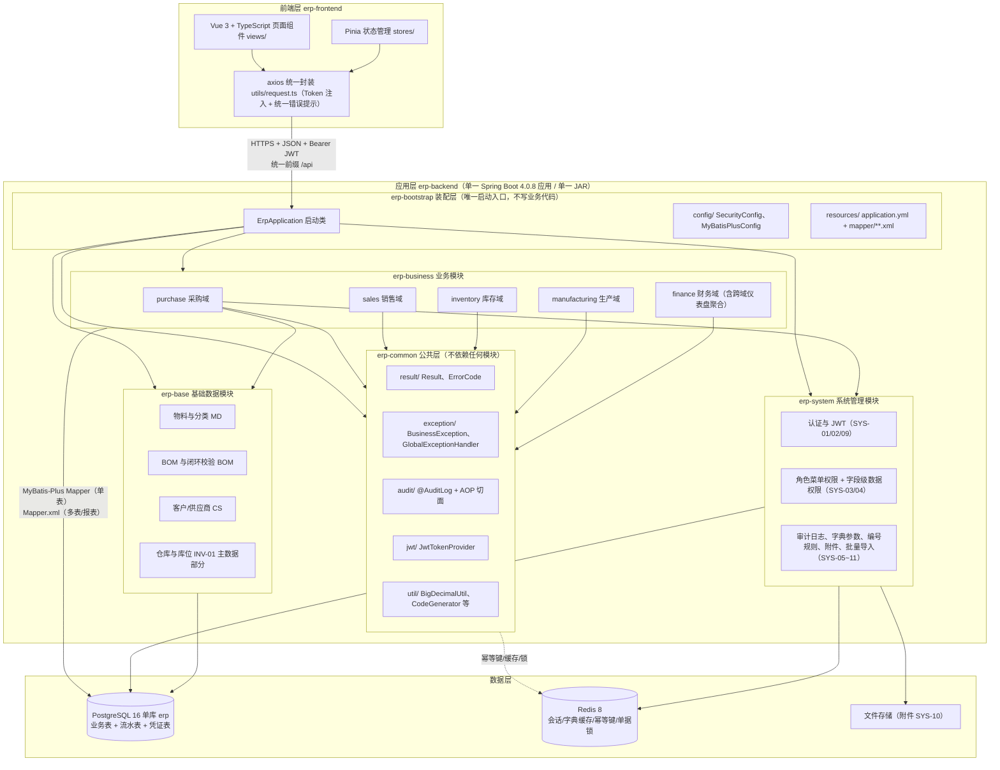
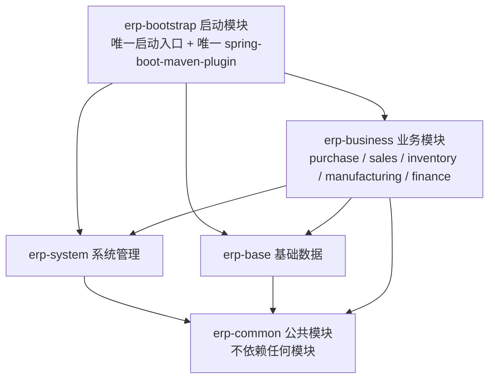
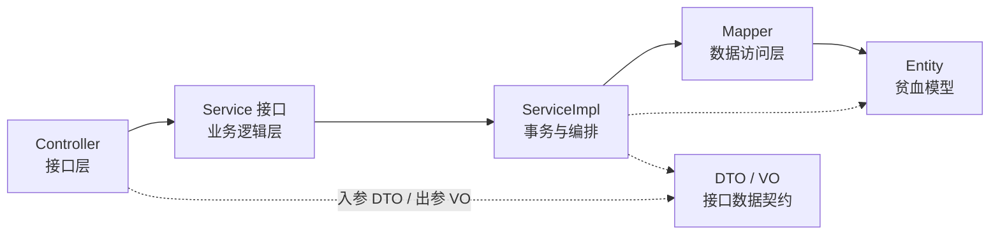
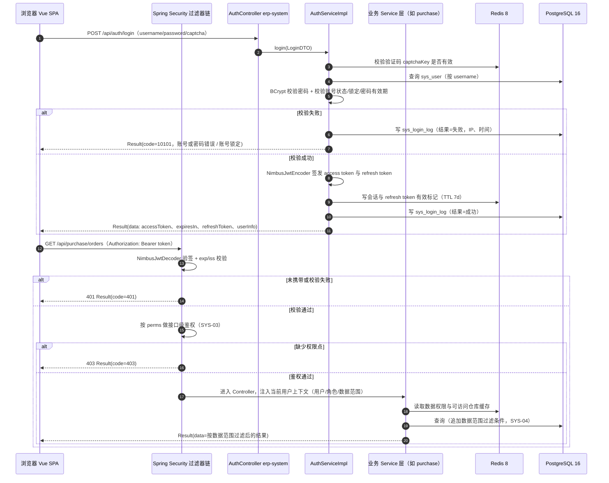
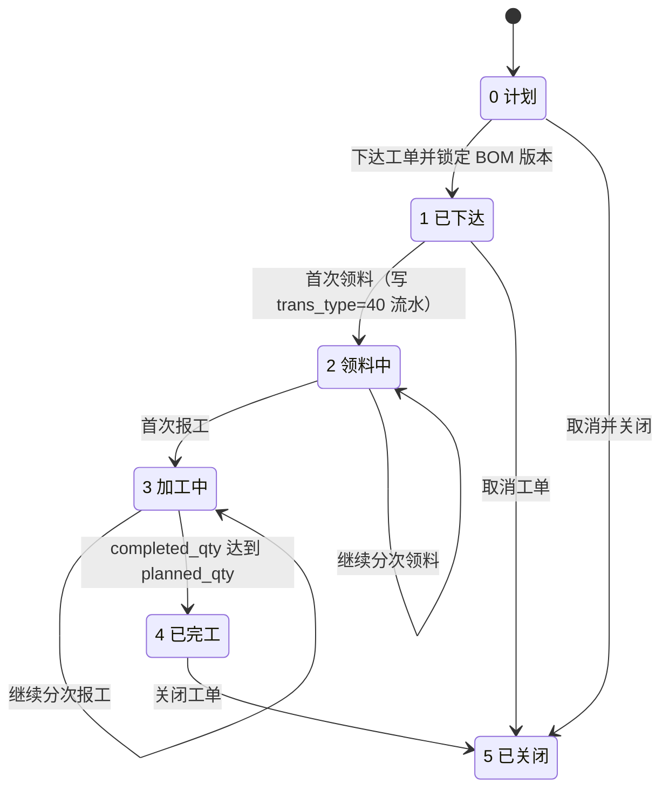
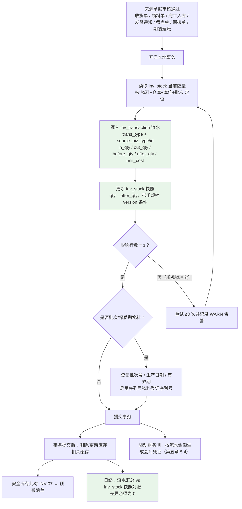
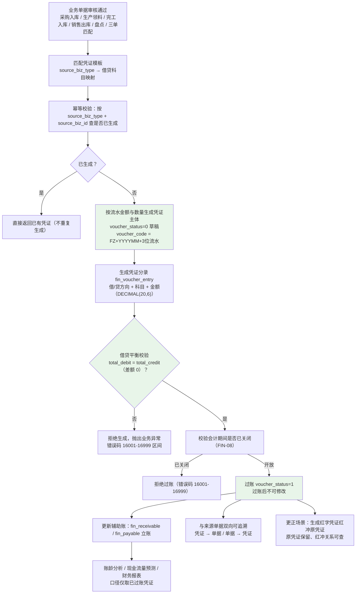
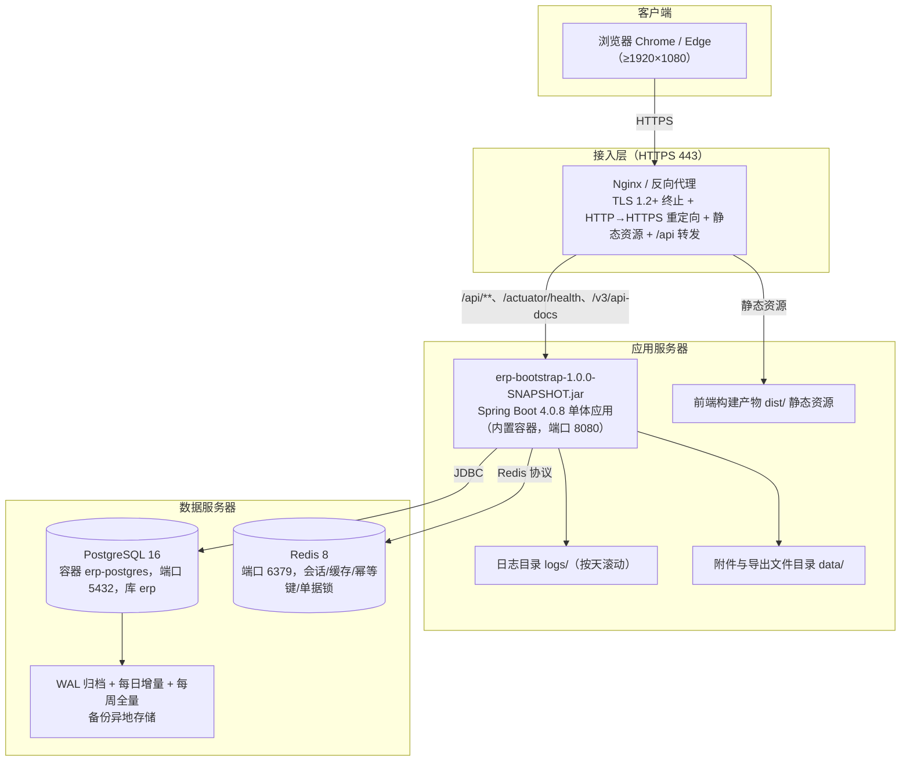

# ERP系统概要设计说明书

| 文档属性 | 内容 |
|---------|------|
| 文档名称 | ERP系统概要设计说明书 |
| 文档编号 | ERP-P2-01 |
| 版本 | V1.0 |
| 状态 | 待评审 |
| 编制部门 | 数字化管理部（会同销售部、采购部、仓储中心、生产制造部、财务部、质量部） |
| 编制日期 | 2026年9月 |
| 所属阶段 | 阶段二 系统设计（第 3-4 月） |
| 关联里程碑 | M2 设计评审通过（概要设计、详细设计、接口设计、数据库设计四类文档评审问题全部关闭） |
| 适用范围 | 集团总部、2 个生产基地（苏州、东莞）、3 个区域销售分公司（华东、华南、华北）、4 个中心仓库；后端（Java 21 + Spring Boot 4.0.8 模块化单体）与前端（Vue 3 + TypeScript）全部设计与开发人员 |
| 上游输入 | `../phase1-requirement-confirmation/03-需求规格说明书-终稿.md`（需求基线，只读引用，不得修改） |
| 下游流向 | 同目录《详细设计说明书》《数据库设计文档》《接口设计文档》《UI/UX 设计》；阶段三（D1-D9）编码的架构约束来源 |
| 关联交付物 | 同目录 `06-需求追溯与设计评审记录.md`（需求追溯矩阵与评审记录，由后续任务产出） |

---

## 文档定位

| 项 | 说明 |
|----|------|
| 本文在阶段二中的位置 | 阶段二（系统设计）**首份交付物**，承载核心任务 **2.1 架构设计**、**2.4 编码规范确认** 以及全部**非功能设计**；是后续详细设计、数据库设计、接口设计、UI/UX 设计四类文档的**架构约束来源** |
| 本文性质 | 概要层设计：给出架构定位、模块划分、依赖规则、技术方案落地结论、关键业务机制设计要点与非功能指标实现路径；**具体算法、逐表逐字段、逐接口明细不在本文展开** |
| 需求输入 | 《需求规格说明书（终稿）》（ERP-P1-03）为**唯一需求输入基线**，本文按"无需求无设计"原则逐域对应（见第十章需求覆盖说明） |
| 规范输入 | 《ERP系统开发编码规范文档》《ERP系统开发API设计与规范文档》《ERP系统数据库表结构设计文档》《ERP系统开发目录结构设计》《ERP后端重构规划方案》《ERP系统开发技术选型》《ERP系统开发阶段计划文档》 |
| 一致性口径 | 技术栈版本、模块划分、包结构、错误码区间、命名规范、模块依赖规则与上游文档**逐字一致**；阶段一附录 B 统一裁定 6 条**一律遵守**，如有冲突以上游文档为准并作为评审问题登记 |
| 评审对象 | 本文为 M2 设计评审的四类文档之一（概要类），评审问题须全部关闭后 M2 方可判定通过 |

---

## 一、设计目标与设计原则

### 1.1 设计目标

设计目标承接《需求规格说明书（终稿）》1.3 的 4 项业务目标与第五章非功能需求，全部可判定、可在阶段四 SIT / 阶段五 UAT / 阶段二评审中验证。

| 序号 | 设计目标 | 承接需求 | 可验证指标 |
|------|---------|---------|-----------|
| 1 | **业务财务一体化** | FIN-01~FIN-09、PUR-06 | 出入库类业务单据自动生成凭证覆盖率 100%；凭证借贷平衡差额 0；凭证与来源单据双向可追溯率 100%；月结周期 ≤2 个工作日 |
| 2 | **供应链全程可视化** | SAL-03、SAL-08、MFG-09、RPT-01 | 订单详情页实时展示已发货/已出库/已开票/已收款与关联工单进度；数据延迟 ≤1 分钟；催单自助响应 <1 分钟 |
| 3 | **库存精准管控** | INV-01~INV-11 | 任何库存变动先写 `inv_transaction` 流水再更新 `inv_stock`；流水与快照日终对账差异 0；库存准确率 ≥99.5%；并发更新无数量丢失 |
| 4 | **成本精细核算** | FIN-04、FIN-05、MFG-08 | 工单成本可分解为材料/人工/制造费用三段且可下钻至来源单据（误差 0）；5,000 种物料月度核算 ≤30 分钟 |
| 5 | **平台支撑能力** | SYS-01~SYS-11 | 认证与 JWT 就绪（M3）；统一响应 `Result<T>` 全覆盖；错误码集中管理；审计日志 ≥180 天；单据编号并发唯一 |
| 6 | **性能与容量** | 第五章 5.1（P-01~P-06） | 并发用户 ≥500；关键事务 P95 <3 秒；MRP 全量 5,000 物料 <30 分钟；流水 100 万条下单物料+时间范围查询 ≤2 秒 |
| 7 | **可用性与安全** | 第五章 5.2/5.3（A-01~A-04、S-01~S-07） | 7×24 运行；RTO ≤30 分钟、RPO ≤5 分钟；满足等保 2.0 三级；幂等保护覆盖 5 类关键操作 |
| 8 | **可扩展与可演进** | 第五章 5.4（E-01~E-05） | 新增组织/仓库无需改代码；模块化单体可平滑演进为微服务；缓存 Key 命名与 TTL 合规 |

### 1.2 设计原则

| 序号 | 设计原则 | 落地含义 |
|------|---------|---------|
| 1 | **需求可追溯** | 每项设计对应需求编号；本文第十章给出需求域 → 章节映射；后续由 `06-需求追溯与设计评审记录.md` 建立逐条追溯矩阵 |
| 2 | **模块高内聚、低耦合** | 5 个 Maven 模块按职责边界划分；`erp-business` 内部按 5 个业务域分包；跨模块仅通过 Service 接口交互 |
| 3 | **单一职责分层** | Controller → Service → Mapper → Entity/DTO/VO 单向依赖；Controller 不写业务逻辑、不返回 Entity；Entity 贫血模型 |
| 4 | **数据一致性优先（流水化 / 凭证化）** | 库存变动一律先写流水再改余额；业务单据审核一律驱动凭证生成；余额、账龄均由流水与凭证派生，禁止直接改余额 |
| 5 | **幂等与可重试** | 单据创建、单据动作（审核/关闭）、库存流水生成、凭证生成、MRP 建议转单五类操作幂等；乐观锁冲突重试 ≤3 次并记录告警 |
| 6 | **约定优于配置** | 统一响应体、统一错误码、统一编号规则、统一审计注解、统一缓存 Key 规范、统一金额工具类；能约定的一律不新增配置项 |
| 7 | **规范先行** | 《ERP系统开发编码规范文档》为阶段三强制规范，本文只做架构层固化与引用，不另立标准 |
| 8 | **可演进到微服务** | 包结构、Service 接口边界、表前缀、编号规则均按"可拆分"设计；演进路径与过渡时机在 2.6 明确 |
| 9 | **配置外置与参数化** | 阈值、容差、天数、频率一律走 SYS-06 数据字典与系统参数，改参数 ≤1 分钟生效且不重启服务 |
| 10 | **安全与留痕默认开启** | 鉴权默认开启、审计默认记录、敏感字段默认脱敏；任何"关闭安全能力"的设计须在评审中说明理由 |

### 1.3 设计依据文档清单

| 序号 | 文档 | 路径 | 本文引用范围 |
|------|------|------|-------------|
| 1 | 需求规格说明书（终稿） | `docs/phase1-requirement-confirmation/03-需求规格说明书-终稿.md` | 全部 80 条需求、非功能需求第五章、接口需求第六章、附录 A/B |
| 2 | 业务调研报告 | `docs/phase1-requirement-confirmation/01-业务调研报告.md` | 业务量级、痛点与改进诉求（架构规模与性能指标依据） |
| 3 | 业务流程梳理（As-Is / To-Be） | `docs/phase1-requirement-confirmation/02-业务流程梳理-As-Is与To-Be.md` | 单据流转、状态机、流水与凭证机制（第五、六章机制设计依据） |
| 4 | 数据迁移需求方案 | `docs/phase1-requirement-confirmation/04-数据迁移需求方案.md` | INV-11 / FIN-09 / SYS-11 期初建账与批量导入约束 |
| 5 | ERP系统开发阶段计划文档 | `docs/ERP系统开发阶段计划文档.md` | 阶段二核心任务 2.1~2.6、M2 判定标准、质量闸门 |
| 6 | ERP系统开发技术选型 | `docs/ERP系统开发技术选型.md` | 技术栈与版本基线、架构模式结论、中间件引入阶段 |
| 7 | ERP后端重构规划方案 | `docs/ERP后端重构规划方案.md` | 5 个 Maven 模块划分、依赖规则、启动方式、库存设计核心原则 |
| 8 | ERP系统开发目录结构设计 | `docs/ERP系统开发目录结构设计.md` | 工程目录结构（后端与前端） |
| 9 | ERP系统开发编码规范文档 | `docs/ERP系统开发编码规范文档.md` | 编码铁律、分层约束、事务、审计、逻辑删除、命名、Git 规范（**强制**） |
| 10 | ERP系统开发API设计与规范文档 | `docs/ERP系统开发API设计与规范文档.md` | 统一响应、公共请求头、分页、鉴权、幂等、错误码区间 |
| 11 | ERP系统数据库表结构设计文档 | `docs/ERP系统数据库表结构设计文档.md` | 表前缀、必备字段、金额精度、无物理外键、流水+快照双表 |
| 12 | AGENTS.md | `docs/../AGENTS.md` | 架构约束与编码铁律（与本文必须一致） |

### 1.4 设计约束与假设

| 类别 | 约束 / 假设 |
|------|------------|
| 技术栈基线 | Java 21 LTS；Spring Boot 4.0.8；Spring Security 7；MyBatis-Plus 3.5.17（`mybatis-plus-spring-boot4-starter` + `mybatis-plus-jsqlparser`）；PostgreSQL 16；Redis 8；springdoc-openapi 3.x；Lombok 1.18.46（Boot BOM 托管）；Maven 3.9+；Vue 3.4+（现采用 3.5）+ TypeScript + Ant Design Vue 4 + Pinia + Vite。**禁用**：jjwt、Knife4j 4.x |
| 架构形态 | 模块化单体（Modular Monolith）：**单一 Spring Boot 应用 + 单一 JAR 部署 + 单一数据库**，模块间为 Java 方法调用（Service 接口），非微服务 |
| 中间件范围 | 本期仅引入 **Redis**；**不引入** RabbitMQ/RocketMQ、Nacos、Sentinel、Spring Cloud Gateway、Kubernetes、Elasticsearch、XXL-JOB；定时任务用 Spring `@Scheduled`/`@Async` |
| 前端形态 | Vue 3 SPA（单页应用），构建产物为静态资源，由应用服务托管或独立 Web 服务器托管；本期仅中文界面，不提供语言切换入口 |
| 数据规模假设 | 物料主数据 ~8,000 条（其中参与 MRP 全量运算的活跃物料 ~5,000 种）；BOM ~3,500 个（最深 10 层）；客户 ~600 家；供应商 ~300 家；日出入库流水 ~900 条；库存流水 3 年约 100 万条 |
| 组织范围假设 | 本期为集团**单一法人 + 单一账套**，组织与仓库作为**辅助核算维度**（集团总部 + 2 基地 + 3 分公司 + 4 个中心仓）；多法人多账套不在本期范围 |
| 部署假设 | 应用与数据库同机房内网部署；生产 PostgreSQL 依赖 **WAL 归档 + 时间点恢复** 满足 RPO ≤5 分钟；Redis 仅承载可重建数据（会话、缓存、幂等键、单据锁），不承载唯一性权威数据 |
| 数据访问假设 | **禁止物理外键**（应用层保证一致性）；禁止物理 `DELETE`；主键 `BIGSERIAL`；金额一律 `DECIMAL(20,6)` |
| 本期不做的设计 | 不引入工作流引擎（BPM）、不建独立质检单据表、不做 MRP 自动替代料、不做多语言界面、不做 OLAP 数据仓库/ES 全文检索 |
| 参考的既成事实 | 阶段一附录 B 统一裁定 6 条（物料编码规则、工单 6 态、物料数量口径、单据编号无连字符、质检结论落收货单、4 个中心仓命名）为设计前置条件，不重复论证 |

---

## 二、总体架构设计

### 2.1 架构定位

**结论：采用模块化单体（Modular Monolith）架构 —— 单一 Spring Boot 4.0.8 应用 + 单一 JAR 部署 + 单一 PostgreSQL 库，模块间通过 Java 方法调用（Service 接口）交互，共 5 个 Maven 模块。**

**为什么不是微服务：**

| 对比维度 | 模块化单体（选定） | 微服务（不选，作为演进方向） |
|---------|------------------|--------------------------|
| 架构模式 | 分层 + 模块化单体，模块内高内聚、模块间低耦合 | 分布式服务化，按业务能力独立部署 |
| 部署方式 | **单一 JAR 包部署**（`erp-bootstrap-1.0.0-SNAPSHOT.jar`） | 按模块独立部署，需注册中心与网关 |
| 模块间调用 | **Java 方法调用（Service 接口）**，同进程内无网络开销 | HTTP 远程调用（Feign），需处理超时、重试、熔断 |
| 模块数量 | **5 个模块**（common / system / base / business / bootstrap） | 按需拆分为 8 个左右服务（含报表、系统管理等） |
| 事务一致性 | 单库本地事务，`@Transactional` 直接保证强一致（业财一体必需） | 跨服务最终一致性（本地消息表 + MQ），复杂度与风险高 |
| 团队与规模匹配度 | 匹配当前团队规模与 450 人企业量级；无独立扩缩容诉求 | 需专职 DevOps、分布式排障成本高 |
| 交付与运维成本 | 一次构建、一次部署、一套日志；排障链路单一 | 构建/部署/监控/链路追踪成套建设 |
| 演进成本 | 包结构、Service 边界、表前缀均按可拆分设计，拆分成本可控 | —— |

**选定理由：** ①需求基线明确"业财一体化、凭证化、库存流水化"要求**强一致**，单库本地事务是最低风险实现；②年产出规模（4,800 销售订单 / 6,000 采购订单 / 2,600 工单）与并发指标（≥500 并发用户）远未达到必须分布式的量级；③阶段计划与技术选型均已明确"现阶段模块化单体、后续平滑过渡"，架构不做超前设计。

### 2.2 总体架构图



### 2.3 架构分层说明

| 层次 | 组成 | 职责 | 约束 |
|------|------|------|------|
| 前端层 | Vue 3 + TypeScript + Ant Design Vue 4 + Pinia + Vite | 页面渲染、交互、路由、权限点驱动的菜单/按钮显隐、Token 注入 | 强制 `<script setup>`；TS 严格模式禁 `any`；不承载业务校验的最终判定（以后端为准） |
| 应用层 | 5 个 Maven 模块（见 2.4） | 参数校验、业务规则、事务、编排、流水与凭证生成、权限过滤 | 跨模块仅经 Service 接口；Controller 不写业务逻辑；不直接返回 Entity |
| 数据层 | PostgreSQL 16（单库）、Redis 8、文件存储 | 业务数据与流水/凭证持久化、缓存与会话、幂等键与单据锁、附件存储 | 金额 `DECIMAL(20,6)`；逻辑删除；无物理外键；流水只增不改不删 |
| 装配与配置层 | `erp-bootstrap` | 启动类、安全配置、MyBatis-Plus 配置、`application.yml`、Mapper.xml 资源 | 不写业务代码；**唯一**含 `spring-boot-maven-plugin` |

### 2.4 模块划分与职责

| 模块 | 职责 | 关键包（`me.north30.erp.` 下） | 主要承载需求编号 |
|------|------|------------------------------|----------------|
| **erp-common** | 公共能力：统一响应体、错误码、业务异常与全局异常处理、审计日志注解与 AOP、JWT 工具、金额与通用工具；**不依赖任何模块** | `common.result`、`common.exception`、`common.audit`、`common.jwt`、`common.util`、`common.constant`、`common.enums` | SYS-05（注解与切面基础设施）、SYS-08（`Result`/`ErrorCode`/`GlobalExceptionHandler`）；为 BOM-02、FIN-04 提供 `BigDecimalUtil` |
| **erp-system** | 系统管理与平台能力：认证与 JWT、用户/角色/菜单与按钮权限、字段级数据权限、审计日志落库与查询、数据字典与系统参数、单据编号规则引擎、密码策略与账号安全、附件管理、基础数据批量导入 | `system.core.controller/service/mapper/entity/dto/vo`、`enums`、`config`、`constant`、`util` | SYS-01~SYS-11 |
| **erp-base** | 基础数据：物料分类树与物料主数据（基本/计划/财务属性、生命周期）、BOM 主子表（版本、闭环与合法性校验、反查、替代料）、客户与供应商主数据及多维分类、仓库与库位主数据 | `base.core.controller/service/mapper/entity/dto/vo`… | MD-01~MD-06、BOM-01~BOM-07、CS-01~CS-03；INV-01 的仓库/库位主数据部分 |
| **erp-business / purchase** | 采购域：采购申请、采购订单、收货与质检（结论落收货单）、采购退货、三单匹配、暂估入库、采购价格历史、供应商绩效 | `business.purchase.*` | PUR-01~PUR-08 |
| **erp-business / sales** | 销售域：销售订单（结构化分批交货计划）、订单审核与信用校验、订单变更、发货通知与销售出库、销售退货（RMA）、价格策略、跟单看板 | `business.sales.*` | SAL-01~SAL-08 |
| **erp-business / inventory** | 库存域：多仓多库位记账、入库/出库、批次与序列号、保质期、盘点、安全库存预警、呆滞分析、库存流水与即时库存、调拨、期初建账 | `business.inventory.*` | INV-02~INV-11（含 INV-01 记账维度） |
| **erp-business / manufacturing** | 生产域：MRP 运算与参数/结果、生产工单（6 态）、定额领料、工序报工、完工入库、工单成本归集、工单进度、委外加工 | `business.manufacturing.*` | MFG-01~MFG-10 |
| **erp-business / finance** | 财务域：总账与凭证（自动生成、过账、红冲）、应收/应付、存货核算、工单成本核算、固定资产、财务报表、期末处理、期初余额建账；**跨域经营仪表盘（RPT-01）在此域聚合** | `business.finance.*` | FIN-01~FIN-09；RPT-01（聚合）、RPT-06 |
| **erp-bootstrap** | 装配与配置：启动类、`SecurityConfig`、`MyBatisPlusConfig`、`application.yml`、全部 `Mapper.xml` 资源；**不写业务代码** | `me.north30.erp`（`ErpApplication`）、`config`、`resources/mapper/**` | 无直接需求条目（支撑全部需求的可运行性） |

**报表（RPT）归属结论：** 本期**不新增"报表模块/报表业务域"**（与"5 个 Maven 模块 + business 内 5 个业务域"的既定结构保持一致）。报表查询按**数据来源归属**：RPT-02 → sales、RPT-03 → purchase、RPT-04 → inventory、RPT-05 → manufacturing、RPT-06 → finance；RPT-07（导出）为各域复用的公共能力（Excel/PDF 工具置于 `erp-common.util`，导出任务与日志由各域 Service 编排）；RPT-01（跨域经营仪表盘）由 **finance 域**聚合各域 Service 提供的指标口径方法后统一出接口。

### 2.5 模块依赖关系



**依赖规则（不可违反）：**

| 模块 | 允许依赖 | 禁止依赖 | 说明 |
|------|---------|---------|------|
| `erp-common` | 无（仅第三方库） | 任何 `erp-*` 业务模块 | 是所有模块的基础，禁止反向依赖 |
| `erp-system` | `erp-common` | `erp-base`、`erp-business`、`erp-bootstrap` | 提供认证与权限能力，不依赖业务 |
| `erp-base` | `erp-common` | `erp-system`、`erp-business`、`erp-bootstrap` | 主数据模块保持纯净 |
| `erp-business` | `erp-common` + `erp-system` + `erp-base` | `erp-bootstrap` | 内部 5 个业务域之间可互相调用 **Service 接口** |
| `erp-bootstrap` | 全部模块 | —— | **唯一**包含 `spring-boot-maven-plugin` 的模块；不写业务代码 |

**跨模块调用规则：**

| 规则 | 内容 |
|------|------|
| 禁止直接调用他模块 Mapper | 跨模块**禁止直接调用 Mapper**，必须通过对方模块的 **Service 接口**；代码审查项（E-04 验证方式） |
| 接口暴露约定 | 对外暴露的 Service 接口定义在 `<模块>.core.service` 包下；`impl` 子包为内部实现，仅供本模块与 Spring 装配使用；跨模块调用只允许依赖接口类型 |
| Entity/DTO 跨模块传递 | 跨模块不传递 Entity（Entity 不外泄）；跨模块方法参数与返回值使用对方模块定义的 **DTO/VO**，或由调用方在本域内转换 |
| 事务边界 | 跨模块调用在**同一本地事务**内传播（`Propagation.REQUIRED`），禁止跨模块直接操作对方的表（如库存域不得直接更新财务表） |
| 依赖方向检查 | 通过 Maven 模块依赖（`pom.xml` 的 `dependencies`）在编译期强制；禁止使用 `reflection`/`@Autowired` 绕过模块边界 |
| 循环依赖 | business 内部 5 个业务域之间禁止形成循环依赖；出现双向需求时，将共用能力下沉到 `erp-base`/`erp-common` 或改为单向编排（由上层单据驱动下层流水） |

### 2.6 微服务演进路径

| 当前（模块化单体） | 未来（微服务） | 过渡动作 |
|------------------|--------------|---------|
| `erp-business` 内的 5 个业务域包 | 提取为独立 Maven 模块 → 独立服务 | 按包边界提取，模块依赖改为"接口模块 + 实现模块" |
| Service 方法调用（同进程） | Feign HTTP 调用（`@FeignClient`） | 为每个跨域接口定义 API 契约模块，先本地实现后远程实现 |
| 单一 PostgreSQL 库 | 按服务拆分数据库 | 先拆表归属，再拆 schema，最后拆实例；拆分期禁止跨库 JOIN |
| 单一 JAR 部署 | 独立部署 + Nacos 注册与配置 | 引入 `Spring Cloud Gateway` 统一入口、`Nacos` 注册配置、`Sentinel` 熔断限流 |
| 本地事务强一致 | 最终一致性（本地消息表 + MQ） | 引入 RabbitMQ/RocketMQ；**严禁 XA 强一致事务**（编码规范 2.6） |
| Spring `@Scheduled` 定时任务 | XXL-JOB 托管（`@XxlJob`） | 全部定时任务迁移并配置路由策略（分片广播/轮询）避重复执行 |
| Mapper.xml 报表查询 | 独立报表服务 / ES | 报表按数据来源先行归域，规模化后再独立 |

**过渡时机（触发条件，满足任一即评估拆分）：** ①某业务域代码量 **>5,000 行**；②某业务域需要**独立扩缩容**（如 MRP 运算与报表导出对资源诉求显著高于其他域）；③某域需要独立发布节奏（变更频率显著高于其他域）。拆分前须完成：跨域 Service 调用清单梳理、事务边界重划、数据一致性方案（本地消息表）设计与评审。

---

## 三、模块内分层与工程结构设计

### 3.1 分层模型与职责边界



| 层级 | 核心职责 | 严禁操作 |
|------|---------|---------|
| **Controller** | 接收请求、`@Valid` 校验入参、调用 Service、封装 `Result<T>` 返回 | ❌ 禁止写业务逻辑 ❌ 禁止直接操作数据库 ❌ 禁止直接返回 Entity ❌ 禁止 `try-catch` 吞异常 |
| **Service（接口）** | 定义业务能力边界，作为跨模块唯一调用入口 | ❌ 禁止暴露 Entity 或 Mapper |
| **ServiceImpl** | 核心业务逻辑、事务管理（`@Transactional`）、跨域流程编排、流水与凭证生成、权限过滤调用 | ❌ 禁止在 XML 外拼接 SQL ❌ 禁止循环内查库（N+1） |
| **Mapper** | 仅 CRUD 及简单关联查询（单表用 `LambdaQueryWrapper`；多表/报表用 Mapper.xml） | ❌ 禁止在 XML 中硬编码业务常量（应使用枚举） |
| **Entity** | 纯数据映射（继承 `BaseEntity`，字段与表一一对应），贫血模型 | ❌ 禁止携带业务方法 ❌ 禁止关联其他 Entity |
| **DTO / VO** | 接口数据契约（DTO 入、VO 出） | ❌ 禁止 DTO 中引用 Entity  禁止携带数据库注解 |
| **enums / constant / util / config** | 枚举（状态、类型、业务字典）、常量、无状态静态工具、模块内配置与拦截器 | ❌ 禁止在 `util` 中写有状态逻辑；❌ 禁止在 `enums` 中承载数据库访问 |

**关键约定：** Controller 入口处将 DTO 转换为 Entity/BO，返回时将 Entity 转换为 VO/DTO；**严禁直接序列化 Entity 返回前端**（防敏感字段与乐观锁 `version` 外泄）。

### 3.2 包结构规范

**统一包结构（每个业务模块内部一致）：**

```
me.north30.erp.<模块>.core
├── controller        // 接口层（@RestController）
├── service           // 业务逻辑层（接口定义）
│   └── impl          // 业务逻辑层（实现类，@Service + @Transactional）
├── mapper            // 数据访问层（继承 MyBatis-Plus BaseMapper）
├── entity            // 数据库实体（继承 BaseEntity）
├── dto               // 数据传输对象（入参/出参）
├── vo                // 视图对象（复杂展示层聚合数据）
├── enums             // 枚举（状态、类型、业务字典）
├── config            // 配置类（本地配置、拦截器配置）
├── constant          // 常量定义
└── util              // 工具类（无状态静态方法）
```

**各模块的 `<模块>` 取值：** `common`（公共模块按能力分包，不套用上述分层）、`system`、`base`、`business.purchase`、`business.sales`、`business.inventory`、`business.manufacturing`、`business.finance`。

> **口径说明：** `core` 为各模块统一的分层根包（依据 AGENTS.md 与《ERP系统开发编码规范文档》2.1 的包结构约定）。《ERP后端重构规划方案》第二章目录示例未显式画出 `core` 层，阶段三编码**一律以本设计的 `core` 包结构为准**，该示例按"省略 `core` 层"理解，不作为编码依据。

**公共模块（`erp-common`）按能力分包：** `common.result`（`Result`、`ErrorCode`）、`common.exception`（`BusinessException`、`GlobalExceptionHandler`）、`common.audit`（`@AuditLog` 注解与 AOP 切面）、`common.jwt`（`JwtTokenProvider`）、`common.util`（`BigDecimalUtil` 等）、`common.constant`、`common.enums`。

### 3.3 命名规范要点

| 类别 | 规则 | 示例 |
|------|------|------|
| 包名 | 全小写，点分隔 | `me.north30.erp.business.purchase.core.service` |
| 类名 | 大驼峰 | `PurchaseOrderService`、`InventoryController` |
| Entity | 对应表名大驼峰 | `PurOrder` ↔ `pur_order`、`InvTransaction` ↔ `inv_transaction` |
| DTO / VO | 业务名 + `DTO` / `VO` 后缀 | `OrderCreateDTO`、`OrderDetailVO` |
| 实现类 | 接口名 + `Impl` 后缀 | `StockServiceImpl` |
| 枚举 | 大驼峰 + `Enum` 后缀 | `OrderStatusEnum`、`TransTypeEnum` |
| 工具类 | 功能名 + `Util` 后缀 | `BigDecimalUtil`、`DateUtil` |
| Mapper | Entity 名 + `Mapper` | `PurchaseOrderMapper` |
| 常量 | 全大写 + 下划线 | `DEFAULT_PAGE_SIZE` |
| 表名 | 小写 + 下划线，**单数**，带模块前缀 `sys_`/`base_`/`pur_`/`sal_`/`inv_`/`mf_`/`fin_` | `pur_order`、`inv_transaction` |
| 索引 | `idx_表名_字段名` / `uniq_表名_字段名` | `uniq_pur_order_code` |

### 3.4 MyBatis XML 存放约定

多表关联查询与报表统计的 Mapper.xml 统一存放于 `erp-bootstrap/src/main/resources/mapper/`，按模块与业务域分文件夹：

```
erp-bootstrap/src/main/resources/mapper/
├── system/                      # 系统管理（用户/角色/菜单/日志/字典）
├── base/                        # 基础数据（物料/BOM/客商/仓库库位）
└── business/
    ├── purchase/                # 采购域（含采购报表）
    ├── sales/                   # 销售域（含销售报表）
    ├── inventory/               # 库存域（含库存报表）
    ├── manufacturing/           # 生产域（含生产报表）
    └── finance/                 # 财务域（含财务报表、经营仪表盘聚合）
```

| 约定 | 内容 |
|------|------|
| 命名 | `{Entity}Mapper.xml`，`namespace` 必须指向对应 Mapper 接口全限定名 |
| 单表查询 | 一律使用 `LambdaQueryWrapper`/`LambdaUpdateWrapper`，不写 XML |
| 多表/报表 | 必须写 XML，SQL 必须带注释说明口径与对应需求编号 |
| 参数占位 | 动态条件一律 `#{}` 预编译；`${}` 仅限静态表名/排序字段且必须白名单校验 |
| 分页 | 统一使用 MyBatis-Plus 分页插件（依赖 `mybatis-plus-jsqlparser`） |
| 禁止 | 循环内查库（N+1）；XML 中硬编码业务常量（用枚举传参） |

### 3.5 工程结构树

```
north30-erp-project/
├── AGENTS.md                                   # AI 编码代理工作规则
├── .editorconfig                               # UTF-8 / LF / 缩进规范
├── erp-backend/                                # 后端根目录（模块化单体，单一 JAR）
│   ├── pom.xml                                 # 父 POM（packaging=pom，统一版本与依赖管理）
│   ├── erp-common/                             # 公共模块（不依赖任何模块）
│   │   ├── pom.xml
│   │   └── src/main/java/me/north30/erp/common/
│   │       ├── result/                         # Result、ErrorCode
│   │       ├── exception/                      # BusinessException、GlobalExceptionHandler
│   │       ├── audit/                          # @AuditLog 注解 + AOP 切面
│   │       ├── jwt/                            # JwtTokenProvider（NimbusJwtEncoder/Decoder）
│   │       ├── util/                           # BigDecimalUtil 等
│   │       ├── constant/  └── enums/
│   ├── erp-system/                             # 系统管理模块
│   │   ├── pom.xml
│   │   └── src/main/java/me/north30/erp/system/core/{controller,service/impl,mapper,entity,dto,vo,enums,config,constant,util}
│   ├── erp-base/                               # 基础数据模块（物料/BOM/客商/仓库库位）
│   │   ├── pom.xml
│   │   └── src/main/java/me/north30/erp/base/core/{controller,service/impl,mapper,entity,dto,vo,...}
│   ├── erp-business/                           # 业务模块（依赖 common + system + base）
│   │   ├── pom.xml
│   │   └── src/main/java/me/north30/erp/business/
│   │       ├── purchase/core/{controller,service,mapper,entity,dto,vo,...}
│   │       ├── sales/core/{controller,service,mapper,entity,dto,vo,...}
│   │       ├── inventory/core/{controller,service,mapper,entity,dto,vo,...}
│   │       ├── manufacturing/core/{controller,service,mapper,entity,dto,vo,...}
│   │       └── finance/core/{controller,service,mapper,entity,dto,vo,...}
│   └── erp-bootstrap/                          # 启动模块（唯一入口，唯一含 spring-boot-maven-plugin）
│       ├── pom.xml                             # 依赖所有其他模块
│       └── src/main/
│           ├── java/me/north30/erp/
│           │   ├── ErpApplication.java         # @SpringBootApplication 启动类
│           │   └── config/                     # SecurityConfig、MyBatisPlusConfig
│           └── resources/
│               ├── application.yml             # 数据源/Redis/JWT/日志 配置
│               ├── application-dev.yml  application-test.yml  application-prod.yml
│               └── mapper/{system,base,business/{purchase,sales,inventory,manufacturing,finance}}
├── erp-frontend/                               # 前端根目录（Vue 3 + TS）
│   ├── package.json  vite.config.ts  index.html  tsconfig.json
│   └── src/
│       ├── api/                                # 按模块划分的接口定义（purchase.ts / inventory.ts …）
│       ├── views/                              # 页面视图（按模块划分）
│       ├── components/                         # 公共组件（App 前缀，如 AppTable.vue）
│       ├── composables/                        # 组合式函数（useTable.ts / usePagination.ts）
│       ├── router/                             # 路由配置
│       ├── stores/                             # Pinia 状态管理
│       ├── types/                              # TS 类型定义
│       ├── utils/request.ts                    # axios 封装（Token 注入 + 统一错误提示）
│       └── constants/                          # 枚举映射与下拉框配置
├── database/                                   # 数据库脚本（init / migration）
├── deploy/                                     # 部署配置（docker；k8s 微服务阶段引入）
├── docs/                                       # 项目文档（含 phase1/phase2/phase3 交付物）
└── scripts/                                    # 辅助脚本（create-module.sh、db-migrate.sh）
```

### 3.6 启动与构建

| 操作 | 命令 |
|------|------|
| 编译全部模块 | `cd erp-backend && mvn clean compile` |
| 本地启动（仅启动 bootstrap，其他模块作为依赖） | `mvn spring-boot:run -pl erp-bootstrap` |
| 打包 | `mvn clean package -DskipTests`（产物 `erp-bootstrap/target/erp-bootstrap-1.0.0-SNAPSHOT.jar`） |
| 生产启动 | `java -jar erp-bootstrap-1.0.0-SNAPSHOT.jar --spring.profiles.active=prod` |
| 前端构建 | `cd erp-frontend && npm install && npm run build`（产物 `dist/` 静态资源） |

---

## 四、技术方案落地设计

### 4.1 技术栈版本基线

| 层级 | 选型 | 版本基线 | 落地要点 |
|------|------|---------|---------|
| 后端语言 | Java | **21 LTS** | 统一 `maven.compiler.release=21`；记录类（record）用于不可变 DTO 场景 |
| 后端框架 | Spring Boot（模块化单体） | **4.0.8** | 父 POM 统一 `dependencyManagement`；配置键按 Boot 4 迁移（`server.servlet.encoding` → `spring.servlet.encoding`） |
| 安全框架 | Spring Security | **7.x** | 由 Boot BOM 托管版本；认证用 `spring-boot-starter-oauth2-resource-server` |
| ORM | MyBatis-Plus | **3.5.17** | 依赖 `mybatis-plus-spring-boot4-starter`，**必须额外引入 `mybatis-plus-jsqlparser`**（3.5.9+ 分页插件拆分） |
| 数据库 | PostgreSQL | **16**（Docker 容器 `erp-postgres`，端口 5432，用户/库 `erp`） | 金额 `DECIMAL(20,6)`；逻辑删除 `SMALLINT`；主键 `BIGSERIAL`；无物理外键 |
| 缓存 | Redis | **8.x**（本机部署，密码 `root`） | 会话、字典缓存、幂等键、单据锁、高频查询缓存；Key 带 TTL |
| API 文档 | springdoc-openapi | **3.x** | 自动生成 OpenAPI 3 文档，与代码同步更新（I-01） |
| 代码简化 | Lombok | **1.18.46**（Boot BOM 托管，**pom 中不写死版本号**） | `@Slf4j`（禁手写 `LoggerFactory.getLogger`）、`@Data`/`@Getter`/`@Setter` |
| 构建工具 | Maven | **3.9+** | 5 模块聚合构建；仅 `erp-bootstrap` 含 `spring-boot-maven-plugin` |
| 前端框架 | Vue 3 + TypeScript | Vue **3.4+（现采用 3.5）** | 强制 `<script setup>` 组合式 API；TS `strict: true`，禁 `any` |
| 前端 UI / 状态 / 构建 | Ant Design Vue 4 / Pinia / Vite | 4.x / 最新稳定 / 最新稳定 | 页面组件大驼峰；公共组件 `App` 前缀；axios 统一封装 |
| 日志 | SLF4J + Logback | 由 Boot BOM 托管 | 占位符 `{}`；禁止 `System.out.println` / `console.log` |

**禁用项（红线）：**

| 禁用 | 原因 | 替代方案 |
|------|------|---------|
| **jjwt** | 违反技术选型与编码规范红线 | `spring-boot-starter-oauth2-resource-server` + `NimbusJwtEncoder` / `NimbusJwtDecoder` |
| **Knife4j 4.x** | 与 Spring Boot 4 不兼容 | springdoc-openapi 3.x |
| 前端 `any` 类型 | 破坏类型安全 | 显式接口定义；特殊情况必须注释说明 |
| `float` / `double` 计算金额 | 精度丢失 | `BigDecimal` + `BigDecimalUtil` |
| 物理 `DELETE FROM` / 物理外键 | 破坏追溯链 / 高并发锁表 | `is_deleted` 逻辑删除 / 应用层一致性校验 |
| XA 强一致事务（未来微服务阶段） | 锁死数据库 | 本地消息表 + MQ 最终一致性 |

### 4.2 统一响应与异常体系

**统一响应体：** `me.north30.erp.common.result.Result<T>`

| 字段 | 类型 | 说明 |
|------|------|------|
| `code` | Integer | 业务状态码（200 成功；HTTP 语义码 400/401/403/404/409/422/500；业务码 10001~16999） |
| `message` | String | 面向业务人员可读的提示（含单据号、物料编码或具体数值） |
| `data` | T | 业务数据；分页数据置于 `data` 内（`list`、`total`、`pageNum`、`pageSize`、`pages`） |
| `timestamp` | Long | 服务器时间戳（毫秒） |
| `traceId` | String | 可选，链路追踪 ID（来自请求头 `X-Request-Id` 或服务端生成） |

**异常体系与全局处理范围：**

| 组件 | 位置 | 职责 |
|------|------|------|
| `BusinessException` | `me.north30.erp.common.exception` | 业务校验失败统一抛出（继承 `RuntimeException`，携带错误码与业务可读消息）；**严禁 try-catch 吞异常** |
| `GlobalExceptionHandler`（`@RestControllerAdvice`） | `me.north30.erp.common.exception` | 统一转换为 `Result`；**严禁返回裸异常堆栈** |

| 异常类型 | 处理结论 | 返回 `code` | HTTP 状态 |
|---------|---------|------------|----------|
| `BusinessException` | 直接取异常携带的错误码与消息 | 错误码（10001~16999） | 200（业务语义由 `code` 承载） |
| 参数校验异常（`@Valid`、`MethodArgumentNotValidException`、`BindException`、`ConstraintViolationException`） | 汇总字段级错误信息，指明字段名 | 400 / 10001-10999 区间细化码 | 400 |
| 认证异常（`AuthenticationException`、Token 缺失/过期/篡改） | 返回未认证 | 401 | 401 |
| 鉴权异常（`AccessDeniedException`、越权访问） | 返回无权限 | 403 | 403 |
| 资源不存在（`NoHandlerFoundException`、业务查询为空且要求存在） | 返回资源不存在 | 404 | 404 |
| 乐观锁冲突 / 重复提交（`OptimisticLockException`、幂等键冲突） | 返回数据冲突并提示重试 | 409 | 409 |
| 业务规则限制（库存不足、状态不匹配等，由 `BusinessException` 承载） | 返回业务校验失败 | 422 或模块业务码 | 422 |
| 其他未捕获异常（`Exception`） | 记录 ERROR 日志（含 `traceId`，**不打印敏感字段**），返回系统错误 | 500 | 500 |

**错误码区间分配（与《编码规范文档》2.9、《API 设计文档》第十章、需求 SYS-08 逐字一致）：**

| 区间 | 模块 |
|------|------|
| 200 | 成功 |
| 10001-10999 | 通用错误（参数校验、权限、认证、系统管理等） |
| 11001-11999 | 物料/BOM 错误（含客户与供应商） |
| 12001-12999 | 采购错误 |
| 13001-13999 | 销售错误 |
| 14001-14999 | 库存错误 |
| 15001-15999 | 生产制造错误 |
| 16001-16999 | 财务错误 |

**报表（RPT）与系统管理（SYS）的区间处置结论：**

| 场景 | 处置 | 说明 |
|------|------|------|
| 系统管理与认证（SYS-01~SYS-11） | 归入 **10001-10999** 通用区间 | 需求 SYS-01/SYS-08 已明确"10001-10999 通用（含系统管理与认证）"，不新设区间 |
| 报表与分析（RPT-01~RPT-07） | 归入 **10001-10999** 通用区间 | 上游 8 个区间中未给报表单列区间；报表以查询为主，错误多为参数与权限类，落在通用区间语义一致 |
| 区间内部细化（建议，不改动区间边界） | `10001-10099` 参数校验；`10101-10199` 认证与会话；`10201-10299` 权限与数据权限；`10301-10399` 系统管理（用户/角色/字典/参数/编号规则）；`10401-10499` 审计与附件；`10501-10599` 批量导入与导出（SYS-11、RPT-07 共用） | 细化码由接口设计文档在 `ErrorCode` 枚举中逐条登记，**必须落在已划定的 8 个区间内**；`ErrorCode` 枚举为唯一来源，OpenAPI 文档中的错误码清单须与之一致（SYS-08 验收要点⑤） |

### 4.3 认证与授权

**结论：** Spring Security 7 + `spring-boot-starter-oauth2-resource-server`；签发与校验使用 `NimbusJwtEncoder` / `NimbusJwtDecoder`（**禁用 jjwt**）；access token 120 分钟、refresh token 7 天；密钥与 TTL 配置在 `application.yml` 的 `erp.jwt` 下。

**Token 结构与 claim 设计：**

| claim | 内容 | 用途 |
|-------|------|------|
| `sub` | 用户 ID | 主身份标识 |
| `username` | 用户名 | 日志与审计留痕 |
| `roles` | 角色编码集合（如 `["admin","sales_manager"]`） | 角色级鉴权 |
| `perms` | 权限点集合（如 `["sales:order:approve"]`） | 接口级鉴权（SYS-03） |
| `dataScope` | 数据权限范围（6 档取值 + 自定义标识） | 数据级过滤基线（SYS-04） |
| `orgId` / `deptId` | 所属组织 / 部门 | 数据权限计算 |
| `warehouseIds` | 可访问仓库集合 | 库存数据权限 |
| `type` | `access` / `refresh` | 区分令牌用途，防止 refresh token 直接访问业务接口 |
| `iat` / `exp` | 签发时间 / 过期时间 | 有效期校验 |
| `jti` | 令牌唯一 ID | 登出与刷新失效（Redis 黑名单/白名单） |

> 算法结论：本期采用 **HS256（HMAC-SHA256）对称签名**，密钥取自 `erp.jwt.secret`（≥256 bit，禁止入库、禁止入日志）；单体部署下密钥集中配置即可满足安全要求，与《API 设计文档》示例令牌头 `alg=HS256` 口径一致。演进为微服务时切换为 **RS256**（网关持私钥签发、各服务持公钥校验）。

**TTL 与刷新策略：**

| 项 | 策略 |
|----|------|
| access token | 有效期 **120 分钟**（7200 秒），载荷含 `exp`；过期返回 401 |
| refresh token | 有效期 **7 天**；仅在 `/api/auth/refresh` 使用；登出后立即失效 |
| 刷新 | 前端在 access token 过期或收到 401 时调用 `/auth/refresh` 换取新 access token；refresh token 过期则强制重新登录 |
| 登出 | 服务端将 refresh token（按 `jti`）加入 Redis 失效集合，TTL 与 token 剩余有效期一致 |
| 账号停用 | 用户停用后在线会话立即失效（Redis 会话标记 + 每次请求校验用户状态，SYS-02 验收要点②） |
| 登录保护 | 连续 5 次密码错误，账号锁定 30 分钟（SYS-01 验收要点④） |
| 权限变更生效 | 权限变更后用户下次请求 ≤5 分钟或重新登录后生效（SYS-03） |

**`erp.jwt` 配置项（`application.yml`）：**

| 配置项 | 示例值 | 说明 |
|--------|-------|------|
| `erp.jwt.secret` | `${ERP_JWT_SECRET:...}`（≥256 bit） | 对称签名密钥，通过环境变量注入，禁止硬编码与入库 |
| `erp.jwt.access-token-ttl` | `120m` | access token 有效期 |
| `erp.jwt.refresh-token-ttl` | `7d` | refresh token 有效期 |
| `erp.jwt.issuer` | `north30-erp` | 签发者（`iss` 校验） |
| `erp.jwt.login-fail-lock-threshold` | `5` | 密码错误锁定阈值 |
| `erp.jwt.login-fail-lock-duration` | `30m` | 账号锁定时长 |
| `erp.jwt.ignore-urls` | `/api/auth/login`、`/api/auth/refresh`、`/v3/api-docs/**`、`/swagger-ui/**`、`/actuator/health` | 免认证白名单（显式列举，禁止通配放开业务路径） |

**登录与鉴权流程：**



**权限模型（实现层次）：**

| 层次 | 内容 | 承载需求 | 实现位置 |
|------|------|---------|---------|
| 功能权限（菜单 + 按钮） | 菜单树（目录/菜单/按钮三级）+ 权限点（如 `sales:order:approve`）；用户-角色多对多，多角色取并集 | SYS-03 | 后端：接口级权限点校验；前端：按权限点控制菜单与按钮显隐 |
| 接口级鉴权 | `perms` claim 与接口所需权限点比对，未授权返回 403 | SYS-03、S-07 | Spring Security 授权规则 + 注解式权限点声明 |
| 数据级过滤（行权限） | 数据范围 6 档（全部 / 本组织及下级 / 本组织 / 本部门及下级 / 本部门 / 仅本人）+ 自定义；按业务对象配置过滤维度（销售订单按客户负责人或业务员、采购订单按采购员、工单按生产组织、库存按仓库） | SYS-04 | Service 层统一用当前用户数据范围构建查询条件；列表、详情、导出**三处同一过滤规则** |
| 字段级权限（列权限） | 金额、银行账号等敏感字段按角色掩码展示（如 `6222****1234`）；非财务角色金额按区间显示 | SYS-04、S-06 | VO 组装阶段按角色掩码；导出复用同一掩码规则 |
| 越权防护 | 详情/导出按主键请求时二次校验数据范围，越界返回 403 | SYS-04 验收要点② | Service 层校验（禁止仅前端隐藏） |

**分工结论：** 前端只做**显隐与体验**（菜单/按钮/字段展示），**不承担安全判定**；接口级鉴权由安全过滤器链负责，数据级与字段级过滤由 **Service 层统一实现**，导出与列表复用同一实现。

### 4.4 审计日志设计

**结论：** 通过 `@AuditLog` 注解 + AOP 切面实现，**禁止业务代码手工拼接日志**；日志只增不改不删，在线保存 ≥180 天。

| 设计项 | 内容 |
|--------|------|
| 注解要素 | `@AuditLog(module, operateType, bizCode)`：`module` 业务模块（如 `PURCHASE`）、`operateType` 操作类型（`CREATE`/`UPDATE`/`APPROVE`/`DELETE`/`POST` 等）、`bizCode` 单据号取值来源（SpEL 表达式或方法入参字段，用于落单据号） |
| 切面职责 | ①环绕记录方法入参（变更后 JSON）与执行前查询的原值（变更前 JSON）；②捕获当前用户、时间、IP（含 `X-Forwarded-For` 解析）；③业务操作成功提交后落库；④业务异常时记录失败结果与错误码 |
| 记录内容 | 操作人、操作时间、IP、操作类型、单据号、**变更前 JSON**、**变更后 JSON** |
| 覆盖范围 | 销售订单、采购订单、生产工单、出入库单的**创建、修改、审核、删除**，以及凭证过账、反审核、期间重开、权限变更、参数变更、计价方法变更等关键动作（SYS-03/SYS-05/SYS-06/MD-04/FIN-08 要求） |
| 保存期限 | 在线保存 **≥180 天**；超期数据归档为可查询冷数据（归档后仍可按单据号与时间范围检索） |
| 写入策略 | ①落库在**业务事务提交之后**执行（`Propagation.REQUIRES_NEW` 或事务同步回调），确保业务回滚时不留错误日志、业务成功时日志不丢失；②对关键单据操作采用**异步落库**（`@Async` + 有界队列），队列满时降级为同步写并告警；③写日志失败**不影响主业务**，仅记录 ERROR 日志 |
| 性能影响控制 | ①变更前后 JSON 仅对白名单字段序列化（避免大字段/BLOB）；②单条日志 JSON 长度上限可配置（超限截断并标记）；③高频查询类接口不接入审计；④批量操作合并为一条批量审计记录（含单据号清单与条数） |
| 查询能力 | 支持按单据号（SYS-05 要求 ≤3 秒）、操作人、操作类型、时间范围检索；**不提供删除接口** |
| 索引策略 | 日志表按 `biz_code`、`operate_time`、`operate_by` 建立索引（单表索引数 ≤5-6 个，防止写入性能下降） |

### 4.5 数据访问设计

| 设计项 | 结论与落地要点 |
|--------|--------------|
| 单表查询 | 必须使用 `LambdaQueryWrapper`（避免硬编码字段名，防字段改名后编译不报错、运行报错） |
| 多表关联 / 报表 | 必须写在 Mapper.xml 中并写清 SQL 注释（口径、来源表、对应需求编号） |
| 动态条件 | 一律 `#{}` 预编译；`${}` 仅限静态表名/排序字段且必须白名单校验（`orderBy` / `orderDirection` 参数须服务端白名单校验） |
| N+1 禁止 | 禁止循环内查库；使用 `IN` 批量查询或 `JOIN` 一次性查出；批量任务分页查询 + 批量更新（严禁一次性加载全量数据到内存） |
| 更新 | 使用 `LambdaUpdateWrapper`/`UpdateWrapper` 带条件更新；**必须带上乐观锁 `version`**，并**处理乐观锁失败**（重试 ≤3 次，仍失败则抛出业务异常并记录 WARN 告警） |
| 分页 | MyBatis-Plus 分页插件（必须引入 `mybatis-plus-jsqlparser`）；默认 20 条/页，单页上限 200 条（P-06） |
| 自动填充 | 审计字段（`create_by`/`create_time`/`update_by`/`update_time`）由 `BaseEntity` + MyBatis-Plus 自动填充；业务代码不得重复定义 |
| 逻辑删除 | 核心业务表带 `is_deleted`（`SMALLINT`，0 未删/1 已删；PostgreSQL 无 TINYINT）；删除一律 `UPDATE ... SET is_deleted=1`，**严禁物理 `DELETE FROM`**；查询默认自动追加 `is_deleted=0` |
| 乐观锁 | 关键业务表（库存、单据、凭证等）带 `version`（`INT`，默认 0）；并发更新以 `version` 校验，冲突即失败 |
| 主键策略 | `BIGSERIAL` 自增（前期方案）；后续分布式阶段由应用层雪花 ID 传入；对外接口**不暴露内部主键自增规则**（I-03） |
| 必备字段 | 所有业务表包含 `id`、`create_by`、`create_time`、`update_by`、`update_time`、`version`、`is_deleted`、`remark`；单据类表另有业务单号 `order_code` |
| 外键 | **禁止物理外键**（`FOREIGN KEY`），由 Service 层保证引用一致性（数据库设计决策"禁止物理外键"延续） |
| 索引 | 每表主键索引；业务单号、唯一联合键建唯一索引；外键字段、常用 WHERE 状态字段、时间范围字段建普通索引；单表索引数 ≤5-6 个 |
| 只读查询优化 | 查询方法建议 `@Transactional(readOnly = true)`（数据库连接优化） |

### 4.6 事务设计

| 设计项 | 结论 |
|--------|------|
| 强制场景 | 所有 Service 实现类的**增删改方法**必须 `@Transactional(rollbackFor = Exception.class)`（杜绝事务不回滚导致"财务账不平"） |
| 只读事务 | 查询方法建议 `@Transactional(readOnly = true)` |
| 传播行为 | 默认 `Propagation.REQUIRED`；独立日志/审计落库用 `Propagation.REQUIRES_NEW` |
| 事务边界 | 事务边界在 **Service 层**（Controller 不开事务）；一个业务动作 = 一个事务（单据主表 + 明细 + 流水 + 凭证 + 单据状态回写在同一事务内） |
| 跨模块一致性 | **同库单事务**：`erp-business` 各域通过 Service 接口在同一本地事务内完成"单据 → 流水 → 余额 → 凭证"链路；**禁止跨模块直接操作对方的 Mapper/表**（如库存域不得直接更新财务表，必须调用财务域 Service） |
| 长事务规避 | ①外部接口调用（OA/税控）禁止放在事务内，改为"事务提交后触发 + 状态机兜底"；②大批量运算（MRP、成本核算）按分页批次短事务提交，禁止十万级单事务；③文件上传/导出不占事务 |
| 主从/读写分离 | 本期单库单实例，不做读写分离（避免主从延迟导致"刚保存查不到"）；后续如引入只读副本，仅用于报表 |
| 事务与缓存 | **禁止在事务中操作缓存**：先更新 DB，事务提交后再更新/删除缓存（编码规范 2.10、E-05） |
| 时钟与期间 | 凭证过账、期末处理受"会计期间关闭"约束（FIN-08）；期间关闭后该期间禁止新增/修改/过账凭证，已过账凭证的冲销须在开放期间进行 |
| 失败处理 | 乐观锁冲突：重试 ≤3 次；库存不足、状态非法等：直接抛 `BusinessException`（不回滚后又吞异常） |

### 4.7 缓存设计（Redis 8）

| 场景 | Key 示例（规范：`业务模块:功能:唯一标识`） | TTL | 更新策略 |
|------|----------------------------------------|-----|---------|
| 用户会话 / refresh 有效性 | `system:session:{userId}:{jti}` | 与 token 剩余有效期一致（≤7d） | 登录写入、登出失效、停用用户即时失效 |
| 字典缓存（SYS-06） | `system:dict:{dictType}` | 30 分钟 | 字典变更后**事务提交后**删除缓存（下次读取重建）；参数变更 ≤1 分钟生效 |
| 系统参数缓存 | `system:param:{paramKey}` | 30 分钟 | 同上（变更后删除） |
| 高频查询缓存（物料/客户/供应商主数据） | `base:material:{materialCode}`、`base:customer:{customerId}` | 10～30 分钟 | 主数据变更后删除缓存 |
| 单据锁（防重复提交/防并发改单） | `purchase:order:lock:{orderCode}`、`sales:order:lock:{id}` | 30 秒（短 TTL，自动释放） | 加锁-处理-释放；获取失败提示"操作进行中" |
| 幂等键 | `purchase:order:idem:{idempotentKey}`（按业务模块区分） | 24 小时（与 API 文档 1.5 一致） | 首次请求写结果，重复请求直接返回缓存结果 |
| 登录失败计数 | `system:login:fail:{username}` | 30 分钟（与锁定时长一致） | 登录失败累加、成功清零 |
| 即时库存热点缓存 | `inventory:stock:{materialId}:{warehouseId}` | 60 秒（短 TTL，容忍弱一致） | **先更新 DB，事务提交后**删除缓存；库存查询以 DB 为准，缓存仅用于高频只读聚合 |

| 强制约定 | 内容 |
|---------|------|
| Key 命名 | `业务模块:功能:唯一标识`（如 `inventory:stock:SKU12345`）；业务模块段与包名/表前缀一致，**必须设 TTL**（防内存爆满） |
| 更新顺序 | **先更新 DB，事务提交后再更新/删除缓存**；禁止在事务中操作缓存 |
| 缓存穿透 | 空值缓存（缓存 `null`，TTL 短，如 60 秒）+ 参数合法性前置校验 |
| 缓存击穿 | 热点 Key 加分布式锁重建（Redisson）；同 Key 并发只允许一个线程回源 |
| 缓存雪崩 | TTL 加随机抖动（±10%）；不同类型数据 TTL 分层；批量预热按批次限速，避免同一时刻集中失效 |
| 数据权威性 | Redis **不承载唯一性权威数据**（编号、流水、凭证、余额一律以 PostgreSQL 为准）；缓存丢失仅影响性能，不影响正确性 |

### 4.8 幂等与防重提交设计

**结论：** 五类关键操作必须幂等（A-04、I-04）：①单据创建（销售订单、采购订单、生产工单、领料单、收货单、发货通知单等）；②单据动作（审核/驳回/关闭/反审核）；③库存流水生成；④凭证生成（含暂估与红冲）；⑤MRP 建议转单。

| 幂等键来源 | 适用接口 | 实现要点 |
|-----------|---------|---------|
| 前端幂等令牌（`Idempotent-Key` 请求头，UUID） | 创建订单类接口（如 `POST /api/purchase/orders`、`POST /api/sales/orders`） | Redis 缓存"键 → 处理结果"，TTL 24 小时；重复请求直接返回首次结果，不重复落库 |
| 业务唯一键（数据库唯一约束） | 单据编号（`uniq_*_order_code`）、凭证来源（`source_biz_type + source_biz_id`）、流水来源（`source_biz_type + source_biz_id + material_id + trans_type`） | 唯一约束兜底 + 捕获唯一冲突后返回首次结果；数据库层保证即使并发也不会重复落数据 |
| 状态机守卫 | 审核/驳回/关闭/过账/反审核 | 状态流转校验：仅允许合法前置状态执行动作，重复执行返回"状态不匹配"而不产生副作用 |
| 单据状态标记 | MRP 建议转单（`converted_status` 0-未转 1-已转采购单 2-已转工单）、预警处理（未处理/已转申请/已忽略） | 转换后置状态，重复点击不再生成下游单据；并发以乐观锁 + 唯一约束双保险 |

| 失败重试策略 | 内容 |
|-------------|------|
| 乐观锁重试 | 更新冲突时重试 **≤3 次**（退避间隔递增）；仍失败则抛出业务异常并记录 WARN 告警（INV-09：冲突重试 ≤3 次并记录告警） |
| 编号冲突重试 | 编号生成冲突重试 **≤3 次**（SYS-07 验收要点③） |
| 外部接口重试 | 超时/网络类失败重试 ≤3 次，指数退避；业务类失败不重试（见第七章通用约定） |
| 幂等边界 | 幂等仅保证"不重复落数据"，不保证"重复请求返回完全相同的时间戳/`traceId`"；业务字段与结果数据必须一致 |
| 幂等回放 | 幂等键缓存内容包含 HTTP 状态与 `Result` 主体关键字段（`code`、`message`、业务主键），保证重复请求语义一致 |

### 4.9 金额与精度统一约定

| 项 | 约定 |
|----|------|
| Java 类型 | 金额、单价、税率、折扣一律 `BigDecimal`；**禁止 `float`/`double`** |
| 计算工具 | 统一 `BigDecimalUtil`（加减乘除）；**除法必须指定精度与 `RoundingMode.HALF_UP`** |
| 数据库类型 | 金额/单价/税率字段一律 `DECIMAL(20,6)`（防汇率换算损失） |
| 中间计算精度 | 业务规则中明确以 6 位小数计算（如 BOM 定额领料量 `父件计划数量 × 子件标准用量 × (1 + 损耗率)`，6 位小数、`HALF_UP`） |
| 前端展示 | 展示时四舍五入为 **2 位**；前端不做金额计算（计算一律后端完成） |
| 数量精度 | 数量字段同样 `DECIMAL(20,6)`（BIGINT 仅用于主键、外键与计数） |
| 校验 | 代码审查检查项："金额是否用了 BigDecimal？"（出现 `double`/`float` 一律不通过） |

### 4.10 前后端协作约定

| 约定 | 内容 |
|------|------|
| API 前缀 | 统一 `/api`（不使用版本号前缀），与需求 6.2-1 一致 |
| 风格 | RESTful；查询 `GET`、新增 `POST`、修改 `PUT`（推荐亦可 `POST`）、删除 `DELETE`（逻辑删除）、**动词场景走 POST**（如 `/api/purchase/orders/{id}/approve`） |
| 状态流转 | 状态变更一律通过**动作接口**（`submit`/`approve`/`reject`/`close`/`unapprove`），禁止直接 PUT 状态字段（API 文档 11.2） |
| 数据契约 | **DTO 入、VO 出**；分页统一 `pageNum`/`pageSize`（默认 1/20，上限 200）/`orderBy`/`orderDirection`（白名单校验） |
| 公共请求头 | `Authorization: Bearer {jwt}`、`Content-Type: application/json`、可选 `Accept-Language`、`X-Request-Id`；幂等接口另有 `Idempotent-Key` |
| 错误处理 | 前端 axios 拦截器统一处理：401 → 触发刷新或跳登录；403 → 提示无权限；`code ≠ 200` → 统一错误提示（使用后端 `message`，不自行拼装） |
| Token 注入 | 请求拦截器统一注入 access token；不写业务代码里手工设置 header |
| 批量与导出 | 批量操作统一 `POST /xxx/batch-xxx`；导出统一 `GET /xxx/export`（`Content-Disposition` 指定文件名），单次导出 ≤50,000 行，大数据量走异步导出 |
| 前端类型 | TS 严格模式 `strict: true`，**禁 `any`**（特殊必须注释）；接口出入参必须有类型定义 |
| 前端结构 | 页面组件大驼峰（`OrderList.vue`）；公共组件 `App` 前缀（`AppTable.vue`）；强制 `<script setup>` 组合式 API |
| 接口文档 | springdoc-openapi 3.x 自动生成 OpenAPI 3 文档，接口变更保持向后兼容；不兼容变更通过新增接口路径承载并提前告知对接方（不使用版本号前缀） |

### 4.11 日志规范

| 项 | 约定 |
|----|------|
| 日志对象 | 统一 `@Slf4j` 生成 `log`；**禁止手写 `LoggerFactory.getLogger(...)`** |
| 占位符 | 统一 SLF4J 占位符 `{}`，禁止字符串拼接（`log.info("订单创建成功, orderId={}, amount={}", orderId, amount)`） |
| 调试输出 | **禁止 `System.out.println` / `console.log`** 出现在提交代码中（提交前强制检查） |
| 级别使用 | `ERROR`：系统级严重错误（数据库不可用、第三方接口不可用、空指针）；`WARN`：业务异常（库存不足、审核不通过、参数非法、乐观锁重试）；`INFO`：核心业务流程节点（订单创建成功、入库完成、定时任务开始/结束）；`DEBUG`：开发调试用，**生产环境关闭** |
| 关键埋点位置 | ①认证：登录成功/失败/登出/刷新；②单据：创建/审核/驳回/关闭/反审核；③库存：流水写入（含 `before_qty`/`after_qty`）、乐观锁冲突与重试；④财务：凭证生成/过账/红冲（含凭证号与借贷合计）；⑤定时任务：开始、结束、耗时、处理条数；⑥外部接口：请求、响应、耗时、重试次数；⑦缓存：缓存穿透/击穿兜底、重建动作 |
| 敏感信息 | 禁止在日志中打印明文密码、密钥、完整银行账号、身份证号（S-06）；异常堆栈打印前需确认不含敏感字段 |
| 日志级别配置 | 按环境外置（`application-{env}.yml`）；生产 `root=INFO`、业务包 `INFO`、MyBatis SQL `WARN`（需要排查时临时调为 DEBUG） |
| 日志位置 | 文件输出目录按环境配置（见第八章 8.3）；统一保留滚动策略（按天 + 大小滚动） |

---

## 五、关键业务机制概要设计

> **本章为概要层设计：只给出机制设计要点与关键约束，具体算法、伪代码与逐字段明细留给详细设计。**
>
> **贯穿全部机制的两条不可违反约束：**
> 1. **任何库存变动必须先写 `inv_transaction` 流水，再更新 `inv_stock` 余额**（同一事务内，顺序不可颠倒）；
> 2. **余额更新必须带乐观锁 `version`，且必须处理乐观锁失败**（重试 ≤3 次，仍失败抛业务异常并记录 WARN 告警），严禁静默覆盖。

### 5.1 单据编号与流水号生成机制

**设计要点：** 编号规则统一为 **前缀 + YYYYMM + 3 位流水（不带连字符）**，按单据类型独立流水、**按月重置**；规则由 SYS-07 编号规则引擎统一实现，编号一经生成**不可修改**。

| 单据类型 | 前缀 | 示例 | 承载需求 |
|---------|------|------|---------|
| 采购申请 | `PA` | `PA202608001` | PUR-01 |
| 采购订单 | `PO` | `PO202608001` | PUR-02 |
| 采购收货单 | `GR` | `GR202608001` | PUR-03 |
| 采购退货单 | `PR` | `PR202608001` | PUR-04 |
| 销售订单 | `SO` | `SO202608001` | SAL-01 |
| 销售发货通知单 | `DN` | `DN202609001` | SAL-05 |
| 销售出库单 | `OD` | `OD202609001` | SAL-05 |
| 销售退货单 | `SR` | `SR202609001` | SAL-06 |
| 生产工单 | `MO` | `MO202608001` | MFG-04 |
| 生产领料单 | `MI` | `MI202608001` | MFG-05 |
| 生产报工单 | `MW` | `MW202608001` | MFG-06 |
| 完工入库单 | `FI` | `FI202608001` | MFG-07 |
| MRP 计划 | `MP` | `MP202608001` | MFG-01 |
| 库存流水 | `IV` | `IV202608001` | INV-09 |
| 盘点单 | `ST` | `ST202608001` | INV-06 |
| 调拨单 | `TR` | `TR202608001` | INV-10 |
| 会计凭证 | `FZ` | `FZ202608001` | FIN-01、FIN-09 |
| 应收单 | `AR` | `AR202608001` | FIN-02 |
| 应付单 | `AP` | `AP202608001` | FIN-03 |
| 收款单 | `RC` | `RC202608001` | FIN-02 |
| 付款单 | `PY` | `PY202608001` | FIN-03 |
| 固定资产卡片 | `FA` | `FA202608001` | FIN-06 |

> **口径说明：** 上表前缀为**全项目唯一权威口径**，与《详细设计说明书》1.3 节、《数据库设计文档》6.1.8 节（编号前缀登记表）、《接口设计文档》完全一致。退货单前缀统一为 `SR`/`PR`（不带连字符），**不采用** `RT-S`/`RT-P` 写法；编号规则约束为"前缀与年月、年月与流水之间均不加分隔符"。

**生成方式与并发唯一性保障（结论）：**

| 设计项 | 结论 |
|--------|------|
| 存储载体 | 数据库编号序列表（建议命名 `sys_code_sequence`：`biz_type`（单据类型）、`period`（YYYYMM）、`current_no`、审计字段），**唯一键 `(biz_type, period)`**；表名与字段在《数据库设计文档》中落地 |
| 原子递增 | 使用 PostgreSQL 原子语句 `INSERT ... ON CONFLICT (biz_type, period) DO UPDATE SET current_no = sys_code_sequence.current_no + 1 RETURNING current_no`，单语句原子完成"首月初始化 + 递增 + 取值"，避免行锁丢失更新 |
| 月度重置 | 通过 `period` 变化自然重置（跨月首次请求插入新的 `(biz_type, 新 period)` 行，流水从 001 起） |
| 并发唯一性 | **三层保障**：①序列表原子递增；②业务表编号唯一约束（`uniq_*_order_code`）兜底；③插入冲突时**重试 ≤3 次**（重新取号），仍失败抛出业务异常（SYS-07 验收要点③：20 并发无重复） |
| 流水位数溢出 | 3 位流水支持单月 999 张；单类型单月超 999 时扩展为 4 位（配置化，不改变天数与顺序语义），并在评审中登记 |
| 编号权威性 | 编号一律以 **PostgreSQL 为唯一权威**，不使用 Redis INCR 作为编号来源（避免持久化风险） |
| 可扩展性 | 单据前缀由字典/常量集中登记（`biz_type → prefix` 映射），新增单据类型**无需改动引擎代码** |
| 特殊单据 | 期初建账（INV-11、FIN-09）使用同一规则（库存流水 `IV` 前缀、凭证 `FZ` 前缀）；MRP 运算批次号使用 `MP` 前缀（如 `MP202608001`） |
| 编号不可变 | 编号生成后进入业务表即不可修改；作废走状态关闭/逻辑删除，编号不复用（MD-01 同类原则：已使用编码不复用） |

### 5.2 单据状态机机制

**设计要点：** 所有单据统一以**状态字段 + 动作接口**驱动，状态变更一律通过动作接口（`submit`/`approve`/`reject`/`close`/`unapprove`/`issue`/`report` 等），**禁止直接 PUT 状态字段**；状态流转前必须做合法性校验，非法流转一律拒绝并返回对应模块业务码。

| 单据 | 状态字段 | 取值与语义 | 关键可逆点 |
|------|---------|-----------|-----------|
| 销售订单 | `order_status` + `approval_status` | `order_status`：0-草稿 1-审核 2-部分发货 3-已发货 4-已关闭；`approval_status`：0-待审 1-通过 2-驳回 | `1-审核` 可 `unapprove` 退回草稿（需特殊权限）；4-已关闭不可逆 |
| 采购订单 | `order_status` + `settlement_status` | `order_status`：0-草稿 1-审核 2-部分收货 3-已收货 4-已关闭；`settlement_status`：0-未结算 1-部分结算 2-已结算 | 已收货行不可取消，仅可关闭；结算状态不改变执行状态 |
| 生产工单 | `order_status` | **6 态：0-计划 1-已下达 2-领料中 3-加工中 4-已完工 5-已关闭**（阶段一附录 B 裁定 2） | `0-计划` 可逻辑删除；`1-已下达` 可取消；2/3 不可逆；5-已关闭禁止领料与报工 |
| 采购收货单 | `status` | 0-待检 1-合格入库 2-部分合格（部分合格） 3-退货 | `0-待检` 可撤销；进入 1/2/3 后须走退货单或冲销流水 |
| 会计凭证 | `voucher_status` | 0-草稿 1-已过账（不可修改） | 已过账只能红冲，不可修改/删除 |
| 库存流水 | 无状态字段（以 `trans_type` 区分） | 10/20/30/40/50/60/70/80/**90 期初建账** | 只增不改不删，更正走反向冲销流水 |
| 调拨单 | 单据状态 | 审核前可改、审核后不可改，撤销须生成反向调拨单 | 审核后生成成对 50/60 流水 |
| MRP 计划 | `plan_status` | 0-新生成 1-已转 2-已关闭 | 建议行 `converted_status`：0-未转 1-已转采购单 2-已转工单，转换后不可重复转 |



**流转校验规则（统一约定）：**

| 规则 | 内容 |
|------|------|
| 前置状态白名单 | 每个动作接口声明允许的前置状态集合；不在集合内一律拒绝（如"已完工工单继续领料被拒""已关闭工单报工被拒"，错误码 15001-15999） |
| 单据锁定 | 审核通过后的关键字段（供应商、物料、数量、单价等）不可直接修改，须走变更单并保留前后值（PUR-02、SAL-04） |
| 数量约束 | 收货数量不得超过订单未收货数量；发货数量不得超过未发货余额；入库数量不得超过工单未完工数量；领料累计不得超过定额 × (1 + 超领上限) |
| 审批分离 | `approval_status`（审批结论）与 `order_status`（执行进度）分离，审批结论不直接决定执行进度，避免双写混乱 |
| 留痕 | 所有状态变更记录操作人与时间，并接入 `@AuditLog`（操作类型 + 单据号 + 变更前后值） |
| 幂等 | 同一动作重复执行不产生副作用：状态已满足时返回业务提示而非重复写入（配合唯一约束兜底） |
| 期初锁定 | 期初库存（INV-11）与期初余额（FIN-09）仅允许在切换期录入，**首个会计期间月结后不可修改**（状态守卫 + 期间校验双重拦截） |

### 5.3 库存流水化机制

**设计要点：** 库存为"**流水（只增不改不删）+ 快照（快速查询）**"双表结构，任何库存变动先写流水、再改快照；错误更正通过反向冲销流水实现；流水与快照**每日对账**（差异须当日查明，日终差异 0）。



| 关键约束 | 内容 |
|---------|------|
| 流水不可变 | 流水**只插入、不修改、不删除**；系统**不提供**修改/删除流水接口（INV-09 验收要点④）；错误通过"方向相反、数量与金额相等"的冲销流水更正，`remark` 记录原 `trans_code` |
| 数量平衡式 | 流水必须记录 `before_qty` 与 `after_qty`，且满足 `after_qty = before_qty + in_qty − out_qty`（抽样校验差值 0） |
| 流水类型 | 10-采购入库、20-生产入库、30-销售出库、40-生产领料、50-调拨入库、60-调拨出库、70-盘盈、80-盘亏、**90-期初建账**（阶段一裁定 7 新增） |
| 来源可追溯 | 流水必带 `source_biz_type` + `source_biz_id`（可回溯到收货单/领料单/完工入库单/发货通知单/盘点单/调拨单），并支持同一来源单据+物料+类型的**唯一约束**保证幂等（重复审核不产生第二条流水） |
| 快照唯一维度 | `inv_stock` 唯一键 `(material_id, warehouse_id, location_id, batch_no)`；库存按"物料 + 仓库 + 库位 + 批次"四维记账（INV-01） |
| 乐观锁 | 快照更新带 `version` 条件更新；冲突重试 ≤3 次并记录告警；20 并发用例下无数量丢失（INV-09 验收要点⑤） |
| 可用量口径 | 可用量 = `qty − frozen_qty`；入库拦截条件为可用量不足（销售出库/生产领料）；收货待检进入 `frozen_qty`（冻结），不增加可用库存 |
| 成本单价 | 出库流水必须记录成本单价 `unit_cost`（移动加权平均或月末一次加权平均，依 MD-04 计价方法）；出库成本单价写入 `inv_transaction.unit_cost`（FIN-04） |
| 成对流水 | 调拨必须成对生成 60（出）+ 50（入），数量相等、按成本价结转、不产生损益；盘点差异**审批通过后**才生成 70/80 流水（审批前不生成任何调整流水） |
| 批次与保质期 | 启用批次管理物料（约占总物料 15%）入库必填批次号；启用保质期物料入库必填生产日期并按天数控算有效期；到期前 30 天自动预警；超期出库默认拦截（参数可配置为"需质检确认后放行"） |
| 期初建账 | INV-11 期初库存入库生成 `trans_type=90` 流水并初始化 `inv_stock` 快照，使"流水 = 快照"自上线首日成立；期初流水汇总 = 快照汇总（差值 0） |
| 日终对账 | 每日定时任务汇总当日流水与 `inv_stock` 快照比对，差异 0；存在差异时输出差异清单并告警（不自动调整，须人工查明后走冲销流水） |
| 查询性能 | 流水按 `material_id`、`(source_biz_type, source_biz_id)`、`trans_time` 建索引；100 万条量级下"物料 + 时间范围"查询 ≤2 秒（P-05） |

### 5.4 业务凭证化机制

**设计要点：** 业务单据驱动会计凭证自动生成；凭证记录 `source_biz_type` + `source_biz_id` 与业务单据**双向可追溯**；凭证过账前必须通过**借贷平衡校验**，过账后**不可修改**，更正一律走**红冲**（红字凭证）。



| 触发时点 | 来源单据 | 标准分录（依据 FIN-01 与需求 SC-06） |
|---------|---------|-----------------------------------|
| 采购收货合格入库（审核通过） | 收货单 `pur_receipt`（`status=1/2`） | 借：原材料（1403）／ 贷：应付账款-暂估（2202） |
| 生产领料出库（审核通过） | 领料单 `mf_order_issue`（`trans_type=40`） | 借：生产成本／ 贷：原材料（1403） |
| 生产完工入库（审核通过） | 完工入库单（`trans_type=20`） | 借：库存商品／ 贷：生产成本 |
| 销售出库（审核通过） | 发货通知/销售出库单（`trans_type=30`） | 借：主营业务成本／ 贷：库存商品 |
| 三单匹配通过 | 采购订单 + 收货单 + 发票 | 红字凭证红冲暂估 + 正式应付凭证 |
| 盘点差异审批通过 | 盘点单（`trans_type=70/80`） | 借：原材料/库存商品 ／ 贷：待处理财产损溢（盘盈）；反之为盘亏 |
| 期初建账 | INV-11 期初库存 + FIN-09 期初余额 | 期初调账凭证（`FZ` + 期间 + 流水，试算平衡差额必须为 0） |
| 应收/应付立账与核销 | 开票/收货/收款/付款登记 | 应收／应付凭证 + 核销记录（金额与单据核对一致） |

| 关键约束 | 内容 |
|---------|------|
| 幂等 | `source_biz_type` + `source_biz_id` **唯一约束**保证一张来源单据一次业务只生成一张凭证；重复触发直接返回已有凭证（A-04/I-04，5 类幂等操作之一） |
| 借贷平衡 | 过账前置校验 `total_debit = total_credit`，差额必须为 0；不平衡拒绝生成并抛业务异常（错误码 16001-16999） |
| 过账不可改 | `voucher_status=1` 后禁止修改/删除；仅允许查询、打印、导出；更正一律红冲（红字凭证保留原凭证并可查红冲关系） |
| 期间控制 | 会计期间关闭后，该期间禁止新增、修改、过账凭证（FIN-08）；已过账凭证的冲销须在**开放期间**进行；期间重开仅限财务经理权限并留痕 |
| 暂估覆盖 | 全部合格入库且未匹配发票的收货单 **100%** 生成暂估凭证，**不提供人工跳过入口**（PUR-06）；红冲后暂估余额归零 |
| 追溯 | 凭证必带 `source_biz_type` + `source_biz_id`；业务单据详情可反查凭证（双向可追溯率 100%，FIN-01 验收要点②） |
| 账套与币别 | 本期**单一账套**、主币种 CNY；币别字段本期保留并支持月末汇兑损益重估（E-02、FIN-08），外币金额按 6 位小数计算 |
| 报表口径 | 财务报表（FIN-07）与账龄、现金流量预测口径**仅取已过账凭证**，草稿凭证不计入 |
| 与库存的一致性 | 凭证金额来源为库存流水金额（`unit_cost` × 数量），因此**凭证生成必须发生在流水写入之后**、且处于同一业务事务链路中，保证"库存数量 ↔ 存货金额 ↔ 凭证分录"三者一致 |

### 5.5 审批流机制

**设计要点：** 本期采用**系统内状态审批**，**不对接工作流引擎**（不引入 BPM/Activiti/Flowable）；审批链为固定单级或阈值升级（简单规则），通过动作接口 + 审批状态字段实现；对外与 OA 通过 RESTful 接口双向对接。

| 设计项 | 结论 |
|--------|------|
| 审批模型 | 动作接口（`submit` → `approve`/`reject`）+ 审批状态字段（如 `approval_status` 0-待审 1-通过 2-驳回）；审批人、审批时间、审批结论、驳回原因落库并写审计日志 |
| 审批链 | 固定规则：①常规单据单级审批（如采购经理、销售总监）；②**阈值升级**（采购申请金额 > 5 万元转上一级，阈值由 SYS-06 维护）；③**特批**（超信用额度、超授权价区间、超定额领料、超领料上限、期间重开），特批**必须填写原因**并留痕 |
| 审批数据可见性 | 待办清单按数据权限过滤；审批操作受权限点控制（如 `sales:order:approve`），未授权返回 403 |
| OA 对接 | ERP 推送待审批单据摘要（单据号、类型、金额、申请人与关键字段）→ OA 回写审批结论与审批人 → ERP 更新审批状态与执行状态；回写**幂等**（按单据号 + 审批流水号判重）；本期在阶段四 SIT 完成接口联调 |
| 异常与补偿 | OA 不可用时，ERP 内审批通道仍可用（不阻塞业务）；OA 回写失败时定时任务对账补拉（状态为"待审批"且超过阈值时间的单据重新查询 OA 状态） |
| 审批与执行分离 | 审批通过不直接改执行进度，由后续业务动作推进（如审核通过后 `order_status=1`，实际发货才进入 2/3） |
| 后续演进预留 | ①审批动作全部接口化；②审批记录独立落库（单据 + 审批人 + 时间 + 结论 + 意见）；③后续引入 BPM 时以"审批记录表 + 动作接口"为对接面，不改造业务状态机 |
| 不做的事 | 本期不做多级串行/并行会签、不做动态审批人规则引擎、不做流程建模界面 |

### 5.6 报表与查询机制

**设计要点：** 报表以**实时查询 + 索引优化 + 轻量缓存**为主，不引入数据仓库/OLAP；区分"实时类"与"汇总类"指标，按性能目标选择实现路径；大数据量导出走**异步导出**。

| 分类 | 典型报表 | 目标响应（P-04） | 实现路径 |
|------|---------|----------------|---------|
| 实时查询类 | 即时库存查询、单据列表、库存流水账、订单执行跟踪 | 即时库存与单据列表 **≤2 秒** | Mapper.xml 多表查询 + 覆盖索引 + 分页；库存维度走 `inv_stock` 快照（不扫流水） |
| 汇总分析类 | 账龄分析、呆滞库存、安全库存预警、保质期预警、采购价格走势 | **≤5 秒** | 汇总口径固定（不随意改口径）；必要时按日轻量缓存（TTL 5 分钟，允许 ≤5 分钟延迟，与 RPT-01 刷新要求一致） |
| 多维度分析类 | 销售排行、毛利分析、库存周转率、工时利用率、多维月度分析 | **≤10 秒** | 预聚合查询（按期间/组织/分类汇总）+ 限制查询区间；必要时限定最大统计跨度并提示缩小范围 |
| 仪表盘 | RPT-01 经营仪表盘 8 项指标 | 实时类 ≤5 分钟延迟；成本类按日刷新 | 各域 Service 提供指标口径方法，finance 域聚合；结果按指标维度缓存（TTL 5 分钟）；每个指标提供**口径说明元数据**（计算公式 + 数据来源，可点击查看） |
| 导出 | RPT-07 全报表导出（Excel/PDF） | 交互不阻塞 | 小数据量同步导出；大数据量**异步导出**：写入导出任务 → `@Async` 生成文件 → 完成后提供下载入口 → 完成通知；导出动作写审计日志（操作人、报表名、筛选条件、行数、时间） |

| 关键约束 | 内容 |
|---------|------|
| 数据权限 | 报表查询与导出**必须**按调用人的数据范围过滤（SYS-04）；**导出内容不得越权**（导出结果行数 = 可见行数） |
| 分页与上限 | 列表默认 20 条/页、单页上限 200 条；单次导出 ≤50,000 行（超限拒绝并提示缩小筛选范围，RPT-07 验收要点④） |
| 汇总查询取舍 | 本期**不建独立汇总表/数仓**；所有汇总口径由实时查询或轻量缓存满足。若 SIT 实测不达标，触发预案：①为 `inv_transaction`、`fin_voucher_entry` 增加按日汇总表（由定时任务生成，幂等可重跑）；②对 MRP 与成本核算引入预计算 |
| N+1 禁止 | 报表一律 SQL 一次查出（JOIN/批量），禁止在 Service 循环内二次查询 |
| 排序安全 | `orderBy`/`orderDirection` 参数必须服务端**白名单校验**（防 SQL 注入）；`${}` 仅用于白名单内的静态排序字段 |
| 口径唯一 | 同一指标在仪表盘、明细报表、导出文件中口径必须一致（抽样核对误差 0，如呆滞/安全库存/保质期清单与对应功能页面一致） |

### 5.7 定时任务机制

**设计要点：** 现阶段统一使用 Spring `@Scheduled` / `@Async`（不引入 XXL-JOB）；任务必须记录开始、结束日志与耗时；批量数据处理**分页查询 + 批量更新**，严禁一次性加载全量数据到内存；任务执行须**幂等可重跑**（按业务日期唯一键防重复生成数据）。

| 任务 | 建议频率 | 承载需求 | 关键约束 |
|------|---------|---------|---------|
| 安全库存预警清单刷新 | 每日（建议 01:00） | INV-07 | 按批次分页扫描；按 `(物料, 仓库, 业务日期)` 幂等；生成补货建议（考虑最小采购批量与提前期） |
| 呆滞库存识别 | 每日（建议 01:30） | INV-08、RPT-04 | 天数阈值取 SYS-06 参数（默认 180 天，可改为 150 即时生效）；报表按业务日期归档，可重跑 |
| 保质期预警清单 | 每日（建议 02:00） | INV-05 | 到期前 30 天（参数化）生成清单；同一批次同一天只生成一次 |
| 应收催收提醒 | 每日（建议 07:00） | FIN-02 | 到期前 7 天与逾期后每周生成提醒清单；按账龄口径计算 |
| 应付付款计划提醒 | 每日 | FIN-03 | 到期日 = 收货日 + 付款条件；提醒不改变单据状态 |
| 库存流水与快照对账 | 每日（日终，建议 23:30） | INV-09、RPT-04 | 汇总当日流水与 `inv_stock` 比对；差异 0；有差异输出清单并告警，**不自动调整** |
| 供应商绩效评分 | 每月（月初） | PUR-08 | 自然月周期；按 4 维度自动评分；可重算（同月重复执行覆盖而非累加） |
| 成本核算与月结批处理 | 财务手工触发为主（可定时兜底） | FIN-04、FIN-05、FIN-08 | 5,000 种物料分页批次处理（<30 分钟）；产物可重算；月结检查清单通过方可关闭期间 |
| 月结检查清单预计算 | 月结前/按需 | FIN-08 | 未过账凭证数、上月暂估未匹配条数、对账差异、未完工工单在制余额、未结算单据数 |
| 异步导出任务清理 | 每日 | RPT-07 | 过期导出文件按保留期清理（保留期参数化） |
| 外部接口对账补拉 | 每小时/每日 | 第六章 | 对 OA 审批结论、税控开票状态做状态对账与补偿拉取（幂等） |

| 演进约定 | 内容 |
|---------|------|
| 本期 | Spring `@Scheduled`（单实例部署，无分布式重复执行问题）；任务开关与频率通过配置外置；`@Async` 线程池大小可配置并设置队列上限（防任务堆积） |
| 未来（规模化/微服务阶段） | 全部任务迁移 XXL-JOB（`@XxlJob`），配置**路由策略（分片广播/轮询）**避免多实例重复执行；迁移时保持任务幂等与日志口径不变 |

---

## 六、非功能设计

### 6.1 性能设计

| 指标（承接需求 5.1） | 目标 | 设计手段 | 验证方式 |
|--------------------|------|---------|---------|
| P-01 并发用户 | ≥500 | 应用无状态（会话在 Redis）；连接池合理配置；接口无长事务；热点主数据与字典缓存 | 阶段四 SIT：500 并发模拟登录、列表查询、单据保存 |
| P-02 关键事务响应 | P95 <3 秒（销售/采购订单保存、领料保存、库存流水写入并更新余额、凭证自动生成） | ①单据保存为短事务；②单表用 `LambdaQueryWrapper`、多表一次 JOIN；③索引覆盖高频 WHERE（`order_code`、`status`、`create_time`、外键字段）；④乐观锁条件更新避免锁等待；⑤凭证生成不调用外部系统 | SIT 压测报告输出各事务 P95 |
| P-03 MRP 全量运算 | 5,000 种物料 <30 分钟 | ①BOM 逐层展开使用内存级缓存（BOM 结构与物料计划属性一次性批量加载）；②批量查询替代逐条查询（严禁 N+1）；③结果批量写入 `mf_mrp_plan_item`；④按物料分片并行处理（`@Async` 线程池，写库按批次单事务）；⑤参数快照与历史批次可查 | SIT 全量数据执行 MRP，点击到生成建议批次计时 |
| P-04 报表查询响应 | 即时库存与单据列表 ≤2 秒；账龄/呆滞/仪表盘 ≤5 秒；多维度月度分析 ≤10 秒 | ①即时库存走快照表 + 唯一键索引；②汇总类报表固定口径 + 轻量缓存（TTL 5 分钟）；③限制统计区间；④异步导出 | UAT 现场计时，每类抽样 3 次取最大值 |
| P-05 流水查询 | 100 万条流水下"物料 + 时间范围" ≤2 秒 | `idx_material_warehouse`、`idx_trans_time`、`idx_source_biz`；查询强制带物料或时间范围条件 | SIT 造数至 100 万条后计时 |
| P-06 分页与批量上限 | 列表默认 20/页、上限 200；单批导入 ≤10,000 行；单次导出 ≤50,000 行 | 上限在后端强校验（超限拒绝并提示），不依赖前端限制 | UAT 演示上限行为 |

**连接池与线程池配置要点：**

| 资源 | 配置要点 |
|------|---------|
| 数据库连接池（HikariCP，Boot 默认） | 最大连接数按 N+2 经验值与数据库 `max_connections` 反推，预留运维与报表连接；连接超时与泄漏检测配置化；避免长事务占用连接 |
| `@Async` 线程池 | 核心/最大线程数可配置；**有界队列**（防任务堆积导致内存溢出）；拒绝策略记录 ERROR 日志并告警；MRP/成本核算独立线程池，与审计日志线程池隔离 |
| Redis 连接 | 使用连接池；命令超时显式设置；缓存读写失败**降级为直连数据库**（不影响业务正确性） |
| Tomcat 线程 | 结合 500 并发目标设置最大线程数与接受队列，配合压测调优 |

**性能验证方式：** 阶段四 SIT 使用压测工具执行 500 并发用户压测（登录、列表查询、单据保存），输出事务成功率 **≥99.9%**、各关键事务 P95 <3 秒、系统无崩溃；MRP 全量与流水查询单独计时验证；不达标项按 5.6 汇总预案（汇总表 / 预计算 / 缓存）整改后复测。

### 6.2 可用性设计

| 需求项 | 设计要点 |
|-------|---------|
| A-01 7×24 运行、季度计划停机 ≤1 次（单次 ≤4 小时且提前 3 个工作日通知） | 应用与数据库独立进程可分别重启；版本发布采用"先备份 + 后发布 + 可回退"；避免在工作时段做结构变更（大表变更走并行/分批策略） |
| A-02 RTO ≤30 分钟 | ①备份可快速恢复（含恢复脚本与演练记录）；②应用无状态，可快速重新部署（单 JAR）；③恢复流程文档化（含责任人、步骤、校验点）；④每季度 1 次故障恢复演练并出报告 |
| A-03 RPO ≤5 分钟 | PostgreSQL 开启 **WAL 归档**（`archive_mode=on`）+ 基础备份，支持时间点恢复（PITR）；归档文件与基础备份异地存储；恢复演练验证丢失窗口 ≤5 分钟 |
| A-04 幂等保护 | 5 类关键操作幂等（见 4.8）；SIT 对 5 类单据重复提交，验证流水与凭证条数不变 |
| 健康检查 | 暴露健康检查端点（`/actuator/health`）：应用存活/就绪、数据库连通、Redis 连通、磁盘空间；健康检查端点纳入免认证白名单但仅内网可访问 |
| 优雅停机 | 启用优雅停机（停止接收新请求 → 等待在途请求完成 → 关闭线程池与连接池）；定时任务与异步导出在停机时等待或标记中断，避免半成品数据 |
| 异常恢复 | ①乐观锁冲突自动重试；②外部接口失败进入补偿队列（定时对账补拉）；③定时任务幂等可重跑；④数据库连接中断后自动重连并告警 |
| 无状态设计 | 会话状态在 Redis（Token + 会话标记），应用实例可随时重启；**不接受**将业务状态放在本地内存（MRP 中间结果除外，且失败可重跑） |
| 监控与告警 | 关键指标：接口 P95、错误率、连接池使用率、慢 SQL、定时任务执行结果、流水/快照对账差异、乐观锁重试次数；异常指标触发告警（对接运维渠道，具体工具不在本期设计范围） |

### 6.3 安全设计（等保 2.0 三级要点）

| 等保要点 | 设计落地 | 承载需求 |
|---------|---------|---------|
| 身份鉴别 | 用户名 + 密码（BCrypt 强度 10）；登录失败锁定（5 次 → 锁定 30 分钟）；密码有效期 90 天、复杂度 ≥8 位且含 4 类中至少 3 类、不得复用最近 3 次历史密码；管理员重置后首次登录强制改密；admin 幂等初始化（初始密码 `Admin@123456`） | SYS-01、SYS-09、S-04 |
| 访问控制 | 功能权限（菜单 + 按钮权限点）+ 接口级鉴权（401/403）+ 数据级过滤（数据范围 6 档 + 自定义）+ 字段级掩码；列表、详情、导出三处口径一致；越权访问返回 403 | SYS-03、SYS-04、S-02、S-07 |
| 安全审计 | `@AuditLog` + AOP 记录操作人、时间、IP、操作类型、单据号、变更前后 JSON；登录/登出/刷新/失败四类事件写登录日志；日志只增不改不删，在线保存 ≥180 天；凭证过账、反审核、期间重开、权限与参数变更均记录 | SYS-05、S-03 |
| 数据完整性 | 金额 `BigDecimal` + `DECIMAL(20,6)`；借贷平衡校验；流水 `after_qty = before_qty + in_qty − out_qty`；幂等与唯一约束防重复落数据；逻辑删除保护追溯链 | FIN-01、INV-09、A-04 |
| 数据保密性 | 敏感字段（银行账号、身份证/手机号）前端与导出文件脱敏；接口不回显密钥类字段；**禁止在日志中打印明文密码与密钥**；导出遵循数据权限 | S-06、CS-02、SYS-04 |
| 剩余信息保护 | 登出/停用后会话立即失效；导出文件按保留期清理；附件删除为逻辑删除且不可再下载；临时文件（导入/导出）定时清理 | SYS-02、SYS-10、RPT-07 |
| 传输加密 | 对外访问强制 **HTTPS（TLS 1.2 及以上）**，由反向代理终止 TLS；HTTP 请求重定向至 HTTPS（301/308）；仅开放 443（对内网服务端口限内网访问） | S-05 |
| 密码与密钥管理 | `erp.jwt.secret`、数据库口令、Redis 口令一律通过**环境变量/外部配置**注入，禁止硬编码入库入日志；不同环境使用不同密钥 | S-06、AGENTS.md 开发环境约定 |
| SQL 注入防护 | 动态条件一律 `#{}` 预编译；`${}` 仅限白名单内静态表名/排序字段；所有排序参数服务端白名单校验 | 编码规范 2.5 |
| XSS 防护 | 前端输出统一转义（Vue 模板默认转义）；禁止 `v-html` 渲染不可信内容（业务备注等需渲染时须后端过滤）；后端对富文本类字段做白名单过滤 | S-06 |
| 越权防护 | ①**纵向越权**：接口级权限点校验（禁止仅前端隐藏按钮）；②**横向越权**：详情/导出按数据范围二次校验；③**ID 越权**：对外接口不暴露内部主键自增规则，外部系统使用独立 API 凭证并受数据权限约束 | SYS-03、SYS-04、I-03 |
| 接口凭证与限流 | 对外接口（OA/税控等）使用独立凭证，不复用用户 Token；对开放接口做基础限流保护 | I-03 |
| 附件安全 | 限制格式（PDF/JPG/PNG/XLSX/DOCX）与大小（≤20 MB/文件、≤20 个/单据）；文件名与存储路径安全处理（防路径穿越与可执行文件伪装） | SYS-10 |

### 6.4 数据备份与恢复

| 需求项 | 设计结论 |
|-------|---------|
| B-01 备份策略 | **每日自动增量（含 WAL 归档）+ 每周全量备份**；备份文件**异地存储**（与生产机房物理隔离） |
| B-02 保留策略 | 日备保留 **30 天**、周备保留 **12 周**、月备保留 **12 个月**；保留清单与策略配置一致可查 |
| B-03 恢复演练 | 每季度执行 1 次恢复演练，**恢复时间 ≤30 分钟**且数据完整（满足 RTO ≤30 分钟、RPO ≤5 分钟）；输出演练报告（恢复起止时间、数据校验结果、问题与改进） |
| 备份范围 | PostgreSQL 全库（业务数据 + 流水 + 凭证）；附件与导出文件目录纳入备份范围；`application.yml` 与部署配置纳入配置备份 |
| 校验 | 备份任务日志连续 7 天无缺失（B-01 验证方式）；备份文件定期做可恢复性抽检（非生产环境恢复验证） |
| 上线前要求 | 上线切换方案须包含回退方案与备份恢复步骤；切换前完成一次全量备份与恢复演练（阶段六） |

### 6.5 可扩展性设计

| 需求项 | 本期结论 | 设计预留 |
|-------|---------|---------|
| E-01 多组织/多工厂 | 支持"总部 + 2 基地 + 3 分公司 + 4 个中心仓库"的**组织与仓库维度**辅助核算与报表；新增组织/仓库通过主数据维护完成，**无需改代码** | 组织（`sys_org`）与仓库主数据表驱动；核心单据携带组织与仓库维度字段（**具体字段由数据库设计落地**：单据表预留 `org_id`，库存/出入库保留 `warehouse_id`）；报表按维度汇总不硬编码组织清单 |
| E-02 多币别 | 本期实现**币别字段 + 汇兑损益处理**（FIN-08），主币种 CNY；外币单据可录入并参与月末汇率重估；金额按 6 位小数计算 | 单据与凭证保留 `currency` 与汇率字段（**汇率/本位币金额字段需在数据库设计中补充**，与《数据库表结构设计文档》现有 `currency` 字段配套）；汇率来源支持人工维护，后续可接外部汇率服务 |
| E-03 国际化（本期结论） | **本期不实现多语言界面**：界面语言固定中文，**不提供语言切换入口**；错误码与字典表保留多语言字段，前端预留 i18n 文案抽取规则；启用语言切换须经 CCB 评审 | ①前端：文案集中管理、预留 i18n 依赖位（不引入切换入口）；②后端：错误码以 `messageKey` + 中文消息实现，字典表保留多语言字段（**需数据库设计落地该字段**，以满足 E-03 的"表结构检查"验证方式）；③单号、单位、状态码等编码值不随语言变化 |
| E-04 多账套与模块扩展 | 本期**单一账套**；新增业务域按模块内分包（`erp-business` 下新增业务域子包），跨模块仅通过 Service 接口调用 | 模块依赖规则 + 包结构约定保证可拆分；禁止跨模块直接调用 Mapper（代码审查项） |
| E-05 缓存与定时任务 | Redis Key 命名遵守"业务模块:功能:唯一标识"且必须设 TTL；先更新 DB、事务提交后再操作缓存；定时任务用 Spring `@Scheduled`/`@Async` | 未来引入 Nacos 动态参数（税率、流程规则等）时，参数读取统一走 SYS-06 参数服务，不散落硬编码 |

### 6.6 可维护性设计

| 设计项 | 结论 |
|-------|------|
| 配置外置 | `application.yml` + `application-{dev,test,prod}.yml` 分环境；敏感配置（口令、密钥）通过环境变量注入；禁止代码内硬编码阈值与地址 |
| 字典与参数化 | 结算方式、物料分类、单据状态、客户维度标签、呆滞天数、保质期预警天数、盘点频率、信用控制开关、授权浮动比例、三单匹配容差、采购申请审批阈值、价格预警阈值等一律走 SYS-06；修改后 ≤1 分钟生效且不重启服务 |
| 错误码集中管理 | 全部业务错误码集中定义在 `ErrorCode` 枚举（唯一来源）；区间分配见 4.2；OpenAPI 文档错误码清单与枚举保持一致 |
| API 文档自动生成 | springdoc-openapi 3.x 自动生成 OpenAPI 3 文档；接口与数据库脚本随代码同步更新（D1-D9 统一退出标准） |
| 代码一致性 | 统一包结构、统一命名、统一 `Result`、统一 `@AuditLog`、统一日志占位符、统一 `BigDecimalUtil`；代码审查清单（编码规范第六章）为强制门禁 |
| 可测试性 | Service 层可单测（不依赖 Web 层）；核心业务逻辑（BOM 闭环检测、库存计算、三单匹配、MRP、凭证生成）必须有单测覆盖（阶段三退出标准） |
| 可观测性 | 统一响应携带 `traceId`；关键链路（单据 → 流水 → 凭证）日志可串联；定时任务记录开始/结束/耗时/条数 |
| 版本与文档同步 | 接口变更保持向后兼容，不兼容变更通过新增接口路径承载（不使用版本号前缀）；数据库脚本与 API 文档随代码同步更新 |

### 6.7 兼容性设计

| 项 | 结论 |
|----|------|
| 浏览器 | Chrome、Edge 最新两个大版本（Chromium 内核）；分辨率 ≥1920×1080；本期不做 IE 兼容、不做移动端适配（作业终端以 PC 为主） |
| 数据库版本 | PostgreSQL **16+**（生产与开发一致，Docker 容器 `erp-postgres`）；不使用 MySQL 专有语法 |
| JDK / 运行环境 | Java **21 LTS**（`release=21`）；Maven 3.9+；Linux 服务器（容器化预留） |
| Node / 构建 | 前端 Node LTS + Vite 构建；构建产物为静态资源，不依赖服务端渲染 |
| 时区与时间 | 数据库统一 `TIMESTAMP` 存储，服务端与前端统一按 `Asia/Shanghai` 展示；业务时间字段语义明确（业务发生时间 vs 系统写入时间） |
| 字符集 | 全链路 UTF-8（数据库、应用、文件、脚本）；换行符 LF（禁止 CRLF），Java 4 空格缩进、前端/JSON/YAML 2 空格缩进（`.editorconfig` 强制） |

---

## 七、外部接口概要设计

### 7.1 对接系统总表

| 对接系统 | 集成方式 | 数据流向 | 本期范围 | 设计要点 | 异常与补偿策略 |
|---------|---------|---------|---------|---------|--------------|
| **OA 系统** | RESTful API | **双向** | **本期实现**（阶段四 SIT 完成联调） | ERP 推送待审批单据摘要（采购申请、销售订单、付款申请：单据号、类型、金额、申请人、关键字段）；OA 回写审批结论与审批人；回写按"单据号 + 审批流水号"幂等；审批动作接口化 | 回写失败：定时任务对账补拉（≥阈值时间仍待审的单据重新查询）；OA 不可用不阻塞 ERP 内审批通道 |
| **税控开票系统** | API | 税控 → ERP（少量回写） | **本期实现**（阶段四 SIT 完成联调） | 发票开具状态、发票号码、开票日期同步至 ERP 用于应收立账；ERP 侧以"开票登记"承载结果，应收金额与单据核对一致 | 同步失败：状态对账定时补拉；重复回写按发票号幂等；对账差异生成差异清单人工处理 |
| **电子发票平台** | API | **双向** | **本期实现**（与税控开票并行：纸质/电子发票通道） | 电子发票开具、红冲、状态查询；与税控通道互斥判定（同一业务不重复开票） | 红冲失败：记录失败原因并可重试；同一发票号幂等；状态对账 |
| **银企直连** | WebService / API | ERP → 银行 | **本期不实现** | 本期替代方案：付款申请审批 → 付款登记 → **银行回单人工导入**并核销，资金数据在 ERP 内闭环；接口数据契约在阶段二冻结（本设计固化字段与流向），具备条件后按变更流程启用 | 后续启用时按已冻结契约对接；回单导入失败可重试，核销幂等 |
| **WMS（后期）** | API | **双向** | **本期不实现** | 出入库作业由 ERP 库存模块承担（INV-02/INV-03）；ERP **预留标准库存 API**（库存查询、库存流水查询、出入库登记），WMS 启用后作为作业执行端与 ERP 同步，**无需改造库存核心逻辑** | 后续启用时以"ERP 为账、WMS 为作业端"为原则；差异对账按流水维度 |

### 7.2 外部接口通用设计约定

| 约定项 | 内容 |
|-------|------|
| 鉴权 | 对外接口使用**独立 API 凭证**（不复用用户 Token），并受数据权限约束；不暴露内部主键自增规则（I-03） |
| 限流保护 | 对外接口做基础限流（按调用方与接口维度），防异常流量冲击内部系统（I-03） |
| 超时 | 显式设置连接超时与读取超时（建议连接 3 秒、读取 10 秒，可按对接方调整）；**禁止无超时调用**；外部调用禁止放在数据库事务内 |
| 重试 | 仅对**超时/网络类**失败重试，最多 3 次、指数退避；**业务类失败不重试**；重试必须幂等（携带业务唯一键或幂等令牌） |
| 幂等 | 所有回写类接口按业务唯一键幂等（如审批流水号、发票号、单据号 + 状态），重复请求返回首次结果 |
| 对账 | 关键对接（审批结论、开票状态）设**定时状态对账**任务，差异生成清单并可人工处理；对账结果与差异数可查 |
| 日志留痕 | 请求与响应（脱敏后）、耗时、结果、重试次数、对账结果全部留痕；对接业务动作（如开票登记）写审计日志 |
| 沙箱联调 | 阶段四 SIT 前完成接口规范确认与**沙箱联调**，预留联调缓冲（阶段计划风险应对措施） |
| 契约管理 | 接口契约（字段、码值、错误约定）在阶段二《接口设计文档》中冻结；后续变更保持向后兼容，不兼容变更通过新增接口路径承载并提前告知对接方（不使用版本号前缀） |
| 数据边界 | ERP 为**主数据与账务**唯一权威源（客户主数据与 CRM 一一对应；库存账以 ERP 为准）；外部系统不直接写 ERP 业务表 |

---

## 八、部署设计

### 8.1 部署形态

**结论：单一 JAR + 前端静态资源 + PostgreSQL 16 + Redis 8。** 本期不引入 Kubernetes、网关、注册中心、消息队列；应用与数据库内网互联，前端通过反向代理统一入口访问。



| 部署组件 | 形态 | 说明 |
|---------|------|------|
| 应用 | 单一 JAR（`erp-bootstrap-1.0.0-SNAPSHOT.jar`） | 唯一启动入口；无状态，可快速重启；优雅停机开启 |
| 前端 | 静态资源（`erp-frontend/dist/`） | 由反向代理托管；`/api` 前缀转发至应用端口 |
| 反向代理 | Nginx（或同类） | TLS 终止、HTTPS 强制、静态资源、请求转发、限流与访问日志 |
| 数据库 | PostgreSQL 16（容器 `erp-postgres`，数据卷 `erp-postgres-data`） | 单库 `erp`；WAL 归档开启 |
| 缓存 | Redis 8 | 仅承载可重建数据（Redis 丢失不影响数据正确性） |
| 文件存储 | 应用服务器本地目录（附件、导入/导出临时文件） | 纳入备份范围；文件名与路径做安全处理 |

### 8.2 环境划分

| 环境 | 用途 | 数据 | 配置档 |
|------|------|------|--------|
| 开发（dev） | 本地开发与联调 | 开发库（可由脚本初始化 + 造数） | `application-dev.yml`；MyBatis SQL DEBUG 可选；Redis 本机 |
| 测试（test） | 阶段四 SIT（功能与 500 并发压测）、阶段五 UAT | 模拟数据 + 造数（含 100 万条流水造数） | `application-test.yml`；日志 INFO；开启压测所需调优参数 |
| 生产（prod） | 正式运行 | 真实数据（迁移后数据） | `application-prod.yml`；日志 INFO（SQL 为 WARN）；密钥与口令走环境变量 |

### 8.3 配置项清单

| 配置域 | 关键配置项 | 说明 |
|-------|-----------|------|
| 数据源 | 连接 URL、用户名、口令、连接池最大/最小连接数、连接超时、泄漏检测阈值 | 口令通过环境变量注入；开发环境为 `erp` / `erp@123456`（容器 `erp-postgres`，端口 5432） |
| Redis | 主机、端口、口令（开发环境 `root`）、连接池参数、命令超时 | Key 前缀统一为业务模块名 |
| JWT | `erp.jwt.secret`、`access-token-ttl`、`refresh-token-ttl`、`issuer`、锁定阈值与时长、免认证白名单 | 见 4.3；密钥禁止入库入日志 |
| 编码 | `spring.servlet.encoding.charset=UTF-8`、`force=true`（Boot 4 已由 `server.servlet.encoding` 迁移） | 全链路 UTF-8 |
| 日志 | 根级别、业务包级别、MyBatis SQL 级别、日志目录、滚动策略、保留天数 | 生产 SQL 级别 WARN |
| 文件 | 附件存储根目录、单文件与单据附件上限、导出文件目录与保留期、导入单批上限 | 与 SYS-10、SYS-11、RPT-07 上限一致 |
| 分页与上限 | 默认页大小、单页上限、导出上限、导入上限 | 默认 20、上限 200、导出 50000、导入 10000 |
| 业务参数 | 呆滞天数、保质期预警天数、盘点频率、信用控制开关、授权浮动比例、三单匹配容差、采购申请审批阈值、价格预警阈值、超领上限 | **由 SYS-06 系统参数统一维护**（不散落配置文件）；仅参数默认值可写在配置中 |
| 定时任务 | 各任务开关与 cron、线程池大小与队列上限 | 见 5.7 |
| 外部接口 | OA / 税控 / 电子发票平台基地址、凭证、超时、重试次数、对账频率 | 敏感凭证走环境变量；沙箱地址与生产地址分离 |
| MyBatis-Plus | 逻辑删除字段与取值、自动填充、乐观锁插件、分页插件（依赖 `mybatis-plus-jsqlparser`）、Mapper.xml 位置 | `mapper-locations: classpath:mapper/**/*.xml` |
| 优雅停机 | 是否开启、等待时长 | 见 6.2 |

### 8.4 启动与运维要点

| 项 | 内容 |
|----|------|
| 启动命令 | `java -jar erp-bootstrap-1.0.0-SNAPSHOT.jar --spring.profiles.active=prod`；开发用 `mvn spring-boot:run -pl erp-bootstrap` |
| 构建命令 | `mvn clean package -DskipTests`（产物 `erp-bootstrap/target/erp-bootstrap-1.0.0-SNAPSHOT.jar`）；前端 `npm run build` |
| 健康检查端点 | `/actuator/health`（应用、数据库、Redis、磁盘）；仅内网可访问；用于发布后与监控探活 |
| 接口文档 | `/v3/api-docs`、`/swagger-ui`（**仅开发/测试环境开放，生产关闭或限内网**） |
| 日志位置 | `logs/`（按天 + 大小滚动，保留天数配置化）；关键排查顺序：应用日志 → SQL 慢查询 → 流水/快照对账差异 → 外部接口日志 |
| 常见启动故障排查 | ①数据源连接失败：检查 PostgreSQL 容器状态、端口 5432、口令与库名；②Redis 连接失败：检查 Redis 服务、口令、端口 6379；③端口占用：检查 8080 与反向代理转发配置；④Flyway/初始化脚本失败：检查数据库脚本版本与权限；⑤JWT 配置缺失：检查 `erp.jwt.secret` 环境变量是否注入；⑥Mapper.xml 未加载：检查 `mapper-locations` 与打包产物资源路径 |
| 发布流程 | 备份数据库 → 应用发布（JAR 替换）→ 前端静态资源发布 → 健康检查 → 冒烟用例（登录、列表、单据保存）→ 异常回退（回滚 JAR + 恢复数据） |
| 首次初始化 | 数据库脚本初始化 + `AdminInitializer` 幂等创建 `admin`（初始密码 `Admin@123456`，首次登录强制改密） |

### 8.5 容器化预留

| 项 | 结论 |
|----|------|
| 本期 | **不引入 Kubernetes**（阶段计划与技术选型均明确 K8s 为微服务阶段引入）；已使用 Docker 运行 PostgreSQL；应用以 JAR 直接部署 |
| 预留动作 | ①应用无状态化（会话在 Redis、文件目录外挂）→ 可容器化；②配置全部外置（环境变量/挂载配置）→ 镜像无环境差异；③健康检查端点齐备 → 可直接作为容器探针；④日志输出到文件与标准输出并行，便于容器日志采集 |
| 后续演进 | 微服务阶段引入容器编排（K8s 1.28+）与网关/注册中心/配置中心/熔断限流，`deploy/k8s/` 目录启用 |

---

## 九、设计决策记录（ADR）

| 编号 | 决策点 | 备选方案 | 选定方案 | 理由 | 影响 |
|------|-------|---------|---------|------|------|
| ADR-01 | 总体架构模式 | ①微服务；②模块化单体；③单体无模块划分 | **模块化单体（5 个 Maven 模块）** | 业财一体需强一致、单库本地事务风险最低；数据规模与并发未到分布式量级；阶段计划已明确演进路径 | 单 JAR 部署；跨模块 Service 调用；后续需按 2.6 路径拆分 |
| ADR-02 | JWT 实现 | ①jjwt；②`spring-boot-starter-oauth2-resource-server` + Nimbus | **oauth2-resource-server + `NimbusJwtEncoder`/`NimbusJwtDecoder`（禁用 jjwt）** | 技术选型与编码规范红线；Spring 官方支持、与 Spring Security 7 天然集成 | 引入 oauth2-resource-server 依赖；Token 签发/校验统一封装在 `erp-common.jwt` |
| ADR-03 | JWT 签名算法 | ①HS256 对称；②RS256 非对称 | **本期 HS256（≥256 bit 密钥，环境变量注入）；微服务阶段迁 RS256** | 单体部署密钥集中管理足够安全；与 API 文档示例令牌头 `alg=HS256` 一致；避免密钥管理复杂度 | 密钥须走环境变量、禁止入库入日志；迁移时需支持双算法过渡 |
| ADR-04 | ORM 选型 | ①MyBatis-Plus；②JPA/Hibernate | **MyBatis-Plus 3.5.17 + mybatis-plus-jsqlparser** | ERP 以 SQL 可控性与报表复杂度为主，MyBatis 更贴合；分页插件 3.5.9+ 已拆分需单独引入 jsqlparser | Mapper.xml 承担多表与报表；单表用 Wrapper；需显式配置分页/乐观锁/逻辑删除插件 |
| ADR-05 | 数据库选型 | ①PostgreSQL；②MySQL 8.0；③Oracle | **PostgreSQL 16** | 复杂查询、强事务、JSON 能力优秀；项目已确定并已用容器部署 | 类型映射（`SMALLINT` 逻辑删除、`BIGSERIAL`、`TIMESTAMP`）；禁止使用 MySQL 专有语法 |
| ADR-06 | 物理外键 | ①使用 `FOREIGN KEY`；②应用层保证 | **禁止物理外键，应用层保证一致性** | 高并发下外键锁表影响性能；ERP 跨表更新频繁 | 引用完整性依赖 Service 校验与测试覆盖；数据库设计不写外键约束 |
| ADR-07 | 删除策略 | ①物理删除；②逻辑删除 | **逻辑删除（`is_deleted` SMALLINT，0/1），严禁物理 `DELETE`** | 单据涉及凭证与账务，物理删除会断裂追溯链；满足审计 ≥180 天要求 | 查询默认过滤 `is_deleted=0`；唯一约束需考虑删除后复用问题（编号不复用） |
| ADR-08 | 并发控制 | ①悲观锁；②乐观锁 `version`；③无锁 | **乐观锁 `version`（关键业务表），冲突重试 ≤3 次并告警** | 库存与单据并发场景以短事务为主，乐观锁避免长锁等待；库存核心原则要求 | 所有更新带 `version` 条件；必须处理失败分支（代码审查项） |
| ADR-09 | 库存数据模型 | ①仅余额表；②仅流水表；③流水 + 快照双表 | **流水表（只增不改）+ 快照表（快速查询）双表，日终对账** | 流水用于审计追溯与冲销，快照用于高性能查询；INV-09 要求"流水 = 快照"可对账 | 每次库存变动两表同事务写入；需每日对账任务；查询走快照，追溯走流水 |
| ADR-10 | 金额精度 | ①`double`；②`BigDecimal` + `DECIMAL(20,6)` | **`BigDecimal` + `BigDecimalUtil` + `DECIMAL(20,6)`，除法 `HALF_UP`** | 浮点误差会导致账务不平；6 位小数满足汇率换算 | 全部计算走工具类；前端仅展示 2 位；代码审查强制项 |
| ADR-11 | Redis 引入范围 | ①不引入缓存；②引入并广用；③引入但仅承载可重建数据 | **引入 Redis，范围限定：会话、字典/参数缓存、主数据缓存、幂等键、单据锁、防重复提交、热点聚合缓存** | 满足 P-01 并发与 P-04 报表响应；同时避免把权威数据放进缓存 | 所有 Key 必须设 TTL 且遵循命名规范；缓存失败降级直连 DB；禁止事务内操作缓存 |
| ADR-12 | 定时任务方案 | ①XXL-JOB；②Spring `@Scheduled`/`@Async` | **本期 Spring `@Scheduled`/`@Async`；规模化/微服务阶段迁 XXL-JOB** | 本期单实例部署无分布式调度诉求；避免引入额外中间件 | 任务须幂等可重跑、分页批量、记录耗时；迁移时保持任务语义不变 |
| ADR-13 | API 文档方案 | ①Knife4j 4.x；②springdoc-openapi 3.x | **springdoc-openapi 3.x** | Knife4j 4.x 与 Spring Boot 4 不兼容 | 使用 OpenAPI 3 注解；文档与代码同步更新；生产环境关闭或限内网 |
| ADR-14 | 审计日志实现 | ①业务代码手工写日志；②AOP + 自定义注解 | **`@AuditLog` 注解 + AOP 切面 + 事务提交后异步落库** | 降低侵入性、避免漏记；SYS-05 明确要求注解式实现 | 需要事务同步/异步落库机制；JSON 序列化需字段白名单与长度上限 |
| ADR-15 | 前端类型安全 | ①JavaScript；②TypeScript 宽松模式；③TypeScript 严格模式 | **TypeScript `strict: true` + 禁 `any`（特殊须注释）** | ERP 表单与单据字段多、金额与状态码复杂，类型安全显著降低联调成本 | 接口出入参必须有类型定义；前端不做金额计算与最终业务校验 |
| ADR-16 | 单据编号生成 | ①Redis INCR 取号；②数据库序列表原子递增；③业务表 `MAX+1` | **数据库序列表（`sys_code_sequence`，`ON CONFLICT ... DO UPDATE ... RETURNING`）+ 业务表唯一约束 + 冲突重试 ≤3 次** | Redis 非持久权威源；`MAX+1` 并发不安全；数据库原子递增可靠且可实现"按月重置" | 需新增序列表（数据库设计落地）；单据表编号唯一索引；单据前缀口径见 5.1 表（全项目唯一权威） |
| ADR-17 | 包结构分层根包 | ①`me.north30.erp.<模块>.<分层>`；②`me.north30.erp.<模块>.core.<分层>` | **`me.north30.erp.<模块>.core.{controller,service,mapper,entity,dto,vo,enums,config,constant,util}`** | 与 AGENTS.md 及编码规范的包结构约定一致；`core` 明确标识业务分层根，便于后续拆分 | 《后端重构规划方案》目录示例未含 `core`，阶段三编码以本设计为准（示例按省略理解） |
| ADR-18 | 报表归属 | ①新增报表模块/业务域；②按数据来源归属各业务域并复用公共导出能力 | **按数据来源归属（RPT-02~06 → 对应域；RPT-07 → 公共能力；RPT-01 → finance 域聚合）** | 保持"5 个 Maven 模块 + business 内 5 个业务域"结构不变（不新增业务域）；报表数据来源单一，跨域仪表盘由业财汇聚点聚合最自然 | 报表 Mapper.xml 归入对应域目录；RPT-01 需各域提供指标口径方法（跨域 Service 调用，不跨模块访问 Mapper） |
| ADR-19 | 报表实现路径 | ①引入数仓/OLAP；②本期实时查询 + 索引 + 轻量缓存，预留汇总表预案 | **本期实时查询 + 索引 + 轻量缓存（TTL 5 分钟）；SIT 不达标时启用汇总表预案** | 数据量（100 万条流水）与报表复杂度可通过索引与缓存满足；避免超前建设 | 需控制查询区间与口径；汇总表预案为可插拔（定时任务生成、幂等可重跑） |
| ADR-20 | 国际化范围 | ①本期实现中英文切换；②本期不实现、架构预留 | **本期不实现多语言界面（固定中文、无切换入口），架构预留 i18n 能力与多语言字段** | 需求 E-03 明确结论；现有岗位无外语作业需求 | 前端文案集中管理、预留 i18n 依赖位；错误码用 `messageKey`，字典表保留多语言字段（数据库设计需落地） |

---

## 十、需求覆盖说明

### 10.1 需求域 → 概要设计章节映射

| 需求域（编号前缀） | 条目数 | 本文对应章节 | 覆盖说明 |
|------------------|-------|-------------|---------|
| SYS 支撑域（SYS-01~SYS-11） | 11 | 2.4（erp-system 职责）、3.2（包结构）、4.2（统一响应与错误码）、4.3（认证与授权、权限模型）、4.4（审计日志）、5.1（编号规则引擎）、6.3（安全）、6.6（可维护性） | 平台能力全覆盖；SYS-10 附件、SYS-11 批量导入在 4.10/6.3/8.3 给出上限与安全约束 |
| MD 物料主数据（MD-01~MD-06） | 6 | 2.4（erp-base 职责）、3.4、4.9（金额与精度）、5.1（编码不复用）、6.5（E-01/E-03 预留） | 物料编码规则、生命周期、计划/财务属性为设计前置条件（阶段一裁定 1） |
| BOM（BOM-01~BOM-07） | 7 | 2.4、5.3（子件用量与领料联动）、5.7（MRP 依赖）、6.1（P-03 性能） | 闭环校验、层级上限（10 层）、版本锁定属详细设计范围 |
| CS 客商（CS-01~CS-03） | 3 | 2.4、4.3（数据权限与掩码）、6.3（S-06 脱敏）、7.2（主数据边界） | 编码规则（`CUS`/`SUP` + 4 位）由基础数据设计承接 |
| SAL 销售（SAL-01~SAL-08） | 8 | 2.4、4.3（数据权限）、4.8（幂等）、5.2（状态机）、5.3（出库流水）、5.4（成本凭证）、5.6（报表）、7.1（税控/电子发票） | 分批交货计划、信用校验、价格策略属详细设计范围 |
| PUR 采购（PUR-01~PUR-08） | 8 | 2.4、4.8、5.1、5.2、5.3、5.4（暂估与红冲）、5.5（OA 审批）、5.6、7.1（OA/税控） | 三单匹配容差、供应商评分算法属详细设计范围 |
| INV 库存（INV-01~INV-11） | 11 | 2.4、5.3（流水化机制、批次保质期、冻结、对账、期初建账）、5.6、6.1（P-05）、6.3（S-03） | 核心原则逐条落地；期初建账（INV-11）与 `trans_type=90` 在 5.3 明确 |
| MFG 生产制造（MFG-01~MFG-10） | 10 | 2.4、5.2（工单 6 态状态机）、5.3（领料/完工入库流水）、5.4（完工凭证）、5.7（MRP 定时/批处理）、6.1（P-03） | MRP 净需求公式与展开算法属详细设计范围 |
| FIN 财务（FIN-01~FIN-09） | 9 | 4.6（期间与事务）、5.4（凭证化机制、红冲、过账、期间控制）、5.6（财务报表口径）、5.7（成本核算批处理）、6.3（数据完整性） | 科目体系、凭证模板、成本算法属数据库/详细设计范围 |
| RPT 报表（RPT-01~RPT-07） | 7 | 2.4（报表归属结论）、5.6（报表与查询机制）、6.1（P-04）、6.3（S-02 导出不越权） | 逐张报表字段与筛选条件属接口设计范围 |
| 非功能需求（第五章） | 6 类 24 条 | 6.1~6.7 全章 | 逐条给出设计手段与验证方式 |

### 10.2 覆盖范围说明

| 项 | 说明 |
|----|------|
| 本文覆盖粒度 | 仅覆盖**概要层**：架构、模块、依赖、技术方案结论、关键机制设计要点、非功能实现路径与设计决策 |
| 本文不覆盖 | 逐表逐字段（→《数据库设计文档》）、逐接口请求/响应与错误码明细（→《接口设计文档》）、核心算法与类图/时序明细（→《详细设计说明书》）、页面原型与交互（→《UI/UX 设计》） |
| 需求追溯 | 本文给出"需求域 → 章节"级映射；**逐条需求（80 条）→ 设计 → 代码 → 测试用例**的追溯矩阵见同目录 `06-需求追溯与设计评审记录.md`（由后续任务产出） |
| 评审问题登记 | 本文评审提出的问题与关闭情况统一登记于 `06-需求追溯与设计评审记录.md`；M2 判定以"四类设计文档评审问题全部关闭"为准 |
| 需下游文档对齐的点 | 以下事项需在详细设计/数据库设计/接口设计中落实并回写结论：①`sys_code_sequence` 序列表结构与唯一键；②工单状态由 5 态调整为 **6 态**（阶段一裁定 2）；③`inv_transaction.trans_type` 增加 **90-期初建账**（阶段一裁定 7）；④组织维度字段（`org_id`）与币别汇率/本位币金额字段；⑤字典表与错误码的多语言字段（E-03 验证方式要求）；⑥退货单编号前缀写法（`RT-S`/`RT-P`）统一确认；⑦错误码区间的内部细化码在 `ErrorCode` 枚举登记；⑧报表接口归属（RPT-01 由 finance 域聚合）与各域指标口径方法清单；⑨SYS-06 系统参数清单与默认值；⑩外部接口（OA/税控/电子发票）数据契约与幂等键定义 |

---

| 修订记录 | 日期 | 说明 |
|---------|------|------|
| V1.0 | 2026年9月 | 首次发布：阶段二《ERP系统概要设计说明书》，覆盖设计目标与原则、总体架构（模块化单体 + 5 模块依赖规则）、分层与工程结构、技术方案落地设计、7 项关键业务机制、非功能设计、外部接口、部署设计、20 条设计决策（ADR）与需求覆盖说明 |