# ERP系统详细设计说明书

| 文档属性 | 内容 |
|---------|------|
| 文档名称 | ERP系统详细设计说明书 |
| 文档编号 | ERP-P2-02 |
| 版本 | V1.0 |
| 状态 | 待评审 |
| 编制部门 | 数字化管理部（会同销售部、采购部、仓储中心、生产制造部、财务部、质量部） |
| 编制日期 | 2026年9月 |
| 所属阶段 | 阶段二 系统设计（第 3-4 月） |
| 关联里程碑 | M2 设计评审通过（概要设计、详细设计、接口设计、数据库设计四类文档评审问题全部关闭） |
| 适用范围 | 集团总部、2 个生产基地（苏州、东莞）、3 个区域销售分公司（华东、华南、华北）、4 个中心仓库；后端（Java 21 + Spring Boot 4.0.8 模块化单体）与前端（Vue 3 + TypeScript）全部设计与开发人员 |
| 上游输入 | `01-概要设计说明书.md`（架构约束来源）、`../phase1-requirement-confirmation/03-需求规格说明书-终稿.md`（需求基线）、`../phase1-requirement-confirmation/02-业务流程梳理-As-Is与To-Be.md`（状态机与流程）、《ERP系统开发编码规范文档》（强制规范）、《ERP系统开发API设计与规范文档》（响应体、分页、幂等、错误码）、《ERP系统数据库表结构设计文档》（表与字段参考） |
| 下游流向 | 阶段三（D1-D9）编码实现、单元测试设计、SIT/UAT 用例设计；同目录《数据库设计文档》《接口设计文档》《UI/UX 设计》 |

---

## 文档定位

| 项 | 说明 |
|----|------|
| 本文在阶段二中的位置 | 阶段二（系统设计）**第二份交付物**，承载核心任务 **2.1 架构设计的落地细化**与**全部核心机制的可编码设计**；与概要设计说明书构成"架构约束 + 可编码设计"的完整设计链 |
| 本文性质 | 详细层设计：对每个功能点给出**输入、处理步骤、输出、边界条件、异常分支、事务与幂等**六要素；对全部核心算法给出**编号步骤 + 伪代码 + 复杂度说明**；对全部枚举、精度、错误码给出**统一约定表** |
| 上游一致性 | 技术栈版本、模块划分、包结构、错误码区间、命名规范、模块依赖规则、单据状态取值与 `01-概要设计说明书.md` **逐字一致**；需求规则阈值（呆滞 180 天、保质期预警 30 天、三单匹配容差 ±2%/±0.5%、超领上限 10%）与 `03-需求规格说明书-终稿.md` **逐条一致** |
| 下游用途 | ①阶段三编码的**直接依据**（类与方法职责、算法步骤、校验清单）；②阶段三单元测试设计的依据（第十一章给出测试清单）；③评审对象（M2 四类文档之一，评审问题须全部关闭） |
| 需求可追溯 | 每个设计小节标注对应需求编号（MD/BOM/CS/SAL/PUR/INV/MFG/FIN/RPT/SYS），**无需求无设计**；逐条追溯矩阵由同目录 `06-需求追溯与设计评审记录.md` 承接 |
| 数据库字段口径 | 本文引用表名与字段名与《ERP系统数据库表结构设计文档》及并行产出的《数据库设计文档》**保持一致**；确需新增字段时统一标注 `【数据库设计需补充：表名.字段名】`，不自行发明与常识冲突的字段名 |

---

## 一、详细设计约定

### 1.1 设计粒度与编写规则

| 规则 | 内容 |
|------|------|
| 粒度 | 一个**功能点**（如"SAL-02 销售订单审核"）= 一个小节；一个**算法**（如 BOM 闭环检测）= 一段编号步骤 + 伪代码 |
| 必备六要素 | 每个功能点必须写清：①**输入**（入参 DTO 字段与来源）；②**处理步骤**（编号步骤，可 1:1 映射为 Service 方法内代码）；③**输出**（出参 VO / 落库结果）；④**边界条件**（空值、零值、上限、超限）；⑤**异常分支**（错误码 + 提示文案）；⑥**事务与幂等**（事务范围、幂等键、重复执行结果） |
| 算法表达 | 全部核心算法给出**编号步骤 + 伪代码 + 复杂度**；伪代码使用 Java 风格，方法名与阶段三层名一致（如 `BomServiceImpl.expandMultiLevel`） |
| 类与方法落点 | 每个功能点标注承载类（`模块.core.service.接口` + `impl` 实现）与建议方法签名；跨模块调用标注调用路径（`A域Service → B域Service`，禁止跨模块 Mapper） |
| 事务边界 | 每个功能点标注事务边界（哪几张表在同一事务内）；跨模块调用默认 `Propagation.REQUIRED`（同一本地事务） |
| 未决表述 | 全文禁止出现"待定/暂缓"类表述；所有阈值、天数、容差**一律走 SYS-06 系统参数**并给出默认值 |
| 需补充字段 | 需数据库设计补充的字段统一标注 `【数据库设计需补充：表名.字段名】` |

### 1.2 金额/数量精度约定（统一口径）

| 数据类别 | 数据库类型 | Java 类型 | 内部计算精度 | 存储精度 | 展示精度 | 舍入规则 |
|---------|-----------|----------|-------------|---------|---------|---------|
| 数量 `qty` / `child_qty` / `planned_qty` | `DECIMAL(20,6)` | `BigDecimal` | **中间计算不主动舍入**（保留 6 位以上） | 6 位（HALF_UP 后落库） | 2 位 | 落库前 `setScale(6, HALF_UP)` |
| 定额用量（BOM 定额领料量） | `DECIMAL(20,6)` | `BigDecimal` | 按公式逐步计算，**每步 6 位** | 6 位 | 2 位 | 每步 `setScale(6, HALF_UP)` |
| 单价 `unit_price` | `DECIMAL(20,6)` | `BigDecimal` | 不主动舍入 | 6 位 | 2 位 | 落库前 `setScale(6, HALF_UP)` |
| 金额 `line_amount` / `total_amount` | `DECIMAL(20,6)` | `BigDecimal` | 行金额 = 数量 × 单价（不中间舍入）；单据金额 = Σ 行金额 | 6 位 | 2 位 | 落库前 `setScale(6, HALF_UP)` |
| 税额 `tax_amount` | `DECIMAL(20,6)` | `BigDecimal` | 不含税金额 × 税率，**先乘后除**（`taxRate ÷ 100` 一次 HALF_UP 到 6 位再乘） | 6 位 | 2 位 | `setScale(6, HALF_UP)` |
| 税率 `tax_rate` | `DECIMAL(5,2)` | `BigDecimal` | 按百分数存储（13.00 表示 13%） | 2 位 | 2 位 | 不参与除法舍入 |
| 损耗率 / 报废率 | `DECIMAL(5,2)` | `BigDecimal` | 按百分数存储（3.00 表示 3%） | 2 位 | 2 位 | 取值范围 0~100 |
| 单位成本 `unit_cost` | `DECIMAL(20,6)` | `BigDecimal` | 除法必须 `HALF_UP` 到 6 位 | 6 位 | 2 位 | `divide(..., 6, HALF_UP)` |
| 工时 | `DECIMAL(20,6)` | `BigDecimal` | 小时为单位的 6 位小数 | 6 位 | 2 位 | `setScale(6, HALF_UP)` |
| 汇率 / 本位币金额 | `DECIMAL(20,6)` | `BigDecimal` | 原币金额 × 汇率 → 本位币金额 6 位 | 6 位 | 2 位 | `setScale(6, HALF_UP)` |
| 主键 / 外键 / 计数 | `BIGINT` | `Long` | —— | —— | —— | —— |

**强制约定：**

1. 所有加减乘除统一走 `me.north30.erp.common.util.BigDecimalUtil`（`add/subtract/multiply/divide`，除法方法**必须**传入精度与 `RoundingMode.HALF_UP`）；Service 内**禁止**出现 `float`/`double` 与 `+ - * /` 运算符直接参与金额数量计算。
2. **单据头金额 = 明细行金额之和**（不允许用"数量合计 × 均价"反算，避免与明细不一致）。
3. **前端不做任何金额计算**，仅展示 2 位（后端返回 6 位字符串数值，前端按 `toFixed(2)` 展示）。
4. 存货核算与凭证分录金额取 6 位小数；**凭证借贷平衡校验以 6 位小数精确比较**（不使用误差容忍）。
5. 数量比较（如"收货数量超未收货余额"）统一用 `BigDecimal.compareTo`，**禁止用 `equals`**（标度不同会导致误判）。

### 1.3 单据号与流水号生成约定（SYS-07 单据编号规则引擎）

> **口径说明（与需求终稿对齐）：** 单据编号规则引擎对应需求 **SYS-07**；**SYS-11 为基础数据批量导入**。本节的编号规则、并发唯一性、按月重置口径与《需求规格说明书（终稿）》SYS-07 及附录 B 裁定 4 完全一致。

**编号规则：** `前缀 + YYYYMM + 3 位流水`，**年月与流水之间不带连字符**；按单据类型独立流水、**按月重置**；编号一经生成**不可修改**、已使用编号**不复用**。

| 单据类型 `biz_type` | 前缀 | 编号示例 | 业务表.字段 | 承担需求 |
|--------------------|------|---------|------------|---------|
| 采购申请 | `PA` | `PA202608001` | `pur_application.application_code` | PUR-01 |
| 采购订单 | `PO` | `PO202608045` | `pur_order.order_code` | PUR-02 |
| 采购收货单 | `GR` | `GR202608001` | `pur_receipt.receipt_code` | PUR-03 |
| 采购退货单 | `PR` | `PR202608001` | `pur_return.return_code` | PUR-04 |
| 销售订单 | `SO` | `SO202608001` | `sal_order.order_code` | SAL-01 |
| 销售发货通知单 | `DN` | `DN202609001` | `sal_delivery_note.delivery_code` | SAL-05 |
| 销售出库单 | `OD` | `OD202609001` | `sal_outbound.outbound_code` | SAL-05 |
| 销售退货单 | `SR` | `SR202609001` | `sal_return.return_code` | SAL-06 |
| 生产工单 | `MO` | `MO202608032` | `mf_order.work_order_code` | MFG-04 |
| 生产领料单 | `MI` | `MI202608001` | `mf_order_issue.issue_code` | MFG-05 |
| 生产报工单 | `MW` | `MW202608001` | `mf_work_report.report_code` | MFG-06 |
| 完工入库单 | `FI` | `FI202608001` | `mf_complete.complete_code` | MFG-07 |
| MRP 计划批次 | `MP` | `MP202608001` | `mf_mrp_plan.plan_code` | MFG-01 |
| 库存流水 | `IV` | `IV20260828001` | `inv_transaction.trans_code` | INV-09 |
| 盘点单 | `ST` | `ST202608001` | `inv_stocktake.stocktake_code` | INV-06 |
| 调拨单 | `TR` | `TR202608001` | `inv_transfer.transfer_code` | INV-10 |
| 会计凭证 | `FZ` | `FZ202608001` | `fin_voucher.voucher_code` | FIN-01、FIN-09 |
| 应收单 | `AR` | `AR202609001` | `fin_receivable.receivable_code` | FIN-02 |
| 应付单 | `AP` | `AP202608001` | `fin_payable.payable_code` | FIN-03 |
| 收款单 | `RC` | `RC202609001` | `fin_receipt.receipt_code` | FIN-02 |
| 付款单 | `PY` | `PY202609001` | `fin_payment.payment_code` | FIN-03 |
| 固定资产卡片 | `FA` | `FA202608001` | `fin_asset.asset_code` | FIN-06 |

> **前缀分配说明（口径统一）**：上表为阶段二统一裁定后的前缀分配，一个前缀**唯一对应一种单据类型**（采购退货单 `PR`、采购收货单 `GR`、销售退货单 `SR`、生产报工单 `MW`、完工入库单 `FI`、MRP 计划 `MP`、库存流水 `IV`）。`01-概要设计说明书.md` 5.1 表中"收货单 `RE`、领料单 `MI`、报工单 `MR`、完工入库单 `FG`、库存流水 `T`、采购申请 `PR`、退货单 `RT-S/RT-P`、MRP `MRP`"为设计过程稿，**阶段三编码一律以上表为准**；差异已作为评审问题登记于 `06-需求追溯与设计评审记录.md`，`ErrorCode` 与常量类中前缀按上表集中登记。BOM 属基础数据编码，不占用单据流水序列（`BM` + 父件编码去连字符 + 2 位版本序号，见 3.3）。

**存储载体与原子取号（PostgreSQL 唯一权威）：**

| 设计项 | 结论 |
|--------|------|
| 序列表 | `sys_code_sequence`：`biz_type`（单据类型）、`period`（YYYYMM）、`current_no`（当前流水）+ 全局必备字段；**唯一键 `uniq_sys_code_sequence_biz_period(biz_type, period)`** |
| 原子递增语句 | `INSERT ... ON CONFLICT (biz_type, period) DO UPDATE SET current_no = sys_code_sequence.current_no + 1 RETURNING current_no`（单语句原子完成"首月初始化 + 递增 + 取值"，不产生丢失更新） |
| 月度重置 | 由 `period` 变化自然重置（跨月首个请求插入新 `(biz_type, 新 period)` 行，流水从 001 起） |
| 并发唯一性（三层） | ①序列表原子递增；②业务表编号唯一约束兜底（`uniq_*_order_code`）；③捕获唯一冲突后**重新取号重试 ≤3 次**，仍失败抛 `BusinessException(10001-10999 细化码)` |
| 流水位数溢出 | 3 位支持单类型单月 999 张；超过时按 `sys_param` 的 `code.sequence.width`（默认 3，可置 4）自动扩位，**不改顺序语义** |
| 权威性 | 编号以 **PostgreSQL 为唯一权威**；**不使用 Redis INCR 取号**（Redis 丢失不影响编号正确性，Redis 仅用于"防重复提交"前置拦截） |
| 可扩展 | `biz_type → prefix` 由枚举 `BizTypeEnum` 集中登记，新增单据类型**不改引擎代码** |
| 编号不可变 | 编号进入业务表后不可修改；作废走状态关闭/逻辑删除，编号不复用 |

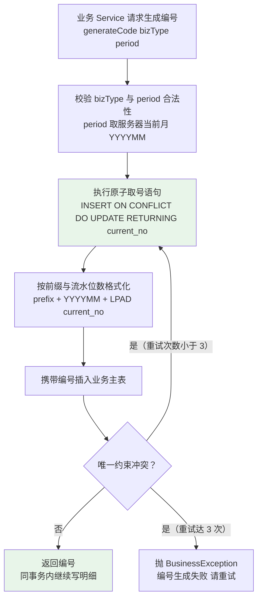

**伪代码：**

```java
/**
 * 生成单据编号（SYS-07）
 * 事务行为：与调用方业务写操作同事务（Propagation.REQUIRED）；
 * 取号语句自身的原子性由数据库保证，不依赖事务隔离级别。
 */
@Override
public String generateCode(BizTypeEnum bizType, String period) {
    int retry = 0;
    while (retry < MAX_CODE_RETRY) {                       // MAX_CODE_RETRY = 3
        // 1. 原子取号：不存在则插入 current_no=1，存在则 +1，并 RETURNING 当前值
        Long currentNo = codeSequenceMapper.nextVal(bizType.getCode(), period);
        // 2. 格式化：前缀 + YYYYMM + 3 位流水（超 999 按参数扩位）
        int width = sysParamService.getInt("code.sequence.width", 3);
        String code = bizType.getPrefix() + period + StringUtils.leftPad(currentNo.toString(), width, '0');
        // 3. 返回；由调用方插入业务主表，唯一约束冲突（DuplicateKeyException）时回到循环重试
        return code;
    }
    log.warn("编号生成冲突重试达到上限, bizType={}, period={}", bizType, period);
    throw new BusinessException(ErrorCode.CODE_GENERATE_RETRY_EXCEED);
}
```

**复杂度：** 单次取号为一次索引命中的单行写（O(1)）；并发冲突为极小概率事件，重试上限 3 次，最坏 O(3)。

### 1.4 统一字段与枚举约定（状态类字段全表汇总）

**全局必备字段（`BaseEntity` 统一承载，业务代码不得重复定义）：** `id`（`BIGSERIAL`）、`create_by`、`create_time`、`update_by`、`update_time`、`version`（`INT` 乐观锁）、`is_deleted`（`SMALLINT` 逻辑删除）、`remark`。

| 枚举类 | 承载字段 | 取值 | 语义 | 所属表 | 需求 |
|-------|---------|------|------|--------|------|
| `MaterialTypeEnum` | `base_material.material_type` | 1/2/3/4/5 | 1-原材料 2-半成品 3-成品 4-辅料 5-包装材料 | `base_material` | MD-02 |
| `SourceTypeEnum` | `base_material.source_type` | 1/2/3 | 1-自制 2-外购 3-外协 | `base_material` | MD-02 |
| `AbcClassEnum` | `base_material.abc_class` | A/B/C | A-高价值重点管控 B-中 C-低 | `base_material` | MD-03 |
| `CostMethodEnum` | `base_material.cost_method` | 0/1 | **0-移动加权平均（本期唯一实现）** 1-先进先出（扩展位，本期不实现算法） | `base_material` | MD-04 |
| `MaterialStatusEnum` | `base_material.status` | 0/1/2/3 | 0-新建 1-审核 2-启用 3-停用 | `base_material` | MD-05 |
| `CategoryStatusEnum` | `base_material_category.status` | 0/1 | 0-启用 1-停用 | `base_material_category` | MD-06 |
| `BomStatusEnum` | `base_bom.status` | 0/1/2/3 | 0-草稿 1-审核 2-生效 3-历史 | `base_bom` | BOM-03、BOM-05 |
| `EnableStatusEnum` | `base_customer.status`、`base_supplier.status` | 0/1 | 0-停用 1-启用 | `base_customer`、`base_supplier` | CS-01、CS-02 |
| `CustomerLevelEnum` | `base_customer.customer_level` | 1/2/3 | 1-战略 2-重点 3-普通 | `base_customer` | CS-03 |
| `SupplierGradeEnum` | `base_supplier.grade` | A/B/C | 供应商评级 | `base_supplier` | CS-02 |
| `SalOrderStatusEnum` | `sal_order.order_status` | 0/1/2/3/4 | 0-草稿 1-审核 2-部分发货 3-已发货 4-已关闭 | `sal_order` | SAL-01、SAL-05 |
| `ApprovalStatusEnum` | `sal_order.approval_status`、通用审批 | 0/1/2 | 0-待审 1-通过 2-驳回 | 单据主表 | SAL-02、SAL-04 |
| `PurOrderStatusEnum` | `pur_order.order_status` | 0/1/2/3/4 | 0-草稿 1-审核 2-部分收货 3-已收货 4-已关闭 | `pur_order` | PUR-02 |
| `SettlementStatusEnum` | `pur_order.settlement_status` | 0/1/2 | 0-未结算 1-部分结算 2-已结算 | `pur_order` | PUR-05 |
| `ReceiptStatusEnum` | `pur_receipt.status` | 0/1/2/3 | 0-待检 1-合格入库 2-部分合格 3-退货 | `pur_receipt` | PUR-03 |
| `MfgOrderStatusEnum` | `mf_order.order_status` | **0/1/2/3/4/5** | **0-计划 1-已下达 2-领料中 3-加工中 4-已完工 5-已关闭** | `mf_order` | MFG-04 |
| `MfgOrderTypeEnum` | `mf_order.order_type` | 1/2 | 1-自产工单 2-委外工单 | `mf_order` | MFG-10 |
| `MrpPlanStatusEnum` | `mf_mrp_plan.plan_status` | 0/1/2 | 0-新生成 1-已转 2-已关闭 | `mf_mrp_plan` | MFG-03 |
| `MrpSuggestTypeEnum` | `mf_mrp_plan_item.suggest_type` | 1/2 | 1-采购建议 2-生产建议 | `mf_mrp_plan_item` | MFG-03 |
| `MrpConvertedStatusEnum` | `mf_mrp_plan_item.converted_status` | 0/1/2 | 0-未转 1-已转采购单 2-已转工单 | `mf_mrp_plan_item` | MFG-03 |
| `TransTypeEnum` | `inv_transaction.trans_type` | **10/20/30/40/50/60/70/80/90** | 10-采购入库 20-生产入库 30-销售出库 40-生产领料 50-调拨入库 60-调拨出库 70-盘盈 80-盘亏 **90-期初建账** | `inv_transaction` | INV-02、INV-03、INV-11 |
| `SourceBizTypeEnum` | `inv_transaction.source_biz_type`、`fin_voucher.source_biz_type` | 见下表 | 来源单据类型标识（大写蛇形） | 流水/凭证 | INV-09、FIN-01 |
| `StocktakeStatusEnum` | `inv_stocktake.status` | 0/1/2/3/4 | 0-草稿 1-冻结盘点中 2-待审批 3-已审批 4-已关闭 | `inv_stocktake` | INV-06 |
| `TransferStatusEnum` | `inv_transfer.status` | 0/1/2 | 0-草稿 1-已审核 2-已关闭 | `inv_transfer` | INV-10 |
| `VoucherStatusEnum` | `fin_voucher.voucher_status` | 0/1/2 | 0-草稿 1-已过账 2-已红冲 | `fin_voucher` | FIN-01 |
| `VoucherTypeEnum` | `fin_voucher.voucher_type` | 1/2/3 | 1-记账凭证 2-红字凭证 3-期初调账凭证 | `fin_voucher` | FIN-01、FIN-09 |
| `DirectionEnum` | `fin_voucher_entry.direction` | 1/2 | 1-借 2-贷 | `fin_voucher_entry` | FIN-01 |
| `ArApStatusEnum` | `fin_receivable.status`、`fin_payable.status` | 0/1/2/3 | 0-未核销 1-部分核销 2-已核销 3-已红冲 | 应收/应付 | FIN-02、FIN-03 |
| `PayableSourceEnum` | `fin_payable.payable_source` | 1/2 | 1-暂估应付 2-正式应付 | `fin_payable` | PUR-06、FIN-03 |
| `MatchStatusEnum` | `pur_invoice_match.match_status` | 0/1/2/3 | 0-待匹配 1-匹配通过 2-超容差待处理 3-已处理 | 三单匹配 | PUR-05 |
| `MatchDiffTypeEnum` | `pur_invoice_match.diff_type` | 1/2/3/4 | 1-数量差异 2-单价差异 3-无订单 4-无收货 | 三单匹配 | PUR-05 |
| `PeriodStatusEnum` | `fin_period.status` | 0/1 | 0-开放 1-已关闭 | `fin_period` | FIN-08 |
| `AlertStatusEnum` | 预警类表 `handle_status` | 0/1/2 | 0-未处理 1-已转申请 2-已忽略 | 安全库存/呆滞预警 | INV-07、INV-08 |
| `AssetStatusEnum` | `fin_asset.status` | 0/1/2/3 | 0-在用 1-闲置 2-报废 3-已处置 | `fin_asset` | FIN-06 |
| `OperateTypeEnum` | `sys_audit_log.operate_type` | CREATE/UPDATE/APPROVE/REJECT/DELETE/CLOSE/UNAPPROVE/POST/REVERSE/EXPORT/IMPORT | 审计操作类型 | `sys_audit_log` | SYS-05 |
| `DataScopeEnum` | `sys_role.data_scope` | 1~6/9 | 1-全部 2-本组织及下级 3-本组织 4-本部门及下级 5-本部门 6-仅本人 9-自定义 | `sys_role` | SYS-04 |

**`SourceBizTypeEnum` 取值表（流水与凭证共用的来源标识）：**

| 取值 | 来源单据 | 生成流水 `trans_type` | 生成凭证类型 |
|------|---------|---------------------|-------------|
| `PURCHASE_RECEIPT` | 采购收货单 | 10 | 暂估应付凭证 |
| `PURCHASE_RETURN` | 采购退货单 | 60 | 应付冲减/红字凭证 |
| `MFG_COMPLETE` | 完工入库单 | 20 | 完工入库凭证 |
| `MFG_ISSUE` | 生产领料单 | 40 | 生产领料凭证 |
| `SALES_SHIPMENT` | 销售出库单 | 30 | 销售成本结转凭证 |
| `SALES_RETURN` | 销售退货单 | 20（退货入库） | 销售退货红字凭证 |
| `INV_TRANSFER` | 调拨单 | 60 + 50（成对） | 不生成损益凭证（按成本价结转） |
| `INV_STOCKTAKE` | 盘点单 | 70 / 80 | 盘盈盘亏凭证 |
| `INV_OPENING` | 期初库存建账 | 90 | 期初调账凭证 |
| `PUR_INVOICE_MATCH` | 三单匹配 | —— | 暂估红冲 + 正式应付凭证 |
| `SAL_INVOICE` | 销售开票登记 | —— | 收入确认凭证 |
| `FIN_RECEIPT` / `FIN_PAYMENT` | 收款单 / 付款单 | —— | 核销凭证 |
| `FIN_DEPRECIATION` | 固定资产折旧 | —— | 折旧凭证 |
| `FIN_PERIOD_CLOSE` | 期末结转 | —— | 结转凭证 |

### 1.5 事务与幂等通用约定

**事务约定：**

| 场景 | 约定 |
|------|------|
| 增删改 | Service 实现类方法**必须** `@Transactional(rollbackFor = Exception.class)`；事务边界在 Service 层，Controller 不开事务 |
| 只读查询 | 查询方法加 `@Transactional(readOnly = true)` |
| 传播行为 | 默认 `Propagation.REQUIRED`（跨模块调用同事务）；审计/日志落库 `Propagation.REQUIRES_NEW` |
| 一个业务动作 = 一个事务 | 单据头 + 明细 + 流水 + 余额 + 凭证 + 状态回写**在同一事务内**；任一步失败**整体回滚** |
| 缓存 | **禁止在事务内操作缓存**；统一挂 `TransactionSynchronizationManager.registerSynchronization(...)` 的 `afterCommit` 回调清理 |
| 长事务规避 | ①外部接口（OA/税控）调用**禁止**放在事务内，改为"事务提交后异步触发 + 状态机兜底"；②MRP / 成本核算按**分页批次短事务**提交（每批 ≤500 条）；③导出与文件上传不占事务 |
| 乐观锁 | 更新统一带 `version` 条件（MyBatis-Plus `OptimisticLockerInnerInterceptor`）；冲突处理见 1.5.3 |
| 跨模块 | 同库单事务；**禁止跨模块直接操作对方 Mapper/表**（库存域更新余额必须由库存域 Service 完成，财务域凭证生成必须调用财务域 Service） |

**幂等约定（五类关键操作，A-04 / I-04）：**

| 序 | 幂等场景 | 幂等键（唯一性依据） | 实现层次 | 重复请求行为 |
|----|---------|-------------------|---------|------------|
| 1 | 单据创建（SO/PO/MO/DN/GR/MI…） | ①请求头 `Idempotent-Key`（UUID）；②业务表编号唯一约束 | Redis 缓存"键 → 结果"（TTL 24h）+ DB 唯一约束兜底 | 返回首次结果，不重复落库 |
| 2 | 单据动作（提交/审核/驳回/关闭/反审核） | 状态机守卫（前置状态白名单）+ `version` 乐观锁 | Service 层状态校验 | 返回"状态不匹配"业务提示，不产生副作用 |
| 3 | 库存流水生成 | `source_biz_type + source_biz_id + material_id + trans_type + warehouse_id + location_id + batch_no` 唯一约束 | DB 唯一约束 + 生成前查重 | 不产生第二条流水 |
| 4 | 凭证生成 | `source_biz_type + source_biz_id + voucher_type` 唯一约束 | DB 唯一约束 + 生成前查重 | 直接返回已有凭证 |
| 5 | MRP 建议转单 | 建议行 `converted_status`（0-未转/1-已转采购单/2-已转工单） | 状态标记 + `version` 乐观锁 | 不生成第二张下游单据 |

**幂等键处理步骤（统一）：**

1. 请求进入 Service 前，由 `IdempotentAspect`（或 Controller 层 `IdempotentService`）读取 `Idempotent-Key`；
2. `SETNX` 写 Redis `{模块}:{功能}:idem:{idempotentKey}`（TTL 24 小时）；**写成功** → 放行；**已存在** → 读取缓存结果直接返回；
3. 业务执行成功后，将 `code/message/业务主键` 写入该 Key（**业务事务提交后**写，避免回滚后留下错误的"已完成"标记）；
4. 业务异常时删除 Key（允许客户端重试）；
5. Redis 不可用时**降级为不拦截**（依赖数据库唯一约束与状态机守卫兜底），并记录 WARN。

**乐观锁失败处理策略（统一，INV-09 / ADR-08）：**

| 项 | 约定 |
|----|------|
| 重试次数 | **≤3 次** |
| 退避间隔 | 第 1 次立即重试；第 2、3 次间隔 20ms、50ms（固定退避，不做随机抖动，保证可测试） |
| 重试实现 | 在**同一事务内**重新"读取当前值 → 重算 after_qty → 条件更新"；不新建事务（避免部分提交） |
| 失败终态 | 抛 `BusinessException(14001-14999 库存细化码)`，消息形如"库存记录已被其他操作更新，请重试"，同时 `log.warn("乐观锁冲突重试达上限, materialId={}, warehouseId={}", ...)` |
| 告警 | WARN 日志 + 计数器上报（`stock.optimistic-lock.conflict`），阈值触发运维告警（INV-09 验收要点⑤） |
| 禁止 | 严禁"无 version 条件更新"与"捕获异常后静默覆盖" |

### 1.6 异常与错误码使用约定

**抛出规范：**

| 场景 | 处理 |
|------|------|
| 业务校验失败（库存不足、状态非法、重复编码、超容差） | **直接抛 `BusinessException(ErrorCode.XXX, 参数化消息)`**，由 `GlobalExceptionHandler` 统一转换为 `Result`；**严禁 try-catch 吞异常** |
| 参数校验失败 | 用 `@Valid` + JSR-303 注解在 DTO 上声明，异常统一由全局处理器汇总为 400 |
| 资源不存在 | 抛 `BusinessException(ErrorCode.XXX_NOT_FOUND)`；对外 HTTP 状态 404 |
| 乐观锁冲突 | 抛 `BusinessException(ErrorCode.STOCK_VERSION_CONFLICT)`（库存域）或对应模块细化码 |
| 用户可读消息 | 消息**必须含业务标识**（单据号、物料编码、数值），如"物料 01-03-000128 可用库存 100，不足 120"；禁止抛裸英文异常或堆栈 |
| 系统异常 | 未捕获异常由全局处理器记 ERROR（含 `traceId`，**不打印敏感字段**），返回 500 |

**错误码区间与内部细化分配（`ErrorCode` 枚举为唯一来源，落点在已划定区间内）：**

| 区间 | 模块 | 本文细化分配（建议） |
|------|------|-------------------|
| 200 | 成功 | —— |
| 10001-10999 | 通用（含系统管理与认证） | `10001-10099` 参数校验；`10101-10199` 认证与会话；`10201-10299` 权限与数据权限；`10301-10399` 系统管理（用户/角色/字典/参数/编号规则）；`10401-10499` 审计与附件；`10501-10599` 批量导入与导出；`10601-10699` 并发冲突与幂等 |
| 11001-11999 | 物料/BOM（含客户与供应商） | `11001-11049` 物料编码与分类；`11050-11099` 物料属性与状态；`11101-11159` BOM 结构与闭环/层级；`11160-11199` BOM 版本与审核；`11201-11249` 客户；`11250-11299` 供应商 |
| 12001-12999 | 采购 | `12001-12049` 采购申请；`12050-12099` 采购订单；`12101-12159` 收货与质检；`12160-12199` 采购退货；`12201-12249` 三单匹配与暂估；`12250-12299` 采购价格与绩效 |
| 13001-13999 | 销售 | `13001-13049` 销售订单与信用；`13050-13099` 订单变更；`13101-13149` 发货与出库；`13150-13199` 销售退货；`13201-13249` 价格策略 |
| 14001-14999 | 库存 | `14001-14049` 库存不足与可用量；`14050-14099` 批次与保质期；`14101-14149` 盘点；`14150-14199` 调拨；`14201-14249` 乐观锁与对账；`14250-14299` 期初建账 |
| 15001-15999 | 生产制造 | `15001-15049` 工单状态与流转；`15050-15099` 领料与超定额；`15101-15149` 报工；`15150-15199` 完工入库；`15201-15249` MRP 运算与转单；`15250-15299` 委外 |
| 16001-16999 | 财务 | `16001-16049` 凭证生成与借贷平衡；`16050-16099` 过账与红冲；`16101-16149` 应收；`16150-16199` 应付；`16201-16249` 存货核算；`16250-16299` 工单成本；`16301-16349` 固定资产；`16350-16399` 期间与期末 |
| 17001-17999 | 报表 | 报表参数、口径与导出类错误（阶段二统一裁定新增区间） |
| 18001-18999 | 系统管理 | 用户/角色/菜单/字典/参数/编号规则/审计/附件的独立区间（阶段二统一裁定新增区间） |

> **与概要设计的一致性说明：** `01-概要设计说明书.md` 4.2 曾建议 SYS 与 RPT 归入 10001-10999。本阶段最终裁定：**为报表（17001-17999）与系统管理（18001-18999）单列区间**，使其与《阶段计划文档》D9/D2 的模块边界一一对应，且不改动 10001-16999 原有区间边界；该差异登记为评审问题并统一在 `ErrorCode` 枚举与《接口设计文档》中体现。10001-10999 仍保留通用错误（参数校验、认证、权限、幂等冲突）语义。

---

## 二、公共与技术支撑详细设计（D1 / D2）

### 2.1 `Result<T>` 统一响应体（SYS-08、D1）

**承载类：** `me.north30.erp.common.result.Result<T>`（`erp-common`）。

| 字段 | 类型 | 必填 | 说明 |
|------|------|------|------|
| `code` | `Integer` | 是 | 业务状态码；成功固定 `200`；失败取 HTTP 语义码（400/401/403/404/409/422/500）或模块业务码（10001-18999） |
| `message` | `String` | 是 | 面向业务人员可读的提示；含单据号/物料编码/数值；成功固定"操作成功" |
| `data` | `T` | 否 | 业务数据；分页数据置于 `data` 内 |
| `timestamp` | `Long` | 是 | 服务器时间戳（毫秒） |
| `traceId` | `String` | 否 | 链路追踪 ID；取自请求头 `X-Request-Id`，缺失时服务端生成（UUID 去连字符） |

**分页结构（`PageResult<T>`，置于 `data` 内）：** `list`（当前页数据）、`total`（总条数）、`pageNum`（当前页码）、`pageSize`（每页条数）、`pages`（总页数）。**字段名与《API 设计与规范文档》1.3 逐字一致**。

**构造约定（静态方法）：**

| 方法 | 行为 |
|------|------|
| `Result.success()` / `Result.success(T data)` | `code=200`、`message="操作成功"`、`traceId` 由 `TraceIdHolder` 自动填充 |
| `Result.success(String message, T data)` | 需要业务提示语的成功（如"审核通过"） |
| `Result.fail(ErrorCode errorCode)` | `code=errorCode.getCode()`、`message=errorCode.getMessage()` |
| `Result.fail(int code, String message)` | 自定义码与消息（仅限 `ErrorCode` 未覆盖的框架级异常，业务代码**禁止**直接使用） |
| `Result.fail(ErrorCode errorCode, Object... args)` | 参数化消息（如"物料 {} 可用库存 {}，不足 {}"），由 `MessageFormat` 填充 |

**约定：** ①Controller 返回类型**一律** `Result<T>` 或 `Result<PageResult<VO>>`；②`data` 中**禁止**出现 Entity（防 `version`、密码密文等外泄）；③`code` 与 HTTP 状态码分离：业务语义由 `code` 承载（HTTP 200 + 业务码 14001），框架级异常由 HTTP 状态承载（401/403/500）。

### 2.2 `GlobalExceptionHandler` 处理矩阵（SYS-08）

**承载类：** `me.north30.erp.common.exception.GlobalExceptionHandler`（`@RestControllerAdvice`）。

| 异常类型 | HTTP 状态 | 响应 `code` | 响应 `message` 生成方式 | 日志级别 |
|---------|----------|------------|-----------------------|---------|
| `BusinessException` | 200 | 异常携带的业务码（11001-18999） | 直接取异常消息（已含业务标识） | `WARN` |
| `MethodArgumentNotValidException` / `BindException` | 400 | `10001` | 汇总字段级错误：`"字段[unitPrice] 参数校验失败：必须大于 0"`（多字段用 `;` 连接） | `WARN` |
| `ConstraintViolationException`（方法参数校验） | 400 | `10001` | 同上（取 `propertyPath + message`） | `WARN` |
| `HttpMessageNotReadableException`（JSON 解析失败） | 400 | `10002` | `"请求体格式错误，请检查 JSON 结构"` | `WARN` |
| `MissingServletRequestParameterException` / `MethodArgumentTypeMismatchException` | 400 | `10003` | `"缺少必填参数 pageNum"` / `"参数 id 类型错误"` | `WARN` |
| `AuthenticationException`（Token 缺失/过期/篡改/类型错误） | 401 | `401` | `"未认证或登录已过期，请重新登录"` | `INFO`（登录失败场景 `WARN`） |
| `AccessDeniedException`（接口越权、数据范围越界） | 403 | `403` | `"无权限访问该资源"` | `WARN` |
| `NoHandlerFoundException` / `NoResourceFoundException` | 404 | `404` | `"请求的资源不存在"` | `INFO` |
| 业务查询为空但语义要求存在 | 200 | 模块 `*_NOT_FOUND` 细化码 | 如 `"销售订单 SO202608001 不存在"` | `INFO` |
| `OptimisticLockingFailureException` / `MybatisPlusException`（版本冲突） | 409 | `10601` | `"数据已被其他操作修改，请重试"` | `WARN` |
| `DuplicateKeyException`（唯一约束冲突） | 409 | `10602` | 按约束名映射：编号冲突 → `"单据编号已存在，请重试"`；幂等冲突 → 返回首次结果 | `WARN` |
| 幂等键冲突（重复提交） | 409 | `10603` | `"操作正在处理中，请勿重复提交"` | `INFO` |
| `MethodNotAllowedException`（HTTP 方法不匹配） | 405 | `10004` | `"请求方法不被支持"` | `WARN` |
| `BizRuleException`（业务规则限制，等同 BusinessException 特化） | 422 | 模块业务码 | 如"库存不足""状态不匹配" | `WARN` |
| 外部接口异常（OA/税控超时） | 200 | `10501-10599` | `"外部接口调用失败，已记录并将自动重试"` | `ERROR` |
| `Exception`（兜底） | 500 | `500` | `"系统繁忙，请稍后重试（traceId: {traceId}）"`，**不回传堆栈** | `ERROR`（含 `traceId`、请求路径、参数摘要，**不含敏感字段**） |

**处理步骤（统一）：**

1. `@ExceptionHandler` 捕获异常 → 2. 生成/读取 `traceId` → 3. 按上表映射 `code/message` → 4. 记录日志（级别按上表；`ERROR` 级打印异常栈但**不得包含**密码、密钥、完整银行账号、身份证号）→ 5. 返回 `Result`（`timestamp` 为服务器当前毫秒）。

### 2.3 `BaseEntity` 审计字段与 MyBatis-Plus 自动填充

**承载类：** `me.north30.erp.common.entity.BaseEntity`；实体继承后**不得重复定义**以下字段。

| 字段 | Java 类型 | 填充时机 | 实现要点 |
|------|----------|---------|---------|
| `id` | `Long` | 插入时由数据库 `BIGSERIAL` 生成 | MyBatis-Plus `@TableId(type = IdType.AUTO)`；对外接口**不暴露**自增规则（I-03），VO 中使用 `业务主键（单据号/编码）` |
| `createBy` / `createTime` | `String` / `LocalDateTime` | `INSERT` 填充 | `@TableField(fill = FieldFill.INSERT)`；取值 `SecurityUtils.getCurrentUsername()`（无上下文时取 `"system"`） |
| `updateBy` / `updateTime` | `String` / `LocalDateTime` | `INSERT` + `UPDATE` 填充 | `@TableField(fill = FieldFill.INSERT_UPDATE)` |
| `version` | `Integer` | 插入置 0；更新由乐观锁插件自增 | `@Version` + `OptimisticLockerInnerInterceptor` |
| `isDeleted` | `Integer`（映射 `SMALLINT`） | 插入置 0 | `@TableLogic(value = "0", delval = "1")`；查询自动追加 `is_deleted = 0` |
| `remark` | `String` | 业务写入 | 长度 ≤500 |

**`MetaObjectHandler` 实现要点：**

```java
@Component
public class AuditMetaObjectHandler implements MetaObjectHandler {
    @Override
    public void insertFill(MetaObject metaObject) {
        String user = SecurityUtils.getCurrentUsernameOrSystem();   // 无上下文取 system
        LocalDateTime now = LocalDateTime.now();
        strictInsertFill(metaObject, "createBy", String.class, user);
        strictInsertFill(metaObject, "createTime", LocalDateTime.class, now);
        strictInsertFill(metaObject, "updateBy", String.class, user);
        strictInsertFill(metaObject, "updateTime", LocalDateTime.class, now);
        strictInsertFill(metaObject, "version", Integer.class, 0);
        strictInsertFill(metaObject, "isDeleted", Integer.class, 0);
    }

    @Override
    public void updateFill(MetaObject metaObject) {
        strictUpdateFill(metaObject, "updateBy", String.class, SecurityUtils.getCurrentUsernameOrSystem());
        strictUpdateFill(metaObject, "updateTime", LocalDateTime.class, LocalDateTime.now());
    }
}
```

**约定：** ①字段名用 `strictInsertFill`（仅在字段为 `null` 时填充），业务显式赋值优先；②`MyBatisPlusConfig` 中必须注册 `PaginationInnerInterceptor`（依赖 `mybatis-plus-jsqlparser`）、`OptimisticLockerInnerInterceptor`、`BlockAttackInnerInterceptor`（防全表更新/删除）；③逻辑删除后唯一约束仍需满足：**编号不复用**（作废走状态关闭，不释放编号）；④跨模块传递**不传 Entity**。

### 2.4 `@AuditLog` AOP 详细设计（SYS-05）

**注解定义（`me.north30.erp.common.audit.AuditLog`）：**

| 属性 | 类型 | 必填 | 说明 |
|------|------|------|------|
| `module` | `String`（枚举 `AuditModuleEnum` 名字） | 是 | 业务模块：`SYSTEM`/`BASE`/`PURCHASE`/`SALES`/`INVENTORY`/`MANUFACTURING`/`FINANCE` |
| `operateType` | `OperateTypeEnum` | 是 | `CREATE`/`UPDATE`/`APPROVE`/`REJECT`/`DELETE`/`CLOSE`/`UNAPPROVE`/`POST`/`REVERSE`/`EXPORT`/`IMPORT` |
| `bizCode` | `String` | 是 | 单据号取值：SpEL 表达式（如 `#dto.orderCode`）或 `#id` + 方法返回单据号的约定（`#result.data.orderCode`） |
| `bizType` | `String` | 否 | 业务类型标识（与 `SourceBizTypeEnum` 一致），默认空 |
| `content` | `String` | 否 | 业务描述模板（SpEL），用于日志可读性（如 `"审核销售订单 #id"`） |
| `compareBefore` | `boolean` | 否 | 是否采集变更前 JSON，默认 `true`（`CREATE` 场景置 `false`） |

**切面（`AuditLogAspect`）处理时机与步骤：**

1. **`@Around` 拦截**被注解方法（`@Pointcut("@annotation(auditLog)")`）；
2. **前置采集**：若 `compareBefore = true` 且操作为 `UPDATE`/`APPROVE`/`DELETE`，通过 `bizId` 解析器（`AuditBizFetcher`，由各域实现 `fetchById`）查询原实体，序列化为白名单 JSON（**变更前**）；
3. **执行目标方法**（业务事务内，切面**不开启事务**）；
4. **后置采集**：方法成功返回后，若为 `UPDATE`，再次查询当前实体并序列化（**变更后**）；`CREATE` 场景直接序列化返回的单据 VO；
5. **组装审计记录**：操作人（`SecurityUtils`）、操作时间（服务器时间）、IP（`X-Forwarded-For` 首个非 `unknown` 值，否则 `RemoteAddr`）、操作类型、单据号、变更前后 JSON、`traceId`、结果（成功/失败）、错误码；
6. **落库**：注册事务同步回调，在**业务事务提交后**执行（`Propagation.REQUIRES_NEW` 或 `@Async` 异步落库）；异常时立即以 `REQUIRES_NEW` 落"失败记录"；
7. **异常分支**：捕获 `Throwable` 时记录失败结果后**原样抛出**（不吞异常、不影响回滚）。

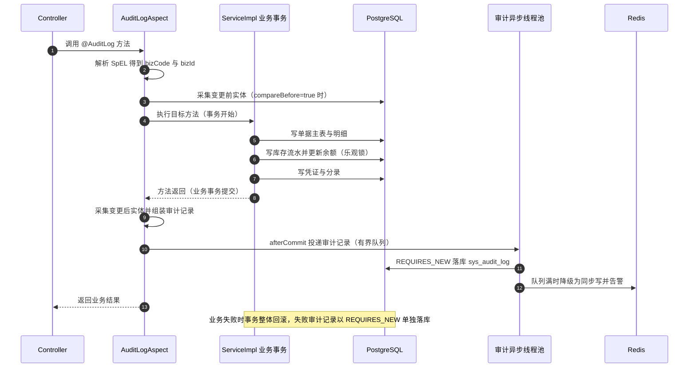

**落库表 `sys_audit_log`：** `module`、`operate_type`、`biz_type`、`biz_code`、`operate_by`、`operate_time`、`operate_ip`、`before_json`、`after_json`、`result`（0-失败 1-成功）、`error_code`、`trace_id`、`content`。

| 关键约定 | 内容 |
|---------|------|
| 覆盖范围 | 销售订单、采购订单、生产工单、出入库单的创建/修改/审核/删除，以及凭证过账/红冲、期间重开、权限与参数变更、计价方法变更、BOM 审核、超定额领料审批、特批（SAL-02/SAL-04） |
| JSON 白名单 | 仅序列化注解 `@AuditField` 标注的字段（或用 DTO 白名单），**排除**大字段（附件内容）、密码密文、银行账号全码 |
| 长度上限 | 单条 JSON 长度上限由参数 `audit.json.max-length`（默认 4000 字符）控制，超限截断并追加 `"...(截断)"` |
| 异步与降级 | `@Async("auditExecutor")` 线程池：核心 2 / 最大 4 / 队列 2000（有界）；队列满时**降级同步写**并 `log.error` 告警；写日志失败**不影响主业务** |
| 批量合并 | 批量操作（批量审核/批量删除）合并为 1 条审计记录，记录单据号清单（上限 50 个，超出记录条数） |
| 查询能力 | 支持按 `biz_code`（≤3 秒）、`operate_by`、`operate_type`、`operate_time` 范围检索 |
| 不可删除 | **不提供**删除接口；在线保留 ≥180 天，超期归档为冷数据表（仍可按单据号与时间检索） |
| 索引 | `idx_sys_audit_log_biz_code`、`idx_sys_audit_log_operate_time`、`idx_sys_audit_log_operate_by`（单表索引 ≤6 个） |

### 2.5 JWT 详细设计（SYS-01、SYS-02、SYS-09）

**承载类：** `me.north30.erp.common.jwt.JwtTokenProvider`（签发/校验/解析）、`erp-system` 的 `AuthService`/`AuthServiceImpl`、`erp-bootstrap` 的 `SecurityConfig`。

**实现结论：** `spring-boot-starter-oauth2-resource-server` + `NimbusJwtEncoder` / `NimbusJwtDecoder`（**禁用 jjwt**）；算法 **HS256**（密钥 ≥256 bit，环境变量注入，禁止入库入日志）。

**Token 签发步骤（登录）：**

1. 校验验证码（`captchaKey` + `captcha` 存 Redis，TTL 5 分钟，**一次有效**）；
2. 按 `username` 查 `sys_user`（含逻辑删除过滤），校验：账号存在 → 未停用 → 未锁定（Redis `system:login:fail:{username}` 计数 < 5）→ 未离职状态；
3. `BCryptPasswordEncoder.matches(rawPassword, sysUser.getPassword())` 校验密码；
4. 密码到期校验（`password_update_time + 90 天 < now` → 返回 `10102`，仅允许访问修改密码接口）；
5. 校验通过：查询用户角色与权限点（`sys_user_role` → `sys_role_menu`），组装 claim；
6. `NimbusJwtEncoder` 签发 access token（TTL 120 分钟）与 refresh token（TTL 7 天），二者 `jti` 不同；
7. 写 Redis 会话：`system:session:{userId}:{jti}` = `"1"`，TTL 与相应 token 剩余有效期一致；refresh token 的 `jti` 单独登记；
8. 写 `sys_login_log`（成功）；返回 `accessToken`、`tokenType=Bearer`、`expiresIn`、`refreshToken`、`userInfo`。
9. 失败分支：密码错误 → `system:login:fail:{username}` 计数 +1（TTL 30 分钟），达 5 次置锁定标记，返回 `10101`；写 `sys_login_log`（失败）。

**claim 字段表：**

| claim | 类型 | 内容 | 用途 |
|-------|------|------|------|
| `sub` | String | 用户 ID（字符串化） | 主身份标识 |
| `username` | String | 用户名 | 日志与审计留痕 |
| `roles` | Array[String] | 角色编码集合 | 角色级鉴权 |
| `perms` | Array[String] | 权限点集合（如 `sales:order:approve`） | 接口级鉴权（SYS-03） |
| `dataScope` | Number | 数据范围档位（1~6、9） | 数据级过滤基线（SYS-04） |
| `orgId` | Number | 所属组织 ID | 数据权限计算与组织维度报表 |
| `deptId` | Number | 所属部门 ID | 数据权限计算 |
| `warehouseIds` | Array[Number] | 可访问仓库集合 | 库存数据权限 |
| `type` | String | `access` / `refresh` | 防 refresh token 直接访问业务接口 |
| `iat` / `exp` | Number | 签发/过期时间（秒） | 有效期校验 |
| `iss` | String | `north30-erp` | 签发者校验 |
| `jti` | String | 令牌唯一 ID（UUID） | 登出失效与刷新失效 |

**Token 校验流程（每次请求）：**

1. `NimbusJwtDecoder`（`SecretKeyJwtDecoder`）验签 + 校验 `exp`/`iss`；失败 → 401；
2. 校验 `type == "access"`；`refresh` 访问业务接口 → 401（`10103`）；
3. 校验 Redis 会话存在（`system:session:{userId}:{jti}`）；不存在（登出/停用/会话过期）→ 401；
4. 校验用户状态：读取用户状态缓存（`system:user:status:{userId}`，TTL 5 分钟，缓存穿透时回源 DB）；停用 → 401 并删除会话；
5. 装载 `Authentication`（`roles`/`perms`/`dataScope`/`orgId`/`warehouseIds` 放入 `UserContext`）；
6. 接口级鉴权：比对 `perms` 与接口声明权限点；缺失 → 403。

**登出与令牌失效方案：**

| 场景 | 处理 |
|------|------|
| 登出 | 删除 `system:session:{userId}:{jti}`；refresh token 的 `jti` 加入失效集合（TTL = 剩余有效期）；写 `sys_login_log`（登出） |
| 刷新 `/api/auth/refresh` | 校验 refresh token 的 `type=refresh`、`jti` 未失效 → 签发新 access token（**不延长 refresh token 有效期**，防无限续期）→ 旧 access token 不主动失效（依赖短 TTL 与 Redis 会话校验） |
| 账号停用 | 删除该用户全部会话 Key（按前缀扫描 `system:session:{userId}:*`）；用户下次请求 401 |
| 权限变更 | 删除用户权限缓存；≤5 分钟或重新登录后生效（SYS-03） |
| 令牌失效机制取舍 | **采用"Redis 会话白名单 + 短 TTL"而非纯黑名单**：①access token 120 分钟 TTL；②Redis 会话是"有效白名单"（登出/停用即时失效）；③不引入额外黑名单表；Redis 丢失时降级为"仅验签（TTL 内有效）"，不影响业务正确性（ADR-11） |
| 并发登录 | 允许同一用户多端登录（多 `jti` 并存）；不做单点登录限制 |

**`erp.jwt` 配置项：** `secret`（环境变量 `ERP_JWT_SECRET`，≥256 bit）、`access-token-ttl=120m`、`refresh-token-ttl=7d`、`issuer=north30-erp`、`login-fail-lock-threshold=5`、`login-fail-lock-duration=30m`、`ignore-urls`（`/api/auth/login`、`/api/auth/captcha`、`/api/auth/refresh`、`/v3/api-docs/**`、`/swagger-ui/**`、`/actuator/health`，**显式列举，禁止通配放开业务路径**）。

### 2.6 权限详细设计（SYS-03、SYS-04）

**RBAC 表关系：**

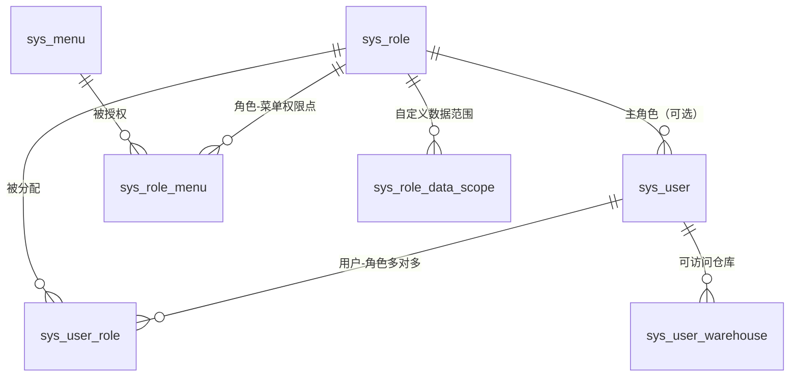

| 表 | 关键字段 | 说明 |
|----|---------|------|
| `sys_user` | `username`（唯一）、`password`（BCrypt）、`org_id`、`dept_id`、`status`、`password_update_time` | 用户主数据（SYS-02） |
| `sys_role` | `role_code`、`role_name`、`data_scope`（1~6、9）、`status` | 角色与数据范围档位 |
| `sys_menu` | `menu_type`（1-目录 2-菜单 3-按钮）、`perm_code`、`parent_id`、`sort`、`path`、`component` | 菜单树与按钮权限点 |
| `sys_user_role` | `user_id`、`role_id`、`is_primary` | 用户-角色多对多（多角色取权限并集） |
| `sys_role_menu` | `role_id`、`menu_id` | 角色-菜单/按钮授权 |
| `sys_role_data_scope` | `role_id`、`scope_type`（1-组织 2-人员）、`scope_value` | 自定义数据范围明细（`data_scope=9` 时生效） |
| `sys_user_warehouse` | `user_id`、`warehouse_id` | 可访问仓库（库存数据权限） |

**菜单与按钮权限编码规则：** `{模块}:{对象}:{动作}` 全小写、冒号分隔；动作取 `list / detail / create / update / delete / approve / reject / close / unapprove / export / import / issue / report / post / reverse`。示例：`sales:order:create`、`sales:order:approve`、`purchase:order:close`、`inventory:stocktake:approve`、`finance:voucher:post`、`system:auditlog:list`。菜单（目录/菜单）编码与前端路由一一对应；按钮权限编码与后端 `@PreAuthorize` 声明一一对应。

**接口级鉴权实现：**

1. 后端统一在 Controller 方法上声明 `@PreAuthorize("hasAuthority('sales:order:approve')")`；
2. Spring Security 将 `perms` claim 映射为 `GrantedAuthority`（`JwtAuthenticationConverter` 定制），`hasAuthority` 直接比对；
3. 未授权 → `AccessDeniedException` → 403（`Result.code=403`）；
4. 前端仅按 `perms` 控制菜单与按钮显隐，**不承担安全判定**（后端必须独立校验）。

**数据级（行权限）过滤实现机制：**

| 步骤 | 实现要点 |
|------|---------|
| 1. 取得当前用户上下文 | `UserContext`（ThreadLocal，由 `JwtAuthenticationFilter` 装载）：`userId`、`orgId`、`deptId`、`dataScope`、`roleIds`、`warehouseIds` |
| 2. 解析数据范围档位 | 多角色时取**最宽档位**（并集语义）：1-全部 > 2-本组织及下级 > 3-本组织 > 4-本部门及下级 > 5-本部门 > 6-仅本人 > 9-自定义 |
| 3. 构建过滤条件 | 按业务对象配置**过滤维度**，由 `DataScopeHelper` 统一构建 MyBatis-Plus `LambdaQueryWrapper` 片段：<br/>· 销售订单（`sal_order`）→ `owner_user_id`（客户负责人/业务员，`IN (本人)` 或按组织范围取用户集合）<br/>· 采购订单（`pur_order`）→ `buyer_id`（采购员）<br/>· 生产工单（`mf_order`）→ `org_id`（生产组织）<br/>· 库存（`inv_stock`、`inv_transaction`）→ `warehouse_id IN (warehouseIds)`<br/>· 应收/应付 → 客户/供应商负责人或组织维度 |
| 4. 应用位置 | **列表查询、详情查询（二次校验）、导出查询三处使用同一 `DataScopeHelper` 方法**；导出 SQL 与列表 SQL 复用同一 Wrapper，保证"导出行数 = 可见行数"（SYS-04 验收要点③） |
| 5. 详情越权防护 | 详情/导出按主键请求时，加载实体后调用 `dataScopeHelper.assertAccessible(entity)`；越界抛 `BusinessException(10201)` → 403（**禁止仅前端隐藏**） |
| 6. 组织层级解析 | "本组织及下级/本部门及下级"依赖 `sys_org`/`sys_dept` 的 `parent_id` 与 `path`（物化路径）字段一次性查出下级 ID 集合，结果缓存于 `system:scope:{userId}`（TTL 5 分钟） |
| 7. 自定义范围 | `data_scope=9` 时读取 `sys_role_data_scope`：`scope_type=1` → 组织 ID 集合展开为下级；`scope_type=2` → 直接使用人员 ID 集合 |

**字段级（列权限）过滤实现机制：**

| 步骤 | 实现要点 |
|------|---------|
| 1. 字段标记 | VO 字段用 `@SensitiveField(maskType = BANK_ACCOUNT / ID_CARD / PHONE / AMOUNT_RANGE)` 标注 |
| 2. 掩码判定 | 由 `FieldPermissionHelper` 按当前用户是否具备指定权限点（如 `finance:supplier:viewBankAccount`）决定是否掩码；金额类按角色决定"显示区间"或"显示精确值" |
| 3. 掩码规则 | 银行账号 `6222****1234`（保留前 4 后 4）；身份证 `3302**********1234`；手机号 `138****8888`；金额区间 `"10 万以下 / 10~50 万 / 50 万以上"` |
| 4. 生效位置 | VO 组装阶段统一调用（Controller 出口前由 `ResponseBodyAdvice` 兜底扫描一次）；**导出复用同一掩码方法** |
| 5. 禁止 | 禁止在 Entity 上做掩码（防"掩码后的值被回写数据库"）；禁止把敏感字段全码传给前端后再由前端掩码 |

### 2.7 分页/排序/动态查询通用约定

| 项 | 约定 |
|----|------|
| 入参基类 | 所有列表查询 DTO 继承 `PageQueryDTO`：`pageNum`（默认 1，最小 1）、`pageSize`（默认 20，**最大 200，超限抛 `10001`**）、`orderBy`（默认 `create_time`）、`orderDirection`（默认 `DESC`，仅 `ASC`/`DESC`） |
| 分页插件 | `PaginationInnerInterceptor(DbType.POSTGRE_SQL)`：`maxLimit = 200`、`overflow = false`（超上限抛异常而非返回空）、`optimizeJoin = true` |
| 排序白名单 | 每个 Mapper/VO 维护 `ORDER_BY_WHITE_LIST`（如 `create_time`、`order_date`、`order_code`、`total_amount`）；`orderBy` 不在白名单 → 抛 `10001` 并记录 WARN；`orderDirection` 非 `ASC/DESC` → 抛 `10001` |
| 动态查询 | 一律 `LambdaQueryWrapper`（单表）或 Mapper.xml `#{}`（多表/报表）；**禁止** `${}` 接收业务参数；`${}` 仅用于白名单校验后的排序片段 |
| 空值处理 | 查询条件为空字符串/NULL 时**不拼接**该条件（`StringUtils.isNotBlank`）；日期区间为左闭右开（`>= startTime AND < endTime+1d`） |
| N+1 禁止 | 关联数据用 `IN` 批量查询或 XML `JOIN` 一次查出；禁止在 `for`/`stream().map()` 内查库 |
| 深分页 | 单页上限 200 + 强校验即可满足本期需求；不做 `keyset` 分页（数据量级 100 万条流水，深分页次数受限） |
| 结果封装 | `Page<T>` → `PageResult<VO>`（`list/total/pageNum/pageSize/pages`），转换在 Service 层完成 |

### 2.8 Redis 使用详细设计（ADR-11、E-05）

| Key 模板 | 用途 | TTL | 更新时机 |
|---------|------|-----|---------|
| `system:session:{userId}:{jti}` | access token 会话白名单 | 120 分钟（与 token 一致） | 登录写、登出删、停用删、刷新重写 |
| `system:session:refresh:{userId}:{jti}` | refresh token 有效标记 | 7 天 | 登录写、登出删、刷新不变 |
| `system:login:fail:{username}` | 登录失败计数 | 30 分钟 | 失败 +1、成功删 |
| `system:captcha:{captchaKey}` | 图形验证码 | 5 分钟（一次有效） | 生成写、校验后删 |
| `system:dict:{dictType}` | 字典项缓存 | 30 分钟（±10% 抖动） | 读时重建；字典变更后**事务提交后**删除 |
| `system:param:{paramKey}` | 系统参数缓存 | 30 分钟 | 参数变更后删除（下次读取重建，≤1 分钟生效） |
| `system:user:status:{userId}` | 用户状态（停用即时生效） | 5 分钟 | 用户停用/启用后删除 |
| `system:scope:{userId}` | 数据范围展开的组织/人员 ID 集合 | 5 分钟 | 角色/组织变更后删除 |
| `base:material:{materialCode}` | 物料主数据缓存 | 30 分钟 | 物料变更后删除 |
| `base:material:plan:{materialId}` | 物料计划属性（MRP 高频读取） | 30 分钟 | 计划属性变更后删除 |
| `base:bom:structure:{parentMaterialId}:{version}` | BOM 结构（MRP 展开用） | 30 分钟 | BOM 审核生效/变更后删除 |
| `base:customer:{customerId}` | 客户主数据（含信用额度） | 10 分钟 | 客户变更后删除 |
| `base:supplier:{supplierId}` | 供应商主数据 | 10 分钟 | 供应商变更后删除 |
| `inventory:stock:{materialId}:{warehouseId}` | 库存热点聚合缓存 | 60 秒（容忍弱一致） | **先改 DB，事务提交后**删除 |
| `inventory:stock:alert:{warehouseId}` | 安全库存预警清单（缓存报表） | 5 分钟 | 预警任务生成后写；库存变动后不主动删（允许 ≤5 分钟延迟） |
| `purchase:order:lock:{orderCode}` | 单据编辑锁（防并发改单） | 30 秒 | 加锁-处理-释放（`try/finally`） |
| `sales:order:lock:{orderId}` | 单据编辑锁 | 30 秒 | 同上 |
| `{模块}:{功能}:idem:{idempotentKey}` | 幂等键（五类关键操作） | 24 小时 | 首次请求写结果；重复请求返回缓存结果 |
| `mrp:run:progress:{planCode}` | MRP 运算进度 | 2 小时 | 运算过程回写（`已处理/总数`） |
| `rpt:dashboard:{orgId}:{date}` | 仪表盘指标聚合结果 | 5 分钟 | 读时重建；日切后自然失效 |

**缓存一致性统一处理步骤：**

1. 读：`GET` 命中 → 返回；未命中 → 查 DB → 写缓存（**空值也缓存** `null`，TTL 60 秒，防穿透）；
2. 写：**先更新 DB**（事务内）→ 事务提交后 `afterCommit` 回调**删除**（不是更新）相关 Key → 下次读取重建；
3. 击穿保护：热点 Key（物料、BOM、库存）重建时使用 Redisson 分布式锁 `lock:cache:{key}`（等待 200ms、租约 3 秒、超时后直接回源 DB，保证**绝不阻塞业务**）；
4. 雪崩保护：TTL 加 ±10% 随机抖动；批量预热按 100 条/批限速；
5. 降级：Redis 不可用（连接异常/超时）→ 捕获异常、记 WARN、**直接走 DB**，业务不中断；禁止因缓存异常抛出业务异常；
6. Key 命名校验：Key 第 1 段与模块名一致（`system`/`base`/`purchase`/`sales`/`inventory`/`manufacturing`/`finance`/`rpt`），**必须设 TTL**（代码审查项）。

### 2.9 定时任务清单设计（Spring `@Scheduled` / `@Async`）

| 任务名 | 触发频率（cron） | 承载需求 | 业务逻辑 | 幂等要求 | 失败处理 |
|-------|----------------|---------|---------|---------|---------|
| `安全库存预警任务` | 每日 01:00 | INV-07 | 分页扫描启用物料 × 仓库：`可用量 < 安全库存` → 生成预警清单（建议量 = 安全库存 − 可用量，按最小采购批量向上取整）；结合采购提前期给出建议到货日期 | 按 `(material_id, warehouse_id, biz_date)` 唯一键幂等（重复执行覆盖同一天记录） | 分批短事务；单批失败记录 ERROR 并从断点重跑；不影响其他批次 |
| `呆滞库存识别任务` | 每日 01:30 | INV-08、RPT-04 | 扫描 `inv_stock` 中 `qty > 0` 且最后变动时间 > 参数 `inventory.slow-moving.days`（默认 **180**）天前 → 生成呆滞清单（含金额 = 数量 × 当前单位成本） | 按 `(material_id, warehouse_id, batch_no, biz_date)` 幂等；可重跑覆盖 | 分批处理；失败批次重跑 |
| `保质期预警任务` | 每日 02:00 | INV-05 | 扫描 `inv_stock` 中 `is_shelf_life` 物料且 `expiry_date − 30 天 ≤ 当前日期` → 生成预警清单；已过期单独标记 | 按 `(material_id, batch_no, biz_date)` 幂等（同一批次同日只生成一次） | 失败重跑；无批次物料的过期按整仓 |
| `应收逾期催收提醒任务` | 每日 07:00 | FIN-02 | 扫描 `fin_receivable`：`due_date − 7 天 ≤ 当前日期` 或已逾期 → 生成提醒清单（按客户汇总）；逾期后每周重复（按 `WEEK` 粒度去重） | 按 `(receivable_code, remind_biz_date)` 幂等 | 失败重跑；生成清单失败不影响账务数据 |
| `应付付款计划提醒任务` | 每日 07:10 | FIN-03 | 扫描 `fin_payable`：到期日 = 收货日 + 付款条件（按供应商 `payment_terms`）→ 生成待付款清单 | 同上 | 同上 |
| `库存流水与快照对账任务` | 每日 23:30 | INV-09、RPT-04 | 按 `(material_id, warehouse_id, location_id, batch_no)` 汇总 `inv_transaction`（含历史全部流水）与 `inv_stock.qty` 比对 → 输出差异清单并告警（**不自动调整**） | 按 `biz_date` 幂等（同一天重复执行覆盖差异清单） | 差异 > 0 时 `log.error` + 告警；不修改任何业务数据 |
| `供应商绩效评分任务` | 每月 1 日 02:00 | PUR-08 | 按自然月统计 4 维度（准时率 40 / 合格率 30 / 价格水平 20 / 服务响应 10）→ 生成评分明细与总分、评级（A ≥90、B 75~89、C <75） | 按 `(supplier_id, period)` 唯一键；重复执行**覆盖**而非累加 | 单供应商失败跳过并记录；任务结束输出成功/失败条数 |
| `MRP 全量运算任务（可选兜底）` | 工作日 06:00（可关闭） | MFG-01 | 全量重算并生成新批次；正常由用户手工触发 | 批次号唯一；结果表按批次隔离 | 失败保留已生成批次并标记失败状态；可重跑 |
| `成本核算与月结批处理（兜底）` | 每月 1 日 03:00（可关闭） | FIN-04、FIN-05、FIN-08 | 分页批次核算存货成本与工单成本（5,000 种物料 <30 分钟） | 按 `(material_id, period)` 幂等；同月重算覆盖 | 分批提交；失败批次重跑；月结检查清单未通过不关闭期间 |
| `月结检查清单预计算任务` | 每日 20:00 与月结触发时 | FIN-08 | 统计：未过账凭证数、上月暂估未匹配条数、流水与快照对账差异数、未完工工单在制余额、未结算单据数 | 按 `(period, check_date)` 幂等 | 单项统计失败标记为"统计失败"并要求人工确认 |
| `异步导出任务清理` | 每日 04:00 | RPT-07 | 清理超过保留期（参数 `rpt.export.retain-days`，默认 7 天）的导出文件与任务记录 | 按文件路径与创建时间幂等 | 单文件删除失败记 WARN，下次重试 |
| `外部接口对账补拉任务` | 每小时 | 第七章接口需求 | ①OA：审批状态仍为"待审批"且超阈值时间的单据重新查询状态；②税控：开票状态对账 | 按 `(单据号, 审批流水号/发票号)` 幂等 | 失败记 WARN 并下轮重试；连续 3 次失败告警 |

**统一实现约定：** ①`@Scheduled(cron = "${erp.scheduler.xxx.cron:...}")` 频率与**开关**外置可配置；②每个任务方法标注 `@Scheduled` + 内部调用带 `@Transactional` 的分批处理 Service（**不把长任务放在单事务内**）；③任务开始/结束/耗时/处理条数写 INFO 日志；④任务执行记录写 `sys_job_log`（任务名、开始、结束、耗时、成功/失败、处理条数、失败原因）；⑤本期单实例部署无分布式重复执行问题，任务**必须幂等可重跑**；未来迁移 XXL-JOB 时保持任务语义不变。

---

## 三、基础数据模块详细设计（D3）

### 3.1 物料分类（MD-06）

**承载类：** `erp-base` → `base.core.service.MaterialCategoryService` / `impl.MaterialCategoryServiceImpl`；表 `base_material_category`（两级树）。

| 项 | 设计 |
|----|------|
| 结构 | **最多 2 级**：一级分类编码 2 位（`01`~`99`），二级分类编码 2 位（`01`~`99`）；`parent_id` 为空表示一级 |
| 字段 | `category_code`（2 位，同级内唯一）、`category_name`、`parent_id`、`category_level`（1/2）、`is_leaf`、`sort_no`、`status`（0-启用 1-停用）、`full_code`（一级 `01`；二级 `01-03`） |
| 唯一约束 | `uniq_base_material_category_full_code(full_code)`；同父级下 `category_name` 不重复 |
| 与物料编码的对应校验 | 物料编码前 4 位 = `一级编码 + "-" + 二级编码`（如 `01-03`）；**新建/修改物料时校验 `full_code` 与分类 ID 一致**（不一致抛 `11001-11049`） |
| 新增步骤 | ①校验父级存在且为一级（仅二级需校验）；②校验层级（`level ≤ 2`，创建第 3 级抛 `11002`）；③校验同级 `category_code` 唯一（重复抛 `11003`）；④校验同级 `category_name` 唯一；⑤写库并回填 `full_code`/`is_leaf` |
| 改名/排序 | 允许直接修改（`category_name`、`sort_no`）；**写审计日志** |
| 停用 | `status=1` 后：新建物料时该分类**不可选**、分类树接口默认不返回（可查历史）；**已有物料不受影响** |
| 编码调整/父级变更拦截 | 若分类下已有物料（存在 `base_material.category_id` 引用），**禁止**变更 `category_code` 或其父级（抛 `11004`，提示"该分类下存在 N 个物料，禁止调整编码或父级"） |
| 删除 | 分类一律**逻辑删除**；存在子分类或物料引用时禁止删除（抛 `11005`） |

### 3.2 物料主数据（MD-01~MD-05）

**承载类：** `base.core.service.MaterialService` / `impl.MaterialServiceImpl`；表 `base_material`。

#### 3.2.1 编码生成规则与实现步骤（MD-01）

**编码 = 2 位一级分类 + 2 位二级分类 + 6 位流水，以 `-` 分隔，总长 12 字符**（示例 `01-03-000128`）。

**生成步骤：**

1. 校验物料分类（`categoryId`）存在、`status=0`、且为二级分类；
2. 取 `base_material_category.full_code`（如 `01-03`）；
3. 调用 `MaterialCodeGenerator.next(categoryFullCode)`：
   - ①按 `SELECT MAX(CAST(SUBSTRING(material_code, 7, 6) AS INT)) FROM base_material WHERE material_code LIKE '01-03-%'` 求该分类组合内已用最大流水；
   - ②流水 = 最大值 + 1（无记录则从 `000001` 起），左补 0 至 6 位；
   - ③拼接 `01-03-000128`；
4. **并发唯一性**：`base_material` 上 `uniq_base_material_code(material_code)` 唯一约束兜底；插入冲突（`DuplicateKeyException`）时**重新取号重试 ≤3 次**；
5. **历史多码映射（迁移场景）**：批量导入时旧码（`IC-001`/`WZ-089`/`PL-023`）写入 `base_material_code_map`（旧码 → 新物料 ID），不在主数据中保留旧码；
6. 编号规则约束：编码全局唯一、已使用编码**不复用**（停用/逻辑删除后该流水不再分配）、编码**一经保存不可修改**（修改请求抛 `11001`）。

#### 3.2.2 字段必填/校验规则表

| 字段 | 必填 | 校验规则 | 不满足时 |
|------|------|---------|---------|
| `material_code` | 是 | 12 字符、形如 `\d{2}-\d{2}-\d{6}`、全局唯一、不可修改 | `11001`（格式非法/重复/已保存后修改） |
| `material_name` | 是 | 长度 1~200 | `10001` |
| `spec` | 是 | 长度 1~200（规格型号） | `10001` |
| `unit` | 是 | 字典 `unit`（个/套/公斤/米/片…），**启用状态的字典项** | `10001` |
| `category_id` | 是 | 存在、启用、二级分类，且与编码前 4 位一致 | `11003`/`11004` |
| `material_type` | 是 | 1-原材料 2-半成品 3-成品 4-辅料 5-包装材料 | `10001` |
| `source_type` | 是 | 1-自制 2-外购 3-外协 | `10001` |
| 重复判定 | —— | **"物料名称 + 规格型号 + 计量单位 + 品牌"组合不得重复** | 抛 `11006`，消息含已存在的物料编码 |
| `std_cost` / `safety_stock` / `min_order_qty` / `max_stock` | 否 | `≥ 0`；`min_order_qty ≥ 1`；`max_stock ≥ safety_stock` | `11050-11099` |
| `abc_class` | 否 | `A`/`B`/`C`，默认 `C` | `10001` |
| `lead_time` / `production_lead_time` | 否 | 整数 `≥ 0`，单位天 | `11050-11099` |
| `cost_method` | 否 | **本期仅 `0-移动加权平均` 可写**（`1-先进先出` 为扩展位，写入抛 `11007`：本期未实现该算法） | `11007` |
| `inventory_subject_id` / `cost_subject_id` / `revenue_subject_id` | 否 | 存在且 `fin_subject.is_leaf = true` | `11008`（"科目必须为叶子科目"） |
| `is_batch_managed` / `is_shelf_life` / `shelf_life_days` | 否 | `is_shelf_life=true` 时 `shelf_life_days ≥ 1` 必填 | `11009` |
| `drawing_no` / `drawing_version` | 否 | 长度 ≤100 / ≤20 `【数据库设计需补充：base_material.drawing_no、base_material.drawing_version】` | `10001` |
| `status` | —— | 由状态机流转写入，**禁止通过更新接口直接修改** | `11010` |

**列表查询条件：** 分类（含下级可选）、物料类型、属性（自制/外购/外协）、状态、关键字（编码/名称/规格）。

#### 3.2.3 状态流转与拦截点清单（MD-05）

**状态：`0-新建 → 1-审核 → 2-启用 → 3-停用`**（状态流转记录操作人与时间）。

| 流转 | 允许动作接口 | 前置校验 |
|------|-------------|---------|
| 新建 → 审核 | `POST /api/base/materials/{id}/audit` | 必填字段完整、分类启用、无重复组合 |
| 审核 → 启用 | `POST /api/base/materials/{id}/enable` | 计划属性与财务属性已维护（缺失时给出**清单式提示**，不阻断启用但在 MRP 结果页输出"计划参数缺失"清单） |
| 启用 → 停用 | `POST /api/base/materials/{id}/disable` | 无未完结单据（在制工单、未收货订单、未发货订单）；有在途单据时提示清单并要求确认 |
| 任意 → 逻辑删除 | `DELETE /api/base/materials/{id}` | **仅"新建"状态且无任何引用**（`base_bom`/`base_bom_item`/订单明细/库存/流水）；有引用抛 `11011` |

**停用物料的业务拦截点清单（新增业务单据时校验物料状态必须为"启用"）：**

| 序号 | 拦截点（业务动作） | 校验位置 | 不通过错误码 |
|------|------------------|---------|------------|
| 1 | 销售订单新增/修改明细（SAL-01） | `SalOrderServiceImpl.validateLines` | `13001-13049` |
| 2 | 销售订单审核（SAL-02） | `SalOrderServiceImpl.approve` | `13001-13049` |
| 3 | 销售发货通知单生成（SAL-05） | `SalDeliveryServiceImpl.create` | `13101-13149` |
| 4 | 销售退货申请（SAL-06） | `SalReturnServiceImpl.create` | `13150-13199` |
| 5 | 采购申请新增（PUR-01） | `PurApplicationServiceImpl.create` | `12001-12049` |
| 6 | 采购订单新增/修改明细（PUR-02） | `PurOrderServiceImpl.validateLines` | `12050-12099` |
| 7 | 采购订单审核（PUR-02） | `PurOrderServiceImpl.approve` | `12050-12099` |
| 8 | 采购收货单创建（PUR-03） | `PurReceiptServiceImpl.create` | `12101-12159` |
| 9 | BOM 明细子件新增/修改（BOM-07 校验 ⑤） | `BomServiceImpl.validateItems` | `11101-11159` |
| 10 | 生产工单创建/下达（MFG-04） | `MfgOrderServiceImpl.create/issue` | `15001-15049` |
| 11 | 生产领料单生成（MFG-05） | `MfgIssueServiceImpl.createByOrder` | `15050-15099` |
| 12 | 完工入库（MFG-07） | `MfgCompleteServiceImpl.create` | `15150-15199` |
| 13 | 调拨单创建（INV-10） | `InvTransferServiceImpl.create` | `14150-14199` |
| 14 | 期初库存建账导入（INV-11） | `InvOpeningServiceImpl.import` | `14250-14299` |

**例外（允许停用物料继续操作）：** ①历史单据查询与导出；②**已有库存的停用物料仍可创建销售出库单/领料单出清存量**（出库类单据允许停用物料，`remark` 记录"停用物料出清"）；③退货入库、盘点、调拨（涉及存量处理）。

#### 3.2.4 计划属性缺失时的默认值处理（MD-03）

| 属性 | 缺省值 | 处理与提示 |
|------|-------|-----------|
| 采购提前期 `lead_time` | **0 天** | MRP 按 0 天倒排；该物料进入 MRP 结果页"计划参数缺失"清单 |
| 生产提前期 `production_lead_time` | **0 天** | 同上 |
| 安全库存 `safety_stock` | **0** | 不参与安全库存抵扣，也不产生安全库存预警（`0` 视为不设安全库存） |
| 最小采购批量 `min_order_qty` | **1** | 建议采购量按 1 向上取整 |
| 最大库存 `max_stock` | 空 | 不做上限校验（仅提示） |
| ABC 分类 | **C** | 盘点频率按"每半年"（INV-06） |
| 默认供应商 / 默认仓库与库位 | 空 | MRP 建议不给出供应商；领料单生成时提示"未维护默认库位"，允许人工选择 |
| 计价方法 `cost_method` | **0-移动加权平均** | 存货核算按移动加权平均（本期唯一实现） |
| 默认科目 | 空 | 取 `sys_param` 的默认科目配置；仍为空时**凭证生成失败**并抛 `16001-16049`（提示"物料 01-03-000128 未维护存货科目"），不允许使用兜底科目静默入账 |

#### 3.2.5 财务属性与计价方法变更（MD-04）

| 项 | 约定 |
|----|------|
| 科目约束 | 存货/成本/收入科目必须为**叶子科目**（`fin_subject.is_leaf = true`），非叶子抛 `11008` |
| 标准成本 | 仅作报价参考与"标准-实际成本对比"；实际成本由 FIN-04/FIN-05 计算；**标准成本不参与存货计价** |
| 计价方法变更前置条件 | ①当前会计期间状态为**开放**（`fin_period.status = 0`）；②该物料**当月无出入库业务**（`inv_transaction` 中该物料本月记录数 = 0）；③变更写审计日志（含变更前后值） |
| 变更步骤 | ①校验上述两条件（不满足抛 `11012`，消息含"当月存在 N 条出入库流水"）；②更新 `cost_method`；③写 `@AuditLog(operateType = UPDATE, bizCode = materialCode)`；④删除 `base:material:{materialCode}` 缓存 |
| 本期范围 | `cost_method = 1`（先进先出）**不允许写入**（`11007`）；月末一次加权平均不在字段取值内（本期不实现算法，见统一裁定 3） |

### 3.3 BOM 详细设计（BOM-01~BOM-07）

**承载类：** `base.core.service.BomService` / `impl.BomServiceImpl`；`BomExpandService`（展开与校验算法）；表 `base_bom`（头）+ `base_bom_item`（行）。

#### 3.3.1 数据结构与唯一约束

| 表 | 关键字段 | 约束 |
|----|---------|------|
| `base_bom` | `bom_code`（`BM` + 父件编码去连字符 10 位 + 2 位版本序号，如 `BM010300012801`）、`parent_material_id`、`version`（`V<主>.<次>`）、`quantity`（父件基准数量，默认 1）、`status`（0-草稿 1-审核 2-生效 3-历史）、`effective_date`、`expiry_date` | `uniq_base_bom_code(bom_code)`；**同一父件在有效期内仅允许 1 个 `status=2`**（应用层保证 + 查询校验） |
| `base_bom_item` | `bom_id`、`child_material_id`、`child_qty`（>0）、`loss_rate`（0~100，百分数）、`scrap_rate`（0~100）、`sequence`（≥1）、`is_alternative`、`alternative_priority`（≥1，同替代组内唯一）、`alternative_group_no` | **`uniq_base_bom_item_bom_child(bom_id, child_material_id)`**；`bom_id` 与 `child_material_id` 建普通索引 |

> **BOM 编号说明：** BOM 属基础数据编码，**不占用单据流水序列**（单月迁移量 3,500 个超过"前缀 + YYYYMM + 3 位流水"的 999 容量），采用与父件绑定的确定性编码（与《数据迁移需求方案》4.2.1 一致）。

#### 3.3.2 多级展开算法（BOM-01、用于 MRP 与定额领料）

**输入：** `parentMaterialId`（展开起点，成品或半成品）、`version`（为空取该父件当前**生效**版本）、`maxLevel`（默认 **10**，上限 10）、`baseQty`（父件计划数量，>0）。

**输出：** `List<BomNodeVO>`（扁平化结果 + 层级信息），每个节点：`level`、`path`（父件链，如 `AC-300/主控板组件/PCB光板`）、`materialId`、`materialCode`、`materialType`、`sourceType`、`requiredQty`（毛需求量）、`unit`、`childQty`、`lossRate`、`isAlternative`、`alternativePriority`、`bomId`、`bomVersion`。

**处理步骤：**

1. 校验父件存在、`status=2`（启用）、`material_type ∈ {2, 3}`（半成品/成品）；
2. 校验展开层数上限参数（`maxLevel ≤ 10`）；
3. **一次性批量加载**：将该父件生效版本的 BOM 头与明细、全部相关子件的物料计划属性（提前期/安全库存/最小批量/ABC/自制外购）批量查出（`IN` 批量查询）；
4. 初始化结果集与队列：队列元素 = `(materialId, level, path, requiredQty)`；初始入队父件（`level=0`，`requiredQty = baseQty`）；
5. **逐层迭代（广度优先，避免递归栈溢出）**：取出队首节点 → 若 `level ≥ maxLevel` 则记录"层级截断"并**不再展开下一层**（同时输出警示）→ 否则查该节点的生效 BOM 明细；
6. 对每条明细计算子件毛需求：
   - 定额用量 `childUsageQty = requiredQty × child_qty × (1 + loss_rate ÷ 100)`，**逐步 6 位小数 `HALF_UP`**（BOM-02）；
   - 子件需求 `requiredQty(child) = childUsageQty ÷ quantity(父件基准数量)`（`quantity` 默认 1，除法 6 位 `HALF_UP`）；
   - 替代料处理：**主料（`is_alternative=false`）参与展开**；替代料默认**不参与**展开（本期不做 MRP 自动替代），仅在结果中标注"存在替代料 N 个"；
7. 子件入队（`level + 1`，`path + "/" + 子件编码`），结果集追加该节点（**同一物料多路径分别输出**，由上层 MRP 按物料汇总）；
8. **同层去重与循环保护**：使用"当前路径访问集合"防止同一路径重复（闭环由 3.3.3 在保存时已拦截，此处仅作防御：若检测到子件已在当前路径中，跳过该分支并 `log.error`）；
9. 输出结果集，并按 `materialId` 汇总（可选，供 MRP 使用）。

**性能考虑：** ①BOM 结构与物料属性**一次性批量加载**到内存 Map（`Map<parentMaterialId, List<BomItem>>`、`Map<materialId, MaterialPlanAttr>`），避免 N+1；②BOM 结构可缓存于 Redis（`base:bom:structure:{parentMaterialId}:{version}`，TTL 30 分钟）；③5,000 种物料全量展开在内存完成，仅结果批量写库；④禁止在循环内查询数据库。

**复杂度：** 设展开涉及的节点数为 V、边数为 E，则时间 O(V + E)（每个节点/边仅处理一次）；空间 O(V + E)（结果集 + 队列）；`maxLevel=10` 保证深度受限，最坏情况仍为线性。

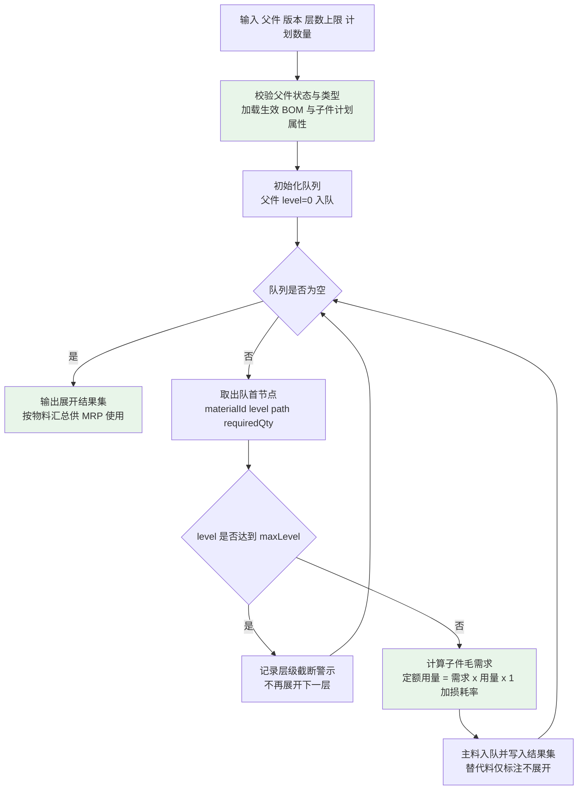

**伪代码：**

```java
/**
 * BOM 多级展开（BOM-01、BOM-02）
 * 复杂度：时间 O(V+E)，空间 O(V+E)；全程内存展开，仅 1 次批量查询 BOM + 1 次批量查询物料属性
 */
public List<BomNodeVO> expandMultiLevel(Long parentMaterialId, String version, int maxLevel, BigDecimal baseQty) {
    // 1. 校验
    BaseMaterial parent = materialCache.get(parentMaterialId);
    Assert.isTrue(EnumSet.ofMaterialTypes(SEMI_PRODUCT, PRODUCT).contains(parent.getMaterialType()),
                  () -> new BusinessException(ErrorCode.BOM_PARENT_TYPE_INVALID, parent.getMaterialCode()));
    int limit = Math.min(maxLevel <= 0 ? DEFAULT_MAX_LEVEL : maxLevel, MAX_LEVEL);
    // 2. 批量加载（避免 N+1）
    Map<Long, BomWithItems> bomMap = bomCache.loadEffectiveBoms(collectReachableParents(parentMaterialId, limit));
    Map<Long, BaseMaterial> materialMap = materialCache.loadByIds(bomMap.keySet());
    // 3. 广度优先逐层展开
    Deque<ExpandNode> queue = new ArrayDeque<>();
    queue.add(new ExpandNode(parentMaterialId, 0, parent.getMaterialCode(), baseQty));
    List<BomNodeVO> result = new ArrayList<>();
    while (!queue.isEmpty()) {
        ExpandNode node = queue.poll();
        if (node.level >= limit) { result.add(BomNodeVO.truncated(node)); continue; }
        BomWithItems bom = bomMap.get(node.materialId);
        if (bom == null) { continue; }                                   // 叶子件（外购/无 BOM）
        for (BomItem item : bom.getItems()) {
            if (Boolean.TRUE.equals(item.getIsAlternative())) {           // 替代料本期不参与展开
                result.add(BomNodeVO.alternativeMark(node, item)); continue;
            }
            // 定额用量 = 需求 × 用量 × (1 + 损耗率/100)，逐步 6 位 HALF_UP
            BigDecimal usage = BigDecimalUtil.multiply(node.requiredQty, item.getChildQty());
            usage = BigDecimalUtil.multiply(usage, BigDecimalUtil.add(BigDecimal.ONE,
                        BigDecimalUtil.divide(item.getLossRate(), HUNDRED, 6, HALF_UP)), 6);
            BigDecimal childRequired = BigDecimalUtil.divide(usage, bom.getQuantity(), 6, HALF_UP);
            result.add(BomNodeVO.of(node, item, childRequired, materialMap.get(item.getChildMaterialId())));
            queue.add(new ExpandNode(item.getChildMaterialId(), node.level + 1,
                        node.path + "/" + materialMap.get(item.getChildMaterialId()).getMaterialCode(), childRequired));
        }
    }
    return result;
}
```

#### 3.3.3 闭环检测算法（BOM-07 校验 ③，核心单测对象）

**输入：** 待保存/待审核的 BOM 头（`parentMaterialId`）+ 明细行集合（`child_material_id` 列表）；以及**数据库中其他父件已有的 (父件 → 子件) 边**。

**输出：** 校验结论；命中闭环时返回**完整闭环路径**（如 `"A→B→C→A"`）供业务人员定位。

**算法（深度优先 + 路径栈 + 访问标记）：**

1. **构建有向图**：以全部 BOM（含本次待保存数据）的 `(parent_material_id → child_material_id)` 为边；邻接表 `Map<Long, Set<Long>>`，**一次性批量查询**（`SELECT parent_material_id, child_material_id FROM base_bom b JOIN base_bom_item i ON i.bom_id = b.id WHERE b.status IN (1,2) AND b.is_deleted = 0`）；
2. **加入本次待保存的边**（虚拟节点）：把 `(parentMaterialId → 各子件)` 加入邻接表（覆盖同父件的旧边）；
3. **自引用预检**：若任一子件 = 父件，直接判定闭环，路径 `"A→A"`，抛 `11013`；
4. **初始化**：`pathStack`（`Deque<Long>`，当前遍历路径）、`inPath`（`Set<Long>`，当前路径访问标记）、`visited`（全局已完成的节点集合，用于剪枝）；
5. **遍历**：仅从**本次受影响的父件**出发（不需要全图遍历，保证性能）；
   - 进入节点 `u`：`pathStack.push(u)`、`inPath.add(u)`；
   - 遍历 `u` 的每个子件 `v`：
     - 若 `v ∈ inPath` → **命中闭环**：从 `pathStack` 中截取自 `v` 首次出现位置至栈顶的序列，拼接 `v` 得到闭环路径（如 `A→B→C→A`），**立即终止并抛出** `BusinessException(11014, "BOM 存在闭环：A→B→C→A")`；
     - 否则若 `pathDepth + 1 > 10` → 判定**层级超限**，抛 `11015`（提示层级与路径）；
     - 否则若 `v ∉ visited` → 递归遍历 `v`；
   - 退出节点 `u`：`pathStack.pop()`、`inPath.remove(u)`、`visited.add(u)`；
6. **输出**：无闭环且层级 ≤10 → 校验通过；否则阻断保存/审核并返回路径。

**时间复杂度：** O(V + E)（邻接表 + 访问标记保证每个节点/边各访问一次），`visited` 剪枝避免重复遍历共享子图；空间 O(V + E)（邻接表 + 路径栈）。3,500 个 BOM 全量闭环检测为**单次全图遍历**（迁移场景约 5 分钟，见《数据迁移需求方案》4.2.2）。

**示例（A→B→C→A 的检出过程）：**

| 步骤 | 路径栈 `pathStack` | `inPath` | 动作与结论 |
|------|------------------|---------|-----------|
| 1 | `[A]` | `{A}` | 从 A 出发，遍历子件 B |
| 2 | `[A, B]` | `{A, B}` | B 不在 inPath，递归进入 B；遍历子件 C |
| 3 | `[A, B, C]` | `{A, B, C}` | C 不在 inPath，递归进入 C；遍历子件 A |
| 4 | `[A, B, C]` | `{A, B, C}` | 子件 A **已在 inPath 中** → 命中闭环；从栈中截取自 A 起的序列 → 闭环路径 `A→B→C→A` |
| 5 | —— | —— | **抛 `BusinessException(11014, "BOM 存在闭环：A→B→C→A")`**，保存被拒 |

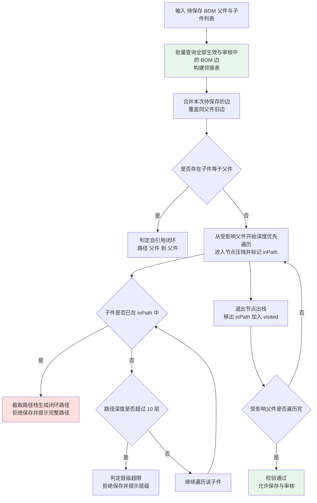

**伪代码：**

```java
/**
 * BOM 闭环与层级检测（BOM-07 校验 ③）
 * 复杂度：时间 O(V+E)，空间 O(V+E)
 */
public void checkCycle(Long parentMaterialId, List<Long> childIds) {
    // 1. 批量加载全图边（含 status=1 审核、status=2 生效）
    Map<Long, Set<Long>> graph = bomEdgeLoader.loadEdges();
    // 2. 合并本次待保存边（同父件旧边被覆盖，避免误判历史结构）
    graph.put(parentMaterialId, new LinkedHashSet<>(childIds));
    // 3. 自引用预检
    if (childIds.contains(parentMaterialId)) {
        throw new BusinessException(ErrorCode.BOM_CYCLE_DETECTED, parentCode + "→" + parentCode);
    }
    // 4. DFS：路径栈 + 路径标记 + 全局访问标记
    Deque<Long> pathStack = new ArrayDeque<>();
    Set<Long> inPath = new HashSet<>();
    Set<Long> visited = new HashSet<>();
    dfs(parentMaterialId, graph, pathStack, inPath, visited, 0);
}

private void dfs(Long node, Map<Long, Set<Long>> graph, Deque<Long> pathStack,
                 Set<Long> inPath, Set<Long> visited, int depth) {
    pathStack.push(node); inPath.add(node);
    for (Long child : graph.getOrDefault(node, Collections.emptySet())) {
        if (inPath.contains(child)) {                    // 命中闭环：截取路径栈生成 A→B→C→A
            throw new BusinessException(ErrorCode.BOM_CYCLE_DETECTED, buildCyclePath(pathStack, child));
        }
        if (depth + 1 > MAX_LEVEL) {                     // MAX_LEVEL = 10
            throw new BusinessException(ErrorCode.BOM_LEVEL_EXCEED, buildPath(pathStack, child), MAX_LEVEL);
        }
        if (!visited.contains(child)) {
            dfs(child, graph, pathStack, inPath, visited, depth + 1);
        }
    }
    pathStack.pop(); inPath.remove(node); visited.add(node);
}
```

#### 3.3.4 其他 5 项合法性校验（BOM-07）

| 序 | 校验项 | 触发时点 | 判定规则 | 错误码 |
|----|-------|---------|---------|-------|
| ① | 父件不可作为自身子件 | 保存、审核、导入 | 子件 = 父件即拒绝（同闭环） | `11013` |
| ② | 层级深度 ≤10 | 保存、审核、导入 | 由 3.3.3 的 DFS 深度判定；`bom_item.sequence` 不影响层级 | `11015` |
| ③ | 闭环检测 | 保存、审核、导入 | 见 3.3.3，提示完整闭环路径 | `11014` |
| ④ | 子件用量 >0、损耗率 0~100 | 保存、审核、导入 | `child_qty > 0`；`0 ≤ loss_rate ≤ 100`；`0 ≤ scrap_rate ≤ 100` | `11016` |
| ⑤ | 子件物料状态必须"启用" | 保存、审核、导入 | 子件 `base_material.status = 2`；**审核时点重新校验**（防止保存后子件被停用） | `11017` |

**父件合法性附加校验：** 父件 `material_type ∈ {2, 3}`（半成品/成品）；原材料与辅料不得作为 BOM 父件（抛 `11018`）。

**批量导入（SYS-11）** 同样执行 5 项校验，且**整批事务**（任一行失败整批不落库）+ 错误行回显（行号 + 原因）。

#### 3.3.5 版本管理（BOM-03）

| 项 | 规则 |
|----|------|
| 版本号格式 | `V<主版本>.<次版本>`（`V1.0`、`V1.1`、`V2.0`）；校验正则 `^V\d+\.\d+$` |
| 版本状态 | 0-草稿、1-审核、2-生效、3-历史 |
| 唯一生效版本 | **同一父件同一时刻仅 1 个 `status=2`**：新版本生效时，将同父件原生效版本自动置为 `3-历史`（同一事务内完成）；查询校验兜底（若发现多个生效版本抛 `11160`） |
| 生效/失效日期 | `effective_date`、`expiry_date`；`expiry_date` 非空时必须 > `effective_date` |
| 用量/损耗率变更 | **必须生成新版本**（不允许直接改已生效版本明细）；旧版本明细不可修改 |
| 工单锁定 | 工单**下达时**写入 `mf_order.bom_id`（含 `bom_version` 快照字段 `bom_version_lock`）；后续 BOM 变更**不影响已下达工单**（领料定额按锁定版本计算） |
| 删除 | 历史版本**不可删除**（抛 `11161`）；草稿版本可逻辑删除（无工单引用时） |
| 变更留痕 | 版本创建、生效、历史化均写审计日志 |

#### 3.3.6 用量与损耗率（BOM-02）

**定额用量公式：** `计划数量 × 子件用量 × (1 + 损耗率)`，**按 6 位小数计算、`RoundingMode.HALF_UP`**。

| 项 | 约定 |
|----|------|
| 计算步骤 | ①`tmp1 = 父件计划数量 × child_qty`（6 位 HALF_UP）；②`rate = loss_rate ÷ 100`（6 位 HALF_UP）；③`tmp2 = tmp1 × (1 + rate)`（6 位 HALF_UP）；④输出 `tmp2` |
| 校验 | `child_qty > 0`；`0 ≤ loss_rate ≤ 100`（录入 120% 或负数**拒绝**，抛 `11016`） |
| 示例 | 工单 100 台、子件用量 2、损耗率 3% → `100 × 2 × 1.03 = 206.000000`（BOM-02 验收要点①） |
| 版本锁定 | BOM 用量改为 3 后，已下达工单领料单定额**仍为 206**（版本锁定生效） |
| 报废率 `scrap_rate` | 本期**不参与**定额计算，仅作展示与后续扩展；若需参与，由参数 `bom.scrap.include`（默认 `false`）控制 |
| 领料上限 | 累计领料 ≤ `定额 × (1 + 超领上限)`，超领上限默认 **10%**（SYS-06 参数 `mfg.over-issue.ratio`） |

#### 3.3.7 替代料规则（BOM-04，P2）

| 项 | 规则 |
|----|------|
| 结构 | 主料（`is_alternative = false`）+ 1~N 替代料（`is_alternative = true`），替代料通过 `alternative_group_no` 与主料关联，`alternative_priority`（1 最高）排序 |
| 替代规则 | `substitute_type`：1-完全替代（1:1，同用量）、2-部分替代（按 `substitute_ratio` 换算：`替代料用量 = 主料需求量 × substitute_ratio`）`【数据库设计需补充：base_bom_item.substitute_type、base_bom_item.substitute_ratio】` |
| 选用逻辑（领料时） | ①领料界面按 `alternative_priority` 升序展示可选替代料；②由**生产计划员人工选择**（系统按优先级推荐）；③选择后领料明细的 `material_id` 写**替代料**物料的 ID，`remark` 记录"替代 主料编码"；④库存流水记录**替代料编码与实际用量**（BOM-04 验收要点②） |
| MRP 处理 | **本期 MRP 不做自动替代**（净需求按主料计算，结果中不出现替代建议）；仅当主料缺料时由人工在领料环节选择 |
| 替代关系留痕 | 记录替代原因（`substitute_reason`）与生效时间（`effective_date`）`【数据库设计需补充：base_bom_item.substitute_reason】` |
| 校验 | 替代料同样必须为**启用**物料（校验 ⑤）；同一替代组内 `alternative_priority` 不得重复（重复时按行序重排） |

#### 3.3.8 BOM 反查（哪里用到，BOM-06）

| 项 | 设计 |
|----|------|
| 输入 | `materialId`（任意物料）、`versionStatus`（生效/历史/全部，默认生效） |
| 输出 | 引用该物料的**父件清单 + 逐层向上的引用路径**（父件编码、版本、用量、损耗率），直至顶层成品；顶层成品反查返回空并提示"无上级引用" |
| 实现路径 | ①按 `child_material_id` 查 `base_bom_item` 得直接父件（走索引 `idx_base_bom_item_child`）；②对每个父件**逐层向上**（用 `IN` 批量取上一层，避免 N+1）；③以 `visited` 集合防重复；④限制最大层数 10 |
| 索引要求 | `base_bom_item` 需建 `idx_base_bom_item_child(child_material_id)`；`base_bom` 需建 `uniq_base_bom_code(bom_code)`、`idx_base_bom_parent(parent_material_id, status)` |
| 性能 | 3,500 个 BOM 全量下响应 ≤3 秒（BOM-06 验收要点④）；向上展开每层 1 次 `IN` 查询，最多 10 次查询 |
| 导出 | 结果复用 RPT-07 导出能力；导出行数 = 界面行数 |

#### 3.3.9 审核流程与拦截点（BOM-05）

**流程：编制（草稿 0）→ 主管审核（1）→ 生效（2）→ 历史化（3）。**

| 动作 | 接口 | 前置状态 | 后置状态 | 校验 |
|------|------|---------|---------|------|
| 保存/提交 | `POST /api/base/boms`、`/boms/{id}/submit` | 草稿 | 草稿 | 5 项合法性校验（3.3.4） |
| 审核通过 | `POST /api/base/boms/{id}/approve` | 草稿（已提交） | **生效** | 重新执行 5 项校验（重点校验 ⑤ 子件启用状态）；同父件原生效版本置历史；写审核人/时间/结论 |
| 审核驳回 | `POST /api/base/boms/{id}/reject` | 草稿 | 草稿 | **必须填写驳回原因**；驳回原因落库并可查 |
| 变更 | 新建版本 | —— | 草稿 | 不允许修改已生效版本明细 |

**"未经审核不得用于 MRP 与工单"的拦截点清单：**

| 序号 | 拦截点 | 校验位置 | 判定 | 错误码 |
|------|-------|---------|------|-------|
| 1 | MRP 运算（MFG-01） | `MrpServiceImpl.loadEffectiveBom` | 仅取 `status = 2`；草稿/驳回/审核中/历史版本一律不参与 | `15201-15249`（MRP 范围） |
| 2 | 生产工单下达（MFG-04） | `MfgOrderServiceImpl.issue` | 校验 `bom_id` 指向的 BOM `status = 2` 且 `effective_date ≤ 当前日期`、`expiry_date` 为空或 ≥ 当前日期 | `15001-15049` |
| 3 | 定额领料单生成（MFG-05） | `MfgIssueServiceImpl.createByOrder` | 使用工单锁定的 `bom_id`；该 BOM 必须为生效或历史（**允许历史版本**，因版本锁定语义）；草稿版本拒绝 | `15050-15099` |
| 4 | BOM 展开查询接口（BOM-01） | `BomServiceImpl.expand` | 查询生效版本；显式请求草稿版本时提示"该版本未生效，仅供查看" | —— |
| 5 | 批量导入（SYS-11） | `BomImportServiceImpl` | 导入后状态按要求置 2-生效或 1-审核（迁移规则 BC-07）；导入数据同样执行 5 项校验 | `11101-11159` |

### 3.4 客户/供应商主数据（CS-01~CS-03）

#### 3.4.1 客户管理（CS-01）

| 项 | 设计 |
|----|------|
| 编码规则 | `CUS` + 4 位流水（如 `CUS0001`）；流水取 `MAX(SUBSTRING(customer_code,4,4)) + 1`；唯一约束 `uniq_base_customer_code`；冲突重试 ≤3 次 |
| 字段与校验 | `customer_code`（唯一、不可改）、`customer_name`（必填 ≤200）、`unified_social_credit_code`（**18 位**，校验正则 `^[0-9A-HJ-NPQRTUWXY]{18}$`，17 位拒绝）、`contact_person`、`contact_phone`（手机号格式）、收货地址（多地址，`is_default` 唯一）、`settlement_type`（字典，销售订单默认带出）、`credit_limit`（`DECIMAL(20,6)`，`≥0`）、`credit_days`（整数 ≥0）、`customer_level`（1-战略/2-重点/3-普通）、`region`/`industry`/`scale`（字典标签）、`status`（0-停用 1-启用） |
| 唯一性 | **"客户名称 + 统一社会信用代码"唯一**（重复抛 `11201`，提示已存在编码）；单一维度重复（仅名称重复）给出**提示性警告**并要求确认后保存 |
| 信用额度占用规则 | **可用额度 = 信用额度 − 已审核未发货订单金额 − 未核销应收余额**；计算入参：`credit_limit`、`SUM(sal_order.total_amount WHERE order_status IN (1,2) 且该客户)`、`SUM(fin_receivable.amount − received_amount WHERE 未核销)`；结果 6 位小数 |
| 停用边界 | 停用后：不可新增销售订单（拦截点同 3.2.3）；**可继续发货（已审核订单）、可收款、可开票、可退货** |
| 多地址 | 地址列表维护，`is_default = true` 至多 1 条；销售订单默认带出默认地址，可改 |
| 敏感字段 | 联系人手机号按字段级权限掩码（`138****8888`） |
| 变更加审计 | 信用额度、信用期限、结算方式变更**必须写审计日志**（含变更前后值） |

#### 3.4.2 供应商管理（CS-02）

| 项 | 设计 |
|----|------|
| 编码规则 | `SUP` + 4 位流水（如 `SUP0001`）；唯一约束 `uniq_base_supplier_code`；冲突重试 ≤3 次 |
| 字段与校验 | `supplier_code`、`supplier_name`（必填）、`unified_social_credit_code`（18 位）、`contact_person`、`contact_phone`、`supply_category_ids`（供货品类，物料一级分类多选，逗号分隔或明细表）、`settlement_type`、`payment_terms`（如"月结 30 天"，采购订单默认带出）、`bank_name`、`bank_account`（**非财务角色掩码 `6222****1234`**）、`grade`（A/B/C）、`status`（启用/停用） |
| 唯一性 | "供应商名称 + 统一社会信用代码"唯一（重复抛 `11250`） |
| 停用边界 | 停用后：不可新增采购订单（采购订单供应商选择框不可见）；**可继续收货、可结算、可退货** |
| 付款条件解析 | `payment_terms` 需可解析为天数（用于应付到期日 = 收货日 + N 天）：采用"结算方式 + 天数"结构化字段 `settlement_type` + `settlement_days`；无法解析时提示并要求补全 `【数据库设计需补充：base_supplier.settlement_days】` |
| 银行账号安全 | 仅具备 `finance:supplier:viewBankAccount` 权限的角色可见全码；导出复用同一掩码；**禁止写入日志** |

#### 3.4.3 多维分类（CS-03）

| 项 | 设计 |
|----|------|
| 维度来源 | 数据字典（SYS-06）：`cs.dimension.region`、`cs.dimension.industry`、`cs.dimension.scale`、`cs.customer.level` 等；**新增维度仅需字典配置，无需改代码** |
| 存储 | 客商-维度标签关联表 `base_partner_tag`（`partner_type` 1-客户 2-供应商、`partner_id`、`dimension_code`、`tag_code`）`【数据库设计需补充：base_partner_tag 表（partner_type、partner_id、dimension_code、tag_code）】` |
| 一对象多维度 | 一个客商可命中多个维度标签；同一维度下可多选（如地区可标"华东+华南"） |
| 报表联动 | RPT-02/RPT-03 可**按任意维度汇总**（SQL 按 `base_partner_tag.dimension_code` 分组），与分类主数据实时一致（不建汇总表） |
| 校验 | `dimension_code`/`tag_code` 必须存在于字典且启用；删除被引用的字典项禁止（SYS-06） |

### 3.5 仓库/库位（INV-01 主数据部分）

| 项 | 设计 |
|----|------|
| 仓库主数据 | 表 `base_warehouse`：`warehouse_code`、`warehouse_name`、`warehouse_type`（1-原材料仓 2-半成品仓 3-成品仓）、`org_id`、`address`、`status`、`is_default`；**4 个中心仓初始数据**：原材料仓、半成品仓、苏州成品仓、东莞成品仓 |
| 库位主数据 | 表 `base_location`：`location_code`、`location_name`、`warehouse_id`、`is_default`（每仓至多 1 个默认库位）、`capacity`（容量标记）、`status` |
| 规模 | 库位约 260 个（原材料仓按电子料/结构件分库位） |
| 默认库位规则 | ①物料计划属性可指定"默认仓库 + 默认库位"；②单据未指定时：优先取物料的默认库位 → 无则取仓库的 `is_default` 库位 → 仍无则**要求人工选择**（提示"未维护默认库位"）；③出库单生成时默认带出物料默认库位（INV-01 验收要点②） |
| 启停用 | `status=1`（停用）的库位：新建单据时**不可选**；已有库存的停用库位**允许出库与调拨移出**（存量清理），不允许入库；库位停用不影响历史单据查询 |
| 新增组织/仓库 | 通过主数据维护完成，**无需改代码**（E-01）；报表按组织/仓库维度汇总不硬编码清单 |
| 约束 | 删除仓库/库位：存在库存（`inv_stock.qty ≠ 0`）或有未完结单据时禁止删除（抛 `14150-14199`），仅允许停用 |

---

## 四、库存模块详细设计（D4）

### 4.1 库存变动统一流程（核心，INV-02、INV-03、INV-09）

**承载类：** `business.inventory.core.service.StockService` / `impl.StockServiceImpl`（**唯一**允许修改 `inv_stock` 与写 `inv_transaction` 的入口）。

**输入（统一入参 `StockChangeDTO`）：**

| 字段 | 说明 |
|------|------|
| `transType` | 流水类型（10/20/30/40/50/60/70/80/90） |
| `sourceBizType` / `sourceBizId` | 来源单据类型与主键（幂等依据） |
| `materialId` / `warehouseId` / `locationId` / `batchNo` | 库存四维定位 |
| `inQty` / `outQty` | 入库/出库数量（二者互斥，单个 >0） |
| `unitCost` | 成本单价（入库时由移动加权平均计算或在入库场景由来源单据提供；出库时取当前移动加权平均单价） |
| `transTime` | 业务发生时间（默认当前时间） |
| `productionDate` / `expiryDate` | 批次物料必填（保质期物料） |
| `serialNo` | 序列号（成品启用序列号时）`【数据库设计需补充：inv_transaction.serial_no】` |
| `remark` | 备注（冲销时记录原 `trans_code`） |

**处理步骤（严格顺序，不可颠倒）：**

1. **参数与业务前置校验**：`transType` 合法；`inQty`/`outQty` 互斥且单个 `> 0`；物料存在；仓库/库位存在且启用（**入库校验库位启用，出库允许库存量清出**）；批次物料 `batchNo` 必填（缺则抛 `14050-14099`）；保质期物料 `productionDate` 必填并由 `shelf_life_days` 计算 `expiryDate`；
2. **期初与期间校验**：`transType = 90`（期初建账）仅允许在切换期且具备指定权限；首个会计期间月结后拒绝（抛 `14250-14299`）；
3. **幂等前置校验**：按 `(sourceBizType, sourceBizId, materialId, transType, warehouseId, locationId, batchNo)` 查 `inv_transaction`；已存在 → **直接返回已有流水**（不重复写入，A-04/I-04）；
4. **读取当前库存（定位 `inv_stock`）**：按 `(material_id, warehouse_id, location_id, batch_no)` 查询；**不存在时按需初始化**（`INSERT ... ON CONFLICT DO NOTHING` 后重查，`qty = 0`、`frozen_qty = 0`）；
5. **计算 `before_qty`**：`beforeQty = stock.getQty()`（**6 位小数**）；
6. **出库可用量校验**（仅 `outQty > 0`）：`可用量 = qty − frozen_qty`；`可用量 < outQty` → **抛 `14001`**，消息"物料 01-03-000128 在原材料仓 可用量 100，本次需出库 120"；**超期拦截**（保质期物料）：`expiry_date < 当日` → 抛 `14051`（若参数 `inventory.expiry.block-mode = QUALITY_RELEASE`，改为"需质检确认后放行"并允许覆写标记）；
7. **计算 `after_qty`**：`afterQty = beforeQty + inQty − outQty`（6 位 HALF_UP）；校验 `afterQty ≥ 0`（负库存拒绝，抛 `14002`）；
8. **计算成本单价**（FIN-04 联动）：
   - **入库**（10/20/50/70/90）：调用 `InventoryCostService.calcInboundUnitCost`（移动加权平均重算，见 8.2）；
   - **出库**（30/40/60/80）：取该物料当前移动加权平均单价（`inv_stock.unit_cost`），写入 `unit_cost`；
9. **写入 `inv_transaction` 流水**（`trans_code = IV + YYYYMM + 3 位流水`，由 SYS-07 引擎生成）：记录 `before_qty`/`after_qty`/`in_qty`/`out_qty`/`unit_cost`/`trans_time`/来源单据；**流水只插入，不修改不删除**；
10. **更新 `inv_stock` 快照（带乐观锁）**：条件更新 `UPDATE inv_stock SET qty = #{afterQty}, frozen_qty = ..., unit_cost = ..., last_transaction_time = #{transTime}, version = version + 1, update_by = ..., update_time = ... WHERE id = #{id} AND version = #{version} AND is_deleted = 0`；
11. **判定影响行数**：`= 1` → 继续；`= 0`（乐观锁冲突）→ **进入重试逻辑（4.2）**，重试仍失败抛 `14201`；
12. **批次/保质期/序列号登记**：批次物料写批次台账（`inv_batch` 或由 `inv_stock`+`inv_transaction` 承载，含供应商、生产日期、有效期、入库数量）；成品序列号登记；`【数据库设计需补充：inv_batch 表（material_id、batch_no、supplier_id、production_date、expiry_date、in_qty、receipt_id）】`
13. **一致性校验（防御式断言）**：`afterQty.compareTo(beforeQty.add(inQty).subtract(outQty)) == 0`，否则抛 `14003`（触发**事务回滚**并 `log.error`）；
14. **事务提交**；
15. **事务提交后（`afterCommit`）**：删除 `inventory:stock:{materialId}:{warehouseId}` 缓存；触发安全库存比对（INV-07，异步比对并生成/更新预警）；
16. **驱动财务侧**：在**同一事务链路内**（步骤 9~12 之后）调用 `business.finance` 域的 `VoucherService.generateByStockTransaction`（跨域 Service 调用，同事务）生成对应凭证（FIN-01）。

**"必须先写流水"的代码层强制约束：**

| 强制手段 | 内容 |
|---------|------|
| 唯一入口 | `inv_stock` 与 `inv_transaction` 的写操作**只允许**出现在 `StockServiceImpl` 内；其他 Service（采购/销售/生产/财务）**禁止**直接注入 `InvStockMapper`/`InvTransactionMapper`（代码审查项，E-04 验证方式） |
| Mapper 可见性 | `InvStockMapper.updateQty` 为**包内可见**（`StockMapper` 置于 `inventory.core.mapper`，通过注释与架构评审约束跨域使用）；跨域必须调用 `StockService.changeStock` |
| 顺序断言 | `StockServiceImpl.changeStock` 中"写流水"步骤在前、"更新快照"步骤在后；**不允许**出现"仅更新快照"的方法（无 `insertTransaction` 的 `updateStockOnly` 方法**不提供**） |
| 单元测试 | ①断言"流水条数 = 库存变动次数"；②断言"无流水时快照不可变"（通过接口不存在验证）；③断言 `after_qty` 一致性（第十一章测试清单） |
| 冲销约束 | 更正一律通过"反向冲销流水"（方向相反、数量与金额相等，`remark` 记录原 `trans_code`）；**不提供**修改/删除流水接口（INV-09 验收要点④） |

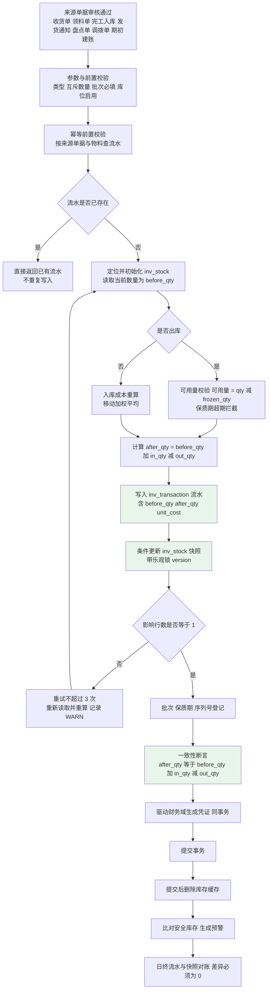

**伪代码：**

```java
/**
 * 库存变动统一入口（INV-02/INV-03/INV-09）
 * 强制顺序：校验 → 写流水 → 更新快照 → 一致性断言 → 驱动凭证
 * 事务：REQUIRED（与来源单据同一事务）；乐观锁冲突在同一事务内重试
 */
@Override
@Transactional(rollbackFor = Exception.class)
public InvTransactionVO changeStock(StockChangeDTO dto) {
    validate(dto);                                                       // 步骤 1~2
    InvTransaction exist = transactionMapper.selectBySource(dto);         // 步骤 3（幂等）
    if (exist != null) { return InvTransactionVO.of(exist); }

    for (int retry = 0; retry <= MAX_RETRY; retry++) {                    // MAX_RETRY = 3
        InvStock stock = stockService.lockOrInit(dto);                    // 步骤 4
        BigDecimal beforeQty = stock.getQty();                            // 步骤 5
        if (dto.getOutQty().signum() > 0) {                               // 步骤 6
            BigDecimal available = BigDecimalUtil.subtract(stock.getQty(), stock.getFrozenQty());
            if (available.compareTo(dto.getOutQty()) < 0) {
                throw new BusinessException(ErrorCode.STOCK_INSUFFICIENT,
                        materialCode, warehouseName, available, dto.getOutQty());
            }
            checkShelfLifeExpired(stock, dto);
        }
        BigDecimal afterQty = BigDecimalUtil.add(beforeQty, dto.getInQty());
        afterQty = BigDecimalUtil.subtract(afterQty, dto.getOutQty());     // 步骤 7
        BigDecimal unitCost = dto.getOutQty().signum() > 0                  // 步骤 8
                ? stock.getUnitCost() : inventoryCostService.recalcInbound(stock, dto);

        InvTransaction trans = buildTransaction(dto, beforeQty, afterQty, unitCost);  // 步骤 9
        transactionMapper.insert(trans);                                   // 流水只插入

        int rows = stockMapper.updateQtyWithVersion(stock.getId(), stock.getVersion(),  // 步骤 10~11
                afterQty, unitCost, dto.getTransTime());
        if (rows == 0) {                                                   // 乐观锁冲突
            log.warn("库存乐观锁冲突, materialId={}, warehouseId={}, retry={}",
                     dto.getMaterialId(), dto.getWarehouseId(), retry);
            sleepBackoff(retry);                                           // 立即 / 20ms / 50ms
            continue;                                                      // 同一事务内重读重算
        }
        registerBatchIfNeeded(dto, stock);                                 // 步骤 12
        assertQtyConsistency(beforeQty, dto, afterQty);                     // 步骤 13
        voucherService.generateByStockTransaction(trans, dto);               // 步骤 16（跨域 Service）
        registerCacheEvictAfterCommit(stock);                              // 步骤 15
        stockAlertService.compareAfterCommit(stock);                        // 安全库存比对
        return InvTransactionVO.of(trans);
    }
    throw new BusinessException(ErrorCode.STOCK_VERSION_CONFLICT, dto.getMaterialId());   // 14201
}
```

### 4.2 乐观锁失败处理详细策略（INV-09）

| 项 | 策略 |
|----|------|
| 重试次数 | **≤3 次**（含首次共最多 4 次尝试） |
| 重试间隔 | 第 1 次立即；第 2 次 20ms；第 3 次 50ms（`Thread.sleep` 固定退避，保证可测试） |
| 重试实现位置 | **同一事务内**循环：重新 `SELECT` 当前 `qty/version` → 重算 `before_qty/after_qty` → 重新条件更新；**不新建事务、不回滚重来**（避免半成品数据） |
| 流水处理 | 重试前**先删除**上一轮已插入的流水（同事务内可回滚）或采用"先条件更新快照成功后再插流水"的变体？**结论：严格保持"先写流水后更新快照"顺序**——重试时在同一事务内 `deleteById` 上一轮流水记录再重新插入（同事务内不可见，安全） |
| 最终失败 | 抛 `BusinessException(14201, "库存记录已被其他操作更新，请重试（物料 X 仓库 Y）")`；日志 `WARN`；**事务整体回滚**（单据不落库） |
| 告警 | WARN + Micrometer 计数 `stock.optimistic.lock.conflict`（按物料维度标签）；阈值（如 5 分钟 >10 次）触发运维告警 |
| 并发超卖防护 | 三重防线：①步骤 6 的**可用量校验**；②条件更新（`WHERE version = ?`）保证不覆盖；③`after_qty ≥ 0` 与 `qty ≥ 0` 的**数据库 CHECK 约束建议**（`CHECK (qty >= 0)`、`CHECK (frozen_qty >= 0)`，由数据库设计落地）；20 并发用例下无数量丢失（INV-09 验收要点⑤） |
| 冻结数量更新 | 收货待检冻结（`frozen_qty += receipt_qty`）与质检解冻（`frozen_qty -= receipt_qty`）同样走条件更新 + 乐观锁，避免冻结数量漂移 |

### 4.3 即时库存表设计与查询（INV-01、INV-09）

**唯一键：`uniq_inv_stock_dim(material_id, warehouse_id, location_id, batch_no)`**（四维记账）。

| 字段 | 类型 | 说明 |
|------|------|------|
| `material_id` / `warehouse_id` / `location_id` / `batch_no` | `BIGINT` / `BIGINT` / `BIGINT` / `VARCHAR(50)` | 四维定位（`batch_no` 为非批次物料时置空字符串或 NULL，**统一约定为 NULL**，避免 NULL 在唯一约束中的多值问题——PostgreSQL 唯一索引对 NULL 不去重，故约定**非批次物料统一使用空串 `''`**） |
| `qty` | `DECIMAL(20,6)` | 实际库存数量 |
| `frozen_qty` | `DECIMAL(20,6)` | 冻结数量（收货待检、预留） |
| `unit_cost` | `DECIMAL(20,6)` | 当前移动加权平均单位成本 `【数据库设计需补充：inv_stock.unit_cost】` |
| `production_date` / `expiry_date` | `DATE` | 批次生产日期与有效期（保质期预警依据）`【数据库设计需补充：inv_stock.production_date、inv_stock.expiry_date】` |
| `last_transaction_time` | `TIMESTAMP` | 最后变动时间（呆滞判定依据） |

**可用量口径：** `可用量 = qty − frozen_qty`。

| 场景 | 是否可用量校验 | 说明 |
|------|--------------|------|
| 销售出库（30） | 是 | 可用量不足拦截（`14001`） |
| 生产领料出库（40） | 是 | 同上 |
| 调拨出库（60） | 是 | 同上 |
| 采购退货出库（60） | 是 | 同上 |
| 盘亏（80） | 否 | 盘点差异调整按账面数处理，不做可用量拦截（但 `after_qty ≥ 0`） |
| 收货待检 | 否（冻结） | `frozen_qty += receipt_qty`，不增加可用库存 |
| 入库类（10/20/50/70/90） | 否 | 直接增加 `qty` |

**查询设计：** ①按仓库/库位/批次/物料多维查询走 `inv_stock` 快照（**不扫流水**），响应 ≤2 秒（P-04）；②索引：`uniq_inv_stock_dim` 唯一索引 + `idx_inv_stock_material(material_id)` + `idx_inv_stock_warehouse(warehouse_id, location_id)`；③库存汇总（仓库/组织维度）用 Mapper.xml 聚合查询，一次 `GROUP BY` 出结果；④历史任意时点库存查询走流水（`before_qty/after_qty`），按 `trans_time ≤ 目标时点` 取该维度最后一条流水的 `after_qty`。

### 4.4 各类库存业务详细步骤

#### 4.4.1 采购入库（trans_type = 10，INV-02）

1. 收货单质检结论录入为合格（`status=1`）或部分合格（`status=2`）；
2. 收货单**审核**时触发：冻结数量解冻（`frozen_qty -= receipt_qty`，条件更新 + 乐观锁）；
3. 按**合格数量**调用 `StockService.changeStock`（`transType=10`、`inQty=qualifiedQty`、`warehouseId=收货仓库`、`locationId=默认库位`、`batchNo=供应商批次号`、`productionDate/expiryDate`）；
4. 同事务调用财务域 `VoucherService.generatePurchaseReceiptVoucher`（借 原材料 贷 应付账款-暂估），金额 = 合格数量 × 采购订单不含税单价；
5. 回写采购订单行 `received_qty += qualifiedQty`，并按规则更新订单状态（`2-部分收货`/`3-已收货`，见 5.2）；
6. 不合格数量：写隔离仓/退货仓库存（`warehouse` = 隔离仓，不增加可用库存或按"不合格品仓"单独记账），并生成待退货提示（PUR-04）；
7. **幂等**：同一收货单重复审核 → 步骤 3 的幂等前置校验命中，不产生第二条流水。

#### 4.4.2 生产完工入库（trans_type = 20，INV-02、MFG-07）

1. 完工入库单审核；
2. 调用 `changeStock`（`transType=20`、`inQty=入库数量`、仓库按物料类型路由：半成品 → 半成品仓，成品 → 苏州成品仓或东莞成品仓）；
3. 入库成本 = 工单当月在制成本归集金额 ÷ 完工数量（由 FIN-05 计算，见 8.5）；未核算前按 `base_material.standard_cost` 暂记并标记"待成本核算调整"`【数据库设计需补充：inv_transaction.cost_pending_flag】`；
4. 回写 `mf_order.completed_qty`；达到 `planned_qty` 时工单状态置 `4-已完工` 并记录 `actual_end_date`；
5. 同事务生成凭证（借 库存商品 贷 生产成本）；
6. 超出工单未完工数量的入库拒绝（抛 `15150-15199`）。

#### 4.4.3 销售出库（trans_type = 30，INV-03、SAL-05）

1. 发货通知单拣货确认 → 生成销售出库单（`sal_outbound`）；
2. 出库单审核：调用 `changeStock`（`transType=30`、`outQty=出库数量`）；可用量不足拦截；
3. 出库成本 = 出库数量 × 当前移动加权平均单价（写入 `inv_transaction.unit_cost`）；
4. 同事务生成凭证（借 主营业务成本 贷 库存商品），金额 = `unit_cost × outQty`；
5. 回写销售订单行 `delivered_qty` 与订单状态（判定规则见 6.2）；
6. **幂等**：同一出库单重复提交仅产生 1 条流水（SAL-05 验收要点④）。

#### 4.4.4 生产领料（trans_type = 40，INV-03、MFG-05）

| 场景 | 处理 |
|------|------|
| 定额领料 | 定额量 = 计划数量 × BOM 用量 × (1 + 损耗率)（6 位 HALF_UP，见 3.3.6）；领料量 ≤ 定额 → 直接通过 |
| 超定额领料 | 领料量 > 定额 → **触发审批流**（车间主任 → 生产经理，按超出比例分级）；**必须填写原因**；审批通过后方可出库（`issue.approval_status` 流转）`【数据库设计需补充：mf_order_issue.approval_status、mf_order_issue.over_qty_reason】` |
| 超领上限拦截 | 累计领料 > 定额 × (1 + 超领上限 10%) → **拒绝**（抛 `15050-15099`），须特批 |
| 分次领料 | 允许分次；每条领料单生成 1 条流水；累计校验按工单 + 物料汇总 |
| 替代料领料 | 按 3.3.7 由人工选择替代料；流水记录替代料编码与实际用量 |
| 库位/批次分配策略 | ①默认取物料默认库位与默认批次；②**批次分配按先进先出（先到期先出）**顺序推荐（`ORDER BY expiry_date NULLS LAST, production_date, create_time`），由仓管员确认；③允许按批次指定；④一期不引入自动批次锁定（不做库存预留） |

#### 4.4.5 采购退货出库（PUR-04）

| 项 | 设计 |
|----|------|
| 流水类型 | 采购退货出库若复用 `60-调拨出库` 将无法与调拨业务区分，故**设计结论：新增专用取值`85-采购退货出库`**`【需与数据库设计对齐 trans_type 取值：新增 85-采购退货出库】`；对应销售退货入库新增 **`25-销售退货入库`**`【需与数据库设计对齐 trans_type 取值：新增 25-销售退货入库】`。若《数据库设计文档》最终不新增取值，则退化为：采购退货出库复用 `60`、销售退货入库复用 `20`，并以 `source_biz_type`（`PURCHASE_RETURN`/`SALES_RETURN`）区分。两个取值均须登记入 `TransTypeEnum` 并同步《接口设计文档》与流水类型汇总表（1.4） |
| 处理步骤 | ①退货单创建（关联收货单与采购订单，`退货数量 ≤ 该收货单不合格数量`；对已入库物料退货须采购经理审批）；②审核后调用 `changeStock`（出库方向，`locationId` 取原入库库位或退货仓）；③同事务冲减应付（暂估或正式应付，调用财务域 `PayableService.reverseByReturn`）；④退货进度跟踪（发出/在途/供应商确认/退款或换料） |
| 库存与应付冲减 | 库存减少数量 = 退货数量；应付冲减金额 = 退货数量 × 原入库单价（与暂估单价一致，差额 0） |
| 审计 | 退货单创建、审批、出库均写审计日志 |
| 超期提示 | 可查询超期 30 天未完成退货的清单（`PUR-04` 验收要点③） |

#### 4.4.6 销售退货入库（SAL-06）

1. 退货申请（关联原销售订单与出库批次）→ 质检确认（合格数量/不合格数量）；
2. 合格数量调用 `changeStock`（入库方向，`transType = 25-销售退货入库`，按**原出库单价**回冲成本，SAL-06 验收要点⑤）；
3. 同事务生成红字凭证冲减收入/成本（借 库存商品 贷 主营业务成本——按原成本价；若已开票则另生成应收冲减，金额 = 退货数量 × 销售单价）；
4. 不合格数量入隔离仓并走报废或二次处理；
5. 退货数量 > 可退余额（原订单已发货数量 − 已退货数量）→ 拒绝（抛 `13150-13199`）。

#### 4.4.7 调拨（INV-10）

| 场景 | 处理 |
|------|------|
| 同仓库位间调拨 | 审核生效后生成**成对流水**：`trans_type=60`（源库位出）+ `trans_type=50`（目标库位入），数量相等；同仓库汇总库存不变 |
| 跨仓调拨 | 源仓 −N、目标仓 +N，按成本价结转（`unit_cost` 取源仓当前移动加权平均单价），**不产生损益** |
| 审核后不可改 | 审核后禁止修改；撤销须**生成反向调拨单**（生成方向相反的 60/50 对） |
| 凭证 | 调拨**不生成损益科目凭证**；如需生成搬运费类凭证由人工记账（本期不自动） |
| 幂等 | 调拨单 + 物料 + 方向 为流水幂等键（重复审核不产生第二对流水） |

#### 4.4.8 盘盈盘亏调整（INV-06）

盘点差异**审批通过后**才生成 `70-盘盈` / `80-盘亏` 流水（审批前不生成任何调整流水）；金额按当前移动加权平均单价计算；同事务生成凭证（盘盈：借 原材料/库存商品 贷 待处理财产损溢；盘亏：反向）。

### 4.5 批次与序列号追溯（INV-04）

| 项 | 设计 |
|----|------|
| 批次号生成规则 | 供应商批次优先（收货单录入 `batch_no`）；无供应商批次时按 `物料编码后 6 位 + YYYYMMDD + 2 位流水` 生成（如 `0001282026091601`） |
| 启用范围 | 关键物料约占总物料 **15%**（IGBT 模块、主控芯片等）；成品启用序列号（以"批次 + 序列号字段"承载） |
| 入库登记 | 批次物料入库必填 `batch_no`；保质期物料必填 `production_date` 并按 `shelf_life_days` 计算 `expiry_date`；登记供应商、入库日期、质检报告号（关联收货单） |
| 批次台账查询 | 按批次号、物料、供应商、入库日期查询；条数与收货单一致（INV-04 验收要点①） |
| 正向追溯 | 原材料批次 → 流向的成品批次：`inv_transaction`（`trans_type=40` 领料）→ `mf_order` → `inv_transaction`（`trans_type=20` 完工入库）→ 成品批次 |
| 反向追溯 | 成品批次 → 所用零部件供应商批次：成品批次 → 对应工单 → 工单领料流水（`trans_type=40`，含零部件批次）→ 各零部件的 `trans_type=10` 入库流水 → 收货单（供应商 + 供应商批次 + 质检结论） |

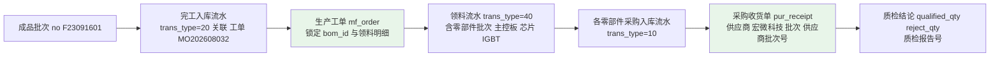

**性能：** 追溯查询 ≤3 秒（INV-04 验收要点④）——依赖 `idx_inv_transaction_source(source_biz_type, source_biz_id)`、`idx_inv_transaction_material(material_id, trans_time)`、`idx_mf_order_sal_order`。

### 4.6 保质期管理（INV-05）

| 项 | 设计 |
|----|------|
| 有效期计算 | `expiry_date = production_date + shelf_life_days`（如生产日期 2026-01-01、保质期 3 年 → 2029-01-01；按天数控算，参数化的"按年"以 365 天换算） |
| 预警触发 | 每日 02:00 任务（2.9）：`expiry_date − 预警天数 ≤ 当前日期`（预警天数参数 `inventory.expiry.warn-days`，默认 **30**）→ 生成预警清单并标记"到期日/剩余天数" |
| 出库拦截 | 超期（`expiry_date < 当日`）物料出库**默认拦截**（抛 `14051`，消息含超期天数）；参数 `inventory.expiry.block-mode`：`BLOCK`（默认，直接拦截）/ `QUALITY_RELEASE`（需质检确认后放行，放行记录写 `remark` 与审计日志） |
| 预警清单 | 可按仓库/物料筛选、导出（行数与界面一致）；每日刷新 |
| 幂等 | 同一批次同一天只生成一次预警记录（`(material_id, batch_no, biz_date)` 唯一） |

### 4.7 库存盘点（INV-06）

**周期规则：** A 类每月、B 类每季、C 类每半年（频率由 SYS-06 参数控制：`inventory.stocktake.freq-a/b/c`）；支持全面盘点。

**盘点流程步骤：**

1. **生成盘点单**（`ST + YYYYMM + 3 位流水`）：按库位/物料范围生成明细行；**冻结账面快照** `book_qty`（生成时点 `inv_stock.qty` 快照，写入盘点明细 `book_qty`）；盘点期间**不影响收发货作业**（不停产）——盘点期间发生的出入库作为差异原因标注；
2. 状态置 `1-冻结盘点中`；
3. **录入实盘数** `actual_qty`（支持分批录入），系统自动计算差异：`diff_qty = actual_qty − book_qty`；`diff_qty > 0` 为盘盈、`< 0` 为盘亏；
4. **差异提交审批**（状态置 `2-待审批`）：盘点人提交 → 仓管主管/财务审批；
5. **审批通过**（状态置 `3-已审批`）：按差异行逐条调用 `changeStock` 生成 `70-盘盈` / `80-盘亏` 流水；金额 = `|diff_qty| × 当前移动加权平均单价`；
6. **财务联动**：同事务生成盘盈/盘亏凭证（借 原材料/库存商品 贷 待处理财产损溢，或反向）；
7. **输出盘点准确率** = `1 − 差异行数 ÷ 总行数`（目标 ≥99.5%）；
8. **审计**：差异调整记录审批人与时间。

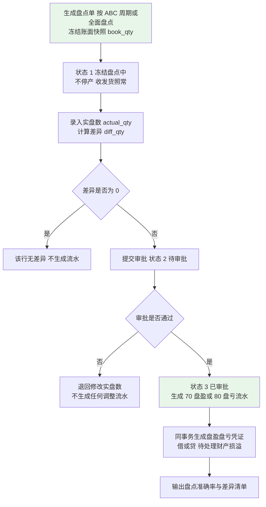

### 4.8 安全库存预警（INV-07）

| 项 | 设计 |
|----|------|
| 触发条件 | `可用量（qty − frozen_qty） < safety_stock` 且 `safety_stock > 0` |
| 建议量 | `建议补货量 = 安全库存 − 可用量`，再按 `min_order_qty` **向上取整**（`ceil(建议量 / min_order_qty) × min_order_qty`），6 位小数 |
| 建议到货日期 | `需求日期 − 采购提前期`（提前期为 0 时按当日提示） |
| 预警单生成 | 每日任务按 `(material_id, warehouse_id, biz_date)` 写入预警记录（`handle_status` 0-未处理/1-已转申请/2-已忽略）；支持一键转采购申请（`PUR-01`，来源标记"安全库存建议"） |
| 忽略处理 | 忽略**必须填写原因**并记录操作人（INV-07 验收要点③） |
| 筛选与导出 | 按仓库、物料分类、ABC 分类筛选；导出（行数一致） |
| 实时性 | 库存变动后（提交后回调）对受影响物料做增量比对（写入/更新当日预警记录），保证 ≤5 分钟可见 |

### 4.9 呆滞库存分析（INV-08）

| 项 | 设计 |
|----|------|
| 识别口径 | **超过 N 天（默认 180，参数 `inventory.slow-moving.days`）未发生任何出入库业务**（含领料、出库、入库、调拨）；判定字段 = `inv_stock.last_transaction_time`（或最近一条 `inv_transaction.trans_time`） |
| 计算实现 | 每日 01:30 任务：`SELECT ... FROM inv_stock s WHERE s.qty > 0 AND s.last_transaction_time < now() - N days`（分页批次处理），计算 `呆滞天数 = 当前日期 − last_transaction_time`、`呆滞金额 = qty × unit_cost` |
| 报表口径 | 字段：物料、仓库、批次、数量、金额、最后变动日期、呆滞天数；支持按金额/呆滞天数排序；按仓库、物料分类、ABC 筛选；呆滞占比 = `呆滞金额 ÷ 库存总金额`（目标 <8%） |
| 处置标记 | 继续持有 / 降价处理 / 报废，记录处置人与时间；处置痕迹不改动库存（报废需走盘亏或报废出库） |
| 参数生效 | 参数由 180 改为 150 后，下次执行即按 150 天输出（SYS-06 验收要点①）；报表按业务日期归档可重跑 |
| 一致性 | RPT-04 呆滞清单与本功能清单**口径一致**（差额 0）；两者复用同一 Mapper 方法与参数读取 |

### 4.10 库存流水查询与对账（INV-09）

| 项 | 设计 |
|----|------|
| 流水查询 | 按物料 + 时间范围（**强制至少一个条件**）；100 万条量级下 ≤2 秒（P-05）；索引 `idx_inv_transaction_material(material_id, trans_time)`、`idx_inv_transaction_source(source_biz_type, source_biz_id)`、`idx_inv_transaction_time(trans_time)` |
| 流水不可变 | 不提供修改/删除接口；错误走反向冲销流水（`remark` 记录原 `trans_code`） |
| 日终对账任务 | 每日 23:30：①`SELECT material_id, warehouse_id, location_id, batch_no, SUM(in_qty) - SUM(out_qty) AS flow_qty FROM inv_transaction WHERE is_deleted = 0 GROUP BY 1,2,3,4`；②与 `inv_stock.qty` 全量比对；③差异清单写 `inv_reconcile_diff`（含维度、流水汇总、快照数量、差异、业务日期）；④差异 > 0 → `log.error` + 告警，**不自动调整**，须人工查明后走冲销流水 |
| 差异检测口径 | 差异 = `flow_qty − snapshot_qty`，**必须为 0**；抽样 20 笔流水与快照差值校验同样为 0（INV-09 验收要点①③） |
| 对账结果可查 | 差异清单与对账任务日志可查询、可导出；对账任务按 `biz_date` 幂等 |
| 期初一致性 | 期初建账（90）流水汇总 = `inv_stock` 快照汇总（差值 0），使"流水 = 快照"自上线首日成立（INV-11） |

### 4.11 库位调拨（INV-10）与期初建账（INV-11）

| 项 | 设计 |
|----|------|
| 调拨单字段 | `transfer_code`（`TR + YYYYMM + 3 位`）、`source_warehouse_id`、`source_location_id`、`target_warehouse_id`、`target_location_id`、`transfer_date`、`status`（0-草稿 1-已审核 2-已关闭）、明细（物料、批次、数量、单位成本） |
| 调拨步骤 | ①创建（同仓或跨仓）；②提交审核；③审核通过 → 同事务生成 `60`（源出）+ `50`（目标入）成对流水；④审核后禁止修改；⑤撤销生成反向调拨单（反向流水） |
| 期初建账字段 | `inv_opening`（或复用 `inv_stock` + 流水 90）：物料、仓库、库位、批次、数量、期初单价（采购价或标准成本口径，**由财务确认**）、生产日期、有效期 |
| 期初建账步骤 | ①授权角色在**切换期**导入（Excel，SYS-11 能力，整批事务 + 错误行回显）；②逐行调用 `changeStock`（`transType=90`、`inQty=数量`、`unitCost=期初单价`）；③初始化 `inv_stock` 快照；④生成期初调账凭证（FIN-09 联动）；⑤批次/保质期物料必填批次与有效期（缺失拒绝，抛 `14251`）；⑥**首个会计期间月结后不可修改**（状态守卫 + 期间校验双重拦截，抛 `14252`） |
| 校验 | 期初流水汇总 = 快照汇总（差值 0）；与盘点表逐条比对误差率 ≤0.1%；存货科目期初金额与 FIN-09 一致（差额 0） |

---

## 五、采购模块详细设计（D5）

### 5.1 采购申请（PUR-01）

**承载类：** `business.purchase.core.service.PurApplicationService` / `impl`；表 `pur_application` + `pur_application_line`。

| 项 | 设计 |
|----|------|
| 来源标记 `source` | 1-`MRP`（MRP 建议转申请，记录建议批次号 `plan_code` 与建议行 ID）；2-`手工`（**必须填写申请原因** `apply_reason`）；3-`安全库存建议`（INV-07 一键转申请） |
| 字段 | `application_code`（`PA + YYYYMM + 3 位`）、`apply_date`、`applicant`（申请人）、`apply_dept`、`plan_code`、`apply_reason`、`status`（0-草稿 1-待审批 2-已审批 3-已驳回 4-已关闭）、明细（物料、数量、需求日期、需求仓库、建议供应商、来源、来源建议行 ID） |
| 创建步骤 | ①校验物料启用（3.2.3 拦截点 5）；②数量 `> 0`、需求日期非空；③手工来源必填原因（缺失抛 `12001-12049`）；④生成编号（SYS-07）并落库；⑤MRP 来源时回写建议行 `converted_status = 1`（幂等） |
| 状态流转 | 草稿 →（提交）→ 待审批 →（`approve`）→ 已审批 /（`reject`，必填驳回原因）→ 已驳回 → 修改后重新提交；已审批 →（`close`）→ 已关闭 |
| 审批阈值 | 申请金额 > `purchase.application.approve-threshold`（默认 **5 万元**）→ 转上一级审批（记录审批层级与审批人） |
| 转采购订单 | 已审批的申请行可一键转采购订单（见 5.2）；**已转单行不可重复转**（`converted_status` 标记 + 唯一约束 `uniq_pur_order_line_application_line`） |
| 统计 | 按来源统计申请数量与占比（紧急/手工采购占比目标 ≤10%）；报表 RPT-03 |
| 幂等 | ①创建幂等（`Idempotent-Key` + 编号唯一）；②一键转申请/转订单幂等（来源建议行状态 + 目标单据唯一约束） |
| 事务 | 申请头 + 明细 + 状态回写同事务；转单时（申请行状态 + 采购订单头 + 明细）同事务 |

### 5.2 采购订单（PUR-02）

**承载类：** `PurOrderService` / `impl`；表 `pur_order` + `pur_order_line`。

#### 5.2.1 创建步骤与明细行计算

1. **入参校验**：供应商存在且启用（`base_supplier.status=1`；停用供应商抛 `12050-12099`）；至少 1 行明细；`order_date` 非空；`required_date ≥ order_date`；付款条件默认取供应商 `settlement_type + settlement_days`；
2. **明细行校验**：物料存在且**启用**；`qty > 0`；`unit_price ≥ 0`；`tax_rate` 默认 13.00；收货仓库存在且启用；行号在单据内连续唯一；
3. **行金额计算**（6 位小数 HALF_UP）：
   - `taxAmount = unit_price × qty × (tax_rate ÷ 100)`（先算 `tax_rate ÷ 100` 到 6 位再乘）；
   - `lineAmount = unit_price × qty`（不含税行金额）；
   - `lineAmountWithTax = lineAmount + taxAmount`（含税行金额）；
4. **单据金额**：`total_amount = Σ lineAmountWithTax`（含税），`total_amount_excl_tax = Σ lineAmount`（不含税）；**头金额必须等于明细汇总**（不允许反算，落库前断言）；
5. **价格校验与提示**（PUR-07）：取该"供应商 + 物料"历史最近价与历史最低价；若本次单价高于最近价 `> purchase.price.warn-ratio`（默认 **10%**）→ 触发预警并**要求填写价格说明**（`price_remark` 必填，缺失抛 `12250-12299`）；
6. **编号生成与落库**：`PO + YYYYMM + 3 位`（如 `PO202608045`）；头 + 明细同事务落库；
7. **来源关联**：由采购申请转单时回写申请行 `converted_status` 与订单行 `application_line_id`。

#### 5.2.2 审核校验矩阵（PUR-02 审核）

| 序 | 校验项 | 判定规则 | 不通过 |
|----|-------|---------|-------|
| 1 | 单据状态 | 必须为 `0-草稿`（已审核不可重复审核） | `12051`"状态不匹配" |
| 2 | 明细非空 | 至少 1 行有效明细 | `12052` |
| 3 | 供应商有效性 | 供应商存在且**启用**；信用/黑名单标记正常 | `12053` |
| 4 | 物料有效性 | 全部明细物料存在且**启用**（3.2.3 拦截点 7） | `12054` |
| 5 | 价格授权 | 单价高于最近价超过预警阈值时必须有价格说明；**本期不做采购价格上下限硬约束**（仅预警，PUR-07 口径） | `12055` |
| 6 | 数量与提前期 | `qty > 0`；`required_date ≥ order_date`；`required_date − order_date ≥ lead_time` 时给出**提前期不足提示**（允许继续，记录提示）；`required_date < 当前日期` 强制要求确认 | `12056` |
| 7 | 金额一致性 | `total_amount = Σ 明细含税行金额`（差额 0），否则拒绝 | `12057` |
| 8 | 收货仓库 | 仓库存在且启用 | `12058` |
| 9 | 已存在收货 | 草稿状态不允许已收货（`received_qty` 必须全为 0） | `12059` |

**审核结果：** `order_status` 置 `1-审核`；写审核人/时间；写审计日志（`operateType=APPROVE`）；冻结关键字段（供应商、物料、数量、单价不可直接修改）。

#### 5.2.3 变更、关闭与取消规则

| 动作 | 规则 |
|------|------|
| 变更（审核后） | 关键字段（供应商、物料、数量、单价）**不可直接修改**；须走变更单 `pur_order_change`：记录字段级**前后值**（before/after JSON），变更审批通过后按新值执行；**已收货行不允许将数量减少到低于已收货数量**（抛 `12060`） |
| 关闭（`close`） | 允许 `1-审核`/`2-部分收货`/`3-已收货` → `4-已关闭`；关闭后不可再收货；**已收货行不可取消，仅可关闭**（PUR-02 验收要点③） |
| 取消（草稿） | `0-草稿` 可直接逻辑删除（`is_deleted=1`）；已审核不可取消（只能关闭） |
| 反审核（`unapprove`） | 仅 `1-审核` 且**无任何收货记录**时允许（需特殊权限 `purchase:order:unapprove`）；退回 `0-草稿` |
| 结算状态 | `settlement_status` 由三单匹配与付款核销驱动（0-未结算/1-部分结算/2-已结算），**不影响** `order_status` |

#### 5.2.4 `received_qty` 与订单状态回填机制

| 步骤 | 处理 |
|------|------|
| 1 | 收货单审核时，按"合格数量"回写 `pur_order_line.received_qty += qualifiedQty`（条件更新 + 乐观锁；`received_qty ≤ qty` 强校验） |
| 2 | 重新计算订单状态：全部行 `received_qty = 0` 且存在收货 → 状态不变；存在部分行 `0 < received_qty < qty` → `2-部分收货`；全部行 `received_qty = qty` → `3-已收货` |
| 3 | 状态回写与回填在**同一事务**内完成 |
| 4 | 幂等：同一收货单重复审核时，因流水幂等前置校验命中而**不重复回填** |
| 5 | 收货数量不得超过未收货余额：`receipt_qty ≤ qty − received_qty`（超限抛 `12101-12159`） |

### 5.3 采购收货与质检（PUR-03）

**承载类：** `PurReceiptService` / `impl`；表 `pur_receipt`（**以"物料 + 收货批次"为记录粒度**，一张收货单可含多条记录）。

**完整流程步骤：**

1. **收货单创建**：关联采购订单与供应商；录入 `receipt_qty`（**不得超过订单未收货数量**，超限抛 `12101`）；目标仓库与库位；供应商批次号 `batch_no`、生产日期 `production_date`（保质期物料必填）；生成编号（`GR + YYYYMM + 3 位`）；状态 `0-待检`；**数量进入冻结**：`inv_stock.frozen_qty += receipt_qty`（不增加可用库存）；
2. **质检录入**：质检员录入 `qualified_qty`（合格）与 `reject_qty`（不合格），校验 `qualified_qty + reject_qty = receipt_qty`（不等抛 `12102`）；结论决定收货单状态：全部合格 → `1-合格入库`；部分合格（`qualified_qty > 0` 且 `reject_qty > 0`）→ `2-部分合格`；全部不合格 → `3-退货`；
3. **质检信息落库**：检验人、检验时间、质检报告号（附件 SYS-10）、不合格原因；**不单独建质检表与编号序列**（统一裁定 5）；
4. **合格入库**：状态为 1/2 时，按**合格数量**调用 `StockService.changeStock`（`trans_type=10`），同时解冻 `frozen_qty -= receipt_qty`；
5. **不合格处理**：不合格数量转入**隔离仓/退货仓**（独立库存维度记账，不计入可用库存），并可发起采购退货（PUR-04）；状态为 3 时全部退回供应商，不产生入库流水；
6. **暂估应付**：按合格数量 × 采购订单不含税单价生成暂估凭证（PUR-06、FIN-01），**100% 覆盖、无人工跳过入口**；
7. **回填**：回写 `pur_order_line.received_qty` 与订单状态（5.2.4）；
8. **幂等**：同一收货单重复提交/审核不产生重复流水与重复暂估（流水幂等键 + 凭证幂等键）；
9. **撤销**：仅 `0-待检` 状态可撤销（同时解冻 `frozen_qty`）；进入 1/2/3 后须走退货单或冲销流水；
10. **事务**：收货单状态 + 冻结数量 + 库存流水 + 快照 + 暂估凭证 + 订单回填**同一事务**。

**部分合格处理细则：** 合格数量入库并生成暂估；不合格数量入隔离仓并生成待退货提示；收货单整单状态为 `2-部分合格`（明细级状态按各自结论记录）。

### 5.4 采购退货（PUR-04）

| 项 | 设计 |
|----|------|
| 规则 | 退货单关联收货单与采购订单；**退货数量 ≤ 该收货单不合格数量**（对已入库物料退货须采购经理审批）；编号 `PR + YYYYMM + 3 位` |
| 流程步骤 | ①创建退货单（明细：物料、批次、退货数量、退货原因）；②提交审批（已入库物料退货必须审批）；③审批通过 → 调用 `StockService.changeStock`（出库方向，`trans_type=85-采购退货出库`，见 4.4.5）；④同事务冲减应付（暂估或正式应付；调用财务域 `PayableService.reverseByReturn`）；⑤状态跟踪（发出/在途/供应商确认/退款或换料）；⑥写审计日志 |
| 库存与应付冲减 | 库存 −N；应付冲减金额 = `N × 原入库单价`（与暂估/正式单价一致，差额 0） |
| 超期跟踪 | 可查询超期 **30 天**未完成退货清单（PUR-04 验收要点③） |
| 幂等 | 退货单 + 物料 + 方向 为流水幂等键；应付冲减以退货单为幂等键 |

### 5.5 三单匹配（PUR-05，核心算法）

**承载类：** `PurInvoiceMatchService` / `impl`；表 `pur_invoice`（供应商发票登记）+ `pur_invoice_match`（匹配结果与差异记录）。

**输入：**

| 输入项 | 来源 | 关键字段 |
|-------|------|---------|
| 采购订单 | `pur_order` + `pur_order_line` | `order_code`、供应商、物料、`qty`、`unit_price`（不含税） |
| 入库记录（收货单） | `pur_receipt` | `receipt_code`、`pur_order_id`、物料、`qualified_qty`、单价（取订单单价） |
| 供应商发票 | `pur_invoice` + `pur_invoice_line`（开票登记） | `invoice_no`、供应商、物料、`invoice_qty`、`invoice_unit_price`、`tax_rate`、`invoice_amount` |

**匹配维度：** ①**数量**：`|发票数量 − 合格入库数量| ÷ 合格入库数量 ≤ 数量容差`（默认 **±2%**，参数 `purchase.match.qty-tolerance`）；②**单价**：`|发票单价 − 订单单价| ÷ 订单单价 ≤ 单价容差`（默认 **±0.5%**，参数 `purchase.match.price-tolerance`）；③**金额**：`发票金额 ≈ 发票数量 × 发票单价`（差额 0，发票自身的内部一致性校验）；④**归属**：发票行必须能关联到订单行与收货记录（否则记为"无订单"/"无收货"差异）。

**匹配结果状态机：**

| 状态 | 语义 | 后续处理 |
|------|------|---------|
| `0-待匹配` | 发票登记后进入匹配队列 | 执行匹配 |
| `1-匹配通过` | 数量与单价均在容差内 | 生成暂估**红冲**凭证 + 正式应付凭证（FIN-03）；更新订单 `settlement_status` |
| `2-超容差待处理` | 存在超容差差异，**不生成正式应付** | 生成差异记录并推送采购员与应付会计处理 |
| `3-已处理` | 差异经人工处理（调整发票 / 调整订单 / 手工确认放行）后闭环 | 记录处理人、处理方式、处理时间 |

**差异类型（`diff_type`）：** 1-数量差异、2-单价差异、3-无订单（发票无对应采购订单）、4-无收货（有订单无入库记录）。

**处理流程步骤：**

1. 发票登记（`invoice_no` 唯一，重复登记抛 `12201`；支持"一单多票"与"一票多单"——匹配在**发票行 × 收货记录**粒度进行）；
2. 按 `(供应商 + 物料 + 期间)` 定位候选采购订单行与收货记录（批量查询，禁止 N+1）；
3. 逐发票行执行匹配计算（见伪代码）；
4. **全部行通过** → 匹配结果 `1-匹配通过`：①按收货单维度生成暂估**红字凭证**（红冲金额与原暂估相等、方向相反）；②生成正式应付凭证（借 原材料 + 应交税费-进项税 贷 应付账款）；③更新 `pur_order.settlement_status`（全部匹配并付款 → 2，部分 → 1）；④核销暂估应付（暂估余额归零）；
5. **存在超容差行** → 匹配结果 `2-超容差待处理`：写入差异记录（差异类型、差异数量、差异单价、差异金额、容差、超差比例），**不生成正式应付**，推送差异清单（页面 + 导出）；
6. 差异人工处理：①调整发票（重新登记）→ 重新匹配；②按实际调整采购订单（走变更单）→ 重新匹配；③特批放行（需权限 + 原因）→ 匹配结果置 `3-已处理` 并按放行口径生成凭证；
7. 写审计日志；匹配结果可按供应商、物料、期间查询与导出。

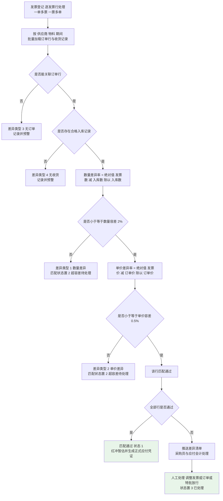

**伪代码：**

```java
/**
 * 三单匹配（PUR-05）
 * 容差：数量 ±2%（purchase.match.qty-tolerance）、单价 ±0.5%（purchase.match.price-tolerance），均取自 SYS-06
 */
@Transactional(rollbackFor = Exception.class)
public MatchResultVO match(PurInvoiceMatchDTO dto) {
    PurInvoice invoice = invoiceMapper.selectById(dto.getInvoiceId());
    // 1. 批量加载候选订单行与收货记录（一次查询，避免 N+1）
    List<PurOrderLine> orderLines = orderLineMapper.listBySupplierAndMaterial(
            invoice.getSupplierId(), invoice.getMaterialIds(), invoice.getPeriod());
    Map<String, BigDecimal> receivedQtyMap = receiptMapper.sumQualifiedQtyByOrderLine(invoice.getInvoiceId());
    BigDecimal qtyTolerance = paramService.getDecimal("purchase.match.qty-tolerance", new BigDecimal("0.02"));
    BigDecimal priceTolerance = paramService.getDecimal("purchase.match.price-tolerance", new BigDecimal("0.005"));

    List<MatchDiffVO> diffs = new ArrayList<>();
    List<MatchedLine> matched = new ArrayList<>();
    for (PurInvoiceLine line : invoice.getLines()) {
        PurOrderLine orderLine = findBestMatchLine(line, orderLines);
        if (orderLine == null) { diffs.add(MatchDiffVO.of(DIFF_NO_ORDER, line)); continue; }
        BigDecimal receivedQty = receivedQtyMap.getOrDefault(key(orderLine), BigDecimal.ZERO);
        if (receivedQty.signum() == 0) { diffs.add(MatchDiffVO.of(DIFF_NO_RECEIPT, line)); continue; }
        // 2. 数量容差：|发票数量 - 入库数量| / 入库数量 <= 容差
        BigDecimal qtyDeviation = BigDecimalUtil.divide(
                BigDecimalUtil.subtract(line.getInvoiceQty(), receivedQty).abs(), receivedQty, 6, HALF_UP);
        if (qtyDeviation.compareTo(qtyTolerance) > 0) {
            diffs.add(MatchDiffVO.ofQty(line, receivedQty, qtyDeviation, qtyTolerance)); continue;
        }
        // 3. 单价容差：|发票单价 - 订单单价| / 订单单价 <= 容差
        BigDecimal priceDeviation = BigDecimalUtil.divide(
                BigDecimalUtil.subtract(line.getInvoiceUnitPrice(), orderLine.getUnitPrice()).abs(),
                orderLine.getUnitPrice(), 6, HALF_UP);
        if (priceDeviation.compareTo(priceTolerance) > 0) {
            diffs.add(MatchDiffVO.ofPrice(line, orderLine, priceDeviation, priceTolerance)); continue;
        }
        matched.add(MatchedLine.of(line, orderLine, receivedQty));
    }
    // 4. 结果判定与凭证联动
    if (diffs.isEmpty()) {
        voucherService.reverseEstimateAndCreatePayable(invoice, matched);      // 红冲暂估 + 正式应付（跨域 Service）
        payableService.createFormalPayable(invoice, matched);                  // 应付立账
        updateSettlementStatus(matched);
        matchMapper.updateStatus(invoice.getId(), MatchStatusEnum.PASSED);
        return MatchResultVO.passed(matched);
    }
    matchDiffMapper.batchInsert(invoice.getId(), diffs);                      // 差异记录
    matchMapper.updateStatus(invoice.getId(), MatchStatusEnum.OVER_TOLERANCE);
    log.warn("三单匹配超容差, invoiceNo={}, diffCount={}", invoice.getInvoiceNo(), diffs.size());
    return MatchResultVO.overTolerance(diffs);                                // 不生成正式应付
}
```

**复杂度：** 单张发票 O(L + M)（L 发票行数、M 候选订单行数），候选行一次性加载；批量匹配按发票分页处理（每批 200 张）。

**幂等与边界：** ①重复匹配不重复生成凭证（凭证幂等键 `source_biz_type + source_biz_id + voucher_type`）；②发票金额自身不一致（`发票金额 ≠ 数量 × 单价`）抛 `12202`；③容差比较使用 6 位小数，`compareTo` 而非 `equals`；④单价为 0 的订单行不允许匹配（除零保护，抛 `12203`）。

### 5.6 暂估入库与红冲（PUR-06）

| 项 | 设计 |
|----|------|
| 暂估触发时点 | 收货单审核通过且存在合格数量（`status=1` 或 `2`）时**即时**生成暂估凭证（≤1 分钟，PUR-06 验收要点①） |
| 暂估金额口径 | **按采购订单不含税单价 × 合格入库数量**（`qualified_qty × pur_order_line.unit_price`），6 位小数 |
| 暂估分录 | 借：原材料（1403）／贷：应付账款-暂估（2202）；金额 = 上述暂估金额 |
| 覆盖规则 | **全部合格入库且未匹配发票的收货单 100% 生成暂估**，不提供人工跳过入口（PUR-06）；覆盖率统计 = 已暂估收货单数 ÷ 应暂估收货单数 = 100% |
| 立账 | 同事务写 `fin_payable`（`payable_source=1-暂估应付`、`due_date = 收货日 + 供应商付款条件天数`、`amount`、`status=0`） |
| 红冲时点 | 发票到达且**三单匹配通过**后自动生成红字凭证红冲暂估（金额相等、方向相反） |
| 红冲步骤 | ①按收货单维度取原暂估凭证与暂估应付记录；②生成红字凭证（`voucher_type=2`，分录方向相反，金额取负）；③原暂估凭证置 `2-已红冲`，记录红冲关系（`reversed_voucher_id`）；④暂估应付余额归零（`fin_payable` 暂估记录置 `3-已红冲`）；⑤生成正式应付凭证与正式应付立账（`payable_source=2-正式应付`） |
| 跨期处理 | 若发票在**下一期间**到达：①上一期间已关闭时，**红冲在开放期间执行**（不得回改已关闭期间）；②暂估金额与正式金额的差异（价格差异）计入**本期采购价格差异**科目（分录：借 材料成本差异／贷 应付账款，或反向）`【数据库设计需补充：fin_voucher_entry.diff_flag 或新增 fin_cost_variance 表】`；③上月暂估未匹配清单条数为月结检查项（FIN-08） |
| 幂等 | 暂估与红冲均以 `(source_biz_type, source_biz_id, voucher_type)` 为幂等键；重复触发返回已有凭证 |
| 查询 | 暂估清单可按供应商/期间查询；"上月暂估未匹配清单"可查条数 |

### 5.7 采购价格管理（PUR-07）

| 项 | 设计 |
|----|------|
| 数据结构 | 价格历史来源于 `pur_order_line`（已审核订单）；无需独立历史表（如需加速可建 `pur_price_history` 视图/物化视图）`【数据库设计需补充（可选）：pur_price_history 汇总表（supplier_id、material_id、order_date、unit_price、order_code）】` |
| 取值口径 | **上次采购价** = 该"供应商 + 物料"最近一次已审核订单的不含税单价（按 `order_date DESC` 取 1 条）；**历史最低价** = 同组合历史最低不含税单价（含对应日期） |
| 实现（避免 N+1） | 下单时批量取全部明细组合的价格提示：`SELECT supplier_id, material_id, unit_price, order_date, order_code FROM pur_order_line l JOIN pur_order o ON o.id = l.order_id WHERE o.order_status IN (1,2,3) AND (o.supplier_id, l.material_id) IN (...) ORDER BY order_date DESC`，在内存分组取"最近一条"与"最小值"；结果缓存 `purchase:price:{supplierId}:{materialId}`（TTL 10 分钟） |
| 预警 | 本次单价高于最近价 `> 10%`（参数 `purchase.price.warn-ratio`）→ 前端提示 + **要求填写价格说明**（后端强校验，缺失拒绝） |
| 价格走势 | 按供应商/物料/期间查询与导出（RPT-03）；数据点与 `pur_order_line` 逐点一致 |
| 权限 | 价格历史查询受数据权限约束（采购员仅见本人负责供应商数据，按 `pur_order.buyer_id`） |

### 5.8 供应商绩效评估（PUR-08）

**4 维度评分（总分 100），自然月周期：**

| 维度 | 分值 | 计算公式 | 数据来源 |
|------|------|---------|---------|
| 交货准时率 | **40** | 准时率 = 准时批次 ÷ 总批次；得分 = 40 × 准时率。**准时判定**：收货单 `receipt_date` 的日期 ≤ 采购订单行 `required_date`（按订单行 × 收货批次统计） | `pur_order_line` + `pur_receipt` |
| 质量合格率 | **30** | 合格率 = Σ`qualified_qty` ÷ Σ`receipt_qty`；得分 = 30 × 合格率 | `pur_receipt` |
| 价格水平 | **20** | 偏离度 = `(该供应商该物料月均价 − 同类物料月均价) ÷ 同类物料月均价`；偏离度 ≤ −5% 得 20 分；−5%~0 得 16 分；0~5% 得 12 分；5%~10% 得 8 分；>10% 得 4 分；**同类物料**口径 = 同一物料全部供应商月均价的算术平均 | `pur_order_line` |
| 服务响应 | **10** | 响应时长（异常/退货从发出到供应商确认的平均小时数）≤24h 得 10；≤48h 得 7；≤72h 得 4；>72h 得 0；响应时长由人工在退货单/异常单录入 | `pur_return`（人工录入字段 `response_hours`）`【数据库设计需补充：pur_return.response_hours】` |

**计算与统计口径：**

1. **统计频率**：每月 1 日 02:00 定时任务（2.9）；自然月周期（上月 1 日 00:00:00 ~ 月末 23:59:59）；
2. **计算步骤**：①按供应商 + 物料分组批量汇总（一次 SQL，禁止 N+1）；②按上表公式计算 4 维度得分（6 位小数 HALF_UP，最终分值保留 2 位）；③总分 = 4 维度之和；④评级：**A ≥90、B 75~89、C <75**；⑤写评分明细 + 总分（`pur_supplier_score`、`pur_supplier_score_detail`）；
3. **幂等与重算**：按 `(supplier_id, period)` 唯一键；重复执行**覆盖**而非累加；
4. **趋势**：可查连续多月评分趋势；评分结果用于下单时供应商展示排序（**仅展示建议，不强制约束**）；
5. **边界**：无业务数据的供应商（批次数为 0）当月不计分并标记"无数据"；准时率分母为 0 时该维度得 0 分并记录原因；
6. **一致性**：RPT-03 的准时率/合格率与评分明细**同一 SQL 口径**（差额 0）。

---

## 六、销售模块详细设计（D6）

### 6.1 销售订单（SAL-01~SAL-04）

**承载类：** `business.sales.core.service.SalOrderService` / `impl`；表 `sal_order` + `sal_order_line` + `sal_delivery_plan`（分批交货计划）。

#### 6.1.1 创建步骤与明细计算（SAL-01）

1. **入参校验**：客户存在且启用；订单日期非空；要求交货日期 ≥ 订单日期；承诺交货日期默认 = 要求交货日期；
2. **明细校验**：物料存在且**启用**（3.2.3 拦截点 1）；`qty > 0`；`unit_price ≥ 0`；`tax_rate` 默认 13.00；币别默认 `CNY`；行号在单据内连续唯一；
3. **批量取价**：按 SAL-07 价格策略批量取适用单价（一次查询，禁止 N+1）；人工可调整但受授权区间约束（审核时校验）；
4. **行金额计算**：`lineAmount = unit_price × qty`（不含税）；`taxAmount = lineAmount × (tax_rate ÷ 100)`；`lineAmountWithTax = lineAmount + taxAmount`（全部 6 位 HALF_UP）（SAL-01 验收要点①⑤）；
5. **单据金额**：`total_amount = Σ lineAmountWithTax`；落库前断言头金额 = 明细汇总；
6. **分批交货计划（结构化，SAL-01 细化）**：写入 `sal_delivery_plan`：`plan_seq`（批次号 1..n）、`plan_date`、`plan_qty`、`plan_status`（0-未发货 1-部分发货 2-已发货 3-已取消）；**校验 `Σ plan_qty = Σ 明细 qty`**，不等则拒绝并提示差异（SAL-01 验收要点②）；不接受文字备注形式；
7. **付款条件**：默认取客户 `settlement_type`（月结 30/60 天等）；
8. **编号生成**：`SO + YYYYMM + 3 位`（如 `SO202608001`）；
9. **落库**：头 + 明细 + 分批计划同事务；状态 `0-草稿`、`approval_status = 0-待审`；
10. **幂等**：`Idempotent-Key` + `uniq_sal_order_code`。

#### 6.1.2 审核校验矩阵（SAL-02）

| 序 | 校验项 | 判定规则（公式） | 不通过 |
|----|-------|----------------|-------|
| 1 | 客户有效性 | 客户存在且启用；不在黑名单 | `13001-13049` |
| 2 | 信用额度 | **可用额度 = 信用额度 − 已审核未发货订单金额 − 未核销应收余额**；`订单含税金额 ≤ 可用额度` 通过；不足时**转特批流程**（销售总监审批，**必须填写特批原因**） | `13001`（额度不足，消息含缺口金额） |
| 3 | 信用期限 | 客户 `credit_days` 存在；付款条件与信用期限不一致时给出提示（允许继续） | 提示 |
| 4 | 物料有效性 | 全部明细物料存在且**启用**（停用物料拒绝，SAL-02 验收要点⑤） | `13002` |
| 5 | 单价授权区间 | 授权区间 = 基准价 ×(1 ± `sales.price.fluctuation`（默认 **±5%**）)；基准价 = 适用价格策略价或标准售价；超出区间 → 转特批（必须填写原因）。示例：标准售价 1,900、下浮 5% 下限 1,805，录入 1,780 触发（SAL-02 验收要点③） | `13003`（越界，消息含基准价与区间） |
| 6 | 交期可行性 | 交期早于当前日期 → 强制确认；关联已下达工单的预计完工日期晚于要求交期 → 给出**交期风险提示**（允许继续，记录提示） | 提示 |
| 7 | 金额一致性 | `total_amount = Σ 明细含税金额`（差额 0） | `13004` |
| 8 | 分批计划完整性 | `Σ plan_qty = Σ 明细 qty`；计划日期 ≥ 订单日期 | `13005` |
| 9 | 状态 | 必须 `order_status = 0-草稿` 且 `approval_status ∈ {0-待审, 2-驳回}` | `13006` |

**信用控制开关：** 参数 `sales.credit.enabled`（默认**开启**）；关闭时跳过校验项 2 并记录"信用控制已关闭"提示（SYS-06）。

**特批流程：** ①审核命中项 2 或 5 → 订单 `approval_status` 保持 `0-待审`，生成特批任务；②销售总监审批（权限点 `sales:order:special-approve`）→ 通过后 `approval_status=1`、`order_status=1`；驳回则填写原因、`approval_status=2`；③特批记录（申请人、审批人、原因、时间）落库 + 审计日志（SAL-02 验收要点④）。

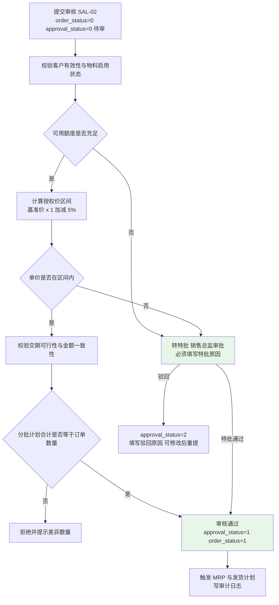

#### 6.1.3 订单变更（SAL-04）

| 项 | 设计 |
|----|------|
| 变更范围 | 数量、单价、交期（含分批计划调整）；变更走**变更申请 + 审批**，不直接改原单 |
| 数据结构 | `sal_order_change`（变更单头：`change_code`、`order_id`、`change_type`、`before_json`、`after_json`、`approval_status`、`reason`）+ 明细差异表 `sal_order_change_line`（行号、字段、原值、新值）`【数据库设计需补充：sal_order_change、sal_order_change_line 表】` |
| 处理步骤 | ①创建变更申请（记录字段级前后值）；②校验：**已发货行不允许将数量减少到低于已发货数量**（`newQty ≥ delivered_qty`，违反抛 `13050-13099`）；③审批；④审批通过前按原值执行、通过后按新值执行（更新 `sal_order` 与明细，历史版本保留在变更单）；⑤**重新校验信用额度**（金额变化时，SAL-04 验收要点④）；⑥写审计日志（可按单据号检索） |
| 差异对比展示 | 变更历史接口返回逐字段 before/after（如"改前 50 / 改后 30"），前端表格对比展示（SAL-04 验收要点②） |
| 分批计划联动 | 变更数量后未发货批次的 `plan_qty` 同步调整并再次校验合计一致；已发货批次不可修改 |
| 幂等 | 变更单编号唯一 + 审批状态守卫（重复审批返回"状态不匹配"） |

### 6.2 发货与出库（SAL-05）

**承载类：** `SalDeliveryService`（发货通知单）、`SalOutboundService`（销售出库单）；表 `sal_delivery_note` + `sal_outbound` + 明细。

**处理步骤：**

1. **生成发货通知单**：按销售订单分批交货计划生成（**一批次对应一张**）；编号 `DN + YYYYMM + 3 位`；发货数量默认 = 该批次计划数量，可下调但**不得超过未发货余额**（超限抛 `13101`）；
2. **仓库拣货确认**：按物料/批次拣货（批次推荐规则同 4.4.4），确认后生成销售出库单（`OD + YYYYMM + 3 位`）；
3. **出库与流水**：出库单审核 → 调用 `StockService.changeStock`（`trans_type=30`、`outQty=出库数量`）；可用量不足拦截；`after_qty = before_qty − outQty`（SAL-05 验收要点①）；
4. **成本结转与凭证**：出库成本 = `出库数量 × 移动加权平均单价`；同事务生成凭证（借 主营业务成本 贷 库存商品），借贷平衡（差额 0）（SAL-05 验收要点⑤）；
5. **回填 `delivered_qty` 与订单状态**（判定规则见下表）；
6. **幂等**：同一发货通知单重复提交仅产生 1 条流水（SAL-05 验收要点④）；
7. **事务**：发货通知单状态 + 出库单 + 库存流水 + 快照 + 凭证 + 订单回填**同一事务**。

**`delivered_qty` 回填与订单状态判定规则：**

| 步骤 | 处理 |
|------|------|
| 1 | 出库成功 → `sal_order_line.delivered_qty += 出库数量`（条件更新 + 乐观锁；`delivered_qty ≤ qty` 强校验） |
| 2 | 更新分批计划行 `plan_status`：已发货数量 = `plan_qty` → `2-已发货`；`0 < 已发货 < plan_qty` → `1-部分发货` |
| 3 | 订单状态判定：全部明细 `delivered_qty = qty` → `3-已发货`；存在部分行 `0 < delivered_qty < qty` → `2-部分发货`；全为 0 → 保持 `1-审核` |
| 4 | **已出库数量**、**已开票数量**（`invoiced_qty`）、**已收款金额**为独立累计字段，由出库/开票登记/收款核销分别回填（SAL-03） |
| 5 | 状态回写与回填同一事务；重复出库由流水幂等拦截，不重复累加 |

### 6.3 销售退货 RMA（SAL-06）

| 阶段 | 处理步骤 |
|------|---------|
| 退货申请 | 关联原销售订单与出库批次；校验 `退货数量 ≤ 原订单已发货数量 − 已退货数量`（超限抛 `13150`）；编号 `SR + YYYYMM + 3 位`；状态 0-申请 |
| 质检确认 | 录入合格数量 / 不合格数量（合计 = 退货数量）；合格 → 退货入库；不合格 → 报废或入隔离仓二次处理 |
| 退货入库 | 合格数量调用 `StockService.changeStock`（入库方向，`trans_type=25-销售退货入库`，**按原出库单价回冲成本**，SAL-06 验收要点⑤） |
| 退款/换货 | **退款**：生成红字应收冲减（金额 = 退货数量 × 销售单价，示例 5 × 1,850 = 9,250 元）；已收款时生成退款单并核销；**换货**：生成新的发货通知单（走 6.2 流程） |
| 库存与收入冲减 | 库存增加（按原成本价回冲）；收入冲减（红字凭证：借 主营业务收入 + 应交税费-销项税 贷 应收账款）；成本冲减（借 库存商品 贷 主营业务成本） |
| 留痕 | 各环节操作人与时间写审计日志（SAL-06 验收要点④） |
| 幂等 | 退货单 + 物料 + 方向 为流水幂等键；红字凭证以退货单为幂等键 |

### 6.4 销售价格管理（SAL-07）

**价格策略模型：** 表 `sal_price_policy`（`policy_type`（1-客户+物料 2-客户等级+品类 3-品类 4-标准售价）、`customer_id`/`customer_level`/`category_id`/`material_id`、`min_qty`、`max_qty`（数量阶梯，左闭右开）、`price`、`discount`、`effective_date`、`expiry_date`、`status`）`【数据库设计需补充：sal_price_policy 表】`。

**取价优先级（高 → 低）：**

| 优先级 | 匹配条件 | 说明 |
|-------|---------|------|
| 1 | **客户 + 物料** | 专属协议价，命中即用 |
| 2 | **客户等级 + 产品品类** | 如"重点客户 + 变频器品类"（折扣 50 元/台 → 1,850 元，SAL-07 验收要点①） |
| 3 | **品类** | 与客户无关的品类价 |
| 4 | **标准售价** | 兜底 |

**同优先级多条策略：** 按**数量阶梯**匹配（`min_qty ≤ 下单数量 < max_qty`），多条满足时取 `effective_date` **最新**者；仍并列取 `id` 最小者（结果确定性，可单测）。

**处理步骤：** ①下单时批量加载候选策略（按客户 + 客户等级 + 品类 + 物料，一次查询）；②按优先级与阶梯过滤排序；③取命中策略的 `price`，或按 `discount` 计算（`price = 标准售价 − discount`，6 位 HALF_UP）；④人工调整受授权区间约束（SAL-02 校验项 5）；⑤**历史售价查询**：按客户 + 物料返回历史成交记录（来源：已审核销售订单行，含成交日期、成交单价、折扣金额）；⑥策略变更须审核并写审计日志。

### 6.5 跟单看板（SAL-08）与订单执行状态跟踪（SAL-03）

**查询链路设计（外购件 ↔ 采购订单、自制件 ↔ 生产工单）：**

| 链路 | 关联方式 | 展示内容 |
|------|---------|---------|
| 销售订单 → 自制件 → 生产工单 | `mf_order.sal_order_id = sal_order.id`，物料维度按 `mf_order.material_id ∈ 订单明细物料` | 工单状态、工序完成率、合格率、预计完工日期（MFG-09） |
| 销售订单 → 外购件 → 采购订单 | MRP 建议转单链路：`mf_mrp_plan_item → pur_application_line → pur_order_line`；无 MRP 链路时按 `(物料 + 需求日期区间)` 近似关联并标注"近似匹配" | 采购订单执行状态（下单/到货/质检/入库/未到货余额） |

**订单执行状态数据来源与查询口径（SAL-03）：**

| 展示项 | 数据来源 | 查询口径 |
|-------|---------|---------|
| 已发货数量 | `sal_order_line.delivered_qty` | 出库审核时累加 |
| 已出库数量 | `inv_transaction`（`trans_type=30`，`source_biz_type=SALES_SHIPMENT`） | 按订单行关联的出库单汇总 `SUM(out_qty)` |
| 已开票数量 | `sal_order_line.invoiced_qty` | 开票登记（税控/电子发票回写或手工登记）时累加 |
| 已收款金额 | `fin_receivable.received_amount` | 按订单关联的应收单核销金额汇总 |
| 未发货余额 | `qty − delivered_qty` | 实时计算（不落库） |
| 关联工单进度 | `mf_order` + 报工汇总 | 状态、工序完成率 = 已完工工序数 ÷ 总工序数、合格率 = Σ合格数 ÷ Σ完工数、预计完工日期（MFG-09） |
| 关联采购订单 | `pur_order_line.received_qty` | 已收货/未收货余额 |

**聚合方式与性能：** ①单订单详情页采用**一次多表 JOIN 查询**（订单 + 明细 + 发货计划 + 出库汇总 + 工单汇总 + 采购汇总），禁止在循环内逐行查询；②列表页（订单执行清单）用 Mapper.xml 一次性聚合（`GROUP BY order_id`），限制查询区间（默认近 12 个月，可调）；③目标响应：详情 ≤3 秒、列表 ≤2 秒（P-04）；④数据延迟 ≤1 分钟（发运/报工回写后即时可见，列表页不缓存聚合结果）。

**看板过滤与权限：** 支持"紧急（要求交期 ≤ 3 天）、超期（要求交期 < 当日且未发完）、未排产（无关联工单）"过滤；数据受 SYS-04 约束（业务员仅见本人负责客户，越界返回 0 条）；提供"一键复制订单执行摘要"（后端生成文本，内容与页面一致）。

---

## 七、生产制造模块详细设计（D7）

### 7.1 MRP 详细设计（MFG-01~MFG-03）

**承载类：** `business.manufacturing.core.service.MrpService` / `impl.MrpServiceImpl`；表 `mf_mrp_plan`（计划主表）+ `mf_mrp_plan_item`（建议明细）+ `mf_mrp_param`（参数与参数快照）。

#### 7.1.1 输入与参数表（MFG-02）

| 参数 | 默认值 | 影响 |
|------|-------|------|
| 考虑现有库存 `considerStock` | **是** | 参与净需求抵扣（取**可用量** = `qty − frozen_qty`） |
| 考虑在途采购 `considerOnOrder` | **是** | 抵扣"已审核未入库采购订单未收货数量"（`qty − received_qty`，`order_status ∈ {1,2}`） |
| 考虑在制工单 `considerWip` | **是** | 抵扣"已下达未完工工单预计产出"（`planned_qty − completed_qty`，`order_status ∈ {1,2,3}`） |
| 考虑安全库存 `considerSafetyStock` | **是** | 净需求中**加回**安全库存 |
| 考虑提前期 `considerLeadTime` | **是** | 按采购/生产提前期倒排建议日期 |
| 考虑冻结期 `considerFrozenPeriod` | 否 | 冻结期内不安排开工（本期默认关闭） |
| 运算范围 `runScope` | 全量 | 全量 / 指定销售订单 / 指定物料范围 |
| 批量规则 | 按物料 `min_order_qty` | 建议量按最小采购批量向上取整 |
| 委外在途 | **不参与**（MFG-10 验收要点④） | 本期净需求不引入委外在途量 |

**参数快照：** 每次运算将全部参数与取值写入 `mf_mrp_param`（`plan_id` + 参数键值 + 操作人 + 时间），供复算与对比（MFG-02 验收要点②）；参数变更写审计日志。

#### 7.1.2 净需求计算公式（MFG-01）

**净需求 = 毛需求 − 现有可用库存 − 在途采购 − 在制工单 + 安全库存**

字段级定义：

| 项 | 计算口径 | 数据来源 | 边界处理 |
|----|---------|---------|---------|
| 毛需求 `grossQty` | BOM 多级展开（3.3.2）按物料汇总后的需求量（含损耗率） | 销售订单 / 主生产计划 + BOM 展开 | 同物料多路径累加 |
| 现有可用库存 `availableStock` | `Σ (inv_stock.qty − inv_stock.frozen_qty)`（跨全部仓库汇总；仓维度可用时按需求仓库优先取该仓） | `inv_stock` | 负库存按 0 处理 |
| 在途采购 `onOrderQty` | `Σ (pur_order_line.qty − pur_order_line.received_qty)`（`pur_order.order_status ∈ {1,2}`） | `pur_order_line` | 参数关闭时按 0 |
| 在制工单 `wipQty` | `Σ (mf_order.planned_qty − mf_order.completed_qty)`（`mf_order.order_status ∈ {1,2,3}`） | `mf_order` | 参数关闭时按 0 |
| 安全库存 `safetyStock` | `base_material.safety_stock`（缺省 0） | `base_material` | 参数关闭时按 0 |
| 净需求 `netQty` | `netQty = grossQty − availableStock − onOrderQty − wipQty + safetyStock` | 计算 | **`netQty ≤ 0` 时不生成建议行**（视为满足需求） |

**取整规则：** 采购建议量 = `ceil(netQty ÷ min_order_qty) × min_order_qty`（**向上取整**到最小采购批量整数倍，6 位小数）；生产建议量 = `ceil(netQty ÷ 生产批量)`（生产批量缺省按 1，即不取整）。

#### 7.1.3 多级展开运算完整步骤（MFG-01）

1. **收集需求来源**：按运算范围取销售订单（`order_status ∈ {1,2}` 未发货部分：`qty − delivered_qty`）或指定的主生产计划；组装"初始需求列表"（物料 + 数量 + 需求日期 = 明细要求交货日期）；
2. **预加载基础数据（一次性，内存驻留）**：①全部生效 BOM（头 + 明细，`IN` 批量）；②全部物料计划属性（`lead_time`/`production_lead_time`/`safety_stock`/`min_order_qty`/`source_type`/`abc_class`）；③全部库存可用量（`inv_stock` 一次聚合）；④在途采购（一次聚合）；⑤在制工单（一次聚合）；**禁止循环内查库**；
3. **逐层展开**：按 BOM-01 的多级展开算法（3.3.2）将初始需求展开至全部层（最多 10 层），得到毛需求集合（物料 + 累计需求 + 最早需求日期 + 路径）；
4. **逐物料计算净需求**：按 7.1.2 公式计算 `netQty`；`netQty ≤ 0` 跳过（不生成建议）；
5. **自制 / 外购判定**：`base_material.source_type = 2-外购` → 生成**采购建议**；`1-自制` → 生成**生产建议**；`3-外协` → 生成**委外建议（本期按采购建议处理并标注"外协"）**；
6. **提前期倒排**：
   - 采购建议：`建议到货日期 = 需求日期`；`建议下单日期 = 需求日期 − lead_time`（`considerLeadTime` 关闭时下单日期 = 需求日期）；
   - 生产建议：`建议完工日期 = 需求日期`；`建议开工日期 = 需求日期 − production_lead_time`；
7. **批量取整**：按 `min_order_qty` 向上取整（采购）；生产按生产批量取整；
8. **低层码处理（逐层迭代语义）**：同一物料在多层出现时，**按"最低层码（最深层级）的需求日期最早者"作为该物料的统一需求日期**，数量取全部路径累加（避免重复建议与日期冲突）；
9. **计划参数缺失清单**：对 `lead_time = 0 且 source_type = 2`、或 `safety_stock` 未维护的物料，输出"计划参数缺失"清单（MD-03 验收要点④）；
10. **结果落库**：写 `mf_mrp_plan`（`plan_code = MP + YYYYMM + 3 位`、`run_time`、`plan_status = 0-新生成`、参数快照关联、运算范围、耗时）+ `mf_mrp_plan_item`（物料、建议数量、建议类型、建议开始/完成日期、建议供应商、`converted_status = 0-未转`）；**按批次分页批量插入**（每批 500 条）；
11. **进度回写**：运算过程按批次写 Redis `mrp:run:progress:{planCode}`（已处理/总数），前端轮询展示进度；
12. **失败重跑幂等**：整批运算以 `plan_code` 隔离；重跑生成**新批次**（不覆盖历史批次）；同一批次内失败则删除该批次已写入数据并标记失败（可重跑）；转单幂等由 `converted_status` 保证。

#### 7.1.4 输出与建议转单（MFG-03）

| 输出 | 字段 |
|------|------|
| 采购建议 | 物料编码、物料名称、建议采购量、建议到货日期、建议下单日期、建议供应商（取物料默认供应商）、当前库存、在途量、净需求 |
| 生产建议 | 物料编码、物料名称、建议生产量、建议开工日期、建议完工日期、BOM 版本 |
| 计划主表状态 | 0-新生成 1-已转 2-已关闭 |
| 建议行状态 | `converted_status`：0-未转 1-已转采购单 2-已转工单 |

**转单步骤（MFG-03）：**

1. 用户在建议清单勾选行 → 调用 `POST /api/manufacturing/mrp/plans/{planId}/items/convert-to-application`（采购）或 `.../convert-to-work-order`（生产）；
2. 校验：建议行 `converted_status = 0`（否则直接返回"已转单"提示，**不生成第二张单据**）；建议行数量 > 0；
3. 生成下游单据：采购建议 → 采购申请（`source = MRP`，记录 `plan_code` 与建议行 ID）；生产建议 → 生产工单（`order_status = 0-计划`，锁定当时的 BOM 版本）；
4. 回写建议行 `converted_status`（1 或 2）+ 目标单据 ID（条件更新 + 乐观锁）；
5. 全部行已转 → 计划主表 `plan_status = 1-已转`；
6. 事务：建议行状态 + 下游单据头/明细同事务；幂等：状态标记 + 下游单据唯一约束双保险；
7. 审计：转单动作写审计日志（含建议批次号与目标单据号）。

#### 7.1.5 性能设计（P-03：5,000 种物料全量 <30 分钟）

| 手段 | 说明 |
|------|------|
| 内存展开 | BOM 结构、物料计划属性、库存/在途/在制汇总数据**一次性批量加载**到内存（预计内存占用 <200MB），展开与净需求计算全部在内存完成 |
| 批量查询替代 N+1 | 全部汇总数据用 5 次聚合 SQL 取得（BOM、物料属性、库存、在途、在制）；运算过程**零数据库查询** |
| 并行处理 | 按"顶层成品"分片并行（`@Async("mrpExecutor")` 线程池，核心 4 / 最大 8 / 有界队列 200）；每个分片处理完成后再汇总去重（低层码合并） |
| 批量写库 | 结果按 500 条/批 `batchInsert`（单批短事务），避免十万级大事务 |
| 进度与可观测 | 每批回写进度到 Redis；任务日志记录开始/结束/耗时/建议条数；耗时超阈值（默认 25 分钟）告警 |
| 预计算与缓存预案 | ①BOM 展开结果可按 `(父件, 版本, 计划数量)` 缓存（TTL 30 分钟）供重复运算复用；②若 SIT 实测不达标，启用"BOM 展开结果中间表"预案（定时任务预计算，幂等可重跑，ADR-19） |
| 分批与失败重跑 | 单分片失败不影响其他分片；失败分片可单独重跑；整批可重跑且不污染历史批次 |
| 复制运算（对比） | 支持按历史批次参数快照复算（生成新批次，便于对比） |

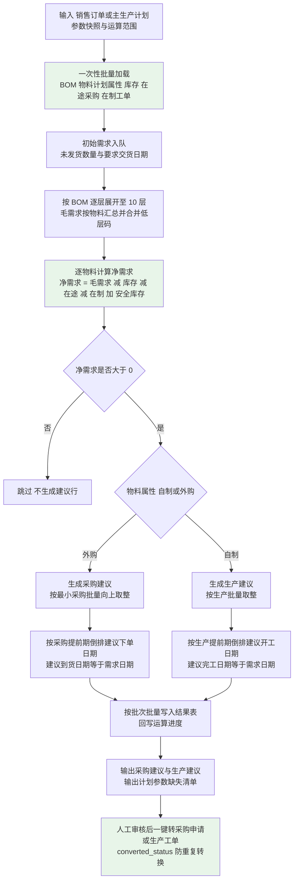

**伪代码：**

```java
/**
 * MRP 全量运算（MFG-01/02/03）
 * 性能目标：5,000 种物料全量 < 30 分钟；内存展开，零循环内查库
 */
@Transactional(rollbackFor = Exception.class)
public MrpPlanVO run(MrpRunDTO dto) {
    String planCode = codeGenerator.generateCode(BizTypeEnum.MRP_PLAN);          // MP202608001
    MrpContext ctx = loadContext(dto);                                           // 步骤 2：5 次批量聚合查询
    saveParamSnapshot(planCode, dto);                                            // 步骤 8（参数快照）

    // 步骤 3：初始需求 → BOM 多级展开（3.3.2）
    List<GrossDemand> grossList = new ArrayList<>();
    for (OrderDemand demand : ctx.getOrderDemands()) {
        grossList.addAll(bomExpandService.expandMultiLevel(
                demand.getMaterialId(), null, MAX_LEVEL, demand.getOpenQty()));
    }
    Map<Long, GrossDemand> merged = mergeByMaterialWithLowLevelCode(grossList);  // 步骤 8 低层码合并

    // 步骤 4~7：净需求与建议生成
    List<MrpPlanItem> items = new ArrayList<>();
    for (GrossDemand gross : merged.values()) {
        BaseMaterial material = ctx.getMaterials().get(gross.getMaterialId());
        BigDecimal available = ctx.getStockMap().getOrDefault(gross.getMaterialId(), BigDecimal.ZERO);
        BigDecimal onOrder  = Boolean.TRUE.equals(dto.getConsiderOnOrder())
                ? ctx.getOnOrderMap().getOrDefault(gross.getMaterialId(), BigDecimal.ZERO) : BigDecimal.ZERO;
        BigDecimal wip      = Boolean.TRUE.equals(dto.getConsiderWip())
                ? ctx.getWipMap().getOrDefault(gross.getMaterialId(), BigDecimal.ZERO) : BigDecimal.ZERO;
        BigDecimal safety   = Boolean.TRUE.equals(dto.getConsiderSafetyStock())
                ? nullToZero(material.getSafetyStock()) : BigDecimal.ZERO;
        BigDecimal netQty = BigDecimalUtil.subtract(gross.getGrossQty(), available);
        netQty = BigDecimalUtil.subtract(netQty, onOrder);
        netQty = BigDecimalUtil.subtract(netQty, wip);
        netQty = BigDecimalUtil.add(netQty, safety);                              // 净需求公式
        if (netQty.signum() <= 0) { continue; }                                    // 不生成建议
        items.add(buildSuggestion(material, netQty, gross.getRequireDate(), dto));  // 步骤 5~7（含取整与提前期倒排）
    }
    // 步骤 10~11：分批批量落库 + 进度回写
    mrpPlanMapper.insert(buildPlan(planCode, dto, items.size()));
    batchInsertWithProgress(items, planCode, 500);
    return MrpPlanVO.of(planCode, items.size());
}
```

#### 7.1.6 运算参数缺省处理规则（与 MD-03 细化口径一致）

| 缺失项 | 缺省处理 | 提示 |
|-------|---------|------|
| 采购提前期未维护 | 按 **0 天** 参与运算（建议下单日期 = 建议到货日期） | 进入"计划参数缺失"清单 |
| 生产提前期未维护 | 按 **0 天** 参与运算 | 同上 |
| 安全库存未维护 | 按 **0** 参与运算（不抵扣需求） | 同上 |
| 最小采购批量未维护 | 按 **1** 取整 | —— |
| 默认供应商未维护 | 采购建议的"建议供应商"为空 | 转采购申请时由采购员补录 |
| BOM 不存在（外购件无 BOM） | 视为叶子节点，不再展开 | —— |
| 未维护 MPC（主生产计划） | 以销售订单未发货数量为需求来源 | —— |

### 7.2 生产工单（MFG-04）

**承载类：** `MfgOrderService` / `impl`；表 `mf_order`（+ `mf_order_operation` 工序，如启用工序管理）`【数据库设计需补充（可选）：mf_order_operation 表（work_order_id、seq_no、operation_name、planned_qty、completed_qty、qualified_qty）】`。

**创建步骤：**

1. 来源识别：①MRP 生产建议转工单（记录 `plan_code` 与建议行 ID）；②手工创建（关联销售订单，MTO）；
2. 校验：产品物料存在且启用；`planned_qty > 0`；`planned_start_date ≤ planned_end_date`；关联销售订单存在且状态 ∈ {1,2,3}；
3. **BOM 选定**：取该产品当前**生效**版本（`status=2`）写入 `bom_id`，同时写入版本快照字段 `bom_version_lock`；校验 BOM 合法性（3.3.4）；
4. 生成工单号 `MO + YYYYMM + 3 位`（如 `MO202608032`）；状态 `0-计划`；`completed_qty = 0`、`scrapped_qty = 0`；
5. 按 BOM 明细生成工序/领料需求预置（可选：领料单在首次领料时按需生成）；
6. 事务：工单头 + 工序/明细 + 建议行状态回写同事务；幂等：幂等键 + `uniq_mf_order_work_order_code`。

**6 态状态机与合法流转矩阵：**

| 当前状态 | 允许动作 | 目标状态 | 触发条件与副作用 |
|---------|---------|---------|----------------|
| `0-计划` | 下达 `issue` | `1-已下达` | 锁定 BOM 版本（`bom_id` 不可再改）；`planned_start_date` 生效 |
| `0-计划` | 逻辑删除 `DELETE` | —— | `is_deleted = 1`（仅计划态可删） |
| `0-计划` | 取消关闭 `close` | `5-已关闭` | 不产生任何库存与凭证 |
| `1-已下达` | 首次领料 | `2-领料中` | 写 `trans_type=40` 流水；记录 `actual_start_date` |
| `1-已下达` | 取消 `cancel` | `5-已关闭` | 仅有领料记录时须先冲销领料流水 |
| `2-领料中` | 继续领料 | `2-领料中` | 分次领料，累计校验 |
| `2-领料中` | 首次报工 | `3-加工中` | 写报工记录；`completed_qty` 累加 |
| `3-加工中` | 继续报工 / 完工入库 | `3-加工中` | 入库数量 ≤ 未完工数量 |
| `3-加工中` | 完工入库且 `completed_qty = planned_qty` | `4-已完工` | 记录 `actual_end_date` |
| `4-已完工` | 关闭 `close` | `5-已关闭` | 可关闭；亦可继续完工入库（未达计划数量时不允许进入 4） |
| `5-已关闭` | 任何动作 | —— | **禁止领料与报工**（抛 `15001-15049`） |

**非法流转拒绝规则：** 每个动作接口声明允许的前置状态集合，不在集合内一律拒绝并提示当前状态与目标状态（如"已完工工单继续领料被拒"、"已关闭工单报工被拒"，MFG-04 验收要点③）；重复动作（幂等）返回"状态不匹配"而非重复写入。

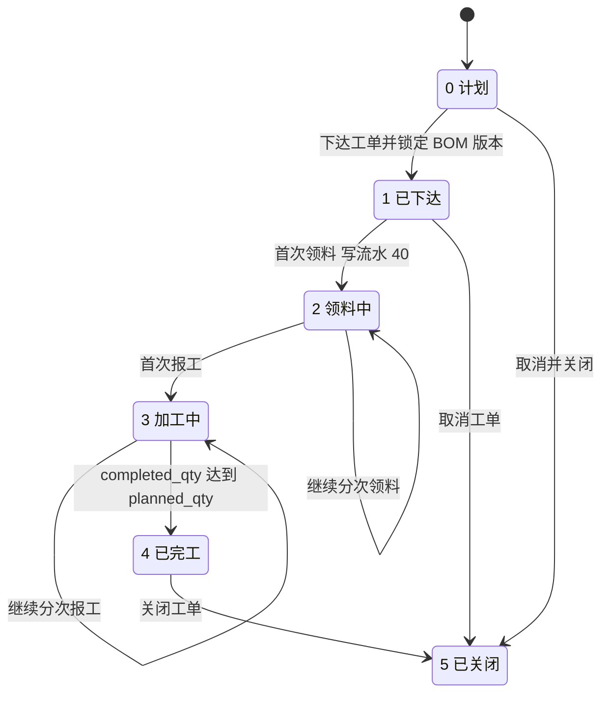

**下达校验清单：**

| 序 | 校验 | 判定 |
|----|------|------|
| 1 | 状态 | 必须为 `0-计划` |
| 2 | BOM 有效性 | `bom_id` 指向 BOM `status = 2`，`effective_date ≤ 当日 ≤ expiry_date`（或 expiry 为空） |
| 3 | 物料有效性 | 产品物料及 BOM 子件均为**启用**状态（3.3.4 校验 ⑤） |
| 4 | 库存可获得性 | 按 BOM 定额量与当前可用量比对，输出**缺料清单与预计齐套日期**（不阻断下达，供计划员决策；`remark` 记录） |
| 5 | 数量与日期 | `planned_qty > 0`；`planned_start_date ≤ planned_end_date`；开工日期不早于当日（早于时需确认） |
| 6 | 关联订单 | 关联销售订单状态 ∈ {1,2,3}（已关闭订单不可投产） |

### 7.3 生产领料（MFG-05）

| 项 | 设计 |
|----|------|
| 生成方式 | 按工单 + **锁定的 BOM 版本**自动生成定额领料单（`mf_order_issue`，编号 `MI + YYYYMM + 3 位`）；支持按需分次生成（每次生成未领足部分） |
| 定额量公式 | `定额应领数量 planned_qty = 工单计划数量 × 子件用量 × (1 + 损耗率)`，6 位小数 HALF_UP（示例：100 × 2 × 1.03 = 206） |
| 明细字段 | 子件物料、`planned_qty`（定额）、`actual_qty`（实际领料）、仓库、库位、批次、替代料标记、`approval_status`、`over_qty_reason` |
| 领料步骤 | ①生成领料单（草稿）；②仓管员/车间确认实际领料数量；③若 `actual_qty > planned_qty` → 触发**超定额审批**（车间主任 → 生产经理，按超出比例分级；**必须填写原因**）；④审核通过 → 调用 `StockService.changeStock`（`trans_type=40`）；⑤回写工单状态（首次领料 → `2-领料中`，记录 `actual_start_date`）；⑥累计领料校验 |
| 超领上限 | 累计领料 ≤ `定额 × (1 + 超领上限 10%)`；超出拒绝（抛 `15050-15099`），须特批（权限点 `manufacturing:issue:over-approve`） |
| 分次领料 | 允许；每条领料单生成 1 条流水；示例：分 2 次累计 206 → 2 条流水、数量合计 206（MFG-05 验收要点②） |
| 库位/批次分配 | 默认物料默认库位；批次按"先到期先出"推荐（同 4.4.4），可人工指定 |
| 事务 | 领料单状态 + 审批结论 + 库存流水 + 快照 + 凭证 + 工单状态回写**同一事务** |
| 幂等 | 领料单 + 物料 + 方向 为流水幂等键；重复审核不产生第二条流水 |

### 7.4 生产报工（MFG-06）

| 项 | 设计 |
|----|------|
| 记录要素 | 工单号、工序（`operation_seq`/`operation_name`）、完工数量 `completed_qty`、合格数量 `qualified_qty`、不合格数量 `defect_qty`、报废数量 `scrapped_qty`、工时（小时，6 位小数）、操作人、操作时间、班次 |
| 校验规则 | **`合格数量 + 不合格数量 ≤ 完工数量`**（违反抛 `15101-15149`，MFG-06 验收要点②）；`完工数量 ≥ 0`；工时 ≥ 0；工单状态必须 ∈ {2-领料中, 3-加工中}（已关闭/已完工拒绝） |
| 累计校验 | Σ 各工序完工数量 ≤ 工单 `planned_qty`；`scrapped_qty` 累计 ≤ `planned_qty` × 报废阈值（参数 `mfg.scrap.warn-ratio`，默认 5%，超阈值标记异常） |
| 状态联动 | **首次报工** → 工单状态由 `2-领料中` 变为 `3-加工中`（MFG-06 验收要点③） |
| 撤销 | 报工在"工序未流转至下一步且未生成成本数据"时可撤销（记录撤销人/时间/原因，写审计日志）；已参与成本归集的报工不可撤销 |
| 工时用途 | 直接人工成本 = Σ 报工工时 × 工时单价（MFG-08 / FIN-05）；工时统计进 RPT-05 |
| 合格率与完成率 | 合格率 = `Σ qualified_qty ÷ Σ completed_qty`；工序完成率 = 已报工工序数 ÷ 总工序数（按 `mf_order_operation` 或 BOM 明细汇总） |
| 事务与幂等 | 报工写入 + 工单状态回写 + 进度统计更新同事务；幂等：`(work_order_id, operation_seq, report_time, operator)` 唯一约束防重复提交 |
| 数据时效 | 报工即更新工单进度（MFG-09），延迟 ≤1 分钟 |

### 7.5 完工入库（MFG-07）

| 项 | 设计 |
|----|------|
| 单据 | 完工入库单（`mf_complete`，编号 `FI + YYYYMM + 3 位`）；仓库路由：半成品 → 半成品仓；成品 → 苏州成品仓或东莞成品仓 |
| 入库数量约束 | 入库数量 ≤ `planned_qty − completed_qty`（超限抛 `15150-15199`，MFG-07 验收要点③） |
| 写流水 | 调用 `StockService.changeStock`（`trans_type=20`），同时增加 `mf_order.completed_qty` 并扣减在制数量（在制由 `planned_qty − completed_qty` 派生，不落库） |
| 凭证 | 同事务生成凭证（借 库存商品 贷 生产成本），借贷平衡（差额 0） |
| 状态流转 | `completed_qty = planned_qty` → 工单状态置 `4-已完工`，记录 `actual_end_date`（MFG-07 验收要点②） |
| 部分完工 | 允许多次部分完工入库；每次入库独立生成流水与凭证（凭证按批次金额） |
| 入库成本 | 未核算前按标准成本暂记并标记待调整；成本核算（FIN-05）后由调整凭证修正差额 |
| 幂等 | 完工入库单 + 物料 + 方向 为流水幂等键 |
| 事务 | 入库单 + 流水 + 快照 + 凭证 + 工单回填同一事务 |

### 7.6 工单成本归集（MFG-08）

**承载类：** `MfgOrderCostService` / `impl`；表 `mf_order_cost`（工单成本归集结果）`【数据库设计需补充：mf_order_cost 表（work_order_id、period、material_cost、labor_cost、overhead_cost、total_cost、completed_qty、unit_cost、calc_time、calc_status）】` + `mf_order_cost_detail`（明细：成本类型、来源单据、来源明细 ID、数量、单价、金额）`【数据库设计需补充：mf_order_cost_detail 表】`。

| 成本项 | 计算口径 | 数据来源 | 归集时点 |
|-------|---------|---------|---------|
| 直接材料成本 | `Σ (实际领料数量 × 物料移动加权平均出库单价)`；按领料流水明细逐条计算（含替代料） | `mf_order_issue` + `inv_transaction`（`trans_type=40` 的 `out_qty × unit_cost`） | **月末成本运算时**（与 FIN-05 联动）；亦支持按需试算 |
| 直接人工成本 | `Σ (报工工时 × 工时单价)`；工时单价按**车间/工序**由财务维护 | `mf_work_report` + `mf_labor_rate`（车间/工序 × 期间 → 单价）`【数据库设计需补充：mf_labor_rate 表（org_id、workshop_id、operation_name、period、hourly_rate）】` | 同上 |
| 制造费用 | 按**工时**分摊（默认）或按产量分摊：`制造费用 = 分摊基础量 × 分摊率`；分摊率由财务维护（期间 + 车间维度） | `fin_overhead_rate`（期间、车间、分摊方式、分摊率）`【数据库设计需补充：fin_overhead_rate 表（period、workshop_id、allocate_method、rate）】` | 同上 |

**归集步骤：**

1. 确定归集期间与工单范围（`order_status ∈ {3-加工中, 4-已完工}`；已关闭工单不归集）；
2. **材料成本**：一次聚合查询按工单汇总领料金额（`GROUP BY work_order_id`），并保留明细（物料、批次、数量、单价、金额、来源领料单号）供下钻；**替代料按替代料编码与用量记录**（BOM-04 验收要点②）；
3. **人工成本**：一次聚合查询按工单汇总工时，再按车间/工序单价折算（批量加载单价表，禁止 N+1）；
4. **制造费用**：按选定分摊基础（工时优先，工时缺失时按产量）计算；
5. `total_cost = material_cost + labor_cost + overhead_cost`（6 位 HALF_UP）；
6. **完工与在制分配**：`完工产品成本 = total_cost × 完工数量 ÷ (完工数量 + 在制约当产量)`；`在制成本 = total_cost − 完工产品成本`（在制约当产量 = `planned_qty − completed_qty`，本期按**数量法**分摊）；
7. 产品实际单位成本 = `完工产品成本 ÷ completed_qty`（分母为 0 时单位成本记为 0 并在结果中标记"无完工数量"）；
8. 落库 `mf_order_cost`（工单维度）+ `mf_order_cost_detail`（成本明细，支持下钻至物料与批次、工序与报工记录）；
9. 与 FIN-05 衔接：FIN-05 汇总 `mf_order_cost` 得到产品实际成本（口径一致，差额 0）；
10. **幂等与重算**：按 `(work_order_id, period)` 唯一键，重复执行**覆盖**（先删后插或 UPSERT）；月内重算不影响已生成凭证（差额通过调整凭证处理）；
11. 分批处理：按工单分页（每批 500 个工单）短事务提交。

**一致性校验：** ①材料成本 = 实际领料金额合计（误差 0）；②人工成本 = 报工工时合计 × 工时单价（误差 0）；③制造费用按分摊率计算正确（误差 0）；④工单成本合计与 FIN-05 产出的产品成本口径一致（差额 0）。

**伪代码：**

```java
/**
 * 工单成本归集（MFG-08）——分批短事务，按 (work_order_id, period) 幂等覆盖
 */
@Transactional(rollbackFor = Exception.class)
public void collectBatch(String period, List<Long> workOrderIds) {
    // 1. 批量聚合（禁止 N+1）
    Map<Long, BigDecimal> materialMap = issueMapper.sumMaterialCostByOrder(workOrderIds, period);   // Σ out_qty × unit_cost
    Map<Long, BigDecimal> hoursMap    = reportMapper.sumHoursByOrder(workOrderIds, period);
    Map<Long, BigDecimal> materialDetail = ...;   // 明细供下钻
    Map<String, BigDecimal> laborRate    = laborRateService.loadRateMap(period);                    // 车间/工序 → 单价
    Map<Long, BigDecimal> overheadRate   = overheadRateService.loadRateMap(period);                 // 车间 → 分摊率

    for (Long orderId : workOrderIds) {
        MfgOrder order = orderCache.get(orderId);
        BigDecimal materialCost = nullToZero(materialMap.get(orderId));
        BigDecimal hours        = nullToZero(hoursMap.get(orderId));
        BigDecimal laborCost    = BigDecimalUtil.multiply(hours, laborRateService.rateOf(order, laborRate), 6);
        BigDecimal overheadCost = BigDecimalUtil.multiply(
                "HOURS".equals(order.getAllocateMethod()) ? hours : order.getCompletedQty(),
                overheadRateService.rateOf(order, overheadRate), 6);
        BigDecimal totalCost = BigDecimalUtil.add(BigDecimalUtil.add(materialCost, laborCost), overheadCost);

        // 完工与在制分配（数量法）
        BigDecimal wipQty = BigDecimalUtil.subtract(order.getPlannedQty(), order.getCompletedQty());
        BigDecimal finishedCost = wipQty.signum() == 0 ? totalCost
                : BigDecimalUtil.multiply(totalCost,
                    BigDecimalUtil.divide(order.getCompletedQty(),
                        BigDecimalUtil.add(order.getCompletedQty(), wipQty), 6, HALF_UP), 6);
        BigDecimal unitCost = order.getCompletedQty().signum() == 0 ? BigDecimal.ZERO
                : BigDecimalUtil.divide(finishedCost, order.getCompletedQty(), 6, HALF_UP);
        upsertOrderCost(orderId, period, materialCost, laborCost, overheadCost, totalCost, unitCost);   // 幂等覆盖
        saveCostDetail(orderId, period, materialDetail);
    }
}
```

### 7.7 工单进度跟踪（MFG-09）

| 展示项 | 计算口径 |
|-------|---------|
| 状态 | `mf_order.order_status`（6 态） |
| 已领料情况 | 应领 = Σ 定额（`planned_qty`）；已领 = Σ 实际领料（`actual_qty`）；差异 = 应领 − 已领（实时计算） |
| 各工序完工进度 | 每工序：完工数 / 计划数 / 合格率（`qualified_qty ÷ completed_qty`），来源 `mf_work_report` 按工序汇总 |
| 剩余工时估算 | `剩余工时 = 已完工序平均工时 × 剩余工序数`；平均工时 = Σ 已报工工时 ÷ 已完工工序数（无数据时按 0 并提示"数据不足"） |
| 预计完工日期 | `max(计划完工日期, 当日 + 剩余工时 ÷ 日可用工时)`（日可用工时由参数 `mfg.daily-hours` 默认 8 小时）；亦结合已完工序速率推算 |
| 关联信息 | 关联销售订单号与客户（`mf_order.sal_order_id → sal_order.customer_id`） |
| 异常标记 | 超期未完工（`planned_end_date < 当日` 且 `order_status < 4`）、超领（累计领料 > 定额）、报废超阈值（`scrapped_qty ÷ planned_qty > 5%`） |
| 筛选与响应 | 按工单状态、产品、销售订单、计划完工日期筛选；进度查询 ≤3 秒（MFG-09 验收要点④）；报工即更新（≤1 分钟） |
| 实现要点 | 工单列表用 Mapper.xml 一次聚合（工单 + 领料汇总 + 报工汇总），禁止逐工单查询；`idx_mf_order_sal_order`、`idx_mf_work_report_order` 支撑 |

### 7.8 委外加工（MFG-10，P2）

| 环节 | 设计 |
|------|------|
| 委外工单 | 复用 `mf_order` 并 `order_type = 2-委外`；记录外协厂商（`supplier_id`）、工序、数量、加工单价、预计回收日期 |
| 发料 | 生成委外发料单 → 调用 `changeStock`（出库方向，`trans_type=40`，`warehouse` = 委外仓/在途仓）；**外协期间物料按"委外在途"单独统计，不计入本厂可用库存**（MFG-10 验收要点③） |
| 外协收货 | 生成外协收货单 → 调用 `changeStock`（入库方向，`trans_type=20`），同时记录质检结论；入库成本 = 材料成本 + 加工费（金额可核对） |
| 短少差异 | 发出数量与回收数量自动比对；短少（差异 ≠ 0）生成差异记录并**要求审批**（差异数量、差异原因、责任人） |
| 费用结算 | 加工费计入工单**制造费用**（MFG-08）；生成应付（`fin_payable`，来源 `MFG_OUTSOURCE`） |
| MRP 口径 | **本期 MRP 净需求公式不引入委外在途量**（MFG-10 验收要点④） |
| 幂等 | 发料/收货以委外工单 + 方向为流水幂等键；应付以委外工单为幂等键 |

---

## 八、财务模块详细设计（D8）

### 8.1 凭证自动生成规则（FIN-01，核心）

**承载类：** `business.finance.core.service.VoucherService` / `impl.VoucherServiceImpl`；表 `fin_voucher` + `fin_voucher_entry` + `fin_subject` + `fin_period` + `fin_voucher_template`（科目映射配置）。

#### 8.1.1 通用机制

| 机制 | 设计 |
|------|------|
| 触发时点 | 业务单据**审核通过/过账动作**时触发（采购入库、采购退货、生产领料、完工入库、销售出库、销售退货、盘点差异审批、三单匹配、收款付款核销、折旧计提、期末结转）；触发在**同一业务事务内**（保证"库存数量 ↔ 存货金额 ↔ 凭证分录"三者一致） |
| 凭证号生成 | `FZ + YYYYMM + 3 位流水`（由 SYS-07 引擎按月重置）；凭证号唯一约束兜底 |
| 借贷平衡校验 | 生成分录后**必须**校验 `Σ 借方金额 = Σ 贷方金额`（6 位小数精确比较，差额必须为 0）；不平衡 → **拒绝生成**并抛 `16001`（`VOUCHER_NOT_BALANCED`），同事务回滚（业务单据一并回滚） |
| 期间校验 | ①凭证 `period` 取业务发生日期所在自然月；②生成与过账前校验 `fin_period.status`：**已关闭期间禁止新增、修改、过账**（抛 `16350-16399`）；③已过账凭证的冲销须在**开放期间**执行 |
| 过账后不可修改 | `voucher_status = 0-草稿` 可修改分录、可删除、可过账；`= 1-已过账` **禁止**修改/删除，仅允许查询、打印、导出；`= 2-已红冲` 表示已被红字凭证冲销（原凭证保留，红冲关系可查） |
| 来源单据幂等 | 唯一约束 `uniq_fin_voucher_source(source_biz_type, source_biz_id, voucher_type)`；生成前先查重，已存在 → **直接返回已有凭证**（不重复生成，A-04/I-04）；重复触发（重复审核）不产生第二张凭证 |
| 红冲机制 | 红字凭证 `voucher_type = 2`：分录方向相反、金额取负、`summary` 标注"冲销 {原凭证号}"；原凭证 `voucher_status` 置 `2-已红冲`，`reversed_voucher_id` 记录红冲关系 `【数据库设计需补充：fin_voucher.reversed_voucher_id】` |
| 双向可追溯 | 凭证必带 `source_biz_type` + `source_biz_id`；单据详情可反查凭证，凭证可回溯来源单据（追溯率 100%，FIN-01 验收要点②） |
| 贷方科目方向 | 分录 `direction`：1-借 2-贷；科目 `subject_direction` 用于报表余额方向的正确展示 |
| 币别 | 本期单一账套、主币种 CNY；保留 `currency` 与汇率字段，外币凭证按 6 位小数记录原币与本位币金额 `【数据库设计需补充：fin_voucher_entry.currency、fin_voucher_entry.exchange_rate、fin_voucher_entry.base_amount】` |
| 账套 | 本期**单一账套**（不建多账套）；报表与账龄口径仅取**已过账**凭证 |

**生成步骤（统一）：**

1. 业务域 Service 在事务内调用 `voucherService.generateByStockTransaction(trans, dto)`（或对应业务方法）；
2. **幂等查重**：按 `(source_biz_type, source_biz_id, voucher_type)` 查 `fin_voucher`；命中则返回已存在凭证；
3. **科目映射解析**：按 `业务类型 → 科目映射配置` 取借方/贷方科目（见 8.1.2、8.1.3）；
4. **金额口径计算**：按映射表"金额口径"列计算（如"合格入库数量 × 采购订单不含税单价"）；
5. **期间校验**：`fin_period.status`；
6. **构造凭证与分录**：`voucher_code` 取号；分录按借贷方向生成（一笔业务可拆多行分录，如采购发票含税额拆分）；
7. **借贷平衡校验**：`total_debit = total_credit`（差额 0）；
8. **写入** `fin_voucher`（`voucher_status = 0-草稿`）+ `fin_voucher_entry`；
9. **过账**：若业务要求即时过账（本期默认**自动过账**，由参数 `finance.voucher.auto-post` 默认 `true` 控制）→ 置 `voucher_status = 1-已过账`；
10. **辅助账联动**：应收/应付立账明细更新（8.3、8.4）；
11. 写审计日志（`operateType = POST`，含凭证号与借贷合计）；日志埋点按 4.11 规范（含凭证号与借贷合计）。

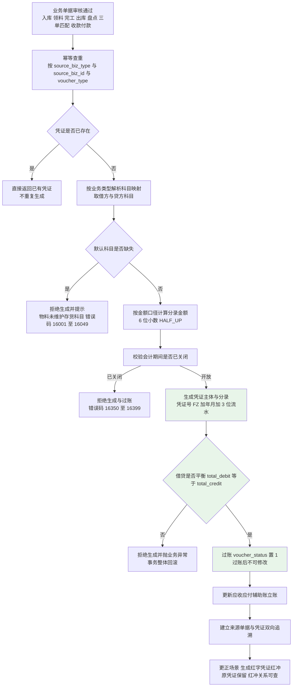

#### 8.1.2 业务类型 → 借贷科目映射表

| 序 | 业务类型 | 触发单据 | 借方科目 | 贷方科目 | 金额口径 | 备注 |
|----|---------|---------|---------|---------|---------|------|
| 1 | 采购入库（暂估） | 收货单审核（`status=1/2`） | 原材料（1403） | 应付账款-暂估（2202） | 合格入库数量 × 采购订单不含税单价（6 位） | **100% 覆盖**，不支持人工跳过；同步写暂估应付 |
| 2 | 暂估红冲 | 三单匹配通过 | 应付账款-暂估（2202） | 原材料（1403） | 等于原暂估金额（方向相反） | 红字凭证；原暂估凭证置已红冲；暂估余额归零 |
| 3 | 采购发票校验（正式应付） | 三单匹配通过 | 原材料（1403）+ 应交税费-应交增值税（进项税额） | 应付账款（2202） | 不含税金额 = 发票数量 × 发票不含税单价；进项税 = 不含税金额 × 税率 | 暂估金额与正式金额差异计入"材料成本差异"（跨期场景） |
| 4 | 采购退货 | 采购退货单审核 | 应付账款-暂估／应付账款（2202） | 原材料（1403） | 退货数量 × 原入库单价 | 与库存退货出库同事务；红冲对应暂估/正式应付 |
| 5 | 生产领料 | 领料单审核（`trans_type=40`） | 生产成本（5001） | 原材料（1403） | Σ（领料数量 × 移动加权平均出库单价） | 金额取流水 `unit_cost × out_qty` |
| 6 | 生产完工入库 | 完工入库单审核（`trans_type=20`） | 库存商品（1405）／半成品（1404） | 生产成本（5001） | 入库数量 × 当期工单单位成本（未核算时按标准成本暂记） | 成本核算后调整差额 |
| 7 | 销售出库（成本结转） | 销售出库单审核（`trans_type=30`） | 主营业务成本（6401） | 库存商品（1405） | Σ（出库数量 × 移动加权平均出库单价） | 与出库流水金额一致（差额 0） |
| 8 | 销售开票/确认收入 | 开票登记（税控/电子发票回写或手工登记） | 应收账款（1122） | 主营业务收入（6001）+ 应交税费-应交增值税（销项税额） | 不含税收入 = 开票数量 × 销售不含税单价；销项税 = 不含税收入 × 税率 | 应收立账（8.3） |
| 9 | 销售退货冲回 | 销售退货单审核 | 主营业务收入（6001）+ 应交税费-销项税 | 应收账款（1122） | 退货数量 × 销售单价（含税/不含税拆分） | 红字凭证；已收款时另生成退款单 |
| 10 | 销售退货成本冲回 | 销售退货入库（`trans_type=25`） | 库存商品（1405） | 主营业务成本（6401） | 退货数量 × **原出库单价** | 与退货入库同事务 |
| 11 | 收款核销 | 收款单核销 | 银行存款（1002）／库存现金（1001） | 应收账款（1122） | 核销金额（支持部分核销与预收） | 预收部分计入预收账款（2203） |
| 12 | 付款核销 | 付款单核销 | 应付账款（2202） | 银行存款（1002） | 核销金额（支持部分付款） | 付款登记与银行回单人工导入 |
| 13 | 盘盈 | 盘点差异审批通过（`trans_type=70`） | 原材料（1403）／库存商品（1405） | 待处理财产损溢（1901） | 盘盈数量 × 当前移动加权平均单价 | 审批前不生成任何调整流水与凭证 |
| 14 | 盘亏 | 盘点差异审批通过（`trans_type=80`） | 待处理财产损溢（1901） | 原材料（1403）／库存商品（1405） | 盘亏数量 × 当前移动加权平均单价 | 同上 |
| 15 | 期初建账（存货） | INV-11 期初库存建账（`trans_type=90`） | 原材料／库存商品（按物料存货科目） | 期初调账科目（3101） | 期初数量 × 期初单价 | 存货科目期初金额必须与 FIN-09 一致（差额 0） |
| 16 | 期初余额建账（科目） | FIN-09 期初余额提交 | 各资产/负债/权益类科目（按录入方向） | 各资产/负债/权益类科目（按录入方向） | 录入的期初余额 | **试算平衡校验：借方合计 = 贷方合计**，不平衡禁止提交 |
| 17 | 期末结转（损益） | 月结执行 | 主营业务收入（6001）等损益类科目 | 本年利润（4103） | 各损益类科目本期发生额 | 结转后损益类科目余额为 0 |
| 18 | 期末结转（成本） | 月结执行 | 本年利润（4103）／生产成本（5001） | 制造费用（5101）／生产成本（5001） | 制造费用与生产成本结转金额 | 与 FIN-05 成本核算结果一致 |
| 19 | 汇兑损益 | 月结执行（外币科目重估） | 财务费用-汇兑损益（6603）／外币科目 | 外币科目／财务费用-汇兑损益（6603） | 外币余额 ×（月末汇率 − 账面汇率） | 按科目方向确定借贷 |
| 20 | 固定资产折旧 | 月度计提 | 制造费用（5101）／管理费用（6602） | 累计折旧（1602） | 按折旧方法与月折旧额计算 | 按使用部门归集费用科目 |
| 21 | 固定资产处置/报废 | 资产报废单审核 | 固定资产清理（1606）+ 累计折旧（1602） | 固定资产（1601）；清理净损益转营业外收支 | 原值、已提折旧、处置收入 | 生成处置损益 |

> **科目编码说明：** 上表科目编码为**示例口径**，实际科目体系以 `fin_subject` 中维护的 1~4 级科目为准（叶子科目可记账）；映射配置以科目 ID 存储，不硬编码编码值。

#### 8.1.3 科目映射的可配置性

| 层级 | 配置位置 | 说明 |
|------|---------|------|
| 业务默认科目 | `fin_voucher_template`（按 `biz_type` + `direction` 配置借方/贷方科目）`【数据库设计需补充：fin_voucher_template 表（biz_type、direction、subject_id、priority、status）】` | 全部 21 类业务类型的借方/贷方科目集中配置；改配置 ≤1 分钟生效 |
| 物料级覆盖 | `base_material.inventory_subject_id`（存货科目）、`cost_subject_id`（成本科目）、`revenue_subject_id`（收入科目） | 优先取物料级科目，缺失时回落到模板默认科目 |
| 参数级兜底 | `sys_param` 中的默认科目参数（`finance.subject.inventory.default` 等） | 物料与模板均缺失时取参数值 |
| 缺失处理 | 上述三层均未配置时：**凭证生成失败**并抛 `16001-16049`，消息"物料 01-03-000128 未维护存货科目，请先维护后重试"；**不允许**使用兜底科目静默入账，**不允许**跳过生成（覆盖率必须 100%） |

### 8.2 存货核算（FIN-04，本期仅移动加权平均）

**承载类：** `InventoryCostService` / `impl`；与库存域 `StockServiceImpl` 在**同一事务**内协作（成本计算不得独立事务）。

**公式：** `新单位成本 = (原结存金额 + 本次入库金额) ÷ (原结存数量 + 本次入库数量)`，除法 6 位小数 `HALF_UP`。

| 项 | 设计 |
|----|------|
| 执行时点 | **每次入库后即时重算**（`trans_type ∈ {10, 20, 25, 50, 70, 90}`）：入库流水写入前调用 `recalcInbound`，计算结果同时写入 `inv_transaction.unit_cost` 与 `inv_stock.unit_cost` |
| 出库成本 | 出库（`trans_type ∈ {30, 40, 60, 80, 85}`）取**当前移动加权平均单价**（`inv_stock.unit_cost`），写入 `inv_transaction.unit_cost`，供凭证与工单成本归集使用 |
| 结存金额 | `结存金额 = 结存数量 × 单位成本`（6 位 HALF_UP）；一致性校验：`结存数量 × 单位成本 = 结存金额`（差额 0，FIN-04 验收要点①） |
| 零库存边界 | `原结存数量 + 本次入库数量 = 0` → **除零保护**：单位成本取本次入库单价（`本次入库金额 ÷ 本次入库数量`），仍为 0 时取 `base_material.standard_cost` 并标记"成本待确认" |
| 负库存边界 | 系统禁止负库存（库存变动步骤 7 已拦截 `after_qty < 0`），因此不会出现负结存量；若出现历史脏数据（结存数量 < 0），单位成本取本次入库单价并 `log.error` 告警 |
| 入库数量为 0 | 单位成本保持不变（不重算），流水 `unit_cost` 记 0 |
| 舍入 | 全程 6 位小数 `HALF_UP`；比较用 `compareTo` |
| 与流水对账 | 出库流水 `unit_cost` 必须等于出库前该物料（维度）的移动加权平均单价；日终对账任务校验 `结存数量 × 单位成本 = 结存金额`（差额 0） |
| 收发存汇总 | 输出存货收发存汇总表（物料/仓库维度）：`期初 + 入库 − 出库 = 期末`（**数量与金额差额均为 0**，FIN-04 验收要点②），由 Mapper.xml 一次聚合（按期间取流水汇总 + 期初结存） |
| 下钻 | 成本结果可下钻到库存流水（`inv_transaction`）明细（FIN-04 验收要点③） |
| 性能 | 5,000 种物料月度核算（含收发存汇总）≤30 分钟（FIN-04 验收要点④）：按物料分页批次（每批 500）处理，批量查询流水汇总，禁止逐条查询 |
| 计价方法 | **本期仅移动加权平均**；`cost_method = 1`（先进先出）写入被拒绝（3.2.2、3.2.5），月末一次加权平均不在字段取值内 |

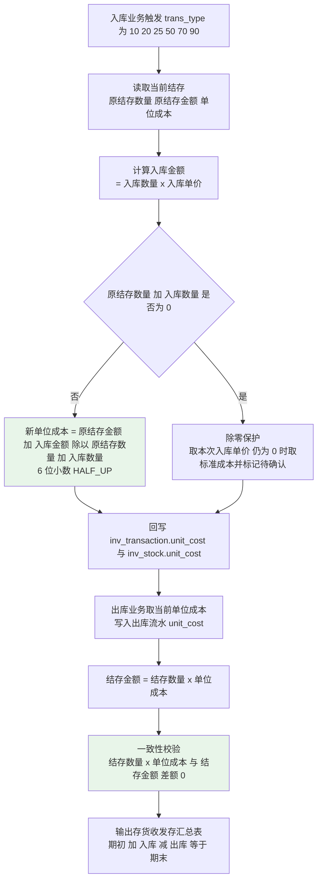

**伪代码：**

```java
/**
 * 入库移动加权平均重算（FIN-04）——与库存变动同事务
 * 除零保护：原结存 + 入库数量 = 0 时取本次入库单价
 */
public BigDecimal recalcInbound(InvStock stock, StockChangeDTO dto) {
    BigDecimal oldQty   = nullToZero(stock.getQty());
    BigDecimal oldCost  = nullToZero(stock.getUnitCost());
    BigDecimal oldAmount = BigDecimalUtil.multiply(oldQty, oldCost, 6);                // 原结存金额
    BigDecimal inAmount  = BigDecimalUtil.multiply(dto.getInQty(), dto.getUnitCost(), 6); // 本次入库金额
    BigDecimal newQty    = BigDecimalUtil.add(oldQty, dto.getInQty());
    if (newQty.signum() == 0) {                                                        // 除零保护
        if (dto.getInQty().signum() == 0) { return oldCost; }
        BigDecimal fallback = BigDecimalUtil.divide(inAmount, dto.getInQty(), 6, HALF_UP);
        if (fallback.signum() == 0) {
            log.warn("入库成本为 0 且无结存, materialId={}, 采用标准成本暂记", dto.getMaterialId());
            return materialCache.get(dto.getMaterialId()).getStdCost();
        }
        return fallback;
    }
    BigDecimal newAmount = BigDecimalUtil.add(oldAmount, inAmount);
    return BigDecimalUtil.divide(newAmount, newQty, 6, HALF_UP);                        // 新单位成本
}
```

### 8.3 应收账款（FIN-02）

| 项 | 设计 |
|----|------|
| 立账时点 | ①销售出库/开票后自动生成应收凭证并立账（`fin_receivable`）；②开票登记（税控/电子发票回写或手工登记）时更新 `invoiced_qty` 与应收金额；③示例：SC-01 订单出库后立账金额与订单含税金额口径一致 |
| 字段 | `receivable_code`（`AR + YYYYMM + 3 位`）、`customer_id`、`source_biz_type`、`source_biz_id`、`amount`（应收金额）、`received_amount`（已收金额）、`due_date`（到期日 = 出库日/开票日 + 客户信用期限）、`status`（AR/AP 状态：0-未核销 1-部分核销 2-已核销 3-已红冲） |
| 收款核销 | 支持**一单多收**（一张应收分次收款）与**一收多单**（一张收款单核销多张应收）；核销写入核销明细 `fin_settlement`（收款单 ID、应收单 ID、核销金额、核销时间、操作人）`【数据库设计需补充：fin_settlement 表（source_type、source_id、target_type、target_id、amount、settle_date）】`；预收（收款金额 > 应收余额）部分计入预收账款并挂账 |
| 核销步骤 | ①登记收款单（客户、金额、收款日期、银行账户、回单号）；②选择核销目标（自动推荐按到期日升序的应收单，可手工调整）；③校验 `Σ 核销金额 ≤ 收款金额` 且 `Σ 核销金额（单张） ≤ 该应收余额`；④更新 `received_amount`（条件更新 + 乐观锁）、更新 `status`；⑤生成核销凭证（序 11）；⑥写审计日志 |
| **账龄分析口径** | **起算日 = `fin_receivable.due_date`**（到期日）；逾期天数 = `分析基准日 − due_date`（`> 0` 才计入逾期）；账龄区间定义（**左开右闭**）：<br/>· `未到期`：基准日 < 到期日或 = 到期日<br/>· `1~30 天`：逾期天数 ∈ (0, 30]<br/>· `31~60 天`：∈ (30, 60]<br/>· `61~90 天`：∈ (60, 90]<br/>· `90 天以上`：> 90<br/>**分档金额合计必须 = 应收余额（差额 0）**（FIN-02 验收要点②）；口径说明在界面展示（可点击查看） |
| 余额口径 | 应收余额 = `Σ (amount − received_amount)`（`status ∈ {0,1}`，排除已红冲）；按客户汇总 |
| 逾期提醒 | 定时任务（2.9）：**到期前 7 天**提醒一次；**逾期后每周**提醒一次（按周粒度去重）；提醒清单可按客户/业务员筛选与导出，记录提醒历史 |
| 对账单 | 按客户导出应收对账单（期间内应收发生、收款、余额），导出行数 = 界面行数；受数据权限约束 |
| 权限与掩码 | 应收查询受 SYS-04（按客户负责人/组织）；金额按角色掩码（非财务角色按区间展示） |
| 性能 | 账龄分析 ≤5 秒（P-04）：走 `fin_receivable`（`idx_fin_receivable_customer_due(customer_id, due_date)`）+ 一次聚合，不扫凭证 |

### 8.4 应付账款（FIN-03）

| 项 | 设计 |
|----|------|
| 立账时点 | ①**暂估**：收货单审核通过时立暂估应付（`payable_source = 1-暂估应付`）；②**正式**：三单匹配通过时立正式应付（`payable_source = 2-正式应付`）；③红冲后暂估余额归零 |
| 字段 | `payable_code`（`AP + YYYYMM + 3 位`）、`supplier_id`、`source_biz_type`、`source_biz_id`、`amount`、`paid_amount`、`due_date`（**到期日 = 收货日 + 供应商付款条件天数**，FIN-03 验收要点①）、`payable_source`、`status` |
| 付款申请审批 | 流程：应付会计/采购员发起 → 财务经理审批 → 付款登记；审批记录（申请人、审批人、金额、时间、意见）落库 + 审计日志（FIN-03 验收要点⑤） |
| 付款登记与核销 | 支持**一单多付**与**一付多单**；银行回单人工导入（银企直连本期不实现，客户接口需求 6.1 替代方案）→ 核销明细写 `fin_settlement`；核销金额必须与回单金额一致（差额 0） |
| 余额与付款计划 | 应付余额 = `Σ (amount − paid_amount)`；付款计划 = 按 `due_date` 排序的待付款清单（含暂估与正式分列） |
| 暂估与正式分列 | 界面与报表分列展示；红冲后暂估余额必须为 0（FIN-03 验收要点③） |
| 对账单 | 按供应商导出应付对账单（期间应付发生、付款、余额） |
| 逾期口径 | 账龄起算日同为 `due_date`，区间定义与 8.3 一致（`1~30/31~60/61~90/>90`） |
| 性能 | 应付账龄 ≤5 秒；索引 `idx_fin_payable_supplier_due(supplier_id, due_date)` |

### 8.5 工单成本核算（FIN-05）

**与 MFG-08 的衔接：** MFG-08 在**工单维度**归集材料/人工/制造费用并计算工单完工产品成本与单位成本；FIN-05 在**产品维度**汇总当月各工单结果，计算产品实际单位成本，产出"标准成本 vs 实际成本"对比。

| 步骤 | 处理 |
|------|------|
| 1 | 月末触发（手工触发为主，可定时兜底，FIN-08 联动）；确定期间与工单范围（当月有完工或领料记录的工单） |
| 2 | 调用 `MfgOrderCostService.collectBatch(period, workOrderIds)`（**分批 500 个工单**，见 7.6）；成本归集口径与 MFG-08 完全一致 |
| 3 | 按 **产品物料** 汇总：`产品总成本 = Σ 该产品当月各工单完工产品成本`；`完工数量 = Σ completed_qty` |
| 4 | 产品实际单位成本 = `产品总成本 ÷ 完工数量`（6 位 HALF_UP；分母为 0 时跳过该产品并记录"无完工数量"） |
| 5 | **在制与完工分配**：采用**数量法**——某工单 `完工产品成本 = 工单总成本 × 完工数量 ÷ (完工数量 + 在制约当产量)`；在制约当产量 = `planned_qty − completed_qty`；未完工工单的在制成本按月结转（不参与完工产品成本） |
| 6 | 产出"标准成本 vs 实际成本"对比（标准成本取 `base_material.standard_cost`），差异可解释 |
| 7 | 与 FIN-04 口径一致：产品成本中的材料成本 = 领料流水的 `out_qty × unit_cost` 汇总（与存货核算同源，差额 0） |
| 8 | 成本差异调整：若完工入库时按标准成本暂记，月末成本核算后生成**成本差异调整凭证**（借/贷 库存商品 与 生产成本），使账实一致 |
| 9 | 月末成本核算在月结后 **≤2 个工作日**内完成（FIN-05 验收要点③） |
| 10 | 幂等：按 `(product_material_id, period)` 唯一键覆盖重算；工单维度按 `(work_order_id, period)` 覆盖 |

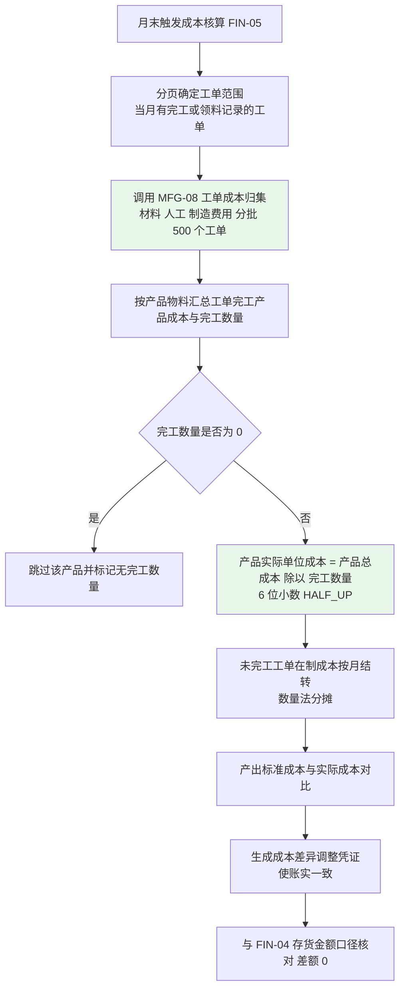

### 8.6 固定资产（FIN-06，P2）

| 项 | 设计 |
|----|------|
| 卡片字段 | `asset_code`（`FA + YYYYMM + 3 位`）、`asset_name`、`asset_category`（资产类别，字典）、`original_value`（原值）、`use_dept`（使用部门）、`location`（存放地点）、`start_date`（启用日期）、`useful_life`（使用年限，月）、`residual_rate`（残值率）、`depreciation_method`（折旧方法）、`status`（0-在用 1-闲置 2-报废 3-已处置） |
| 折旧方法 1：年限平均法 | `月折旧额 = 原值 × (1 − 残值率) ÷ 使用年限月数`（6 位 HALF_UP）；累计折旧 = 月折旧额 × 已提月数；**最后一个月调整尾差**，使 `累计折旧 = 原值 × (1 − 残值率)`（差额 0） |
| 折旧方法 2：双倍余额递减法 | 年折旧率 = `2 ÷ 使用年限年数`；`年折旧额 = 期初净值 × 年折旧率`；`月折旧额 = 年折旧额 ÷ 12`；**在折旧年限最后两年改为年限平均法**（余额 − 净残值 在剩余年限内平均摊销） |
| 月度计提步骤 | ①取在库且 `status ∈ {0,1}` 的卡片；②按方法计算当月折旧额（已提足或超过使用年限则不再计提，标记"已提足"）；③生成折旧凭证（借 制造费用/管理费用 贷 累计折旧，序 20）；④写入折旧明细 `fin_asset_depreciation`（卡片、期间、折旧额、累计折旧、净值）`【数据库设计需补充：fin_asset_depreciation 表（asset_id、period、depreciation_amount、accumulated_amount、net_value）】`；⑤幂等：按 `(asset_id, period)` 唯一键，重复执行覆盖 |
| 费用科目归集 | 使用部门决定借方费用科目（生产部门 → 制造费用；管理部门 → 管理费用）；科目来源 `asset_category` 配置 |
| 盘点 | 资产盘点（账面 vs 实物）→ 生成差异清单（含差异数量与金额）；差异处理走调整或报废 |
| 报废/处置 | 报废单审核 → 资产状态置 `2-报废`；处置生成清理分录（序 21）：借 固定资产清理 + 累计折旧，贷 固定资产；清理净损益转营业外收支 |
| 导出 | 资产台账与折旧明细可导出（行数一致） |

### 8.7 财务报表（FIN-07）

| 报表 | 数据来源 | 生成方式 | 期间口径 |
|------|---------|---------|---------|
| 资产负债表 | `fin_voucher_entry`（按科目汇总期末余额）+ `fin_subject.subject_direction` | Mapper.xml 按科目层级汇总；资产类取借方余额、负债与权益类取贷方余额 | 时点报表（期间末）；**仅取已过账凭证** |
| 利润表 | `fin_voucher_entry`（损益类科目本期发生额） | 按科目层级汇总本期发生额；净利润 = 收入 − 成本 − 费用 | 期间报表（本月 / 上年同期 / 年初至今） |
| 现金流量表 | `fin_voucher_entry`（现金及银行存款类科目的对方科目分类）+ 现金流量标记 | 按现金流量项目归类汇总（经营/投资/筹资）；分类规则可配置 `【数据库设计需补充：fin_cashflow_item 表或 fin_voucher_entry.cashflow_item_id】` | 期间报表 |
| 科目余额表 | `fin_voucher_entry` 按科目汇总期初、本期借贷发生额、期末余额 | 一次聚合 SQL；**借贷合计相等**（差额 0） | 期间 + 科目范围 |
| 明细账 | `fin_voucher_entry` 按科目 + 时间顺序排列（含凭证号、摘要、借贷金额、余额） | 顺序展开；余额逐行累加 | 期间 + 科目 + 时间范围 |
| 总账 | `fin_voucher`（凭证级）+ 科目汇总 | 按科目汇总借贷发生额与余额，支持下钻明细账 | 期间 |

**统一约定：** ①口径**仅取已过账凭证**（`voucher_status = 1`；草稿与已红冲凭证不计入；红字凭证计入发生额）；②支持按期间查询与期间对比（本月/上月/年初至今）；③交叉校验：资产负债表 `资产 = 负债 + 所有者权益`（差额 0）；利润表净利润 = 科目余额表本年利润（差额 0）；科目余额表借贷合计相等（差额 0）；④导出 Excel 与 PDF（RPT-07），导出内容与界面一致（逐项比对）；⑤报表查询受数据权限约束（财务角色可见全量；非财务角色按组织维度过滤）。

### 8.8 期末处理（FIN-08）

| 步骤 | 处理与顺序 |
|------|-----------|
| 0. 前置准备 | 业务单据全部审核完毕（无草稿单据）；出入库业务关闭（截止日） |
| 1. **成本核算** | 执行存货核算（FIN-04 收发存与结存成本）+ 工单成本核算（FIN-05）；产出成本差异调整凭证 |
| 2. **对账检查** | 库存流水与快照对账（INV-09）差异必须为 0；差异存在则阻断月结 |
| 3. **月结检查清单** | 5 项**全部通过**方可关闭期间：①未过账凭证数 = 0；②上月暂估未匹配清单条数（可人工确认后放行，但必须记录结论）；③库存流水与快照对账差异 = 0；④未完工工单在制余额已结转；⑤未结算单据数（列出清单，可确认后放行） |
| 4. **结转损益** | 将损益类科目（收入、成本、费用）本期发生额结转至**本年利润**（4103）；结转后损益类科目余额为 0；生成结转凭证（序 17） |
| 5. **结转成本类科目** | 制造费用（5101）结转生产成本（5001）；生产成本结转库存商品（随完工入库已完成，此处处理尾差）；生成结转凭证（序 18） |
| 6. **汇兑损益** | 外币科目按**月末汇率**重估；`汇兑损益 = 外币科目余额 ×（月末汇率 − 账面汇率）`；生成汇兑损益凭证（序 19）；本月无外币业务时跳过（本期主币种 CNY，外币业务按实际存在处理） |
| 7. **期间关闭** | `fin_period.status` 置 `1-已关闭`；记录关闭操作人、时间、检查清单结论 |
| 8. **出具报表** | 生成 FIN-07 六张报表与 RPT-06 分析报表（仅取已过账凭证） |
| 9. **反结账（期间重开）** | 仅限**财务经理**权限（`finance:period:reopen`）；必须填写原因；重开操作写审计日志；重开后需重新执行月结检查清单；**已过账凭证的冲销须在开放期间进行**；**期初余额与期初库存（FIN-09/INV-11）在首个期间关闭后不可修改**（状态守卫 + 期间校验双重拦截） |

**期间关闭后的拦截点清单：**

| 序 | 拦截点 | 判定 | 错误码 |
|----|-------|------|-------|
| 1 | 新增凭证（自动生成） | 凭证 `period` 已关闭 → 拒绝生成（业务单据一并回滚） | `16350-16399` |
| 2 | 凭证手工新增/修改 | 期间已关闭 → 拒绝 | `16351` |
| 3 | 凭证过账 | 期间已关闭 → 拒绝过账 | `16352` |
| 4 | 凭证冲销（红冲） | 红冲凭证的 `period` 必须为**开放期间**；尝试在已关闭期间红冲 → 拒绝 | `16353` |
| 5 | 跨期修改上月单据 | 单据业务日期所属期间已关闭 → 拒绝修改/审核/删除 | `16354` |
| 6 | 期初余额与期初库存修改 | 首个会计期间已关闭 → 拒绝（FIN-09/INV-11） | `14252` |
| 7 | 计价方法变更 | 期间关闭时拒绝（3.2.5 前置条件 ①） | `11012` |
| 8 | 期间重开 | 非财务经理权限 → 403；未填原因 → 拒绝 | `403`/`16355` |

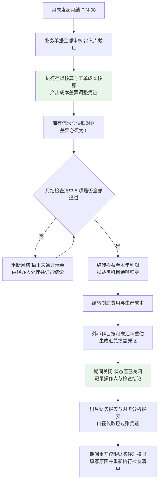

---

## 九、报表与分析模块详细设计（D9）

### 9.1 经营仪表盘（RPT-01）指标计算口径定义表

**承载：** `business.finance.core.service.DashboardService`（由 finance 域聚合各域 Service 提供的指标口径方法；跨域通过 Service 接口，**禁止跨模块访问 Mapper**，ADR-18）；缓存 `rpt:dashboard:{orgId}:{date}`（TTL 5 分钟）。

| 序 | 指标 | 计算公式 | 数据来源表 | 刷新频率 | 组织维度切换 |
|----|------|---------|-----------|---------|------------|
| 1 | 今日销售收入 | `Σ 开票/确认收入金额（当日）`（不含税） | `fin_voucher_entry`（收入科目）+ `sal_order_line` | 实时类，**≤5 分钟** | 按 `org_id`（分公司/基地）过滤 |
| 2 | 本月销售收入 | `Σ 本月收入金额`（不含税） | 同上 | ≤5 分钟 | 同上 |
| 3 | 毛利率 | `(本月销售收入 − 本月销售成本) ÷ 本月销售收入 × 100%`；分母为 0 时显示 0 并标注"无销售" | 收入：`fin_voucher_entry`（6001）；成本：`fin_voucher_entry`（6401） | 实时类 ≤5 分钟 | 同上 |
| 4 | 库存周转天数 | `平均库存金额 ÷ 本期出库成本 × 期间天数`；平均库存金额 = `(期初库存金额 + 期末库存金额) ÷ 2`；期间 = 近 30 天 | `inv_stock`（`qty × unit_cost`）+ `inv_transaction`（`trans_type=30/40` 的 `out_qty × unit_cost`） | **成本类按日刷新**（每日 01:00 计算） | 按仓库/组织过滤 |
| 5 | 工单按时完工率 | `按时完工工单数 ÷ 完工工单总数 × 100%`；按时 = `actual_end_date ≤ planned_end_date` | `mf_order`（`order_status = 4`） | ≤5 分钟 | 按生产组织过滤 |
| 6 | 应收逾期金额 | `Σ (amount − received_amount)`，条件 `due_date < 当日` 且 `status ∈ {0,1}` | `fin_receivable` | ≤5 分钟 | 按组织/客户归属过滤 |
| 7 | 在途订单金额 | `Σ (qty − delivered_qty) × unit_price`，条件 `sal_order.order_status ∈ {1,2}`（已审核未发货） | `sal_order_line` + `sal_order` | ≤5 分钟 | 按 `org_id` 过滤 |
| 8 | 呆滞库存占比 | `呆滞库存金额 ÷ 库存总金额 × 100%`；呆滞口径 = 参数 `inventory.slow-moving.days`（默认 180）天无出入库 | `inv_stock`（`last_transaction_time`） | **按日刷新**（与 INV-08 任务同源） | 按仓库/组织过滤 |

**附加口径项（RPT-01 验收要点①要求 8 项指标 + 订单准时交付率）:** 订单准时交付率 = `按时交付订单行数 ÷ 应交付订单行数 × 100%`（按时 = 全部数量交付日期 ≤ `required_date`）；数据来源 `sal_order_line` + 出库流水；≤5 分钟。

| 项 | 设计 |
|----|------|
| 实时与离线取舍 | **实时类**（1/2/3/5/6/7 + 准时交付率）由 SQL 实时聚合 + 5 分钟缓存；**成本类**（周转天数、呆滞占比）按日预计算（定时任务写入当日结果，仪表盘读预计算结果，避免扫全量流水） |
| 缓存策略与 TTL | 每个指标独立缓存键 `rpt:dashboard:{metric}:{orgId}:{date}`，TTL **5 分钟**（±10% 抖动）；成本类缓存 TTL 至次日日切；缓存未命中时回源计算并写缓存；缓存不可用时直接计算（降级） |
| 组织维度切换 | 指标方法接受 `orgId` 参数（为空 = 全部）；组织维度通过单据/流水的 `org_id`、`warehouse_id` 过滤；**不硬编码组织清单**（E-01） |
| 口径说明元数据 | 每个指标返回 `formula`（计算公式）与 `dataSource`（来源表）文本，前端可点击查看（RPT-01 验收要点①）；口径文本与上表**逐字一致** |
| 一致性 | 抽样 3 个指标与来源报表数值一致（误差 0，RPT-01 验收要点②）；口径唯一：同一指标在仪表盘、明细报表、导出文件中口径一致（抽样误差 0） |
| 数据权限 | 仪表盘数据受 SYS-04 约束（按 orgId/warehouseIds/客户归属过滤） |
| 性能 | 仪表盘整体响应 ≤5 秒（P-04）：8 个指标并发取数（`CompletableFuture` 并行，超时 3 秒/指标），单指标超时返回"数据加载中"占位而不阻塞整页 |

### 9.2 各域分析报表设计（RPT-02~RPT-06）

| 报表 | 查询维度 | 汇总口径 | 索引与性能要点 |
|------|---------|---------|--------------|
| **RPT-02 销售分析** | ①订单执行状况（日期/客户/产品/状态）；②销售排行（客户/产品/业务员）；③订单毛利（收入 − 成本，成本来自 FIN-04/FIN-05）；④未交订单明细（未发货余额 > 0）；⑤销售对账单（按客户） | 收入口径 = 已开票/确认收入金额（不含税）；成本口径 = 出库成本（`trans_type=30` 的 `out_qty × unit_cost`）；毛利 = 收入 − 成本（差额 0）；未交订单金额合计 = 已审核未发货订单金额（差额 0）；支持按 CS-03 多维分类汇总 | `sal_order(order_status, order_date)`、`sal_order_line(material_id, order_id)`、`inv_transaction(material_id, trans_time)`；多维度分析 ≤10 秒（限制统计区间，默认近 12 个月） |
| **RPT-03 采购分析** | ①采购订单执行跟踪（未到货余额、预计到货日期）；②价格走势（供应商/物料/期间）；③供应商准时率与合格率；④采购申请来源分布 | 准时率/合格率与 PUR-08 **同一 SQL 口径**（差额 0）；价格走势与 `pur_order_line` 逐点一致；紧急采购占比 = 手工来源申请数 ÷ 申请总数（目标 ≤10%） | `pur_order_line(material_id, order_id)`、`pur_receipt(pur_order_id, receipt_date)`、`pur_application(source, apply_date)`；汇总类 ≤5 秒 |
| **RPT-04 库存分析** | ①即时库存（仓库/库位/批次/物料）；②库存流水账（物料 + 时间段）；③库存周转率（天数/次数）；④呆滞库存明细；⑤安全库存预警清单；⑥保质期预警清单 | 即时库存合计与 `inv_stock` 汇总一致（差额 0）；流水账条数与 `inv_transaction` 一致；呆滞/安全库存/保质期清单与 INV-08/INV-07/INV-05 页面数值一致（差额 0）；周转天数 = `平均库存金额 ÷ 期间出库成本 × 期间天数` | 即时库存走 `inv_stock`（唯一键索引）≤2 秒；流水账走 `idx_inv_transaction_material(material_id, trans_time)` ≤2 秒（100 万条量级）；清单类复用对应功能的 Mapper 方法 |
| **RPT-05 生产分析** | ①工单完工率；②良品率；③在制工单明细（含工序进度）；④工时利用率（实际工时 vs 可用工时）；⑤产品实际成本与毛利 | 完工率 = 完工工单数 ÷ 工单总数；良品率 = `Σ qualified_qty ÷ Σ completed_qty`（验算 3 条误差 0）；在制明细条数 = `order_status ∈ {1,2,3}` 的工单数（差额 0）；工时利用率 = 实际报工工时 ÷ （在制工单数 × 日可用工时 × 工作日数）；产品成本与 FIN-05 一致（差额 0） | `mf_order(order_status, planned_end_date)`、`mf_work_report(work_order_id)`、`mf_order_cost(period, work_order_id)`；≤10 秒 |
| **RPT-06 财务分析** | ①应收账龄（30/60/90/超 90）；②应付账龄；③现金流量预测（按应收到期日与应付到期日）；④产品成本分析表 | 账龄区间与起算日口径**与 8.3/8.4 完全一致**；分档金额合计 = 应收/应付余额（差额 0）；现金流量预测按 `due_date` 排序（抽 10 条误差 0）；产品成本与 FIN-05 一致（差额 0） | `fin_receivable(due_date, customer_id)`、`fin_payable(due_date, supplier_id)`、`fin_voucher_entry(subject_id, period)`；账龄 ≤5 秒 |

**通用实现约定：** ①全部报表用 Mapper.xml 一次聚合查询（`JOIN`/`GROUP BY`），**禁止 N+1**；②SQL 必须带注释说明口径与需求编号；③查询强制限制统计区间（默认近 12 个月；超范围提示缩小范围）；④汇总类结果可加轻量缓存（`rpt:{report}:{orgId}:{paramHash}`，TTL 5 分钟）；⑤口径唯一约束：同一指标在仪表盘、明细报表、导出文件口径一致；⑥**本期不建独立汇总表/数仓**；SIT 实测不达标时启用"按日汇总表"预案（定时任务生成、幂等可重跑，ADR-19）。

### 9.3 报表导出（RPT-07）

| 项 | 设计 |
|----|------|
| 导出方式 | 统一 `GET /api/{域}/{资源}/export`；Excel 用 EasyExcel（流式写，避免 OOM）；PDF 用 iText/Flying Saucer 渲染（模板化表头）`【依赖说明：导出与 PDF 工具类置于 erp-common.util，具体依赖版本由 erp-bootstrap 父 POM 统一管理】` |
| 同步/异步 | **同步**：导出行数预测 ≤5,000 行（由 `COUNT(*)` 预判）；**异步**：> 5,000 行 → 创建导出任务（`sys_export_task`：任务号、报表名、筛选条件、行数、状态、文件路径、创建人、创建时间、完成时间）`【数据库设计需补充：sys_export_task 表】`；`@Async("exportExecutor")` 生成文件 → 完成后提供下载入口 + 站内通知 |
| 上限控制 | **单次导出 ≤50,000 行**，超出直接拒绝并提示"请缩小筛选范围"（后端强校验，RPT-07 验收要点④） |
| 筛选条件 | 导出**必须复用当前查询条件与数据权限过滤**（同一 `DataScopeHelper` 与 Wrapper），保证"导出行数 = 可见行数"（RPT-07 验收要点③） |
| 口径一致 | 导出内容与界面一致（抽 1 张报表逐项比对）；金额按 2 位展示（后端格式化） |
| 审计 | 导出动作写审计日志（操作人、报表名、筛选条件、行数、时间）（RPT-07 验收要点⑤）；异步导出完成事件亦记录 |
| 文件管理 | 文件名 `报表名_YYYYMMDDHHmmss.xlsx`；存储于 `data/export/` 目录（纳入备份范围）；保留期参数 `rpt.export.retain-days`（默认 7 天），由清理任务（2.9）删除 |
| 安全 | 导出文件下载接口校验"任务创建人 = 当前用户"（防越权下载），越权返回 403；文件名与路径做安全处理（防路径穿越） |
| 性能 | 导出交互不阻塞（异步）；单文件生成 ≤5 分钟（50,000 行）；导出期间不占用业务事务 |

---

## 十、关键链路时序设计

### 10.1 链路一：销售订单 → MRP → 采购/生产建议 → 采购订单 → 收货入库

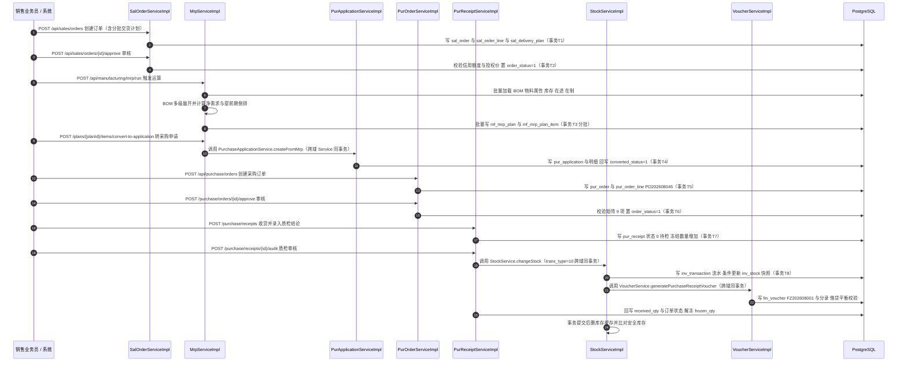

| 说明项 | 内容 |
|-------|------|
| 参与模块 | sales（订单）、manufacturing（MRP 与建议）、purchase（申请/订单/收货）、inventory（流水与余额）、finance（凭证） |
| 事务边界 | **T1** 订单头/明细/分批计划；**T2** 审核校验与状态回写；**T3** MRP 结果分批写（每批 500 条，独立短事务，可重跑）；**T4** 建议行状态 + 采购申请（同事务）；**T5/T6** 采购订单头/明细与审核；**T7** 收货单 + 冻结数量；**T8 = 收货审核事务（关键）**：收货单状态 + 解冻 + 库存流水 + 快照 + 暂估凭证 + 分录 + 订单回填**全部在同一事务**（`Propagation.REQUIRED`） |
| 幂等键 | ①订单：`Idempotent-Key` + `uniq_sal_order_code`；②MRP 转单：建议行 `converted_status` + 采购申请行来源行唯一约束；③采购订单：`Idempotent-Key` + `uniq_pur_order_code`；④收货流水：`(PURCHASE_RECEIPT, receiptId, materialId, 10, warehouseId, locationId, batchNo)`；⑤凭证：`(PURCHASE_RECEIPT, receiptId, 凭证类型)` |
| 异常与回滚 | 任一环节失败 → 该事务整体回滚（如暂估凭证生成失败则收货不入库、订单不回填）；业务校验失败抛 `BusinessException`（错误码分别落 13001-13999 / 12001-12999 / 14001-14999 / 16001-16999）；乐观锁冲突重试 ≤3 次后抛 `14201` |
| 跨模块调用路径 | `sales.SalOrderService`（自洽）→ `manufacturing.MrpService` → `purchase.PurApplicationService` → `purchase.PurOrderService` → `purchase.PurReceiptService` → `inventory.StockService` → `finance.VoucherService`；**全部为 Service 接口调用，无跨模块 Mapper** |

### 10.2 链路二：生产工单 → 领料 → 报工 → 完工入库

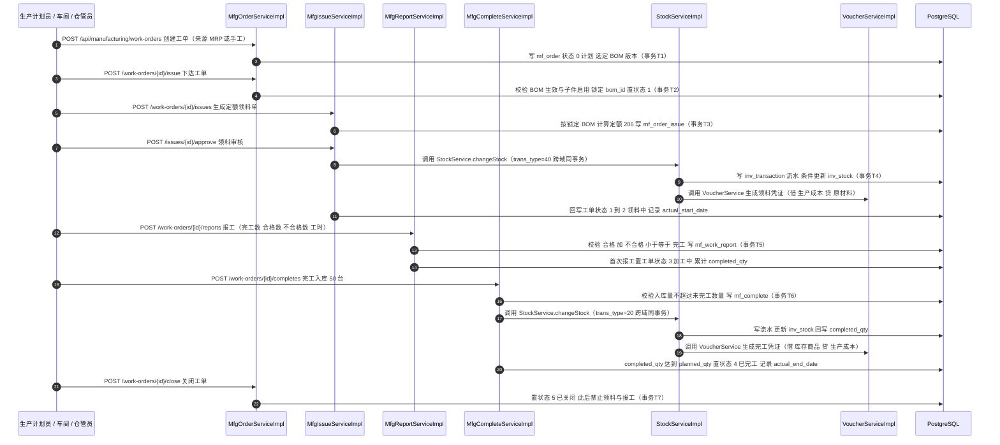

| 说明项 | 内容 |
|-------|------|
| 参与模块 | manufacturing（工单/领料/报工/完工）、inventory（流水与余额）、finance（凭证）、base（BOM 与物料，只读调用） |
| 事务边界 | **T1** 工单创建（状态 0 + BOM 选定）；**T2** 下达（BOM 生效校验 + 锁定 + 状态 1）；**T3** 领料单生成（定额计算 + 领料单）；**T4 = 领料审核事务（关键）**：领料单状态（含超定额审批结论）+ 库存流水 + 快照 + 领料凭证 + 工单状态回写**同一事务**；**T5** 报工（报工记录 + 工单状态 3 + 累计完工数）；**T6 = 完工入库事务（关键）**：完工入库单 + 库存流水 + 快照 + 完工凭证 + 工单回填**同一事务**；**T7** 关闭（状态守卫） |
| 幂等键 | ①工单：`Idempotent-Key` + `uniq_mf_order_work_order_code`；②领料流水：`(MFG_ISSUE, issueId, materialId, 40, warehouseId, locationId, batchNo)`；③报工：`(work_order_id, operation_seq, report_time, operator)` 唯一约束；④完工流水：`(MFG_COMPLETE, completeId, materialId, 20, …)`；⑤凭证：按来源单据 + 凭证类型 |
| 异常与回滚 | ①超定额未审批 → 拒绝领料（`15050-15099`）；②累计领料超定额 ×1.1 → 拒绝；③库存可用量不足 → 拒绝（`14001`）；④报工"合格 + 不合格 > 完工"→ 拒绝（`15101-15149`）；⑤入库超未完工数量 → 拒绝（`15150-15199`）；⑥已关闭/已完工工单领料或报工 → 拒绝（`15001-15049`）；任一步失败事务回滚，不产生半成品数据 |
| 跨模块调用路径 | `manufacturing.MfgOrderService/MfgIssueService/MfgReportService/MfgCompleteService` → `inventory.StockService` → `finance.VoucherService`；BOM 与物料信息经 `base.BomService/MaterialService` 只读查询（不跨模块访问 Mapper） |

### 10.3 链路三：销售发货 → 出库 → 凭证自动生成

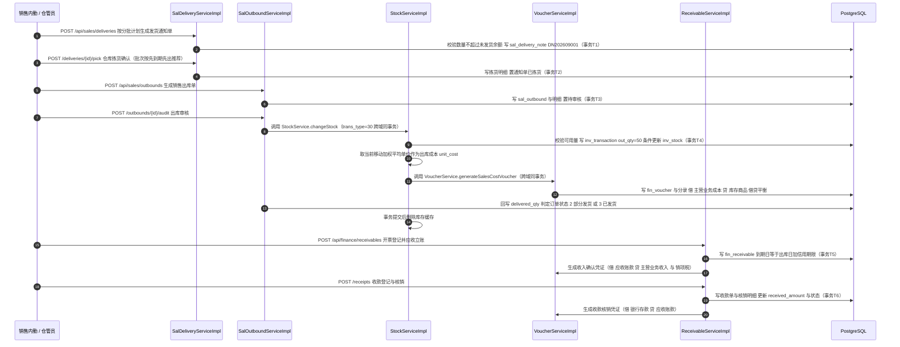

| 说明项 | 内容 |
|-------|------|
| 参与模块 | sales（发货通知/出库）、inventory（流水与余额）、finance（凭证、应收、收款核销） |
| 事务边界 | **T1** 发货通知单；**T2** 拣货确认；**T3** 出库单创建；**T4 = 出库审核事务（关键）**：出库单状态 + 库存流水 + 快照 + 成本单价写入 + 成本结转凭证 + 分录 + 订单 `delivered_qty` 与状态回写**同一事务**；**T5** 开票登记 + 应收立账 + 收入凭证（同事务）；**T6** 收款登记 + 核销明细 + 核销凭证（同事务） |
| 幂等键 | ①发货通知单：`Idempotent-Key` + `uniq_sal_delivery_note_code`；②出库流水：`(SALES_SHIPMENT, outboundId, materialId, 30, warehouseId, locationId, batchNo)`；③凭证：`(SALES_SHIPMENT, outboundId, 成本结转凭证类型)`；④收入凭证：`(SAL_INVOICE, invoiceId, 收入凭证类型)`；⑤核销：`(FIN_RECEIPT, receiptId, 核销凭证类型)` |
| 异常与回滚 | ①发货数量超未发货余额 → 拒绝（`13101-13149`）；②可用量不足（含冻结）→ 拒绝（`14001`，消息含可用量与需求量）；③出库成本单价缺失（物料无单位成本）→ 按 0 值出库并标记"成本待确认"，同时 `log.warn`（不阻断出库，月末成本核算时修正）；④借贷不平衡 → 拒绝并整体回滚（`16001`）；⑤期间已关闭 → 拒绝生成凭证（`16350-16399`） |
| 跨模块调用路径 | `sales.SalDeliveryService/SalOutboundService` → `inventory.StockService` → `finance.VoucherService` → `finance.ReceivableService`（收款核销）；全部 Service 接口调用，同一本地事务 |

---

## 十一、单元测试设计要点（服务于阶段三退出标准）

### 11.1 重点覆盖测试清单

> **要求：** 阶段三每个子阶段退出标准均包含"单元测试通过"；**核心业务逻辑（BOM 闭环检测、库存计算、三单匹配、MRP、凭证生成）必须有单测覆盖**（《阶段计划文档》3.2）。下表为强制覆盖清单，未覆盖项不得判定子阶段退出。

| 序 | 测试对象 | 测试场景（正常 / 边界 / 异常） | 预期结果 | 对应需求 |
|----|---------|---------------------------|---------|---------|
| 1 | **BOM 闭环检测** `BomService.checkCycle` | 正常：无闭环的三层 BOM；边界：**A→B→C→A 闭环**、自引用 A→A、10 层通过 / 11 层拒绝、共享子图（菱形结构 A→B→D、A→C→D） | 无闭环通过；A→B→C→A 抛出 `11014` 且**消息含完整路径"A→B→C→A"**；自引用抛 `11013`；11 层抛 `11015`；菱形结构**不误判**为闭环 | BOM-07 ①③ |
| 2 | **BOM 多级展开** `BomService.expandMultiLevel` | 正常：AC-300 三层展开（层深 3、明细条数一致）；边界：**恰好 10 层**、第 10 层截断标记、同物料多路径分别输出；异常：父件为原材料、BOM 未生效 | 层级与条数与构造用例一致；10 层不抛异常且输出截断标记；原材料父件抛 `11018`；草稿 BOM 抛 `11101-11159` | BOM-01、BOM-05 |
| 3 | **定额用量舍入** `BomService.calcRequiredQty` | 正常：100 × 2 × 1.03 = 206.000000；边界：损耗率 0%、100%、含无限小数（1 ÷ 3 场景）；异常：损耗率 120%、负数、用量 0 | 结果 6 位小数 HALF_UP 精确匹配；损耗率越界抛 `11016`；**版本锁定后已下达工单定额不变（206）** | BOM-02 |
| 4 | **库存流水与乐观锁并发** `StockServiceImpl.changeStock` | 正常：入库/出库各一次；边界：20 并发更新同一库存记录；异常：版本冲突不重试成功 | 20 并发下**无数量丢失**（最终数量 = Σ 变动量）；冲突重试 ≤3 次后抛 `14201`；**流水条数 = 成功变动次数**；`after_qty = before_qty + in_qty − out_qty`（差值 0） | INV-09 ④⑤ |
| 5 | **超卖防护** `StockServiceImpl`（可用量校验） | 正常：可用 100 出库 100；边界：可用 100 出库 100.000001；异常：冻结 30 后可用 70 出库 80 | 可用量不足抛 `14001` 且消息含可用量与需求量；**并发场景下不产生负库存**（`after_qty ≥ 0`） | INV-03 ② |
| 6 | **三单匹配容差边界** `PurInvoiceMatchService.match` | 正常：数量/单价完全一致；边界：数量偏差 **恰好 2%**（通过）、2.0001%（拒绝）、单价偏差 **恰好 0.5%**（通过）、0.5001%（拒绝）；异常：无订单、无收货、发票金额自身不一致、订单单价为 0 | 边界内匹配通过并生成暂估红冲 + 正式应付；超容差生成差异记录且**不生成正式应付**；异常分别抛 `12201`/`12202`/`12203` | PUR-05 ①② |
| 7 | **MRP 净需求与提前期倒排** `MrpServiceImpl.run` | 正常：SC-01 展开（IGBT 200 个、电解电容 400 个、AC-300 100 台、主控板 100 套）；边界：净需求 = 0（不生成建议）、净需求 < 0、有库存/有在途/有在制三种抵扣场景、最小批量取整、提前期 0 天与 15 天；异常：关闭"考虑在途"后建议量增加恰好等于在途量 | 建议数量与 BOM 展开**逐项差 0**；净需求公式验算 3 条正确；净需求 ≤0 不生成建议行；取整与日期倒排正确；参数开关生效 | MFG-01 ①②、MFG-02 ①② |
| 8 | **MRP 转单幂等** `MrpService.convertToApplication/WorkOrder` | 正常：首次转单；异常：重复转单、并发转单 | 首次生成下游单据并置 `converted_status`；重复点击**不产生第二张单据**（返回"已转单"）；并发以乐观锁 + 唯一约束兜底 | MFG-03 ①② |
| 9 | **移动加权平均** `InventoryCostService.recalcInbound` | 正常：结存 100@10 + 入库 100@12 → 11.000000；边界：**零库存 + 入库（除零）**、原结存 0 且入库数量 0、结存 3@10 + 入库 1@10.000001；异常：入库单价 0 且无结存 | 新单位成本 6 位 HALF_UP 精确匹配；除零场景取本次入库单价（或标准成本并标记）；`结存数量 × 单位成本 = 结存金额`（差额 0） | FIN-04 ①② |
| 10 | **收支存平衡** `InventoryCostService.stockInOutReport` | 正常：期间有出入库；边界：期间无业务（全 0）、只有入库、只有出库 | `期初 + 入库 − 出库 = 期末`（**数量与金额差额均为 0**） | FIN-04 ② |
| 11 | **凭证借贷平衡** `VoucherServiceImpl.generate*` | 正常：4 类出入库凭证各 1 张；边界：单行分录、多行分录（含税额拆分）、金额为 0 的凭证（禁止）；异常：科目缺失、期间已关闭、借贷不平衡 | `total_debit = total_credit`（差额 0）；科目与模板映射一致；科目缺失抛 `16001-16049`；期间关闭抛 `16350-16399`；**不平衡拒绝并整体回滚** | FIN-01 ①⑤ |
| 12 | **凭证幂等与红冲** `VoucherServiceImpl` | 正常：重复触发同一来源单据；异常：红冲后再查暂估余额 | 重复触发返回**同一张凭证**（数量不变）；红冲金额等于原暂估且方向相反；**暂估应付余额归零** | PUR-06 ②③、FIN-01 ③ |
| 13 | **工单成本归集** `MfgOrderCostService.collectBatch` | 正常：材料 + 人工 + 制造费用三段；边界：无报工工时（人工成本 0）、无领料、在制数量为 0、完工数量为 0；异常：单价表缺失 | 材料成本 = 实际领料金额合计（误差 0）；人工成本 = 工时 × 单价（误差 0）；制造费用按分摊率正确；合计与 FIN-05 口径一致（差额 0） | MFG-08 ①②③④ |
| 14 | **信用额度拦截** `SalOrderServiceImpl.approve` | 正常：额度充足；边界：**恰好等于可用额度**（通过）、超出 0.000001（拒绝）；异常：已审核未发货订单金额与未核销应收同时占用 | 可用额度 = 信用额度 − 已审核未发货订单金额 − 未核销应收余额；越界时转特批并提示缺口金额；特批通过后放行且留痕 | SAL-02 ①②、CS-01 |
| 15 | **销售发货回填与状态判定** `SalOutboundServiceImpl` | 正常：分批出库 50 + 50；边界：出库数量 = 未发货余额；异常：超出未发货余额、可用量不足 | 首次出库后 `order_status=2` 且 `delivered_qty=50`；全部出库后 `order_status=3`；超限抛 `13101`；同一通知单重复提交仅 1 条流水 | SAL-05 ①②③④ |
| 16 | **工单状态机与非法流转** `MfgOrderServiceImpl` | 正常：0→1→2→3→4→5；异常：已完工领料、已关闭报工、计划态直接报工、重复下达 | 合法流转成功并写审计日志；非法流转抛 `15001-15049` 且**状态不变**；重复动作返回"状态不匹配"无副作用 | MFG-04 ①③ |
| 17 | **领料定额与超领控制** `MfgIssueServiceImpl` | 正常：定额 206 直接通过；边界：恰好 206.000000、累计 226.6（= 206 × 1.1）；异常：累计 226.600001、超定额未审批 | 定额计算正确；超定额触发审批（必填原因）；累计超上限抛 `15050-15099`；分 2 次领料产生 2 条流水且合计 = 206 | MFG-05 ①②③ |
| 18 | **报工数量校验** `MfgReportServiceImpl` | 正常：完工 100、合格 98、不合格 2；边界：合格 + 不合格 = 完工；异常：合格 + 不合格 > 完工 | 合法保存并计算合格率 98%；越界抛 `15101-15149`；首次报工后工单状态 2→3 | MFG-06 ②③ |
| 19 | **单据编号生成并发唯一** `CodeGenerator.generateCode` | 正常：连续 3 张订单编号递增；边界：跨月重置、流水超 999 扩位；异常：模拟唯一约束冲突重试 | 编号依次为 `SO202608001/002/003`；跨月首单 `SO202609001`；20 并发无重复（唯一约束 100% 通过）；冲突重试 ≤3 次 | SYS-07 ①②③ |
| 20 | **资金/数量精度** `BigDecimalUtil` | 正常：加减乘除；边界：除法无限小数（1 ÷ 3 → 0.333333）、标度不同的 `compareTo`；异常：空值 | 除法 6 位 HALF_UP；`compareTo` 判定正确（**禁止 equals**）；空值按 0 处理 | 1.2、编码规范 2.7 |
| 21 | **期间关闭拦截** `PeriodService.assertOpen` | 正常：开放期间生成凭证；异常：已关闭期间新增/过账/红冲、跨期修改上月单据 | 已关闭期间全部拒绝（`16350-16399`）；期间重开仅财务经理权限且必须填原因 | FIN-08 ①②④ |
| 22 | **BOM 版本锁定** `MfgOrderServiceImpl.issue` + 领料定额 | 正常：V1.0 生效时下达工单；异常：下达后 BOM 升级为 V1.1 并再次验算定额 | 工单 `bom_id` 仍指向 V1.0；领料定额仍为 206（**不随 BOM 变更**）；新工单使用 V1.1 | BOM-03 ②、BOM-02 ② |
| 23 | **呆滞识别与保质期预警口径** `SlowMovingService` / `ShelfLifeService` | 正常：181 天无变动进清单；边界：**恰好 180 天**（不进）、180 天 + 1 天（进）；异常：参数改为 150 后重跑 | 呆滞天数计算正确；参数即时生效；保质期"当前日期 = 有效期 − 30 天"进入清单；超期出库被拦截 | INV-08 ①、INV-05 ②③ |
| 24 | **盘点差异调整时点** `StocktakeServiceImpl` | 正常：审批通过后生成 70/80 流水；异常：审批前查询是否有调整流水 | **审批前不生成任何调整流水**；审批通过后流水数量与金额可核对 | INV-06 ①② |
| 25 | **幂等键（五类操作）** `IdempotentService` + 业务 Service | 正常：首次请求；异常：重复请求（24 小时内）、Redis 不可用降级 | 重复请求返回首次结果且**数据条数不变**；Redis 异常时降级为唯一约束兜底，不抛业务异常 | A-04、I-04 |

### 11.2 测试数据准备要求

| 项 | 要求 |
|----|------|
| 基础数据 | 至少准备：物料分类（01 电子料 / 01-03 芯片）、物料 ≥50 条（含批次管理、保质期、ABC 分类各 5 条）、BOM 三层（AC-300 → 主控板组件 → PCB 光板）与闭环用例 A/B/C、客户（含信用额度 0 与充足两例）、供应商、4 个中心仓与库位、会计科目（含叶子科目与父科目各 3 个）、凭证模板 21 类 |
| 业务数据 | 按 SC-01（AC-300 100 台 × 1,850 元、分批 50 + 50）、SC-02（IGBT 200 × 85、电解电容 400 × 2.3）、SC-04（工单 MO202608032）、SC-05（宏微科技月结 30 天）、SC-06（凭证分录）构造；与其他文档用例数字一致 |
| 边界数据 | ①损耗率 0 / 100 / 120（越界）；②可用量恰好等于需求；③净需求恰好为 0；④容差恰好等于上限（2% / 0.5%）；⑤10 层 / 11 层 BOM；⑥结存数量 0 时入库；⑦金额 6 位小数末尾进位（如 0.0000005）；⑧期间边界（月末最后一天 23:59:59） |
| 并发数据 | 20 并发更新同一 `inv_stock` 记录（**乐观锁并发用例**，INV-09 验收要点⑤）；20 并发生成同类单据编号（SYS-07 验收要点③） |
| 数据隔离 | 单测使用独立测试库或事务回滚（`@Transactional` + `@Rollback`）；并发用例使用**真实提交**（`@Commit` 或独立事务模板），并在断言后清理 |
| Mock 约定 | 跨域 Service 在单测中允许 Mock（如财务域凭证在库存单测中 Mock），但**核心算法单测（BOM/MRP/成本/匹配/凭证平衡）必须使用真实实现**，禁止 Mock 掉被测逻辑 |

### 11.3 断言原则

| 原则 | 内容 |
|------|------|
| 金额/数量断言 | **一律使用 `BigDecimal` 比较**：`assertThat(actual).isEqualByComparingTo(expected)` 或 `assertEquals(0, actual.compareTo(expected))`；**禁止** `double`/`float` 断言、禁止 `assertEquals(double, double)`（**禁止使用 delta 误差断言**） |
| 精度断言 | 断言前统一 `setScale(6, HALF_UP)`，并**单独断言标度**（6 位）以验证舍入规则；展示层断言 2 位 |
| 余额/平衡断言 | 借贷平衡、收发存平衡、流水一致性、暂估归零等**一律断言差额为 0**（`compareTo == 0`），不使用容忍区间 |
| 异常断言 | 使用 `assertThrows(BusinessException.class, ...)` 并**断言错误码落在正确区间**（如 BOM 闭环落 11014 且 ∈ 11001-11999）与消息含关键业务标识（如闭环路径） |
| 幂等断言 | 连续调用同一方法两次后断言**业务表条数不变、流水条数不变、凭证条数不变**（`count` 前后相等） |
| 状态断言 | 断言状态字段取值与合法流转矩阵一致；非法流转后断言状态**保持不变** |
| 日志断言 | 关键路径断言"乐观锁冲突重试 WARN 日志"存在（用 Logback `ListAppender` 捕获），验证告警埋点生效 |
| 覆盖率要求 | 核心算法类（BOM 展开与闭环、库存变动与成本、三单匹配、MRP、凭证生成与平衡、工单成本归集）**行覆盖率 ≥80%、分支覆盖率 ≥70%**；关键校验分支（边界与异常）必须逐条覆盖 |
| 禁止项 | 禁止依赖执行顺序的测试；禁止硬编码数据库自增 ID（使用返回主键）；禁止在断言中使用当前时间（用固定时钟 `Clock.fixed` 注入）；禁止 `Thread.sleep` 长等待（并发用例使用 `CountDownLatch`） |

---

| 修订记录 | 日期 | 说明 |
|---------|------|------|
| V1.0 | 2026年9月 | 首次发布：阶段二《ERP系统详细设计说明书》，覆盖详细设计约定（精度/编号/枚举/事务/幂等/错误码）、公共与技术支撑（D1/D2）、基础数据（D3）、库存（D4）、采购（D5）、销售（D6）、生产制造（D7）、财务（D8）、报表与分析（D9）详细设计，关键链路时序设计（3 条链路）与单元测试设计要点 |