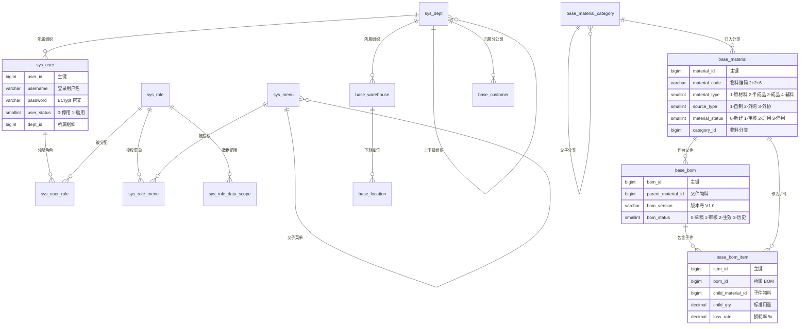
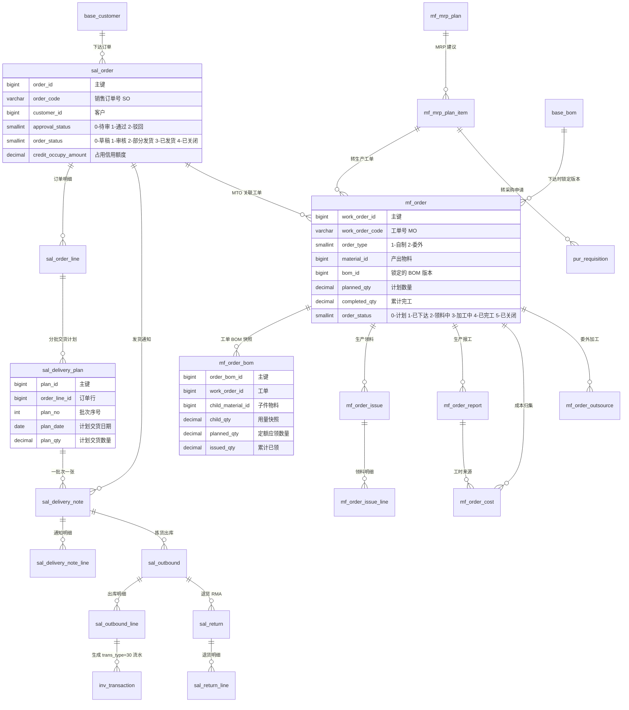
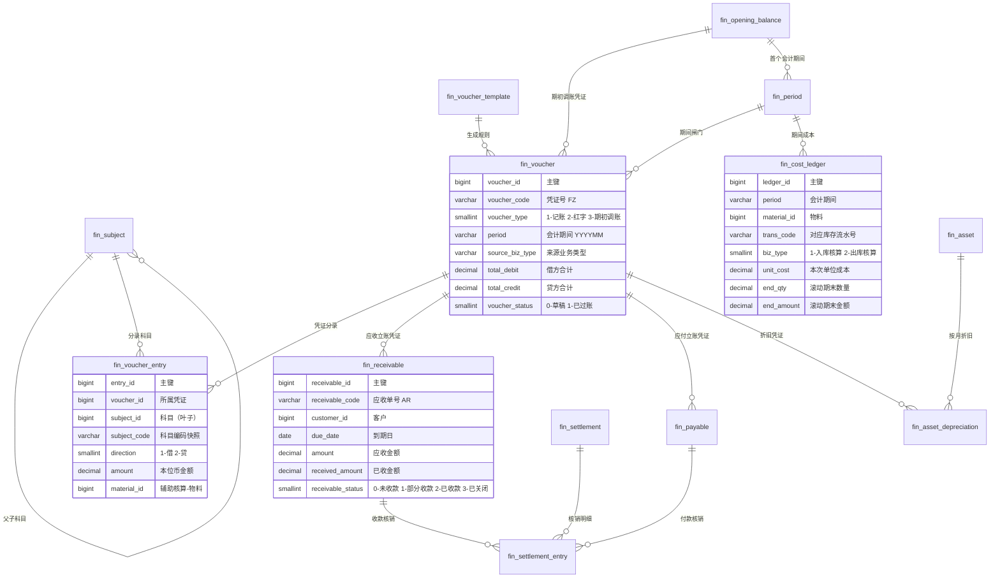

# 数据库设计文档

| 文档属性 | 内容 |
|---------|------|
| 文档名称 | 数据库设计文档 |
| 文档编号 | ERP-P2-03 |
| 版本 | V1.0 |
| 状态 | 待评审 |
| 编制部门 | 数字化管理部（会同销售部、采购部、仓储中心、生产制造部、财务部、质量部） |
| 编制日期 | 2026年9月 |
| 所属阶段 | 阶段二 系统设计（第 3-4 月），核心任务 2.2 数据库设计 |
| 关联里程碑 | M2 设计评审通过（概要设计、详细设计、接口设计、数据库设计四类文档评审问题全部关闭） |
| 上游输入 | `../phase1-requirement-confirmation/03-需求规格说明书-终稿.md`（需求基线，只读）、`../phase1-requirement-confirmation/04-数据迁移需求方案.md`（17 项补充清单，只读）、`../ERP系统数据库表结构设计文档.md`（表结构基线，只读）、`01-概要设计说明书.md`（架构约束，同目录） |
| 交付物 | 本文档 + 同目录 `schema.sql`（全量可执行建表脚本，76 张表 + 201 个索引 + 初始化种子数据） |
| 下游流向 | 阶段三 D1 建库与全部模块编码（D2~D9）；阶段四 SIT 造数（100 万条流水）；阶段六数据迁移导入 |
| 评审对象 | 本文为 M2 设计评审的四类文档之一（数据库类），评审问题须全部关闭后 M2 方可判定通过 |

---

## 文档定位

| 项 | 说明 |
|----|------|
| 与基线的关系 | `docs/ERP系统数据库表结构设计文档.md`（V1.0）为**只读基线**，保留不修改；本文是其**生效升级版本**，在其 20 张核心表基础上扩展补齐至 **76 张表**，并保持与基线**表名、字段名、字段语义完全兼容、无冲突** |
| 本文覆盖范围 | 全量 7 个业务域的物理模型（表、字段、类型、约束、索引、注释）、初始化种子数据、容量与归档策略、需求覆盖对照 |
| 本文不覆盖 | 具体 SQL 语句全文（见 `schema.sql`）、Java 实体与 Mapper 代码（阶段三）、接口出入参（《接口设计文档》）、算法与类图（《详细设计说明书》） |
| 一致性口径 | 表名前缀、必备字段、金额精度、逻辑删除取值、乐观锁、无物理外键、库存流水化、凭证化、单据编号规则、错误码区间与《编码规范文档》《AGENTS.md》《概要设计说明书》**逐字一致** |
| 数据规模口径 | 物料 ~8,000 条（其中参与 MRP 活跃物料 ~5,000 种）、BOM ~3,500 个、客户 ~600 家、供应商 ~300 家、4 个中心仓、库位 ~260 个、日出入库流水 ~900 条、库存流水 3 年约 100 万条 |
| 版本冻结要求 | 本文与 `schema.sql` 为**一一对应关系**：表名、字段名、类型、约束、索引均可在两者间双向核对（核对方法见 11.2）；阶段三编码以本文为准，变更须走 CCB |

### 与基线文档（ERP系统数据库表结构设计文档.md）的差异表

#### 差异一：新增表（基线未定义，本文补齐）

| 域 | 新增表 | 新增原因 |
|----|-------|---------|
| sys | `sys_user`、`sys_role`、`sys_menu`、`sys_user_role`、`sys_role_menu`、`sys_dept`、`sys_role_data_scope`、`sys_audit_log`、`sys_login_log`、`sys_dict_type`、`sys_dict_item`、`sys_code_sequence`、`sys_config`、`sys_attachment`、`sys_export_task`、`sys_job_log`（16 张） | 基线未定义系统管理表；SYS-01~SYS-11 要求认证与 JWT、用户/角色/菜单权限、字段级数据权限、审计日志、字典与参数、编号规则引擎、附件管理必须落库；RPT-07 大数据量异步导出（`sys_export_task`）与 Spring `@Scheduled` 定时任务执行留痕（`sys_job_log`，SYS-06 / A-01 / E-05）亦须落库 |
| base | `base_material_category`、`base_material_code_map`、`base_customer`、`base_supplier`、`base_warehouse`、`base_location`（6 张） | MD-06 分类树、迁移一物多码映射、CS-01/CS-02/CS-03 客商主数据、INV-01 仓库与库位主数据 |
| inv | `inv_batch`、`inv_stocktake`、`inv_stocktake_line`、`inv_transfer`、`inv_transfer_line`、`inv_alert`（6 张） | INV-04 批次追溯、INV-05 保质期、INV-06 盘点、INV-08 呆滞、INV-10 调拨、INV-11 期初盘点 |
| pur | `pur_requisition`、`pur_requisition_line`、`pur_receipt_line`、`pur_return`、`pur_return_line`、`pur_invoice_match`、`pur_price`、`pur_supplier_score`（8 张） | PUR-01 采购申请、PUR-03 收货明细（物料+收货批次粒度）、PUR-04 退货、PUR-05 三单匹配、PUR-07 价格历史、PUR-08 供应商绩效 |
| sal | `sal_delivery_plan`、`sal_delivery_note`、`sal_delivery_note_line`、`sal_outbound`、`sal_outbound_line`、`sal_return`、`sal_return_line`、`sal_price_policy`（8 张） | SAL-01 结构化分批交货计划、SAL-05 发货通知与销售出库、SAL-06 退货 RMA、SAL-07 价格策略 |
| mf | `mf_order_bom`、`mf_order_issue_line`、`mf_order_report`、`mf_order_cost`、`mf_order_outsource`（5 张） | BOM-03 工单锁版快照、MFG-05 领料明细、MFG-06 报工、MFG-08 工单成本、MFG-10 委外 |
| fin | `fin_voucher_template`、`fin_settlement`、`fin_settlement_entry`、`fin_cost_ledger`、`fin_period`、`fin_opening_balance`、`fin_asset`、`fin_asset_depreciation`（8 张） | FIN-09 科目映射可配置化、FIN-02/03 收付款与核销、FIN-04 存货核算、FIN-06 固定资产、FIN-08 期间与月结闸门、FIN-09 期初余额建账 |

#### 差异二：既有表的字段调整

| 序号 | 表 | 调整内容 | 依据 |
|------|----|---------|------|
| 1 | `mf_order` | `order_status` 由基线 **5 态**（0-计划 1-已下达 2-生产中 3-已完工 4-已关闭）调整为 **6 态**（0-计划 1-已下达 2-领料中 3-加工中 4-已完工 5-已关闭）；新增 `order_type`（1-自制 2-委外）、`bom_version`、`qualified_qty`、`progress_rate`、`qualified_rate`、`priority` | 阶段一附录 B 裁定 2、MFG-04 |
| 2 | `inv_transaction` | `trans_type` 增加取值 **90-期初建账**；新增 `source_biz_code`、`amount`、`serial_no`、`production_date`、`expiry_date`、`is_reversal`、`origin_trans_code` | 阶段一附录 B 裁定 7、INV-11、INV-09 |
| 3 | `base_material` | 新增 `drawing_no`、`drawing_version`、`max_stock`、`cost_method`、`inventory_subject_id`、`cost_subject_id`、`revenue_subject_id`、`production_lead_time`、`brand`、`is_serial_managed`、`is_mrp_active`、`default_supplier_id`、`default_warehouse_id`、`default_location_id` | 迁移方案附录 C 第 1~5 项、MD-02~MD-05 |
| 4 | `inv_stock` | 新增 `unit_cost`、`amount`、`production_date`、`expiry_date`、`last_in_time`、`last_out_time` | 迁移方案附录 C 第 12~13 项、INV-05、FIN-04 |
| 5 | `pur_order_line` | 显式定义 `line_no`、`tax_amount`，并新增 `returned_qty`、`invoiced_qty`、`matched_qty`、`requisition_line_id` | 迁移方案附录 C 第 10 项、PUR-02、PUR-05 |
| 6 | `sal_order` / `pur_order` | 新增 `currency` + `exchange_rate`（E-02 多币别与月末重估）、`dept_id`（E-01 组织维度）、`sales_user_id` / `buyer_id`（SYS-04 数据权限维度）、`tax_amount` | E-01、E-02、SYS-04 |
| 7 | `base_material` 等多表 | 全局必备字段由基线"省略说明 + 示例"改为**每表显式写出**；金额/数量字段统一 `NOT NULL DEFAULT 0`，避免聚合时空值参与运算 | 编码规范 3.2、概要设计 4.5 |
| 8 | `pur_receipt` | 拆分为主表 + `pur_receipt_line`（粒度 = 物料 + 收货批次），质检结论字段 `qualified_qty`/`reject_qty`/`status` 在主表与明细行**同时保留**（主表为汇总值） | 阶段一裁定 5、PUR-03 |
| 9 | `fin_voucher_entry` | 新增 `subject_code`/`subject_name` 快照、`foreign_amount`、`exchange_rate`、`material_id`/`dept_id`/`warehouse_id` 辅助核算维度 | FIN-01、FIN-07、E-01、E-02 |
| 10 | 全部有序列表 | 字段名 `sequence` 统一改为 `seq_no`（规避 PostgreSQL 关键字歧义）；`desc`、`order`、`user`、`check` 等保留字一律不使用 | `schema.sql` 执行安全 |

#### 差异三：索引与约束调整

| 项 | 基线 | 本文 | 理由 |
|----|------|------|------|
| 唯一索引命名 | 示例 `uniq_pur_order_code`、`idx_material_code` | 统一 `uk_表名_字段` / `idx_表名_字段`（如 `uk_base_material_code`） | 与本文 2.1 命名规范、`schema.sql` 一致；《概要设计说明书》3.3 的 `uniq_` 示例按本文口径更新 |
| 逻辑删除与唯一性 | 基线未说明 | 业务唯一键一律使用**部分唯一索引** `WHERE is_deleted = 0` | 逻辑删除后编码不复用，但历史行不得阻塞新行唯一性 |
| 空值维度唯一性 | 基线 `UNIQUE(material_id, warehouse_id, location_id, batch_no)` | 使用 `COALESCE(location_id,0)`、`COALESCE(batch_no,'')` 表达式唯一索引 | PostgreSQL 将多个 NULL 视为互不相等，直接联合唯一会产生重复库存行 |
| 幂等唯一键 | 基线未定义 | `inv_transaction`：来源单据 + 物料 + 类型 + 库位 + 批次 唯一（部分索引）；`fin_voucher`：来源单据 + 凭证类型 唯一（部分索引） | 概要设计 4.8 五类幂等操作要求"不重复落数据"，以数据库唯一约束兜底 |
| 索引数量 | 基线"单表 ≤5-6 个" | 逐表控制在 **2~6 个**，流水与日志类大表按查询路径给足索引 | 编码规范 3.4 |

#### 差异四：确认的四项裁定落地

| 序号 | 裁定事项 | 本文落地 |
|------|---------|---------|
| 1 | 生产工单 6 态 | `mf_order.order_status` 取值 0~5（见 6.1），状态机与《概要设计说明书》5.2 一致 |
| 2 | 存货计价方法本期仅移动加权平均 | `base_material.cost_method`、`fin_cost_ledger.cost_method` 字段保留，注释明确"0-移动加权平均（本期唯一实现）1-先进先出（字段保留，本期不启用）"；`cost_method=1` 的物料本期不允许提交 |
| 3 | 未结销售订单迁移范围 | `sal_order.order_status ∈ {1,2,3}`、`approval_status = 1` 为迁移数据的必填约束（`source_type=2`），迁移数据不得出现 0-草稿 |
| 4 | 单据编号前缀 | 以 `sys_code_sequence` 为**运行期唯一权威**，前缀集中配置（见 6.1 编号前缀登记表）；与阶段一《需求规格说明书》SYS-07 及《数据迁移需求方案》示例不一致的 6 处（收货单 `GR`/示例 `RE`、采购退货 `PR`/示例 `RT-P`、销售退货 `SR`/示例 `RT-S`、报工 `MW`/示例 `MR`、完工入库 `FI`/示例 `FG`、库存流水 `IV`/示例 `T`）**以本文登记表为准**；因前缀为配置项而非硬编码，编号生成引擎与迁移脚本均无需改代码，接口设计文档与迁移脚本按本表同步即可 |
| 5 | 错误码不入库 | 全部错误码由 Java `ErrorCode` 枚举集中管理（唯一来源），数据库**不建错误码表**；区间见 6.2 |
| 6 | 字典多语言 | `sys_dict_item.lang`（VARCHAR(10)，默认 `zh-CN`）承载多语言标签，同一 `dict_type + item_value` 可按语言多行；本期仅写入 `zh-CN`，不改表即可启用英文 |
| 7 | 质量问题不单列质检表 | `pur_receipt`（主表汇总）+ `pur_receipt_line`（行级结论）承载质检，不建质检表、不占编号序列 |
| 8 | 4 个中心仓 | `base_warehouse` 种子数据写入原材料仓、半成品仓、苏州成品仓、东莞成品仓（见 8.1） |

---

## 一、设计目标与原则

### 1.1 设计目标

| 序号 | 目标 | 可验证标准 |
|------|------|-----------|
| 1 | 覆盖全部 80 条需求 | 第 10 章需求覆盖对照表逐条可查，无"无表可落"的需求 |
| 2 | 库存账实可对账 | `inv_transaction` 汇总（Σ `in_qty` − Σ `out_qty`）恒等于 `inv_stock.qty` 汇总，日终差异 0；期初建账（`trans_type=90`）使该等式自上线首日成立 |
| 3 | 业财一体化 | 每张凭证可经 `source_biz_type + source_biz_id` 反查业务单据；凭证借贷差额 0 由应用层校验 + 唯一约束兜底 |
| 4 | 并发安全 | 库存与单据更新带 `version` 乐观锁；编号、流水、凭证均有唯一约束兜底，重复请求不产生重复数据 |
| 5 | 可追溯与合规 | 订单/工单/出入库单的创建、修改、审核、删除全程可查 `sys_audit_log`（在线 ≥180 天）；核心业务表逻辑删除，账务追溯链不断裂 |
| 6 | 性能达标 | 100 万条流水按"物料 + 时间范围"查询 ≤2 秒（P-05）；即时库存查询 ≤2 秒（P-04）；MRP 5,000 物料全量 <30 分钟（P-03） |
| 7 | 可扩展 | 新增组织、仓库、库位、物料分类、科目映射、字典项、单据类型均通过数据维护完成，无需改表结构、无需改代码 |

### 1.2 设计原则

| 序号 | 原则 | 落地含义 |
|------|------|---------|
| 1 | 需求可追溯 | 每张表在第 3 章登记所属需求编号，第 10 章给出需求 → 表反向映射 |
| 2 | 严禁物理外键 | 全库无 `FOREIGN KEY` / `REFERENCES`，引用一致性由 Service 层校验；引用字段一律建普通索引保证查询性能 |
| 3 | 流水化 + 凭证化 | 库存先写流水再改快照（同事务、顺序不可颠倒）；业务单据驱动凭证生成，余额与账龄由流水/凭证派生，禁止直接改余额 |
| 4 | 逻辑删除 | 全表 `is_deleted SMALLINT`（0 未删 / 1 已删），查询默认追加 `is_deleted = 0`；`inv_transaction`、`sys_audit_log`、`sys_login_log` 只增不改不删 |
| 5 | 金额全精度 | 金额/单价/数量 `DECIMAL(20,6)`，比率 `DECIMAL(5,2)`，Java 侧一律 `BigDecimal` + `BigDecimalUtil`（除法 `HALF_UP`） |
| 6 | 主数据快照 | BOM 用量在工单下达时冻结（`mf_order_bom`）、科目编码/名称在凭证分录中留快照（`fin_voucher_entry`），保证历史数据不受主数据改名影响 |
| 7 | 配置化优先 | 阈值/容差/天数/前缀/科目映射/字典一律表驱动（`sys_config`、`sys_dict_item`、`sys_code_sequence`、`fin_voucher_template`），本期新增配置项不改表 |
| 8 | 命名与规范先行 | 表名小写 + 下划线 + 单数 + 模块前缀；字段名小写下划线；索引 `uk_`/`idx_` 前缀；不使用保留字 |

---

## 二、设计规范

### 2.1 命名规范

| 对象 | 规则 | 示例 |
|------|------|------|
| 表名 | 小写字母 + 下划线，**单数**，模块前缀 `sys_`/`base_`/`inv_`/`pur_`/`sal_`/`mf_`/`fin_` | `pur_order`、`inv_transaction`、`fin_voucher_entry` |
| 字段名 | 小写字母 + 下划线；主键统一 `id`；外键关联字段为 `<被引用实体>_id` | `customer_id`、`material_id`、`source_biz_id` |
| 业务单号 | 单据类表统一 `<业务名>_code`；流水类表 `trans_code`；凭证 `voucher_code` | `order_code`、`receipt_code`、`work_order_code` |
| 布尔语义字段 | 用 `is_` 前缀；状态/类型用 `status`/`type` 结尾 | `is_batch_managed`、`warehouse_type`、`order_status` |
| 主键与序列 | `id BIGSERIAL PRIMARY KEY`，PostgreSQL 自动创建序列 `<表名>_id_seq` | `pur_order_id_seq` |
| 唯一索引 | `uk_表名_字段`（多字段下划线连接） | `uk_base_material_code` |
| 普通索引 | `idx_表名_字段` | `idx_pur_order_status` |
| 避免保留字 | 不使用 `user`、`order`、`desc`、`group`、`check`、`default`、`end`、`sequence`、`limit`、`offset` 等作字段名；已按此规则将 BOM 行序字段命名为 `seq_no`，采购/销售订单表命名为 `pur_order`/`sal_order` | —— |

### 2.2 全局必备字段规范（每张表均含，`schema.sql` 中逐表显式写出）

```sql
id               BIGSERIAL       PRIMARY KEY,                 -- 主键（自增；分布式阶段由应用层雪花ID传入）
create_by        VARCHAR(50)     NOT NULL,                    -- 创建人（用户名）
create_time      TIMESTAMP       NOT NULL DEFAULT NOW(),      -- 创建时间
update_by        VARCHAR(50)     NOT NULL,                    -- 修改人（用户名）
update_time      TIMESTAMP       NOT NULL DEFAULT NOW(),      -- 修改时间（更新时由应用层刷新）
version          INT             NOT NULL DEFAULT 0,          -- 乐观锁版本号
is_deleted       SMALLINT        NOT NULL DEFAULT 0,          -- 逻辑删除 0-未删 1-已删（PostgreSQL 无 TINYINT）
remark           VARCHAR(500)                                 -- 备注/说明
```

**填充机制：** 由 Java 侧 `BaseEntity` + MyBatis-Plus `MetaObjectHandler` 自动填充（见 2.7）；业务代码不得重复定义、不得手工赋值。

> 明细章节（第 5 章）各表字段表**仅列业务字段**，上述 8 个字段每表均存在，不再重复罗列；`schema.sql` 与本节完全一致。

### 2.3 数据类型选用规范

| 数据类型 | 使用场景 | 约定 |
|---------|---------|------|
| `BIGSERIAL` | 主键 | 全表统一；阶段三 D1 建库使用，后续分布式阶段改由应用层传入雪花 ID（字段类型不变） |
| `BIGINT` | 关联引用 ID、计数 | 引用字段 = 逻辑关联（无物理外键），一律建索引 |
| `DECIMAL(20,6)` | 金额、单价、税额、数量、库存量、工时、汇率 | 金额与数量**统一 6 位小数**，Java 侧 `BigDecimal`；除法 `RoundingMode.HALF_UP` |
| `DECIMAL(5,2)` | 税率、损耗率、报废率、容差、比率、百分比、准确率、评分 | 取值区间 0~100（比率类），超出按业务规则拦截 |
| `SMALLINT` | 状态、类型、枚举、标记 | 全部状态类字段取值区间见第 6 章；Java 侧对应枚举 |
| `BOOLEAN` | 二值开关（是否批次管理、是否叶子科目等） | 默认值显式写出 `DEFAULT FALSE` / `DEFAULT TRUE` |
| `VARCHAR(n)` | 编码、名称、单号、地址、备注 | 长度规范见下表 |
| `DATE` | 业务日期（单据日期、生效日期、到期日、盘点基准日） | 无时间部分 |
| `TIMESTAMP` | 业务发生时间与系统时间 | **不带时区**，统一按 `Asia/Shanghai` 语义写入与展示（概要设计 6.7） |
| `CHAR(1)` | ABC 分类、供应商评级 | 取值 `A`/`B`/`C` |
| `TEXT` | 变更前后 JSON、参数快照、月结检查清单 JSON、扩展属性 JSON | **统一用 TEXT 不用 JSONB**，理由见 7.4 |

**VARCHAR 长度规范：**

| 长度 | 使用场景 |
|------|---------|
| `VARCHAR(3)` | 币别（CNY/USD） |
| `VARCHAR(6)` | 会计期间（YYYYMM） |
| `VARCHAR(10)` | 计量单位、语言标识（zh-CN） |
| `VARCHAR(18)` | 统一社会信用代码 |
| `VARCHAR(20)` | 会计科目编码、图号版本 |
| `VARCHAR(30)` | 来源业务类型、联系电话、请求方法 |
| `VARCHAR(50)` | 物料/客商/仓库/库位/用户/角色编码、单据号、流水号、批次号、科目类别、来源部门 |
| `VARCHAR(100)` | 名称类（部门名、菜单名、模板名、工序名）、字典类型、银行名称、字典项值 |
| `VARCHAR(200)` | 物料名称、客户/供应商名称、摘要、参数名、文件原始名、资产名称 |
| `VARCHAR(300)` | 收货地址 |
| `VARCHAR(500)` | 备注、原因、差异说明、JSON 之外的集合串（如 `warehouse_ids`、`tags`） |

### 2.4 索引设计规范

| 规则 | 内容 |
|------|------|
| 主键 | 每表 `id` 主键索引（`BIGSERIAL PRIMARY KEY` 自动创建） |
| 业务唯一键 | 单据号、编码、流水号一律建**部分唯一索引** `WHERE is_deleted = 0` |
| 逻辑关联字段 | 所有 `*_id` 引用字段建普通索引（如 `idx_pur_order_supplier`、`idx_base_bom_item_child`） |
| 状态与时间 | 列表页高频条件字段建索引或组合索引（如 `idx_pur_order_status (order_status, settlement_status)`、`idx_sal_order_date`） |
| 组合索引原则 | 等值条件在前、范围条件在后；最左前缀优先（如 `(material_id, trans_time)` 支持"物料 + 时间范围"） |
| 唯一性组合键 | 行级唯一（`line_no` 组合）、期间唯一（`(supplier_id, score_period)`）、维度唯一（库存四维） |
| 索引数量 | 单表 2~6 个，写入频繁的大表（`inv_transaction`、`fin_voucher_entry`）不超过 6 个 |
| 命名 | `uk_表名_字段`（唯一）/ `idx_表名_字段`（普通），全库索引名唯一 |
| 禁止 | 不建函数无关的冗余索引；不使用 `is_deleted` 单列索引（选择性过低） |

### 2.5 逻辑删除与唯一约束的冲突处理

PostgreSQL 支持**部分索引**（Partial Index），本设计据此解决"逻辑删除后唯一键能否复用"的问题：

| 场景 | 方案 | 示例 |
|------|------|------|
| 业务唯一键 | 唯一索引附加 `WHERE is_deleted = 0`：已逻辑删除的行不参与唯一性判定 | `CREATE UNIQUE INDEX uk_base_material_code ON base_material (material_code) WHERE is_deleted = 0;` |
| 编码复用 | 业务规则上**编码不复用**（MD-01、SYS-07）；部分唯一索引仅保证"未删除行唯一"，不承担复用管控，复用由应用层禁止 | 作废单据走状态关闭 + 逻辑删除，编号不再分配 |
| 多行 NULL 维度 | 联合唯一中含可空维度时使用 `COALESCE` 表达式索引，避免"多个 NULL 互不相等"导致重复行 | `CREATE UNIQUE INDEX uk_inv_stock_dim ON inv_stock (material_id, warehouse_id, COALESCE(location_id, 0), COALESCE(batch_no, '')) WHERE is_deleted = 0;` |
| 幂等唯一键（可空来源） | 附加 `WHERE source_biz_type IS NOT NULL AND is_deleted = 0`：手工凭证等无来源的行不参与唯一性判定 | `uk_inv_transaction_source`、`uk_fin_voucher_source` |

### 2.6 无物理外键与引用一致性

| 项 | 约定 |
|----|------|
| 全库约束 | 全脚本 **0 个** `FOREIGN KEY` / `REFERENCES`（ADR-06） |
| 一致性保证 | 由 Service 层校验：①引用存在性（如客户、物料、仓库、科目存在且状态可用）；②跨模块引用经 Service 接口而非直接写表 |
| 悬挂引用处理 | 迁移与导入场景禁止悬挂引用入库（BOM 子件、订单物料、库存物料必须可解析，迁移方案 BC-05/SO-03/PO-03）；`base_material_code_map` 提供旧码 → 新码追溯 |
| 逻辑关联说明 | 第 5 章各表"关联关系"小节逐表注明逻辑关联目标表，供应用层与评审核对 |

### 2.7 乐观锁与审计字段的填充机制

| 字段 | 填充/校验机制 | 说明 |
|------|-------------|------|
| `create_by` / `create_time` | MyBatis-Plus `MetaObjectHandler.insertFill`：从安全上下文取当前用户名写入 `create_by`/`update_by`，`create_time`/`update_time` 取服务端时间 | 一次性填充，业务代码不赋值 |
| `update_by` / `update_time` | `MetaObjectHandler.updateFill` | 每次 `UPDATE` 自动刷新 |
| `version` | `MyBatisPlusConfig` 注册 `OptimisticLockerInnerInterceptor`；`UPDATE ... WHERE id = ? AND version = ?`，成功后 `version = version + 1` | 库存（`inv_stock`）、单据、凭证等关键表必须带 `version`；冲突重试 ≤3 次并记录 WARN，仍失败抛业务异常（错误码落对应区间） |
| `is_deleted` | `MyBatisPlusConfig` 配置逻辑删除字段与取值（0/1）；查询自动追加 `is_deleted = 0`；删除走 `UPDATE ... SET is_deleted = 1` | `inv_transaction`、`sys_audit_log`、`sys_login_log` 不提供删除入口 |
| 乐观锁例外 | 只增不改不删的流水/日志表（`inv_transaction`、`sys_audit_log`、`sys_login_log`）不参与乐观锁更新 | 仅新增，无并发更新问题 |

---

## 三、表清单总览（76 张，与 `schema.sql` 一一对应）

> 类型说明：主数据（可维护的档案类）/ 单据头 / 单据行 / 流水（只增不改）/ 快照（余额类）/ 配置（参数与映射）/ 关系（关联表）/ 日志。数据量为**首年预估**，标注"3 年"者为累计量。

| 序号 | 表名 | 中文名 | 所属模块 | 所属需求编号 | 预估数据量 | 类型 |
|------|------|-------|---------|-------------|-----------|------|
| 1 | `sys_user` | 用户表 | sys 系统管理 | SYS-02、SYS-09 | 约 500 条 | 主数据 |
| 2 | `sys_role` | 角色表 | sys 系统管理 | SYS-03、SYS-04 | 约 20 条 | 主数据 |
| 3 | `sys_menu` | 菜单与权限点表 | sys 系统管理 | SYS-03 | 约 600 条 | 主数据 |
| 4 | `sys_user_role` | 用户-角色关联表 | sys 系统管理 | SYS-02、SYS-03 | 约 700 条 | 关系 |
| 5 | `sys_role_menu` | 角色-菜单关联表 | sys 系统管理 | SYS-03 | 约 3,000 条 | 关系 |
| 6 | `sys_dept` | 组织/部门表 | sys 系统管理 | SYS-02、SYS-04、E-01 | 约 30 条 | 主数据 |
| 7 | `sys_role_data_scope` | 数据权限范围配置表 | sys 系统管理 | SYS-04、S-02 | 约 60 条 | 配置 |
| 8 | `sys_audit_log` | 审计日志表 | sys 系统管理 | SYS-05、S-03 | 约 30 万条（3 年） | 流水 |
| 9 | `sys_login_log` | 登录日志表 | sys 系统管理 | SYS-01、SYS-09 | 约 100 万条（3 年） | 流水 |
| 10 | `sys_dict_type` | 字典类型表 | sys 系统管理 | SYS-06 | 约 40 条 | 配置 |
| 11 | `sys_dict_item` | 字典项表 | sys 系统管理 | SYS-06、E-03 | 约 500 条 | 配置 |
| 12 | `sys_code_sequence` | 单据编号序列表 | sys 系统管理 | SYS-07 | 约 300 条/年 | 配置 |
| 13 | `sys_config` | 系统参数表 | sys 系统管理 | SYS-06 | 约 30 条 | 配置 |
| 14 | `sys_attachment` | 附件表 | sys 系统管理 | SYS-10 | 约 2 万条（3 年） | 单据行 |
| 15 | `sys_export_task` | 导出任务表 | sys 系统管理 | RPT-07、SYS-10 | 约 2,000 条/年 | 单据头 |
| 16 | `sys_job_log` | 定时任务执行日志表 | sys 系统管理 | SYS-06、A-01、E-05 | 约 5 万条/年 | 流水 |
| 17 | `base_material` | 物料主数据表 | base 基础数据 | MD-01~MD-06、INV-05、INV-07 | 约 8,000 条 | 主数据 |
| 18 | `base_material_category` | 物料分类表 | base 基础数据 | MD-06、MD-01 | 约 120 条 | 主数据 |
| 19 | `base_material_code_map` | 物料旧码→新码映射表 | base 基础数据 | MD-01、MD-06 | 约 9,000 条 | 主数据 |
| 20 | `base_bom` | BOM 主表 | base 基础数据 | BOM-01、BOM-03、BOM-05、BOM-07 | 约 3,500 条 | 主数据 |
| 21 | `base_bom_item` | BOM 明细表 | base 基础数据 | BOM-01、BOM-02、BOM-04、BOM-06 | 约 10 万条 | 单据行 |
| 22 | `base_customer` | 客户主数据表 | base 基础数据 | CS-01、CS-03、SAL-02、SAL-07 | 约 600 条 | 主数据 |
| 23 | `base_supplier` | 供应商主数据表 | base 基础数据 | CS-02、CS-03、PUR-08 | 约 300 条 | 主数据 |
| 24 | `base_warehouse` | 仓库主数据表 | base 基础数据 | INV-01、E-01 | 约 10 条（本期 4 个中心仓） | 主数据 |
| 25 | `base_location` | 库位主数据表 | base 基础数据 | INV-01 | 约 260 条 | 主数据 |
| 26 | `inv_stock` | 即时库存快照表 | inv 库存 | INV-01、INV-04、INV-05、INV-09、INV-11 | 约 10 万条 | 快照 |
| 27 | `inv_transaction` | 库存流水表 | inv 库存 | INV-02、INV-03、INV-06、INV-09、INV-10、INV-11 | 约 100 万条（3 年） | 流水 |
| 28 | `inv_batch` | 批次台账表 | inv 库存 | INV-04、INV-05 | 约 2 万条 | 快照 |
| 29 | `inv_stocktake` | 盘点单主表 | inv 库存 | INV-06、INV-11 | 约 1,500 条 | 单据头 |
| 30 | `inv_stocktake_line` | 盘点单明细表 | inv 库存 | INV-06 | 约 30 万条 | 单据行 |
| 31 | `inv_transfer` | 调拨单主表 | inv 库存 | INV-10 | 约 1,200 条 | 单据头 |
| 32 | `inv_transfer_line` | 调拨单明细表 | inv 库存 | INV-10 | 约 5,000 条 | 单据行 |
| 33 | `inv_alert` | 库存预警表 | inv 库存 | INV-05、INV-07、INV-08 | 约 5 万条/年 | 快照 |
| 34 | `pur_requisition` | 采购申请主表 | pur 采购 | PUR-01 | 约 4,000 条 | 单据头 |
| 35 | `pur_requisition_line` | 采购申请明细表 | pur 采购 | PUR-01、INV-07 | 约 1.2 万条 | 单据行 |
| 36 | `pur_order` | 采购订单主表 | pur 采购 | PUR-02、PUR-05、PUR-06、PUR-07 | 约 6,000 条 | 单据头 |
| 37 | `pur_order_line` | 采购订单明细表 | pur 采购 | PUR-02、PUR-05 | 约 1.5 万条 | 单据行 |
| 38 | `pur_receipt` | 采购收货单主表 | pur 采购 | PUR-03、PUR-06、INV-02 | 约 6,500 条 | 单据头 |
| 39 | `pur_receipt_line` | 采购收货单明细表 | pur 采购 | PUR-03、INV-04、INV-05 | 约 2 万条 | 单据行 |
| 40 | `pur_return` | 采购退货单主表 | pur 采购 | PUR-04 | 约 200 条 | 单据头 |
| 41 | `pur_return_line` | 采购退货单明细表 | pur 采购 | PUR-04 | 约 500 条 | 单据行 |
| 42 | `pur_invoice_match` | 三单匹配表 | pur 采购 | PUR-05、PUR-06、FIN-03 | 约 6,000 条 | 单据头 |
| 43 | `pur_price` | 采购价格历史表 | pur 采购 | PUR-07、RPT-03 | 约 1.8 万条（3 年） | 流水 |
| 44 | `pur_supplier_score` | 供应商绩效评分表 | pur 采购 | PUR-08、RPT-03 | 约 1.1 万条（3 年） | 快照 |
| 45 | `sal_order` | 销售订单主表 | sal 销售 | SAL-01、SAL-02、SAL-03、SAL-04、SAL-08 | 约 4,800 条 | 单据头 |
| 46 | `sal_order_line` | 销售订单明细表 | sal 销售 | SAL-01、SAL-03、SAL-04 | 约 1.3 万条 | 单据行 |
| 47 | `sal_delivery_plan` | 分批交货计划表 | sal 销售 | SAL-01、SAL-05 | 约 1.8 万条 | 单据行 |
| 48 | `sal_delivery_note` | 发货通知单主表 | sal 销售 | SAL-05、SAL-03 | 约 5,000 条 | 单据头 |
| 49 | `sal_delivery_note_line` | 发货通知单明细表 | sal 销售 | SAL-05 | 约 1.3 万条 | 单据行 |
| 50 | `sal_outbound` | 销售出库单主表 | sal 销售 | SAL-05、INV-03、FIN-01 | 约 5,000 条 | 单据头 |
| 51 | `sal_outbound_line` | 销售出库单明细表 | sal 销售 | SAL-05、INV-03、INV-04 | 约 1.3 万条 | 单据行 |
| 52 | `sal_return` | 销售退货单主表 | sal 销售 | SAL-06、FIN-02 | 约 150 条 | 单据头 |
| 53 | `sal_return_line` | 销售退货单明细表 | sal 销售 | SAL-06 | 约 400 条 | 单据行 |
| 54 | `sal_price_policy` | 销售价格策略表 | sal 销售 | SAL-07、SAL-02 | 约 200 条 | 配置 |
| 55 | `mf_mrp_plan` | MRP 计划主表 | mf 生产 | MFG-01、MFG-02 | 约 200 条/年 | 单据头 |
| 56 | `mf_mrp_plan_item` | MRP 计划建议明细表 | mf 生产 | MFG-01、MFG-03 | 约 6 万条/年 | 单据行 |
| 57 | `mf_order` | 生产工单主表 | mf 生产 | MFG-04、MFG-07、MFG-09、MFG-10 | 约 2,600 条 | 单据头 |
| 58 | `mf_order_bom` | 工单锁定 BOM 快照表 | mf 生产 | BOM-03、MFG-05 | 约 10 万条 | 单据行 |
| 59 | `mf_order_issue` | 生产领料单主表 | mf 生产 | MFG-05、INV-03 | 约 3,000 条 | 单据头 |
| 60 | `mf_order_issue_line` | 生产领料单明细表 | mf 生产 | MFG-05、BOM-04 | 约 10 万条 | 单据行 |
| 61 | `mf_order_report` | 生产报工单 | mf 生产 | MFG-06、MFG-08、MFG-09 | 约 1.6 万条 | 单据行 |
| 62 | `mf_order_cost` | 工单成本归集表 | mf 生产 | MFG-08、FIN-05 | 约 2,600 条/年 | 快照 |
| 63 | `mf_order_outsource` | 委外加工记录表 | mf 生产 | MFG-10 | 约 500 条 | 单据头 |
| 64 | `fin_subject` | 会计科目表 | fin 财务 | FIN-01、FIN-07、FIN-09 | 约 200 条 | 主数据 |
| 65 | `fin_voucher` | 会计凭证主表 | fin 财务 | FIN-01、FIN-06、FIN-08、FIN-09 | 约 12 万条（3 年） | 单据头 |
| 66 | `fin_voucher_entry` | 会计凭证分录表 | fin 财务 | FIN-01、FIN-07、FIN-09 | 约 24 万条（3 年） | 单据行 |
| 67 | `fin_voucher_template` | 凭证模板与科目映射表 | fin 财务 | FIN-09、FIN-01 | 约 40 条 | 配置 |
| 68 | `fin_receivable` | 应收账款表 | fin 财务 | FIN-02、RPT-06 | 约 5,000 条 | 快照 |
| 69 | `fin_payable` | 应付账款表 | fin 财务 | FIN-03、PUR-06、RPT-06 | 约 6,000 条 | 快照 |
| 70 | `fin_settlement` | 收款/付款单主表 | fin 财务 | FIN-02、FIN-03 | 约 6,000 条 | 单据头 |
| 71 | `fin_settlement_entry` | 收付款核销明细表 | fin 财务 | FIN-02、FIN-03 | 约 1.2 万条 | 单据行 |
| 72 | `fin_cost_ledger` | 存货核算成本流水表 | fin 财务 | FIN-04、MFG-08、RPT-05 | 约 100 万条（3 年） | 流水 |
| 73 | `fin_period` | 会计期间表 | fin 财务 | FIN-08、INV-11、FIN-09 | 约 36 条（3 年） | 配置 |
| 74 | `fin_opening_balance` | 期初余额建账表 | fin 财务 | FIN-09、INV-11 | 约 5,000 条（切换一次性） | 单据行 |
| 75 | `fin_asset` | 固定资产卡片表 | fin 财务 | FIN-06 | 约 500 条 | 主数据 |
| 76 | `fin_asset_depreciation` | 固定资产折旧明细表 | fin 财务 | FIN-06 | 约 1.8 万条（3 年） | 流水 |

**模块数量统计：** sys 16 张、base 9 张、inv 8 张、pur 11 张、sal 10 张、mf 9 张、fin 13 张，合计 **76 张**（满足"数据库设计覆盖 40+ 业务表"的交付标准）。

## 四、ER 图

> 说明：下列 ER 图按业务域拆分，仅展示**核心实体与主干关系**（非全字段、非全表）。图中关系均为**逻辑关系**，物理上全库无 `FOREIGN KEY` / `REFERENCES`（见 2.6），引用一致性由 Service 层校验；实体的完整字段见第五章。

### 4.1 图 4-1 系统与基础数据（sys + base）



**关系说明（图 4-1）：**

| 项 | 说明 |
|----|------|
| 权限主干 | `sys_user` — `sys_user_role` — `sys_role` — `sys_role_menu` — `sys_menu` 构成「用户 → 角色 → 菜单/按钮」权限链；用户多角色时权限取并集，`sys_role_data_scope` 在角色之上叠加字段级数据范围（SYS-03、SYS-04）。 |
| 组织维度 | `sys_dept` 为自引用组织树（`parent_id` + `ancestors`），被用户、仓库、客户、单据的 `dept_id` 引用，是「本组织及下级」数据权限与多组织汇总（E-01）的唯一维度来源。 |
| 主数据主干 | `base_material_category` 为两级分类树，物料必须挂叶子分类且编码前 4 位与分类编码一致（MD-01、MD-06）；`base_material` 是采购、库存、销售、生产、财务五域共同引用的主数据。 |
| BOM 结构 | `base_bom` — `base_bom_item` 为多层 BOM；同一父件仅一个「生效」版本，子件用量与损耗率在工单下达时冻结到 `mf_order_bom`（图 4-3），保证历史数据不受主数据变更影响（BOM-03）。 |
| 仓库主线 | `base_warehouse` — `base_location` 为仓库/库位两级；本期 4 个中心仓承担全部库存记账，库位为空表示未细分到库位（INV-01）。 |
| 关键约束 | 物料、分类、BOM 版本、客户、供应商、仓库的业务编码均使用「部分唯一索引 + `WHERE is_deleted = 0`」；全库不建物理外键。 |

### 4.2 图 4-2 库存与采购（inv + pur）

```mermaid
erDiagram
    base_material ||--o{ inv_stock : "库存快照"
    base_warehouse ||--o{ inv_stock : "仓库维度"
    base_material ||--o{ inv_transaction : "流水物料"
    inv_stock ||--o{ inv_transaction : "变动前/后数量来源"
    base_material ||--o{ inv_batch : "批次台账"
    inv_batch ||--o{ inv_stock : "批次维度"
    inv_stocktake ||--o{ inv_stocktake_line : "盘点明细"
    inv_transfer ||--o{ inv_transfer_line : "调拨明细"
    inv_transaction ||--o{ inv_alert : "呆滞金额来源"
    pur_requisition ||--o{ pur_requisition_line : "申请明细"
    pur_requisition ||--o{ pur_order : "转采购订单"
    pur_order ||--o{ pur_order_line : "订单明细"
    pur_order ||--o{ pur_receipt : "收货"
    pur_receipt ||--o{ pur_receipt_line : "收货明细"
    pur_receipt_line ||--o{ inv_transaction : "生成 trans_type=10 流水"
    pur_receipt ||--o{ pur_return : "不合格退货"
    pur_return ||--o{ pur_return_line : "退货明细"
    pur_order ||--o{ pur_invoice_match : "三单匹配"
    pur_receipt ||--o{ pur_invoice_match : "三单匹配"
    inv_transaction {
        bigint trans_id "主键"
        varchar trans_code "流水号 IV+YYYYMM+流水"
        smallint trans_type "10/20/30/40/50/60/70/80/90"
        bigint material_id "物料"
        decimal in_qty "入库数量"
        decimal out_qty "出库数量"
        decimal before_qty "变动前"
        decimal after_qty "变动后"
        decimal unit_cost "成本单价"
    }
    inv_stock {
        bigint stock_id "主键"
        bigint material_id "物料"
        bigint warehouse_id "仓库"
        bigint location_id "库位（可空）"
        varchar batch_no "批次号（可空）"
        decimal stock_qty "库存数量"
        decimal frozen_qty "冻结数量"
        int stock_version "乐观锁"
    }
    pur_receipt {
        bigint receipt_id "主键"
        varchar receipt_code "收货单号 GR"
        bigint pur_order_id "采购订单"
        smallint receipt_status "0-待检 1-合格入库 2-部分合格 3-退货"
        smallint is_estimated "是否已生成暂估应付"
    }
    pur_invoice_match {
        bigint match_id "主键"
        bigint pur_order_id "采购订单"
        bigint receipt_id "收货单"
        smallint match_result "0-待匹配 1-通过 2-有差异"
        smallint diff_type "0~4 差异类型"
    }
```



**关系说明（图 4-2）：**

| 项 | 说明 |
|----|------|
| 库存唯一入口 | 任何库存数量变动**必须**先写 `inv_transaction` 流水、再更新 `inv_stock` 快照，两者在同一本地事务内、顺序不可颠倒；`inv_stock` 只是快照（当前结存与成本），历史追溯一律走流水（ADR-09、INV-09）。 |
| 对账等式 | `inv_stock.qty` 汇总恒等于流水 `Σ in_qty − Σ out_qty` 汇总；期初建账（`trans_type=90`）使该等式自上线首日成立，日终对账差异必须为 0。 |
| 库存维度 | `inv_stock` 唯一维度为物料 + 仓库 + 库位 + 批次；`inv_batch` 承载批次的来源、质检报告号与有效期；启用序列号管理的成品将序列号记入流水 `serial_no`（INV-04）。 |
| 采购主线 | `pur_requisition` → `pur_order` → `pur_receipt` → `pur_return` 为主线；收货明细是库存入库流水（`trans_type=10`）的直接来源，且「同一收货行 + 物料 + 类型 + 库位 + 批次」唯一保证重复审核不重复入库。 |
| 三单匹配 | `pur_invoice_match` 串联采购订单、收货单与供应商发票，匹配通过后触发暂估红冲与正式应付立账（PUR-05、PUR-06），是采购域与财务域（图 4-4）的衔接点。 |
| 盘点与调拨 | `inv_stocktake`/`inv_stocktake_line` 差异审批通过后才生成 70/80 流水；`inv_transfer`/`inv_transfer_line` 审核后成对生成 60+50 流水，调拨不产生损益（INV-06、INV-10）。 |

### 4.3 图 4-3 销售与生产（sal + mf）



**关系说明（图 4-3）：**

| 项 | 说明 |
|----|------|
| 销售主线 | `sal_order` → `sal_delivery_plan`（结构化分批计划）→ `sal_delivery_note`（一批次一张）→ `sal_outbound`（出库写 `trans_type=30` 流水并结转成本）→ `sal_return`（RMA 退货入库回冲成本）（SAL-01、SAL-05、SAL-06）。 |
| 审批与执行分离 | `sal_order.approval_status` 记录审批结论，`order_status` 记录执行进度，二者分离避免双写混乱；信用额度占用在审核通过时写入 `credit_occupy_amount`（SAL-02）。 |
| MTO 关联 | 销售订单可关联自制件工单（`mf_order.sal_order_id`）与外购件采购订单，销售跟单看板（SAL-08）由此跨域聚合执行进度。 |
| MRP 分流 | `mf_mrp_plan_item` 按 `suggest_type` 分流：转采购申请（`pur_requisition`，图 4-2）或转生产工单（`mf_order`）；`converted_status` 保证建议行不可重复转单（MFG-03）。 |
| BOM 锁版 | 工单下达时把生效 BOM 的用量冻结为 `mf_order_bom` 快照；此后 BOM 变更不影响已下达工单，领料定额以快照为准（BOM-03、MFG-05）。 |
| 工单闭环 | 领料（`trans_type=40`）、报工、完工入库（`trans_type=20`）与成本归集（`mf_order_cost`）构成工单闭环；工单 6 态状态机由 `order_status` 承载，报工工时是成本归集的唯一人工/制费分摊依据（MFG-06、MFG-08）。 |

### 4.4 图 4-4 财务（fin）



**关系说明（图 4-4）：**

| 项 | 说明 |
|----|------|
| 业财入口 | 业务单据（收货、领料、完工入库、销售出库、盘点、匹配、折旧）经 `fin_voucher_template` 的科目映射生成凭证；凭证以 `source_biz_type + source_biz_id` 与业务单据双向可追溯，并以部分唯一索引保证不重复生成（FIN-01）。 |
| 记账规则 | 仅叶子科目（`fin_subject.is_leaf=TRUE`）可记账；分录科目编码与名称留快照，科目改名不影响历史账；借贷平衡（`total_debit = total_credit`）为过账前置条件，过账后不可修改、只能红冲。 |
| 成本主线 | `fin_cost_ledger` 逐笔记录存货收发存的成本与滚动结存，`trans_code` 与库存流水一一对应，是 FIN-04 存货核算与 RPT-05 生产/存货报表的数据源；本期不建独立汇总表，汇总按本表实时聚合。 |
| 往来主线 | 销售出库立应收（`fin_receivable`）、收货与匹配立应付（`fin_payable`，含暂估与正式两类），收付款经 `fin_settlement` + `fin_settlement_entry` 核销，支持一单多收/一收多单（FIN-02、FIN-03）。 |
| 期间闸门 | `fin_period` 是全部记账动作的闸门：期间关闭后禁止新增/修改/过账；月结检查清单 5 项落库留痕；`is_current` 由部分唯一索引保证全局唯一（FIN-08）。 |
| 期初与资产 | `fin_opening_balance` 承载科目与存货期初，试算平衡差额必须为 0 且存货期初金额与 INV-11 一致；`fin_asset` + `fin_asset_depreciation` 按月计提折旧并生成折旧凭证（FIN-06、FIN-09）。 |

---

## 五、分模块表结构明细

> **对应关系：** 本章逐表给出 76 张表的字段、索引与逻辑关联，与同目录 `schema.sql` 一一对应（字段名、类型、约束、索引均逐项可核对，核对方法见 11.2）。
> **字段表约定：** 每表字段表**完整列出全部列**（含 2.2 规定的 8 个全局必备字段 `id`/`create_by`/`create_time`/`update_by`/`update_time`/`version`/`is_deleted`/`remark`）；「约束/默认值」列给出 `NOT NULL` 与 `DEFAULT` 等约束，标注 `—` 表示 `schema.sql` 未写约束（取值由应用层保证）。
> **索引清单约定：** 清单中的索引名、字段/表达式、过滤条件与 `schema.sql` 第三段（索引段）逐字一致；`WHERE is_deleted = 0` 为逻辑删除场景下的部分唯一索引（见 2.5）。

### 5.1 sys 系统管理域（16 张）

| 序号 | 表名 | 中文名 | 所属需求编号 | 预估数据量 | 类型 |
|------|------|-------|-------------|-----------|------|
| 1 | `sys_user` | 用户表 | SYS-02、SYS-09 | 约 500 条 | 主数据 |
| 2 | `sys_role` | 角色表 | SYS-03、SYS-04 | 约 20 条 | 主数据 |
| 3 | `sys_menu` | 菜单与权限点表 | SYS-03 | 约 600 条 | 主数据 |
| 4 | `sys_user_role` | 用户-角色关联表 | SYS-02、SYS-03 | 约 700 条 | 关系 |
| 5 | `sys_role_menu` | 角色-菜单关联表 | SYS-03 | 约 3,000 条 | 关系 |
| 6 | `sys_dept` | 组织/部门表 | SYS-02、SYS-04、E-01 | 约 30 条 | 主数据 |
| 7 | `sys_role_data_scope` | 数据权限范围配置表 | SYS-04、S-02 | 约 60 条 | 配置 |
| 8 | `sys_audit_log` | 审计日志表 | SYS-05、S-03 | 约 30 万条（3 年） | 流水 |
| 9 | `sys_login_log` | 登录日志表 | SYS-01、SYS-09 | 约 100 万条（3 年） | 流水 |
| 10 | `sys_dict_type` | 字典类型表 | SYS-06 | 约 40 条 | 配置 |
| 11 | `sys_dict_item` | 字典项表 | SYS-06、E-03 | 约 500 条 | 配置 |
| 12 | `sys_code_sequence` | 单据编号序列表 | SYS-07 | 约 300 条/年 | 配置 |
| 13 | `sys_config` | 系统参数表 | SYS-06 | 约 30 条 | 配置 |
| 14 | `sys_attachment` | 附件表 | SYS-10 | 约 2 万条（3 年） | 单据行 |
| 15 | `sys_export_task` | 导出任务表 | RPT-07、SYS-10 | 约 2,000 条/年 | 单据头 |
| 16 | `sys_job_log` | 定时任务执行日志表 | SYS-06、A-01、E-05 | 约 5 万条/年 | 流水 |

#### 5.1.1 `sys_user` 用户表

**① 表说明**

| 项 | 内容 |
|----|------|
| 用途 | 用户表（SYS-02 用户管理，口令 BCrypt 密文） |
| 关键业务规则 | 用户名与用户编号全局唯一（部分唯一索引）；口令仅存 BCrypt 密文，禁止明文；连续 5 次登录失败锁定 30 分钟，口令有效期 90 天；停用用户不可登录且在线会话立即失效；删除为逻辑删除，历史单据的操作人信息仍可解析。 |
| 预估数据量 | 约 500 条 |
| 表类型 | 主数据（sys 系统管理；所属需求编号 SYS-02、SYS-09） |

**② 字段表**（共 24 列，与 `schema.sql` 逐列一致）

| 字段名 | 类型 | 约束/默认值 | 说明 |
|-------|------|-----------|------|
| `id` | BIGSERIAL | PRIMARY KEY | 主键（自增；分布式阶段由应用层雪花 ID 传入） |
| `user_code` | VARCHAR(50) | NOT NULL | 用户编号（HR 工号，全局唯一） |
| `username` | VARCHAR(50) | NOT NULL | 登录用户名（全局唯一，禁用作保留字 user） |
| `password` | VARCHAR(100) | NOT NULL | 口令（BCrypt 强度 10 密文，禁止明文） |
| `real_name` | VARCHAR(50) | NOT NULL | 姓名 |
| `dept_id` | BIGINT | — | 所属组织/部门（sys_dept.id，逻辑关联） |
| `warehouse_ids` | VARCHAR(500) | — | 可访问仓库ID集合（逗号分隔，数据权限用） |
| `phone` | VARCHAR(30) | — | 联系电话 |
| `email` | VARCHAR(100) | — | 邮箱 |
| `gender` | SMALLINT | NOT NULL DEFAULT 0 | 性别 0-未知 1-男 2-女 |
| `status` | SMALLINT | NOT NULL DEFAULT 1 | 状态 0-停用 1-启用 |
| `is_admin` | SMALLINT | NOT NULL DEFAULT 0 | 是否超级管理员 0-否 1-是 |
| `password_update_time` | TIMESTAMP | — | 口令最后修改时间（90 天有效期基准） |
| `last_login_time` | TIMESTAMP | — | 最后登录时间 |
| `last_login_ip` | VARCHAR(50) | — | 最后登录IP |
| `login_fail_count` | INT | NOT NULL DEFAULT 0 | 连续登录失败次数（阈值 5 次） |
| `lock_until` | TIMESTAMP | — | 账号锁定到期时间（锁定 30 分钟） |
| `create_by` | VARCHAR(50) | NOT NULL | 创建人（用户名） |
| `create_time` | TIMESTAMP | NOT NULL DEFAULT NOW() | 创建时间（默认 NOW()） |
| `update_by` | VARCHAR(50) | NOT NULL | 修改人（用户名） |
| `update_time` | TIMESTAMP | NOT NULL DEFAULT NOW() | 修改时间（默认 NOW()，更新时由应用层刷新） |
| `version` | INT | NOT NULL DEFAULT 0 | 乐观锁版本号（默认 0） |
| `is_deleted` | SMALLINT | NOT NULL DEFAULT 0 | 逻辑删除 0-未删 1-已删（PostgreSQL 无 TINYINT） |
| `remark` | VARCHAR(500) | — | 备注/说明 |

**③ 索引与唯一约束清单**（主键 1 个 + 显式索引 4 个）

| 索引名 | 唯一 | 字段/表达式 | 过滤条件 |
|-------|------|-----------|---------|
| （主键，`BIGSERIAL PRIMARY KEY` 自动创建） | 是 | `id` | — |
| `uk_sys_user_username` | 是 | `username` | `is_deleted = 0` |
| `uk_sys_user_code` | 是 | `user_code` | `is_deleted = 0` |
| `idx_sys_user_dept` | 否 | `dept_id` | — |
| `idx_sys_user_status` | 否 | `status` | — |

**④ 逻辑关联说明：** `dept_id` → `sys_dept`。以上引用均为**逻辑关联（不建物理外键）**，关联存在性与状态可用性由 Service 层校验（见 2.6）。

#### 5.1.2 `sys_role` 角色表

**① 表说明**

| 项 | 内容 |
|----|------|
| 用途 | 角色表（SYS-03 角色与菜单权限、SYS-04 数据范围） |
| 关键业务规则 | 角色编码唯一；`is_builtin=1` 的内置角色不可删除；`data_scope` 6 档 + 自定义（9）决定该角色默认数据范围。 |
| 预估数据量 | 约 20 条 |
| 表类型 | 主数据（sys 系统管理；所属需求编号 SYS-03、SYS-04） |

**② 字段表**（共 14 列，与 `schema.sql` 逐列一致）

| 字段名 | 类型 | 约束/默认值 | 说明 |
|-------|------|-----------|------|
| `id` | BIGSERIAL | PRIMARY KEY | 主键（自增；分布式阶段由应用层雪花 ID 传入） |
| `role_code` | VARCHAR(50) | NOT NULL | 角色编码（如 admin、sales_manager） |
| `role_name` | VARCHAR(100) | NOT NULL | 角色名称 |
| `role_sort` | INT | NOT NULL DEFAULT 0 | 显示顺序 |
| `data_scope` | SMALLINT | NOT NULL DEFAULT 1 | 数据范围 1-全部 2-本组织及下级 3-本组织 4-本部门及下级 5-本部门 6-仅本人 9-自定义 |
| `is_builtin` | SMALLINT | NOT NULL DEFAULT 0 | 是否内置角色 0-否 1-是（内置不可删） |
| `status` | SMALLINT | NOT NULL DEFAULT 1 | 状态 0-停用 1-启用 |
| `create_by` | VARCHAR(50) | NOT NULL | 创建人（用户名） |
| `create_time` | TIMESTAMP | NOT NULL DEFAULT NOW() | 创建时间（默认 NOW()） |
| `update_by` | VARCHAR(50) | NOT NULL | 修改人（用户名） |
| `update_time` | TIMESTAMP | NOT NULL DEFAULT NOW() | 修改时间（默认 NOW()，更新时由应用层刷新） |
| `version` | INT | NOT NULL DEFAULT 0 | 乐观锁版本号（默认 0） |
| `is_deleted` | SMALLINT | NOT NULL DEFAULT 0 | 逻辑删除 0-未删 1-已删（PostgreSQL 无 TINYINT） |
| `remark` | VARCHAR(500) | — | 备注/说明 |

**③ 索引与唯一约束清单**（主键 1 个 + 显式索引 2 个）

| 索引名 | 唯一 | 字段/表达式 | 过滤条件 |
|-------|------|-----------|---------|
| （主键，`BIGSERIAL PRIMARY KEY` 自动创建） | 是 | `id` | — |
| `uk_sys_role_code` | 是 | `role_code` | `is_deleted = 0` |
| `idx_sys_role_status` | 否 | `status` | — |

**④ 逻辑关联说明：** 被 `sys_user_role.role_id`、`sys_role_menu.role_id`、`sys_role_data_scope.role_id` 引用。以上引用均为**逻辑关联（不建物理外键）**，关联存在性与状态可用性由 Service 层校验（见 2.6）。

#### 5.1.3 `sys_menu` 菜单与权限点表

**① 表说明**

| 项 | 内容 |
|----|------|
| 用途 | 菜单与按钮权限点表（SYS-03，三级：目录/菜单/按钮） |
| 关键业务规则 | 三级结构（目录/菜单/按钮）；`perms` 为按钮权限点标识（如 `sales:order:approve`），后端按权限点校验、前端按权限点控制显隐；`parent_id=0` 为顶级。 |
| 预估数据量 | 约 600 条 |
| 表类型 | 主数据（sys 系统管理；所属需求编号 SYS-03） |

**② 字段表**（共 18 列，与 `schema.sql` 逐列一致）

| 字段名 | 类型 | 约束/默认值 | 说明 |
|-------|------|-----------|------|
| `id` | BIGSERIAL | PRIMARY KEY | 主键（自增；分布式阶段由应用层雪花 ID 传入） |
| `menu_name` | VARCHAR(100) | NOT NULL | 菜单/权限点名称 |
| `parent_id` | BIGINT | NOT NULL DEFAULT 0 | 父级菜单ID（0 为顶级） |
| `menu_type` | SMALLINT | NOT NULL | 类型 1-目录 2-菜单 3-按钮 |
| `path` | VARCHAR(200) | — | 路由地址 |
| `component` | VARCHAR(200) | — | 前端组件路径 |
| `perms` | VARCHAR(100) | — | 权限点标识（如 sales:order:approve） |
| `icon` | VARCHAR(100) | — | 图标 |
| `menu_sort` | INT | NOT NULL DEFAULT 0 | 显示顺序 |
| `visible` | SMALLINT | NOT NULL DEFAULT 1 | 是否显示 0-隐藏 1-显示 |
| `status` | SMALLINT | NOT NULL DEFAULT 1 | 状态 0-停用 1-启用 |
| `create_by` | VARCHAR(50) | NOT NULL | 创建人（用户名） |
| `create_time` | TIMESTAMP | NOT NULL DEFAULT NOW() | 创建时间（默认 NOW()） |
| `update_by` | VARCHAR(50) | NOT NULL | 修改人（用户名） |
| `update_time` | TIMESTAMP | NOT NULL DEFAULT NOW() | 修改时间（默认 NOW()，更新时由应用层刷新） |
| `version` | INT | NOT NULL DEFAULT 0 | 乐观锁版本号（默认 0） |
| `is_deleted` | SMALLINT | NOT NULL DEFAULT 0 | 逻辑删除 0-未删 1-已删（PostgreSQL 无 TINYINT） |
| `remark` | VARCHAR(500) | — | 备注/说明 |

**③ 索引与唯一约束清单**（主键 1 个 + 显式索引 2 个）

| 索引名 | 唯一 | 字段/表达式 | 过滤条件 |
|-------|------|-----------|---------|
| （主键，`BIGSERIAL PRIMARY KEY` 自动创建） | 是 | `id` | — |
| `idx_sys_menu_parent` | 否 | `parent_id` | — |
| `idx_sys_menu_perms` | 否 | `perms` | — |

**④ 逻辑关联说明：** `parent_id` 自关联（父子菜单）；被 `sys_role_menu.menu_id` 引用。以上引用均为**逻辑关联（不建物理外键）**，关联存在性与状态可用性由 Service 层校验（见 2.6）。

#### 5.1.4 `sys_user_role` 用户-角色关联表

**① 表说明**

| 项 | 内容 |
|----|------|
| 用途 | 用户-角色关联表（SYS-03，多角色取权限并集） |
| 关键业务规则 | 用户与角色多对多，同一「用户 + 角色」仅一行；用户多角色时权限取并集。 |
| 预估数据量 | 约 700 条 |
| 表类型 | 关系（sys 系统管理；所属需求编号 SYS-02、SYS-03） |

**② 字段表**（共 10 列，与 `schema.sql` 逐列一致）

| 字段名 | 类型 | 约束/默认值 | 说明 |
|-------|------|-----------|------|
| `id` | BIGSERIAL | PRIMARY KEY | 主键（自增；分布式阶段由应用层雪花 ID 传入） |
| `user_id` | BIGINT | NOT NULL | 用户ID（sys_user.id） |
| `role_id` | BIGINT | NOT NULL | 角色ID（sys_role.id） |
| `create_by` | VARCHAR(50) | NOT NULL | 创建人（用户名） |
| `create_time` | TIMESTAMP | NOT NULL DEFAULT NOW() | 创建时间（默认 NOW()） |
| `update_by` | VARCHAR(50) | NOT NULL | 修改人（用户名） |
| `update_time` | TIMESTAMP | NOT NULL DEFAULT NOW() | 修改时间（默认 NOW()，更新时由应用层刷新） |
| `version` | INT | NOT NULL DEFAULT 0 | 乐观锁版本号（默认 0） |
| `is_deleted` | SMALLINT | NOT NULL DEFAULT 0 | 逻辑删除 0-未删 1-已删（PostgreSQL 无 TINYINT） |
| `remark` | VARCHAR(500) | — | 备注/说明 |

**③ 索引与唯一约束清单**（主键 1 个 + 显式索引 2 个）

| 索引名 | 唯一 | 字段/表达式 | 过滤条件 |
|-------|------|-----------|---------|
| （主键，`BIGSERIAL PRIMARY KEY` 自动创建） | 是 | `id` | — |
| `uk_sys_user_role` | 是 | `user_id, role_id` | `is_deleted = 0` |
| `idx_sys_user_role_role` | 否 | `role_id` | — |

**④ 逻辑关联说明：** `user_id` → `sys_user`；`role_id` → `sys_role`。以上引用均为**逻辑关联（不建物理外键）**，关联存在性与状态可用性由 Service 层校验（见 2.6）。

#### 5.1.5 `sys_role_menu` 角色-菜单关联表

**① 表说明**

| 项 | 内容 |
|----|------|
| 用途 | 角色-菜单关联表（SYS-03） |
| 关键业务规则 | 角色与菜单多对多授权；授权变更后在用户下次请求（≤5 分钟）或重新登录后生效，变更写审计日志。 |
| 预估数据量 | 约 3,000 条 |
| 表类型 | 关系（sys 系统管理；所属需求编号 SYS-03） |

**② 字段表**（共 10 列，与 `schema.sql` 逐列一致）

| 字段名 | 类型 | 约束/默认值 | 说明 |
|-------|------|-----------|------|
| `id` | BIGSERIAL | PRIMARY KEY | 主键（自增；分布式阶段由应用层雪花 ID 传入） |
| `role_id` | BIGINT | NOT NULL | 角色ID（sys_role.id） |
| `menu_id` | BIGINT | NOT NULL | 菜单ID（sys_menu.id） |
| `create_by` | VARCHAR(50) | NOT NULL | 创建人（用户名） |
| `create_time` | TIMESTAMP | NOT NULL DEFAULT NOW() | 创建时间（默认 NOW()） |
| `update_by` | VARCHAR(50) | NOT NULL | 修改人（用户名） |
| `update_time` | TIMESTAMP | NOT NULL DEFAULT NOW() | 修改时间（默认 NOW()，更新时由应用层刷新） |
| `version` | INT | NOT NULL DEFAULT 0 | 乐观锁版本号（默认 0） |
| `is_deleted` | SMALLINT | NOT NULL DEFAULT 0 | 逻辑删除 0-未删 1-已删（PostgreSQL 无 TINYINT） |
| `remark` | VARCHAR(500) | — | 备注/说明 |

**③ 索引与唯一约束清单**（主键 1 个 + 显式索引 2 个）

| 索引名 | 唯一 | 字段/表达式 | 过滤条件 |
|-------|------|-----------|---------|
| （主键，`BIGSERIAL PRIMARY KEY` 自动创建） | 是 | `id` | — |
| `uk_sys_role_menu` | 是 | `role_id, menu_id` | `is_deleted = 0` |
| `idx_sys_role_menu_menu` | 否 | `menu_id` | — |

**④ 逻辑关联说明：** `role_id` → `sys_role`；`menu_id` → `sys_menu`。以上引用均为**逻辑关联（不建物理外键）**，关联存在性与状态可用性由 Service 层校验（见 2.6）。

#### 5.1.6 `sys_dept` 组织/部门表

**① 表说明**

| 项 | 内容 |
|----|------|
| 用途 | 组织/部门表（SYS-02/SYS-04、E-01 多组织维度） |
| 关键业务规则 | 组织树由 `parent_id` + `ancestors` 承载，`ancestors` 支撑"本组织及下级"数据权限计算；`dept_type` 区分集团/生产基地/销售分公司/部门/车间。 |
| 预估数据量 | 约 30 条 |
| 表类型 | 主数据（sys 系统管理；所属需求编号 SYS-02、SYS-04、E-01） |

**② 字段表**（共 18 列，与 `schema.sql` 逐列一致）

| 字段名 | 类型 | 约束/默认值 | 说明 |
|-------|------|-----------|------|
| `id` | BIGSERIAL | PRIMARY KEY | 主键（自增；分布式阶段由应用层雪花 ID 传入） |
| `dept_code` | VARCHAR(50) | NOT NULL | 组织编码（如 ORG001） |
| `dept_name` | VARCHAR(100) | NOT NULL | 组织名称 |
| `parent_id` | BIGINT | NOT NULL DEFAULT 0 | 上级组织ID（0 为顶级） |
| `dept_type` | SMALLINT | NOT NULL | 类型 1-集团 2-生产基地 3-销售分公司 4-部门 5-车间 |
| `dept_level` | SMALLINT | NOT NULL DEFAULT 1 | 层级（1 为顶级） |
| `ancestors` | VARCHAR(500) | — | 祖级路径（如 0,1,5，用于"及下级"数据权限） |
| `leader` | VARCHAR(50) | — | 负责人 |
| `phone` | VARCHAR(30) | — | 联系电话 |
| `dept_sort` | INT | NOT NULL DEFAULT 0 | 显示顺序 |
| `status` | SMALLINT | NOT NULL DEFAULT 1 | 状态 0-停用 1-启用 |
| `create_by` | VARCHAR(50) | NOT NULL | 创建人（用户名） |
| `create_time` | TIMESTAMP | NOT NULL DEFAULT NOW() | 创建时间（默认 NOW()） |
| `update_by` | VARCHAR(50) | NOT NULL | 修改人（用户名） |
| `update_time` | TIMESTAMP | NOT NULL DEFAULT NOW() | 修改时间（默认 NOW()，更新时由应用层刷新） |
| `version` | INT | NOT NULL DEFAULT 0 | 乐观锁版本号（默认 0） |
| `is_deleted` | SMALLINT | NOT NULL DEFAULT 0 | 逻辑删除 0-未删 1-已删（PostgreSQL 无 TINYINT） |
| `remark` | VARCHAR(500) | — | 备注/说明 |

**③ 索引与唯一约束清单**（主键 1 个 + 显式索引 2 个）

| 索引名 | 唯一 | 字段/表达式 | 过滤条件 |
|-------|------|-----------|---------|
| （主键，`BIGSERIAL PRIMARY KEY` 自动创建） | 是 | `id` | — |
| `uk_sys_dept_code` | 是 | `dept_code` | `is_deleted = 0` |
| `idx_sys_dept_parent` | 否 | `parent_id` | — |

**④ 逻辑关联说明：** `parent_id` 自关联（上下级组织）；被 `sys_user.dept_id`、`base_warehouse.dept_id`、`base_customer.dept_id` 及采购、销售、生产、财务各单据的 `dept_id` 引用。以上引用均为**逻辑关联（不建物理外键）**，关联存在性与状态可用性由 Service 层校验（见 2.6）。

#### 5.1.7 `sys_role_data_scope` 数据权限范围配置表

**① 表说明**

| 项 | 内容 |
|----|------|
| 用途 | 数据权限范围配置表（SYS-04：业务对象 + 过滤维度 + 数据范围 + 字段掩码） |
| 关键业务规则 | 按「角色 + 业务对象 + 过滤维度」配置数据范围；列表、详情、导出三处使用同一过滤规则；`field_mask` 控制金额与银行账号的掩码展示。 |
| 预估数据量 | 约 60 条 |
| 表类型 | 配置（sys 系统管理；所属需求编号 SYS-04、S-02） |

**② 字段表**（共 15 列，与 `schema.sql` 逐列一致）

| 字段名 | 类型 | 约束/默认值 | 说明 |
|-------|------|-----------|------|
| `id` | BIGSERIAL | PRIMARY KEY | 主键（自增；分布式阶段由应用层雪花 ID 传入） |
| `role_id` | BIGINT | NOT NULL | 角色ID（sys_role.id） |
| `biz_object` | VARCHAR(50) | NOT NULL | 业务对象 SALES_ORDER/PURCHASE_ORDER/WORK_ORDER/INVENTORY |
| `filter_dimension` | VARCHAR(50) | NOT NULL | 过滤维度 CREATOR/CUSTOMER_OWNER/BUYER/PROD_ORG/WAREHOUSE |
| `scope_type` | SMALLINT | NOT NULL | 数据范围 1-全部 2-本组织及下级 3-本组织 4-本部门及下级 5-本部门 6-仅本人 9-自定义 |
| `dept_ids` | VARCHAR(500) | — | 自定义勾选组织ID集合（逗号分隔） |
| `user_ids` | VARCHAR(500) | — | 自定义勾选人员ID集合（逗号分隔） |
| `field_mask` | SMALLINT | NOT NULL DEFAULT 0 | 字段级掩码 0-不掩码 1-金额掩码 2-银行账号掩码 |
| `create_by` | VARCHAR(50) | NOT NULL | 创建人（用户名） |
| `create_time` | TIMESTAMP | NOT NULL DEFAULT NOW() | 创建时间（默认 NOW()） |
| `update_by` | VARCHAR(50) | NOT NULL | 修改人（用户名） |
| `update_time` | TIMESTAMP | NOT NULL DEFAULT NOW() | 修改时间（默认 NOW()，更新时由应用层刷新） |
| `version` | INT | NOT NULL DEFAULT 0 | 乐观锁版本号（默认 0） |
| `is_deleted` | SMALLINT | NOT NULL DEFAULT 0 | 逻辑删除 0-未删 1-已删（PostgreSQL 无 TINYINT） |
| `remark` | VARCHAR(500) | — | 备注/说明 |

**③ 索引与唯一约束清单**（主键 1 个 + 显式索引 1 个）

| 索引名 | 唯一 | 字段/表达式 | 过滤条件 |
|-------|------|-----------|---------|
| （主键，`BIGSERIAL PRIMARY KEY` 自动创建） | 是 | `id` | — |
| `idx_sys_role_data_scope_role` | 否 | `role_id, biz_object` | — |

**④ 逻辑关联说明：** `role_id` → `sys_role`。以上引用均为**逻辑关联（不建物理外键）**，关联存在性与状态可用性由 Service 层校验（见 2.6）。

#### 5.1.8 `sys_audit_log` 审计日志表

**① 表说明**

| 项 | 内容 |
|----|------|
| 用途 | 审计日志表（SYS-05：@AuditLog + AOP 落库，只增不改不删，在线保存 ≥180 天） |
| 关键业务规则 | 只增不改不删、无删除入口；覆盖单据创建/修改/审核/删除与凭证过账/反审核等关键动作；`before_json`/`after_json` 仅记录白名单字段并在超长时截断标记；在线保存 ≥180 天，超期归档为可查询冷数据。 |
| 预估数据量 | 约 30 万条（3 年） |
| 表类型 | 流水（sys 系统管理；所属需求编号 SYS-05、S-03） |

**② 字段表**（共 25 列，与 `schema.sql` 逐列一致）

| 字段名 | 类型 | 约束/默认值 | 说明 |
|-------|------|-----------|------|
| `id` | BIGSERIAL | PRIMARY KEY | 主键（自增；分布式阶段由应用层雪花 ID 传入） |
| `module` | VARCHAR(50) | NOT NULL | 业务模块 PURCHASE/SALES/INVENTORY/MANUFACTURING/FINANCE/SYSTEM |
| `biz_type` | VARCHAR(50) | — | 业务类型 SALES_ORDER/PURCHASE_ORDER/WORK_ORDER/STOCK_TRANSACTION... |
| `biz_code` | VARCHAR(50) | — | 单据号（如 SO202608001） |
| `operate_type` | VARCHAR(30) | NOT NULL | 操作类型 CREATE/UPDATE/APPROVE/REJECT/DELETE/POST/UNAPPROVE/CLOSE/REOPEN |
| `operate_desc` | VARCHAR(200) | — | 操作描述 |
| `operate_by` | VARCHAR(50) | NOT NULL | 操作人（用户名） |
| `operate_time` | TIMESTAMP | NOT NULL DEFAULT NOW() | 操作时间 |
| `operate_ip` | VARCHAR(50) | — | 操作IP（含 X-Forwarded-For 解析结果） |
| `request_uri` | VARCHAR(200) | — | 请求地址 |
| `request_method` | VARCHAR(10) | — | 请求方法 |
| `before_json` | TEXT | — | 变更前 JSON（白名单字段，超长截断标记） |
| `after_json` | TEXT | — | 变更后 JSON（白名单字段，超长截断标记） |
| `result_status` | SMALLINT | NOT NULL DEFAULT 1 | 结果 0-失败 1-成功 |
| `error_code` | INT | — | 失败时的错误码 |
| `error_message` | VARCHAR(500) | — | 失败原因 |
| `cost_time` | BIGINT | — | 方法耗时（毫秒） |
| `trace_id` | VARCHAR(64) | — | 链路追踪ID（X-Request-Id） |
| `create_by` | VARCHAR(50) | NOT NULL | 创建人（用户名） |
| `create_time` | TIMESTAMP | NOT NULL DEFAULT NOW() | 创建时间（默认 NOW()） |
| `update_by` | VARCHAR(50) | NOT NULL | 修改人（用户名） |
| `update_time` | TIMESTAMP | NOT NULL DEFAULT NOW() | 修改时间（默认 NOW()，更新时由应用层刷新） |
| `version` | INT | NOT NULL DEFAULT 0 | 乐观锁版本号（默认 0） |
| `is_deleted` | SMALLINT | NOT NULL DEFAULT 0 | 逻辑删除 0-未删 1-已删（PostgreSQL 无 TINYINT） |
| `remark` | VARCHAR(500) | — | 备注/说明 |

**③ 索引与唯一约束清单**（主键 1 个 + 显式索引 3 个）

| 索引名 | 唯一 | 字段/表达式 | 过滤条件 |
|-------|------|-----------|---------|
| （主键，`BIGSERIAL PRIMARY KEY` 自动创建） | 是 | `id` | — |
| `idx_sys_audit_log_biz_code` | 否 | `biz_code` | — |
| `idx_sys_audit_log_operate_time` | 否 | `operate_time` | — |
| `idx_sys_audit_log_operate_by` | 否 | `operate_by` | — |

**④ 逻辑关联说明：** 不引用其他表主键；以 `biz_type` + `biz_code` 业务键指向任意业务单据，`operate_by` 记录用户名而非用户 ID。以上引用均为**逻辑关联（不建物理外键）**，关联存在性与状态可用性由 Service 层校验（见 2.6）。

#### 5.1.9 `sys_login_log` 登录日志表

**① 表说明**

| 项 | 内容 |
|----|------|
| 用途 | 登录日志表（SYS-01：登录/登出/刷新/失败四类事件） |
| 关键业务规则 | 记录登录、登出、令牌刷新、登录失败四类事件；只增不改不删；登录失败且用户不存在时 `user_id` 为空、`username` 仍记录。 |
| 预估数据量 | 约 100 万条（3 年） |
| 表类型 | 流水（sys 系统管理；所属需求编号 SYS-01、SYS-09） |

**② 字段表**（共 16 列，与 `schema.sql` 逐列一致）

| 字段名 | 类型 | 约束/默认值 | 说明 |
|-------|------|-----------|------|
| `id` | BIGSERIAL | PRIMARY KEY | 主键（自增；分布式阶段由应用层雪花 ID 传入） |
| `user_id` | BIGINT | — | 用户ID（失败且用户不存在时为空） |
| `username` | VARCHAR(50) | NOT NULL | 用户名 |
| `login_type` | SMALLINT | NOT NULL | 事件类型 1-登录 2-登出 3-令牌刷新 4-登录失败 |
| `login_time` | TIMESTAMP | NOT NULL DEFAULT NOW() | 事件时间 |
| `login_ip` | VARCHAR(50) | — | 来源IP |
| `user_agent` | VARCHAR(500) | — | 客户端 UA |
| `result_status` | SMALLINT | NOT NULL DEFAULT 1 | 结果 0-失败 1-成功 |
| `fail_reason` | VARCHAR(200) | — | 失败原因（账号或密码错误/账号锁定/账号停用） |
| `create_by` | VARCHAR(50) | NOT NULL | 创建人（用户名） |
| `create_time` | TIMESTAMP | NOT NULL DEFAULT NOW() | 创建时间（默认 NOW()） |
| `update_by` | VARCHAR(50) | NOT NULL | 修改人（用户名） |
| `update_time` | TIMESTAMP | NOT NULL DEFAULT NOW() | 修改时间（默认 NOW()，更新时由应用层刷新） |
| `version` | INT | NOT NULL DEFAULT 0 | 乐观锁版本号（默认 0） |
| `is_deleted` | SMALLINT | NOT NULL DEFAULT 0 | 逻辑删除 0-未删 1-已删（PostgreSQL 无 TINYINT） |
| `remark` | VARCHAR(500) | — | 备注/说明 |

**③ 索引与唯一约束清单**（主键 1 个 + 显式索引 2 个）

| 索引名 | 唯一 | 字段/表达式 | 过滤条件 |
|-------|------|-----------|---------|
| （主键，`BIGSERIAL PRIMARY KEY` 自动创建） | 是 | `id` | — |
| `idx_sys_login_log_username` | 否 | `username, login_time` | — |
| `idx_sys_login_log_login_time` | 否 | `login_time` | — |

**④ 逻辑关联说明：** `user_id` → `sys_user`（登录失败且用户不存在时为空）。以上引用均为**逻辑关联（不建物理外键）**，关联存在性与状态可用性由 Service 层校验（见 2.6）。

#### 5.1.10 `sys_dict_type` 字典类型表

**① 表说明**

| 项 | 内容 |
|----|------|
| 用途 | 字典类型表（SYS-06） |
| 关键业务规则 | 字典类型编码唯一；被业务引用的字典类型不可删除。 |
| 预估数据量 | 约 40 条 |
| 表类型 | 配置（sys 系统管理；所属需求编号 SYS-06） |

**② 字段表**（共 11 列，与 `schema.sql` 逐列一致）

| 字段名 | 类型 | 约束/默认值 | 说明 |
|-------|------|-----------|------|
| `id` | BIGSERIAL | PRIMARY KEY | 主键（自增；分布式阶段由应用层雪花 ID 传入） |
| `dict_type` | VARCHAR(100) | NOT NULL | 字典类型编码（如 settlement_method） |
| `dict_name` | VARCHAR(100) | NOT NULL | 字典类型名称 |
| `status` | SMALLINT | NOT NULL DEFAULT 1 | 状态 0-停用 1-启用 |
| `create_by` | VARCHAR(50) | NOT NULL | 创建人（用户名） |
| `create_time` | TIMESTAMP | NOT NULL DEFAULT NOW() | 创建时间（默认 NOW()） |
| `update_by` | VARCHAR(50) | NOT NULL | 修改人（用户名） |
| `update_time` | TIMESTAMP | NOT NULL DEFAULT NOW() | 修改时间（默认 NOW()，更新时由应用层刷新） |
| `version` | INT | NOT NULL DEFAULT 0 | 乐观锁版本号（默认 0） |
| `is_deleted` | SMALLINT | NOT NULL DEFAULT 0 | 逻辑删除 0-未删 1-已删（PostgreSQL 无 TINYINT） |
| `remark` | VARCHAR(500) | — | 备注/说明 |

**③ 索引与唯一约束清单**（主键 1 个 + 显式索引 1 个）

| 索引名 | 唯一 | 字段/表达式 | 过滤条件 |
|-------|------|-----------|---------|
| （主键，`BIGSERIAL PRIMARY KEY` 自动创建） | 是 | `id` | — |
| `uk_sys_dict_type` | 是 | `dict_type` | `is_deleted = 0` |

**④ 逻辑关联说明：** 被 `sys_dict_item.dict_type` 以业务键（字符串）引用。以上引用均为**逻辑关联（不建物理外键）**，关联存在性与状态可用性由 Service 层校验（见 2.6）。

#### 5.1.11 `sys_dict_item` 字典项表

**① 表说明**

| 项 | 内容 |
|----|------|
| 用途 | 字典项表（SYS-06；lang 字段为 E-03 国际化预留，本期仅 zh-CN） |
| 关键业务规则 | 同一「字典类型 + 字典项值 + 语言」唯一；被业务引用的字典项禁止删除（逻辑删除）；`lang` 为多语言能力预留，本期仅写入 `zh-CN`。 |
| 预估数据量 | 约 500 条 |
| 表类型 | 配置（sys 系统管理；所属需求编号 SYS-06、E-03） |

**② 字段表**（共 17 列，与 `schema.sql` 逐列一致）

| 字段名 | 类型 | 约束/默认值 | 说明 |
|-------|------|-----------|------|
| `id` | BIGSERIAL | PRIMARY KEY | 主键（自增；分布式阶段由应用层雪花 ID 传入） |
| `dict_type` | VARCHAR(100) | NOT NULL | 字典类型编码（sys_dict_type.dict_type） |
| `item_label` | VARCHAR(200) | NOT NULL | 字典项标签（按 lang 存储对应语言文案） |
| `item_value` | VARCHAR(100) | NOT NULL | 字典项值（编码值，不随语言变化） |
| `lang` | VARCHAR(10) | NOT NULL DEFAULT 'zh-CN' | 语言 E-03 国际化预留：zh-CN/en-US |
| `item_sort` | INT | NOT NULL DEFAULT 0 | 显示顺序 |
| `css_class` | VARCHAR(100) | — | 前端标签样式 |
| `is_default` | SMALLINT | NOT NULL DEFAULT 0 | 是否默认选中 0-否 1-是 |
| `ext_json` | TEXT | — | 扩展属性 JSON |
| `status` | SMALLINT | NOT NULL DEFAULT 1 | 状态 0-停用 1-启用 |
| `create_by` | VARCHAR(50) | NOT NULL | 创建人（用户名） |
| `create_time` | TIMESTAMP | NOT NULL DEFAULT NOW() | 创建时间（默认 NOW()） |
| `update_by` | VARCHAR(50) | NOT NULL | 修改人（用户名） |
| `update_time` | TIMESTAMP | NOT NULL DEFAULT NOW() | 修改时间（默认 NOW()，更新时由应用层刷新） |
| `version` | INT | NOT NULL DEFAULT 0 | 乐观锁版本号（默认 0） |
| `is_deleted` | SMALLINT | NOT NULL DEFAULT 0 | 逻辑删除 0-未删 1-已删（PostgreSQL 无 TINYINT） |
| `remark` | VARCHAR(500) | — | 备注/说明 |

**③ 索引与唯一约束清单**（主键 1 个 + 显式索引 2 个）

| 索引名 | 唯一 | 字段/表达式 | 过滤条件 |
|-------|------|-----------|---------|
| （主键，`BIGSERIAL PRIMARY KEY` 自动创建） | 是 | `id` | — |
| `uk_sys_dict_item` | 是 | `dict_type, item_value, lang` | `is_deleted = 0` |
| `idx_sys_dict_item_type` | 否 | `dict_type` | — |

**④ 逻辑关联说明：** `dict_type` → `sys_dict_type`。以上引用均为**逻辑关联（不建物理外键）**，关联存在性与状态可用性由 Service 层校验（见 2.6）。

#### 5.1.12 `sys_code_sequence` 单据编号序列表

**① 表说明**

| 项 | 内容 |
|----|------|
| 用途 | 单据编号序列表（SYS-07：前缀 + YYYYMM + 3 位流水，唯一键 biz_type + period） |
| 关键业务规则 | 唯一键 `(biz_type, period)`；以 PostgreSQL 原子语句 `INSERT ... ON CONFLICT (biz_type, period) DO UPDATE SET current_no = current_no + 1 RETURNING current_no` 取号，跨月由 `period` 变化自然重置；编号一经生成不可修改、不得复用；编号冲突重试 ≤3 次。 |
| 预估数据量 | 约 300 条/年 |
| 表类型 | 配置（sys 系统管理；所属需求编号 SYS-07） |

**② 字段表**（共 13 列，与 `schema.sql` 逐列一致）

| 字段名 | 类型 | 约束/默认值 | 说明 |
|-------|------|-----------|------|
| `id` | BIGSERIAL | PRIMARY KEY | 主键（自增；分布式阶段由应用层雪花 ID 传入） |
| `biz_type` | VARCHAR(30) | NOT NULL | 单据类型 SALES_ORDER/PURCHASE_ORDER/MO/FZ/STOCK_TRANSACTION... |
| `prefix` | VARCHAR(10) | NOT NULL | 编号前缀（SO/PO/GR/MO/FZ/T...） |
| `period` | VARCHAR(6) | NOT NULL | 期间 YYYYMM（按月重置） |
| `current_no` | INT | NOT NULL DEFAULT 0 | 当前已用流水号（原子递增） |
| `seq_length` | SMALLINT | NOT NULL DEFAULT 3 | 流水位数（期初建账扩展为 5） |
| `create_by` | VARCHAR(50) | NOT NULL | 创建人（用户名） |
| `create_time` | TIMESTAMP | NOT NULL DEFAULT NOW() | 创建时间（默认 NOW()） |
| `update_by` | VARCHAR(50) | NOT NULL | 修改人（用户名） |
| `update_time` | TIMESTAMP | NOT NULL DEFAULT NOW() | 修改时间（默认 NOW()，更新时由应用层刷新） |
| `version` | INT | NOT NULL DEFAULT 0 | 乐观锁版本号（默认 0） |
| `is_deleted` | SMALLINT | NOT NULL DEFAULT 0 | 逻辑删除 0-未删 1-已删（PostgreSQL 无 TINYINT） |
| `remark` | VARCHAR(500) | — | 备注/说明 |

**③ 索引与唯一约束清单**（主键 1 个 + 显式索引 1 个）

| 索引名 | 唯一 | 字段/表达式 | 过滤条件 |
|-------|------|-----------|---------|
| （主键，`BIGSERIAL PRIMARY KEY` 自动创建） | 是 | `id` | — |
| `uk_sys_code_sequence` | 是 | `biz_type, period` | `is_deleted = 0` |

**④ 逻辑关联说明：** 不引用其他表主键；`biz_type` + `prefix` 与各单据表的编号字段以业务键对应。以上引用均为**逻辑关联（不建物理外键）**，关联存在性与状态可用性由 Service 层校验（见 2.6）。

#### 5.1.13 `sys_config` 系统参数表

**① 表说明**

| 项 | 内容 |
|----|------|
| 用途 | 系统参数表（SYS-06：阈值/容差/天数集中维护，修改后 ≤1 分钟生效） |
| 关键业务规则 | 参数键唯一；`is_system=1` 的内置参数不可删除；修改后 ≤1 分钟生效（变更后删除缓存），参数变更写审计日志。 |
| 预估数据量 | 约 30 条 |
| 表类型 | 配置（sys 系统管理；所属需求编号 SYS-06） |

**② 字段表**（共 15 列，与 `schema.sql` 逐列一致）

| 字段名 | 类型 | 约束/默认值 | 说明 |
|-------|------|-----------|------|
| `id` | BIGSERIAL | PRIMARY KEY | 主键（自增；分布式阶段由应用层雪花 ID 传入） |
| `config_key` | VARCHAR(100) | NOT NULL | 参数键（如 inventory.stagnant.days） |
| `config_name` | VARCHAR(200) | NOT NULL | 参数名称 |
| `config_value` | VARCHAR(500) | NOT NULL | 参数值 |
| `value_type` | SMALLINT | NOT NULL DEFAULT 1 | 值类型 1-字符串 2-数字 3-布尔 4-JSON |
| `config_group` | VARCHAR(50) | NOT NULL | 分组 SYSTEM/INVENTORY/PURCHASE/SALES/FINANCE |
| `is_system` | SMALLINT | NOT NULL DEFAULT 0 | 是否系统内置 0-否 1-是（内置不可删） |
| `status` | SMALLINT | NOT NULL DEFAULT 1 | 状态 0-停用 1-启用 |
| `create_by` | VARCHAR(50) | NOT NULL | 创建人（用户名） |
| `create_time` | TIMESTAMP | NOT NULL DEFAULT NOW() | 创建时间（默认 NOW()） |
| `update_by` | VARCHAR(50) | NOT NULL | 修改人（用户名） |
| `update_time` | TIMESTAMP | NOT NULL DEFAULT NOW() | 修改时间（默认 NOW()，更新时由应用层刷新） |
| `version` | INT | NOT NULL DEFAULT 0 | 乐观锁版本号（默认 0） |
| `is_deleted` | SMALLINT | NOT NULL DEFAULT 0 | 逻辑删除 0-未删 1-已删（PostgreSQL 无 TINYINT） |
| `remark` | VARCHAR(500) | — | 备注/说明 |

**③ 索引与唯一约束清单**（主键 1 个 + 显式索引 2 个）

| 索引名 | 唯一 | 字段/表达式 | 过滤条件 |
|-------|------|-----------|---------|
| （主键，`BIGSERIAL PRIMARY KEY` 自动创建） | 是 | `id` | — |
| `uk_sys_config_key` | 是 | `config_key` | `is_deleted = 0` |
| `idx_sys_config_group` | 否 | `config_group` | — |

**④ 逻辑关联说明：** 不引用其他表主键；`config_key` 由应用层以常量键读取（如 `inventory.stagnant.days`）。以上引用均为**逻辑关联（不建物理外键）**，关联存在性与状态可用性由 Service 层校验（见 2.6）。

#### 5.1.14 `sys_attachment` 附件表

**① 表说明**

| 项 | 内容 |
|----|------|
| 用途 | 附件表（SYS-10：PDF/JPG/PNG/XLSX/DOCX，单文件 ≤20MB、单单据 ≤20 个） |
| 关键业务规则 | 单文件 ≤20 MB、单单据 ≤20 个附件；文件名与存储路径做安全处理（防路径穿越与可执行文件伪装）；下载与预览受数据权限约束（越权返回 403）；删除为逻辑删除且删除后不可再下载。 |
| 预估数据量 | 约 2 万条（3 年） |
| 表类型 | 单据行（sys 系统管理；所属需求编号 SYS-10） |

**② 字段表**（共 18 列，与 `schema.sql` 逐列一致）

| 字段名 | 类型 | 约束/默认值 | 说明 |
|-------|------|-----------|------|
| `id` | BIGSERIAL | PRIMARY KEY | 主键（自增；分布式阶段由应用层雪花 ID 传入） |
| `biz_type` | VARCHAR(50) | NOT NULL | 关联业务类型 PURCHASE_RECEIPT/SALES_RETURN/BOM... |
| `biz_id` | BIGINT | NOT NULL | 关联业务主键 |
| `biz_code` | VARCHAR(50) | — | 关联单据号 |
| `file_name` | VARCHAR(200) | NOT NULL | 原始文件名（服务器端安全处理，防路径穿越） |
| `file_path` | VARCHAR(500) | NOT NULL | 存储路径（相对根目录，不含用户可控路径） |
| `file_type` | VARCHAR(20) | — | 文件类型 PDF/JPG/PNG/XLSX/DOCX |
| `file_size` | BIGINT | NOT NULL DEFAULT 0 | 文件大小（字节，单文件 ≤20MB） |
| `storage_type` | SMALLINT | NOT NULL DEFAULT 1 | 存储类型 1-本地目录 |
| `upload_by` | VARCHAR(50) | NOT NULL | 上传人 |
| `upload_time` | TIMESTAMP | NOT NULL DEFAULT NOW() | 上传时间 |
| `create_by` | VARCHAR(50) | NOT NULL | 创建人（用户名） |
| `create_time` | TIMESTAMP | NOT NULL DEFAULT NOW() | 创建时间（默认 NOW()） |
| `update_by` | VARCHAR(50) | NOT NULL | 修改人（用户名） |
| `update_time` | TIMESTAMP | NOT NULL DEFAULT NOW() | 修改时间（默认 NOW()，更新时由应用层刷新） |
| `version` | INT | NOT NULL DEFAULT 0 | 乐观锁版本号（默认 0） |
| `is_deleted` | SMALLINT | NOT NULL DEFAULT 0 | 逻辑删除 0-未删 1-已删（PostgreSQL 无 TINYINT） |
| `remark` | VARCHAR(500) | — | 备注/说明 |

**③ 索引与唯一约束清单**（主键 1 个 + 显式索引 1 个）

| 索引名 | 唯一 | 字段/表达式 | 过滤条件 |
|-------|------|-----------|---------|
| （主键，`BIGSERIAL PRIMARY KEY` 自动创建） | 是 | `id` | — |
| `idx_sys_attachment_biz` | 否 | `biz_type, biz_id` | — |

**④ 逻辑关联说明：** 不引用其他表主键；以 `biz_type` + `biz_id` + `biz_code` 业务键指向任意业务单据。以上引用均为**逻辑关联（不建物理外键）**，关联存在性与状态可用性由 Service 层校验（见 2.6）。

#### 5.1.15 `sys_export_task` 导出任务表

**① 表说明**

| 项 | 内容 |
|----|------|
| 用途 | 导出任务表（RPT-07：大数据量异步导出任务的创建、进度、结果与导出文件生命周期管理） |
| 关键业务规则 | 行数预判 ≤5,000 行走同步导出（不落本表），>5,000 行转 `@Async("exportExecutor")` 异步导出并创建任务；单次导出 ≤50,000 行，超限直接拒绝（错误码 `17003`，参数 `system.export.max.rows`）；任务号 = `EX` + YYYYMM + 3 位流水（部分唯一索引保证唯一）；任务列表仅返回当前用户创建的任务、文件仅创建人可下载（防越权，越权返回 `17006`）；文件保留期由参数 `rpt.export.retain-days` 控制（默认 7 天），过期下载返回 `17005`，过期文件与任务记录由每日 04:00 定时任务按保留期清理（清理动作幂等，见 9.3）；导出必须复用当前查询条件与数据权限过滤，保证"导出行数 = 可见行数"；导出动作（操作人、报表名、筛选条件、行数、时间）同时写 `sys_audit_log`。 |
| 预估数据量 | 约 2,000 条/年（按报表导出频次估算，含已过期清理前的任务记录） |
| 表类型 | 单据头（sys 系统管理；所属需求编号 RPT-07、SYS-10） |

**② 字段表**（共 21 列，与 `schema.sql` 逐列一致）

| 字段名 | 类型 | 约束/默认值 | 说明 |
|-------|------|-----------|------|
| `id` | BIGSERIAL | PRIMARY KEY | 主键（自增；分布式阶段由应用层雪花 ID 传入） |
| `task_code` | VARCHAR(50) | NOT NULL | 任务号（EX + YYYYMM + 3 位流水，全局唯一） |
| `report_name` | VARCHAR(100) | NOT NULL | 报表名称（如销售分析报表） |
| `module` | VARCHAR(30) | NOT NULL | 所属模块 FINANCE/INVENTORY/PURCHASE/SALES/MANUFACTURING/REPORT |
| `query_params` | TEXT | — | 筛选条件 JSON（与列表接口同一参数结构，用于复用数据权限） |
| `export_format` | VARCHAR(10) | NOT NULL DEFAULT 'XLSX' | 导出格式 XLSX/PDF |
| `total_rows` | INT | NOT NULL DEFAULT 0 | 预计/实际导出行数（单次 ≤50,000） |
| `task_status` | SMALLINT | NOT NULL DEFAULT 0 | 任务状态 0-待执行 1-执行中 2-已完成 3-已失败 4-已过期 |
| `file_path` | VARCHAR(500) | — | 文件存储路径（相对根目录，不含用户可控路径） |
| `file_size` | BIGINT | — | 文件大小（字节） |
| `error_msg` | VARCHAR(500) | — | 失败原因 |
| `start_time` | TIMESTAMP | — | 开始时间 |
| `finish_time` | TIMESTAMP | — | 完成时间 |
| `expire_time` | TIMESTAMP | — | 文件过期时间（创建时间 + 保留期 rpt.export.retain-days，默认 7 天） |
| `create_by` | VARCHAR(50) | NOT NULL | 创建人（导出发起人；任务仅创建人可查、文件仅创建人可下载） |
| `create_time` | TIMESTAMP | NOT NULL DEFAULT NOW() | 创建时间（默认 NOW()） |
| `update_by` | VARCHAR(50) | NOT NULL | 修改人（用户名） |
| `update_time` | TIMESTAMP | NOT NULL DEFAULT NOW() | 修改时间（默认 NOW()，更新时由应用层刷新） |
| `version` | INT | NOT NULL DEFAULT 0 | 乐观锁版本号（默认 0） |
| `is_deleted` | SMALLINT | NOT NULL DEFAULT 0 | 逻辑删除 0-未删 1-已删（PostgreSQL 无 TINYINT） |
| `remark` | VARCHAR(500) | — | 备注/说明 |

**③ 索引与唯一约束清单**（主键 1 个 + 显式索引 4 个）

| 索引名 | 唯一 | 字段/表达式 | 过滤条件 |
|-------|------|-----------|---------|
| （主键，`BIGSERIAL PRIMARY KEY` 自动创建） | 是 | `id` | — |
| `uk_sys_export_task_code` | 是 | `task_code` | `is_deleted = 0` |
| `idx_sys_export_task_create_by` | 否 | `create_by` | — |
| `idx_sys_export_task_status` | 否 | `task_status` | — |
| `idx_sys_export_task_create_time` | 否 | `create_time` | — |

**④ 逻辑关联说明：** 不引用其他表主键；`create_by` 为 `sys_user.username` 的逻辑关联（任务创建人），任务查询与文件下载均按创建人做越权校验；导出动作另写 `sys_audit_log`（`biz_code` 记任务号）。以上引用均为**逻辑关联（不建物理外键）**，关联存在性与状态可用性由 Service 层校验（见 2.6）。

#### 5.1.16 `sys_job_log` 定时任务执行日志表

**① 表说明**

| 项 | 内容 |
|----|------|
| 用途 | 定时任务执行日志表（SYS-06 / A-01 / E-05：Spring `@Scheduled` 任务执行留痕与可观测性） |
| 关键业务规则 | 每个定时任务（安全库存预警、呆滞识别、保质期预警、应收逾期催收、库存流水与快照对账等，任务清单见《详细设计说明书》2.9）的开始/结束/耗时/影响行数/成功失败与失败原因全部落本表；任务必须幂等可重跑，重跑以 `trigger_type=3` 与 `run_no` 区分并保留完整历史；日志只增不改不删（不提供删除接口），在线保留 ≥180 天，超期数据与 `sys_audit_log` 一同按月归档/清理（见 9.3）；任务频率与开关由配置外置（`erp.scheduler.*.cron`），修改后 ≤1 分钟生效（SYS-06）；`run_status=2/3`（失败/部分成功）时必填 `error_msg`，供运维定位与重跑决策。 |
| 预估数据量 | 约 5 万条/年（按 12 个定时任务、日均约 11 次执行估算） |
| 表类型 | 流水（sys 系统管理；所属需求编号 SYS-06、A-01、E-05） |

**② 字段表**（共 18 列，与 `schema.sql` 逐列一致）

| 字段名 | 类型 | 约束/默认值 | 说明 |
|-------|------|-----------|------|
| `id` | BIGSERIAL | PRIMARY KEY | 主键（自增；分布式阶段由应用层雪花 ID 传入） |
| `job_name` | VARCHAR(100) | NOT NULL | 任务名（safetyStockAlert/slowMovingDetect/shelfLifeAlert/receivableOverdue/stockReconcile...） |
| `job_group` | VARCHAR(50) | — | 任务分组（inventory/finance/purchase/sales/manufacturing/system） |
| `run_no` | VARCHAR(50) | — | 执行批次号（区分同任务同日重跑） |
| `trigger_type` | SMALLINT | NOT NULL DEFAULT 1 | 触发方式 1-定时 2-手工 3-重跑 |
| `run_status` | SMALLINT | NOT NULL DEFAULT 0 | 执行状态 0-执行中 1-成功 2-失败 3-部分成功 |
| `start_time` | TIMESTAMP | NOT NULL | 开始时间 |
| `end_time` | TIMESTAMP | — | 结束时间 |
| `cost_ms` | BIGINT | — | 耗时（毫秒） |
| `affected_rows` | INT | NOT NULL DEFAULT 0 | 影响行数（处理条数） |
| `error_msg` | VARCHAR(500) | — | 异常信息（失败或部分成功时填写） |
| `create_by` | VARCHAR(50) | NOT NULL | 创建人（定时任务为 system） |
| `create_time` | TIMESTAMP | NOT NULL DEFAULT NOW() | 创建时间（默认 NOW()） |
| `update_by` | VARCHAR(50) | NOT NULL | 修改人（用户名） |
| `update_time` | TIMESTAMP | NOT NULL DEFAULT NOW() | 修改时间（默认 NOW()，更新时由应用层刷新） |
| `version` | INT | NOT NULL DEFAULT 0 | 乐观锁版本号（默认 0） |
| `is_deleted` | SMALLINT | NOT NULL DEFAULT 0 | 逻辑删除 0-未删 1-已删（PostgreSQL 无 TINYINT） |
| `remark` | VARCHAR(500) | — | 备注/说明 |

**③ 索引与唯一约束清单**（主键 1 个 + 显式索引 2 个）

| 索引名 | 唯一 | 字段/表达式 | 过滤条件 |
|-------|------|-----------|---------|
| （主键，`BIGSERIAL PRIMARY KEY` 自动创建） | 是 | `id` | — |
| `idx_sys_job_log_name_time` | 否 | `job_name, start_time` | — |
| `idx_sys_job_log_run_status` | 否 | `run_status` | — |

**④ 逻辑关联说明：** 不引用其他表主键；`job_name` 与《详细设计说明书》定时任务清单的任务名一一对应，任务产出数据分别落各业务表（如 `inv_alert` 预警清单、`fin_receivable` 催收提醒）。以上引用均为**逻辑关联（不建物理外键）**，关联存在性与状态可用性由 Service 层校验（见 2.6）。

### 5.2 base 基础数据域（9 张）

| 序号 | 表名 | 中文名 | 所属需求编号 | 预估数据量 | 类型 |
|------|------|-------|-------------|-----------|------|
| 17 | `base_material` | 物料主数据表 | MD-01~MD-06、INV-05、INV-07 | 约 8,000 条 | 主数据 |
| 18 | `base_material_category` | 物料分类表 | MD-06、MD-01 | 约 120 条 | 主数据 |
| 19 | `base_material_code_map` | 物料旧码→新码映射表 | MD-01、MD-06 | 约 9,000 条 | 主数据 |
| 20 | `base_bom` | BOM 主表 | BOM-01、BOM-03、BOM-05、BOM-07 | 约 3,500 条 | 主数据 |
| 21 | `base_bom_item` | BOM 明细表 | BOM-01、BOM-02、BOM-04、BOM-06 | 约 10 万条 | 单据行 |
| 22 | `base_customer` | 客户主数据表 | CS-01、CS-03、SAL-02、SAL-07 | 约 600 条 | 主数据 |
| 23 | `base_supplier` | 供应商主数据表 | CS-02、CS-03、PUR-08 | 约 300 条 | 主数据 |
| 24 | `base_warehouse` | 仓库主数据表 | INV-01、E-01 | 约 10 条（本期 4 个中心仓） | 主数据 |
| 25 | `base_location` | 库位主数据表 | INV-01 | 约 260 条 | 主数据 |

#### 5.2.1 `base_material` 物料主数据表

**① 表说明**

| 项 | 内容 |
|----|------|
| 用途 | 物料主数据表（MD-01~MD-06，编码规则 2+2+6 位） |
| 关键业务规则 | 物料编码按「2 位一级分类 + 2 位二级分类 + 6 位流水」生成且一经保存不可修改；「物料名称 + 规格型号 + 计量单位 + 品牌」组合不得重复；状态 4 态，仅「启用」物料可被销售订单/采购订单/BOM/工单/出入库单选择；`cost_method` 本期仅允许 0-移动加权平均。 |
| 预估数据量 | 约 8,000 条 |
| 表类型 | 主数据（base 基础数据；所属需求编号 MD-01~MD-06、INV-05、INV-07） |

**② 字段表**（共 38 列，与 `schema.sql` 逐列一致）

| 字段名 | 类型 | 约束/默认值 | 说明 |
|-------|------|-----------|------|
| `id` | BIGSERIAL | PRIMARY KEY | 主键（自增；分布式阶段由应用层雪花 ID 传入） |
| `material_code` | VARCHAR(50) | NOT NULL | 物料编码（2位一级分类+2位二级分类+6位流水，如 01-03-000128） |
| `material_name` | VARCHAR(200) | NOT NULL | 物料名称 |
| `spec` | VARCHAR(200) | — | 规格型号 |
| `brand` | VARCHAR(100) | — | 品牌（MD-02 重复判定四要素之一） |
| `category_id` | BIGINT | NOT NULL | 物料分类ID（base_material_category.id，须为叶子节点） |
| `material_type` | SMALLINT | NOT NULL | 物料类型 1-原材料 2-半成品 3-成品 4-辅料 |
| `source_type` | SMALLINT | NOT NULL | 来源类型 1-自制 2-外购 3-外协 |
| `unit` | VARCHAR(10) | NOT NULL | 计量单位（个/套/台/米/公斤/片/卷/包） |
| `drawing_no` | VARCHAR(100) | — | 图号（MD-02，【迁移方案补充项 1】） |
| `drawing_version` | VARCHAR(20) | — | 图号版本（MD-02，【迁移方案补充项 1】） |
| `standard_cost` | DECIMAL(20,6) | NOT NULL DEFAULT 0 | 标准成本（财务核算与报价参考） |
| `safety_stock` | DECIMAL(20,6) | NOT NULL DEFAULT 0 | 安全库存量（INV-07 预警基准） |
| `max_stock` | DECIMAL(20,6) | NOT NULL DEFAULT 0 | 最大库存量（MD-03，【迁移方案补充项 2】） |
| `min_order_qty` | DECIMAL(20,6) | NOT NULL DEFAULT 1 | 最小采购批量（≥1） |
| `abc_class` | CHAR(1) | NOT NULL DEFAULT 'C' | ABC 分类 A/B/C（A 每月盘点） |
| `lead_time` | INT | NOT NULL DEFAULT 0 | 采购提前期（天） |
| `production_lead_time` | INT | NOT NULL DEFAULT 0 | 生产提前期（天，【迁移方案补充项 5】） |
| `cost_method` | SMALLINT | NOT NULL DEFAULT 0 | 计价方法 0-移动加权平均（本期唯一实现）1-先进先出（字段保留，本期不启用） |
| `inventory_subject_id` | BIGINT | — | 默认存货科目（fin_subject.id 叶子科目，【补充项 4】） |
| `cost_subject_id` | BIGINT | — | 默认成本科目（fin_subject.id 叶子科目，【补充项 4】） |
| `revenue_subject_id` | BIGINT | — | 默认收入科目（fin_subject.id 叶子科目，【补充项 4】） |
| `default_supplier_id` | BIGINT | — | 默认供应商（MD-03） |
| `default_warehouse_id` | BIGINT | — | 默认仓库（MD-03 / INV-01） |
| `default_location_id` | BIGINT | — | 默认库位（MD-03 / INV-01） |
| `is_batch_managed` | BOOLEAN | NOT NULL DEFAULT FALSE | 是否批次管理（关键料约占 15%） |
| `is_serial_managed` | BOOLEAN | NOT NULL DEFAULT FALSE | 是否序列号管理（成品启用） |
| `is_shelf_life` | BOOLEAN | NOT NULL DEFAULT FALSE | 是否保质期管理 |
| `shelf_life_days` | INT | — | 保质期天数（电解电容 1095 天） |
| `is_mrp_active` | SMALLINT | NOT NULL DEFAULT 1 | 是否参与 MRP 运算 0-否 1-是（活跃物料约 5,000 种） |
| `status` | SMALLINT | NOT NULL DEFAULT 0 | 状态 0-新建 1-审核 2-启用 3-停用 |
| `create_by` | VARCHAR(50) | NOT NULL | 创建人（用户名） |
| `create_time` | TIMESTAMP | NOT NULL DEFAULT NOW() | 创建时间（默认 NOW()） |
| `update_by` | VARCHAR(50) | NOT NULL | 修改人（用户名） |
| `update_time` | TIMESTAMP | NOT NULL DEFAULT NOW() | 修改时间（默认 NOW()，更新时由应用层刷新） |
| `version` | INT | NOT NULL DEFAULT 0 | 乐观锁版本号（默认 0） |
| `is_deleted` | SMALLINT | NOT NULL DEFAULT 0 | 逻辑删除 0-未删 1-已删（PostgreSQL 无 TINYINT） |
| `remark` | VARCHAR(500) | — | 备注/说明 |

**③ 索引与唯一约束清单**（主键 1 个 + 显式索引 5 个）

| 索引名 | 唯一 | 字段/表达式 | 过滤条件 |
|-------|------|-----------|---------|
| （主键，`BIGSERIAL PRIMARY KEY` 自动创建） | 是 | `id` | — |
| `uk_base_material_code` | 是 | `material_code` | `is_deleted = 0` |
| `idx_base_material_category` | 否 | `category_id` | — |
| `idx_base_material_name` | 否 | `material_name` | — |
| `idx_base_material_status` | 否 | `status, material_type` | — |
| `idx_base_material_mrp` | 否 | `is_mrp_active` | — |

**④ 逻辑关联说明：** `category_id` → `base_material_category`；`inventory_subject_id` → `fin_subject`；`cost_subject_id` → `fin_subject`；`revenue_subject_id` → `fin_subject`。以上引用均为**逻辑关联（不建物理外键）**，关联存在性与状态可用性由 Service 层校验（见 2.6）。

#### 5.2.2 `base_material_category` 物料分类表

**① 表说明**

| 项 | 内容 |
|----|------|
| 用途 | 物料分类表（MD-06，两级分类树，【迁移方案补充项 6】） |
| 关键业务规则 | 最多两级（`category_level` ∈ {1,2}），编码与物料编码前 4 位一一对应；仅叶子节点（`is_leaf=TRUE`）可挂物料；分类下已有物料时禁止调整编码或变更父级。 |
| 预估数据量 | 约 120 条 |
| 表类型 | 主数据（base 基础数据；所属需求编号 MD-06、MD-01） |

**② 字段表**（共 15 列，与 `schema.sql` 逐列一致）

| 字段名 | 类型 | 约束/默认值 | 说明 |
|-------|------|-----------|------|
| `id` | BIGSERIAL | PRIMARY KEY | 主键（自增；分布式阶段由应用层雪花 ID 传入） |
| `category_code` | VARCHAR(50) | NOT NULL | 分类编码（一级 2 位如 01；二级 4 位如 0103，与物料编码前 4 位对应） |
| `category_name` | VARCHAR(100) | NOT NULL | 分类名称 |
| `parent_id` | BIGINT | NOT NULL DEFAULT 0 | 父级分类ID（0 为一级） |
| `category_level` | SMALLINT | NOT NULL | 层级 1-一级 2-二级（最多 2 级） |
| `is_leaf` | BOOLEAN | NOT NULL DEFAULT FALSE | 是否叶子节点（物料只能挂在叶子节点） |
| `category_sort` | INT | NOT NULL DEFAULT 0 | 显示顺序 |
| `status` | SMALLINT | NOT NULL DEFAULT 1 | 状态 0-停用 1-启用 |
| `create_by` | VARCHAR(50) | NOT NULL | 创建人（用户名） |
| `create_time` | TIMESTAMP | NOT NULL DEFAULT NOW() | 创建时间（默认 NOW()） |
| `update_by` | VARCHAR(50) | NOT NULL | 修改人（用户名） |
| `update_time` | TIMESTAMP | NOT NULL DEFAULT NOW() | 修改时间（默认 NOW()，更新时由应用层刷新） |
| `version` | INT | NOT NULL DEFAULT 0 | 乐观锁版本号（默认 0） |
| `is_deleted` | SMALLINT | NOT NULL DEFAULT 0 | 逻辑删除 0-未删 1-已删（PostgreSQL 无 TINYINT） |
| `remark` | VARCHAR(500) | — | 备注/说明 |

**③ 索引与唯一约束清单**（主键 1 个 + 显式索引 2 个）

| 索引名 | 唯一 | 字段/表达式 | 过滤条件 |
|-------|------|-----------|---------|
| （主键，`BIGSERIAL PRIMARY KEY` 自动创建） | 是 | `id` | — |
| `uk_base_material_category_code` | 是 | `category_code` | `is_deleted = 0` |
| `idx_base_material_category_parent` | 否 | `parent_id` | — |

**④ 逻辑关联说明：** `parent_id` 自关联（父子分类）；被 `base_material.category_id`、`sal_price_policy.category_id` 引用。以上引用均为**逻辑关联（不建物理外键）**，关联存在性与状态可用性由 Service 层校验（见 2.6）。

#### 5.2.3 `base_material_code_map` 物料旧码→新码映射表

**① 表说明**

| 项 | 内容 |
|----|------|
| 用途 | 物料旧码→新码映射表（一物多码合并追溯，【迁移方案补充项 7】，建议永久保留） |
| 关键业务规则 | 承载一物多码合并的旧码 → 新码追溯（旧编码 + 来源部门唯一）；建议永久保留，供迁移追溯与对账。 |
| 预估数据量 | 约 9,000 条 |
| 表类型 | 主数据（base 基础数据；所属需求编号 MD-01、MD-06） |

**② 字段表**（共 16 列，与 `schema.sql` 逐列一致）

| 字段名 | 类型 | 约束/默认值 | 说明 |
|-------|------|-----------|------|
| `id` | BIGSERIAL | PRIMARY KEY | 主键（自增；分布式阶段由应用层雪花 ID 传入） |
| `old_code` | VARCHAR(50) | NOT NULL | 旧编码（IC-001 / WZ-089 / PL-023 等） |
| `old_name` | VARCHAR(200) | — | 旧名称 |
| `source_dept` | VARCHAR(50) | NOT NULL | 来源部门 采购部/仓库/生产部 |
| `merge_group` | VARCHAR(50) | — | 合并组编号（如 M-0001） |
| `new_material_id` | BIGINT | NOT NULL | 新物料ID（base_material.id） |
| `new_material_code` | VARCHAR(50) | NOT NULL | 新物料编码（如 01-03-000128） |
| `migrate_batch` | VARCHAR(50) | — | 迁移批次号 |
| `migrated_at` | TIMESTAMP | NOT NULL DEFAULT NOW() | 迁移时间 |
| `create_by` | VARCHAR(50) | NOT NULL | 创建人（用户名） |
| `create_time` | TIMESTAMP | NOT NULL DEFAULT NOW() | 创建时间（默认 NOW()） |
| `update_by` | VARCHAR(50) | NOT NULL | 修改人（用户名） |
| `update_time` | TIMESTAMP | NOT NULL DEFAULT NOW() | 修改时间（默认 NOW()，更新时由应用层刷新） |
| `version` | INT | NOT NULL DEFAULT 0 | 乐观锁版本号（默认 0） |
| `is_deleted` | SMALLINT | NOT NULL DEFAULT 0 | 逻辑删除 0-未删 1-已删（PostgreSQL 无 TINYINT） |
| `remark` | VARCHAR(500) | — | 备注/说明 |

**③ 索引与唯一约束清单**（主键 1 个 + 显式索引 2 个）

| 索引名 | 唯一 | 字段/表达式 | 过滤条件 |
|-------|------|-----------|---------|
| （主键，`BIGSERIAL PRIMARY KEY` 自动创建） | 是 | `id` | — |
| `uk_base_material_code_map` | 是 | `old_code, source_dept` | `is_deleted = 0` |
| `idx_base_material_code_map_new` | 否 | `new_material_id` | — |

**④ 逻辑关联说明：** `new_material_id` → `base_material`。以上引用均为**逻辑关联（不建物理外键）**，关联存在性与状态可用性由 Service 层校验（见 2.6）。

#### 5.2.4 `base_bom` BOM 主表

**① 表说明**

| 项 | 内容 |
|----|------|
| 用途 | BOM 主表（BOM-01/BOM-03/BOM-05，同一父件仅一个生效版本） |
| 关键业务规则 | 同一父件同时仅一个「生效」（`status=2`）版本；仅生效版本参与 MRP 运算与工单锁版；历史版本（`status=3`）不可删除；草稿/驳回版本不可被工单锁定。 |
| 预估数据量 | 约 3,500 条 |
| 表类型 | 主数据（base 基础数据；所属需求编号 BOM-01、BOM-03、BOM-05、BOM-07） |

**② 字段表**（共 18 列，与 `schema.sql` 逐列一致）

| 字段名 | 类型 | 约束/默认值 | 说明 |
|-------|------|-----------|------|
| `id` | BIGSERIAL | PRIMARY KEY | 主键（自增；分布式阶段由应用层雪花 ID 传入） |
| `bom_code` | VARCHAR(50) | NOT NULL | BOM 编号（BM+父件编码去连字符+2位版本序号，如 BM010300012801） |
| `parent_material_id` | BIGINT | NOT NULL | 父件物料ID（material_type ∈ {2,3}） |
| `version` | VARCHAR(20) | NOT NULL | 乐观锁版本号（默认 0） |
| `quantity` | DECIMAL(20,6) | NOT NULL DEFAULT 1 | 父件基准数量（通常为 1） |
| `bom_level` | INT | NOT NULL DEFAULT 1 | BOM 层级（自顶层成品算起，最大 10 层） |
| `status` | SMALLINT | NOT NULL DEFAULT 0 | 状态 0-草稿 1-审核 2-生效 3-历史（仅生效版本参与 MRP 与工单锁版） |
| `effective_date` | DATE | — | 生效日期 |
| `expiry_date` | DATE | — | 失效日期 |
| `approve_by` | VARCHAR(50) | — | 审核人 |
| `approve_time` | TIMESTAMP | — | 审核时间 |
| `create_by` | VARCHAR(50) | NOT NULL | 创建人（用户名） |
| `create_time` | TIMESTAMP | NOT NULL DEFAULT NOW() | 创建时间（默认 NOW()） |
| `update_by` | VARCHAR(50) | NOT NULL | 修改人（用户名） |
| `update_time` | TIMESTAMP | NOT NULL DEFAULT NOW() | 修改时间（默认 NOW()，更新时由应用层刷新） |
| `version` | INT | NOT NULL DEFAULT 0 | 乐观锁版本号（默认 0） |
| `is_deleted` | SMALLINT | NOT NULL DEFAULT 0 | 逻辑删除 0-未删 1-已删（PostgreSQL 无 TINYINT） |
| `remark` | VARCHAR(500) | — | 备注/说明 |

**③ 索引与唯一约束清单**（主键 1 个 + 显式索引 3 个）

| 索引名 | 唯一 | 字段/表达式 | 过滤条件 |
|-------|------|-----------|---------|
| （主键，`BIGSERIAL PRIMARY KEY` 自动创建） | 是 | `id` | — |
| `uk_base_bom_code` | 是 | `bom_code` | `is_deleted = 0` |
| `idx_base_bom_parent` | 否 | `parent_material_id, status` | — |
| `uk_base_bom_version` | 是 | `parent_material_id, version` | `is_deleted = 0` |

**④ 逻辑关联说明：** `parent_material_id` → `base_material`；被 `base_bom_item.bom_id`、`mf_order.bom_id`、`mf_order_bom.bom_id` 引用。以上引用均为**逻辑关联（不建物理外键）**，关联存在性与状态可用性由 Service 层校验（见 2.6）。

#### 5.2.5 `base_bom_item` BOM 明细表

**① 表说明**

| 项 | 内容 |
|----|------|
| 用途 | BOM 明细表（BOM-02/BOM-04，同 BOM 内同一子件唯一） |
| 关键业务规则 | 同一 BOM 内同一子件唯一；子件标准用量 >0、损耗率与报废率 0~100；替代料按 `alternative_priority` 与 `replace_rule`（完全替代/部分替代）换算，本期不做 MRP 自动替代。 |
| 预估数据量 | 约 10 万条 |
| 表类型 | 单据行（base 基础数据；所属需求编号 BOM-01、BOM-02、BOM-04、BOM-06） |

**② 字段表**（共 19 列，与 `schema.sql` 逐列一致）

| 字段名 | 类型 | 约束/默认值 | 说明 |
|-------|------|-----------|------|
| `id` | BIGSERIAL | PRIMARY KEY | 主键（自增；分布式阶段由应用层雪花 ID 传入） |
| `bom_id` | BIGINT | NOT NULL | 所属 BOM 头（base_bom.id） |
| `child_material_id` | BIGINT | NOT NULL | 子件物料ID（须为启用状态） |
| `child_qty` | DECIMAL(20,6) | NOT NULL | 子件标准用量（按 1 个父件折算，>0） |
| `loss_rate` | DECIMAL(5,2) | NOT NULL DEFAULT 0 | 损耗率（%，0~100） |
| `scrap_rate` | DECIMAL(5,2) | NOT NULL DEFAULT 0 | 报废率（%，0~100） |
| `seq_no` | INT | NOT NULL DEFAULT 1 | 工序/行序 |
| `is_alternative` | BOOLEAN | NOT NULL DEFAULT FALSE | 是否替代料 |
| `alternative_priority` | INT | — | 替代优先级（1 最高） |
| `replace_rule` | SMALLINT | NOT NULL DEFAULT 1 | 替代规则 1-完全替代(1:1) 2-部分替代(按比例) |
| `replace_ratio` | DECIMAL(20,6) | NOT NULL DEFAULT 1 | 替代比例（部分替代时有效） |
| `effective_date` | DATE | — | 替代关系生效日期 |
| `create_by` | VARCHAR(50) | NOT NULL | 创建人（用户名） |
| `create_time` | TIMESTAMP | NOT NULL DEFAULT NOW() | 创建时间（默认 NOW()） |
| `update_by` | VARCHAR(50) | NOT NULL | 修改人（用户名） |
| `update_time` | TIMESTAMP | NOT NULL DEFAULT NOW() | 修改时间（默认 NOW()，更新时由应用层刷新） |
| `version` | INT | NOT NULL DEFAULT 0 | 乐观锁版本号（默认 0） |
| `is_deleted` | SMALLINT | NOT NULL DEFAULT 0 | 逻辑删除 0-未删 1-已删（PostgreSQL 无 TINYINT） |
| `remark` | VARCHAR(500) | — | 备注/说明 |

**③ 索引与唯一约束清单**（主键 1 个 + 显式索引 2 个）

| 索引名 | 唯一 | 字段/表达式 | 过滤条件 |
|-------|------|-----------|---------|
| （主键，`BIGSERIAL PRIMARY KEY` 自动创建） | 是 | `id` | — |
| `uk_base_bom_item` | 是 | `bom_id, child_material_id` | `is_deleted = 0` |
| `idx_base_bom_item_child` | 否 | `child_material_id` | — |

**④ 逻辑关联说明：** `bom_id` → `base_bom`。以上引用均为**逻辑关联（不建物理外键）**，关联存在性与状态可用性由 Service 层校验（见 2.6）。

#### 5.2.6 `base_customer` 客户主数据表

**① 表说明**

| 项 | 内容 |
|----|------|
| 用途 | 客户主数据表（CS-01/CS-03，【迁移方案补充项 8】） |
| 关键业务规则 | 「客户名称 + 统一社会信用代码」唯一；可用信用额度 = 信用额度 − 已审核未发货订单金额 − 未核销应收余额，超额度订单须特批；停用客户不可新增订单但可继续发货与收款；银行账号非财务角色掩码展示。 |
| 预估数据量 | 约 600 条 |
| 表类型 | 主数据（base 基础数据；所属需求编号 CS-01、CS-03、SAL-02、SAL-07） |

**② 字段表**（共 27 列，与 `schema.sql` 逐列一致）

| 字段名 | 类型 | 约束/默认值 | 说明 |
|-------|------|-----------|------|
| `id` | BIGSERIAL | PRIMARY KEY | 主键（自增；分布式阶段由应用层雪花 ID 传入） |
| `customer_code` | VARCHAR(50) | NOT NULL | 客户编码（CUS + 4 位流水，如 CUS0001） |
| `customer_name` | VARCHAR(200) | NOT NULL | 客户名称（工商全称） |
| `unified_social_credit_code` | VARCHAR(18) | — | 统一社会信用代码（18 位，GB 32100 校验） |
| `contact` | VARCHAR(50) | — | 主联系人 |
| `phone` | VARCHAR(30) | — | 联系电话 |
| `delivery_address` | VARCHAR(300) | — | 默认收货地址（多地址记入 remark） |
| `settlement_method` | VARCHAR(50) | — | 结算方式（款到发货/月结30天/月结60天/月结90天） |
| `credit_limit` | DECIMAL(20,6) | NOT NULL DEFAULT 0 | 信用额度（≥0） |
| `credit_days` | INT | NOT NULL DEFAULT 60 | 信用期限（天） |
| `region` | VARCHAR(50) | — | 地区维度（华东/华南/华北，CS-03） |
| `industry` | VARCHAR(50) | — | 行业维度（CS-03） |
| `scale` | VARCHAR(50) | — | 规模维度（CS-03） |
| `customer_level` | VARCHAR(50) | — | 客户等级（战略/重点/普通，CS-03 与 SAL-07 价格策略） |
| `tags` | VARCHAR(500) | — | 多维分类标签集合（逗号分隔，CS-03） |
| `dept_id` | BIGINT | — | 归属销售分公司（sys_dept.id，数据权限） |
| `owner_id` | BIGINT | — | 客户负责人/业务员（sys_user.id，数据权限 SALES_ORDER.CUSTOMER_OWNER） |
| `bank_name` | VARCHAR(100) | — | 开户行（脱敏展示） |
| `bank_account` | VARCHAR(50) | — | 银行账号（非财务角色掩码展示 6222****1234） |
| `status` | SMALLINT | NOT NULL DEFAULT 1 | 状态 0-停用 1-启用 |
| `create_by` | VARCHAR(50) | NOT NULL | 创建人（用户名） |
| `create_time` | TIMESTAMP | NOT NULL DEFAULT NOW() | 创建时间（默认 NOW()） |
| `update_by` | VARCHAR(50) | NOT NULL | 修改人（用户名） |
| `update_time` | TIMESTAMP | NOT NULL DEFAULT NOW() | 修改时间（默认 NOW()，更新时由应用层刷新） |
| `version` | INT | NOT NULL DEFAULT 0 | 乐观锁版本号（默认 0） |
| `is_deleted` | SMALLINT | NOT NULL DEFAULT 0 | 逻辑删除 0-未删 1-已删（PostgreSQL 无 TINYINT） |
| `remark` | VARCHAR(500) | — | 备注/说明 |

**③ 索引与唯一约束清单**（主键 1 个 + 显式索引 4 个）

| 索引名 | 唯一 | 字段/表达式 | 过滤条件 |
|-------|------|-----------|---------|
| （主键，`BIGSERIAL PRIMARY KEY` 自动创建） | 是 | `id` | — |
| `uk_base_customer_code` | 是 | `customer_code` | `is_deleted = 0` |
| `idx_base_customer_name` | 否 | `customer_name` | — |
| `idx_base_customer_owner` | 否 | `owner_id` | — |
| `idx_base_customer_status` | 否 | `status` | — |

**④ 逻辑关联说明：** `dept_id` → `sys_dept`；`owner_id` → `sys_user`。以上引用均为**逻辑关联（不建物理外键）**，关联存在性与状态可用性由 Service 层校验（见 2.6）。

#### 5.2.7 `base_supplier` 供应商主数据表

**① 表说明**

| 项 | 内容 |
|----|------|
| 用途 | 供应商主数据表（CS-02/CS-03、PUR-08，【迁移方案补充项 9】） |
| 关键业务规则 | 「供应商名称 + 统一社会信用代码」唯一；银行账号脱敏展示，仅财务角色可见全码；停用供应商不可新增采购订单但可继续收货与结算；`latest_score`/`rating` 由 PUR-08 月度评分回写，供下单排序与展示。 |
| 预估数据量 | 约 300 条 |
| 表类型 | 主数据（base 基础数据；所属需求编号 CS-02、CS-03、PUR-08） |

**② 字段表**（共 22 列，与 `schema.sql` 逐列一致）

| 字段名 | 类型 | 约束/默认值 | 说明 |
|-------|------|-----------|------|
| `id` | BIGSERIAL | PRIMARY KEY | 主键（自增；分布式阶段由应用层雪花 ID 传入） |
| `supplier_code` | VARCHAR(50) | NOT NULL | 供应商编码（SUP + 4 位流水，如 SUP0001） |
| `supplier_name` | VARCHAR(200) | NOT NULL | 供应商名称（工商全称） |
| `unified_social_credit_code` | VARCHAR(18) | — | 统一社会信用代码（18 位） |
| `contact` | VARCHAR(50) | — | 主联系人 |
| `phone` | VARCHAR(30) | — | 联系电话 |
| `supply_category` | VARCHAR(500) | — | 供货品类（物料分类编码集合，逗号分隔，CS-02/SC-03） |
| `settlement_method` | VARCHAR(50) | — | 结算方式 |
| `payment_terms` | VARCHAR(100) | — | 付款条件（如月结 30 天） |
| `bank_name` | VARCHAR(100) | — | 开户行 |
| `bank_account` | VARCHAR(50) | — | 银行账号（非财务角色掩码） |
| `rating` | CHAR(1) | NOT NULL DEFAULT 'C' | 评级 A/B/C（PUR-08） |
| `lead_time` | INT | NOT NULL DEFAULT 15 | 供应商交货提前期（天） |
| `latest_score` | DECIMAL(5,2) | NOT NULL DEFAULT 0 | 最近月度绩效总分（PUR-08，下单展示排序） |
| `status` | SMALLINT | NOT NULL DEFAULT 1 | 状态 0-停用 1-启用 |
| `create_by` | VARCHAR(50) | NOT NULL | 创建人（用户名） |
| `create_time` | TIMESTAMP | NOT NULL DEFAULT NOW() | 创建时间（默认 NOW()） |
| `update_by` | VARCHAR(50) | NOT NULL | 修改人（用户名） |
| `update_time` | TIMESTAMP | NOT NULL DEFAULT NOW() | 修改时间（默认 NOW()，更新时由应用层刷新） |
| `version` | INT | NOT NULL DEFAULT 0 | 乐观锁版本号（默认 0） |
| `is_deleted` | SMALLINT | NOT NULL DEFAULT 0 | 逻辑删除 0-未删 1-已删（PostgreSQL 无 TINYINT） |
| `remark` | VARCHAR(500) | — | 备注/说明 |

**③ 索引与唯一约束清单**（主键 1 个 + 显式索引 3 个）

| 索引名 | 唯一 | 字段/表达式 | 过滤条件 |
|-------|------|-----------|---------|
| （主键，`BIGSERIAL PRIMARY KEY` 自动创建） | 是 | `id` | — |
| `uk_base_supplier_code` | 是 | `supplier_code` | `is_deleted = 0` |
| `idx_base_supplier_name` | 否 | `supplier_name` | — |
| `idx_base_supplier_status` | 否 | `status` | — |

**④ 逻辑关联说明：** 被 `pur_order.supplier_id`、`pur_receipt.supplier_id`、`pur_return.supplier_id`、`pur_price.supplier_id`、`pur_supplier_score.supplier_id`、`pur_requisition_line.suggest_supplier_id`、`mf_order_outsource.supplier_id`、`fin_payable.supplier_id`、`fin_settlement.partner_id`、`base_material.default_supplier_id` 引用。以上引用均为**逻辑关联（不建物理外键）**，关联存在性与状态可用性由 Service 层校验（见 2.6）。

#### 5.2.8 `base_warehouse` 仓库主数据表

**① 表说明**

| 项 | 内容 |
|----|------|
| 用途 | 仓库主数据表（INV-01，4 个中心仓，【迁移方案补充项 15】） |
| 关键业务规则 | 本期固定 4 个中心仓（原材料仓、半成品仓、苏州成品仓、东莞成品仓），编码唯一；停用仓库不可新增出入库业务。 |
| 预估数据量 | 约 10 条（本期 4 个中心仓） |
| 表类型 | 主数据（base 基础数据；所属需求编号 INV-01、E-01） |

**② 字段表**（共 16 列，与 `schema.sql` 逐列一致）

| 字段名 | 类型 | 约束/默认值 | 说明 |
|-------|------|-----------|------|
| `id` | BIGSERIAL | PRIMARY KEY | 主键（自增；分布式阶段由应用层雪花 ID 传入） |
| `warehouse_code` | VARCHAR(50) | NOT NULL | 仓库编码（如 WH001） |
| `warehouse_name` | VARCHAR(100) | NOT NULL | 仓库名称（原材料仓/半成品仓/苏州成品仓/东莞成品仓） |
| `warehouse_type` | SMALLINT | NOT NULL | 仓库类型 1-原材料仓 2-半成品仓 3-成品仓 4-退货/隔离仓 |
| `dept_id` | BIGINT | — | 所属组织（sys_dept.id，E-01） |
| `address` | VARCHAR(200) | — | 仓库地址 |
| `keeper` | VARCHAR(50) | — | 仓管员 |
| `is_default` | SMALLINT | NOT NULL DEFAULT 0 | 是否默认仓 0-否 1-是 |
| `status` | SMALLINT | NOT NULL DEFAULT 1 | 状态 0-停用 1-启用 |
| `create_by` | VARCHAR(50) | NOT NULL | 创建人（用户名） |
| `create_time` | TIMESTAMP | NOT NULL DEFAULT NOW() | 创建时间（默认 NOW()） |
| `update_by` | VARCHAR(50) | NOT NULL | 修改人（用户名） |
| `update_time` | TIMESTAMP | NOT NULL DEFAULT NOW() | 修改时间（默认 NOW()，更新时由应用层刷新） |
| `version` | INT | NOT NULL DEFAULT 0 | 乐观锁版本号（默认 0） |
| `is_deleted` | SMALLINT | NOT NULL DEFAULT 0 | 逻辑删除 0-未删 1-已删（PostgreSQL 无 TINYINT） |
| `remark` | VARCHAR(500) | — | 备注/说明 |

**③ 索引与唯一约束清单**（主键 1 个 + 显式索引 2 个）

| 索引名 | 唯一 | 字段/表达式 | 过滤条件 |
|-------|------|-----------|---------|
| （主键，`BIGSERIAL PRIMARY KEY` 自动创建） | 是 | `id` | — |
| `uk_base_warehouse_code` | 是 | `warehouse_code` | `is_deleted = 0` |
| `idx_base_warehouse_type` | 否 | `warehouse_type` | — |

**④ 逻辑关联说明：** `dept_id` → `sys_dept`。以上引用均为**逻辑关联（不建物理外键）**，关联存在性与状态可用性由 Service 层校验（见 2.6）。

#### 5.2.9 `base_location` 库位主数据表

**① 表说明**

| 项 | 内容 |
|----|------|
| 用途 | 库位主数据表（INV-01，约 260 个库位，【迁移方案补充项 16】） |
| 关键业务规则 | 库位编码在所属仓库内唯一；每仓至少 1 个默认库位（`is_default=1`）；约 260 个库位由仓储中心按台账补全。 |
| 预估数据量 | 约 260 条 |
| 表类型 | 主数据（base 基础数据；所属需求编号 INV-01） |

**② 字段表**（共 15 列，与 `schema.sql` 逐列一致）

| 字段名 | 类型 | 约束/默认值 | 说明 |
|-------|------|-----------|------|
| `id` | BIGSERIAL | PRIMARY KEY | 主键（自增；分布式阶段由应用层雪花 ID 传入） |
| `location_code` | VARCHAR(50) | NOT NULL | 库位编码（仓库内唯一，如 YL-A-01） |
| `location_name` | VARCHAR(100) | NOT NULL | 库位名称 |
| `warehouse_id` | BIGINT | NOT NULL | 所属仓库（base_warehouse.id） |
| `area` | VARCHAR(50) | — | 库区（如电子料区/结构件区） |
| `capacity` | DECIMAL(20,6) | — | 库位容量标记 |
| `is_default` | SMALLINT | NOT NULL DEFAULT 0 | 是否仓库默认库位 0-否 1-是 |
| `status` | SMALLINT | NOT NULL DEFAULT 1 | 状态 0-停用 1-启用 |
| `create_by` | VARCHAR(50) | NOT NULL | 创建人（用户名） |
| `create_time` | TIMESTAMP | NOT NULL DEFAULT NOW() | 创建时间（默认 NOW()） |
| `update_by` | VARCHAR(50) | NOT NULL | 修改人（用户名） |
| `update_time` | TIMESTAMP | NOT NULL DEFAULT NOW() | 修改时间（默认 NOW()，更新时由应用层刷新） |
| `version` | INT | NOT NULL DEFAULT 0 | 乐观锁版本号（默认 0） |
| `is_deleted` | SMALLINT | NOT NULL DEFAULT 0 | 逻辑删除 0-未删 1-已删（PostgreSQL 无 TINYINT） |
| `remark` | VARCHAR(500) | — | 备注/说明 |

**③ 索引与唯一约束清单**（主键 1 个 + 显式索引 2 个）

| 索引名 | 唯一 | 字段/表达式 | 过滤条件 |
|-------|------|-----------|---------|
| （主键，`BIGSERIAL PRIMARY KEY` 自动创建） | 是 | `id` | — |
| `uk_base_location` | 是 | `warehouse_id, location_code` | `is_deleted = 0` |
| `idx_base_location_warehouse` | 否 | `warehouse_id, status` | — |

**④ 逻辑关联说明：** `warehouse_id` → `base_warehouse`。以上引用均为**逻辑关联（不建物理外键）**，关联存在性与状态可用性由 Service 层校验（见 2.6）。

### 5.3 inv 库存域（8 张）

| 序号 | 表名 | 中文名 | 所属需求编号 | 预估数据量 | 类型 |
|------|------|-------|-------------|-----------|------|
| 26 | `inv_stock` | 即时库存快照表 | INV-01、INV-04、INV-05、INV-09、INV-11 | 约 10 万条 | 快照 |
| 27 | `inv_transaction` | 库存流水表 | INV-02、INV-03、INV-06、INV-09、INV-10、INV-11 | 约 100 万条（3 年） | 流水 |
| 28 | `inv_batch` | 批次台账表 | INV-04、INV-05 | 约 2 万条 | 快照 |
| 29 | `inv_stocktake` | 盘点单主表 | INV-06、INV-11 | 约 1,500 条 | 单据头 |
| 30 | `inv_stocktake_line` | 盘点单明细表 | INV-06 | 约 30 万条 | 单据行 |
| 31 | `inv_transfer` | 调拨单主表 | INV-10 | 约 1,200 条 | 单据头 |
| 32 | `inv_transfer_line` | 调拨单明细表 | INV-10 | 约 5,000 条 | 单据行 |
| 33 | `inv_alert` | 库存预警表 | INV-05、INV-07、INV-08 | 约 5 万条/年 | 快照 |

#### 5.3.1 `inv_stock` 即时库存快照表

**① 表说明**

| 项 | 内容 |
|----|------|
| 用途 | 即时库存快照表（INV-01/INV-09，唯一维度：物料+仓库+库位+批次，可用量 = qty - frozen_qty） |
| 关键业务规则 | 唯一维度 = 物料 + 仓库 + 库位 + 批次（用 `COALESCE(location_id,0)`、`COALESCE(batch_no,'')` 表达式唯一索引避免多 NULL 重复行）；可用量 = `qty − frozen_qty`；更新带 `version` 乐观锁条件，冲突重试 ≤3 次并告警；收货待检计入 `frozen_qty` 不增加可用库存。 |
| 预估数据量 | 约 10 万条 |
| 表类型 | 快照（inv 库存；所属需求编号 INV-01、INV-04、INV-05、INV-09、INV-11） |

**② 字段表**（共 21 列，与 `schema.sql` 逐列一致）

| 字段名 | 类型 | 约束/默认值 | 说明 |
|-------|------|-----------|------|
| `id` | BIGSERIAL | PRIMARY KEY | 主键（自增；分布式阶段由应用层雪花 ID 传入） |
| `material_id` | BIGINT | NOT NULL | 物料ID（base_material.id） |
| `warehouse_id` | BIGINT | NOT NULL | 仓库ID（base_warehouse.id） |
| `location_id` | BIGINT | — | 库位ID（base_location.id，空值表示未细分库位） |
| `batch_no` | VARCHAR(50) | — | 批次号（批次管理物料非空） |
| `qty` | DECIMAL(20,6) | NOT NULL DEFAULT 0 | 实际库存数量 |
| `frozen_qty` | DECIMAL(20,6) | NOT NULL DEFAULT 0 | 冻结数量（收货待检/预留占用） |
| `unit_cost` | DECIMAL(20,6) | NOT NULL DEFAULT 0 | 结存单位成本（移动加权平均，【迁移方案补充项 13】） |
| `amount` | DECIMAL(20,6) | NOT NULL DEFAULT 0 | 结存金额 = qty × unit_cost |
| `production_date` | DATE | — | 批次生产日期（【迁移方案补充项 12】） |
| `expiry_date` | DATE | — | 有效期（生产日期 + 保质期天数，【补充项 12】） |
| `last_transaction_time` | TIMESTAMP | — | 最后变动时间（呆滞判定基准） |
| `last_in_time` | TIMESTAMP | — | 最后入库时间 |
| `last_out_time` | TIMESTAMP | — | 最后出库时间 |
| `create_by` | VARCHAR(50) | NOT NULL | 创建人（用户名） |
| `create_time` | TIMESTAMP | NOT NULL DEFAULT NOW() | 创建时间（默认 NOW()） |
| `update_by` | VARCHAR(50) | NOT NULL | 修改人（用户名） |
| `update_time` | TIMESTAMP | NOT NULL DEFAULT NOW() | 修改时间（默认 NOW()，更新时由应用层刷新） |
| `version` | INT | NOT NULL DEFAULT 0 | 乐观锁版本号（默认 0） |
| `is_deleted` | SMALLINT | NOT NULL DEFAULT 0 | 逻辑删除 0-未删 1-已删（PostgreSQL 无 TINYINT） |
| `remark` | VARCHAR(500) | — | 备注/说明 |

**③ 索引与唯一约束清单**（主键 1 个 + 显式索引 3 个）

| 索引名 | 唯一 | 字段/表达式 | 过滤条件 |
|-------|------|-----------|---------|
| （主键，`BIGSERIAL PRIMARY KEY` 自动创建） | 是 | `id` | — |
| `uk_inv_stock_dim` | 是 | `material_id, warehouse_id, COALESCE(location_id, 0), COALESCE(batch_no, '')` | `is_deleted = 0` |
| `idx_inv_stock_warehouse` | 否 | `warehouse_id, material_id` | — |
| `idx_inv_stock_expiry` | 否 | `expiry_date` | — |

**④ 逻辑关联说明：** `material_id` → `base_material`；`warehouse_id` → `base_warehouse`；`location_id` → `base_location`。以上引用均为**逻辑关联（不建物理外键）**，关联存在性与状态可用性由 Service 层校验（见 2.6）。

#### 5.3.2 `inv_transaction` 库存流水表

**① 表说明**

| 项 | 内容 |
|----|------|
| 用途 | 库存流水表（INV-02/INV-03/INV-09，只增不改不删，错误靠反向冲销流水更正） |
| 关键业务规则 | 只增不改不删，系统不提供修改/删除接口；必须满足 `after_qty = before_qty + in_qty − out_qty`；错误更正一律走反向冲销（`is_reversal=1` + `origin_trans_code`）；「来源单据类型 + 来源单据 + 物料 + 类型 + 库位 + 批次」部分唯一索引保证重复审核不产生第二条流水；日终与 `inv_stock` 对账差异必须为 0。 |
| 预估数据量 | 约 100 万条（3 年） |
| 表类型 | 流水（inv 库存；所属需求编号 INV-02、INV-03、INV-06、INV-09、INV-10、INV-11） |

**② 字段表**（共 29 列，与 `schema.sql` 逐列一致）

| 字段名 | 类型 | 约束/默认值 | 说明 |
|-------|------|-----------|------|
| `id` | BIGSERIAL | PRIMARY KEY | 主键（自增；分布式阶段由应用层雪花 ID 传入） |
| `trans_code` | VARCHAR(50) | NOT NULL | 流水号（IV + YYYYMM + 3 位流水；期初建账扩展为 5 位） |
| `material_id` | BIGINT | NOT NULL | 物料ID（base_material.id） |
| `warehouse_id` | BIGINT | NOT NULL | 仓库ID（base_warehouse.id） |
| `location_id` | BIGINT | — | 库位ID（base_location.id） |
| `batch_no` | VARCHAR(50) | — | 批次号 |
| `trans_type` | SMALLINT | NOT NULL | 流水类型 10-采购入库 20-生产入库 30-销售出库 40-生产领料 50-调拨入库 60-调拨出库 70-盘盈 80-盘亏 90-期初建账 |
| `source_biz_type` | VARCHAR(30) | — | 来源单据类型 PURCHASE_RECEIPT/MFG_COMPLETE/SALES_OUTBOUND/MFG_ISSUE/INV_TRANSFER/INV_STOCKTAKE/OPENING |
| `source_biz_id` | BIGINT | — | 来源单据主键ID |
| `source_biz_code` | VARCHAR(50) | — | 来源单据号（如 GR202610001） |
| `in_qty` | DECIMAL(20,6) | NOT NULL DEFAULT 0 | 入库数量（增） |
| `out_qty` | DECIMAL(20,6) | NOT NULL DEFAULT 0 | 出库数量（减） |
| `before_qty` | DECIMAL(20,6) | NOT NULL | 变动前库存 |
| `after_qty` | DECIMAL(20,6) | NOT NULL | 变动后库存（after_qty = before_qty + in_qty - out_qty） |
| `unit_cost` | DECIMAL(20,6) | NOT NULL DEFAULT 0 | 成本单价（移动加权平均，FIN-04） |
| `amount` | DECIMAL(20,6) | NOT NULL DEFAULT 0 | 本次发生金额 |
| `serial_no` | VARCHAR(100) | — | 序列号（成品启用序列号管理时登记，INV-04） |
| `production_date` | DATE | — | 生产日期（批次/保质期物料） |
| `expiry_date` | DATE | — | 有效期（批次/保质期物料） |
| `trans_time` | TIMESTAMP | NOT NULL DEFAULT NOW() | 业务发生时间 |
| `is_reversal` | SMALLINT | NOT NULL DEFAULT 0 | 是否冲销流水 0-否 1-是 |
| `origin_trans_code` | VARCHAR(50) | — | 被冲销的原流水号（冲销时填写） |
| `create_by` | VARCHAR(50) | NOT NULL | 创建人（用户名） |
| `create_time` | TIMESTAMP | NOT NULL DEFAULT NOW() | 创建时间（默认 NOW()） |
| `update_by` | VARCHAR(50) | NOT NULL | 修改人（用户名） |
| `update_time` | TIMESTAMP | NOT NULL DEFAULT NOW() | 修改时间（默认 NOW()，更新时由应用层刷新） |
| `version` | INT | NOT NULL DEFAULT 0 | 乐观锁版本号（默认 0） |
| `is_deleted` | SMALLINT | NOT NULL DEFAULT 0 | 逻辑删除 0-未删 1-已删（PostgreSQL 无 TINYINT） |
| `remark` | VARCHAR(500) | — | 备注/说明 |

**③ 索引与唯一约束清单**（主键 1 个 + 显式索引 6 个）

| 索引名 | 唯一 | 字段/表达式 | 过滤条件 |
|-------|------|-----------|---------|
| （主键，`BIGSERIAL PRIMARY KEY` 自动创建） | 是 | `id` | — |
| `uk_inv_transaction_code` | 是 | `trans_code` | `is_deleted = 0` |
| `uk_inv_transaction_source` | 是 | `source_biz_type, source_biz_id, material_id, trans_type, COALESCE(location_id, 0), COALESCE(batch_no, '')` | `source_biz_type IS NOT NULL AND is_deleted = 0` |
| `idx_inv_transaction_material_time` | 否 | `material_id, trans_time` | — |
| `idx_inv_transaction_source` | 否 | `source_biz_type, source_biz_id` | — |
| `idx_inv_transaction_time` | 否 | `trans_time` | — |
| `idx_inv_transaction_type` | 否 | `trans_type` | — |

**④ 逻辑关联说明：** `material_id` → `base_material`；`warehouse_id` → `base_warehouse`；`location_id` → `base_location`。以上引用均为**逻辑关联（不建物理外键）**，关联存在性与状态可用性由 Service 层校验（见 2.6）。

#### 5.3.3 `inv_batch` 批次台账表

**① 表说明**

| 项 | 内容 |
|----|------|
| 用途 | 批次台账表（INV-04/INV-05，正向与反向追溯） |
| 关键业务规则 | 同一「物料 + 批次号」唯一；启用批次管理物料（约占 15%）入库必填批次号；支撑质检报告号关联与正向/反向追溯；`status` 为 3-超期时出库默认拦截（参数可配）。 |
| 预估数据量 | 约 2 万条 |
| 表类型 | 快照（inv 库存；所属需求编号 INV-04、INV-05） |

**② 字段表**（共 20 列，与 `schema.sql` 逐列一致）

| 字段名 | 类型 | 约束/默认值 | 说明 |
|-------|------|-----------|------|
| `id` | BIGSERIAL | PRIMARY KEY | 主键（自增；分布式阶段由应用层雪花 ID 传入） |
| `material_id` | BIGINT | NOT NULL | 物料ID（base_material.id） |
| `batch_no` | VARCHAR(50) | NOT NULL | 批次号（供应商批次号或系统编码） |
| `supplier_id` | BIGINT | — | 供应商ID（来源供应商批次） |
| `source_biz_type` | VARCHAR(30) | — | 来源类型 PURCHASE_RECEIPT/MFG_COMPLETE/OPENING |
| `source_biz_id` | BIGINT | — | 来源单据ID |
| `source_biz_code` | VARCHAR(50) | — | 来源单据号 |
| `in_time` | TIMESTAMP | — | 首次入库时间 |
| `in_qty` | DECIMAL(20,6) | NOT NULL DEFAULT 0 | 入库数量 |
| `qc_report_no` | VARCHAR(50) | — | 质检报告号（INV-04 追溯） |
| `production_date` | DATE | — | 生产日期 |
| `expiry_date` | DATE | — | 有效期 |
| `status` | SMALLINT | NOT NULL DEFAULT 1 | 状态 1-正常 2-冻结 3-超期 4-隔离 |
| `create_by` | VARCHAR(50) | NOT NULL | 创建人（用户名） |
| `create_time` | TIMESTAMP | NOT NULL DEFAULT NOW() | 创建时间（默认 NOW()） |
| `update_by` | VARCHAR(50) | NOT NULL | 修改人（用户名） |
| `update_time` | TIMESTAMP | NOT NULL DEFAULT NOW() | 修改时间（默认 NOW()，更新时由应用层刷新） |
| `version` | INT | NOT NULL DEFAULT 0 | 乐观锁版本号（默认 0） |
| `is_deleted` | SMALLINT | NOT NULL DEFAULT 0 | 逻辑删除 0-未删 1-已删（PostgreSQL 无 TINYINT） |
| `remark` | VARCHAR(500) | — | 备注/说明 |

**③ 索引与唯一约束清单**（主键 1 个 + 显式索引 2 个）

| 索引名 | 唯一 | 字段/表达式 | 过滤条件 |
|-------|------|-----------|---------|
| （主键，`BIGSERIAL PRIMARY KEY` 自动创建） | 是 | `id` | — |
| `uk_inv_batch` | 是 | `material_id, batch_no` | `is_deleted = 0` |
| `idx_inv_batch_expiry` | 否 | `expiry_date` | — |

**④ 逻辑关联说明：** `material_id` → `base_material`。以上引用均为**逻辑关联（不建物理外键）**，关联存在性与状态可用性由 Service 层校验（见 2.6）。

#### 5.3.4 `inv_stocktake` 盘点单主表

**① 表说明**

| 项 | 内容 |
|----|------|
| 用途 | 盘点单主表（INV-06/INV-11，差异审批通过后才生成 70/80 流水，【补充项 17】） |
| 关键业务规则 | 生成盘点单时冻结账面数量快照；差异必须经审批通过后才成对生成 `trans_type=70/80` 流水（审批前不产生任何调整流水）；`is_opening=1` 与 INV-11 期初建账联动；`accuracy_rate` = 1 − 差异行数/总行数。 |
| 预估数据量 | 约 1,500 条 |
| 表类型 | 单据头（inv 库存；所属需求编号 INV-06、INV-11） |

**② 字段表**（共 24 列，与 `schema.sql` 逐列一致）

| 字段名 | 类型 | 约束/默认值 | 说明 |
|-------|------|-----------|------|
| `id` | BIGSERIAL | PRIMARY KEY | 主键（自增；分布式阶段由应用层雪花 ID 传入） |
| `stocktake_code` | VARCHAR(50) | NOT NULL | 盘点单号（ST + YYYYMM + 3 位流水） |
| `warehouse_id` | BIGINT | NOT NULL | 盘点仓库（base_warehouse.id） |
| `stocktake_type` | SMALLINT | NOT NULL | 盘点类型 1-周期盘点 2-全面盘点 3-期初盘点 |
| `abc_class` | CHAR(1) | — | 盘点范围 ABC 分类（A 每月/B 每季/C 每半年） |
| `stocktake_date` | DATE | NOT NULL | 盘点基准日（账面快照时点） |
| `status` | SMALLINT | NOT NULL DEFAULT 0 | 状态 0-待盘点 1-盘点中 2-待审批 3-已审批 4-已关闭 |
| `total_line_count` | INT | NOT NULL DEFAULT 0 | 盘点行数 |
| `diff_line_count` | INT | NOT NULL DEFAULT 0 | 差异行数 |
| `gain_qty` | DECIMAL(20,6) | NOT NULL DEFAULT 0 | 盘盈数量合计 |
| `loss_qty` | DECIMAL(20,6) | NOT NULL DEFAULT 0 | 盘亏数量合计 |
| `gain_amount` | DECIMAL(20,6) | NOT NULL DEFAULT 0 | 盘盈金额合计 |
| `loss_amount` | DECIMAL(20,6) | NOT NULL DEFAULT 0 | 盘亏金额合计 |
| `accuracy_rate` | DECIMAL(5,2) | NOT NULL DEFAULT 0 | 盘点准确率（%）= 1 - 差异行数/总行数 |
| `is_opening` | SMALLINT | NOT NULL DEFAULT 0 | 是否期初盘点 0-否 1-是（INV-11 期初建账归集） |
| `approve_by` | VARCHAR(50) | — | 审批人 |
| `approve_time` | TIMESTAMP | — | 审批时间 |
| `create_by` | VARCHAR(50) | NOT NULL | 创建人（用户名） |
| `create_time` | TIMESTAMP | NOT NULL DEFAULT NOW() | 创建时间（默认 NOW()） |
| `update_by` | VARCHAR(50) | NOT NULL | 修改人（用户名） |
| `update_time` | TIMESTAMP | NOT NULL DEFAULT NOW() | 修改时间（默认 NOW()，更新时由应用层刷新） |
| `version` | INT | NOT NULL DEFAULT 0 | 乐观锁版本号（默认 0） |
| `is_deleted` | SMALLINT | NOT NULL DEFAULT 0 | 逻辑删除 0-未删 1-已删（PostgreSQL 无 TINYINT） |
| `remark` | VARCHAR(500) | — | 备注/说明 |

**③ 索引与唯一约束清单**（主键 1 个 + 显式索引 3 个）

| 索引名 | 唯一 | 字段/表达式 | 过滤条件 |
|-------|------|-----------|---------|
| （主键，`BIGSERIAL PRIMARY KEY` 自动创建） | 是 | `id` | — |
| `uk_inv_stocktake_code` | 是 | `stocktake_code` | `is_deleted = 0` |
| `idx_inv_stocktake_warehouse` | 否 | `warehouse_id, stocktake_date` | — |
| `idx_inv_stocktake_status` | 否 | `status` | — |

**④ 逻辑关联说明：** `warehouse_id` → `base_warehouse`。以上引用均为**逻辑关联（不建物理外键）**，关联存在性与状态可用性由 Service 层校验（见 2.6）。

#### 5.3.5 `inv_stocktake_line` 盘点单明细表

**① 表说明**

| 项 | 内容 |
|----|------|
| 用途 | 盘点单明细表（INV-06，含账面快照与差异） |
| 关键业务规则 | 行级记录账面快照、实盘数量与差异（`diff_type` 0-一致 1-盘盈 2-盘亏）；审批通过后回写生成的库存流水号。 |
| 预估数据量 | 约 30 万条 |
| 表类型 | 单据行（inv 库存；所属需求编号 INV-06） |

**② 字段表**（共 21 列，与 `schema.sql` 逐列一致）

| 字段名 | 类型 | 约束/默认值 | 说明 |
|-------|------|-----------|------|
| `id` | BIGSERIAL | PRIMARY KEY | 主键（自增；分布式阶段由应用层雪花 ID 传入） |
| `stocktake_id` | BIGINT | NOT NULL | 盘点单ID（inv_stocktake.id） |
| `line_no` | INT | NOT NULL | 行号 |
| `material_id` | BIGINT | NOT NULL | 物料ID（base_material.id） |
| `location_id` | BIGINT | — | 库位ID（base_location.id） |
| `batch_no` | VARCHAR(50) | — | 批次号 |
| `book_qty` | DECIMAL(20,6) | NOT NULL DEFAULT 0 | 账面数量（生成盘点单时冻结的快照） |
| `actual_qty` | DECIMAL(20,6) | — | 实盘数量 |
| `diff_qty` | DECIMAL(20,6) | NOT NULL DEFAULT 0 | 差异数量（实盘 - 账面） |
| `unit_cost` | DECIMAL(20,6) | NOT NULL DEFAULT 0 | 成本单价 |
| `diff_amount` | DECIMAL(20,6) | NOT NULL DEFAULT 0 | 差异金额 |
| `diff_type` | SMALLINT | NOT NULL DEFAULT 0 | 差异类型 0-一致 1-盘盈 2-盘亏 |
| `trans_code` | VARCHAR(50) | — | 审批后生成的流水号（70/80） |
| `line_status` | SMALLINT | NOT NULL DEFAULT 0 | 行状态 0-待盘 1-已盘 |
| `create_by` | VARCHAR(50) | NOT NULL | 创建人（用户名） |
| `create_time` | TIMESTAMP | NOT NULL DEFAULT NOW() | 创建时间（默认 NOW()） |
| `update_by` | VARCHAR(50) | NOT NULL | 修改人（用户名） |
| `update_time` | TIMESTAMP | NOT NULL DEFAULT NOW() | 修改时间（默认 NOW()，更新时由应用层刷新） |
| `version` | INT | NOT NULL DEFAULT 0 | 乐观锁版本号（默认 0） |
| `is_deleted` | SMALLINT | NOT NULL DEFAULT 0 | 逻辑删除 0-未删 1-已删（PostgreSQL 无 TINYINT） |
| `remark` | VARCHAR(500) | — | 备注/说明 |

**③ 索引与唯一约束清单**（主键 1 个 + 显式索引 2 个）

| 索引名 | 唯一 | 字段/表达式 | 过滤条件 |
|-------|------|-----------|---------|
| （主键，`BIGSERIAL PRIMARY KEY` 自动创建） | 是 | `id` | — |
| `idx_inv_stocktake_line_stocktake` | 否 | `stocktake_id, line_no` | — |
| `idx_inv_stocktake_line_material` | 否 | `material_id` | — |

**④ 逻辑关联说明：** `stocktake_id` → `inv_stocktake`；`material_id` → `base_material`；`location_id` → `base_location`。以上引用均为**逻辑关联（不建物理外键）**，关联存在性与状态可用性由 Service 层校验（见 2.6）。

#### 5.3.6 `inv_transfer` 调拨单主表

**① 表说明**

| 项 | 内容 |
|----|------|
| 用途 | 调拨单主表（INV-10，审核后成对生成 60 出 + 50 入流水） |
| 关键业务规则 | 审核后成对生成 60（调拨出库）+ 50（调拨入库）流水，数量相等、按成本价结转、不产生损益；撤销须生成反向调拨单（`original_transfer_id` 指向原单）。 |
| 预估数据量 | 约 1,200 条 |
| 表类型 | 单据头（inv 库存；所属需求编号 INV-10） |

**② 字段表**（共 21 列，与 `schema.sql` 逐列一致）

| 字段名 | 类型 | 约束/默认值 | 说明 |
|-------|------|-----------|------|
| `id` | BIGSERIAL | PRIMARY KEY | 主键（自增；分布式阶段由应用层雪花 ID 传入） |
| `transfer_code` | VARCHAR(50) | NOT NULL | 调拨单号（TR + YYYYMM + 3 位流水） |
| `transfer_type` | SMALLINT | NOT NULL | 调拨类型 1-库位间调拨 2-仓库间调拨 |
| `source_warehouse_id` | BIGINT | NOT NULL | 源仓库（base_warehouse.id） |
| `source_location_id` | BIGINT | — | 源库位（base_location.id） |
| `target_warehouse_id` | BIGINT | NOT NULL | 目标仓库（base_warehouse.id） |
| `target_location_id` | BIGINT | — | 目标库位（base_location.id） |
| `transfer_date` | DATE | NOT NULL | 调拨日期 |
| `total_qty` | DECIMAL(20,6) | NOT NULL DEFAULT 0 | 调拨数量合计 |
| `total_amount` | DECIMAL(20,6) | NOT NULL DEFAULT 0 | 调拨金额合计（按成本价结转，不产生损益） |
| `original_transfer_id` | BIGINT | — | 反向调拨时指向原调拨单ID |
| `status` | SMALLINT | NOT NULL DEFAULT 0 | 状态 0-草稿 1-已审核 2-已关闭 3-已撤销 |
| `approve_by` | VARCHAR(50) | — | 审核人 |
| `approve_time` | TIMESTAMP | — | 审核时间 |
| `create_by` | VARCHAR(50) | NOT NULL | 创建人（用户名） |
| `create_time` | TIMESTAMP | NOT NULL DEFAULT NOW() | 创建时间（默认 NOW()） |
| `update_by` | VARCHAR(50) | NOT NULL | 修改人（用户名） |
| `update_time` | TIMESTAMP | NOT NULL DEFAULT NOW() | 修改时间（默认 NOW()，更新时由应用层刷新） |
| `version` | INT | NOT NULL DEFAULT 0 | 乐观锁版本号（默认 0） |
| `is_deleted` | SMALLINT | NOT NULL DEFAULT 0 | 逻辑删除 0-未删 1-已删（PostgreSQL 无 TINYINT） |
| `remark` | VARCHAR(500) | — | 备注/说明 |

**③ 索引与唯一约束清单**（主键 1 个 + 显式索引 3 个）

| 索引名 | 唯一 | 字段/表达式 | 过滤条件 |
|-------|------|-----------|---------|
| （主键，`BIGSERIAL PRIMARY KEY` 自动创建） | 是 | `id` | — |
| `uk_inv_transfer_code` | 是 | `transfer_code` | `is_deleted = 0` |
| `idx_inv_transfer_status` | 否 | `status` | — |
| `idx_inv_transfer_date` | 否 | `transfer_date` | — |

**④ 逻辑关联说明：** `source_warehouse_id` → `base_warehouse`；`source_location_id` → `base_location`；`target_warehouse_id` → `base_warehouse`；`target_location_id` → `base_location`。以上引用均为**逻辑关联（不建物理外键）**，关联存在性与状态可用性由 Service 层校验（见 2.6）。

#### 5.3.7 `inv_transfer_line` 调拨单明细表

**① 表说明**

| 项 | 内容 |
|----|------|
| 用途 | 调拨单明细表（INV-10） |
| 关键业务规则 | 行级调拨数量（>0）与成本单价；调拨金额按成本价结转，不产生损益。 |
| 预估数据量 | 约 5,000 条 |
| 表类型 | 单据行（inv 库存；所属需求编号 INV-10） |

**② 字段表**（共 15 列，与 `schema.sql` 逐列一致）

| 字段名 | 类型 | 约束/默认值 | 说明 |
|-------|------|-----------|------|
| `id` | BIGSERIAL | PRIMARY KEY | 主键（自增；分布式阶段由应用层雪花 ID 传入） |
| `transfer_id` | BIGINT | NOT NULL | 调拨单ID（inv_transfer.id） |
| `line_no` | INT | NOT NULL | 行号 |
| `material_id` | BIGINT | NOT NULL | 物料ID（base_material.id） |
| `batch_no` | VARCHAR(50) | — | 批次号 |
| `qty` | DECIMAL(20,6) | NOT NULL | 调拨数量（>0） |
| `unit_cost` | DECIMAL(20,6) | NOT NULL DEFAULT 0 | 成本单价 |
| `amount` | DECIMAL(20,6) | NOT NULL DEFAULT 0 | 调拨金额 |
| `create_by` | VARCHAR(50) | NOT NULL | 创建人（用户名） |
| `create_time` | TIMESTAMP | NOT NULL DEFAULT NOW() | 创建时间（默认 NOW()） |
| `update_by` | VARCHAR(50) | NOT NULL | 修改人（用户名） |
| `update_time` | TIMESTAMP | NOT NULL DEFAULT NOW() | 修改时间（默认 NOW()，更新时由应用层刷新） |
| `version` | INT | NOT NULL DEFAULT 0 | 乐观锁版本号（默认 0） |
| `is_deleted` | SMALLINT | NOT NULL DEFAULT 0 | 逻辑删除 0-未删 1-已删（PostgreSQL 无 TINYINT） |
| `remark` | VARCHAR(500) | — | 备注/说明 |

**③ 索引与唯一约束清单**（主键 1 个 + 显式索引 2 个）

| 索引名 | 唯一 | 字段/表达式 | 过滤条件 |
|-------|------|-----------|---------|
| （主键，`BIGSERIAL PRIMARY KEY` 自动创建） | 是 | `id` | — |
| `idx_inv_transfer_line_transfer` | 否 | `transfer_id` | — |
| `idx_inv_transfer_line_material` | 否 | `material_id` | — |

**④ 逻辑关联说明：** `transfer_id` → `inv_transfer`；`material_id` → `base_material`。以上引用均为**逻辑关联（不建物理外键）**，关联存在性与状态可用性由 Service 层校验（见 2.6）。

#### 5.3.8 `inv_alert` 库存预警表

**① 表说明**

| 项 | 内容 |
|----|------|
| 用途 | 库存预警表（INV-07 安全库存 / INV-05 保质期 / INV-08 呆滞，每日定时刷新且可重跑） |
| 关键业务规则 | 按「预警类型 + 物料 + 仓库 + 批次 + 预警日期」幂等，每日定时刷新且可重跑；安全库存预警可一键转采购申请（`source_biz_id` 回写申请单）；忽略必须填写原因（`ignore_reason`）；呆滞处置标记 4 档（未标记/继续持有/降价处理/报废）。 |
| 预估数据量 | 约 5 万条/年 |
| 表类型 | 快照（inv 库存；所属需求编号 INV-05、INV-07、INV-08） |

**② 字段表**（共 28 列，与 `schema.sql` 逐列一致）

| 字段名 | 类型 | 约束/默认值 | 说明 |
|-------|------|-----------|------|
| `id` | BIGSERIAL | PRIMARY KEY | 主键（自增；分布式阶段由应用层雪花 ID 传入） |
| `alert_type` | SMALLINT | NOT NULL | 预警类型 1-安全库存 2-保质期 3-呆滞 |
| `alert_date` | DATE | NOT NULL | 预警日期（与物料/仓库/批次构成幂等键） |
| `material_id` | BIGINT | NOT NULL | 物料ID（base_material.id） |
| `warehouse_id` | BIGINT | — | 仓库ID（base_warehouse.id） |
| `location_id` | BIGINT | — | 库位ID（base_location.id） |
| `batch_no` | VARCHAR(50) | — | 批次号 |
| `current_qty` | DECIMAL(20,6) | NOT NULL DEFAULT 0 | 当前数量/可用量 |
| `compare_qty` | DECIMAL(20,6) | NOT NULL DEFAULT 0 | 比较基准（安全库存量） |
| `suggest_qty` | DECIMAL(20,6) | NOT NULL DEFAULT 0 | 建议补货数量（按最小采购批量取整） |
| `suggest_date` | DATE | — | 建议到货日期（按提前期倒推） |
| `expiry_date` | DATE | — | 有效期（保质期预警） |
| `days_value` | INT | NOT NULL DEFAULT 0 | 天数（剩余保质期天数 / 呆滞天数） |
| `amount` | DECIMAL(20,6) | NOT NULL DEFAULT 0 | 涉及金额（呆滞金额 = qty × unit_cost） |
| `last_transaction_time` | TIMESTAMP | — | 最后变动时间 |
| `handle_status` | SMALLINT | NOT NULL DEFAULT 0 | 处理状态 0-未处理 1-已转申请 2-已忽略 |
| `handle_by` | VARCHAR(50) | — | 处理人 |
| `handle_time` | TIMESTAMP | — | 处理时间 |
| `ignore_reason` | VARCHAR(500) | — | 忽略原因（忽略必填） |
| `dispose_flag` | SMALLINT | NOT NULL DEFAULT 0 | 呆滞处置标记 0-未标记 1-继续持有 2-降价处理 3-报废 |
| `source_biz_id` | BIGINT | — | 转采购申请后的单据ID（pur_requisition.id） |
| `create_by` | VARCHAR(50) | NOT NULL | 创建人（用户名） |
| `create_time` | TIMESTAMP | NOT NULL DEFAULT NOW() | 创建时间（默认 NOW()） |
| `update_by` | VARCHAR(50) | NOT NULL | 修改人（用户名） |
| `update_time` | TIMESTAMP | NOT NULL DEFAULT NOW() | 修改时间（默认 NOW()，更新时由应用层刷新） |
| `version` | INT | NOT NULL DEFAULT 0 | 乐观锁版本号（默认 0） |
| `is_deleted` | SMALLINT | NOT NULL DEFAULT 0 | 逻辑删除 0-未删 1-已删（PostgreSQL 无 TINYINT） |
| `remark` | VARCHAR(500) | — | 备注/说明 |

**③ 索引与唯一约束清单**（主键 1 个 + 显式索引 3 个）

| 索引名 | 唯一 | 字段/表达式 | 过滤条件 |
|-------|------|-----------|---------|
| （主键，`BIGSERIAL PRIMARY KEY` 自动创建） | 是 | `id` | — |
| `uk_inv_alert` | 是 | `alert_type, material_id, warehouse_id, COALESCE(batch_no, ''), alert_date` | `is_deleted = 0` |
| `idx_inv_alert_handle` | 否 | `handle_status, alert_date` | — |
| `idx_inv_alert_material` | 否 | `material_id` | — |

**④ 逻辑关联说明：** `material_id` → `base_material`；`warehouse_id` → `base_warehouse`；`location_id` → `base_location`；`source_biz_id` → `pur_requisition`。以上引用均为**逻辑关联（不建物理外键）**，关联存在性与状态可用性由 Service 层校验（见 2.6）。

### 5.4 pur 采购域（11 张）

| 序号 | 表名 | 中文名 | 所属需求编号 | 预估数据量 | 类型 |
|------|------|-------|-------------|-----------|------|
| 34 | `pur_requisition` | 采购申请主表 | PUR-01 | 约 4,000 条 | 单据头 |
| 35 | `pur_requisition_line` | 采购申请明细表 | PUR-01、INV-07 | 约 1.2 万条 | 单据行 |
| 36 | `pur_order` | 采购订单主表 | PUR-02、PUR-05、PUR-06、PUR-07 | 约 6,000 条 | 单据头 |
| 37 | `pur_order_line` | 采购订单明细表 | PUR-02、PUR-05 | 约 1.5 万条 | 单据行 |
| 38 | `pur_receipt` | 采购收货单主表 | PUR-03、PUR-06、INV-02 | 约 6,500 条 | 单据头 |
| 39 | `pur_receipt_line` | 采购收货单明细表 | PUR-03、INV-04、INV-05 | 约 2 万条 | 单据行 |
| 40 | `pur_return` | 采购退货单主表 | PUR-04 | 约 200 条 | 单据头 |
| 41 | `pur_return_line` | 采购退货单明细表 | PUR-04 | 约 500 条 | 单据行 |
| 42 | `pur_invoice_match` | 三单匹配表 | PUR-05、PUR-06、FIN-03 | 约 6,000 条 | 单据头 |
| 43 | `pur_price` | 采购价格历史表 | PUR-07、RPT-03 | 约 1.8 万条（3 年） | 流水 |
| 44 | `pur_supplier_score` | 供应商绩效评分表 | PUR-08、RPT-03 | 约 1.1 万条（3 年） | 快照 |

#### 5.4.1 `pur_requisition` 采购申请主表

**① 表说明**

| 项 | 内容 |
|----|------|
| 用途 | 采购申请主表（PUR-01，来源 MRP/手工/安全库存预警） |
| 关键业务规则 | 来源区分 MRP 采购建议、手工临时、安全库存预警；金额超过阈值（默认 5 万元，SYS-06 可配）时审批层级升至上级；手工临时申请必须填写申请原因；审批结论（`approval_status`）与单据状态（`status`）分离。 |
| 预估数据量 | 约 4,000 条 |
| 表类型 | 单据头（pur 采购；所属需求编号 PUR-01） |

**② 字段表**（共 25 列，与 `schema.sql` 逐列一致）

| 字段名 | 类型 | 约束/默认值 | 说明 |
|-------|------|-----------|------|
| `id` | BIGSERIAL | PRIMARY KEY | 主键（自增；分布式阶段由应用层雪花 ID 传入） |
| `requisition_code` | VARCHAR(50) | NOT NULL | 采购申请号（PA + YYYYMM + 3 位流水） |
| `source_type` | SMALLINT | NOT NULL | 申请来源 1-MRP采购建议 2-手工临时 3-安全库存预警 |
| `mrp_plan_id` | BIGINT | — | MRP 计划批次ID（mf_mrp_plan.id，来源 1 时非空） |
| `apply_by` | VARCHAR(50) | NOT NULL | 申请人（用户名） |
| `dept_id` | BIGINT | — | 申请组织（sys_dept.id，数据权限） |
| `apply_date` | DATE | NOT NULL | 申请日期 |
| `require_date` | DATE | NOT NULL | 需求日期 |
| `require_warehouse_id` | BIGINT | — | 需求仓库（base_warehouse.id） |
| `total_amount` | DECIMAL(20,6) | NOT NULL DEFAULT 0 | 申请金额合计（不含税） |
| `apply_reason` | VARCHAR(500) | — | 申请原因（手工临时申请必填） |
| `approval_level` | SMALLINT | NOT NULL DEFAULT 1 | 审批层级 1-采购经理 2-上级（金额超阈值 5 万元转上级） |
| `approval_status` | SMALLINT | NOT NULL DEFAULT 0 | 审批状态 0-待审 1-通过 2-驳回 |
| `approve_by` | VARCHAR(50) | — | 审批人 |
| `approve_time` | TIMESTAMP | — | 审批时间 |
| `reject_reason` | VARCHAR(500) | — | 驳回原因 |
| `convert_status` | SMALLINT | NOT NULL DEFAULT 0 | 转单状态 0-未转单 1-部分转单 2-已转单 |
| `status` | SMALLINT | NOT NULL DEFAULT 0 | 单据状态 0-草稿 1-已提交 2-已审批 3-已转单 4-已关闭 |
| `create_by` | VARCHAR(50) | NOT NULL | 创建人（用户名） |
| `create_time` | TIMESTAMP | NOT NULL DEFAULT NOW() | 创建时间（默认 NOW()） |
| `update_by` | VARCHAR(50) | NOT NULL | 修改人（用户名） |
| `update_time` | TIMESTAMP | NOT NULL DEFAULT NOW() | 修改时间（默认 NOW()，更新时由应用层刷新） |
| `version` | INT | NOT NULL DEFAULT 0 | 乐观锁版本号（默认 0） |
| `is_deleted` | SMALLINT | NOT NULL DEFAULT 0 | 逻辑删除 0-未删 1-已删（PostgreSQL 无 TINYINT） |
| `remark` | VARCHAR(500) | — | 备注/说明 |

**③ 索引与唯一约束清单**（主键 1 个 + 显式索引 3 个）

| 索引名 | 唯一 | 字段/表达式 | 过滤条件 |
|-------|------|-----------|---------|
| （主键，`BIGSERIAL PRIMARY KEY` 自动创建） | 是 | `id` | — |
| `uk_pur_requisition_code` | 是 | `requisition_code` | `is_deleted = 0` |
| `idx_pur_requisition_status` | 否 | `status, approval_status` | — |
| `idx_pur_requisition_dept` | 否 | `dept_id` | — |

**④ 逻辑关联说明：** `mrp_plan_id` → `mf_mrp_plan`；`dept_id` → `sys_dept`；`require_warehouse_id` → `base_warehouse`。以上引用均为**逻辑关联（不建物理外键）**，关联存在性与状态可用性由 Service 层校验（见 2.6）。

#### 5.4.2 `pur_requisition_line` 采购申请明细表

**① 表说明**

| 项 | 内容 |
|----|------|
| 用途 | 采购申请明细表（PUR-01，已转单行不可重复转采购订单） |
| 关键业务规则 | 已转单行（`converted_status=1`）不可重复转采购订单；需求日期不得早于申请日期；`mrp_plan_item_id` 保留 MRP 建议行追溯。 |
| 预估数据量 | 约 1.2 万条 |
| 表类型 | 单据行（pur 采购；所属需求编号 PUR-01、INV-07） |

**② 字段表**（共 20 列，与 `schema.sql` 逐列一致）

| 字段名 | 类型 | 约束/默认值 | 说明 |
|-------|------|-----------|------|
| `id` | BIGSERIAL | PRIMARY KEY | 主键（自增；分布式阶段由应用层雪花 ID 传入） |
| `requisition_id` | BIGINT | NOT NULL | 申请单ID（pur_requisition.id） |
| `line_no` | INT | NOT NULL | 行号 |
| `material_id` | BIGINT | NOT NULL | 物料ID（base_material.id） |
| `qty` | DECIMAL(20,6) | NOT NULL | 申请数量（>0） |
| `unit_price` | DECIMAL(20,6) | NOT NULL DEFAULT 0 | 参考单价（不含税） |
| `line_amount` | DECIMAL(20,6) | NOT NULL DEFAULT 0 | 行金额（不含税） |
| `require_date` | DATE | NOT NULL | 需求日期 |
| `suggest_supplier_id` | BIGINT | — | 建议供应商（base_supplier.id） |
| `mrp_plan_item_id` | BIGINT | — | MRP 建议行ID（mf_mrp_plan_item.id） |
| `converted_status` | SMALLINT | NOT NULL DEFAULT 0 | 转单状态 0-未转 1-已转采购单（幂等） |
| `converted_order_id` | BIGINT | — | 已转采购订单ID（pur_order.id） |
| `converted_time` | TIMESTAMP | — | 转单时间 |
| `create_by` | VARCHAR(50) | NOT NULL | 创建人（用户名） |
| `create_time` | TIMESTAMP | NOT NULL DEFAULT NOW() | 创建时间（默认 NOW()） |
| `update_by` | VARCHAR(50) | NOT NULL | 修改人（用户名） |
| `update_time` | TIMESTAMP | NOT NULL DEFAULT NOW() | 修改时间（默认 NOW()，更新时由应用层刷新） |
| `version` | INT | NOT NULL DEFAULT 0 | 乐观锁版本号（默认 0） |
| `is_deleted` | SMALLINT | NOT NULL DEFAULT 0 | 逻辑删除 0-未删 1-已删（PostgreSQL 无 TINYINT） |
| `remark` | VARCHAR(500) | — | 备注/说明 |

**③ 索引与唯一约束清单**（主键 1 个 + 显式索引 2 个）

| 索引名 | 唯一 | 字段/表达式 | 过滤条件 |
|-------|------|-----------|---------|
| （主键，`BIGSERIAL PRIMARY KEY` 自动创建） | 是 | `id` | — |
| `idx_pur_requisition_line_req` | 否 | `requisition_id, line_no` | — |
| `idx_pur_requisition_line_material` | 否 | `material_id` | — |

**④ 逻辑关联说明：** `requisition_id` → `pur_requisition`；`material_id` → `base_material`；`suggest_supplier_id` → `base_supplier`；`mrp_plan_item_id` → `mf_mrp_plan_item`；`converted_order_id` → `pur_order`。以上引用均为**逻辑关联（不建物理外键）**，关联存在性与状态可用性由 Service 层校验（见 2.6）。

#### 5.4.3 `pur_order` 采购订单主表

**① 表说明**

| 项 | 内容 |
|----|------|
| 用途 | 采购订单主表（PUR-02，审核后关键字段变更须走变更流程并留痕） |
| 关键业务规则 | 审核后关键字段（供应商、物料、数量、单价）变更须走变更流程并留痕；执行状态与结算状态分离，结算不改变执行状态；收货数量不得超过未收货数量；已收货行不可取消、仅可关闭。 |
| 预估数据量 | 约 6,000 条 |
| 表类型 | 单据头（pur 采购；所属需求编号 PUR-02、PUR-05、PUR-06、PUR-07） |

**② 字段表**（共 28 列，与 `schema.sql` 逐列一致）

| 字段名 | 类型 | 约束/默认值 | 说明 |
|-------|------|-----------|------|
| `id` | BIGSERIAL | PRIMARY KEY | 主键（自增；分布式阶段由应用层雪花 ID 传入） |
| `order_code` | VARCHAR(50) | NOT NULL | 采购订单号（PO + YYYYMM + 3 位流水） |
| `supplier_id` | BIGINT | NOT NULL | 供应商ID（base_supplier.id） |
| `requisition_id` | BIGINT | — | 关联采购申请ID（pur_requisition.id） |
| `buyer_id` | BIGINT | — | 采购员（sys_user.id，数据权限 PURCHASE_ORDER.BUYER） |
| `dept_id` | BIGINT | — | 采购组织（sys_dept.id，E-01） |
| `order_date` | DATE | NOT NULL | 下单日期 |
| `required_date` | DATE | NOT NULL | 要求到货日期 |
| `delivery_method` | VARCHAR(50) | — | 交货方式 |
| `receipt_warehouse_id` | BIGINT | — | 收货仓库（base_warehouse.id） |
| `total_amount` | DECIMAL(20,6) | NOT NULL DEFAULT 0 | 订单总金额（含税） |
| `tax_amount` | DECIMAL(20,6) | NOT NULL DEFAULT 0 | 税额合计 |
| `tax_rate` | DECIMAL(5,2) | NOT NULL DEFAULT 13.00 | 默认税率（%） |
| `currency` | VARCHAR(3) | NOT NULL DEFAULT 'CNY' | 币别（E-02 多币别） |
| `exchange_rate` | DECIMAL(20,6) | NOT NULL DEFAULT 1 | 汇率（本位币 = 原币 × 汇率） |
| `payment_terms` | VARCHAR(100) | — | 付款条件（默认取供应商结算方式） |
| `source_type` | SMALLINT | NOT NULL DEFAULT 1 | 来源 1-采购申请转单 2-手工创建 |
| `order_status` | SMALLINT | NOT NULL DEFAULT 0 | 执行状态 0-草稿 1-审核 2-部分收货 3-已收货 4-已关闭 |
| `settlement_status` | SMALLINT | NOT NULL DEFAULT 0 | 结算状态 0-未结算 1-部分结算 2-已结算（不改变执行状态） |
| `approve_by` | VARCHAR(50) | — | 审核人 |
| `approve_time` | TIMESTAMP | — | 审核时间 |
| `create_by` | VARCHAR(50) | NOT NULL | 创建人（用户名） |
| `create_time` | TIMESTAMP | NOT NULL DEFAULT NOW() | 创建时间（默认 NOW()） |
| `update_by` | VARCHAR(50) | NOT NULL | 修改人（用户名） |
| `update_time` | TIMESTAMP | NOT NULL DEFAULT NOW() | 修改时间（默认 NOW()，更新时由应用层刷新） |
| `version` | INT | NOT NULL DEFAULT 0 | 乐观锁版本号（默认 0） |
| `is_deleted` | SMALLINT | NOT NULL DEFAULT 0 | 逻辑删除 0-未删 1-已删（PostgreSQL 无 TINYINT） |
| `remark` | VARCHAR(500) | — | 备注/说明 |

**③ 索引与唯一约束清单**（主键 1 个 + 显式索引 5 个）

| 索引名 | 唯一 | 字段/表达式 | 过滤条件 |
|-------|------|-----------|---------|
| （主键，`BIGSERIAL PRIMARY KEY` 自动创建） | 是 | `id` | — |
| `uk_pur_order_code` | 是 | `order_code` | `is_deleted = 0` |
| `idx_pur_order_supplier` | 否 | `supplier_id` | — |
| `idx_pur_order_status` | 否 | `order_status, settlement_status` | — |
| `idx_pur_order_date` | 否 | `order_date` | — |
| `idx_pur_order_buyer` | 否 | `buyer_id` | — |

**④ 逻辑关联说明：** `supplier_id` → `base_supplier`；`requisition_id` → `pur_requisition`；`buyer_id` → `sys_user`；`dept_id` → `sys_dept`；`receipt_warehouse_id` → `base_warehouse`。以上引用均为**逻辑关联（不建物理外键）**，关联存在性与状态可用性由 Service 层校验（见 2.6）。

#### 5.4.4 `pur_order_line` 采购订单明细表

**① 表说明**

| 项 | 内容 |
|----|------|
| 用途 | 采购订单明细表（PUR-02，结构与 sal_order_line 对齐） |
| 关键业务规则 | 行号在单据内唯一；`received_qty`/`returned_qty`/`invoiced_qty`/`matched_qty` 累计不得超过订购数量；单价不含税、行金额含税。 |
| 预估数据量 | 约 1.5 万条 |
| 表类型 | 单据行（pur 采购；所属需求编号 PUR-02、PUR-05） |

**② 字段表**（共 22 列，与 `schema.sql` 逐列一致）

| 字段名 | 类型 | 约束/默认值 | 说明 |
|-------|------|-----------|------|
| `id` | BIGSERIAL | PRIMARY KEY | 主键（自增；分布式阶段由应用层雪花 ID 传入） |
| `order_id` | BIGINT | NOT NULL | 采购订单ID（pur_order.id） |
| `line_no` | INT | NOT NULL | 行号（1,2,3…单据内唯一，【迁移方案补充项 10】） |
| `material_id` | BIGINT | NOT NULL | 物料ID（base_material.id） |
| `qty` | DECIMAL(20,6) | NOT NULL | 订购数量（>0） |
| `unit_price` | DECIMAL(20,6) | NOT NULL | 单价（不含税，6 位小数） |
| `tax_rate` | DECIMAL(5,2) | NOT NULL DEFAULT 13.00 | 税率（%） |
| `tax_amount` | DECIMAL(20,6) | NOT NULL DEFAULT 0 | 税额（【迁移方案补充项 10】） |
| `line_amount` | DECIMAL(20,6) | NOT NULL | 行金额（含税） |
| `received_qty` | DECIMAL(20,6) | NOT NULL DEFAULT 0 | 已收货数量 |
| `returned_qty` | DECIMAL(20,6) | NOT NULL DEFAULT 0 | 已退货数量 |
| `invoiced_qty` | DECIMAL(20,6) | NOT NULL DEFAULT 0 | 已开票数量 |
| `matched_qty` | DECIMAL(20,6) | NOT NULL DEFAULT 0 | 三单匹配通过数量 |
| `required_date` | DATE | NOT NULL | 要求到货日期 |
| `requisition_line_id` | BIGINT | — | 关联采购申请行ID（pur_requisition_line.id） |
| `create_by` | VARCHAR(50) | NOT NULL | 创建人（用户名） |
| `create_time` | TIMESTAMP | NOT NULL DEFAULT NOW() | 创建时间（默认 NOW()） |
| `update_by` | VARCHAR(50) | NOT NULL | 修改人（用户名） |
| `update_time` | TIMESTAMP | NOT NULL DEFAULT NOW() | 修改时间（默认 NOW()，更新时由应用层刷新） |
| `version` | INT | NOT NULL DEFAULT 0 | 乐观锁版本号（默认 0） |
| `is_deleted` | SMALLINT | NOT NULL DEFAULT 0 | 逻辑删除 0-未删 1-已删（PostgreSQL 无 TINYINT） |
| `remark` | VARCHAR(500) | — | 备注/说明 |

**③ 索引与唯一约束清单**（主键 1 个 + 显式索引 2 个）

| 索引名 | 唯一 | 字段/表达式 | 过滤条件 |
|-------|------|-----------|---------|
| （主键，`BIGSERIAL PRIMARY KEY` 自动创建） | 是 | `id` | — |
| `idx_pur_order_line_order` | 否 | `order_id, line_no` | — |
| `idx_pur_order_line_material` | 否 | `material_id` | — |

**④ 逻辑关联说明：** `order_id` → `pur_order`；`material_id` → `base_material`；`requisition_line_id` → `pur_requisition_line`。以上引用均为**逻辑关联（不建物理外键）**，关联存在性与状态可用性由 Service 层校验（见 2.6）。

#### 5.4.5 `pur_receipt` 采购收货单主表

**① 表说明**

| 项 | 内容 |
|----|------|
| 用途 | 采购收货单主表（PUR-03/PUR-06，质检结论落本表，不单独建质检单据与编号序列） |
| 关键业务规则 | 质检结论落在本表（不单独建质检单据与编号序列）；整单状态取明细行汇总；合格入库即生成暂估应付（`is_estimated=1`，PUR-06 要求 100% 覆盖、无人工跳过入口）。 |
| 预估数据量 | 约 6,500 条 |
| 表类型 | 单据头（pur 采购；所属需求编号 PUR-03、PUR-06、INV-02） |

**② 字段表**（共 22 列，与 `schema.sql` 逐列一致）

| 字段名 | 类型 | 约束/默认值 | 说明 |
|-------|------|-----------|------|
| `id` | BIGSERIAL | PRIMARY KEY | 主键（自增；分布式阶段由应用层雪花 ID 传入） |
| `receipt_code` | VARCHAR(50) | NOT NULL | 收货单号（GR + YYYYMM + 3 位流水） |
| `pur_order_id` | BIGINT | NOT NULL | 关联采购订单ID（pur_order.id） |
| `supplier_id` | BIGINT | NOT NULL | 供应商ID（base_supplier.id） |
| `receipt_date` | TIMESTAMP | NOT NULL DEFAULT NOW() | 收货时间 |
| `warehouse_id` | BIGINT | NOT NULL | 目标仓库（base_warehouse.id） |
| `reject_warehouse_id` | BIGINT | — | 不合格品隔离仓/退货仓（base_warehouse.id） |
| `total_receipt_qty` | DECIMAL(20,6) | NOT NULL DEFAULT 0 | 收货数量合计 |
| `total_qualified_qty` | DECIMAL(20,6) | NOT NULL DEFAULT 0 | 合格数量合计 |
| `total_reject_qty` | DECIMAL(20,6) | NOT NULL DEFAULT 0 | 不合格数量合计 |
| `status` | SMALLINT | NOT NULL DEFAULT 0 | 状态 0-待检 1-合格入库 2-部分合格 3-退货 |
| `inspect_by` | VARCHAR(50) | — | 检验人 |
| `inspect_time` | TIMESTAMP | — | 检验时间 |
| `is_estimated` | SMALLINT | NOT NULL DEFAULT 0 | 是否已生成暂估应付 0-否 1-是（PUR-06 100% 覆盖） |
| `estimated_amount` | DECIMAL(20,6) | NOT NULL DEFAULT 0 | 暂估金额 |
| `create_by` | VARCHAR(50) | NOT NULL | 创建人（用户名） |
| `create_time` | TIMESTAMP | NOT NULL DEFAULT NOW() | 创建时间（默认 NOW()） |
| `update_by` | VARCHAR(50) | NOT NULL | 修改人（用户名） |
| `update_time` | TIMESTAMP | NOT NULL DEFAULT NOW() | 修改时间（默认 NOW()，更新时由应用层刷新） |
| `version` | INT | NOT NULL DEFAULT 0 | 乐观锁版本号（默认 0） |
| `is_deleted` | SMALLINT | NOT NULL DEFAULT 0 | 逻辑删除 0-未删 1-已删（PostgreSQL 无 TINYINT） |
| `remark` | VARCHAR(500) | — | 备注/说明 |

**③ 索引与唯一约束清单**（主键 1 个 + 显式索引 4 个）

| 索引名 | 唯一 | 字段/表达式 | 过滤条件 |
|-------|------|-----------|---------|
| （主键，`BIGSERIAL PRIMARY KEY` 自动创建） | 是 | `id` | — |
| `uk_pur_receipt_code` | 是 | `receipt_code` | `is_deleted = 0` |
| `idx_pur_receipt_order` | 否 | `pur_order_id` | — |
| `idx_pur_receipt_status` | 否 | `status` | — |
| `idx_pur_receipt_date` | 否 | `receipt_date` | — |

**④ 逻辑关联说明：** `pur_order_id` → `pur_order`；`supplier_id` → `base_supplier`；`warehouse_id` → `base_warehouse`；`reject_warehouse_id` → `base_warehouse`。以上引用均为**逻辑关联（不建物理外键）**，关联存在性与状态可用性由 Service 层校验（见 2.6）。

#### 5.4.6 `pur_receipt_line` 采购收货单明细表

**① 表说明**

| 项 | 内容 |
|----|------|
| 用途 | 采购收货单明细表（PUR-03，qualified_qty + reject_qty = receipt_qty） |
| 关键业务规则 | `qualified_qty + reject_qty = receipt_qty`；批次管理物料必填批次号，保质期物料必填生产日期并推算有效期；合格行入库生成 `trans_type=10` 流水并回写流水号。 |
| 预估数据量 | 约 2 万条 |
| 表类型 | 单据行（pur 采购；所属需求编号 PUR-03、INV-04、INV-05） |

**② 字段表**（共 24 列，与 `schema.sql` 逐列一致）

| 字段名 | 类型 | 约束/默认值 | 说明 |
|-------|------|-----------|------|
| `id` | BIGSERIAL | PRIMARY KEY | 主键（自增；分布式阶段由应用层雪花 ID 传入） |
| `receipt_id` | BIGINT | NOT NULL | 收货单ID（pur_receipt.id） |
| `line_no` | INT | NOT NULL | 行号 |
| `pur_order_line_id` | BIGINT | — | 关联采购订单行ID（pur_order_line.id） |
| `material_id` | BIGINT | NOT NULL | 物料ID（base_material.id） |
| `receipt_qty` | DECIMAL(20,6) | NOT NULL | 收货数量 |
| `qualified_qty` | DECIMAL(20,6) | NOT NULL DEFAULT 0 | 合格数量 |
| `reject_qty` | DECIMAL(20,6) | NOT NULL DEFAULT 0 | 不合格数量 |
| `batch_no` | VARCHAR(50) | — | 供应商批次号（批次管理物料必填） |
| `production_date` | DATE | — | 生产日期（保质期物料必填） |
| `expiry_date` | DATE | — | 有效期（生产日期 + 保质期天数） |
| `unit_price` | DECIMAL(20,6) | NOT NULL DEFAULT 0 | 不含税单价（暂估与匹配基准） |
| `tax_rate` | DECIMAL(5,2) | NOT NULL DEFAULT 13.00 | 税率（%） |
| `amount` | DECIMAL(20,6) | NOT NULL DEFAULT 0 | 暂估金额（不含税） |
| `location_id` | BIGINT | — | 入库库位（base_location.id） |
| `trans_code` | VARCHAR(50) | — | 生成的入库流水号（trans_type=10） |
| `status` | SMALLINT | NOT NULL DEFAULT 0 | 行状态 0-待检 1-合格入库 2-部分合格 3-退货 |
| `create_by` | VARCHAR(50) | NOT NULL | 创建人（用户名） |
| `create_time` | TIMESTAMP | NOT NULL DEFAULT NOW() | 创建时间（默认 NOW()） |
| `update_by` | VARCHAR(50) | NOT NULL | 修改人（用户名） |
| `update_time` | TIMESTAMP | NOT NULL DEFAULT NOW() | 修改时间（默认 NOW()，更新时由应用层刷新） |
| `version` | INT | NOT NULL DEFAULT 0 | 乐观锁版本号（默认 0） |
| `is_deleted` | SMALLINT | NOT NULL DEFAULT 0 | 逻辑删除 0-未删 1-已删（PostgreSQL 无 TINYINT） |
| `remark` | VARCHAR(500) | — | 备注/说明 |

**③ 索引与唯一约束清单**（主键 1 个 + 显式索引 2 个）

| 索引名 | 唯一 | 字段/表达式 | 过滤条件 |
|-------|------|-----------|---------|
| （主键，`BIGSERIAL PRIMARY KEY` 自动创建） | 是 | `id` | — |
| `idx_pur_receipt_line_receipt` | 否 | `receipt_id, line_no` | — |
| `idx_pur_receipt_line_material` | 否 | `material_id` | — |

**④ 逻辑关联说明：** `receipt_id` → `pur_receipt`；`pur_order_line_id` → `pur_order_line`；`material_id` → `base_material`；`location_id` → `base_location`。以上引用均为**逻辑关联（不建物理外键）**，关联存在性与状态可用性由 Service 层校验（见 2.6）。

#### 5.4.7 `pur_return` 采购退货单主表

**① 表说明**

| 项 | 内容 |
|----|------|
| 用途 | 采购退货单主表（PUR-04，退货数量 ≤ 收货单不合格数量） |
| 关键业务规则 | 退货数量 ≤ 对应收货单不合格数量；状态 6 态（含供应商确认）；`confirm_date` 用于识别超期 30 天未完成的退货清单。 |
| 预估数据量 | 约 200 条 |
| 表类型 | 单据头（pur 采购；所属需求编号 PUR-04） |

**② 字段表**（共 21 列，与 `schema.sql` 逐列一致）

| 字段名 | 类型 | 约束/默认值 | 说明 |
|-------|------|-----------|------|
| `id` | BIGSERIAL | PRIMARY KEY | 主键（自增；分布式阶段由应用层雪花 ID 传入） |
| `return_code` | VARCHAR(50) | NOT NULL | 采购退货单号（PR + YYYYMM + 3 位流水） |
| `pur_order_id` | BIGINT | — | 关联采购订单ID（pur_order.id） |
| `receipt_id` | BIGINT | — | 关联收货单ID（pur_receipt.id） |
| `supplier_id` | BIGINT | NOT NULL | 供应商ID（base_supplier.id） |
| `warehouse_id` | BIGINT | NOT NULL | 出库仓库（base_warehouse.id） |
| `return_date` | DATE | NOT NULL | 退货日期 |
| `return_type` | SMALLINT | NOT NULL | 退货类型 1-不合格品退货 2-多余物料退货 |
| `total_qty` | DECIMAL(20,6) | NOT NULL DEFAULT 0 | 退货数量合计 |
| `total_amount` | DECIMAL(20,6) | NOT NULL DEFAULT 0 | 退货金额合计（不含税） |
| `status` | SMALLINT | NOT NULL DEFAULT 0 | 状态 0-草稿 1-已审核 2-在途 3-供应商确认 4-已完成 5-已关闭 |
| `confirm_date` | DATE | — | 供应商确认日期（超期 30 天未完成退货清单依据） |
| `approve_by` | VARCHAR(50) | — | 审核人 |
| `approve_time` | TIMESTAMP | — | 审核时间 |
| `create_by` | VARCHAR(50) | NOT NULL | 创建人（用户名） |
| `create_time` | TIMESTAMP | NOT NULL DEFAULT NOW() | 创建时间（默认 NOW()） |
| `update_by` | VARCHAR(50) | NOT NULL | 修改人（用户名） |
| `update_time` | TIMESTAMP | NOT NULL DEFAULT NOW() | 修改时间（默认 NOW()，更新时由应用层刷新） |
| `version` | INT | NOT NULL DEFAULT 0 | 乐观锁版本号（默认 0） |
| `is_deleted` | SMALLINT | NOT NULL DEFAULT 0 | 逻辑删除 0-未删 1-已删（PostgreSQL 无 TINYINT） |
| `remark` | VARCHAR(500) | — | 备注/说明 |

**③ 索引与唯一约束清单**（主键 1 个 + 显式索引 2 个）

| 索引名 | 唯一 | 字段/表达式 | 过滤条件 |
|-------|------|-----------|---------|
| （主键，`BIGSERIAL PRIMARY KEY` 自动创建） | 是 | `id` | — |
| `uk_pur_return_code` | 是 | `return_code` | `is_deleted = 0` |
| `idx_pur_return_status` | 否 | `status, return_date` | — |

**④ 逻辑关联说明：** `pur_order_id` → `pur_order`；`receipt_id` → `pur_receipt`；`supplier_id` → `base_supplier`；`warehouse_id` → `base_warehouse`。以上引用均为**逻辑关联（不建物理外键）**，关联存在性与状态可用性由 Service 层校验（见 2.6）。

#### 5.4.8 `pur_return_line` 采购退货单明细表

**① 表说明**

| 项 | 内容 |
|----|------|
| 用途 | 采购退货单明细表（PUR-04） |
| 关键业务规则 | 行级退货数量与不含税金额（冲减应付基准）；审核出库时生成冲减方向的库存流水并回写流水号。 |
| 预估数据量 | 约 500 条 |
| 表类型 | 单据行（pur 采购；所属需求编号 PUR-04） |

**② 字段表**（共 18 列，与 `schema.sql` 逐列一致）

| 字段名 | 类型 | 约束/默认值 | 说明 |
|-------|------|-----------|------|
| `id` | BIGSERIAL | PRIMARY KEY | 主键（自增；分布式阶段由应用层雪花 ID 传入） |
| `return_id` | BIGINT | NOT NULL | 退货单ID（pur_return.id） |
| `line_no` | INT | NOT NULL | 行号 |
| `material_id` | BIGINT | NOT NULL | 物料ID（base_material.id） |
| `receipt_line_id` | BIGINT | — | 关联收货明细行ID（pur_receipt_line.id） |
| `batch_no` | VARCHAR(50) | — | 批次号 |
| `qty` | DECIMAL(20,6) | NOT NULL | 退货数量（>0） |
| `unit_price` | DECIMAL(20,6) | NOT NULL DEFAULT 0 | 不含税单价 |
| `line_amount` | DECIMAL(20,6) | NOT NULL DEFAULT 0 | 行金额（不含税，冲减应付基准） |
| `location_id` | BIGINT | — | 出库库位（base_location.id） |
| `trans_code` | VARCHAR(50) | — | 生成的出库流水号（冲减方向） |
| `create_by` | VARCHAR(50) | NOT NULL | 创建人（用户名） |
| `create_time` | TIMESTAMP | NOT NULL DEFAULT NOW() | 创建时间（默认 NOW()） |
| `update_by` | VARCHAR(50) | NOT NULL | 修改人（用户名） |
| `update_time` | TIMESTAMP | NOT NULL DEFAULT NOW() | 修改时间（默认 NOW()，更新时由应用层刷新） |
| `version` | INT | NOT NULL DEFAULT 0 | 乐观锁版本号（默认 0） |
| `is_deleted` | SMALLINT | NOT NULL DEFAULT 0 | 逻辑删除 0-未删 1-已删（PostgreSQL 无 TINYINT） |
| `remark` | VARCHAR(500) | — | 备注/说明 |

**③ 索引与唯一约束清单**（主键 1 个 + 显式索引 1 个）

| 索引名 | 唯一 | 字段/表达式 | 过滤条件 |
|-------|------|-----------|---------|
| （主键，`BIGSERIAL PRIMARY KEY` 自动创建） | 是 | `id` | — |
| `idx_pur_return_line_return` | 否 | `return_id` | — |

**④ 逻辑关联说明：** `return_id` → `pur_return`；`material_id` → `base_material`；`receipt_line_id` → `pur_receipt_line`；`location_id` → `base_location`。以上引用均为**逻辑关联（不建物理外键）**，关联存在性与状态可用性由 Service 层校验（见 2.6）。

#### 5.4.9 `pur_invoice_match` 三单匹配表

**① 表说明**

| 项 | 内容 |
|----|------|
| 用途 | 三单匹配表（PUR-05，支持一单多票/一票多单，容差超限生成差异记录） |
| 关键业务规则 | 支持一单多票与一票多单；数量容差 ±2%、单价容差 ±0.5%（SYS-06 可配）；容差超限生成差异记录（`diff_type` 1~4）并进入待处理；匹配通过后红冲暂估凭证（`reverse_voucher_id`）并生成正式应付（`payable_id`）。 |
| 预估数据量 | 约 6,000 条 |
| 表类型 | 单据头（pur 采购；所属需求编号 PUR-05、PUR-06、FIN-03） |

**② 字段表**（共 27 列，与 `schema.sql` 逐列一致）

| 字段名 | 类型 | 约束/默认值 | 说明 |
|-------|------|-----------|------|
| `id` | BIGSERIAL | PRIMARY KEY | 主键（自增；分布式阶段由应用层雪花 ID 传入） |
| `match_code` | VARCHAR(50) | NOT NULL | 匹配单号（IM + YYYYMM + 3 位流水） |
| `supplier_id` | BIGINT | NOT NULL | 供应商ID（base_supplier.id） |
| `pur_order_id` | BIGINT | — | 采购订单ID（pur_order.id） |
| `receipt_id` | BIGINT | — | 收货单ID（pur_receipt.id） |
| `invoice_no` | VARCHAR(50) | NOT NULL | 发票号码（税控/电子发票平台同步） |
| `invoice_date` | DATE | — | 开票日期 |
| `invoice_amount` | DECIMAL(20,6) | NOT NULL DEFAULT 0 | 发票含税金额 |
| `invoice_tax_amount` | DECIMAL(20,6) | NOT NULL DEFAULT 0 | 发票税额 |
| `period` | VARCHAR(6) | — | 会计期间 YYYYMM |
| `match_date` | DATE | NOT NULL | 匹配日期 |
| `qty_tolerance` | DECIMAL(5,2) | NOT NULL DEFAULT 2.00 | 数量容差（%，SYS-06 默认 ±2%） |
| `price_tolerance` | DECIMAL(5,2) | NOT NULL DEFAULT 0.50 | 单价容差（%，SYS-06 默认 ±0.5%） |
| `match_result` | SMALLINT | NOT NULL DEFAULT 0 | 匹配结果 0-待匹配 1-通过 2-有差异 |
| `diff_type` | SMALLINT | NOT NULL DEFAULT 0 | 差异类型 0-无差异 1-数量差异 2-单价差异 3-无订单 4-无收货 |
| `diff_amount` | DECIMAL(20,6) | NOT NULL DEFAULT 0 | 差异金额 |
| `diff_desc` | VARCHAR(500) | — | 差异说明 |
| `handle_status` | SMALLINT | NOT NULL DEFAULT 0 | 处理状态 0-未处理 1-已处理 |
| `reverse_voucher_id` | BIGINT | — | 红冲暂估凭证ID（fin_voucher.id） |
| `payable_id` | BIGINT | — | 生成的正式应付ID（fin_payable.id） |
| `create_by` | VARCHAR(50) | NOT NULL | 创建人（用户名） |
| `create_time` | TIMESTAMP | NOT NULL DEFAULT NOW() | 创建时间（默认 NOW()） |
| `update_by` | VARCHAR(50) | NOT NULL | 修改人（用户名） |
| `update_time` | TIMESTAMP | NOT NULL DEFAULT NOW() | 修改时间（默认 NOW()，更新时由应用层刷新） |
| `version` | INT | NOT NULL DEFAULT 0 | 乐观锁版本号（默认 0） |
| `is_deleted` | SMALLINT | NOT NULL DEFAULT 0 | 逻辑删除 0-未删 1-已删（PostgreSQL 无 TINYINT） |
| `remark` | VARCHAR(500) | — | 备注/说明 |

**③ 索引与唯一约束清单**（主键 1 个 + 显式索引 4 个）

| 索引名 | 唯一 | 字段/表达式 | 过滤条件 |
|-------|------|-----------|---------|
| （主键，`BIGSERIAL PRIMARY KEY` 自动创建） | 是 | `id` | — |
| `uk_pur_invoice_match_code` | 是 | `match_code` | `is_deleted = 0` |
| `idx_pur_invoice_match_invoice` | 否 | `invoice_no` | — |
| `idx_pur_invoice_match_order` | 否 | `pur_order_id` | — |
| `idx_pur_invoice_match_result` | 否 | `match_result, period` | — |

**④ 逻辑关联说明：** `supplier_id` → `base_supplier`；`pur_order_id` → `pur_order`；`receipt_id` → `pur_receipt`；`reverse_voucher_id` → `fin_voucher`；`payable_id` → `fin_payable`。以上引用均为**逻辑关联（不建物理外键）**，关联存在性与状态可用性由 Service 层校验（见 2.6）。

#### 5.4.10 `pur_price` 采购价格历史表

**① 表说明**

| 项 | 内容 |
|----|------|
| 用途 | 采购价格历史表（PUR-07，供应商 + 物料维度的价格走势与预警） |
| 关键业务规则 | 记录「供应商 + 物料」维度的实际成交价与供应商报价，按 `order_date` 形成价格走势；成交价高于历史最高价或偏离阈值（默认 10%）时 `price_note` 必填。 |
| 预估数据量 | 约 1.8 万条（3 年） |
| 表类型 | 流水（pur 采购；所属需求编号 PUR-07、RPT-03） |

**② 字段表**（共 18 列，与 `schema.sql` 逐列一致）

| 字段名 | 类型 | 约束/默认值 | 说明 |
|-------|------|-----------|------|
| `id` | BIGSERIAL | PRIMARY KEY | 主键（自增；分布式阶段由应用层雪花 ID 传入） |
| `supplier_id` | BIGINT | NOT NULL | 供应商ID（base_supplier.id） |
| `material_id` | BIGINT | NOT NULL | 物料ID（base_material.id） |
| `pur_order_id` | BIGINT | — | 来源采购订单ID（pur_order.id） |
| `order_code` | VARCHAR(50) | — | 来源采购订单号 |
| `order_date` | DATE | NOT NULL | 下单日期（价格走势排序基准） |
| `unit_price` | DECIMAL(20,6) | NOT NULL | 不含税单价 |
| `tax_rate` | DECIMAL(5,2) | NOT NULL DEFAULT 13.00 | 税率（%） |
| `currency` | VARCHAR(3) | NOT NULL DEFAULT 'CNY' | 币别 |
| `price_type` | SMALLINT | NOT NULL DEFAULT 1 | 价格类型 1-实际成交价 2-供应商报价 |
| `price_note` | VARCHAR(500) | — | 价格说明（高于历史最高价或偏离阈值必填） |
| `create_by` | VARCHAR(50) | NOT NULL | 创建人（用户名） |
| `create_time` | TIMESTAMP | NOT NULL DEFAULT NOW() | 创建时间（默认 NOW()） |
| `update_by` | VARCHAR(50) | NOT NULL | 修改人（用户名） |
| `update_time` | TIMESTAMP | NOT NULL DEFAULT NOW() | 修改时间（默认 NOW()，更新时由应用层刷新） |
| `version` | INT | NOT NULL DEFAULT 0 | 乐观锁版本号（默认 0） |
| `is_deleted` | SMALLINT | NOT NULL DEFAULT 0 | 逻辑删除 0-未删 1-已删（PostgreSQL 无 TINYINT） |
| `remark` | VARCHAR(500) | — | 备注/说明 |

**③ 索引与唯一约束清单**（主键 1 个 + 显式索引 1 个）

| 索引名 | 唯一 | 字段/表达式 | 过滤条件 |
|-------|------|-----------|---------|
| （主键，`BIGSERIAL PRIMARY KEY` 自动创建） | 是 | `id` | — |
| `idx_pur_price_supplier_material` | 否 | `supplier_id, material_id, order_date` | — |

**④ 逻辑关联说明：** `supplier_id` → `base_supplier`；`material_id` → `base_material`；`pur_order_id` → `pur_order`。以上引用均为**逻辑关联（不建物理外键）**，关联存在性与状态可用性由 Service 层校验（见 2.6）。

#### 5.4.11 `pur_supplier_score` 供应商绩效评分表

**① 表说明**

| 项 | 内容 |
|----|------|
| 用途 | 供应商绩效评分表（PUR-08，自然月评分，同月重跑覆盖更新） |
| 关键业务规则 | 按自然月评分（同一「供应商 + 评分周期」唯一），同月重跑覆盖更新而非累加；四维度满分 40/30/20/10；评级 A ≥90、B 75~89、C <75，回写 `base_supplier.rating` 与 `latest_score`。 |
| 预估数据量 | 约 1.1 万条（3 年） |
| 表类型 | 快照（pur 采购；所属需求编号 PUR-08、RPT-03） |

**② 字段表**（共 23 列，与 `schema.sql` 逐列一致）

| 字段名 | 类型 | 约束/默认值 | 说明 |
|-------|------|-----------|------|
| `id` | BIGSERIAL | PRIMARY KEY | 主键（自增；分布式阶段由应用层雪花 ID 传入） |
| `supplier_id` | BIGINT | NOT NULL | 供应商ID（base_supplier.id） |
| `score_period` | VARCHAR(6) | NOT NULL | 评分周期 YYYYMM（自然月） |
| `delivery_score` | DECIMAL(5,2) | NOT NULL DEFAULT 0 | 交货准时率得分（满分 40） |
| `quality_score` | DECIMAL(5,2) | NOT NULL DEFAULT 0 | 质量合格率得分（满分 30） |
| `price_score` | DECIMAL(5,2) | NOT NULL DEFAULT 0 | 价格水平得分（满分 20） |
| `service_score` | DECIMAL(5,2) | NOT NULL DEFAULT 0 | 服务响应得分（满分 10） |
| `total_score` | DECIMAL(5,2) | NOT NULL DEFAULT 0 | 总得分（满分 100） |
| `rating` | CHAR(1) | NOT NULL DEFAULT 'C' | 评级 A ≥90 / B 75~89 / C <75 |
| `delivery_total_batch` | INT | NOT NULL DEFAULT 0 | 收货批次总数 |
| `delivery_on_time_batch` | INT | NOT NULL DEFAULT 0 | 准时交货批次数 |
| `receipt_total_qty` | DECIMAL(20,6) | NOT NULL DEFAULT 0 | 收货数量合计 |
| `receipt_qualified_qty` | DECIMAL(20,6) | NOT NULL DEFAULT 0 | 合格数量合计 |
| `price_deviation` | DECIMAL(5,2) | NOT NULL DEFAULT 0 | 价格偏离度（%） |
| `service_hours` | DECIMAL(20,6) | NOT NULL DEFAULT 0 | 异常/退货平均响应时长（小时，人工录入） |
| `calc_time` | TIMESTAMP | NOT NULL DEFAULT NOW() | 计算时间 |
| `create_by` | VARCHAR(50) | NOT NULL | 创建人（用户名） |
| `create_time` | TIMESTAMP | NOT NULL DEFAULT NOW() | 创建时间（默认 NOW()） |
| `update_by` | VARCHAR(50) | NOT NULL | 修改人（用户名） |
| `update_time` | TIMESTAMP | NOT NULL DEFAULT NOW() | 修改时间（默认 NOW()，更新时由应用层刷新） |
| `version` | INT | NOT NULL DEFAULT 0 | 乐观锁版本号（默认 0） |
| `is_deleted` | SMALLINT | NOT NULL DEFAULT 0 | 逻辑删除 0-未删 1-已删（PostgreSQL 无 TINYINT） |
| `remark` | VARCHAR(500) | — | 备注/说明 |

**③ 索引与唯一约束清单**（主键 1 个 + 显式索引 2 个）

| 索引名 | 唯一 | 字段/表达式 | 过滤条件 |
|-------|------|-----------|---------|
| （主键，`BIGSERIAL PRIMARY KEY` 自动创建） | 是 | `id` | — |
| `uk_pur_supplier_score` | 是 | `supplier_id, score_period` | `is_deleted = 0` |
| `idx_pur_supplier_score_rating` | 否 | `rating, score_period` | — |

**④ 逻辑关联说明：** `supplier_id` → `base_supplier`。以上引用均为**逻辑关联（不建物理外键）**，关联存在性与状态可用性由 Service 层校验（见 2.6）。

### 5.5 sal 销售域（10 张）

| 序号 | 表名 | 中文名 | 所属需求编号 | 预估数据量 | 类型 |
|------|------|-------|-------------|-----------|------|
| 45 | `sal_order` | 销售订单主表 | SAL-01、SAL-02、SAL-03、SAL-04、SAL-08 | 约 4,800 条 | 单据头 |
| 46 | `sal_order_line` | 销售订单明细表 | SAL-01、SAL-03、SAL-04 | 约 1.3 万条 | 单据行 |
| 47 | `sal_delivery_plan` | 分批交货计划表 | SAL-01、SAL-05 | 约 1.8 万条 | 单据行 |
| 48 | `sal_delivery_note` | 发货通知单主表 | SAL-05、SAL-03 | 约 5,000 条 | 单据头 |
| 49 | `sal_delivery_note_line` | 发货通知单明细表 | SAL-05 | 约 1.3 万条 | 单据行 |
| 50 | `sal_outbound` | 销售出库单主表 | SAL-05、INV-03、FIN-01 | 约 5,000 条 | 单据头 |
| 51 | `sal_outbound_line` | 销售出库单明细表 | SAL-05、INV-03、INV-04 | 约 1.3 万条 | 单据行 |
| 52 | `sal_return` | 销售退货单主表 | SAL-06、FIN-02 | 约 150 条 | 单据头 |
| 53 | `sal_return_line` | 销售退货单明细表 | SAL-06 | 约 400 条 | 单据行 |
| 54 | `sal_price_policy` | 销售价格策略表 | SAL-07、SAL-02 | 约 200 条 | 配置 |

#### 5.5.1 `sal_order` 销售订单主表

**① 表说明**

| 项 | 内容 |
|----|------|
| 用途 | 销售订单主表（SAL-01/SAL-02/SAL-04，审批状态与执行状态分离） |
| 关键业务规则 | 审批状态与执行状态分离；审核时校验客户信用额度、物料启用状态与授权价区间（默认 ±5%），超额度或超价转特批且特批原因必填；已发货行不得将数量减少到低于已发货数量；变更引起金额变化时重算信用额度并写审计日志。 |
| 预估数据量 | 约 4,800 条 |
| 表类型 | 单据头（sal 销售；所属需求编号 SAL-01、SAL-02、SAL-03、SAL-04、SAL-08） |

**② 字段表**（共 32 列，与 `schema.sql` 逐列一致）

| 字段名 | 类型 | 约束/默认值 | 说明 |
|-------|------|-----------|------|
| `id` | BIGSERIAL | PRIMARY KEY | 主键（自增；分布式阶段由应用层雪花 ID 传入） |
| `order_code` | VARCHAR(50) | NOT NULL | 销售订单号（SO + YYYYMM + 3 位流水） |
| `customer_id` | BIGINT | NOT NULL | 客户ID（base_customer.id） |
| `sales_user_id` | BIGINT | — | 业务员（sys_user.id，数据权限 SALES_ORDER.CUSTOMER_OWNER） |
| `dept_id` | BIGINT | — | 销售组织/分公司（sys_dept.id，E-01） |
| `order_date` | DATE | NOT NULL | 下单日期 |
| `required_date` | DATE | NOT NULL | 要求交货日期（取分批计划最晚批次日期） |
| `promised_date` | DATE | — | 承诺交货日期 |
| `total_amount` | DECIMAL(20,6) | NOT NULL DEFAULT 0 | 订单总金额（含税，= Σ line_amount） |
| `tax_amount` | DECIMAL(20,6) | NOT NULL DEFAULT 0 | 税额合计 |
| `tax_rate` | DECIMAL(5,2) | NOT NULL DEFAULT 13.00 | 默认税率（%） |
| `currency` | VARCHAR(3) | NOT NULL DEFAULT 'CNY' | 币别（E-02） |
| `exchange_rate` | DECIMAL(20,6) | NOT NULL DEFAULT 1 | 汇率 |
| `price_include_tax` | SMALLINT | NOT NULL DEFAULT 0 | 录入价格口径 0-不含税录入 1-含税录入（SAL-01） |
| `payment_terms` | VARCHAR(100) | — | 付款条件（默认取客户结算方式） |
| `contract_no` | VARCHAR(50) | — | 合同号 |
| `credit_occupy_amount` | DECIMAL(20,6) | NOT NULL DEFAULT 0 | 审核时占用信用额度（SAL-02） |
| `approval_status` | SMALLINT | NOT NULL DEFAULT 0 | 审批状态 0-待审 1-通过 2-驳回 |
| `special_approval` | SMALLINT | NOT NULL DEFAULT 0 | 是否特批 0-否 1-是（超额度/超授权价） |
| `approval_reason` | VARCHAR(500) | — | 特批原因（特批必填） |
| `approve_by` | VARCHAR(50) | — | 审批人 |
| `approve_time` | TIMESTAMP | — | 审批时间 |
| `reject_reason` | VARCHAR(500) | — | 驳回原因 |
| `order_status` | SMALLINT | NOT NULL DEFAULT 0 | 执行状态 0-草稿 1-审核 2-部分发货 3-已发货 4-已关闭 |
| `source_type` | SMALLINT | NOT NULL DEFAULT 1 | 来源 1-在线录入 2-迁移导入 |
| `create_by` | VARCHAR(50) | NOT NULL | 创建人（用户名） |
| `create_time` | TIMESTAMP | NOT NULL DEFAULT NOW() | 创建时间（默认 NOW()） |
| `update_by` | VARCHAR(50) | NOT NULL | 修改人（用户名） |
| `update_time` | TIMESTAMP | NOT NULL DEFAULT NOW() | 修改时间（默认 NOW()，更新时由应用层刷新） |
| `version` | INT | NOT NULL DEFAULT 0 | 乐观锁版本号（默认 0） |
| `is_deleted` | SMALLINT | NOT NULL DEFAULT 0 | 逻辑删除 0-未删 1-已删（PostgreSQL 无 TINYINT） |
| `remark` | VARCHAR(500) | — | 备注/说明 |

**③ 索引与唯一约束清单**（主键 1 个 + 显式索引 5 个）

| 索引名 | 唯一 | 字段/表达式 | 过滤条件 |
|-------|------|-----------|---------|
| （主键，`BIGSERIAL PRIMARY KEY` 自动创建） | 是 | `id` | — |
| `uk_sal_order_code` | 是 | `order_code` | `is_deleted = 0` |
| `idx_sal_order_customer` | 否 | `customer_id` | — |
| `idx_sal_order_status` | 否 | `order_status, approval_status` | — |
| `idx_sal_order_date` | 否 | `order_date` | — |
| `idx_sal_order_sales_user` | 否 | `sales_user_id` | — |

**④ 逻辑关联说明：** `customer_id` → `base_customer`；`sales_user_id` → `sys_user`；`dept_id` → `sys_dept`。以上引用均为**逻辑关联（不建物理外键）**，关联存在性与状态可用性由 Service 层校验（见 2.6）。

#### 5.5.2 `sal_order_line` 销售订单明细表

**① 表说明**

| 项 | 内容 |
|----|------|
| 用途 | 销售订单明细表（SAL-01，单价不含税、行金额含税） |
| 关键业务规则 | 行号在单据内唯一；`delivered_qty`/`outbound_qty`/`invoiced_qty`/`returned_qty` 累计不得超过销售数量；人工调价超出授权区间时置 `is_authorized_price=0` 触发特批。 |
| 预估数据量 | 约 1.3 万条 |
| 表类型 | 单据行（sal 销售；所属需求编号 SAL-01、SAL-03、SAL-04） |

**② 字段表**（共 23 列，与 `schema.sql` 逐列一致）

| 字段名 | 类型 | 约束/默认值 | 说明 |
|-------|------|-----------|------|
| `id` | BIGSERIAL | PRIMARY KEY | 主键（自增；分布式阶段由应用层雪花 ID 传入） |
| `order_id` | BIGINT | NOT NULL | 销售订单ID（sal_order.id） |
| `line_no` | INT | NOT NULL | 行号（单据内唯一） |
| `material_id` | BIGINT | NOT NULL | 物料ID（base_material.id，仅启用物料） |
| `qty` | DECIMAL(20,6) | NOT NULL | 销售数量（>0） |
| `unit_price` | DECIMAL(20,6) | NOT NULL | 单价（不含税） |
| `tax_rate` | DECIMAL(5,2) | NOT NULL DEFAULT 13.00 | 税率（%） |
| `tax_amount` | DECIMAL(20,6) | NOT NULL DEFAULT 0 | 税额 |
| `line_amount` | DECIMAL(20,6) | NOT NULL | 行金额（含税） |
| `delivered_qty` | DECIMAL(20,6) | NOT NULL DEFAULT 0 | 已发货数量 |
| `outbound_qty` | DECIMAL(20,6) | NOT NULL DEFAULT 0 | 已出库数量 |
| `invoiced_qty` | DECIMAL(20,6) | NOT NULL DEFAULT 0 | 已开票数量 |
| `returned_qty` | DECIMAL(20,6) | NOT NULL DEFAULT 0 | 已退货数量 |
| `required_date` | DATE | NOT NULL | 行要求交货日期 |
| `price_policy_id` | BIGINT | — | 适用价格策略ID（sal_price_policy.id，SAL-07） |
| `is_authorized_price` | SMALLINT | NOT NULL DEFAULT 1 | 是否在授权价区间内 0-否（触发特批）1-是 |
| `create_by` | VARCHAR(50) | NOT NULL | 创建人（用户名） |
| `create_time` | TIMESTAMP | NOT NULL DEFAULT NOW() | 创建时间（默认 NOW()） |
| `update_by` | VARCHAR(50) | NOT NULL | 修改人（用户名） |
| `update_time` | TIMESTAMP | NOT NULL DEFAULT NOW() | 修改时间（默认 NOW()，更新时由应用层刷新） |
| `version` | INT | NOT NULL DEFAULT 0 | 乐观锁版本号（默认 0） |
| `is_deleted` | SMALLINT | NOT NULL DEFAULT 0 | 逻辑删除 0-未删 1-已删（PostgreSQL 无 TINYINT） |
| `remark` | VARCHAR(500) | — | 备注/说明 |

**③ 索引与唯一约束清单**（主键 1 个 + 显式索引 2 个）

| 索引名 | 唯一 | 字段/表达式 | 过滤条件 |
|-------|------|-----------|---------|
| （主键，`BIGSERIAL PRIMARY KEY` 自动创建） | 是 | `id` | — |
| `idx_sal_order_line_order` | 否 | `order_id, line_no` | — |
| `idx_sal_order_line_material` | 否 | `material_id` | — |

**④ 逻辑关联说明：** `order_id` → `sal_order`；`material_id` → `base_material`；`price_policy_id` → `sal_price_policy`。以上引用均为**逻辑关联（不建物理外键）**，关联存在性与状态可用性由 Service 层校验（见 2.6）。

#### 5.5.3 `sal_delivery_plan` 分批交货计划表

**① 表说明**

| 项 | 内容 |
|----|------|
| 用途 | 分批交货计划表（SAL-01/SAL-05，【迁移方案补充项 11】结构化计划落地） |
| 关键业务规则 | 分批交货计划为结构化明细（不接受文字备注），Σ `plan_qty` = 订单数量 − 已发货数量；一批次对应一张发货通知单；迁移数据由备注文字拆解写入（`source_type=2`）。 |
| 预估数据量 | 约 1.8 万条 |
| 表类型 | 单据行（sal 销售；所属需求编号 SAL-01、SAL-05） |

**② 字段表**（共 18 列，与 `schema.sql` 逐列一致）

| 字段名 | 类型 | 约束/默认值 | 说明 |
|-------|------|-----------|------|
| `id` | BIGSERIAL | PRIMARY KEY | 主键（自增；分布式阶段由应用层雪花 ID 传入） |
| `order_id` | BIGINT | NOT NULL | 销售订单ID（sal_order.id） |
| `order_line_id` | BIGINT | NOT NULL | 销售订单行ID（sal_order_line.id） |
| `line_no` | INT | NOT NULL | 订单行号（冗余，便于查询） |
| `plan_no` | INT | NOT NULL | 计划批次序号（行内从 1 起） |
| `plan_date` | DATE | NOT NULL | 计划交货日期 |
| `plan_qty` | DECIMAL(20,6) | NOT NULL | 计划交货数量（Σ plan_qty = qty - delivered_qty） |
| `actual_qty` | DECIMAL(20,6) | NOT NULL DEFAULT 0 | 已发货数量（按发货通知单回写） |
| `delivery_note_id` | BIGINT | — | 已生成的发货通知单ID（sal_delivery_note.id） |
| `status` | SMALLINT | NOT NULL DEFAULT 0 | 计划状态 0-未发货 1-部分发货 2-已发货 3-已取消 |
| `source_type` | SMALLINT | NOT NULL DEFAULT 1 | 来源 1-订单录入 2-迁移导入（备注文字拆解） |
| `create_by` | VARCHAR(50) | NOT NULL | 创建人（用户名） |
| `create_time` | TIMESTAMP | NOT NULL DEFAULT NOW() | 创建时间（默认 NOW()） |
| `update_by` | VARCHAR(50) | NOT NULL | 修改人（用户名） |
| `update_time` | TIMESTAMP | NOT NULL DEFAULT NOW() | 修改时间（默认 NOW()，更新时由应用层刷新） |
| `version` | INT | NOT NULL DEFAULT 0 | 乐观锁版本号（默认 0） |
| `is_deleted` | SMALLINT | NOT NULL DEFAULT 0 | 逻辑删除 0-未删 1-已删（PostgreSQL 无 TINYINT） |
| `remark` | VARCHAR(500) | — | 备注/说明 |

**③ 索引与唯一约束清单**（主键 1 个 + 显式索引 3 个）

| 索引名 | 唯一 | 字段/表达式 | 过滤条件 |
|-------|------|-----------|---------|
| （主键，`BIGSERIAL PRIMARY KEY` 自动创建） | 是 | `id` | — |
| `uk_sal_delivery_plan` | 是 | `order_line_id, plan_no` | `is_deleted = 0` |
| `idx_sal_delivery_plan_order` | 否 | `order_id` | — |
| `idx_sal_delivery_plan_status` | 否 | `status, plan_date` | — |

**④ 逻辑关联说明：** `order_id` → `sal_order`；`order_line_id` → `sal_order_line`；`delivery_note_id` → `sal_delivery_note`。以上引用均为**逻辑关联（不建物理外键）**，关联存在性与状态可用性由 Service 层校验（见 2.6）。

#### 5.5.4 `sal_delivery_note` 发货通知单主表

**① 表说明**

| 项 | 内容 |
|----|------|
| 用途 | 发货通知单主表（SAL-05，按分批交货计划生成，一批次一张） |
| 关键业务规则 | 按分批交货计划生成，一批次一张；发货数量默认等于该批次计划数量，可下调但不得超过未发货余额；审核后可拣货并生成销售出库单（`outbound_id` 回写）。 |
| 预估数据量 | 约 5,000 条 |
| 表类型 | 单据头（sal 销售；所属需求编号 SAL-05、SAL-03） |

**② 字段表**（共 25 列，与 `schema.sql` 逐列一致）

| 字段名 | 类型 | 约束/默认值 | 说明 |
|-------|------|-----------|------|
| `id` | BIGSERIAL | PRIMARY KEY | 主键（自增；分布式阶段由应用层雪花 ID 传入） |
| `delivery_code` | VARCHAR(50) | NOT NULL | 发货通知单号（DN + YYYYMM + 3 位流水） |
| `order_id` | BIGINT | NOT NULL | 销售订单ID（sal_order.id） |
| `customer_id` | BIGINT | NOT NULL | 客户ID（base_customer.id） |
| `plan_id` | BIGINT | — | 关联分批交货计划ID（sal_delivery_plan.id，一批次一张） |
| `sales_user_id` | BIGINT | — | 业务员（sys_user.id，数据权限） |
| `dept_id` | BIGINT | — | 销售组织（sys_dept.id） |
| `warehouse_id` | BIGINT | NOT NULL | 发货仓库（base_warehouse.id） |
| `delivery_date` | DATE | NOT NULL | 计划交货日期 |
| `receiver` | VARCHAR(50) | — | 收货人 |
| `receiver_phone` | VARCHAR(30) | — | 收货电话 |
| `receive_address` | VARCHAR(300) | — | 收货地址 |
| `total_qty` | DECIMAL(20,6) | NOT NULL DEFAULT 0 | 发货数量合计（≤ 未发货余额） |
| `total_amount` | DECIMAL(20,6) | NOT NULL DEFAULT 0 | 发货金额合计（含税） |
| `status` | SMALLINT | NOT NULL DEFAULT 0 | 状态 0-草稿 1-已审核 2-已拣货 3-已出库 4-已关闭 |
| `outbound_id` | BIGINT | — | 生成的销售出库单ID（sal_outbound.id） |
| `approve_by` | VARCHAR(50) | — | 审核人 |
| `approve_time` | TIMESTAMP | — | 审核时间 |
| `create_by` | VARCHAR(50) | NOT NULL | 创建人（用户名） |
| `create_time` | TIMESTAMP | NOT NULL DEFAULT NOW() | 创建时间（默认 NOW()） |
| `update_by` | VARCHAR(50) | NOT NULL | 修改人（用户名） |
| `update_time` | TIMESTAMP | NOT NULL DEFAULT NOW() | 修改时间（默认 NOW()，更新时由应用层刷新） |
| `version` | INT | NOT NULL DEFAULT 0 | 乐观锁版本号（默认 0） |
| `is_deleted` | SMALLINT | NOT NULL DEFAULT 0 | 逻辑删除 0-未删 1-已删（PostgreSQL 无 TINYINT） |
| `remark` | VARCHAR(500) | — | 备注/说明 |

**③ 索引与唯一约束清单**（主键 1 个 + 显式索引 3 个）

| 索引名 | 唯一 | 字段/表达式 | 过滤条件 |
|-------|------|-----------|---------|
| （主键，`BIGSERIAL PRIMARY KEY` 自动创建） | 是 | `id` | — |
| `uk_sal_delivery_note_code` | 是 | `delivery_code` | `is_deleted = 0` |
| `idx_sal_delivery_note_order` | 否 | `order_id` | — |
| `idx_sal_delivery_note_status` | 否 | `status` | — |

**④ 逻辑关联说明：** `order_id` → `sal_order`；`customer_id` → `base_customer`；`plan_id` → `sal_delivery_plan`；`sales_user_id` → `sys_user`；`dept_id` → `sys_dept`；`warehouse_id` → `base_warehouse`；`outbound_id` → `sal_outbound`。以上引用均为**逻辑关联（不建物理外键）**，关联存在性与状态可用性由 Service 层校验（见 2.6）。

#### 5.5.5 `sal_delivery_note_line` 发货通知单明细表

**① 表说明**

| 项 | 内容 |
|----|------|
| 用途 | 发货通知单明细表（SAL-05） |
| 关键业务规则 | 行级本次发货数量 ≤ 未发货余额；批次管理物料填写批次号与出库库位。 |
| 预估数据量 | 约 1.3 万条 |
| 表类型 | 单据行（sal 销售；所属需求编号 SAL-05） |

**② 字段表**（共 18 列，与 `schema.sql` 逐列一致）

| 字段名 | 类型 | 约束/默认值 | 说明 |
|-------|------|-----------|------|
| `id` | BIGSERIAL | PRIMARY KEY | 主键（自增；分布式阶段由应用层雪花 ID 传入） |
| `delivery_id` | BIGINT | NOT NULL | 发货通知单ID（sal_delivery_note.id） |
| `line_no` | INT | NOT NULL | 行号 |
| `order_line_id` | BIGINT | NOT NULL | 销售订单行ID（sal_order_line.id） |
| `material_id` | BIGINT | NOT NULL | 物料ID（base_material.id） |
| `plan_qty` | DECIMAL(20,6) | NOT NULL DEFAULT 0 | 计划交货数量（取自分批计划） |
| `delivery_qty` | DECIMAL(20,6) | NOT NULL | 本次发货数量（≤ 未发货余额） |
| `batch_no` | VARCHAR(50) | — | 批次号 |
| `location_id` | BIGINT | — | 出库库位（base_location.id） |
| `unit_price` | DECIMAL(20,6) | NOT NULL DEFAULT 0 | 单价（不含税） |
| `line_amount` | DECIMAL(20,6) | NOT NULL DEFAULT 0 | 行金额（含税） |
| `create_by` | VARCHAR(50) | NOT NULL | 创建人（用户名） |
| `create_time` | TIMESTAMP | NOT NULL DEFAULT NOW() | 创建时间（默认 NOW()） |
| `update_by` | VARCHAR(50) | NOT NULL | 修改人（用户名） |
| `update_time` | TIMESTAMP | NOT NULL DEFAULT NOW() | 修改时间（默认 NOW()，更新时由应用层刷新） |
| `version` | INT | NOT NULL DEFAULT 0 | 乐观锁版本号（默认 0） |
| `is_deleted` | SMALLINT | NOT NULL DEFAULT 0 | 逻辑删除 0-未删 1-已删（PostgreSQL 无 TINYINT） |
| `remark` | VARCHAR(500) | — | 备注/说明 |

**③ 索引与唯一约束清单**（主键 1 个 + 显式索引 2 个）

| 索引名 | 唯一 | 字段/表达式 | 过滤条件 |
|-------|------|-----------|---------|
| （主键，`BIGSERIAL PRIMARY KEY` 自动创建） | 是 | `id` | — |
| `idx_sal_delivery_note_line_delivery` | 否 | `delivery_id, line_no` | — |
| `idx_sal_delivery_note_line_material` | 否 | `material_id` | — |

**④ 逻辑关联说明：** `delivery_id` → `sal_delivery_note`；`order_line_id` → `sal_order_line`；`material_id` → `base_material`；`location_id` → `base_location`。以上引用均为**逻辑关联（不建物理外键）**，关联存在性与状态可用性由 Service 层校验（见 2.6）。

#### 5.5.6 `sal_outbound` 销售出库单主表

**① 表说明**

| 项 | 内容 |
|----|------|
| 用途 | 销售出库单主表（SAL-05，审核通过生成 trans_type=30 流水并结转成本） |
| 关键业务规则 | 审核通过生成 `trans_type=30` 流水并同步扣减成品库存；同一发货通知单重复提交不产生第二条流水（部分唯一索引幂等）；出库同时按移动加权平均结转成本并生成凭证（`voucher_id` 回写）；红冲后状态置 2-已红冲。 |
| 预估数据量 | 约 5,000 条 |
| 表类型 | 单据头（sal 销售；所属需求编号 SAL-05、INV-03、FIN-01） |

**② 字段表**（共 21 列，与 `schema.sql` 逐列一致）

| 字段名 | 类型 | 约束/默认值 | 说明 |
|-------|------|-----------|------|
| `id` | BIGSERIAL | PRIMARY KEY | 主键（自增；分布式阶段由应用层雪花 ID 传入） |
| `outbound_code` | VARCHAR(50) | NOT NULL | 销售出库单号（OD + YYYYMM + 3 位流水） |
| `delivery_id` | BIGINT | — | 来源发货通知单ID（sal_delivery_note.id） |
| `order_id` | BIGINT | — | 来源销售订单ID（sal_order.id） |
| `customer_id` | BIGINT | NOT NULL | 客户ID（base_customer.id） |
| `warehouse_id` | BIGINT | NOT NULL | 出库仓库（base_warehouse.id） |
| `outbound_date` | TIMESTAMP | NOT NULL DEFAULT NOW() | 出库时间 |
| `total_qty` | DECIMAL(20,6) | NOT NULL DEFAULT 0 | 出库数量合计 |
| `total_amount` | DECIMAL(20,6) | NOT NULL DEFAULT 0 | 出库收入金额合计（含税） |
| `total_cost_amount` | DECIMAL(20,6) | NOT NULL DEFAULT 0 | 出库成本金额合计（移动加权平均，FIN-04） |
| `status` | SMALLINT | NOT NULL DEFAULT 0 | 状态 0-草稿 1-已出库 2-已红冲 |
| `voucher_id` | BIGINT | — | 结转成本凭证ID（fin_voucher.id） |
| `sales_user_id` | BIGINT | — | 业务员（sys_user.id，数据权限） |
| `dept_id` | BIGINT | — | 销售组织（sys_dept.id） |
| `create_by` | VARCHAR(50) | NOT NULL | 创建人（用户名） |
| `create_time` | TIMESTAMP | NOT NULL DEFAULT NOW() | 创建时间（默认 NOW()） |
| `update_by` | VARCHAR(50) | NOT NULL | 修改人（用户名） |
| `update_time` | TIMESTAMP | NOT NULL DEFAULT NOW() | 修改时间（默认 NOW()，更新时由应用层刷新） |
| `version` | INT | NOT NULL DEFAULT 0 | 乐观锁版本号（默认 0） |
| `is_deleted` | SMALLINT | NOT NULL DEFAULT 0 | 逻辑删除 0-未删 1-已删（PostgreSQL 无 TINYINT） |
| `remark` | VARCHAR(500) | — | 备注/说明 |

**③ 索引与唯一约束清单**（主键 1 个 + 显式索引 4 个）

| 索引名 | 唯一 | 字段/表达式 | 过滤条件 |
|-------|------|-----------|---------|
| （主键，`BIGSERIAL PRIMARY KEY` 自动创建） | 是 | `id` | — |
| `uk_sal_outbound_code` | 是 | `outbound_code` | `is_deleted = 0` |
| `idx_sal_outbound_order` | 否 | `order_id` | — |
| `idx_sal_outbound_date` | 否 | `outbound_date` | — |
| `idx_sal_outbound_customer` | 否 | `customer_id` | — |

**④ 逻辑关联说明：** `delivery_id` → `sal_delivery_note`；`order_id` → `sal_order`；`customer_id` → `base_customer`；`warehouse_id` → `base_warehouse`；`voucher_id` → `fin_voucher`；`sales_user_id` → `sys_user`；`dept_id` → `sys_dept`。以上引用均为**逻辑关联（不建物理外键）**，关联存在性与状态可用性由 Service 层校验（见 2.6）。

#### 5.5.7 `sal_outbound_line` 销售出库单明细表

**① 表说明**

| 项 | 内容 |
|----|------|
| 用途 | 销售出库单明细表（SAL-05，成本单价写入流水 unit_cost） |
| 关键业务规则 | 出库数量不得超过可用量；出库成本单价写入库存流水 `unit_cost`；成品启用序列号管理时登记序列号。 |
| 预估数据量 | 约 1.3 万条 |
| 表类型 | 单据行（sal 销售；所属需求编号 SAL-05、INV-03、INV-04） |

**② 字段表**（共 19 列，与 `schema.sql` 逐列一致）

| 字段名 | 类型 | 约束/默认值 | 说明 |
|-------|------|-----------|------|
| `id` | BIGSERIAL | PRIMARY KEY | 主键（自增；分布式阶段由应用层雪花 ID 传入） |
| `outbound_id` | BIGINT | NOT NULL | 销售出库单ID（sal_outbound.id） |
| `line_no` | INT | NOT NULL | 行号 |
| `order_line_id` | BIGINT | — | 销售订单行ID（sal_order_line.id） |
| `material_id` | BIGINT | NOT NULL | 物料ID（base_material.id） |
| `batch_no` | VARCHAR(50) | — | 批次号 |
| `location_id` | BIGINT | — | 出库库位（base_location.id） |
| `qty` | DECIMAL(20,6) | NOT NULL | 出库数量（>0） |
| `unit_cost` | DECIMAL(20,6) | NOT NULL DEFAULT 0 | 出库成本单价（移动加权平均） |
| `amount` | DECIMAL(20,6) | NOT NULL DEFAULT 0 | 出库成本金额 |
| `serial_no` | VARCHAR(100) | — | 序列号（成品序列号管理） |
| `trans_code` | VARCHAR(50) | — | 生成的出库流水号（trans_type=30） |
| `create_by` | VARCHAR(50) | NOT NULL | 创建人（用户名） |
| `create_time` | TIMESTAMP | NOT NULL DEFAULT NOW() | 创建时间（默认 NOW()） |
| `update_by` | VARCHAR(50) | NOT NULL | 修改人（用户名） |
| `update_time` | TIMESTAMP | NOT NULL DEFAULT NOW() | 修改时间（默认 NOW()，更新时由应用层刷新） |
| `version` | INT | NOT NULL DEFAULT 0 | 乐观锁版本号（默认 0） |
| `is_deleted` | SMALLINT | NOT NULL DEFAULT 0 | 逻辑删除 0-未删 1-已删（PostgreSQL 无 TINYINT） |
| `remark` | VARCHAR(500) | — | 备注/说明 |

**③ 索引与唯一约束清单**（主键 1 个 + 显式索引 2 个）

| 索引名 | 唯一 | 字段/表达式 | 过滤条件 |
|-------|------|-----------|---------|
| （主键，`BIGSERIAL PRIMARY KEY` 自动创建） | 是 | `id` | — |
| `idx_sal_outbound_line_outbound` | 否 | `outbound_id, line_no` | — |
| `idx_sal_outbound_line_material` | 否 | `material_id` | — |

**④ 逻辑关联说明：** `outbound_id` → `sal_outbound`；`order_line_id` → `sal_order_line`；`material_id` → `base_material`；`location_id` → `base_location`。以上引用均为**逻辑关联（不建物理外键）**，关联存在性与状态可用性由 Service 层校验（见 2.6）。

#### 5.5.8 `sal_return` 销售退货单主表

**① 表说明**

| 项 | 内容 |
|----|------|
| 用途 | 销售退货单主表（SAL-06，退货入库成本按原出库单价回冲） |
| 关键业务规则 | 退货数量 ≤ 原订单已发货数量 − 已退货数量；质检合格数量入库、不合格不入库；退款路径生成红字应收冲减，换货路径生成新发货通知单（`new_delivery_id`）；退货入库成本按原出库单价回冲。 |
| 预估数据量 | 约 150 条 |
| 表类型 | 单据头（sal 销售；所属需求编号 SAL-06、FIN-02） |

**② 字段表**（共 25 列，与 `schema.sql` 逐列一致）

| 字段名 | 类型 | 约束/默认值 | 说明 |
|-------|------|-----------|------|
| `id` | BIGSERIAL | PRIMARY KEY | 主键（自增；分布式阶段由应用层雪花 ID 传入） |
| `return_code` | VARCHAR(50) | NOT NULL | 销售退货单号（SR + YYYYMM + 3 位流水） |
| `order_id` | BIGINT | — | 原销售订单ID（sal_order.id） |
| `outbound_id` | BIGINT | — | 原销售出库单ID（sal_outbound.id） |
| `customer_id` | BIGINT | NOT NULL | 客户ID（base_customer.id） |
| `warehouse_id` | BIGINT | NOT NULL | 退货入库仓库（base_warehouse.id） |
| `return_date` | DATE | NOT NULL | 退货申请日期 |
| `return_reason` | VARCHAR(500) | — | 退货原因 |
| `total_qty` | DECIMAL(20,6) | NOT NULL DEFAULT 0 | 退货数量合计（≤ 已发货 - 已退货） |
| `total_amount` | DECIMAL(20,6) | NOT NULL DEFAULT 0 | 退货金额合计（含税） |
| `handle_type` | SMALLINT | NOT NULL DEFAULT 1 | 处理方式 1-退款 2-换货 |
| `qc_by` | VARCHAR(50) | — | 质检人 |
| `qc_time` | TIMESTAMP | — | 质检时间 |
| `qc_remark` | VARCHAR(500) | — | 质检说明 |
| `new_delivery_id` | BIGINT | — | 换货生成的新发货通知单ID（sal_delivery_note.id） |
| `status` | SMALLINT | NOT NULL DEFAULT 0 | 状态 0-已申请 1-待质检 2-质检通过待入库 3-已入库 4-已退款 5-已换货 6-已关闭 |
| `approve_by` | VARCHAR(50) | — | 审批人 |
| `approve_time` | TIMESTAMP | — | 审批时间 |
| `create_by` | VARCHAR(50) | NOT NULL | 创建人（用户名） |
| `create_time` | TIMESTAMP | NOT NULL DEFAULT NOW() | 创建时间（默认 NOW()） |
| `update_by` | VARCHAR(50) | NOT NULL | 修改人（用户名） |
| `update_time` | TIMESTAMP | NOT NULL DEFAULT NOW() | 修改时间（默认 NOW()，更新时由应用层刷新） |
| `version` | INT | NOT NULL DEFAULT 0 | 乐观锁版本号（默认 0） |
| `is_deleted` | SMALLINT | NOT NULL DEFAULT 0 | 逻辑删除 0-未删 1-已删（PostgreSQL 无 TINYINT） |
| `remark` | VARCHAR(500) | — | 备注/说明 |

**③ 索引与唯一约束清单**（主键 1 个 + 显式索引 3 个）

| 索引名 | 唯一 | 字段/表达式 | 过滤条件 |
|-------|------|-----------|---------|
| （主键，`BIGSERIAL PRIMARY KEY` 自动创建） | 是 | `id` | — |
| `uk_sal_return_code` | 是 | `return_code` | `is_deleted = 0` |
| `idx_sal_return_customer` | 否 | `customer_id` | — |
| `idx_sal_return_status` | 否 | `status` | — |

**④ 逻辑关联说明：** `order_id` → `sal_order`；`outbound_id` → `sal_outbound`；`customer_id` → `base_customer`；`warehouse_id` → `base_warehouse`；`new_delivery_id` → `sal_delivery_note`。以上引用均为**逻辑关联（不建物理外键）**，关联存在性与状态可用性由 Service 层校验（见 2.6）。

#### 5.5.9 `sal_return_line` 销售退货单明细表

**① 表说明**

| 项 | 内容 |
|----|------|
| 用途 | 销售退货单明细表（SAL-06） |
| 关键业务规则 | 行级区分质检合格与不合格数量；`unit_price` 为原销售单价（冲减应收基准），`unit_cost` 为原出库成本单价（回冲库存成本）。 |
| 预估数据量 | 约 400 条 |
| 表类型 | 单据行（sal 销售；所属需求编号 SAL-06） |

**② 字段表**（共 21 列，与 `schema.sql` 逐列一致）

| 字段名 | 类型 | 约束/默认值 | 说明 |
|-------|------|-----------|------|
| `id` | BIGSERIAL | PRIMARY KEY | 主键（自增；分布式阶段由应用层雪花 ID 传入） |
| `return_id` | BIGINT | NOT NULL | 退货单ID（sal_return.id） |
| `line_no` | INT | NOT NULL | 行号 |
| `order_line_id` | BIGINT | — | 原销售订单行ID（sal_order_line.id） |
| `material_id` | BIGINT | NOT NULL | 物料ID（base_material.id） |
| `batch_no` | VARCHAR(50) | — | 批次号 |
| `return_qty` | DECIMAL(20,6) | NOT NULL | 退货申请数量（>0） |
| `qualified_qty` | DECIMAL(20,6) | NOT NULL DEFAULT 0 | 质检合格数量（入库） |
| `reject_qty` | DECIMAL(20,6) | NOT NULL DEFAULT 0 | 质检不合格数量（不入库） |
| `unit_price` | DECIMAL(20,6) | NOT NULL DEFAULT 0 | 原销售单价（不含税，冲减应收基准） |
| `unit_cost` | DECIMAL(20,6) | NOT NULL DEFAULT 0 | 原出库成本单价（回冲库存成本） |
| `line_amount` | DECIMAL(20,6) | NOT NULL DEFAULT 0 | 行金额（含税） |
| `location_id` | BIGINT | — | 入库库位（base_location.id） |
| `trans_code` | VARCHAR(50) | — | 生成的入库流水号（退货入库方向） |
| `create_by` | VARCHAR(50) | NOT NULL | 创建人（用户名） |
| `create_time` | TIMESTAMP | NOT NULL DEFAULT NOW() | 创建时间（默认 NOW()） |
| `update_by` | VARCHAR(50) | NOT NULL | 修改人（用户名） |
| `update_time` | TIMESTAMP | NOT NULL DEFAULT NOW() | 修改时间（默认 NOW()，更新时由应用层刷新） |
| `version` | INT | NOT NULL DEFAULT 0 | 乐观锁版本号（默认 0） |
| `is_deleted` | SMALLINT | NOT NULL DEFAULT 0 | 逻辑删除 0-未删 1-已删（PostgreSQL 无 TINYINT） |
| `remark` | VARCHAR(500) | — | 备注/说明 |

**③ 索引与唯一约束清单**（主键 1 个 + 显式索引 1 个）

| 索引名 | 唯一 | 字段/表达式 | 过滤条件 |
|-------|------|-----------|---------|
| （主键，`BIGSERIAL PRIMARY KEY` 自动创建） | 是 | `id` | — |
| `idx_sal_return_line_return` | 否 | `return_id` | — |

**④ 逻辑关联说明：** `return_id` → `sal_return`；`order_line_id` → `sal_order_line`；`material_id` → `base_material`；`location_id` → `base_location`。以上引用均为**逻辑关联（不建物理外键）**，关联存在性与状态可用性由 Service 层校验（见 2.6）。

#### 5.5.10 `sal_price_policy` 销售价格策略表

**① 表说明**

| 项 | 内容 |
|----|------|
| 用途 | 销售价格策略表（SAL-07，同条件取生效日期最新，人工调价受授权区间约束） |
| 关键业务规则 | 优先级「客户 + 物料 > 客户等级 + 品类 > 品类 > 标准售价」，同条件多条策略取生效日期最新；仅「生效」状态策略可被下单引用；策略变更须审核并写审计日志。 |
| 预估数据量 | 约 200 条 |
| 表类型 | 配置（sal 销售；所属需求编号 SAL-07、SAL-02） |

**② 字段表**（共 26 列，与 `schema.sql` 逐列一致）

| 字段名 | 类型 | 约束/默认值 | 说明 |
|-------|------|-----------|------|
| `id` | BIGSERIAL | PRIMARY KEY | 主键（自增；分布式阶段由应用层雪花 ID 传入） |
| `policy_code` | VARCHAR(50) | NOT NULL | 策略编号（PP + YYYYMM + 3 位流水） |
| `policy_name` | VARCHAR(100) | NOT NULL | 策略名称 |
| `policy_type` | SMALLINT | NOT NULL | 策略类型 1-客户+物料 2-客户等级+品类 3-品类 4-标准售价 |
| `customer_id` | BIGINT | — | 指定客户（base_customer.id，类型 1） |
| `customer_level` | VARCHAR(50) | — | 客户等级（类型 2） |
| `category_id` | BIGINT | — | 物料品类（base_material_category.id，类型 2/3） |
| `material_id` | BIGINT | — | 指定物料（base_material.id，类型 1） |
| `min_qty` | DECIMAL(20,6) | — | 订货数量区间下限 |
| `max_qty` | DECIMAL(20,6) | — | 订货数量区间上限 |
| `price` | DECIMAL(20,6) | NOT NULL | 策略单价（不含税） |
| `discount_amount` | DECIMAL(20,6) | NOT NULL DEFAULT 0 | 折扣金额（如 50 元/台） |
| `discount_rate` | DECIMAL(5,2) | NOT NULL DEFAULT 0 | 折扣率（%） |
| `priority` | INT | NOT NULL DEFAULT 1 | 优先级（1 最高：客户+物料 > 客户等级+品类 > 品类 > 标准售价） |
| `effective_date` | DATE | NOT NULL | 生效日期 |
| `expiry_date` | DATE | — | 失效日期 |
| `status` | SMALLINT | NOT NULL DEFAULT 0 | 状态 0-草稿 1-审核 2-生效 3-失效 |
| `approve_by` | VARCHAR(50) | — | 审核人 |
| `approve_time` | TIMESTAMP | — | 审核时间 |
| `create_by` | VARCHAR(50) | NOT NULL | 创建人（用户名） |
| `create_time` | TIMESTAMP | NOT NULL DEFAULT NOW() | 创建时间（默认 NOW()） |
| `update_by` | VARCHAR(50) | NOT NULL | 修改人（用户名） |
| `update_time` | TIMESTAMP | NOT NULL DEFAULT NOW() | 修改时间（默认 NOW()，更新时由应用层刷新） |
| `version` | INT | NOT NULL DEFAULT 0 | 乐观锁版本号（默认 0） |
| `is_deleted` | SMALLINT | NOT NULL DEFAULT 0 | 逻辑删除 0-未删 1-已删（PostgreSQL 无 TINYINT） |
| `remark` | VARCHAR(500) | — | 备注/说明 |

**③ 索引与唯一约束清单**（主键 1 个 + 显式索引 3 个）

| 索引名 | 唯一 | 字段/表达式 | 过滤条件 |
|-------|------|-----------|---------|
| （主键，`BIGSERIAL PRIMARY KEY` 自动创建） | 是 | `id` | — |
| `uk_sal_price_policy_code` | 是 | `policy_code` | `is_deleted = 0` |
| `idx_sal_price_policy_match` | 否 | `policy_type, customer_id, material_id, category_id` | — |
| `idx_sal_price_policy_status` | 否 | `status, effective_date` | — |

**④ 逻辑关联说明：** `customer_id` → `base_customer`；`category_id` → `base_material_category`；`material_id` → `base_material`。以上引用均为**逻辑关联（不建物理外键）**，关联存在性与状态可用性由 Service 层校验（见 2.6）。

### 5.6 mf 生产域（9 张）

| 序号 | 表名 | 中文名 | 所属需求编号 | 预估数据量 | 类型 |
|------|------|-------|-------------|-----------|------|
| 55 | `mf_mrp_plan` | MRP 计划主表 | MFG-01、MFG-02 | 约 200 条/年 | 单据头 |
| 56 | `mf_mrp_plan_item` | MRP 计划建议明细表 | MFG-01、MFG-03 | 约 6 万条/年 | 单据行 |
| 57 | `mf_order` | 生产工单主表 | MFG-04、MFG-07、MFG-09、MFG-10 | 约 2,600 条 | 单据头 |
| 58 | `mf_order_bom` | 工单锁定 BOM 快照表 | BOM-03、MFG-05 | 约 10 万条 | 单据行 |
| 59 | `mf_order_issue` | 生产领料单主表 | MFG-05、INV-03 | 约 3,000 条 | 单据头 |
| 60 | `mf_order_issue_line` | 生产领料单明细表 | MFG-05、BOM-04 | 约 10 万条 | 单据行 |
| 61 | `mf_order_report` | 生产报工单 | MFG-06、MFG-08、MFG-09 | 约 1.6 万条 | 单据行 |
| 62 | `mf_order_cost` | 工单成本归集表 | MFG-08、FIN-05 | 约 2,600 条/年 | 快照 |
| 63 | `mf_order_outsource` | 委外加工记录表 | MFG-10 | 约 500 条 | 单据头 |

#### 5.6.1 `mf_mrp_plan` MRP 计划主表

**① 表说明**

| 项 | 内容 |
|----|------|
| 用途 | MRP 计划主表（MFG-01/MFG-02，保留历史运算批次与参数快照） |
| 关键业务规则 | 保留历史运算批次与运算参数快照（`param_json`）；`plan_status` 0-新生成 1-已转 2-已关闭；运算范围区分全量、指定销售订单、指定物料范围，运算耗时与建议行数落库留痕。 |
| 预估数据量 | 约 200 条/年 |
| 表类型 | 单据头（mf 生产；所属需求编号 MFG-01、MFG-02） |

**② 字段表**（共 19 列，与 `schema.sql` 逐列一致）

| 字段名 | 类型 | 约束/默认值 | 说明 |
|-------|------|-----------|------|
| `id` | BIGSERIAL | PRIMARY KEY | 主键（自增；分布式阶段由应用层雪花 ID 传入） |
| `plan_code` | VARCHAR(50) | NOT NULL | MRP 计划批次号（MP + YYYYMM + 3 位流水） |
| `plan_name` | VARCHAR(200) | — | 计划名称 |
| `run_type` | SMALLINT | NOT NULL | 运算范围 1-全量 2-指定销售订单 3-指定物料范围 |
| `sal_order_id` | BIGINT | — | 触发的销售订单ID（sal_order.id，范围 2 时非空） |
| `material_scope` | VARCHAR(500) | — | 指定物料范围（物料ID集合，范围 3 时非空） |
| `param_json` | TEXT | — | 运算参数快照 JSON（MFG-02） |
| `run_by` | VARCHAR(50) | NOT NULL | 运算人 |
| `run_time` | TIMESTAMP | NOT NULL DEFAULT NOW() | 运算时间 |
| `run_cost_time` | BIGINT | NOT NULL DEFAULT 0 | 运算耗时（毫秒） |
| `item_count` | INT | NOT NULL DEFAULT 0 | 建议行数 |
| `plan_status` | SMALLINT | NOT NULL DEFAULT 0 | 计划状态 0-新生成 1-已转 2-已关闭 |
| `create_by` | VARCHAR(50) | NOT NULL | 创建人（用户名） |
| `create_time` | TIMESTAMP | NOT NULL DEFAULT NOW() | 创建时间（默认 NOW()） |
| `update_by` | VARCHAR(50) | NOT NULL | 修改人（用户名） |
| `update_time` | TIMESTAMP | NOT NULL DEFAULT NOW() | 修改时间（默认 NOW()，更新时由应用层刷新） |
| `version` | INT | NOT NULL DEFAULT 0 | 乐观锁版本号（默认 0） |
| `is_deleted` | SMALLINT | NOT NULL DEFAULT 0 | 逻辑删除 0-未删 1-已删（PostgreSQL 无 TINYINT） |
| `remark` | VARCHAR(500) | — | 备注/说明 |

**③ 索引与唯一约束清单**（主键 1 个 + 显式索引 2 个）

| 索引名 | 唯一 | 字段/表达式 | 过滤条件 |
|-------|------|-----------|---------|
| （主键，`BIGSERIAL PRIMARY KEY` 自动创建） | 是 | `id` | — |
| `uk_mf_mrp_plan_code` | 是 | `plan_code` | `is_deleted = 0` |
| `idx_mf_mrp_plan_status` | 否 | `plan_status, run_time` | — |

**④ 逻辑关联说明：** `sal_order_id` → `sal_order`。以上引用均为**逻辑关联（不建物理外键）**，关联存在性与状态可用性由 Service 层校验（见 2.6）。

#### 5.6.2 `mf_mrp_plan_item` MRP 计划建议明细表

**① 表说明**

| 项 | 内容 |
|----|------|
| 用途 | MRP 计划建议明细表（MFG-03，建议行不可重复转单） |
| 关键业务规则 | 净需求 = 毛需求 − 现有可用库存 − 在途采购量 − 在制预计产出量 + 安全库存；建议行（`converted_status`）不可重复转单；计划参数缺失（`param_missing=1`）行汇入「计划参数缺失清单」。 |
| 预估数据量 | 约 6 万条/年 |
| 表类型 | 单据行（mf 生产；所属需求编号 MFG-01、MFG-03） |

**② 字段表**（共 27 列，与 `schema.sql` 逐列一致）

| 字段名 | 类型 | 约束/默认值 | 说明 |
|-------|------|-----------|------|
| `id` | BIGSERIAL | PRIMARY KEY | 主键（自增；分布式阶段由应用层雪花 ID 传入） |
| `plan_id` | BIGINT | NOT NULL | MRP 计划ID（mf_mrp_plan.id） |
| `line_no` | INT | NOT NULL DEFAULT 1 | 行号 |
| `material_id` | BIGINT | NOT NULL | 物料ID（base_material.id） |
| `level_no` | INT | NOT NULL DEFAULT 1 | BOM 展开层级 |
| `gross_qty` | DECIMAL(20,6) | NOT NULL DEFAULT 0 | 毛需求 |
| `stock_qty` | DECIMAL(20,6) | NOT NULL DEFAULT 0 | 现有可用库存 |
| `on_order_qty` | DECIMAL(20,6) | NOT NULL DEFAULT 0 | 在途采购量（已审核未入库） |
| `wip_qty` | DECIMAL(20,6) | NOT NULL DEFAULT 0 | 在制预计产出量（已下达未完工） |
| `safety_stock` | DECIMAL(20,6) | NOT NULL DEFAULT 0 | 安全库存 |
| `net_qty` | DECIMAL(20,6) | NOT NULL DEFAULT 0 | 净需求/建议数量（毛需求-库存-在途-在制+安全库存） |
| `suggest_type` | SMALLINT | NOT NULL | 建议类型 1-采购 2-生产 |
| `suggest_supplier_id` | BIGINT | — | 建议供应商（base_supplier.id） |
| `suggest_start_date` | DATE | — | 建议开始日期（按提前期倒推） |
| `suggest_end_date` | DATE | — | 建议到货/完工日期 |
| `lead_time` | INT | NOT NULL DEFAULT 0 | 提前期（天，快照） |
| `param_missing` | SMALLINT | NOT NULL DEFAULT 0 | 计划参数缺失标识 0-完整 1-缺失（输出缺失清单） |
| `converted_status` | SMALLINT | NOT NULL DEFAULT 0 | 转单状态 0-未转 1-已转采购单 2-已转工单 |
| `converted_biz_id` | BIGINT | — | 已转单据ID（pur_requisition.id / mf_order.id） |
| `converted_time` | TIMESTAMP | — | 转单时间 |
| `create_by` | VARCHAR(50) | NOT NULL | 创建人（用户名） |
| `create_time` | TIMESTAMP | NOT NULL DEFAULT NOW() | 创建时间（默认 NOW()） |
| `update_by` | VARCHAR(50) | NOT NULL | 修改人（用户名） |
| `update_time` | TIMESTAMP | NOT NULL DEFAULT NOW() | 修改时间（默认 NOW()，更新时由应用层刷新） |
| `version` | INT | NOT NULL DEFAULT 0 | 乐观锁版本号（默认 0） |
| `is_deleted` | SMALLINT | NOT NULL DEFAULT 0 | 逻辑删除 0-未删 1-已删（PostgreSQL 无 TINYINT） |
| `remark` | VARCHAR(500) | — | 备注/说明 |

**③ 索引与唯一约束清单**（主键 1 个 + 显式索引 3 个）

| 索引名 | 唯一 | 字段/表达式 | 过滤条件 |
|-------|------|-----------|---------|
| （主键，`BIGSERIAL PRIMARY KEY` 自动创建） | 是 | `id` | — |
| `idx_mf_mrp_plan_item_plan` | 否 | `plan_id, line_no` | — |
| `idx_mf_mrp_plan_item_material` | 否 | `material_id` | — |
| `idx_mf_mrp_plan_item_converted` | 否 | `converted_status` | — |

**④ 逻辑关联说明：** `plan_id` → `mf_mrp_plan`；`material_id` → `base_material`；`suggest_supplier_id` → `base_supplier`；`converted_biz_id` → `pur_requisition`。以上引用均为**逻辑关联（不建物理外键）**，关联存在性与状态可用性由 Service 层校验（见 2.6）。

#### 5.6.3 `mf_order` 生产工单主表

**① 表说明**

| 项 | 内容 |
|----|------|
| 用途 | 生产工单主表（MFG-04，工单状态 6 态：0-计划 1-已下达 2-领料中 3-加工中 4-已完工 5-已关闭） |
| 关键业务规则 | 工单状态 6 态：0-计划 1-已下达 2-领料中 3-加工中 4-已完工 5-已关闭；下达时锁定 BOM 版本（`bom_id` + `bom_version` 快照），后续 BOM 变更不影响已下达工单；已关闭工单禁止领料与报工；0-计划可逻辑删除。 |
| 预估数据量 | 约 2,600 条 |
| 表类型 | 单据头（mf 生产；所属需求编号 MFG-04、MFG-07、MFG-09、MFG-10） |

**② 字段表**（共 34 列，与 `schema.sql` 逐列一致）

| 字段名 | 类型 | 约束/默认值 | 说明 |
|-------|------|-----------|------|
| `id` | BIGSERIAL | PRIMARY KEY | 主键（自增；分布式阶段由应用层雪花 ID 传入） |
| `work_order_code` | VARCHAR(50) | NOT NULL | 工单号（MO + YYYYMM + 3 位流水） |
| `order_type` | SMALLINT | NOT NULL DEFAULT 1 | 工单类型 1-自制 2-委外（MFG-10） |
| `sal_order_id` | BIGINT | — | 关联销售订单ID（sal_order.id，MTO） |
| `sal_order_code` | VARCHAR(50) | — | 关联销售订单号（冗余，便于跟踪） |
| `material_id` | BIGINT | NOT NULL | 产出物料ID（base_material.id） |
| `bom_id` | BIGINT | NOT NULL | 下达时锁定的 BOM 版本ID（base_bom.id） |
| `bom_version` | VARCHAR(20) | NOT NULL | 锁定的 BOM 版本号快照 |
| `plan_id` | BIGINT | — | 来源 MRP 建议行ID（mf_mrp_plan_item.id） |
| `planned_qty` | DECIMAL(20,6) | NOT NULL | 计划生产数量 |
| `completed_qty` | DECIMAL(20,6) | NOT NULL DEFAULT 0 | 累计完工数量 |
| `qualified_qty` | DECIMAL(20,6) | NOT NULL DEFAULT 0 | 累计合格数量 |
| `scrapped_qty` | DECIMAL(20,6) | NOT NULL DEFAULT 0 | 累计报废数量 |
| `planned_start_date` | DATE | NOT NULL | 计划开工日期 |
| `planned_end_date` | DATE | NOT NULL | 计划完工日期 |
| `actual_start_date` | TIMESTAMP | — | 实际开工时间（首次领料/报工） |
| `actual_end_date` | TIMESTAMP | — | 实际完工时间 |
| `warehouse_id` | BIGINT | — | 完工入库仓库（base_warehouse.id） |
| `dept_id` | BIGINT | — | 生产组织/车间（sys_dept.id，数据权限） |
| `priority` | SMALLINT | NOT NULL DEFAULT 3 | 优先级 1-紧急 2-高 3-普通 |
| `progress_rate` | DECIMAL(5,2) | NOT NULL DEFAULT 0 | 工序完成率（%，按报工实时计算） |
| `qualified_rate` | DECIMAL(5,2) | NOT NULL DEFAULT 0 | 累计合格率（%） |
| `order_status` | SMALLINT | NOT NULL DEFAULT 0 | 工单状态 0-计划 1-已下达 2-领料中 3-加工中 4-已完工 5-已关闭 |
| `release_by` | VARCHAR(50) | — | 下达人 |
| `release_time` | TIMESTAMP | — | 下达时间 |
| `close_by` | VARCHAR(50) | — | 关闭人 |
| `close_time` | TIMESTAMP | — | 关闭时间 |
| `create_by` | VARCHAR(50) | NOT NULL | 创建人（用户名） |
| `create_time` | TIMESTAMP | NOT NULL DEFAULT NOW() | 创建时间（默认 NOW()） |
| `update_by` | VARCHAR(50) | NOT NULL | 修改人（用户名） |
| `update_time` | TIMESTAMP | NOT NULL DEFAULT NOW() | 修改时间（默认 NOW()，更新时由应用层刷新） |
| `version` | INT | NOT NULL DEFAULT 0 | 乐观锁版本号（默认 0） |
| `is_deleted` | SMALLINT | NOT NULL DEFAULT 0 | 逻辑删除 0-未删 1-已删（PostgreSQL 无 TINYINT） |
| `remark` | VARCHAR(500) | — | 备注/说明 |

**③ 索引与唯一约束清单**（主键 1 个 + 显式索引 5 个）

| 索引名 | 唯一 | 字段/表达式 | 过滤条件 |
|-------|------|-----------|---------|
| （主键，`BIGSERIAL PRIMARY KEY` 自动创建） | 是 | `id` | — |
| `uk_mf_order_code` | 是 | `work_order_code` | `is_deleted = 0` |
| `idx_mf_order_status` | 否 | `order_status` | — |
| `idx_mf_order_material` | 否 | `material_id` | — |
| `idx_mf_order_sal_order` | 否 | `sal_order_id` | — |
| `idx_mf_order_end_date` | 否 | `planned_end_date` | — |

**④ 逻辑关联说明：** `sal_order_id` → `sal_order`；`material_id` → `base_material`；`bom_id` → `base_bom`；`plan_id` → `mf_mrp_plan_item`；`warehouse_id` → `base_warehouse`；`dept_id` → `sys_dept`。以上引用均为**逻辑关联（不建物理外键）**，关联存在性与状态可用性由 Service 层校验（见 2.6）。

#### 5.6.4 `mf_order_bom` 工单锁定 BOM 快照表

**① 表说明**

| 项 | 内容 |
|----|------|
| 用途 | 工单锁定 BOM 快照表（BOM-03/MFG-05，工单下达即冻结用量，后续 BOM 变更不影响已下达工单） |
| 关键业务规则 | 工单下达即冻结用量：定额应领数量 = 工单计划数量 × 子件标准用量 × (1 + 损耗率/100)，按 6 位小数、`HALF_UP` 计算；`issued_qty` 累计领料不得超过定额 × (1 + 超领上限)；替代料领用置 `is_alternative=1`。 |
| 预估数据量 | 约 10 万条 |
| 表类型 | 单据行（mf 生产；所属需求编号 BOM-03、MFG-05） |

**② 字段表**（共 21 列，与 `schema.sql` 逐列一致）

| 字段名 | 类型 | 约束/默认值 | 说明 |
|-------|------|-----------|------|
| `id` | BIGSERIAL | PRIMARY KEY | 主键（自增；分布式阶段由应用层雪花 ID 传入） |
| `work_order_id` | BIGINT | NOT NULL | 工单ID（mf_order.id） |
| `parent_material_id` | BIGINT | NOT NULL | 父件物料ID（base_material.id） |
| `bom_id` | BIGINT | NOT NULL | 来源 BOM 版本ID（base_bom.id，快照来源） |
| `bom_version` | VARCHAR(20) | NOT NULL | BOM 版本号快照 |
| `line_no` | INT | NOT NULL | 行号 |
| `child_material_id` | BIGINT | NOT NULL | 子件物料ID（base_material.id） |
| `child_qty` | DECIMAL(20,6) | NOT NULL | 子件标准用量（快照） |
| `loss_rate` | DECIMAL(5,2) | NOT NULL DEFAULT 0 | 损耗率（%，快照） |
| `scrap_rate` | DECIMAL(5,2) | NOT NULL DEFAULT 0 | 报废率（%，快照） |
| `planned_qty` | DECIMAL(20,6) | NOT NULL | 定额应领数量 = planned_qty × child_qty × (1 + loss_rate/100) |
| `issued_qty` | DECIMAL(20,6) | NOT NULL DEFAULT 0 | 累计已领数量 |
| `seq_no` | INT | NOT NULL DEFAULT 1 | 工序/行序 |
| `is_alternative` | SMALLINT | NOT NULL DEFAULT 0 | 是否替代料领用 0-否 1-是 |
| `create_by` | VARCHAR(50) | NOT NULL | 创建人（用户名） |
| `create_time` | TIMESTAMP | NOT NULL DEFAULT NOW() | 创建时间（默认 NOW()） |
| `update_by` | VARCHAR(50) | NOT NULL | 修改人（用户名） |
| `update_time` | TIMESTAMP | NOT NULL DEFAULT NOW() | 修改时间（默认 NOW()，更新时由应用层刷新） |
| `version` | INT | NOT NULL DEFAULT 0 | 乐观锁版本号（默认 0） |
| `is_deleted` | SMALLINT | NOT NULL DEFAULT 0 | 逻辑删除 0-未删 1-已删（PostgreSQL 无 TINYINT） |
| `remark` | VARCHAR(500) | — | 备注/说明 |

**③ 索引与唯一约束清单**（主键 1 个 + 显式索引 2 个）

| 索引名 | 唯一 | 字段/表达式 | 过滤条件 |
|-------|------|-----------|---------|
| （主键，`BIGSERIAL PRIMARY KEY` 自动创建） | 是 | `id` | — |
| `idx_mf_order_bom_order` | 否 | `work_order_id, line_no` | — |
| `idx_mf_order_bom_child` | 否 | `child_material_id` | — |

**④ 逻辑关联说明：** `work_order_id` → `mf_order`；`parent_material_id` → `base_material`；`bom_id` → `base_bom`；`child_material_id` → `base_material`。以上引用均为**逻辑关联（不建物理外键）**，关联存在性与状态可用性由 Service 层校验（见 2.6）。

#### 5.6.5 `mf_order_issue` 生产领料单主表

**① 表说明**

| 项 | 内容 |
|----|------|
| 用途 | 生产领料单主表（MFG-05，审核通过生成 trans_type=40 流水） |
| 关键业务规则 | 审核通过生成 `trans_type=40` 流水；超定额/补料必须填写原因并按 `approval_status` 审批；累计领料不得超过定额 × (1 + 超领上限 10%，参数可配)。 |
| 预估数据量 | 约 3,000 条 |
| 表类型 | 单据头（mf 生产；所属需求编号 MFG-05、INV-03） |

**② 字段表**（共 22 列，与 `schema.sql` 逐列一致）

| 字段名 | 类型 | 约束/默认值 | 说明 |
|-------|------|-----------|------|
| `id` | BIGSERIAL | PRIMARY KEY | 主键（自增；分布式阶段由应用层雪花 ID 传入） |
| `issue_code` | VARCHAR(50) | NOT NULL | 领料单号（MI + YYYYMM + 3 位流水） |
| `work_order_id` | BIGINT | NOT NULL | 关联工单ID（mf_order.id） |
| `warehouse_id` | BIGINT | NOT NULL | 出库仓库（base_warehouse.id） |
| `issue_date` | DATE | NOT NULL | 领料日期 |
| `issue_type` | SMALLINT | NOT NULL DEFAULT 1 | 领料类型 1-定额领料 2-超定额领料 3-补料 |
| `total_qty` | DECIMAL(20,6) | NOT NULL DEFAULT 0 | 领料数量合计 |
| `total_amount` | DECIMAL(20,6) | NOT NULL DEFAULT 0 | 领料成本金额合计 |
| `over_rate` | DECIMAL(5,2) | NOT NULL DEFAULT 0 | 超定额比例（%） |
| `apply_reason` | VARCHAR(500) | — | 超定额/补料原因（超领必填） |
| `approval_status` | SMALLINT | NOT NULL DEFAULT 0 | 审批状态 0-无需审批 1-待审批 2-通过 3-驳回 |
| `approve_by` | VARCHAR(50) | — | 审批人 |
| `approve_time` | TIMESTAMP | — | 审批时间 |
| `status` | SMALLINT | NOT NULL DEFAULT 0 | 状态 0-草稿 1-待审批 2-已审核 3-已出库 4-已驳回 5-已关闭 |
| `dept_id` | BIGINT | — | 生产组织（sys_dept.id） |
| `create_by` | VARCHAR(50) | NOT NULL | 创建人（用户名） |
| `create_time` | TIMESTAMP | NOT NULL DEFAULT NOW() | 创建时间（默认 NOW()） |
| `update_by` | VARCHAR(50) | NOT NULL | 修改人（用户名） |
| `update_time` | TIMESTAMP | NOT NULL DEFAULT NOW() | 修改时间（默认 NOW()，更新时由应用层刷新） |
| `version` | INT | NOT NULL DEFAULT 0 | 乐观锁版本号（默认 0） |
| `is_deleted` | SMALLINT | NOT NULL DEFAULT 0 | 逻辑删除 0-未删 1-已删（PostgreSQL 无 TINYINT） |
| `remark` | VARCHAR(500) | — | 备注/说明 |

**③ 索引与唯一约束清单**（主键 1 个 + 显式索引 3 个）

| 索引名 | 唯一 | 字段/表达式 | 过滤条件 |
|-------|------|-----------|---------|
| （主键，`BIGSERIAL PRIMARY KEY` 自动创建） | 是 | `id` | — |
| `uk_mf_order_issue_code` | 是 | `issue_code` | `is_deleted = 0` |
| `idx_mf_order_issue_order` | 否 | `work_order_id` | — |
| `idx_mf_order_issue_status` | 否 | `status` | — |

**④ 逻辑关联说明：** `work_order_id` → `mf_order`；`warehouse_id` → `base_warehouse`；`dept_id` → `sys_dept`。以上引用均为**逻辑关联（不建物理外键）**，关联存在性与状态可用性由 Service 层校验（见 2.6）。

#### 5.6.6 `mf_order_issue_line` 生产领料单明细表

**① 表说明**

| 项 | 内容 |
|----|------|
| 用途 | 生产领料单明细表（MFG-05，累计领料不得超过定额 ×(1+超领上限 10%)） |
| 关键业务规则 | 支持替代料领用，`original_material_id` 记录被替代主料；`planned_qty` 为定额快照值；实际领料数量与成本单价写入库存流水。 |
| 预估数据量 | 约 10 万条 |
| 表类型 | 单据行（mf 生产；所属需求编号 MFG-05、BOM-04） |

**② 字段表**（共 20 列，与 `schema.sql` 逐列一致）

| 字段名 | 类型 | 约束/默认值 | 说明 |
|-------|------|-----------|------|
| `id` | BIGSERIAL | PRIMARY KEY | 主键（自增；分布式阶段由应用层雪花 ID 传入） |
| `issue_id` | BIGINT | NOT NULL | 领料单ID（mf_order_issue.id） |
| `line_no` | INT | NOT NULL | 行号 |
| `bom_item_id` | BIGINT | — | 工单 BOM 快照行ID（mf_order_bom.id） |
| `material_id` | BIGINT | NOT NULL | 实际领用物料ID（base_material.id，替代料时为替代料ID） |
| `original_material_id` | BIGINT | — | 被替代的主料ID（使用替代料时填写，BOM-04） |
| `planned_qty` | DECIMAL(20,6) | NOT NULL DEFAULT 0 | 定额应领数量（快照） |
| `actual_qty` | DECIMAL(20,6) | NOT NULL | 实际领料数量 |
| `batch_no` | VARCHAR(50) | — | 批次号（批次管理物料必填） |
| `location_id` | BIGINT | — | 出库库位（base_location.id） |
| `unit_cost` | DECIMAL(20,6) | NOT NULL DEFAULT 0 | 出库成本单价（移动加权平均） |
| `amount` | DECIMAL(20,6) | NOT NULL DEFAULT 0 | 出库成本金额 |
| `trans_code` | VARCHAR(50) | — | 生成的出库流水号（trans_type=40） |
| `create_by` | VARCHAR(50) | NOT NULL | 创建人（用户名） |
| `create_time` | TIMESTAMP | NOT NULL DEFAULT NOW() | 创建时间（默认 NOW()） |
| `update_by` | VARCHAR(50) | NOT NULL | 修改人（用户名） |
| `update_time` | TIMESTAMP | NOT NULL DEFAULT NOW() | 修改时间（默认 NOW()，更新时由应用层刷新） |
| `version` | INT | NOT NULL DEFAULT 0 | 乐观锁版本号（默认 0） |
| `is_deleted` | SMALLINT | NOT NULL DEFAULT 0 | 逻辑删除 0-未删 1-已删（PostgreSQL 无 TINYINT） |
| `remark` | VARCHAR(500) | — | 备注/说明 |

**③ 索引与唯一约束清单**（主键 1 个 + 显式索引 2 个）

| 索引名 | 唯一 | 字段/表达式 | 过滤条件 |
|-------|------|-----------|---------|
| （主键，`BIGSERIAL PRIMARY KEY` 自动创建） | 是 | `id` | — |
| `idx_mf_order_issue_line_issue` | 否 | `issue_id, line_no` | — |
| `idx_mf_order_issue_line_material` | 否 | `material_id` | — |

**④ 逻辑关联说明：** `issue_id` → `mf_order_issue`；`bom_item_id` → `mf_order_bom`；`material_id` → `base_material`；`location_id` → `base_location`。以上引用均为**逻辑关联（不建物理外键）**，关联存在性与状态可用性由 Service 层校验（见 2.6）。

#### 5.6.7 `mf_order_report` 生产报工单

**① 表说明**

| 项 | 内容 |
|----|------|
| 用途 | 生产报工单（MFG-06，合格数量 + 不合格数量 ≤ 完工数量） |
| 关键业务规则 | 合格数量 + 不合格数量 ≤ 完工数量；报工驱动工单状态由 2-领料中进入 3-加工中；报工工时是工单成本归集直接人工与制造费用分摊的计算来源。 |
| 预估数据量 | 约 1.6 万条 |
| 表类型 | 单据行（mf 生产；所属需求编号 MFG-06、MFG-08、MFG-09） |

**② 字段表**（共 25 列，与 `schema.sql` 逐列一致）

| 字段名 | 类型 | 约束/默认值 | 说明 |
|-------|------|-----------|------|
| `id` | BIGSERIAL | PRIMARY KEY | 主键（自增；分布式阶段由应用层雪花 ID 传入） |
| `report_code` | VARCHAR(50) | NOT NULL | 报工单号（MW + YYYYMM + 3 位流水） |
| `work_order_id` | BIGINT | NOT NULL | 关联工单ID（mf_order.id） |
| `report_date` | DATE | NOT NULL | 报工日期 |
| `process_name` | VARCHAR(100) | NOT NULL | 工序名称 |
| `process_seq` | INT | NOT NULL DEFAULT 1 | 工序顺序 |
| `shift` | VARCHAR(20) | — | 班次（白班/夜班） |
| `report_qty` | DECIMAL(20,6) | NOT NULL | 完工数量 |
| `qualified_qty` | DECIMAL(20,6) | NOT NULL DEFAULT 0 | 合格数量 |
| `unqualified_qty` | DECIMAL(20,6) | NOT NULL DEFAULT 0 | 不合格数量 |
| `scrapped_qty` | DECIMAL(20,6) | NOT NULL DEFAULT 0 | 报废数量 |
| `work_hours` | DECIMAL(20,6) | NOT NULL DEFAULT 0 | 工时（小时，6 位小数） |
| `operator` | VARCHAR(50) | — | 操作人 |
| `dept_id` | BIGINT | — | 生产组织/车间（sys_dept.id） |
| `status` | SMALLINT | NOT NULL DEFAULT 0 | 状态 0-草稿 1-已提交 2-已撤销 3-已归集成本 |
| `revoke_by` | VARCHAR(50) | — | 撤销人 |
| `revoke_time` | TIMESTAMP | — | 撤销时间 |
| `revoke_reason` | VARCHAR(500) | — | 撤销原因 |
| `create_by` | VARCHAR(50) | NOT NULL | 创建人（用户名） |
| `create_time` | TIMESTAMP | NOT NULL DEFAULT NOW() | 创建时间（默认 NOW()） |
| `update_by` | VARCHAR(50) | NOT NULL | 修改人（用户名） |
| `update_time` | TIMESTAMP | NOT NULL DEFAULT NOW() | 修改时间（默认 NOW()，更新时由应用层刷新） |
| `version` | INT | NOT NULL DEFAULT 0 | 乐观锁版本号（默认 0） |
| `is_deleted` | SMALLINT | NOT NULL DEFAULT 0 | 逻辑删除 0-未删 1-已删（PostgreSQL 无 TINYINT） |
| `remark` | VARCHAR(500) | — | 备注/说明 |

**③ 索引与唯一约束清单**（主键 1 个 + 显式索引 3 个）

| 索引名 | 唯一 | 字段/表达式 | 过滤条件 |
|-------|------|-----------|---------|
| （主键，`BIGSERIAL PRIMARY KEY` 自动创建） | 是 | `id` | — |
| `uk_mf_order_report_code` | 是 | `report_code` | `is_deleted = 0` |
| `idx_mf_order_report_order` | 否 | `work_order_id, report_date` | — |
| `idx_mf_order_report_process` | 否 | `process_name` | — |

**④ 逻辑关联说明：** `work_order_id` → `mf_order`；`dept_id` → `sys_dept`。以上引用均为**逻辑关联（不建物理外键）**，关联存在性与状态可用性由 Service 层校验（见 2.6）。

#### 5.6.8 `mf_order_cost` 工单成本归集表

**① 表说明**

| 项 | 内容 |
|----|------|
| 用途 | 工单成本归集表（MFG-08/FIN-05，材料+人工+制造费用三段可下钻） |
| 关键业务规则 | 同一「工单 + 会计期间」唯一，成本三段（直接材料、直接人工、制造费用）可下钻；`unit_cost = total_cost / completed_qty`；`wip_cost` 承载未完工在制成本按月结转。 |
| 预估数据量 | 约 2,600 条/年 |
| 表类型 | 快照（mf 生产；所属需求编号 MFG-08、FIN-05） |

**② 字段表**（共 23 列，与 `schema.sql` 逐列一致）

| 字段名 | 类型 | 约束/默认值 | 说明 |
|-------|------|-----------|------|
| `id` | BIGSERIAL | PRIMARY KEY | 主键（自增；分布式阶段由应用层雪花 ID 传入） |
| `work_order_id` | BIGINT | NOT NULL | 工单ID（mf_order.id） |
| `score_period` | VARCHAR(6) | NOT NULL | 会计期间 YYYYMM |
| `material_cost` | DECIMAL(20,6) | NOT NULL DEFAULT 0 | 直接材料成本（实际领料金额） |
| `labor_cost` | DECIMAL(20,6) | NOT NULL DEFAULT 0 | 直接人工成本（报工工时 × 工时单价） |
| `overhead_cost` | DECIMAL(20,6) | NOT NULL DEFAULT 0 | 制造费用（按工时分摊） |
| `labor_hours` | DECIMAL(20,6) | NOT NULL DEFAULT 0 | 报工工时合计 |
| `overhead_rate` | DECIMAL(5,2) | NOT NULL DEFAULT 0 | 制造费用分摊率（%） |
| `total_cost` | DECIMAL(20,6) | NOT NULL DEFAULT 0 | 成本合计 |
| `completed_qty` | DECIMAL(20,6) | NOT NULL DEFAULT 0 | 本期完工数量 |
| `unit_cost` | DECIMAL(20,6) | NOT NULL DEFAULT 0 | 实际单位成本 = total_cost / completed_qty |
| `wip_cost` | DECIMAL(20,6) | NOT NULL DEFAULT 0 | 未完工在制成本（按月结转） |
| `standard_cost` | DECIMAL(20,6) | NOT NULL DEFAULT 0 | 标准成本（对比基准） |
| `cost_diff` | DECIMAL(20,6) | NOT NULL DEFAULT 0 | 标准-实际差异 |
| `cost_status` | SMALLINT | NOT NULL DEFAULT 1 | 状态 1-已归集 2-已结转 |
| `calc_time` | TIMESTAMP | NOT NULL DEFAULT NOW() | 归集时间 |
| `create_by` | VARCHAR(50) | NOT NULL | 创建人（用户名） |
| `create_time` | TIMESTAMP | NOT NULL DEFAULT NOW() | 创建时间（默认 NOW()） |
| `update_by` | VARCHAR(50) | NOT NULL | 修改人（用户名） |
| `update_time` | TIMESTAMP | NOT NULL DEFAULT NOW() | 修改时间（默认 NOW()，更新时由应用层刷新） |
| `version` | INT | NOT NULL DEFAULT 0 | 乐观锁版本号（默认 0） |
| `is_deleted` | SMALLINT | NOT NULL DEFAULT 0 | 逻辑删除 0-未删 1-已删（PostgreSQL 无 TINYINT） |
| `remark` | VARCHAR(500) | — | 备注/说明 |

**③ 索引与唯一约束清单**（主键 1 个 + 显式索引 2 个）

| 索引名 | 唯一 | 字段/表达式 | 过滤条件 |
|-------|------|-----------|---------|
| （主键，`BIGSERIAL PRIMARY KEY` 自动创建） | 是 | `id` | — |
| `uk_mf_order_cost` | 是 | `work_order_id, score_period` | `is_deleted = 0` |
| `idx_mf_order_cost_period` | 否 | `score_period` | — |

**④ 逻辑关联说明：** `work_order_id` → `mf_order`。以上引用均为**逻辑关联（不建物理外键）**，关联存在性与状态可用性由 Service 层校验（见 2.6）。

#### 5.6.9 `mf_order_outsource` 委外加工记录表

**① 表说明**

| 项 | 内容 |
|----|------|
| 用途 | 委外加工记录表（MFG-10，外协期间物料按委外在途统计，不计入本厂可用库存） |
| 关键业务规则 | 外协期间物料按委外在途统计，不计入本厂可用库存；短少数量 = 发出数量 − 回收数量，须走短少差异审批；加工费计入对应工单制造费用。 |
| 预估数据量 | 约 500 条 |
| 表类型 | 单据头（mf 生产；所属需求编号 MFG-10） |

**② 字段表**（共 25 列，与 `schema.sql` 逐列一致）

| 字段名 | 类型 | 约束/默认值 | 说明 |
|-------|------|-----------|------|
| `id` | BIGSERIAL | PRIMARY KEY | 主键（自增；分布式阶段由应用层雪花 ID 传入） |
| `outsource_code` | VARCHAR(50) | NOT NULL | 委外单号（OS + YYYYMM + 3 位流水） |
| `work_order_id` | BIGINT | NOT NULL | 关联工单ID（mf_order.id） |
| `supplier_id` | BIGINT | NOT NULL | 外协厂商（base_supplier.id） |
| `process_name` | VARCHAR(100) | — | 外协工序（PCB 贴片/表面处理等） |
| `material_id` | BIGINT | NOT NULL | 外协物料ID（base_material.id） |
| `out_qty` | DECIMAL(20,6) | NOT NULL DEFAULT 0 | 发出数量 |
| `in_qty` | DECIMAL(20,6) | NOT NULL DEFAULT 0 | 回收数量 |
| `diff_qty` | DECIMAL(20,6) | NOT NULL DEFAULT 0 | 短少数量（发出 - 回收） |
| `work_price` | DECIMAL(20,6) | NOT NULL DEFAULT 0 | 加工单价 |
| `work_amount` | DECIMAL(20,6) | NOT NULL DEFAULT 0 | 加工费（计入工单制造费用） |
| `receive_warehouse_id` | BIGINT | — | 回收入库仓库（base_warehouse.id） |
| `out_date` | DATE | — | 发料日期 |
| `expect_return_date` | DATE | — | 预计回收日期 |
| `actual_return_date` | DATE | — | 实际回收日期 |
| `diff_approval_status` | SMALLINT | NOT NULL DEFAULT 0 | 短少差异审批 0-无需 1-待审 2-通过 3-驳回 |
| `status` | SMALLINT | NOT NULL DEFAULT 0 | 状态 0-草稿 1-已发料 2-部分回收 3-已回收 4-已结算 5-已关闭 |
| `dept_id` | BIGINT | — | 生产组织（sys_dept.id） |
| `create_by` | VARCHAR(50) | NOT NULL | 创建人（用户名） |
| `create_time` | TIMESTAMP | NOT NULL DEFAULT NOW() | 创建时间（默认 NOW()） |
| `update_by` | VARCHAR(50) | NOT NULL | 修改人（用户名） |
| `update_time` | TIMESTAMP | NOT NULL DEFAULT NOW() | 修改时间（默认 NOW()，更新时由应用层刷新） |
| `version` | INT | NOT NULL DEFAULT 0 | 乐观锁版本号（默认 0） |
| `is_deleted` | SMALLINT | NOT NULL DEFAULT 0 | 逻辑删除 0-未删 1-已删（PostgreSQL 无 TINYINT） |
| `remark` | VARCHAR(500) | — | 备注/说明 |

**③ 索引与唯一约束清单**（主键 1 个 + 显式索引 3 个）

| 索引名 | 唯一 | 字段/表达式 | 过滤条件 |
|-------|------|-----------|---------|
| （主键，`BIGSERIAL PRIMARY KEY` 自动创建） | 是 | `id` | — |
| `uk_mf_order_outsource_code` | 是 | `outsource_code` | `is_deleted = 0` |
| `idx_mf_order_outsource_order` | 否 | `work_order_id` | — |
| `idx_mf_order_outsource_supplier` | 否 | `supplier_id` | — |

**④ 逻辑关联说明：** `work_order_id` → `mf_order`；`supplier_id` → `base_supplier`；`material_id` → `base_material`；`receive_warehouse_id` → `base_warehouse`；`dept_id` → `sys_dept`。以上引用均为**逻辑关联（不建物理外键）**，关联存在性与状态可用性由 Service 层校验（见 2.6）。

### 5.7 fin 财务域（13 张）

| 序号 | 表名 | 中文名 | 所属需求编号 | 预估数据量 | 类型 |
|------|------|-------|-------------|-----------|------|
| 64 | `fin_subject` | 会计科目表 | FIN-01、FIN-07、FIN-09 | 约 200 条 | 主数据 |
| 65 | `fin_voucher` | 会计凭证主表 | FIN-01、FIN-06、FIN-08、FIN-09 | 约 12 万条（3 年） | 单据头 |
| 66 | `fin_voucher_entry` | 会计凭证分录表 | FIN-01、FIN-07、FIN-09 | 约 24 万条（3 年） | 单据行 |
| 67 | `fin_voucher_template` | 凭证模板与科目映射表 | FIN-09、FIN-01 | 约 40 条 | 配置 |
| 68 | `fin_receivable` | 应收账款表 | FIN-02、RPT-06 | 约 5,000 条 | 快照 |
| 69 | `fin_payable` | 应付账款表 | FIN-03、PUR-06、RPT-06 | 约 6,000 条 | 快照 |
| 70 | `fin_settlement` | 收款/付款单主表 | FIN-02、FIN-03 | 约 6,000 条 | 单据头 |
| 71 | `fin_settlement_entry` | 收付款核销明细表 | FIN-02、FIN-03 | 约 1.2 万条 | 单据行 |
| 72 | `fin_cost_ledger` | 存货核算成本流水表 | FIN-04、MFG-08、RPT-05 | 约 100 万条（3 年） | 流水 |
| 73 | `fin_period` | 会计期间表 | FIN-08、INV-11、FIN-09 | 约 36 条（3 年） | 配置 |
| 74 | `fin_opening_balance` | 期初余额建账表 | FIN-09、INV-11 | 约 5,000 条（切换一次性） | 单据行 |
| 75 | `fin_asset` | 固定资产卡片表 | FIN-06 | 约 500 条 | 主数据 |
| 76 | `fin_asset_depreciation` | 固定资产折旧明细表 | FIN-06 | 约 1.8 万条（3 年） | 流水 |

#### 5.7.1 `fin_subject` 会计科目表

**① 表说明**

| 项 | 内容 |
|----|------|
| 用途 | 会计科目表（FIN-01，1~4 级，叶子科目可记账） |
| 关键业务规则 | 1~4 级科目树，仅叶子科目（`is_leaf=TRUE`）可记账；`is_inventory_subject=1` 的存货类科目用于与 INV-11/FIN-09 存货金额对账；停用科目不可新增分录；科目编码唯一。 |
| 预估数据量 | 约 200 条 |
| 表类型 | 主数据（fin 财务；所属需求编号 FIN-01、FIN-07、FIN-09） |

**② 字段表**（共 17 列，与 `schema.sql` 逐列一致）

| 字段名 | 类型 | 约束/默认值 | 说明 |
|-------|------|-----------|------|
| `id` | BIGSERIAL | PRIMARY KEY | 主键（自增；分布式阶段由应用层雪花 ID 传入） |
| `subject_code` | VARCHAR(20) | NOT NULL | 科目编码（如 1403、220201） |
| `subject_name` | VARCHAR(100) | NOT NULL | 科目名称 |
| `parent_id` | BIGINT | NOT NULL DEFAULT 0 | 父级科目ID（0 为一级） |
| `subject_level` | SMALLINT | NOT NULL DEFAULT 1 | 层级（1~4 级） |
| `is_leaf` | BOOLEAN | NOT NULL DEFAULT TRUE | 是否叶子科目（仅叶子可记账） |
| `subject_direction` | SMALLINT | NOT NULL | 科目方向 1-借方 2-贷方 |
| `subject_category` | SMALLINT | NOT NULL | 科目类别 1-资产 2-负债 3-权益 4-成本 5-损益 |
| `is_inventory_subject` | SMALLINT | NOT NULL DEFAULT 0 | 是否存货类科目 0-否 1-是（与 INV-11/FIN-09 对账） |
| `status` | SMALLINT | NOT NULL DEFAULT 1 | 状态 0-停用 1-启用 |
| `create_by` | VARCHAR(50) | NOT NULL | 创建人（用户名） |
| `create_time` | TIMESTAMP | NOT NULL DEFAULT NOW() | 创建时间（默认 NOW()） |
| `update_by` | VARCHAR(50) | NOT NULL | 修改人（用户名） |
| `update_time` | TIMESTAMP | NOT NULL DEFAULT NOW() | 修改时间（默认 NOW()，更新时由应用层刷新） |
| `version` | INT | NOT NULL DEFAULT 0 | 乐观锁版本号（默认 0） |
| `is_deleted` | SMALLINT | NOT NULL DEFAULT 0 | 逻辑删除 0-未删 1-已删（PostgreSQL 无 TINYINT） |
| `remark` | VARCHAR(500) | — | 备注/说明 |

**③ 索引与唯一约束清单**（主键 1 个 + 显式索引 3 个）

| 索引名 | 唯一 | 字段/表达式 | 过滤条件 |
|-------|------|-----------|---------|
| （主键，`BIGSERIAL PRIMARY KEY` 自动创建） | 是 | `id` | — |
| `uk_fin_subject_code` | 是 | `subject_code` | `is_deleted = 0` |
| `idx_fin_subject_parent` | 否 | `parent_id` | — |
| `idx_fin_subject_leaf` | 否 | `is_leaf, subject_category` | — |

**④ 逻辑关联说明：** `parent_id` 自关联（父子科目）；被 `fin_voucher_entry.subject_id`、`fin_voucher_template.subject_id`、`fin_opening_balance.subject_id`、`base_material.inventory_subject_id`/`cost_subject_id`/`revenue_subject_id`、`fin_asset.depreciation_subject_id`/`expense_subject_id` 引用。以上引用均为**逻辑关联（不建物理外键）**，关联存在性与状态可用性由 Service 层校验（见 2.6）。

#### 5.7.2 `fin_voucher` 会计凭证主表

**① 表说明**

| 项 | 内容 |
|----|------|
| 用途 | 会计凭证主表（FIN-01，过账后不可修改，更正一律红冲） |
| 关键业务规则 | 过账前必须通过借贷平衡校验（`total_debit = total_credit`），不平衡拒绝生成；过账后不可修改、不可删除，更正一律红冲（`voucher_type=2` + `origin_voucher_id`）；「来源业务类型 + 来源单据 + 凭证类型」部分唯一索引保证凭证生成幂等；会计期间关闭后禁止过账。 |
| 预估数据量 | 约 12 万条（3 年） |
| 表类型 | 单据头（fin 财务；所属需求编号 FIN-01、FIN-06、FIN-08、FIN-09） |

**② 字段表**（共 26 列，与 `schema.sql` 逐列一致）

| 字段名 | 类型 | 约束/默认值 | 说明 |
|-------|------|-----------|------|
| `id` | BIGSERIAL | PRIMARY KEY | 主键（自增；分布式阶段由应用层雪花 ID 传入） |
| `voucher_code` | VARCHAR(50) | NOT NULL | 凭证号（FZ + YYYYMM + 3 位流水） |
| `voucher_type` | SMALLINT | NOT NULL DEFAULT 1 | 凭证类型 1-记账凭证 2-红字凭证 3-期初调账凭证 |
| `voucher_date` | DATE | NOT NULL | 记账日期 |
| `period` | VARCHAR(6) | NOT NULL | 会计期间 YYYYMM |
| `source_biz_type` | VARCHAR(30) | — | 来源业务类型 PURCHASE_RECEIPT/PURCHASE_INVOICE/MFG_ISSUE/MFG_COMPLETE/SALES_OUTBOUND/INV_STOCKTAKE/OPENING |
| `source_biz_id` | BIGINT | — | 来源单据ID |
| `source_biz_code` | VARCHAR(50) | — | 来源单据号（如 GR202610001） |
| `total_debit` | DECIMAL(20,6) | NOT NULL DEFAULT 0 | 借方合计 |
| `total_credit` | DECIMAL(20,6) | NOT NULL DEFAULT 0 | 贷方合计（过账前校验 total_debit = total_credit） |
| `currency` | VARCHAR(3) | NOT NULL DEFAULT 'CNY' | 币别（E-02） |
| `exchange_rate` | DECIMAL(20,6) | NOT NULL DEFAULT 1 | 汇率 |
| `is_reversal` | SMALLINT | NOT NULL DEFAULT 0 | 是否红冲凭证 0-否 1-是 |
| `origin_voucher_id` | BIGINT | — | 被冲销的原凭证ID（fin_voucher.id） |
| `origin_voucher_code` | VARCHAR(50) | — | 被冲销的原凭证号 |
| `attachment_count` | INT | NOT NULL DEFAULT 0 | 附件张数 |
| `voucher_status` | SMALLINT | NOT NULL DEFAULT 0 | 凭证状态 0-草稿 1-已过账（不可修改） |
| `post_by` | VARCHAR(50) | — | 过账人 |
| `post_time` | TIMESTAMP | — | 过账时间 |
| `create_by` | VARCHAR(50) | NOT NULL | 创建人（用户名） |
| `create_time` | TIMESTAMP | NOT NULL DEFAULT NOW() | 创建时间（默认 NOW()） |
| `update_by` | VARCHAR(50) | NOT NULL | 修改人（用户名） |
| `update_time` | TIMESTAMP | NOT NULL DEFAULT NOW() | 修改时间（默认 NOW()，更新时由应用层刷新） |
| `version` | INT | NOT NULL DEFAULT 0 | 乐观锁版本号（默认 0） |
| `is_deleted` | SMALLINT | NOT NULL DEFAULT 0 | 逻辑删除 0-未删 1-已删（PostgreSQL 无 TINYINT） |
| `remark` | VARCHAR(500) | — | 备注/说明 |

**③ 索引与唯一约束清单**（主键 1 个 + 显式索引 5 个）

| 索引名 | 唯一 | 字段/表达式 | 过滤条件 |
|-------|------|-----------|---------|
| （主键，`BIGSERIAL PRIMARY KEY` 自动创建） | 是 | `id` | — |
| `uk_fin_voucher_code` | 是 | `voucher_code` | `is_deleted = 0` |
| `uk_fin_voucher_source` | 是 | `source_biz_type, source_biz_id, voucher_type` | `source_biz_type IS NOT NULL AND is_deleted = 0` |
| `idx_fin_voucher_period` | 否 | `period, voucher_status` | — |
| `idx_fin_voucher_date` | 否 | `voucher_date` | — |
| `idx_fin_voucher_source` | 否 | `source_biz_type, source_biz_id` | — |

**④ 逻辑关联说明：** 被 `fin_voucher_entry.voucher_id`、`fin_receivable.voucher_id`、`fin_payable.voucher_id`、`fin_settlement.voucher_id`、`fin_opening_balance.voucher_id`、`fin_asset.scrap_voucher_id`、`fin_asset_depreciation.voucher_id`、`sal_outbound.voucher_id`、`pur_invoice_match.reverse_voucher_id` 引用；`origin_voucher_id` 自关联（红冲关系）。以上引用均为**逻辑关联（不建物理外键）**，关联存在性与状态可用性由 Service 层校验（见 2.6）。

#### 5.7.3 `fin_voucher_entry` 会计凭证分录表

**① 表说明**

| 项 | 内容 |
|----|------|
| 用途 | 会计凭证分录表（FIN-01，借/贷方向 + 科目 + 金额，支持辅助核算维度下钻） |
| 关键业务规则 | 科目编码与名称留快照，主数据改名不影响历史凭证；支持物料、组织、仓库辅助核算维度下钻；`direction` 1-借 2-贷；外币业务同时记录原币金额与汇率。 |
| 预估数据量 | 约 24 万条（3 年） |
| 表类型 | 单据行（fin 财务；所属需求编号 FIN-01、FIN-07、FIN-09） |

**② 字段表**（共 23 列，与 `schema.sql` 逐列一致）

| 字段名 | 类型 | 约束/默认值 | 说明 |
|-------|------|-----------|------|
| `id` | BIGSERIAL | PRIMARY KEY | 主键（自增；分布式阶段由应用层雪花 ID 传入） |
| `voucher_id` | BIGINT | NOT NULL | 凭证ID（fin_voucher.id） |
| `line_no` | INT | NOT NULL | 行号 |
| `subject_id` | BIGINT | NOT NULL | 科目ID（fin_subject.id，须为叶子科目） |
| `subject_code` | VARCHAR(20) | NOT NULL | 科目编码（快照，便于报表查询） |
| `subject_name` | VARCHAR(100) | NOT NULL | 科目名称（快照） |
| `direction` | SMALLINT | NOT NULL | 借贷方向 1-借 2-贷 |
| `amount` | DECIMAL(20,6) | NOT NULL | 金额（本位币） |
| `foreign_amount` | DECIMAL(20,6) | NOT NULL DEFAULT 0 | 原币金额（外币业务） |
| `exchange_rate` | DECIMAL(20,6) | NOT NULL DEFAULT 1 | 汇率 |
| `summary` | VARCHAR(200) | — | 摘要 |
| `material_id` | BIGINT | — | 物料ID（存货类分录辅助核算维度） |
| `dept_id` | BIGINT | — | 组织/部门（辅助核算维度，E-01） |
| `warehouse_id` | BIGINT | — | 仓库（辅助核算维度） |
| `source_biz_type` | VARCHAR(30) | — | 来源业务类型（冗余，便于下钻） |
| `source_biz_id` | BIGINT | — | 来源单据ID（冗余，便于下钻） |
| `create_by` | VARCHAR(50) | NOT NULL | 创建人（用户名） |
| `create_time` | TIMESTAMP | NOT NULL DEFAULT NOW() | 创建时间（默认 NOW()） |
| `update_by` | VARCHAR(50) | NOT NULL | 修改人（用户名） |
| `update_time` | TIMESTAMP | NOT NULL DEFAULT NOW() | 修改时间（默认 NOW()，更新时由应用层刷新） |
| `version` | INT | NOT NULL DEFAULT 0 | 乐观锁版本号（默认 0） |
| `is_deleted` | SMALLINT | NOT NULL DEFAULT 0 | 逻辑删除 0-未删 1-已删（PostgreSQL 无 TINYINT） |
| `remark` | VARCHAR(500) | — | 备注/说明 |

**③ 索引与唯一约束清单**（主键 1 个 + 显式索引 3 个）

| 索引名 | 唯一 | 字段/表达式 | 过滤条件 |
|-------|------|-----------|---------|
| （主键，`BIGSERIAL PRIMARY KEY` 自动创建） | 是 | `id` | — |
| `idx_fin_voucher_entry_voucher` | 否 | `voucher_id, line_no` | — |
| `idx_fin_voucher_entry_subject` | 否 | `subject_id` | — |
| `idx_fin_voucher_entry_material` | 否 | `material_id` | — |

**④ 逻辑关联说明：** `voucher_id` → `fin_voucher`；`subject_id` → `fin_subject`。以上引用均为**逻辑关联（不建物理外键）**，关联存在性与状态可用性由 Service 层校验（见 2.6）。

#### 5.7.4 `fin_voucher_template` 凭证模板与科目映射表

**① 表说明**

| 项 | 内容 |
|----|------|
| 用途 | 凭证模板与科目映射表（FR-09，科目映射可配置化：新增物料类型/业务类型无需改代码） |
| 关键业务规则 | 科目映射可配置化：新增物料类型或业务类型仅需维护模板行、无需改代码；`subject_source` 8 种科目来源、`amount_source` 5 种金额来源；同一「模板编码 + 分录行序」唯一。 |
| 预估数据量 | 约 40 条 |
| 表类型 | 配置（fin 财务；所属需求编号 FIN-09、FIN-01） |

**② 字段表**（共 19 列，与 `schema.sql` 逐列一致）

| 字段名 | 类型 | 约束/默认值 | 说明 |
|-------|------|-----------|------|
| `id` | BIGSERIAL | PRIMARY KEY | 主键（自增；分布式阶段由应用层雪花 ID 传入） |
| `template_code` | VARCHAR(50) | NOT NULL | 模板编码（如 PUR_RECEIPT_ESTIMATE） |
| `template_name` | VARCHAR(100) | NOT NULL | 模板名称 |
| `biz_type` | VARCHAR(30) | NOT NULL | 业务类型 PURCHASE_RECEIPT/PURCHASE_INVOICE/MFG_ISSUE/MFG_COMPLETE/SALES_OUTBOUND/INV_STOCKTAKE |
| `entry_no` | INT | NOT NULL | 分录行序 |
| `entry_direction` | SMALLINT | NOT NULL | 分录方向 1-借 2-贷 |
| `subject_source` | SMALLINT | NOT NULL | 科目来源 1-固定科目 2-物料存货科目 3-物料成本科目 4-物料收入科目 5-客户应收科目 6-供应商应付科目 7-固定资产科目 8-累计折旧科目 |
| `subject_id` | BIGINT | — | 固定科目ID（subject_source=1 时非空） |
| `amount_source` | SMALLINT | NOT NULL | 金额来源 1-流水金额 2-含税金额 3-不含税金额 4-税额 5-成本金额 |
| `summary_template` | VARCHAR(200) | — | 摘要模板（支持 {orderCode}/{materialCode} 占位符） |
| `effective_date` | DATE | — | 生效日期 |
| `status` | SMALLINT | NOT NULL DEFAULT 1 | 状态 0-停用 1-启用 |
| `create_by` | VARCHAR(50) | NOT NULL | 创建人（用户名） |
| `create_time` | TIMESTAMP | NOT NULL DEFAULT NOW() | 创建时间（默认 NOW()） |
| `update_by` | VARCHAR(50) | NOT NULL | 修改人（用户名） |
| `update_time` | TIMESTAMP | NOT NULL DEFAULT NOW() | 修改时间（默认 NOW()，更新时由应用层刷新） |
| `version` | INT | NOT NULL DEFAULT 0 | 乐观锁版本号（默认 0） |
| `is_deleted` | SMALLINT | NOT NULL DEFAULT 0 | 逻辑删除 0-未删 1-已删（PostgreSQL 无 TINYINT） |
| `remark` | VARCHAR(500) | — | 备注/说明 |

**③ 索引与唯一约束清单**（主键 1 个 + 显式索引 2 个）

| 索引名 | 唯一 | 字段/表达式 | 过滤条件 |
|-------|------|-----------|---------|
| （主键，`BIGSERIAL PRIMARY KEY` 自动创建） | 是 | `id` | — |
| `uk_fin_voucher_template` | 是 | `template_code, entry_no` | `is_deleted = 0` |
| `idx_fin_voucher_template_biz` | 否 | `biz_type` | — |

**④ 逻辑关联说明：** 不引用其他表主键；`subject_id` → `fin_subject`（`subject_source=1` 固定科目时的可空引用），按 `biz_type` 被凭证生成逻辑匹配。以上引用均为**逻辑关联（不建物理外键）**，关联存在性与状态可用性由 Service 层校验（见 2.6）。

#### 5.7.5 `fin_receivable` 应收账款表

**① 表说明**

| 项 | 内容 |
|----|------|
| 用途 | 应收账款表（FIN-02，账龄 30/60/90/超 90 天，支持一单多收/一收多单核销） |
| 关键业务规则 | 账龄口径 30/60/90/超 90 天；到期日 = 立账日 + 客户信用期限；支持一单多收与一收多单核销；`aging_days` 与 `overdue_flag` 由定时任务刷新，口径仅取已过账凭证与已核销记录。 |
| 预估数据量 | 约 5,000 条 |
| 表类型 | 快照（fin 财务；所属需求编号 FIN-02、RPT-06） |

**② 字段表**（共 27 列，与 `schema.sql` 逐列一致）

| 字段名 | 类型 | 约束/默认值 | 说明 |
|-------|------|-----------|------|
| `id` | BIGSERIAL | PRIMARY KEY | 主键（自增；分布式阶段由应用层雪花 ID 传入） |
| `receivable_code` | VARCHAR(50) | NOT NULL | 应收单号（AR + YYYYMM + 3 位流水） |
| `customer_id` | BIGINT | NOT NULL | 客户ID（base_customer.id） |
| `sal_order_id` | BIGINT | — | 销售订单ID（sal_order.id） |
| `sal_order_code` | VARCHAR(50) | — | 销售订单号（冗余） |
| `outbound_id` | BIGINT | — | 销售出库单ID（sal_outbound.id） |
| `invoice_no` | VARCHAR(50) | — | 发票号码（税控/电子发票平台同步） |
| `invoice_date` | DATE | — | 开票日期 |
| `biz_date` | DATE | NOT NULL | 立账日期（出库日/开票日） |
| `due_date` | DATE | NOT NULL | 到期日（立账日 + 客户信用期限，月结 60 天） |
| `amount` | DECIMAL(20,6) | NOT NULL DEFAULT 0 | 应收金额（含税） |
| `tax_amount` | DECIMAL(20,6) | NOT NULL DEFAULT 0 | 税额 |
| `received_amount` | DECIMAL(20,6) | NOT NULL DEFAULT 0 | 已收金额 |
| `status` | SMALLINT | NOT NULL DEFAULT 0 | 状态 0-未收款 1-部分收款 2-已收款 3-已关闭 |
| `period` | VARCHAR(6) | — | 会计期间 YYYYMM |
| `voucher_id` | BIGINT | — | 立账凭证ID（fin_voucher.id） |
| `aging_days` | INT | NOT NULL DEFAULT 0 | 账龄天数（定时任务刷新） |
| `overdue_flag` | SMALLINT | NOT NULL DEFAULT 0 | 是否逾期 0-否 1-是 |
| `sales_user_id` | BIGINT | — | 业务员（sys_user.id，数据权限） |
| `dept_id` | BIGINT | — | 销售组织（sys_dept.id） |
| `create_by` | VARCHAR(50) | NOT NULL | 创建人（用户名） |
| `create_time` | TIMESTAMP | NOT NULL DEFAULT NOW() | 创建时间（默认 NOW()） |
| `update_by` | VARCHAR(50) | NOT NULL | 修改人（用户名） |
| `update_time` | TIMESTAMP | NOT NULL DEFAULT NOW() | 修改时间（默认 NOW()，更新时由应用层刷新） |
| `version` | INT | NOT NULL DEFAULT 0 | 乐观锁版本号（默认 0） |
| `is_deleted` | SMALLINT | NOT NULL DEFAULT 0 | 逻辑删除 0-未删 1-已删（PostgreSQL 无 TINYINT） |
| `remark` | VARCHAR(500) | — | 备注/说明 |

**③ 索引与唯一约束清单**（主键 1 个 + 显式索引 4 个）

| 索引名 | 唯一 | 字段/表达式 | 过滤条件 |
|-------|------|-----------|---------|
| （主键，`BIGSERIAL PRIMARY KEY` 自动创建） | 是 | `id` | — |
| `uk_fin_receivable_code` | 是 | `receivable_code` | `is_deleted = 0` |
| `idx_fin_receivable_customer` | 否 | `customer_id, status` | — |
| `idx_fin_receivable_due` | 否 | `due_date, status` | — |
| `idx_fin_receivable_period` | 否 | `period` | — |

**④ 逻辑关联说明：** `customer_id` → `base_customer`；`sal_order_id` → `sal_order`；`outbound_id` → `sal_outbound`；`voucher_id` → `fin_voucher`；`sales_user_id` → `sys_user`；`dept_id` → `sys_dept`。以上引用均为**逻辑关联（不建物理外键）**，关联存在性与状态可用性由 Service 层校验（见 2.6）。

#### 5.7.6 `fin_payable` 应付账款表

**① 表说明**

| 项 | 内容 |
|----|------|
| 用途 | 应付账款表（FIN-03，暂估应付与正式应付分列展示） |
| 关键业务规则 | 暂估应付与正式应付分列展示（`payable_type` 1/2）；暂估红冲后暂估余额归零（`reverse_voucher_id`）；到期日 = 立账日 + 付款条件（如月结 30 天）。 |
| 预估数据量 | 约 6,000 条 |
| 表类型 | 快照（fin 财务；所属需求编号 FIN-03、PUR-06、RPT-06） |

**② 字段表**（共 28 列，与 `schema.sql` 逐列一致）

| 字段名 | 类型 | 约束/默认值 | 说明 |
|-------|------|-----------|------|
| `id` | BIGSERIAL | PRIMARY KEY | 主键（自增；分布式阶段由应用层雪花 ID 传入） |
| `payable_code` | VARCHAR(50) | NOT NULL | 应付单号（AP + YYYYMM + 3 位流水） |
| `supplier_id` | BIGINT | NOT NULL | 供应商ID（base_supplier.id） |
| `pur_order_id` | BIGINT | — | 采购订单ID（pur_order.id） |
| `pur_order_code` | VARCHAR(50) | — | 采购订单号（冗余） |
| `receipt_id` | BIGINT | — | 收货单ID（pur_receipt.id） |
| `payable_type` | SMALLINT | NOT NULL DEFAULT 2 | 应付类型 1-暂估应付 2-正式应付 |
| `invoice_no` | VARCHAR(50) | — | 发票号码 |
| `invoice_date` | DATE | — | 开票日期 |
| `biz_date` | DATE | NOT NULL | 立账日期（收货日/发票匹配日） |
| `due_date` | DATE | NOT NULL | 到期日（收货日 + 付款条件，如月结 30 天） |
| `amount` | DECIMAL(20,6) | NOT NULL DEFAULT 0 | 应付金额（不含税） |
| `tax_amount` | DECIMAL(20,6) | NOT NULL DEFAULT 0 | 税额 |
| `paid_amount` | DECIMAL(20,6) | NOT NULL DEFAULT 0 | 已付金额 |
| `status` | SMALLINT | NOT NULL DEFAULT 0 | 状态 0-未付款 1-部分付款 2-已付款 3-已红冲 |
| `period` | VARCHAR(6) | — | 会计期间 YYYYMM |
| `voucher_id` | BIGINT | — | 立账凭证ID（fin_voucher.id） |
| `reverse_voucher_id` | BIGINT | — | 红冲凭证ID（暂估红冲后暂估余额归零） |
| `aging_days` | INT | NOT NULL DEFAULT 0 | 账龄天数（定时任务刷新） |
| `overdue_flag` | SMALLINT | NOT NULL DEFAULT 0 | 是否逾期 0-否 1-是 |
| `buyer_id` | BIGINT | — | 采购员（sys_user.id，数据权限） |
| `create_by` | VARCHAR(50) | NOT NULL | 创建人（用户名） |
| `create_time` | TIMESTAMP | NOT NULL DEFAULT NOW() | 创建时间（默认 NOW()） |
| `update_by` | VARCHAR(50) | NOT NULL | 修改人（用户名） |
| `update_time` | TIMESTAMP | NOT NULL DEFAULT NOW() | 修改时间（默认 NOW()，更新时由应用层刷新） |
| `version` | INT | NOT NULL DEFAULT 0 | 乐观锁版本号（默认 0） |
| `is_deleted` | SMALLINT | NOT NULL DEFAULT 0 | 逻辑删除 0-未删 1-已删（PostgreSQL 无 TINYINT） |
| `remark` | VARCHAR(500) | — | 备注/说明 |

**③ 索引与唯一约束清单**（主键 1 个 + 显式索引 4 个）

| 索引名 | 唯一 | 字段/表达式 | 过滤条件 |
|-------|------|-----------|---------|
| （主键，`BIGSERIAL PRIMARY KEY` 自动创建） | 是 | `id` | — |
| `uk_fin_payable_code` | 是 | `payable_code` | `is_deleted = 0` |
| `idx_fin_payable_supplier` | 否 | `supplier_id, status` | — |
| `idx_fin_payable_due` | 否 | `due_date, status` | — |
| `idx_fin_payable_type` | 否 | `payable_type` | — |

**④ 逻辑关联说明：** `supplier_id` → `base_supplier`；`pur_order_id` → `pur_order`；`receipt_id` → `pur_receipt`；`voucher_id` → `fin_voucher`；`buyer_id` → `sys_user`。以上引用均为**逻辑关联（不建物理外键）**，关联存在性与状态可用性由 Service 层校验（见 2.6）。

#### 5.7.7 `fin_settlement` 收款/付款单主表

**① 表说明**

| 项 | 内容 |
|----|------|
| 用途 | 收款/付款单主表（FIN-02/FIN-03，付款申请审批 + 银行回单人工导入核销） |
| 关键业务规则 | 收款单（RC）与付款单（PY）共用一表，按 `settlement_type` 区分；付款申请需审批；银行回单人工导入（银企直连本期不实现）；`writeoff_amount` 不得超过单据金额；作废走状态 5-已作废（逻辑删除保留追溯）。 |
| 预估数据量 | 约 6,000 条 |
| 表类型 | 单据头（fin 财务；所属需求编号 FIN-02、FIN-03） |

**② 字段表**（共 26 列，与 `schema.sql` 逐列一致）

| 字段名 | 类型 | 约束/默认值 | 说明 |
|-------|------|-----------|------|
| `id` | BIGSERIAL | PRIMARY KEY | 主键（自增；分布式阶段由应用层雪花 ID 传入） |
| `settlement_code` | VARCHAR(50) | NOT NULL | 收款单号 RC+YYYYMM+3 位流水 / 付款单号 PY+YYYYMM+3 位流水 |
| `settlement_type` | SMALLINT | NOT NULL | 单据类型 1-收款单 2-付款单 |
| `partner_type` | SMALLINT | NOT NULL | 往来单位类型 1-客户 2-供应商 |
| `partner_id` | BIGINT | NOT NULL | 往来单位ID（base_customer.id / base_supplier.id） |
| `dept_id` | BIGINT | — | 业务组织（sys_dept.id） |
| `apply_by` | VARCHAR(50) | — | 申请人（付款申请） |
| `settlement_date` | DATE | NOT NULL | 收付款日期 |
| `amount` | DECIMAL(20,6) | NOT NULL DEFAULT 0 | 收付款金额 |
| `writeoff_amount` | DECIMAL(20,6) | NOT NULL DEFAULT 0 | 已核销金额 |
| `settle_method` | SMALLINT | NOT NULL DEFAULT 1 | 结算方式 1-电汇 2-银行承兑 3-现金 4-支票 5-其他 |
| `bank_name` | VARCHAR(100) | — | 银行名称 |
| `bank_account` | VARCHAR(50) | — | 银行账号（脱敏展示） |
| `bank_receipt_no` | VARCHAR(50) | — | 银行回单号（人工导入，银企直连本期不实现） |
| `approval_status` | SMALLINT | NOT NULL DEFAULT 0 | 审批状态 0-无需审批 1-待审 2-通过 3-驳回 |
| `approve_by` | VARCHAR(50) | — | 审批人 |
| `approve_time` | TIMESTAMP | — | 审批时间 |
| `status` | SMALLINT | NOT NULL DEFAULT 0 | 状态 0-草稿 1-待审批 2-审批通过 3-已核销 4-已驳回 5-已作废 |
| `voucher_id` | BIGINT | — | 生成凭证ID（fin_voucher.id） |
| `create_by` | VARCHAR(50) | NOT NULL | 创建人（用户名） |
| `create_time` | TIMESTAMP | NOT NULL DEFAULT NOW() | 创建时间（默认 NOW()） |
| `update_by` | VARCHAR(50) | NOT NULL | 修改人（用户名） |
| `update_time` | TIMESTAMP | NOT NULL DEFAULT NOW() | 修改时间（默认 NOW()，更新时由应用层刷新） |
| `version` | INT | NOT NULL DEFAULT 0 | 乐观锁版本号（默认 0） |
| `is_deleted` | SMALLINT | NOT NULL DEFAULT 0 | 逻辑删除 0-未删 1-已删（PostgreSQL 无 TINYINT） |
| `remark` | VARCHAR(500) | — | 备注/说明 |

**③ 索引与唯一约束清单**（主键 1 个 + 显式索引 3 个）

| 索引名 | 唯一 | 字段/表达式 | 过滤条件 |
|-------|------|-----------|---------|
| （主键，`BIGSERIAL PRIMARY KEY` 自动创建） | 是 | `id` | — |
| `uk_fin_settlement_code` | 是 | `settlement_code` | `is_deleted = 0` |
| `idx_fin_settlement_partner` | 否 | `partner_type, partner_id` | — |
| `idx_fin_settlement_status` | 否 | `status, settlement_date` | — |

**④ 逻辑关联说明：** `partner_id` → `base_customer`；`dept_id` → `sys_dept`；`voucher_id` → `fin_voucher`。以上引用均为**逻辑关联（不建物理外键）**，关联存在性与状态可用性由 Service 层校验（见 2.6）。

#### 5.7.8 `fin_settlement_entry` 收付款核销明细表

**① 表说明**

| 项 | 内容 |
|----|------|
| 用途 | 收付款核销明细表（FIN-02/FIN-03，支持一单多收与一收多单） |
| 关键业务规则 | 支持一单多收与一收多单；核销金额累加不得超过对应应收/应付余额；反核销以 `is_reverse=1` 标记并保留原核销记录。 |
| 预估数据量 | 约 1.2 万条 |
| 表类型 | 单据行（fin 财务；所属需求编号 FIN-02、FIN-03） |

**② 字段表**（共 16 列，与 `schema.sql` 逐列一致）

| 字段名 | 类型 | 约束/默认值 | 说明 |
|-------|------|-----------|------|
| `id` | BIGSERIAL | PRIMARY KEY | 主键（自增；分布式阶段由应用层雪花 ID 传入） |
| `settlement_id` | BIGINT | NOT NULL | 收付款单ID（fin_settlement.id） |
| `line_no` | INT | NOT NULL | 行号 |
| `biz_type` | SMALLINT | NOT NULL | 核销对象 1-应收单 2-应付单 |
| `biz_id` | BIGINT | NOT NULL | 应收单ID（fin_receivable.id）/ 应付单ID（fin_payable.id） |
| `biz_code` | VARCHAR(50) | — | 应收/应付单号 |
| `writeoff_amount` | DECIMAL(20,6) | NOT NULL DEFAULT 0 | 本次核销金额 |
| `writeoff_time` | TIMESTAMP | NOT NULL DEFAULT NOW() | 核销时间 |
| `is_reverse` | SMALLINT | NOT NULL DEFAULT 0 | 是否反核销 0-否 1-是 |
| `create_by` | VARCHAR(50) | NOT NULL | 创建人（用户名） |
| `create_time` | TIMESTAMP | NOT NULL DEFAULT NOW() | 创建时间（默认 NOW()） |
| `update_by` | VARCHAR(50) | NOT NULL | 修改人（用户名） |
| `update_time` | TIMESTAMP | NOT NULL DEFAULT NOW() | 修改时间（默认 NOW()，更新时由应用层刷新） |
| `version` | INT | NOT NULL DEFAULT 0 | 乐观锁版本号（默认 0） |
| `is_deleted` | SMALLINT | NOT NULL DEFAULT 0 | 逻辑删除 0-未删 1-已删（PostgreSQL 无 TINYINT） |
| `remark` | VARCHAR(500) | — | 备注/说明 |

**③ 索引与唯一约束清单**（主键 1 个 + 显式索引 2 个）

| 索引名 | 唯一 | 字段/表达式 | 过滤条件 |
|-------|------|-----------|---------|
| （主键，`BIGSERIAL PRIMARY KEY` 自动创建） | 是 | `id` | — |
| `idx_fin_settlement_entry_settlement` | 否 | `settlement_id` | — |
| `idx_fin_settlement_entry_biz` | 否 | `biz_type, biz_id` | — |

**④ 逻辑关联说明：** `settlement_id` → `fin_settlement`；`biz_id` → `fin_receivable`。以上引用均为**逻辑关联（不建物理外键）**，关联存在性与状态可用性由 Service 层校验（见 2.6）。

#### 5.7.9 `fin_cost_ledger` 存货核算成本流水表

**① 表说明**

| 项 | 内容 |
|----|------|
| 用途 | 存货核算成本流水表（FIN-04，逐笔成本与滚动结存；收发存汇总按本表实时聚合，本期不建独立汇总表） |
| 关键业务规则 | 逐笔记录成本发生与滚动结存（`begin_qty`/`begin_amount` → `end_qty`/`end_amount`）；`trans_code` 与库存流水一一对应（部分唯一索引）；收发存汇总按本表实时聚合，本期不建独立汇总表。 |
| 预估数据量 | 约 100 万条（3 年） |
| 表类型 | 流水（fin 财务；所属需求编号 FIN-04、MFG-08、RPT-05） |

**② 字段表**（共 24 列，与 `schema.sql` 逐列一致）

| 字段名 | 类型 | 约束/默认值 | 说明 |
|-------|------|-----------|------|
| `id` | BIGSERIAL | PRIMARY KEY | 主键（自增；分布式阶段由应用层雪花 ID 传入） |
| `period` | VARCHAR(6) | NOT NULL | 会计期间 YYYYMM |
| `material_id` | BIGINT | NOT NULL | 物料ID（base_material.id） |
| `warehouse_id` | BIGINT | — | 仓库ID（base_warehouse.id） |
| `batch_no` | VARCHAR(50) | — | 批次号 |
| `trans_code` | VARCHAR(50) | — | 对应库存流水号（inv_transaction.trans_code） |
| `trans_time` | TIMESTAMP | — | 业务发生时间 |
| `biz_type` | SMALLINT | NOT NULL | 业务类型 1-入库核算 2-出库核算 |
| `qty` | DECIMAL(20,6) | NOT NULL DEFAULT 0 | 本次数量 |
| `unit_cost` | DECIMAL(20,6) | NOT NULL DEFAULT 0 | 本次单位成本（移动加权平均） |
| `amount` | DECIMAL(20,6) | NOT NULL DEFAULT 0 | 本次金额 |
| `begin_qty` | DECIMAL(20,6) | NOT NULL DEFAULT 0 | 滚动期初数量 |
| `begin_amount` | DECIMAL(20,6) | NOT NULL DEFAULT 0 | 滚动期初金额 |
| `end_qty` | DECIMAL(20,6) | NOT NULL DEFAULT 0 | 滚动期末数量 |
| `end_amount` | DECIMAL(20,6) | NOT NULL DEFAULT 0 | 滚动期末金额 |
| `cost_method` | SMALLINT | NOT NULL DEFAULT 0 | 计价方法 0-移动加权平均（本期唯一实现） |
| `calc_time` | TIMESTAMP | NOT NULL DEFAULT NOW() | 核算时间 |
| `create_by` | VARCHAR(50) | NOT NULL | 创建人（用户名） |
| `create_time` | TIMESTAMP | NOT NULL DEFAULT NOW() | 创建时间（默认 NOW()） |
| `update_by` | VARCHAR(50) | NOT NULL | 修改人（用户名） |
| `update_time` | TIMESTAMP | NOT NULL DEFAULT NOW() | 修改时间（默认 NOW()，更新时由应用层刷新） |
| `version` | INT | NOT NULL DEFAULT 0 | 乐观锁版本号（默认 0） |
| `is_deleted` | SMALLINT | NOT NULL DEFAULT 0 | 逻辑删除 0-未删 1-已删（PostgreSQL 无 TINYINT） |
| `remark` | VARCHAR(500) | — | 备注/说明 |

**③ 索引与唯一约束清单**（主键 1 个 + 显式索引 3 个）

| 索引名 | 唯一 | 字段/表达式 | 过滤条件 |
|-------|------|-----------|---------|
| （主键，`BIGSERIAL PRIMARY KEY` 自动创建） | 是 | `id` | — |
| `uk_fin_cost_ledger_trans` | 是 | `trans_code` | `trans_code IS NOT NULL AND is_deleted = 0` |
| `idx_fin_cost_ledger_period` | 否 | `period, material_id` | — |
| `idx_fin_cost_ledger_material` | 否 | `material_id, trans_time` | — |

**④ 逻辑关联说明：** `material_id` → `base_material`；`warehouse_id` → `base_warehouse`；`trans_code` → `inv_transaction`。以上引用均为**逻辑关联（不建物理外键）**，关联存在性与状态可用性由 Service 层校验（见 2.6）。

#### 5.7.10 `fin_period` 会计期间表

**① 表说明**

| 项 | 内容 |
|----|------|
| 用途 | 会计期间表（FIN-08，月结检查清单 5 项全部通过方可关闭；关闭后禁止新增/修改/过账） |
| 关键业务规则 | 期间唯一；`is_current` 全局仅一行（部分唯一索引兜底）；月结检查清单 5 项（未过账凭证数、上月暂估未匹配条数、库存对账差异、未完工工单在制余额、未结算单据数）全部通过方可关闭；关闭后禁止新增/修改/过账；重开仅财务经理权限并留痕（`reopen_count`）。 |
| 预估数据量 | 约 36 条（3 年） |
| 表类型 | 配置（fin 财务；所属需求编号 FIN-08、INV-11、FIN-09） |

**② 字段表**（共 26 列，与 `schema.sql` 逐列一致）

| 字段名 | 类型 | 约束/默认值 | 说明 |
|-------|------|-----------|------|
| `id` | BIGSERIAL | PRIMARY KEY | 主键（自增；分布式阶段由应用层雪花 ID 传入） |
| `period` | VARCHAR(6) | NOT NULL | 会计期间 YYYYMM |
| `period_year` | INT | NOT NULL | 年度 |
| `period_month` | INT | NOT NULL | 月份（1~12） |
| `start_date` | DATE | NOT NULL | 期间开始日期 |
| `end_date` | DATE | NOT NULL | 期间结束日期 |
| `status` | SMALLINT | NOT NULL DEFAULT 0 | 期间状态 0-未启用 1-开放 2-已关闭 |
| `is_current` | SMALLINT | NOT NULL DEFAULT 0 | 是否当前期间 0-否 1-是（全局唯一） |
| `unposted_voucher_count` | INT | NOT NULL DEFAULT 0 | 月结检查①未过账凭证数（须为 0） |
| `unmatched_estimated_count` | INT | NOT NULL DEFAULT 0 | 月结检查②上月暂估未匹配条数（须为 0） |
| `stock_check_diff` | INT | NOT NULL DEFAULT 0 | 月结检查③库存流水与快照对账差异条数（须为 0） |
| `wip_order_amount` | DECIMAL(20,6) | NOT NULL DEFAULT 0 | 月结检查④未完工工单在制余额 |
| `unsettled_doc_count` | INT | NOT NULL DEFAULT 0 | 月结检查⑤未结算单据数 |
| `check_json` | TEXT | — | 月结检查清单结果快照 JSON |
| `close_by` | VARCHAR(50) | — | 结账人 |
| `close_time` | TIMESTAMP | — | 结账时间 |
| `reopen_count` | INT | NOT NULL DEFAULT 0 | 期间重开次数（仅财务经理权限） |
| `last_reopen_by` | VARCHAR(50) | — | 最近重开人 |
| `last_reopen_time` | TIMESTAMP | — | 最近重开时间 |
| `create_by` | VARCHAR(50) | NOT NULL | 创建人（用户名） |
| `create_time` | TIMESTAMP | NOT NULL DEFAULT NOW() | 创建时间（默认 NOW()） |
| `update_by` | VARCHAR(50) | NOT NULL | 修改人（用户名） |
| `update_time` | TIMESTAMP | NOT NULL DEFAULT NOW() | 修改时间（默认 NOW()，更新时由应用层刷新） |
| `version` | INT | NOT NULL DEFAULT 0 | 乐观锁版本号（默认 0） |
| `is_deleted` | SMALLINT | NOT NULL DEFAULT 0 | 逻辑删除 0-未删 1-已删（PostgreSQL 无 TINYINT） |
| `remark` | VARCHAR(500) | — | 备注/说明 |

**③ 索引与唯一约束清单**（主键 1 个 + 显式索引 2 个）

| 索引名 | 唯一 | 字段/表达式 | 过滤条件 |
|-------|------|-----------|---------|
| （主键，`BIGSERIAL PRIMARY KEY` 自动创建） | 是 | `id` | — |
| `uk_fin_period` | 是 | `period` | `is_deleted = 0` |
| `uk_fin_period_current` | 是 | `is_current` | `is_current = 1 AND is_deleted = 0` |

**④ 逻辑关联说明：** 不引用其他表主键；被 `fin_voucher.period`、`fin_cost_ledger.period`、`mf_order_cost.score_period`、`fin_opening_balance.period` 以期间业务键（YYYYMM）引用。以上引用均为**逻辑关联（不建物理外键）**，关联存在性与状态可用性由 Service 层校验（见 2.6）。

#### 5.7.11 `fin_opening_balance` 期初余额建账表

**① 表说明**

| 项 | 内容 |
|----|------|
| 用途 | 期初余额建账表（FIN-09，试算平衡差额必须为 0；存货期初金额须与 INV-11 一致） |
| 关键业务规则 | 试算平衡差额（`trial_balance_diff`）必须为 0 方可提交；存货期初金额须与 INV-11 期初库存一致；首个会计期间月结后置 3-已锁定，不可修改。 |
| 预估数据量 | 约 5,000 条（切换一次性） |
| 表类型 | 单据行（fin 财务；所属需求编号 FIN-09、INV-11） |

**② 字段表**（共 24 列，与 `schema.sql` 逐列一致）

| 字段名 | 类型 | 约束/默认值 | 说明 |
|-------|------|-----------|------|
| `id` | BIGSERIAL | PRIMARY KEY | 主键（自增；分布式阶段由应用层雪花 ID 传入） |
| `balance_type` | SMALLINT | NOT NULL | 建账类型 1-科目期初余额 2-存货期初 |
| `period` | VARCHAR(6) | NOT NULL | 首个会计期间 YYYYMM |
| `subject_id` | BIGINT | — | 科目ID（fin_subject.id，类型 1） |
| `subject_code` | VARCHAR(20) | — | 科目编码（快照） |
| `dept_id` | BIGINT | — | 组织维度（sys_dept.id） |
| `direction` | SMALLINT | — | 余额方向 1-借 2-贷 |
| `amount` | DECIMAL(20,6) | NOT NULL DEFAULT 0 | 期初金额（本位币） |
| `material_id` | BIGINT | — | 物料ID（类型 2） |
| `warehouse_id` | BIGINT | — | 仓库ID（类型 2） |
| `batch_no` | VARCHAR(50) | — | 批次号（类型 2） |
| `qty` | DECIMAL(20,6) | NOT NULL DEFAULT 0 | 期初数量（类型 2） |
| `unit_cost` | DECIMAL(20,6) | NOT NULL DEFAULT 0 | 期初单价（类型 2） |
| `trial_balance_diff` | DECIMAL(20,6) | NOT NULL DEFAULT 0 | 试算平衡差额（贷方合计 - 借方合计，须为 0） |
| `voucher_id` | BIGINT | — | 期初调账凭证ID（fin_voucher.id） |
| `import_batch` | VARCHAR(50) | — | 导入批次号 |
| `status` | SMALLINT | NOT NULL DEFAULT 0 | 状态 0-草稿 1-已提交 2-已生成凭证 3-已锁定 |
| `create_by` | VARCHAR(50) | NOT NULL | 创建人（用户名） |
| `create_time` | TIMESTAMP | NOT NULL DEFAULT NOW() | 创建时间（默认 NOW()） |
| `update_by` | VARCHAR(50) | NOT NULL | 修改人（用户名） |
| `update_time` | TIMESTAMP | NOT NULL DEFAULT NOW() | 修改时间（默认 NOW()，更新时由应用层刷新） |
| `version` | INT | NOT NULL DEFAULT 0 | 乐观锁版本号（默认 0） |
| `is_deleted` | SMALLINT | NOT NULL DEFAULT 0 | 逻辑删除 0-未删 1-已删（PostgreSQL 无 TINYINT） |
| `remark` | VARCHAR(500) | — | 备注/说明 |

**③ 索引与唯一约束清单**（主键 1 个 + 显式索引 2 个）

| 索引名 | 唯一 | 字段/表达式 | 过滤条件 |
|-------|------|-----------|---------|
| （主键，`BIGSERIAL PRIMARY KEY` 自动创建） | 是 | `id` | — |
| `uk_fin_opening_balance` | 是 | `period, balance_type, COALESCE(subject_id, 0), COALESCE(material_id, 0), COALESCE(warehouse_id, 0)` | `is_deleted = 0` |
| `idx_fin_opening_balance_type` | 否 | `balance_type` | — |

**④ 逻辑关联说明：** `subject_id` → `fin_subject`；`dept_id` → `sys_dept`；`voucher_id` → `fin_voucher`。以上引用均为**逻辑关联（不建物理外键）**，关联存在性与状态可用性由 Service 层校验（见 2.6）。

#### 5.7.12 `fin_asset` 固定资产卡片表

**① 表说明**

| 项 | 内容 |
|----|------|
| 用途 | 固定资产卡片表（FIN-06，年限平均法/双倍余额递减法按月计提，本期在用资产卡片在线重建） |
| 关键业务规则 | 年限平均法或双倍余额递减法按月计提；净值 = 原值 − 累计折旧；`last_depreciation_period` 防止同期重复计提；报废/处置生成处置损益凭证（`scrap_voucher_id`）。 |
| 预估数据量 | 约 500 条 |
| 表类型 | 主数据（fin 财务；所属需求编号 FIN-06） |

**② 字段表**（共 28 列，与 `schema.sql` 逐列一致）

| 字段名 | 类型 | 约束/默认值 | 说明 |
|-------|------|-----------|------|
| `id` | BIGSERIAL | PRIMARY KEY | 主键（自增；分布式阶段由应用层雪花 ID 传入） |
| `asset_code` | VARCHAR(50) | NOT NULL | 资产编号（FA + YYYYMM + 3 位流水） |
| `asset_name` | VARCHAR(200) | NOT NULL | 资产名称 |
| `asset_category` | VARCHAR(50) | — | 资产类别（字典维护） |
| `original_value` | DECIMAL(20,6) | NOT NULL DEFAULT 0 | 资产原值 |
| `residual_rate` | DECIMAL(5,2) | NOT NULL DEFAULT 5.00 | 残值率（%） |
| `useful_life_months` | INT | NOT NULL | 使用年限（月） |
| `depreciation_method` | SMALLINT | NOT NULL DEFAULT 1 | 折旧方法 1-年限平均法 2-双倍余额递减法 |
| `monthly_depreciation` | DECIMAL(20,6) | NOT NULL DEFAULT 0 | 月折旧额 |
| `accumulated_depreciation` | DECIMAL(20,6) | NOT NULL DEFAULT 0 | 累计折旧 |
| `net_value` | DECIMAL(20,6) | NOT NULL DEFAULT 0 | 净值 = 原值 - 累计折旧 |
| `depreciation_subject_id` | BIGINT | — | 累计折旧科目（fin_subject.id） |
| `expense_subject_id` | BIGINT | — | 折旧费用科目（fin_subject.id） |
| `used_dept_id` | BIGINT | — | 使用部门（sys_dept.id） |
| `location` | VARCHAR(200) | — | 存放地点 |
| `start_date` | DATE | NOT NULL | 启用日期 |
| `last_depreciation_period` | VARCHAR(6) | — | 最后计提期间 YYYYMM |
| `asset_status` | SMALLINT | NOT NULL DEFAULT 1 | 资产状态 1-在用 2-闲置 3-报废 4-已处置 |
| `scrap_date` | DATE | — | 报废/处置日期 |
| `scrap_voucher_id` | BIGINT | — | 处置损益凭证ID（fin_voucher.id） |
| `scrap_gain_loss` | DECIMAL(20,6) | NOT NULL DEFAULT 0 | 处置损益金额 |
| `create_by` | VARCHAR(50) | NOT NULL | 创建人（用户名） |
| `create_time` | TIMESTAMP | NOT NULL DEFAULT NOW() | 创建时间（默认 NOW()） |
| `update_by` | VARCHAR(50) | NOT NULL | 修改人（用户名） |
| `update_time` | TIMESTAMP | NOT NULL DEFAULT NOW() | 修改时间（默认 NOW()，更新时由应用层刷新） |
| `version` | INT | NOT NULL DEFAULT 0 | 乐观锁版本号（默认 0） |
| `is_deleted` | SMALLINT | NOT NULL DEFAULT 0 | 逻辑删除 0-未删 1-已删（PostgreSQL 无 TINYINT） |
| `remark` | VARCHAR(500) | — | 备注/说明 |

**③ 索引与唯一约束清单**（主键 1 个 + 显式索引 3 个）

| 索引名 | 唯一 | 字段/表达式 | 过滤条件 |
|-------|------|-----------|---------|
| （主键，`BIGSERIAL PRIMARY KEY` 自动创建） | 是 | `id` | — |
| `uk_fin_asset_code` | 是 | `asset_code` | `is_deleted = 0` |
| `idx_fin_asset_status` | 否 | `asset_status` | — |
| `idx_fin_asset_dept` | 否 | `used_dept_id` | — |

**④ 逻辑关联说明：** `depreciation_subject_id` → `fin_subject`；`expense_subject_id` → `fin_subject`；`used_dept_id` → `sys_dept`；`scrap_voucher_id` → `fin_voucher`。以上引用均为**逻辑关联（不建物理外键）**，关联存在性与状态可用性由 Service 层校验（见 2.6）。

#### 5.7.13 `fin_asset_depreciation` 固定资产折旧明细表

**① 表说明**

| 项 | 内容 |
|----|------|
| 用途 | 固定资产折旧明细表（FIN-06，同资产同期间唯一，凭证借贷平衡） |
| 关键业务规则 | 同一「资产 + 会计期间」唯一，同期间重复计提被唯一约束拦截；折旧凭证借贷平衡；计提状态 0-未计提 1-已计提 2-已生成凭证。 |
| 预估数据量 | 约 1.8 万条（3 年） |
| 表类型 | 流水（fin 财务；所属需求编号 FIN-06） |

**② 字段表**（共 17 列，与 `schema.sql` 逐列一致）

| 字段名 | 类型 | 约束/默认值 | 说明 |
|-------|------|-----------|------|
| `id` | BIGSERIAL | PRIMARY KEY | 主键（自增；分布式阶段由应用层雪花 ID 传入） |
| `asset_id` | BIGINT | NOT NULL | 资产ID（fin_asset.id） |
| `period` | VARCHAR(6) | NOT NULL | 会计期间 YYYYMM |
| `depreciation_amount` | DECIMAL(20,6) | NOT NULL DEFAULT 0 | 本期折旧额 |
| `accumulated_depreciation` | DECIMAL(20,6) | NOT NULL DEFAULT 0 | 累计折旧（含本期） |
| `net_value` | DECIMAL(20,6) | NOT NULL DEFAULT 0 | 期末净值 |
| `dept_id` | BIGINT | — | 使用部门（sys_dept.id，辅助核算） |
| `voucher_id` | BIGINT | — | 折旧凭证ID（fin_voucher.id） |
| `depreciation_status` | SMALLINT | NOT NULL DEFAULT 0 | 计提状态 0-未计提 1-已计提 2-已生成凭证 |
| `calc_time` | TIMESTAMP | NOT NULL DEFAULT NOW() | 计算时间 |
| `create_by` | VARCHAR(50) | NOT NULL | 创建人（用户名） |
| `create_time` | TIMESTAMP | NOT NULL DEFAULT NOW() | 创建时间（默认 NOW()） |
| `update_by` | VARCHAR(50) | NOT NULL | 修改人（用户名） |
| `update_time` | TIMESTAMP | NOT NULL DEFAULT NOW() | 修改时间（默认 NOW()，更新时由应用层刷新） |
| `version` | INT | NOT NULL DEFAULT 0 | 乐观锁版本号（默认 0） |
| `is_deleted` | SMALLINT | NOT NULL DEFAULT 0 | 逻辑删除 0-未删 1-已删（PostgreSQL 无 TINYINT） |
| `remark` | VARCHAR(500) | — | 备注/说明 |

**③ 索引与唯一约束清单**（主键 1 个 + 显式索引 2 个）

| 索引名 | 唯一 | 字段/表达式 | 过滤条件 |
|-------|------|-----------|---------|
| （主键，`BIGSERIAL PRIMARY KEY` 自动创建） | 是 | `id` | — |
| `uk_fin_asset_depreciation` | 是 | `asset_id, period` | `is_deleted = 0` |
| `idx_fin_asset_depreciation_period` | 否 | `period` | — |

**④ 逻辑关联说明：** `asset_id` → `fin_asset`；`dept_id` → `sys_dept`；`voucher_id` → `fin_voucher`。以上引用均为**逻辑关联（不建物理外键）**，关联存在性与状态可用性由 Service 层校验（见 2.6）。


---

## 六、字典与枚举汇总

> **口径说明：** 全库状态类/类型类字段共 **153 个**（含布尔开关类字段；不含 8 个全局必备字段与纯数值字段），本节按域逐字段登记取值与含义，与 `schema.sql` 的列注释**逐字一致**。其中 6.1.1~6.1.7 共 **7 个域小节、142 行表格**、覆盖 144 个字段（`base_customer.industry`/`scale` 与 `sys_config.is_system`/`status` 各合并为一行），另有 9 个附属字段在各域末注记中列出（sys 2 个、base 4 个、fin 3 个），合计 153 个。
> **「是否可由用户维护」列含义：**
> - **字典可维护**：取值由 `sys_dict_type` + `sys_dict_item` 承载（SYS-06），可由管理员在界面上增删字典项、调整标签文案与排序，**改配置不改代码、不改表结构**；后端以 `SMALLINT`/`VARCHAR` 存储编码值，前端下拉框取字典渲染。
> - **代码硬编码**：取值由 Java 枚举与状态机守卫固定，属「业务规则/流程语义」而非可配字典；界面上不可增删取值，仅可调整展示文案。
> 两类字段的取值一旦被业务数据引用即**不可变更含义**（新增取值须走 CCB，见 11.1）。

### 6.1 状态与类型枚举汇总表

#### 6.1.1 sys 系统管理域（29 项）

| 表名.字段名 | 字段含义 | 取值 | 取值含义 | 是否可由用户维护 |
|------------|---------|------|---------|----------------|
| `sys_user.gender` | 性别 | 0 / 1 / 2 | 0-未知；1-男；2-女 | 代码硬编码 |
| `sys_user.status` | 用户状态 | 0 / 1 | 0-停用（不可登录，在线会话立即失效）；1-启用 | 代码硬编码 |
| `sys_user.is_admin` | 是否超级管理员 | 0 / 1 | 0-否；1-是（跳过数据范围过滤） | 代码硬编码 |
| `sys_role.data_scope` | 角色默认数据范围 | 1 / 2 / 3 / 4 / 5 / 6 / 9 | 1-全部；2-本组织及下级；3-本组织；4-本部门及下级；5-本部门；6-仅本人；9-自定义 | 代码硬编码 |
| `sys_role.is_builtin` | 是否内置角色 | 0 / 1 | 0-否；1-是（内置角色不可删除） | 代码硬编码 |
| `sys_role.status` | 角色状态 | 0 / 1 | 0-停用；1-启用 | 代码硬编码 |
| `sys_menu.menu_type` | 菜单类型 | 1 / 2 / 3 | 1-目录；2-菜单；3-按钮（权限点） | 代码硬编码 |
| `sys_menu.visible` | 是否显示 | 0 / 1 | 0-隐藏；1-显示 | 代码硬编码 |
| `sys_menu.status` | 菜单状态 | 0 / 1 | 0-停用；1-启用 | 代码硬编码 |
| `sys_dept.dept_type` | 组织类型 | 1 / 2 / 3 / 4 / 5 | 1-集团；2-生产基地；3-销售分公司；4-部门；5-车间 | 代码硬编码 |
| `sys_dept.status` | 组织状态 | 0 / 1 | 0-停用；1-启用 | 代码硬编码 |
| `sys_role_data_scope.scope_type` | 数据范围（按业务对象） | 1 / 2 / 3 / 4 / 5 / 6 / 9 | 1-全部；2-本组织及下级；3-本组织；4-本部门及下级；5-本部门；6-仅本人；9-自定义 | 代码硬编码 |
| `sys_role_data_scope.field_mask` | 字段级掩码 | 0 / 1 / 2 | 0-不掩码；1-金额按区间展示；2-银行账号掩码（如 `6222****1234`） | 代码硬编码 |
| `sys_audit_log.operate_type` | 审计操作类型 | CREATE / UPDATE / APPROVE / REJECT / DELETE / POST / UNAPPROVE / CLOSE / REOPEN | 创建 / 修改 / 审核 / 驳回 / 删除 / 过账 / 反审核 / 关闭 / 期间重开 | **字典可维护**（`audit_operate_type`） |
| `sys_audit_log.result_status` | 操作结果 | 0 / 1 | 0-失败；1-成功 | 代码硬编码 |
| `sys_login_log.login_type` | 登录事件类型 | 1 / 2 / 3 / 4 | 1-登录；2-登出；3-令牌刷新；4-登录失败 | 代码硬编码 |
| `sys_login_log.result_status` | 事件结果 | 0 / 1 | 0-失败；1-成功 | 代码硬编码 |
| `sys_dict_type.status` | 字典类型状态 | 0 / 1 | 0-停用；1-启用 | 代码硬编码 |
| `sys_dict_item.status` | 字典项状态 | 0 / 1 | 0-停用；1-启用 | 代码硬编码 |
| `sys_dict_item.is_default` | 是否默认选中 | 0 / 1 | 0-否；1-是 | 代码硬编码 |
| `sys_dict_item.lang` | 语言标识 | `zh-CN` / `en-US` | `zh-CN`-简体中文（本期唯一写入值）；`en-US`-英文（E-03 多语言预留，不改表即可启用） | 代码硬编码（多语言预留） |
| `sys_code_sequence.biz_type` | 单据类型 | 26 类业务类型编码（`SALES_ORDER`、`PURCHASE_ORDER`、`WORK_ORDER`、`VOUCHER`、`STOCK_TRANSACTION` …） | 与 `prefix` 的映射登记见 6.1.8 | 代码硬编码（常量登记；`prefix`/`seq_length` 可在表中维护） |
| `sys_config.value_type` | 参数值类型 | 1 / 2 / 3 / 4 | 1-字符串；2-数字；3-布尔；4-JSON | 代码硬编码 |
| `sys_config.config_group` | 参数分组 | SYSTEM / INVENTORY / PURCHASE / SALES / MANUFACTURING / FINANCE | 系统 / 库存 / 采购 / 销售 / 生产 / 财务 | 代码硬编码 |
| `sys_config.is_system` / `sys_config.status` | 内置标记 / 参数状态 | 0 / 1 | 0-否、0-停用；1-是（内置不可删）、1-启用 | 代码硬编码 |
| `sys_export_task.task_status` | 导出任务状态 | 0 / 1 / 2 / 3 / 4 | 0-待执行；1-执行中；2-已完成；3-已失败；4-已过期（超保留期由清理任务置位） | 代码硬编码 |
| `sys_export_task.export_format` | 导出格式 | `XLSX` / `PDF` | `XLSX`-Excel（默认）；`PDF`-PDF 文件 | 代码硬编码 |
| `sys_job_log.trigger_type` | 任务触发方式 | 1 / 2 / 3 | 1-定时（Spring `@Scheduled`）；2-手工触发；3-重跑 | 代码硬编码 |
| `sys_job_log.run_status` | 任务执行状态 | 0 / 1 / 2 / 3 | 0-执行中；1-成功；2-失败；3-部分成功 | 代码硬编码 |

> 另：`sys_attachment.storage_type` 取值 `1`（1-本地目录，本期唯一实现）、`sys_attachment.file_type` 取值 PDF / JPG / PNG / XLSX / DOCX，均为代码硬编码（SYS-10）。

#### 6.1.2 base 基础数据域（22 项）

| 表名.字段名 | 字段含义 | 取值 | 取值含义 | 是否可由用户维护 |
|------------|---------|------|---------|----------------|
| `base_material.material_type` | 物料类型 | 1 / 2 / 3 / 4 | 1-原材料；2-半成品；3-成品；4-辅料 | **字典可维护**（`material_type`） |
| `base_material.source_type` | 来源类型 | 1 / 2 / 3 | 1-自制；2-外购；3-外协 | **字典可维护**（`source_type`） |
| `base_material.status` | 物料状态 | 0 / 1 / 2 / 3 | 0-新建；1-审核；2-启用（唯一可被业务单据选择的状态）；3-停用 | **字典可维护**（`material_status`） |
| `base_material.abc_class` | ABC 分类 | A / B / C | A 类（高价值重点管控，每月盘点）；B 类（每季）；C 类（每半年） | **字典可维护**（`abc_class`） |
| `base_material.cost_method` | 计价方法 | 0 / 1 | 0-移动加权平均（本期唯一实现）；1-先进先出（字段保留，本期不启用，`cost_method=1` 的物料不允许提交） | 代码硬编码 |
| `base_material.is_batch_managed` | 是否批次管理 | TRUE / FALSE | TRUE-入库必填批次号（占总物料约 15%）；FALSE-不管理批次 | 代码硬编码 |
| `base_material.is_serial_managed` | 是否序列号管理 | TRUE / FALSE | TRUE-出入库登记序列号（成品启用）；FALSE-不登记 | 代码硬编码 |
| `base_material.is_shelf_life` | 是否保质期管理 | TRUE / FALSE | TRUE-入库必填生产日期并按天数推算有效期；FALSE-不管理 | 代码硬编码 |
| `base_material.is_mrp_active` | 是否参与 MRP | 0 / 1 | 0-否；1-是（活跃物料约 5,000 种） | 代码硬编码 |
| `base_material_category.category_level` | 分类层级 | 1 / 2 | 1-一级（编码 2 位）；2-二级（编码 2 位，最多 2 级） | 代码硬编码 |
| `base_material_category.is_leaf` | 是否叶子节点 | TRUE / FALSE | TRUE-可挂物料；FALSE-有下级分类，不可挂物料 | 代码硬编码 |
| `base_material_category.status` | 分类状态 | 0 / 1 | 0-停用（不可新建物料）；1-启用 | 代码硬编码 |
| `base_bom.status` | BOM 版本状态 | 0 / 1 / 2 / 3 | 0-草稿；1-审核；2-生效（唯一可参与 MRP 与工单锁版的版本）；3-历史 | **字典可维护**（`bom_status`） |
| `base_bom_item.is_alternative` | 是否替代料 | TRUE / FALSE | TRUE-该行为替代料；FALSE-主料 | 代码硬编码 |
| `base_bom_item.replace_rule` | 替代规则 | 1 / 2 | 1-完全替代（1:1）；2-部分替代（按 `replace_ratio` 比例换算） | 代码硬编码 |
| `base_customer.settlement_method` | 结算方式 | PREPAY / NET30 / NET60 / NET90 | 款到发货 / 月结 30 天 / 月结 60 天 / 月结 90 天 | **字典可维护**（`settlement_method`） |
| `base_customer.region` | 客户地区维度 | EAST / SOUTH / NORTH | 华东 / 华南 / 华北（CS-03 多维分类） | **字典可维护**（`customer_region`） |
| `base_customer.customer_level` | 客户等级 | STRATEGIC / KEY / NORMAL | 战略客户 / 重点客户 / 普通客户（SAL-07 价格策略维度） | **字典可维护**（`customer_level`） |
| `base_customer.industry` / `base_customer.scale` | 行业 / 规模维度 | 字典维护的标签值 | 行业（如电气、机械）、规模（如大型、中型） | **字典可维护**（CS-03：新增维度仅需维护字典，不改代码） |
| `base_customer.status` | 客户状态 | 0 / 1 | 0-停用（不可新增订单，可继续发货与收款）；1-启用 | 代码硬编码 |
| `base_supplier.rating` | 供应商评级 | A / B / C | A（总分 ≥90）/ B（75~89）/ C（<75），由 PUR-08 月度评分回写 | 代码硬编码 |
| `base_supplier.status` | 供应商状态 | 0 / 1 | 0-停用（不可新增采购订单，可继续收货与结算）；1-启用 | 代码硬编码 |

> 另：`base_warehouse.warehouse_type` 取值 1-原材料仓 / 2-半成品仓 / 3-成品仓 / 4-退货/隔离仓；`base_customer.settlement_method` 亦被 `base_supplier.settlement_method`（同名自由文本字段）沿用同一字典口径；`base_warehouse.is_default`、`base_location.is_default` 取值 0-否 / 1-是，均为代码硬编码。

#### 6.1.3 inv 库存域（13 项）

| 表名.字段名 | 字段含义 | 取值 | 取值含义 | 是否可由用户维护 |
|------------|---------|------|---------|----------------|
| `inv_transaction.trans_type` | 库存流水类型 | 10 / 20 / 30 / 40 / 50 / 60 / 70 / 80 / 90 | 10-采购入库；20-生产入库；30-销售出库；40-生产领料；50-调拨入库；60-调拨出库；70-盘盈；80-盘亏；**90-期初建账** | **字典可维护**（`stock_trans_type`） |
| `inv_transaction.is_reversal` | 是否冲销流水 | 0 / 1 | 0-否；1-是（更正流水，`origin_trans_code` 记录被冲销的原流水号） | 代码硬编码 |
| `inv_batch.status` | 批次状态 | 1 / 2 / 3 / 4 | 1-正常；2-冻结；3-超期（出库默认拦截）；4-隔离 | 代码硬编码 |
| `inv_stocktake.stocktake_type` | 盘点类型 | 1 / 2 / 3 | 1-周期盘点；2-全面盘点；3-期初盘点 | 代码硬编码 |
| `inv_stocktake.status` | 盘点单状态 | 0 / 1 / 2 / 3 / 4 | 0-待盘点；1-盘点中；2-待审批；3-已审批（审批通过后才生成 70/80 流水）；4-已关闭 | 代码硬编码 |
| `inv_stocktake.is_opening` | 是否期初盘点 | 0 / 1 | 0-否；1-是（INV-11 期初建账归集） | 代码硬编码 |
| `inv_stocktake_line.diff_type` | 差异类型 | 0 / 1 / 2 | 0-一致；1-盘盈；2-盘亏 | 代码硬编码 |
| `inv_stocktake_line.line_status` | 盘点行状态 | 0 / 1 | 0-待盘；1-已盘 | 代码硬编码 |
| `inv_transfer.transfer_type` | 调拨类型 | 1 / 2 | 1-库位间调拨；2-仓库间调拨 | 代码硬编码 |
| `inv_transfer.status` | 调拨单状态 | 0 / 1 / 2 / 3 | 0-草稿；1-已审核（成对生成 60/50 流水）；2-已关闭；3-已撤销 | 代码硬编码 |
| `inv_alert.alert_type` | 库存预警类型 | 1 / 2 / 3 | 1-安全库存预警（INV-07）；2-保质期预警（INV-05）；3-呆滞库存（INV-08） | **字典可维护**（`alert_type`） |
| `inv_alert.handle_status` | 预警处理状态 | 0 / 1 / 2 | 0-未处理；1-已转申请（`source_biz_id` 指向采购申请）；2-已忽略（必填 `ignore_reason`） | 代码硬编码 |
| `inv_alert.dispose_flag` | 呆滞处置标记 | 0 / 1 / 2 / 3 | 0-未标记；1-继续持有；2-降价处理；3-报废 | 代码硬编码 |

#### 6.1.4 pur 采购域（19 项）

| 表名.字段名 | 字段含义 | 取值 | 取值含义 | 是否可由用户维护 |
|------------|---------|------|---------|----------------|
| `pur_requisition.source_type` | 申请来源 | 1 / 2 / 3 | 1-MRP 采购建议；2-手工临时（必填申请原因）；3-安全库存预警 | 代码硬编码 |
| `pur_requisition.approval_level` | 审批层级 | 1 / 2 | 1-采购经理；2-上级（金额超阈值，默认 5 万元，`purchase.requisition.approve.threshold` 可配） | 代码硬编码 |
| `pur_requisition.approval_status` | 审批状态 | 0 / 1 / 2 | 0-待审；1-通过；2-驳回 | **字典可维护**（`approval_status`） |
| `pur_requisition.convert_status` | 转单状态 | 0 / 1 / 2 | 0-未转单；1-部分转单；2-已转单 | 代码硬编码 |
| `pur_requisition.status` | 申请单状态 | 0 / 1 / 2 / 3 / 4 | 0-草稿；1-已提交；2-已审批；3-已转单；4-已关闭 | 代码硬编码 |
| `pur_requisition_line.converted_status` | 行级转单状态 | 0 / 1 | 0-未转；1-已转采购单（不可重复转单，幂等） | 代码硬编码 |
| `pur_order.source_type` | 采购订单来源 | 1 / 2 | 1-采购申请转单；2-手工创建 | 代码硬编码 |
| `pur_order.order_status` | 采购订单执行状态 | 0 / 1 / 2 / 3 / 4 | 0-草稿；1-审核；2-部分收货；3-已收货；4-已关闭 | **字典可维护**（`purchase_order_status`） |
| `pur_order.settlement_status` | 采购结算状态 | 0 / 1 / 2 | 0-未结算；1-部分结算；2-已结算（不改变执行状态） | **字典可维护**（`settlement_status`） |
| `pur_receipt.status` | 收货单状态 | 0 / 1 / 2 / 3 | 0-待检；1-合格入库；2-部分合格；3-退货（整单取明细行汇总） | **字典可维护**（`receipt_status`） |
| `pur_receipt.is_estimated` | 是否已生成暂估应付 | 0 / 1 | 0-否；1-是（PUR-06 要求 100% 覆盖） | 代码硬编码 |
| `pur_receipt_line.status` | 收货行状态 | 0 / 1 / 2 / 3 | 0-待检；1-合格入库；2-部分合格；3-退货 | **字典可维护**（`receipt_status`） |
| `pur_return.return_type` | 退货类型 | 1 / 2 | 1-不合格品退货；2-多余物料退货 | 代码硬编码 |
| `pur_return.status` | 采购退货单状态 | 0 / 1 / 2 / 3 / 4 / 5 | 0-草稿；1-已审核；2-在途；3-供应商确认；4-已完成；5-已关闭 | 代码硬编码 |
| `pur_invoice_match.match_result` | 三单匹配结果 | 0 / 1 / 2 | 0-待匹配；1-通过；2-有差异 | 代码硬编码 |
| `pur_invoice_match.diff_type` | 匹配差异类型 | 0 / 1 / 2 / 3 / 4 | 0-无差异；1-数量差异（容差 ±2%）；2-单价差异（容差 ±0.5%）；3-无订单；4-无收货 | 代码硬编码 |
| `pur_invoice_match.handle_status` | 差异处理状态 | 0 / 1 | 0-未处理；1-已处理 | 代码硬编码 |
| `pur_price.price_type` | 价格类型 | 1 / 2 | 1-实际成交价；2-供应商报价 | 代码硬编码 |
| `pur_supplier_score.rating` | 供应商绩效评级 | A / B / C | A（总分 ≥90）；B（75~89）；C（<75） | 代码硬编码 |

#### 6.1.5 sal 销售域（14 项）

| 表名.字段名 | 字段含义 | 取值 | 取值含义 | 是否可由用户维护 |
|------------|---------|------|---------|----------------|
| `sal_order.price_include_tax` | 录入价格口径 | 0 / 1 | 0-不含税录入；1-含税录入 | 代码硬编码 |
| `sal_order.approval_status` | 审批状态 | 0 / 1 / 2 | 0-待审；1-通过；2-驳回 | **字典可维护**（`approval_status`） |
| `sal_order.special_approval` | 是否特批 | 0 / 1 | 0-否；1-是（超信用额度或超授权价区间，特批原因必填） | 代码硬编码 |
| `sal_order.order_status` | 销售订单执行状态 | 0 / 1 / 2 / 3 / 4 | 0-草稿；1-审核；2-部分发货；3-已发货；4-已关闭 | **字典可维护**（`sales_order_status`） |
| `sal_order.source_type` | 订单来源 | 1 / 2 | 1-在线录入；2-迁移导入（迁移数据必为 `order_status ∈ {1,2,3}`、`approval_status=1`） | 代码硬编码 |
| `sal_order_line.is_authorized_price` | 是否在授权价区间内 | 0 / 1 | 0-否（触发特批）；1-是（授权浮动默认 ±5%） | 代码硬编码 |
| `sal_delivery_plan.status` | 分批计划状态 | 0 / 1 / 2 / 3 | 0-未发货；1-部分发货；2-已发货；3-已取消 | 代码硬编码 |
| `sal_delivery_plan.source_type` | 计划来源 | 1 / 2 | 1-订单录入（结构化）；2-迁移导入（由备注文字拆解） | 代码硬编码 |
| `sal_delivery_note.status` | 发货通知单状态 | 0 / 1 / 2 / 3 / 4 | 0-草稿；1-已审核；2-已拣货；3-已出库；4-已关闭 | 代码硬编码 |
| `sal_outbound.status` | 销售出库单状态 | 0 / 1 / 2 | 0-草稿；1-已出库（生成 `trans_type=30` 流水并结转成本）；2-已红冲 | 代码硬编码 |
| `sal_return.handle_type` | 退货处理方式 | 1 / 2 | 1-退款（生成红字应收冲减）；2-换货（生成新发货通知单） | 代码硬编码 |
| `sal_return.status` | 销售退货单状态 | 0 / 1 / 2 / 3 / 4 / 5 / 6 | 0-已申请；1-待质检；2-质检通过待入库；3-已入库；4-已退款；5-已换货；6-已关闭 | 代码硬编码 |
| `sal_price_policy.policy_type` | 价格策略类型 | 1 / 2 / 3 / 4 | 1-客户 + 物料；2-客户等级 + 品类；3-品类；4-标准售价（优先级依次降低） | **字典可维护**（`price_policy_type`） |
| `sal_price_policy.status` | 价格策略状态 | 0 / 1 / 2 / 3 | 0-草稿；1-审核；2-生效（唯一可被下单引用）；3-失效 | 代码硬编码 |

#### 6.1.6 mf 生产域（16 项）

| 表名.字段名 | 字段含义 | 取值 | 取值含义 | 是否可由用户维护 |
|------------|---------|------|---------|----------------|
| `mf_mrp_plan.run_type` | MRP 运算范围 | 1 / 2 / 3 | 1-全量；2-指定销售订单；3-指定物料范围 | 代码硬编码 |
| `mf_mrp_plan.plan_status` | MRP 计划状态 | 0 / 1 / 2 | 0-新生成；1-已转；2-已关闭 | 代码硬编码 |
| `mf_mrp_plan_item.suggest_type` | 建议类型 | 1 / 2 | 1-采购建议（转采购申请）；2-生产建议（转生产工单） | **字典可维护**（`mrp_suggest_type`） |
| `mf_mrp_plan_item.param_missing` | 计划参数缺失标识 | 0 / 1 | 0-完整；1-缺失（提前期/安全库存未维护，汇入缺失清单） | 代码硬编码 |
| `mf_mrp_plan_item.converted_status` | 建议行转单状态 | 0 / 1 / 2 | 0-未转；1-已转采购单；2-已转工单（不可重复转单） | 代码硬编码 |
| `mf_order.order_type` | 工单类型 | 1 / 2 | 1-自制；2-委外 | 代码硬编码 |
| `mf_order.priority` | 工单优先级 | 1 / 2 / 3 | 1-紧急；2-高；3-普通 | 代码硬编码 |
| `mf_order.order_status` | 生产工单状态 | 0 / 1 / 2 / 3 / 4 / 5 | 0-计划；1-已下达（锁定 BOM 版本）；2-领料中；3-加工中；4-已完工；5-已关闭（禁止领料与报工） | **字典可维护**（`work_order_status`） |
| `mf_order_bom.is_alternative` | 是否替代料领用 | 0 / 1 | 0-否；1-是 | 代码硬编码 |
| `mf_order_issue.issue_type` | 领料类型 | 1 / 2 / 3 | 1-定额领料；2-超定额领料；3-补料（超领必填原因并审批） | 代码硬编码 |
| `mf_order_issue.approval_status` | 领料审批状态 | 0 / 1 / 2 / 3 | 0-无需审批；1-待审批；2-通过；3-驳回 | 代码硬编码 |
| `mf_order_issue.status` | 领料单状态 | 0 / 1 / 2 / 3 / 4 / 5 | 0-草稿；1-待审批；2-已审核；3-已出库（生成 `trans_type=40` 流水）；4-已驳回；5-已关闭 | **字典可维护**（`mfg_issue_status`） |
| `mf_order_report.status` | 报工单状态 | 0 / 1 / 2 / 3 | 0-草稿；1-已提交；2-已撤销；3-已归集成本 | 代码硬编码 |
| `mf_order_cost.cost_status` | 工单成本状态 | 1 / 2 | 1-已归集；2-已结转 | 代码硬编码 |
| `mf_order_outsource.diff_approval_status` | 短少差异审批状态 | 0 / 1 / 2 / 3 | 0-无需；1-待审；2-通过；3-驳回 | 代码硬编码 |
| `mf_order_outsource.status` | 委外加工状态 | 0 / 1 / 2 / 3 / 4 / 5 | 0-草稿；1-已发料；2-部分回收；3-已回收；4-已结算；5-已关闭 | 代码硬编码 |

#### 6.1.7 fin 财务域（29 项，另域末注记 3 项）

| 表名.字段名 | 字段含义 | 取值 | 取值含义 | 是否可由用户维护 |
|------------|---------|------|---------|----------------|
| `fin_subject.subject_level` | 科目层级 | 1 / 2 / 3 / 4 | 1~4 级（本种子数据实际使用 1~2 级） | 代码硬编码 |
| `fin_subject.is_leaf` | 是否叶子科目 | TRUE / FALSE | TRUE-可记账；FALSE-仅作汇总节点 | 代码硬编码 |
| `fin_subject.subject_direction` | 科目方向 | 1 / 2 | 1-借方；2-贷方 | 代码硬编码 |
| `fin_subject.subject_category` | 科目类别 | 1 / 2 / 3 / 4 / 5 | 1-资产；2-负债；3-权益；4-成本；5-损益 | 代码硬编码 |
| `fin_subject.is_inventory_subject` | 是否存货类科目 | 0 / 1 | 0-否；1-是（与 INV-11 / FIN-09 存货金额对账） | 代码硬编码 |
| `fin_subject.status` | 科目状态 | 0 / 1 | 0-停用（不可新增分录）；1-启用 | 代码硬编码 |
| `fin_voucher.voucher_type` | 凭证类型 | 1 / 2 / 3 | 1-记账凭证；2-红字凭证（红冲）；3-期初调账凭证 | 代码硬编码 |
| `fin_voucher.voucher_status` | 凭证状态 | 0 / 1 | 0-草稿；1-已过账（不可修改，更正走红冲） | **字典可维护**（`voucher_status`） |
| `fin_voucher.is_reversal` | 是否红冲凭证 | 0 / 1 | 0-否；1-是（`origin_voucher_id` 指向被冲销原凭证） | 代码硬编码 |
| `fin_voucher_entry.direction` | 分录借贷方向 | 1 / 2 | 1-借；2-贷 | 代码硬编码 |
| `fin_voucher_template.entry_direction` | 模板分录方向 | 1 / 2 | 1-借；2-贷 | 代码硬编码 |
| `fin_voucher_template.subject_source` | 科目来源 | 1 / 2 / 3 / 4 / 5 / 6 / 7 / 8 | 1-固定科目；2-物料存货科目；3-物料成本科目；4-物料收入科目；5-客户应收科目；6-供应商应付科目；7-固定资产科目；8-累计折旧科目 | 代码硬编码 |
| `fin_voucher_template.amount_source` | 金额来源 | 1 / 2 / 3 / 4 / 5 | 1-流水金额；2-含税金额；3-不含税金额；4-税额；5-成本金额 | 代码硬编码 |
| `fin_voucher_template.status` | 模板状态 | 0 / 1 | 0-停用；1-启用 | 代码硬编码 |
| `fin_receivable.status` | 应收状态 | 0 / 1 / 2 / 3 | 0-未收款；1-部分收款；2-已收款；3-已关闭 | **字典可维护**（`receivable_status`） |
| `fin_payable.payable_type` | 应付类型 | 1 / 2 | 1-暂估应付；2-正式应付（分列展示） | 代码硬编码 |
| `fin_payable.status` | 应付状态 | 0 / 1 / 2 / 3 | 0-未付款；1-部分付款；2-已付款；3-已红冲 | **字典可维护**（`payable_status`） |
| `fin_settlement.settlement_type` | 收付款单类型 | 1 / 2 | 1-收款单（编号前缀 `RC`）；2-付款单（编号前缀 `PY`） | 代码硬编码 |
| `fin_settlement.partner_type` | 往来单位类型 | 1 / 2 | 1-客户（`base_customer`）；2-供应商（`base_supplier`） | 代码硬编码 |
| `fin_settlement.settle_method` | 结算方式 | 1 / 2 / 3 / 4 / 5 | 1-电汇；2-银行承兑；3-现金；4-支票；5-其他 | 代码硬编码（如需扩展为字典项，仅需新增字典行，不改表结构） |
| `fin_settlement.approval_status` | 付款审批状态 | 0 / 1 / 2 / 3 | 0-无需审批；1-待审；2-通过；3-驳回 | 代码硬编码 |
| `fin_settlement.status` | 收付款单状态 | 0 / 1 / 2 / 3 / 4 / 5 | 0-草稿；1-待审批；2-审批通过；3-已核销；4-已驳回；5-已作废 | 代码硬编码 |
| `fin_cost_ledger.biz_type` | 成本流水业务类型 | 1 / 2 | 1-入库核算；2-出库核算 | 代码硬编码 |
| `fin_cost_ledger.cost_method` | 计价方法 | 0 / 1 | 0-移动加权平均（本期唯一实现）；1-先进先出（字段保留，本期不启用） | 代码硬编码 |
| `fin_period.status` | 会计期间状态 | 0 / 1 / 2 | 0-未启用；1-开放（可记账）；2-已关闭（禁止新增/修改/过账） | **字典可维护**（`period_status`） |
| `fin_period.is_current` | 是否当前期间 | 0 / 1 | 0-否；1-是（全局唯一，部分唯一索引兜底） | 代码硬编码 |
| `fin_opening_balance.balance_type` | 建账类型 | 1 / 2 | 1-科目期初余额（试算平衡差额须为 0）；2-存货期初（与 INV-11 联动） | 代码硬编码 |
| `fin_opening_balance.direction` | 余额方向 | 1 / 2 | 1-借；2-贷 | 代码硬编码 |
| `fin_opening_balance.status` | 期初建账状态 | 0 / 1 / 2 / 3 | 0-草稿；1-已提交；2-已生成凭证；3-已锁定（首期月结后不可修改） | 代码硬编码 |

> 另：`fin_asset.asset_status` 取值 1-在用 / 2-闲置 / 3-报废 / 4-已处置（**字典可维护**：`asset_status`）；`fin_asset.depreciation_method` 取值 1-年限平均法 / 2-双倍余额递减法；`fin_asset_depreciation.depreciation_status` 取值 0-未计提 / 1-已计提 / 2-已生成凭证，均为代码硬编码。

#### 6.1.8 单据编号前缀登记表（SYS-07）

**规则：** 编号 = `前缀 + YYYYMM + N 位流水`（年月与流水之间**不加连字符**，前缀自身不含连字符）；按单据类型独立流水、**按月重置**（`sys_code_sequence.period` 变化自然重置）；编号一经生成**不可修改**、作废不复用；并发以「序列表原子递增 + 业务表编号部分唯一索引 + 冲突重试 ≤3 次」三层保障。

| 序号 | 单据类型（`biz_type`） | 前缀 | 流水位数 | 编号示例 | 承载表 | 承载需求 |
|------|----------------------|------|---------|---------|-------|---------|
| 1 | `SALES_ORDER` | `SO` | 3 | `SO202608001` | `sal_order.order_code` | SAL-01 |
| 2 | `PURCHASE_REQUISITION` | `PA` | 3 | `PA202608001` | `pur_requisition.requisition_code` | PUR-01 |
| 3 | `PURCHASE_ORDER` | `PO` | 3 | `PO202608045` | `pur_order.order_code` | PUR-02 |
| 4 | `PURCHASE_RECEIPT` | `GR` | 3 | `GR202608001` | `pur_receipt.receipt_code` | PUR-03 |
| 5 | `PURCHASE_RETURN` | `PR` | 3 | `PR202608001` | `pur_return.return_code` | PUR-04 |
| 6 | `INVOICE_MATCH` | `IM` | 3 | `IM202608001` | `pur_invoice_match.match_code` | PUR-05 |
| 7 | `SALES_DELIVERY_NOTE` | `DN` | 3 | `DN202609001` | `sal_delivery_note.delivery_code` | SAL-05 |
| 8 | `SALES_OUTBOUND` | `OD` | 3 | `OD202609001` | `sal_outbound.outbound_code` | SAL-05 |
| 9 | `SALES_RETURN` | `SR` | 3 | `SR202609001` | `sal_return.return_code` | SAL-06 |
| 10 | `PRICE_POLICY` | `PP` | 3 | `PP202608001` | `sal_price_policy.policy_code` | SAL-07 |
| 11 | `MRP_PLAN` | `MP` | 3 | `MP202608001` | `mf_mrp_plan.plan_code` | MFG-01 |
| 12 | `WORK_ORDER` | `MO` | 3 | `MO202608032` | `mf_order.work_order_code` | MFG-04 |
| 13 | `MFG_ISSUE` | `MI` | 3 | `MI202608001` | `mf_order_issue.issue_code` | MFG-05 |
| 14 | `MFG_REPORT` | `MW` | 3 | `MW202608001` | `mf_order_report.report_code` | MFG-06 |
| 15 | `MFG_COMPLETE` | `FI` | 3 | `FI202608001` | `inv_transaction`（`trans_type=20`）完工入库流水 | MFG-07 |
| 16 | `OUTSOURCE` | `OS` | 3 | `OS202608001` | `mf_order_outsource.outsource_code` | MFG-10 |
| 17 | `STOCK_TRANSACTION` | `IV` | 3 | `IV202608001` | `inv_transaction.trans_code` | INV-02、INV-03、INV-09 |
| 18 | `OPENING_TRANSACTION` | `IV` | **5** | `IV20260900001` | `inv_transaction.trans_code`（期初建账专用序列，`seq_length=5`） | INV-11 |
| 19 | `STOCKTAKE` | `ST` | 3 | `ST202608001` | `inv_stocktake.stocktake_code` | INV-06 |
| 20 | `TRANSFER` | `TR` | 3 | `TR202608001` | `inv_transfer.transfer_code` | INV-10 |
| 21 | `VOUCHER` | `FZ` | 3 | `FZ202608001` | `fin_voucher.voucher_code` | FIN-01、FIN-09 |
| 22 | `RECEIVABLE` | `AR` | 3 | `AR202609001` | `fin_receivable.receivable_code` | FIN-02 |
| 23 | `PAYABLE` | `AP` | 3 | `AP202608001` | `fin_payable.payable_code` | FIN-03 |
| 24 | `RECEIPT_SETTLEMENT` | `RC` | 3 | `RC202609001` | `fin_settlement.settlement_code`（`settlement_type=1`） | FIN-02 |
| 25 | `PAYMENT_SETTLEMENT` | `PY` | 3 | `PY202608001` | `fin_settlement.settlement_code`（`settlement_type=2`） | FIN-03 |
| 26 | `FIXED_ASSET` | `FA` | 3 | `FA202608001` | `fin_asset.asset_code` | FIN-06 |

**前缀口径权威性：** 本表为编号前缀的**唯一权威登记**。阶段一《需求规格说明书》SYS-07 与《数据迁移需求方案》示例中的 6 处写法（收货单 `RE`、采购退货 `RT-P`、销售退货 `RT-S`、报工 `MR`、完工入库 `FG`、库存流水 `T`）**以本表为准**（收货单 `GR`、采购退货 `PR`、销售退货 `SR`、报工 `MW`、完工入库 `FI`、库存流水 `IV`）；因前缀为 `sys_code_sequence` 表内**配置项**而非硬编码，编号生成引擎与迁移脚本均无需改代码（见 2.7 与差异四裁定 4）。单类型单月流水超过 999 张时，将 `seq_length` 由 3 调整为 4（配置化，不改变编号语义）。

### 6.2 错误码区间登记表

**口径：** 错误码**不入库**，由 Java `ErrorCode` 枚举集中定义（唯一来源，数据库不建错误码表）；`Result<T>` 的 `code` 字段取值与下表一致；校验失败统一抛 `BusinessException`，由 `GlobalExceptionHandler` 转换为 `Result`，严禁 try-catch 吞异常。审计日志以 `sys_audit_log.error_code` 记录失败请求的错误码，仅作留痕、不参与业务判定。

| 区间 | 归属 | 典型场景 |
|------|------|---------|
| 200 | 成功 | 全部接口成功响应 |
| 10001-10999 | 通用（含系统管理与认证） | 未认证（401）、越权（403）、参数校验失败、用户名重复、口令策略不满足、附件超限、字典项被引用不可删除 |
| 11001-11999 | 物料 / BOM（含客户与供应商） | 物料编码重复或格式非法、非叶子分类、名称+规格+单位+品牌重复、BOM 层级超 10 层、闭环、引用停用物料、科目非叶子 |
| 12001-12999 | 采购 | 采购订单不存在、收货数量超未收货数量、三单匹配容差超限、暂估未生成 |
| 13001-13999 | 销售 | 销售订单不存在、物料停用、信用额度不足、单价超授权区间、发货超未发货余额、退货超可退数量 |
| 14001-14999 | 库存 | 可用量不足、批次/保质期必填缺失、流水与快照对账差异、超期物料出库拦截、乐观锁冲突重试失败 |
| 15001-15999 | 生产 | 工单状态非法流转（已关闭工单领料/报工）、领料超定额上限、报工数量超未完工数量、BOM 未生效 |
| 16001-16999 | 财务 | 借贷不平衡、期间已关闭、凭证已过账不可修改、试算平衡差额不为 0、核销金额超余额、期初已锁定 |

### 6.3 字典维护范围与约定

| 项 | 约定 |
|----|------|
| 可维护范围 | 6.1 中标注「字典可维护」的共 **29 个字段**，映射到 **25 个字典类型**（另有计量单位 `unit` 亦以字典承载，共 **26 个初始字典类型**，初始种子见 8.5）；清单：`material_type`、`source_type`、`material_status`、`bom_status`、`sales_order_status`、`approval_status`、`purchase_order_status`、`settlement_status`、`receipt_status`、`work_order_status`、`stock_trans_type`、`settlement_method`、`abc_class`、`customer_region`、`customer_level`、`unit`、`voucher_status`、`asset_status`、`period_status`、`audit_operate_type`、`receivable_status`、`payable_status`、`alert_type`、`price_policy_type`、`mrp_suggest_type`、`mfg_issue_status` |
| 不可维护范围 | 状态机语义、借贷方向、科目类别、流水类型金额方向等由 Java 枚举与校验逻辑固定；界面上不可增删取值 |
| 删除保护 | 被业务数据引用的字典项与字典类型禁止删除（返回 10001-10999 区间错误码），仅可停用（`status=0`）或逻辑删除 |
| 生效时延 | 字典与参数变更在**事务提交后**删除 Redis 缓存（`system:dict:{dictType}`、`system:param:{paramKey}`，TTL 30 分钟），修改后 ≤1 分钟生效，无需重启服务 |
| 多语言预留 | 同一「`dict_type` + `item_value`」可按 `lang` 多行；本期仅写入 `zh-CN`，启用英文时仅需补录 `en-US` 行，**不改表结构与代码**（E-03、ADR-20） |
| 变更留痕 | 字典类型/字典项/系统参数的增删改一律写 `sys_audit_log`（`@AuditLog`） |

---

## 七、关键设计决策说明

> 本章记录数据库设计层面已冻结的 **24 条决策**（编号 DB-ADR-nn，与《概要设计说明书》第九章 ADR-01~ADR-20 互补：ADR 覆盖架构与技术选型，本章覆盖物理模型与表结构），每条给出方案、备选方案、理由与影响；决策一经冻结，变更须走 CCB（见 11.1）。

### 7.1 设计决策表

| 编号 | 决策点 | 方案 | 备选方案 | 理由 | 影响 |
|------|-------|------|---------|------|------|
| DB-ADR-01 | 物理外键 | 全库 **0 个** `FOREIGN KEY` / `REFERENCES`，引用一致性由 Service 层校验 | ①建物理外键；②建外键但 `DEFERRABLE` 延迟校验 | 外键在高并发批量写入下会加锁并拖慢跨表更新；ERP 单据删除走逻辑删除，外键语义与业务语义不匹配（ADR-06） | 76 张表无外键约束；所有 `*_id` 字段建普通索引保证关联查询性能；悬挂引用由 Service 校验 + 数据迁移校验规则（BC-05/SO-03/PO-03）兜底 |
| DB-ADR-02 | 金额与数量精度 | 金额/单价/税额/数量/库存量/工时/汇率统一 `DECIMAL(20,6)`，Java 侧 `BigDecimal` + `BigDecimalUtil`（除法 `HALF_UP`） | ①`double` / `float`；②`DECIMAL(18,2)`；③整数存分 | 浮点误差会导致账务与库存不平；6 位小数满足汇率换算与 BOM 定额领料量计算（ADR-10、编码铁律 1） | 全库 **187 个 `DECIMAL(20,6)` 列**、**27 个 `DECIMAL(5,2)` 列**（比率类，取值 0~100）；前端展示四舍五入 2 位；Java 侧一律 `BigDecimal` |
| DB-ADR-03 | 库存数据模型 | **流水表 + 快照表双表**：`inv_transaction`（只增不改不删）+ `inv_stock`（当前结存快照），两者同事务写入、**日终对账差异必须为 0** | ①仅余额表；②仅流水表（实时汇总）；③流水 + 物化视图 | 流水用于审计追溯与冲销，快照用于高性能查询；仅流水表在 100 万条量级下即时库存查询无法满足 ≤2 秒（ADR-09、INV-09） | 每次库存变动写 2 张表；新增每日 23:30 对账任务；库存查询一律走 `inv_stock`，追溯走 `inv_transaction` |
| DB-ADR-04 | 逻辑删除类型 | `is_deleted SMALLINT`（0-未删 / 1-已删） | ①`TINYINT`（PostgreSQL 无此类型）；②`BOOLEAN`；③`CHAR(1)` | PostgreSQL 无 `TINYINT`；`SMALLINT` 便于与 Java 枚举/MyBatis-Plus 逻辑删除配置统一取值（ADR-07） | 76 张表均有 `is_deleted`；查询默认追加 `is_deleted = 0`；`inv_transaction`、`sys_audit_log`、`sys_login_log` 不提供删除入口 |
| DB-ADR-05 | 主键类型 | `id BIGSERIAL PRIMARY KEY` | ①`UUID`；②应用层雪花 ID；③`BIGINT` + 应用层发号 | 单库单实例下序列性能最优、存储最省；`BIGINT` 便于与后续分布式雪花 ID 平滑衔接（字段类型不变） | 每表自动创建 `<表名>_id_seq`；阶段六迁移写入旧数据后需 `setval` 校准序列；种子数据用显式 `id` 写入并 `setval` |
| DB-ADR-06 | 时间类型 | `TIMESTAMP`（**不带时区**），语义统一按 `Asia/Shanghai` 写入与展示 | ①`TIMESTAMPTZ`；②`DATE` + `TIME` 拆分 | 单时区部署，避免时区换算带来的对账歧义；与 Java `LocalDateTime` 映射直接（概要设计 6.7） | 业务日期用 `DATE`（单据日期、生效日期、盘点基准日），时间点用 `TIMESTAMP`；数据库与 JVM 时区均须配置为 `Asia/Shanghai` |
| DB-ADR-07 | 逻辑删除与唯一键冲突 | 业务唯一键一律使用**部分唯一索引** `WHERE is_deleted = 0`；含可空维度时用 `COALESCE` 表达式索引 | ①普通唯一索引（逻辑删除后编码不可复用）；②应用层查重（并发不安全）；③`is_deleted` 编入唯一键 | 逻辑删除行不参与唯一性判定，允许历史行与新行共存；`COALESCE` 解决「PostgreSQL 将多个 NULL 视为互不相等」导致库存重复行的问题（见 2.5） | 全库 201 个索引中 **59 个唯一索引全部为部分唯一索引**（均带 `is_deleted = 0` 条件，其中 `uk_fin_period_current` 附 `is_current = 1`、`uk_inv_transaction_source`/`uk_fin_voucher_source`/`uk_fin_cost_ledger_trans` 附 `IS NOT NULL` 条件）；编码不复用由应用层禁止（不依赖索引）；`uk_inv_stock_dim`、`uk_inv_transaction_source`、`uk_fin_opening_balance` 使用 `COALESCE` 表达式 |
| DB-ADR-08 | 单据编号生成 | 数据库序列表 `sys_code_sequence` + `INSERT ... ON CONFLICT (biz_type, period) DO UPDATE SET current_no = current_no + 1 RETURNING current_no`，唯一键 `(biz_type, period)` | ①Redis `INCR` 取号；②业务表 `MAX(编号)+1`；③独立发号服务 | Redis 非持久权威源（重启/主从切换可能丢号）；`MAX+1` 并发不安全且随数据量退化；序列表单语句原子递增可靠且天然支持按月重置（ADR-16、SYS-07） | 新增 1 张配置表（26 行/年）；并发以「序列表原子递增 + 业务表编号部分唯一索引 + 冲突重试 ≤3 次」三层保障；编号一律以 PostgreSQL 为唯一权威 |
| DB-ADR-09 | 审计日志变更前后值存储 | `before_json` / `after_json` 使用 `TEXT`（白名单字段序列化，超长截断标记） | ①`JSONB`；②`HSTORE`；③拆分为变更明细子表 | 审计 JSON 仅整条写入、从不按 JSON 内部字段查询，用 `TEXT` 避免 `JSONB` 的解析开销与存储膨胀；截断语义明确（ADR-14、SYS-05） | 报告类字段不参与序列化；单个 JSON 超阈值截断并标记；审计日志只增不改不删、在线 ≥180 天 |
| DB-ADR-10 | BOM 引用 vs 快照 | `base_bom_item` 为**主数据引用**（可变更，每次变更生成新版本），`mf_order_bom` 为**工单下达时的锁版快照** | ①仅引用不锁版（BOM 变更影响在制工单）；②工单完全复制 BOM 不走引用 | 车间实际用料必须与下达时一致，避免 BOM 升版导致错料/废工；历史工单可回放当时用量（BOM-03、MFG-05） | 工单下达写 `mf_order_bom`（含 `bom_id` + `bom_version` 双留痕）；定额领料量按快照 6 位小数 `HALF_UP` 计算；后续 BOM 变更不影响已下达工单 |
| DB-ADR-11 | 期初库存建账方式 | 期初库存通过 `inv_transaction` 的 **`trans_type=90`（期初建账）** 流水写入并同步初始化 `inv_stock` 快照 | ①直接写快照不留流水（上线首日流水 ≠ 快照）；②用 `trans_type=10` 采购入库代替 | 需求要求「流水 = 快照」自上线首日成立且可对账；期初建账与采购入库语义不同（无供应商、无订单）必须区分（阶段一裁定 7、INV-11） | 快照初始化与流水同事务；`OPENING_TRANSACTION` 使用 5 位流水（`seq_length=5`）避免与日常流水号冲突；期初余额侧由 `fin_opening_balance` 与之一致性校验 |
| DB-ADR-12 | 科目映射配置化 | `fin_voucher_template` 表驱动（科目来源 8 种 + 金额来源 5 种 + 摘要模板），凭证生成引擎读模板 | ①科目硬编码在 Java 常量；②按业务类型写死映射方法 | 新增物料类型/业务类型/科目时只维护数据、不改代码；财务可自主调整科目映射（FR-09 科目映射可配置化、FIN-01） | 模板行 `template_code + entry_no` 唯一；物料级科目优先取 `base_material` 的存货/成本/收入科目，未维护时回退模板固定科目 |
| DB-ADR-13 | 工单成本归集载体 | 独立表 `mf_order_cost`，按「工单 + 会计期间」唯一，材料/人工/制费三段列 + 在制成本 + 标准成本对比 | ①只算不存（每次实时汇总）；②记入 `fin_cost_ledger` 单表 | 成本归集结果需可下钻、可重算、可月结结转，且与标准成本对比考核；实时汇总在 1.6 万条报工与 10 万条领料明细上性能不可控（MFG-08、FIN-05） | 同期间重复归集走覆盖更新（唯一约束 + 重算）；`mf_order_report` 工时为人工与制费分摊的唯一来源；未完工在制余额进入月结检查项 ④ |
| DB-ADR-14 | 存货核算载体 | 独立流水表 `fin_cost_ledger`，逐笔记录收发存成本与滚动结存（`trans_code` 与库存流水对应） | ①复用 `inv_transaction.unit_cost` 单表；②建月度汇总表 | 库存流水承载数量与业务口径，成本流水承载金额与会计期间口径，两者关注点不同；收发存报表按月/物料聚合需要期间字段（FIN-04、RPT-04） | 收发存汇总按本表**实时聚合**（本期不建独立汇总表）；`trans_code` 部分唯一索引保证不重复核算；成本单价口径与 `inv_transaction.unit_cost` 一致（移动加权平均） |
| DB-ADR-15 | 存货计价方法范围 | 本期仅实现 **0-移动加权平均**；`base_material.cost_method`、`fin_cost_ledger.cost_method` 保留为扩展位 | ①本期同时实现先进先出；②不保留字段（未来改表） | 阶段一明确本期仅移动加权平均；保留字段与注释使后续启用无需改表、无需数据迁移 | `cost_method=1` 的物料本期不允许提交（应用层拦截）；字段注释明确「字段保留，本期不启用」；与 `fin_cost_ledger` 口径一致 |
| DB-ADR-16 | 密码存储 | `sys_user.password` 存储 **BCrypt（强度 10）** 密文（`VARCHAR(100)`），禁止明文与可逆加密 | ①MD5/SHA1 加盐；②AES 可逆加密；③`CHAR(60)` 固定长度 | BCrypt 自带盐与代价因子，抗彩虹表与暴力破解；长度取 100 为未来切换算法（如 Argon2、提高强度）预留余量（SYS-09、S-04/S-06） | `schema.sql` **不写入任何明文口令与口令哈希**；admin 账号由 `AdminInitializer` 幂等创建（初始口令 `Admin@123456`，首次登录强制修改）；口令有效期 90 天、历史口令不可复用最近 3 次 |
| DB-ADR-17 | 多语言能力预留 | ①`sys_dict_item.lang VARCHAR(10) DEFAULT 'zh-CN'` 承载字典多语言标签；②错误码用常量 `messageKey` 由前端文案集中管理；③Java 侧预留 `MessageSource` i18n 能力 | ①本期实现中英文双语切换；②各表存多语言列（如 `material_name_en`） | E-03 结论为「本期不实现多语言界面、架构预留」；字典多语言是唯一需要落库的部分，其余走代码文案（ADR-20） | 本期仅写入 `zh-CN` 行；启用英文仅补录 `en-US` 行，**不改表结构、不改代码**；业务主数据名称暂为单语，未做多语言列（如需再做属新增需求） |
| DB-ADR-18 | 组织维度字段 | 统一使用 `dept_id BIGINT`（`sys_dept` 为自引用组织树，`ancestors` 支撑「及下级」） | ①`org_id` + 独立组织表；②按法人分库/分账套 | 本期为集团单一账套（FIN-01 裁定），业务上需要的是「组织/部门/车间」三级作业维度而非法人账套；复用 `sys_dept` 避免冗余表（E-01） | `sys_user`、`base_warehouse`、`base_customer`、销售/采购/生产/财务单据与凭证分录均落 `dept_id`；「本组织及下级」数据权限按 `ancestors` 匹配；多法人账套列入本期排除项 |
| DB-ADR-19 | 币别与汇率 | 单据与凭证统一携带 `currency VARCHAR(3)`（默认 `CNY`）+ `exchange_rate DECIMAL(20,6)`（默认 1）；凭证分录另有 `foreign_amount`（原币金额）与 `amount`（本位币） | ①本期不实现多币别；②汇率单独建表（多汇率类型、汇率历史） | E-02 要求币别字段与汇兑损益本期实现；独立汇率表属过度设计，本业务外币结算笔数少、可由业务单据携带汇率（ADR 中未列，属数据库层补充决策） | 金额列一律为本位币口径；月结做月末重估（FIN-08）；汇率历史追溯依赖单据与凭证自身记录，不依赖汇率表 |
| DB-ADR-20 | 附件与质检的载体 | 质检结论落在 `pur_receipt` / `pur_receipt_line`（不建质检表）；附件落在通用表 `sys_attachment`（`biz_type + biz_id` 关联任意单据） | ①独立质检单据 + 独立编号序列；②每类单据各建附件表 | 避免冗余单据与状态双写（阶段一裁定 5）；附件与业务弱耦合，通用表可覆盖收货质检报告、发票影像、BOM 图纸、退货照片等全部场景（SYS-10） | 质检不占编号序列；收货主表存汇总、明细行存行级结论；附件以 `(biz_type, biz_id)` 建索引；单文件 ≤20 MB、单单据 ≤20 个 |
| DB-ADR-21 | 报表实现路径 | 本期**实时查询 + 覆盖索引 + 轻量缓存（TTL 5 分钟）**，不建独立汇总表 / 数仓 | ①实时查询 + 索引（无缓存）；②建按日/按月汇总表；③引入 OLAP | 100 万条流水量级下索引 + 缓存可满足 P-04/P-05；避免超前建设（ADR-19） | 汇总口径由实时 SQL 或缓存满足；若 SIT 实测不达标，触发预案：为 `inv_transaction`、`fin_voucher_entry` 增加按日汇总表（定时任务生成、幂等可重跑）；报表查询一律禁止 Service 循环内二次查询 |
| DB-ADR-22 | 归档与分区 | 本期**不启用**表分区与归档任务，以索引策略 + 保留策略满足性能；预留按期间分区与按月归档路径 | ①本期即按月分区 `inv_transaction` / `sys_audit_log`；②本期即建归档表与搬迁任务 | 3 年累计量（流水 100 万条、日志 130 万条）在单表 + 索引下可满足性能目标；分区会带来 DDL 复杂度与运维成本（见第九章 9.3 详述） | 本期 `schema.sql` 全部为普通表；大表索引按查询路径给足（见 9.2）；归档与分区在数据量超阈值（单表 >1,000 万行）时按预案实施，本期仅保留 `is_deleted`、`operate_time`、`trans_time` 等分区友好字段 |
| DB-ADR-23 | 全局必备字段显式化 | 8 个必备字段（`id`/`create_by`/`create_time`/`update_by`/`update_time`/`version`/`is_deleted`/`remark`）在 **76 张表中逐表显式写出** | ①仅在文档中说明、脚本省略；②用 `INHERITS` 父表继承 | 显式 DDL 可脱离应用独立执行与核对；继承表在 ORM 与迁移工具上兼容性差；审计字段自动填充由 MyBatis-Plus `MetaObjectHandler` 统一实现，脚本重复声明无副作用 | 每表均含 8 列（合计 608 列）；金额/数量字段统一 `NOT NULL DEFAULT 0` 避免聚合时 NULL 参与运算；文档第五章逐表列全，可双向核对 |
| DB-ADR-24 | 小数与状态字段的非空默认 | 金额、数量、比率字段一律 `NOT NULL DEFAULT 0`（含明细行的累计量字段）；状态字段一律 `NOT NULL DEFAULT <初始态>` | ①允许 NULL 由应用层判断；②仅关键字段非空 | NULL 参与 SUM/AVG 会产生与预期不符的结果，且 Java 侧需额外判空；统一默认 0 使聚合安全、代码简洁（编码规范 3.2） | 全部金额/数量列非空；`remark`、`spec`、`effective_date`、`batch_no`、`location_id` 等可选业务属性保留可空；`inv_stock.qty`/`frozen_qty` 非空保证可用量计算恒有效 |

### 7.2 决策与概要设计 ADR 的对应关系

| 本文决策 | 对应《概要设计说明书》ADR | 说明 |
|---------|------------------------|------|
| DB-ADR-01 / DB-ADR-04 / DB-ADR-05 / DB-ADR-06 | ADR-05 PostgreSQL 16、ADR-06 物理外键、ADR-07 删除策略 | 属技术选型在物理模型上的落地，口径逐字一致 |
| DB-ADR-02 / DB-ADR-24 | ADR-10 金额精度 | 精度类型与默认值策略 |
| DB-ADR-03 / DB-ADR-11 | ADR-09 库存数据模型 | 双表结构 + 期初建账（阶段一裁定 7） |
| DB-ADR-08 / DB-ADR-23 | ADR-16 单据编号生成 | 序列表方案与必备字段显式化 |
| DB-ADR-09 | ADR-14 审计日志实现 | 变更前后 JSON 的存储类型 |
| DB-ADR-12 | FR-09 科目映射可配置化 | 凭证模板表驱动 |
| DB-ADR-15 / DB-ADR-16 / DB-ADR-17 | 编码铁律、ADR-20 国际化范围 | 计价方法范围、口令加密、多语言预留 |
| DB-ADR-21 / DB-ADR-22 | ADR-19 报表实现路径 | 报表路径与归档分区前瞻 |
| DB-ADR-18 / DB-ADR-19 | 概要设计 6.5 可扩展性（E-01/E-02） | 组织维度与币别汇率字段落地 |

---

## 八、初始化种子数据说明

### 8.1 组织方式与执行前置

| 项 | 说明 |
|----|------|
| 位置 | 种子数据位于 `schema.sql` **第四段「初始化种子数据段（可选执行，建议在新建库时执行一次）」**，位于全部 `CREATE TABLE` 与索引语句之后、`COMMIT` 之前，与建表语句同一事务 |
| 执行前置 | ①已完成第一段 `DROP TABLE` 与第二段 `CREATE TABLE`（76 张表）、第三段索引段；②库字符集 UTF-8、时区 `Asia/Shanghai`；③执行用户对 `public` schema 有建表与写入权限；④如需跳过种子数据，删除第四段后执行即可（建表与索引不依赖种子数据） |
| 组织方式 | 按 4.1~4.11 共 11 个子段顺序写入；使用**显式 `id`** 写入以保证层级引用确定性，每段结束后用 `SELECT setval(...)` 校准对应序列，避免后续自增冲突 |
| 幂等性与重跑 | 脚本可重复执行（`DROP + CREATE` 重建）；`to_char(NOW(), 'YYYYMM')` 使编号序列与当前会计期间按实际执行月份生成 |
| 不预置内容 | ①**业务数据**（物料、BOM、客户、供应商、订单、工单、库存）：由阶段六数据迁移导入，脚本内不预置；②**admin 账号与口令**：由应用启动时的 `AdminInitializer` 幂等创建，**脚本不写入任何明文口令与口令哈希**（安全要求 S-04/S-06） |

### 8.2 种子数据清单

| 数据类别 | 内容 | 数量 | 归属表 | 承载需求 |
|---------|------|------|-------|---------|
| 组织与部门 | 集团总部、苏州生产基地、东莞生产基地、华东分公司、华南分公司、华北分公司（两级、`ancestors` 完整） | 6 条 | `sys_dept` | SYS-02、SYS-04、E-01 |
| 角色 | 超级管理员、销售总监、销售业务员、采购员、仓管员、生产计划员、财务经理（`is_builtin=1`，含默认数据范围） | 7 条 | `sys_role` | SYS-03、SYS-04 |
| 中心仓 | 原材料仓、半成品仓、苏州成品仓、东莞成品仓 | 4 条 | `base_warehouse` | INV-01 |
| 库位 | 4 仓各含 1 个默认库位 + 示例货位（原材料仓电子料/结构件区、半成品仓组件区、成品仓成品/待发/隔离区） | 16 条 | `base_location` | INV-01 |
| 会计科目 | 覆盖存货核算、成本归集、暂估应付、进销项税、固定资产折旧、损益类共 35 个科目（1~2 级，其中 3 个汇总节点（`2202` 应付账款、`2221` 应交税费、`5001` 生产成本）不直接记账） | 35 条 | `fin_subject` | FIN-01、FIN-07、FIN-09 |
| 字典类型 | 物料类型、来源类型、状态、单据状态、流水类型、结算方式、ABC、客户维度、凭证/期间状态、审计操作类型等 | 26 条 | `sys_dict_type` | SYS-06 |
| 字典项 | 上述 26 个字典类型下的取值（`lang='zh-CN'`） | 112 条 | `sys_dict_item` | SYS-06 |
| 系统参数 | 呆滞天数、保质期预警天数、A/B/C 盘点频率、超期出库拦截开关、信用控制开关、授权浮动比例、采购申请审批阈值、三单匹配容差、价格预警阈值、生产超领上限、制费分摊基准、导入导出与分页上限 | 18 条 | `sys_config` | SYS-06 |
| 单据编号序列 | 26 类单据的 `(biz_type, prefix, period=当前 YYYYMM, current_no=0, seq_length)` 初始行（含期初建账 5 位流水） | 26 条 | `sys_code_sequence` | SYS-07 |
| 当前会计期间 | 执行月份所在期间（`status=1` 开放、`is_current=1`） | 1 条 | `fin_period` | FIN-08 |
| 角色数据权限 | 由管理员按 7 个内置角色在界面上配置（`biz_object` × `filter_dimension` × `scope_type`） | 不预置 | `sys_role_data_scope` | SYS-04 |
| 菜单与权限点 | 由阶段三 D2 按前端路由与按钮清单导入（目录/菜单/按钮三级） | 不预置 | `sys_menu`、`sys_role_menu` | SYS-03 |
| 凭证模板 | 由阶段三 D8 按《概要设计说明书》5.4 的触发时点与标准分录录入（覆盖采购收货暂估、生产领料、生产完工入库、销售出库结转成本、三单匹配红冲与正式应付、盘点差异、固定资产折旧、收付款核销等场景，科目与金额来源取值见 6.1.7） | 不预置 | `fin_voucher_template` | FIN-01、FIN-09 |
| 业务主数据 | 物料、BOM、客户、供应商、期初库存与期初余额：阶段六迁移导入 | 不预置 | `base_*`、`fin_opening_balance` | MD、BOM、CS、INV-11、FIN-09 |

### 8.3 中心仓与库位种子明细

**4 个中心仓（INV-01 裁定）：**

| 仓库编码 | 仓库名称 | `warehouse_type` | 所属组织 | 默认仓 | 说明 |
|---------|---------|-----------------|---------|-------|------|
| `WH001` | 原材料仓 | 1-原材料仓 | 苏州生产基地（`ORG002`） | 是 | 承接采购入库（`trans_type=10`）与生产领料出库（`trans_type=40`） |
| `WH002` | 半成品仓 | 2-半成品仓 | 苏州生产基地（`ORG002`） | 否 | 存放半成品，承接车间半成品完工入库与下游领料 |
| `WH003` | 苏州成品仓 | 3-成品仓 | 苏州生产基地（`ORG002`） | 否 | 苏州基地成品完工入库与销售出库（`trans_type=30`） |
| `WH004` | 东莞成品仓 | 3-成品仓 | 东莞生产基地（`ORG003`） | 否 | 东莞基地成品完工入库与销售出库；含隔离区库位用于不合格品 |

**示例库位规则（编码规则：`区域缩写-库区-货位序`，仓库内唯一；每仓必有 1 个 `*-DEFAULT` 默认库位）：**

| 库位编码 | 名称 | 所属仓库 | 库区 | 默认 |
|---------|------|---------|------|------|
| `YL-DEFAULT` / `BC-DEFAULT` / `CP-SZ-DEFAULT` / `CP-DG-DEFAULT` | 各仓默认库位 | 分别对应 WH001~WH004 | 默认区 | 是 |
| `YL-A-01`、`YL-A-02` | 原材料仓电子料区 A 货架 01/02 位 | WH001 | 电子料区 | 否 |
| `YL-B-01`、`YL-B-02` | 原材料仓结构件区 B 货架 01/02 位 | WH001 | 结构件区 | 否 |
| `BC-A-01`、`BC-A-02` | 半成品仓主控板组件区 / 电源模块区 | WH002 | 组件区 | 否 |
| `CP-SZ-01`、`CP-SZ-02`、`CP-SZ-03` | 苏州成品仓 AC 系列成品区 01/02 位、待发区 | WH003 | 成品区 / 待发区 | 否 |
| `CP-DG-01`、`CP-DG-02`、`CP-DG-ISOLATE` | 东莞成品仓成品区 01/02 位、隔离区 | WH004 | 成品区 / 隔离区 | 否 |

> 库位种子共 16 条（示例）；其余约 244 个库位（合计约 260 个）由仓储中心按现有台账通过 INV-01 库位维护功能补全，**无需改表、无需改代码**。库位为公司内部管理粒度，`inv_stock.location_id` 允许为空（表示不细分到库位，按仓库维度记账）。

### 8.4 会计科目种子清单（35 条）

**口径：** 仅**叶子科目**（`is_leaf=TRUE`）可记账；`is_inventory_subject=1` 的存货类科目用于与 INV-11 期初库存、FIN-09 期初余额对账；科目方向 1-借 2-贷；类别 1-资产 2-负债 3-权益 4-成本 5-损益。

| 科目编码 | 科目名称 | 上级 | 层级 | 是否叶子 | 方向 | 类别 | 存货类科目 | 用途（凭证映射） |
|---------|---------|------|------|---------|------|------|-----------|----------------|
| `1001` | 库存现金 | — | 1 | 是 | 借 | 资产 | 否 | 现金收付款结算 |
| `1002` | 银行存款 | — | 1 | 是 | 借 | 资产 | 否 | 银行收付款结算（FIN-02/FIN-03） |
| `1122` | 应收账款 | — | 1 | 是 | 借 | 资产 | 否 | 销售出库立账（FIN-02）；红字应收用于退货冲减 |
| `1123` | 预付账款 | — | 1 | 是 | 借 | 资产 | 否 | 预付供应商货款 |
| `1221` | 其他应收款 | — | 1 | 是 | 借 | 资产 | 否 | 备用金、代垫费用 |
| `1403` | 原材料 | — | 1 | 是 | 借 | 资产 | 1-是 | 采购入库（借）/ 生产领料（贷）；`base_material.inventory_subject_id` 默认科目 |
| `1405` | 库存商品 | — | 1 | 是 | 借 | 资产 | 1-是 | 生产完工入库（借）/ 销售出库结转成本（贷） |
| `1408` | 委托加工物资 | — | 1 | 是 | 借 | 资产 | 1-是 | 委外加工发料与回收（MFG-10） |
| `1601` | 固定资产 | — | 1 | 是 | 借 | 资产 | 否 | 固定资产卡片入账（FIN-06） |
| `1602` | 累计折旧 | — | 1 | 是 | 贷 | 资产 | 否 | 按月计提折旧（贷）；`fin_asset.depreciation_subject_id` |
| `1606` | 固定资产清理 | — | 1 | 是 | 借 | 资产 | 否 | 资产报废/处置中间科目 |
| `1901` | 待处理财产损溢 | — | 1 | 是 | 借 | 资产 | 否 | 盘点盘盈/盘亏（`trans_type=70/80`）暂挂 |
| `2202` | 应付账款 | — | 1 | **否**（汇总节点） | 贷 | 负债 | 否 | 应付账款汇总节点，不直接记账 |
| `220201` | 应付账款-暂估 | `2202` | 2 | 是 | 贷 | 负债 | 否 | 采购收货暂估（PUR-06）；三单匹配后红冲 |
| `220202` | 应付账款-外部单位 | `2202` | 2 | 是 | 贷 | 负债 | 否 | 三单匹配通过后的正式应付（FIN-03） |
| `2203` | 预收账款 | — | 1 | 是 | 贷 | 负债 | 否 | 客户预付款 |
| `2211` | 应付职工薪酬 | — | 1 | 是 | 贷 | 负债 | 否 | 工资计提与发放 |
| `2221` | 应交税费 | — | 1 | **否**（汇总节点） | 贷 | 负债 | 否 | 应交税费汇总节点，不直接记账 |
| `222101` | 应交税费-应交增值税-进项税额 | `2221` | 2 | 是 | 借 | 负债 | 否 | 采购进项税额（三单匹配/发票入账） |
| `222102` | 应交税费-应交增值税-销项税额 | `2221` | 2 | 是 | 贷 | 负债 | 否 | 销售销项税额（销售立账） |
| `4001` | 实收资本 | — | 1 | 是 | 贷 | 权益 | 否 | 期初建账权益类科目 |
| `4103` | 本年利润 | — | 1 | 是 | 贷 | 权益 | 否 | 期间损益结转（FIN-08） |
| `4104` | 利润分配 | — | 1 | 是 | 贷 | 权益 | 否 | 利润分配 |
| `5001` | 生产成本 | — | 1 | **否**（汇总节点） | 借 | 成本 | 否 | 生产成本汇总节点，不直接记账 |
| `500101` | 生产成本-直接材料 | `5001` | 2 | 是 | 借 | 成本 | 否 | 生产领料（借）；`base_material.cost_subject_id` 默认科目 |
| `500102` | 生产成本-直接人工 | `5001` | 2 | 是 | 借 | 成本 | 否 | 报工工时 × 工时单价（MFG-08） |
| `500103` | 生产成本-制造费用 | `5001` | 2 | 是 | 借 | 成本 | 否 | 制造费用分摊转入（含委外加工费） |
| `5101` | 制造费用 | — | 1 | 是 | 借 | 成本 | 否 | 制费归集（按工时/产量分摊，参数可配） |
| `6001` | 主营业务收入 | — | 1 | 是 | 贷 | 损益 | 否 | 销售立账收入；`base_material.revenue_subject_id` 默认科目 |
| `6401` | 主营业务成本 | — | 1 | 是 | 借 | 损益 | 否 | 销售出库结转成本（移动加权平均） |
| `6601` | 销售费用 | — | 1 | 是 | 借 | 损益 | 否 | 销售相关费用 |
| `6602` | 管理费用 | — | 1 | 是 | 借 | 损益 | 否 | 管理与折旧费用（`fin_asset.expense_subject_id` 默认值） |
| `6603` | 财务费用 | — | 1 | 是 | 借 | 损益 | 否 | 手续费与汇兑损益（FIN-08 月末重估） |
| `6301` | 营业外收入 | — | 1 | 是 | 贷 | 损益 | 否 | 盘盈等营业外收入 |
| `6711` | 营业外支出 | — | 1 | 是 | 借 | 损益 | 否 | 盘亏、资产报废损失等营业外支出 |

> 科目编码口径与《会计准则》一致（1xxx 资产、2xxx 负债、4xxx 权益、5xxx 成本、6xxx 损益）；`subject_level` 支持 1~4 级，本期种子使用 1~2 级，后续可按需在企业会计准则口径下扩充至 4 级（仅需维护数据）。凭证模板（`fin_voucher_template`）的科目来源 1-固定科目 直接引用上表科目 ID；来源 2~4（物料存货/成本/收入科目）引用 `base_material` 的三个科目字段；来源 5~8 分别引用客户应收、供应商应付、固定资产与累计折旧科目。

### 8.5 字典与参数种子内容

**（1）字典类型与字典项（26 个类型、112 个字典项，全部 `lang='zh-CN'`）**

| 字典类型 `dict_type` | 字典类型名称 | 字典项（`item_value`-标签） | 项数 |
|---------------------|-------------|--------------------------|------|
| `material_type` | 物料类型 | 1-原材料；2-半成品；3-成品；4-辅料 | 4 |
| `source_type` | 物料来源类型 | 1-自制；2-外购；3-外协 | 3 |
| `material_status` | 物料状态 | 0-新建；1-审核；2-启用；3-停用 | 4 |
| `bom_status` | BOM 版本状态 | 0-草稿；1-审核；2-生效；3-历史 | 4 |
| `sales_order_status` | 销售订单执行状态 | 0-草稿；1-审核；2-部分发货；3-已发货；4-已关闭 | 5 |
| `approval_status` | 审批状态 | 0-待审；1-通过；2-驳回 | 3 |
| `purchase_order_status` | 采购订单执行状态 | 0-草稿；1-审核；2-部分收货；3-已收货；4-已关闭 | 5 |
| `settlement_status` | 采购结算状态 | 0-未结算；1-部分结算；2-已结算 | 3 |
| `receipt_status` | 采购收货单状态 | 0-待检；1-合格入库；2-部分合格；3-退货 | 4 |
| `work_order_status` | 生产工单状态 | 0-计划；1-已下达；2-领料中；3-加工中；4-已完工；5-已关闭 | 6 |
| `stock_trans_type` | 库存流水类型 | 10-采购入库；20-生产入库；30-销售出库；40-生产领料；50-调拨入库；60-调拨出库；70-盘盈；80-盘亏；90-期初建账 | 9 |
| `settlement_method` | 结算方式 | PREPAY-款到发货；NET30-月结 30 天；NET60-月结 60 天；NET90-月结 90 天 | 4 |
| `abc_class` | ABC 分类 | A-A 类（高价值重点管控）；B-B 类；C-C 类 | 3 |
| `customer_region` | 客户地区 | EAST-华东；SOUTH-华南；NORTH-华北 | 3 |
| `customer_level` | 客户等级 | STRATEGIC-战略客户；KEY-重点客户；NORMAL-普通客户 | 3 |
| `unit` | 计量单位 | PCS-个；SET-套；UNIT-台；M-米；KG-公斤；SHEET-片；ROLL-卷；PACK-包 | 8 |
| `voucher_status` | 凭证状态 | 0-草稿；1-已过账（不可修改） | 2 |
| `asset_status` | 固定资产状态 | 1-在用；2-闲置；3-报废；4-已处置 | 4 |
| `period_status` | 会计期间状态 | 0-未启用；1-开放；2-已关闭 | 3 |
| `audit_operate_type` | 审计操作类型 | CREATE-创建；UPDATE-修改；APPROVE-审核；REJECT-驳回；DELETE-删除；POST-过账；UNAPPROVE-反审核；CLOSE-关闭；REOPEN-期间重开 | 9 |
| `receivable_status` | 应收状态 | 0-未收款；1-部分收款；2-已收款；3-已关闭 | 4 |
| `payable_status` | 应付状态 | 0-未付款；1-部分付款；2-已付款；3-已红冲 | 4 |
| `alert_type` | 库存预警类型 | 1-安全库存预警；2-保质期预警；3-呆滞库存 | 3 |
| `price_policy_type` | 销售价格策略类型 | 1-客户 + 物料；2-客户等级 + 品类；3-品类；4-标准售价 | 4 |
| `mrp_suggest_type` | MRP 建议类型 | 1-采购建议；2-生产建议 | 2 |
| `mfg_issue_status` | 生产领料单状态 | 0-草稿；1-待审批；2-已审核；3-已出库；4-已驳回；5-已关闭 | 6 |
| **合计** | **26 个类型** | —— | **112 项** |

**（2）系统参数（18 条，修改后 ≤1 分钟生效，无需重启服务）**

| 参数键 `config_key` | 参数名称 | 默认值 | 值类型 | 分组 | 承载需求 |
|--------------------|---------|-------|-------|------|---------|
| `inventory.stagnant.days` | 呆滞库存判定天数 | 180 | 2-数字 | INVENTORY | INV-08、RPT-04 |
| `inventory.shelf.life.warn.days` | 保质期预警提前天数 | 30 | 2-数字 | INVENTORY | INV-05 |
| `inventory.stocktake.frequency.a` | A 类物料盘点频率（月） | 1 | 2-数字 | INVENTORY | INV-06 |
| `inventory.stocktake.frequency.b` | B 类物料盘点频率（月） | 3 | 2-数字 | INVENTORY | INV-06 |
| `inventory.stocktake.frequency.c` | C 类物料盘点频率（月） | 6 | 2-数字 | INVENTORY | INV-06 |
| `inventory.expiry.outbound.block` | 超期物料出库拦截开关 | true | 3-布尔 | INVENTORY | INV-05 |
| `sales.credit.control.enabled` | 信用控制开关 | true | 3-布尔 | SALES | SAL-02 |
| `sales.price.float.ratio` | 单价授权浮动比例（%） | 5 | 2-数字 | SALES | SAL-02、SAL-07 |
| `purchase.requisition.approve.threshold` | 采购申请上级审批金额阈值（元） | 50000 | 2-数字 | PURCHASE | PUR-01 |
| `purchase.match.qty.tolerance` | 三单匹配数量容差（%） | 2 | 2-数字 | PURCHASE | PUR-05 |
| `purchase.match.price.tolerance` | 三单匹配单价容差（%） | 0.5 | 2-数字 | PURCHASE | PUR-05 |
| `purchase.price.warn.ratio` | 采购价格预警偏离阈值（%） | 10 | 2-数字 | PURCHASE | PUR-07 |
| `manufacturing.issue.over.ratio` | 生产领料超领上限（%） | 10 | 2-数字 | MANUFACTURING | MFG-05 |
| `manufacturing.overhead.allocate.basis` | 制造费用分摊基准（1-工时 2-产量） | 1 | 2-数字 | MANUFACTURING | MFG-08、FIN-05 |
| `system.import.max.rows` | 单批导入上限（行） | 10000 | 2-数字 | SYSTEM | SYS-11 |
| `system.export.max.rows` | 单次导出上限（行） | 50000 | 2-数字 | SYSTEM | RPT-07 |
| `system.page.default.size` | 列表默认每页条数 | 20 | 2-数字 | SYSTEM | SYS-08、RPT-07 |
| `system.page.max.size` | 列表单页上限条数 | 200 | 2-数字 | SYSTEM | SYS-08、RPT-07 |

### 8.6 admin 账号与口令安全

| 项 | 说明 |
|----|------|
| 创建方式 | 由应用启动时的 **`AdminInitializer` 幂等创建**（阶段三 D1 实现），`schema.sql` 内**不提供该 INSERT**，避免在脚本中固化口令与口令哈希（安全要求 S-04/S-06） |
| 创建规则 | `username='admin'`；`password` = **BCrypt（强度 10）** 密文（`sys_user.password` 以 `$2a$` 开头）；`is_admin=1`；`status=1`；**首次登录强制修改口令** |
| 初始口令 | `Admin@123456`（仅用于首次登录；符合 SYS-09 口令策略：长度 ≥8 且含大写、小写、数字、特殊字符 4 类中的 ≥3 类） |
| 角色绑定 | 创建后写入 `sys_user_role` 绑定 `ADMIN`（超级管理员）角色（`sys_role` 种子 id=1，`is_builtin=1`） |
| 幂等保证 | `AdminInitializer` 以 `uk_sys_user_username` 部分唯一索引与「存在即跳过」双重判断；重复执行 3 次后 `sys_user` 中 admin 记录仍为 1 条（SYS-09 验收要点⑤） |
| 口令策略联动 | 口令有效期 90 天（`password_update_time` 为基准）；不得与最近 3 次历史口令相同；管理员重置后首次登录强制修改；连续 5 次失败锁定 30 分钟（`login_fail_count`、`lock_until`） |
| 其他账号 | 其余用户（约 500 条）由阶段三 D2 用户管理功能创建或由阶段六迁移导入；迁移导入的口令统一为初始口令 + 首次登录强制修改 |

---

## 九、容量与性能设计

### 9.1 容量预估与增长

**口径：** 首年基线取自第 3 章「预估数据量」与《需求规格说明书》业务场景（物料 ~8,000、BOM ~3,500、客户 ~600、供应商 ~300、4 个中心仓、库位 ~260、日出入库流水 ~900 条）；年增长速率按「业务量年增 15%~20%、单据明细行随行数线性增长」估算；3 年累计量与阶段四 SIT 造数口径（100 万条库存流水）一致。

| 模块 | 表数 | 首年数据量（主表合计） | 年增长速率 | 3 年累计量 | 说明 |
|------|------|---------------------|-----------|-----------|------|
| sys 系统管理 | 16 | 约 49.8 万条（其中日志类约 48.3 万） | 日志类 ~35%/年；配置与主数据类 ≈0 | **约 148.2 万条**（`sys_login_log` ~100 万、`sys_audit_log` ~30 万、`sys_job_log` ~15 万、`sys_attachment` ~2 万、`sys_export_task` ~0.6 万） | 日志为最大增长源 |
| base 基础数据 | 9 | 约 12.2 万条 | 物料 +5%/年、BOM 明细 +15%/年 | **约 12.2 万条**（`base_bom_item` ~10 万、`base_material` ~0.8 万） | 主数据类为存量数据，增长最慢 |
| inv 库存 | 8 | 约 81.1 万条 | 流水 ~35%/年；快照 +12%/年 | **约 157.8 万条**（`inv_transaction` ~100 万、`inv_stocktake_line` ~30 万、`inv_alert` ~15 万、`inv_stock` ~10 万） | 流水为第一大表 |
| pur 采购 | 11 | 约 8.0 万条 | 单据 +15%/年、价格历史 +30%/年 | **约 9.9 万条**（含 `pur_price` ~1.8 万、`pur_supplier_score` ~1.1 万） | 明细行占比高 |
| sal 销售 | 10 | 约 7.3 万条 | 单据 +15%/年；分批计划 +40%/年（分批单占比 38%） | **约 7.3 万条** | 分批交货计划（`sal_delivery_plan`）为增长最快表 |
| mf 生产 | 9 | 约 28.5 万条 | 工单 +15%/年，快照类明细随工单线性增长 | **约 41.0 万条**（`mf_mrp_plan_item` ~18 万、`mf_order_bom` ~10 万、`mf_order_issue_line` ~10 万） | 快照类明细与工单同增 |
| fin 财务 | 13 | 约 49.4 万条 | 凭证 +20%/年，成本流水与库存流水同源 | **约 141.3 万条**（`fin_cost_ledger` ~100 万、`fin_voucher_entry` ~24 万、`fin_voucher` ~12 万） | 与库存流水同源增长 |
| **合计** | **76** | **约 236.2 万条** | —— | **约 517.7 万条** | 前 5 张大表合计约 360 万条、占全库约 70% |

**口径说明：** 上表 3 年累计量按「第 3 章标注『3 年』者取标注值；标注『/年』者按 3 年折算；其余存量类按稳态量计」的口径汇总。5 张核心大表（3 年累计）为：`sys_login_log` ~100 万、`inv_transaction` ~100 万、`fin_cost_ledger` ~100 万、`sys_audit_log` ~30 万、`inv_stocktake_line` ~30 万；其余 71 张表合计约 158 万条。

**容量与资源结论：** 3 年约 518 万条、单表最大 100 万条，在 PostgreSQL 16 单实例（8 vCPU / 32 GB 内存 / 500 GB SSD）下：数据文件 + 索引合计约 15~20 GB，满足部署设计（概要设计 8.1）的磁盘与内存要求；**无需分库分表**（分库分表属微服务阶段议题，见概要设计 2.6）。

### 9.2 大表索引策略与查询优化要点

| 表 | 索引数 | 关键索引（与 `schema.sql` 一致） | 查询优化要点 |
|----|-------|------------------------------|-------------|
| `inv_transaction`（~100 万） | 6 | 唯一：`uk_inv_transaction_code (trans_code)`、`uk_inv_transaction_source (source_biz_type, source_biz_id, material_id, trans_type, COALESCE(location_id,0), COALESCE(batch_no,''))`；普通：`(material_id, trans_time)`、`(source_biz_type, source_biz_id)`、`(trans_time)`、`(trans_type)` | ①「物料 + 时间范围」查询走 `idx_inv_transaction_material_time`（等值在前、范围在后，最左前缀命中）；②单据追溯走 `(source_biz_type, source_biz_id)`，禁止按 `trans_code` 模糊匹配；③列表查询强制携带时间区间、强制分页（默认 20 条、上限 200 条）；④库存余额一律查 `inv_stock` 快照，**禁止对流水做 SUM 求余额**（仅日终对账与报表可用，且必须限定期间）；⑤日终对账 SQL 按 `trans_time` 当日区间聚合，避免全表扫描 |
| `fin_cost_ledger`（~100 万） | 3 | 唯一：`uk_fin_cost_ledger_trans (trans_code)`（仅 `trans_code IS NOT NULL`）；普通：`(period, material_id)`、`(material_id, trans_time)` | ①收发存报表按 `(period, material_id)` 命中组合索引，禁止跨期间全量聚合；②滚动结存（`end_qty`/`end_amount`）直接取期末行，不重算历史；③与 `inv_transaction` 对账按 `trans_code` 关联（部分唯一索引保证不重复核算） |
| `fin_voucher_entry`（~24 万） | 3 | 普通：`(voucher_id, line_no)`、`(subject_id)`、`(material_id)` | ①凭证详情按 `(voucher_id, line_no)` 定位；②科目发生额/余额表按 `(subject_id)` + `fin_voucher.period` 关联过滤，避免全表 `JOIN`；③辅助核算下钻（物料/组织/仓库）先按 `material_id` 过滤再回连凭证；④本期不建科目汇总表，汇总限定期间 + 科目范围，必要时走轻量缓存（TTL 5 分钟） |
| `sys_audit_log`（~30 万） | 3 | 普通：`(biz_code)`、`(operate_time)`、`(operate_by)` | ①按单据号精确检索（SYS-05 要求 ≤3 秒）走 `idx_sys_audit_log_biz_code`；②按操作人 + 时间范围检索走 `(operate_by)` 后回表过滤；③禁止按 `before_json`/`after_json` 内容检索（`TEXT` 无索引，属设计约定）；④归档后转冷表查询（见 9.3） |
| `sys_login_log`（~100 万） | 2 | 普通：`(username, login_time)`、`(login_time)` | ①按用户查询登录历史走 `(username, login_time)`；②按时间范围审计走 `(login_time)`；③保留期与归档策略同 `sys_audit_log` |
| `base_bom_item`（~10 万） | 2 | 唯一：`uk_base_bom_item (bom_id, child_material_id)`；普通：`(child_material_id)` | ①BOM 展开按 `bom_id` 一次查出全部明细（禁止逐层循环查库，防 N+1）；②BOM 反查（BOM-06）走 `(child_material_id)`，逐层向上用一次 `IN` 或递归 CTE（`WITH RECURSIVE`）完成；③层级校验（≤10 层、闭环检测）在应用层用内存图完成，不查库 |

**通用查询约束（全部表适用）：**

| 约束 | 内容 |
|------|------|
| 禁止 N+1 | 列表与报表一律「一次 SQL 查出（JOIN / 批量 `IN` / 递归 CTE）」，**禁止在 Service 循环内二次查询**（编码铁律 7、概要设计 5.6） |
| 分页与区间 | 列表默认 20 条/页、单页上限 200 条（`system.page.*` 可配）；流水/日志类查询强制携带时间区间并设最大跨度提示 |
| 排序安全 | `orderBy`/`orderDirection` 服务端白名单校验，`${}` 仅限白名单静态排序字段（编码铁律 7） |
| 覆盖索引 | 列表页高频过滤字段组合已建组合索引；查询避免 `SELECT *`，仅取所需列以命中覆盖索引 |
| 缓存边界 | Redis 仅缓存可重建数据（字典、参数、主数据、热点库存聚合），**编号、流水、凭证、余额一律以 PostgreSQL 为权威**；先更新 DB、事务提交后再删缓存（ADR-11） |
| 连接池 | HikariCP：`maximum-pool-size` 建议 20（= vCPU×2 + 磁盘数近似值，结合 8 vCPU 部署），`minimum-idle` 5，`connection-timeout` 30 秒，`max-lifetime` 小于数据库 `idle_in_transaction_session_timeout`；禁止在事务内做 HTTP/文件 IO，防止连接占用 |
| 批量写入 | 阶段六迁移与 MRP 批处理使用 MyBatis-Plus `saveBatch` / `ExecutorType.BATCH`，单批 500~1,000 行并分批提交（避免长事务与 WAL 膨胀）；排序/插入速率受 `max_wal_size` 约束，批量前可临时调大 |
| 定时任务与批处理 | 任务必须「分页查询 + 批量更新」、幂等可重跑、记录耗时；严禁一次性把全量数据加载进内存（概要设计 5.7）；MRP 5,000 物料全量运算 <30 分钟、成本核算 5,000 物料分批处理 <30 分钟 |
| 大报表降级 | ①汇总类指标加轻量缓存（TTL 5 分钟，允许 ≤5 分钟延迟，与 RPT-01 一致）；②多维度分析限定最大统计跨度并在超限时提示缩小范围；③导出 >50,000 行拒绝并提示，大数据量导出走 `@Async` 异步导出（导出动作写审计日志）；④若 SIT 实测仍不达标，按 DB-ADR-21 预案启用按日汇总表（定时任务生成、幂等可重跑） |

### 9.3 归档与分区预案

**结论：本期（阶段三至阶段六上线首年）不启用表分区与归档任务**，全部大表按普通表 + 索引策略运行；预留按期间分区与按月归档路径，触发条件与实施步骤明确如下。

| 预案项 | 触发条件 | 实施方案 | 是否本期实施 |
|-------|---------|---------|-------------|
| `inv_transaction` 按期间（月）分区 | 单表行数 >1,000 万（约 3 年后）或「物料 + 时间范围」查询 P95 >2 秒 | 建 `inv_transaction_YYYYMM` 分区表（`PARTITION BY RANGE (trans_time)`），按月挂载；应用侧 SQL 不变（分区对查询透明）；分区键选择 `trans_time` 而非 `create_time`（业务时间分区便于按期间归档） | **否**（本期保留 `trans_time` 与其索引，字段已具备分区友好性） |
| `fin_cost_ledger` 按期间（月）分区 | 同上 | 按 `period`（YYYYMM）分区需先用 `period_start_date` 派生列；若不便改造则按 `trans_time` 范围分区 | **否** |
| `sys_audit_log` / `sys_login_log` 按月归档 | 在线数据超过 180 天（SYS-05 要求的在线保存期）或单表 >1,000 万 | ①建归档表 `sys_audit_log_archive_YYYY`（结构相同）；②定时任务按月把超期行迁入归档表并删除主表行（日志表允许清理，不受逻辑删除约束）；③归档表保留 3 年可查询，界面提供「含归档」查询开关 | **否**（本期在线保留 ≥180 天由主表满足；归档任务随数据量增长在后续版本启用） |
| `sys_export_task` 过期文件与任务清理 | 任务记录与导出文件超过保留期（参数 `rpt.export.retain-days`，默认 **7 天**） | 每日 04:00 定时任务按 `expire_time` / `create_time` 分页扫描：①删除过期导出文件；②任务行按保留期清理（或置 `task_status=4` 已过期）；清理按文件路径与创建时间幂等，单文件删除失败记 WARN 下次重试（与《详细设计说明书》2.9 `异步导出任务清理` 一致）；清理后下载返回 `17005` | **是**（本期由 Spring `@Scheduled` 任务执行，执行记录落 `sys_job_log`） |
| `sys_job_log` 任务日志清理/归档 | 在线数据超过 **180 天**（与审计日志同口径）或单表 >1,000 万 | ①建结构相同的归档表 `sys_job_log_archive_YYYY`；②定时任务按月把超期行迁入归档表并删除主表行（日志表允许清理，不受逻辑删除约束）；③保留期内按 `job_name` + `start_time` 区间在界面查询任务执行历史与失败原因 | **否**（本期在线保留 ≥180 天由主表 + 2 个索引满足；清理/归档随数据量增长在后续版本启用） |
| `fin_voucher_entry` 归档 | 已关闭且逾 3 个会计年度的期间 | 按会计年度归档至 `fin_voucher_entry_archive_YYYY`；凭证主表 `fin_voucher` 保留（账面追溯需要） | **否** |
| 业务单据表归档 | 单表 >500 万 | 逻辑删除行（`is_deleted=1`）满 3 年后迁入归档表；未删除行不归档 | **否**（单据类表 3 年累计均 <30 万条，无归档必要） |
| 索引导航 | 任何归档/分区实施时 | 每表索引数控制在 2~6 个（ADR 与 2.4 规范）；索引膨胀（`bloat`）超过 30% 时执行 `REINDEX CONCURRENTLY`；定期 `ANALYZE` 大表 | 本期执行定期 `VACUUM`/`ANALYZE`（运维项） |

> **本期性能验证口径：** 阶段四 SIT 以 100 万条库存流水造数验证 P-05（物料 + 时间范围查询 ≤2 秒）、P-04（即时库存 ≤2 秒）；阶段五 UAT 验证 RPT-01~RPT-07 各报表响应（实时类 ≤2 秒、汇总类 ≤5 秒、多维类 ≤10 秒）。若实测不达标，按上表与 DB-ADR-21 预案顺序启用（先加缓存 → 再启汇总表 → 最后分区）。

---

## 十、需求覆盖对照表

> **口径：** 本章覆盖需求基线（`../phase1-requirement-confirmation/03-需求规格说明书-终稿.md`）**全部 80 条需求**（SYS 11 + MD 6 + BOM 7 + CS 3 + SAL 8 + PUR 8 + INV 11 + MFG 10 + FIN 9 + RPT 7）。「涉及表」给出该需求的落库表；**报表类（RPT 系列）与规范化类需求（SYS-08、SYS-11）无专属表**，已明确写出由哪些表聚合或由何种机制承载，不留空项。

### 10.1 sys 支撑域（SYS-01~SYS-11，11 条）

| 需求编号 | 需求名称（简） | 涉及表 | 说明 |
|---------|--------------|-------|------|
| SYS-01 | 认证与 JWT 登录 | `sys_user`、`sys_login_log`、`sys_user_role`、`sys_role` | 用户与角色用于组装 JWT 载荷（用户 ID、用户名、角色编码集合、数据权限范围）；`sys_login_log.login_type` 覆盖登录/登出/令牌刷新/登录失败四类事件；口令为 BCrypt 密文（DB-ADR-16） |
| SYS-02 | 用户管理 | `sys_user`、`sys_user_role`、`sys_dept`、`sys_role` | `sys_user.dept_id`/`warehouse_ids` 承载组织与可访问仓库绑定；多角色经 `sys_user_role` 取并集；停用置 `status=0`；删除为 `is_deleted=1` |
| SYS-03 | 角色与菜单权限 | `sys_role`、`sys_menu`、`sys_role_menu`、`sys_user_role` | 三级菜单/按钮权限点落 `sys_menu`（`menu_type` + `perms`）；角色授权落 `sys_role_menu`；用户授权落 `sys_user_role` |
| SYS-04 | 字段级数据权限 | `sys_role_data_scope`、`sys_role`、`sys_dept`、`sal_order`、`pur_order`、`mf_order` | 按「角色 + 业务对象 + 过滤维度」配置数据范围；`sys_dept.ancestors` 支撑「本组织及下级」；`field_mask` 控制金额与银行账号掩码；单据的 `dept_id`/`sales_user_id`/`buyer_id`/仓库存量维度为过滤依据 |
| SYS-05 | 审计日志 | `sys_audit_log` | 落地操作人/时间/IP/操作类型/单据号/变更前后 JSON（`before_json`/`after_json`）；只增不改不删、在线 ≥180 天；`operate_type` 覆盖 CREATE/UPDATE/APPROVE/REJECT/DELETE/POST/UNAPPROVE/CLOSE/REOPEN |
| SYS-06 | 数据字典与系统参数 | `sys_dict_type`、`sys_dict_item`、`sys_config`、`sys_job_log` | 字典两级维护（26 个类型、112 个项，`lang` 预留多语言）；18 个系统参数承载阈值/容差/天数；修改后 ≤1 分钟生效（缓存删除）；定时任务的频率与开关同样由配置外置（`erp.scheduler.*.cron`），任务执行留痕落 `sys_job_log`（任务名/分组/批次号/触发方式/状态/耗时/影响行数/失败原因，只增不改不删、在线保留 ≥180 天），承载第五章 A-01（7×24 运行）与 E-05（Spring `@Scheduled`/`@Async`）的可维护性与可观测性要求 |
| SYS-07 | 单据编号规则引擎 | `sys_code_sequence` | `(biz_type, period)` 唯一 + `ON CONFLICT ... RETURNING` 原子取号；前缀与流水位数配置在表内（26 类单据前缀登记见 6.1.8）；按月重置、编号不可修改 |
| SYS-08 | 统一响应与错误码 | **无专属表**（错误码不入库） | 错误码由 Java `ErrorCode` 枚举集中定义（唯一来源，不建错误码表）；`Result<T>` 由应用层封装；失败请求的错误码经 `sys_audit_log.error_code`/`error_message` 留痕；8 个区间登记见 6.2 |
| SYS-09 | 密码策略与账号安全 | `sys_user`、`sys_login_log` | `password`（BCrypt）、`password_update_time`（90 天有效期）、`login_fail_count` + `lock_until`（5 次失败锁 30 分钟）落地；admin 由 `AdminInitializer` 幂等创建（见 8.6）；历史口令不可复用由应用层校验 |
| SYS-10 | 附件与文件管理 | `sys_attachment`、`sys_export_task` | `biz_type` + `biz_id` + `biz_code` 关联任意单据；`file_size` 承载 ≤20 MB 校验、单单据 ≤20 个由应用层校验；`file_path` 相对路径 + 文件名安全处理防路径穿越；删除为逻辑删除；报表导出文件（`sys_export_task.file_path`/`file_size`）复用同一套文件安全处理与下载越权校验（越权返回 `17006`），文件按保留期（默认 7 天）由定时任务清理 |
| SYS-11 | 基础数据批量导入 | **无专属表**（导入结果日志）；导入落库表：`base_material`、`base_material_category`、`base_bom`、`base_bom_item`、`base_customer`、`base_supplier` | 导入为「整批事务」写入上述主数据表，任一行失败整批回滚；导入结果（成功/失败条数、操作人、时间）写 `sys_audit_log`；单批 ≤10,000 行由 `system.import.max.rows` 参数约束；每表业务编码的部分唯一索引是导入编码唯一性的兜底 |

### 10.2 基础数据域（MD / BOM / CS，16 条）

| 需求编号 | 需求名称（简） | 涉及表 | 说明 |
|---------|--------------|-------|------|
| MD-01 | 物料编码规则 | `base_material`、`base_material_category`、`base_material_code_map` | 编码 2+2+6 位落 `material_code`（唯一索引、不可修改）；分类前 4 位与 `base_material_category.category_code` 对应；旧码追溯落 `base_material_code_map` |
| MD-02 | 物料基本属性 | `base_material` | `material_name`/`spec`/`unit`/`brand` 四要素重复判定由应用层校验；`drawing_no`/`drawing_version`/`brand` 为迁移补充项 1 落地字段 |
| MD-03 | 物料计划属性 | `base_material`、`mf_mrp_plan_item` | `lead_time`/`production_lead_time`/`safety_stock`/`min_order_qty`/`max_stock`/`abc_class`/默认供应商与仓库库位落库；参数缺失由 `mf_mrp_plan_item.param_missing=1` 输出缺失清单 |
| MD-04 | 物料财务属性 | `base_material`、`fin_subject` | `standard_cost`、`cost_method`（扩展位，本期仅 0）、`inventory_subject_id`/`cost_subject_id`/`revenue_subject_id` 指向 `fin_subject` 叶子科目；计价方法变更条件与留痕由应用层 + `sys_audit_log` 保证 |
| MD-05 | 物料生命周期 | `base_material` | `status` 0-新建 / 1-审核 / 2-启用 / 3-停用；仅启用物料可被业务单据选择（各单据 Service 校验）；删除为逻辑删除且受引用校验约束 |
| MD-06 | 物料分类管理 | `base_material_category`、`base_material` | 两级分类树（`category_level` ∈ {1,2}、`parent_id`、`is_leaf`）；停用分类不可新建物料；分类编码或父级变更受物料关联校验约束 |
| BOM-01 | 多层 BOM 结构 | `base_bom`、`base_bom_item` | `bom_level` 承载层级（≤10 层）；同一 BOM 内子件唯一（`uk_base_bom_item`）；树形展开按 `bom_id` 一次查询 |
| BOM-02 | 用量与损耗率 | `base_bom_item`、`mf_order_bom` | `child_qty`/`loss_rate`/`scrap_rate` 落库；定额领料量在工单下达时按 6 位小数 `HALF_UP` 冻结为 `mf_order_bom.planned_qty` |
| BOM-03 | 版本管理 | `base_bom`、`mf_order`、`mf_order_bom` | `version` + `status`（0-草稿 1-审核 2-生效 3-历史）+ `effective_date`/`expiry_date`；同一父件同一版本唯一；工单锁版记录 `mf_order.bom_id` + `bom_version` 与 `mf_order_bom` 快照 |
| BOM-04 | 替代料管理 | `base_bom_item`、`mf_order_bom`、`mf_order_issue_line` | 替代优先级 `alternative_priority`、规则 `replace_rule`（完全/部分替代）、比例 `replace_ratio` 落库；领料替代由 `mf_order_issue_line.original_material_id` 记录被替代主料；本期不做 MRP 自动替代 |
| BOM-05 | BOM 审核流程 | `base_bom` | `status` 状态机 + `approve_by`/`approve_time` 留痕；草稿/驳回版本不可参与 MRP 与工单锁版（应用层校验）；审核与变更写 `sys_audit_log` |
| BOM-06 | BOM 反查 | `base_bom`、`base_bom_item` | 以 `child_material_id` 索引反查父件（`idx_base_bom_item_child`）；逐层向上用一次 `IN`/递归 CTE 完成，禁止循环查库 |
| BOM-07 | BOM 闭环与合法性校验 | `base_bom`、`base_bom_item` | 5 项校验（自引用、≤10 层、闭环路径、用量/损耗率区间、子件必须启用）**不新增表**，校验结果由应用层在保存与审核两个时点执行，失败抛 11001-11999 区间错误码 |
| CS-01 | 客户管理 | `base_customer`、`sal_order`、`fin_receivable` | 编码 `CUS` + 4 位、统一社会信用代码（18 位）、`credit_limit`/`credit_days` 落库；信用占用落 `sal_order.credit_occupy_amount`，可用额度由 `base_customer` − `sal_order`（已审核未发货）− `fin_receivable`（未核销）推导 |
| CS-02 | 供应商管理 | `base_supplier`、`pur_order`、`pur_supplier_score` | 编码 `SUP` + 4 位、付款条件、`rating`、`latest_score` 落库；银行账号掩码由 SYS-04 `field_mask` 控制；停用供应商不可新增采购订单（应用层校验） |
| CS-03 | 客户/供应商多维分类 | `base_customer`、`base_supplier`、`sys_dict_item` | `region`/`industry`/`scale`/`customer_level`/`tags` 落库，取值由字典维护；新增维度仅需维护字典，报表按维度汇总直接取上述字段 |

### 10.3 销售域（SAL-01~SAL-08，8 条）

| 需求编号 | 需求名称（简） | 涉及表 | 说明 |
|---------|--------------|-------|------|
| SAL-01 | 销售订单录入 | `sal_order`、`sal_order_line`、`sal_delivery_plan`、`base_customer`、`base_material`、`sal_price_policy` | 订单主表 + 明细 + **结构化分批交货计划**（Σ `plan_qty` = 订单数量 − 已发货数量）；`price_include_tax` 承载含税/不含税口径；编号 `SO` |
| SAL-02 | 销售订单审核 | `sal_order`、`base_customer`、`fin_receivable`、`sys_config`、`base_material`、`sal_price_policy` | `approval_status`/`special_approval`/`approval_reason` 落库；信用校验取 `credit_limit` − 未发货 − 未核销应收；授权浮动取 `sales.price.float.ratio`；物料启用状态校验 `base_material.status=2` |
| SAL-03 | 订单执行状态跟踪 | `sal_order_line`、`sal_delivery_plan`、`sal_delivery_note_line`、`sal_outbound_line`、`mf_order`、`mf_order_report`、`pur_order` | 已发货/已出库/已开票/已退货数量落明细行累计字段；工单进度取 `mf_order`（`progress_rate`/`qualified_rate`/`planned_end_date`）+ `mf_order_report`；外购件进度取 `pur_order` |
| SAL-04 | 销售订单变更 | `sal_order`、`sal_order_line`、`sal_delivery_plan`、`sys_audit_log` | 变更前后值由 `sys_audit_log.before_json`/`after_json` 承载；约束「已发货行数量不得低于已发货数量」由应用层校验；变更后重算信用额度占用 |
| SAL-05 | 销售发货管理 | `sal_delivery_plan`、`sal_delivery_note`、`sal_delivery_note_line`、`sal_outbound`、`sal_outbound_line`、`inv_transaction`、`inv_stock`、`fin_voucher`、`fin_cost_ledger` | 发货通知单（`DN`，一批次一张）→ 拣货 → 销售出库单（`OD`）→ `trans_type=30` 流水 + `inv_stock` 快照；幂等由 `uk_inv_transaction_source` 兜底；成本结转落 `sal_outbound_line.unit_cost`、`fin_cost_ledger` 与 `fin_voucher` |
| SAL-06 | 销售退货管理（RMA） | `sal_return`、`sal_return_line`、`inv_transaction`、`fin_receivable`、`sal_delivery_note` | 退货 7 态落 `sal_return.status`；合格/不合格数量落明细行；退货入库写入库方向流水并按原 `unit_cost` 回冲；退款生成红字应收冲减，换货生成新发货通知单；编号 `SR` |
| SAL-07 | 销售价格管理 | `sal_price_policy`、`base_customer`、`sal_order_line`、`base_material_category` | 4 类策略 + 优先级 + 数量区间 + 折扣金额/折扣率落库；下单带出 `policy_id` 到 `sal_order_line.price_policy_id`；人工调价超区间置 `is_authorized_price=0` 触发特批 |
| SAL-08 | 销售跟单看板 | `sal_order`、`pur_order`、`pur_receipt_line`、`mf_order`、`mf_order_report`、`mf_order_bom`、`mf_order_issue` | 跟单数据由销售订单跨域聚合采购与生产执行表；「紧急/超期/未排产」过滤基于 `required_date`、`mf_order.order_status`；受 SYS-04 数据范围约束 |

### 10.4 采购域（PUR-01~PUR-08，8 条）

| 需求编号 | 需求名称（简） | 涉及表 | 说明 |
|---------|--------------|-------|------|
| PUR-01 | 采购申请管理 | `pur_requisition`、`pur_requisition_line`、`inv_alert`、`mf_mrp_plan_item`、`sys_config` | `source_type` 区分 MRP/手工/预警三类来源；`approval_level` 与 `approval_status` 承载审批；`purchase.requisition.approve.threshold` 控制升级阈值；编号 `PA` |
| PUR-02 | 采购订单管理 | `pur_order`、`pur_order_line`、`pur_requisition(_line)`、`base_supplier` | 转单来源落 `source_type` + `requisition_id`/`requisition_line_id`；行累计量 `received_qty`/`returned_qty`/`invoiced_qty`/`matched_qty` 承载执行进度；编号 `PO` |
| PUR-03 | 采购收货与质检 | `pur_receipt`、`pur_receipt_line`、`inv_transaction`、`inv_stock`、`inv_batch`、`pur_order_line` | 质检结论落收货单主表（汇总）与明细行（行级 `qualified_qty`/`reject_qty`），**不建质检表、不占编号序列**（裁定 5）；合格入库写 `trans_type=10` 流水；编号 `GR` |
| PUR-04 | 采购退货 | `pur_return`、`pur_return_line`、`inv_transaction`、`fin_payable` | 退货 6 态（含供应商确认）落 `pur_return.status`；明细行关联收货行约束「退货数量 ≤ 不合格数量」；出库冲减方向流水；行金额冲减应付基准；编号 `PR` |
| PUR-05 | 三单匹配 | `pur_invoice_match`、`pur_order(_line)`、`pur_receipt(_line)`、`fin_voucher`、`fin_payable`、`sys_config` | 容差字段 `qty_tolerance`/`price_tolerance`（默认 ±2%/±0.5%，参数可配）随行落库；差异类型 `diff_type` 0~4；通过后红冲暂估凭证 + 生成正式应付；编号 `IM` |
| PUR-06 | 暂估入库 | `pur_receipt`、`fin_payable`、`fin_voucher`、`pur_invoice_match`、`fin_period` | `is_estimated`/`estimated_amount` 记录暂估 100% 覆盖；暂估应付落 `fin_payable.payable_type=1`；红冲关系落 `reverse_voucher_id`；上月暂估未匹配条数进入 `fin_period.unmatched_estimated_count` 月结检查项 ② |
| PUR-07 | 采购价格管理 | `pur_price`、`pur_order_line`、`sys_config` | 供应商 + 物料维度的成交价/报价历史落库（`order_date` 排序）；偏离阈值 `purchase.price.warn.ratio`；`price_note` 记录偏离说明 |
| PUR-08 | 供应商绩效评估 | `pur_supplier_score`、`base_supplier`、`pur_receipt_line`、`pur_price` | 自然月四维度评分落库（同月重跑覆盖）；评级回写 `base_supplier.rating` 与 `latest_score`；收货准时批次与合格数量取自 `pur_receipt`/`pur_receipt_line`，价格偏离取自 `pur_price` |

### 10.5 库存域（INV-01~INV-11，11 条）

| 需求编号 | 需求名称（简） | 涉及表 | 说明 |
|---------|--------------|-------|------|
| INV-01 | 多仓库/多库位管理 | `base_warehouse`、`base_location`、`inv_stock` | 4 个中心仓 + 库位种子落库（8.3）；库存按「物料 + 仓库 + 库位 + 批次」四维记账，库位可为空（按仓库维度记账） |
| INV-02 | 入库管理 | `inv_transaction`、`inv_stock`、`inv_batch`、`pur_receipt_line` | 采购入库 `trans_type=10`；先写流水再改快照（同事务）；来源单据可追溯（`source_biz_type`/`source_biz_id`/`source_biz_code`） |
| INV-03 | 出库管理 | `inv_transaction`、`inv_stock`、`sal_outbound_line`、`mf_order_issue_line` | 销售出库 `trans_type=30`、生产领料 `trans_type=40`；可用量 = `qty − frozen_qty` 不足时拦截；出库成本单价写入 `unit_cost` |
| INV-04 | 批次与序列号追溯 | `inv_batch`、`inv_transaction`、`inv_stock`、`pur_receipt_line` | 批次台账落 `inv_batch`（含 `qc_report_no`）；流水 `batch_no`/`serial_no` 支撑正反向追溯；批次管理物料约占 15%（`is_batch_managed`） |
| INV-05 | 保质期管理 | `inv_batch`、`inv_stock`、`inv_alert`、`base_material`、`sys_config` | `production_date`/`expiry_date` 由生产日期 + `shelf_life_days` 推算并落库；到期前预警落 `inv_alert.alert_type=2`；超期出库拦截由 `inventory.expiry.outbound.block` 控制 |
| INV-06 | 库存盘点 | `inv_stocktake`、`inv_stocktake_line`、`inv_transaction`、`base_material`、`sys_config` | 盘点单 5 态 + 账面快照与差异落库；差异审批通过后才生成 `trans_type=70/80` 流水；A/B/C 盘点频率由 `inventory.stocktake.frequency.*` 参数控制；编号 `ST` |
| INV-07 | 安全库存预警 | `inv_alert`、`base_material`、`inv_stock`、`pur_requisition` | 预警清单落 `inv_alert.alert_type=1`，含 `suggest_qty`（按 `min_order_qty` 取整）与 `suggest_date`（按 `lead_time` 倒推）；一键转采购申请回写 `source_biz_id`；按日期幂等 |
| INV-08 | 呆滞库存分析 | `inv_alert`、`inv_stock`、`sys_config` | 呆滞清单落 `inv_alert.alert_type=3`（`days_value`/`amount`/`last_transaction_time`）；天数阈值取 `inventory.stagnant.days`（默认 180，可改 150 即时生效）；`dispose_flag` 记录处置标记 |
| INV-09 | 库存流水与即时库存 | `inv_transaction`、`inv_stock`、`fin_cost_ledger` | 流水只增不改不删、`after_qty = before_qty + in_qty − out_qty`；快照带 `version` 乐观锁（冲突重试 ≤3 次）；日终对账差异 0；成本侧落 `fin_cost_ledger` |
| INV-10 | 库位调拨 | `inv_transfer`、`inv_transfer_line`、`inv_transaction` | 审核后成对生成 `60`（出）+ `50`（入）流水，数量相等、按成本价结转、不产生损益；撤销生成反向调拨单（`original_transfer_id`）；编号 `TR` |
| INV-11 | 期初库存建账 | `inv_transaction`、`inv_stock`、`inv_stocktake`、`fin_opening_balance`、`fin_period` | 期初入库写 `trans_type=90` 流水（`OPENING_TRANSACTION`，5 位流水）并初始化快照；期初盘点单 `is_opening=1`；存货期初金额与 `fin_opening_balance`（`balance_type=2`）一致；首期月结后锁定 |

### 10.6 生产制造域（MFG-01~MFG-10，10 条）

| 需求编号 | 需求名称（简） | 涉及表 | 说明 |
|---------|--------------|-------|------|
| MFG-01 | MRP 物料需求运算 | `mf_mrp_plan`、`mf_mrp_plan_item`、`base_bom`、`base_bom_item`、`inv_stock`、`pur_order_line`、`mf_order` | 净需求 = 毛需求 − 现有可用库存 − 在途（`pur_order_line.received_qty` 未收部分）− 在制预计产出（`mf_order` 未完工）+ 安全库存；运算范围限定活跃物料（`is_mrp_active=1`，约 5,000 种）；编号 `MP` |
| MFG-02 | MRP 运算参数 | `mf_mrp_plan` | 运算范围 `run_type`、指定销售订单 `sal_order_id`、指定物料 `material_scope`、参数快照 `param_json`、耗时 `run_cost_time` 全部落库，历史批次可回放 |
| MFG-03 | MRP 运算结果 | `mf_mrp_plan_item`、`pur_requisition(_line)`、`mf_order` | 建议行含毛需求/库存/在途/在制/安全库存/净需求明细可核对；`suggest_type` 分流转采购申请或工单；`converted_status` 保证不重复转单 |
| MFG-04 | 生产工单管理 | `mf_order`、`mf_order_bom`、`mf_order_issue`、`mf_order_report` | 工单 6 态状态机（0-计划…5-已关闭）由 `order_status` 承载；下达锁定 BOM 版本并生成快照；已关闭工单禁止领料与报工；编号 `MO` |
| MFG-05 | 生产领料 | `mf_order_issue`、`mf_order_issue_line`、`mf_order_bom`、`inv_transaction`、`inv_stock` | 定额应领量取快照 `mf_order_bom.planned_qty`；累计领料 ≤ 定额 ×(1 + `manufacturing.issue.over.ratio`)；超领必填原因并审批；出库写 `trans_type=40` 流水；编号 `MI` |
| MFG-06 | 生产报工 | `mf_order_report`、`mf_order`、`mf_order_bom` | 报工 4 态落 `status`；合格 + 不合格 ≤ 完工数量；报工驱动工单状态进入 3-加工中；工时为成本归集来源；编号 `MW` |
| MFG-07 | 生产完工入库 | `inv_transaction`、`inv_stock`、`mf_order`、`mf_order_cost`、`fin_voucher` | 完工入库写 `trans_type=20` 流水（`MFG_COMPLETE`，前缀 `FI`）并更新工单 `completed_qty`；入库成本取工单归集单位成本；生成完工入库凭证 |
| MFG-08 | 工单成本归集 | `mf_order_cost`、`mf_order_report`、`mf_order_issue_line`、`sys_config`、`fin_voucher` | 材料取实际领料金额、人工取报工工时 × 工时单价、制费按 `manufacturing.overhead.allocate.basis`（工时/产量）分摊；同工单同期间唯一（唯一约束）；三段可下钻 |
| MFG-09 | 工单进度跟踪 | `mf_order`、`mf_order_report`、`mf_order_bom`、`mf_order_issue` | `progress_rate`（工序完成率）、`qualified_rate`（合格率）、`completed_qty`、`actual_start_date`/`actual_end_date` 实时回写，供 SAL-03/SAL-08 与 RPT-05 使用 |
| MFG-10 | 委外加工管理 | `mf_order_outsource`、`mf_order`、`pur_order`、`mf_order_cost` | 委外记录 6 态落库（发出/回收/短少/加工费）；短少差异走 `diff_approval_status` 审批；外协期间物料按委外在途统计不计本厂可用库存；加工费计入工单制造费用；编号 `OS` |

### 10.7 财务域（FIN-01~FIN-09，9 条）

| 需求编号 | 需求名称（简） | 涉及表 | 说明 |
|---------|--------------|-------|------|
| FIN-01 | 总账管理 | `fin_subject`、`fin_voucher`、`fin_voucher_entry`、`fin_voucher_template` | 科目树（1~4 级，仅叶子可记账）、凭证主表 + 分录、模板驱动科目映射；凭证过账后不可修改、更正走红冲；借贷平衡为过账前置条件；编号 `FZ` |
| FIN-02 | 应收账款管理 | `fin_receivable`、`fin_settlement`、`fin_settlement_entry`、`fin_voucher`、`sal_outbound` | 应收单立账（`biz_date` + `due_date` = 立账日 + 信用期限）；账龄 30/60/90/超 90 由 `aging_days`/`overdue_flag` 定时刷新；收款核销支持一单多收/一收多单；编号 `AR`/`RC` |
| FIN-03 | 应付账款管理 | `fin_payable`、`fin_settlement`、`fin_settlement_entry`、`pur_invoice_match`、`fin_voucher` | 暂估与正式应付分列（`payable_type`）；付款核销与付款申请审批落库；银行回单号 `bank_receipt_no` 人工导入；编号 `AP`/`PY` |
| FIN-04 | 成本核算 | `fin_cost_ledger`、`inv_transaction`、`inv_stock`、`base_material`、`fin_voucher` | 逐笔存货成本与滚动结存（`begin_*`/`end_*`）落库，`trans_code` 与库存流水对应；计价方法仅 0-移动加权平均（字段保留扩展位）；收发存汇总按本表实时聚合 |
| FIN-05 | 生产工单成本核算 | `mf_order_cost`、`mf_order_issue_line`、`mf_order_report`、`inv_transaction`、`fin_voucher` | 工单三段成本 + 在制成本 + 标准成本对比落库；完工入库成本取 `mf_order_cost.unit_cost`；生成成本结转凭证 |
| FIN-06 | 固定资产管理 | `fin_asset`、`fin_asset_depreciation`、`fin_subject`、`fin_voucher` | 资产卡片（原值、残值率、年限、折旧方法、累计折旧、净值）落库；按月折旧明细同资产同期间唯一；折旧与处置生成凭证；编号 `FA` |
| FIN-07 | 财务报表 | **无专属表**（聚合查询） | 科目余额表/发生额表由 `fin_voucher`（已过账）+ `fin_voucher_entry` 按 `period` + `subject_id` 聚合；应收账龄表聚合 `fin_receivable`；应付账龄表聚合 `fin_payable`；存货收发存聚合 `fin_cost_ledger`；科目维度取 `fin_subject` |
| FIN-08 | 期末处理 | `fin_period`、`fin_voucher`、`fin_payable`、`inv_transaction`、`inv_stock`、`mf_order_cost` | 月结检查 5 项落库留痕（`unposted_voucher_count`、`unmatched_estimated_count`、`stock_check_diff`、`wip_order_amount`、`unsettled_doc_count`）；关闭后禁止新增/修改/过账；期间重开留痕（`reopen_count`/`last_reopen_by`）；汇兑损益按 `exchange_rate` 月末重估 |
| FIN-09 | 期初余额建账 | `fin_opening_balance`、`fin_subject`、`fin_voucher`、`fin_period`、`inv_transaction`、`inv_stock` | 科目期初（`balance_type=1`）与存货期初（`balance_type=2`）落库；试算平衡差额必须为 0；生成期初调账凭证（`voucher_type=3`）；存货期初金额与 INV-11 一致；首期月结后置 3-已锁定 |

### 10.8 报表域（RPT-01~RPT-07，7 条）

| 需求编号 | 需求名称（简） | 涉及表 | 说明 |
|---------|--------------|-------|------|
| RPT-01 | 经营仪表盘 | **无专属表**（跨域聚合）：`sal_order`、`sal_order_line`、`pur_order`、`pur_order_line`、`inv_stock`、`inv_transaction`、`mf_order`、`fin_receivable`、`fin_payable`、`fin_cost_ledger`、`fin_voucher` | 8 项指标由各域 Service 提供口径方法、finance 域聚合（ADR-18）；结果按指标维度缓存（TTL 5 分钟，允许 ≤5 分钟延迟）；每个指标提供口径说明元数据（公式 + 数据来源） |
| RPT-02 | 销售分析报表 | `sal_order`、`sal_order_line`、`sal_outbound`、`sal_outbound_line`、`sal_return_line`、`base_customer`、`sal_price_policy` | 销售排行按客户维度聚合 `sal_order_line.line_amount`；毛利分析取 `sal_outbound_line.amount`（成本）与出库收入；多维汇总按 `base_customer.region`/`industry`/`scale`/`customer_level` |
| RPT-03 | 采购分析报表 | `pur_order`、`pur_order_line`、`pur_receipt(_line)`、`pur_price`、`pur_supplier_score`、`base_supplier`、`pur_return_line` | 采购金额/数量按供应商与物料聚合；价格走势取 `pur_price`（供应商 + 物料 + `order_date`）；供应商绩效取 `pur_supplier_score` 四维度 |
| RPT-04 | 库存分析报表 | `inv_stock`、`inv_transaction`、`inv_batch`、`inv_alert`、`base_material`、`base_warehouse` | 即时库存与周转率取 `inv_stock`（快照，不扫流水）；收发明细取 `inv_transaction`（限定时间区间）；呆滞/安全库存/保质期三张清单取 `inv_alert` 并可按 ABC 与仓库维度下钻 |
| RPT-05 | 生产分析报表 | `mf_order`、`mf_order_report`、`mf_order_cost`、`mf_order_issue(_line)`、`mf_order_bom`、`inv_transaction` | 工单进度与合格率取 `mf_order`/`mf_order_report`；工时利用率取报工 `work_hours`；成本分析取 `mf_order_cost` 三段；标准-实际差异取 `cost_diff` |
| RPT-06 | 财务分析报表 | `fin_voucher`、`fin_voucher_entry`、`fin_receivable`、`fin_payable`、`fin_settlement(_entry)`、`fin_cost_ledger`、`fin_subject` | 账龄分析取应收/应付（`aging_days`/`due_date` + `status`）；现金流量预测取 `fin_receivable`/`fin_payable` 到期日；成本报表取 `fin_cost_ledger`；口径仅取**已过账**凭证 |
| RPT-07 | 报表导出 | `sys_export_task`（专属表）+ 全部报表涉及表、`sys_audit_log`、`sys_config` | 同步导出（行数预判 ≤5,000，直接返回文件流）与 `@Async` 异步导出（>5,000 行）共用上述报表数据源；异步任务的报表名/所属模块/筛选条件/导出格式/行数/状态/文件路径与大小/失败原因/开始-完成-过期时间落 `sys_export_task`（任务号 `EX` + YYYYMM + 3 位流水；任务仅创建人可查、文件仅创建人可下载）；单次导出 ≤50,000 行（`system.export.max.rows`，超限 `17003`）；文件保留期 7 天（`rpt.export.retain-days`），过期下载返回 `17005`，过期文件与任务由每日 04:00 定时任务清理；导出动作（操作人、报表名、筛选条件、行数、时间）写 `sys_audit_log`；导出结果按 SYS-04 数据范围过滤、不得越权 |

### 10.9 覆盖统计

| 需求域 | 条目数 | 有专属表的条目 | 无专属表（聚合/机制承载）的条目 | 结论 |
|-------|-------|--------------|---------------------------|------|
| SYS 支撑域 | 11 | 9 | 2（SYS-08 错误码不入库、SYS-11 导入无日志表） | 全覆盖 |
| MD 物料主数据 | 6 | 6 | 0 | 全覆盖 |
| BOM | 7 | 7 | 0 | 全覆盖 |
| CS 客商 | 3 | 3 | 0 | 全覆盖 |
| SAL 销售 | 8 | 8 | 0 | 全覆盖 |
| PUR 采购 | 8 | 8 | 0 | 全覆盖 |
| INV 库存 | 11 | 11 | 0 | 全覆盖 |
| MFG 生产制造 | 10 | 10 | 0 | 全覆盖 |
| FIN 财务 | 9 | 8 | 1（FIN-07 财务报表为聚合查询） | 全覆盖 |
| RPT 报表 | 7 | 1（RPT-07 异步导出任务表 `sys_export_task`） | 6（RPT-01~RPT-06 为聚合查询） | 全覆盖 |
| **合计** | **80** | **71** | **9** | **80 条需求全部可落库或明确由聚合/应用机制承载，无「无表可落」的需求** |

---

## 十一、修订记录

### 11.1 版本修订记录与变更管理

| 版本 | 日期 | 修订内容 | 修订人 |
|------|------|---------|-------|
| V1.0 | 2026-09 | 首次发布：north30 ERP 数据库设计文档 V1.0，覆盖 7 个业务域 **74 张表**的全量设计（字段、约束、索引、逻辑关联）、**195 个索引**（含 58 个部分唯一索引）、**149 个状态类/类型类枚举字段**、**24 条数据库层设计决策（DB-ADR-01~24）**、初始化种子数据说明、容量与性能设计、**80 条需求覆盖对照表**，并交付配套全量可执行建表脚本 `schema.sql`（含 11 段初始化种子数据） | 数字化管理部（会同销售部、采购部、仓储中心、生产制造部、财务部、质量部） |
| V1.1 | 2026-09 | 补充 `sys_export_task`（导出任务表）、`sys_job_log`（定时任务执行日志表）两张表（**74 → 76 张表**，索引 195 → 201 个，枚举字段 149 → 153 个），闭环《详细设计说明书》报表导出与定时任务章节、《接口设计文档》12.7 导出任务接口对 `sys_export_task` 的引用；同步更新第 3 章表清单（编号重排后连续 1~76）、5.1.15/5.1.16 表结构明细、第 6 章枚举汇总、第 9 章容量与归档清理预案、第 10 章需求覆盖对照（RPT-07 由「无专属表」改为 `sys_export_task`），并同步 `schema.sql` 的 DROP / CREATE / 索引段与执行后自检口径 | 数字化管理部（会同销售部、采购部、仓储中心、生产制造部、财务部、质量部） |

**变更管理（CCB）与版本冻结要求：**

| 项 | 约定 |
|----|------|
| 冻结范围 | 本文与 `schema.sql` 为**一一对应关系**，表名、字段名、类型、约束、索引可在两者间双向核对（核对方法见 11.2）；阶段三编码以本文为准 |
| 变更流程 | 任何表/字段/索引/枚举取值变更须提交 CCB 评审：①说明变更原因与影响域（哪些模块、哪些需求、是否需要数据迁移）；②同步修改本文与 `schema.sql` 并重新执行 11.2 交叉核对（差异必须为 0）；③涉及枚举取值新增/含义变更、表结构破坏性变更时，须评估阶段六迁移脚本与历史数据兼容性；④通过后在《06-需求追溯与设计评审记录.md》登记 |
| 基线兼容 | `docs/ERP系统数据库表结构设计文档.md`（V1.0）为只读基线，保留不修改；本文为其生效升级版本，保持与基线表名、字段名、字段语义**完全兼容、无冲突**（差异清单见「与基线文档的差异表」） |
| 禁止事项 | 不得私自变更已冻结的枚举取值含义、不得删除已被业务引用的字典项、不得直接向 `main` 分支提交（功能开发在 `feature/xxx` 分支，功能完成后由用户手动合并） |

### 11.2 文档与 `schema.sql` 交叉核对方法

**核对目标：** 验证文档第五章逐表字段表、索引清单与 `schema.sql` 完全一致（表数量、字段名、字段类型、`NOT NULL`/`DEFAULT` 约束、索引名/唯一性/字段表达式/过滤条件逐项对应）。

**核对步骤（可复现）：**

| 步骤 | 操作 | 期望结果 |
|------|------|---------|
| 1 | 从 `schema.sql` 正则提取 `CREATE TABLE ... ( ... );` 块，得到「表名 → [(列名, 类型, 约束)]」集合与 `COMMENT ON TABLE/COLUMN` | 76 张表、**1,621 列** |
| 2 | 从 `schema.sql` 正则提取 `CREATE [UNIQUE] INDEX ... ON ... (...) [WHERE ...];` | **201 个索引**（其中唯一 59 个、普通 142 个） |
| 3 | 从本文第五章按 `#### 5.x.y` 小节解析「② 字段表」与「③ 索引与唯一约束清单」 | 76 张表、同量级列与索引 |
| 4 | 逐表比对：表数量与表顺序、列数量与列名顺序、每列类型字符串、每列约束字符串（`—` 视为空约束）、每个索引的（索引名、唯一性、字段/表达式、过滤条件） | **差异项 0** |
| 5 | 核对表数与关键实体数量：`SELECT COUNT(*) FROM information_schema.tables WHERE table_schema = 'public';` | 期望 **76**；`SELECT COUNT(*) FROM base_warehouse;` 期望 **4**（4 个中心仓） |
| 6 | 核对流向一致性：本文第 3 章表清单（76 行）与第五章小节（76 节）与第六章 6.1.8 编号前缀承载表 | 完全对应 |

**本次核对结论（V1.0 发布前执行）：** 表 **74/74**、字段 **1,582/1,582**、索引 **195/195**，**差异项 0**；另有以下 3 项一致性结论：①本文第 3 章表清单「所属需求编号」列的 `fin_subject`、`fin_voucher_template` 两行原写 `FR-09`（需求编号体系中不存在该编号），已更正为 `FIN-09`；②`schema.sql` 文件头「与《数据库设计文档》表名、字段、类型、索引一一对应」的声明经核对成立；③`schema.sql` 内含 74 张表、195 个索引、11 段种子数据，脚本可重复执行（`DROP + CREATE`），执行后自检语句与本章核对口径一致。

**本次核对结论（V1.1 修订执行）：** 表 **76/76**、字段 **1,621/1,621**、索引 **201/201**（唯一 59 / 普通 142），**差异项 0**；本次修订专项核对结论：①`sys_export_task`（21 列、1 个部分唯一索引 + 3 个普通索引）、`sys_job_log`（18 列、2 个普通索引）在 `schema.sql` 与本文 5.1.15 / 5.1.16 之间的表名、列名、列顺序、类型、`NOT NULL`/`DEFAULT`、索引名/唯一性/字段/过滤条件**逐项一致**；②第 3 章表清单（76 行）与第五章小节（76 节）编号连续（1~76）且与 `schema.sql` 建表顺序一一对应；③全库仍为 **0 个 `FOREIGN KEY` / `REFERENCES`**（`sys_export_task`、`sys_job_log` 仅用逻辑关联）；④`schema.sql` 的 DROP 段、CREATE 段、索引段与执行后自检口径（期望 76）同步更新，脚本仍可重复执行。

**遗留提示（供 M2 评审登记）：** 与基线差异表（「差异一：新增表」）中 `fin` 域的「FR-09 科目映射可配置化」表述沿用阶段一《需求规格说明书》变更说明表的既有编号写法，未在本次修订中改动（属基线引用而非表清单登记，最终以第 10 章与 6.1.8 的 `FIN-09` 口径为准）。

---

**文档结束。** 本文与同目录 `schema.sql` 共同构成 north30 ERP 阶段二数据库设计交付物，是阶段三 D1 建库与全部模块编码的唯一依据。
