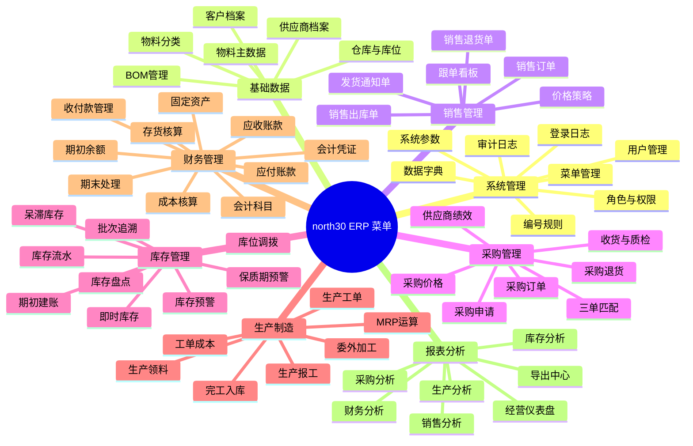
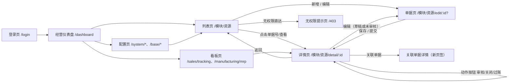
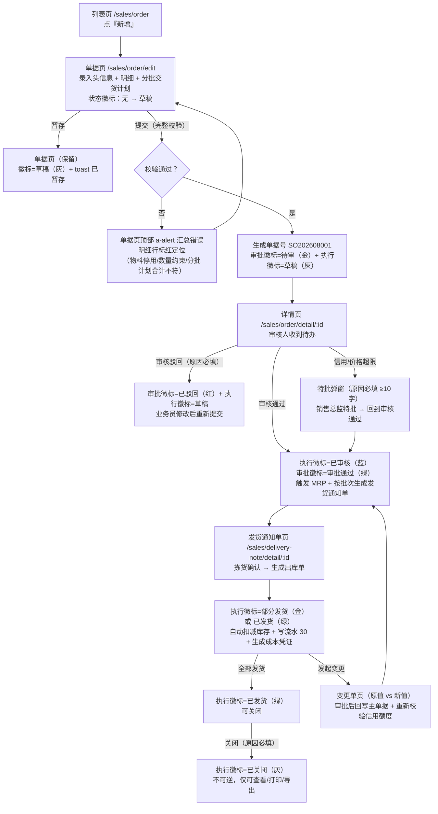
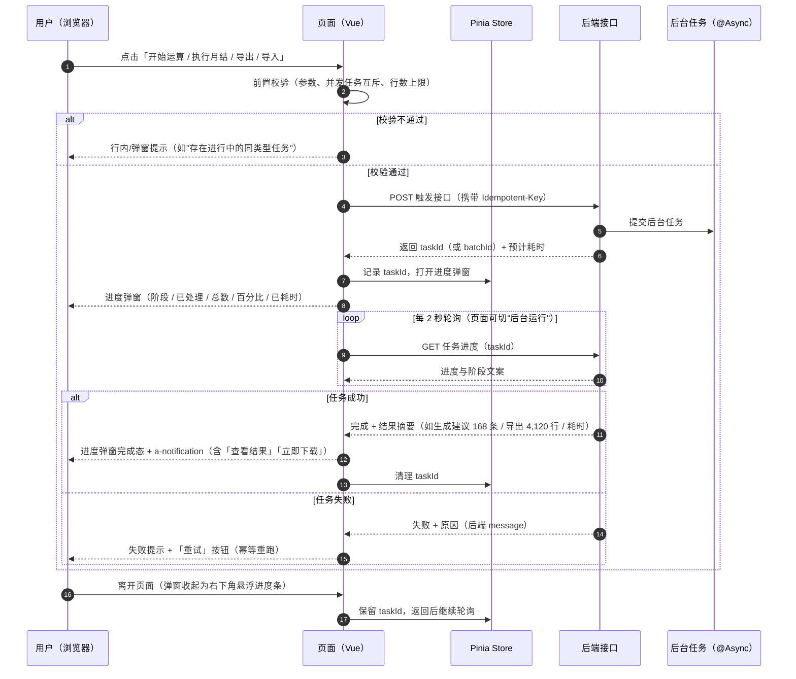
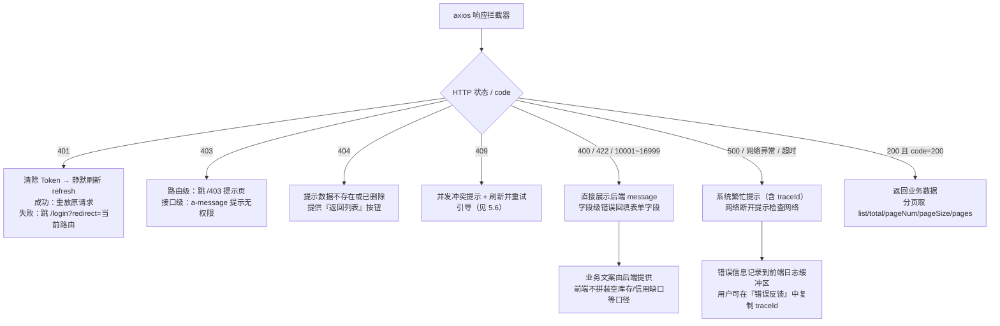
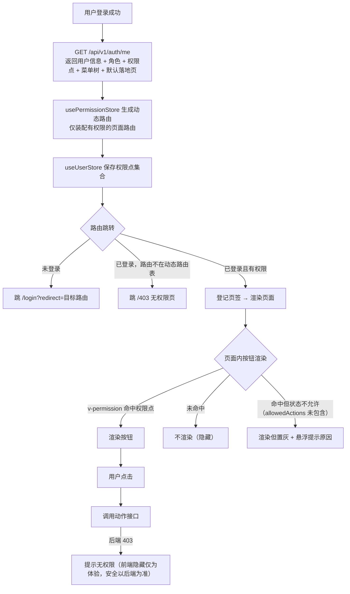

# ERP系统 UI/UX 设计说明

| 文档属性 | 内容 |
|---------|------|
| 文档名称 | ERP系统 UI/UX 设计说明 |
| 文档编号 | ERP-P2-05 |
| 版本 | V1.0 |
| 状态 | 待评审 |
| 编制部门 | 数字化管理部（会同销售部、采购部、仓储中心、生产制造部、财务部、质量部） |
| 编制日期 | 2026年9月 |
| 所属阶段 | 阶段二 系统设计（第 3-4 月） |
| 关联里程碑 | M2 设计评审通过（UI/UX 评审问题全部关闭） |
| 适用范围 | 集团总部、2 个生产基地（苏州、东莞）、3 个区域销售分公司（华东、华南、华北）、4 个中心仓库的全部前端页面设计与开发；PC 端 Chrome / Edge（≥1920×1080） |
| 上游输入 | `01-概要设计说明书.md`（架构约束、技术栈、认证与权限模型）、`../phase1-requirement-confirmation/03-需求规格说明书-终稿.md`（需求基线 80 条）、`../phase1-requirement-confirmation/02-业务流程梳理-As-Is与To-Be.md`（单据状态流转取值）、`../ERP系统开发API设计与规范文档.md`（接口总纲） |
| 下游流向 | 阶段三（D2-D9）前端页面开发与后端接口联调的交互依据；阶段四 SIT / 阶段五 UAT 的界面验收参照 |
| 关联交付物 | 同目录《详细设计说明书》《数据库设计文档》《接口设计文档》《概要设计说明书》；本文为 M2 评审的交互类文档 |

---

## 文档定位

| 项 | 说明 |
|----|------|
| 本文在阶段二中的位置 | 阶段二核心任务 **2.5 UI/UX 设计** 的交付物，与 2.1 架构设计、2.2 数据库设计、2.3 接口设计（《概要设计说明书》《详细设计说明书》《数据库设计文档》《接口设计文档》）并列 |
| 本文性质 | **线框级交互设计说明**（非高保真视觉稿）：给出信息架构、导航规则、设计规范（Design System）、核心页面原型说明、关键交互流程、前端工程与代码约定；不给出像素级视觉稿、不做视觉资产交付 |
| 需求输入 | 《需求规格说明书（终稿）》80 条需求为唯一需求输入基线；本文第七章给出"页面 → 接口 → 需求编号 → 开发子阶段"的覆盖对照表，做到无"页面无接口"、无"接口无入口" |
| 规范输入 | 《ERP系统开发技术选型》（前端技术栈）、《ERP系统开发目录结构设计》（erp-frontend 结构）、《ERP系统开发API设计与规范文档》（统一响应体、分页、鉴权、批量与导出规范）、《ERP系统开发编码规范文档》、AGENTS.md（前端红线） |
| 一致性口径 | 技术栈、API 前缀 `/api/v1`、统一响应体 `Result<T>`、分页字段 `list/total/pageNum/pageSize/pages`、单据状态取值、单据编号前缀、金额与数量展示精度**与上游文档逐字一致**；凡与旧基线文档表述冲突处，以本文第七章评审问题清单的明确结论为准 |
| 本期交付验收口径 | 页面清单覆盖全部 80 条需求；状态徽标配色映射覆盖全部单据状态取值；评审问题清单无"未处理"条目 |
| 评审对象 | 本文为 M2 设计评审的交互类文档，评审问题须全部关闭后 M2 方可判定通过（见第八章 8.3） |

---

## 一、设计目标与原则

### 1.1 设计目标

| 序号 | 设计目标 | 承接需求 | 可验证指标 |
|------|---------|---------|-----------|
| 1 | **面向岗位作业，覆盖 450 人规模制造企业全角色** | 全部 80 条 | 13 类岗位均有明确落地页与默认首页；每个角色登录后 ≤2 次点击可达其高频任务页 |
| 2 | **以单据处理为核心，高频录入效率优先** | SAL-01、PUR-02、MFG-05、MFG-06、INV-02、INV-03 | 单据行录入全键盘可完成（Tab/Enter/方向键）；一张 10 行明细的销售订单从打开到提交 ≤2 分钟（UAT 计时） |
| 3 | **减少点击与页面跳转，操作就近可达** | SAL-03、SAL-08、MFG-09、PUR-05 | 列表页高频动作（查看/审核/导出）≤1 次点击；单据动作按钮按状态动态渲染，不可用动作不展示或置灰并给出原因 |
| 4 | **状态可视，单据流转一目了然** | 全部单据类需求（SAL-01~06、PUR-01~06、INV-06/09/10、MFG-04~07、FIN-01/08） | 全部单据状态以统一徽标（Tag）展示且配色固定；单据详情页首屏可见当前状态与下一步可执行动作 |
| 5 | **数据可追溯，看得见来源与去向** | SYS-04、SYS-05、INV-09、FIN-01、FIN-07、RPT-07 | 库存流水展示 `before_qty` / `after_qty`；凭证与来源单据双向跳转；审计日志提供变更前后 JSON 对比；导出受数据权限约束（导出 = 可见） |
| 6 | **错误可自解释，提交前可发现** | SYS-08、SAL-02、BOM-07、INV-09 | 业务校验失败使用后端 `message` 原样展示（含单据号、物料编码、数值）；BOM 闭环检测给出完整闭环路径；乐观锁冲突给出重试引导 |
| 7 | **长任务不阻塞，过程可预期** | MFG-01、FIN-04、FIN-05、FIN-08、RPT-07、SYS-11 | MRP 运算、月末结转、异步导出、批量导入均提供进度反馈与结果入口；进度可见、失败可重试、结果可下载 |
| 8 | **一致性与可维护性** | 编码规范（前端红线） | 同一类交互（列表/单据/弹窗/确认/提示）在全系统使用同一模式与同一组件；页面组件风格不得个性化定制 |

### 1.2 设计原则

| 序号 | 设计原则 | 落地含义 |
|------|---------|---------|
| 1 | **以单据为中心** | 信息架构与页面模式围绕"单据"组织：列表（找单据）→ 详情（看单据）→ 单据页（改单据）→ 动作（推进单据）；单据页采用统一"头行结构"，不做逐单据定制布局 |
| 2 | **减少点击与页面跳转** | 高频动作内聚：列表行内直接进入详情、列表底部承载分页、详情页承载全部动作按钮、单据页承载明细录入；跨页面跳转优先用页签（Tab）保留上下文，不做无意义的中间页 |
| 3 | **键盘友好** | 单据明细录入支持 Enter 新增行 / Tab 单元格右移 / Shift+Tab 左移 / 上下方向键切行 / Esc 取消当前单元格编辑 / Ctrl+S 暂存；查询表单 Enter 即查询；弹窗 Esc 关闭且必填未填时拦截关闭 |
| 4 | **状态可视** | 状态不仅是文字：徽标配色 + 文案固定映射（见 3.2）；状态相关的可用动作由后端返回的 `allowedActions` 驱动渲染；状态与执行进度分离展示（如采购订单"执行状态 + 结算状态"两个徽标并列） |
| 5 | **危险操作二次确认** | 删除、作废、关闭、反审核、期间关闭/重开、批量删除、物料停用、计价方法变更、期初修改一律二次确认；其中关闭、反审核、期间关闭/重开、超信用额度特批、超定额领料、预警忽略**必须填写原因**（原因落审计日志） |
| 6 | **一致性优于个性化** | 组件选型、间距、色彩、文案语气、反馈方式全系统统一；同一业务含义的状态在任意页面颜色一致；任何页面不得自定义按钮样式、自定义颜色、自定义弹窗尺寸档位 |
| 7 | **前端不承担业务判定** | 前端只做参数校验、显隐控制与体验优化；金额计算、库存判定、审批结论、数据范围过滤一律以后端为准，前端展示后端返回的 `message`，不自行拼装业务文案 |
| 8 | **只展示必要信息** | 列表默认列控制在 8~12 列，超出的进入"列设置"；详情页按"基本信息 / 明细 / 关联单据"分区折叠，首屏优先展示结论性信息（状态、金额、数量） |
| 9 | **数据权限可见即所得** | 前端不缓存、不聚合越权数据；列表、详情、导出三处展示同一数据范围结果；金额与银行账号等敏感字段以后端掩码结果展示，前端不做二次还原 |
| 10 | **中文界面单一语言** | 本期界面固定中文，不提供语言切换入口；全部文案集中管理并预留 i18n 抽取能力，禁止把中文文案硬编码在业务逻辑中（见 6.7） |

### 1.3 目标用户与使用场景

| 角色 | 部门 | 典型任务 | 使用频次 | 关键诉求 |
|------|------|---------|---------|---------|
| 销售业务员 | 华东 / 华南 / 华北销售分公司 | 录销售订单、维护分批交货计划、查订单执行进度、答复客户催单、发退货申请 | 高频（日均 10~30 单） | 录单快、能一键复制执行摘要答复客户、只看本人负责客户 |
| 销售总监 | 销售部 | 审核订单（含超信用额度/超价区间特批）、看区域销售与毛利排行、跟超期订单 | 中频（日均 20~60 条审批） | 审批页一屏看全关键信息（客户/金额/信用缺口/价差）、批量审核、超期清单直达 |
| 采购员 | 采购部 | 处理采购申请转单、录采购订单、跟进到货、处理三单匹配差异、查历史价格 | 高频（日均 15~40 单） | 下单时自动提示上次价与历史最低价、到货进度可视、差异清单可批量处理 |
| 采购经理 | 采购部 | 审批采购申请（超 5 万元转上级）、审批退货、管供应商绩效、看采购报表 | 中频 | 审批信息含金额与阈值对比、供应商评分与准时率一屏可见 |
| 仓管员 | 仓储中心（4 个中心仓） | 收货登记、质检结论录入、拣货确认、出入库登记、库位调拨、盘点录入 | 高频（日均 200+ 流水） | 单据页录入键盘化、批次/保质期必填校验就地提示、盘点支持 Excel 导入 |
| 仓库主管 | 仓储中心 | 盘点计划与差异审批、库存预警处理、呆滞与保质期处置、看库存分析报表 | 中频 | 预警清单可一键转采购申请、差异明细与审批留痕、库存准确率可视 |
| 质检员 | 质量部 | 录入收货质检结论（合格/不合格数量）、登记不合格品隔离与退货 | 高频 | 录入页面极简（只填合格/不合格数量与结论）、不合格自动提示发起退货 |
| 生产计划员 | 生产制造部 | MRP 运算参数设置与触发、审核 MRP 建议、转采购申请/生产工单、排产与工单下达 | 高频（每日 1~3 次运算） | 长任务进度可见、建议可按物料/类型筛选、已转行防重复转换标识清晰 |
| 车间主任 | 苏州 / 东莞生产基地 | 领料审核（含超定额审批）、报工录入、工单进度跟踪、委外发料与回收 | 高频（每日多次） | 报工按工序分次录入不重复、超领与超期异常醒目、领料定额与实际差异可视 |
| 成本会计 | 财务部 | 存货核算与工单成本核算、成本下钻核对、标准成本 vs 实际成本对比 | 中频（月度集中） | 核算结果可下钻至流水与报工明细、金额 2 位展示且可追 6 位口径说明 |
| 总账会计 | 财务部 | 凭证查询与过账、应收应付立账与核销、对账与开票登记、账龄核对 | 高频（月均约 3,300 张凭证） | 凭证来源可反查单据、已过账不可改的只读态明确、批次过账有结果反馈 |
| 财务经理 | 财务部 | 付款审批、期末处理（月末结转与期间关闭）、期间重开（需权限）、看财务报表 | 中频（月度集中） | 月结检查清单 5 项结果一屏可见、期间关闭前强提示、全部动作留痕 |
| 总经理 / 管理层 | 集团总部 | 看经营仪表盘 8 项指标、组织维度切换、指标口径说明、看各域分析报表 | 高频（每日晨会） | 首屏看结论、指标可点开口径说明、看板刷新延迟明确标注 |
| IT 管理员 | 数字化管理部 | 用户与角色维护、菜单与权限点配置、数据范围设置、字典与参数维护、审计日志查询 | 中频 | 权限树勾选直观、参数改后 1 分钟生效有提示、审计日志可按单据号秒级检索 |

### 1.4 设计依据文档清单

| 序号 | 文档 | 路径 | 本文引用范围 |
|------|------|------|-------------|
| 1 | 需求规格说明书（终稿） | `docs/phase1-requirement-confirmation/03-需求规格说明书-终稿.md` | 全部 80 条需求、非功能需求第五章、附录 B 统一裁定 |
| 2 | 业务流程梳理（As-Is / To-Be） | `docs/phase1-requirement-confirmation/02-业务流程梳理-As-Is与To-Be.md` | 单据状态流转取值、动作接口与状态徽标映射 |
| 3 | 业务调研报告 | `docs/phase1-requirement-confirmation/01-业务调研报告.md` | 岗位分工、使用频次、作业痛点（页面优先级依据） |
| 4 | 数据迁移需求方案 | `docs/phase1-requirement-confirmation/04-数据迁移需求方案.md` | INV-11 / FIN-09 / SYS-11 期初建账与批量导入页面约束 |
| 5 | 概要设计说明书 | `docs/phase2-system-design/01-概要设计说明书.md` | 架构与模块划分、认证与权限模型、统一响应、幂等、缓存与长任务机制、兼容性结论 |
| 6 | ERP系统开发API设计与规范文档 | `docs/ERP系统开发API设计与规范文档.md` | 统一响应体、分页参数与响应字段、鉴权机制、状态流转与批量接口规范、导出规范 |
| 7 | ERP系统开发技术选型 | `docs/ERP系统开发技术选型.md` | 前端技术栈基线（Vue 3 / TypeScript / Ant Design Vue 4 / Pinia / Vite / ECharts） |
| 8 | ERP系统开发目录结构设计 | `docs/ERP系统开发目录结构设计.md` | erp-frontend 目录组织（api / views / router / stores / components / utils / constants） |
| 9 | ERP系统开发编码规范文档 | `docs/ERP系统开发编码规范文档.md` | 命名规范、注释与提交规范（前端部分） |
| 10 | AGENTS.md | `docs/../AGENTS.md` | 前端红线：TS 严格模式禁 `any`、`<script setup>`、组件命名前缀、axios 统一封装 |

---

## 二、信息架构与导航设计

### 2.1 菜单树（信息架构）

系统采用"8 个一级模块 + 二级菜单 + 页面/按钮权限点"的三级结构；菜单由后端按当前用户角色的权限点返回，前端不做菜单硬编码。



**菜单层级与需求映射：**

| 一级模块 | 二级菜单（页面级） | 承载需求 |
|---------|------------------|---------|
| 系统管理 | 用户管理、角色与权限、菜单管理、数据字典、系统参数、编号规则、审计日志、登录日志 | SYS-02、SYS-03、SYS-04、SYS-05、SYS-06、SYS-07、SYS-09 |
| 基础数据 | 物料分类、物料主数据、BOM 管理、客户档案、供应商档案、仓库与库位 | MD-01~MD-06、BOM-01~BOM-07、CS-01~CS-03、INV-01（仓库/库位主数据） |
| 销售管理 | 销售订单、发货通知单、销售出库单、销售退货单、价格策略、跟单看板 | SAL-01~SAL-08 |
| 采购管理 | 采购申请、采购订单、收货与质检、采购退货、三单匹配、采购价格、供应商绩效 | PUR-01~PUR-08 |
| 库存管理 | 即时库存、库存流水、库存盘点、库位调拨、批次追溯、库存预警、呆滞库存、保质期预警、期初建账 | INV-01~INV-11 |
| 生产制造 | MRP 运算、生产工单、生产领料、生产报工、完工入库、委外加工、工单成本 | MFG-01~MFG-10 |
| 财务管理 | 会计凭证、会计科目、应收账款、应付账款、收付款管理、存货核算、成本核算、固定资产、期末处理、期初余额 | FIN-01~FIN-09 |
| 报表分析 | 经营仪表盘、销售分析、采购分析、库存分析、生产分析、财务分析、导出中心 | RPT-01~RPT-07 |

**跨模块能力（不单独占菜单，内嵌于业务页面）：** 附件与文件管理（SYS-10）以"单据详情页附件面板"承载；基础数据批量导入（SYS-11）以"列表页导入按钮 + 导入弹窗 + 导入日志"承载；报表导出（RPT-07）以"各报表页导出按钮 + 导出中心（异步任务与下载）"承载。

### 2.2 菜单与权限的联动规则

**权限点编码规则：** `模块:对象:动作`（小写英文，冒号分隔），三层语义与《编码规范文档》包结构对齐。

| 层级 | 编码形态 | 示例 | 说明 |
|------|---------|------|------|
| 目录 | `模块` | `sales` | 一级模块，无独立权限点时按子菜单可见性决定是否渲染 |
| 菜单（页面） | `模块:对象` | `sales:order` | 页面级权限点，控制菜单项与路由访问 |
| 按钮（动作） | `模块:对象:动作` | `sales:order:approve` | 页面内按钮级权限点，动作名与后端动作接口一一对应（`create`/`edit`/`delete`/`submit`/`approve`/`reject`/`close`/`unapprove`/`export`/`import`/`print`） |

**渲染规则（明确结论，全系统统一）：**

| 场景 | 规则 | 理由 |
|------|------|------|
| 菜单项无权限 | **不渲染**（隐藏），父级目录下所有子菜单均无权限时父级目录一并隐藏 | 菜单是导航入口，隐藏可减少干扰；接口侧仍有 403 兜底 |
| 页面路由无权限 | 路由守卫拦截并跳转 `/403` 页面（提示"无访问权限，请联系管理员"） | 防止直达 URL 越权 |
| 按钮无权限 | **不渲染**（隐藏），不使用置灰 | 置灰会让用户反复判断"为何不可用"；权限点缺失属稳定状态，隐藏接入更清晰 |
| 按钮有权限但当前状态不可执行 | **渲染但置灰 + 悬浮提示原因**（如"已关闭工单不可领料"） | 状态不可执行属过程状态，需要告知用户原因与去向 |
| 数据范围外的数据 | **后端不返回**（前端不展示占位），越权直达详情后端返回 403，前端展示 403 提示页 | 前端不承担安全判定（概要设计 4.3） |
| 敏感字段无字段权限 | 展示后端返回的掩码值（如 `6222****1234`） | 掩码规则在 VO 阶段完成，前端不做二次处理 |
| 权限变更生效时点 | 前端在路由切换或接口返回 401/403 时重新拉取用户权限；同时每 5 分钟静默刷新一次用户信息 | 与 SYS-03"≤5 分钟或重新登录后生效"一致 |

### 2.3 路由规划表

**路径规范：** 全部业务页面挂在 `/` 下按模块分段，页面路径与权限点一一对应；详情页与单据页携带主键参数；当前用户免登录页仅登录页与 403/404 页。

| 路由路径 | 页面名称 | 所属模块 | 权限编码 | 是否需登录 |
|---------|---------|---------|---------|-----------|
| `/login` | 登录页 | 认证 | 无（白名单） | 否 |
| `/403` | 无权限提示页 | 公共 | 无 | 是 |
| `/404` | 页面不存在 | 公共 | 无 | 是 |
| `/dashboard` | 经营仪表盘（首页） | 报表分析 | `report:dashboard` | 是 |
| `/system/user` | 用户管理（列表） | 系统管理 | `system:user` | 是 |
| `/system/user/edit/:id?` | 用户新增/编辑 | 系统管理 | `system:user:create` / `system:user:edit` | 是 |
| `/system/role` | 角色与授权（列表） | 系统管理 | `system:role` | 是 |
| `/system/role/auth/:id` | 角色授权（菜单树 + 数据范围） | 系统管理 | `system:role:auth` | 是 |
| `/system/menu` | 菜单管理 | 系统管理 | `system:menu` | 是 |
| `/system/dict` | 数据字典 | 系统管理 | `system:dict` | 是 |
| `/system/param` | 系统参数 | 系统管理 | `system:param` | 是 |
| `/system/code-rule` | 编号规则 | 系统管理 | `system:code-rule` | 是 |
| `/system/audit-log` | 审计日志查询 | 系统管理 | `system:audit-log` | 是 |
| `/system/login-log` | 登录日志查询 | 系统管理 | `system:login-log` | 是 |
| `/base/material-category` | 物料分类树 | 基础数据 | `base:material-category` | 是 |
| `/base/material` | 物料主数据（列表） | 基础数据 | `base:material` | 是 |
| `/base/material/detail/:id` | 物料详情 | 基础数据 | `base:material:view` | 是 |
| `/base/material/edit/:id?` | 物料新增/编辑 | 基础数据 | `base:material:create` / `base:material:edit` | 是 |
| `/base/bom` | BOM 管理与反查 | 基础数据 | `base:bom` | 是 |
| `/base/bom/detail/:id` | BOM 详情（多级树 + 明细） | 基础数据 | `base:bom:view` | 是 |
| `/base/bom/edit/:id?` | BOM 新增/版本升级 | 基础数据 | `base:bom:create` / `base:bom:edit` | 是 |
| `/base/customer` | 客户档案 | 基础数据 | `base:customer` | 是 |
| `/base/customer/detail/:id` | 客户详情（含信用额度占用） | 基础数据 | `base:customer:view` | 是 |
| `/base/supplier` | 供应商档案 | 基础数据 | `base:supplier` | 是 |
| `/base/supplier/detail/:id` | 供应商详情（含付款条件与绩效） | 基础数据 | `base:supplier:view` | 是 |
| `/base/warehouse` | 仓库与库位 | 基础数据 | `base:warehouse` | 是 |
| `/sales/order` | 销售订单列表 | 销售管理 | `sales:order` | 是 |
| `/sales/order/detail/:id` | 销售订单详情（含执行跟踪） | 销售管理 | `sales:order:view` | 是 |
| `/sales/order/edit/:id?` | 销售订单单据页 | 销售管理 | `sales:order:create` / `sales:order:edit` | 是 |
| `/sales/delivery-note` | 发货通知单 | 销售管理 | `sales:delivery-note` | 是 |
| `/sales/delivery-note/detail/:id` | 发货通知单详情与拣货确认 | 销售管理 | `sales:delivery-note:view` | 是 |
| `/sales/outbound` | 销售出库单 | 销售管理 | `sales:outbound` | 是 |
| `/sales/return` | 销售退货单（RMA） | 销售管理 | `sales:return` | 是 |
| `/sales/return/detail/:id` | 销售退货详情（质检与退款/换货） | 销售管理 | `sales:return:view` | 是 |
| `/sales/price-policy` | 销售价格策略 | 销售管理 | `sales:price-policy` | 是 |
| `/sales/tracking` | 销售跟单看板 | 销售管理 | `sales:tracking` | 是 |
| `/purchase/requisition` | 采购申请 | 采购管理 | `purchase:requisition` | 是 |
| `/purchase/order` | 采购订单列表 | 采购管理 | `purchase:order` | 是 |
| `/purchase/order/detail/:id` | 采购订单详情 | 采购管理 | `purchase:order:view` | 是 |
| `/purchase/order/edit/:id?` | 采购订单单据页 | 采购管理 | `purchase:order:create` / `purchase:order:edit` | 是 |
| `/purchase/receipt` | 收货与质检列表 | 采购管理 | `purchase:receipt` | 是 |
| `/purchase/receipt/detail/:id` | 收货单详情与质检录入 | 采购管理 | `purchase:receipt:view` | 是 |
| `/purchase/return` | 采购退货单 | 采购管理 | `purchase:return` | 是 |
| `/purchase/match` | 三单匹配 | 采购管理 | `purchase:match` | 是 |
| `/purchase/price` | 采购价格查询与走势 | 采购管理 | `purchase:price` | 是 |
| `/purchase/supplier-score` | 供应商绩效评估 | 采购管理 | `purchase:supplier-score` | 是 |
| `/inventory/stock` | 即时库存查询 | 库存管理 | `inventory:stock` | 是 |
| `/inventory/transaction` | 库存流水查询 | 库存管理 | `inventory:transaction` | 是 |
| `/inventory/stock-take` | 库存盘点单 | 库存管理 | `inventory:stock-take` | 是 |
| `/inventory/stock-take/detail/:id` | 盘点单详情（实盘录入与差异审批） | 库存管理 | `inventory:stock-take:view` | 是 |
| `/inventory/transfer` | 库位/仓库调拨单 | 库存管理 | `inventory:transfer` | 是 |
| `/inventory/batch-trace` | 批次与序列号追溯 | 库存管理 | `inventory:batch-trace` | 是 |
| `/inventory/alert` | 安全库存预警与补货建议 | 库存管理 | `inventory:alert` | 是 |
| `/inventory/slow-moving` | 呆滞库存分析 | 库存管理 | `inventory:slow-moving` | 是 |
| `/inventory/shelf-life` | 保质期预警 | 库存管理 | `inventory:shelf-life` | 是 |
| `/inventory/opening` | 期初库存建账 | 库存管理 | `inventory:opening` | 是 |
| `/manufacturing/mrp` | MRP 运算与结果 | 生产制造 | `manufacturing:mrp` | 是 |
| `/manufacturing/work-order` | 生产工单列表 | 生产制造 | `manufacturing:work-order` | 是 |
| `/manufacturing/work-order/detail/:id` | 工单详情（领料/报工/进度/成本） | 生产制造 | `manufacturing:work-order:view` | 是 |
| `/manufacturing/work-order/edit/:id?` | 工单新增/编辑与下达 | 生产制造 | `manufacturing:work-order:create` / `manufacturing:work-order:edit` | 是 |
| `/manufacturing/issue` | 生产领料单 | 生产制造 | `manufacturing:issue` | 是 |
| `/manufacturing/report` | 生产报工 | 生产制造 | `manufacturing:report` | 是 |
| `/manufacturing/finish-inbound` | 完工入库单 | 生产制造 | `manufacturing:finish-inbound` | 是 |
| `/manufacturing/outsourcing` | 委外加工管理 | 生产制造 | `manufacturing:outsourcing` | 是 |
| `/manufacturing/cost` | 工单成本归集与下钻 | 生产制造 | `manufacturing:cost` | 是 |
| `/finance/voucher` | 会计凭证查询与过账 | 财务管理 | `finance:voucher` | 是 |
| `/finance/voucher/detail/:id` | 凭证详情（分录明细与来源单据） | 财务管理 | `finance:voucher:view` | 是 |
| `/finance/subject` | 会计科目表 | 财务管理 | `finance:subject` | 是 |
| `/finance/receivable` | 应收账款与账龄 | 财务管理 | `finance:receivable` | 是 |
| `/finance/payable` | 应付账款与账龄 | 财务管理 | `finance:payable` | 是 |
| `/finance/receipt-payment` | 收款与付款登记/核销 | 财务管理 | `finance:receipt-payment` | 是 |
| `/finance/inventory-accounting` | 存货核算 | 财务管理 | `finance:inventory-accounting` | 是 |
| `/finance/cost-accounting` | 成本核算 | 财务管理 | `finance:cost-accounting` | 是 |
| `/finance/fixed-asset` | 固定资产卡片与折旧 | 财务管理 | `finance:fixed-asset` | 是 |
| `/finance/period-close` | 期末处理（月结与期间关闭） | 财务管理 | `finance:period-close` | 是 |
| `/finance/opening-balance` | 期初余额建账 | 财务管理 | `finance:opening-balance` | 是 |
| `/report/sales` | 销售分析报表 | 报表分析 | `report:sales` | 是 |
| `/report/purchase` | 采购分析报表 | 报表分析 | `report:purchase` | 是 |
| `/report/inventory` | 库存分析报表 | 报表分析 | `report:inventory` | 是 |
| `/report/manufacturing` | 生产分析报表 | 报表分析 | `report:manufacturing` | 是 |
| `/report/finance` | 财务分析报表（含财务报表） | 报表分析 | `report:finance` | 是 |
| `/report/export-center` | 导出中心（异步任务与下载） | 报表分析 | `report:export` | 是 |

### 2.4 页面类型与导航约定

| 页面类型 | 典型路径 | 进入方式 | 返回路径 | 面包屑 |
|---------|---------|---------|---------|--------|
| **列表页** | `/sales/order` | 左侧菜单、页签、首页快捷入口 | 无（顶层页面） | `销售管理 / 销售订单` |
| **单据页** | `/sales/order/edit/:id?` | 列表页"新增"按钮；列表行"编辑"；详情页"编辑" | 保存后跳详情页；"取消"回上一页（有未保存修改时二次确认） | `销售管理 / 销售订单 / 新建销售订单`（编辑时为"编辑 SO202608001"） |
| **详情页** | `/sales/order/detail/:id` | 列表行点击单据号或"查看"；消息通知跳转 | "返回"回列表页并保留原筛选与分页 | `销售管理 / 销售订单 / SO202608001` |
| **看板页** | `/sales/tracking`、`/manufacturing/mrp` | 左侧菜单 | 无（顶层页面） | `销售管理 / 跟单看板` |
| **配置页** | `/system/param`、`/base/material-category` | 左侧菜单 | 无（顶层页面） | `系统管理 / 系统参数` |
| **提示页** | `/403`、`/404` | 路由守卫或接口拦截 | 提供"返回首页"按钮（跳 `/dashboard`） | 无面包屑 |

**导航约定：**

| 约定项 | 结论 |
|--------|------|
| 面包屑规则 | 最多三级：`一级模块 / 二级菜单 / 单据号或页面名`；单据号可点击回到该单据详情；不做四级以上面包屑 |
| 多页签（Tab） | 开启"多页签"模式：每次进入页面级路由生成一个页签，以页面 `name` 去重（同一单据只保留一个页签） |
| 页签上限与关闭策略 | 上限 **12 个**；超出时自动关闭最久未访问的页签并提示"已自动关闭最久未使用页签"；首页 `/dashboard` 为固定页签，不可关闭；其余页签可单个关闭、可右键"关闭其他/关闭全部" |
| 页签与筛选状态 | 页签内保留该页面的筛选条件、分页页码与滚动位置；关闭后状态清除 |
| 刷新行为 | 页签右键提供"刷新当前页"；浏览器刷新（F5）后恢复当前路由与页签列表（页签列表持久化到 sessionStorage） |
| 跨模块跳转 | 单据详情中的关联单据（如订单 → 关联工单/凭证）以**新页签**打开，保留当前上下文；单据页内的物料/客户选择使用弹窗，不跳页 |
| 深链接 | 全部详情页支持 URL 直达（含主键），刷新可复原；不把筛选条件编入 URL（除报表页的期间与组织维度） |
| 单页签内返回 | 详情页在无历史记录时（深链接进入）"返回"跳对应列表页，不跳浏览器上一页 |

### 2.5 首页与默认落地页规则

| 场景 | 落地页 | 规则 |
|------|--------|------|
| 登录成功（通用） | `/dashboard` 经营仪表盘 | 除"业务操作岗"外所有角色默认落仪表盘；仪表盘数据受数据权限过滤（业务员仅见本人客户口径数据） |
| 销售业务员 | `/sales/order` 销售订单列表 | 岗位高频页优先（可由用户在"个人偏好"中自行改回仪表盘） |
| 采购员 | `/purchase/order` 采购订单列表 | 同上 |
| 仓管员 | `/inventory/stock` 即时库存 | 同上 |
| 车间主任 | `/manufacturing/work-order` 生产工单列表 | 同上 |
| 直接访问根路径 `/` | 重定向到当前用户默认落地页 | 由用户信息接口返回 `defaultRoute`（前端根据角色映射兜底） |
| 登录页直接访问（已登录） | 重定向到当前用户默认落地页 | 已登录状态不重复登录 |
| 会话过期后回跳 | 记录原目标路由，登录成功后回跳原页面 | 回跳参数存放于路由 query（`redirect`），登录成功后清理 |
| 仪表盘指标刷新 | 页面加载时拉取；手动刷新按钮；自动刷新间隔 5 分钟 | 页面显著位置标注"数据延迟 ≤5 分钟，成本类指标按日刷新"（RPT-01 验收要点④） |



---
## 三、设计规范（Design System）

> 本章为全系统唯一的前端设计规范来源。组件与 Token 一律取 Ant Design Vue 4 默认 Token，**不自定义主题色**，只做必要的语义扩展；任何页面不得绕过本章规范自定样式。

### 3.1 布局骨架

采用"顶部栏 + 侧边菜单 + 内容区"经典 ERP 布局，全部区域尺寸固定，仅内容区滚动。

```
┌──────────────────────────────────────────────────────────────────────────┐
│ 顶部栏 TopBar  h=56px  固定不滚动                                          │
│ [Logo+系统名 208px] [折叠按钮]   [页签栏 h=40px 紧随其下]                   │
│                                  右侧：[组织切换] [消息] [全屏] [用户菜单]  │
├──────────┬────────────────────────────────────────────────────────────────┤
│ 侧边菜单  │ 面包屑区 h=32px（含返回按钮，详情/单据页显示）                    │
│ h=100%-  ├────────────────────────────────────────────────────────────────┤
│ 顶部栏    │ 页面标题区 h=auto（标题 20px + 右侧操作按钮组，右对齐）           │
│ w=208px  ├────────────────────────────────────────────────────────────────┤
│ 展开态    │ 筛选区 AppSearchForm（可折叠，1~3 行，行高 32px + 间距 16px）      │
│ w=64px   ├────────────────────────────────────────────────────────────────┤
│ 折叠态    │ 内容主体区（表格 / 单据头行 / 图表卡片）—— 唯一滚动区域             │
│ 固定      ├────────────────────────────────────────────────────────────────┤
│ 独立滚动  │ 底部固定栏 h=48px（分页 / 合计 / 单据底部操作按钮组）              │
└──────────┴────────────────────────────────────────────────────────────────┘
```

| 区域 | 尺寸 | 固定/滚动规则 |
|------|------|-------------|
| 顶部栏 | 高度 56px | 固定；左侧 208px 与侧边菜单同宽；右侧功能区右对齐，间距 4px |
| 页签栏 | 高度 40px | 固定；仅在"多页签"模式开启时显示；横向滚动不换行 |
| 侧边菜单 | 展开 208px，折叠 64px；菜单项高 40px，子菜单缩进 24px | 固定宽度、独立纵向滚动；状态记忆（折叠状态持久化到 localStorage） |
| 面包屑区 | 高度 32px，下方 8px 间距 | 不滚动；仅在详情页/单据页/三级页面显示 |
| 内容区 | 左右内边距 16px，上下内边距 16px | 唯一滚动区域；滚动条内嵌，不产生整页横滚 |
| 底部固定栏 | 高度 48px | 固定；列表页放分页器与合计；单据页放暂存/提交/返回 |
| 最小分辨率 | 1920×1080（低于 1440px 宽时表格启横向滚动，不压缩列宽） | 与《概要设计说明书》6.7 兼容性结论一致：本期不做移动端适配 |

### 3.2 主题与色彩

**基础色板（对齐 Ant Design 5 / Ant Design Vue 4 默认 Token）：**

| 语义 | Token | Hex | 用途 |
|------|-------|-----|------|
| 主色 | `colorPrimary` | `#1677ff` | 主按钮、链接、选中态、指标卡强调、图表主序列 |
| 主色-悬浮 | `colorPrimaryHover` | `#4096ff` | 主按钮悬浮 |
| 主色-按下 | `colorPrimaryActive` | `#0958d9` | 主按钮按下 |
| 主色-浅底 | `colorPrimaryBg` | `#e6f4ff` | 选中行背景、Tag blue 底色、指标卡底色 |
| 成功 | `colorSuccess` | `#52c41a` | 已完工、生效、已过账、盘盈、启用 |
| 警告 | `colorWarning` | `#faad14` | 待检、待审、部分完成、库存预警、保质期预警 |
| 危险 | `colorError` | `#ff4d4f` | 驳回、退货、盘亏、删除、超期 |
| 信息 | `colorInfo` | `#1677ff` | 提示类文案与信息图标 |
| 主文本 | `colorText` | `rgba(0,0,0,0.88)` | 表格正文、字段值 |
| 次文本 | `colorTextSecondary` | `rgba(0,0,0,0.65)` | 字段标签、说明文字 |
| 三级文本 | `colorTextTertiary` | `rgba(0,0,0,0.45)` | 占位符、辅助提示、页码 |
| 禁用文本 | `colorTextQuaternary` | `rgba(0,0,0,0.25)` | 禁用态文字 |
| 边框 | `colorBorder` | `#d9d9d9` | 输入框、按钮边框 |
| 分割线 | `colorSplit` | `rgba(0,0,0,0.06)` | 表格线、卡片分割 |
| 容器背景 | `colorBgContainer` | `#ffffff` | 卡片、表格、弹窗背景 |
| 页面背景 | `colorBgLayout` | `#f5f5f5` | 内容区背景 |
| 表头背景 | `tableHeaderBg` | `#fafafa` | 表格表头 |
| 行悬浮 | `controlItemBgHover` | `#f5f5f5` | 表格行悬浮 |
| 行选中 | `controlItemBgActive` | `#e6f4ff` | 表格行勾选 |
| 单据金额强调 | `--erp-amount-color` | `#cf1322` | 单据页合计金额、负数金额（红字） |

**单据状态徽标（Tag）配色映射表（覆盖全部状态取值，全系统统一，不得新增配色）：**

| 业务对象 | 字段 | 取值 | 徽标文案 | Tag 颜色 | 前景 / 底色 Hex |
|---------|------|------|---------|---------|----------------|
| 物料 | `status` | 0 | 新建 | default | `rgba(0,0,0,0.88)` / `#fafafa` |
| 物料 | `status` | 1 | 已审核 | blue | `#1677ff` / `#e6f4ff` |
| 物料 | `status` | 2 | 已启用 | green | `#52c41a` / `#f6ffed` |
| 物料 | `status` | 3 | 已停用 | default（灰） | `rgba(0,0,0,0.45)` / `#fafafa` |
| BOM | `status` | 0 | 草稿 | default | `rgba(0,0,0,0.88)` / `#fafafa` |
| BOM | `status` | 1 | 已审核 | blue | `#1677ff` / `#e6f4ff` |
| BOM | `status` | 2 | 生效 | green | `#52c41a` / `#f6ffed` |
| BOM | `status` | 3 | 历史 | default（灰） | `rgba(0,0,0,0.45)` / `#fafafa` |
| 销售订单 | `order_status` | 0 | 草稿 | default | `rgba(0,0,0,0.88)` / `#fafafa` |
| 销售订单 | `order_status` | 1 | 已审核 | blue | `#1677ff` / `#e6f4ff` |
| 销售订单 | `order_status` | 2 | 部分发货 | gold | `#faad14` / `#fffbe6` |
| 销售订单 | `order_status` | 3 | 已发货 | green | `#52c41a` / `#f6ffed` |
| 销售订单 | `order_status` | 4 | 已关闭 | default（灰） | `rgba(0,0,0,0.45)` / `#fafafa` |
| 销售订单 | `approval_status` | 0 | 待审 | gold | `#faad14` / `#fffbe6` |
| 销售订单 | `approval_status` | 1 | 审批通过 | green | `#52c41a` / `#f6ffed` |
| 销售订单 | `approval_status` | 2 | 已驳回 | red | `#ff4d4f` / `#fff2f0` |
| 采购订单 | `order_status` | 0 | 草稿 | default | `rgba(0,0,0,0.88)` / `#fafafa` |
| 采购订单 | `order_status` | 1 | 已审核 | blue | `#1677ff` / `#e6f4ff` |
| 采购订单 | `order_status` | 2 | 部分收货 | gold | `#faad14` / `#fffbe6` |
| 采购订单 | `order_status` | 3 | 已收货 | green | `#52c41a` / `#f6ffed` |
| 采购订单 | `order_status` | 4 | 已关闭 | default（灰） | `rgba(0,0,0,0.45)` / `#fafafa` |
| 采购订单 | `settlement_status` | 0 | 未结算 | default | `rgba(0,0,0,0.88)` / `#fafafa` |
| 采购订单 | `settlement_status` | 1 | 部分结算 | gold | `#faad14` / `#fffbe6` |
| 采购订单 | `settlement_status` | 2 | 已结算 | green | `#52c41a` / `#f6ffed` |
| 采购收货单 | `status` | 0 | 待检 | gold | `#faad14` / `#fffbe6` |
| 采购收货单 | `status` | 1 | 合格入库 | green | `#52c41a` / `#f6ffed` |
| 采购收货单 | `status` | 2 | 部分合格 | orange | `#fa8c16` / `#fff7e6` |
| 采购收货单 | `status` | 3 | 退货 | red | `#ff4d4f` / `#fff2f0` |
| 生产工单 | `order_status` | 0 | 计划 | default | `rgba(0,0,0,0.88)` / `#fafafa` |
| 生产工单 | `order_status` | 1 | 已下达 | blue | `#1677ff` / `#e6f4ff` |
| 生产工单 | `order_status` | 2 | 领料中 | cyan | `#13c2c2` / `#e6fffb` |
| 生产工单 | `order_status` | 3 | 加工中 | geekblue | `#2f54eb` / `#f0f5ff` |
| 生产工单 | `order_status` | 4 | 已完工 | green | `#52c41a` / `#f6ffed` |
| 生产工单 | `order_status` | 5 | 已关闭 | default（灰） | `rgba(0,0,0,0.45)` / `#fafafa` |
| 会计凭证 | `voucher_status` | 0 | 草稿 | default | `rgba(0,0,0,0.88)` / `#fafafa` |
| 会计凭证 | `voucher_status` | 1 | 已过账 | green | `#52c41a` / `#f6ffed` |
| 库存流水 | `trans_type` | 10 | 采购入库 | green | `#52c41a` / `#f6ffed` |
| 库存流水 | `trans_type` | 20 | 生产入库 | cyan | `#13c2c2` / `#e6fffb` |
| 库存流水 | `trans_type` | 30 | 销售出库 | orange | `#fa8c16` / `#fff7e6` |
| 库存流水 | `trans_type` | 40 | 生产领料 | volcano | `#fa541c` / `#fff2e8` |
| 库存流水 | `trans_type` | 50 | 调拨入库 | geekblue | `#2f54eb` / `#f0f5ff` |
| 库存流水 | `trans_type` | 60 | 调拨出库 | geekblue | `#2f54eb` / `#f0f5ff` |
| 库存流水 | `trans_type` | 70 | 盘盈 | green | `#52c41a` / `#f6ffed` |
| 库存流水 | `trans_type` | 80 | 盘亏 | red | `#ff4d4f` / `#fff2f0` |
| 库存流水 | `trans_type` | 90 | 期初建账 | purple | `#722ed1` / `#f9f0ff` |
| MRP 计划 | `plan_status` | 0 | 新生成 | blue | `#1677ff` / `#e6f4ff` |
| MRP 计划 | `plan_status` | 1 | 已转单 | green | `#52c41a` / `#f6ffed` |
| MRP 计划 | `plan_status` | 2 | 已关闭 | default（灰） | `rgba(0,0,0,0.45)` / `#fafafa` |
| MRP 建议行 | `converted_status` | 0 | 未转 | gold | `#faad14` / `#fffbe6` |
| MRP 建议行 | `converted_status` | 1 | 已转采购单 | blue | `#1677ff` / `#e6f4ff` |
| MRP 建议行 | `converted_status` | 2 | 已转工单 | cyan | `#13c2c2` / `#e6fffb` |
| 通用单据（调拨单/盘点单/退货单/领料单/报工单/入库单） | `status` | 0 | 草稿 | default | `rgba(0,0,0,0.88)` / `#fafafa` |
| 通用单据 | `status` | 1 | 已审核 | blue | `#1677ff` / `#e6f4ff` |
| 通用单据 | `status` | 2 | 已完成 | green | `#52c41a` / `#f6ffed` |
| 通用单据 | `status` | 3 | 已关闭 / 已撤销 | default（灰） | `rgba(0,0,0,0.45)` / `#fafafa` |
| 预警处理 | `handle_status` | 0 | 未处理 | red | `#ff4d4f` / `#fff2f0` |
| 预警处理 | `handle_status` | 1 | 已转申请 | blue | `#1677ff` / `#e6f4ff` |
| 预警处理 | `handle_status` | 2 | 已忽略 | default（灰） | `rgba(0,0,0,0.45)` / `#fafafa` |
| 应收 / 应付 | `status` | 0 | 未核销 | gold | `#faad14` / `#fffbe6` |
| 应收 / 应付 | `status` | 1 | 部分核销 | orange | `#fa8c16` / `#fff7e6` |
| 应收 / 应付 | `status` | 2 | 已核销 | green | `#52c41a` / `#f6ffed` |
| 应收 / 应付 | 逾期标记 | — | 已逾期 N 天 | red | `#ff4d4f` / `#fff2f0` |
| 会计期间 | `period_status` | 0 | 未开启 | default | `rgba(0,0,0,0.88)` / `#fafafa` |
| 会计期间 | `period_status` | 1 | 开放 | blue | `#1677ff` / `#e6f4ff` |
| 会计期间 | `period_status` | 2 | 已关闭 | default（灰） | `rgba(0,0,0,0.45)` / `#fafafa` |
| 用户 | `status` | 0 | 停用 | default（灰） | `rgba(0,0,0,0.45)` / `#fafafa` |
| 用户 | `status` | 1 | 启用 | green | `#52c41a` / `#f6ffed` |
| 固定资产 | `asset_status` | 0 | 在用 | green | `#52c41a` / `#f6ffed` |
| 固定资产 | `asset_status` | 1 | 闲置 | gold | `#faad14` / `#fffbe6` |
| 固定资产 | `asset_status` | 2 | 已报废 | default（灰） | `rgba(0,0,0,0.45)` / `#fafafa` |
| 导出任务 | `task_status` | 0 | 排队中 | default | `rgba(0,0,0,0.88)` / `#fafafa` |
| 导出任务 | `task_status` | 1 | 生成中 | blue | `#1677ff` / `#e6f4ff` |
| 导出任务 | `task_status` | 2 | 已完成 | green | `#52c41a` / `#f6ffed` |
| 导出任务 | `task_status` | 3 | 失败 | red | `#ff4d4f` / `#fff2f0` |

**色觉无障碍约定：** 状态徽标**必须同时包含文字**（不允许仅用颜色表达状态）；图表区分序列时同时使用颜色 + 形状/图例文字；红绿并列场景（盘盈/盘亏、入库/出库）在金额与数量列额外标注 `+` / `−` 符号。

### 3.3 字体与间距规范

| 项 | 规范 |
|----|------|
| 字体族 | `-apple-system, BlinkMacSystemFont, "Segoe UI", "PingFang SC", "Hiragino Sans GB", "Microsoft YaHei", Arial, sans-serif`（不引入 Web 字体，避免首屏闪烁） |
| 页面标题 | 20px / 行高 28px / 字重 600 |
| 区块标题（卡片头） | 16px / 行高 24px / 字重 600 |
| 正文与表格 | 14px / 行高 22px / 字重 400 |
| 表头文字 | 14px / 行高 22px / 字重 600，颜色 `#1f1f1f` |
| 辅助说明与徽标 | 12px / 行高 20px |
| 数字显示 | 金额、数量、比例一律使用 `font-variant-numeric: tabular-nums`，保证列内数字右对齐等宽 |
| 金额展示 | 千分位分隔 + 固定 2 位小数（如 `185,000.00`）；负数前置 `-`（红字，`#cf1322`） |
| 数量展示 | 按物料计量单位展示，最多 3 位小数（如 `206`、`1,250.5`、`0.003`），**四舍五入由后端完成，前端不做二次舍入** |
| 比例/百分比 | 1 位小数 + `%`（如 `82.5%`） |
| 间距基数 | **8px 栅格**：4px（图标与文字间距）、8px（同组元素）、12px（表格单元格内边距）、16px（区块内边距与区块间距）、24px（大区块分隔）、32px（页面级分隔） |
| 圆角 | 基础圆角 6px（`borderRadius`），卡片与弹窗 8px，Tag 4px |
| 阴影 | 仅弹窗、抽屉、下拉浮层使用 Ant Design Vue 默认阴影；卡片不加阴影（用 `colorBorderSecondary` 描边） |
| 表格行高 | 默认 40px；提供"密度切换"（宽松 48px / 默认 40px / 紧凑 32px），选择结果按用户持久化 |

### 3.4 图标使用规范

| 项 | 规范 |
|----|------|
| 图标库 | `@ant-design/icons-vue`（与 Ant Design Vue 4 配套版本），**不引入第二套图标库**；品牌 Logo 除外 |
| 尺寸 | 菜单图标 16px；按钮内图标 14px（默认按钮）/ 16px（大按钮）；空态插图 80~120px；指标卡图标 24px |
| 交互约定 | 图标按钮（仅图标）必须有 `title` 与悬浮提示；危险图标（删除）统一使用红色 `DeleteOutlined` |
| 语义固定 | 新增 `PlusOutlined`、编辑 `EditOutlined`、删除 `DeleteOutlined`、导出 `ExportOutlined`、导入 `ImportOutlined`、打印 `PrinterOutlined`、刷新 `ReloadOutlined`、筛选 `FilterOutlined`、列设置 `SettingOutlined`、附件 `PaperClipOutlined`、审核 `AuditOutlined`、关闭 `StopOutlined`、库存 `DatabaseOutlined`、批次 `BarcodeOutlined`、保质期 `ClockCircleOutlined`、预警 `WarningOutlined`、追溯 `NodeIndexOutlined` |
| 禁止事项 | 不使用 emoji 作为功能性图标；不在同一语境混用实心与线性图标；不自造 SVG 图标（Logo 与空态插图由阶段三视觉资产清单统一提供） |

### 3.5 组件选型映射表

| 业务场景 | 选用 Ant Design Vue 组件 | 使用要点 |
|---------|------------------------|---------|
| 数据列表（单据/主数据/流水） | `a-table`（`AppTable` 封装） | 统一封装列设置、密度、合计行、空态、加载态、分页；见 3.6 |
| 单据明细录入（头行结构） | `a-table` 可编辑行 + "新增行"按钮 + 行内删除 | 单元格进入编辑即聚焦；Enter 提交当前行并新增下一行；行内金额自动计算由后端规则驱动，前端仅回显 |
| 物料 / 客户 / 供应商选择 | `a-select`（`show-search` + `filter-option={false}` 远程搜索）+ 弹窗选择器 `a-modal` | 输入 ≥2 字符触发远程搜索（防抖 300ms）；支持"按编码精确录入"；弹窗选择器支持分类树 + 列表双栏 |
| 仓库 / 库位 / 批次选择 | `a-select`（级联：仓库 → 库位） | 库位列表随仓库联动加载；批次选择展示批次号 + 生产日期 + 有效期 |
| 物料分类 / 菜单权限 / BOM 层级 | `a-tree`（`checkable` / 懒加载） | 分类树最多 2 级；权限树三级（目录/菜单/按钮）；BOM 树支持逐层展开与"仅显示一层"切换 |
| 单据状态与字典值展示 | 自定义 `AppStatusTag` | 由字典码值驱动，配色取 3.2 映射表；未命中码值时显示 `未知(<code>)` 并使用 default 色 |
| 字典下拉（结算方式/物料分类等） | 自定义 `AppDictSelect` | 读字典缓存，支持 `allow-clear`、`show-search`，禁止在各页面重复请求字典接口 |
| 查询条件区 | `a-form`（`layout="inline"` 或两列栅格）+ 折叠/展开 | 超过 6 个条件时默认折叠，展开状态按页面持久化；查询/重置按钮固定右侧 |
| 单据页头信息 | `a-form`（`layout="horizontal"`，标签宽 100px）+ `a-row/a-col` 栅格 | 每行 3~4 个字段；只读字段用 `disabled` 或纯文本展示，必填加红色星号 |
| 单据金额汇总 | `a-card` + `a-statistic` 或纯文本行 | 位于明细区右下：不含税金额、税额、价税合计，合计与明细联动，金额右对齐 |
| 动作按钮组（审核/提交/关闭） | `a-space` + `a-button` + `a-dropdown` | 主动作（提交/审核）为 `type="primary"`；危险动作（关闭/删除/反审核）为 `danger`；超过 4 个动作时主动作直显、其余收进"更多"下拉 |
| 审批与填写意见 | `a-modal` + `a-textarea` | 驳回、关闭、特批、期间关闭/重开必须填写原因（≥5 字），未填不允许提交 |
| 批量操作 | `a-table` 行选择（`row-selection`）+ 顶部批量操作条 | 勾选后顶部显示"已选 N 条 + 批量动作 + 取消选择"；批量结果以结果弹窗展示成功/失败明细 |
| 看板与指标 | `a-card` + `a-statistic` + ECharts（`v-chart`） | 8 项指标卡 + 趋势折线/柱状 + 排行条形图；指标卡可点击展开口径说明（`a-popover`） |
| 图表 | ECharts 5（按需引入） | 统一主题色取 3.2 主色序列；图表提供"数据表"切换入口（无障碍与核对需要） |
| 日期 / 日期区间 | `a-date-picker` / `a-range-picker` | 业务日期格式 `YYYY-MM-DD`；时间戳字段格式 `YYYY-MM-DD HH:mm:ss`；不允许手工输入非法格式（`inputReadOnly` 关闭但强校验） |
| 金额 / 数量输入 | `a-input-number`（`:precision` + `:formatter/:parser`） | 金额 `precision=2`（展示 2 位）+ 千分位格式化 + 后缀（单位/币别）；数量 `precision=3` + 单位后缀；禁止用户输入超过精度的小数位 |
| 百分比 / 税率 | `a-input-number` + `addon-after="%"` | 税率默认 13，范围 0~100，1 位小数 |
| 附件上传与预览 | `a-upload` + 文件列表 + `a-image` 预览 | 限制 PDF/JPG/PNG/XLSX/DOCX，单文件 ≤20MB，单单据 ≤20 个；删除为逻辑删除；下载走鉴权接口 |
| 批量导入 | `a-upload`（模板下载 + 文件上传）+ 导入结果弹窗 | 上传前本地校验扩展名与大小；导入结果显示成功/失败条数与错误行清单（行号 + 原因），提供"下载错误行" |
| 长任务进度 | `a-progress` + `a-modal`（不可关闭直到完成或显式取消） | 展示已处理/总条数、百分比、已耗时、当前阶段文案；失败展示原因与"重试"按钮 |
| 页签 | `a-tabs`（`type="editable-card"`） | 上限 12；首页固定不可关闭；右键菜单提供"关闭其他/关闭全部/刷新" |
| 提示与反馈 | `a-message` / `a-notification` / `a-modal` | 分级见 3.10 |
| 空态与加载 | `a-empty`（空数据）+ `a-skeleton`（首屏表格骨架） | 无数据区分"无数据"与"无匹配结果"两种文案；导出/搜索无结果给出缩小筛选范围建议 |
| 抽屉 | `a-drawer` | 用于"右侧查看关联单据/口径说明/操作日志"，尺寸见 3.9 |

### 3.6 表格规范

| 规范项 | 结论 |
|--------|------|
| 列宽策略 | 每列显式设置 `width`；编码/单号列 140~180px，名称列 200~240px，状态列 100px，数量列 120px，金额列 140px（右对齐），日期列 120px，操作列 120~200px（固定右侧） |
| 固定列 | 首列（单据号或编码）与末列（操作）固定；横向滚动时阴影提示；选中列（`row-selection`）固定最左 |
| 排序 | 仅对服务端可排序字段开放（`orderBy` 白名单），可排序列在表头显示排序图标；默认排序由页面约定（单据一律 `create_time DESC`，流水按 `trans_time DESC`） |
| 筛选 | 高频枚举（状态、类型、仓库）在表头提供筛选下拉；其余条件置于筛选区；表头筛选与筛选区条件合并提交 |
| 列设置记忆 | 提供"列设置"（显隐 + 拖拽排序），选择结果按"用户 + 页面"持久化到 localStorage，跨会话保留 |
| 密度切换 | 宽松 48px / 默认 40px / 紧凑 32px，按"用户 + 全局"持久化 |
| 分页 | 默认 **20 条/页**，可选 **20 / 50 / 100**；单页上限 200（后端强校验，超限提示"单页最多 200 条"）；分页器固定底部，显示"共 N 条" |
| 合计行 | 金额与数量列在"当前页或全部结果"上显示合计，随分页选择切换；合计口径在表头提供口径说明悬浮提示 |
| 行选择与批量操作 | 支持 `row-selection`（跨页选择仅在同一查询条件下有效，切换筛选或翻页后清空并提示）；批量动作在顶部操作条；批量结果弹窗展示成功条数、失败条数与失败原因明细（可导出） |
| 空态 | 分两类文案："暂无数据"（无业务数据）与"没有符合条件的数据，请调整筛选条件"（有筛选条件）；空态提供"重置筛选"按钮 |
| 加载态 | 首次进入用 `a-skeleton` 骨架屏；翻页/查询用表格 `loading` 遮罩；操作按钮提交时按钮 `loading` 并禁用重复点击 |
| 大数据量策略 | 默认分页查询；单页最多 200 条；库存流水等百万级数据强制要求按"物料或时间范围"查询（前端校验必填其一并提示）；**不启用前端虚拟滚动**（避免与固定列、行内编辑冲突），性能由后端索引与分页保证（P-05 指标） |
| 单元格文本处理 | 超长文本省略号 + 悬浮 `a-tooltip` 显示全文；可点击跳转的字段（单据号、物料编码）使用 `type="link"` 样式 |
| 行内编辑 | 仅在单据页明细区启用；列表页一律不做行内编辑（避免误改） |

### 3.7 表单规范

| 规范项 | 结论 |
|--------|------|
| 标签对齐与宽度 | 查询表单：标签在左、宽度自适应；单据/编辑表单：`label-align="right"`，标签固定宽 **100px**（超过 6 个汉字时 120px），冒号统一显示 |
| 必填标识 | 必填字段标签前置红色星号 `*`；后端返回的必填字段清单与前端一致；必填但只读的字段显示"（由系统生成）"说明 |
| 校验时机 | 失焦校验单字段 + 提交前整体校验；提交时若有错误，自动滚动定位到第一个错误字段并聚焦；查询表单不做校验（仅做格式约束） |
| 错误提示位置 | 字段下方红色文字（12px），不使用弹窗；后端返回的字段级错误（400 + 字段名）精确回填到对应字段下方 |
| 只读 / 禁用态 | 只读（`readonly`）用于"可复制不可改"（如单据号）；禁用（`disabled`）用于"当前状态不可改"（如已审核订单的单价），禁用字段悬浮给出原因 |
| 字段联动 | 例如：选择客户 → 带出结算方式/信用额度/报价；选择物料 → 带出单位/标准成本/默认仓库库位；切换含税标识 → 重算税额与合计；联动值可被人工覆盖，覆盖后标记为"已手工调整" |
| 表单分栏与分组 | 字段 ≤8 个单列；>8 个分两列（`a-col :span="12"`），单据头信息每行 3~4 个字段；按"基本信息 / 计划属性 / 财务属性 / 其他"分组，组间距 24px |
| 金额输入框 | `a-input-number` + `precision=2` + 千分位 + 右对齐 + 币别前缀（`¥` 或 `CNY`）；禁止粘贴非法字符；超出授权区间的单价在失焦时给出黄色警示（不阻断录入，审核时由后端判定特批） |
| 数量输入框 | `a-input-number` + `precision=3` + 单位后缀（如 `个`、`套`、`kg`）；录入 0 或负数即时提示（`最小值为 0.001`）；不接受科学计数法 |
| 日期输入 | 业务日期统一 `YYYY-MM-DD`；不允许录入早于 2000-01-01 或晚于当前日期 + 10 年的值（提前期较长的采购交期除外） |
| 文本域 | 备注类字段限 500 字，显示字数统计；不做富文本（防 XSS，见概要设计 6.3） |
| 离开保护 | 表单存在未保存修改时，路由离开/关闭页签/浏览器关闭均触发确认弹窗（见 5.5） |
| 快捷键 | 查询表单 Enter 提交；单据页 `Ctrl + S` 暂存；弹窗 Esc 关闭（必填未填时提示不关闭） |

### 3.8 单据页统一模式（头行结构）

全部单据页（销售订单、采购订单、收货单、发货通知单、出库单、退货单、领料单、报工单、完工入库单、盘点单、调拨单、工单、凭证）统一采用以下四区结构，**不做逐单据定制布局**：

| 区域 | 位置 | 内容 | 关键交互 |
|------|------|------|---------|
| ① 单据头信息区 | 内容区顶部（`a-card`） | 单据号（只读，新建时显示"保存后自动生成"）、业务日期、往来单位（客户/供应商）、关键日期、仓库、币别、税率、付款/结算条件、状态徽标、备注 | 选择客户/供应商后自动带出结算方式与条件；单据号旁提供"复制"按钮 |
| ② 明细行编辑区 | 中部（可编辑 `a-table`） | 行号、物料编码/名称/规格、单位、数量、单价、税率、金额、备注，以及各单据特有列（批次号、交货日期、库位、定额/实际数量、合格/不合格数量等） | 新增行、删除行、复制行、上下移动；Enter 提交行并新增下一行；Tab 单元格右移；行内下拉支持直接改选物料；数量/单价行内变更即时向合计区联动（计算以后端返回规则为准，编辑中本地预览） |
| ③ 金额汇总区 | 明细区右下角 | 不含税金额合计、税额合计、价税合计、数量合计；采购三单匹配差异金额、领料定额差异数量等特殊汇总 | 合计与明细联动；金额右对齐；合计随行数变化自动重算并高亮变更 1 秒 |
| ④ 操作按钮区 | 页面标题右侧（主）+ 底部固定栏（次） | 暂存、提交、审核/驳回、关闭、删除、打印、导出、返回列表 | 按钮按单据状态与权限点动态渲染：主动作 `primary`、危险动作 `danger`、无权限隐藏、状态不允许则置灰并提示原因 |

**单据页通用规则：**

| 规则项 | 结论 |
|--------|------|
| 暂存与提交的区别 | **暂存**：保存单据为草稿（`order_status=0`），不做完整业务校验（仅校验必填与格式），可反复修改，不进入审批、不占用编号规则以外的业务资源；**提交**：执行完整业务校验（物料启用、数量约束、信用额度、单价授权区间、BOM 闭环、库存可用量等，由后端判定），校验通过后生成单据号（首次提交时）并进入"待审"；校验失败时在页面顶部展示错误摘要（`a-alert`），并在对应明细行标红定位 |
| 状态徽标位置 | 单据头信息区第一行右上角，紧随单据号；执行状态与审批状态并列展示（两个徽标，不合并） |
| 审批/流转按钮渲染 | 由后端详情接口返回 `allowedActions` 数组驱动；前端按 2.2 规则渲染（无权限隐藏、状态不允许置灰）；按钮顺序固定：提交 → 审核/驳回 → 关闭 → 反审核 → 打印 → 导出 |
| 明细行增删改与复制 | 新增行插入到当前行之后；复制行复制除行号外的全部字段（便于连续录入相似行）；删除行需行内二次确认（`a-popconfirm`）；行号在保存时由后端重新连续编号 |
| 行内计算与自动带出 | 带出规则：物料 → 单位/标准成本/默认库位；客户 → 结算方式/价格策略价；BOM → 定额应领量；发票 → 匹配差异；**所有最终金额与数量约束以后端返回为准，前端计算仅用于录入过程预览** |
| 单据只读态 | 已审核/已关闭/已过账单据进入"只读态"：全部字段禁用、明细区不可编辑、仅保留打印/导出/关联查询按钮；顶部显示 `a-alert`：如"已过账凭证不可修改，如需更正请使用红冲" |
| 变更单入口 | 已审核且关键字段需变更时（销售订单 SAL-04、采购订单 PUR-02），页面显示"发起变更"按钮，进入变更单（复用单据页布局，展示"原值 / 新值"两列对比），变更审批后回写主单据 |
| 单据页内关联信息 | 以折叠面板（`a-collapse`）承载"关联单据"（如采购订单 → 收货单/发票、工单 → 领料单/报工单）与"操作记录"（状态流转历史、审批记录）、"附件"面板 |

### 3.9 弹窗与抽屉规范

| 尺寸档位 | 宽度 | 适用场景 |
|---------|------|---------|
| 小（`a-modal` 480px） | 480px | 二次确认、原因填写、单字段调整 |
| 中（`a-modal` 640px） | 640px | 简单表单（≤10 字段）、导入规则说明、错误明细 |
| 大（`a-modal` 960px） | 960px | 多字段表单、批量操作结果、错误行清单预览 |
| 全屏（`a-modal` 96vw / `a-drawer` 宽 80%） | 96vw | 物料/客户/供应商/批次选择器、变更单前后值对比、审计日志 JSON 对比 |

| 规范项 | 结论 |
|--------|------|
| Modal 与 Drawer 的选择 | **Modal** 用于"需要用户决策后才能继续"的阻断型任务（确认、填写原因、快速新增、结果反馈）；**Drawer** 用于"不打断当前上下文的信息查看"（关联单据摘要、指标口径说明、操作日志、附件列表） |
| 嵌套限制 | **禁止弹窗内再打开弹窗**（最多一层）；选择器弹窗内部的下拉浮层不计为嵌套；需要两层时改为"弹窗 → 抽屉"或"页面内分区" |
| 关闭策略 | 有未保存改动时关闭弹窗需二次确认；执行中的长任务弹窗不可通过遮罩关闭；错误弹窗必须显式点击按钮关闭 |
| 遮罩与键盘 | 默认允许点击遮罩关闭（长任务与必填原因弹窗除外）；Esc 关闭；弹窗打开时焦点自动落在第一个可编辑字段 |
| 抽屉尺寸 | 中（480px）用于口径说明/日志；大（720px）用于关联单据列表；宽度不做用户可调 |
| 标题与按钮位置 | 标题左对齐，按钮右对齐固定为"取消 → 确认"；危险操作确认按钮为 `danger`，文案动词化（"确认关闭""确认删除"） |

### 3.10 消息与反馈规范

| 反馈方式 | 使用场景 | 展示规范 |
|---------|---------|---------|
| `a-message`（轻提示） | 查询成功、暂存成功、复制成功、刷新成功等**无阻断的轻量结果** | 顶部居中，3 秒自动消失；成功文案统一"操作成功"，具体场景补充宾语（如"暂存成功"） |
| `a-notification`（通知） | 长任务完成（MRP 运算完成、异步导出完成、批量导入完成）、后台预警提醒 | 右上角，带操作按钮（"查看结果""立即下载"），不自动消失（手动关闭） |
| `a-modal`（对话框） | 需要用户明确决策：危险操作确认、原因填写、批量执行结果、校验失败摘要 | 中心弹出，必须点击按钮关闭 |
| 页面内 `a-alert` | 页面级状态说明：只读态提示、数据延迟说明、口径说明、信用额度不足警示、期间已关闭提示 | 内容区顶部，不可关闭（状态类）或可关闭（提示类） |
| 行内错误 | 表单字段校验、明细行数据错误 | 字段下方红字 / 行首红色图标 + 悬浮原因 |
| 全局 Loading | 页面首次加载、路由切换 | 骨架屏优先；路由切换使用顶部进度条，不使用全屏遮罩 |

**操作结果文案规范：**

| 场景 | 文案规范 | 示例 |
|------|---------|------|
| 成功 | "动词 + 单据名 + 单据号" 或 "动词 + 条数" | "销售订单 SO202608001 审核通过"、"已导出 3,412 行" |
| 业务失败 | **原样展示后端 `message`**，不自行拼装 | "信用额度不足，可用额度 120,000.00 元，本次需占用 185,000.00 元，缺口 65,000.00 元，需特批" |
| 状态不匹配 | 展示后端 `message` 并补充"请刷新后重试" | "当前状态为已关闭，不可执行领料，请刷新后重试" |
| 并发冲突（409） | 统一文案 + 重试引导 | "数据已被他人修改，请刷新后重试"（提示条内提供"刷新并重试"按钮，见 5.6） |
| 无权限（403） | 统一文案 | "您没有该操作的权限，请联系系统管理员" |
| 参数错误（400） | 字段级错误回填 + 顶部摘要 | "3 个字段校验未通过，请检查标红项" |
| 系统错误（500） | 统一文案 + 追踪号 | "系统繁忙，请稍后重试（追踪号：{traceId}）" |

**错误码到用户提示的映射方式（前端统一封装，禁止各页面自行判断）：**

| 响应特征 | 前端统一处理（axios 响应拦截器） |
|---------|--------------------------------|
| HTTP 401 或 `code=401` | 清除本地 Token → 尝试一次静默刷新（`/api/v1/auth/refresh`）；刷新失败则提示"登录已过期，请重新登录"并跳转 `/login?redirect=当前路由` |
| HTTP 403 或 `code=403` | `a-message.error('您没有该操作的权限，请联系系统管理员')`；若为路由级则跳 `/403` |
| HTTP 404 或 `code=404` | 提示"数据不存在或已被删除"，并提供"返回列表"按钮 |
| HTTP 409 或 `code=409` | 提示"数据已被他人修改，请刷新后重试"+ 触发当前页面数据重新加载（见 5.6） |
| HTTP 400 / 422 或 `code` ∈ 业务区间（10001~16999） | **直接展示后端 `message`**；若响应携带字段级错误数组，则回填到表单字段 |
| HTTP 500 / 网络超时 / 无响应 | 提示"系统繁忙，请稍后重试（追踪号：{traceId}）"；网络断开时提示"网络连接异常，请检查网络" |
| 重复请求（同一幂等键） | 不重复提示，以后端返回结果为准（幂等由后端保证，见概要设计 4.8） |

### 3.11 危险操作规范

| 操作 | 确认方式 | 原因填写 | 附加要求 |
|------|---------|---------|---------|
| 删除（逻辑删除） | `a-modal` 二次确认 + 展示将删除的对象标识（单据号/编码） | 不需要 | 仅"草稿/新建"状态可删除；批量删除需输入确认词"删除"（≥10 条时） |
| 关闭单据 | `a-modal` 二次确认 + 原因必填 | **必填**（≥5 字） | 提示"关闭后不可恢复，未执行数量将终止" |
| 反审核 | `a-modal` 二次确认 + 原因必填 | **必填**（≥5 字） | 提示影响范围（如"将回退凭证"），需要特殊权限点 |
| 凭证红冲 | `a-modal` 二次确认 + 原因必填 | **必填**（≥5 字） | 提示"将生成红字凭证，原凭证保留" |
| 期间关闭 | `a-modal` 二次确认 + 展示月结检查清单 5 项结果 | **必填**（≥5 字） | 检查清单任一项不通过时按钮置灰并展示不通过项及原因 |
| 期间重开 | `a-modal` 二次确认 + 原因必填 | **必填**（≥5 字） | 仅财务经理权限；提示"重开将允许该期间修改凭证" |
| 物料停用 / 供应商客户停用 | `a-modal` 二次确认 | 可选 | 提示"停用后不可在新建单据中选择，可继续查询历史单据" |
| 计价方法变更 | `a-modal` 二次确认 + 原因填写 | 必填 | 提示"仅在期间开放且当月无出入库时允许" |
| 超信用额度特批 / 超价区间特批 | 审批弹窗 + 特批原因必填 | **必填**（≥10 字） | 展示缺口金额/价差比例；特批留痕（审计日志） |
| 超定额领料审批 | 审批弹窗 + 原因必填 | **必填**（≥5 字） | 展示定额、实际、超出比例与超领上限 |
| 预警忽略 | `a-popconfirm` + 原因必填 | **必填**（≥5 字） | 记录操作人与时间 |
| 批量操作（审核/删除/调整） | `a-modal` 二次确认 + 展示条数 | 按动作 | 执行后展示成功/失败明细 |

**统一约定：** 全部危险操作的确认按钮使用 `danger` 类型；确认文案动词化（"确认关闭""确认删除"）；原因内容落审计日志（SYS-05），前端不做本地记录。

### 3.12 打印与导出规范

| 规范项 | 结论 |
|--------|------|
| 打印入口 | 单据详情/单据页的"打印"按钮（权限点 `模块:对象:print`）；仅对已生成单据号的单据开放 |
| 打印模板要素 | ①企业抬头（名称 + Logo 预留位）；②单据名称与单据号；③业务日期与打印时间；④往来单位（客户/供应商，含联系人与地址）；⑤明细表（行号、物料编码、名称规格、单位、数量、单价、金额、备注）；⑥合计区（数量合计、不含税金额、税额、价税合计，大写金额）；⑦状态与审批信息（审批人、审批时间）；⑧制单人与制单人部门；⑨备注与条款（付款条件/交货方式）；⑩页码（"第 X 页 / 共 Y 页"） |
| 打印方式 | 前端调用浏览器打印（`window.print`）配合打印样式表（`@media print`）；隐藏顶部栏、侧边菜单、按钮组；表格按 A4 纵向适配，列数过多时自动横向（A4 横向） |
| 导出入口位置 | 统一放在列表页/报表页页头的"导出"按钮（`模块:对象:export` 权限点）；单据详情页提供"导出当前单据"（PDF）；**不在表格行内放导出按钮** |
| 导出格式 | 列表与报表：Excel（`.xlsx`）与 PDF（报表页二选一提供）；单据：PDF |
| 导出范围 | 导出遵循**当前筛选条件 + 数据权限**；导出文件行数 ≤ 可见行数（SYS-04 / RPT-07 验收要点③） |
| 同步导出 | 预估行数 ≤ 5,000 行时同步导出：按钮 loading → 浏览器直接下载（文件名规则：`报表名_YYYYMMDD.xlsx`，如 `采购订单_20260916.xlsx`） |
| 异步导出 | 超过 5,000 行（或后端判定为大数据量）时走异步：提交后提示"已提交导出任务，完成后可在导出中心下载" → 页面提示条展示任务入口 → 完成后 `a-notification` 通知 → 导出中心可下载 |
| 上限处理 | 单次导出 ≤ 50,000 行；超过提示"数据量超过 50,000 行，请缩小筛选范围后重试"（RPT-07 验收要点④） |
| 导出中心 | 展示任务列表（报表名、筛选条件摘要、状态、行数、创建时间、完成时间、操作），支持"下载""重新导出""删除记录"；文件按保留期自动清理（由后端定时任务执行） |
| 导出留痕 | 导出动作由后端写审计日志（操作人、报表名、筛选条件、行数、时间），前端不重复提示 |

---
## 四、核心页面原型说明

> 本章为线框级原型说明，共 **30 个页面原型**（覆盖需求基线全部业务场景）。每个页面按统一模板描述：页面路径 / 使用角色 / 页面目标 / 区域划分 / 关键字段与列 / 主要操作按钮 / 状态与交互说明 / 调用接口 / 涉及需求编号。全部页面遵循第三章规范，页面内的表格、表单、弹窗不再重复描述细节。

### 4.1 登录页

| 项 | 内容 |
|----|------|
| 页面路径 | `/login` |
| 使用角色 | 全部用户（未认证） |
| 页面目标 | 完成账号密码认证，获取 Token 并进入系统；失败给出明确原因与锁定提示 |
| 区域划分 | ①左侧品牌区（Logo + 系统名 + 一句话定位，占 ~55% 宽，纯静态）；②右侧登录卡片（宽 400px，居中垂直）；③卡片内：标题"用户登录"、账号输入、密码输入、验证码（图形验证码 + 刷新）、记住我复选框、登录按钮（整行 wide）、帮助说明（联系管理员）；④底部版权与版本号 |
| 关键字段/列 | 用户名（必填，2~32 字符）、密码（必填，掩码显示 + 显隐切换）、验证码（必填，4 位）、记住我（勾选后记住用户名，**不记住密码**） |
| 主要操作按钮 | 登录（Enter 提交）、刷新验证码（点击图片或"看不清？换一张"） |
| 状态与交互说明 | ①登录按钮提交时 `loading` 并禁用重复点击；②成功后按"默认落地页规则"（2.5）跳转，若存在 `redirect` 参数则回跳原路由；③失败时在卡片顶部展示后端 `message`（如"账号或密码错误"）；④连续 5 次密码错误后提示"账号已锁定，请 30 分钟后重试"（SYS-01 验收要点④）；⑤密码有效期到期登录成功后强制跳转 `/system/user/password` 修改密码页，未修改前仅可访问该页与登出（SYS-09）；⑥admin 初始登录强制改密；⑦密码框默认不自动填充，`autocomplete` 关闭 |
| 调用接口 | `POST /api/v1/auth/login`（登录）、`GET /api/v1/auth/captcha`（验证码）、`GET /api/v1/auth/me`（登录后获取用户与权限信息） |
| 涉及需求编号 | SYS-01、SYS-09（密码策略与强制改密） |

### 4.2 首页 / 经营仪表盘

| 项 | 内容 |
|----|------|
| 页面路径 | `/dashboard` |
| 使用角色 | 总经理/管理层、销售总监、采购经理、仓库主管、财务经理、各业务角色 |
| 页面目标 | 一屏掌握经营 8 项关键指标与趋势，支持组织维度切换与指标口径追溯 |
| 区域划分 | ①组织与时间维度区（顶部一行：组织选择器（总部/苏州基地/东莞基地/华东/华南/华北）、时间维度（今日/本月/本年）、刷新按钮、刷新时间与延迟说明）；②指标卡区（8 个 `a-card`，两行四列，每卡：指标名、数值、同比/环比、趋势小图、口径说明入口）；③趋势图区（左：销售收入趋势折线图，按日/月；右：毛利与订单准时交付率双轴图）；④预警与待办区（库存低于安全库存数、逾期应收笔数、待审单据数、呆滞库存占比，点击跳转对应页面）；⑤排行区（客户销售排行 Top10、产品毛利排行 Top10，条形图 + 明细表切换） |
| 关键字段/列 | 指标卡 8 项：今日销售收入、本月销售收入、毛利率、库存周转天数、工单按时完工率、应收逾期金额、在途订单金额（已审核未发货销售订单金额）、呆滞库存占比；辅助指标：订单准时交付率、待审单据数、库存预警数、逾期应收笔数；趋势图维度：日期/期间、销售收入、成本、毛利、毛利率；排行列：排名、客户/产品、金额、占比 |
| 主要操作按钮 | 刷新（手动）、组织切换、时间维度切换、指标口径说明（图标列）、预警项跳转（点击卡片）、导出（当前仪表盘快照 PDF）；**不提供指标自定义编辑**（口径固定，避免口径漂移） |
| 状态与交互说明 | ①页面显著位置标注"数据延迟 ≤5 分钟；成本类指标按日刷新"；②指标卡数值支持千分位与单位（万元/元）自动切换；③每项指标的"口径说明"以 `a-drawer` 展示：计算公式、数据来源、统计范围、刷新频率；④组织切换后所有指标与图表联动刷新；⑤数据权限生效：业务员仅见本人负责客户口径数据（越权数据不返回）；⑥加载态用骨架屏，单个指标加载失败不影响其他指标（卡片内展示"加载失败 + 重试"）；⑦无数据时展示"暂无数据"而非 0 |
| 调用接口 | `GET /api/v1/reports/dashboard`（8 项指标 + 预警计数）、`GET /api/v1/reports/dashboard/trend`（趋势数据）、`GET /api/v1/reports/dashboard/ranking`（销售/毛利排行）、`GET /api/v1/reports/dashboard/metrics/{code}/definition`（指标口径说明） |
| 涉及需求编号 | RPT-01、SYS-04（数据权限）、RPT-07（快照导出） |

### 4.3 用户管理

| 项 | 内容 |
|----|------|
| 页面路径 | `/system/user`；新增/编辑 `/system/user/edit/:id?` |
| 使用角色 | IT 管理员（主）、各模块负责人（只读查询） |
| 页面目标 | 维护用户账号、启停用、重置密码、分配角色与组织/仓库绑定关系 |
| 区域划分 | ①筛选区（用户名、姓名、组织、部门、角色、状态、创建时间区间）；②列表区（表格 + 分页）；③操作列（编辑 / 角色分配 / 重置密码 / 启停用 / 删除）；④新增/编辑页（表单分三组：账号信息 / 组织与权限 / 其他） |
| 关键字段/列 | 列表列：用户名、姓名、所属组织、部门、角色（多标签展示）、可访问仓库、手机号（脱敏）、状态徽标、最后登录时间、创建时间、操作；表单字段：用户名（唯一，保存后不可改）、姓名、密码（新增必填，强度校验）、所属组织、部门、角色（多选）、可访问仓库（多选，用于库存数据权限）、手机号、邮箱、状态、备注 |
| 主要操作按钮 | 查询、重置、新增、编辑、角色分配、重置密码、启用/停用、删除（逻辑删除）、导出 |
| 状态与交互说明 | ①用户名重复保存时展示后端 `message`（含已存在提示），错误定位到用户名字段；②停用需二次确认，提示"停用后该用户在线会话立即失效"；③重置密码后提示"已重置为初始密码，用户首次登录需修改"；④删除仅允许无业务引用用户，且需二次确认；⑤角色分配弹窗中展示"角色 → 权限点摘要"，保存后提示"权限变更将在用户下次请求（≤5 分钟）或重新登录后生效"；⑥列表中已停用用户整体置灰但可查看；⑦密码字段全程掩码，任何接口不回显明文（S-06） |
| 调用接口 | `GET /api/v1/system/users`（分页查询）、`POST /api/v1/system/users`（新增）、`PUT /api/v1/system/users/{id}`（修改）、`PUT /api/v1/system/users/{id}/status`（启停用）、`PUT /api/v1/system/users/{id}/password/reset`（重置密码）、`PUT /api/v1/system/users/{id}/roles`（角色分配）、`DELETE /api/v1/system/users/{id}`（逻辑删除）、`GET /api/v1/system/orgs/tree`（组织树）、`GET /api/v1/base/warehouses`（仓库列表） |
| 涉及需求编号 | SYS-02、SYS-09、SYS-04（组织与仓库绑定）、SYS-03（角色分配） |

### 4.4 角色与菜单权限

| 项 | 内容 |
|----|------|
| 页面路径 | `/system/role`（列表）；`/system/role/auth/:id`（授权） |
| 使用角色 | IT 管理员 |
| 页面目标 | 维护角色、配置菜单与按钮权限点、设置数据范围档位 |
| 区域划分 | ①角色列表（角色编码、名称、状态、用户数、描述、操作）；②授权页 = 左右分栏：左侧"菜单与按钮权限树"（三级，可勾选，支持父子联动与全选/反选）、右侧"数据范围设置"（6 档 + 自定义）与"字段权限"（金额、银行账号等敏感字段的可见性开关）；③授权页底部保存/重置按钮 |
| 关键字段/列 | 角色字段：角色编码（唯一，如 `sales_manager`）、角色名称、状态、描述、排序；权限树节点：目录 / 菜单 / 按钮三级（按钮节点带权限点编码，如 `sales:order:approve`）；数据范围选项：全部 / 本组织及下级 / 本组织 / 本部门及下级 / 本部门 / 仅本人 / 自定义（勾选组织或人员）；字段权限项：金额字段可见性、银行账号全码可见性、成本价可见性 |
| 主要操作按钮 | 新增角色、编辑、启用/停用、删除、配置权限（进入授权页）、保存授权、重置、权限树全选/反选/展开全部 |
| 状态与交互说明 | ①权限树勾选父节点自动勾选全部子节点（半选态展示）；②保存授权前不校验完整性（允许只读角色无按钮权限），但给出提示"该角色无任何作业按钮权限"；③保存后提示"权限变更已保存，将在用户下次请求（≤5 分钟）或重新登录后生效"；④权限变更写审计日志（SYS-03 验收要点④），页面提供"查看变更记录"入口（抽屉）；⑤管理员角色（`admin`）不可删除、不可取消其系统管理权限（系统内置保护，按钮置灰并提示原因）；⑥用户数 > 0 的角色删除时拦截并提示用户数 |
| 调用接口 | `GET /api/v1/system/roles`、`POST /api/v1/system/roles`、`PUT /api/v1/system/roles/{id}`、`DELETE /api/v1/system/roles/{id}`、`GET /api/v1/system/menus/tree`（菜单权限树）、`GET /api/v1/system/roles/{id}/permissions`（角色权限详情）、`PUT /api/v1/system/roles/{id}/permissions`（保存权限与数据范围）、`GET /api/v1/system/audit-logs?bizType=ROLE`（权限变更记录） |
| 涉及需求编号 | SYS-03、SYS-04、SYS-05（权限变更留痕） |

### 4.5 审计日志查询

| 项 | 内容 |
|----|------|
| 页面路径 | `/system/audit-log`（审计日志）；`/system/login-log`（登录日志） |
| 使用角色 | IT 管理员、财务经理、销售总监、采购经理（按数据范围） |
| 页面目标 | 按单据号、操作人、操作类型、时间范围检索操作留痕，并对比变更前后值 |
| 区域划分 | ①筛选区（单据号、业务模块、操作类型、操作人、操作时间区间（默认近 7 天）、IP）；②列表区（表格）；③详情抽屉（基本信息 + 变更前 JSON + 变更后 JSON 左右对比 + 请求信息）；④登录日志独立页（用户名、事件类型（登录成功/登录失败/登出/刷新）、IP、时间、结果、失败原因） |
| 关键字段/列 | 审计日志列：操作时间、操作人、业务模块、操作类型（创建/修改/审核/删除/过账/反审核/权限变更/参数变更）、单据号（可点击跳转单据详情）、IP、结果、操作（查看详情）；详情字段：操作人、时间、IP、操作类型、单据号、变更前 JSON、变更后 JSON、耗时、traceId；登录日志列：时间、用户名、事件类型、IP、结果、失败原因 |
| 主要操作按钮 | 查询、重置、查看详情、复制 JSON、导出（需权限）、跳转单据详情；**不提供删除按钮**（日志只增不改不删，SYS-05 验收要点③） |
| 状态与交互说明 | ①单据号精确检索响应 ≤3 秒（SYS-05 验收要点②），输入即触发（防抖 500ms）；②变更前后 JSON 以代码高亮 + 折叠树展示，字段级差异高亮（新增绿、删除红、修改黄）；③无变更前后值（如登录日志）时隐藏对比区；④大数据量时按时间范围强制校验（默认近 7 天，最长查询跨度 90 天）；⑤导出受数据权限约束；⑥列表不支持编辑与删除，仅查看 |
| 调用接口 | `GET /api/v1/system/audit-logs`（分页查询）、`GET /api/v1/system/audit-logs/{id}`（详情含变更前后 JSON）、`GET /api/v1/system/login-logs`（登录日志查询）、`GET /api/v1/system/audit-logs/export`（导出） |
| 涉及需求编号 | SYS-05、SYS-01（登录日志）、SYS-03/SYS-06（权限与参数变更留痕）、RPT-07（导出） |

### 4.6 数据字典、系统参数与编号规则

| 项 | 内容 |
|----|------|
| 页面路径 | `/system/dict`、`/system/param`、`/system/code-rule` |
| 使用角色 | IT 管理员 |
| 页面目标 | 维护字典类型与字典项、集中维护系统参数（改后 ≤1 分钟生效）、查看单据编号规则 |
| 区域划分 | ①字典页：左"字典类型"列表 + 右"字典项"表格（左右分栏）；②参数页：按分组（信用与价格 / 库存与盘点 / 采购与匹配 / 生产 / 财务）的卡片列表，每项展示参数名、当前值、默认值、说明、修改入口；③编号规则页：规则列表（单据类型、前缀、格式示例、当前流水号、重置周期） |
| 关键字段/列 | 字典类型：类型编码、名称、状态、备注；字典项：字典值、显示名称、排序、状态、是否默认、备注；参数字段：参数键、参数名、参数值、单位、默认值、取值范围、生效说明；编号规则列：单据类型（销售订单/采购订单/…）、前缀（SO/PO/GR/PR/DN/OD/SR/MO/MI/MW/FI/MP/IV/ST/TR/FZ/AR/AP/RC/PY/FA）、格式说明（`前缀 + YYYYMM + 3 位流水`）、示例（`SO202608001`）、当前期流水号、下次重置月 |
| 主要操作按钮 | 字典：新增类型、新增字典项、编辑、启用/停用、删除；参数：编辑（弹窗内改值）、恢复默认值、查看变更记录；编号规则：查看（**只读，不允许改前缀与格式**） |
| 状态与交互说明 | ①被业务引用的字典项删除时拦截并提示引用位置（SYS-06 验收要点③）；②参数修改弹窗内展示"取值范围 + 影响范围"，保存后提示"参数已保存，1 分钟内生效，无需重启服务"；③参数变更写审计日志，页面提供"查看变更记录"；④编号规则页面标注"编号一经生成不可修改、不复用"，并提供"各单据编号前缀对照表"；⑤违反参数校验（如安全库存上限低于下限）时展示后端 `message` |
| 调用接口 | `GET /api/v1/system/dicts`、`POST /api/v1/system/dicts`、`PUT /api/v1/system/dicts/{id}`、`DELETE /api/v1/system/dicts/{id}`、`GET /api/v1/system/dict-items`、`PUT /api/v1/system/dict-items/{id}`、`GET /api/v1/system/params`、`PUT /api/v1/system/params/{key}`、`GET /api/v1/system/code-rules` |
| 涉及需求编号 | SYS-06、SYS-07、SYS-05（参数变更留痕） |

### 4.7 物料分类与物料主数据

| 项 | 内容 |
|----|------|
| 页面路径 | `/base/material-category`（分类树）；`/base/material`（列表）；`/base/material/detail/:id`（详情）；`/base/material/edit/:id?`（新增/编辑） |
| 使用角色 | IT 管理员/基础数据维护员（主）、采购员、计划员、成本会计（查询） |
| 页面目标 | 维护两级物料分类树与物料主数据（基本/计划/财务属性），支持编码自动生成、批量导入、停用启用 |
| 区域划分 | ①分类页：左侧分类树（两级，支持新增/改名/排序/停用）+ 右侧该分类下物料列表；②物料列表：筛选区 + 表格 + 分页；③物料详情：分组卡片（基本信息 / 计划属性 / 财务属性 / 变更历史 / 附件）；④新增/编辑页：按分组折叠面板编辑，编码自动生成并只读展示；⑤批量导入弹窗（模板下载 → 上传 → 校验结果）；⑥停用/启用确认弹窗 |
| 关键字段/列 | 列表列：物料编码、物料名称、规格型号、分类、物料属性（自制/外购/外协）、物料分类（原材料/半成品/成品/辅料/包装）、计量单位、ABC 分类、安全库存、标准成本、状态徽标、操作；基本属性：物料编码（自动生成，规则"2 位一级分类 + 2 位二级分类 + 6 位流水"，如 `01-03-000128`，只读）、物料名称、规格型号、计量单位、物料分类、物料属性、图号、图号版本、品牌、封装、是否批次管理、是否保质期管理、保质期天数、备注；计划属性：采购提前期、生产提前期、安全库存量、最小采购批量、最大库存量、ABC 分类、默认供应商、默认仓库、默认库位；财务属性：标准成本、计价方法（移动加权平均/先进先出）、存货科目、成本科目、收入科目 |
| 主要操作按钮 | 新增物料、编辑、查看详情、复制新增、停用/启用、导出、批量导入（模板下载 + 上传）、下载错误行、附件上传与预览；**编码不可修改、不可手工录入旧格式编码** |
| 状态与交互说明 | ①选择分类后自动生成编码前缀（前 4 位），流水号由后端生成，前端只读展示并在保存成功后回填；②手工录入 `MAT-IC-001` 类旧编码被拒（MD-01 验收要点②），错误提示定位到编码字段；③"物料名称 + 规格型号 + 计量单位 + 品牌"重复时保存拦截并提示已存在物料的编码；④缺必填字段时字段下方红字标注字段名；⑤状态流转按钮按当前状态渲染（新建 → 审核 → 启用 → 停用），停用需二次确认并提示"停用后不可在新建单据中选择"；⑥删除仅对"新建"状态且无引用物料开放，有引用时拦截并提示引用来源（BOM/订单/库存/流水）；⑦财务属性中非叶子科目不允许保存；⑧批量导入：上传前校验扩展名与行数（≤10,000 行），导入结果展示成功/失败条数与错误行清单（行号 + 原因），整批事务失败时不落库；⑨附件面板上传质检报告/图纸（≤20MB/文件、≤20 个/单据），删除为逻辑删除；⑩详情页展示"状态变更历史"（原状态、新状态、操作人、时间） |
| 调用接口 | `GET /api/v1/base/material-categories/tree`、`POST /api/v1/base/material-categories`、`PUT /api/v1/base/material-categories/{id}`、`GET /api/v1/base/materials`、`GET /api/v1/base/materials/{id}`、`POST /api/v1/base/materials`、`PUT /api/v1/base/materials/{id}`、`PUT /api/v1/base/materials/{id}/status`、`DELETE /api/v1/base/materials/{id}`、`GET /api/v1/base/materials/next-code`（编码预览）、`GET /api/v1/system/import/template?type=MATERIAL`、`POST /api/v1/base/materials/import`、`GET /api/v1/base/materials/export`、`GET /api/v1/system/subjects/tree`（科目选择）、`POST /api/v1/system/attachments`（附件） |
| 涉及需求编号 | MD-01、MD-02、MD-03、MD-04、MD-05、MD-06、SYS-11（批量导入）、SYS-10（附件）、SYS-07（编码规则）、SYS-05（留痕） |

### 4.8 BOM 管理

| 项 | 内容 |
|----|------|
| 页面路径 | `/base/bom`（列表与反查）；`/base/bom/detail/:id`（详情）；`/base/bom/edit/:id?`（新增/版本升级） |
| 使用角色 | 工艺工程师/基础数据维护员（主）、生产计划员（查询）、成本会计（查询） |
| 页面目标 | 维护多层 BOM（≤10 层）、版本管理与替代料，执行闭环与合法性校验，支持多级树查看与反查 |
| 区域划分 | ①列表区：筛选（父件编码/名称、状态、版本、生效日期）+ 表格 + 分页；②详情页上下分栏：上方 BOM 头信息卡（父件、版本、状态徽标、生效/失效日期、审核信息、操作记录），中部明细表（子件行），下方"多级树视图"（Tab 切换：明细列表 / 树形展开）；③树视图：逐层展开，节点显示层级、编码、名称、用量、损耗率、累计用量；④反查页签："哪里用到了"（输入物料 → 上级路径列表 + 逐层上溯至顶层成品）；⑤版本列表页签（版本号、状态、生效日期、创建人、操作）；⑥替代料维护弹窗（主料 + 替代料 + 优先级 + 替代规则 + 比例） |
| 关键字段/列 | 头信息：BOM 编号、父件物料编码/名称、版本号（`V<主版本>.<次版本>`）、状态徽标（草稿/已审核/生效/历史）、生效日期、失效日期、审核人、审核时间、备注；明细列：行号、子件编码、子件名称、规格、单位、标准用量（>0）、损耗率（0~100%）、定额用量（父件 1 单位时的用量）、替代料（数量 + 优先级）、备注；树节点：层级、编码、名称、用量、损耗率、累计用量；反查列：父件编码、父件名称、版本、用量、损耗率、层级路径、是否生效 |
| 主要操作按钮 | 新增 BOM、编辑（生成新版本）、提交审核、审核通过/驳回、查看树、展开/收起全部、仅看一层、反查、导出、版本对比、添加替代料、删除替代料；历史版本仅可查看，删除按钮置灰并提示原因 |
| 状态与交互说明 | ①**闭环检测错误提示交互**：保存/审核时执行 5 项校验（自身子件、层级 ≤10、闭环、用量与损耗率范围、子件必须启用），闭环失败时在页面顶部展示 `a-alert`："BOM 存在闭环：A（AC-300）→ B（主控板）→ C（电源模块）→ A（AC-300），请检查子件层级"，同时将闭环路径涉及的行**高亮标红**并在行尾展示错误图标与悬浮原因；层级超限时提示"当前层级 11 层，超过上限 10 层"并定位到超限节点；②用量或损耗率变更时提示"修改将生成新版本 V1.1，已下达工单仍使用原版本 V1.0"；③同一父件同时仅一个"生效"版本，新版本生效时旧版本自动置为"历史"（状态徽标绿色 → 灰色）；④同一 BOM 内重复子件保存被拒；⑤树形展开按需加载（懒加载子节点），3 层 ≤200 行展开响应 ≤2 秒；⑥反查结果可切换"仅生效版本 / 含历史版本"，无上级引用时展示"无上级引用（该物料为顶层成品）"；⑦替代料比例换算按 1:1 或按比例（如 1.5）展示在领料页；⑧审核与变更均生成审计日志，详情页提供"审核记录"与"变更记录"入口 |
| 调用接口 | `GET /api/v1/base/boms`、`GET /api/v1/base/boms/{id}`、`GET /api/v1/base/boms/{id}/tree`（多级树）、`POST /api/v1/base/boms`、`PUT /api/v1/base/boms/{id}`、`POST /api/v1/base/boms/{id}/submit`、`POST /api/v1/base/boms/{id}/approve`、`POST /api/v1/base/boms/{id}/reject`、`GET /api/v1/base/boms/{id}/versions`、`GET /api/v1/base/boms/where-used?materialId=`（反查）、`GET /api/v1/base/boms/export`、`PUT /api/v1/base/boms/{id}/substitutes`（替代料）、`POST /api/v1/base/boms/validate`（保存前校验，返回闭环路径） |
| 涉及需求编号 | BOM-01、BOM-02、BOM-03、BOM-04、BOM-05、BOM-06、BOM-07、MD-05（子件启用校验）、SYS-11（批量导入） |

### 4.9 客户与供应商档案

| 项 | 内容 |
|----|------|
| 页面路径 | `/base/customer`、`/base/customer/detail/:id`；`/base/supplier`、`/base/supplier/detail/:id` |
| 使用角色 | 销售业务员/销售总监（客户）、采购员/采购经理（供应商）、财务（信用与付款条件查询）、IT 管理员 |
| 页面目标 | 维护客户与供应商主数据、结算与信用条件，展示信用额度占用与供应商绩效 |
| 区域划分 | ①列表区（筛选：编码、名称、统一社会信用代码、维度标签、状态；表格 + 分页）；②详情页：基本信息卡 + 联系人与地址卡（多地址，指定默认）+ 财务与结算卡 + 信用与额度卡（客户）= 或 + 供货品种与付款条件卡（供应商）+ 关联单据卡（最近订单/收货/应收应付）+ 附件卡；③编辑弹窗/页面；④多维分类标签设置弹窗（地区/行业/规模/等级） |
| 关键字段/列 | 列表列：编码、名称、统一社会信用代码、联系人、联系方式、维度标签（多标签）、结算方式、信用额度（客户）/评级（供应商）、状态徽标、操作；客户字段：客户编码（规则 `CUS` + 4 位流水，自动生成）、客户名称、统一社会信用代码（18 位）、联系人、联系方式、收货地址（多地址 + 默认标识）、结算方式（月结 30/60 天、款到发货等）、信用额度（≥0）、信用期限（天）、状态、备注；供应商字段：供应商编码（`SUP` + 4 位流水）、供应商名称、统一社会信用代码、联系人、联系方式、供货品类（物料一级分类多选）、结算方式与付款条件、开户行、银行账号（**默认掩码展示**，仅财务角色可见全码）、评级（A/B/C）、准入状态 |
| 主要操作按钮 | 新增、编辑、查看详情、启用/停用、设置维度标签、导出、设置默认地址、查看信用占用明细（客户）、查看绩效趋势（供应商） |
| 状态与交互说明 | ①编码自动生成且不可修改；②"名称 + 统一社会信用代码"重复时保存拦截并提示已存在编码；③统一社会信用代码非 18 位时校验拦截；④银行账号默认展示掩码（`6222****1234`），无字段权限的账号不提供"查看全码"入口（S-06、CS-02）；⑤**信用额度占用展示**：详情卡内展示"信用额度 / 已占用 / 可用额度"，并给出口径说明（可用额度 = 信用额度 − 已审核未发货订单金额 − 未核销应收余额）；占用明细以抽屉列出订单与应收单据；⑥停用需二次确认并提示"停用后不可新增订单，可继续发货与收款"；⑦维度标签新增仅通过字典配置即可使用（无需改代码），标签选择器读字典缓存；⑧供应商详情展示最近 3 个月绩效评分与评级趋势 |
| 调用接口 | `GET /api/v1/base/customers`、`GET /api/v1/base/customers/{id}`、`POST /api/v1/base/customers`、`PUT /api/v1/base/customers/{id}`、`PUT /api/v1/base/customers/{id}/status`、`GET /api/v1/base/customers/{id}/credit`（信用额度与占用明细）、`GET /api/v1/base/suppliers`、`GET /api/v1/base/suppliers/{id}`、`POST /api/v1/base/suppliers`、`PUT /api/v1/base/suppliers/{id}`、`PUT /api/v1/base/suppliers/{id}/status`、`PUT /api/v1/base/{type}/{id}/tags`（维度标签）、`GET /api/v1/purchase/supplier-scores?supplierId=`（绩效趋势）、`GET /api/v1/base/customers/export` |
| 涉及需求编号 | CS-01、CS-02、CS-03、SYS-06（维度与结算方式字典）、SYS-04（字段级掩码）、SYS-10（附件） |

### 4.10 销售订单

| 项 | 内容 |
|----|------|
| 页面路径 | `/sales/order`（列表）；`/sales/order/edit/:id?`（单据页）；`/sales/order/detail/:id`（详情 + 执行跟踪） |
| 使用角色 | 销售业务员（录入）、销售总监（审核/特批）、财务（查询） |
| 页面目标 | 高效录入销售订单（含结构化分批交货计划）、审核（信用额度与授权价校验）、变更与跟踪 |
| 区域划分 | ①列表区：筛选（订单号、客户、订单状态、审批状态、物料、订单日期区间、要求交货日期区间、业务员）+ 表格 + 分页 + 导出；②单据页（头行结构，见 3.8）：头信息（客户、订单日期、要求交货日期、承诺交货日期、结算方式、税率、币别、业务员、备注）+ 明细行（物料、数量、单价、含税标识、税率、金额、已发数量（只读））+ **分批交货计划子表**（批次号、交货日期、交货数量，合计校验）+ 金额汇总区 + 操作按钮区；③详情页：头信息卡 + 明细卡 + 分批交货计划卡 + 执行跟踪卡（见 4.11）+ 关联单据（工单/发货通知/出库/凭证）+ 变更历史 + 附件；④审核弹窗（通过/驳回 + 意见）+ 特批弹窗（超额度/超价区间时出现，原因必填）；⑤变更单页面（原值 vs 新值两列对比） |
| 关键字段/列 | 列表列：订单号、客户名称、订单日期、要求交货日期、订单金额（含税）、已发货数量、未发货余额、订单状态徽标、审批状态徽标、业务员、操作；明细列：行号、物料编码、物料名称、规格、单位、数量、单价（不含税）、含税标识、税率、税额、金额、已发数量（只读）、已开票数量（只读）、备注；分批计划列：批次号、交货日期、交货数量、已发货数量、状态、操作（增删）；汇总：不含税金额、税额、价税合计、数量合计；头信息只读字段：订单号（首次提交后生成，`SO + YYYYMM + 3 位流水`）、信用额度占用、可用额度 |
| 主要操作按钮 | 查询、重置、新增、编辑、暂存、提交、审核/驳回、发起变更、关闭、反审核（需权限）、打印、导出、复制订单、查看执行跟踪、上传附件；单据只读态下仅保留打印/导出/变更/关联查询 |
| 状态与交互说明 | ①**信用额度实时校验提示**：录入客户与金额后，头信息区实时展示"信用额度 / 已占用 / 本次占用 / 可用额度"，若超出则在金额汇总区旁展示黄色 `a-alert`："信用额度不足，可用额度 X 元，本次需占用 Y 元，缺口 Z 元，提交后将进入特批流程"；②**审核校验失败提示**：审核失败时展示后端 `message`，如"信用额度不足，需特批"、"单价 1,780.00 元低于授权区间下限 1,805.00 元，需特批"、"物料 01-03-000128 已停用，不可下单"，并在顶部 `a-alert` 汇总全部失败项；③特批流程：点击"特批申请"打开弹窗（展示缺口金额或价差比例），特批原因必填（≥10 字），特批通过后方可审核；④分批交货计划合计 ≠ 订单数量时保存拦截并提示差异（"分批计划合计 90，订单数量 100，差异 10"）；⑤数量 0 或负数额外拦截；⑥价格自动带出：选客户 + 物料后按价格策略优先级带出单价，人工调整超出授权区间时黄色警示（不阻断录入，审核时判定）；⑦已审核订单关键字段禁用；变更走变更单并展示前后值对比（改前 50 / 改后 30），数量低于已发货数量时变更被拒；⑧已发货/已开票数量为只读派生值，来自后端汇总；⑨单据号一经生成不可修改，页面提供复制按钮 |
| 调用接口 | `GET /api/v1/sales/orders`、`GET /api/v1/sales/orders/{id}`、`POST /api/v1/sales/orders`（请求头 `Idempotent-Key`）、`PUT /api/v1/sales/orders/{id}`、`POST /api/v1/sales/orders/{id}/submit`、`POST /api/v1/sales/orders/{id}/approve`、`POST /api/v1/sales/orders/{id}/reject`、`POST /api/v1/sales/orders/{id}/special-approve`（特批）、`POST /api/v1/sales/orders/{id}/close`、`POST /api/v1/sales/orders/{id}/unapprove`、`GET /api/v1/sales/orders/{id}/changes`（变更历史）、`POST /api/v1/sales/orders/{id}/changes`（发起变更）、`POST /api/v1/sales/orders/validate-credit`（信用额度预校验）、`GET /api/v1/sales/orders/export`、`GET /api/v1/sales/price-policies/quote`（价格带出） |
| 涉及需求编号 | SAL-01、SAL-02、SAL-04、SAL-07（价格带出）、CS-01（信用额度）、MD-05（物料启用）、SYS-04、SYS-05、RPT-07 |

### 4.11 订单执行跟踪与销售跟单看板

| 项 | 内容 |
|----|------|
| 页面路径 | `/sales/order/detail/:id`（订单内执行跟踪卡）；`/sales/tracking`（跟单看板） |
| 使用角色 | 销售业务员、销售总监、生产计划员（只读） |
| 页面目标 | 一屏掌握订单执行全链路（发货/出库/开票/收款/工单/采购件），支持催单自助答复 |
| 区域划分 | ①订单内执行跟踪卡（详情页内）：进度条（已发货/订单数量）+ 四个数值块（已发货数量、已出库数量、已开票数量、已收款金额）+ 未发货余额；②关联工单列表（工单号、产品、计划数量、完工数量、状态徽标、工序完成率、合格率、预计完工日期）；③关联采购订单列表（采购订单号、物料、数量、已收货、未到货余额、预计到货日期）；④发货明细列表（交货日期、批次、数量、发货通知单号、出库单号、状态徽标）；⑤开票与收款列表（开票日期、金额、应收单据、已收款、到期日、逾期天数）；⑥跟单看板页：跨订单视图（筛选：客户、物料、订单状态、交期区间、"紧急/超期/未排产"快捷过滤）+ 卡片式订单行 + 展开的进度摘要 + 一键复制摘要按钮 |
| 关键字段/列 | 跟踪卡字段：订单号、客户、订单数量、已发货数量、已出库数量、已开票数量、已收款金额、未发货余额、发货进度（%）、数据更新时间；工单列：工单号、产品编码/名称、计划数量、完工数量、状态徽标、领料齐套率、工序完成率、合格率、预计完工日期、关联客户；采购列：采购订单号、物料、数量、已收货数量、未到货余额、预计到货日期、状态徽标；看板筛选与列同上，另含"是否超期""是否已排产"标记 |
| 主要操作按钮 | 刷新（页面刷新即为实时值）、一键复制订单执行摘要、跳转工单详情（新页签）、跳转采购订单详情（新页签）、跳转发货/出库单据、跳转应收/凭证、导出台账；快捷过滤（紧急/超期/未排产） |
| 状态与交互说明 | ①订单发货 50 台后，跟踪卡显示"已发货数量 = 50、未发货余额 = 50"，进度条 50%；②数据延迟 ≤1 分钟（页面刷新即取实时值），页面标注更新时间；③"一键复制订单执行摘要"把订单号、客户、数量、已发货、未发余额、关联工单进度、预计完工日期整合为纯文本复制到剪贴板，便于答复客户（催单自助响应 <1 分钟）；④"超期"过滤以"要求交货日期早于当日且未发货余额 > 0"为口径，结果与手工统计一致；⑤数据权限生效：业务员仅见本人负责客户的看板数据，越界数据 0 条；⑥关联对象以页签打开，保留当前上下文；⑦工单/采购数据为空时展示"暂无关联工单（该订单为库存直接发货）" |
| 调用接口 | `GET /api/v1/sales/orders/{id}/track`（订单执行跟踪）、`GET /api/v1/sales/tracking`（跟单看板列表）、`GET /api/v1/sales/tracking/summary?orderId=`（执行摘要文本）、`GET /api/v1/manufacturing/work-orders?orderCode=`（关联工单）、`GET /api/v1/purchase/orders?orderCode=`（关联采购订单）、`GET /api/v1/sales/delivery-notes?orderId=`（发货明细）、`GET /api/v1/finance/receivables?orderCode=`（开票与收款） |
| 涉及需求编号 | SAL-03、SAL-08、MFG-09（工单进度关联展示）、SYS-04、RPT-02（台账导出） |

### 4.12 销售发货、出库与退货

| 项 | 内容 |
|----|------|
| 页面路径 | `/sales/delivery-note`、`/sales/delivery-note/detail/:id`；`/sales/outbound`；`/sales/return`、`/sales/return/detail/:id` |
| 使用角色 | 仓管员（拣货与出库）、销售业务员（发起退货申请）、质检员（退货质检）、财务（查询） |
| 页面目标 | 按分批交货计划生成发货通知单、拣货确认与出库（自动扣减库存并写流水 30）、处理销售退货（RMA） |
| 区域划分 | ①发货通知单列表（订单号、客户、批次、交货日期、计划数量、状态徽标）；②发货通知单详情：头信息（订单号、客户、交货日期、仓库、收货地址）+ 明细（物料、批次计划数量、本次发货数量、库存可用量、批次号选择）+ 拣货确认区（勾选行 + 实拣数量）+ 操作记录；③销售出库单列表与详情（出库单号 `OD + YYYYMM + 3 位流水`、来源发货通知、明细、库存流水号链接、成本单价、状态徽标）；④退货单列表与详情（退货申请：关联原订单与出库批次、退货原因、数量；质检确认区：合格/不合格数量；处理区：退款或换货；状态徽标）；⑤库存扣减反馈区（出库提交后的结果展示：物料可用量变化、流水号、凭证号） |
| 关键字段/列 | 发货通知单：单号（`DN + YYYYMM + 3 位流水`）、销售订单号、客户、批次号、交货日期、计划数量、实际发货数量（默认 = 计划数量，可下调）、状态徽标、仓库、收货地址；出库明细列：行号、物料编码、名称、批次号、库位、应发数量、实发数量、可用量（提交前校验）、出库成本单价（只读，后端返回）、金额；退货列：退货单号（`SR + YYYYMM + 3 位流水`）、原订单号、原出库批次、物料、退货数量、可退余额、退货原因、质检合格/不合格数量、处理方式（退款/换货）、状态徽标；反馈区字段：库存流水号（`IV + YYYYMM + 3 位流水`）、扣减前数量、扣减后数量、单位成本、生成凭证号 |
| 主要操作按钮 | 生成发货通知单（按批次）、拣货确认、生成出库单并提交、提交（出库）、打印出库单、导出、退货申请、质检确认、确认退货入库、退款/换货处理、查看流水、查看凭证 |
| 状态与交互说明 | ①按分批交货计划逐批生成发货通知单（一批次一单）；②拣货确认页展示各仓库/库位/批次的可用量，**可用量不足时对应行标红并拦截提交**，提示"可用量不足：当前可用 40，需要 50"；③发货数量超过未发货余额时拦截（SAL-05 验收要点③）；④出库提交成功后展示库存扣减反馈（扣减前后数量、流水号、凭证号），并提示订单执行状态已回写（部分发货/已发货）；⑤同一发货通知单重复提交不产生第二条流水（幂等由后端保证，前端按钮提交后置灰，并携带 `Idempotent-Key`）；⑥退货数量 ≤ 原订单已发货数量 − 已退货数量，超出时拦截；⑦退货质检录入合格/不合格数量；退款路径生成红字应收冲减，换货路径生成新的发货通知单，两条路径均留痕；⑧退货入库按原出库单价回冲成本并写库存流水，页面展示回冲单价与金额 |
| 调用接口 | `GET /api/v1/sales/delivery-notes`、`POST /api/v1/sales/delivery-notes`（按批次生成）、`GET /api/v1/sales/delivery-notes/{id}`、`POST /api/v1/sales/delivery-notes/{id}/pick-confirm`（拣货确认）、`POST /api/v1/sales/outbounds`（生成并提交出库）、`GET /api/v1/sales/outbounds`、`GET /api/v1/sales/outbounds/{id}`、`GET /api/v1/inventory/stock/available?materialId=&warehouseId=&batchNo=`（可用量）、`GET /api/v1/inventory/transactions?sourceBizId=`（流水反馈）、`GET /api/v1/sales/returns`、`POST /api/v1/sales/returns`、`POST /api/v1/sales/returns/{id}/quality-confirm`、`POST /api/v1/sales/returns/{id}/refund`、`POST /api/v1/sales/returns/{id}/exchange` |
| 涉及需求编号 | SAL-05、SAL-06、INV-03（出库与可用量拦截）、INV-01（库位）、INV-04（批次）、FIN-01（出库成本凭证）、A-04（幂等） |

### 4.13 采购申请与采购订单

| 项 | 内容 |
|----|------|
| 页面路径 | `/purchase/requisition`（采购申请）；`/purchase/order`（列表）；`/purchase/order/edit/:id?`（单据页）；`/purchase/order/detail/:id`（详情） |
| 使用角色 | 采购员（录入/转单）、采购经理（审批）、生产计划员（MRP 建议转申请）、财务（查询） |
| 页面目标 | 处理 MRP 建议与手工采购申请、审批并转采购订单、维护供应商与价格、跟踪到货 |
| 区域划分 | ①采购申请列表（来源标记：MRP/手工；申请来源分布统计条）；②采购申请单据页（头信息 + 明细 + 申请原因（手工必填））；③采购订单列表（筛选：订单号、供应商、物料、订单状态、结算状态、下单日期区间、采购员；表格 + 分页 + 导出 + 批量审核）；④采购订单单据页（头信息：供应商、订单日期、要求到货日期、交货方式、付款条件（默认取供应商结算方式）、收货仓库、关联采购申请号、税率、币别 + 明细行 + **价格提示条**（上次采购价、历史最低价、预警提示）+ 金额汇总 + 操作区）；⑤采购订单详情（头信息 + 明细 + 收货进度 + 关联收货单/发票/凭证 + 变更历史 + 附件）；⑥审核弹窗、变更单页面 |
| 关键字段/列 | 采购申请列：申请单号（`PA + YYYYMM + 3 位流水`）、来源（MRP/手工）、物料、数量、需求日期、需求仓库、建议供应商、申请原因、审批状态徽标、转换状态（未转/已转）、操作；采购订单列表列：订单号、供应商、订单日期、要求到货日期、订单金额（不含税）、已收货数量、未收货余额、执行状态徽标、结算状态徽标、采购员、操作；明细列：行号、物料编码、名称、规格、单位、数量、单价（不含税）、税率、金额、已收货数量（只读）、未收货余额（只读）、需求日期、备注；价格提示字段：上次采购价 + 日期、历史最低价 + 日期、本次报价、偏离比例、预警标记 |
| 主要操作按钮 | MRP 建议一键转申请、手工新增申请、提交审批、审批通过/驳回、转采购订单、批量转单、新增采购订单、编辑、暂存、提交、审核/驳回、关闭、取消（草稿）、反审核（需权限）、发起变更、打印、导出、批量审核、查看收货进度、上传附件 |
| 状态与交互说明 | ①手工申请未填申请原因时保存拦截（PUR-01 验收要点②）；②MRP 建议转申请后建议行状态置为"已转申请"，重复点击按钮置灰并提示"该建议已转，不可重复转单"；③采购订单金额自动计算（不含税金额 + 税额），合计与明细联动；④**价格提示条**：选定物料 + 供应商后展示"上次采购价 11.90 元（2026-08-12）、历史最低价 11.90 元"，本次报价高于最近价超预警阈值（默认 10%）时展示黄色警示并要求填写价格说明（必填）；⑤已审核订单关键字段（供应商、物料、数量、单价）禁用，变更走变更单并保留前后值；⑥已部分收货订单"取消"按钮置灰，仅"关闭"可用（提示"已收货行不可取消，仅可关闭"）；⑦收货数量不得超过未收货余额（在收货页校验）；结算状态由三单匹配与付款核销驱动，页面上仅只读展示，不提供手工修改入口；⑨批量审核：勾选多行 → 批量审核 → 结果弹窗展示成功/失败明细（失败原因逐条列出） |
| 调用接口 | `GET /api/v1/purchase/requisitions`、`POST /api/v1/purchase/requisitions`、`POST /api/v1/purchase/requisitions/from-mrp`（MRP 建议转申请）、`POST /api/v1/purchase/requisitions/{id}/approve`、`POST /api/v1/purchase/requisitions/{id}/to-order`（转采购订单）、`GET /api/v1/purchase/orders`、`GET /api/v1/purchase/orders/{id}`、`POST /api/v1/purchase/orders`、`PUT /api/v1/purchase/orders/{id}`、`POST /api/v1/purchase/orders/{id}/submit`、`POST /api/v1/purchase/orders/{id}/approve`、`POST /api/v1/purchase/orders/{id}/reject`、`POST /api/v1/purchase/orders/{id}/close`、`POST /api/v1/purchase/orders/{id}/unapprove`、`POST /api/v1/purchase/orders/batch-approve`、`GET /api/v1/purchase/price-history/last-price?supplierId=&materialId=`（价格提示）、`GET /api/v1/purchase/orders/export` |
| 涉及需求编号 | PUR-01、PUR-02、PUR-07、MFG-03（MRP 建议转单）、SYS-06（审批阈值与价格预警阈值）、SYS-04、SYS-05、RPT-03 |

---
### 4.14 采购收货与质检（含采购退货）

| 项 | 内容 |
|----|------|
| 页面路径 | `/purchase/receipt`（列表）；`/purchase/receipt/detail/:id`（收货与质检）；`/purchase/return`（采购退货） |
| 使用角色 | 仓管员（收货登记）、质检员（质检结论录入）、采购员（发起退货）、财务（查询） |
| 页面目标 | 登记到货并生成收货单（冻结数量）、录入质检结论（合格/不合格）、合格入库并生成暂估，处理不合格退货 |
| 区域划分 | ①收货单列表（筛选：收货单号、采购订单号、供应商、物料、状态、收货日期区间）；②收货单详情：头信息（收货单号 `GR + YYYYMM + 3 位流水`、采购订单号、供应商、收货日期、收货仓库、状态徽标）+ 明细（物料、订单数量、未收货余额、本次收货数量、已冻结数量、批次号、生产日期、有效期）+ **质检录入区**（合格数量、不合格数量、检验人、检验时间、检验结论备注）+ 处置区（不合格数量提示"可发起退货"）+ 操作记录；③采购退货单列表与详情（退货单号 `PR + YYYYMM + 3 位流水`、关联收货单、采购订单、物料、退货数量、可退数量、退货进度（发出/在途/供应商确认/退款或换料））；④入库结果反馈区（冻结数量变化、库存流水号、暂估应付金额、凭证号） |
| 关键字段/列 | 收货单列表列：收货单号、采购订单号、供应商、收货日期、仓库、收货数量、合格数量、不合格数量、状态徽标、操作；明细列：行号、物料编码/名称/规格、单位、订单数量、未收货余额（只读）、本次收货数量、批次号（批次管理物料必填）、生产日期（保质期物料必填）、有效期（自动计算）、合格数量、不合格数量、隔离库位；退货列：退货单号、收货单号、物料、退货数量、可退数量、退货原因、退货进度、状态徽标；反馈字段：冻结数量（收货前 → 收货后 → 质检后）、库存流水号、暂估应付金额、生成凭证号 |
| 主要操作按钮 | 新增收货单（按采购订单）、保存、提交质检、录入质检结论（合格/不合格）、确认入库、撤销（仅待检状态）、发起退货、打印收货单、导出、查看流水与凭证、查看质检记录 |
| 状态与交互说明 | ①收货登记后状态为"待检"，数量进入 `frozen_qty` 冻结（不增加可用库存），页面在可用量列展示"可用量不变，冻结量 +N"；②质检录入校验：合格数量 + 不合格数量 ≤ 收货数量，超出时拦截；③**整单状态取明细汇总**：全部合格 → "合格入库"（绿）、部分合格 → "部分合格"（橙）、全部不合格 → "退货"（红）；④收货数量超过订单未收货余额时拦截（PUR-03 验收要点③），提示"未收货余额 200，本次收货 201，超出 1"；⑤确认入库后展示反馈：冻结数量先增后减、库存流水号、暂估应付金额（= 合格数量 × 订单单价）与凭证号（暂估凭证 100% 生成，不提供跳过入口）；⑥**质检结论落在收货单本身**（合格/不合格数量、检验人、检验时间、备注），系统中不存在独立质检单据与编号序列；⑦不合格数量所在行提供"发起退货"快捷入口，退货数量 ≤ 该收货单不合格数量（对已入库物料退货需采购经理审批）；⑧重复提交同一收货单不产生重复流水（前端按钮置灰 + `Idempotent-Key`）；⑨收货单详情提供附件面板（质检报告、发票影像上传） |
| 调用接口 | `GET /api/v1/purchase/receipts`、`GET /api/v1/purchase/receipts/{id}`、`POST /api/v1/purchase/receipts`（收货登记，`Idempotent-Key`）、`POST /api/v1/purchase/receipts/{id}/quality-confirm`（质检结论）、`POST /api/v1/purchase/receipts/{id}/inbound-confirm`（确认入库）、`POST /api/v1/purchase/receipts/{id}/cancel`（撤销）、`GET /api/v1/purchase/orders/{id}`（未收货余额）、`GET /api/v1/inventory/transactions?sourceBizId=`（入库流水）、`GET /api/v1/finance/vouchers?sourceBizId=`（暂估凭证）、`GET /api/v1/purchase/returns`、`POST /api/v1/purchase/returns`、`POST /api/v1/purchase/returns/{id}/approve` |
| 涉及需求编号 | PUR-03、PUR-04、PUR-06（暂估入库）、INV-02（入库与冻结）、INV-04（批次）、INV-05（保质期）、FIN-01、MD-05（供应商停用仍可收货） |

### 4.15 三单匹配与暂估

| 项 | 内容 |
|----|------|
| 页面路径 | `/purchase/match` |
| 使用角色 | 应付会计（主）、采购员（处理差异）、采购经理（查看） |
| 页面目标 | 对采购订单、收货入库单、供应商发票三者自动匹配，展示匹配结果与差异，支持人工处理与差异导出 |
| 区域划分 | ①筛选区（供应商、物料、期间、匹配结果（匹配/差异/超容差/无订单/无收货）、差异类型）；②匹配结果列表（匹配结果徽标 + 关键金额）；③差异对比明细抽屉：**订单 vs 入库 vs 发票** 三列对照（数量、单价、金额、差异量与差异率、容差对照）；④人工处理区（确认匹配 / 生成差异记录 / 挂账待处理 / 通知采购员）；⑤暂估与红冲区（暂估清单与暂估未匹配清单，含上月暂估未匹配条数）；⑥匹配结果汇总条（匹配通过笔数、差异笔数、差异金额合计） |
| 关键字段/列 | 列表列：供应商、采购订单号、收货单号、发票号、物料、订单数量/单价、入库数量/单价、发票数量/单价、数量差异率、单价差异率、匹配结果徽标、匹配时间、操作；差异明细列：对比项（数量/单价/金额）、订单值、入库值、发票值、差异值、差异率、容差（数量 ±2% / 单价 ±0.5%）、是否超容差；暂估清单列：供应商、收货单号、物料、合格数量、暂估单价、暂估金额、凭证号、匹配状态（未匹配/已匹配/已红冲） |
| 主要操作按钮 | 查询、重置、自动匹配（按期间或按供应商触发）、查看差异对比、人工确认匹配、生成差异记录、通知采购员、导出匹配结果、导出差异清单、查看暂估凭证、查看红冲凭证 |
| 状态与交互说明 | ①匹配通过（数量与单价均在容差内）→ 匹配结果徽标"匹配"（绿），自动生成正式应付并红冲暂估，页面展示"已生成正式应付凭证 + 暂估已红冲，暂估余额 0"；②超容差 → 徽标"差异"（红）并展示差异类型（数量差异/单价差异/无订单/无收货），**不生成正式应付**，差异记录自动推送采购员与应付会计；③差异对比抽屉中差异行标红，超容差项加红色图标，容差值悬浮展示来源（SYS-06 参数，默认数量 ±2%、单价 ±0.5%）；④支持"一单多票"与"一票多单"，列表按匹配组展开显示关联关系；⑤暂估清单展示"全部合格入库且未匹配发票的收货单 100% 生成暂估"，并提供上月暂估未匹配清单（月结检查项）；⑥批量操作：批量确认匹配、批量生成差异记录，结果弹窗展示成功/失败明细；⑦导出差异清单行数 = 界面行数 |
| 调用接口 | `GET /api/v1/purchase/match-results`、`POST /api/v1/purchase/match-results/run`（触发自动匹配）、`GET /api/v1/purchase/match-results/{id}/diff`（差异对比）、`POST /api/v1/purchase/match-results/{id}/confirm`（人工确认）、`POST /api/v1/purchase/match-results/batch-confirm`、`POST /api/v1/purchase/match-results/{id}/differences`（生成差异记录）、`GET /api/v1/purchase/match-results/export`、`GET /api/v1/purchase/estimates`（暂估清单）、`GET /api/v1/purchase/estimates/unmatched?period=`（暂估未匹配清单） |
| 涉及需求编号 | PUR-05、PUR-06、FIN-03（应付立账）、SYS-06（容差参数）、RPT-03（导出） |

### 4.16 采购价格查询与供应商绩效

| 项 | 内容 |
|----|------|
| 页面路径 | `/purchase/price`、`/purchase/supplier-score` |
| 使用角色 | 采购员、采购经理、财务（查询） |
| 页面目标 | 查询"供应商 + 物料"历史采购价格与走势，查看供应商四维评分与趋势 |
| 区域划分 | ①价格页：筛选区（供应商、物料、期间）+ 价格走势图（折线：不含税单价随时间）+ 价格历史明细表（订单号、下单日期、数量、单价、价格说明）+ 价格对比卡（上次价、历史最低价、历史最高价、平均价、本次报价预警）；②绩效页：筛选（供应商、评分月份）+ 评分总览卡（总分 + 评级）+ 四维雷达/柱状图（交货准时率 40 分、质量合格率 30 分、价格水平 20 分、服务响应 10 分）+ 评分明细表 + 连续多月趋势折线 |
| 关键字段/列 | 价格明细列：采购订单号、供应商、物料编码/名称、下单日期、收货日期、数量、不含税单价、含税单价、价格说明、价格偏离标记；价格对比字段：上次采购价 + 日期、历史最低价 + 日期、历史最高价 + 日期、平均价、本次报价、偏离比例、预警阈值（默认 10%）；绩效列：供应商、评分月份、交货准时率得分、质量合格率得分、价格水平得分、服务响应得分、总分、评级（A ≥90 / B 75~89 / C <75）、数据来源单据数 |
| 主要操作按钮 | 查询、重置、切换期间、导出价格历史、导出评分明细、跳转对应采购订单、查看评分计算式（口径说明） |
| 状态与交互说明 | ①价格走势按时间正序，最近一次价格默认高亮；②评分页展示"总分 = 四维得分合计"并可展开计算式（分母口径来自原始单据），抽样核对误差 0；③评级以徽标展示（A 绿、B 蓝、C 红），边界值（89/90）按规则正确分档；④连续多月趋势可切换最近 3/6/12 个月；⑤供应商绩效评分结果在采购订单页用于建议排序（仅展示建议，不强制约束）；⑥导出文件名与行数规范同 3.12 |
| 调用接口 | `GET /api/v1/purchase/price-history`、`GET /api/v1/purchase/price-history/trend?supplierId=&materialId=`、`GET /api/v1/purchase/price-history/comparison`、`GET /api/v1/purchase/price-history/export`、`GET /api/v1/purchase/supplier-scores`、`GET /api/v1/purchase/supplier-scores/detail?supplierId=&period=`、`GET /api/v1/purchase/supplier-scores/export` |
| 涉及需求编号 | PUR-07、PUR-08、RPT-03、SYS-06（价格预警阈值） |

### 4.17 即时库存与库存流水

| 项 | 内容 |
|----|------|
| 页面路径 | `/inventory/stock`；`/inventory/transaction` |
| 使用角色 | 仓管员、仓库主管、生产计划员、销售业务员（查询可用量） |
| 页面目标 | 按"物料 + 仓库 + 库位 + 批次"四维查询即时库存与可用量；按物料/时间/类型查询历史流水并展示变动前后数量 |
| 区域划分 | ①库存页筛选区（物料编码/名称、仓库、库位、批次号、仅看低于安全库存、仅看呆滞）；②库存表格（含合计行）+ 仓库汇总卡片（4 个中心仓数量与金额汇总，点击钻取）；③库存详情抽屉（该物料在各仓库/库位/批次的分布 + 最近 5 条流水 + 安全库存对照）；④流水页筛选区（物料（必填其一）、时间范围（必填其一）、流水类型、来源单据号、仓库）；⑤流水表格（含 before/after 数量 + 来源单据链接）+ 流水不可修改提示条 |
| 关键字段/列 | 库存列：物料编码、物料名称、规格、单位、仓库、库位、批次号、生产日期、有效期、库存数量、冻结数量、**可用量（= 库存数量 − 冻结数量）**、安全库存、可用量状态标记（正常/低于安全库存/超期）、最后变动时间、操作；流水列：流水号（`IV + YYYYMM + 3 位流水`）、业务时间、物料编码/名称、仓库、库位、批次号、流水类型徽标（10/20/30/40/50/60/70/80/90）、入库数量、出库数量、**变动前数量（before_qty）**、**变动后数量（after_qty）**、成本单价、来源单据类型、来源单据号（可点击跳转）、操作人 |
| 主要操作按钮 | 查询、重置、导出、查看物料库存分布、跳转来源单据、跳转批次追溯、跳转安全库存预警；**不提供修改/删除流水的操作**（页面上以 `a-alert` 明确提示"库存流水只增不改不删，如需更正请通过反向冲销单据处理"） |
| 状态与交互说明 | ①查询必填约束：流水查询要求"物料或时间范围"至少填一个（前端校验 + 后端强校验），未填时提示"请至少输入物料或时间范围"（100 万条量级性能保障，P-05）；②数量列展示规则：入库列与出库列为 0 时显示 `-`；`after_qty = before_qty + in_qty − out_qty` 由后端返回，前端不做计算；③可用量 = `qty − frozen_qty`，冻结数量 > 0 时在数量列后以灰色小字标注"（含冻结 N）"；④低于安全库存的行整行浅黄底色 + 安全库存列红色标注；有效期临近（≤30 天）或超期的批次在有效期列展示橙/红徽标；⑤合计行对当前查询结果的数量与金额汇总，并注明合计口径；⑥库存查询按数据权限过滤（仓管员仅见可访问仓库）；⑦仓库汇总卡点击进入"仓库 → 库位 → 批次"三级钻取，各级汇总差值 0；⑧流水列表行不支持行内编辑与行选择（避免误操作），仅支持导出与跳转；⑨批次/保质期物料的库存行提供"批次追溯"入口（见 4.20） |
| 调用接口 | `GET /api/v1/inventory/stock`（即时库存分页）、`GET /api/v1/inventory/stock/summary`（按仓库汇总）、`GET /api/v1/inventory/stock/{materialId}/distribution`（四维分布）、`GET /api/v1/inventory/stock/available`（可用量校验）、`GET /api/v1/inventory/transactions`（流水分页）、`GET /api/v1/inventory/transactions/export`、`GET /api/v1/inventory/stock/export` |
| 涉及需求编号 | INV-09、INV-01、INV-02、INV-03、INV-04、INV-05、INV-07（低于安全库存标记）、SYS-04、RPT-04 |

### 4.18 库存盘点

| 项 | 内容 |
|----|------|
| 页面路径 | `/inventory/stock-take`（列表）；`/inventory/stock-take/detail/:id`（盘点执行与差异审批） |
| 使用角色 | 仓管员（实盘录入）、仓库主管（差异审批）、财务（查询） |
| 页面目标 | 生成周期/全面盘点单（冻结账面快照）、录入实盘数量（支持导入）、计算差异并审批、生成盘盈盘亏流水 |
| 区域划分 | ①盘点单列表（筛选：盘点单号、仓库、盘点类型（周期/全面）、ABC 分类、状态、盘点日期区间；操作：创建盘点单、查看、删除草稿）；②创建弹窗（仓库 + 盘点范围（全部 / 按 ABC 分类 / 按库位 / 按物料分类）+ 是否含冻结库存 + 备注）；③盘点执行页：头信息（盘点单号 `ST + YYYYMM + 3 位流水`、仓库、盘点类型、盘点日期、状态徽标、盘点人）+ 明细表（物料、库位、批次、账面数量 `book_qty`（冻结快照，只读）、实盘数量（可编辑）、差异数量、差异金额、差异原因）+ 录入工具栏 + 差异汇总条；④差异审批区（差异明细 + 审批按钮 + 审批意见）；⑤结果反馈区（生成的盘盈/盘亏流水号与数量金额、库存调整结果、盘点准确率） |
| 关键字段/列 | 列表列：盘点单号、仓库、盘点类型、盘点日期、明细行数、差异行数、差异金额、状态徽标、盘点人、操作；明细列：行号、物料编码/名称/规格、单位、库位、批次号、账面数量（只读）、实盘数量、差异数量（= 实盘 − 账面，正为盘盈/负为盘亏）、差异金额、差异原因（差异不为 0 时必填）；汇总：盘点行数、差异行数、盘盈金额、盘亏金额、盘点准确率（1 − 差异行数 / 总行数） |
| 主要操作按钮 | 创建盘点单、删除（草稿）、开始盘点、**Excel 导入实盘数量**（模板下载 + 上传 + 错误行回显）、保存实盘、提交审批、差异审批（通过/驳回 + 意见）、生成盘盈盘亏单、导出盘点表、打印盘点表、查看流水 |
| 状态与交互说明 | ①盘点单生成时冻结账面快照 `book_qty`，盘点期间**不影响收发货作业**（页面提示"盘点期间可正常领料与出库，账面以快照为准"）；②实盘数量支持逐行录入与 Excel 导入（导入模板按当前明细导出，导入后行级校验：数量精度 3 位、物料/库位必须匹配，错误行回显行号与原因）；③差异自动计算，差异数量 ≠ 0 时差异原因必填，未填不允许提交审批；④**未审批前不生成任何调整流水**（页面明确提示"审批通过后才生成盘盈/盘亏流水"，并校验验收要点②）；⑤审批通过后生成 `trans_type=70`（盘盈）/`trans_type=80`（盘亏）流水并调整库存账，结果反馈区展示流水号、数量、金额与调整后库存；⑥差异审批为危险操作（二次确认 + 审批意见必填），审批人写审计日志；⑦盘点准确率实时计算并在页头展示（目标 ≥99.5%）；⑧盘点单明细行数 > 500 时启用分页 + 逐页录入（保持快照一致性）；删除仅允许草稿状态 |
| 调用接口 | `GET /api/v1/inventory/stock-takes`、`POST /api/v1/inventory/stock-takes`（创建并冻结快照）、`GET /api/v1/inventory/stock-takes/{id}`、`PUT /api/v1/inventory/stock-takes/{id}/items`（保存实盘数量）、`GET /api/v1/inventory/stock-takes/{id}/template`（导入模板）、`POST /api/v1/inventory/stock-takes/{id}/import`（导入实盘数量）、`POST /api/v1/inventory/stock-takes/{id}/submit`、`POST /api/v1/inventory/stock-takes/{id}/approve`（差异审批）、`GET /api/v1/inventory/stock-takes/{id}/result`（生成的 70/80 流水）、`GET /api/v1/inventory/stock-takes/export` |
| 涉及需求编号 | INV-06、INV-09（流水生成）、INV-11（账面口径一致）、SYS-11（导入）、SYS-06（ABC 盘点频率参数）、SYS-05（审批留痕） |

### 4.19 库位调拨与期初库存建账

| 项 | 内容 |
|----|------|
| 页面路径 | `/inventory/transfer`（调拨）；`/inventory/opening`（期初建账） |
| 使用角色 | 仓管员（调拨录入）、仓库主管（调拨审核）、财务与授权角色（期初建账） |
| 页面目标 | 支持仓库内库位间与仓库间调拨（成对流水，不产生损益）；切换期导入期初库存并生成 `trans_type=90` 流水 |
| 区域划分 | ①调拨列表（筛选：调拨单号、源仓库、目标仓库、物料、状态、日期区间）；②调拨单据页（头信息：调拨单号 `TR + YYYYMM + 3 位流水`、调拨类型（库位间/仓库间）、源仓库与库位、目标仓库与库位、业务日期、状态徽标 + 明细：物料、批次、可调拨数量（只读）、调拨数量 + 反馈区（成对的 60/50 流水号 + 调拨前后源仓/目标仓数量））；③期初建账页：期初期间选择 + 4 个仓库分页签 + 明细表 + 导入/导出 + 试算校验结果条 + 建账结果反馈 |
| 关键字段/列 | 调拨列：调拨单号、调拨类型、源仓库/库位、目标仓库/库位、物料编码/名称、批次号、可调拨数量、调拨数量、状态徽标、审核人、操作；反馈字段：调拨出库流水号（60）、调拨入库流水号（50）、源仓调拨前/后数量、目标仓调拨前/后数量；期初列：仓库、库位、物料编码/名称、单位、批次号、生产日期、有效期、期初数量、期初单价（财务确认）、期初金额、**期初流水号（`IV + YYYYMM + 3 位流水`，类型 90）**、校验状态 |
| 主要操作按钮 | 新增调拨单、编辑（仅草稿）、保存、提交、审核（通过/驳回 + 意见）、撤销（生成反向调拨单）、打印、导出、查看成对流水；期初建账：下载模板、导入期初库存、保存、试算校验、提交建账、导出期初明细、查看期初流水 |
| 状态与交互说明 | ①调拨审核后不可修改（关键字段禁用），提示"调拨审核后不可修改，撤销须生成反向调拨单"；②审核生效后展示**成对流水**（60 出 + 50 入，数量相等），并明确提示"调拨不产生损益，不生成损益类凭证"；③数量校验：调拨数量 ≤ 源库位可调拨数量，超出时拦截并提示可调拨量；④仓库间调拨展示源仓 −N、目标仓 +N 的前后对照；⑤期初建账：启用批次/保质期物料必须录入批次号与生产日期，缺失时导入拦截并回显错误行；⑥建账后自动校验"期初流水汇总数量 = inv_stock 快照汇总数量"（差值 0），校验不通过时不允许提交并展示差异明细；⑦期初金额必须与存货科目期初一致（与 FIN-09 联动），不一致时提示财务口径差异；⑧期初建账仅允许在切换期录入，首个会计期间月结后页面转为只读并提示"首个会计期间已月结，期初库存不可修改" |
| 调用接口 | `GET /api/v1/inventory/transfers`、`POST /api/v1/inventory/transfers`、`PUT /api/v1/inventory/transfers/{id}`、`POST /api/v1/inventory/transfers/{id}/approve`、`POST /api/v1/inventory/transfers/{id}/reverse`（反向调拨）、`GET /api/v1/inventory/transfers/{id}/transactions`（成对流水）、`GET /api/v1/inventory/opening-balances`、`GET /api/v1/inventory/opening-balances/template`、`POST /api/v1/inventory/opening-balances/import`、`POST /api/v1/inventory/opening-balances/validate`（试算校验：流水 = 快照）、`POST /api/v1/inventory/opening-balances/submit`（建账并生成 90 流水） |
| 涉及需求编号 | INV-10、INV-11、INV-01、INV-04、INV-05、FIN-09（口径联动）、SYS-11 |

### 4.20 批次追溯与库存预警（安全库存 / 呆滞 / 保质期）

| 项 | 内容 |
|----|------|
| 页面路径 | `/inventory/batch-trace`；`/inventory/alert`；`/inventory/slow-moving`；`/inventory/shelf-life` |
| 使用角色 | 仓库主管（主）、质检员、生产计划员、采购员、财务（查询） |
| 页面目标 | 批次双向追溯（成品 ↔ 零部件与供应商）与三类预警清单处理（补货建议转申请、呆滞处置标记、保质期处置） |
| 区域划分 | ①追溯页：输入物料/批次 → 反向追溯（该成品批次使用的零部件批次与供应商、来源收货单）+ 正向追溯（该原材料批次流向的成品批次）+ 追溯路径图（节点图，展示批次 → 单据 → 批次）；②追溯表：方向、层级、物料编码、批次号、数量、供应商/客户、来源单据号、日期；③安全库存预警页：预警清单（含建议补货量、建议到货日期）+ 处理动作列 + 筛选（仓库、物料分类、ABC）；④呆滞页：呆滞清单（数量、金额、最后变动日期、呆滞天数）+ 处置标记列 + 排序（金额/呆滞天数）+ 呆滞占比卡；⑤保质期页：清单（批次、生产日期、有效期、剩余天数、存放仓库库位）+ 到期前 30 天预警标记 + 处置动作 |
| 关键字段/列 | 追溯列：追溯方向、层级、物料编码/名称、批次号、数量、供应商/客户、来源单据号（收货单/领料单/完工入库单/销售出库单）、业务日期；安全库存预警列：物料编码/名称、仓库、可用量、安全库存、缺口数量、最小采购批量、建议补货量（按最小采购批量向上取整）、建议到货日期（按提前期倒推）、预警级别（紧急/一般）、处理状态徽标（未处理/已转申请/已忽略）、操作；呆滞列：物料、仓库、批次、数量、金额、最后变动日期、呆滞天数、处置标记（继续持有/降价处理/报废）、处置人与时间；保质期列：物料、仓库、库位、批次号、生产日期、有效期、剩余天数、处置建议 |
| 主要操作按钮 | 追溯：查询、切换方向、导出路径、跳转来源单据；预警：查询、导出、**一键转采购申请**、忽略（原因必填）、批量转申请、批量忽略、跳转采购申请；呆滞：导出、标记处置（继续持有/降价处理/报废，记录处置人与时间）、批处置；保质期：导出、发起超期物料处置申请（需质检确认后放行） |
| 状态与交互说明 | ①追溯：抽取 1 个成品批次可完整列出其使用零部件批次与供应商，路径完整且用量与 BOM 一致；追溯查询响应 ≤3 秒；②安全库存预警：预警清单每日刷新，页面标注数据日期；建议补货量 = 安全库存 − 可用量，按最小采购批量向上取整；"一键转采购申请"成功后处理状态徽标变为"已转申请"（蓝）并展示采购申请号；**忽略必须填写原因**（≥5 字），忽略后徽标变灰；③呆滞：呆滞天数 > 阈值（默认 180 天，参数可改为 150 即时生效）的物料才出现在清单，页面展示当前阈值与生效时间；处置标记保存后展示处置人与时间；④保质期：剩余天数 ≤30 天展示橙色标记，已超期为红色；超期物料出库默认拦截（提示超期天数），"需质检确认后放行"参数开启时提供"申请放行"入口；⑤三类清单与对应报表（RPT-04）数值口径一致，前端展示口径说明入口 |
| 调用接口 | `GET /api/v1/inventory/batch-traces?materialId=&batchNo=`（追溯）、`GET /api/v1/inventory/batch-traces/{id}/path`（追溯路径节点）、`GET /api/v1/inventory/alerts`（安全库存预警）、`POST /api/v1/inventory/alerts/{id}/to-requisition`（转采购申请）、`POST /api/v1/inventory/alerts/{id}/ignore`、`POST /api/v1/inventory/alerts/batch-to-requisition`、`GET /api/v1/inventory/slow-moving`、`POST /api/v1/inventory/slow-moving/{id}/disposal`（处置标记）、`GET /api/v1/inventory/shelf-life-alerts`、`POST /api/v1/inventory/shelf-life-alerts/{id}/release-request`（超期放行申请） |
| 涉及需求编号 | INV-04、INV-05、INV-07、INV-08、PUR-01（预警转申请）、SYS-06（呆滞天数与保质期预警天数参数）、RPT-04 |

### 4.21 MRP 运算

| 项 | 内容 |
|----|------|
| 页面路径 | `/manufacturing/mrp` |
| 使用角色 | 生产计划员（主）、生产经理、采购员（查看采购建议）、销售业务员（查看关联建议） |
| 页面目标 | 设置运算参数、触发 MRP 运算（长任务）、查看采购/生产建议并批量转单，防重复转换 |
| 区域划分 | ①参数设置区（左右分栏）：左侧参数表单（考虑现有库存、在途采购、在制工单、安全库存、提前期、冻结期（开关）；运算范围（全量 / 指定销售订单 / 指定物料范围）；指定对象选择器）；右侧"上次运算摘要"（批次号 `MP + YYYYMM + 3 位流水`、运算时间、耗时、参数快照、建议条数）；②触发区（"开始运算"按钮 + 预计耗时提示 + 运算前校验结果）；③进度区（长任务进度弹窗：阶段文案、已处理/总物料数、百分比、已耗时）；④结果区（Tab：采购建议 / 生产建议 / 计划参数缺失清单）；⑤建议表格（批量转单）；⑥历史批次区（批次列表：批次号、运算时间、范围、参数快照、状态徽标、建议条数、操作） |
| 关键字段/列 | 参数表单字段：考虑现有库存、考虑在途采购、考虑在制工单、考虑安全库存、考虑采购与生产提前期、是否考虑冻结期、运算范围类型、指定销售订单号、指定物料范围；采购建议列：物料编码/名称、规格、单位、建议采购量、建议到货日期、建议供应商、提前期、来源销售订单/工单、需求日期、**转换状态徽标（未转/已转采购单）**、操作；生产建议列：物料编码/名称、建议生产量、建议开工日期、建议完工日期、锁定 BOM 版本、来源销售订单、**转换状态徽标（未转/已转工单）**、操作；计划参数缺失列：物料编码/名称、缺失项（提前期未维护/安全库存未维护）、影响说明；历史批次列：批次号、运算时间、耗时、运算范围、参数快照、计划状态徽标（新生成/已转单/已关闭）、建议条数 |
| 主要操作按钮 | 保存参数、恢复默认参数、开始运算（触发）、取消运算（长任务进行中）、查看参数快照、暂停（本次运算后台执行）、筛选举建议、**一键转采购申请**、**一键转生产工单**、批量转单、导出建议、导出计划参数缺失清单、查看历史批次、关闭批次 |
| 状态与交互说明 | ①运算前校验：全量运算需二次确认（提示"全量运算预计 X 分钟，期间可继续使用系统"）；未维护提前期/安全库存的物料在结果页输出"计划参数缺失"清单（MD-03 验收要点④）；②**长任务交互**：点击开始运算后弹出进度弹窗（不可通过遮罩关闭），展示阶段（加载 BOM → 展开毛需求 → 净需求计算 → 生成建议 → 落库）、已处理/总量、百分比、已耗时；支持"后台运行"（弹窗收起为右下角悬浮进度条，完成后 `a-notification` 通知）；③运算完成后提示"MRP 运算完成（批次 MP202608001，耗时 18 分 32 秒，生成采购建议 126 条、生产建议 42 条）"，提供"查看结果"入口；④**防重复转换标识**：已转建议行转换状态徽标为"已转采购单/已转工单"（蓝/青），对应"转单"按钮置灰并提示"该建议已转换，不可重复转单"；⑤批量转单：勾选未转行 → 批量转采购申请/生产工单 → 结果弹窗展示成功条数、跳过条数（原因：已转/参数缺失/物料停用）与失败原因；⑥结果筛选支持按物料、建议类型、日期区间、来源订单筛选；⑦批次状态"已转单"在全部建议转换完成后自动置位（只读展示），批次可"关闭"以禁止后续转单；⑧历史批次可查看参数快照并与当前参数对比（差异高亮） |
| 调用接口 | `GET /api/v1/manufacturing/mrp/params`、`PUT /api/v1/manufacturing/mrp/params`、`POST /api/v1/manufacturing/mrp/run`（触发，返回批次号与任务 ID）、`GET /api/v1/manufacturing/mrp/tasks/{taskId}/progress`（进度轮询）、`POST /api/v1/manufacturing/mrp/tasks/{taskId}/cancel`、`GET /api/v1/manufacturing/mrp/plans`（历史批次）、`GET /api/v1/manufacturing/mrp/plans/{id}`、`GET /api/v1/manufacturing/mrp/plans/{id}/purchase-items`（采购建议）、`GET /api/v1/manufacturing/mrp/plans/{id}/manufacture-items`（生产建议）、`GET /api/v1/manufacturing/mrp/plans/{id}/missing-params`（计划参数缺失）、`POST /api/v1/manufacturing/mrp/plans/items/to-requisition`（转采购申请）、`POST /api/v1/manufacturing/mrp/plans/items/to-work-order`（转生产工单）、`POST /api/v1/manufacturing/mrp/plans/batch-convert`（批量转单）、`GET /api/v1/manufacturing/mrp/plans/{id}/export` |
| 涉及需求编号 | MFG-01、MFG-02、MFG-03、PUR-01（转采购申请）、MD-03（参数缺失清单）、SYS-06（冻结期与参数）、A-04（转换幂等）、P-03（性能） |

### 4.22 生产工单

| 项 | 内容 |
|----|------|
| 页面路径 | `/manufacturing/work-order`（列表）；`/manufacturing/work-order/edit/:id?`（单据页）；`/manufacturing/work-order/detail/:id`（详情：领料/报工/进度/成本） |
| 使用角色 | 生产计划员（创建与下达）、车间主任（领料/报工/完工）、成本会计（成本下钻）、销售业务员（进度查询） |
| 页面目标 | 工单全生命周期管理（6 态）、BOM 版本锁定、进度与异常可视化、成本归集下钻 |
| 区域划分 | ①列表区：筛选（工单号、产品、销售订单号、**工单状态 6 态多选**、计划完工日期区间、生产组织、异常标记）+ 表格 + 分页 + 批量操作；②单据页（头行结构）：头信息（工单号 `MO + YYYYMM + 3 位流水`、产品物料、计划数量、计划开工/完工日期、生产组织、关联销售订单、锁定 BOM 版本、状态徽标）+ 用料明细（子件、定额用量、已领数量）+ 操作区；③详情页：状态与进度卡（状态徽标、进度条、累计完工数量、报废数量、合格率）+ **BOM 用料与领料情况卡**（应领/已领/差异/齐套率）+ **报工进度卡**（各工序完工数/计划数/合格率，进度条）+ 异常标记卡（超期未完工、超领、报废超阈值）+ 关联单据（领料单、报工单、完工入库单）+ 成本归集卡（材料/人工/制造费用三段）+ 操作记录；④下达/取消/关闭确认弹窗 |
| 关键字段/列 | 列表列：工单号、产品编码/名称、计划数量、累计完工数量、报废数量、计划开工日期、计划完工日期、状态徽标（计划/已下达/领料中/加工中/已完工/已关闭）、关联销售订单、生产组织、异常标记、操作；头信息只读字段：实际开工时间、实际完工时间、锁定 BOM 版本（可点击查看）；用料列：行号、子件编码/名称、规格、单位、定额用量（= 父件计划数量 × 标准用量 × (1 + 损耗率)，只读）、已领数量、差异、齐套状态；报工进度列：工序号、工序名称、计划数量、完工数量、合格数量、不合格数量、报废数量、合格率、状态；成本卡字段：材料成本、人工成本、制造费用、合计、单位成本，均可下钻 |
| 主要操作按钮 | 新增工单、编辑、保存、下达（锁定 BOM 版本）、取消、生成领料单、报工、生成完工入库单、关闭工单、删除（仅"计划"状态）、打印、导出、批量下达、批量关闭、查看 BOM、查看关联单据、查看成本明细、跳转销售订单 |
| 状态与交互说明 | ①**6 态流转与按钮渲染**：计划（可编辑/可删除/可下达）→ 已下达（可领料/可取消）→ 领料中（可继续领料/可报工）→ 加工中（可继续报工/可完工入库）→ 已完工（可关闭）→ 已关闭（仅查看）；不可逆状态的动作按钮置灰并提示原因（如"领料中/加工中不可逆，已完工工单不可继续领料"、"已关闭工单禁止领料与报工"）；②下达时锁定当时生效 BOM 版本并提示"已锁定 BOM 版本 V1.0，后续 BOM 变更不影响本工单"；③列表可按 6 态任意组合筛选（多选），并按状态统计数量展示在筛选区右侧；④详情页进度数据报工即更新（延迟 ≤1 分钟），页面标注更新时间；⑤异常标记：计划完工日期早于当日且状态 < 4 标"超期未完工"（红）；累计领料 > 定额 × (1 + 超领上限) 标"超领"（橙）；报废率超阈值标"报废超阈值"（橙）；异常清单可独立筛选；⑥**成本归集卡**可逐层下钻（材料 → 领料单/物料/批次；人工 → 报工单/工序/工时；制造费用 → 分摊率与基数），下钻明细条数与来源单据一致；⑦已完工工单成本卡标注"成本按月末核算更新（按日刷新）"；⑧工单删除仅允许"计划"状态且无领料/报工记录 |
| 调用接口 | `GET /api/v1/manufacturing/work-orders`、`GET /api/v1/manufacturing/work-orders/{id}`、`POST /api/v1/manufacturing/work-orders`、`PUT /api/v1/manufacturing/work-orders/{id}`、`POST /api/v1/manufacturing/work-orders/{id}/release`（下达并锁定 BOM）、`POST /api/v1/manufacturing/work-orders/{id}/cancel`、`POST /api/v1/manufacturing/work-orders/{id}/close`、`DELETE /api/v1/manufacturing/work-orders/{id}`、`GET /api/v1/manufacturing/work-orders/{id}/progress`（进度与合格率）、`GET /api/v1/manufacturing/work-orders/{id}/materials`（用料与领料情况）、`GET /api/v1/manufacturing/work-orders/{id}/reports`（报工进度）、`GET /api/v1/manufacturing/work-orders/{id}/cost`（成本归集与下钻）、`GET /api/v1/manufacturing/work-orders/export`、`POST /api/v1/manufacturing/work-orders/batch-release` |
| 涉及需求编号 | MFG-04、MFG-09、BOM-03（版本锁定）、MFG-05/MFG-06/MFG-07（关联入口）、MFG-08（成本下钻）、MFG-03（建议转工单）、SYS-04、SYS-05 |

### 4.23 生产领料、报工与完工入库

| 项 | 内容 |
|----|------|
| 页面路径 | `/manufacturing/issue`；`/manufacturing/report`；`/manufacturing/finish-inbound` |
| 使用角色 | 车间主任（主）、仓管员（发料）、质检员（不合格确认） |
| 页面目标 | 按 BOM 定额生成领料单并支持分次领料与替代料；工序报工与合格率统计；完工入库并驱动工单完工 |
| 区域划分 | ①领料页：领料单列表（单号 `MI + YYYYMM + 3 位流水`、工单号、领料日期、状态徽标）+ 领料单据页（头信息：工单号、产品、领料仓库、领料人、领料日期 + 明细：子件、定额应领数量（只读）、已领数量、本次实领数量、替代料（按优先级下拉）、批次号、库位 + 差异提示条 + 提交区）；②报工页：报工单列表（单号 `MW + YYYYMM + 3 位流水`）+ 报工录入（弹窗/页面：工单号、工序、完工数量、合格数量、不合格数量、报废数量、工时、操作人、操作时间、班次、备注）+ 该工单历史报工记录；③完工入库页：入库单列表（单号 `FI + YYYYMM + 3 位流水`）+ 入库单据页（工单号、产品、入库数量、入库仓库（半成品仓 / 苏州成品仓 / 东莞成品仓）、批次号、质检结论、入库后工单状态提示） |
| 关键字段/列 | 领料明细列：行号、子件编码/名称、规格、单位、定额应领数量、已领数量、本次实领数量、累计领料、差异数量、替代料（主料/替代料 + 优先级）、批次号、库位、备注；领料差异提示字段：定额合计、本次合计、累计领料、超领上限（默认 10%）、是否超定额；报工字段：工单号、工序、完工数量、合格数量、不合格数量、报废数量、工时（6 位小数）、操作人、操作时间、班次、备注；报工汇总列：工序、计划数量、累计完工、累计合格、合格率、状态；入库列：入库单号、工单号、产品、入库数量、已完成数量、未完工数量（只读）、入库仓库、库位、批次号、状态徽标 |
| 主要操作按钮 | 领料：生成领料单（按 BOM 定额）、保存、提交、审核（超定额走审批）、打印、导出、选择替代料、分次领料（再次生成）；报工：新增报工、保存、提交、撤销报工（工序未流转且未生成成本数据时）、导出工时；完工入库：生成完工入库单、保存、提交入库、打印、导出、查看凭证 |
| 状态与交互说明 | ①**领料定额与超领提示**：明细默认带出定额应领数量（`父件计划数量 × 标准用量 × (1 + 损耗率)`，6 位小数）；实领 ≤ 定额时直接通过；实领 > 定额时提示"超出定额，需车间主任审批"并进入审批流，审批原因必填；累计领料 > 定额 × 1.1 时**拦截**并提示"累计领料 226.7 已超过上限 226.6（定额 206 × 1.1），需特批"；②分次领料：支持多次生成领料单，页面展示"已领数量 / 定额 / 剩余可领"；③替代料：缺料时按优先级推荐替代料，选择后领料流水记录替代料编码与实际用量（提示"将以替代料编码记账"）；④领料提交后写 `trans_type=40` 流水并扣减原材料库存，页面展示扣减反馈（流水号、扣减前后数量）；⑤**报工校验**：合格数量 + 不合格数量 ≤ 完工数量，超出时拦截并提示；首次报工后工单状态由"领料中"变为"加工中"（状态徽标变化在报工成功提示中明示）；⑥报工按工序与班次分次录入，页面展示该工序历史报工与累计合格率；撤销报工需二次确认并提示留痕；⑦**完工入库**：入库数量不得超过工单未完工数量；提交后写 `trans_type=20` 流水、增加 `completed_qty`、扣减在制数量，并生成凭证（借 库存商品 贷 生产成本）；`completed_qty` 达到 `planned_qty` 时工单状态自动置为"已完工"并记录实际完工时间，页面以 `a-alert` 提示"工单已全部完工，状态已更新为已完工" |
| 调用接口 | `GET /api/v1/manufacturing/issues`、`POST /api/v1/manufacturing/issues`（按定额生成）、`GET /api/v1/manufacturing/issues/{id}`、`PUT /api/v1/manufacturing/issues/{id}`、`POST /api/v1/manufacturing/issues/{id}/submit`、`POST /api/v1/manufacturing/issues/{id}/approve`（超定额审批）、`GET /api/v1/manufacturing/issues/{id}/stream`、`GET /api/v1/manufacturing/reports`、`POST /api/v1/manufacturing/work-orders/{id}/report`、`POST /api/v1/manufacturing/reports/{id}/revoke`、`GET /api/v1/manufacturing/work-orders/{id}/reports`、`GET /api/v1/manufacturing/finish-inbounds`、`POST /api/v1/manufacturing/work-orders/{id}/finish-inbound`、`GET /api/v1/inventory/transactions?sourceBizId=`（流水反馈） |
| 涉及需求编号 | MFG-05、MFG-06、MFG-07、BOM-02（定额计算）、BOM-04（替代料）、INV-03（领料出库与拦截）、INV-02（完工入库）、FIN-01（完工凭证）、SYS-05 |

### 4.24 委外加工与工单成本

| 项 | 内容 |
|----|------|
| 页面路径 | `/manufacturing/outsourcing`；`/manufacturing/cost` |
| 使用角色 | 生产计划员/车间主任（委外）、成本会计（工单成本）、财务经理（查看） |
| 页面目标 | 委外全流程（发料 → 收货 → 结算）与短少差异处理；工单成本归集、下钻与标准成本对比 |
| 区域划分 | ①委外页：委外工单列表（委外单号、外协厂商、工序、数量、加工单价、预计回收日期、状态徽标）+ 单据页（头信息 + 发料明细 + 回收明细 + 差异区（发出/回收/短少数 + 审批）+ 费用区（加工费计入工单制造费用）+ 委外在途统计卡）；②工单成本页：筛选（期间、工单号、产品、生产组织）+ 成本汇总表（工单、产品、完工数量、材料成本、人工成本、制造费用、合计、单位成本）+ 成本构成图（柱状/饼图）+ **标准成本 vs 实际成本对比表**（标准成本、实际成本、差异、差异率）+ 下钻抽屉（材料 → 领料明细与批次；人工 → 报工明细与工序；制造费用 → 分摊率与基数） |
| 关键字段/列 | 委外列：委外单号、外协厂商、工序、数量、加工单价、发出数量、回收数量、短少数量、预计回收日期、状态徽标、操作；差异字段：短少数、差异原因、审批人、审批时间；成本汇总列：工单号、产品、完工日期、完工数量、材料成本、人工成本、制造费用、总成本、单位成本、在制余额；下钻列：成本项、来源单据号、物料/工序、数量/工时、单价、金额、批次号 |
| 主要操作按钮 | 委外：新建委外工单、发料出库、外协收货（含质检结论）、差异登记与审批、加工费结算、查看在途、导出；成本：查询、核算（触发月末成本运算）、导出成本表、导出标准-实际对比表、下钻明细、查看凭证 |
| 状态与交互说明 | ①委外发料写发料出库流水，回收写入库流水 + 质检结论；发出与回收自动比对，短少时生成差异记录并要求审批（PUR 无关，属生产域）；②**委外在途单独统计，不计入本厂可用库存**（页面明确标注"委外在途不计入可用量，本期 MRP 不考虑委外在途量"）；③外协收货入库成本含加工费，页面展示单价构成（材料成本 + 加工费）；④成本核算为长任务：点击"核算"弹出进度弹窗（已处理工单/总工单数、百分比、耗时），完成后提示结果并提供"查看成本表"；⑤三段成本均可下钻，下钻明细条数与来源单据一致（误差 0）；⑥标准-实际成本对比表差异行高亮，差异率超阈值（默认 5%）时红色标注，并提供差异原因备注入口；⑦未完工工单展示在制余额与结转说明（按月结转在制成本）；⑧成本金额展示 2 位小数，页面提供"金额精度口径说明"（内部 6 位小数、除法定标 HALF_UP、展示 2 位） |
| 调用接口 | `GET /api/v1/manufacturing/outsourcing-orders`、`POST /api/v1/manufacturing/outsourcing-orders`、`POST /api/v1/manufacturing/outsourcing-orders/{id}/issue`（发料）、`POST /api/v1/manufacturing/outsourcing-orders/{id}/receive`（外协收货）、`POST /api/v1/manufacturing/outsourcing-orders/{id}/difference`（差异登记）、`POST /api/v1/manufacturing/outsourcing-orders/{id}/difference/approve`、`POST /api/v1/manufacturing/outsourcing-orders/{id}/settle`（加工费结算）、`GET /api/v1/manufacturing/costs`（工单成本汇总）、`POST /api/v1/manufacturing/costs/calculate`（核算触发，返回任务 ID）、`GET /api/v1/manufacturing/costs/tasks/{taskId}/progress`、`GET /api/v1/manufacturing/costs/{workOrderId}/detail`（成本下钻）、`GET /api/v1/manufacturing/costs/standard-vs-actual`、`GET /api/v1/manufacturing/costs/export` |
| 涉及需求编号 | MFG-10、MFG-08、FIN-05（产品成本核算）、RPT-05、P-03（核算性能） |

### 4.25 会计凭证与会计科目

| 项 | 内容 |
|----|------|
| 页面路径 | `/finance/voucher`（凭证查询）；`/finance/voucher/detail/:id`（凭证详情）；`/finance/subject`（科目表） |
| 使用角色 | 总账会计（主）、成本会计、财务经理、审计/IT（查询） |
| 页面目标 | 按期间/科目/来源业务类型/状态查询凭证，查看分录明细与来源单据，批量过账，已过账凭证只读 |
| 区域划分 | ①凭证列表：筛选（期间、凭证号、凭证类型、来源业务类型、科目、金额区间、凭证状态、制单人、来源单据号）+ 表格 + 分页 + 批量操作条 + 导出；②凭证详情：头信息（凭证号 `FZ + YYYYMM + 3 位流水`、凭证类型、业务日期、期间、凭证状态徽标、制单人、审核/过账人、来源业务类型 + 来源单据号（可点击跳转））+ 分录表（摘要、科目编码/名称、借方金额、贷方金额、辅助核算维度）+ 借贷合计行（借贷差额校验展示）+ 附件（原始单据影像）+ 操作记录；③科目表页：科目树（1~4 级）+ 科目明细（科目编码、名称、方向、是否叶子、状态、是否允许记账） |
| 关键字段/列 | 列表列：凭证号、凭证类型、业务日期、期间、摘要、借方合计、贷方合计、凭证状态徽标、来源业务类型、来源单据号、制单人、过账人、过账时间、操作；分录制：行号、摘要、科目编码、科目名称、借方金额、贷方金额、辅助核算（客户/供应商/部门/物料/仓库）；合计行：借方合计、贷方合计、差额（必须为 0）；科目列：科目编码、科目名称、科目方向（借/贷）、级次、是否叶子科目、是否允许记账、状态 |
| 主要操作按钮 | 查询、重置、查看详情、**批量过账**、单张过账、红冲（生成红字凭证，原因必填）、打印凭证、导出、跳转来源单据、查看红冲关系、查看附件；**不提供修改与删除已过账凭证的入口**（按钮不渲染，页面提示"已过账凭证不可修改，更正请使用红冲"） |
| 状态与交互说明 | ①已过账凭证进入只读态：字段全部禁用、顶部 `a-alert`"已过账凭证不可修改"，仅保留打印/导出/红冲/关联查询；②草稿凭证可过账（单独或批量），过账前展示借贷平衡校验结果（差额 0 才可过账）；批量过账结果弹窗展示成功/失败明细（失败原因：借贷不平衡、期间已关闭、凭证状态不匹配）；③**期间已关闭时过账按钮置灰**并提示"期间 202608 已关闭，不可新增或过账凭证"；④凭证来源可追溯：来源单据号可点击跳转到收货单/领料单/完工入库单/销售出库单；⑤红冲：生成红字凭证并保留原凭证，页面展示红冲关系（原凭证号 ↔ 红字凭证号）；⑥借贷不平衡或金额精度异常时展示后端 `message`；⑦凭证摘要与金额为后端生成结果，前端不做金额计算；⑧科目表中断续创建凭证时叶子科目才可选（选择器过滤非叶子科目并提示"非叶子科目不可记账"） |
| 调用接口 | `GET /api/v1/finance/vouchers`、`GET /api/v1/finance/vouchers/{id}`、`POST /api/v1/finance/vouchers/{id}/post`（过账）、`POST /api/v1/finance/vouchers/batch-post`、`POST /api/v1/finance/vouchers/{id}/reverse`（红冲，原因必填）、`GET /api/v1/finance/vouchers/{id}/source`（来源单据）、`GET /api/v1/finance/vouchers/{id}/reverse-relations`、`GET /api/v1/finance/vouchers/export`、`GET /api/v1/finance/subjects/tree`、`GET /api/v1/finance/subjects` |
| 涉及需求编号 | FIN-01、FIN-08（期间控制）、PUR-06（暂估与红冲）、INV-09（流水金额来源）、SYS-05（过账留痕）、RPT-06 |

### 4.26 存货核算与成本核算

| 项 | 内容 |
|----|------|
| 页面路径 | `/finance/inventory-accounting`；`/finance/cost-accounting` |
| 使用角色 | 成本会计（主）、财务经理 |
| 页面目标 | 按期间执行存货核算（移动加权平均/月末一次加权平均）与产品工单成本核算，查询收发存与单位成本并下钻流水 |
| 区域划分 | ①存货核算页：筛选（期间（必填）、仓库、物料分类、计价方法）+ 结果表（物料、期初数量/金额、本期入库数量/金额、本期出库数量/金额、期末数量/金额、移动加权平均单位成本）+ 汇总校验条（期初 + 入库 − 出库 = 期末，数量与金额差额 0）+ 核算触发区（按期间核算、进度）+ 下钻抽屉（出库成本 → 库存流水明细（含 `unit_cost`））；②成本核算页：筛选（期间（必填）、产品、工单）+ 产品成本表（产品、完工数量、材料成本、人工成本、制造费用、总成本、实际单位成本）+ 标准成本对比表 + 核算触发区 + 下钻抽屉 |
| 关键字段/列 | 存货核算列：物料编码/名称、规格、单位、计价方法、期初数量、期初金额、本期入库数量、本期入库金额、本期出库数量、本期出库金额、期末数量、期末金额、单位成本（6 位小数口径、2 位展示）；校验行：期初 + 入库 − 出库 = 期末（数量、金额）；下钻列：流水号、业务时间、流水类型徽标、入库数量、出库数量、变动前后数量、成本单价（`unit_cost`）、来源单据号；成本核算列：产品、工单号、完工数量、材料成本、人工成本、制造费用、总成本、实际单位成本、标准成本、差异、差异率 |
| 主要操作按钮 | 存货核算：查询、重置、执行核算（长任务）、重算（幂等可重跑）、导出收发存汇总表、下钻流水、查看口径说明；成本核算：查询、执行核算（长任务）、重算、导出成本表、导出标准-实际对比表、下钻材料/人工/制造费用明细 |
| 状态与交互说明 | ①期间为必填筛选条件，未选择时提示"请选择核算期间"；②核算为长任务（5,000 种物料月度核算 ≤30 分钟）：进度弹窗展示已处理/总物料数、百分比、已耗时、当前阶段（加载流水 → 计算单价 → 回写 unit_cost → 生成汇总），完成后通知；③重算为幂等操作（同期间重复执行覆盖而非累加），页面提示"重算将覆盖本期核算结果"；④汇总校验条明确展示"期初 + 入库 − 出库 = 期末"的数量与金额差额（必须为 0），差额不为 0 时红色告警并禁用提交；⑤下钻明细条数与库存流水一致，成本单价与流水 `unit_cost` 一致（误差 0）；⑥成本核算结果与存货核算口径一致（页面提供交叉核对入口）；⑦期间已关闭时核算按钮置灰并提示原因；⑧金额展示 2 位并提供精度口径说明 |
| 调用接口 | `GET /api/v1/finance/inventory-accounting`、`POST /api/v1/finance/inventory-accounting/calculate`（核算触发）、`POST /api/v1/finance/inventory-accounting/recalculate`、`GET /api/v1/finance/inventory-accounting/tasks/{taskId}/progress`、`GET /api/v1/finance/inventory-accounting/{materialId}/transactions`（下钻）、`GET /api/v1/finance/inventory-accounting/export`、`GET /api/v1/finance/cost-accounting`、`POST /api/v1/finance/cost-accounting/calculate`、`GET /api/v1/finance/cost-accounting/standard-vs-actual`、`GET /api/v1/finance/cost-accounting/export` |
| 涉及需求编号 | FIN-04、FIN-05、MFG-08（工单成本归集）、MD-04（计价方法）、FIN-08（期间控制）、P-03 |

### 4.27 应收应付与收付款管理

| 项 | 内容 |
|----|------|
| 页面路径 | `/finance/receivable`；`/finance/payable`；`/finance/receipt-payment` |
| 使用角色 | 总账会计（立账与核销）、应付会计（付款申请）、财务经理（审批）、销售业务员（客户对账查看） |
| 页面目标 | 应收入账与账龄分析、催收提醒；应付立账（暂估与正式分列）、付款计划与申请审批；收付款登记与核销 |
| 区域划分 | ①应收页：筛选（客户、来源单据、到期日区间、核销状态、是否逾期）+ 汇总卡（应收余额、逾期金额、账龄分档 30/60/90/超 90 天）+ 账龄图表（柱状）+ 明细表（含核销金额与到期日/逾期天数）+ 催收提醒列表 + 对账单导出；②应付页：筛选（供应商、来源单据、到期日区间、核销状态、暂估/正式）+ 汇总卡 + 明细表（暂估与正式分列展示，暂估红冲后余额 0）+ 付款计划表（到期日 = 收货日 + 付款条件）+ 付款申请入口；③收付款页：收款登记（客户、收款日期、金额、收款方式、银行回单上传）+ 核销区（选择应收单据 + 本次核销金额，支持一单多收/一收多单）+ 付款登记与核销（同理，付款申请审批流） |
| 关键字段/列 | 应收列：客户、来源单据号、立账日期、金额、已收金额、未收金额、到期日、逾期天数、核销状态徽标、账龄分档、操作；账龄卡：30 天内、30~60 天、60~90 天、超 90 天（各档金额 + 占比）；应付列：供应商、来源单据号、业务类型（暂估/正式）、立账日期、金额、已付金额、未付金额、到期日、账龄分档、核销状态徽标；付款计划列：供应商、单据号、收货日期、付款条件、到期日、应付金额、付款状态；核销行：单据号、单据金额、已核销、本次核销金额、核销后余额；收付款登记字段：往来单位、日期、金额、方式、银行账号（掩码）、回单附件、备注 |
| 主要操作按钮 | 查询、重置、导出对账单、导出账龄表、催收提醒查看、登记收款、核销（批量核销）、取消核销（需权限）、登记付款、发起付款申请、付款申请审批、上传银行回单、打印、查看来源单据、查看凭证 |
| 状态与交互说明 | ①账龄分档金额合计 = 应收/应付余额（差额 0），页面提供账龄口径说明（账龄基准口径由财务确认后固化，界面显著标注）；②**逾期标记**：到期日早于当日且未核销的明细展示红色"已逾期 N 天"徽标；应收页展示到期前 7 天提醒清单；③**暂估与正式分列**：应付页以两个分页签或类型列区分，暂估红冲后余额显示 0 并提示"暂估已红冲归零"；④核销校验：本次核销金额 ≤ 未核销金额，超出时拦截；支持一单多收/一收多单，核销明细可查；⑤取消核销为危险操作（二次确认 + 原因必填 + 需要权限），并提示"将恢复单据未核销状态"；⑥付款申请流程：发起（应付会计/采购员）→ 财务经理审批 → 付款登记 → 核销，各环节状态与审批人可查；⑦银行回单导入：支持人工导入（本期不做银企直连，页面标注"资金数据在 ERP 内闭环，回单人工导入"）；⑧导出对账单行数与界面一致 |
| 调用接口 | `GET /api/v1/finance/receivables`、`GET /api/v1/finance/receivables/aging`（账龄分析）、`GET /api/v1/finance/receivables/dunning`（催收提醒）、`GET /api/v1/finance/receivables/reconciliation-export`（对账单导出）、`GET /api/v1/finance/payables`、`GET /api/v1/finance/payables/aging`、`GET /api/v1/finance/payables/payment-plan`、`GET /api/v1/finance/receipts`、`POST /api/v1/finance/receipts`（收款登记）、`POST /api/v1/finance/receipts/{id}/write-off`（核销）、`POST /api/v1/finance/receipts/write-off/cancel`（取消核销）、`POST /api/v1/finance/payments/apply`（付款申请）、`POST /api/v1/finance/payments/{id}/approve`、`POST /api/v1/finance/payments`（付款登记）、`POST /api/v1/finance/payments/{id}/write-off` |
| 涉及需求编号 | FIN-02、FIN-03、PUR-05/PUR-06（暂估与正式应付）、SAL-03（已收款展示）、RPT-06、SYS-04（字段掩码）、SYS-05（审批留痕） |

### 4.28 固定资产

| 项 | 内容 |
|----|------|
| 页面路径 | `/finance/fixed-asset` |
| 使用角色 | 总账会计（主）、财务经理、资产使用部门（查询） |
| 页面目标 | 维护资产卡片、按月计提折旧并生成折旧凭证、资产盘点差异处理与报废处置 |
| 区域划分 | ①资产列表（筛选：资产编号 `FA + YYYYMM + 3 位流水`、名称、类别、使用部门、存放地点、资产状态、启用日期区间）+ 汇总卡（原值合计、累计折旧、净值）；②卡片新增/编辑页（基本信息 / 折旧信息 / 使用信息分组）；③折旧计提区（期间选择 + 计提预览表 + 执行计提 + 结果反馈（生成凭证号、折旧总额））；④资产盘点区（账面清单 + 实物录入/导入 + 差异清单（含差异数量与金额））；⑤报废/处置区（处置申请 + 损益计算 + 生成处置凭证 + 状态变更） |
| 关键字段/列 | 列表列：资产编号、资产名称、资产类别、使用部门、存放地点、原值、累计折旧、净值、启用日期、使用年限、折旧方法、资产状态徽标（在用/闲置/已报废）、操作；折旧信息字段：原值、残值率、使用年限、折旧方法（年限平均法/双倍余额递减法）、月折旧额、已计提期间数、累计折旧；计提预览列：资产编号、名称、原值、月折旧额、本期折旧额、累计折旧、净值、凭证号；盘点列：资产编号、名称、账面数量、实盘数量、差异数量、差异金额、差异原因 |
| 主要操作按钮 | 新增卡片、编辑、查看、计提折旧（单期/批量）、导出折旧明细、导出资产台账、资产盘点（导入实盘）、差异处理、报废/处置申请、审批、查看折旧凭证、打印卡片 |
| 状态与交互说明 | ①月折旧额按折旧方法与残值率计算（后端计算，前端展示），计提预览与手工验算一致（误差 0）；②计提为批量操作：执行后展示"本期计提 N 项，折旧总额 X 元，凭证号 FZ…"，借贷平衡校验通过；③同一期间重复计提时拦截并提示"本期已计提，如需更正请红冲凭证后重新计提"；④资产盘点差异生成差异清单（差异数量与金额），差异处理需审批；⑤报废/处置为危险操作（二次确认 + 原因必填），处置后资产状态变更为"已报废"（灰）并生成处置损益凭证；⑥资产状态徽标配色统一（3.2）；⑦折旧与处置凭证可从卡片详情跳转 |
| 调用接口 | `GET /api/v1/finance/fixed-assets`、`POST /api/v1/finance/fixed-assets`、`PUT /api/v1/finance/fixed-assets/{id}`、`POST /api/v1/finance/fixed-assets/depreciate`（计提）、`GET /api/v1/finance/fixed-assets/depreciation/preview`、`POST /api/v1/finance/fixed-assets/stock-take`（资产盘点）、`POST /api/v1/finance/fixed-assets/{id}/disposal`（报废处置）、`GET /api/v1/finance/fixed-assets/export` |
| 涉及需求编号 | FIN-06、FIN-01（折旧凭证）、FIN-08（期间控制）、SYS-05 |

### 4.29 期末处理与期初余额

| 项 | 内容 |
|----|------|
| 页面路径 | `/finance/period-close`（期末处理）；`/finance/opening-balance`（期初余额建账） |
| 使用角色 | 财务经理（期间关闭/重开）、总账会计（月结执行）、成本会计 |
| 页面目标 | 执行月末结转（损益结转、制造费用与生产成本结转、存货与工单成本结转）、月结检查清单核对、期间关闭与重开；切换期录入科目期初余额并试算平衡 |
| 区域划分 | ①期间列表（期间、状态徽标（未开启/开放/已关闭）、凭证数、未过账凭证数、月结执行时间、关闭时间、关闭人、操作）；②月结执行区（步骤列表：损益结转 → 制造费用结转 → 生产成本结转 → 存货成本结转 → 工单成本结转 → 汇兑损益重估，每步状态与结果 + 执行按钮 + 结果详情）；③**月结检查清单区**（5 项：未过账凭证数、上月暂估未匹配条数、库存流水与快照对账差异、未完工工单在制余额、未结算单据数，每项显示数值与是否通过 + 明细入口）；④期间关闭/重开区（危险操作按钮 + 确认弹窗含检查清单结果 + 原因填写）；⑤期初余额页：科目树 + 期初余额录入表（借方/贷方）+ 存货类科目与 INV-11 期初库存金额对照 + 试算平衡条（借方合计、贷方合计、差额）+ 生成期初调账凭证 |
| 关键字段/列 | 期间列：会计期间（YYYYMM）、状态徽标、凭证张数、已过账张数、未过账张数、月结开始/结束时间、关闭人、关闭时间；月结步骤字段：步骤名、状态（未执行/执行中/已完成/失败）、开始与结束时间、处理条数、结果摘要（凭证号、金额）；检查清单字段：检查项、当前值、阈值/期望、是否通过、查看明细；期初余额字段：科目编码、科目名称、方向、借方期初、贷方期初、存货类科目金额、与库存期初差异（必须 0）；试算条：借方合计、贷方合计、差额（必须 0） |
| 主要操作按钮 | 期初余额：下载模板、导入、保存、**试算平衡校验**、生成期初调账凭证、导出、查看期初凭证；期间：执行月结（逐步或一键）、重跑单步（幂等）、查看检查清单明细、**关闭期间**（危险）、**期间重开**（危险，仅财务经理）、查看月结日志、导出月结报告 |
| 状态与交互说明 | ①月结为长任务：执行时逐步展示状态，每步完成后展示处理条数与结果摘要（如"损益结转完成，生成凭证 FZ202608101，金额 X"）；步骤失败时展示失败原因与"重跑该步骤"按钮（幂等可重跑）；②**月结检查清单必须 5 项全部通过方可关闭期间**：任一项不通过时"关闭期间"按钮置灰，并在按钮旁展示不通过项与原因（如"上月暂估未匹配 12 条"），提供明细跳转；③**期间关闭**为危险操作：确认弹窗展示检查清单结果与影响范围，原因必填（≥5 字），关闭后提示"该期间已关闭，禁止新增、修改与过账凭证"；④**期间重开**仅财务经理权限，确认弹窗强提示"重开将允许该期间修改凭证，操作将写入审计日志"，原因必填；⑤已关闭期间在凭证页、核算页的相应按钮均置灰并提示原因（跨页面一致性）；⑥期初余额：试算平衡差额不为 0 时禁止提交并红色告警；存货类科目期初金额与 INV-11 期初库存金额不一致时禁止提交并展示差异明细；生成期初调账凭证后可在凭证页查询；⑦首个会计期间关闭后，期初余额页转为只读并提示"首个期间已关闭，期初余额不可修改"；⑧月结日志可导出，含每步开始/结束时间与处理条数 |
| 调用接口 | `GET /api/v1/finance/periods`、`POST /api/v1/finance/periods/{period}/close`（期间关闭，原因必填）、`POST /api/v1/finance/periods/{period}/reopen`（期间重开）、`GET /api/v1/finance/periods/{period}/checklist`（月结检查清单 5 项）、`POST /api/v1/finance/periods/{period}/settle`（月结执行）、`GET /api/v1/finance/periods/{period}/settle/steps/{step}/progress`、`POST /api/v1/finance/periods/{period}/settle/steps/{step}/rerun`、`GET /api/v1/finance/periods/{period}/settle/log`、`GET /api/v1/finance/opening-balances`、`POST /api/v1/finance/opening-balances/import`、`POST /api/v1/finance/opening-balances/validate`（试算平衡 + 存货一致性）、`POST /api/v1/finance/opening-balances/submit`（生成期初调账凭证） |
| 涉及需求编号 | FIN-08、FIN-09、INV-11（期初库存联动）、PUR-06（暂估未匹配检查项）、INV-09（对账差异检查项）、FIN-04/FIN-05（成本结转）、SYS-05（期间重开留痕）、MFG-04（未完工工单检查项） |

### 4.30 报表中心

| 项 | 内容 |
|----|------|
| 页面路径 | `/report/sales`、`/report/purchase`、`/report/inventory`、`/report/manufacturing`、`/report/finance`、`/report/export-center` |
| 使用角色 | 总经理/管理层、销售总监、采购经理、仓库主管、生产经理、财务经理（按角色可见报表） |
| 页面目标 | 提供 6 类分析报表（含财务报表）的自助查询、图表与明细表联动、导出与异步导出进度 |
| 区域划分 | ①报表切换区（顶部 Tab：销售 / 采购 / 库存 / 生产 / 财务；每个 Tab 内二级报表选择）；②筛选条件区（期间（含对比期间）、组织/仓库、客户/供应商、物料/产品、维度标签（CS-03）、快捷时间（本月/上月/年初至今））；③图表区（按报表类型 1~2 张图：趋势线、柱状对比、占比饼图、排行条形）；④明细表区（与图表联动，含合计行）；⑤导出区（导出 Excel / 导出 PDF、导出当前筛选、导出进度提示）；⑥导出中心页：任务列表 + 下载 + 重新导出 + 删除记录 |
| 关键字段/列 | 销售（RPT-02）：销售订单执行状况（列为单号、客户、产品、数量、金额、已发货、未发余额、状态徽标）、销售排行（客户/产品/业务员、金额、占比、同比）、订单毛利分析（收入、成本、毛利、毛利率）、未交订单明细、销售对账单；采购（RPT-03）：采购订单执行跟踪（含未到货余额与预计到货日期）、采购价格走势、供应商准时率与合格率、采购申请来源分布（MRP/手工、紧急采购占比）；库存（RPT-04）：即时库存、库存流水账、库存周转率（周转天数/次数）、呆滞明细、安全库存预警清单、保质期预警清单；生产（RPT-05）：工单完工率、良品率、在制工单明细（含工序进度）、工时利用率、产品实际成本与毛利；财务（RPT-06 与 FIN-07）：应收账龄、应付账龄、现金流量预测、产品成本分析、资产负债表、利润表、现金流量表、科目余额表、明细账、总账；导出中心列：报表名、筛选条件摘要、格式、状态徽标（排队中/生成中/已完成/失败）、行数、创建时间、完成时间、文件大小、操作 |
| 主要操作按钮 | 报表切换、查询、重置、快捷时间、图表与明细表切换、导出 Excel、导出 PDF、导出（当前筛选）、跳转导出中心、下载、重新导出、删除导出记录、查看口径说明、打印 |
| 状态与交互说明 | ①**异步导出进度交互**：点击导出后先返回预估行数；≤5,000 行同步下载；超过则提交异步任务并提示"已提交导出任务，可在导出中心查看进度"，右上角 `a-notification` 在完成时提示并提供"立即下载"；导出中心任务状态徽标实时刷新（轮询 5 秒）；②单次导出 >50,000 行时拦截并提示"数据量超过 50,000 行，请缩小筛选范围后重试"；③导出内容受数据权限约束（导出 = 可见），导出文件行数与界面行数一致；④财务报表口径仅取**已过账**凭证，页面标注"草稿凭证不计入"；⑤汇总类报表查询响应 ≤5 秒、多维度月度分析 ≤10 秒，超时或数据量过大时提示缩小统计区间；⑥同一指标在仪表盘、明细报表、导出文件中口径一致，页面提供口径说明入口（抽屉）；⑦图表提供"数据表"切换（无障碍与核对）；⑧报表页筛选条件可由 URL 携带（期间与组织维度），便于从仪表盘跳转定位 |
| 调用接口 | `GET /api/v1/reports/sales/order-execution`、`GET /api/v1/reports/sales/ranking`、`GET /api/v1/reports/sales/gross-profit`、`GET /api/v1/reports/sales/open-orders`、`GET /api/v1/reports/sales/statement`、`GET /api/v1/reports/purchase/order-tracking`、`GET /api/v1/reports/purchase/price-trend`、`GET /api/v1/reports/purchase/supplier-performance`、`GET /api/v1/reports/purchase/requisition-source`、`GET /api/v1/reports/inventory/stock`、`GET /api/v1/reports/inventory/transactions`、`GET /api/v1/reports/inventory/turnover`、`GET /api/v1/reports/inventory/slow-moving`、`GET /api/v1/reports/inventory/stock-alerts`、`GET /api/v1/reports/inventory/shelf-life-alerts`、`GET /api/v1/reports/manufacturing/completion-rate`、`GET /api/v1/reports/manufacturing/quality-rate`、`GET /api/v1/reports/manufacturing/wip`、`GET /api/v1/reports/manufacturing/labor-utilization`、`GET /api/v1/reports/manufacturing/product-cost`、`GET /api/v1/reports/finance/receivable-aging`、`GET /api/v1/reports/finance/payable-aging`、`GET /api/v1/reports/finance/cash-flow-forecast`、`GET /api/v1/reports/finance/statements/{type}`（资产负债表/利润表/现金流量表/科目余额表/明细账/总账）、`POST /api/v1/reports/export`（同步/异步导出）、`GET /api/v1/reports/export/{id}/progress`、`GET /api/v1/reports/export-tasks`（导出中心列表）、`GET /api/v1/reports/export-tasks/{id}/download`、`POST /api/v1/reports/export-tasks/{id}/retry`、`DELETE /api/v1/reports/export-tasks/{id}` |
| 涉及需求编号 | RPT-01（跳转联动）、RPT-02、RPT-03、RPT-04、RPT-05、RPT-06、RPT-07、FIN-07（财务报表）、SYS-04（数据权限）、CS-03（多维汇总） |

---
## 五、关键交互流程设计

### 5.1 单据全生命周期交互

以销售订单为例（其余单据同构，仅动作与状态取值不同）：每个步骤均标注页面跳转与状态徽标变化。



| 步骤 | 页面跳转 | 状态徽标变化 | 关键交互约束 |
|------|---------|-------------|-------------|
| 1 创建（暂存） | 列表页 → 单据页 | 无 → 草稿（灰） | 仅校验必填与格式；可反复修改；不占用审批资源 |
| 2 提交审核 | 单据页（原页） | 草稿 → 待审（金）+ 生成单据号 | 完整业务校验（物料启用、数量约束、信用额度、授权价、分批计划合计）；失败时顶部摘要 + 明细行标红 |
| 3 审核通过/驳回 | 单据页 → 详情页 | 待审 → 审批通过（绿）/ 已驳回（红）；执行状态 → 已审核（蓝）/ 保持草稿 | 驳回原因必填；特批需填写特批原因；审核通过后关键字段禁用 |
| 4 执行（发货/收货/领料/报工/入库） | 详情页 → 执行单据页 | 执行状态：已审核 → 部分发货/部分收货/领料中 → 已发货/已收货/加工中/已完工 | 数量约束（不得超未发/未收/未完工余额）；库存可用量不足拦截；成功后展示流水与凭证反馈 |
| 5 关闭 | 详情页 | → 已关闭（灰） | 危险操作：二次确认 + 原因必填；关闭后不可逆，动作按钮全部置灰 |
| 6 变更（可选分支） | 详情页 → 变更单页 → 详情页 | 审批前保持原状态；审批后按新值执行 | 变更单展示 before/after；数量不得低于已发货数量；金额变化重新校验信用额度 |
| 7 关联查询 | 详情页 → 新页签 | 不改变状态 | 关联单据（工单/发货/出库/凭证/应收）以新页签打开并保留上下文 |

**统一规则：** 全部单据的状态变更**一律通过动作接口**触发（`submit`/`approve`/`reject`/`close`/`unapprove`/`release`/`post` 等），前端**不提供直接修改状态字段的表单控件**；动作成功后前端重新拉取单据详情以刷新徽标与按钮渲染（不做本地推测）。

### 5.2 列表页 → 详情页 → 单据页的导航与数据传递

| 传递内容 | 传递方式 | 约定 |
|---------|---------|------|
| 单据主键（进入详情/编辑） | **路由参数** | `/sales/order/detail/:id`、`/sales/order/edit/:id?`；刷新可复原 |
| 列表筛选条件与页码 | **Pinia Store（页面态）** | 存于 `useTabStore` 的页签快照，返回列表时还原；不编入 URL |
| 新增单据的预置值（如从采购申请转订单、从发货通知出库） | **路由 query + Pinia Store** | 简单标识（如 `fromRequisition=PR202608001`）走 query；明细数据集合走 Store（避免 URL 过长） |
| 跨页面共享的主数据（用户信息、字典、权限） | **Pinia Store（全局态）** | 全局只读，登录后加载，刷新由权限刷新机制驱动 |
| 选择器结果（物料/客户/供应商/批次选择） | **组件 props / emits（不回写全局 Store）** | 选择结果通过 `v-model` 或 `emit('select', row)` 返回父组件，禁止全局缓存业务选择结果 |
| 长任务 ID（MRP 批次、导出任务、核算任务） | **Store + 路由 query** | 任务 ID 存入 Store 以便弹窗收起后继续轮询；结果页路由携带 ID 便于刷新后继续查看 |
| 大对象（如整单明细） | **禁止通过路由或全局 Store 传递** | 一律以主键重新请求后端（保证数据权威性与权限校验） |

### 5.3 批量操作交互

| 环节 | 交互约定 |
|------|---------|
| 选择 | 表格首列勾选；顶部操作条显示"已选 N 条 / 取消选择"；切换筛选或翻页后清空选择并提示"筛选条件已变更，已清空选择"；提供"选择本页全部 / 选择全部结果"（选择全部结果时提示条数上限） |
| 触发 | 顶部批量动作按钮（批量审核 / 批量转单 / 批量导出 / 批量删除 / 批量过账 / 批量转申请） |
| 确认 | 二次确认弹窗展示动作名与条数（如"确认批量审核 12 张采购订单？"）；删除类批量操作条数 ≥10 时要求输入确认词"删除" |
| 执行反馈 | 按钮 `loading` + 顶部进度提示（"正在处理 3/12"）；后端按条处理并返回结果清单 |
| 结果展示 | 结果弹窗分三块：成功条数、跳过条数（含原因，如"已转单"/"状态不匹配"）、失败条数（含错误码与后端 `message`）；提供"查看失败明细"与"导出结果" |
| 部分失败 | **不回滚已成功项**（逐条独立事务，与后端动作接口语义一致）；提示"12 条成功、2 条失败，失败原因见明细" |
| 幂等 | 批量动作携带 `Idempotent-Key`；重复点击时按钮置灰并在结果中返回首次结果 |

### 5.4 长任务交互（MRP 运算 / 月末结转 / 大数据量导出 / 批量导入）



| 约定项 | 结论 |
|--------|------|
| 轮询间隔 | 2 秒（进度弹窗可见时）；页面后台挂起时降为 10 秒；完成后立即停止轮询 |
| 并发互斥 | 同类型长任务同时只允许一个运行（前端在触发前校验，后端二次校验）；检测到进行中任务时提示"存在进行中的 MRP 运算任务（批次 MP202608001），请等待完成或取消" |
| 可取消 | MRP 运算与导出任务支持取消（停止后不产生半成品数据，或标记中断）；月末结转**不支持中途取消**（按步骤提交，失败可重跑单步） |
| 完成通知 | 使用 `a-notification`（不自动消失），含任务名、结果摘要与主操作按钮；同一任务只通知一次 |
| 结果查看 | 任务完成后提供直达结果页的入口（MRP 结果页 / 导出中心 / 核算结果页 / 导入结果弹窗） |
| 失败重试 | 失败原因展示后端 `message`；提供"重试"（幂等，同参数重跑）；连续失败 3 次时提示联系管理员并提供 `traceId` |
| 刷新与恢复 | 浏览器刷新后，若 Store 中存在未完成 taskId，页面恢复进度条并继续轮询 |

### 5.5 表单离开保护

| 场景 | 交互约定 |
|------|---------|
| 路由跳转（页签切换、菜单点击、返回按钮） | 存在未保存修改时弹出 `a-modal`："当前单据有未保存的修改，是否放弃？"；选项：继续编辑（默认）/ 放弃修改并离开 |
| 关闭页签 | 同上；"放弃修改"后才关闭页签并清除页面态 |
| 浏览器刷新/关闭窗口 | 注册 `beforeunload` 监听，触发浏览器原生确认（文案由浏览器提供）；刷新后未保存内容不恢复（明确不做草稿本地缓存，避免与后端草稿状态冲突） |
| 弹窗内表单 | 关闭弹窗时若有未保存修改，弹窗内二次确认（不使用浏览器原生确认） |
| 不触发保护的场景 | 仅查看（只读态）、表单无修改、已成功保存或提交后 |
| 判定口径 | "有修改"以表单字段与初始值比对为准（含明细行增删改）；字段值改回原值视为无修改 |

### 5.6 并发冲突交互（乐观锁）

| 环节 | 交互约定 |
|------|---------|
| 触发条件 | 后端返回 HTTP 409（乐观锁冲突）或 `code=409`（重复提交/幂等键冲突/库存快照并发更新失败） |
| 提示 | 统一 `a-message.warning('数据已被他人修改，请刷新后重试')`；同时页面顶部展示可关闭的 `a-alert`（含"刷新并重试"按钮） |
| 引导 | 点击"刷新并重试"：重新拉取单据详情 → 覆盖本地未保存内容前二次确认（"刷新将丢弃当前未保存的修改"）→ 刷新后保留用户的动作意图（如审核按钮回显为可点击，需用户再次确认执行） |
| 库存类冲突 | 库存快照并发更新由后端重试 ≤3 次；仍失败时提示"库存正在被其他单据更新，请稍后重试"（不暴露技术细节），并提供"重新加载可用量"按钮 |
| 重复提交 | 同一幂等键的重复请求返回首次结果，前端不重复提示、不重复生成单据（按钮提交后立即置灰，且请求携带 `Idempotent-Key`） |
| 禁止事项 | 前端**不做本地强制覆盖重试**（不自动重发写请求），避免造成重复业务动作 |

### 5.7 错误处理交互



| 场景 | 用户可见行为 | 说明 |
|------|-------------|------|
| 401 未认证 | 静默刷新一次；失败则跳登录并保留 `redirect` | 刷新接口本身返回 401 时不重试，直接跳登录（避免死循环） |
| 403 无权限 | 路由级跳 `/403`；操作级轻提示 | 前端隐藏无权限按钮，403 属兜底（含数据范围越权） |
| 业务错误码（10001~16999） | **原样展示后端 `message`** | 含单据号、物料编码、具体数值；前端不改写、不缩写 |
| 字段级参数错误 | 定位并高亮字段 + 顶部错误摘要 | 提交类操作使用 `a-modal` 汇总全部错误项，便于一次修改 |
| 系统异常 | 统一文案 + `traceId` | 便于运维按 `traceId` 定位（与 `X-Request-Id` 联动） |
| 网络中断 | 顶部持久提示条"网络连接异常" | 恢复后自动消失并重试一次当前查询 |
| 重复提示抑制 | 同类错误 3 秒内不重复弹出 | 批量接口的单条失败汇总在结果弹窗中展示，不逐条弹窗 |

---

## 六、前端工程与代码约定（服务于阶段三）

### 6.1 前端目录结构

与《ERP系统开发目录结构设计》的 `erp-frontend` 一致，并细化到可直接开工的粒度：

```
erp-frontend/
├── package.json                     # 依赖：vue / vue-router / pinia / ant-design-vue@4 / echarts / axios
├── vite.config.ts                   # 代理 /api/v1 → 后端；按需引入；gzip；sourcemap（非生产）
├── tsconfig.json                    # strict: true；paths 别名 @/*
├── index.html
└── src/
    ├── main.ts                      # 应用入口（挂载 Ant Design Vue、Pinia、路由、权限指令）
    ├── api/                         # 按模块划分的接口定义（一模块一文件）
    │   ├── system.ts                # 用户/角色/菜单/字典/参数/编号规则/日志
    │   ├── base.ts                  # 物料/分类/BOM/客户/供应商/仓库库位
    │   ├── sales.ts                 # 销售订单/发货/出库/退货/价格/跟单
    │   ├── purchase.ts              # 采购申请/订单/收货/退货/匹配/价格/绩效
    │   ├── inventory.ts             # 库存/流水/盘点/调拨/追溯/预警/期初
    │   ├── manufacturing.ts         # MRP/工单/领料/报工/完工/委外/成本
    │   ├── finance.ts               # 凭证/科目/应收/应付/收付款/核算/资产/期末
    │   ├── report.ts                # 仪表盘与各域报表、导出任务
    │   └── types.ts                 # 接口出入参类型集中定义（或按模块 *.d.ts）
    ├── views/                       # 页面（按模块分目录，一页面一文件，大驼峰）
    │   ├── login/LoginView.vue
    │   ├── dashboard/DashboardView.vue
    │   ├── system/{UserList.vue, UserEdit.vue, RoleList.vue, RoleAuth.vue, MenuList.vue, DictList.vue, ParamList.vue, CodeRuleList.vue, AuditLogList.vue, LoginLogList.vue}
    │   ├── base/{MaterialList.vue, MaterialEdit.vue, MaterialDetail.vue, MaterialCategoryTree.vue, BomList.vue, BomEdit.vue, BomDetail.vue, CustomerList.vue, CustomerDetail.vue, SupplierList.vue, SupplierDetail.vue, WarehouseList.vue}
    │   ├── sales/{SalesOrderList.vue, SalesOrderEdit.vue, SalesOrderDetail.vue, DeliveryNoteList.vue, DeliveryNoteDetail.vue, SalesOutboundList.vue, SalesReturnList.vue, SalesReturnDetail.vue, PricePolicyList.vue, SalesTrackingBoard.vue}
    │   ├── purchase/{RequisitionList.vue, RequisitionEdit.vue, PurchaseOrderList.vue, PurchaseOrderEdit.vue, PurchaseOrderDetail.vue, ReceiptList.vue, ReceiptDetail.vue, PurchaseReturnList.vue, ThreeWayMatchList.vue, PriceHistoryView.vue, SupplierScoreView.vue}
    │   ├── inventory/{StockList.vue, TransactionList.vue, StockTakeList.vue, StockTakeDetail.vue, TransferList.vue, TransferEdit.vue, BatchTraceView.vue, StockAlertList.vue, SlowMovingList.vue, ShelfLifeAlertList.vue, OpeningBalanceView.vue}
    │   ├── manufacturing/{MrpRunView.vue, WorkOrderList.vue, WorkOrderEdit.vue, WorkOrderDetail.vue, IssueList.vue, IssueEdit.vue, ReportList.vue, FinishInboundList.vue, OutsourcingList.vue, WorkOrderCostView.vue}
    │   ├── finance/{VoucherList.vue, VoucherDetail.vue, SubjectList.vue, ReceivableList.vue, PayableList.vue, ReceiptPaymentView.vue, InventoryAccountingView.vue, CostAccountingView.vue, FixedAssetList.vue, PeriodCloseView.vue, OpeningBalanceView.vue}
    │   ├── report/{SalesReportView.vue, PurchaseReportView.vue, InventoryReportView.vue, ManufacturingReportView.vue, FinanceReportView.vue, ExportCenterView.vue}
    │   └── error/{ForbiddenView.vue, NotFoundView.vue}
    ├── components/                  # 公共组件（App 前缀）
    │   ├── AppTable.vue             # 表格封装（列设置、密度、合计、空态、分页）
    │   ├── AppSearchForm.vue        # 查询条件区（折叠、查询/重置）
    │   ├── AppStatusTag.vue         # 状态徽标（字典驱动，配色见 3.2）
    │   ├── AppDictSelect.vue        # 字典下拉（缓存驱动）
    │   ├── AppMaterialSelect.vue    # 物料远程搜索选择器（Select / 弹窗两态）
    │   ├── AppCustomerSelect.vue  AppSupplierSelect.vue  AppBatchSelect.vue
    │   ├── AppDocumentActions.vue   # 单据动作按钮组（按 allowedActions 渲染）
    │   ├── AppAmountSummary.vue     # 单据金额汇总区
    │   ├── AppImportModal.vue       # 批量导入（模板下载 + 上传 + 错误行回显）
    │   ├── AppExportButton.vue      # 导出按钮（同步/异步分流）
    │   ├── AppTaskProgress.vue      # 长任务进度弹窗/悬浮条
    │   ├── AppAttachmentPanel.vue   # 附件面板
    │   ├── AppAuditLogDrawer.vue    # 变更记录抽屉
    │   └── AppPageHeader.vue        # 页面标题 + 面包屑 + 操作区
    ├── composables/                 # 组合式函数
    │   ├── useTable.ts              # 分页、排序、筛选、列设置、密度、选择
    │   ├── useDocumentForm.ts       # 单据头行表单：暂存/提交/校验/离开保护
    │   ├── usePermission.ts         # 权限点判断（has / hasAny）
    │   ├── useDict.ts               # 字典读取与缓存
    │   └── useTaskPolling.ts        # 长任务轮询与通知
    ├── router/
    │   ├── index.ts                 # 路由实例与动态路由装配
    │   ├── routes.ts                # 静态路由（登录、403、404、首页）
    │   └── guard.ts                 # 路由守卫（登录态、权限、页签登记）
    ├── stores/
    │   ├── user.ts                  # 用户信息、Token、角色、权限点、默认落地页
    │   ├── permission.ts            # 菜单树与路由动态生成
    │   ├── dict.ts                  # 字典缓存
    │   ├── tab.ts                   # 多页签与页面态快照
    │   └── app.ts                   # 全局配置（主题、密度、侧边栏折叠、组织切换）
    ├── utils/
    │   ├── request.ts               # axios 封装（拦截器、Token、错误处理、下载）
    │   ├── format.ts                # 金额/数量/日期/百分比格式化
    │   ├── auth.ts                  # Token 读写与刷新控制
    │   └── export.ts                # 文件下载与异步导出处理
    ├── constants/
    │   ├── enums.ts                 # 状态、类型枚举值与文案映射（与后端字典/枚举一致）
    │   ├── statusColor.ts           # 状态徽标配色映射（3.2 唯一实现处）
    │   └── options.ts               # 常用下拉选项（分页档位、状态筛选等）
    ├── types/                       # 全局 TS 类型（DTO/VO 接口定义、Result<T>、分页结构）
    │   ├── global.d.ts
    │   ├── api.d.ts                 # Result<T>、PageResult<T>
    │   └── models/                  # 各模块模型类型
    ├── directives/
    │   └── permission.ts            # v-permission 按钮级权限指令
    ├── locales/
    │   └── zh-CN.ts                 # 中文文案集中管理（预留 i18n 抽取，本期无切换入口）
```

### 6.2 命名规范

| 类别 | 规则 | 示例 |
|------|------|------|
| 页面组件 | 大驼峰 + 业务名 + `List/Edit/Detail/View` 后缀 | `SalesOrderList.vue`、`PurchaseOrderEdit.vue` |
| 公共组件 | `App` 前缀 + 大驼峰 | `AppTable.vue`、`AppStatusTag.vue` |
| Store | 小写业务名 + `use` 前缀驼峰导出 | `stores/user.ts` → `useUserStore()` |
| API 模块 | 小写业务模块名（一模块一文件） | `api/purchase.ts` |
| API 方法 | `动词 + 业务对象`，动词限定 get / page / create / update / remove / submit / approve / reject / close / export | `pagePurchaseOrders()`、`approvePurchaseOrder()` |
| 路由 name | 大驼峰 + 模块前缀（与页签去重键一致） | `SalesOrderDetail`、`InventoryStockList` |
| 路由 path | 小写短横线，模块分段 | `/sales/order/detail/:id` |
| 权限点 | `模块:对象:动作` | `sales:order:approve` |
| 类型/接口 | 大驼峰 + `VO` / `DTO` / `Query` / `Form` 后缀 | `SalesOrderVO`、`SalesOrderQuery` |
| 常量 | 全大写 + 下划线 | `DEFAULT_PAGE_SIZE`、`TAB_LIMIT` |
| 组合式函数 | `use` + 大驼峰 | `useDocumentForm.ts` |
| 样式类 | BEM 风格，页面级类名以页面名简写为前缀（不写全局样式） | `.so-detail__amount` |

### 6.3 axios 封装要点

| 项 | 约定 |
|----|------|
| 实例配置 | `baseURL = '/api/v1'`；超时 30 秒（导出/长查询接口单独放宽至 60 秒）；`withCredentials` 关闭（Token 走请求头） |
| 请求拦截器职责 | ①注入 `Authorization: Bearer {accessToken}`；②注入 `Content-Type: application/json`；③注入 `X-Request-Id`（UUID，用于链路追踪）；④写操作注入 `Idempotent-Key`（由调用方传入或自动生成）；⑤接口级 Loading 控制（按配置 `showLoading`，默认对写操作开启按钮 loading，不做全屏遮罩）；⑥取消重复请求（相同方法 + URL + 参数在 500ms 内重复提交时取消前一个，主要覆盖查询类接口） |
| 响应拦截器职责 | ①判定 HTTP 状态与 `code`，按 3.10 映射表统一处理；②`code = 200` 时直接返回 `data`（分页返回 `list/total/pageNum/pageSize/pages` 结构）；③业务错误统一提示（使用后端 `message`）；④401 触发一次静默刷新并重放原请求（刷新接口本身除外）；⑤清除该请求的 Loading 计数 |
| Token 管理 | access token 存于内存 + sessionStorage（刷新页面可恢复）；refresh token 存于 sessionStorage；不在 localStorage 长期保存 refresh token；登出时清空并跳登录 |
| 刷新串行化 | 多个请求同时返回 401 时，仅发起一次刷新请求，其余请求排队等待刷新结果后重放（避免刷新风暴） |
| 下载处理 | 响应 `Content-Type` 为二进制或携带 `Content-Disposition` 时，走下载分支：解析文件名（`filename*=UTF-8''` 优先，回退 `filename`）→ 创建 Blob 与临时 `<a>` 触发下载 → 释放 URL；下载失败时按 JSON 解析错误体并提示 |
| 异步导出 | 接口返回任务 ID 且 `async = true` 时，不触发下载，改为提示任务已提交并登记到导出中心（Store 记录 taskId 供轮询） |
| 错误日志 | 仅记录 `traceId`、接口路径、`code`（**不记录请求体中的敏感字段：密码、银行账号、身份证号**）；不使用 `console.log` 输出（提交前禁止） |
| 类型约束 | 请求与响应均声明 TS 类型；`request.get<T>()` 返回类型化结果，禁止 `any` |

### 6.4 状态管理约定（Pinia）

| Store | 职责 | 持久化策略 |
|-------|------|-----------|
| `useUserStore` | 用户信息（userId、username、realName、组织、部门、可访问仓库）、角色、权限点集合、默认落地页、Token 状态 | 用户信息与权限点持久化到 sessionStorage；Token 见 6.3 |
| `usePermissionStore` | 菜单树、动态路由表、按钮权限点索引（按 `模块:对象` 分组便于查询） | 不持久化（每次登录后从 `/auth/me` 重新加载，保证权限 ≤5 分钟生效） |
| `useDictStore` | 字典缓存（`dictType → items`）、系统参数缓存（只读展示用） | sessionStorage 持久化（TTL 与后端一致 30 分钟），提供 `refreshDict(type)` |
| `useTabStore` | 多页签列表、页签快照（筛选条件、分页、滚动位置）、上限 12 与淘汰策略 | sessionStorage 持久化（刷新后恢复页签） |
| `useAppStore` | 侧边栏折叠、表格密度、列设置（按用户 + 页面）、当前组织切换、长任务 taskId 列表、导出任务列表 | localStorage 持久化（密度、列设置、折叠状态、组织切换）；taskId 会话级 |

**约定：** 业务数据（单据明细、列表数据）**不进全局 Store**，由页面组件本地状态管理（`ref`/`reactive` + composables）；Store 只承载跨页面共享的"用户/权限/字典/页签/配置"五类状态。

### 6.5 字典与枚举在前端的统一处理

| 项 | 约定 |
|----|------|
| 字典来源 | 后端字典接口（`/api/v1/system/dicts/{type}/items`）为唯一来源；前端**禁止在代码中硬编码字典选项**（状态/类型/分类等） |
| 缓存与刷新 | `useDictStore` 统一加载与缓存（TTL 30 分钟）；页面通过 `useDict('order_status')` 读取；字典变更后由后端缓存失效驱动，前端在下一次会话或手动刷新时更新 |
| 下拉复用 | 统一使用 `AppDictSelect`（`dictType` 属性驱动），支持 `allow-clear`、`show-search`、禁用项渲染 |
| 徽标复用 | 统一使用 `AppStatusTag`（`field` + `value` 驱动），配色取自 `constants/statusColor.ts`（即 3.2 映射表的唯一实现处）；未命中码值时显示 `未知(<code>)` 并使用 default 色 |
| 枚举常量 | 仅对"不随业务配置变化"的技术码值（如 `trans_type` 9 类、工单 6 态）在 `constants/enums.ts` 中定义默认映射，作为字典缺失时的兜底；权威值仍以后端返回为准 |
| 展示约定 | 徽标文案以字典显示名称为准；同一码值在列表、详情、导出中展示一致 |
| 禁用项 | 字典项停用后在新建单据下拉中不可选，但在历史数据查询筛选中仍可展示（避免查不到历史单据） |

### 6.6 权限指令与路由守卫



| 机制 | 约定 |
|------|------|
| 路由守卫职责 | ①登录态校验（无 Token 跳登录并携带 `redirect`）；②动态路由装配（按 `usePermissionStore` 的菜单树生成路由，未授权路由不注册）；③页签登记（进入页面级路由时写入 `useTabStore`）；④离开保护（见表单离开保护 5.5）；⑤标题与面包屑设置 |
| `v-permission` 指令 | 用法：`v-permission="'sales:order:approve'"` 或 `v-permission="['sales:order:approve','sales:order:close']"`（任一命中即渲染）；指令在 `mounted` 阶段判断并移除无权限元素（使用 `display:none` 移除节点，避免布局抖动） |
| 权限判断函数 | `usePermission().has(code)` 用于脚本逻辑（如根据权限决定列是否展示）；禁止在模板中直接读取 Store 深层次路径进行判断 |
| 菜单渲染 | 由后端菜单树驱动（`usePermissionStore.menuTree`），前端不做菜单配置化；菜单项按 2.2 规则隐藏无权限项 |
| 权限刷新 | 路由切换前与 `code=403` 时触发权限重新拉取（节流 ≤1 次/5 分钟）；权限变更后 ≤5 分钟生效（SYS-03） |
| 安全边界 | 前端权限**只做显隐与体验**；接口级鉴权、数据范围过滤、字段掩码均由后端负责（《概要设计说明书》4.3）；前端不得缓存或推导越权数据 |
| 403/404 处理 | 403 → `/403` 提示页（含"返回首页"）；路由未匹配 → `/404` 提示页 |

### 6.7 前端编码红线

| 编号 | 红线 | 说明 |
|------|------|------|
| R-01 | **TypeScript 严格模式，禁止 `any`** | `tsconfig` 开启 `strict: true`；特殊情况必须注释说明理由并限定作用域；接口出入参必须声明类型 |
| R-02 | **禁止 `console.log` 提交** | 调试输出一律使用临时断点或本地临时日志，提交前删除；构建配置中开启 ESLint 规则拦截 |
| R-03 | **强制 `<script setup>` 组合式 API** | 不使用 Options API；不使用 `this`；公共逻辑抽到 `composables/` |
| R-04 | **禁止硬编码中文文案于业务逻辑** | 文案集中在 `locales/zh-CN.ts` 与页面模板中；逻辑层（如状态映射、错误拼装）不得拼接中文；**例外**：日志（前端不写日志文件）与开发期注释可使用中文；状态/字典文案一律取字典显示名称或文案常量 |
| R-05 | **前端不做金额与数量计算** | 金额计算与数量约束一律由后端完成；前端仅在录入过程中做展示型预览，且必须与后端返回结果一致（后端结果覆盖前端预览） |
| R-06 | **禁止 `v-html` 渲染不可信内容** | 备注、附件名、审计日志 JSON 等一律转义展示；JSON 高亮使用受控渲染（转义后高亮） |
| R-07 | **禁止绕过 axios 封装直接请求** | 统一使用 `utils/request.ts`（Token、错误处理、幂等键集中实现） |
| R-08 | **禁止在页面中硬编码 API 路径与权限点字符串** | API 路径统一在 `api/*.ts` 中定义；权限点统一使用常量或 `v-permission` 传入的固定字符串（同页面内禁止重复散落） |
| R-09 | **禁止自定义按钮/弹窗样式与颜色** | 一律使用第三章规范与 Ant Design Vue 组件默认 Token；不使用行内 `style` 定义颜色（除图表配置） |
| R-10 | **禁止全局样式污染** | 页面样式使用 `<style scoped>`；全局变量与重置样式仅允许在 `styles/variables.less` 与 `styles/global.less` 中定义 |
| R-11 | **禁止 `localStorage` 存储业务数据与敏感信息** | 仅存 UI 偏好（密度、列设置、侧边栏状态、组织切换）；Token 按 6.3 处理 |
| R-12 | **禁止一次性加载全量数据** | 列表必须分页；导出走导出接口；禁止在前端对 10 万级数据做排序/过滤 |

---
## 七、页面与接口/需求覆盖对照表

> 本章保证"无页面无接口、无接口无入口"。接口路径统一前缀 `/api/v1`；分页响应统一为 `list/total/pageNum/pageSize/pages`；状态流转一律走动作接口（动词场景 POST）；导出统一 `GET /xxx/export` 或异步导出接口（见 3.12）。

| 页面名称 | 路由 | 主要接口（路径） | 涉及需求编号 | 所属开发子阶段 |
|---------|------|----------------|-------------|--------------|
| 登录页 | `/login` | `POST /api/v1/auth/login`、`GET /api/v1/auth/captcha`、`POST /api/v1/auth/refresh`、`POST /api/v1/auth/logout`、`GET /api/v1/auth/me`、`PUT /api/v1/auth/password` | SYS-01、SYS-09 | D2 |
| 经营仪表盘 | `/dashboard` | `GET /api/v1/reports/dashboard`、`/dashboard/trend`、`/dashboard/ranking`、`/dashboard/metrics/{code}/definition` | RPT-01 | D9 |
| 用户管理 | `/system/user` | `GET/POST /api/v1/system/users`、`PUT /api/v1/system/users/{id}`、`PUT .../{id}/status`、`PUT .../{id}/password/reset`、`PUT .../{id}/roles`、`DELETE .../{id}` | SYS-02、SYS-09 | D2 |
| 角色与授权 | `/system/role`、`/system/role/auth/:id` | `GET/POST/PUT/DELETE /api/v1/system/roles`、`GET /api/v1/system/menus/tree`、`GET/PUT /api/v1/system/roles/{id}/permissions` | SYS-03、SYS-04 | D2 |
| 菜单管理 | `/system/menu` | `GET/POST/PUT/DELETE /api/v1/system/menus` | SYS-03 | D2 |
| 数据字典 | `/system/dict` | `GET/POST/PUT/DELETE /api/v1/system/dicts`、`GET/PUT /api/v1/system/dict-items` | SYS-06 | D2 |
| 系统参数 | `/system/param` | `GET /api/v1/system/params`、`PUT /api/v1/system/params/{key}` | SYS-06 | D2 |
| 编号规则 | `/system/code-rule` | `GET /api/v1/system/code-rules` | SYS-07 | D2 |
| 审计日志 / 登录日志 | `/system/audit-log`、`/system/login-log` | `GET /api/v1/system/audit-logs`（含 `/{id}` 详情）、`GET /api/v1/system/login-logs`、`GET /api/v1/system/audit-logs/export` | SYS-05、SYS-01 | D2 |
| 物料分类树 | `/base/material-category` | `GET/POST/PUT /api/v1/base/material-categories`、`/tree` | MD-06 | D3 |
| 物料主数据 / 详情 / 编辑 | `/base/material`、`/base/material/detail/:id`、`/base/material/edit/:id?` | `GET/POST/PUT/DELETE /api/v1/base/materials`、`PUT .../{id}/status`、`GET /api/v1/base/materials/next-code`、`POST /api/v1/base/materials/import`、`GET /api/v1/base/materials/export` | MD-01~MD-06、SYS-11、SYS-10 | D3 |
| BOM 管理与反查 | `/base/bom`、`/base/bom/detail/:id`、`/base/bom/edit/:id?` | `GET/POST/PUT /api/v1/base/boms`、`GET .../{id}/tree`、`POST .../{id}/submit|approve|reject`、`GET .../{id}/versions`、`GET /api/v1/base/boms/where-used`、`POST /api/v1/base/boms/validate`、`PUT .../{id}/substitutes` | BOM-01~BOM-07 | D3 |
| 客户档案 / 详情 | `/base/customer`、`/base/customer/detail/:id` | `GET/POST/PUT /api/v1/base/customers`、`PUT .../{id}/status`、`GET .../{id}/credit`、`PUT /api/v1/base/{type}/{id}/tags`、`GET /api/v1/base/customers/export` | CS-01、CS-03 | D3 |
| 供应商档案 / 详情 | `/base/supplier`、`/base/supplier/detail/:id` | `GET/POST/PUT /api/v1/base/suppliers`、`PUT .../{id}/status`、`GET /api/v1/purchase/supplier-scores` | CS-02、CS-03、PUR-08 | D3（绩效数据在 D5 接入） |
| 仓库与库位 | `/base/warehouse` | `GET/POST/PUT /api/v1/base/warehouses`、`/api/v1/base/locations` | INV-01 | D3 |
| 销售订单列表 / 单据页 / 详情 | `/sales/order`、`/sales/order/edit/:id?`、`/sales/order/detail/:id` | `GET/POST/PUT /api/v1/sales/orders`、`POST .../{id}/submit|approve|reject|close|unapprove|special-approve`、`GET/POST .../{id}/changes`、`POST /api/v1/sales/orders/validate-credit`、`GET /api/v1/sales/orders/export`、`GET /api/v1/sales/price-policies/quote` | SAL-01、SAL-02、SAL-04、SAL-07 | D6 |
| 订单执行跟踪 / 跟单看板 | `/sales/order/detail/:id`、`/sales/tracking` | `GET /api/v1/sales/orders/{id}/track`、`GET /api/v1/sales/tracking`、`/tracking/summary` | SAL-03、SAL-08 | D6 |
| 发货通知单 / 销售出库单 | `/sales/delivery-note`、`/sales/outbound` | `GET/POST /api/v1/sales/delivery-notes`、`POST .../{id}/pick-confirm`、`GET/POST /api/v1/sales/outbounds` | SAL-05、INV-03 | D6 |
| 销售退货单 | `/sales/return`、`/sales/return/detail/:id` | `GET/POST /api/v1/sales/returns`、`POST .../{id}/quality-confirm|refund|exchange` | SAL-06 | D6 |
| 销售价格策略 | `/sales/price-policy` | `GET/POST/PUT /api/v1/sales/price-policies` | SAL-07 | D6 |
| 采购申请 | `/purchase/requisition` | `GET/POST /api/v1/purchase/requisitions`、`POST /api/v1/purchase/requisitions/from-mrp`、`POST .../{id}/approve|to-order` | PUR-01、MFG-03、INV-07（预警转申请） | D5 |
| 采购订单列表 / 单据页 / 详情 | `/purchase/order`、`/purchase/order/edit/:id?`、`/purchase/order/detail/:id` | `GET/POST/PUT /api/v1/purchase/orders`、`POST .../{id}/submit|approve|reject|close|unapprove`、`POST /api/v1/purchase/orders/batch-approve`、`GET /api/v1/purchase/price-history/last-price`、`GET /api/v1/purchase/orders/export` | PUR-02、PUR-07 | D5 |
| 收货与质检 / 采购退货 | `/purchase/receipt`、`/purchase/receipt/detail/:id`、`/purchase/return` | `GET/POST /api/v1/purchase/receipts`、`POST .../{id}/quality-confirm|inbound-confirm|cancel`、`GET/POST /api/v1/purchase/returns`、`POST .../{id}/approve` | PUR-03、PUR-04、PUR-06 | D5 |
| 三单匹配 | `/purchase/match` | `GET /api/v1/purchase/match-results`、`POST .../run`、`GET .../{id}/diff`、`POST .../{id}/confirm`、`POST .../batch-confirm`、`POST .../{id}/differences`、`GET /api/v1/purchase/estimates`、`/estimates/unmatched` | PUR-05、PUR-06 | D5 |
| 采购价格 / 供应商绩效 | `/purchase/price`、`/purchase/supplier-score` | `GET /api/v1/purchase/price-history`、`/trend`、`/comparison`、`/export`、`GET /api/v1/purchase/supplier-scores`、`/detail`、`/export` | PUR-07、PUR-08 | D5 |
| 即时库存 / 库存流水 | `/inventory/stock`、`/inventory/transaction` | `GET /api/v1/inventory/stock`、`/stock/summary`、`/stock/{materialId}/distribution`、`/stock/available`、`GET /api/v1/inventory/transactions`、`/transactions/export`、`/stock/export` | INV-01、INV-02、INV-03、INV-09 | D4 |
| 库存盘点 | `/inventory/stock-take`、`/inventory/stock-take/detail/:id` | `GET/POST /api/v1/inventory/stock-takes`、`GET .../{id}`、`PUT .../{id}/items`、`GET .../{id}/template`、`POST .../{id}/import`、`POST .../{id}/submit|approve`、`GET .../{id}/result` | INV-06、INV-09 | D4 |
| 库位调拨 | `/inventory/transfer` | `GET/POST/PUT /api/v1/inventory/transfers`、`POST .../{id}/approve|reverse`、`GET .../{id}/transactions` | INV-10 | D4 |
| 批次追溯 | `/inventory/batch-trace` | `GET /api/v1/inventory/batch-traces`、`/batch-traces/{id}/path` | INV-04 | D4 |
| 库存 / 保质期 / 呆滞预警 | `/inventory/alert`、`/inventory/shelf-life`、`/inventory/slow-moving` | `GET /api/v1/inventory/alerts`、`POST .../{id}/to-requisition|ignore`、`POST /api/v1/inventory/alerts/batch-to-requisition`、`GET /api/v1/inventory/shelf-life-alerts`、`POST .../{id}/release-request`、`GET /api/v1/inventory/slow-moving`、`POST .../{id}/disposal` | INV-05、INV-07、INV-08 | D4 |
| 期初库存建账 | `/inventory/opening` | `GET /api/v1/inventory/opening-balances`、`/template`、`POST .../import`、`/validate`、`/submit` | INV-11 | D4（正式录入在阶段六） |
| MRP 运算 | `/manufacturing/mrp` | `GET/PUT /api/v1/manufacturing/mrp/params`、`POST /api/v1/manufacturing/mrp/run`、`GET /mrp/tasks/{taskId}/progress`、`POST .../cancel`、`GET /mrp/plans`、`/plans/{id}`、`/plans/{id}/purchase-items`、`/manufacture-items`、`/missing-params`、`POST /mrp/plans/items/to-requisition|to-work-order`、`/plans/batch-convert`、`GET /plans/{id}/export` | MFG-01、MFG-02、MFG-03 | D7 |
| 生产工单列表 / 编辑 / 详情 | `/manufacturing/work-order`、`/work-order/edit/:id?`、`/work-order/detail/:id` | `GET/POST/PUT /api/v1/manufacturing/work-orders`、`POST .../{id}/release|cancel|close`、`DELETE .../{id}`、`GET .../{id}/progress`、`/materials`、`/reports`、`/cost`、`POST /api/v1/manufacturing/work-orders/batch-release`、`GET .../export` | MFG-04、MFG-08、MFG-09 | D7 |
| 生产领料 | `/manufacturing/issue` | `GET/POST/PUT /api/v1/manufacturing/issues`、`POST .../{id}/submit|approve`、`GET .../{id}/stream` | MFG-05、BOM-02、BOM-04 | D7 |
| 生产报工 | `/manufacturing/report` | `GET /api/v1/manufacturing/reports`、`POST /api/v1/manufacturing/work-orders/{id}/report`、`POST /api/v1/manufacturing/reports/{id}/revoke` | MFG-06、MFG-09 | D7 |
| 完工入库 | `/manufacturing/finish-inbound` | `GET /api/v1/manufacturing/finish-inbounds`、`POST /api/v1/manufacturing/work-orders/{id}/finish-inbound` | MFG-07 | D7 |
| 委外加工 | `/manufacturing/outsourcing` | `GET/POST /api/v1/manufacturing/outsourcing-orders`、`POST .../{id}/issue|receive|difference|difference/approve|settle` | MFG-10 | D7 |
| 工单成本 | `/manufacturing/cost` | `GET /api/v1/manufacturing/costs`、`POST .../calculate`、`GET .../tasks/{taskId}/progress`、`GET .../{workOrderId}/detail`、`/standard-vs-actual`、`/export` | MFG-08、FIN-05 | D8 |
| 会计凭证 / 详情 / 科目表 | `/finance/voucher`、`/finance/voucher/detail/:id`、`/finance/subject` | `GET /api/v1/finance/vouchers`（含 `/{id}`）、`POST .../{id}/post`、`/batch-post`、`POST .../{id}/reverse`、`GET .../{id}/source`、`/reverse-relations`、`/vouchers/export`、`GET /api/v1/finance/subjects`、`/tree` | FIN-01、FIN-08 | D8 |
| 存货核算 / 成本核算 | `/finance/inventory-accounting`、`/finance/cost-accounting` | `GET .../inventory-accounting`、`POST .../calculate`、`/recalculate`、`GET .../tasks/{taskId}/progress`、`GET .../{materialId}/transactions`、`/export`、`GET .../cost-accounting`、`POST .../calculate`、`GET .../standard-vs-actual`、`/export` | FIN-04、FIN-05 | D8 |
| 应收账款 / 应付账款 | `/finance/receivable`、`/finance/payable` | `GET /api/v1/finance/receivables`、`/aging`、`/dunning`、`/reconciliation-export`、`GET /api/v1/finance/payables`、`/aging`、`/payment-plan` | FIN-02、FIN-03 | D8 |
| 收付款管理 | `/finance/receipt-payment` | `GET/POST /api/v1/finance/receipts`、`POST .../{id}/write-off`、`/write-off/cancel`、`POST /api/v1/finance/payments/apply`、`POST .../{id}/approve`、`POST /api/v1/finance/payments`、`POST .../{id}/write-off` | FIN-02、FIN-03 | D8 |
| 固定资产 | `/finance/fixed-asset` | `GET/POST/PUT /api/v1/finance/fixed-assets`、`POST .../depreciate`、`GET .../depreciation/preview`、`POST .../stock-take`、`POST .../{id}/disposal`、`GET .../export` | FIN-06 | D8 |
| 期末处理 | `/finance/period-close` | `GET /api/v1/finance/periods`、`POST .../{period}/settle`、`GET .../checklist`、`POST .../{period}/close|reopen`、`GET .../settle/log` | FIN-08 | D8 |
| 期初余额建账 | `/finance/opening-balance` | `GET /api/v1/finance/opening-balances`、`POST .../import`、`/validate`、`/submit` | FIN-09 | D8（正式录入在阶段六） |
| 报表中心（6 类报表） | `/report/sales|purchase|inventory|manufacturing|finance` | 见 4.30 调用接口栏（各域报表查询接口 + `GET /api/v1/reports/finance/statements/{type}`） | RPT-02~RPT-06、FIN-07 | D9 |
| 导出中心 | `/report/export-center` | `POST /api/v1/reports/export`、`GET /api/v1/reports/export/{id}/progress`、`GET /api/v1/reports/export-tasks`、`GET .../{id}/download`、`POST .../{id}/retry`、`DELETE .../{id}` | RPT-07 | D9 |
| 无权限 / 不存在提示页 | `/403`、`/404` | 无独立接口（由路由与拦截器驱动） | SYS-03（403） | D2 |

### 7.1 需求覆盖结论（80 条逐域核对）

| 需求域 | 条目数 | 承载页面（章节号） | 覆盖结论 |
|--------|-------|------------------|---------|
| SYS-01~SYS-11（支撑域） | 11 | 4.1（SYS-01/09）、4.3（SYS-02/09）、4.4（SYS-03/04）、4.5（SYS-05）、4.6（SYS-06/07）、4.7/4.18（SYS-11）、各单据页附件面板（SYS-10）；SYS-08 为全局统一响应与错误处理，由 3.10 与 6.3 统一承载 | **全覆盖**（SYS-08 无独立页面，属全局机制，由 axios 拦截器与错误提示规范承载） |
| MD-01~MD-06（物料主数据） | 6 | 4.7 | 全覆盖 |
| BOM-01~BOM-07 | 7 | 4.8 | 全覆盖 |
| CS-01~CS-03 | 3 | 4.9 | 全覆盖 |
| SAL-01~SAL-08 | 8 | 4.10、4.11、4.12 | 全覆盖 |
| PUR-01~PUR-08 | 8 | 4.13、4.14、4.15、4.16 | 全覆盖 |
| INV-01~INV-11 | 11 | 4.9（仓库库位）、4.17、4.18、4.19、4.20 | 全覆盖 |
| MFG-01~MFG-10 | 10 | 4.21、4.22、4.23、4.24 | 全覆盖 |
| FIN-01~FIN-09 | 9 | 4.25、4.26、4.27、4.28、4.29 | 全覆盖 |
| RPT-01~RPT-07 | 7 | 4.2、4.30 | 全覆盖（RPT-07 由各页导出按钮 + 导出中心承载） |
| 合计 | **80** | 30 个页面原型 | **无"无页面"需求；无"页面无接口"；无"接口无入口"** |

**说明：**

1. 第五章非功能需求（P-01~P-06、A-01~A-04、S-01~S-07、E-01~E-05、B-01~B-03）与第六章接口需求（I-01~I-04）不产生独立页面，其界面侧约束分别落在：3.6（分页与量级上限）、3.12（导出上限与异步）、5.4（长任务与可用性）、6.3（鉴权与 Token）、6.6（权限与安全边界）、6.7（前端红线）、2.5 与 4.2（E-03 国际化本期结论、组织维度切换）。
2. **无需求条目缺失**：逐域核对后 11 + 6 + 7 + 3 + 8 + 8 + 11 + 10 + 9 + 7 = 80 条，全部有明确页面或全局机制承载。

---

## 八、设计交付与评审要点

### 8.1 原型保真度说明

| 项 | 说明 |
|----|------|
| 本文交付形态 | **线框级交互说明**：以"页面路径 + 区域划分 + 关键字段/列 + 操作按钮 + 状态与交互 + 接口 + 需求"的结构化描述表达页面形态与交互规则，配合第三章设计规范可在阶段三直接实现 |
| 本文不交付 | 高保真视觉稿（Figma 等）、像素级间距标注、动效稿、多端适配稿、视觉资产原件；如需高保真视觉稿，在阶段三按本文规范产出（第三阶段前端开发同步进行，**不阻塞 M1/M2 评审**） |
| 与规范的关系 | 颜色、字号、间距、组件、交互模式全部取 Ant Design Vue 4 默认 Token 与本文第三章约定；**不引入自定义主题**，因此不存在"视觉稿与实现不一致"的风险 |
| 评审判定方式 | 评审以"页面清单是否覆盖需求（第七章）、状态徽标是否覆盖全部状态取值（3.2）、交互规则是否完整闭合无遗留问题（本表与 8.3）"为判定依据；评审问题全部关闭即视为 UI/UX 设计通过（M2 交互类判定） |

### 8.2 需在阶段三补充的视觉资产清单

| 序号 | 资产 | 数量/规格 | 用途 | 责任方 | 交付时点 |
|------|------|----------|------|--------|---------|
| 1 | 系统 Logo（横版 + 方形） | 各 1 套，SVG + PNG（@1x/@2x/@3x） | 登录页品牌区、顶部栏、打印抬头 | 数字化管理部 + 外部设计 | D1-D2 |
| 2 | favicon | 1 个，`favicon.ico` + 32/180px PNG | 浏览器标签 | 数字化管理部 | D2 |
| 3 | 空态插图 | 3 张（无数据 / 无搜索结果 / 无权限），PNG/SVG，宽 120px 与 200px 各一套 | 列表空态、403/404 页 | 外部设计 | D2 |
| 4 | 打印抬头模板（Logo 占位 + 企业名称 + 地址电话） | 1 套 | 单据打印（3.12） | 数字化管理部 | D5 前 |
| 5 | 登录页背景图 | 1 张（≥1920×1080，≤300KB，含浅色遮罩） | 登录页左侧品牌区 | 外部设计 | D2 |
| 6 | 单据打印字体与页眉页脚样式 | 1 套打印样式（`print.less`） | A4 纵向/横向打印 | 前端 | D5 前 |
| 7 | 仪表盘图表配色序列（ECharts 主题） | 1 份配置（基于 3.2 主色序列扩展 8 色） | 6 类报表与仪表盘图表 | 前端 | D9 前 |
| 8 | 企业简称/组织名称标准写法（4 个仓库 + 6 个组织） | 1 份对照表 | 组织切换、报表维度 | 数字化管理部 | D3 前 |

### 8.3 UI/UX 评审问题清单

> 全部条目均已给出明确结论并关闭，**无"未处理"条目**；判定为"已关闭"的标准为：结论可直接落地为前端实现规则，且不与《概要设计说明书》《API 设计文档》《技术选型》冲突。

| 编号 | 问题 | 级别 | 处理结论 | 状态 |
|------|------|------|---------|------|
| UX-01 | 多页签（Tab）是否启用、上限多少、关闭策略如何？ | 高 | **启用多页签，上限 12 个**，超出自动关闭最久未使用页签并提示；首页 `/dashboard` 固定不可关闭；支持右键"关闭其他/关闭全部/刷新"（2.4） | 已关闭 |
| UX-02 | 列表页默认展示哪些列、列数上限？ | 高 | 默认列 **8~12 列**（单据号、往来单位、日期、金额、关键数量、状态徽标、操作），超出进入"列设置"；列设置按"用户 + 页面"持久化（3.6） | 已关闭 |
| UX-03 | 金额与数量在前端展示几位小数？内部精度如何体现？ | 高 | 金额展示 **2 位**（千分位）；数量按计量单位展示**最多 3 位**；比例 1 位 + `%`；内部 6 位小数口径通过页面"精度口径说明"入口展示；前端**不做二次舍入与计算**（3.3、R-05） | 已关闭 |
| UX-04 | 超长单据（明细 200+ 行）的编辑体验如何保证？ | 高 | 明细表采用固定表头 + 内容区滚动 + 行虚拟化以外的分页（每页 50 行）；提供"新增行 / 复制行 / 批量粘贴（Excel 两列粘贴到数量与单价）"；行号在保存时由后端连续编号；合计行随行数实时更新（3.6、3.8） | 已关闭 |
| UX-05 | 是否需要移动端 / 平板适配？ | 高 | **本期不做移动端与平板适配**（作业终端以 PC 为主）；最小分辨率 1920×1080，低于 1440px 宽时表格横向滚动、不压缩列宽；与《概要设计说明书》6.7 兼容性结论一致 | 已关闭 |
| UX-06 | 浏览器兼容范围？ | 高 | **Chrome、Edge 最新两个大版本（Chromium 内核）**；不做 IE 兼容、不做 Safari/Firefox 专项适配验证；与《概要设计说明书》6.7 一致 | 已关闭 |
| UX-07 | 是否提供暗色主题？ | 中 | **本期不提供暗色主题**，仅提供亮色主题；不提供主题切换入口（Ant Design Vue 默认亮色 Token），避免徽标配色与对比度需要二次校准 | 已关闭 |
| UX-08 | 键盘快捷操作覆盖到哪些范围？ | 中 | 范围限定为：单据页与表单（Enter/Tab/Shift+Tab/方向键/Esc/Ctrl+S）；查询表单 Enter 查询；弹窗 Esc 关闭；**不做全局快捷键（如 Ctrl+K 搜索）与自定义快捷键**（3.4、3.7） | 已关闭 |
| UX-09 | 是否提供界面语言切换？ | 中 | **本期界面固定中文，不提供语言切换入口**；文案集中于 `locales/zh-CN.ts` 预留 i18n 抽取能力；与《概要设计说明书》E-03 结论一致（1.2 原则 10、R-04） | 已关闭 |
| UX-10 | 前端 API 路径口径：旧《API设计与规范文档》示例为 `/api/...`，与 `/api/v1` 冲突 | 高 | **统一以 `/api/v1` 为准**（AGENTS.md 架构约束 + 《概要设计说明书》4.10 + 需求 6.2-1）；旧文档中的 `/api/...` 示例不再作为实现依据，接口设计文档定稿时按 `/api/v1` 登记 | 已关闭 |
| UX-11 | 单据编号前缀口径：需求 SYS-07 示例为 `PR`（采购申请）/`RE`（收货单）/`RT-P`（采购退货），统一裁定为 `PA`/`GR`/`PR` | 高 | **以统一裁定为准**：采购申请 `PA`、采购收货单 `GR`、采购退货单 `PR`（其余前缀同裁定清单）；编号规则页展示对照表，编号生成与前端展示保持一致；差异在《接口设计文档》中同步登记 | 已关闭 |
| UX-12 | 物料编码示例口径：旧文档中的 `MAT-IC-001` 是否继续使用？ | 中 | **作废**，统一使用 `2 位一级分类 + 2 位二级分类 + 6 位流水`（如 `01-03-000128`）；前端编码字段只读自动生成，手工录入旧格式被拒（MD-01、4.7） | 已关闭 |
| UX-13 | 工单状态取值数量：数据库基线 5 态 vs 需求 6 态 | 高 | **以 6 态为准**：`0-计划 1-已下达 2-领料中 3-加工中 4-已完工 5-已关闭`；状态徽标、筛选、动作渲染全部按 6 态实现（3.2、4.22） | 已关闭 |
| UX-14 | 表格是否启用前端虚拟滚动？ | 中 | **不启用**（与固定列、行内编辑冲突）；统一采用后端分页 + 单页上限 200 条；库存流水等大表强制"物料或时间范围"必填，性能由后端索引保障（3.6、4.17） | 已关闭 |
| UX-15 | 同步导出与异步导出的分界阈值？ | 中 | **≤5,000 行同步下载；>5,000 行走异步导出**；单次导出上限 **50,000 行**，超限提示缩小筛选范围；异步任务在导出中心查看与下载（3.12、4.30） | 已关闭 |
| UX-16 | 敏感字段（银行账号、金额）前端如何处理？ | 高 | 展示**后端返回的掩码值**（如 `6222****1234`），前端不做还原与二次加工；无字段权限时不提供"查看全码"入口；导出复用同一掩码规则（2.2、3.10、SYS-04） | 已关闭 |
| UX-17 | 错误提示文案由前端还是后端负责？ | 中 | **业务错误文案一律使用后端 `message` 原样展示**（含单据号、物料编码、数值）；前端仅对 401/403/404/409/500 与网络异常提供统一兜底文案，不拼装业务口径（3.10、5.7） | 已关闭 |
| UX-18 | 状态徽标配色是否允许按页面个性化？ | 中 | **不允许**：全系统唯一取自 3.2 映射表，实现处唯一（`constants/statusColor.ts`）；未命中码值显示 `未知(<code>)` 并使用 default 色（3.2、6.5） | 已关闭 |
| UX-19 | 组织切换（总部/基地/分公司）是否全局生效？ | 中 | 全局生效并持久化到 `useAppStore`：影响仪表盘、各域报表与单据列表的数据范围展示；切换后当前页面数据自动重新加载；**不影响单据录入的仓库/组织字段**（该字段在单据内独立维护）（2.5、6.4） | 已关闭 |
| UX-20 | 页签与筛选状态的持久化边界？ | 低 | 页签列表与筛选条件、分页页码、滚动位置持久化到 sessionStorage（浏览器刷新可恢复，关闭浏览器清除）；**业务数据不持久化**（2.4、6.4、R-11） | 已关闭 |
| UX-21 | 附件上传的数量与体积限制是否在界面提示？ | 低 | 界面明示："支持 PDF/JPG/PNG/XLSX/DOCX，单文件 ≤20MB，单单据 ≤20 个"；超限即时提示并拒绝上传；删除为逻辑删除（3.5、4.7、SYS-10） | 已关闭 |
| UX-22 | 危险操作二次确认的范围与原因填写要求是否统一？ | 高 | 统一范围与要求见 3.11：删除/关闭/反审核/红冲/期间关闭/期间重开/计价方法变更/特批/超定额领料/预警忽略均需二次确认，其中关闭、反审核、红冲、期间关闭/重开、特批、超定额领料、预警忽略**必须填写原因**；原因落审计日志 | 已关闭 |
| UX-23 | 单据页"暂存"与"提交"的校验差异是否明确？ | 高 | 明确：暂存仅校验必填与格式（保存为草稿、不推进状态）；提交执行完整业务校验（物料启用、数量约束、信用额度、授权价、BOM 闭环、可用量等，由后端判定），失败时页面顶部摘要 + 明细行标红定位（3.8、5.1） | 已关闭 |
| UX-24 | 长任务（MRP/月结/导出/导入）失败后的处理路径？ | 中 | 展示后端 `message` + 提供"重试"（幂等重跑）；月结支持按步骤重跑、不支持中断；MRP 与导出支持取消；连续失败 3 次提示联系管理员并提供 `traceId`（5.4） | 已关闭 |
| UX-25 | 并发冲突时的用户引导是否唯一？ | 中 | 唯一引导：提示"数据已被他人修改，请刷新后重试" + "刷新并重试"按钮（刷新前二次确认丢弃本地修改）；**前端不做自动重发写请求**（5.6） | 已关闭 |

**评审结论：** 上表 25 条问题全部给出本期明确结论并关闭，无"未处理"条目；与《概要设计说明书》《ERP系统开发API设计与规范文档》《ERP系统开发技术选型》无冲突项（UX-10、UX-11、UX-12、UX-13 为对旧基线表述的口径统一，已在结论中明确以统一裁定与概要设计为准）。

---

## 修订记录

| 版本 | 日期 | 说明 |
|------|------|------|
| V1.0 | 2026年9月 | 首次发布：阶段二《ERP系统 UI/UX 设计说明》——设计目标与原则、信息架构与导航（菜单树 + 权限联动 + 路由规划）、设计规范（布局/色彩与状态徽标映射/字体间距/图标/组件选型/表格/表单/单据页头行模式/弹窗抽屉/消息反馈/危险操作/打印导出）、30 个核心页面原型、关键交互流程（单据全生命周期/导航传参/批量/长任务/离开保护/并发冲突/错误处理）、前端工程与代码约定（目录结构/命名/axios/Pinia/字典/权限/编码红线）、页面-接口-需求覆盖对照表（80 条全覆盖）、交付与评审要点（含 25 条评审问题全部关闭） |