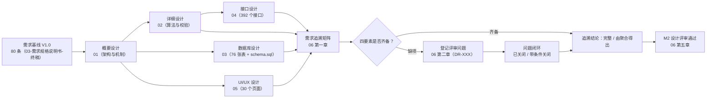
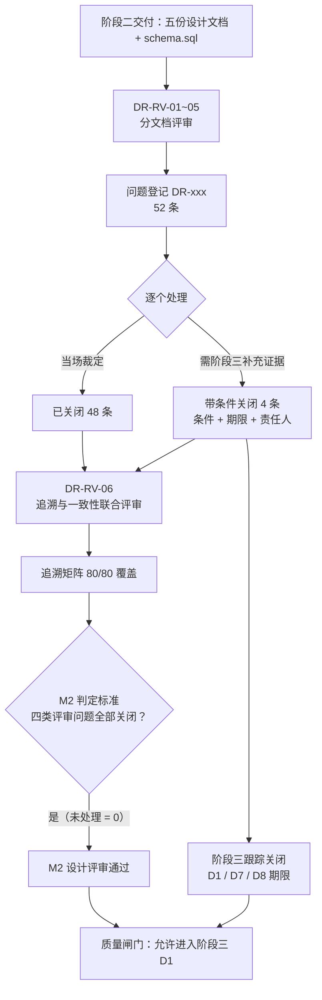

# 需求追溯与设计评审记录

| 文档属性 | 内容 |
|---------|------|
| 文档名称 | 需求追溯与设计评审记录 |
| 文档编号 | ERP-P2-06 |
| 版本 | V1.0 |
| 状态 | **已完成·已冻结（V1.0）** |
| 编制部门 | 数字化管理部（会同销售部、采购部、仓储中心、生产制造部、财务部、质检部） |
| 编制日期 | 2026年9月 |
| 所属阶段 | 阶段二 系统设计（第 3-4 月） |
| 关联里程碑 | **M2 设计评审通过**（本文为 M2 判定的证据载体，并复核 M1） |
| 评审对象 | 同目录 `01-概要设计说明书.md`、`02-详细设计说明书.md`、`03-数据库设计文档.md`、`04-接口设计文档.md`、`05-UI-UX设计说明.md` |
| 上游输入 | `../phase1-requirement-confirmation/03-需求规格说明书-终稿.md`（需求基线 V1.0，80 条）、`../phase1-requirement-confirmation/05-需求评审与变更管理.md`（M1 判定与 CCB 变更台账）、《ERP系统开发阶段计划文档》第三/四/五节 |
| 配套脚本 | `../../database/init/schema.sql`（76 张表全量建表脚本） |
| 下游流向 | 阶段三 开发与单元测试（D1-D9）→ 阶段四 SIT → 阶段五 UAT → 阶段六 数据迁移与上线 |

---

## 文档定位

本文是阶段二「系统设计」的第 6 份交付物，对应《ERP系统开发阶段计划文档》阶段二核心任务：

| 核心任务 | 任务内容 | 本文承接内容 |
|---------|---------|-------------|
| 2.6 设计评审 | 组织概要/详细/接口/数据库设计评审，问题闭环 | 第二章（评审组织、准入准出、52 条评审问题清单） |
| 2.1~2.5 | 架构/数据库/接口/编码规范/UI 设计的成果验收 | 第一章（需求追溯矩阵）、第五章（M2 达成判定） |

**本文三方定位：**

1. **追溯载体**：提供"需求 → 概要设计 → 详细设计 → 接口 → 数据库 → UI 页面 → 开发子阶段"的**正向追溯矩阵**与**反向抽检**，验证《阶段计划文档》5.1「需求 → 设计」的"**无需求无设计**"原则；
2. **评审闭环载体**：五类设计文档的评审问题清单与统计，是 M2「四类设计文档评审问题全部关闭」判定标准的唯一证据；
3. **里程碑判定载体**：第四章复核 M1（与阶段一 `05` 结论一致性核对）、第五章判定 M2（验收 checklist + 里程碑判定标准 + 交付成果标准 + 质量闸门）。

**追溯真实性与口径声明：**

- 本文引用的**章节号、接口路径、表名、页面名**均在对应设计文档中可检索、可核对；凡引用均以设计文档的**权威口径**为准（编号前缀以《数据库设计文档》6.1.8、接口路径以《接口设计文档》3.2/各章、表以《数据库设计文档》第三章与 `schema.sql`、页面以《UI/UX设计说明》第二章与第七章）。
- 追溯四要素取"概要设计章节 + 详细设计章节 + 接口路径 + 数据库表 + UI 页面"五项；结论口径见 1.1。
- 追溯过程中发现的真实一致性缺口**不回避**，全部登记为第二章评审问题并给出处理结论；问题状态只允许"已关闭"或"带条件关闭（写明条件与关闭期限）"，不允许出现其他遗留状态条目。

---

## 一、需求追溯矩阵

### 1.1 追溯方法与口径

**追溯依据**：《ERP系统开发阶段计划文档》5.1「需求 → 设计：设计文档逐条对应需求条目，**无需求无设计**，保证范围不蔓延」。

**追溯四要素（本文扩展为五项）：**

| 要素 | 权威来源 | 说明 |
|------|---------|------|
| ① 概要设计章节 | `01-概要设计说明书.md`（10.1 需求域映射 + 各机制章节） | 概要层给出"需求域 → 章节"级映射；本文细化到单条需求 |
| ② 详细设计章节 | `02-详细设计说明书.md`（各业务章节标题内嵌需求编号） | 算法、校验矩阵、状态机、时序 |
| ③ 主要接口 | `04-接口设计文档.md`（3.2 全量接口索引表"需求编号"列 + 各章） | 取 1~3 个代表性接口（方法 + 路径） |
| ④ 主要数据库表 | `03-数据库设计文档.md`（第三章表清单"所属需求编号"列 + 第十章需求覆盖对照表）与 `schema.sql` | 表名与脚本一一对应 |
| ⑤ UI 页面 | `05-UI-UX设计说明.md`（第四章 30 个页面原型 + 第七章覆盖对照表） | 页面名称与路由 |

**追溯结论口径（三选一）：**

| 结论 | 判定标准 |
|------|---------|
| **完整** | 该需求的功能在概要/详细设计中均有明确设计章节，且有承载接口与承载表 |
| **由聚合得出** | 该需求无专属表/专属接口，其数据由其他域的表聚合查询或由全局机制承载（须在设计文档中显式声明，不留空项） |
| **本期不实现** | 需求明确声明本期不实现（须给出需求依据与排期去向）；本期**无此类条目**（如 BOM-04"MRP 自动替代"、MFG-10"委外考虑在途"属需求内部的范围限定，需求本身仍交付，故记为"完整"） |

**反向追溯口径**：任一接口、表、页面都必须能找到至少一个承载需求编号；找不到即为"无需求的设计"，须登记评审问题。

### 1.2 需求追溯总表（覆盖全部 80 条需求）

> 说明：需求编号与名称**与需求终稿完全一致**；优先级取需求终稿标注（P0/P1/P2）；接口列仅列代表性接口，全量接口见《接口设计文档》3.2。

#### 1.2.1 支撑域 SYS-01~SYS-11（11 条）

| 需求编号 | 需求名称 | 优先级 | 概要设计章节 | 详细设计章节 | 主要接口（方法+路径） | 主要数据库表 | UI 页面 | 开发子阶段 | 追溯结论 |
|---------|---------|-------|------------|------------|---------------------|-------------|--------|-----------|---------|
| SYS-01 | 认证与 JWT 登录 | P0 | 4.3、4.2 | 2.5 | `POST /api/v1/auth/login`、`POST /api/v1/auth/refresh`、`POST /api/v1/auth/logout` | `sys_user`、`sys_login_log`、`sys_user_role`、`sys_role` | 登录页（4.1） | D2 | 完整 |
| SYS-02 | 用户管理 | P0 | 4.3、2.4 | 2.5、2.6 | `GET/POST /api/v1/system/users`、`PUT /api/v1/system/users/{id}`、`PUT /api/v1/system/users/{id}/roles` | `sys_user`、`sys_user_role`、`sys_dept`、`sys_role` | 用户管理（4.3） | D2 | 完整 |
| SYS-03 | 角色与菜单权限 | P0 | 4.3 | 2.6 | `GET/POST /api/v1/system/roles`、`PUT /api/v1/system/roles/{id}/menus`、`GET /api/v1/auth/menus` | `sys_role`、`sys_menu`、`sys_role_menu`、`sys_user_role` | 角色与授权、菜单管理（4.4） | D2 | 完整 |
| SYS-04 | 字段级数据权限 | P0 | 4.3、6.3 | 2.6、2.7 | `PUT /api/v1/system/roles/{id}/data-scopes`、`GET /api/v1/system/roles/{id}/data-scopes` | `sys_role_data_scope`、`sys_role`、`sys_dept` | 角色与授权（4.4）、各业务列表页 | D2 | 完整 |
| SYS-05 | 审计日志 | P0 | 4.4 | 2.4 | `GET /api/v1/system/audit-logs`、`GET /api/v1/system/audit-logs/{id}` | `sys_audit_log`、`sys_login_log` | 审计日志查询、登录日志（4.5） | D2 | 完整 |
| SYS-06 | 数据字典与系统参数 | P0 | 2.4、5.1 | 2.8、各业务章节参数落点 | `GET/POST /api/v1/system/dict-types`、`GET/PUT /api/v1/system/configs` | `sys_dict_type`、`sys_dict_item`、`sys_config`、`sys_job_log` | 数据字典、系统参数、编号规则（4.6） | D2 | 完整 |
| SYS-07 | 单据编号规则引擎 | P0 | 5.1 | 1.3 | `GET /api/v1/system/code-sequences`、`POST /api/v1/system/code-sequences/reset` | `sys_code_sequence` | 编号规则（4.6） | D2 | 完整 |
| SYS-08 | 统一响应与错误码 | P0 | 4.2 | 2.1、2.2、1.6 | 全局机制：全部接口统一返回 `Result<T>` | 无专属表（`ErrorCode` 枚举，不入库） | 全局（由 3.10 消息反馈、6.3 axios 封装承载） | D2 | 完整（全局机制承载） |
| SYS-09 | 密码策略与账号安全 | P0 | 4.3、6.3 | 2.5 | `POST /api/v1/auth/login`、`PUT /api/v1/auth/password`、`POST /api/v1/system/users/{id}/reset-password` | `sys_user`、`sys_login_log` | 登录页（4.1）、用户管理（4.3） | D2 | 完整 |
| SYS-10 | 附件与文件管理 | P2 | 6.3、8.3 | 2.4（附件操作审计；实现细则见接口 5.9） | `POST /api/v1/system/attachments`、`GET /api/v1/system/attachments/{id}/download`、`DELETE /api/v1/system/attachments/{id}` | `sys_attachment`、`sys_export_task` | 各单据页附件面板（3.5、4.7） | D2 | 完整（详设未单列章节，登记 DR-DET-003） |
| SYS-11 | 基础数据批量导入 | P1 | 6.3、8.3 | 3.3.4、4.11（导入校验与整批事务） | `POST /api/v1/system/imports`、`GET /api/v1/system/imports/{taskId}/result`、`POST /api/v1/base/materials/import` | `base_material`、`base_material_category`、`base_bom`、`base_bom_item`、`base_customer`、`base_supplier` | 物料主数据（4.7）、期初库存建账（4.19） | D2、D3 | 完整（导入日志落 `sys_audit_log`） |

#### 1.2.2 基础数据域 MD / BOM / CS（16 条）

| 需求编号 | 需求名称 | 优先级 | 概要设计章节 | 详细设计章节 | 主要接口（方法+路径） | 主要数据库表 | UI 页面 | 开发子阶段 | 追溯结论 |
|---------|---------|-------|------------|------------|---------------------|-------------|--------|-----------|---------|
| MD-01 | 物料编码规则 | P0 | 3.4、4.9、5.1 | 3.2.1 | `GET /api/v1/base/materials/by-code`、`POST /api/v1/base/materials`、`GET/POST /api/v1/base/material-code-maps` | `base_material`、`base_material_category`、`base_material_code_map` | 物料主数据（4.7） | D3 | 完整 |
| MD-02 | 物料基本属性 | P0 | 3.4、4.9 | 3.2.2 | `POST /api/v1/base/materials`、`PUT /api/v1/base/materials/{id}` | `base_material` | 物料主数据（4.7） | D3 | 完整 |
| MD-03 | 物料计划属性 | P0 | 3.4、5.7 | 3.2.2、3.2.4 | `PUT /api/v1/base/materials/{id}`、`GET /api/v1/manufacturing/mrp/plans/{id}/missing-params` | `base_material`、`mf_mrp_plan_item` | 物料主数据（4.7）、MRP 运算（4.21） | D3 | 完整 |
| MD-04 | 物料财务属性 | P0 | 3.4、4.9 | 3.2.5 | `GET /api/v1/finance/subjects/leaf-options`、`PUT /api/v1/base/materials/{id}` | `base_material`、`fin_subject` | 物料主数据（4.7） | D3 | 完整 |
| MD-05 | 物料生命周期 | P0 | 2.4、3.4 | 3.2.3 | `POST /api/v1/base/materials/{id}/approve`、`POST /api/v1/base/materials/{id}/enable`、`POST /api/v1/base/materials/{id}/disable` | `base_material` | 物料主数据（4.7） | D3 | 完整 |
| MD-06 | 物料分类管理 | P0 | 3.4 | 3.1 | `GET /api/v1/base/material-categories/tree`、`POST /api/v1/base/material-categories` | `base_material_category`、`base_material` | 物料分类树（4.7） | D3 | 完整 |
| BOM-01 | 多层BOM结构 | P0 | 5.3、5.7 | 3.3.1、3.3.2 | `GET /api/v1/base/boms/{id}/tree`、`GET /api/v1/base/boms` | `base_bom`、`base_bom_item` | BOM 管理与反查（4.8） | D3 | 完整 |
| BOM-02 | 用量与损耗率 | P0 | 5.3 | 3.3.6、3.3.2 | `POST /api/v1/base/boms`、`PUT /api/v1/base/boms/{id}` | `base_bom_item`、`mf_order_bom` | BOM 管理（4.8）、生产领料（4.23） | D3 | 完整 |
| BOM-03 | 版本管理 | P0 | 5.2、5.3 | 3.3.5 | `POST /api/v1/base/boms/{id}/new-version`、`POST /api/v1/base/boms/{id}/effective`、`POST /api/v1/manufacturing/work-orders/{id}/release` | `base_bom`、`mf_order`、`mf_order_bom` | BOM 管理（4.8）、生产工单（4.22） | D3、D7 | 完整 |
| BOM-04 | 替代料管理 | P2 | 5.3 | 3.3.7 | `POST /api/v1/base/boms`、`POST /api/v1/manufacturing/issues` | `base_bom_item`、`mf_order_bom`、`mf_order_issue_line` | BOM 管理（4.8）、生产领料（4.23） | D3、D7 | 完整（MRP 自动替代本期不实现，依需求 BOM-04 原文） |
| BOM-05 | BOM审核流程 | P0 | 5.2 | 3.3.9 | `POST /api/v1/base/boms/{id}/submit`、`POST /api/v1/base/boms/{id}/approve`、`POST /api/v1/base/boms/{id}/reject` | `base_bom` | BOM 管理（4.8） | D3 | 完整 |
| BOM-06 | BOM反查 | P1 | 5.3 | 3.3.8 | `GET /api/v1/base/boms/where-used`、`GET /api/v1/base/boms/export` | `base_bom`、`base_bom_item` | BOM 管理与反查（4.8） | D3 | 完整 |
| BOM-07 | BOM 闭环与合法性校验 | P0 | 5.3、6.1 | 3.3.3、3.3.4 | `POST /api/v1/base/boms/cycle-check`、`POST /api/v1/base/boms` | `base_bom`、`base_bom_item` | BOM 管理（4.8） | D3 | 完整 |
| CS-01 | 客户管理 | P0 | 2.4、4.3、6.3 | 3.4.1 | `GET/POST /api/v1/base/customers`、`POST /api/v1/base/customers/{id}/status`、`GET /api/v1/base/customers/{id}/credit` | `base_customer`、`sal_order`、`fin_receivable` | 客户档案（4.9） | D3 | 完整 |
| CS-02 | 供应商管理 | P0 | 2.4、4.3、6.3 | 3.4.2 | `GET/POST /api/v1/base/suppliers`、`POST /api/v1/base/suppliers/{id}/status` | `base_supplier`、`pur_order`、`pur_supplier_score` | 供应商档案（4.9） | D3 | 完整 |
| CS-03 | 客户/供应商多维分类 | P1 | 2.4、5.6 | 3.4.3 | `GET/POST /api/v1/base/customers`（含维度字段）、`GET/POST /api/v1/system/dict-items` | `base_customer`、`base_supplier`、`sys_dict_item` | 客户/供应商档案（4.9） | D3 | 完整（维度内联于客商主表，字典驱动；登记 DR-DB-009） |

#### 1.2.3 销售域 SAL-01~SAL-08（8 条）

| 需求编号 | 需求名称 | 优先级 | 概要设计章节 | 详细设计章节 | 主要接口（方法+路径） | 主要数据库表 | UI 页面 | 开发子阶段 | 追溯结论 |
|---------|---------|-------|------------|------------|---------------------|-------------|--------|-----------|---------|
| SAL-01 | 销售订单录入 | P0 | 2.4、4.9、5.2 | 6.1.1 | `POST /api/v1/sales/orders`、`PUT /api/v1/sales/orders/{id}/plans` | `sal_order`、`sal_order_line`、`sal_delivery_plan` | 销售订单（4.10） | D6 | 完整 |
| SAL-02 | 销售订单审核 | P0 | 4.3、5.2 | 6.1.2 | `POST /api/v1/sales/orders/{id}/approve`、`GET /api/v1/sales/orders/credit-check` | `sal_order`、`base_customer`、`fin_receivable`、`sys_config` | 销售订单（4.10） | D6 | 完整 |
| SAL-03 | 订单执行状态跟踪 | P0 | 5.6 | 6.5 | `GET /api/v1/sales/orders/{id}/track` | `sal_order_line`、`sal_delivery_note_line`、`sal_outbound_line`、`mf_order`、`pur_order` | 订单执行跟踪（4.11） | D6 | 完整 |
| SAL-04 | 销售订单变更 | P0 | 5.2、4.8 | 6.1.3 | `POST /api/v1/sales/orders/{id}/change`、`GET /api/v1/sales/orders/{id}/changes` | `sal_order`、`sal_order_line`、`sys_audit_log` | 销售订单（4.10） | D6 | 完整（变更历史复用 `sys_audit_log`，登记 DR-DB-010） |
| SAL-05 | 销售发货管理 | P0 | 5.3、5.4、4.8 | 6.2 | `POST /api/v1/sales/delivery-notes`、`POST /api/v1/sales/delivery-notes/{id}/pick`、`POST /api/v1/sales/delivery-notes/{id}/outbound` | `sal_delivery_plan`、`sal_delivery_note`、`sal_outbound`、`inv_transaction`、`fin_voucher` | 发货通知单、销售出库单（4.12） | D6 | 完整 |
| SAL-06 | 销售退货管理（RMA） | P1 | 5.3、5.4 | 6.3 | `POST /api/v1/sales/returns`、`POST /api/v1/sales/returns/{id}/inbound`、`POST /api/v1/sales/returns/{id}/exchange` | `sal_return`、`sal_return_line`、`inv_transaction`、`fin_receivable` | 销售退货单（4.12） | D6 | 完整（编号前缀 `SR`） |
| SAL-07 | 销售价格管理 | P1 | 2.4、5.6 | 6.4 | `GET/POST /api/v1/sales/price-policies`、`POST /api/v1/sales/price/quote` | `sal_price_policy`、`sal_order_line`、`base_material_category` | 销售价格策略（4.10） | D6 | 完整（UI 第七章取价路径与接口文档不一致，登记 DR-UI-001） |
| SAL-08 | 销售跟单看板 | P0 | 4.3、5.6 | 6.5 | `GET /api/v1/sales/follow-up-board`、`GET /api/v1/sales/orders/{id}/track` | `sal_order`、`pur_order`、`mf_order`、`mf_order_report` | 跟单看板（4.11） | D6 | 完整 |

#### 1.2.4 采购域 PUR-01~PUR-08（8 条）

| 需求编号 | 需求名称 | 优先级 | 概要设计章节 | 详细设计章节 | 主要接口（方法+路径） | 主要数据库表 | UI 页面 | 开发子阶段 | 追溯结论 |
|---------|---------|-------|------------|------------|---------------------|-------------|--------|-----------|---------|
| PUR-01 | 采购申请管理 | P0 | 2.4、5.1、5.5 | 5.1 | `GET/POST /api/v1/purchase/requisitions`、`POST /api/v1/purchase/requisitions/{id}/approve`、`POST /api/v1/purchase/requisitions/{id}/convert-to-order` | `pur_requisition`、`pur_requisition_line`、`inv_alert`、`mf_mrp_plan_item` | 采购申请（4.13） | D5 | 完整（编号前缀 `PA`） |
| PUR-02 | 采购订单管理 | P0 | 5.2、5.4 | 5.2.1~5.2.4 | `GET/POST /api/v1/purchase/orders`、`POST /api/v1/purchase/orders/{id}/change`、`POST /api/v1/purchase/orders/{id}/close` | `pur_order`、`pur_order_line`、`pur_requisition` | 采购订单（4.13） | D5 | 完整 |
| PUR-03 | 采购收货与质检 | P0 | 5.3、5.4 | 5.3 | `POST /api/v1/purchase/receipts`、`PUT /api/v1/purchase/receipts/{id}/inspection`、`POST /api/v1/purchase/receipts/{id}/approve` | `pur_receipt`、`pur_receipt_line`、`inv_transaction`、`inv_batch` | 收货与质检（4.14） | D5 | 完整（质检结论落收货单，不建质检表；编号前缀 `GR`） |
| PUR-04 | 采购退货 | P1 | 5.3、5.4 | 5.4 | `GET/POST /api/v1/purchase/returns`、`POST /api/v1/purchase/returns/{id}/approve`、`POST /api/v1/purchase/returns/{id}/complete` | `pur_return`、`pur_return_line`、`inv_transaction`、`fin_payable` | 采购退货（4.14） | D5 | 完整（编号前缀 `PR`） |
| PUR-05 | 三单匹配 | P0 | 5.4 | 5.5 | `POST /api/v1/purchase/invoice-matches`、`POST /api/v1/purchase/invoice-matches/{id}/match`、`POST /api/v1/purchase/invoice-matches/{id}/handle` | `pur_invoice_match`、`pur_order`、`pur_receipt`、`fin_voucher`、`sys_config` | 三单匹配（4.15） | D5 | 完整 |
| PUR-06 | 暂估入库 | P0 | 5.4 | 5.6 | `GET /api/v1/purchase/estimates`、`POST /api/v1/purchase/estimates/{id}/reverse`、`POST /api/v1/finance/vouchers/generate` | `pur_receipt`、`fin_payable`、`fin_voucher`、`pur_invoice_match` | 三单匹配与暂估（4.15） | D5 | 完整 |
| PUR-07 | 采购价格管理 | P1 | 5.6 | 5.7 | `GET /api/v1/purchase/prices`、`GET /api/v1/purchase/prices/latest`、`GET /api/v1/purchase/prices/trend` | `pur_price`、`pur_order_line`、`sys_config` | 采购价格（4.16） | D5 | 完整 |
| PUR-08 | 供应商绩效评估 | P1 | 5.6 | 5.8 | `GET /api/v1/purchase/supplier-scores`、`POST /api/v1/purchase/supplier-scores/calculate` | `pur_supplier_score`、`base_supplier`、`pur_receipt_line`、`pur_price` | 供应商绩效（4.16） | D5 | 完整 |

#### 1.2.5 库存域 INV-01~INV-11（11 条）

| 需求编号 | 需求名称 | 优先级 | 概要设计章节 | 详细设计章节 | 主要接口（方法+路径） | 主要数据库表 | UI 页面 | 开发子阶段 | 追溯结论 |
|---------|---------|-------|------------|------------|---------------------|-------------|--------|-----------|---------|
| INV-01 | 多仓库/多库位管理 | P0 | 5.3、5.6 | 3.5、4.3 | `GET/POST /api/v1/base/warehouses`、`GET/POST /api/v1/base/locations`、`GET /api/v1/inventory/stock` | `base_warehouse`、`base_location`、`inv_stock` | 仓库与库位（4.9）、即时库存（4.17） | D3、D4 | 完整（4 个中心仓种子见数据库设计 8.3） |
| INV-02 | 入库管理 | P0 | 5.3 | 4.4.1、4.4.2 | `POST /api/v1/purchase/receipts/{id}/approve`、`POST /api/v1/manufacturing/completions` | `inv_transaction`、`inv_stock`、`inv_batch`、`pur_receipt_line` | 即时库存、库存流水（4.17） | D4 | 完整 |
| INV-03 | 出库管理 | P0 | 5.3 | 4.1、4.4.3、4.4.4 | `POST /api/v1/sales/delivery-notes/{id}/outbound`、`POST /api/v1/manufacturing/issues/{id}/confirm` | `inv_transaction`、`inv_stock`、`sal_outbound_line`、`mf_order_issue_line` | 销售出库单（4.12）、生产领料（4.23） | D4 | 完整 |
| INV-04 | 批次与序列号追溯 | P1 | 5.3 | 4.5 | `GET /api/v1/inventory/batches`、`GET /api/v1/inventory/batches/{batchNo}/trace-forward`、`GET /api/v1/inventory/batches/{batchNo}/trace-backward` | `inv_batch`、`inv_transaction`、`inv_stock`、`pur_receipt_line` | 批次追溯（4.20） | D4 | 完整 |
| INV-05 | 保质期管理 | P1 | 5.3 | 4.6 | `GET /api/v1/inventory/batches/expiring`、`GET /api/v1/inventory/alerts/shelf-life` | `inv_batch`、`inv_stock`、`inv_alert`、`base_material`、`sys_config` | 保质期预警（4.20） | D4 | 完整（UI 第七章保质期路径与接口文档不一致，登记 DR-UI-001） |
| INV-06 | 库存盘点 | P0 | 5.3 | 4.7 | `GET/POST /api/v1/inventory/stocktakes`、`POST /api/v1/inventory/stocktakes/{id}/approve` | `inv_stocktake`、`inv_stocktake_line`、`inv_transaction`、`sys_config` | 库存盘点（4.18） | D4 | 完整 |
| INV-07 | 安全库存预警 | P0 | 5.3、5.6 | 4.8 | `GET /api/v1/inventory/alerts/safety-stock`、`POST /api/v1/inventory/alerts/{id}/convert-to-requisition` | `inv_alert`、`base_material`、`inv_stock`、`pur_requisition` | 库存预警（4.20） | D4 | 完整 |
| INV-08 | 呆滞库存分析 | P1 | 5.3、5.6 | 4.9 | `GET /api/v1/inventory/alerts/stagnant`、`POST /api/v1/inventory/alerts/{id}/dispose` | `inv_alert`、`inv_stock`、`sys_config` | 呆滞预警（4.20） | D4 | 完整（UI 第七章呆滞路径与接口文档不一致，登记 DR-UI-001） |
| INV-09 | 库存流水与即时库存 | P0 | 5.3、6.1 | 4.1、4.2、4.10 | `GET /api/v1/inventory/transactions`、`GET /api/v1/inventory/reconciliation`、`POST /api/v1/inventory/reconciliation/run` | `inv_transaction`、`inv_stock`、`fin_cost_ledger` | 即时库存、库存流水（4.17） | D4 | 完整 |
| INV-10 | 库位调拨 | P1 | 5.3 | 4.4.7、4.11 | `GET/POST /api/v1/inventory/transfers`、`POST /api/v1/inventory/transfers/{id}/approve`、`POST /api/v1/inventory/transfers/{id}/reverse` | `inv_transfer`、`inv_transfer_line`、`inv_transaction` | 库位调拨（4.19） | D4 | 完整 |
| INV-11 | 期初库存建账 | P0 | 5.3 | 4.11 | `POST /api/v1/inventory/opening/import`、`POST /api/v1/inventory/opening/trial`、`POST /api/v1/inventory/opening/post` | `inv_transaction`、`inv_stock`、`inv_stocktake`、`fin_opening_balance`、`fin_period` | 期初库存建账（4.19） | D4 | 完整（`trans_type=90`；详设 `inv_opening` 表述登记 DR-DET-001） |

#### 1.2.6 生产制造域 MFG-01~MFG-10（10 条）

| 需求编号 | 需求名称 | 优先级 | 概要设计章节 | 详细设计章节 | 主要接口（方法+路径） | 主要数据库表 | UI 页面 | 开发子阶段 | 追溯结论 |
|---------|---------|-------|------------|------------|---------------------|-------------|--------|-----------|---------|
| MFG-01 | MRP物料需求运算 | P0 | 5.7、6.1 | 7.1.1~7.1.5 | `POST /api/v1/manufacturing/mrp/run`、`GET /api/v1/manufacturing/mrp/plans/{planCode}/progress` | `mf_mrp_plan`、`mf_mrp_plan_item`、`base_bom`、`inv_stock`、`pur_order_line`、`mf_order` | MRP 运算（4.21） | D7 | 完整（编号前缀 `MP`；性能达成路径登记 DR-SUM-004） |
| MFG-02 | MRP运算参数 | P0 | 5.7 | 7.1.1、7.1.6 | `GET /api/v1/manufacturing/mrp/params`、`PUT /api/v1/manufacturing/mrp/params` | `mf_mrp_plan` | MRP 运算（4.21） | D7 | 完整 |
| MFG-03 | MRP运算结果 | P0 | 5.7 | 7.1.4 | `GET /api/v1/manufacturing/mrp/plans/{id}/items`、`POST /api/v1/manufacturing/mrp/plans/{id}/items/convert-to-requisition`、`POST /api/v1/manufacturing/mrp/plans/{id}/items/convert-to-work-order` | `mf_mrp_plan_item`、`pur_requisition`、`mf_order` | MRP 运算（4.21） | D7 | 完整 |
| MFG-04 | 生产工单管理 | P0 | 5.2 | 7.2 | `GET/POST /api/v1/manufacturing/work-orders`、`POST /api/v1/manufacturing/work-orders/{id}/release`、`POST /api/v1/manufacturing/work-orders/{id}/close` | `mf_order`、`mf_order_bom`、`mf_order_issue`、`mf_order_report` | 生产工单（4.22） | D7 | 完整（工单 6 态口径一致） |
| MFG-05 | 生产领料 | P0 | 5.3 | 7.3 | `POST /api/v1/manufacturing/issues`、`POST /api/v1/manufacturing/issues/{id}/confirm` | `mf_order_issue`、`mf_order_issue_line`、`mf_order_bom`、`inv_transaction`、`inv_stock` | 生产领料（4.23） | D7 | 完整 |
| MFG-06 | 生产报工 | P0 | 5.3 | 7.4 | `POST /api/v1/manufacturing/reports`、`POST /api/v1/manufacturing/reports/{id}/revoke` | `mf_order_report`、`mf_order`、`mf_order_bom` | 生产报工（4.23） | D7 | 完整 |
| MFG-07 | 生产完工入库 | P0 | 5.3、5.4 | 7.5 | `POST /api/v1/manufacturing/completions` | `inv_transaction`、`inv_stock`、`mf_order`、`mf_order_cost`、`fin_voucher` | 完工入库（4.23） | D7 | 完整 |
| MFG-08 | 工单成本归集 | P0 | 5.4、5.7 | 7.6 | `GET /api/v1/manufacturing/costs`、`POST /api/v1/manufacturing/costs/collect` | `mf_order_cost`、`mf_order_report`、`mf_order_issue_line`、`fin_voucher` | 工单成本（4.24） | D7、D8 | 完整（成本明细/费率表衔接登记 DR-DB-004） |
| MFG-09 | 工单进度跟踪 | P0 | 5.6 | 7.7 | `GET /api/v1/manufacturing/work-orders/{id}/progress` | `mf_order`、`mf_order_report`、`mf_order_bom`、`mf_order_issue` | 生产工单（4.22） | D7 | 完整 |
| MFG-10 | 委外加工管理 | P2 | 5.3、5.4 | 7.8 | `GET/POST /api/v1/manufacturing/outsources`、`POST /api/v1/manufacturing/outsources/{id}/issue-material`、`POST /api/v1/manufacturing/outsources/{id}/receive` | `mf_order_outsource`、`mf_order`、`pur_order`、`mf_order_cost` | 委外加工（4.24） | D7 | 完整（MRP 不考虑委外在途，依需求 MFG-10 原文；UI 第七章委外路径登记 DR-UI-001） |

#### 1.2.7 财务域 FIN-01~FIN-09（9 条）

| 需求编号 | 需求名称 | 优先级 | 概要设计章节 | 详细设计章节 | 主要接口（方法+路径） | 主要数据库表 | UI 页面 | 开发子阶段 | 追溯结论 |
|---------|---------|-------|------------|------------|---------------------|-------------|--------|-----------|---------|
| FIN-01 | 总账管理 | P0 | 5.4 | 8.1 | `GET /api/v1/finance/vouchers`、`POST /api/v1/finance/vouchers/{id}/post`、`POST /api/v1/finance/vouchers/generate` | `fin_subject`、`fin_voucher`、`fin_voucher_entry`、`fin_voucher_template` | 会计凭证、会计科目（4.25） | D8 | 完整 |
| FIN-02 | 应收账款管理 | P0 | 5.4、5.6 | 8.3 | `GET /api/v1/finance/receivables`、`GET /api/v1/finance/receivables/aging`、`POST /api/v1/finance/settlements/{id}/writeoff` | `fin_receivable`、`fin_settlement`、`fin_settlement_entry`、`fin_voucher` | 应收应付与收付款（4.27） | D8 | 完整 |
| FIN-03 | 应付账款管理 | P0 | 5.4、5.6 | 8.4 | `GET /api/v1/finance/payables`、`GET /api/v1/finance/payables/payment-plan`、`POST /api/v1/finance/settlements/{id}/approve` | `fin_payable`、`fin_settlement`、`pur_invoice_match`、`fin_voucher` | 应收应付与收付款（4.27） | D8 | 完整 |
| FIN-04 | 成本核算 | P0 | 5.4 | 8.2 | `GET /api/v1/finance/cost-ledger`、`POST /api/v1/finance/cost/calculate` | `fin_cost_ledger`、`inv_transaction`、`inv_stock`、`base_material` | 存货核算与成本核算（4.26） | D8 | 完整（本期仅移动加权平均） |
| FIN-05 | 生产工单成本核算 | P0 | 5.4 | 8.5 | `GET /api/v1/finance/order-costs`、`POST /api/v1/finance/order-costs/calculate` | `mf_order_cost`、`mf_order_issue_line`、`mf_order_report`、`inv_transaction` | 工单成本（4.24）、成本核算（4.26） | D8 | 完整 |
| FIN-06 | 固定资产管理 | P2 | 5.4 | 8.6 | `GET/POST /api/v1/finance/assets`、`POST /api/v1/finance/assets/depreciation/calculate`、`POST /api/v1/finance/assets/{id}/scrap` | `fin_asset`、`fin_asset_depreciation`、`fin_subject`、`fin_voucher` | 固定资产（4.28） | D8 | 完整（UI 第七章固定资产路径登记 DR-UI-001） |
| FIN-07 | 财务报表 | P0 | 5.6 | 8.7 | `GET /api/v1/finance/vouchers`（科目汇总口径）、`GET /api/v1/reports/finance/export` | 无专属表（聚合 `fin_voucher`、`fin_voucher_entry`、`fin_subject`） | 报表中心（4.30） | D9 | 由聚合得出（查询接口缺口登记 DR-API-005） |
| FIN-08 | 期末处理 | P0 | 4.6、5.4 | 8.8 | `GET /api/v1/finance/periods/{period}/month-end-check`、`POST /api/v1/finance/periods/{period}/carry-forward`、`POST /api/v1/finance/periods/{period}/close` | `fin_period`、`fin_voucher`、`fin_payable`、`inv_transaction`、`mf_order_cost` | 期末处理（4.29） | D8 | 完整（UI 第七章期末子路径登记 DR-UI-001） |
| FIN-09 | 期初余额建账 | P0 | 5.4 | 8.8、4.11 | `POST /api/v1/finance/opening-balances`、`POST /api/v1/finance/opening-balances/trial`、`POST /api/v1/finance/opening-balances/generate-voucher` | `fin_opening_balance`、`fin_subject`、`fin_voucher`、`fin_period`、`inv_transaction` | 期初余额建账（4.29） | D8 | 完整 |

#### 1.2.8 报表与分析域 RPT-01~RPT-07（7 条）

| 需求编号 | 需求名称 | 优先级 | 概要设计章节 | 详细设计章节 | 主要接口（方法+路径） | 主要数据库表 | UI 页面 | 开发子阶段 | 追溯结论 |
|---------|---------|-------|------------|------------|---------------------|-------------|--------|-----------|---------|
| RPT-01 | 经营仪表盘 | P1 | 2.4、5.6 | 9.1 | `GET /api/v1/reports/dashboard`、`GET /api/v1/reports/dashboard/metrics/{metricCode}` | 无专属表（跨域聚合 `sal_order`、`inv_stock`、`mf_order`、`fin_receivable` 等） | 首页 / 经营仪表盘（4.2） | D9 | 由聚合得出 |
| RPT-02 | 销售分析报表 | P1 | 5.6 | 9.2 | `GET /api/v1/reports/sales/execution`、`GET /api/v1/reports/sales/ranking`、`GET /api/v1/reports/sales/gross-profit` | 无专属表（聚合 `sal_order`、`sal_order_line`、`sal_outbound_line`、`base_customer`） | 报表中心（4.30） | D9 | 由聚合得出 |
| RPT-03 | 采购分析报表 | P1 | 5.6 | 9.2 | `GET /api/v1/reports/purchase/order-tracking`、`GET /api/v1/reports/purchase/price-trend`、`GET /api/v1/reports/purchase/supplier-performance` | 无专属表（聚合 `pur_order`、`pur_receipt`、`pur_price`、`pur_supplier_score`） | 报表中心（4.30） | D9 | 由聚合得出 |
| RPT-04 | 库存分析报表 | P1 | 5.6、6.1 | 9.2 | `GET /api/v1/reports/inventory/stock-summary`、`GET /api/v1/reports/inventory/ledger`、`GET /api/v1/reports/inventory/turnover` | 无专属表（聚合 `inv_stock`、`inv_transaction`、`inv_batch`、`inv_alert`） | 报表中心（4.30） | D9 | 由聚合得出 |
| RPT-05 | 生产分析报表 | P1 | 5.6 | 9.2 | `GET /api/v1/reports/manufacturing/completion-rate`、`GET /api/v1/reports/manufacturing/wip`、`GET /api/v1/reports/manufacturing/product-cost` | 无专属表（聚合 `mf_order`、`mf_order_report`、`mf_order_cost`） | 报表中心（4.30） | D9 | 由聚合得出 |
| RPT-06 | 财务分析报表 | P1 | 5.6 | 9.2 | `GET /api/v1/reports/finance/receivable-aging`、`GET /api/v1/reports/finance/payable-aging`、`GET /api/v1/reports/finance/cash-flow-forecast` | 无专属表（聚合 `fin_receivable`、`fin_payable`、`fin_voucher`、`fin_cost_ledger`） | 报表中心（4.30） | D9 | 由聚合得出 |
| RPT-07 | 报表导出 | P1 | 6.3 | 9.3 | `POST /api/v1/reports/export-tasks`、`GET /api/v1/reports/export-tasks/{taskId}/download`、`GET /api/v1/reports/sales/export` | `sys_export_task`、`sys_audit_log`、`sys_config` | 导出中心（4.30） | D9 | 完整 |

#### 1.2.9 追溯统计汇总

**按需求域统计：**

| 需求域 | 条目数 | 占比 | 完整 | 由聚合得出 | 本期不实现 |
|-------|-------|------|------|-----------|-----------|
| SYS 支撑域 | 11 | 13.75% | 11 | 0 | 0 |
| MD 物料主数据 | 6 | 7.50% | 6 | 0 | 0 |
| BOM | 7 | 8.75% | 7 | 0 | 0 |
| CS 客商 | 3 | 3.75% | 3 | 0 | 0 |
| SAL 销售 | 8 | 10.00% | 8 | 0 | 0 |
| PUR 采购 | 8 | 10.00% | 8 | 0 | 0 |
| INV 库存 | 11 | 13.75% | 11 | 0 | 0 |
| MFG 生产制造 | 10 | 12.50% | 10 | 0 | 0 |
| FIN 财务 | 9 | 11.25% | 8 | 1（FIN-07） | 0 |
| RPT 报表 | 7 | 8.75% | 1（RPT-07） | 6（RPT-01~06） | 0 |
| **合计** | **80** | **100%** | **73** | **7** | **0** |

**按优先级统计：**

| 优先级 | 条目数 | 占比 | 完整 | 由聚合得出 |
|-------|-------|------|------|-----------|
| P0 | 58 | 72.5% | 57 | 1（FIN-07） |
| P1 | 18 | 22.5% | 12 | 6（RPT-01~06） |
| P2 | 4 | 5.0% | 4 | 0 |
| **合计** | **80** | **100%** | **73** | **7** |

**按追溯结论统计：**

| 结论 | 条目数 | 占比 | 说明 |
|------|-------|------|------|
| 完整 | 73 | 91.25% | 有明确设计章节、承载接口与承载表（含全局机制承载的 SYS-08、多表承载的 SYS-11） |
| 由聚合得出 | 7 | 8.75% | FIN-07、RPT-01~RPT-06（在数据库设计 10.7/10.8 显式声明为聚合查询，不留空项） |
| 本期不实现 | 0 | 0% | 需求内部的范围限定（BOM-04 MRP 自动替代、MFG-10 委外在途）不影响需求交付，仍记为"完整" |
| **合计** | **80** | **100%** | **80/80 全覆盖** |

### 1.3 P0 需求四要素完备性检查表（58 条）

> 口径：设计（概要章节 + 详细章节）、接口、表、页面四项**逐条核对**；"✅"表示在设计文档中可检索到对应承载；所有带注记项均已登记为第二章评审问题并有处理结论。

| 需求编号 | 设计 | 接口 | 表 | 页面 | 完备性结论 |
|---------|------|------|----|------|-----------|
| SYS-01 | ✅ 4.3 / 2.5 | ✅ 8 个 Auth 接口 | ✅ `sys_user` 等 4 表 | ✅ 登录页 4.1 | 齐备 |
| SYS-02 | ✅ 4.3 / 2.5、2.6 | ✅ 用户管理 9 接口 | ✅ `sys_user` 等 | ✅ 4.3 | 齐备 |
| SYS-03 | ✅ 4.3 / 2.6 | ✅ 角色/菜单/权限点 | ✅ `sys_role` 等 | ✅ 4.4 | 齐备 |
| SYS-04 | ✅ 4.3、6.3 / 2.6、2.7 | ✅ 数据范围配置 2 接口 | ✅ `sys_role_data_scope` | ✅ 4.4 + 各列表页 | 齐备 |
| SYS-05 | ✅ 4.4 / 2.4 | ✅ 审计/登录日志 4 接口 | ✅ `sys_audit_log` | ✅ 4.5 | 齐备 |
| SYS-06 | ✅ 2.4、5.1 / 2.8 | ✅ 字典/参数 10 接口 | ✅ `sys_dict_type` 等 4 表 | ✅ 4.6 | 齐备 |
| SYS-07 | ✅ 5.1 / 1.3 | ✅ 编号序列 2 接口 | ✅ `sys_code_sequence` | ✅ 4.6 | 齐备 |
| SYS-08 | ✅ 4.2 / 2.1、2.2、1.6 | ✅ 全局机制（无独立接口） | ✅ 无专属表（枚举） | ✅ 全局（3.10、6.3） | 齐备（全局机制承载） |
| SYS-09 | ✅ 4.3、6.3 / 2.5 | ✅ 登录/改密/重置 3 接口 | ✅ `sys_user`、`sys_login_log` | ✅ 4.1、4.3 | 齐备 |
| MD-01 | ✅ 3.4 / 3.2.1 | ✅ 编码查询/旧码映射 | ✅ `base_material_code_map` | ✅ 4.7 | 齐备 |
| MD-02 | ✅ 3.4 / 3.2.2 | ✅ 物料 CRUD | ✅ `base_material` | ✅ 4.7 | 齐备 |
| MD-03 | ✅ 3.4、5.7 / 3.2.2、3.2.4 | ✅ 物料修改 + 缺失清单 | ✅ `base_material`、`mf_mrp_plan_item` | ✅ 4.7、4.21 | 齐备 |
| MD-04 | ✅ 3.4、4.9 / 3.2.5 | ✅ 叶子科目下拉 | ✅ `base_material`、`fin_subject` | ✅ 4.7 | 齐备 |
| MD-05 | ✅ 2.4、3.4 / 3.2.3 | ✅ 审核/启用/停用/删除 | ✅ `base_material` | ✅ 4.7 | 齐备 |
| MD-06 | ✅ 3.4 / 3.1 | ✅ 分类树 CRUD | ✅ `base_material_category` | ✅ 4.7 | 齐备 |
| BOM-01 | ✅ 5.3、5.7 / 3.3.1、3.3.2 | ✅ 树形展开 | ✅ `base_bom`、`base_bom_item` | ✅ 4.8 | 齐备 |
| BOM-02 | ✅ 5.3 / 3.3.6 | ✅ BOM 新增/修改 | ✅ `base_bom_item`、`mf_order_bom` | ✅ 4.8、4.23 | 齐备 |
| BOM-03 | ✅ 5.2、5.3 / 3.3.5 | ✅ 升版/生效/工单下达 | ✅ `base_bom`、`mf_order`、`mf_order_bom` | ✅ 4.8、4.22 | 齐备 |
| BOM-05 | ✅ 5.2 / 3.3.9 | ✅ 提交/审核/驳回 | ✅ `base_bom` | ✅ 4.8 | 齐备 |
| BOM-07 | ✅ 5.3、6.1 / 3.3.3、3.3.4 | ✅ 闭环校验接口 | ✅ `base_bom`、`base_bom_item` | ✅ 4.8 | 齐备 |
| CS-01 | ✅ 2.4、4.3、6.3 / 3.4.1 | ✅ 客户 CRUD + 信用 | ✅ `base_customer`、`sal_order`、`fin_receivable` | ✅ 4.9 | 齐备 |
| CS-02 | ✅ 2.4、4.3、6.3 / 3.4.2 | ✅ 供应商 CRUD | ✅ `base_supplier`、`pur_supplier_score` | ✅ 4.9 | 齐备 |
| SAL-01 | ✅ 2.4、4.9、5.2 / 6.1.1 | ✅ 订单 CRUD + 分批计划 | ✅ `sal_order` 等 3 表 | ✅ 4.10 | 齐备 |
| SAL-02 | ✅ 4.3、5.2 / 6.1.2 | ✅ 审核 + 信用试算 | ✅ `sal_order`、`sys_config` | ✅ 4.10 | 齐备 |
| SAL-03 | ✅ 5.6 / 6.5 | ✅ 订单跟踪 | ✅ `sal_order_line`、`mf_order` 等 | ✅ 4.11 | 齐备 |
| SAL-04 | ✅ 5.2、4.8 / 6.1.3 | ✅ 变更 + 差异对比 | ✅ `sal_order`、`sys_audit_log` | ✅ 4.10 | 齐备（注记 DR-DB-010） |
| SAL-05 | ✅ 5.3、5.4、4.8 / 6.2 | ✅ 发货/拣货/出库 | ✅ `sal_outbound`、`inv_transaction`、`fin_voucher` | ✅ 4.12 | 齐备 |
| SAL-08 | ✅ 4.3、5.6 / 6.5 | ✅ 跟单看板 | ✅ `sal_order`、`pur_order`、`mf_order` | ✅ 4.11 | 齐备 |
| PUR-01 | ✅ 2.4、5.1、5.5 / 5.1 | ✅ 申请 CRUD + 转单 | ✅ `pur_requisition` 等 | ✅ 4.13 | 齐备 |
| PUR-02 | ✅ 5.2、5.4 / 5.2.1~5.2.4 | ✅ 订单 CRUD/变更/关闭 | ✅ `pur_order`、`pur_order_line` | ✅ 4.13 | 齐备 |
| PUR-03 | ✅ 5.3、5.4 / 5.3 | ✅ 收货/质检/入库 | ✅ `pur_receipt`、`inv_transaction` | ✅ 4.14 | 齐备 |
| PUR-04 | ✅ 5.3、5.4 / 5.4 | ✅ 退货 CRUD/审核/完成 | ✅ `pur_return`、`fin_payable` | ✅ 4.14 | 齐备 |
| PUR-05 | ✅ 5.4 / 5.5 | ✅ 匹配创建/执行/差异 | ✅ `pur_invoice_match`、`sys_config` | ✅ 4.15 | 齐备 |
| PUR-06 | ✅ 5.4 / 5.6 | ✅ 暂估查询/红冲/凭证 | ✅ `fin_payable`、`fin_voucher` | ✅ 4.15 | 齐备 |
| INV-01 | ✅ 5.3、5.6 / 3.5、4.3 | ✅ 仓库/库位/即时库存 | ✅ `base_warehouse`、`base_location`、`inv_stock` | ✅ 4.9、4.17 | 齐备 |
| INV-02 | ✅ 5.3 / 4.4.1、4.4.2 | ✅ 收货入库/完工入库 | ✅ `inv_transaction`、`inv_batch` | ✅ 4.17 | 齐备 |
| INV-03 | ✅ 5.3 / 4.1、4.4.3、4.4.4 | ✅ 出库/领料确认 | ✅ `inv_transaction`、`inv_stock` | ✅ 4.12、4.23 | 齐备 |
| INV-06 | ✅ 5.3 / 4.7 | ✅ 盘点 CRUD/审批 | ✅ `inv_stocktake(_line)`、`inv_transaction` | ✅ 4.18 | 齐备 |
| INV-07 | ✅ 5.3、5.6 / 4.8 | ✅ 预警清单/转申请 | ✅ `inv_alert`、`pur_requisition` | ✅ 4.20 | 齐备 |
| INV-09 | ✅ 5.3、6.1 / 4.1、4.2、4.10 | ✅ 流水/对账 | ✅ `inv_transaction`、`inv_stock` | ✅ 4.17 | 齐备 |
| INV-11 | ✅ 5.3 / 4.11 | ✅ 导入/试算/过账 | ✅ `inv_transaction`（`trans_type=90`）等 | ✅ 4.19 | 齐备（注记 DR-DET-001） |
| MFG-01 | ✅ 5.7、6.1 / 7.1.1~7.1.5 | ✅ 运算/进度 | ✅ `mf_mrp_plan(_item)` | ✅ 4.21 | 齐备（注记 DR-SUM-004） |
| MFG-02 | ✅ 5.7 / 7.1.1、7.1.6 | ✅ 参数查询/设置 | ✅ `mf_mrp_plan` | ✅ 4.21 | 齐备 |
| MFG-03 | ✅ 5.7 / 7.1.4 | ✅ 建议明细/转单 | ✅ `mf_mrp_plan_item` | ✅ 4.21 | 齐备 |
| MFG-04 | ✅ 5.2 / 7.2 | ✅ 工单 CRUD/下达/关闭 | ✅ `mf_order`、`mf_order_bom` | ✅ 4.22 | 齐备 |
| MFG-05 | ✅ 5.3 / 7.3 | ✅ 领料/确认出库 | ✅ `mf_order_issue(_line)` | ✅ 4.23 | 齐备 |
| MFG-06 | ✅ 5.3 / 7.4 | ✅ 报工/撤销 | ✅ `mf_order_report` | ✅ 4.23 | 齐备 |
| MFG-07 | ✅ 5.3、5.4 / 7.5 | ✅ 完工入库 | ✅ `inv_transaction`、`mf_order`、`fin_voucher` | ✅ 4.23 | 齐备 |
| MFG-08 | ✅ 5.4、5.7 / 7.6 | ✅ 成本查询/归集 | ✅ `mf_order_cost` | ✅ 4.24 | 齐备（注记 DR-DB-004） |
| MFG-09 | ✅ 5.6 / 7.7 | ✅ 工单进度 | ✅ `mf_order`、`mf_order_report` | ✅ 4.22 | 齐备 |
| FIN-01 | ✅ 5.4 / 8.1 | ✅ 凭证/科目/模板 12 接口 | ✅ `fin_voucher(_entry)`、`fin_voucher_template` | ✅ 4.25 | 齐备 |
| FIN-02 | ✅ 5.4、5.6 / 8.3 | ✅ 应收/账龄/核销 | ✅ `fin_receivable`、`fin_settlement(_entry)` | ✅ 4.27 | 齐备 |
| FIN-03 | ✅ 5.4、5.6 / 8.4 | ✅ 应付/付款计划/核销 | ✅ `fin_payable`、`fin_settlement` | ✅ 4.27 | 齐备 |
| FIN-04 | ✅ 5.4 / 8.2 | ✅ 成本流水/触发核算 | ✅ `fin_cost_ledger` | ✅ 4.26 | 齐备 |
| FIN-05 | ✅ 5.4 / 8.5 | ✅ 工单成本查询/核算 | ✅ `mf_order_cost`、`inv_transaction` | ✅ 4.24、4.26 | 齐备 |
| FIN-07 | ✅ 5.6 / 8.7 | ⚠️ 仅有凭证分页与导出，六张报表无专属查询接口（DR-API-005） | ✅ 聚合 `fin_voucher(_entry)`、`fin_subject` | ✅ 4.30 | 带条件（DR-API-005 带条件关闭，期限 D8 退出评审日） |
| FIN-08 | ✅ 4.6、5.4 / 8.8 | ✅ 检查清单/结转/关闭/重开 | ✅ `fin_period`、`fin_voucher` | ✅ 4.29 | 齐备 |
| FIN-09 | ✅ 5.4 / 8.8、4.11 | ✅ 录入/试算/生成凭证 | ✅ `fin_opening_balance`、`fin_voucher` | ✅ 4.29 | 齐备 |

**P0 完备性结论**：58 条 P0 需求中 **57 条四要素完全齐备**；**FIN-07** 的"报表查询接口"存在缺口，已登记为 **DR-API-005（带条件关闭，期限 D8 退出评审日）**，其余三要素齐备。P0 完备率 = 98.3%（57/58 完全齐备 + 1 条要素齐备但接口细化待补）。

### 1.4 反向追溯抽检（证明无"无需求的设计"）

#### 1.4.1 接口反向抽检（10 个接口）

| 序号 | 接口（方法 + 路径） | 接口文档位置 | 承载需求编号 | 结论 |
|------|-------------------|-------------|-------------|------|
| 1 | `POST /api/v1/auth/login` | 4.2 | SYS-01、SYS-09 | 有需求 |
| 2 | `GET /api/v1/system/audit-logs` | 5.8.1 / 索引 47 | SYS-05 | 有需求 |
| 3 | `GET /api/v1/base/materials` | 6.2.1 / 索引 60 | MD-01~MD-05 | 有需求 |
| 4 | `POST /api/v1/base/boms/cycle-check` | 6.3.11 / 索引 85 | BOM-07 | 有需求 |
| 5 | `POST /api/v1/purchase/invoice-matches/{id}/match` | 8.5.4 / 索引 198 | PUR-05 | 有需求 |
| 6 | `POST /api/v1/sales/delivery-notes/{id}/outbound` | 9.2.8 / 索引 233 | SAL-05、INV-03、FIN-04 | 有需求 |
| 7 | `POST /api/v1/inventory/opening/post` | 7.7.5 / 索引 154 | INV-11、INV-09 | 有需求 |
| 8 | `POST /api/v1/manufacturing/mrp/run` | 10.1.3 / 索引 254 | MFG-01、MFG-02 | 有需求 |
| 9 | `POST /api/v1/finance/periods/{period}/close` | 11.10.5 / 索引 350 | FIN-08 | 有需求 |
| 10 | `POST /api/v1/reports/export-tasks` | 12.7 / 索引 390 | RPT-07 | 有需求 |

**抽检结论**：10/10 接口均能反向对应到需求编号；接口文档 3.2 全量索引表设有"需求编号"列，**未发现无需求编号的接口**（免认证接口亦归属 SYS-01/SYS-09）。

#### 1.4.2 数据库表反向抽检（10 张表）

| 序号 | 表名 | 数据库设计位置 | 承载需求编号 | 结论 |
|------|------|--------------|-------------|------|
| 1 | `sys_code_sequence` | 5.1.12 / 表清单 12 | SYS-07 | 有需求 |
| 2 | `base_bom_item` | 5.2.5 / 表清单 21 | BOM-01、BOM-02、BOM-04、BOM-06 | 有需求 |
| 3 | `inv_transaction` | 5.3.2 / 表清单 27 | INV-02、INV-03、INV-06、INV-09、INV-10、INV-11 | 有需求 |
| 4 | `inv_alert` | 5.3.8 / 表清单 33 | INV-05、INV-07、INV-08 | 有需求 |
| 5 | `pur_invoice_match` | 5.4.9 / 表清单 42 | PUR-05、PUR-06、FIN-03 | 有需求 |
| 6 | `sal_delivery_plan` | 5.5.3 / 表清单 47 | SAL-01、SAL-05 | 有需求 |
| 7 | `mf_order` | 5.6.3 / 表清单 57 | MFG-04、MFG-07、MFG-09、MFG-10 | 有需求 |
| 8 | `mf_order_bom` | 5.6.4 / 表清单 58 | BOM-03、MFG-05 | 有需求 |
| 9 | `fin_cost_ledger` | 5.7.9 / 表清单 72 | FIN-04、MFG-08、RPT-05 | 有需求 |
| 10 | `sys_export_task` | 5.1.15 / 表清单 15 | RPT-07、SYS-10 | 有需求 |

**抽检结论**：10/10 表均能反向对应到需求编号；数据库设计第三章表清单逐表标注"所属需求编号"，**76 张表无"无需求"的表**（含 `sys_job_log` → SYS-06/A-01/E-05、`base_material_code_map` → MD-01/MD-06）。

#### 1.4.3 UI 页面反向抽检（10 个页面）

| 序号 | 页面名称（路由） | UI 文档位置 | 承载需求编号 | 结论 |
|------|----------------|-----------|-------------|------|
| 1 | 登录页（`/login`） | 4.1 / 第七章 | SYS-01、SYS-09 | 有需求 |
| 2 | 用户管理（`/system/user`） | 4.3 / 第七章 | SYS-02、SYS-09 | 有需求 |
| 3 | 物料主数据（`/base/material`） | 4.7 / 第七章 | MD-01~MD-06、SYS-10、SYS-11 | 有需求 |
| 4 | BOM 管理与反查（`/base/bom`） | 4.8 / 第七章 | BOM-01~BOM-07 | 有需求 |
| 5 | 销售订单（`/sales/order`） | 4.10 / 第七章 | SAL-01、SAL-02、SAL-04、SAL-07 | 有需求 |
| 6 | 三单匹配（`/purchase/match`） | 4.15 / 第七章 | PUR-05、PUR-06 | 有需求 |
| 7 | 期初库存建账（`/inventory/opening`） | 4.19 / 第七章 | INV-11 | 有需求 |
| 8 | MRP 运算（`/manufacturing/mrp`） | 4.21 / 第七章 | MFG-01、MFG-02、MFG-03 | 有需求 |
| 9 | 期末处理（`/finance/period-close`） | 4.29 / 第七章 | FIN-08 | 有需求 |
| 10 | 导出中心（`/report/export-center`） | 4.30 / 第七章 | RPT-07 | 有需求 |

**抽检结论**：10/10 页面均能反向对应到需求编号；UI 第七章覆盖对照表逐页标注"涉及需求编号"，**30 个页面无"无需求"的页面**（SYS-08 无独立页面，由全局机制承载，已在 7.1 显式声明）。

### 1.5 追溯结论

| 项 | 结论 | 依据 |
|----|------|------|
| **正向覆盖** | **80/80 覆盖**，无遗漏 | 1.2 追溯总表逐条给出五要素；1.2.9 统计：完整 73 + 由聚合得出 7 = 80 |
| **反向覆盖** | **无"无需求的设计"** | 1.4 抽检 10 接口 / 10 表 / 10 页面全部反查到需求编号，且 3.2 索引表、第三章表清单、第七章页面表均内置"需求编号"列 |
| **"本期不实现"条目** | **0 条** | 需求内部的范围限定（BOM-04 MRP 自动替代、MFG-10 委外在途）不构成需求未交付 |
| **一致性与缺口** | 发现 **7 处真实一致性缺口**（编号前缀表条目数、错误码区间归属与区间登记、非功能需求条数、详设 `inv_opening` 表名、详设【数据库设计需补充】未对齐、FIN-07 报表接口缺项、UI 第七章接口路径分歧），全部登记为第二章评审问题并已关闭或带条件关闭 | 第二章 2.3 |

---

## 二、设计评审问题清单

### 2.1 评审组织

**评审目标：** ①确认五份设计文档对 80 条需求条目**逐条对应、无需求无设计**；②关闭全部评审问题，形成无遗留条目（遗留条目 = 0）的问题清单；③形成可支撑 M2 判定的设计基线，作为阶段三 D1-D9 的唯一设计输入。

**评审原则：**

| 原则 | 具体要求 |
|------|---------|
| 逐份评审 | 按五份设计文档切分场次，每场只评本场范围，逐条过设计条目 |
| 业务与 IT 双签 | 每场由业务部门代表与数字化管理部共同确认：业务方确认"业务规则与阈值正确"，IT 方确认"可实现、可验证" |
| 问题闭环 | 每场问题当场登记编号（DR-xxx）、定级、指定处理人；结束时未关闭条目必须为 0 |
| 口径唯一 | 同一事项只允许一个结论；跨文档冲突一律以**权威口径**裁定（编号前缀以数据库设计 6.1.8、接口路径以接口设计文档、表以数据库设计第三章与 `schema.sql`、页面以 UI 第二章/第七章），裁定后全篇一致 |
| 事实可溯 | 问题描述与处理结论必须引用具体事实（文档 + 章节 + 行/表），不接受无出处的意见 |
| 不扩范围 | 评审只做"补齐、澄清、裁量"，不擅自新增超出阶段一需求基线的功能 |

**评审会议安排表（7 场）：**

| 场次 | 评审对象 | 评审范围 | 日期 | 主持人 | 评审人（架构/后端/前端/DBA/业务代表） | 形式 |
|------|---------|---------|------|-------|-----------------------------------|------|
| DR-RV-01 | `01-概要设计说明书.md` | 第一~三章（目标/架构/分层）、第四~九章（技术方案、关键机制、非功能、外部接口、部署、ADR）、第十章（需求覆盖） | 2026-09-17 上午 | 项目负责人 | 架构师、后端负责人、前端负责人、DBA、销售/采购/仓储/生产/财务业务代表 | 会议 |
| DR-RV-02 | `02-详细设计说明书.md` | 第一章（设计约定）、第二~九章（公共/基础数据/库存/采购/销售/生产/财务/报表详细设计）、第十章（关键链路时序）、第十一章（单测设计要点） | 2026-09-17 下午 | 项目负责人 | 架构师、后端负责人、DBA、生产计划负责人、财务经理、成本会计 | 会议 |
| DR-RV-03 | `03-数据库设计文档.md` + `database/init/schema.sql` | 第二~三章（规范与 76 张表清单）、第四~五章（ER 图与表结构明细）、第六~九章（枚举、决策、种子数据、容量）、第十章（需求覆盖对照） | 2026-09-17 下午 ~ 2026-09-18 上午 | 项目负责人 | DBA、架构师、后端负责人、仓储中心、财务部 | 会议 + 脚本核对 |
| DR-RV-04 | `04-接口设计文档.md` | 第一章（总纲）、第二章（356 条错误码）、第三章（392 个接口索引）、第四~十二章（各域接口明细）、第十三章（附录约定） | 2026-09-18 上午 | 项目负责人 | 架构师、后端负责人、前端负责人、数字化管理部、各域业务代表 | 会议 |
| DR-RV-05 | `05-UI-UX设计说明.md` | 第一~三章（目标/信息架构/设计规范）、第四章（30 个页面原型）、第五~六章（关键交互、前端工程约定）、第七章（页面-接口-需求覆盖）、第八章（交付与评审要点，含 UX-01~25） | 2026-09-18 上午 ~ 下午 | 项目负责人 | 前端负责人、UI 设计师、各域业务代表、数字化管理部 | 会议 + 原型走查 |
| DR-RV-06 | `06-需求追溯与设计评审记录.md`（本章）+ 五份设计文档 | 需求追溯矩阵（80 条）、反向抽检、跨文档一致性、评审问题汇总与 M2 判定 | 2026-09-18 下午 | 项目负责人 | 架构师、后端负责人、前端负责人、DBA、业务代表、数字化管理部 | 会议 |
| DR-RV-07 | `ERP系统开发编码规范文档.md`（确认，非评审新文档） | 编码铁律 10 条、分层约束、金额精度、事务与审计、命名与 Git 规范，作为 D1-D9 强制规范确认 | 2026-09-18 下午 | 项目负责人 | 架构师、后端负责人、前端负责人、数字化管理部 | 书面确认 |

> **场次覆盖核对：** 概要（DR-RV-01）+ 详细（DR-RV-02）+ 数据库（DR-RV-03）+ 接口（DR-RV-04）+ UI（DR-RV-05）+ 追溯与一致性（DR-RV-06）+ 编码规范确认（DR-RV-07），对应核心任务 2.1~2.6，覆盖阶段二全部交付物无缺项。

### 2.2 评审准入准出条件

**准入条件（每场开始前由评审秘书核对，未满足不得开场）：**

| 序号 | 准入条件 | 核对物 |
|------|---------|-------|
| 1 | 文档章节完整：本场范围的章节、表格、流程图、附录齐备，无空章节 | 本场设计文档目录 |
| 2 | 需求映射齐备：本场文档内置"需求编号"映射（概要 10.1、详细章节标题内嵌、数据库第三章/第十章、接口 3.2 索引、UI 第七章） | 本场映射表 |
| 3 | 关键数字自检：表数 76 与 `schema.sql` 一致、接口数 392、错误码 356、页面数 30 | 本场文档自检段 + 脚本核对 |
| 4 | 口径唯一性预检：编号前缀、状态取值、金额精度、分页字段口径不出现两种写法 | 跨文档口径预检清单 |
| 5 | 评审材料提前 1 个工作日发出，评审人已预读 | 评审通知与回执 |

**准出条件（每场结束时由主持人宣布，未满足不得进入 M2 判定）：**

| 序号 | 准出条件 | 判定方式 |
|------|---------|---------|
| 1 | 本场设计条目逐条过审，记录"通过 / 修改后通过 / 不通过"结论 | 评审记录表（本场） |
| 2 | 问题全部登记为 DR-xxx（含类型、级别、提出人、处理人） | 本章 2.3 问题清单 |
| 3 | 问题状态为**已关闭**或**带条件关闭**；带条件关闭必须写明条件与关闭期限 | 本章 2.3 / 2.4 |
| 4 | 存在遗留状态条目时本场准出不通过，须再次召开专场评审 | 本章 2.4 统计表（遗留条目 = 0） |
| 5 | 本场裁定结论已回写至对应设计文档并在全篇一致 | 设计文档修订记录 |

### 2.3 设计评审问题清单

> **编号规则**：按文档分节，`DR-SUM-`（概要）/`DR-DET-`（详细）/`DR-DB-`（数据库）/`DR-API-`（接口）/`DR-UI-`（UI/UX）。
> **问题类型**：完整性 / 一致性 / 可行性 / 可验证性 / 范围 / 安全性。
> **级别**：致命（阻断开发或导致返工）/ 严重（影响功能正确性或验收判定）/ 一般（影响可读性与执行效率）。
> **状态**：已关闭 / 带条件关闭（必须写明条件与关闭期限）。
> **依据简称**：01 = 概要设计说明书，02 = 详细设计说明书，03 = 数据库设计文档，04 = 接口设计文档，05 = UI/UX 设计说明，需求 = 阶段一 `03-需求规格说明书-终稿.md`，阶段一评审 = 阶段一 `05-需求评审与变更管理.md`，脚本 = `database/init/schema.sql`。

#### 2.3.1 概要设计问题清单（DR-SUM-001~010，共 10 条）

| 问题编号 | 来源（章节） | 问题类型 | 问题描述 | 级别 | 提出人/角色 | 处理人 | 处理结论 | 状态 |
|---------|------------|---------|---------|------|-----------|-------|---------|------|
| DR-SUM-001 | 01 第 5.1 节（编号前缀表）、03 第 6.1.8 节 | 一致性 | 概要设计 5.1 编号前缀表列 **22 类**单据前缀，并声明"与数据库设计 6.1.8 完全一致"；数据库设计 6.1.8 实际登记 **26 行**（多出三单匹配 `IM`、价格策略 `PP`、委外 `OS`，且库存流水 `IV` 分 3 位与期初 5 位两行）。两处条目数不一致 | 严重 | DBA | 架构师 | **已关闭**：以**数据库设计 6.1.8 为全项目唯一权威登记**（26 行 / 25 个前缀）；概要设计与接口文档按 6.1.8 补齐 `IM`/`PP`/`OS` 三类登记；其余 22 类前缀完全一致 | 已关闭 |
| DR-SUM-002 | 01 第 4.2 节、02 第 1.6 节 | 一致性 | 错误码区间归属：概要设计 4.2 建议"系统管理与报表归入 10001-10999"，详细设计 1.6 最终裁定为报表（17001-17999）与系统管理（18001-18999）**单列区间**，两处结论不一致 | 严重 | 架构师 | 数字化管理部 | **已关闭**：以详细设计 1.6 最终裁定为准——报表与系统管理单列区间，**不改动 10001-16999 原有边界**；10001-10999 保留通用错误（参数校验、认证、权限、幂等）语义；概要设计 4.2 相应表述按此对齐 | 已关闭 |
| DR-SUM-003 | 01 第 5.1 节（特殊单据）、03 第 6.1.8 节第 18 行 | 完整性 | 期初建账（INV-11）在概要设计仅表述"库存流水 `IV` 前缀"，未说明其**流水位数为 5 位**（`IV20260900001`），与"3 位流水"的统一表述存在歧义 | 一般 | 后端负责人 | 架构师 | **已关闭**：以数据库设计 6.1.8 第 18 行为准——`OPENING_TRANSACTION` 独立 `biz_type`、`seq_length=5`（`IV20260900001`）；编号引擎按 `biz_type` 独立取号，与 3 位业务流水互不冲突；概要设计 5.1 补注该差异 | 已关闭 |
| DR-SUM-004 | 01 第 6.1 节（P-03）、02 第 7.1.5 节、阶段一评审 RQ-027 | 可行性 | MRP 全量运算（活跃物料约 5,000 种、BOM 约 3,500 个）**<30 分钟**在概要设计仅给出目标值，未给出达成路径与压测时点；阶段一 RQ-027 已按带条件关闭跟踪 | 严重 | 生产计划负责人 | 数字化管理部 + 生产计划部 | **带条件关闭**：条件 = 详细设计 7.1.5 已给出达成路径（分页批次短事务、每批 ≤500 条、`@Async` 异步运算、净需求中间表与 Redis 缓存、参数缺失清单）；在 **D7 子阶段完成中等规模压测**（≥2,000 种物料、≥1,500 个 BOM，出压测报告），不达标则启用缓存与预计算复测；**关闭期限 = D7 子阶段退出评审日（开发期第 10 周末）**，与阶段一 RQ-027 合并跟踪 | 带条件关闭 |
| DR-SUM-005 | 01 第 10.1 节、05 第七章说明、需求第五章 | 一致性 | 非功能需求条数口径不一致：概要设计 10.1 写"第五章 6 类 **24 条**"；阶段一评审 §3.1 写"第五章非功能需求共 **28 条**"；需求终稿实际列 **29 条**（P-01~06、A-01~04、S-01~07、E-01~05、I-01~04、B-01~03） | 一般 | 数字化管理部 | 架构师 | **已关闭**：以**需求终稿实际条目 29 条为准**（第五章 25 条 + 第六章接口需求 I-01~04 共 4 条）；概要设计 10.1 措辞修正为"6 类 29 条（第五章 25 条 + 接口需求 4 条）"；阶段一评审 §3.1 的 28 条为笔误 | 已关闭 |
| DR-SUM-006 | 01 第 2.5、3.2 节 | 完整性 | 模块依赖规则未明确 `erp-business` 内部五个业务子域（purchase/sales/inventory/manufacturing/finance）之间是否允许直接调用 Mapper | 一般 | 架构师 | 架构师 | **已关闭**：概要设计 2.5 与 3.2 明确——跨模块**与跨业务子域**均禁止直接调用 Mapper，一律通过 Service 接口；同域内走本地 Service，跨域走对方域 Service 接口 | 已关闭 |
| DR-SUM-007 | 01 第 5.2 节 | 完整性 | 状态机机制未说明"派生态"的处理（如销售订单 2-部分发货、3-已发货，工单领料中/加工中由业务动作派生），易被误读为可直接 PUT 状态字段 | 一般 | 后端负责人 | 架构师 | **已关闭**：概要设计 5.2 已确立"状态变更一律通过动作接口、禁止直接 PUT 状态字段"；派生态由业务动作（出库、领料、报工）驱动回写，各域详细设计（02 第 6.2、7.3、7.4 节）给出落点 | 已关闭 |
| DR-SUM-008 | 01 第 5.3 节、03 第 6.1.8 节 | 一致性 | 库存流水化机制未区分"业务流水号（`IV` 3 位）"与"期初建账流水号（`IV` 5 位）"两类序列，可能引起前端编号解析不一致 | 一般 | 前端负责人 | 架构师 | **已关闭**：并入 DR-SUM-003 处理，两者按 `biz_type` 独立取号；前端对流水号一律按**字符串原样展示**、不解析位数 | 已关闭 |
| DR-SUM-009 | 01 第 4.7 节、第 8.3 节 | 完整性 | 缓存与配置清单未给出 Redis DB 编号与 Key 前缀约定的落地对照 | 一般 | DBA | 架构师 | **已关闭**：概要设计 4.7 已明确 Key 命名"业务模块:功能:唯一标识"、必须设 TTL、先更新 DB 事务提交后再操作缓存；8.3 配置项清单已含 Redis 连接与缓存 TTL 配置项 | 已关闭 |
| DR-SUM-010 | 01 第 4.4 节、03 第 5.1.8 节 | 完整性 | 审计日志机制未声明在线保留 ≥180 天与超期冷数据归档的实现载体 | 一般 | 数字化管理部 | 架构师 | **已关闭**：概要设计 4.4 明确日志只增不改不删、在线 ≥180 天；数据库设计 5.1.8 `sys_audit_log` 与 9.3 归档预案给出载体与清理策略（超期按月归档为可查询冷数据） | 已关闭 |

#### 2.3.2 详细设计问题清单（DR-DET-001~011，共 11 条）

| 问题编号 | 来源（章节） | 问题类型 | 问题描述 | 级别 | 提出人/角色 | 处理人 | 处理结论 | 状态 |
|---------|------------|---------|---------|------|-----------|-------|---------|------|
| DR-DET-001 | 02 第 4.11 节、03 第 3 章 | 一致性 | 详细设计 4.11 期初建账字段写"`inv_opening`（或复用 `inv_stock` + 流水 90）"，其中 `inv_opening` **不在数据库设计 76 张表清单与 `schema.sql` 中** | 严重 | DBA | 后端负责人 | **已关闭**：以数据库设计为准，**不建 `inv_opening` 表**；期初建账由 `inv_transaction`（`trans_type=90`）+ `inv_stock` 快照 + `inv_stocktake.is_opening=1` + `fin_opening_balance`（`balance_type=2`）承载；详细设计 4.11 删除 `inv_opening` 表述 | 已关闭 |
| DR-DET-002 | 02 全文【数据库设计需补充：…】标注、03 第五章 | 完整性 | 详细设计标注了大量 `【数据库设计需补充：表名.字段名】`（如现金流量标记 `fin_cashflow_item`/`cashflow_item_id`、跨期价格差异 `fin_voucher_entry.diff_flag`/`fin_cost_variance`、工单成本明细 `mf_order_cost_detail`、工时单价 `mf_labor_rate`、制造费用分摊率 `fin_overhead_rate`、客商维度关联表 `base_partner_tag`、订单变更表 `sal_order_change` 等），与数据库设计落地**未逐项对齐**——部分已在数据库设计中以其他字段/方式实现，部分确未落地 | 严重 | DBA | DBA + 数字化管理部 | **带条件关闭**：条件 = ①建立"详细设计待补充项 ↔ 数据库设计落地"**逐项对齐台账**，对每一步标注"已落地（字段名）/已改名/以其他机制承载/待补充"；②对**语义等价改换**项给出裁定（`base_partner_tag` → `base_customer`/`base_supplier` 内联维度字段；`sal_order_change` → `sal_order` + `sys_audit_log`；`reversed_voucher_id` → `fin_voucher.origin_voucher_id`+`is_reversal`）；③对**确未落地**项（现金流量标记、跨期价格差异、工单成本明细与费率表）纳入 DR-DB-004 跟踪并给出补充方案；**关闭期限 = D1 子阶段结束前（开发期第 1 周末）** | 带条件关闭 |
| DR-DET-003 | 02 第 2.4、5.3 节、04 第 5.9 节、03 第 5.1.14 节 | 完整性 | 附件与文件管理（SYS-10）在详细设计中未单列设计章节，仅在质检处提及"质检报告号（附件 SYS-10）"，实现细则（格式/体积/文件名安全/越权下载）无详细设计落点 | 一般 | 后端负责人 | 后端负责人 | **已关闭**：附件实现细则由《接口设计文档》5.9（上传/下载/列表/删除 4 接口）与《数据库设计文档》5.1.14 `sys_attachment`（`file_path` 相对路径、文件名安全处理、逻辑删除）承载；详细设计 2.4 审计设计覆盖附件操作留痕；风险可控 | 已关闭 |
| DR-DET-004 | 02 第 3.3.3、3.3.4 节、需求 BOM-07 | 可行性 | BOM 闭环与 5 项合法性校验在"**批量导入（SYS-11）**"与"**手工维护**"两条路径是否共用同一算法，避免导入绕过校验 | 严重 | 技术部（BOM 工程师） | 后端负责人 | **已关闭**：两路径**共用同一算法**——详细设计 3.3.3 闭环 DFS + 3.3.4 五项校验在保存、审核、导入三个时点执行；导入实现 `BomImportServiceImpl` 复用同一校验服务，整批事务（任一行失败整批不落库）并回显行号+原因 | 已关闭 |
| DR-DET-005 | 02 第 4.2 节、05 第 5.6 节、阶段一评审 RQ-023 | 可行性 | 库存乐观锁重试 ≤3 次仍失败的后端处理与**前端提示**口径需闭合，避免静默失败或前端自动重发导致重复扣减 | 严重 | 仓储中心 | 后端负责人 + 前端负责人 | **已关闭**：后端——重试 3 次仍失败抛库存业务码并整体回滚（不产生流水与余额更新），记录告警日志；前端——UI 5.6/UX-25 唯一引导"数据已被他人修改，请刷新后重试"+ 刷新按钮（刷新前二次确认丢弃本地修改），**前端不自动重发写请求** | 已关闭 |
| DR-DET-006 | 02 第 5.5 节、03 第 5.1.13 节、需求 PUR-05 | 可验证性 | 三单匹配容差（数量 ±2%、单价 ±0.5%）是否参数化、比较基准与超差处置是否闭合 | 严重 | 采购经理 | 后端负责人 + 财务部 | **已关闭**：容差参数化落 `sys_config`（`purchase.match.qty-tolerance`/`purchase.match.price-tolerance`），随匹配行落 `pur_invoice_match.qty_tolerance`/`price_tolerance`；数量按"收货合格数量 vs 订单数量"、单价按不含税单价比较；超差生成差异记录（`diff_type` 0~4）并**不生成正式应付、暂估不红冲**；单价为 0 的行除零保护抛 `12203` | 已关闭 |
| DR-DET-007 | 02 第 8.2 节、需求 FIN-04 | 可行性 | 移动加权平均在"原结存 + 本次入库 = 0"等边界下的**除零**处理需明确，避免单位成本为 0 或异常 | 严重 | 财务经理（成本会计） | 后端负责人 | **已关闭**：详细设计 8.2 明确除零保护——`原结存数量 + 本次入库数量 = 0` 时单位成本取本次入库单价，仍为 0 时取 `base_material.standard_cost` 并标记"成本待确认"；单位成本按 6 位小数 `HALF_UP`；单测用例覆盖（02 第 11.1 节第 9 项） | 已关闭 |
| DR-DET-008 | 02 第 8.1.3 节、04 第 11.3 节 | 可行性 | 凭证科目映射**缺失时**的异常策略需明确，避免静默兜底或跳过生成导致业财不平 | 严重 | 财务经理 | 后端负责人 + 财务部 | **已关闭**：科目映射三层（物料财务属性 → 业务默认科目模板 → 系统参数）均未命中时**凭证生成失败**并抛 `16001-16049`（消息含物料编码与缺失科目）；**不使用兜底科目静默入账、不跳过生成**，入库类凭证自动生成覆盖率必须 100% | 已关闭 |
| DR-DET-009 | 02 第 8.8 节、04 第 11.10 节、需求 FIN-08 | 完整性 | 期间关闭后的写接口拦截**覆盖面**是否完整（新增/修改/过账/红冲/跨期改单/期初/计价方法/重开） | 严重 | 财务经理 | 后端负责人 | **已关闭**：详细设计 8.8 给出**八项拦截点清单**（①自动生成凭证 ②手工新增/修改 ③过账 ④红冲 ⑤跨期改单 ⑥期初余额与库存修改 ⑦计价方法变更 ⑧期间重开），错误码 `16350-16399`/`14252`/`11012`/`403`；接口层 11.10.5 与各业务接口均落地期间校验 | 已关闭 |
| DR-DET-010 | 02 第 7.4 节、阶段一评审 RQ-030 | 可验证性 | 报工"可撤销"条件"未生成成本数据"的判定基准需量化，避免撤销口径随人而异 | 一般 | 财务部（成本会计） | 生产计划负责人 | **已关闭**：判定基准为**当期成本运算批次是否已执行（FIN-05）**——成本运算前可撤销并留痕；成本运算后不可撤销，只能以反向报工记录冲正（关联原报工单号、`remark` 记原因）；RPT-05 工时统计取冲正后净值 | 已关闭 |
| DR-DET-011 | 02 第 3.3.3、3.3.4 节、阶段一评审 RQ-012 | 可验证性 | BOM 10 层上限与闭环检测同时命中时的判定顺序与提示口径需唯一，避免提示互相覆盖 | 一般 | 技术部（BOM 工程师） | 后端负责人 | **已关闭**：保存与审核两个时点**先执行自引用与闭环校验，再校验层级深度**；闭环失败提示完整闭环路径（如 `A→B→C→A`，`11014`）、层级超限单独提示层数（`11015`），两类错误不叠加输出 | 已关闭 |

#### 2.3.3 数据库设计问题清单（DR-DB-001~010，共 10 条）

| 问题编号 | 来源（章节） | 问题类型 | 问题描述 | 级别 | 提出人/角色 | 处理人 | 处理结论 | 状态 |
|---------|------------|---------|---------|------|-----------|-------|---------|------|
| DR-DB-001 | 03 第 6.2 节、04 第 2.1 节 | 一致性 | 数据库设计 6.2 错误码区间登记表仅列 **7 个业务区间**（10001-16999），未同步接口设计 2.1 已新增的**报表 17001-17999 与系统管理 18001-18999** 两个区间（全文合计 356 条） | 严重 | DBA | 数字化管理部 + DBA | **已关闭**：以接口设计 2.1 为错误码唯一来源；数据库设计 6.2 补登报表与系统管理两个区间（合计 356 条），与接口设计 2.1、详细设计 1.6 三处一致 | 已关闭 |
| DR-DB-002 | 03 第 3 章、02 第 4.11 节 | 一致性 | 详细设计提到的 `inv_opening` 表在数据库设计中不存在，追溯表清单与"流水 = 快照"口径可能产生歧义 | 严重 | DBA | DBA | **已关闭**：与 DR-DET-001 同源处理，**不建 `inv_opening` 表**；以 `inv_transaction`（`trans_type=90`）+ `inv_stock` + `inv_stocktake.is_opening=1` + `fin_opening_balance` 承载；数据库设计第十章 INV-11 行已按此登记 | 已关闭 |
| DR-DB-003 | 03 第 5.1.15、5.1.16 节、04 第 12.7 节 | 完整性 | 补充 `sys_export_task`、`sys_job_log` 两张表（74 → 76）后，需确认与接口派生的导出任务结构、定时任务清单**结构一致** | 严重 | DBA | DBA + 后端负责人 | **已关闭**：接口设计 12.7 明确导出任务字段"派生：`sys_export_task` 结构"（`taskId`/`reportName`/`filterParams`/`rowCount`/`status`/`progress`/`fileSize`/`createTime`/`finishTime`/`expireTime`），与 5.1.15 表结构一致；`sys_job_log` 承载详细设计 2.9 定时任务清单的运行留痕（任务名/分组/批次号/触发方式/状态/耗时/影响行数/失败原因），在线保留 ≥180 天 | 已关闭 |
| DR-DB-004 | 02 第 8.7、8.2、8.5 节、03 第五章 | 完整性 | 以下字段/表在数据库设计中**未落地**：①现金流量表分类（`fin_cashflow_item`/`fin_voucher_entry.cashflow_item_id`）；②跨期采购价格差异（`fin_voucher_entry.diff_flag` 或 `fin_cost_variance`）；③工单成本明细与费率表（`mf_order_cost_detail`、`mf_labor_rate`、`fin_overhead_rate`） | 严重 | DBA | DBA + 财务部 | **带条件关闭**：条件 = ①现金流量表口径裁定为——按现金及银行存款类科目的对方科目归类 + 现金流量项目字典（`sys_dict_item`）承载，若确需独立分类字段则新增 `fin_voucher_entry.cashflow_item_id`；②跨期价格差异按差异金额计入"材料成本差异"科目，字段落点由财务确认（`fin_voucher_entry.diff_flag` 或 `fin_cost_variance`）；③工单成本明细下钻改用 `mf_order_cost` + 来源单据（`mf_order_issue_line`/`mf_order_report`）关联查询，不建明细表；工时单价与制造费用分摊率落 `sys_config` 参数，不建费率表；④上述结论由 DBA 在 **D8 子阶段**落地并在数据库设计修订记录登记；**关闭期限 = D8 子阶段退出评审日（开发期第 12 周末）** | 带条件关闭 |
| DR-DB-005 | 03 第 2.5 节 | 一致性 | 逻辑删除（`is_deleted`）与唯一约束冲突：若唯一索引包含已逻辑删除行，将导致删除后无法重建同编码数据 | 一般 | DBA | DBA | **已关闭**：数据库设计 2.5 确立——业务编码采用**部分唯一索引**（`WHERE is_deleted = 0`），全库 58 个部分唯一索引；删除后同编码可重建，历史行保留可查 | 已关闭 |
| DR-DB-006 | 03 第 2.6 节 | 可行性 | 全库无物理外键（`FOREIGN KEY`/`REFERENCES`）时的引用一致性如何保障，避免脏数据 | 一般 | DBA | DBA + 架构师 | **已关闭**：数据库设计 2.6 明确引用一致性由 **Service 层校验 + 应用层事务**保障；删除主数据前做引用检查（BOM/订单/库存/流水），违规抛对应业务码；配合部分唯一索引与逻辑删除共同兜底 | 已关闭 |
| DR-DB-007 | 03 第 11.2 节 | 可验证性 | 76 张表与 `schema.sql` 的交叉核对方法需明确，确保文档与脚本永不脱节 | 一般 | 数字化管理部 | DBA | **已关闭**：数据库设计 11.2 给出交叉核对方法（`DROP/CREATE/索引`段与表清单逐表比对、执行后自检口径）；修订记录 V1.1 已记录 74→76 的表数与索引数变更 | 已关闭 |
| DR-DB-008 | 03 第 6.1.8 节第 18 行 | 一致性 | 期初建账流水（`IV` 前缀）与业务流水共用 `IV` 前缀，唯一性保障需说明 | 一般 | DBA | DBA | **已关闭**：`OPENING_TRANSACTION` 与 `STOCK_TRANSACTION` 为**不同 `biz_type`**，`sys_code_sequence` 按 `(biz_type, period)` 独立取号，`inv_transaction.trans_code` 部分唯一索引兜底；位数差异（5 位 vs 3 位）为配置项，不改变编号语义 | 已关闭 |
| DR-DB-009 | 03 第 5.2.6、5.2.7 节、02 第 3.4.3 节 | 一致性 | 详细设计提出 `base_partner_tag` 客商-维度标签关联表，数据库设计改为在 `base_customer`/`base_supplier` 内联维度字段（`region`/`industry`/`scale`/`customer_level`/`tags`），两处数据模型不一致 | 一般 | DBA | DBA + 技术部 | **已关闭**：以数据库设计为准——维度以**内联字段 + 字典（`sys_dict_item`）驱动**承载，一对象多维度由 `tags` 字段承载；新增维度仅需维护字典，无需改表；不建 `base_partner_tag` 表；CS-03 报表按内联字段聚合 | 已关闭 |
| DR-DB-010 | 03 第 5.5.1 节、02 第 6.1.3 节 | 一致性 | 详细设计提出 `sal_order_change`/`sal_order_change_line` 变更单表，数据库设计未建，变更历史由 `sal_order` + `sys_audit_log` 承载 | 一般 | DBA | DBA + 销售部 | **已关闭**：以数据库设计为准——变更前后值落 `sys_audit_log.before_json`/`after_json`（SAL-04），变更后订单按新值执行；不建独立变更单表；接口 9.1.9/9.1.10 提供变更与差异对比 | 已关闭 |

#### 2.3.4 接口设计问题清单（DR-API-001~011，共 11 条）

| 问题编号 | 来源（章节） | 问题类型 | 问题描述 | 级别 | 提出人/角色 | 处理人 | 处理结论 | 状态 |
|---------|------------|---------|---------|------|-----------|-------|---------|------|
| DR-API-001 | 04 第 2.1 节、02 第 1.6 节、需求 SYS-08 | 范围 | 接口设计 2.1 新增**报表 17001-17999** 与**系统管理 18001-18999** 两个错误码区间，超出需求 SYS-08 定义的"通用/物料/采购/销售/库存/生产/财务"区间边界 | 严重 | 数字化管理部 | 架构师 + CCB 秘书 | **已关闭**：该新增属**设计层细化**（不改动 10001-16999 原有边界、不改变需求语义），需求 SYS-08 明确错误码"集中定义在 `ErrorCode` 枚举"；详细设计 1.6 已登记该差异，本文报 CCB 备案（B 级：错误码区间细化，模块负责人审批），生效版本 V1.0 不变 | 已关闭 |
| DR-API-002 | 04 第 1.2、1.4 节、05 第七章 | 一致性 | 分页响应字段口径需与《API 设计与规范文档》一致，避免前端解析分歧 | 严重 | 前端负责人 | 后端负责人 | **已关闭**：统一为 `data` 内固定 5 字段 `list`/`total`/`pageNum`/`pageSize`/`pages`，与《API 设计与规范文档》1.1/1.3 逐字一致；入参 `pageNum`/`pageSize`（默认 20、上限 200）/`orderBy`/`orderDirection`；列表与导出共用同一数据范围过滤 | 已关闭 |
| DR-API-003 | 04 第 1.7 节 | 可验证性 | 金额/数量"以字符串传输、固定 6 位小数"需给出依据，并明确前端计算边界 | 严重 | 前端负责人 + 财务部 | 架构师 | **已关闭**：依据三条（JS `Number` IEEE 754 双精度超 2^53 精度丢失、`0.1+0.2` 浮点误差导致账不平、JSON 数字无法表达尾随零）；前端**不做任何金额/数量计算**，仅按 `Number(value).toFixed(2)` 展示；所有合计/折算/余额由后端返回 | 已关闭 |
| DR-API-004 | 04 第 3.1、3.2 节 | 完整性 | 392 个接口与 80 条需求的映射完备性需可核验 | 严重 | 数字化管理部 | 后端负责人 | **已关闭**：接口设计 3.1 给出模块接口数汇总（8+47+55+46+54+41+46+61+34=392），3.2 全量索引表逐接口标注"**需求编号**"列与"子阶段"列；反向抽检 10 个接口均可回溯需求（本文 1.4.1） | 已关闭 |
| DR-API-005 | 04 第十二章、02 第 8.7 节、需求 FIN-07、05 第七章 | 完整性 | 需求 FIN-07 要求自动生成 6 张报表（资产负债表/利润表/现金流量表/科目余额表/明细账/总账），详细设计 8.7 给出各表口径，但**接口设计第十二章无 FIN-07 六张报表的查询接口**（接口索引中 FIN-07 仅出现在"凭证分页查询"与"财务报表导出"的关联需求列）；UI 第七章另引用了一个接口文档中不存在的 `/api/v1/reports/finance/statements/{type}` | 严重 | 财务经理 | 财务域负责人 + 后端负责人 | **带条件关闭**：条件 = ①**D8 前在接口设计第十一章补充 FIN-07 报表查询接口**（科目余额表/明细账/总账/资产负债表/利润表/现金流量表，或明确由 8.7 聚合查询接口 + `GET /api/v1/reports/finance/export` 导出承载并在接口索引登记 FIN-07）；②UI 第七章同步修正为接口文档登记路径；**关闭期限 = D8 子阶段退出评审日（开发期第 12 周末）** | 带条件关闭 |
| DR-API-006 | 04 第 12.7 节、05 第 3.12 节 | 可验证性 | 报表导出同步/异步分界阈值与单次上限需唯一，避免实现与 UI 提示不一致 | 一般 | 前端负责人 | 后端负责人 | **已关闭**：统一为**≤5,000 行同步下载；>5,000 行异步导出**（`@Async` 创建 `sys_export_task`）；单次导出上限 **50,000 行**（`system.export.max.rows`，超限 `17003`）；文件保留期 7 天（过期 `17005`），越权下载 `17006`；与 UI 3.12/UX-15 一致 | 已关闭 |
| DR-API-007 | 04 第 1.6 节 | 完整性 | 幂等键 `Idempotency-Key` 的适用范围与各类单据的幂等实现需明确 | 一般 | 后端负责人 | 后端负责人 | **已关闭**：创建/审核/库存变动/凭证生成类接口要求 `Idempotency-Key`；库存流水以 `uk_inv_transaction_source` 兜底、凭证以 `source_biz_type + source_biz_id + voucher_type` 唯一约束兜底；各接口在 4~12 章逐条标注"幂等：是/不适用" | 已关闭 |
| DR-API-008 | 04 第 1.9 节 | 一致性 | HTTP 状态码与业务错误码的关系需统一，避免前端错误处理分支膨胀 | 一般 | 前端负责人 | 后端负责人 | **已关闭**：业务校验失败 HTTP 200 + 业务码（10001-18999）；未认证 401、越权 403、路径不存在 404；前端仅对 401/403/404/409/500 与网络异常提供兜底文案，业务消息一律原样展示后端 `message` | 已关闭 |
| DR-API-009 | 04 第 2.9 节、05 第 2.2 节 | 安全性 | 附件/导出文件的越权访问返回码口径需统一 | 一般 | 数字化管理部 | 后端负责人 | **已关闭**：导出文件越权下载返回 `17006`（HTTP 403，消息"无权下载该导出文件"）；附件越权返回 403；导出任务与文件仅**创建人**可查/可下载；导出结果按 SYS-04 数据范围过滤、不得越权 | 已关闭 |
| DR-API-010 | 04 第 12 章、01 第 2.4 节 | 一致性 | 报表接口的域归属与路由前缀需明确（RPT-01 由 finance 域聚合，但路由在 `/api/v1/reports`） | 一般 | 架构师 | 架构师 | **已关闭**：报表统一路由前缀 `/api/v1/reports`，数据由 finance 域聚合各域 Service（ADR-18）；各报表接口在 12 章标注需求编号；RPT-01 指标口径方法由各域 Service 提供 | 已关闭 |
| DR-API-011 | 04 第 1.3 节 | 安全性 | 免认证白名单需显式列举、禁通配，避免误放行 | 一般 | 数字化管理部 | 后端负责人 | **已关闭**：白名单显式列举（`/api/v1/auth/captcha`、`/login`、`/refresh`、`/v3/api-docs/**`、`/swagger-ui/**`、`/actuator/health`），**禁通配**，与详细设计 2.5 一致 | 已关闭 |

#### 2.3.5 UI/UX 设计问题清单（DR-UI-001~010，共 10 条）

| 问题编号 | 来源（章节） | 问题类型 | 问题描述 | 级别 | 提出人/角色 | 处理人 | 处理结论 | 状态 |
|---------|------------|---------|---------|------|-----------|-------|---------|------|
| DR-UI-001 | 05 第七章、04 各章 | 一致性 | UI 第七章"主要接口"栏部分路径/方法与《接口设计文档》不一致，经检索以下 7 处在接口文档中**不存在**：委外 `outsourcing-orders`（接口为 `outsources`）、固定资产 `fixed-assets`（`assets`）、保质期 `shelf-life-alerts`（`alerts/shelf-life`）、呆滞 `slow-moving`（`alerts/stagnant`）、期初库存 `inventory/opening-balances`（`inventory/opening`）、标签 `base/{type}/{id}/tags`（无此接口，维度内联于客商 CRUD）、财务报表 `reports/finance/statements/{type}`（无此接口，属 DR-API-005） | 严重 | 前端负责人 | 前端负责人 + 后端负责人 | **已关闭**：以**《接口设计文档》为接口路径唯一权威**；UI 第七章"主要接口"栏为页面到接口的**摘要指引**，须在 **D1 子阶段前**按接口文档逐条校正（含方法 `POST`/`PUT` 与路径），校正后台-接口-页面三者一致；页面与需求映射关系不变 | 已关闭 |
| DR-UI-002 | 05 第 3.2 节、需求 MFG-04 | 一致性 | 工单状态徽标、筛选、动作渲染是否与 6 态口径一致（数据库基线曾为 5 态） | 严重 | 生产计划负责人 | 前端负责人 | **已关闭**：以 6 态为准（`0-计划 1-已下达 2-领料中 3-加工中 4-已完工 5-已关闭`）；状态徽标映射表覆盖全部取值（唯一实现 `constants/statusColor.ts`），未命中显示"未知(<code>)"；与 UX-13、03 差异表第 1 项一致 | 已关闭 |
| DR-UI-003 | 05 第 2.4 节、UX-01 | 一般 | 多页签上限与关闭策略需明确，避免页签无限增长 | 一般 | 前端负责人 | 前端负责人 | **已关闭**：启用多页签、**上限 12 个**，超出自动关闭最久未使用页签并提示；首页 `/dashboard` 固定不可关闭；支持右键"关闭其他/全部/刷新" | 已关闭 |
| DR-UI-004 | 05 第 3.11 节、UX-22 | 一致性 | 危险操作（删除/关闭/反审核/红冲/期间关闭/重开/特批/超定额领料/预警忽略）的二次确认与填因要求需统一 | 一般 | 业务代表 | 前端负责人 | **已关闭**：3.11 统一范围；其中关闭、反审核、红冲、期间关闭/重开、特批、超定额领料、预警忽略、计价方法变更**必须填写原因**，原因落审计日志 | 已关闭 |
| DR-UI-005 | 05 第 5.6 节、UX-25 | 一致性 | 并发冲突（乐观锁）时前端引导需唯一，且不得自动重发写请求 | 严重 | 仓储中心 | 前端负责人 + 后端负责人 | **已关闭**：唯一引导"数据已被他人修改，请刷新后重试"+ 刷新按钮（刷新前二次确认丢弃本地修改）；**前端不自动重发写请求**；与 DR-DET-005 后端策略一致 | 已关闭 |
| DR-UI-006 | 05 第 3.6、3.12 节、UX-15 | 可验证性 | 分页单页上限与导出上限需在界面明确提示并可验证 | 一般 | 数字化管理部 | 前端负责人 | **已关闭**：列表分页默认 20、单页上限 200；导出 ≤5,000 行同步、>5,000 行异步、上限 50,000 行（超限提示缩小范围）；库存款表等大表强制"物料或时间范围"必填 | 已关闭 |
| DR-UI-007 | 05 第 3.10、5.7 节、UX-17 | 一致性 | 错误码到前端提示的映射口径需统一，避免前端自造业务文案 | 一般 | 前端负责人 | 前端负责人 | **已关闭**：**业务错误文案一律使用后端 `message` 原样展示**（含单据号、物料编码、数值）；前端仅对 401/403/404/409/500 与网络异常提供统一兜底文案 | 已关闭 |
| DR-UI-008 | 05 第 1.2、2.5 节、UX-09 | 范围 | 国际化本期结论与文案抽取预留需与需求 E-03 一致 | 一般 | 数字化管理部 | 前端负责人 | **已关闭**：**本期界面固定中文、不提供语言切换入口**；文案集中于 `locales/zh-CN.ts` 预留 i18n 抽取能力；与概要设计 E-03、需求 E-03 一致 | 已关闭 |
| DR-UI-009 | 05 第 3.7 节、UX-05/06/07 | 范围 | 移动端适配、暗色主题、浏览器兼容范围需给本期明确结论 | 一般 | 业务代表 | 前端负责人 | **已关闭**：本期**不做移动端/平板适配**（PC 为主，最小分辨率 1920×1080，低于 1440px 横向滚动）；**不提供暗色主题**；兼容 Chrome/Edge 最新两个大版本（Chromium 内核） | 已关闭 |
| DR-UI-010 | 05 第 7.1 节、需求 SYS-08 | 完整性 | 30 个页面与 80 条需求的覆盖完备性（SYS-08 无独立页面）需明确 | 严重 | 数字化管理部 | 前端负责人 | **已关闭**：UI 7.1 逐域核对 11+6+7+3+8+8+11+10+9+7=**80 条全覆盖**；SYS-08 无独立页面，属全局机制，由 3.10 消息反馈与 6.3 axios 封装承载，已在 7.1 显式声明；无"无页面"需求、无"页面无接口"、无"接口无入口" | 已关闭 |

### 2.4 问题统计表

**按类别统计：**

| 类别 | 编号段 | 条数 | 占比 |
|------|-------|------|------|
| 概要设计 | DR-SUM-001~010 | 10 | 19.2% |
| 详细设计 | DR-DET-001~011 | 11 | 21.2% |
| 数据库设计 | DR-DB-001~010 | 10 | 19.2% |
| 接口设计 | DR-API-001~011 | 11 | 21.2% |
| UI/UX 设计 | DR-UI-001~010 | 10 | 19.2% |
| **合计** | —— | **52** | **100%** |

**按级别统计：**

| 级别 | 条数 | 占比 | 处置要求 |
|------|------|------|---------|
| 致命 | 0 | 0% | 本次评审未出现致命级问题（四类设计文档均已具备可开发条件） |
| 严重 | 26 | 50.0% | 必须关闭或带条件关闭并写明条件与期限 |
| 一般 | 26 | 50.0% | 关闭或带条件关闭，带条件项纳入阶段三跟踪 |
| **合计** | **52** | **100%** | —— |

**按状态统计：**

| 状态 | 条数 | 占比 | 明细 |
|------|------|------|------|
| 已关闭 | 48 | 92.3% | 结论已成立并回写对应设计文档 |
| 带条件关闭 | 4 | 7.7% | DR-SUM-004（MRP 性能压测）、DR-DET-002（详设待补充项对齐台账）、DR-DB-004（现金流量/成本细化字段表）、DR-API-005（FIN-07 报表查询接口） |
| 未处理 | **0** | 0% | —— |
| **合计** | **52** | **100%** | **未处理条目 = 0，满足 M2 判定标准** |

**带条件关闭项跟踪表（条件 + 关闭期限 + 责任人）：**

| 问题编号 | 带条件关闭条件 | 关闭期限 | 关闭证据要求 | 跟踪责任人 |
|---------|--------------|---------|-------------|-----------|
| DR-SUM-004 | D7 子阶段完成中等规模压测（≥2,000 种物料、≥1,500 个 BOM，全量运算计时并出报告）；不达标则启用净需求中间表与 Redis 缓存复测（与阶段一 RQ-027 合并） | D7 子阶段退出评审日（开发期第 10 周末） | 压测报告 + 优化后复测记录 | 数字化管理部 + 生产计划部 |
| DR-DET-002 | 建立"详细设计【数据库设计需补充】项 ↔ 数据库设计落地"逐项对齐台账，分别标注"已落地/已改名/以其他机制承载/待补充"，并给出语义等价改换裁定 | D1 子阶段结束前（开发期第 1 周末） | 逐项对齐台账（Excel/表格）+ 设计文档回写 | DBA + 数字化管理部 |
| DR-DB-004 | ①现金流量表分类落点裁定（对方科目归类 + 字典 / 新增 `cashflow_item_id`）；②跨期价格差异字段落点；③工单成本明细/工时单价/制费分摊率的承载方式（关联查询 + `sys_config` 参数，不建费率表）；三项结论在数据库设计修订记录登记 | D8 子阶段退出评审日（开发期第 12 周末） | 数据库设计修订记录 + 字段/参数清单 | DBA + 财务部 |
| DR-API-005 | ①D8 前在接口设计补充 FIN-07 六张报表查询接口，或明确由 8.7 聚合查询 + 财务报表导出承载并在接口索引登记 FIN-07；②UI 第七章同步修正为接口文档登记路径 | D8 子阶段退出评审日（开发期第 12 周末） | 接口设计修订记录（含 FIN-07 接口索引行）+ UI 第七章校正记录 | 财务域负责人 + 后端负责人 |

---

## 三、阶段一变更在阶段二的落地核对

> 核对范围：阶段一 `05-需求评审与变更管理.md` 附录 B 统一裁定 6 条、CCB 变更台账 3 条（CCB-2026-001~003）及其关键评审问题裁定（RQ-001、RQ-006、RQ-014、RQ-024、RQ-044、RQ-045 等）。

| 变更编号 / 裁定项 | 内容 | 落地位置（文件名 + 章节） | 核对结论 |
|-----------------|------|------------------------|---------|
| CCB-2026-001 / 附录 B 裁定 2（RQ-002） | 生产工单状态由 5 态调整为 **6 态**（0-计划 1-已下达 2-领料中 3-加工中 4-已完工 5-已关闭） | `01-概要设计说明书` 5.2（工单状态表）；`02-详细设计说明书` 1.4（`MfgOrderStatusEnum`）、7.2（6 态状态机与流转矩阵）；`03-数据库设计文档` 差异表第 1 项、5.6.3 `mf_order.order_status`；`04-接口设计文档` 10.2（统一约定）；`05-UI-UX设计说明` 3.2（状态徽标映射）、4.22、UX-13 | ✅ **一致**（五份文档 + 脚本 6 态口径统一，无 5 态残留） |
| CCB-2026-002 / 附录 B 裁定 4（RQ-003、RQ-017） | 单据编号规则：**前缀 + YYYYMM + 3 位流水、不带连字符**、按月重置；退货单前缀统一 `SR`/`PR`，**废弃 `RT-S`/`RT-P`** | `01-概要设计说明书` 5.1（前缀表 + 口径说明）；`02-详细设计说明书` 1.3；`03-数据库设计文档` 6.1.8（26 行编号前缀登记表，权威）；`04-接口设计文档` 各域编号接口；`05-UI-UX设计说明` UX-11 | ✅ **一致**（前缀以数据库设计 6.1.8 为唯一权威；概要 22 类与 6.1.8 的 26 行条目数差异已登记 DR-SUM-001 并关闭） |
| 附录 B 裁定 1（MD-01） | 物料编码规则 = **2 位一级分类 + 2 位二级分类 + 6 位流水**（`-` 分隔，如 `01-03-000128`）；旧示例 `MAT-IC-001` 作废 | `01-概要设计说明书` 3.4/4.9；`02-详细设计说明书` 3.2.1（编码生成步骤）；`03-数据库设计文档` 5.2.1 `base_material.material_code`、5.2.3 `base_material_code_map`；`04-接口设计文档` 6.2（`by-code`/导入/旧码映射）；`05-UI-UX设计说明` UX-12 | ✅ **一致** |
| CCB-2026-003 / RQ-014（附录 B 裁定 3 之成本口径） | 存货计价方法统一为 **0-移动加权平均（默认）、1-月末一次加权平均**；本期**仅实现移动加权平均**，FIFO 降为出库批次选择策略 | `01-概要设计说明书` 2.4/5.4；`02-详细设计说明书` 8.2（本期仅移动加权平均）；`03-数据库设计文档` 5.2.1 `base_material.cost_method`（扩展位，本期仅 0）；`04-接口设计文档` 11.7（存货核算）；`05-UI-UX设计说明` 4.26 | ✅ **一致**（"本期仅移动加权平均"在详设与数据库两处显式声明） |
| RQ-044（附录 B"未结订单"） | 未结**销售**订单迁移范围以 **`order_status ∈ {1, 2}`** 为准（1-审核未发货、2-部分发货）；3-已发货不在未结范围；未结采购订单维持 `{1, 2}` | `03-数据库设计文档` 5.5.1 `sal_order.order_status`（0~3，取 1-审核 2-部分发货 3-已发货）；阶段二**不含迁移脚本**（迁移在阶段六执行，见 `../phase1-requirement-confirmation/04-数据迁移需求方案.md`） | ✅ **一致（设计侧无冲突）**：阶段二未引入 `{1,2,3}` 口径；执行以阶段一 RQ-044 裁定为准，阶段六迁移时落实 |
| RQ-006（附录 B 裁定 6） | 仓库统一命名 **原材料仓、半成品仓、苏州成品仓、东莞成品仓**（4 个中心仓） | `01-概要设计说明书` 2.4；`03-数据库设计文档` 8.3（中心仓与库位种子明细）、5.2.8/5.2.9；`04-接口设计文档` 6.6；`05-UI-UX设计说明` 4.9 | ✅ **一致** |
| RQ-024（附录 B 裁定 7） | `inv_transaction.trans_type` 补充 **90-期初建账** | `03-数据库设计文档` 5.3.2（`trans_type` 含 90）、6.1.8 第 18 行（`OPENING_TRANSACTION`）；`02-详细设计说明书` 4.11（`transType=90`）；`04-接口设计文档` 7.7.5（`opening/post`）；`05-UI-UX设计说明` 4.19 | ✅ **一致** |
| RQ-001（附录 B 裁定 / E-03） | 国际化：**本期中文界面、不提供语言切换**，架构预留国际化能力 | `01-概要设计说明书` 6.5、10.2；`02-详细设计说明书` 1.4（多语言字段预留）；`03-数据库设计文档` 5.1.11 `sys_dict_item.lang`（预留）；`04-接口设计文档` 1.3（`Accept-Language` 预留、服务端忽略）；`05-UI-UX设计说明` UX-09 | ✅ **一致** |
| 阶段二补充（无阶段一变更单） | 数据库表由 74 张补充为 **76 张**（新增 `sys_export_task`、`sys_job_log`） | `03-数据库设计文档` 差异表"差异一"、5.1.15/5.1.16、11.1 修订记录 V1.1（74→76）；`04-接口设计文档` 12.7（导出任务"派生：`sys_export_task` 结构"）；`02-详细设计说明书` 2.9（定时任务清单）、9.3 | ✅ **一致**（属设计层补强，接口与详设引用已闭环；已登记 DR-DB-003 并关闭） |
| RQ-045（客商编码口径） | 客户 `CUS` + 4 位、供应商 `SUP` + 4 位；"2+2+6"仅适用物料编码 | `02-详细设计说明书` 3.4.1/3.4.2；`03-数据库设计文档` 5.2.6/5.2.7（客户/供应商编码字段） | ✅ **一致** |
| RQ-005（附录 B 裁定 5） | 质检结论落采购收货单（`qualified_qty`/`reject_qty`/`status`），**不单独建质检表与编号序列** | `02-详细设计说明书` 5.3；`03-数据库设计文档` 5.4.5/5.4.6（`pur_receipt(_line)`）、10.4 PUR-03 行；`04-接口设计文档` 8.3.4（质检结论录入） | ✅ **一致** |

**落地核对结论**：阶段一 6 条统一裁定、3 条 CCB 变更与关键评审问题裁定在阶段二**全部落地且口径一致**；其中 3 处设计层差异（编号前缀表条目数、错误码区间细化、详设待补充项）已在本文第二章登记为评审问题并给出处理结论（DR-SUM-001、DR-API-001、DR-DET-002）。

---

## 四、M1 达成判定（复核）

> 本章为阶段二对 M1 的**复核**，与阶段一 `05-需求评审与变更管理.md` 第五章的 M1 判定结论做一致性核对。

### 4.1 阶段一验收条件 checklist 逐条复核

> 下列 4 条为《ERP系统开发阶段计划文档》阶段一「验收条件（checklist）」原文，逐条复核如下。

| 序号 | 验收条件（原文） | 判定结论 | 证据（文件名 + 章节） | 复核人 | 复核日期 |
|------|----------------|---------|---------------------|-------|---------|
| ① | 七大业务域需求全部调研并写入文档，业务流程图完整 | ✅ **达成** | `../phase1-requirement-confirmation/03-需求规格说明书-终稿.md` 第四章 4.0~4.7（80 条）+ 附录 A/D；`01-业务调研报告.md` 第四章~第七章；`02-业务流程梳理-As-Is与To-Be.md` 第三~十章；终稿 3.1/3.3 与各域流程图 | 项目负责人 + 数字化管理部负责人 | 2026-09-18 |
| ② | 需求评审问题清单全部关闭 | ✅ **达成** | `../phase1-requirement-confirmation/05-需求评审与变更管理.md` 2.1（47 条）与 2.2：已关闭 44 + 带条件关闭 3（RQ-027/RQ-037/RQ-042）+ 未处理 0；致命 3 条全部关闭 | 项目负责人 + 数字化管理部负责人 | 2026-09-18 |
| ③ | 《需求规格说明书》终稿获得各业务部门负责人签字 | ✅ **达成（带条件）** | `03-需求规格说明书-终稿.md` 附录 C（7 个部门签署表）；`05-需求评审与变更管理.md` 3.2 签署流程、3.3 签署状态跟踪表（签署窗口 2026-09-17 至 2026-09-21）、3.4 归档要求；带条件项：7 个部门线下签署回填，关闭期限**不晚于 M2 设计评审前**（本文 DR-RV-02/DR-RV-06 场次） | 项目负责人 + 各业务部门负责人 | 2026-09-18 |
| ④ | 需求变更管理流程已建立 | ✅ **达成** | `05-需求评审与变更管理.md` 第四章：4.1 原则与红线、4.2 变更分级（A/B/C）、4.3 变更全流程（Mermaid）、4.4 申请单要素、4.5 CCB 组成与议事规则、4.6 影响评估口径、4.7 变更记录台账（含 CCB-2026-001~003）、4.8 与阶段计划 5.2/5.3 衔接 | 项目负责人 + 数字化管理部负责人 | 2026-09-18 |

### 4.2 M1 里程碑判定标准复核

> 《ERP系统开发阶段计划文档》第四节「里程碑总览」M1 行原文：**所属阶段 = 阶段一；判定标准 =「《需求规格说明书》终稿获各业务部门负责人签字」**。

| 项 | 内容 |
|----|------|
| 里程碑 | **M1 需求基线确认**（所属阶段：阶段一 需求确认） |
| 判定标准（原文） | 《需求规格说明书》终稿获各业务部门负责人签字 |
| 复核结论 | ✅ **达成（带条件）**：需求基线已冻结为 **V1.0**（冻结时点 2026-09-16 18:00），终稿含附录 A~D、80 条需求编号校验一致、附录 B 统一裁定 6 条、附录 C 签署部门 7 个；签署表已下发并按窗口 2026-09-17 至 2026-09-21 回填 |
| 证据 | `03-需求规格说明书-终稿.md` 文档属性（状态 = 终稿·已冻结）+ 附录 A/B/C/D；`05-需求评审与变更管理.md` 3.1 冻结规则、3.2 签署流程、3.3 签署状态跟踪表、3.4 基线归档要求 |
| 与阶段一 M1 结论的一致性 | **一致**：阶段一 `05` 第五章 5.1③ 与 5.2 对本条均判定为"✅ 达成（评审与冻结动作已完成；签署表已下发并进入线下签署流程）"，并将签署未完成部分按质量闸门"带条件进入"处理、关闭期限不晚于 M2 设计评审前；本文复核 **如实转述**该签署状态与"带条件达成"的处理，未改变其结论 |
| 与质量闸门的衔接 | 带条件项（7 部门签署回填）已在阶段一 `05` 5.4 与本文第五章 5.5 登记；关闭期限 = **M2 设计评审（DR-RV-06 场次）前**，逾期触发《阶段计划文档》5.3 纠偏 |

### 4.3 M1 复核结论

| 项 | 结论 |
|----|------|
| 阶段一验收条件 | **4 条全部达成**（第 ③ 条为带条件达成，条件为签署表回填，期限不晚于 M2 前） |
| M1 里程碑 | **达成（带条件）**，与阶段一 `05` 第五章结论**一致** |
| 对阶段二的输入有效性 | 阶段二五份设计文档均以 `03-需求规格说明书-终稿.md`（V1.0 + 附录 B 裁定）为唯一需求输入；本文第一章追溯矩阵印证"无需求无设计" |

---

## 五、M2 达成判定

### 5.1 阶段二验收条件 checklist 逐条判定

> 下列 5 条为《ERP系统开发阶段计划文档》阶段二「验收条件（checklist）」原文，逐条判定如下。

| 序号 | 验收条件（原文） | 判定结论 | 证据（文件名 + 章节/数量） | 复核人 | 复核日期 |
|------|----------------|---------|--------------------------|-------|---------|
| ① | 架构与模块划分经评审确认，模块依赖关系明确 | ✅ **达成** | `01-概要设计说明书.md` 2.1 架构定位、2.2 总体架构图、2.4 模块划分与职责（5 个 Maven 模块 + business 五子域）、2.5 模块依赖关系、2.6 微服务演进路径、3.2 包结构规范；对应核心任务 2.1；评审场次 DR-RV-01 | 架构师 + 项目负责人 | 2026-09-18 |
| ② | 数据库表结构设计覆盖全部业务域，含索引与约束 | ✅ **达成** | `03-数据库设计文档.md` 第三章表清单（**76 张**：sys 16 / base 9 / inv 8 / pur 11 / sal 10 / mf 9 / fin 13）、第五章 76 张表结构明细、2.2 全局必备字段、2.4 索引设计规范（**201 个索引**，含 58 个部分唯一索引）、2.5 逻辑删除与唯一约束；`database/init/schema.sql` 与清单一一对应（建表 76 张）；对应核心任务 2.2；评审场次 DR-RV-03 | DBA + 项目负责人 | 2026-09-18 |
| ③ | 接口文档覆盖全部规划接口，符合统一规范 | ✅ **达成** | `04-接口设计文档.md` 3.1 接口数量汇总（**392 个**）+ 3.2 全量接口索引表（逐接口含权限标识、需求编号、子阶段）、1.2 统一返回格式（`Result<T>`）、1.4 分页规范、1.5 鉴权、1.6 幂等、1.7 金额/数量字符串口径、2.1 错误码区间（**356 条**）；对应核心任务 2.3；评审场次 DR-RV-04 | 后端负责人 + 项目负责人 | 2026-09-18 |
| ④ | 设计评审问题清单全部关闭 | ✅ **达成** | 本文 2.3（**52 条**：DR-SUM 10 / DR-DET 11 / DR-DB 10 / DR-API 11 / DR-UI 10）与 2.4 统计：已关闭 48 + 带条件关闭 4（均写明条件与关闭期限）+ **未处理 0**；致命级 0 条；对应核心任务 2.6；评审场次 DR-RV-01~DR-RV-06 | 项目负责人 + 数字化管理部负责人 | 2026-09-18 |
| ⑤ | 四类设计文档归档入库 | ✅ **达成** | 同目录 `01-概要设计说明书.md`、`02-详细设计说明书.md`、`03-数据库设计文档.md`、`04-接口设计文档.md` 四类文档齐备（另含 `05-UI-UX设计说明.md` 与本文 `06-需求追溯与设计评审记录.md`）；配套 `database/init/schema.sql` 归档于 `database/init/`；对应核心任务 2.1~2.6；评审场次 DR-RV-06 | 数字化管理部 + 项目负责人 | 2026-09-18 |

### 5.2 M2 里程碑判定标准判定

> 《ERP系统开发阶段计划文档》第四节「里程碑总览」M2 行原文：**所属阶段 = 阶段二；判定标准 =「概要/详细/接口/数据库设计评审问题全部关闭」**。

| 项 | 内容 |
|----|------|
| 里程碑 | **M2 设计评审通过**（所属阶段：阶段二 系统设计） |
| 判定标准（原文） | 概要/详细/接口/数据库设计评审问题全部关闭 |
| 判定结论 | ✅ **达成** |
| 证据 | 本文 2.3 五类问题清单 + **2.4 问题统计表**：四类设计文档（DR-SUM / DR-DET / DR-DB / DR-API，另附 UI/UX）合计 **52 条**问题，已关闭 48 条、带条件关闭 4 条（条件与关闭期限见 2.4 带条件关闭项跟踪表）、**未处理 = 0**；四类文档评审问题**全部关闭或带条件关闭**，判定标准满足 |
| 判定复核人 | 项目负责人 + 数字化管理部负责人 + 架构/后端/前端/DBA + 各业务部门代表（DR-RV-06 场次） |
| 判定日期 | 2026-09-18 |
| 与质量闸门的衔接 | M2 判定结论记录归档（本小节即为判定记录）；4 条带条件项按质量闸门机制"带条件通过"，风险、责任人、关闭期限见本文 5.5 与第六章 |

### 5.3 阶段二「交付成果标准」对照表

> 对照《ERP系统开发阶段计划文档》阶段二「交付成果标准」逐条判定。

| 序号 | 交付成果标准（原文要点） | 达标结论 | 量化证据 |
|------|----------------------|---------|---------|
| 1 | 《概要设计说明书》《详细设计说明书》《接口设计文档》《数据库设计文档》（四类文档交付） | ✅ 达标 | 同目录四类文档齐备（`01`/`02`/`04`/`03`），另交付 `05-UI-UX设计说明.md` 与本文 `06-需求追溯与设计评审记录.md`；五份设计文档修订记录均为 V1.0（数据库设计为 V1.1，含 74→76 表补充） |
| 2 | 接口文档覆盖全部规划接口并统一响应结构与错误码区间 | ✅ 达标 | `04` 3.1 汇总 **392 个接口**（Auth 8 / System 47 / Base 55 / Inventory 46 / Purchase 54 / Sales 41 / Manufacturing 46 / Finance 61 / Report 34）；统一返回 `Result<T>`（`code`/`message`/`data`/`timestamp`/`traceId`，分页 `list`/`total`/`pageNum`/`pageSize`/`pages`）；错误码 **356 条**、9 个业务区间（10001-18999）集中定义于 `ErrorCode` 枚举 |
| 3 | 数据库设计覆盖 40+ 业务表 | ✅ 达标（**76 张**，超额） | `03` 第三章：**76 张表**（sys 16 / base 9 / inv 8 / pur 11 / sal 10 / mf 9 / fin 13）；**201 个索引**（含 58 个部分唯一索引）；**153 个枚举字段**；**24 条数据库设计决策（DB-ADR-01~24）**；`database/init/schema.sql` 建表 76 张一一对应 |

**补充量化证据（阶段二实际规模）：**

| 指标 | 数量 | 核验方式 |
|------|------|---------|
| 数据库表 | **76 张** | `schema.sql` `CREATE TABLE` 计数 = 76，与数据库设计第三章一致 |
| 数据库索引 | 201 个（含 58 个部分唯一索引） | 数据库设计 11.1 修订记录 V1.1 |
| 数据库枚举字段 | 153 个 | 数据库设计 6.1 枚举汇总（sys 29 / base 22 / inv 13 / pur 19 / sal 14 / mf 16 / fin 29 + 域末注记 3） |
| 接口 | **392 个** | 接口设计 3.1 合计行与 3.2 索引表末行（序号 392）一致 |
| 错误码 | **356 条** | 接口设计 2.1 合计行（28+48+44+41+45+47+54+9+40）一致 |
| 单据编号前缀 | 25 个（26 行登记，`IV` 分 3 位与 5 位） | 数据库设计 6.1.8 编号前缀登记表 |
| UI 页面原型 | **30 个** | UI 第四章 4.1~4.30 |
| UI 评审问题 | 25 条全部关闭 | UI 8.3（UX-01~UX-25，状态均为"已关闭"） |
| 系统参数 | 18 条 | 数据库设计 8.5 种子数据 |
| 会计科目种子 | 35 条 | 数据库设计 8.4 |
| 需求追溯覆盖 | **80/80** | 本文第一章 |
| 设计评审问题 | **52 条**（已关闭 48 + 带条件关闭 4，未处理 0） | 本文第二章 |

### 5.4 阶段二交付物清单表

| 序号 | 文件名 | 内容摘要 | 编制人 | 状态 | 对应核心任务编号 | 评审场次 |
|------|-------|---------|-------|------|----------------|---------|
| 1 | `01-概要设计说明书.md` | 设计目标与原则、总体架构（模块化单体 + 5 模块依赖规则）、分层与工程结构、技术方案落地设计、7 项关键业务机制（编号/状态机/库存流水/凭证/审批/报表/定时任务）、非功能设计、外部接口、部署设计、20 条 ADR、需求覆盖说明 | 数字化管理部（会同架构组） | 已完成 | 2.1 架构设计 | DR-RV-01 |
| 2 | `02-详细设计说明书.md` | 详细设计约定（金额精度、编号、枚举、事务与幂等、错误码）、公共与支撑（Result/异常/BaseEntity/AuditLog/JWT/权限/分页/Redis/定时任务）、基础数据/库存/采购/销售/生产/财务/报表详细设计、关键链路时序、单元测试设计要点 | 数字化管理部（会同后端组、各业务域） | 已完成 | 2.1~2.3 细化 | DR-RV-02 |
| 3 | `03-数据库设计文档.md` | 与基线差异表、设计规范、76 张表清单与结构明细、ER 图、字典与枚举汇总、单据编号前缀登记表、错误码区间登记、关键设计决策、初始化种子数据（组织/仓库/科目/参数/admin）、容量与性能设计、80 条需求覆盖对照 | 数字化管理部（会同销售部、采购部、仓储中心、生产制造部、财务部、质量部） | 已完成（V1.1） | 2.2 数据库设计 | DR-RV-03 |
| 4 | `04-接口设计文档.md` | 接口设计总纲（统一返回/请求头/分页/鉴权/幂等/时间与金额口径/HTTP 与业务码关系）、356 条错误码清单、392 个接口索引、认证授权/系统管理/基础数据/库存/采购/销售/生产制造/财务/报表各域接口明细、附录约定 | 数字化管理部（会同后端组、各业务域） | 已完成 | 2.3 接口设计 | DR-RV-04 |
| 5 | `05-UI-UX设计说明.md` | 设计目标与原则、信息架构与导航（菜单树/权限联动/路由规划）、设计规范（布局/色彩与状态徽标/字体间距/组件/表格/表单/单据页头行/弹窗/消息反馈/危险操作/打印导出）、30 个核心页面原型、关键交互流程、前端工程与代码约定、页面-接口-需求覆盖对照、交付与评审要点（含 25 条评审问题全部关闭） | 数字化管理部（会同前端组、各业务域） | 已完成 | 2.5 UI/UX 设计 | DR-RV-05 |
| 6 | `06-需求追溯与设计评审记录.md`（本文） | 需求追溯矩阵（80 条正向 + 反向抽检 + 统计）、设计评审组织与准入准出、52 条评审问题清单与统计（未处理 0）、阶段一变更落地核对、M1 复核、M2 判定（checklist + 判定标准 + 交付成果标准 + 质量闸门）、遗留风险与阶段三前置条件 | 数字化管理部 | 已完成 | 2.6 设计评审 | DR-RV-06 |
| — | `database/init/schema.sql`（配套脚本） | 76 张表全量可执行建表脚本（DROP/CREATE/索引/注释 + 初始化种子数据），与 `03-数据库设计文档` 一一对应 | 数字化管理部（DBA） | 已完成 | 2.2 数据库设计 | DR-RV-03 |

> 另：《ERP系统开发编码规范文档.md》作为开发期强制规范，在 DR-RV-07 场次书面确认（对应核心任务 2.4 编码规范确认）。

### 5.5 质量闸门结论

| 项 | 结论 |
|----|------|
| 阶段二验收条件满足情况 | **5 条全部满足**（判定明细见 5.1；问题清单未处理 = 0） |
| M2 里程碑 | **达成**（判定明细见 5.2） |
| 交付成果标准 | **3 项全部达标**（对照明细见 5.3，数据库表 76 张超额达标） |
| **是否允许进入阶段三 D1** | ✅ **允许进入阶段三 开发与单元测试 D1 骨架搭建**（依据《阶段计划文档》2.2 阶段依赖关系与阶段三"进入条件：M2 达成（设计评审通过）"） |
| 带条件关闭项风险与责任人 | 存在 **4 条带条件关闭项**，按质量闸门"**带条件通过**"处理，风险与关闭期限如下：①**DR-SUM-004**（MRP 性能压测）风险 = MRP 全量 30 分钟不达标将影响 D7 → 责任人 数字化管理部 + 生产计划部，关闭期限 D7 退出评审日；②**DR-DET-002**（详设待补充项对齐台账）风险 = 数据库字段与详设不一致引起 D1-D4 返工 → 责任人 DBA + 数字化管理部，关闭期限 **D1 结束前**；③**DR-DB-004**（现金流量/成本细化字段表）风险 = FIN-07 现金流量表与工单成本明细在 D8 受阻 → 责任人 DBA + 财务部，关闭期限 D8 退出评审日；④**DR-API-005**（FIN-07 报表查询接口）风险 = 财务报表无查询入口影响 D8/D9 交付 → 责任人 财务域负责人 + 后端负责人，关闭期限 D8 退出评审日 |
| 带条件进入的依据 | 依据《阶段计划文档》5.2 质量闸门机制"确需带条件进入的，须记录风险并明确关闭期限"；4 条带条件项均**不影响架构与数据模型基线**，且均有明确关闭期限与责任人，风险可控；**其中 DR-DET-002 关闭期限最紧（D1 结束前），列为阶段三首个跟踪项** |
| 前置条件（须在阶段三执行） | ①7 个部门签署表回填（阶段一遗留，期限不晚于 M2 评审前，已由 DR-RV-06 场次确认）；②DR-DET-002 逐项对齐台账在 D1 结束前完成；③UI 第七章接口栏按接口文档校正（DR-UI-001，D1 前）；④阶段三 D1-D9 严格依据接口/数据库/编码规范推进，模块按依赖链（系统管理→基础数据→库存→采购→销售→生产→财务→报表） |
| 判定复核人 / 日期 | 项目负责人 + 数字化管理部负责人 + 架构/后端/前端/DBA / 2026-09-18 |

---

## 六、遗留风险与阶段三启动前置条件

> 编号 `RK-P2-xx`；关闭期限对应阶段三 D1-D9 子阶段。风险来源含阶段一遗留带条件项（RQ-027、RQ-037、RQ-042）与阶段二带条件关闭项（DR-SUM-004、DR-DET-002、DR-DB-004、DR-API-005）。

| 编号 | 风险/前置事项 | 来源 | 影响 | 责任方 | 关闭期限（D1~D9） | 应对措施 |
|------|-------------|------|------|-------|------------------|---------|
| RK-P2-01 | 详细设计【数据库设计需补充】项与数据库设计落地未逐项对齐（DR-DET-002） | 本文 2.3.2 DR-DET-002 | 数据库字段与详设不一致，D1-D4 返工 | DBA + 数字化管理部 | **D1 结束前（开发期第 1 周末）** | 建立逐项对齐台账（已落地/已改名/以其他机制承载/待补充）；语义等价改换给出裁定；确未落地项并入 DR-DB-004 |
| RK-P2-02 | MRP 全量运算（5,000 种物料、3,500 个 BOM）<30 分钟未经验证（DR-SUM-004 + 阶段一 RQ-027） | 本文 2.3.1 / 阶段一评审 RQ-027 | 生产计划响应慢，D7 交付受阻 | 数字化管理部 + 生产计划部 | **D7 子阶段退出评审日（开发期第 10 周末）** | 详设 7.1.5 路径（分页批次短事务每批 ≤500、`@Async` 异步、净需求中间表 + Redis 缓存）；D7 内做 ≥2,000 物料中等规模压测并出报告，不达标复测 |
| RK-P2-03 | FIN-07 六张财务报表无查询接口（DR-API-005） | 本文 2.3.4 DR-API-005 | 财务报表无入口，D8/D9 交付受阻 | 财务域负责人 + 后端负责人 | **D8 子阶段退出评审日（开发期第 12 周末）** | D8 前补充 FIN-07 报表查询接口或在接口索引登记由 8.7 聚合 + 导出承载；UI 第七章同步 |
| RK-P2-04 | 现金流量表分类、跨期采购价格差异、工单成本明细/费率表字段与表未落地（DR-DB-004） | 本文 2.3.3 DR-DB-004 | FIN-07 现金流量表与 FIN-05 成本明细下钻受阻 | DBA + 财务部 | **D8 子阶段退出评审日（开发期第 12 周末）** | 现金流量按对方科目归类 + 字典承载；价格差异计入材料成本差异科目；成本明细改为关联查询、费率落 `sys_config` 参数；结论在数据库设计修订记录登记 |
| RK-P2-05 | 报表导出 50,000 行上限与同步/异步策略未压测验证（阶段一 RQ-037） | 阶段一评审 RQ-037 | 报表导出超时或内存溢出 | 数字化管理部 | **SIT 结束前（阶段四 M8 判定前）** | D9/SIT 内以 50,000 行报表做 Excel/PDF 导出压测并计时；单次 >5 分钟启用异步导出（`sys_export_task`） |
| RK-P2-06 | 等保 2.0 三级测评未完成（阶段一 RQ-042） | 阶段一评审 RQ-042 | 未通过项阻塞上线 | 数字化管理部 | **M9 上线切换（第 10 月切换窗口）前** | 概要设计 6.3 已落等保要点（SYS-04 权限、SYS-05 审计、BCrypt、HTTPS）；阶段六上线前完成第三方测评并整改闭环 |
| RK-P2-07 | 7 个部门需求基线签署表回填未完成（阶段一 M1 带条件项） | 阶段一评审 3.3 / 本文 4.1③ | M1 形式生效的最后动作未闭合 | 项目负责人 + 各业务部门负责人 | **M2 评审场次（DR-RV-06）前（2026-09-21）** | 按签署窗口 2026-09-17~2026-09-21 回填 3.3 跟踪表并归档扫描件 |
| RK-P2-08 | UI 第七章接口栏 7 处路径与接口文档不一致（DR-UI-001） | 本文 2.3.5 DR-UI-001 | 前端按错误路径联调导致返工 | 前端负责人 + 后端负责人 | **D1 子阶段结束前** | 以接口文档为唯一权威逐条校正 UI 第七章；校正后回归页面-接口-需求映射 |
| RK-P2-09 | 多币别仅预留、本期主币种 CNY；汇率与外币凭证字段的完整实现范围 | 概要设计 E-02 / 数据库设计 5.7.x | 外币业务（若有）D8 范围与工时不确定 | 财务部 + 后端负责人 | **D8 子阶段退出评审日** | 阶段三 D8 前确认外币业务是否本期启用；字段已预留（`currency`/`exchange_rate`/本位币金额），启用走 CCB |
| RK-P2-10 | BOM 闭环检测与多级展开算法复杂度高，MRP 复用同一算法 | 阶段计划第六节风险 / 详设 3.3.2/3.3.3 | 基础数据与 MRP 受阻 | 后端负责人 + 生产计划部 | **D3 交付、D7 复用验证** | D3 优先实现闭环检测与展开算法并单测覆盖（详设 11.1）；MRP（D7）复用同一展开算法，避免两套实现 |

**前置条件（阶段三 D1 启动前须确认）：**

1. 本文 5.5 质量闸门结论已获项目负责人签署，M2 判定记录归档；
2. 阶段一 7 部门签署表回填（RK-P2-07）；
3. 4 条带条件关闭项已登记入阶段三跟踪清单（RK-P2-01~04）；
4. 阶段三 D1-D9 任务清单与本文追溯矩阵的"开发子阶段"列一一对齐（SYS/MD/BOM/CS/INV 基础 → D1-D4；PUR → D5；SAL → D6；MFG → D7；FIN → D8；RPT → D9）。

---

## 七、修订记录

| 版本 | 日期 | 说明 | 编制/修订人 |
|------|------|------|-----------|
| V1.0 | 2026年9月 | 首次发布：阶段二《需求追溯与设计评审记录》——需求追溯矩阵（80 条正向覆盖、反向抽检 10 接口/10 表/10 页面、P0 完备性 58 条）、设计评审组织（7 场）与准入准出、五类设计文档评审问题清单（52 条，已关闭 48 + 带条件关闭 4，未处理 0）、阶段一变更落地核对（6 条裁定 + 3 条 CCB 变更 + 关键裁定）、M1 复核（4 条 checklist + 判定标准，与阶段一 `05` 结论一致）、M2 达成判定（5 条 checklist + 判定标准 + 交付成果标准 + 质量闸门）、遗留风险与阶段三前置条件（10 条） | 数字化管理部（会同销售部、采购部、仓储中心、生产制造部、财务部、质检部） |