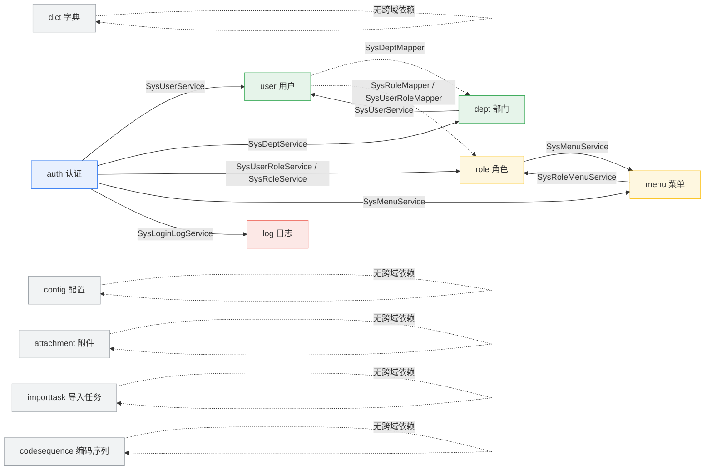

```mermaid
graph LR
    auth[auth 认证]
    user[user 用户]
    role[role 角色]
    menu[menu 菜单]
    dept[dept 部门]
    log[log 日志]
    dict[dict 字典]
    config[config 配置]
    attachment[attachment 附件]
    importtask[importtask 导入任务]
    codesequence[codesequence 编码序列]

    auth -->|SysUserService| user
    auth -->|SysDeptService| dept
    auth -->|SysUserRoleService / SysRoleService| role
    auth -->|SysMenuService| menu
    auth -->|SysLoginLogService| log

    dept -->|SysUserService| user
    menu -->|SysRoleMenuService| role
    role -->|SysMenuService| menu

    user -.->|SysDeptMapper| dept
    user -.->|SysRoleMapper / SysUserRoleMapper| role

    dict -.->|无跨域依赖| dict
    config -.->|无跨域依赖| config
    attachment -.->|无跨域依赖| attachment
    importtask -.->|无跨域依赖| importtask
    codesequence -.->|无跨域依赖| codesequence

    style auth fill:#e8f0fe,stroke:#4285f4
    style user fill:#e6f4ea,stroke:#34a853
    style role fill:#fef7e0,stroke:#fbbc04
    style menu fill:#fef7e0,stroke:#fbbc04
    style dept fill:#e6f4ea,stroke:#34a853
    style log fill:#fce8e6,stroke:#ea4335
    style dict fill:#f1f3f4,stroke:#9aa0a6
    style config fill:#f1f3f4,stroke:#9aa0a6
    style attachment fill:#f1f3f4,stroke:#9aa0a6
    style importtask fill:#f1f3f4,stroke:#9aa0a6
    style codesequence fill:#f1f3f4,stroke:#9aa0a6
```