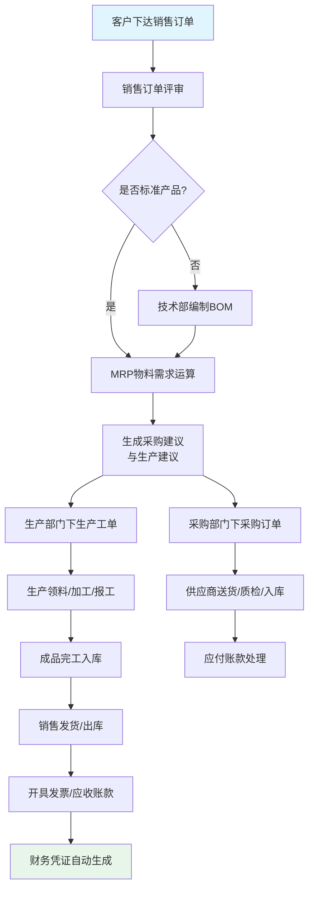
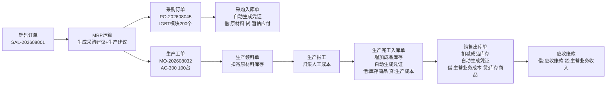

以下是一份**以典型离散制造企业（如电子设备/机械配件制造）为蓝本**的完整ERP开发需求文档，涵盖从销售接单到生产、采购、入库、发货、财务核算的全链路实际业务场景。

---

# 企业资源计划（ERP）系统需求规格说明书

| 文档属性 | 内容 |
|---------|------|
| 文档名称 | 企业资源计划系统产品需求文档 |
| 文档版本 | V1.0 |
| 编写日期 | 2026年8月 |
| 适用范围 | 集团总部、2个生产基地、3个区域销售分公司、4个中心仓库 |
| 项目负责人 | 数字化管理部 |
| 对接干系人 | 各业务部门核心岗位、IT开发团队、财务审计部门 |

**【生效规则】** 本需求文档经所有业务部门负责人签字确认后正式生效，后续所有需求变更均需经变更控制委员会（CCB）评审通过后方可执行。

## 一、项目概述

### 1.1 项目背景

本案企业为一家**按订单生产（MTO）的离散制造型企业**，主营工业自动化控制设备的研发、生产和销售，年产值约3.2亿元，员工约450人。产品种类约200余种，每种产品平均由80~150种零部件组装而成。

**当前存在的核心管理问题：**

1. **信息孤岛严重**：销售部用Excel管理订单，生产部用另一套系统排产，仓库手工记账，财务月底才统一录入，各部门数据口径不一致，经常出现“销售说已发货、仓库说未出库、财务说没开票”的混乱局面。

2. **库存积压与短缺并存**：因缺乏统一的需求计划，原材料采购凭经验，造成A类物料大量积压（呆滞库存占比达18%），而关键芯片等物料却频繁缺货，导致订单延期率高达35%。

3. **成本核算粗放**：无法精确核算每一个生产工单的实际材料成本和人工成本，月底只能按当月总投入除以总产出的方式粗略分摊，产品实际利润率无法准确掌握。

4. **订单进度不可视**：业务员无法实时查询订单的生产进度和预计完工时间，客户催单时只能反复电话询问生产车间。

### 1.2 项目目标

通过建设统一的ERP系统，实现以下核心目标：

1. **业务财务一体化**：所有业务单据（销售订单、采购订单、生产工单、出入库单）自动生成会计凭证，确保财务数据与业务数据实时一致。
2. **供应链全程可视化**：从销售接单→MRP运算→采购/生产→入库→发货→开票收款，全链路可追溯、可查询。
3. **库存精准管控**：实现多仓库、多库位管理，库存准确率≥99.5%，呆滞库存占比降至8%以下。
4. **成本精细核算**：按工单归集材料成本和人工成本，实现产品级实际成本核算。

### 1.3 范围界定

**✅ 纳入本次建设范围：**

| 序号 | 模块 | 说明 |
|------|------|------|
| 1 | 基础数据管理 | 物料、BOM、供应商、客户、组织架构 |
| 2 | 销售管理 | 销售订单→发货单→出库→开票→应收账款 |
| 3 | 采购管理 | 采购申请→订单→收货→质检→入库→应付账款 |
| 4 | 库存管理 | 多仓库/库位、批次追溯、盘点、安全库存预警 |
| 5 | 生产制造管理 | BOM管理、MRP运算、工单管理、领料/报工/入库 |
| 6 | 财务管理 | 总账、应收应付、成本核算、固定资产 |
| 7 | 报表与分析 | 经营仪表盘、销售/采购/库存/生产分析报表 |

**❌ 不在本次建设范围：**
- 客户关系管理（CRM，由独立系统管理）
- 制造执行系统（MES，车间设备层数据采集）
- 产品生命周期管理（PLM，研发图纸管理）
- 电商平台对接

## 二、术语与定义

| 术语 | 定义 |
|------|------|
| **ERP** | 集成企业全链路业务流程、统一主数据标准、实现业务财务数据自动打通的一体化管理系统 |
| **主数据** | 企业核心业务实体的统一基准数据，包括物料、客户、供应商、人员、组织五大类，全集团范围内唯一编码 |
| **BOM（物料清单）** | 产品所有组成零部件、原材料、辅料的层级结构与用量明细，是MRP运算的核心基础数据 |
| **MRP（物料需求计划）** | 根据主生产计划拆解出原材料采购需求和零部件生产需求的自动运算逻辑 |
| **MTO（按订单生产）** | 企业接到客户订单后才组织生产和采购的生产模式 |
| **三单匹配** | 采购业务中，采购订单、入库单、供应商发票三者进行数量与金额的核对校验 |
| **暂估入库** | 货物已入库但发票未到时，按采购订单价格暂估入账的财务处理方式 |
| **先进先出（FIFO）** | 库存出库时按入库先后顺序优先发出先入库的批次 |

## 三、核心业务流程总览

## 四、功能需求详细说明

### 4.1 基础数据管理模块

> **业务场景说明**：基础数据是所有业务模块运行的基石。以物料编码为例，当前企业存在“一物多码”问题——同一个“STM32F103芯片”在采购部编号为IC-001，在仓库编号为WZ-089，在生产部编号为PL-023，导致各部门数据无法关联。本模块统一全集团物料、客户、供应商的编码规则和属性定义。

#### 4.1.1 物料主数据管理

| 需求编号 | 需求名称 | 详细说明 |
|---------|---------|---------|
| MD-01 | 物料编码规则 | 统一编码规则：一级分类（2位）+二级分类（2位）+流水号（6位），如“01-03-000128”代表“电子料-芯片-第128号” |
| MD-02 | 物料基本属性 | 包含：物料编码、物料名称、规格型号、计量单位（个/套/公斤/米等）、物料分类（原材料/半成品/成品/辅料/包装材料）、物料属性（自制/外购/外协）、图号/版本 |
| MD-03 | 物料计划属性 | 包含：采购提前期（天）、生产提前期（天）、安全库存量、最小采购批量、最大库存量、ABC分类（A类高价值/重点管控） |
| MD-04 | 物料财务属性 | 包含：标准成本、计价方法（移动加权平均/先进先出）、默认科目（存货科目、成本科目、收入科目） |
| MD-05 | 物料生命周期 | 支持物料的新建、审核、启用、停用状态管理；停用的物料不允许在新增业务单据中使用 |

#### 4.1.2 BOM（物料清单）管理

> **业务场景说明**：以企业主打产品“AC-300变频器”为例，该产品由1个主控板、1个电源模块、1个机箱外壳、1套连接线束、1个散热风扇及若干紧固件组成。其中主控板又由PCB光板、芯片、电容电阻等子件组成，形成多层BOM结构。

| 需求编号 | 需求名称 | 详细说明 |
|---------|---------|---------|
| BOM-01 | 多层BOM结构 | 支持最多10层的BOM嵌套结构，每个父件可包含多个子件 |
| BOM-02 | 用量与损耗率 | 每个子件需定义：标准用量（如1个成品需要2个某型号电容）、固定损耗率（如贴片损耗按3%计） |
| BOM-03 | 版本管理 | BOM支持版本号管理，每次修改生成新版本，旧版本保留历史记录；生产工单下达时锁定当时生效的BOM版本，后续BOM变更不影响已下达工单 |
| BOM-04 | 替代料管理 | 支持主料+替代料关系，当主料缺货时可自动或手动选用替代料；替代料需指定优先级和替代规则（完全替代/部分替代） |
| BOM-05 | BOM审核流程 | BOM编制→主管审核→生效，未经审核的BOM不能用于MRP运算和生产工单 |
| BOM-06 | BOM反查 | 支持“哪里用到了”功能：输入任一物料，可查询该物料被哪些成品/半成品的BOM所引用 |

#### 4.1.3 客户与供应商主数据

| 需求编号 | 需求名称 | 详细说明 |
|---------|---------|---------|
| CS-01 | 客户管理 | 包含：客户编码、客户名称、统一社会信用代码、联系人、联系方式、收货地址、结算方式（月结30天/60天/款到发货等）、信用额度、信用期限 |
| CS-02 | 供应商管理 | 包含：供应商编码、供应商名称、统一社会信用代码、联系人、联系方式、供货品类、结算方式、付款条件、评级（A/B/C级） |
| CS-03 | 客户/供应商多维分类 | 支持按地区、行业、规模等多维度分类，报表可按任意维度汇总统计 |

### 4.2 销售管理模块

> **业务场景说明**：华东区域客户“申达电气”于2026年8月15日下达一份采购订单：订购AC-300变频器100台，单价1,850元/台（标准售价1,900元，给予批量折扣50元/台），要求交货日期2026年9月30日，分批交货（9月20日交50台，9月30日交50台），结算方式为月结60天。

| 需求编号 | 需求名称 | 详细说明 |
|---------|---------|---------|
| SAL-01 | 销售订单录入 | 支持录入：客户、订单日期、要求交货日期、物料编码、数量、单价、含税/不含税标识、币别、分批交货计划 |
| SAL-02 | 销售订单审核 | 审核时自动校验：客户信用额度是否充足、物料是否存在、单价是否在授权范围内；超信用额度需走特批流程 |
| SAL-03 | 订单执行状态跟踪 | 在销售订单详情页可查看：已出货数量、已出库数量、已开票数量、已收款金额、关联的生产工单号及生产进度 |
| SAL-04 | 销售订单变更 | 支持数量、单价、交期的变更申请与审批，变更前数据完整保留，支持变更前后差异对比 |
| SAL-05 | 销售发货管理 | 根据销售订单生成发货通知单→仓库拣货出库→生成出库单→出库单自动减少库存 |
| SAL-06 | 销售退货管理（RMA） | 支持客户退货全流程：退货申请→质检确认→退货入库→退款/换货处理 |
| SAL-07 | 销售价格管理 | 支持按客户等级、产品品类、订货数量设置不同价格策略；历史售价可查询 |
| SAL-08 | 销售跟单看板 | 业务员可在销售订单页面直接查看对应采购订单（针对外购件）和生产工单（针对自制件）的执行状态 |

### 4.3 采购管理模块

> **业务场景说明**：MRP运算后生成采购建议：为满足AC-300变频器的生产，需采购IGBT模块200个（供应商“宏微科技”，单价85元/个，采购提前期15天）、电解电容400个（供应商“艾华集团”，单价2.3元/个，提前期7天）。采购员据此下达采购订单，货物到达后经质检合格入库，月底供应商开来增值税专用发票，财务进行三单匹配后付款。

| 需求编号 | 需求名称 | 详细说明 |
|---------|---------|---------|
| PUR-01 | 采购申请管理 | 支持MRP自动生成的采购建议自动转为采购申请，也支持手工录入临时采购申请 |
| PUR-02 | 采购订单管理 | 采购订单包含：供应商、采购物料、数量、单价、要求到货日期、交货方式、付款条件；支持采购订单的审核、修改、关闭、取消 |
| PUR-03 | 采购收货与质检 | 货物到厂后生成收货单→通知质检部门检验→检验合格后入库（合格品入良品仓，不合格品入退货仓或隔离仓） |
| PUR-04 | 采购退货 | 支持对不合格品或多余物料的退货处理，退货后冲减库存和应付账款 |
| PUR-05 | 三单匹配 | 采购订单、入库单、供应商发票三者在数量、单价上进行自动匹配校验，匹配不一致时系统预警 |
| PUR-06 | 暂估入库处理 | 货物已入库但发票未到时，按采购订单价格暂估入库；发票到达后红冲暂估并生成正式凭证 |
| PUR-07 | 采购价格管理 | 记录每个供应商、每种物料的最近采购价格和历史价格走势；采购下单时自动提示上次采购价和历史最低价 |
| PUR-08 | 供应商绩效评估 | 按交货准时率、质量合格率、价格水平、服务响应等维度自动评分 |

### 4.4 库存管理模块

> **业务场景说明**：企业共有4个仓库——原材料仓（电子料、结构件分库位存放）、半成品仓、成品仓（苏州中心仓、东莞中心仓）。关键物料如IGBT模块需按批次号管理（用于质量追溯），电解电容需管理生产日期和保质期（3年）。仓库日常业务包括：采购入库、生产领料出库、半成品/成品入库、销售出库、盘点、库位调拨。

| 需求编号 | 需求名称 | 详细说明 |
|---------|---------|---------|
| INV-01 | 多仓库/多库位管理 | 支持定义多仓库、多库位（货架/货位），每个物料可指定默认存放库位 |
| INV-02 | 入库管理 | 支持采购入库、生产完工入库、销售退货入库、调拨入库等多种入库类型；入库时记录批次号、生产日期、有效期 |
| INV-03 | 出库管理 | 支持生产领料出库、销售出库、采购退货出库、调拨出库等；生产领料按工单定额领料，超定额需审批 |
| INV-04 | 批次与序列号追溯 | 关键物料（如IGBT、主控芯片）启用批次管理，记录每批次的供应商、入库日期、质检报告号；支持从成品批次追溯到所用零部件的供应商批次 |
| INV-05 | 保质期管理 | 对有保质期要求的物料（如电解电容、电池）设置有效期，到期前30天自动预警 |
| INV-06 | 库存盘点 | 支持周期盘点（按ABC分类设定盘点频率：A类每月、B类每季度、C类每半年）和全面盘点；盘点差异经审批后自动生成盘盈/盘亏单并调整库存账 |
| INV-07 | 安全库存预警 | 物料库存低于安全库存时自动生成采购建议或预警通知 |
| INV-08 | 呆滞库存分析 | 系统自动识别超过180天未发生出入库的物料，生成呆滞库存报表供管理层决策处理 |
| INV-09 | 库存流水与即时库存 | 每笔出入库业务实时更新库存台账，可查询任意时点的即时库存和任何物料的历史流水 |
| INV-10 | 库位调拨 | 支持仓库内库位间调拨和仓库间调拨，调拨单需审核生效 |

### 4.5 生产制造管理模块

> **业务场景说明**：企业按订单生产（MTO）。接到“申达电气”AC-300变频器100台订单后，MRP运算得出：需要投产AC-300总装100台，进而需要投产主控板组件100套、电源模块100套。主控板组件又需要PCB光板100片、芯片若干。生产部据此下达生产工单，各车间按工序领料、加工、报工，完工后入库。

| 需求编号 | 需求名称 | 详细说明 |
|---------|---------|---------|
| MFG-01 | MRP物料需求运算 | 输入销售订单或主生产计划，系统自动计算：①需要生产什么、生产多少、何时生产；②需要采购什么、采购多少、何时采购。运算逻辑：净需求 = 毛需求 - 现有库存 - 在途采购/在制工单 + 安全库存 |
| MFG-02 | MRP运算参数 | 支持设置：考虑现有库存、考虑在途采购、考虑在制工单、考虑安全库存、考虑采购提前期和生产提前期 |
| MFG-03 | MRP运算结果 | 生成采购建议（物料→建议采购量→建议到货日期）和生产建议（物料→建议生产量→建议开工/完工日期）；建议经人工审核后转为采购订单和生产工单 |
| MFG-04 | 生产工单管理 | 工单包含：工单号、产品物料、计划数量、计划开工日期、计划完工日期、关联销售订单号、BOM版本号；工单状态：计划→已下达→领料中→加工中→已完工→已关闭 |
| MFG-05 | 生产领料 | 根据工单和BOM自动生成定额领料单；领料时扣减原材料库存；超定额领料需审批 |
| MFG-06 | 生产报工 | 各工序完工后在线报工，记录：工单号、工序、完工数量、合格数量、不合格数量、操作人、操作时间 |
| MFG-07 | 生产完工入库 | 工单完工后生成入库单，成品入半成品仓或成品仓，同时扣减工单在制数量 |
| MFG-08 | 工单成本归集 | 每个工单自动归集：直接材料成本（根据实际领料）、直接人工成本（根据报工工时×工时单价）、制造费用（按工时或产量分摊） |
| MFG-09 | 工单进度跟踪 | 在工单详情页可查看：已领料情况、各工序完工进度、合格率、预计剩余工时 |
| MFG-10 | 委外加工管理 | 对于外协工序（如表面处理、PCB贴片），支持委外工单→发外协物料→外协收货→外协费用结算的全流程 |

### 4.6 财务管理模块

> **业务场景说明**：财务部门每月需要进行：①根据所有出入库单据自动生成存货会计凭证；②与供应商对账并安排付款（月结30天）；③与客户对账并催收货款（月结60天）；④月末进行成本核算，计算各产品本月实际成本；⑤出具三大财务报表。

| 需求编号 | 需求名称 | 详细说明 |
|---------|---------|---------|
| FIN-01 | 总账管理 | 支持多账套、多币别、科目体系管理；所有业务单据自动生成会计凭证（如：采购入库自动生成“借：原材料 贷：应付账款-暂估”） |
| FIN-02 | 应收账款管理 | 销售出库/开票后自动生成应收凭证；支持按客户查看应收余额、账龄分析（30天/60天/90天/超90天）、自动催收提醒 |
| FIN-03 | 应付账款管理 | 采购入库/发票校验后自动生成应付凭证；支持按供应商查看应付余额、付款计划、付款申请审批 |
| FIN-04 | 成本核算 | 支持移动加权平均法和月末一次加权平均法；月末自动核算每个产品的实际出库成本和结存成本 |
| FIN-05 | 生产工单成本核算 | 月末将当月所有生产工单的材料成本、人工成本、制造费用归集到对应完工产品，计算产品实际单位成本 |
| FIN-06 | 固定资产管理 | 支持固定资产卡片管理、折旧计提（年限平均法/双倍余额递减法）、资产盘点、报废处理 |
| FIN-07 | 财务报表 | 自动生成：资产负债表、利润表、现金流量表、科目余额表、明细账、总账 |
| FIN-08 | 期末处理 | 支持月末结转、汇兑损益处理、期间关闭控制（关闭后不可修改该期间数据） |

### 4.7 报表与分析模块

> **业务场景说明**：总经理每天早上需要查看经营仪表盘，了解昨日的销售金额、本月累计出货、库存周转率、工单按时完工率等关键指标。销售总监需要查看各区域销售排行和产品毛利分析。采购经理需要查看采购价格走势和供应商绩效。

| 需求编号 | 需求名称 | 详细说明 |
|---------|---------|---------|
| RPT-01 | 经营仪表盘 | 实时展示：今日/本月销售收入、毛利率、库存周转天数、工单按时完工率、应收逾期金额、在途订单金额 |
| RPT-02 | 销售分析报表 | 销售订单执行状况查询（按日期/客户/产品/状态多维度筛选）、销售排行（按客户/产品/业务员）、订单毛利分析、未交订单明细、销售对账单 |
| RPT-03 | 采购分析报表 | 采购订单执行跟踪、采购价格走势分析、供应商交货准时率/合格率统计 |
| RPT-04 | 库存分析报表 | 即时库存查询、库存流水账、库存周转率分析、呆滞库存明细、安全库存预警清单 |
| RPT-05 | 生产分析报表 | 工单完工率统计、工单良品率统计、在制工单明细、工时利用率分析 |
| RPT-06 | 财务分析报表 | 应收账龄分析、应付账龄分析、现金流量预测、产品成本分析表 |
| RPT-07 | 报表导出 | 所有报表支持导出为Excel、PDF格式 |

## 五、非功能需求

| 类别 | 具体要求 |
|------|---------|
| **性能** | 支持并发用户数≥500；关键事务（如销售订单保存、MRP运算）响应时间<3秒；MRP全量运算（涉及约5,000种物料）完成时间<30分钟 |
| **可用性** | 系统7×24小时运行；计划内停机维护每季度不超过1次；故障恢复时间（RTO）≤30分钟 |
| **安全性** | 满足**网络安全等级保护2.0三级**要求；支持字段级数据权限控制（如：销售员只能看自己的客户数据，不能看全公司）；所有操作记录审计日志，至少保存180天 |
| **可扩展性** | 支持未来新增子公司/工厂（多组织架构扩展）；支持中英文切换 |
| **集成性** | 提供标准RESTful API接口；需与现有OA系统（审批流对接）、税控开票系统（发票状态同步）对接 |
| **数据备份** | 每日自动增量备份，每周全量备份；备份数据异地存储 |

## 六、接口需求

| 对接系统 | 集成方式 | 数据流向 | 主要数据内容 |
|---------|---------|---------|-------------|
| OA系统 | RESTful API | 双向 | 采购申请审批、销售订单审批、付款申请审批 |
| 税控开票系统 | API | 税控→ERP | 发票开具状态、发票号码同步 |
| 银企直连 | WebService | ERP→银行 | 付款指令、银行账户余额查询 |
| WMS（后期） | API | 双向 | 库存出入库数据实时同步 |
| 电子发票平台 | API | 双向 | 电子发票开具、红冲、状态查询 |

## 七、数据迁移需求

| 迁移对象 | 数据量预估 | 清洗规则 | 验证方案 |
|---------|-----------|---------|---------|
| 物料主数据 | ~8,000条 | 去重（一物多码合并）、统一编码规则、补全缺失的计划属性和财务属性 | 迁移后核对总条数和关键字段完整率 |
| BOM数据 | ~3,500个BOM | 检查BOM闭环（防止A包含B、B又包含A的死循环）、校验子件用量合理性 | 随机抽取50个BOM与纸质/旧系统逐项比对 |
| 客户主数据 | ~600家 | 统一编码、合并重复客户、校验统一社会信用代码格式 | 与销售部门逐一确认 |
| 供应商主数据 | ~300家 | 统一编码、合并重复供应商 | 与采购部门逐一确认 |
| 未结销售订单 | ~120单 | 仅迁移状态为“未发货”或“部分发货”的订单 | 核对订单总金额与旧系统一致 |
| 未结采购订单 | ~80单 | 仅迁移状态为“未收货”或“部分收货”的订单 | 核对订单总金额与旧系统一致 |
| 即时库存 | 当前时点库存 | 以仓库实际盘点数为准，差异生成盘盈/盘亏单调整 | **迁移后关键数据误差率≤0.1%** |

## 八、实施计划

| 阶段 | 周期 | 主要任务 | 交付物 |
|------|------|---------|--------|
| **需求确认** | 第1-2月 | 需求调研、业务流程梳理、需求文档确认签字 | 《需求规格说明书》（终稿） |
| **系统设计** | 第3-4月 | 架构设计、数据库设计、接口设计、UI/UX设计 | 《概要设计说明书》《详细设计说明书》《接口设计文档》 |
| **开发与单元测试** | 第5-7月 | 编码实现、单元测试、代码审查 | 可部署的软件包、单元测试报告 |
| **集成测试（SIT）** | 第8月 | 端到端业务流程测试（覆盖采购到付款、订单到现金全链路） | 《集成测试报告》、缺陷修复记录 |
| **用户验收测试（UAT）** | 第9月 | 业务部门核心用户按实际业务场景模拟测试 | 《UAT测试报告》、用户签字确认 |
| **数据迁移与上线** | 第10月 | 数据清洗、迁移、验证、系统切换 | 《数据迁移验证报告》《上线确认书》 |
| **上线支持与验收** | 第11-12月 | 上线后驻场支持、问题修复、最终验收 | 《运维手册》《用户操作手册》、终验报告 |

**总实施周期：12个月**

## 九、验收标准

| 序号 | 验收维度 | 验收标准 |
|------|---------|---------|
| 1 | **流程覆盖** | 所有核心业务流程（销售→生产→采购→入库→发货→财务）在UAT中完整测试通过 |
| 2 | **数据一致性** | 迁移后关键数据（库存数量/金额、未结订单金额）误差率≤0.1% |
| 3 | **性能测试** | 500并发用户下系统无崩溃，事务成功率≥99.9% |
| 4 | **接口联调** | 与OA、税控系统的接口联调通过，数据双向传输正常 |
| 5 | **用户签署** | 各业务部门负责人签署《上线确认书》 |

## 十、附录：关键业务场景端到端数据流示例

以下以“申达电气”AC-300变频器100台订单为例，展示数据在各模块间的流转路径：

---

**文档编制**：数字化管理部 & 业务管理部  
**编制日期**：2026年8月  
**文档状态**：待审批

> 📌 **使用说明**：本文档为需求基线版本，所有需求变更需通过变更控制委员会（CCB）评审批准。技术方案设计需完全覆盖本文档标明的所有需求项。